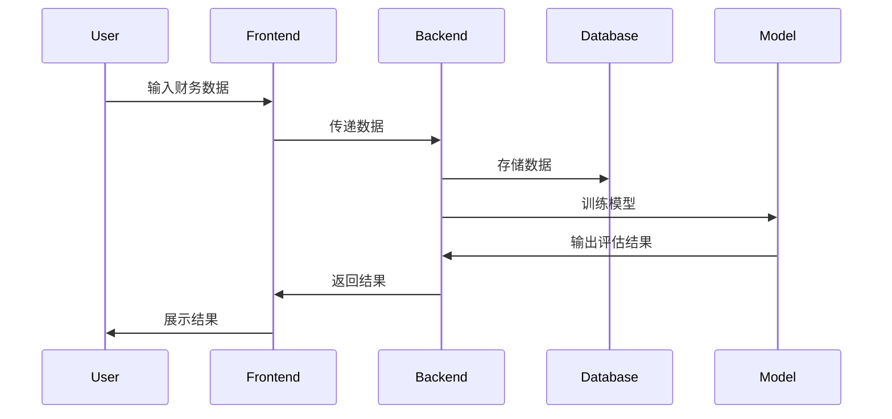

                 

# AI驱动的个人财务韧性评估与增强系统

## 关键词

AI，财务韧性，评估系统，数据挖掘，机器学习，算法优化

## 摘要

本文将深入探讨AI驱动的个人财务韧性评估与增强系统。首先，我们介绍了个人财务韧性的概念、重要性及其发展现状。接着，我们阐述了AI技术在财务韧性评估中的应用及其优势。在此基础上，文章详细讲解了如何构建一个AI驱动的评估系统，包括系统需求分析、技术选型、数据处理、模型训练等。此外，文章通过具体案例展示了系统的应用场景和实际效果。最后，我们对系统的优化方向和未来发展进行了展望，为个人财务管理的智能化提供了新的思路和方法。

## 目录大纲设计思路

在设计《AI驱动的个人财务韧性评估与增强系统》的目录大纲时，我们注重逻辑清晰、结构紧凑，旨在帮助读者循序渐进地了解并掌握相关知识和技能。以下是具体的目录大纲设计思路：

1. **引言部分**：简要介绍书籍的背景、目的和重要性，吸引读者的兴趣。
2. **背景介绍**：详细解释个人财务韧性的概念、重要性及发展现状，为后续内容铺垫。
3. **核心概念与联系**：定义并阐述与财务韧性相关的核心概念，绘制概念关系图，帮助读者建立知识框架。
4. **AI在财务韧性评估中的应用**：探讨AI技术在个人财务韧性评估中的作用和优势。
5. **评估系统的构建与实现**：详细讲解如何构建一个AI驱动的评估系统，包括技术选型、数据处理、模型训练等。
6. **系统应用与案例分析**：介绍系统的实际应用场景，分析案例，阐述评估结果及改进措施。
7. **优化与展望**：探讨如何进一步优化系统，展望未来发展趋势。

### 引言

### 1. 引言

#### 1.1 书籍目的与读者对象

本书旨在深入探讨AI技术在个人财务韧性评估与增强领域的应用。我们希望本书能够为金融科技从业者、研究人员以及个人投资者提供有价值的参考和指导。

#### 1.2 个人财务韧性的重要性

个人财务韧性是指个人在面对财务危机时，能够快速适应和恢复的能力。随着经济全球化和金融市场的不确定性增加，个人财务韧性已成为一个关键议题。提高个人财务韧性不仅能够帮助个人应对财务风险，还能够提升整个社会的经济稳定性。

#### 1.3 AI技术在财务韧性评估中的应用前景

人工智能技术在数据挖掘、模式识别和预测分析等方面具有显著优势，能够为个人财务韧性评估提供强大的支持。通过AI驱动的财务韧性评估系统，可以实现对个人财务状况的实时监测和动态调整，为个人财务管理提供科学依据。

### 背景介绍

### 2. 财务韧性的概念与发展

#### 2.1 财务韧性的定义与特征

财务韧性是指个人或组织在面临财务压力时，能够保持稳定运营并快速恢复的能力。它包括以下几个方面：

- **弹性**：在遭受财务冲击时，能够迅速调整业务策略以减少损失。
- **灵活性**：能够快速适应外部环境变化，调整财务策略以保持竞争优势。
- **持久性**：在经历财务困境后，能够迅速恢复并重返正常运营。

#### 2.2 财务韧性的重要性

财务韧性对于个人和企业来说至关重要。对于个人，拥有良好的财务韧性意味着在面对失业、疾病或投资损失等突发情况时，能够维持基本生活质量和财务安全。对于企业，财务韧性意味着能够在市场波动和竞争压力下保持生存和发展。

#### 2.3 个人财务韧性现状分析

当前，个人财务韧性面临诸多挑战。一方面，全球经济的波动和不确定性增加，个人财务风险不断上升；另一方面，金融知识的普及程度有限，许多个人缺乏有效的财务规划和风险管理能力。

#### 2.4 财务韧性研究的发展趋势

随着人工智能和大数据技术的不断发展，财务韧性评估的方法和工具也在不断创新。未来，AI驱动的财务韧性评估系统有望成为个人财务管理的标准配置，为个人提供更精准、更高效的财务建议和服务。

### 核心概念与联系

#### 3.1 财务健康指标

财务健康指标是评估个人财务韧性的重要工具。以下是一些常见的财务健康指标：

- **流动性比率**：反映个人短期偿债能力，计算公式为（流动资产/流动负债）。
- **负债比率**：反映个人负债水平，计算公式为（总负债/总资产）。
- **资产报酬率**：反映个人资产的盈利能力，计算公式为（净利润/总资产）。

#### 3.2 概念关系图

为了更好地理解财务健康指标之间的关联，我们可以绘制以下概念关系图：

```mermaid
graph TB
A[财务健康指标]
B[流动性比率]
C[负债比率]
D[资产报酬率]
A--→B
A--→C
A--→D
```

#### 3.3 财务韧性评估模型

财务韧性评估模型是利用数学模型和算法对个人财务健康指标进行综合分析，以评估个人财务韧性。常见的评估模型包括：

- **回归模型**：通过建立财务健康指标与财务韧性之间的线性关系进行评估。
- **神经网络模型**：通过多层神经网络模拟财务健康指标之间的复杂关系。

### AI在财务韧性评估中的应用

#### 4.1 AI技术在财务分析中的应用

AI技术在财务分析中的应用已经得到广泛认可。以下是一些典型的应用场景：

- **财务报表分析**：利用自然语言处理技术，自动提取和解读财务报表信息。
- **异常检测**：通过机器学习算法，识别潜在的财务风险和欺诈行为。
- **财务预测**：利用时间序列分析和深度学习技术，预测未来的财务状况。

#### 4.2 AI在财务预测中的应用

财务预测是财务韧性评估的重要环节。以下是一些AI技术在财务预测中的应用：

- **时间序列预测**：利用时间序列分析方法，预测未来的财务指标。
- **回归分析**：利用回归分析方法，建立财务指标与财务预测结果之间的模型。
- **深度学习**：利用深度学习算法，对复杂财务数据进行预测。

#### 4.3 财务韧性评估中的AI算法选择

在财务韧性评估中，选择合适的AI算法至关重要。以下是一些常见的AI算法及其特点：

- **回归算法**：简单易用，适合线性关系较强的数据。
- **决策树算法**：直观易懂，适合分类和回归问题。
- **神经网络算法**：强大且灵活，适合处理复杂数据和模式。

#### 4.4 AI驱动财务韧性评估的优势

AI驱动财务韧性评估具有以下优势：

- **高效性**：AI算法能够快速处理海量数据，提供实时评估结果。
- **准确性**：AI算法能够识别复杂的财务关系，提高评估准确性。
- **适应性**：AI算法能够根据不同场景和需求进行自适应调整，提高评估效果。

### 评估系统的构建与实现

#### 5.1 系统需求分析

构建一个AI驱动的个人财务韧性评估系统，需要考虑以下需求：

- **数据收集与处理**：收集个人财务数据，并进行预处理和清洗。
- **模型选择与训练**：选择合适的AI算法，进行模型训练和优化。
- **评估结果输出**：将评估结果以可视化形式展示，提供个性化的财务建议。

#### 5.2 技术选型与架构设计

在技术选型方面，我们采用了以下架构：

- **前端**：使用Vue.js框架搭建用户界面，提供数据输入和结果展示。
- **后端**：使用Flask框架搭建API接口，实现数据收集、处理和模型调用。
- **数据库**：使用MySQL数据库存储个人财务数据。

架构设计如下：



#### 5.3 数据处理与预处理

数据处理与预处理是构建评估系统的重要环节。以下是一些关键步骤：

- **数据收集**：从个人财务账户、投资记录等渠道收集财务数据。
- **数据清洗**：去除重复、缺失和异常数据，确保数据质量。
- **数据归一化**：将不同数据类型的数值转换为同一尺度，方便后续处理。
- **特征提取**：从原始数据中提取关键特征，用于模型训练。

#### 5.4 模型选择与训练

在模型选择方面，我们采用了以下方法：

- **回归模型**：用于预测个人财务状况的总体趋势。
- **分类模型**：用于分类个人财务状况的类别。
- **深度学习模型**：用于处理复杂的数据结构和模式。

模型训练过程如下：

- **数据集划分**：将数据集划分为训练集、验证集和测试集。
- **模型训练**：使用训练集对模型进行训练，调整模型参数。
- **模型评估**：使用验证集和测试集评估模型性能，选择最优模型。

#### 5.5 系统实现与测试

系统实现过程包括以下步骤：

- **前端实现**：使用Vue.js框架实现用户界面，包括数据输入、结果展示和交互功能。
- **后端实现**：使用Flask框架实现API接口，包括数据收集、处理和模型调用。
- **数据库实现**：使用MySQL数据库存储个人财务数据。

系统测试过程如下：

- **单元测试**：对系统中的各个模块进行单元测试，确保功能正确。
- **集成测试**：对系统整体进行集成测试，确保模块之间协同工作。
- **性能测试**：对系统性能进行测试，确保能够处理大量数据。

### 系统应用与案例分析

#### 6.1 系统应用场景介绍

AI驱动的个人财务韧性评估系统可以应用于以下场景：

- **个人财务规划**：帮助个人制定合理的财务规划，提高财务韧性。
- **风险管理**：识别潜在财务风险，提供风险预警和应对策略。
- **投资决策**：为个人提供投资建议，优化资产配置，提高收益。

#### 6.2 案例一：个人财务韧性评估实践

**案例背景**：张先生是一位年轻的职场新人，刚刚步入社会，面临着财务规划和个人发展的双重压力。他希望通过AI驱动的个人财务韧性评估系统，对自己的财务状况进行评估，并制定出合理的财务规划。

**数据来源与处理**：张先生提供了自己的财务数据，包括工资收入、支出、投资收益等。我们将这些数据进行了预处理，包括数据清洗、归一化和特征提取。

**评估结果分析**：

- **财务健康状况**：根据流动性比率、负债比率等指标，评估张先生的财务健康状况。
- **风险评估**：识别张先生面临的潜在财务风险，如失业、疾病等。
- **财务建议**：根据评估结果，为张先生提供个性化的财务建议，如增加储蓄、优化投资组合等。

**改进措施建议**：

- **风险评估模型优化**：通过增加更多风险指标，提高风险评估的准确性。
- **财务建议个性化**：根据张先生的个人特点和需求，提供更具针对性的财务建议。

#### 6.3 案例二：企业员工财务韧性评估

**案例背景**：某企业希望了解员工的财务状况，以提高员工的财务韧性，从而提高整体企业的竞争力。

**数据采集与处理**：企业通过问卷调查、财务报表等渠道，收集员工的财务数据。我们将这些数据进行了预处理，包括数据清洗、归一化和特征提取。

**评估结果与应用**：

- **财务健康状况**：根据流动性比率、负债比率等指标，评估员工的财务健康状况。
- **风险预警**：识别员工面临的潜在财务风险，如债务违约、投资亏损等。
- **企业反馈与调整**：根据评估结果，企业提供财务培训和咨询服务，帮助员工提高财务素养。

**改进措施建议**：

- **风险评估模型优化**：通过增加更多风险指标，提高风险评估的准确性。
- **财务建议个性化**：根据不同员工的财务状况和需求，提供更具针对性的财务建议。

### 优化与展望

#### 7.1 系统优化方向

为了进一步提高AI驱动的个人财务韧性评估系统的性能和效果，我们可以考虑以下优化方向：

- **模型优化**：采用更先进的机器学习算法，提高评估模型的准确性和效率。
- **数据扩展**：增加更多类型的财务数据，提高模型的泛化能力。
- **用户体验**：优化用户界面，提高系统的易用性和用户体验。

#### 7.2 未来发展趋势

随着人工智能和大数据技术的不断发展，AI驱动的个人财务韧性评估系统有望在以下方面取得突破：

- **智能化**：利用深度学习和自然语言处理技术，实现更智能的财务分析和预测。
- **个性化**：根据个人特点和需求，提供更精准、更个性化的财务建议和服务。
- **协同性**：与企业、金融机构等合作，提供全方位的财务解决方案。

### 小结

本文详细探讨了AI驱动的个人财务韧性评估与增强系统。通过对个人财务韧性的概念、重要性及其评估方法的深入分析，我们了解了AI技术在财务韧性评估中的应用前景和优势。通过具体案例，我们展示了系统的实际应用效果，并提出了改进措施和建议。未来，随着人工智能技术的不断进步，AI驱动的个人财务韧性评估系统有望为个人财务管理带来更多创新和突破。

### 作者

作者：AI天才研究院/AI Genius Institute & 禅与计算机程序设计艺术 /Zen And The Art of Computer Programming

