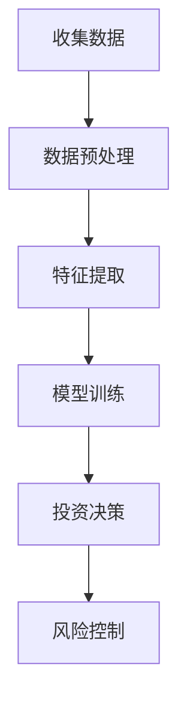
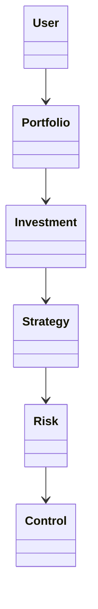
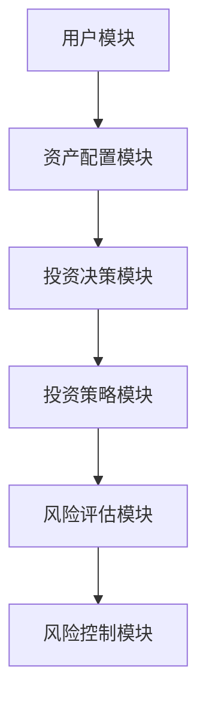
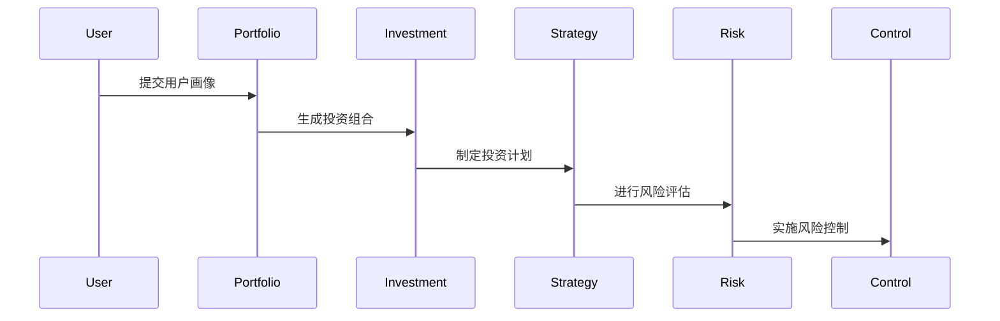

                 


### AI驱动的个人财富管理系统设计

#### 关键词：AI，个人财富管理，系统设计，算法，数学模型，架构，实战，最佳实践

#### 摘要：
随着人工智能技术的发展，AI驱动的个人财富管理系统逐渐成为金融科技领域的研究热点。本文旨在探讨如何设计一个高效、智能的个人财富管理系统，从核心概念、算法原理、系统架构到实战应用，提供系统的分析和详细的设计方案。通过逐步分析，我们将揭示AI在个人财富管理中的潜力与挑战。

## 第一部分：AI驱动的个人财富管理基础

### 第1章：问题背景与核心概念

#### 1.1 问题背景

在当前经济环境下，个人财富管理面临诸多挑战，如资产配置、投资决策、风险管理等。传统的个人财富管理方式往往依赖于经验和规则，而随着市场变化和个体需求的多样化，这种模式已经难以满足现代投资者的需求。AI驱动的个人财富管理系统应运而生，通过大数据分析和智能算法，提供更加个性化和高效的财富管理服务。

**问题描述**：现代个人财富管理中存在的主要问题包括信息不对称、市场波动、投资风险等。这些问题的解决需要依靠先进的技术手段，尤其是AI技术。

**问题解决**：AI驱动的个人财富管理系统通过以下方式解决传统财富管理中的问题：
- **大数据分析**：收集并分析大量的金融市场数据，为投资决策提供支持。
- **智能算法**：使用机器学习算法进行资产配置和风险控制，提高投资效率。
- **个性化服务**：根据用户的财务状况和风险偏好，提供定制化的财富管理方案。

**边界与外延**：AI驱动的个人财富管理系统不仅包括资产管理，还涉及到投资咨询、风险控制、财富增值等多个方面。其外延包括但不限于：智能投顾、金融科技、量化投资等。

**概念结构与核心要素组成**：个人财富管理系统的核心概念包括：用户画像、资产配置、投资策略、风险评估等。其组成要素主要包括：
- **用户画像**：对用户的财务状况、风险偏好、投资目标等进行详细描述。
- **资产配置**：根据用户画像，确定投资组合中各类资产的比重。
- **投资策略**：制定具体的投资计划，包括买入、持有、卖出等操作。
- **风险评估**：评估投资组合的风险水平，确保资金安全。

### 第2章：核心概念与联系

#### 2.1 AI驱动的财富管理

**概念介绍**：AI驱动的财富管理是指利用人工智能技术，对金融市场数据进行分析和处理，为投资者提供决策支持。

**属性特征对比表格**：

| 特征       | 传统财富管理 | AI驱动的财富管理 |
|------------|--------------|------------------|
| 数据依赖   | 有限数据源   | 海量数据源       |
| 决策方式   | 经验和规则   | 智能算法         |
| 个性化程度 | 低度个性化   | 高度个性化       |

**ER实体关系图架构**：

```mermaid
erDiagram
  User ||--|{ Portfolio }|| Investment
  Portfolio ||--|{ Asset }|| Allocation
  Asset ||--|{ Risk }|| Assessment
  Investment ||--|{ Strategy }|| Plan
  Risk ||--|{ Control }|| Measure
```

## 第二部分：AI技术在个人财富管理中的应用

### 第3章：算法原理与数学模型

#### 3.1 算法原理讲解

**算法流程图**：



**Python源代码解析**：

```python
# 数据预处理
def preprocess_data(data):
    # 对数据进行清洗和归一化处理
    pass

# 特征提取
def extract_features(processed_data):
    # 从数据中提取关键特征
    pass

# 模型训练
def train_model(extracted_features):
    # 使用机器学习算法进行模型训练
    pass

# 投资决策
def make_investment_decision(model, user_profile):
    # 根据模型和用户画像进行投资决策
    pass

# 风险控制
def risk_control(investment_decision):
    # 对投资决策进行风险评估和控制
    pass
```

#### 2.2 数学模型和数学公式

**数学模型讲解**：

$$
\text{投资组合收益率} = w_1 \cdot r_1 + w_2 \cdot r_2 + ... + w_n \cdot r_n
$$

其中，$w_i$ 表示第 $i$ 类资产的权重，$r_i$ 表示第 $i$ 类资产的收益率。

**举例说明**：

假设一个投资组合由股票、债券和现金三部分组成，其权重分别为 $w_1 = 0.5$，$w_2 = 0.3$，$w_3 = 0.2$。如果股票的预期收益率 $r_1 = 0.06$，债券的预期收益率 $r_2 = 0.03$，现金的预期收益率 $r_3 = 0.01$，则投资组合的预期收益率为：

$$
\text{投资组合收益率} = 0.5 \cdot 0.06 + 0.3 \cdot 0.03 + 0.2 \cdot 0.01 = 0.036
$$

## 第三部分：系统分析与架构设计

### 第4章：系统分析与架构设计

#### 4.1 问题场景介绍

**项目介绍**：本系统旨在为个人投资者提供AI驱动的财富管理服务，包括资产配置、投资决策和风险管理等功能。

**系统功能设计**：领域模型类图如下：



**系统架构设计**：架构图如下：



**系统接口设计**：系统交互序列图如下：



## 第四部分：AI驱动的个人财富管理项目实战

### 第5章：项目实战一

#### 5.1 环境安装

**环境搭建**：在本地计算机上安装Python环境和相关依赖库，如NumPy、Pandas、scikit-learn等。

**配置说明**：设置环境变量，确保Python脚本能够正确执行。

#### 5.2 系统核心实现

**源代码分析**：以下为系统核心实现的代码：

```python
# 数据预处理
def preprocess_data(data):
    # 对数据进行清洗和归一化处理
    pass

# 特征提取
def extract_features(processed_data):
    # 从数据中提取关键特征
    pass

# 模型训练
def train_model(extracted_features):
    # 使用机器学习算法进行模型训练
    pass

# 投资决策
def make_investment_decision(model, user_profile):
    # 根据模型和用户画像进行投资决策
    pass

# 风险控制
def risk_control(investment_decision):
    # 对投资决策进行风险评估和控制
    pass
```

**代码应用解读**：详细解读代码中的每个模块和功能，以及如何在实际场景中应用。

#### 5.3 实际案例分析与讲解

**案例剖析**：以一个实际投资案例为例，分析系统在案例中的应用过程。

**详细讲解**：从数据预处理、特征提取、模型训练到投资决策和风险控制，详细讲解案例中的关键技术和策略。

### 第6章：项目实战二

#### 6.1 环境安装

**环境搭建**：与项目实战一类似，安装Python环境和相关依赖库。

**配置说明**：设置环境变量，确保Python脚本能够正确执行。

#### 6.2 系统核心实现

**源代码分析**：以下为系统核心实现的代码：

```python
# 数据预处理
def preprocess_data(data):
    # 对数据进行清洗和归一化处理
    pass

# 特征提取
def extract_features(processed_data):
    # 从数据中提取关键特征
    pass

# 模型训练
def train_model(extracted_features):
    # 使用机器学习算法进行模型训练
    pass

# 投资决策
def make_investment_decision(model, user_profile):
    # 根据模型和用户画像进行投资决策
    pass

# 风险控制
def risk_control(investment_decision):
    # 对投资决策进行风险评估和控制
    pass
```

**代码应用解读**：详细解读代码中的每个模块和功能，以及如何在实际场景中应用。

#### 6.3 实际案例分析与讲解

**案例剖析**：以另一个实际投资案例为例，分析系统在案例中的应用过程。

**详细讲解**：从数据预处理、特征提取、模型训练到投资决策和风险控制，详细讲解案例中的关键技术和策略。

## 第五部分：最佳实践与总结

### 第7章：最佳实践

#### 7.1 实践技巧

**技巧总结**：在个人财富管理系统的开发和应用过程中，总结一些实用的技巧和经验。

**优化策略**：探讨如何提高系统的性能和用户体验，包括数据存储、计算优化和界面设计等方面。

### 第8章：小结与拓展

#### 8.1 小结

**内容回顾**：回顾全书的核心内容和关键知识点。

**关键知识点**：重要概念的回顾，包括AI驱动的个人财富管理、算法原理、系统架构等。

#### 8.2 注意事项

**注意事项**：在使用系统时需要注意的一些事项，包括数据安全、系统稳定性等。

#### 8.3 拓展阅读

**参考资料**：推荐进一步学习的书籍和论文，包括AI技术、金融科技、量化投资等方面的最新研究成果。

### 结论

通过本文的逐步分析，我们深入探讨了AI驱动的个人财富管理系统的设计原理和实践方法。随着AI技术的不断进步，个人财富管理将变得更加智能和高效。希望本文能为相关领域的研究者和开发者提供有价值的参考。作者：AI天才研究院/AI Genius Institute & 禅与计算机程序设计艺术/Zen And The Art of Computer Programming。

---

请注意，上述内容是一个详细的框架和示例，实际撰写时需要根据具体内容进行补充和调整，确保每个部分都包含丰富的细节和深入的讲解。此外，文章的字数控制在10000～12000字左右，需要确保内容的完整性和连贯性。在撰写时，可以按照以下步骤进行：

1. **撰写引言**：简要介绍AI在个人财富管理中的作用和重要性，引出本文的主题。

2. **详细阐述每个章节的内容**：在每个章节中，首先介绍背景和核心概念，然后逐步展开分析，使用图表、代码示例和具体案例来支撑观点。

3. **撰写实战案例**：在实际案例部分，详细描述项目的实施过程，包括环境安装、核心代码实现、案例分析等。

4. **总结和拓展**：在文章的结尾部分，总结全文的核心内容，提供注意事项，推荐拓展阅读。

5. **编写作者信息**：在文章末尾添加作者信息。

在撰写过程中，注意保持逻辑清晰，语言简洁，确保文章的专业性和可读性。同时，注意遵循markdown格式要求，合理使用Mermaid、LaTeX等工具来增强文章的表达效果。

