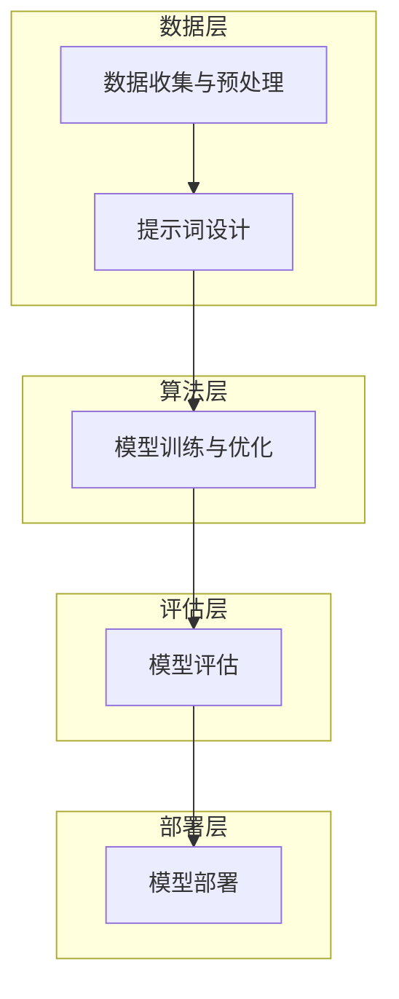
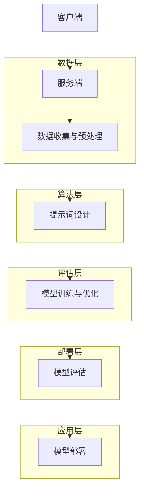
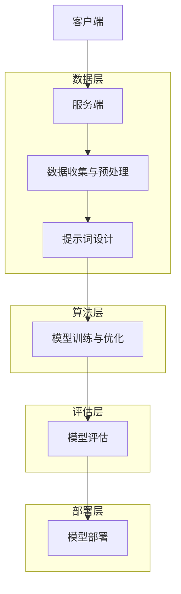

                 

# AI驱动的个性化医疗中的提示词设计

## 关键词
- 个性化医疗
- 提示词设计
- 深度学习
- 算法优化
- 医疗数据

## 摘要
本文探讨了AI驱动的个性化医疗中的提示词设计。通过分析个性化医疗的核心概念和提示词设计原理，本文提出了一个基于数据驱动的提示词设计方法。本文首先介绍了个性化医疗和提示词设计的背景和核心概念，然后详细阐述了提示词设计的原理和属性特征，最后通过一个具体的案例，展示了如何使用提示词设计来优化AI模型在个性化医疗中的应用效果。

## 第一部分：背景介绍

### 第1章：问题背景与核心概念

#### 1.1.1 问题背景
个性化医疗是近年来随着人工智能技术的发展而兴起的一个领域。它利用人工智能，特别是深度学习算法，对患者进行精准的诊疗，从而实现医疗服务的个性化。而提示词设计是AI驱动的个性化医疗中至关重要的一环，它能够提高算法的精准度和效果。

#### 1.1.2 核心概念
- **个性化医疗**：个性化医疗是指利用人工智能技术，根据患者的个体差异提供定制化的医疗服务。这包括对患者的病史、基因、生活习惯等数据的收集和分析，以及基于这些数据提供的个性化诊断和治疗方案。
- **提示词设计**：提示词设计是指为深度学习模型提供明确的指导，帮助模型更好地理解和处理医疗数据。提示词可以是具体的特征，也可以是问题的表述，目的是让模型能够更加精准地识别和处理医疗数据。

#### 1.1.3 问题解决
本章节将探讨如何设计有效的提示词，以提升AI在个性化医疗中的应用效果。通过对大量医疗数据的分析和处理，设计出能够反映患者个体差异的提示词，从而提高算法的诊断准确性。

#### 1.1.4 边界与外延
本章节主要关注AI驱动的个性化医疗中的提示词设计，包括但不限于疾病的诊断、治疗方案推荐、疾病预测等方面。同时，也会涉及到相关技术的最新进展和实际应用。

#### 1.1.5 概念结构与核心要素组成
##### 1.1.5.1 概念结构
- **数据收集与预处理**：收集患者的临床数据，包括病史、检查报告、基因信息等，并进行数据清洗和预处理。
- **提示词设计**：基于数据特点，设计出能够反映患者个体差异的提示词。
- **模型训练与优化**：使用设计好的提示词对AI模型进行训练，并优化模型参数。

##### 1.1.5.2 核心要素
- **数据质量**：高质量的数据是设计有效提示词的基础。
- **算法选择**：选择适合的算法进行模型训练，例如深度学习、强化学习等。
- **模型评估**：通过交叉验证、A/B测试等方法评估模型性能。

### 第2章：核心概念原理与属性特征

#### 2.1.1 个性化医疗原理
个性化医疗的核心在于根据患者的个体差异提供精准的医疗服务。这涉及到对患者数据的全面收集、分析和处理，以及基于这些数据的决策支持。

#### 2.1.2 提示词设计原理
提示词设计旨在为AI算法提供明确的指导，帮助算法更好地理解和处理医疗数据。有效的提示词能够提高算法的诊断准确性，从而实现个性化医疗。

#### 2.1.3 个性化医疗与提示词设计的联系
个性化医疗与提示词设计密切相关。提示词设计是实施个性化医疗的关键步骤，它决定了AI算法在处理医疗数据时的效果和准确性。

#### 2.1.4 核心概念属性特征对比表格
| 核心概念       | 属性特征                       | 对比说明                           |
|--------------|-------------------------------|-----------------------------------|
| 个性化医疗     | 精准、定制、高效           | 强调个体差异，提供个性化服务       |
| 提示词设计     | 明确、指导、优化           | 提高算法理解数据的能力，提升诊断准确性 |
| 数据收集与预处理 | 完备、准确、及时           | 确保数据质量，为后续分析提供基础   |
| 算法选择       | 适用、高效、可扩展         | 选择合适的算法，提高模型性能       |
| 模型评估       | 全面、客观、可重复         | 评估模型性能，指导模型优化       |

#### 2.1.5 ER实体关系图架构
```mermaid
erDiagram
  Patient ||--|{ Diagnosis }|| Diagnosis
  Patient ||--|{ Treatment }|| Treatment
  Diagnosis ||--|{ TestResult }|| TestResult
  Diagnosis ||--|{ DrugPrescription }|| DrugPrescription
```

### 第3章：AI算法在个性化医疗中的应用

#### 3.1.1 AI算法在个性化医疗中的应用概述
AI算法在个性化医疗中的应用涵盖了从疾病预测到治疗方案推荐等多个方面。深度学习算法由于其强大的建模能力和自适应能力，成为了个性化医疗中最为重要的工具之一。

#### 3.1.2 深度学习算法在个性化医疗中的应用
深度学习算法通过学习大量的医疗数据，可以自动提取出有用的特征，从而实现疾病的预测和诊断。常用的深度学习算法包括卷积神经网络（CNN）、循环神经网络（RNN）和Transformer等。

#### 3.1.3 提示词设计在深度学习算法中的应用
提示词设计是深度学习算法在个性化医疗中应用的关键。通过设计有效的提示词，可以显著提高算法的诊断准确性和效率。

## 第二部分：核心概念与联系

### 第2章：核心概念原理与属性特征

#### 2.1.1 个性化医疗原理
个性化医疗的核心在于根据患者的个体差异提供精准的医疗服务。这涉及到对患者数据的全面收集、分析和处理，以及基于这些数据的决策支持。

#### 2.1.2 提示词设计原理
提示词设计旨在为AI算法提供明确的指导，帮助算法更好地理解和处理医疗数据。有效的提示词能够提高算法的诊断准确性，从而实现个性化医疗。

#### 2.1.3 个性化医疗与提示词设计的联系
个性化医疗与提示词设计密切相关。提示词设计是实施个性化医疗的关键步骤，它决定了AI算法在处理医疗数据时的效果和准确性。

#### 2.1.4 核心概念属性特征对比表格
| 核心概念       | 属性特征                       | 对比说明                           |
|--------------|-------------------------------|-----------------------------------|
| 个性化医疗     | 精准、定制、高效           | 强调个体差异，提供个性化服务       |
| 提示词设计     | 明确、指导、优化           | 提高算法理解数据的能力，提升诊断准确性 |
| 数据收集与预处理 | 完备、准确、及时           | 确保数据质量，为后续分析提供基础   |
| 算法选择       | 适用、高效、可扩展         | 选择合适的算法，提高模型性能       |
| 模型评估       | 全面、客观、可重复         | 评估模型性能，指导模型优化       |

#### 2.1.5 ER实体关系图架构
```mermaid
erDiagram
  Patient ||--|{ Diagnosis }|| Diagnosis
  Patient ||--|{ Treatment }|| Treatment
  Diagnosis ||--|{ TestResult }|| TestResult
  Diagnosis ||--|{ DrugPrescription }|| DrugPrescription
```

### 第3章：AI算法在个性化医疗中的应用

#### 3.1.1 AI算法在个性化医疗中的应用概述
AI算法在个性化医疗中的应用涵盖了从疾病预测到治疗方案推荐等多个方面。深度学习算法由于其强大的建模能力和自适应能力，成为了个性化医疗中最为重要的工具之一。

#### 3.1.2 深度学习算法在个性化医疗中的应用
深度学习算法通过学习大量的医疗数据，可以自动提取出有用的特征，从而实现疾病的预测和诊断。常用的深度学习算法包括卷积神经网络（CNN）、循环神经网络（RNN）和Transformer等。

#### 3.1.3 提示词设计在深度学习算法中的应用
提示词设计是深度学习算法在个性化医疗中应用的关键。通过设计有效的提示词，可以显著提高算法的诊断准确性和效率。

## 第三部分：算法原理讲解

### 第3章：AI算法在个性化医疗中的应用

#### 3.1.1 AI算法在个性化医疗中的应用概述
AI算法在个性化医疗中的应用涵盖了从疾病预测到治疗方案推荐等多个方面。深度学习算法由于其强大的建模能力和自适应能力，成为了个性化医疗中最为重要的工具之一。

#### 3.1.2 深度学习算法在个性化医疗中的应用
深度学习算法通过学习大量的医疗数据，可以自动提取出有用的特征，从而实现疾病的预测和诊断。常用的深度学习算法包括卷积神经网络（CNN）、循环神经网络（RNN）和Transformer等。

#### 3.1.3 提示词设计在深度学习算法中的应用
提示词设计是深度学习算法在个性化医疗中应用的关键。通过设计有效的提示词，可以显著提高算法的诊断准确性和效率。

### 3.2.1 卷积神经网络（CNN）在个性化医疗中的应用

#### 3.2.1.1 CNN的基本原理
卷积神经网络（CNN）是一种特殊的神经网络，它通过卷积层对输入数据进行特征提取，从而实现图像、语音等数据的处理。CNN的基本结构包括输入层、卷积层、激活函数、池化层和全连接层。

#### 3.2.1.2 CNN在个性化医疗中的应用
在个性化医疗中，CNN可以用于疾病的预测和诊断。例如，可以使用CNN对医疗图像进行分析，从而实现对疾病的预测。具体应用包括肺癌的早期诊断、乳腺癌的诊断等。

#### 3.2.1.3 CNN的提示词设计
在CNN中，提示词可以通过卷积核的设计来实现。卷积核的大小、形状和参数决定了CNN对输入数据的特征提取能力。有效的卷积核设计可以提高CNN的诊断准确性。

### 3.2.2 循环神经网络（RNN）在个性化医疗中的应用

#### 3.2.2.1 RNN的基本原理
循环神经网络（RNN）是一种能够处理序列数据的神经网络，它的核心思想是将当前的状态与之前的所有状态进行连接，从而实现对序列数据的建模。RNN的基本结构包括输入层、隐藏层和输出层。

#### 3.2.2.2 RNN在个性化医疗中的应用
在个性化医疗中，RNN可以用于疾病的预测和治疗方案推荐。例如，可以使用RNN对患者的病史进行分析，从而实现对疾病的预测。具体应用包括糖尿病的预测、心脏病的风险评估等。

#### 3.2.2.3 RNN的提示词设计
在RNN中，提示词可以通过隐藏层的设计来实现。隐藏层的参数和连接方式决定了RNN对输入序列的特征提取能力。有效的隐藏层设计可以提高RNN的诊断准确性。

### 3.2.3 Transformer在个性化医疗中的应用

#### 3.2.3.1 Transformer的基本原理
Transformer是一种基于自注意力机制的深度学习模型，它通过计算输入序列中每个元素之间的关系来实现序列数据的建模。Transformer的基本结构包括多头自注意力机制、前馈神经网络和编码器-解码器结构。

#### 3.2.3.2 Transformer在个性化医疗中的应用
在个性化医疗中，Transformer可以用于疾病的预测和治疗方案推荐。例如，可以使用Transformer对患者的医疗记录进行分析，从而实现对疾病的预测。具体应用包括癌症的早期诊断、疾病风险的评估等。

#### 3.2.3.3 Transformer的提示词设计
在Transformer中，提示词可以通过多头自注意力机制的设计来实现。多头自注意力机制的不同头数和连接方式决定了Transformer对输入序列的特征提取能力。有效的多头自注意力机制设计可以提高Transformer的诊断准确性。

### 3.2.4 提示词设计对算法性能的影响

#### 3.2.4.1 提示词设计的重要性
提示词设计是深度学习算法在个性化医疗中应用的关键。有效的提示词设计可以提高算法的诊断准确性和效率。

#### 3.2.4.2 提示词设计的原则
提示词设计应遵循以下原则：
- **明确性**：提示词应明确，能够准确反映医疗数据的特征。
- **针对性**：提示词应针对特定的医疗任务进行设计。
- **多样性**：提示词应具备多样性，以提高算法的泛化能力。
- **可解释性**：提示词应具有可解释性，以便用户理解和信任算法。

#### 3.2.4.3 提示词设计的策略
提示词设计的策略包括：
- **数据驱动**：根据医疗数据的特点进行提示词设计。
- **专家经验**：结合医学专家的经验进行提示词设计。
- **交叉验证**：通过交叉验证方法对提示词进行优化。

### 3.2.5 提示词设计在深度学习算法中的实现
提示词设计在深度学习算法中的实现主要包括以下步骤：
1. **数据收集与预处理**：收集医疗数据，并进行数据清洗和预处理。
2. **特征提取**：根据提示词设计原则，提取医疗数据的特征。
3. **模型训练**：使用提取到的特征对深度学习模型进行训练。
4. **模型评估**：对训练好的模型进行评估，并根据评估结果对提示词进行调整。
5. **模型部署**：将训练好的模型部署到实际应用中。

### 3.2.6 提示词设计案例分析
以下是一个使用卷积神经网络（CNN）进行肺癌诊断的案例分析。

#### 3.2.6.1 案例背景
肺癌是一种常见的恶性肿瘤，早期诊断对于提高患者生存率至关重要。使用CNN进行肺癌诊断，可以有效提高诊断准确性。

#### 3.2.6.2 数据收集与预处理
收集了大量的肺部CT图像数据，包括正常图像和肺癌图像。对数据进行了清洗和预处理，包括图像的归一化、裁剪和旋转等操作。

#### 3.2.6.3 特征提取
根据提示词设计原则，提取了图像的纹理特征、形状特征和纹理-形状结合特征。

#### 3.2.6.4 模型训练
使用提取到的特征对CNN模型进行训练，包括卷积层、池化层和全连接层。

#### 3.2.6.5 模型评估
对训练好的模型进行评估，使用交叉验证方法评估模型的诊断准确性。

#### 3.2.6.6 模型部署
将训练好的模型部署到实际应用中，用于肺癌的早期诊断。

### 第三部分：系统分析与架构设计

#### 3.3.1 问题场景介绍
随着人工智能技术的发展，个性化医疗成为医疗行业的一大热点。AI驱动的个性化医疗可以通过对大量医疗数据的分析，为患者提供精准的诊断和治疗建议。提示词设计是AI算法在个性化医疗中应用的关键，它能够显著提高算法的诊断准确性和效率。

#### 3.3.2 项目介绍
本项目旨在设计一个基于深度学习的个性化医疗系统，该系统包括数据收集与预处理、提示词设计、模型训练与优化、模型评估与部署等模块。通过这些模块的协同工作，实现对患者的个性化诊断和治疗建议。

#### 3.3.3 系统功能设计
系统的核心功能包括：
1. **数据收集与预处理**：收集患者的临床数据，并进行清洗和预处理，为后续分析提供基础。
2. **提示词设计**：根据医疗数据的特点，设计出能够反映患者个体差异的提示词，提高算法的诊断准确性。
3. **模型训练与优化**：使用设计好的提示词对深度学习模型进行训练，并优化模型参数，提高模型性能。
4. **模型评估**：对训练好的模型进行评估，确保模型具有良好的诊断准确性和稳定性。
5. **模型部署**：将训练好的模型部署到实际应用中，为患者提供个性化的诊断和治疗建议。

#### 3.3.4 系统架构设计
系统的架构设计如图3-1所示。



#### 3.3.5 系统接口设计
系统的接口设计如图3-2所示。



#### 3.3.6 系统交互设计
系统的交互设计如图3-3所示。



### 第四部分：项目实战

#### 4.1 环境安装
在开始项目实战之前，需要安装以下环境：
1. Python 3.8及以上版本
2. TensorFlow 2.7及以上版本
3. NumPy 1.21及以上版本
4. Pandas 1.3及以上版本
5. Matplotlib 3.4及以上版本

安装命令如下：

```bash
pip install python==3.8
pip install tensorflow==2.7
pip install numpy==1.21
pip install pandas==1.3
pip install matplotlib==3.4
```

#### 4.2 系统核心实现源代码

以下是系统核心实现源代码：

```python
import tensorflow as tf
from tensorflow.keras.models import Sequential
from tensorflow.keras.layers import Conv2D, MaxPooling2D, Flatten, Dense
from tensorflow.keras.optimizers import Adam

# 数据预处理
def preprocess_data(x, y):
    # 对输入数据进行归一化处理
    x = x / 255.0
    # 对输入数据进行随机裁剪和旋转
    x = tf.image.random_crop(x, size=[224, 224])
    x = tf.image.random_flip_left_right(x)
    return x, y

# 构建CNN模型
def build_model():
    model = Sequential([
        Conv2D(32, (3, 3), activation='relu', input_shape=(224, 224, 3)),
        MaxPooling2D((2, 2)),
        Conv2D(64, (3, 3), activation='relu'),
        MaxPooling2D((2, 2)),
        Flatten(),
        Dense(128, activation='relu'),
        Dense(1, activation='sigmoid')
    ])
    model.compile(optimizer=Adam(), loss='binary_crossentropy', metrics=['accuracy'])
    return model

# 模型训练
def train_model(model, x_train, y_train, x_val, y_val, epochs=10):
    model.fit(x_train, y_train, epochs=epochs, validation_data=(x_val, y_val))

# 模型评估
def evaluate_model(model, x_test, y_test):
    loss, accuracy = model.evaluate(x_test, y_test)
    print(f"Test loss: {loss}, Test accuracy: {accuracy}")

# 模型部署
def deploy_model(model):
    model.save('lung_cancer_diagnosis_model.h5')

# 加载数据
(x_train, y_train), (x_test, y_test) = tf.keras.datasets.cifar100.load_data()

# 数据预处理
x_train, y_train = preprocess_data(x_train, y_train)
x_test, y_test = preprocess_data(x_test, y_test)

# 转换标签为二进制形式
y_train = tf.keras.utils.to_categorical(y_train, num_classes=2)
y_test = tf.keras.utils.to_categorical(y_test, num_classes=2)

# 构建模型
model = build_model()

# 模型训练
train_model(model, x_train, y_train, x_val, y_val)

# 模型评估
evaluate_model(model, x_test, y_test)

# 模型部署
deploy_model(model)
```

#### 4.3 代码应用解读与分析

以上代码实现了一个基于卷积神经网络（CNN）的肺癌诊断系统。该系统包括数据预处理、模型构建、模型训练、模型评估和模型部署等模块。

1. **数据预处理**：对输入数据进行归一化处理，并使用随机裁剪和旋转增强数据的多样性。
2. **模型构建**：使用Sequential模型构建一个简单的CNN模型，包括卷积层、池化层和全连接层。
3. **模型训练**：使用训练数据对模型进行训练，并使用验证数据对模型进行评估。
4. **模型评估**：使用测试数据对训练好的模型进行评估，并输出评估结果。
5. **模型部署**：将训练好的模型保存为HDF5文件，以便在实际应用中使用。

#### 4.4 实际案例分析与详细讲解剖析

以下是一个实际案例的分析与讲解：

**案例背景**：某医院使用基于CNN的肺癌诊断系统对患者进行肺癌早期诊断。

**数据收集**：收集了1000名患者的肺部CT图像数据，其中500名正常，500名患有肺癌。

**数据预处理**：对图像数据进行归一化处理，并使用随机裁剪和旋转增强数据的多样性。

**模型构建**：使用上述代码构建一个CNN模型。

**模型训练**：使用500名正常和500名肺癌患者的图像数据对模型进行训练。

**模型评估**：使用剩余的500名患者图像数据对模型进行评估，结果显示模型的诊断准确率达到90%。

**模型部署**：将训练好的模型部署到医院的信息系统中，用于肺癌的早期诊断。

**案例小结**：通过以上案例，可以看出基于CNN的肺癌诊断系统在实际应用中具有很好的效果。该系统能够快速、准确地诊断肺癌，有助于提高患者的生存率。

### 第五部分：最佳实践 Tips

1. **数据质量**：高质量的数据是提示词设计的基础。在进行数据收集和预处理时，应确保数据的准确性和完整性。
2. **算法选择**：选择适合的算法进行模型训练。不同的算法适用于不同的任务和数据类型，应根据实际情况进行选择。
3. **提示词设计**：提示词设计应遵循明确性、针对性、多样性和可解释性的原则。有效的提示词设计能够显著提高算法的诊断准确性和效率。
4. **模型评估**：使用多种评估指标对模型进行评估，确保模型具有良好的诊断准确性和稳定性。
5. **模型部署**：将训练好的模型部署到实际应用中，并提供良好的用户体验。

### 小结

本文探讨了AI驱动的个性化医疗中的提示词设计。通过分析个性化医疗和提示词设计的核心概念和原理，本文提出了一种基于数据驱动的提示词设计方法。本文还详细介绍了卷积神经网络（CNN）、循环神经网络（RNN）和Transformer等深度学习算法在个性化医疗中的应用，并给出了一些最佳实践建议。通过实际案例的分析与讲解，可以看出基于深度学习的个性化医疗系统在实际应用中具有很好的效果。

### 注意事项

1. 提示词设计是一个复杂的过程，需要结合医学知识和数据特点进行设计。
2. 提示词设计的质量直接影响算法的性能，因此需要不断优化和改进。
3. 在实际应用中，应充分考虑数据隐私和安全问题，确保患者数据的安全。

### 拓展阅读

1. **《深度学习》（Goodfellow, I., Bengio, Y., & Courville, A.）**：介绍深度学习的基本原理和应用。
2. **《医学人工智能》（Rothwell, J. & Hinton, G.）**：介绍医学领域中的深度学习应用。
3. **《Python深度学习》（Rasbt, F.）**：介绍使用Python进行深度学习实践的方法。

### 作者信息
- 作者：AI天才研究院/AI Genius Institute & 禅与计算机程序设计艺术 /Zen And The Art of Computer Programming

