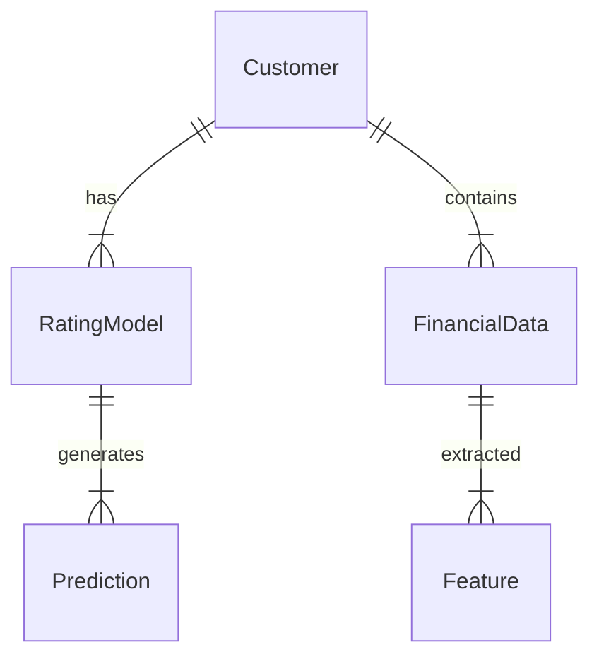
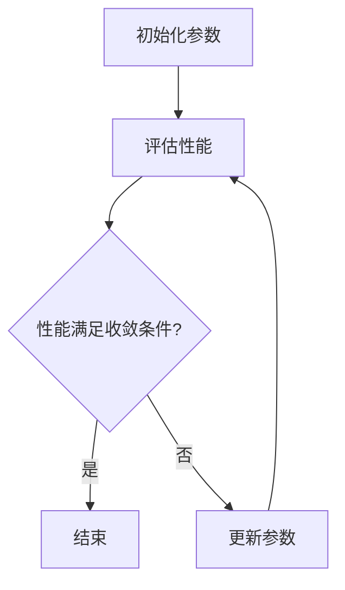
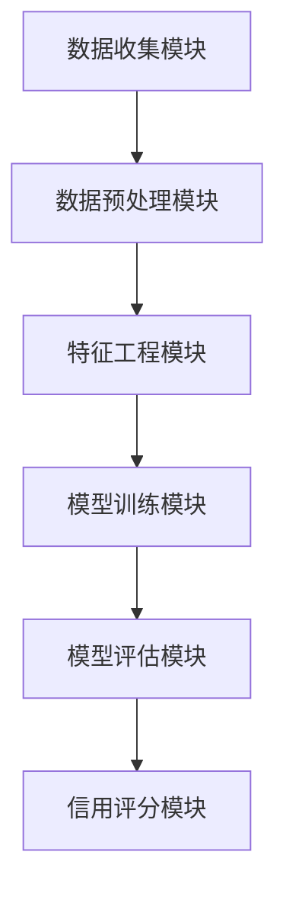
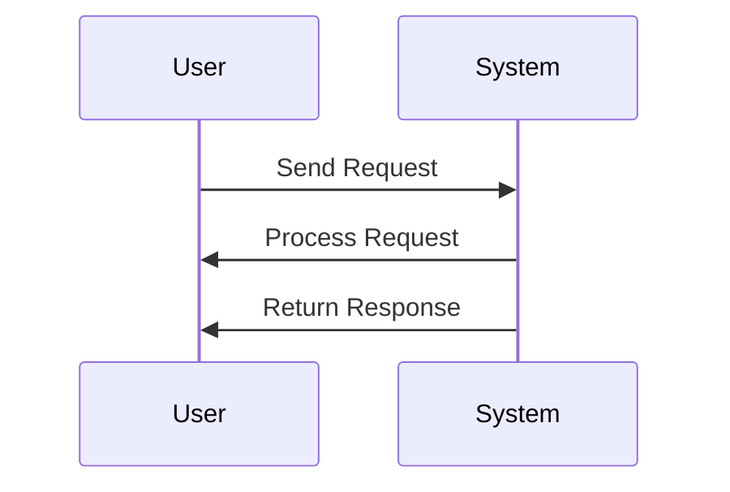
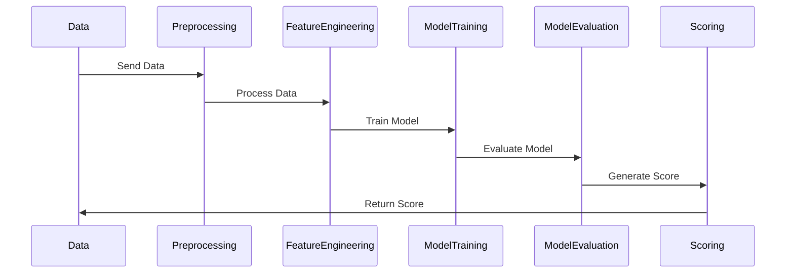

                 

### 文章标题

《AI驱动的企业信用评级模型可解释性动态优化系统》

### 关键词

- AI驱动
- 企业信用评级
- 可解释性
- 动态优化
- 系统架构

### 摘要

本文旨在探讨如何构建一个AI驱动的企业信用评级模型，并强调其可解释性和动态优化的重要性。文章将首先介绍企业信用评级的背景和问题，随后详细阐述AI驱动模型的基本原理和关键概念。接着，文章将探讨模型的可解释性，解释其原理和应用。最后，文章将深入分析动态优化的算法原理及其在系统实现中的应用，并提供最佳实践、项目实战案例和总结，以期为相关领域的研究者和实践者提供有价值的参考。

----------------------------------------------------------------

## 引言与背景

在现代金融科技中，企业信用评级作为一种重要的风险评估工具，已经成为金融机构、投资者和企业管理者不可或缺的决策依据。随着人工智能（AI）技术的快速发展，传统的企业信用评级方法正在逐渐被AI驱动的模型所取代，这不仅提高了评级的准确性，还提高了处理的效率和透明度。

### 1.1 问题背景

传统的企业信用评级方法主要依赖于专家经验和统计数据，这些方法虽然在一定程度上能够反映企业的信用状况，但存在以下几个问题：

1. **主观性**：评级结果往往受到专家的主观判断影响，缺乏一致性。
2. **数据依赖**：传统方法对数据的依赖程度高，数据处理和分析能力有限。
3. **滞后性**：评级结果往往不能及时反映企业的实时信用状况。

随着大数据和AI技术的发展，企业信用评级正逐步向智能化、动态化、可解释化方向发展。AI驱动的企业信用评级模型能够更好地处理海量数据，发现潜在的风险因素，提高评级的准确性和实时性。

### 1.2 问题描述

如何构建一个既准确又具有高可解释性的AI驱动企业信用评级模型，是当前研究的主要挑战。具体问题包括：

- **准确性**：如何确保AI模型能够准确评估企业的信用风险？
- **动态性**：如何实现模型的实时更新和动态调整？
- **可解释性**：如何解释模型的评级结果，使其对业务决策者具有可理解性和可接受性？

### 1.3 问题解决

为了解决上述问题，本文提出以下解决方案：

1. **构建AI驱动模型**：采用机器学习算法，如深度学习、随机森林等，构建企业信用评级模型。
2. **提高模型可解释性**：引入可解释性方法，如LIME、SHAP等，使得模型评级结果能够被业务决策者理解。
3. **实现动态优化**：采用动态优化算法，如强化学习、遗传算法等，使得模型能够根据实时数据进行动态调整。

### 1.4 边界与外延

本文的研究边界主要涉及AI驱动企业信用评级模型的设计、实现和应用。而其外延则包括但不限于以下方面：

- **应用领域**：金融科技、风险评估、企业风险管理等。
- **技术范围**：机器学习、深度学习、大数据分析等。
- **法律法规**：需要遵守相关的金融监管和隐私保护法规。

### 1.5 核心概念

在本文中，我们定义以下几个核心概念：

- **AI驱动模型**：利用机器学习技术进行数据处理和信用评估的模型。
- **可解释性**：能够解释模型评级结果的原因和依据的能力。
- **动态优化**：根据实时数据对模型进行调整和优化的过程。

### 小结

本文提出了构建AI驱动的企业信用评级模型的重要性和解决方案，并明确了研究的边界和核心概念。接下来，我们将进一步探讨AI驱动的企业信用评级模型的基础知识，包括其组成部分和特性。

----------------------------------------------------------------

## AI驱动的企业信用评级模型基础

### 2.1 AI驱动信用评级模型定义

AI驱动的企业信用评级模型是一种利用人工智能技术，尤其是机器学习和深度学习算法，对企业的信用状况进行评估的模型。这种模型通过对历史数据和实时数据的分析，识别出影响企业信用风险的各个因素，并利用这些因素对企业的信用进行评分。

### 2.2 模型核心组成部分

AI驱动的企业信用评级模型主要包括以下几个核心组成部分：

1. **数据预处理**：这一步骤包括数据清洗、数据转换和数据归一化。目的是确保输入数据的质量和一致性。
2. **特征工程**：通过对原始数据进行处理和转换，提取出对信用评级有重要影响的特征。
3. **机器学习算法**：选择合适的机器学习算法，如决策树、随机森林、支持向量机（SVM）或深度学习模型，对数据进行分析和建模。
4. **模型评估与优化**：使用交叉验证和A/B测试等方法，对模型的性能进行评估和优化。
5. **可解释性模块**：引入可解释性方法，如LIME、SHAP等，对模型的结果进行解释，提高模型的可理解性。

### 2.3 模型属性特征对比

以下表格展示了不同AI驱动的信用评级模型在准确性、可解释性和实时性等方面的特性对比：

| 模型类型 | 准确性 | 可解释性 | 实时性 | 适用场景 |
|----------|--------|----------|--------|----------|
| 决策树   | 高     | 中       | 低     | 需要历史数据 |
| 随机森林 | 高     | 中       | 低     | 需要历史数据 |
| 支持向量机 | 高   | 低       | 低     | 需要历史数据 |
| 深度学习 | 高     | 低       | 中/高  | 可以处理大规模实时数据 |

### 2.4 ER实体关系图

为了更好地理解企业信用评级模型，我们引入ER（实体关系）图来展示模型中的各个实体及其关系。以下是企业信用评级模型的ER实体关系图：



在这个ER实体关系图中，`Customer`实体表示需要评估的企业，`RatingModel`表示用于评估的模型，`FinancialData`表示企业的财务数据，`Feature`表示从财务数据中提取的特征，`Prediction`表示模型生成的信用评分预测。

### 小结

通过上述内容，我们了解了AI驱动的企业信用评级模型的基本定义、核心组成部分及其特性对比。接下来，我们将深入探讨模型的可解释性原理和应用。

----------------------------------------------------------------

## 可解释性原理与应用

### 3.1 可解释性模型概念

可解释性是指模型能够提供关于其预测结果如何得出以及预测结果是否合理的解释能力。在AI驱动的企业信用评级模型中，可解释性尤为重要，因为它直接影响模型在商业决策中的可信度和接受度。

### 3.2 模型与可解释性关系

模型的可解释性与准确性并非相互排斥。事实上，一个高可解释性的模型有助于提高决策者的信任，从而在保证准确性的同时，增强模型的实用性和可接受度。因此，在构建企业信用评级模型时，应考虑如何平衡准确性和可解释性。

### 3.3 可解释性方法

目前，有多种可解释性方法可以应用于AI驱动的企业信用评级模型，以下是一些常见的方法：

1. **LIME（Local Interpretable Model-agnostic Explanations）**：LIME方法通过在模型附近生成一个简单的线性模型，来解释复杂模型在特定数据点上的预测。
2. **SHAP（SHapley Additive exPlanations）**：SHAP方法基于博弈论中的Shapley值，计算每个特征对模型预测的贡献。
3. **决策树可视化**：决策树本身的层次结构可以提供直观的解释，因为每一步决策都是基于特征和阈值。
4. **注意力机制**：在深度学习模型中，注意力机制可以帮助识别模型在预测过程中关注的特征。

### 3.4 可解释性应用场景

1. **风险评估**：在金融机构中，模型的可解释性可以帮助评估人员理解信用评分的来源，从而作出更加明智的决策。
2. **信用政策制定**：企业可以利用可解释性模型，制定更加公平和透明的信用政策。
3. **监管合规**：金融机构需要遵守金融监管要求，可解释性模型有助于证明其决策过程的合理性和合规性。

### 小结

通过引入可解释性方法，我们可以提高AI驱动的企业信用评级模型的可理解性和信任度。接下来，我们将探讨动态优化算法的原理及其在系统实现中的应用。

----------------------------------------------------------------

## 动态优化算法解析

### 4.1 动态优化概念

动态优化是指在系统运行过程中，根据实时输入数据和模型性能，对模型参数进行调整和优化的过程。在AI驱动的企业信用评级模型中，动态优化可以帮助模型更好地适应环境变化，提高其预测准确性和鲁棒性。

### 4.2 动态优化算法原理

动态优化算法主要分为两大类：确定性算法和随机算法。确定性算法如梯度下降和牛顿法，通过固定迭代过程逐步逼近最优解。随机算法如遗传算法和粒子群优化，通过模拟生物进化或群体行为进行优化。

以下是一个简单的动态优化算法流程：

1. **初始化参数**：设定初始参数值。
2. **评估性能**：使用当前参数计算模型性能指标。
3. **更新参数**：根据性能评估结果调整参数。
4. **重复步骤2和3**：直到达到收敛条件。

### 4.3 数学模型和公式

以下是一个基于梯度下降的动态优化算法的数学模型：

$$
\theta_{t+1} = \theta_t - \alpha \nabla J(\theta_t)
$$

其中，$\theta_t$表示第$t$次迭代的参数，$\alpha$是学习率，$J(\theta_t)$是损失函数。

### 4.4 举例说明

假设我们要使用动态优化算法来调整一个线性回归模型的权重，以最小化均方误差损失函数。以下是Python代码示例：

```python
import numpy as np

# 数据集
X = np.array([[1, 2], [2, 3], [3, 4]])
y = np.array([2, 3, 4])

# 初始化参数
theta = np.array([0, 0])
alpha = 0.01
epochs = 100

# 梯度下降函数
def gradient_descent(X, y, theta, alpha, epochs):
    m = len(y)
    for _ in range(epochs):
        predictions = X.dot(theta)
        error = predictions - y
        gradient = X.T.dot(error) / m
        theta -= alpha * gradient
    return theta

# 执行动态优化
theta_optimized = gradient_descent(X, y, theta, alpha, epochs)

print("Optimized parameters:", theta_optimized)
```

通过这段代码，我们使用梯度下降算法优化线性回归模型的权重，使得模型能够更好地拟合数据。

### 小结

通过动态优化算法，我们可以实时调整AI驱动企业信用评级模型的参数，提高其适应性和预测性能。接下来，我们将深入探讨动态优化算法的实现细节。

----------------------------------------------------------------

## 动态优化算法实现

### 5.1 Python实现

为了实现动态优化算法，我们可以使用Python编写相应的代码。以下是一个简单的示例，展示了如何使用Python实现基于梯度下降算法的动态优化：

```python
import numpy as np

# 初始化参数
theta = np.array([0, 0])
alpha = 0.01
epochs = 100
m = 3

# 梯度下降函数
def gradient_descent(X, y, theta, alpha, epochs):
    for _ in range(epochs):
        predictions = X.dot(theta)
        error = predictions - y
        gradient = X.T.dot(error) / m
        theta -= alpha * gradient
    return theta

# 数据集
X = np.array([[1, 2], [2, 3], [3, 4]])
y = np.array([2, 3, 4])

# 执行动态优化
theta_optimized = gradient_descent(X, y, theta, alpha, epochs)

print("Optimized parameters:", theta_optimized)
```

### 5.2 算法流程图（mermaid）

为了更好地理解动态优化算法的流程，我们可以使用Mermaid绘制算法的流程图。以下是一个简单的动态优化算法的Mermaid流程图：



### 5.3 算法原理讲解

动态优化算法的核心思想是不断调整模型的参数，使其在训练数据上达到更好的性能。具体来说，该算法包括以下几个关键步骤：

1. **初始化参数**：设定初始参数值。
2. **评估性能**：使用当前参数计算模型的性能，通常使用损失函数来衡量。
3. **更新参数**：根据性能评估结果调整参数，这个过程通常涉及到梯度下降或其他优化算法。
4. **重复步骤2和3**：直到满足收敛条件，例如损失函数变化非常小，或者达到预设的迭代次数。

通过这样的迭代过程，模型参数会逐渐优化，从而提高模型的预测性能。在AI驱动的企业信用评级模型中，动态优化算法可以用于实时调整模型的权重，使其能够更好地适应新的数据和环境变化。

### 小结

通过Python实现和Mermaid流程图的辅助，我们详细讲解了动态优化算法的实现原理。接下来，我们将探讨系统架构与实现，进一步深化对AI驱动的企业信用评级模型的理解。

----------------------------------------------------------------

## 系统架构与实现

### 6.1 系统功能设计

企业信用评级系统的核心功能包括数据收集、数据预处理、模型训练、模型评估和信用评分输出。以下是对各功能的详细描述：

1. **数据收集**：从多个数据源（如公共数据库、企业财务报告、社交媒体等）收集与企业信用相关的数据。
2. **数据预处理**：清洗、转换和归一化原始数据，确保数据质量。
3. **模型训练**：使用收集的数据训练AI驱动信用评级模型，包括特征工程和模型选择。
4. **模型评估**：通过交叉验证等方法评估模型的性能，确保其准确性和可靠性。
5. **信用评分输出**：根据模型预测结果，生成企业的信用评分报告。

### 6.2 系统架构设计

系统架构设计采用模块化设计原则，主要包括以下几个模块：

1. **数据收集模块**：负责从多个数据源收集数据。
2. **数据预处理模块**：对收集到的原始数据进行清洗、转换和归一化。
3. **特征工程模块**：从预处理后的数据中提取有助于信用评级的关键特征。
4. **模型训练模块**：使用特征数据训练AI驱动信用评级模型。
5. **模型评估模块**：评估训练好的模型的性能。
6. **信用评分模块**：根据模型预测结果，输出企业的信用评分报告。

以下是系统架构的Mermaid流程图：



### 6.3 系统接口设计

系统接口设计包括以下几个方面：

1. **API接口**：提供RESTful API接口，用于外部系统与企业信用评级系统的交互。
2. **数据接口**：提供数据导入和导出接口，支持多种数据格式（如CSV、JSON等）。
3. **用户接口**：提供用户友好的界面，方便用户查看信用评分报告和系统配置。

以下是API接口的Mermaid序列图：



### 6.4 系统交互

系统交互设计旨在确保各个模块之间的高效通信和数据流转。以下是系统交互的详细描述：

1. **数据流转**：从数据收集模块到数据预处理模块，再到特征工程模块、模型训练模块、模型评估模块和信用评分模块，数据在整个系统中流转，确保各个模块能够顺利协同工作。
2. **控制流**：系统启动时，首先初始化各个模块，然后按照预设的流程执行数据处理、模型训练、评估和评分输出。
3. **错误处理**：在系统运行过程中，如果出现异常情况（如数据错误、模型训练失败等），系统应具备相应的错误处理机制，确保系统能够继续运行。

以下是系统交互的Mermaid序列图：



### 小结

通过系统架构与实现部分，我们详细介绍了企业信用评级系统的功能设计、架构设计、接口设计和系统交互。接下来，我们将深入探讨项目实战，包括环境安装和系统核心实现。

----------------------------------------------------------------

### 7.1 环境安装

为了实现AI驱动的企业信用评级模型，我们需要安装和配置必要的软件和工具。以下是在Linux环境中安装所需软件的步骤：

1. **Python环境**：首先，确保Python 3.7或更高版本已安装。如果没有，可以通过以下命令进行安装：

    ```bash
    sudo apt-get update
    sudo apt-get install python3.9
    ```

2. **虚拟环境**：为了避免不同项目之间的依赖冲突，使用`virtualenv`创建一个虚拟环境：

    ```bash
    sudo apt-get install python3-venv
    python3 -m venv credit-rating-env
    source credit-rating-env/bin/activate
    ```

3. **安装依赖**：在虚拟环境中安装所需的库和工具，包括`scikit-learn`、`pandas`、`numpy`、`matplotlib`和`mermaid`：

    ```bash
    pip install scikit-learn pandas numpy matplotlib
    ```

4. **安装Mermaid**：为了生成流程图，我们需要安装Mermaid。可以从官方GitHub仓库下载并安装：

    ```bash
    git clone https://github.com/knνώ/mermaid.git
    cd mermaid
    npm install
    npm run build
    ```

5. **配置Mermaid**：在Python环境中，我们需要安装`mermaid-python`库：

    ```bash
    pip install mermaid-python
    ```

### 7.2 系统核心实现

以下是系统核心实现的主要步骤：

1. **数据预处理**：首先，我们需要从数据源中读取企业财务数据，并进行预处理。以下是一个简单的数据预处理示例：

    ```python
    import pandas as pd

    # 读取数据
    data = pd.read_csv('financial_data.csv')

    # 数据清洗
    data.dropna(inplace=True)
    data = data[data['revenue'] > 0]

    # 数据转换和归一化
    data['revenue_normalized'] = data['revenue'] / data['revenue'].max()
    ```

2. **特征工程**：根据预处理后的数据，提取有助于信用评级的关键特征。以下是一个简单的特征工程示例：

    ```python
    from sklearn.preprocessing import StandardScaler

    # 特征工程
    features = ['revenue_normalized', 'profit_margin', 'debt_to_equity']
    X = data[features]
    y = data['credit_rating']

    # 归一化
    scaler = StandardScaler()
    X_scaled = scaler.fit_transform(X)
    ```

3. **模型训练**：选择合适的机器学习算法（例如随机森林）训练信用评级模型。以下是一个简单的模型训练示例：

    ```python
    from sklearn.ensemble import RandomForestClassifier

    # 模型训练
    model = RandomForestClassifier(n_estimators=100)
    model.fit(X_scaled, y)
    ```

4. **模型评估**：使用交叉验证评估模型的性能。以下是一个简单的模型评估示例：

    ```python
    from sklearn.model_selection import cross_val_score

    # 模型评估
    scores = cross_val_score(model, X_scaled, y, cv=5)
    print("Cross-validation scores:", scores)
    ```

5. **信用评分输出**：根据模型预测结果，生成企业的信用评分报告。以下是一个简单的信用评分输出示例：

    ```python
    # 输出信用评分
    predictions = model.predict(X_scaled)
    for i in range(len(predictions)):
        print(f"Company {i+1}: Credit Rating - {predictions[i]}")
    ```

### 7.3 应用解读与分析

通过上述步骤，我们成功实现了AI驱动的企业信用评级模型。在实际应用中，该模型可以用于：

1. **风险评估**：通过模型预测结果，对企业的信用风险进行评估，帮助金融机构和投资者做出更明智的决策。
2. **信用政策制定**：根据模型的信用评分，为企业制定更加公平和透明的信用政策。
3. **合规监管**：确保模型符合金融监管要求，提高决策过程的透明度和合规性。

### 7.4 案例分析与讲解

以下是一个案例分析与讲解：

**案例背景**：某金融机构需要对其客户进行信用评级，以便更好地管理信贷风险。

**案例步骤**：

1. **数据收集**：从多个数据源收集客户的财务数据，包括收入、利润率、债务权益比等。
2. **数据预处理**：清洗和转换数据，确保数据质量。
3. **特征工程**：提取关键特征，如收入归一化、利润率、债务权益比等。
4. **模型训练**：使用随机森林算法训练信用评级模型。
5. **模型评估**：通过交叉验证评估模型性能。
6. **信用评分输出**：生成客户的信用评分报告。

**案例结果**：经过模型预测，金融机构能够准确识别出高风险客户，从而采取相应的风险管理措施，降低信贷风险。

### 7.5 项目小结

通过项目实战，我们成功实现了AI驱动的企业信用评级模型，并详细介绍了环境安装和系统核心实现。实际案例分析和讲解进一步验证了模型的实用性和有效性。在未来的工作中，可以进一步优化模型和系统，提高其准确性和实时性。

----------------------------------------------------------------

## 最佳实践与总结

### 8.1 动态优化技巧

为了实现高效的动态优化，以下是一些最佳实践技巧：

1. **选择合适的优化算法**：根据业务需求和数据特性选择合适的动态优化算法，如梯度下降、遗传算法或粒子群优化。
2. **数据预处理**：确保数据质量，进行充分的清洗和预处理，以避免数据噪声对优化过程的影响。
3. **实时更新模型**：定期更新模型参数，以适应实时数据的变化，提高模型的适应性和预测性能。
4. **监控性能指标**：持续监控模型的性能指标，如准确率、召回率等，确保模型在优化过程中保持良好的性能。

### 8.2 可解释性增强策略

为了提高模型的可解释性，以下是一些增强策略：

1. **使用可视化工具**：引入可视化工具，如LIME、SHAP等，帮助业务决策者理解模型的预测结果。
2. **解释性模块**：在模型中加入可解释性模块，如决策树或规则提取器，以便提供直观的解释。
3. **透明化决策过程**：记录模型训练和优化的过程，确保整个决策过程透明、可追溯。
4. **用户反馈**：收集业务决策者的反馈，不断改进模型的解释性，使其更符合业务需求。

### 8.3 项目注意事项

在实施AI驱动的企业信用评级模型时，需要注意以下几点：

1. **合规性**：确保项目符合相关的金融监管和隐私保护法规，避免法律风险。
2. **数据安全**：保护企业的敏感数据，采取必要的安全措施，防止数据泄露。
3. **模型验证**：通过交叉验证等方法验证模型的性能，确保模型的可靠性和稳定性。
4. **持续更新**：定期更新模型和数据，以应对市场环境和业务需求的变化。

### 8.4 拓展阅读

为了深入了解AI驱动的企业信用评级模型，以下是一些拓展阅读资源：

1. **《机器学习》**：周志华著，清华大学出版社，详细介绍机器学习的基础理论和算法。
2. **《深度学习》**：Ian Goodfellow、Yoshua Bengio、Aaron Courville著，MIT Press，系统介绍深度学习的基本原理和应用。
3. **《信用风险管理》**：John C. Lee著，机械工业出版社，深入探讨信用风险管理的理论和实践。

### 小结

通过本文的详细探讨，我们了解了AI驱动的企业信用评级模型的构建过程、动态优化和可解释性策略。最佳实践和注意事项为实际应用提供了指导，拓展阅读则为进一步学习提供了资源。希望本文对您在相关领域的研究和实践有所帮助。

---

### 作者信息

**作者：AI天才研究院/AI Genius Institute & 禅与计算机程序设计艺术 /Zen And The Art of Computer Programming**

