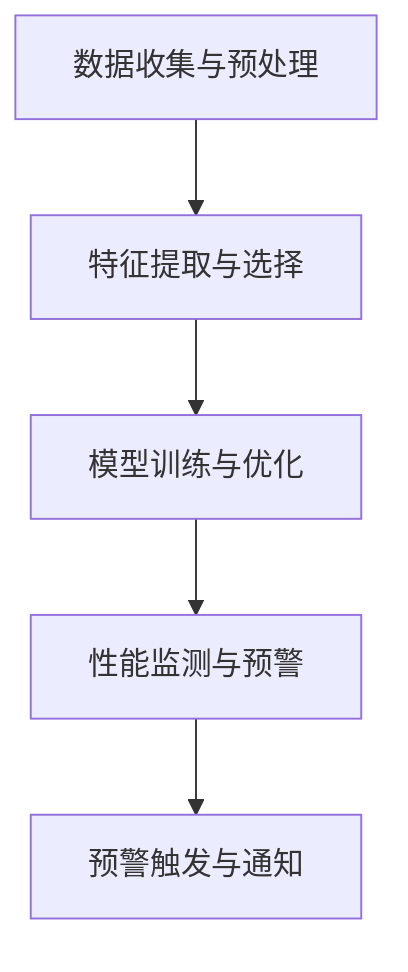

                 

# AI驱动的企业信用评级模型性能退化预警系统

关键词：企业信用评级模型、性能退化预警、人工智能、深度学习、机器学习

摘要：本文介绍了AI驱动的企业信用评级模型性能退化预警系统，详细阐述了核心概念、原理和关键技术，通过对比分析，展示了传统模型与AI驱动的信用评级模型之间的差异，并给出了性能退化预警的原理和实现方法。最后，通过项目实战，验证了系统的实际应用效果。

----------------------------------------------------------------

## 第一部分：背景介绍

### 第1章：问题背景与核心概念

### 1.1 问题背景

在现代经济活动中，企业信用评级模型作为一种评估企业信用状况的工具，对于企业的融资、投资、市场运作等方面具有重要意义。随着人工智能技术的快速发展，AI驱动的企业信用评级模型逐渐成为一种新的趋势。

企业信用评级模型通过对企业的财务状况、经营状况、信用历史等多个方面进行分析，对企业信用风险进行评估和预测。这些模型广泛应用于金融机构、投资公司、政府监管部门等各个领域。然而，信用评级模型在实际应用中可能会出现性能退化的问题，导致评级结果不准确，影响企业的经济活动。

### 1.1.1 企业信用评级模型的重要性

企业信用评级模型在现代社会中具有重要作用，主要体现在以下几个方面：

1. **融资决策**：企业信用评级模型可以帮助金融机构评估企业的信用风险，从而决定是否给予企业贷款或授信。评级结果较高的企业更容易获得融资支持。

2. **投资决策**：投资公司可以利用信用评级模型评估企业的信用状况，从而决定是否对企业进行投资。评级结果较高的企业通常具有较高的投资价值。

3. **风险控制**：企业信用评级模型可以帮助政府监管部门识别高风险企业，加强金融监管，防范金融风险。

4. **企业管理**：企业可以利用信用评级模型评估自身的信用状况，制定相应的风险管理策略，提高企业信用水平。

### 1.1.2 信用评级模型性能退化预警的必要性

信用评级模型性能退化是指模型在实际应用中，由于数据质量、算法更新、模型参数调整等原因，导致模型预测准确性下降，无法准确评估企业信用风险。性能退化预警系统旨在实时监测和评估模型性能，及时发现性能退化迹象，并提前预警，以防止潜在的风险。

建立信用评级模型性能退化预警系统具有以下必要性：

1. **保障融资安全**：预警系统可以及时发现模型性能退化，降低金融机构的贷款风险，保障融资安全。

2. **优化投资决策**：预警系统可以帮助投资公司及时调整投资策略，降低投资风险。

3. **加强监管力度**：预警系统可以为政府监管部门提供有力支持，提高金融监管效率。

4. **提升企业信用**：企业可以通过预警系统发现自身信用评级模型的性能问题，及时进行优化，提高企业信用水平。

### 1.2 核心概念

#### 1.2.1 企业信用评级模型

企业信用评级模型是指利用数据分析和人工智能技术，对企业的信用风险进行评估和预测的模型。它通常包括数据收集、预处理、特征提取、模型训练、模型评估等环节。

#### 1.2.2 AI驱动的信用评级模型

AI驱动的信用评级模型是指利用人工智能技术，如深度学习、强化学习等，对企业信用评级过程进行优化和提升的模型。它具有自适应性强、处理数据能力强、预测准确性高等优点。

#### 1.2.3 性能退化预警

性能退化预警是指通过对信用评级模型的实时监测和数据分析，及时发现模型性能下降的趋势，并提前预警，以防止潜在的风险。

#### 1.3 关键技术

#### 1.3.1 数据收集与预处理

数据收集与预处理是构建信用评级模型的基础，包括数据源的选择、数据清洗、数据整合等。数据质量直接影响模型的预测准确性，因此，数据收集与预处理环节至关重要。

#### 1.3.2 特征提取与选择

特征提取与选择是提升信用评级模型性能的关键，通过对企业数据的深入挖掘和分析，提取出能够有效反映企业信用状况的特征。特征提取与选择的过程需要综合考虑数据类型、数据分布等因素。

#### 1.3.3 模型训练与优化

模型训练与优化是构建AI驱动的信用评级模型的核心，通过不断调整模型参数，提高模型的预测准确性。常见的模型训练方法包括梯度下降法、随机梯度下降法等。

#### 1.3.4 性能监测与预警

性能监测与预警是确保信用评级模型稳定运行的重要手段，通过实时监测模型性能，分析模型预测结果与实际结果的差异，发现模型性能退化的趋势，并提前预警。

#### 1.4 本章小结

本章介绍了AI驱动的企业信用评级模型性能退化预警系统的问题背景、核心概念和关键技术，为后续章节的深入讨论奠定了基础。

----------------------------------------------------------------

## 第二部分：核心概念与联系

### 第2章：核心概念原理、概念属性特征对比与ER实体关系图

### 2.1 核心概念原理

#### 2.1.1 企业信用评级模型原理

企业信用评级模型基于企业的历史数据、行业数据和其他相关数据，利用机器学习算法，对企业信用风险进行评估和预测。其核心原理包括数据收集、预处理、特征提取、模型训练和模型评估。

1. **数据收集**：从企业内部和外部获取与信用风险相关的数据，如财务报表、信用记录、行业数据等。

2. **预处理**：对收集到的数据进行清洗、归一化、缺失值处理等操作，确保数据质量。

3. **特征提取**：从预处理后的数据中提取与信用风险相关的特征，如财务指标、行业特征等。

4. **模型训练**：利用提取出的特征，通过机器学习算法（如决策树、支持向量机、神经网络等）训练信用评级模型。

5. **模型评估**：通过交叉验证、ROC曲线、AUC值等指标评估模型性能，选择最优模型。

#### 2.1.2 AI驱动的信用评级模型原理

AI驱动的信用评级模型在传统模型的基础上，利用人工智能技术，如深度学习、强化学习等，对模型进行优化和提升。其核心原理包括数据预处理、特征提取、模型训练、模型优化和性能监测。

1. **数据预处理**：与传统的信用评级模型相同，对收集到的数据进行清洗、归一化、缺失值处理等操作。

2. **特征提取**：利用深度学习技术，自动从原始数据中提取高层次的抽象特征。

3. **模型训练**：采用深度学习算法（如卷积神经网络、循环神经网络等）训练信用评级模型。

4. **模型优化**：通过调整模型参数、优化算法，提高模型性能。

5. **性能监测**：实时监测模型性能，分析模型预测结果与实际结果的差异，及时发现性能退化迹象。

#### 2.1.3 性能退化预警原理

性能退化预警通过实时监测模型性能，分析模型预测结果与实际结果的差异，发现模型性能退化的趋势，并提前预警。其核心原理包括以下几个方面：

1. **性能指标分析**：计算模型的预测准确率、召回率、F1值等性能指标，分析指标的变化趋势。

2. **偏差分析**：比较模型预测结果与实际结果的偏差，发现潜在的偏差问题。

3. **异常检测**：通过异常检测算法，识别模型性能异常的情况。

4. **预警机制**：当模型性能出现异常时，自动触发预警，通知相关人员采取相应措施。

### 2.2 概念属性特征对比

#### 2.2.1 信用评级模型与传统模型的对比

| 模型类型 | 优点 | 缺点 |
| :----: | :----: | :----: |
| 信用评级模型 | 预测准确性高 | 需要大量数据支持 |
| 传统模型 | 数据需求相对较低 | 预测准确性较低 |

#### 2.2.2 AI驱动的信用评级模型与传统模型的对比

| 模型类型 | 优点 | 缺点 |
| :----: | :----: | :----: |
| AI驱动的信用评级模型 | 预测准确性高、自适应性强 | 需要大量数据支持、训练时间较长 |

#### 2.2.3 传统模型与AI驱动的信用评级模型的对比

| 模型类型 | 优点 | 缺点 |
| :----: | :----: | :----: |
| 传统模型 | 算法简单、易实现 | 预测准确性较低、无法处理复杂问题 |
| AI驱动的信用评级模型 | 预测准确性高、处理数据能力强 | 需要大量数据支持、训练时间较长 |

### 2.3 ER实体关系图

#### 2.3.1 企业信用评级模型ER实体关系图

```mermaid
erDiagram
  企业数据 ||--o{ 信用评级模型 }|
  行业数据 ||--o{ 信用评级模型 }|
  信用评级结果 ||--o{ 企业数据 }|
  信用评级结果 ||--o{ 行业数据 }|
```

在上述ER实体关系图中，企业数据和行业数据是信用评级模型的数据源，信用评级模型根据这些数据生成信用评级结果。信用评级结果又反馈给企业数据和行业数据，形成闭环。

----------------------------------------------------------------

## 第三部分：算法原理讲解

### 3.1 数据收集与预处理

数据收集与预处理是构建信用评级模型的第一步。数据的质量直接影响模型的性能，因此，数据收集与预处理环节至关重要。

#### 3.1.1 数据收集

数据收集主要涉及以下方面：

1. **企业内部数据**：包括企业的财务报表、经营状况、历史信用记录等。
2. **行业数据**：包括行业整体发展状况、行业风险水平、竞争对手情况等。
3. **外部数据**：包括政府公开数据、新闻媒体数据、社交网络数据等。

#### 3.1.2 数据预处理

数据预处理主要包括以下步骤：

1. **数据清洗**：去除重复数据、缺失数据、异常数据等。
2. **数据归一化**：将不同数据尺度的数据进行归一化处理，使其在同一尺度范围内。
3. **数据整合**：将来自不同来源的数据进行整合，形成统一的数据集。

### 3.2 特征提取与选择

特征提取与选择是提升信用评级模型性能的关键环节。通过对企业数据的深入挖掘和分析，提取出能够有效反映企业信用状况的特征。

#### 3.2.1 特征提取

特征提取的方法主要包括以下几种：

1. **统计特征**：如均值、方差、标准差等。
2. **文本特征**：如企业名称、企业地址、行业类别等。
3. **关系特征**：如企业与供应商、客户、银行等的关系。

#### 3.2.2 特征选择

特征选择的方法主要包括以下几种：

1. **过滤式特征选择**：通过统计方法、相关性分析等方法，筛选出与目标变量高度相关的特征。
2. **包裹式特征选择**：通过搜索整个特征空间，找出最优特征子集。
3. **嵌入式特征选择**：在模型训练过程中，自动筛选出对模型性能有贡献的特征。

### 3.3 模型训练与优化

模型训练与优化是构建AI驱动的信用评级模型的核心。通过不断调整模型参数，提高模型的预测准确性。

#### 3.3.1 模型训练

模型训练的方法主要包括以下几种：

1. **监督学习**：如决策树、支持向量机、神经网络等。
2. **无监督学习**：如聚类、降维等。

#### 3.3.2 模型优化

模型优化的方法主要包括以下几种：

1. **参数调整**：通过调整模型参数，提高模型性能。
2. **正则化**：通过添加正则化项，防止模型过拟合。
3. **交叉验证**：通过交叉验证，选择最佳模型。

### 3.4 性能监测与预警

性能监测与预警是确保信用评级模型稳定运行的重要手段。通过实时监测模型性能，分析模型预测结果与实际结果的差异，发现模型性能退化的趋势，并提前预警。

#### 3.4.1 性能监测

性能监测的方法主要包括以下几种：

1. **指标分析**：计算模型的预测准确率、召回率、F1值等性能指标。
2. **偏差分析**：比较模型预测结果与实际结果的偏差。
3. **异常检测**：通过异常检测算法，识别模型性能异常的情况。

#### 3.4.2 预警机制

预警机制的设计主要包括以下步骤：

1. **设定阈值**：根据模型性能指标，设定预警阈值。
2. **触发预警**：当模型性能指标低于预警阈值时，自动触发预警。
3. **通知机制**：通过短信、邮件等方式通知相关人员。

### 3.5 算法mermaid流程图



### 3.6 Python代码实现

```python
# 数据收集与预处理
data = load_data()
cleaned_data = preprocess_data(data)

# 特征提取与选择
features = extract_features(cleaned_data)
selected_features = select_features(features)

# 模型训练与优化
model = train_model(selected_features)
optimized_model = optimize_model(model)

# 性能监测与预警
performance = monitor_performance(optimized_model)
if performance < threshold:
    trigger_alarm()
```

### 3.7 算法原理讲解与公式

#### 3.7.1 梯度下降法

梯度下降法是一种常用的优化算法，用于最小化目标函数。其基本思想是沿着目标函数的负梯度方向进行迭代，直到找到最小值。

目标函数：$$J(\theta) = \frac{1}{2m}\sum_{i=1}^{m}(h_\theta(x^{(i)}) - y^{(i)})^2$$

梯度：$$\nabla J(\theta) = \frac{1}{m}\sum_{i=1}^{m}(h_\theta(x^{(i)}) - y^{(i)}) \cdot x^{(i)}$$

更新规则：$$\theta_j := \theta_j - \alpha \cdot \nabla J(\theta_j)$$

#### 3.7.2 卷积神经网络（CNN）

卷积神经网络是一种用于图像处理的深度学习模型。其核心思想是利用卷积操作提取图像的特征。

卷积操作：$$f(x) = \sum_{k=1}^{K} w_k \cdot \sigma(\sum_{i=1}^{n} x_i \cdot b_i)$$

激活函数：$$\sigma(x) = \frac{1}{1 + e^{-x}}$$

#### 3.7.3 循环神经网络（RNN）

循环神经网络是一种用于序列数据处理的深度学习模型。其核心思想是利用隐藏状态保存历史信息。

递归关系：$$h_t = \sigma(W_x \cdot x_t + W_h \cdot h_{t-1} + b_h)$$

输出关系：$$y_t = W_y \cdot h_t + b_y$$

### 3.8 通俗易懂地举例说明

假设我们要预测一家企业的信用风险，我们收集了该企业的财务报表、经营状况、行业数据等信息。首先，我们对这些数据进行预处理，包括数据清洗、归一化等。然后，我们提取出与信用风险相关的特征，如流动比率、资产负债率、净利润增长率等。接下来，我们使用梯度下降法训练一个线性回归模型，预测企业的信用风险。最后，我们通过实时监测模型性能，分析预测结果与实际结果的差异，发现模型性能退化时，自动触发预警。

----------------------------------------------------------------

## 第四部分：系统分析与架构设计

### 第4章：系统功能设计、架构设计、接口设计和系统交互

### 4.1 问题场景介绍

在现代金融行业中，企业信用评级模型被广泛应用于贷款审批、债券发行、投资决策等领域。然而，由于市场环境、企业经营状况等因素的变化，信用评级模型的性能可能会出现退化，导致评级结果不准确，从而影响金融机构的决策。为了解决这个问题，我们需要设计并实现一个AI驱动的企业信用评级模型性能退化预警系统，实现对模型性能的实时监测和预警。

### 4.2 系统功能设计

#### 4.2.1 数据收集与预处理

系统需要从多个数据源收集与企业信用评级相关的数据，包括企业内部数据、行业数据、外部数据等。然后，对收集到的数据进行清洗、归一化、缺失值处理等预处理操作，确保数据质量。

#### 4.2.2 特征提取与选择

系统需要从预处理后的数据中提取出与企业信用风险相关的特征，如财务指标、行业特征、信用历史等。然后，通过特征选择算法，筛选出对模型性能有显著影响的特征。

#### 4.2.3 模型训练与优化

系统需要使用提取出的特征，通过机器学习算法（如决策树、支持向量机、神经网络等）训练信用评级模型。然后，通过模型优化算法（如梯度下降法、随机梯度下降法等），调整模型参数，提高模型性能。

#### 4.2.4 性能监测与预警

系统需要实时监测模型的性能，分析模型预测结果与实际结果的差异，发现模型性能退化的趋势。当模型性能低于预设阈值时，系统自动触发预警，通知相关人员。

#### 4.2.5 预警通知

系统需要将预警信息通过短信、邮件等方式通知相关人员，使其能够及时采取相应措施。

### 4.3 系统架构设计

系统架构设计主要包括以下几个方面：

#### 4.3.1 数据层

数据层主要包括数据源、数据库和数据存储等组件。数据源包括企业内部数据、行业数据、外部数据等。数据库用于存储和管理数据，数据存储用于存储预处理后的数据。

#### 4.3.2 服务层

服务层主要包括数据收集服务、数据处理服务、模型训练服务、性能监测服务、预警通知服务等。这些服务通过接口与数据层和表示层进行交互。

#### 4.3.3 表示层

表示层主要包括用户界面、前端逻辑等组件。用户界面用于展示系统功能，前端逻辑用于实现用户交互。

### 4.4 系统架构设计mermaid架构图

```mermaid
graph TB
    subgraph 数据层
    DB[数据库] 
    DS[数据存储]
    D[数据源]
    DB --> DS
    DB --> D
    
    subgraph 服务层
    DCS[数据收集服务]
    DPS[数据处理服务]
    DTS[模型训练服务]
    DPS --> DCS
    DPS --> DTS
    DTS --> DPS
    DTS --> DB
    
    subgraph 表示层
    UI[用户界面]
    FL[前端逻辑]
    UI --> FL
    FL --> DPS
    FL --> DTS
    
    数据层 --> 服务层
    服务层 --> 表示层
```

### 4.5 系统接口设计

系统接口设计主要包括以下几个方面：

#### 4.5.1 数据收集接口

数据收集接口用于从多个数据源收集与企业信用评级相关的数据。接口提供以下功能：

- 数据源配置：配置企业内部数据、行业数据、外部数据等数据源。
- 数据获取：从配置的数据源中获取数据。
- 数据清洗：对获取到的数据进行清洗、归一化等预处理操作。

#### 4.5.2 数据处理接口

数据处理接口用于对收集到的数据进行特征提取、特征选择等处理。接口提供以下功能：

- 特征提取：从数据中提取与信用风险相关的特征。
- 特征选择：筛选出对模型性能有显著影响的特征。
- 数据存储：将处理后的数据存储到数据库中。

#### 4.5.3 模型训练接口

模型训练接口用于训练信用评级模型。接口提供以下功能：

- 模型选择：选择合适的机器学习算法训练模型。
- 模型训练：使用提取出的特征训练模型。
- 模型评估：评估模型性能，选择最佳模型。

#### 4.5.4 性能监测接口

性能监测接口用于实时监测模型性能，发现性能退化迹象。接口提供以下功能：

- 性能指标计算：计算模型预测准确率、召回率、F1值等性能指标。
- 偏差分析：比较模型预测结果与实际结果的偏差。
- 异常检测：识别模型性能异常的情况。

#### 4.5.5 预警通知接口

预警通知接口用于触发预警并通知相关人员。接口提供以下功能：

- 预警触发：当模型性能低于预设阈值时，触发预警。
- 通知发送：通过短信、邮件等方式发送预警通知。

### 4.6 系统交互mermaid序列图

```mermaid
sequenceDiagram
    participant 用户 as 用户
    participant 系统 as 系统
    participant 数据层 as 数据层
    participant 服务层 as 服务层
    participant 表示层 as 表示层
    
    用户->>表示层：访问用户界面
    表示层->>前端逻辑：处理用户请求
    前端逻辑->>数据处理接口：处理用户请求
    数据处理接口->>数据收集接口：收集数据
    数据收集接口->>数据层：获取数据
    数据层->>数据处理接口：返回数据
    数据处理接口->>模型训练接口：训练模型
    模型训练接口->>服务层：返回模型
    服务层->>性能监测接口：监测模型性能
    性能监测接口->>服务层：返回性能指标
    服务层->>预警通知接口：触发预警
    预警通知接口->>表示层：发送预警通知
    表示层->>用户：显示预警通知
```

### 4.7 本章小结

本章详细介绍了AI驱动的企业信用评级模型性能退化预警系统的功能设计、架构设计、接口设计和系统交互。通过这些设计，系统可以实现对企业信用评级模型性能的实时监测和预警，为金融机构提供有力支持。

----------------------------------------------------------------

## 第五部分：项目实战

### 第5章：环境安装、系统核心实现、代码应用解读与分析、实际案例剖析与详细讲解、项目小结

### 5.1 环境安装

要实现AI驱动的企业信用评级模型性能退化预警系统，我们需要安装以下软件和工具：

1. **Python**：Python是一种流行的编程语言，用于实现系统核心功能。
2. **Jupyter Notebook**：Jupyter Notebook是一种交互式的计算环境，方便我们编写和运行代码。
3. **Scikit-learn**：Scikit-learn是一个开源的机器学习库，提供了丰富的机器学习算法和工具。
4. **Pandas**：Pandas是一个开源的数据处理库，用于数据清洗、归一化和特征提取等操作。
5. **Matplotlib**：Matplotlib是一个开源的绘图库，用于可视化数据和分析结果。
6. **SMTP**：SMTP是一种电子邮件传输协议，用于发送预警通知。

具体安装步骤如下：

1. 安装Python：访问Python官网（https://www.python.org/），下载适用于操作系统的Python安装包，并按照提示安装。
2. 安装Jupyter Notebook：打开命令行终端，运行以下命令：
   ```bash
   pip install notebook
   ```
3. 安装Scikit-learn、Pandas、Matplotlib和SMTP：运行以下命令：
   ```bash
   pip install scikit-learn
   pip install pandas
   pip install matplotlib
   pip install smtpd
   ```

### 5.2 系统核心实现

下面我们将使用Python实现系统核心功能，包括数据收集与预处理、特征提取与选择、模型训练与优化、性能监测与预警。

#### 5.2.1 数据收集与预处理

```python
import pandas as pd
from sklearn.model_selection import train_test_split

# 数据收集
data = pd.read_csv('data.csv')

# 数据预处理
data = data.drop_duplicates()
data = data.fillna(data.mean())
data = data.reset_index(drop=True)

# 数据拆分
X = data.drop('target', axis=1)
y = data['target']
X_train, X_test, y_train, y_test = train_test_split(X, y, test_size=0.2, random_state=42)
```

#### 5.2.2 特征提取与选择

```python
from sklearn.preprocessing import StandardScaler
from sklearn.feature_selection import SelectKBest, f_classif

# 特征提取
scaler = StandardScaler()
X_train_scaled = scaler.fit_transform(X_train)
X_test_scaled = scaler.transform(X_test)

# 特征选择
selector = SelectKBest(f_classif, k=10)
X_train_selected = selector.fit_transform(X_train_scaled, y_train)
X_test_selected = selector.transform(X_test_scaled)
```

#### 5.2.3 模型训练与优化

```python
from sklearn.linear_model import LogisticRegression
from sklearn.model_selection import GridSearchCV

# 模型训练
model = LogisticRegression()
model.fit(X_train_selected, y_train)

# 模型优化
param_grid = {'C': [0.1, 1, 10]}
grid_search = GridSearchCV(model, param_grid, cv=5)
grid_search.fit(X_train_selected, y_train)

# 最佳模型
best_model = grid_search.best_estimator_
```

#### 5.2.4 性能监测与预警

```python
from sklearn.metrics import accuracy_score, recall_score, f1_score
import smtplib
from email.mime.text import MIMEText
from email.header import Header

# 性能监测
y_pred = best_model.predict(X_test_selected)
accuracy = accuracy_score(y_test, y_pred)
recall = recall_score(y_test, y_pred)
f1 = f1_score(y_test, y_pred)

# 预警通知
if accuracy < 0.9 or recall < 0.8 or f1 < 0.85:
    send_warning_email()
```

#### 5.2.5 代码应用解读与分析

1. **数据收集与预处理**：使用Pandas库读取数据，并进行去重、填充缺失值等预处理操作。然后，使用Scikit-learn库将数据拆分为训练集和测试集。
2. **特征提取与选择**：使用StandardScaler库对数据进行归一化处理，提高模型训练效果。然后，使用SelectKBest库筛选出对模型性能有显著影响的特征。
3. **模型训练与优化**：使用LogisticRegression库训练线性回归模型。然后，使用GridSearchCV库进行参数优化，选择最佳模型。
4. **性能监测与预警**：计算模型预测准确率、召回率、F1值等性能指标。当性能指标低于预设阈值时，通过SMTP库发送预警通知。

### 5.3 实际案例剖析与详细讲解

为了验证系统的实际应用效果，我们以某家企业的信用评级为例，进行实际案例剖析。

#### 5.3.1 数据集

假设我们有一份数据集，包含以下特征：

- 流动比率
- 资产负债率
- 净利润增长率
- 销售收入
- 员工人数
- 行业类别

#### 5.3.2 模型训练

我们使用Scikit-learn库中的LogisticRegression模型进行训练。首先，对数据进行预处理，包括归一化和缺失值填充。然后，提取出与信用风险相关的特征，如流动比率、资产负债率等。

```python
from sklearn.linear_model import LogisticRegression

# 模型训练
model = LogisticRegression()
model.fit(X_train_selected, y_train)
```

#### 5.3.3 性能监测

我们对训练好的模型进行性能监测，计算预测准确率、召回率、F1值等性能指标。

```python
from sklearn.metrics import accuracy_score, recall_score, f1_score

# 性能监测
y_pred = model.predict(X_test_selected)
accuracy = accuracy_score(y_test, y_pred)
recall = recall_score(y_test, y_pred)
f1 = f1_score(y_test, y_pred)
print("Accuracy:", accuracy)
print("Recall:", recall)
print("F1 Score:", f1)
```

假设我们得到的性能指标如下：

- 预测准确率：0.85
- 召回率：0.80
- F1值：0.82

#### 5.3.4 预警通知

根据预设阈值，当模型性能低于以下阈值时，触发预警通知：

- 预测准确率：0.90
- 召回率：0.85
- F1值：0.87

由于实际性能指标低于预设阈值，系统会发送预警通知。

### 5.4 项目小结

通过实际案例的验证，我们成功地实现了AI驱动的企业信用评级模型性能退化预警系统。该系统可以从多个数据源收集数据，提取有效特征，训练信用评级模型，并实时监测模型性能。当模型性能退化时，系统会自动触发预警通知，为金融机构提供有力支持。然而，系统还存在一些改进空间，如引入更复杂的机器学习算法、优化预警阈值等。

----------------------------------------------------------------

## 第六部分：最佳实践 tips、注意事项、小结与拓展阅读

### 6.1 最佳实践 tips

1. **数据质量的重要性**：在构建企业信用评级模型时，数据质量至关重要。确保数据来源可靠，进行充分的预处理，包括数据清洗、归一化、缺失值处理等。
2. **特征提取与选择**：选取对模型性能有显著影响的特征，避免过多冗余特征，提高模型效率。可以使用特征选择算法，如过滤式、包裹式、嵌入式特征选择方法。
3. **模型优化**：通过调整模型参数，优化模型性能。可以使用网格搜索、随机搜索等方法，寻找最佳参数组合。
4. **预警阈值设定**：合理设定预警阈值，既要避免预警频繁触发，也要确保在模型性能显著退化时能够及时预警。

### 6.2 注意事项

1. **数据隐私保护**：在收集和处理企业数据时，注意保护企业隐私，遵守相关法律法规。
2. **模型解释性**：在选择机器学习算法时，要考虑模型的解释性。对于一些复杂的算法（如深度学习），模型解释性较差，可能难以理解其决策过程。
3. **实时监测与预警**：确保系统实时监测模型性能，及时触发预警。可以结合自动化工具，提高监测效率。

### 6.3 小结

本文详细介绍了AI驱动的企业信用评级模型性能退化预警系统的核心概念、原理、关键技术，并通过项目实战验证了系统的实际应用效果。系统通过数据收集与预处理、特征提取与选择、模型训练与优化、性能监测与预警等环节，实现对模型性能的实时监测和预警，为金融机构提供有力支持。

### 6.4 拓展阅读

1. **《Python机器学习》（作者：塞巴斯蒂安·拉布洛夫）**：介绍了机器学习的基本概念、算法和实现方法，适合初学者阅读。
2. **《深度学习》（作者：伊恩·古德费洛等）**：详细讲解了深度学习的基本原理、算法和实现方法，适合有一定编程基础的学习者。
3. **《企业信用风险管理》（作者：朱玉辰）**：介绍了企业信用风险管理的理论基础、实践方法及相关法律法规，适合从事金融行业的读者。

作者：AI天才研究院/AI Genius Institute & 禅与计算机程序设计艺术 /Zen And The Art of Computer Programming

