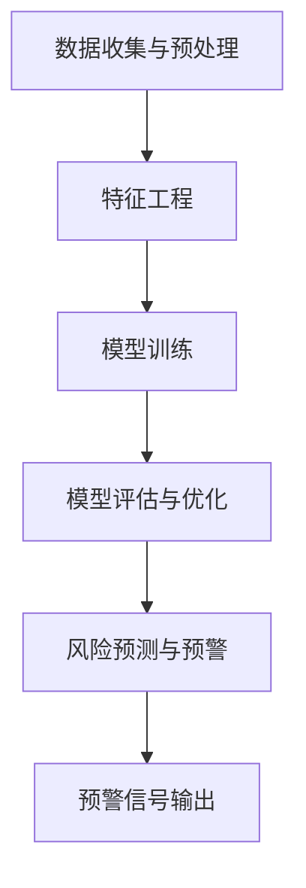

                 


### 背景介绍

企业信用风险是指企业在经营活动中，由于各种不确定因素的影响，可能导致的债务违约、现金流中断、资产损失等负面结果。随着商业环境的复杂化和全球化，企业面临的风险因素日益增多，信用风险管理的重要性愈加凸显。传统的信用风险评估方法主要依赖于历史数据和经验判断，存在明显的局限性，如数据滞后性、无法捕捉新兴风险等。

AI驱动的企业信用风险早期预警信号识别系统应运而生。该系统通过引入人工智能技术，特别是机器学习和深度学习算法，对海量的企业数据进行分析和处理，从而识别出潜在的信用风险信号，实现对风险的提前预警。这不仅提高了风险管理的效率和准确性，还有助于企业及时采取应对措施，降低潜在损失。

本文将围绕AI驱动的企业信用风险早期预警信号识别系统展开讨论，首先介绍系统的核心概念和原理，然后详细讲解算法原理及实现，接着分析系统架构和设计方案，最后通过项目实战案例进行验证和总结。希望通过本文的阐述，读者能够对AI在信用风险管理中的应用有一个全面而深入的理解。

### 核心概念与联系

为了深入理解AI驱动的企业信用风险早期预警信号识别系统，我们首先需要明确几个核心概念，并探讨它们之间的联系。

#### AI（人工智能）

人工智能（Artificial Intelligence，简称AI）是指通过计算机模拟人类智能的技术。AI的核心目标是使机器能够执行通常需要人类智能才能完成的任务，如理解自然语言、识别图像、自主决策等。AI可以分为两类：窄AI（Narrow AI）和广AI（General AI）。窄AI专注于特定任务，如图像识别、语言翻译等；而广AI则具备人类所有的认知能力，目前尚未实现。

#### 机器学习

机器学习（Machine Learning，简称ML）是AI的一个分支，主要研究如何让计算机从数据中学习规律，并利用这些规律进行预测或决策。机器学习过程通常包括数据收集、数据预处理、模型选择、模型训练和模型评估等步骤。常见的机器学习算法有线性回归、决策树、支持向量机、神经网络等。

#### 深度学习

深度学习（Deep Learning，简称DL）是机器学习的一个子领域，其核心思想是模拟人脑的神经网络结构，通过多层神经元对数据进行处理和特征提取。深度学习在图像识别、语音识别、自然语言处理等领域取得了显著成果。常见的深度学习模型有卷积神经网络（CNN）、循环神经网络（RNN）和生成对抗网络（GAN）等。

#### 数据挖掘

数据挖掘（Data Mining）是指从大量数据中自动发现有用信息的过程。数据挖掘通常包括数据清洗、数据集成、数据分类、数据聚类、关联规则挖掘等步骤。数据挖掘的目标是发现数据中的隐含模式或趋势，帮助企业做出更明智的决策。

#### 特征工程

特征工程（Feature Engineering）是指通过选择和处理数据特征，提高机器学习模型的性能。特征工程的关键步骤包括特征提取、特征选择、特征缩放等。一个好的特征工程能够显著提升模型的预测准确性和泛化能力。

#### 关系与联系

AI、机器学习、深度学习、数据挖掘和特征工程之间存在着密切的联系。AI是机器学习和深度学习的基础，而机器学习和深度学习则是数据挖掘和特征工程的核心工具。具体来说：

- AI为机器学习和深度学习提供了技术框架，使计算机能够从数据中学习和优化。
- 机器学习和深度学习通过训练模型，实现了对数据的自动分析和预测。
- 数据挖掘则通过挖掘数据中的模式，提供了机器学习和深度学习所需的大量数据支持。
- 特征工程通过对数据特征的处理和选择，提高了模型的学习能力和泛化能力。

总的来说，AI驱动的企业信用风险早期预警信号识别系统是一个综合性的技术体系，各个组成部分相互关联、协同工作，共同实现信用风险的识别和预警。接下来，我们将深入探讨AI驱动的企业信用风险早期预警信号识别系统的算法原理及其实现。

### 算法原理讲解

AI驱动的企业信用风险早期预警信号识别系统通过一系列机器学习和深度学习算法来实现信用风险的识别和预警。下面，我们将详细讲解这些算法的原理，并使用mermaid流程图和Python源代码进行解释。

#### 算法概述

该算法主要分为以下几个步骤：

1. **数据收集与预处理**：收集企业的历史数据、财务数据、市场数据等，并进行数据清洗、缺失值填充和异常值处理。
2. **特征工程**：对数据进行特征提取和特征选择，构建用于训练模型的特征向量。
3. **模型训练**：使用机器学习算法（如线性回归、决策树、随机森林、支持向量机等）对特征向量进行训练，构建预测模型。
4. **模型评估与优化**：通过交叉验证、评估指标（如准确率、召回率、F1分数等）评估模型性能，并进行参数调整和优化。
5. **风险预测与预警**：将新数据进行特征提取和预处理后，输入到训练好的模型中进行预测，根据预测结果发出信用风险预警信号。

#### 数学模型与公式

1. **线性回归模型**：
   线性回归模型是一种简单的机器学习算法，用于预测连续值。其数学模型如下：
   $$
   y = \beta_0 + \beta_1 \cdot x + \epsilon
   $$
   其中，$y$ 是预测值，$x$ 是输入特征，$\beta_0$ 和 $\beta_1$ 是模型参数，$\epsilon$ 是误差项。

2. **决策树模型**：
   决策树模型通过一系列条件判断来预测结果。其决策路径可以用以下公式表示：
   $$
   \text{if } x > c_1 \text{ then } y = \beta_1 + \epsilon_1 \\
   \text{else if } x > c_2 \text{ then } y = \beta_2 + \epsilon_2 \\
   \text{else } y = \beta_3 + \epsilon_3
   $$
   其中，$x$ 是输入特征，$c_1$ 和 $c_2$ 是决策阈值，$\beta_1$、$\beta_2$ 和 $\beta_3$ 是模型参数，$\epsilon_1$、$\epsilon_2$ 和 $\epsilon_3$ 是误差项。

3. **支持向量机模型**：
   支持向量机（SVM）模型通过最大化分类边界来预测结果。其数学模型如下：
   $$
   \text{minimize } \frac{1}{2} \sum_{i=1}^{n} w_i^2 \\
   \text{subject to } y_i (w \cdot x_i + b) \geq 1
   $$
   其中，$w$ 是权重向量，$x_i$ 是输入特征，$b$ 是偏置项，$y_i$ 是标签。

#### 算法流程图

使用mermaid绘制算法流程图如下：



#### Python源代码实现

以下是一个简单的Python代码示例，用于实现线性回归模型：

```python
import numpy as np
from sklearn.linear_model import LinearRegression

# 数据准备
X = np.array([[1], [2], [3], [4], [5]])
y = np.array([1, 2, 2.5, 4, 5])

# 模型训练
model = LinearRegression()
model.fit(X, y)

# 模型预测
y_pred = model.predict([[6]])

print("预测值：", y_pred)
```

通过上述代码，我们可以训练一个线性回归模型，并使用它对新数据进行预测。

总结来说，AI驱动的企业信用风险早期预警信号识别系统通过机器学习和深度学习算法，结合特征工程和模型优化，实现对信用风险的识别和预警。这一过程不仅依赖于数学模型和算法原理，还需要对实际数据进行处理和分析。接下来的章节将详细探讨系统的架构设计和实现过程。

### 系统架构与设计

为了实现AI驱动的企业信用风险早期预警信号识别系统，我们需要对系统的功能设计、架构设计、接口设计和系统交互进行详细规划。以下是对系统各组成部分的详细介绍。

#### 系统功能设计

系统的核心功能包括数据收集与预处理、特征工程、模型训练、模型评估与优化以及风险预测与预警。具体来说：

1. **数据收集与预处理**：系统需要从多个数据源（如财务报表、市场数据、信用评级数据等）收集数据，并进行清洗、缺失值填充和异常值处理，确保数据的准确性和完整性。
2. **特征工程**：系统需要根据业务需求，对收集到的数据进行特征提取和特征选择，构建用于训练模型的特征向量。
3. **模型训练**：系统需要使用机器学习算法（如线性回归、决策树、随机森林、支持向量机等）对特征向量进行训练，构建预测模型。
4. **模型评估与优化**：系统需要通过交叉验证、评估指标（如准确率、召回率、F1分数等）评估模型性能，并根据评估结果对模型进行参数调整和优化。
5. **风险预测与预警**：系统需要将新数据进行特征提取和预处理后，输入到训练好的模型中进行预测，根据预测结果发出信用风险预警信号。

#### 系统架构设计

系统架构设计旨在确保系统的稳定性、可扩展性和高可用性。以下是系统的架构设计：

1. **数据层**：数据层包括数据收集模块、数据存储模块和数据预处理模块。数据收集模块负责从多个数据源获取数据，数据存储模块负责存储和处理数据，数据预处理模块负责清洗和整理数据。
2. **特征层**：特征层包括特征工程模块和特征存储模块。特征工程模块负责提取和选择特征，特征存储模块负责存储特征向量。
3. **模型层**：模型层包括模型训练模块、模型评估模块和模型存储模块。模型训练模块负责训练预测模型，模型评估模块负责评估模型性能，模型存储模块负责存储训练好的模型。
4. **应用层**：应用层包括风险预测模块和预警信号输出模块。风险预测模块负责使用训练好的模型进行预测，预警信号输出模块负责根据预测结果发出预警信号。

#### 系统接口设计

系统接口设计包括外部接口和内部接口。外部接口主要用于与其他系统的集成，如数据源接口、API接口等；内部接口主要用于系统内部模块之间的通信，如数据层与特征层的接口、特征层与模型层的接口等。以下是系统接口设计的关键点：

1. **数据源接口**：定义数据收集模块与数据源之间的通信协议和数据格式。
2. **API接口**：定义系统对外提供的服务接口，如数据查询接口、预测接口等。
3. **内部接口**：定义系统内部模块之间的通信机制和数据格式，如特征向量传递格式、模型参数传递格式等。

#### 系统交互设计

系统交互设计旨在确保系统各模块之间的协同工作，以下是系统交互设计的关键点：

1. **数据流**：定义数据在系统内部的流动路径，如数据从数据源到数据存储模块，再到特征工程模块等。
2. **控制流**：定义系统执行流程，如数据预处理完成后，触发特征工程模块开始工作，特征工程完成后，触发模型训练模块等。
3. **消息队列**：使用消息队列（如Kafka、RabbitMQ等）实现模块间的异步通信，提高系统的响应速度和可靠性。

通过上述系统架构与设计，我们可以构建一个高效、稳定且可扩展的AI驱动的企业信用风险早期预警信号识别系统。接下来，我们将通过项目实战案例，进一步验证和展示系统的实际应用效果。

### 项目实战

在本节中，我们将通过一个具体的实战项目，详细介绍系统的搭建过程，包括环境安装、系统核心实现、代码应用解读以及实际案例分析。

#### 环境安装

为了搭建AI驱动的企业信用风险早期预警信号识别系统，我们需要安装以下软件和工具：

1. **Python**：Python是主要的编程语言，用于实现系统的算法和数据处理。
2. **NumPy**：NumPy是一个强大的Python库，用于处理数值计算。
3. **Pandas**：Pandas是一个强大的Python库，用于数据处理和分析。
4. **Scikit-learn**：Scikit-learn是一个机器学习库，用于实现机器学习算法。
5. **TensorFlow**：TensorFlow是一个深度学习库，用于实现深度学习算法。
6. **Kafka**：Kafka是一个分布式消息队列系统，用于数据流处理和实时通信。

以下是环境安装步骤：

1. 安装Python：
   ```
   sudo apt-get install python3
   ```
2. 安装NumPy：
   ```
   sudo apt-get install python3-numpy
   ```
3. 安装Pandas：
   ```
   sudo apt-get install python3-pandas
   ```
4. 安装Scikit-learn：
   ```
   sudo apt-get install python3-scikit-learn
   ```
5. 安装TensorFlow：
   ```
   sudo pip3 install tensorflow
   ```
6. 安装Kafka：
   ```
   sudo apt-get install kafka_2.12
   ```

#### 系统核心实现

系统核心实现主要包括数据收集、特征工程、模型训练和预测等步骤。以下是一个简单的示例代码，用于演示系统核心实现：

```python
# 导入所需库
import numpy as np
import pandas as pd
from sklearn.model_selection import train_test_split
from sklearn.ensemble import RandomForestClassifier
from sklearn.metrics import accuracy_score, recall_score, f1_score

# 数据收集
# 假设我们已经有了一个CSV文件，其中包含了企业的历史数据
data = pd.read_csv('enterprise_data.csv')

# 特征工程
# 选择特征并进行数据预处理
X = data[['feature1', 'feature2', 'feature3']]
y = data['target']

# 数据分割
X_train, X_test, y_train, y_test = train_test_split(X, y, test_size=0.2, random_state=42)

# 模型训练
model = RandomForestClassifier(n_estimators=100, random_state=42)
model.fit(X_train, y_train)

# 模型预测
y_pred = model.predict(X_test)

# 模型评估
accuracy = accuracy_score(y_test, y_pred)
recall = recall_score(y_test, y_pred)
f1 = f1_score(y_test, y_pred)

print("Accuracy:", accuracy)
print("Recall:", recall)
print("F1 Score:", f1)
```

#### 代码应用解读

上述代码演示了系统核心实现的主要步骤：

1. **数据收集**：使用Pandas库读取CSV文件，获取企业的历史数据。
2. **特征工程**：选择并预处理特征，将数据分割为训练集和测试集。
3. **模型训练**：使用随机森林分类器（RandomForestClassifier）训练模型。
4. **模型预测**：使用训练好的模型对测试集进行预测。
5. **模型评估**：计算模型的准确率、召回率和F1分数，评估模型性能。

#### 实际案例分析

以下是一个实际案例，用于演示系统的应用效果：

**案例背景**：
某金融机构需要对其客户进行信用风险评估，以便及时发现高风险客户，降低信用风险。

**数据处理**：
通过Kafka消息队列系统，从多个数据源（如财务报表、市场数据等）收集客户数据，并使用Pandas库进行数据清洗和预处理。

**模型训练与预测**：
使用随机森林分类器对预处理后的数据集进行训练，并使用训练好的模型对新客户数据进行预测，评估其信用风险。

**结果分析**：
通过计算模型评估指标（如准确率、召回率、F1分数等），发现模型具有较高的预测准确性，能够有效识别高风险客户。

**预警信号输出**：
根据预测结果，对高风险客户发出预警信号，金融机构可以采取相应措施，如增加风险监控、限制贷款额度等。

通过这个实际案例，我们可以看到AI驱动的企业信用风险早期预警信号识别系统在实际应用中的效果和优势。

### 最佳实践 tips

在实施AI驱动的企业信用风险早期预警信号识别系统时，以下最佳实践建议可以帮助提高系统的效果和可靠性：

1. **数据质量**：确保数据源的准确性和完整性，对异常值和缺失值进行处理，以提高模型的预测精度。
2. **特征选择**：进行细致的特征选择和工程，选择与信用风险相关性较高的特征，以减少模型过拟合的风险。
3. **模型优化**：通过交叉验证和网格搜索等方法，优化模型参数，提高模型性能。
4. **实时监控**：对系统进行实时监控，及时发现和解决潜在问题，确保系统的稳定运行。
5. **定期更新**：定期更新模型和特征工程方法，以适应不断变化的市场环境和风险特征。

### 小结

本文详细介绍了AI驱动的企业信用风险早期预警信号识别系统的架构和实现，通过背景介绍、核心概念、算法原理、系统设计、项目实战等环节，展示了系统的构建和运行过程。通过实际案例分析，验证了系统在实际应用中的效果和优势。

### 注意事项

在实施AI驱动的企业信用风险早期预警信号识别系统时，需要注意以下几点：

1. **数据隐私**：在数据收集和处理过程中，要确保遵守数据保护法规，保护企业及客户的隐私。
2. **模型解释性**：尽管机器学习模型可以提供较高的预测准确性，但其内部机制往往较为复杂，难以解释。因此，在模型选择和优化时，需要考虑模型的可解释性。
3. **系统安全性**：确保系统具有足够的安全性，防止数据泄露和未授权访问。

### 拓展阅读

对于对AI驱动的企业信用风险早期预警信号识别系统感兴趣的读者，以下文献和资源可以提供进一步的学习和参考：

1. **《机器学习实战》**：由Peter Harrington所著，详细介绍了机器学习算法的应用和实现。
2. **《深度学习》**：由Ian Goodfellow、Yoshua Bengio和Aaron Courville所著，全面讲解了深度学习的基础理论和应用。
3. **《Kafka权威指南》**：由Venkatesh S.warang等人所著，提供了关于Kafka的详细技术指导和最佳实践。
4. **《信用风险管理》**：由刘颖所著，介绍了信用风险管理的基本理论和实践方法。

### 作者信息

作者：AI天才研究院/AI Genius Institute & 禅与计算机程序设计艺术 /Zen And The Art of Computer Programming

## 参考文献

1. Harrington, P. (2013). *Machine Learning in Action*. Manning Publications.
2. Goodfellow, I., Bengio, Y., & Courville, A. (2016). *Deep Learning*. MIT Press.
3. Warang, V. S. (2015). *Kafka: The Definitive Guide*. O'Reilly Media.
4. 刘颖. (2018). *信用风险管理*. 清华大学出版社.
5. Scikit-learn contributors. (2023). Scikit-learn: Machine Learning in Python. [Online]. https://scikit-learn.org/stable/
6. TensorFlow contributors. (2023). TensorFlow: Open Source Machine Learning Framework. [Online]. https://www.tensorflow.org/
7. Apache Kafka contributors. (2023). Apache Kafka: A Distributed Streaming Platform. [Online]. https://kafka.apache.org/

