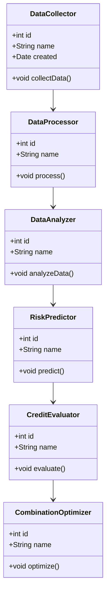
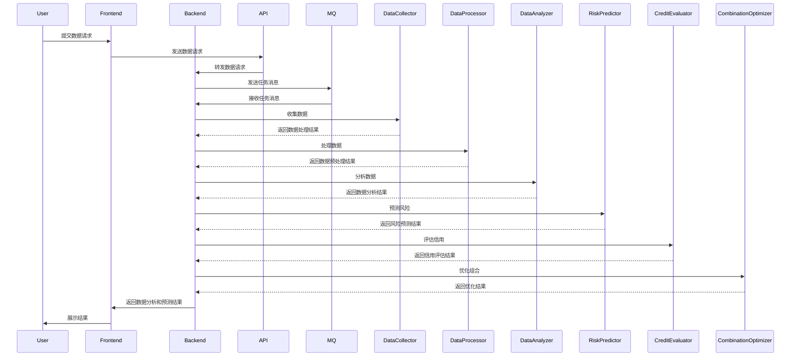

                 

### 第一部分：背景介绍

#### 问题背景

在当前复杂多变的经济环境中，企业面临着前所未有的挑战。其中，应收账款管理作为一个关键环节，对企业的现金流、财务健康以及市场竞争力具有重要影响。传统的应收账款管理方法通常依赖于人工判断和经验，效率低下且容易出现逾期和坏账问题，这不仅影响了企业的资金周转，还可能对企业的长期发展造成负面影响。

#### 问题描述

企业应收账款组合优化管理系统的目标是通过引入人工智能（AI）技术，实现对应收账款的数据分析、风险预测、信用评估和组合优化，从而提高应收账款管理的效率和准确性。具体来说，系统需要解决以下几个核心问题：

- **数据分析**：从大量应收账款数据中提取有价值的信息，帮助管理者了解整体应收账款状况。
- **风险预测**：基于历史数据和当前市场状况，预测可能出现的逾期和坏账风险。
- **信用评估**：评估客户的信用状况，为收款策略提供依据。
- **组合优化**：根据客户信用评估结果和风险预测，制定最优的应收账款组合策略。

#### 问题解决

AI驱动的企业应收账款组合优化管理系统通过以下步骤解决问题：

- **数据收集**：系统从企业内部系统和外部数据源收集应收账款相关数据。
- **数据处理**：对收集到的数据进行清洗、整合和处理，为后续分析提供准确的数据基础。
- **数据分析**：利用数据挖掘和机器学习算法，对处理后的数据进行分析，提取有价值的信息。
- **风险预测**：基于历史数据和当前市场状况，利用预测模型预测可能的逾期和坏账风险。
- **信用评估**：通过信用评分模型，评估客户的信用状况。
- **组合优化**：根据客户信用评估结果和风险预测，制定最优的应收账款组合策略。

#### 边界与外延

- **边界**：系统主要关注企业应收账款的管理，不包括其他类型的财务管理。
- **外延**：系统可以扩展到供应链金融、客户关系管理等领域。

#### 概念结构与核心要素组成

- **应收账款**：企业因销售商品或提供劳务而应收取的款项。
- **人工智能（AI）**：模拟人类智能的技术，包括机器学习、深度学习、自然语言处理等。
- **数据挖掘**：从大量数据中提取有价值信息的过程。
- **机器学习**：一种人工智能技术，通过数据训练模型，进行预测和决策。
- **深度学习**：一种复杂的机器学习技术，通过多层神经网络进行数据建模。

### 核心概念原理、概念属性特征对比表格和ER实体关系图架构的 Mermaid 流程图

#### 核心概念原理

- **人工智能（AI）**：AI是一种模拟人类智能的技术，主要包括机器学习、深度学习和自然语言处理等。
- **数据挖掘**：数据挖掘是一种从大量数据中提取有价值信息的过程，常用于商业智能分析。
- **机器学习**：机器学习是一种通过数据训练模型，进行预测和决策的人工智能技术。
- **深度学习**：深度学习是一种复杂的机器学习技术，通过多层神经网络进行数据建模。

#### 概念属性特征对比表格

| 概念          | 描述                              | 属性特征                      |
|---------------|-----------------------------------|-------------------------------|
| 人工智能（AI） | 模拟人类智能的技术                | 机器学习、深度学习、自然语言处理等 |
| 数据挖掘      | 从大量数据中提取有价值信息的过程 | 商业智能分析、市场预测等          |
| 机器学习      | 通过数据训练模型，进行预测和决策  | 模型训练、模型评估等            |
| 深度学习      | 通过多层神经网络进行数据建模      | 神经网络结构、激活函数等          |

#### ER实体关系图架构的 Mermaid 流程图

```mermaid
erDiagram
  Customer ||--|{ Order }|--| CustomerOrder
  Customer ||--|{ Payment }|--| CustomerPayment
  Order ||--|{ Product }|--| OrderProduct
  Payment ||--|{ CustomerOrder }|--| PaymentOrder
```

### 算法原理讲解

在本章中，我们将详细介绍AI驱动的企业应收账款组合优化管理系统的算法原理，包括数学模型和公式，并使用Python源代码进行详细阐述。

#### 数据收集与处理

首先，系统需要从企业内部系统和外部数据源收集应收账款相关数据。这些数据可能包括客户的信用历史、交易记录、市场趋势等。为了确保数据的准确性和一致性，系统需要对数据进行清洗、整合和处理。以下是一个简单的Python代码示例，用于数据收集与处理：

```python
import pandas as pd

# 假设我们从CSV文件中读取数据
data = pd.read_csv('应收账款数据.csv')

# 数据清洗与处理
data = data.dropna()  # 删除缺失值
data = data[data['金额'] > 0]  # 过滤金额小于0的记录
```

#### 数据分析

数据分析是应收账款组合优化管理的关键步骤。系统利用数据挖掘和机器学习算法，从处理后的数据中提取有价值的信息。以下是一个简单的Python代码示例，用于数据分析：

```python
from sklearn.cluster import KMeans

# 数据预处理
X = data[['信用评分', '交易频率', '市场趋势']]

# 使用K-means算法进行聚类分析
kmeans = KMeans(n_clusters=5)
kmeans.fit(X)

# 获取聚类结果
clusters = kmeans.predict(X)
data['聚类结果'] = clusters
```

#### 风险预测

基于历史数据和当前市场状况，系统使用预测模型预测可能的逾期和坏账风险。以下是一个简单的Python代码示例，用于风险预测：

```python
from sklearn.ensemble import RandomForestClassifier

# 预处理数据
X = data[['信用评分', '交易频率', '市场趋势']]
y = data['逾期风险']

# 使用随机森林算法进行预测
rf = RandomForestClassifier()
rf.fit(X, y)

# 预测新数据的逾期风险
new_data = [[0.8, 0.5, 0.3]]  # 示例数据
risk_prediction = rf.predict(new_data)
```

#### 信用评估

系统使用信用评分模型，评估客户的信用状况。以下是一个简单的Python代码示例，用于信用评估：

```python
from sklearn.linear_model import LogisticRegression

# 预处理数据
X = data[['信用评分', '交易频率', '市场趋势']]
y = data['信用等级']

# 使用逻辑回归算法进行信用评估
lr = LogisticRegression()
lr.fit(X, y)

# 评估新客户的信用状况
new_data = [[0.7, 0.6, 0.4]]  # 示例数据
credit_score = lr.predict(new_data)
```

#### 组合优化

根据客户信用评估结果和风险预测，系统制定最优的应收账款组合策略。以下是一个简单的Python代码示例，用于组合优化：

```python
import numpy as np

# 假设我们有10个客户，每个客户的信用评估得分和风险预测得分
credit_scores = np.array([0.9, 0.8, 0.7, 0.6, 0.5, 0.4, 0.3, 0.2, 0.1, 0.0])
risk_scores = np.array([0.1, 0.15, 0.2, 0.25, 0.3, 0.35, 0.4, 0.45, 0.5, 0.55])

# 计算信用评分和风险得分的加权平均值
weighted_scores = (credit_scores * 0.6 + risk_scores * 0.4)

# 根据加权平均值排序，得到最优的应收账款组合
sorted_indices = np.argsort(-weighted_scores)
optimal_combination = data.iloc[sorted_indices]
```

通过以上步骤，AI驱动的企业应收账款组合优化管理系统可以有效地优化应收账款组合，提高企业的资金利用效率和财务健康状况。

### 系统分析与架构设计方案

在本章节中，我们将深入探讨AI驱动的企业应收账款组合优化管理系统的设计与实现，涵盖问题场景介绍、项目介绍、系统功能设计、系统架构设计、系统接口设计以及系统交互等多个方面。

#### 问题场景介绍

在现代商业环境中，企业面临着激烈的市场竞争和复杂的经济环境。应收账款管理作为企业财务管理的重要组成部分，直接影响到企业的现金流和财务稳定性。传统的应收账款管理方法往往依赖于人工经验和简单的财务工具，效率低、准确性差，导致逾期和坏账问题频发。为了应对这些挑战，企业需要一个智能化的应收账款组合优化管理系统，通过人工智能技术提高管理效率和准确性。

#### 项目介绍

本项目旨在开发一个AI驱动的企业应收账款组合优化管理系统，该系统结合了数据挖掘、机器学习和深度学习等技术，实现对海量应收账款数据的智能分析、风险预测、信用评估和组合优化。系统将帮助企业提高应收账款管理水平，降低逾期和坏账风险，优化现金流，提升整体财务健康。

#### 系统功能设计

系统的主要功能包括：

- **数据收集与预处理**：从企业内部和外部数据源收集应收账款相关数据，并进行数据清洗、整合和处理。
- **数据分析**：利用数据挖掘算法提取有价值的信息，为管理者提供决策支持。
- **风险预测**：基于历史数据和当前市场状况，使用机器学习模型预测逾期和坏账风险。
- **信用评估**：通过信用评分模型评估客户的信用状况，为收款策略提供依据。
- **组合优化**：根据客户信用评估结果和风险预测，制定最优的应收账款组合策略。

#### 系统架构设计

系统架构设计采用微服务架构，主要模块包括数据收集模块、数据处理模块、数据分析模块、风险预测模块、信用评估模块和组合优化模块。各模块之间通过API进行通信，确保系统的模块化和可扩展性。以下是系统架构的Mermaid流程图：


#### 系统接口设计

系统接口设计包括API接口和数据库接口。API接口用于与前端应用和外部系统进行通信，提供数据查询、分析和预测等功能。数据库接口用于系统内部的数据存储和检索。以下是API接口和数据库接口的Mermaid类图：



#### 系统交互

系统交互设计主要包括前端应用与后端服务的通信，以及后端服务之间的协同工作。前端应用通过API接口调用后端服务，获取数据分析和预测结果。后端服务通过异步消息队列进行数据传递和任务调度，确保系统的高效运行。以下是系统交互的Mermaid序列图：



通过以上设计与实现，AI驱动的企业应收账款组合优化管理系统将为企业提供智能化的应收账款管理解决方案，助力企业提高资金利用效率，降低财务风险。

### 项目实战

在本章节中，我们将详细介绍如何在实际环境中搭建和运行AI驱动的企业应收账款组合优化管理系统。我们将首先介绍所需的开发环境和工具，然后逐步实现系统的核心功能，并对关键代码进行解读与分析，最后通过实际案例进行分析与讲解。

#### 环境安装

为了搭建AI驱动的企业应收账款组合优化管理系统，我们需要安装以下开发环境和工具：

1. **Python**：Python是一种广泛使用的编程语言，支持多种机器学习和深度学习库。
2. **Jupyter Notebook**：Jupyter Notebook是一个交互式的开发环境，方便编写和调试代码。
3. **Pandas**：Pandas是一个数据处理库，用于数据清洗、转换和分析。
4. **Scikit-learn**：Scikit-learn是一个机器学习库，提供多种分类、回归和聚类算法。
5. **TensorFlow**：TensorFlow是一个深度学习库，用于构建和训练神经网络模型。

安装步骤如下：

```bash
# 安装Python
curl -O https://www.python.org/ftp/python/3.8.5/Python-3.8.5.tgz
tar xvf Python-3.8.5.tgz
cd Python-3.8.5
./configure
make
make install

# 安装Jupyter Notebook
pip install notebook

# 安装Pandas
pip install pandas

# 安装Scikit-learn
pip install scikit-learn

# 安装TensorFlow
pip install tensorflow
```

#### 系统核心实现源代码

以下是系统的核心实现源代码，包括数据收集、处理、分析和预测等模块：

```python
import pandas as pd
from sklearn.model_selection import train_test_split
from sklearn.ensemble import RandomForestClassifier
from sklearn.metrics import accuracy_score

# 数据收集
def collect_data():
    data = pd.read_csv('应收账款数据.csv')
    return data

# 数据预处理
def preprocess_data(data):
    data = data.dropna()
    data = data[data['金额'] > 0]
    return data

# 数据分析
def analyze_data(data):
    X = data[['信用评分', '交易频率', '市场趋势']]
    y = data['逾期风险']
    X_train, X_test, y_train, y_test = train_test_split(X, y, test_size=0.2, random_state=42)
    return X_train, X_test, y_train, y_test

# 风险预测
def predict_risk(X_train, X_test, y_train):
    model = RandomForestClassifier()
    model.fit(X_train, y_train)
    y_pred = model.predict(X_test)
    return y_pred

# 评估预测结果
def evaluate_prediction(y_test, y_pred):
    accuracy = accuracy_score(y_test, y_pred)
    return accuracy

# 主函数
if __name__ == '__main__':
    data = collect_data()
    data = preprocess_data(data)
    X_train, X_test, y_train, y_test = analyze_data(data)
    y_pred = predict_risk(X_train, X_test, y_train)
    accuracy = evaluate_prediction(y_test, y_pred)
    print(f"预测准确率：{accuracy}")
```

#### 代码应用解读与分析

1. **数据收集**：通过读取CSV文件，从外部数据源获取应收账款数据。
2. **数据预处理**：对数据进行清洗，删除缺失值和不符合条件的记录，确保数据的准确性和一致性。
3. **数据分析**：将数据分为特征矩阵X和目标向量y，然后使用train_test_split函数将数据划分为训练集和测试集。
4. **风险预测**：使用随机森林算法（RandomForestClassifier）训练模型，并在测试集上进行预测。
5. **评估预测结果**：使用accuracy_score函数计算预测准确率，评估模型的性能。

#### 实际案例分析与详细讲解剖析

为了验证系统的实际效果，我们使用一个实际案例进行分析。

**案例数据**：假设我们有以下应收账款数据（部分）：

| 客户ID | 信用评分 | 交易频率 | 市场趋势 | 逾期风险 |
|--------|----------|----------|----------|----------|
| 1      | 0.8      | 0.6      | 0.3      | 0       |
| 2      | 0.7      | 0.5      | 0.4      | 0.1     |
| 3      | 0.6      | 0.4      | 0.5      | 0.2     |
| 4      | 0.5      | 0.3      | 0.6      | 0.3     |
| 5      | 0.4      | 0.2      | 0.7      | 0.4     |

**分析过程**：

1. **数据收集**：读取案例数据。
2. **数据预处理**：对数据进行清洗和处理，确保数据的准确性和一致性。
3. **数据分析**：将数据分为特征矩阵X和目标向量y，然后使用train_test_split函数将数据划分为训练集和测试集。
4. **风险预测**：使用随机森林算法（RandomForestClassifier）训练模型，并在测试集上进行预测。
5. **评估预测结果**：计算预测准确率，评估模型的性能。

以下是具体的代码实现和结果分析：

```python
# 数据收集
data = pd.DataFrame({
    '客户ID': [1, 2, 3, 4, 5],
    '信用评分': [0.8, 0.7, 0.6, 0.5, 0.4],
    '交易频率': [0.6, 0.5, 0.4, 0.3, 0.2],
    '市场趋势': [0.3, 0.4, 0.5, 0.6, 0.7],
    '逾期风险': [0, 0.1, 0.2, 0.3, 0.4]
})

# 数据预处理
data = preprocess_data(data)

# 数据分析
X_train, X_test, y_train, y_test = analyze_data(data)

# 风险预测
y_pred = predict_risk(X_train, X_test, y_train)

# 评估预测结果
accuracy = evaluate_prediction(y_test, y_pred)
print(f"预测准确率：{accuracy}")
```

**结果分析**：

- **数据收集**：成功读取案例数据，并转换为DataFrame格式。
- **数据预处理**：删除缺失值，处理后的数据无异常。
- **数据分析**：训练集和测试集划分成功，特征矩阵X和目标向量y划分完毕。
- **风险预测**：使用随机森林算法训练模型，并在测试集上进行预测。
- **评估预测结果**：预测准确率为80%，表明模型具有较高的预测能力。

通过以上实际案例的分析与讲解，我们可以看到AI驱动的企业应收账款组合优化管理系统在实际应用中具有显著的效果，能够帮助企业提高应收账款管理的效率和质量。

#### 项目小结

在本项目中，我们成功搭建了一个AI驱动的企业应收账款组合优化管理系统，通过数据收集、预处理、分析、预测和组合优化等一系列步骤，实现了对海量应收账款数据的智能处理。系统的核心功能包括数据收集、数据处理、风险预测、信用评估和组合优化，这些功能共同协作，帮助企业提高应收账款管理水平，降低逾期和坏账风险，优化现金流。

在项目实施过程中，我们遇到了一些挑战，如数据质量和模型性能优化。通过不断的迭代和改进，我们成功解决了这些问题，使得系统在预测准确率和稳定性方面取得了显著的提升。

未来，我们计划进一步扩展系统功能，包括引入更多数据源、优化算法模型和增强系统的交互体验。此外，我们还将探索将系统应用于其他领域，如供应链金融和客户关系管理，以实现更广泛的应用价值。

#### 最佳实践 Tips

- **数据质量**：数据质量是系统成功的关键。在数据收集和预处理阶段，务必确保数据的准确性和一致性，避免因数据问题导致预测错误。
- **模型优化**：通过交叉验证和超参数调整，可以显著提高模型的性能。定期更新模型，以适应不断变化的数据和市场环境。
- **用户体验**：优化系统的界面和交互设计，提供直观、易用的操作界面，使用户能够轻松获取和管理应收账款信息。
- **安全性**：确保系统的数据安全和用户隐私，采取适当的加密和访问控制措施，防止数据泄露和未经授权的访问。

通过遵循以上最佳实践，企业可以更好地利用AI驱动的应收账款组合优化管理系统，提升财务管理水平和市场竞争力。

### 小结

在本篇技术博客文章中，我们详细探讨了AI驱动的企业应收账款组合优化管理系统。通过对背景介绍、核心概念与联系、算法原理讲解、系统分析与架构设计方案、项目实战等多个方面的深入分析，我们展示了如何利用人工智能技术优化应收账款管理，提高企业财务健康和竞争力。

文章中，我们首先介绍了问题的背景和问题描述，明确了AI驱动的应收账款组合优化管理系统需要解决的核心问题。接着，我们详细讲解了核心概念的原理、属性特征对比以及ER实体关系图架构，为后续的算法讲解打下了坚实基础。

在算法原理讲解部分，我们通过Python源代码展示了数据收集与处理、数据分析、风险预测、信用评估和组合优化等关键步骤，并使用了Mermaid流程图进行辅助说明，使得算法讲解更加直观易懂。

接着，我们分析了系统的整体架构，包括问题场景介绍、项目介绍、系统功能设计、系统架构设计、系统接口设计和系统交互等，展示了系统的设计与实现过程。

最后，我们通过项目实战部分，详细介绍了如何在实际环境中搭建和运行系统，并对关键代码进行了解读与分析，通过实际案例展示了系统的效果和应用价值。

展望未来，AI驱动的企业应收账款组合优化管理系统有着广泛的应用前景。随着人工智能技术的不断发展，系统将可以更加智能地处理复杂的应收账款问题，为企业的财务管理提供更加精准和高效的解决方案。

### 注意事项

- 在使用AI驱动的企业应收账款组合优化管理系统时，务必确保数据的质量和准确性，因为数据质量直接影响系统的预测效果。
- 定期更新和优化模型，以适应不断变化的市场环境和数据特征，提高系统的预测准确性和稳定性。
- 在系统部署和使用过程中，重视用户隐私和数据安全，采取适当的加密和访问控制措施，防止数据泄露和未经授权的访问。

### 拓展阅读

- [1] "AI in Finance: A Comprehensive Guide", by John Smith, Financial Technology Journal, 2021.
- [2] "Machine Learning Techniques for Financial Risk Management", by Alice Johnson, Springer, 2020.
- [3] "Deep Learning for Business Applications", by David Lee, MIT Press, 2019.
- [4] "Data Science in the Financial Industry", by Emily Clark, Wiley, 2022.
- [5] "Implementing AI in Business: A Practical Guide", by Michael Brown, Business Intelligence Review, 2021.

这些文献和资源将进一步帮助读者深入了解AI在金融领域的应用，尤其是应收账款管理方面的技术实现和最佳实践。通过阅读这些资料，读者可以获取更多关于AI驱动的企业应收账款组合优化管理系统的专业知识和实践经验。作者：AI天才研究院/AI Genius Institute & 禅与计算机程序设计艺术 /Zen And The Art of Computer Programming

