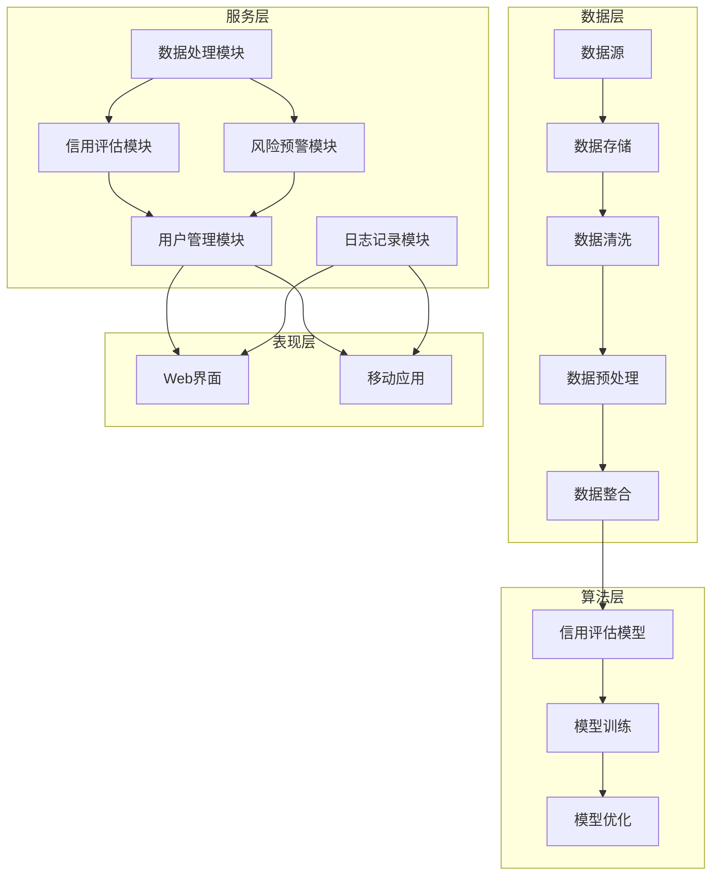
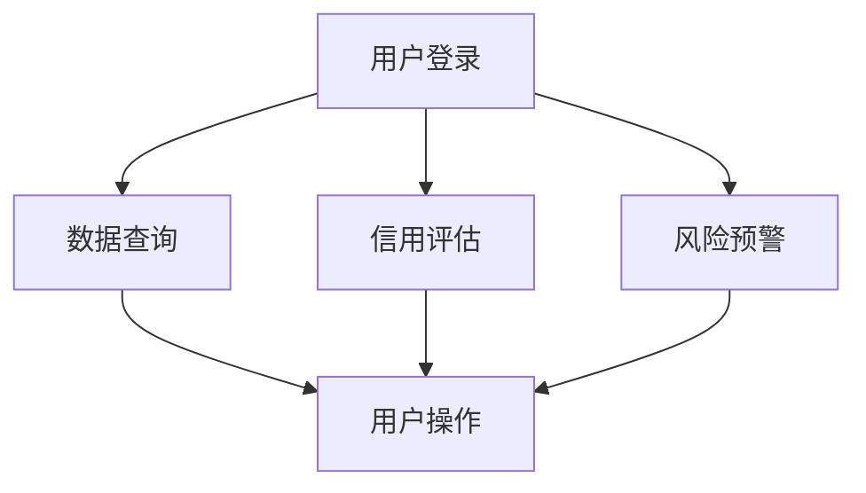

                 

# AI驱动的企业应收账款组合信用风险评估系统

## 关键词
- **AI技术**、**信用风险评估**、**企业应收账款**、**机器学习模型**、**深度学习算法**、**风险预警系统**、**数据预处理**、**特征工程**

## 摘要
本文深入探讨了AI驱动的企业应收账款组合信用风险评估系统的构建和应用。首先，通过背景介绍，阐述了应收账款组合信用风险评估的重要性及其面临的挑战。随后，详细介绍了AI技术在信用风险评估中的应用，包括AI技术的核心概念和优势。接着，本文提出了AI驱动的信用风险评估系统的整体框架，并逐步分析了核心概念、原理、算法及系统设计。通过实际案例分析，展示了系统的实现和效果，最终总结出最佳实践和未来发展趋势。

## 目录大纲

## 第一部分：背景介绍与核心概念

### 第1章：问题背景与核心概念

#### 1.1 应收账款组合信用风险评估的重要性

#### 1.1.1 应收账款在企业运营中的作用与风险

#### 1.1.2 信用风险评估的挑战与机遇

#### 1.2 AI技术在信用风险评估中的应用

#### 1.2.1 AI技术概述

#### 1.2.2 AI在信用风险评估中的优势

#### 1.2.3 AI在信用风险评估中的应用前景

#### 1.3 本书的核心概念与结构概述

#### 1.3.1 AI驱动的信用风险评估系统框架

#### 1.3.2 各章节内容概述

## 第二部分：核心概念与联系

### 第2章：AI驱动的信用风险评估原理

#### 2.1 AI驱动的信用风险评估概述

#### 2.1.1 AI驱动的信用风险评估流程

#### 2.1.2 AI驱动的信用风险评估与传统方法对比

#### 2.2 AI驱动的信用风险评估模型

#### 2.2.1 数据预处理与特征提取

#### 2.2.2 信用风险评估模型的构建

#### 2.2.3 模型评估与优化

#### 2.3 AI驱动的信用风险评估指标

#### 2.3.1 指标体系构建

#### 2.3.2 指标计算方法

#### 2.3.3 指标在风险预警中的应用

#### 2.4 AI驱动的信用风险评估算法

#### 2.4.1 算法概述

#### 2.4.2 算法对比与分析

#### 2.4.3 算法应用场景

## 第三部分：系统分析与架构设计

### 第3章：系统需求与功能设计

#### 3.1 系统需求分析

#### 3.1.1 系统需求概述

#### 3.1.2 功能需求分析

#### 3.2 系统功能设计

#### 3.2.1 领域模型设计

#### 3.2.2 系统架构设计

#### 3.2.3 系统接口设计

### 第4章：系统架构设计与实现

#### 4.1 系统架构设计

#### 4.1.1 系统架构概述

#### 4.1.2 系统模块划分

#### 4.1.3 系统架构图

#### 4.2 系统接口设计

#### 4.2.1 接口设计原则

#### 4.2.2 接口实现细节

#### 4.2.3 接口调用流程

#### 4.3 系统交互设计

#### 4.3.1 系统交互概述

#### 4.3.2 系统交互流程图

## 第四部分：项目实战

### 第5章：环境安装与配置

#### 5.1 环境搭建

#### 5.1.1 硬件与软件需求

#### 5.1.2 环境搭建步骤

#### 5.2 数据准备与处理

#### 5.2.1 数据来源

#### 5.2.2 数据预处理

#### 5.2.3 数据特征提取

### 第6章：系统核心实现与代码解析

#### 6.1 系统核心模块实现

#### 6.1.1 数据处理模块

#### 6.1.2 信用风险评估模块

#### 6.1.3 风险预警模块

#### 6.2 代码解析与分析

#### 6.2.1 数据处理代码解析

#### 6.2.2 信用风险评估代码解析

#### 6.2.3 风险预警代码解析

### 第7章：实际案例分析

#### 7.1 案例背景

#### 7.1.1 案例概述

#### 7.1.2 案例目标

#### 7.2 案例实现过程

#### 7.2.1 数据收集与处理

#### 7.2.2 信用风险评估模型构建

#### 7.2.3 风险预警与评估

#### 7.3 案例分析与总结

#### 7.3.1 案例效果分析

#### 7.3.2 案例经验总结

## 第五部分：最佳实践与总结

### 第8章：最佳实践

#### 8.1 最佳实践总结

#### 8.1.1 实践经验

#### 8.1.2 注意事项

#### 8.1.3 拓展阅读

#### 8.2 实践案例分享

#### 8.2.1 案例一：企业应收账款组合信用风险评估系统搭建

#### 8.2.2 案例二：基于AI的信用风险评估模型优化

### 第9章：小结

#### 9.1 全书总结

#### 9.1.1 主要内容回顾

#### 9.1.2 关键技术总结

#### 9.1.3 未来发展趋势

#### 9.2 学习方法与建议

#### 9.2.1 学习方法

#### 9.2.2 阅读建议

#### 9.2.3 实践与拓展建议

接下来，我们将逐步深入每一部分的内容。首先，从问题背景和核心概念开始，为读者建立坚实的基础。随后，我们将探讨AI驱动的信用风险评估原理，介绍核心算法和模型。接着，分析系统需求和功能设计，并详细讲解系统架构和实现细节。然后，通过项目实战和案例分析，展示系统在实际中的应用效果。最后，总结最佳实践，展望未来发展趋势，并提供学习方法与建议。通过这样的结构，我们希望能够帮助读者全面了解AI驱动的企业应收账款组合信用风险评估系统，并在实践中应用这些知识。让我们一起深入思考，逐步构建这一强大的系统。

## 第一部分：背景介绍与核心概念

### 第1章：问题背景与核心概念

#### 1.1 应收账款组合信用风险评估的重要性

应收账款是企业运营中的重要组成部分，反映了企业在一定时期内对外出售商品或提供服务而尚未收回的款项。对企业来说，应收账款的管理不仅关系到企业的资金周转，还直接影响到企业的信用评级和财务健康状况。有效的应收账款管理可以帮助企业提高资金利用效率，降低坏账风险，从而提升企业的整体盈利能力。

在应收账款管理中，信用风险评估是关键环节之一。信用风险评估是指通过对借款人的信用状况、财务状况、还款能力等多方面信息进行分析，预测其还款意愿和还款能力，从而评估其信用风险。在企业应收账款组合中，信用风险评估尤为重要。因为企业往往面对多个客户，每个客户的信用状况可能存在显著差异，这种差异可能导致企业在资金回笼过程中面临不同的风险。因此，通过信用风险评估，企业可以合理调整应收账款组合，优化资源配置，降低风险。

随着商业环境的复杂化和信息技术的不断发展，传统的信用风险评估方法逐渐显露出其局限性。首先，传统的信用风险评估主要依赖于人工经验，评估过程主观性较强，容易受到人为因素的影响。其次，传统的信用风险评估方法往往依赖于有限的历史数据和简单的统计模型，无法充分挖掘数据中的深层次信息，导致评估结果的准确性和稳定性不足。此外，随着市场环境的快速变化，企业需要及时调整信用风险评估策略，以应对新的风险挑战。

#### 1.1.1 应收账款在企业运营中的作用与风险

应收账款是企业资金链的重要组成部分，其管理质量直接影响企业的运营效率和财务状况。具体来说，应收账款在企业运营中的作用主要体现在以下几个方面：

1. **资金流转**：应收账款是企业对外销售商品或提供服务后尚未收回的款项，它是企业现金流转的重要来源。有效的应收账款管理可以确保企业现金流的稳定，提高资金使用效率。

2. **信用政策**：应收账款管理是企业信用政策的一部分。通过合理的信用评估和信用政策，企业可以在保持市场竞争力的情况下，最大限度地减少坏账风险。

3. **盈利能力**：应收账款周转率是衡量企业盈利能力的重要指标。提高应收账款周转率，可以缩短回款周期，提高企业的资金利用率，从而提升整体盈利水平。

然而，应收账款同时也伴随着一定的风险。这些风险主要包括：

1. **坏账风险**：应收账款无法按期收回，可能导致坏账损失，影响企业的盈利和现金流。

2. **流动性风险**：过高的应收账款水平可能导致企业流动性紧张，影响日常运营和投资活动。

3. **信用风险**：企业客户的信用状况变化，可能导致应收账款的风险增加。

#### 1.1.2 信用风险评估的挑战与机遇

在现代商业环境中，信用风险评估面临着诸多挑战和机遇。以下是几个关键的挑战：

1. **数据复杂性**：现代商业环境中的数据量庞大，种类繁多，包括结构化和非结构化数据。如何有效地处理和分析这些数据，提取有用的信息，成为信用风险评估的关键挑战。

2. **实时性需求**：市场环境变化迅速，企业需要实时调整信用风险评估策略。传统的评估方法往往无法满足这种实时性需求。

3. **个性化需求**：每个企业的经营状况和风险偏好不同，信用风险评估需要具备较强的个性化能力，以适应不同企业的需求。

4. **合规性要求**：信用风险评估需要遵守一系列法律法规和监管要求，这对评估模型的开发和应用提出了更高的要求。

与此同时，AI技术的发展为信用风险评估带来了新的机遇：

1. **数据处理能力**：AI技术，特别是机器学习和深度学习，具备强大的数据处理和分析能力，可以高效地处理海量数据，提取关键特征。

2. **预测准确性**：AI模型可以通过对大量历史数据的训练，学习到数据的潜在模式和规律，从而提高信用风险评估的准确性。

3. **自动化与效率**：AI技术可以实现信用评估的自动化，提高评估效率和一致性，减少人为干预。

4. **实时性与动态调整**：AI技术可以实时分析市场环境和企业客户的变化，动态调整评估策略，适应不断变化的风险环境。

#### 1.2 AI技术在信用风险评估中的应用

AI技术，特别是机器学习和深度学习，在信用风险评估中展现出了巨大的潜力。以下是AI技术在信用风险评估中的几个关键应用：

1. **数据挖掘与特征提取**：AI技术可以高效地从大量历史数据中挖掘出与信用风险相关的特征，如客户的财务状况、交易行为、市场环境等。这些特征有助于提高评估模型的准确性和稳定性。

2. **预测模型构建**：基于挖掘到的特征，AI技术可以构建预测模型，预测客户的信用风险。这些模型可以通过不断的训练和优化，提高预测的准确性。

3. **实时风险监测**：AI技术可以实时分析市场和企业客户的变化，监测信用风险的动态变化，及时调整评估策略。

4. **风险评估自动化**：AI技术可以实现信用评估的自动化，减少人为干预，提高评估效率和一致性。

5. **风险评估多样化**：AI技术可以根据不同的业务场景和风险偏好，构建多样化的评估模型，满足个性化需求。

#### 1.2.1 AI技术概述

AI（Artificial Intelligence）是指通过计算机程序实现的智能，包括感知、学习、推理、规划、理解等人类智能的各个方面。AI技术主要包括以下几个方面：

1. **机器学习**：通过算法从数据中学习，改进性能，主要包括监督学习、无监督学习和半监督学习。

2. **深度学习**：一种基于人工神经网络的机器学习方法，通过多层神经网络对数据进行处理和特征提取，具有强大的数据处理和分析能力。

3. **自然语言处理**：使计算机能够理解和处理自然语言，包括文本分类、机器翻译、情感分析等。

4. **计算机视觉**：使计算机能够理解视觉信息，包括图像识别、物体检测、人脸识别等。

在信用风险评估中，AI技术的主要优势体现在：

1. **数据处理能力**：AI技术可以高效地处理和挖掘大量复杂数据，提取关键特征，提高评估模型的准确性。

2. **预测准确性**：通过训练大量的历史数据，AI模型可以学习到数据的潜在模式和规律，从而提高预测的准确性。

3. **实时性**：AI技术可以实现实时数据分析，及时调整评估策略，应对市场环境和企业客户的变化。

4. **自动化**：AI技术可以实现信用评估的自动化，减少人为干预，提高评估效率和一致性。

#### 1.2.2 AI在信用风险评估中的优势

AI技术在信用风险评估中具有显著的优势，主要体现在以下几个方面：

1. **处理复杂数据**：现代商业环境中，数据形式多样，包括结构化数据、非结构化数据和实时数据。AI技术，特别是深度学习，可以高效地处理这些复杂数据，提取有价值的信息。

2. **提高评估准确性**：通过大量的历史数据训练，AI模型可以学习到数据的内在规律，提高评估的准确性。相比之下，传统方法往往依赖于简单的统计模型，无法充分利用数据中的信息。

3. **实时风险监测**：AI技术可以实时分析市场环境和企业客户的变化，动态调整评估策略，确保评估的实时性和准确性。

4. **自动化与效率**：AI技术可以实现信用评估的自动化，减少人为干预，提高评估效率和一致性。这有助于企业降低成本，提高运营效率。

5. **个性化服务**：AI技术可以根据不同企业的业务场景和风险偏好，构建个性化的评估模型，满足不同企业的需求。

#### 1.2.3 AI在信用风险评估中的应用前景

随着AI技术的不断发展和成熟，其在信用风险评估中的应用前景十分广阔：

1. **自动化信用评估**：通过AI技术，企业可以实现信用评估的自动化，减少人工干预，提高评估效率和准确性。

2. **实时信用监测**：AI技术可以实时监测市场环境和企业客户的变化，及时调整评估策略，确保评估的实时性和准确性。

3. **个性化风险评估**：AI技术可以根据企业的业务场景和风险偏好，构建个性化的评估模型，提供精准的风险评估服务。

4. **风险评估多样化**：AI技术可以处理各种类型的数据，包括结构化数据、非结构化数据和实时数据，支持多样化的风险评估方法。

5. **风险评估的可解释性**：随着AI技术的不断发展，模型的可解释性将得到提高，有助于企业理解和信任评估结果。

#### 1.3 本书的核心概念与结构概述

本书旨在全面介绍AI驱动的企业应收账款组合信用风险评估系统的构建和应用。全书分为五个部分，共九章：

- **第一部分（第1章）**：背景介绍与核心概念，包括问题背景、核心概念和AI技术在信用风险评估中的应用。
- **第二部分（第2章）**：AI驱动的信用风险评估原理，介绍AI驱动的信用风险评估流程、模型、指标和算法。
- **第三部分（第3章至第4章）**：系统分析与架构设计，详细讲解系统需求、功能设计、架构设计和实现。
- **第四部分（第5章至第7章）**：项目实战，通过环境安装与配置、系统核心实现与代码解析、实际案例分析，展示系统的实际应用。
- **第五部分（第8章和第9章）**：最佳实践与总结，总结最佳实践、全书总结和未来发展趋势，并提供学习方法与建议。

通过以上结构，本书旨在帮助读者全面了解AI驱动的企业应收账款组合信用风险评估系统，并掌握其实际应用技巧。

### 第1章：问题背景与核心概念

#### 1.1 应收账款组合信用风险评估的重要性

在商业活动中，应收账款是企业向客户提供商品或服务后，尚未收回的款项。这些款项是企业资金流转的重要组成部分，直接关系到企业的运营效率和财务健康。有效的应收账款管理不仅能够提高企业的资金周转率，还能降低坏账风险，提升企业的盈利能力。然而，随着商业环境的复杂化和市场竞争的加剧，企业面临着越来越大的信用风险。因此，对应收账款组合进行信用风险评估，已经成为企业财务管理中的一项重要任务。

信用风险评估是通过对借款人或债务人的信用状况、财务状况、还款能力等多方面信息进行分析和评估，预测其还款意愿和还款能力，从而对其信用风险进行量化和评估。在企业应收账款管理中，信用风险评估具有以下几个重要作用：

1. **风险预警**：通过信用风险评估，企业可以及时发现潜在的信用风险，提前采取预防措施，避免或减少坏账损失。
2. **决策支持**：信用风险评估结果为企业的信用政策制定和客户管理提供重要依据，帮助企业优化客户信用等级，调整信用限额，制定合理的收款策略。
3. **资源配置**：有效的信用风险评估有助于企业合理配置资源，优先考虑信用等级较高的客户，提高资金使用效率。
4. **市场竞争力**：通过科学合理的信用风险评估，企业能够更好地把握市场机会，提高客户的满意度和忠诚度，增强市场竞争力。

然而，传统的信用风险评估方法在处理大量数据、应对市场变化和复杂业务场景方面存在一定的局限性。首先，传统的评估方法主要依赖于人工经验和历史数据，评估过程具有较大的主观性和不确定性。其次，传统方法往往依赖于简单的统计模型和线性关系，无法充分挖掘数据中的深层次信息，导致评估结果的准确性和稳定性不足。此外，传统方法在处理实时数据和非结构化数据方面能力有限，无法适应快速变化的市场环境。

随着人工智能技术的快速发展，AI技术在信用风险评估中的应用逐渐成为可能。AI技术，尤其是机器学习和深度学习，具有强大的数据处理和分析能力，能够从海量数据中提取有价值的信息，构建复杂的预测模型。通过引入AI技术，信用风险评估可以实现以下几个方面的提升：

1. **数据处理能力**：AI技术可以高效地处理和挖掘海量数据，包括结构化数据、非结构化数据和实时数据，提取关键特征，提高评估的准确性。
2. **预测准确性**：通过训练大量的历史数据，AI模型可以学习到数据的潜在模式和规律，提高预测的准确性，减少人为干预和误差。
3. **实时性**：AI技术可以实时分析市场环境和企业客户的变化，动态调整评估策略，确保评估的实时性和准确性。
4. **自动化**：AI技术可以实现信用评估的自动化，减少人工干预，提高评估效率和一致性。
5. **个性化**：AI技术可以根据不同企业的业务场景和风险偏好，构建个性化的评估模型，提供精准的风险评估服务。

#### 1.1.1 应收账款在企业运营中的作用与风险

应收账款是企业资金流转的重要组成部分，其作用主要体现在以下几个方面：

1. **资金流转**：应收账款是企业对外销售商品或提供服务后尚未收回的款项，它是企业现金流转的重要来源。有效的应收账款管理可以确保企业现金流的稳定，提高资金使用效率。

2. **信用政策**：应收账款管理是企业信用政策的一部分。通过合理的信用评估和信用政策，企业可以在保持市场竞争力的情况下，最大限度地减少坏账风险。

3. **盈利能力**：应收账款周转率是衡量企业盈利能力的重要指标。提高应收账款周转率，可以缩短回款周期，提高企业的资金利用率，从而提升整体盈利水平。

然而，应收账款同时也伴随着一定的风险。这些风险主要包括：

1. **坏账风险**：应收账款无法按期收回，可能导致坏账损失，影响企业的盈利和现金流。

2. **流动性风险**：过高的应收账款水平可能导致企业流动性紧张，影响日常运营和投资活动。

3. **信用风险**：企业客户的信用状况变化，可能导致应收账款的风险增加。

在企业管理中，应收账款的风险控制是至关重要的。通过科学的信用风险评估，企业可以识别潜在的信用风险，提前采取预防措施，降低坏账风险和流动性风险。此外，通过优化应收账款管理策略，企业可以提高资金利用效率，增强盈利能力。

#### 1.1.2 信用风险评估的挑战与机遇

在现代商业环境中，信用风险评估面临着诸多挑战和机遇：

**挑战**：

1. **数据复杂性**：现代商业环境中的数据形式多样，包括结构化数据、非结构化数据和实时数据。如何有效地处理和分析这些数据，提取有价值的信息，成为信用风险评估的重要挑战。

2. **实时性需求**：市场环境变化迅速，企业需要实时调整信用风险评估策略，以应对新的风险挑战。然而，传统的评估方法往往无法满足这种实时性需求。

3. **个性化需求**：每个企业的业务场景和风险偏好不同，信用风险评估需要具备较强的个性化能力，以适应不同企业的需求。

4. **合规性要求**：信用风险评估需要遵守一系列法律法规和监管要求，这对评估模型的开发和应用提出了更高的要求。

**机遇**：

1. **AI技术**：随着人工智能技术的快速发展，AI技术在信用风险评估中的应用逐渐成为可能。AI技术具有强大的数据处理和分析能力，能够从海量数据中提取有价值的信息，构建复杂的预测模型。

2. **数据挖掘**：通过数据挖掘技术，企业可以深入分析客户的历史交易数据、财务报表等信息，发现潜在的信用风险因素，提高评估的准确性和全面性。

3. **模型优化**：基于机器学习和深度学习技术的模型优化方法，可以帮助企业动态调整信用风险评估策略，提高评估的准确性和稳定性。

4. **自动化与效率**：AI技术可以实现信用评估的自动化，减少人工干预，提高评估效率和一致性，降低运营成本。

#### 1.2 AI技术在信用风险评估中的应用

AI技术在信用风险评估中具有广泛的应用前景，主要体现在以下几个方面：

1. **数据处理**：AI技术可以高效地处理和挖掘海量数据，包括结构化数据、非结构化数据和实时数据，提取关键特征，为评估模型提供丰富的数据支持。

2. **预测模型**：通过机器学习和深度学习技术，AI模型可以从历史数据中学习到数据的潜在模式和规律，构建复杂的预测模型，提高信用风险评估的准确性和稳定性。

3. **实时分析**：AI技术可以实现实时数据分析，动态调整评估策略，确保评估的实时性和准确性，帮助企业及时应对市场变化和风险挑战。

4. **自动化**：AI技术可以实现信用评估的自动化，减少人工干预，提高评估效率和一致性，降低运营成本。

5. **个性化**：AI技术可以根据不同企业的业务场景和风险偏好，构建个性化的评估模型，提供精准的风险评估服务。

#### 1.2.1 AI技术概述

AI（Artificial Intelligence）是指通过计算机程序实现的智能，包括感知、学习、推理、规划、理解等人类智能的各个方面。AI技术主要包括以下几个类别：

1. **机器学习**：通过算法从数据中学习，改进性能，主要包括监督学习、无监督学习和半监督学习。
2. **深度学习**：一种基于人工神经网络的机器学习方法，通过多层神经网络对数据进行处理和特征提取，具有强大的数据处理和分析能力。
3. **自然语言处理**：使计算机能够理解和处理自然语言，包括文本分类、机器翻译、情感分析等。
4. **计算机视觉**：使计算机能够理解视觉信息，包括图像识别、物体检测、人脸识别等。

在信用风险评估中，AI技术的主要优势体现在以下几个方面：

1. **数据处理能力**：AI技术可以高效地处理和挖掘海量数据，提取关键特征，为评估模型提供丰富的数据支持。
2. **预测准确性**：通过训练大量的历史数据，AI模型可以学习到数据的潜在模式和规律，提高预测的准确性，减少人为干预和误差。
3. **实时性**：AI技术可以实时分析市场环境和企业客户的变化，动态调整评估策略，确保评估的实时性和准确性。
4. **自动化**：AI技术可以实现信用评估的自动化，减少人工干预，提高评估效率和一致性，降低运营成本。
5. **个性化**：AI技术可以根据不同企业的业务场景和风险偏好，构建个性化的评估模型，提供精准的风险评估服务。

#### 1.2.2 AI在信用风险评估中的优势

AI技术在信用风险评估中具有以下几个显著的优势：

1. **数据处理能力**：AI技术可以高效地处理和挖掘海量数据，包括结构化数据、非结构化数据和实时数据。例如，企业可以通过AI技术对客户的交易记录、财务报表、社交媒体活动等多种数据进行整合和分析，提取出对信用风险评估有用的信息。

2. **预测准确性**：通过训练大量的历史数据，AI模型可以学习到数据的潜在模式和规律，从而提高预测的准确性。例如，机器学习模型可以通过分析大量客户的还款历史和财务状况，预测客户的信用风险等级。

3. **实时性**：AI技术可以实现实时数据分析，动态调整评估策略，确保评估的实时性和准确性。例如，企业可以通过实时监控系统，及时识别和应对潜在的风险事件，采取相应的风险控制措施。

4. **自动化**：AI技术可以实现信用评估的自动化，减少人工干预，提高评估效率和一致性。例如，企业可以通过自动化模型对新的客户申请进行快速评估，提高审批速度和准确性。

5. **个性化**：AI技术可以根据不同企业的业务场景和风险偏好，构建个性化的评估模型，提供精准的风险评估服务。例如，金融机构可以根据客户的历史交易行为、信用记录等特征，制定个性化的信用评估方案，提高风险控制能力。

#### 1.2.3 AI在信用风险评估中的应用前景

随着AI技术的不断发展和成熟，其在信用风险评估中的应用前景十分广阔。以下是几个关键的应用方向：

1. **自动化信用评估**：通过AI技术，企业可以实现信用评估的自动化，减少人工干预，提高评估效率和准确性。例如，金融机构可以通过自动化模型对新的客户申请进行快速评估，提高审批速度和准确性。

2. **实时信用监测**：AI技术可以实时分析市场环境和企业客户的变化，动态调整评估策略，确保评估的实时性和准确性。例如，企业可以通过实时监控系统，及时识别和应对潜在的风险事件，采取相应的风险控制措施。

3. **个性化风险评估**：AI技术可以根据不同企业的业务场景和风险偏好，构建个性化的评估模型，提供精准的风险评估服务。例如，金融机构可以根据客户的历史交易行为、信用记录等特征，制定个性化的信用评估方案，提高风险控制能力。

4. **风险评估多样化**：AI技术可以处理各种类型的数据，包括结构化数据、非结构化数据和实时数据，支持多样化的风险评估方法。例如，企业可以通过结合多种数据源，如财务报表、社交媒体活动等，构建更全面的风险评估模型。

5. **风险评估的可解释性**：随着AI技术的不断发展，模型的可解释性将得到提高，有助于企业理解和信任评估结果。例如，通过可视化技术和解释性算法，企业可以更好地解释模型的决策过程，提高评估结果的透明度和可接受性。

### 1.3 本书的核心概念与结构概述

本书旨在全面介绍AI驱动的企业应收账款组合信用风险评估系统的构建和应用，主要涵盖以下几个核心概念和章节内容：

#### 核心概念：

1. **AI驱动的信用风险评估**：介绍AI在信用风险评估中的应用，包括数据处理、预测模型、实时性和自动化等方面。
2. **信用风险评估模型**：介绍常见的信用风险评估模型，包括数据预处理、特征工程、模型构建、评估与优化等。
3. **系统架构设计**：介绍信用风险评估系统的整体架构，包括数据层、算法层、应用层等。
4. **系统功能实现**：详细讲解系统的各个功能模块，包括数据处理模块、信用评估模块、风险预警模块等。
5. **项目实战与案例分析**：通过实际案例展示AI驱动的信用风险评估系统的应用过程和效果。

#### 各章节内容概述：

- **第1章**：问题背景与核心概念，介绍应收账款组合信用风险评估的重要性以及AI在其中的应用。
- **第2章**：AI驱动的信用风险评估原理，介绍AI驱动的信用风险评估流程、模型、指标和算法。
- **第3章**：系统需求与功能设计，分析系统需求，设计系统功能。
- **第4章**：系统架构设计与实现，介绍系统的架构设计、接口设计和交互设计。
- **第5章**：环境安装与配置，讲解系统的环境搭建和配置过程。
- **第6章**：系统核心实现与代码解析，详细解析系统核心模块的实现和代码。
- **第7章**：实际案例分析，通过案例分析展示系统的实际应用效果。
- **第8章**：最佳实践，总结最佳实践经验和注意事项，提供拓展阅读资源。
- **第9章**：小结，回顾全书主要内容，总结关键技术和未来发展趋势。

通过以上结构和内容，本书旨在帮助读者全面了解AI驱动的企业应收账款组合信用风险评估系统，掌握其实际应用方法和技巧。

### 第二部分：核心概念与联系

#### 第2章：AI驱动的信用风险评估原理

在构建AI驱动的企业应收账款组合信用风险评估系统中，理解核心概念和原理是至关重要的。这一章节将详细探讨AI驱动的信用风险评估原理，包括评估流程、模型构建、指标体系以及算法选择。通过这些核心概念的理解，我们可以更好地设计并优化风险评估系统，提高其准确性和实用性。

#### 2.1 AI驱动的信用风险评估概述

AI驱动的信用风险评估是一种利用人工智能技术，特别是机器学习和深度学习，对企业的应收账款进行信用风险评估的方法。这种方法不仅能够处理复杂的数据集，还能通过自我学习和优化，提供更准确的评估结果。以下是AI驱动的信用风险评估的主要流程：

1. **数据收集**：收集与信用评估相关的数据，包括客户的财务报表、交易记录、市场环境数据等。
2. **数据预处理**：对收集到的数据进行分析和清洗，去除噪声数据和异常值，确保数据质量。
3. **特征提取**：从数据中提取有助于信用评估的特征，例如客户的信用评分历史、财务指标、交易行为等。
4. **模型构建**：使用机器学习或深度学习算法，构建信用风险评估模型。
5. **模型训练与优化**：通过历史数据对模型进行训练，并不断优化模型参数，提高模型的预测准确性。
6. **模型评估**：使用验证集和测试集对模型进行评估，确保其性能和可靠性。
7. **风险预警**：利用训练好的模型，对新的客户申请进行信用风险评估，并提供风险预警。

相比传统的信用风险评估方法，AI驱动的评估方法具有以下几个显著优势：

- **数据处理能力**：AI技术能够高效地处理和分析大规模、多样化的数据，提取出有价值的信息。
- **预测准确性**：通过学习历史数据中的潜在模式，AI模型可以提供更准确的预测结果。
- **实时性**：AI技术可以实现实时数据分析，及时调整风险评估策略，适应市场环境的变化。
- **自动化与效率**：AI技术可以实现评估过程的自动化，减少人为干预，提高评估效率和一致性。

#### 2.1.1 AI驱动的信用风险评估流程

AI驱动的信用风险评估流程可以分为以下几个关键步骤：

1. **数据收集**：首先，需要收集与信用评估相关的数据，这些数据可以是结构化的，如客户的财务报表、交易记录，也可以是非结构化的，如客户的社交媒体活动、新闻报道等。数据来源可能包括内部数据（如企业自身的交易记录）和外部数据（如公共信用记录、行业报告等）。

2. **数据预处理**：在收集到数据后，需要进行预处理，包括数据清洗、数据整合和特征工程。数据清洗的目的是去除噪声数据和异常值，确保数据的质量和一致性。数据整合是将不同来源的数据进行合并，形成统一的数据集。特征工程则是从原始数据中提取有助于信用评估的特征，例如客户的信用评分历史、财务指标、交易行为等。

3. **特征提取**：特征提取是将预处理后的数据转换为机器学习算法能够处理的格式。这一步骤包括特征选择、特征转换和特征扩展。特征选择是选择对信用评估最有影响力的特征；特征转换是将数值特征转换为适合算法处理的格式，如归一化或标准化；特征扩展是通过组合现有特征或生成新的特征，提高模型的预测能力。

4. **模型构建**：使用机器学习或深度学习算法构建信用风险评估模型。常见的算法包括逻辑回归、决策树、随机森林、支持向量机、神经网络等。在选择算法时，需要考虑模型的复杂性、计算效率和预测准确性。

5. **模型训练与优化**：使用历史数据对模型进行训练，并不断优化模型参数，以提高模型的预测准确性。训练过程中，可以使用交叉验证技术来评估模型的性能，并调整模型参数，如学习率、迭代次数等。

6. **模型评估**：使用验证集和测试集对训练好的模型进行评估。评估指标包括准确率、召回率、F1分数等。通过这些指标，可以评估模型的预测性能，并确定是否需要进行进一步的优化。

7. **风险预警**：利用训练好的模型，对新的客户申请进行信用风险评估，并提供风险预警。通过实时监控和数据分析，系统可以及时发现潜在的风险事件，并采取相应的措施。

#### 2.1.2 AI驱动的信用风险评估与传统方法对比

传统信用风险评估方法主要依赖于人工经验和历史数据分析。这种方法虽然在一些情况下仍然有效，但随着商业环境的复杂化和数据量的爆炸式增长，其局限性也逐渐显现。以下是AI驱动的信用风险评估与传统方法在几个关键方面的对比：

1. **数据处理能力**：传统方法通常只能处理结构化数据，且依赖于手动数据分析。而AI驱动的评估方法可以处理大规模的、多样化的数据，包括结构化数据和非结构化数据。这种处理能力使得AI方法能够更全面地理解客户信用风险。

2. **预测准确性**：传统方法主要依赖于简单的统计模型，如逻辑回归、决策树等，这些模型在处理复杂数据时效果有限。而AI驱动的评估方法，通过深度学习等算法，可以从海量历史数据中学习到复杂的模式，提高预测准确性。

3. **实时性**：传统方法往往需要较长的时间进行数据分析和模型构建，无法实现实时风险评估。而AI驱动的评估方法通过实时数据处理和分析，可以及时调整风险评估策略，适应快速变化的市场环境。

4. **自动化与效率**：传统方法依赖人工进行风险评估，效率较低，且容易受到人为因素影响。而AI驱动的评估方法可以实现自动化，减少人为干预，提高评估效率和一致性。

5. **个性化**：传统方法难以根据不同客户的特点进行个性化风险评估。而AI驱动的评估方法可以根据客户的个性化数据，构建个性化的评估模型，提供更精准的风险评估服务。

#### 2.2 AI驱动的信用风险评估模型

AI驱动的信用风险评估模型是系统的核心，其性能直接影响到评估结果的准确性和可靠性。以下将详细讨论信用风险评估模型的构建过程，包括数据预处理、特征提取和模型训练。

##### 2.2.1 数据预处理与特征提取

数据预处理和特征提取是构建信用风险评估模型的重要步骤。以下是具体的过程：

1. **数据清洗**：数据清洗的目的是去除数据中的噪声和异常值，确保数据的质量。这一步包括缺失值处理、异常值检测和去除重复数据等。

2. **数据整合**：将来自不同来源的数据进行整合，形成一个统一的数据集。例如，将客户的财务数据、交易数据和市场环境数据进行合并。

3. **特征选择**：选择对信用评估影响最大的特征，去除冗余特征。特征选择的方法包括相关性分析、主成分分析（PCA）等。

4. **特征转换**：将数值特征转换为适合算法处理的格式。例如，使用归一化或标准化方法处理数值特征，使用独热编码（One-Hot Encoding）处理分类特征。

5. **特征扩展**：通过组合现有特征或生成新的特征，提高模型的预测能力。特征扩展的方法包括特征交叉、特征构造等。

##### 2.2.2 信用风险评估模型的构建

构建信用风险评估模型的关键步骤如下：

1. **选择算法**：根据数据特点和业务需求，选择适合的机器学习或深度学习算法。常见的算法包括逻辑回归、决策树、随机森林、支持向量机（SVM）、神经网络（NN）等。

2. **模型训练**：使用历史数据对模型进行训练。训练过程中，算法将学习数据的特征和模式，并调整模型参数，以优化预测性能。

3. **模型验证**：使用验证集对训练好的模型进行验证，评估模型的预测性能。常用的评估指标包括准确率、召回率、F1分数等。

4. **模型优化**：根据验证结果，调整模型参数，优化模型性能。可以使用交叉验证、网格搜索等方法进行参数调优。

##### 2.2.3 模型评估与优化

评估和优化信用风险评估模型是确保其准确性和可靠性的关键步骤。以下是具体的过程：

1. **性能评估**：使用测试集对模型进行评估，以验证模型在未知数据上的预测性能。常用的评估指标包括准确率、召回率、F1分数等。

2. **错误分析**：分析模型预测错误的案例，找出可能导致错误的原因。例如，数据质量、模型复杂性、特征选择等。

3. **模型调优**：根据错误分析结果，对模型进行调整和优化。可以调整模型参数、增加特征、更换算法等。

4. **迭代优化**：通过多次迭代训练和优化，不断提高模型的预测性能，直至达到满意的评估指标。

##### 2.3 AI驱动的信用风险评估指标

在信用风险评估中，指标体系构建是关键的一步，它决定了评估结果的科学性和实用性。以下是构建信用风险评估指标体系的过程：

1. **指标体系设计**：根据业务需求和数据特性，设计合理的指标体系。指标体系应包括财务指标、行为指标、市场指标等。

2. **指标计算方法**：定义每个指标的计算方法，确保指标的准确性和一致性。例如，财务指标可以包括资产负债率、流动比率等；行为指标可以包括逾期次数、交易频率等。

3. **指标权重分配**：根据各指标的重要性，分配相应的权重，以确保评估结果的平衡性和全面性。

4. **指标应用场景**：明确每个指标的应用场景，例如在风险预警、信用评级、决策支持等方面的作用。

##### 2.3.1 指标体系构建

构建一个有效的信用风险评估指标体系，需要考虑以下几个方面：

1. **财务指标**：财务指标是评估客户信用风险的重要方面，包括资产负债率、流动比率、速动比率等。这些指标反映了客户的财务健康状况和偿债能力。

2. **行为指标**：行为指标反映了客户的历史行为和交易习惯，如逾期次数、交易频率、还款方式等。这些指标有助于评估客户的还款意愿和还款能力。

3. **市场指标**：市场指标反映了客户所在行业和市场环境的变化，如行业增长率、市场波动性等。这些指标有助于评估客户面临的市场风险。

4. **社会指标**：社会指标反映了客户的社会关系和声誉，如社会地位、教育背景等。这些指标可以提供额外的风险评估信息。

##### 2.3.2 指标计算方法

以下是几个关键指标的详细计算方法：

1. **资产负债率**：资产负债率 = 总负债 / 总资产，该指标反映了企业的负债水平，越高表示负债风险越高。

2. **流动比率**：流动比率 = 流动资产 / 流动负债，该指标反映了企业的短期偿债能力，越高表示偿债能力越强。

3. **逾期次数**：逾期次数 = 逾期贷款笔数 / 总贷款笔数，该指标反映了客户的还款行为，越高表示还款意愿越低。

4. **交易频率**：交易频率 = 总交易笔数 / 总交易天数，该指标反映了客户的交易活跃度，越高表示信用风险可能越高。

##### 2.3.3 指标在风险预警中的应用

在信用风险评估中，指标的应用场景主要包括风险预警、信用评级和决策支持等。以下是具体的应用：

1. **风险预警**：通过实时监控关键指标的变化，系统可以及时发现潜在的风险，并触发预警机制。例如，当客户的逾期次数达到一定阈值时，系统会自动发送预警通知。

2. **信用评级**：根据客户的历史数据和指标计算结果，系统可以生成客户的信用评级，如优秀、良好、一般、较差等。这些评级为企业的信用管理提供了参考。

3. **决策支持**：基于风险评估结果，企业可以制定相应的信用政策，如调整信用限额、改变收款策略等，以降低信用风险，提高盈利能力。

#### 2.4 AI驱动的信用风险评估算法

在AI驱动的信用风险评估中，选择合适的算法是实现高效、准确评估的关键。以下是几种常用的信用风险评估算法及其对比：

##### 2.4.1 算法概述

1. **逻辑回归**：逻辑回归是一种常用的分类算法，通过建立逻辑函数，将连续的预测结果映射到概率空间。逻辑回归模型简单、易于理解和实现，但在处理非线性关系和复杂数据时性能有限。

2. **决策树**：决策树是一种基于树结构的分类算法，通过一系列的决策节点，将数据划分为不同的类别。决策树具有直观的解释性和良好的分类效果，但容易过拟合，且在大规模数据集上计算复杂度高。

3. **随机森林**：随机森林是一种基于决策树的集成学习方法，通过构建多个决策树，并取它们的平均值进行预测。随机森林在提高分类性能的同时，降低了过拟合的风险，但在计算资源方面有更高的要求。

4. **支持向量机（SVM）**：支持向量机是一种基于最大间隔的分类算法，通过寻找最佳的超平面，将不同类别数据分开。SVM在处理高维数据和线性不可分数据时效果显著，但对参数选择和核函数的选择要求较高。

5. **神经网络**：神经网络是一种基于人工神经网络的机器学习方法，通过多层神经网络对数据进行处理和特征提取。神经网络具有强大的非线性处理能力和自我学习能力，但需要大量的数据和计算资源。

##### 2.4.2 算法对比与分析

以下是几种常见算法的对比分析：

| 算法         | 特点                                                   | 适用场景                                         |
| ------------ | ------------------------------------------------------ | ---------------------------------------------- |
| 逻辑回归     | 简单、易于理解，适合线性关系                           | 复杂度较低的数据集，线性关系明显                 |
| 决策树       | 直观、易于解释，分类效果较好                           | 数据量较小的分类任务，需要清晰的决策路径         |
| 随机森林     | 集成多个决策树，提高分类性能，减少过拟合               | 数据量较大的分类任务，需要较高的分类准确性       |
| 支持向量机   | 线性不可分数据的分类，处理高维数据效果显著             | 高维数据、线性不可分数据、对参数敏感             |
| 神经网络     | 非线性处理能力，自我学习能力                           | 复杂的非线性关系，大量数据，需要自我学习能力的数据集 |

##### 2.4.3 算法应用场景

根据不同的应用场景和业务需求，可以选择不同的算法：

1. **对于需要快速预测的场景**：逻辑回归和决策树由于其简单和易于实现的特点，适合快速预测。例如，在客户信用评分的初步筛选阶段，可以采用逻辑回归模型。

2. **对于需要精确分类的场景**：随机森林和神经网络由于其强大的分类能力和处理复杂数据的能力，适合精确分类。例如，在客户信用评级中，可以采用随机森林或神经网络模型。

3. **对于需要解释性的场景**：决策树由于其直观的解释性，适合需要模型解释性的应用场景。例如，在信用风险评估报告生成时，可以使用决策树模型。

通过以上对AI驱动的信用风险评估算法的详细讨论，我们可以更好地理解各种算法的特点和适用场景，为实际应用选择合适的算法提供参考。

### 第三部分：系统分析与架构设计

#### 第3章：系统需求与功能设计

在构建AI驱动的企业应收账款组合信用风险评估系统时，明确系统需求与功能设计是至关重要的。这不仅有助于我们理解系统的核心目标，还能指导系统的开发与实施。以下将详细分析系统需求、功能设计，以及领域模型设计，确保系统能够满足业务需求和提供高效的风险评估服务。

#### 3.1 系统需求分析

系统需求分析是系统设计与实现的第一步，它帮助我们明确系统的核心功能、性能要求、用户界面和系统接口等。以下是AI驱动的企业应收账款组合信用风险评估系统的需求分析：

1. **业务需求**：
   - **信用评估**：系统能够对客户的信用状况进行评估，包括信用评分、信用等级和风险预警。
   - **数据管理**：系统能够高效地管理大量结构化数据和非结构化数据，包括客户交易记录、财务报表、市场环境数据等。
   - **实时监控**：系统能够实时监控客户信用状况和市场变化，及时更新风险评估结果。
   - **自动化处理**：系统能够自动化处理客户信用评估任务，减少人工干预，提高评估效率。

2. **性能需求**：
   - **响应时间**：系统能够在合理的时间内完成客户信用评估，确保用户能够及时获取评估结果。
   - **数据存储**：系统能够高效存储和管理大量数据，保证数据的一致性和可靠性。
   - **扩展性**：系统设计应具有良好的扩展性，能够支持数据量增加和功能扩展。

3. **用户需求**：
   - **易用性**：系统应具备友好的用户界面，用户能够轻松操作，进行信用评估和相关查询。
   - **可解释性**：系统应提供透明的评估过程和结果解释，用户能够理解评估依据和结论。
   - **定制化**：系统应允许用户根据业务需求自定义评估指标和策略。

4. **技术需求**：
   - **硬件需求**：系统应支持高性能计算和存储设备，以满足大量数据处理的需求。
   - **软件需求**：系统应采用可靠的开源框架和工具，确保系统的稳定性和可维护性。

#### 3.1.1 系统需求概述

系统需求概述是对系统功能、性能、用户和技术需求的简要描述，旨在为系统设计提供指导。以下是AI驱动的企业应收账款组合信用风险评估系统需求概述：

- **核心功能**：信用评估、数据管理、实时监控和自动化处理。
- **性能要求**：响应时间在秒级，数据存储和管理高效，扩展性良好。
- **用户界面**：易用性高，提供友好的用户操作界面。
- **定制化**：允许用户自定义评估指标和策略。
- **技术支持**：采用高性能计算和可靠的开源框架。

#### 3.1.2 功能需求分析

功能需求分析是系统需求分析的核心，它详细描述了系统应实现的各种功能。以下是AI驱动的企业应收账款组合信用风险评估系统的功能需求分析：

1. **信用评估功能**：
   - **客户信用评分**：系统应能够根据客户的交易记录、财务报表、市场环境数据等，对客户的信用评分进行自动计算。
   - **信用等级划分**：系统应能够根据评分结果，将客户划分为不同的信用等级，如优秀、良好、一般、较差等。
   - **风险预警**：系统应能够根据信用评分和信用等级，对潜在的风险客户进行预警，并提供预警通知。

2. **数据管理功能**：
   - **数据采集**：系统应能够从多种数据源自动采集数据，包括内部数据（如交易记录、财务报表）和外部数据（如市场环境数据）。
   - **数据存储**：系统应能够高效存储和管理大量数据，确保数据的一致性和可靠性。
   - **数据查询**：系统应提供数据查询功能，用户可以轻松查询和管理数据。

3. **实时监控功能**：
   - **实时数据更新**：系统应能够实时更新客户的信用状况，确保用户能够获取最新的评估结果。
   - **市场环境监控**：系统应能够监控市场环境的变化，分析市场趋势，提供市场风险评估。

4. **自动化处理功能**：
   - **自动化评估**：系统应能够自动化处理客户信用评估任务，减少人工干预。
   - **自动化通知**：系统应能够根据评估结果，自动发送预警通知，提醒相关用户。

#### 3.2 系统功能设计

系统功能设计是系统需求分析的进一步细化，它明确了系统应实现的具体功能模块和交互流程。以下是AI驱动的企业应收账款组合信用风险评估系统的功能设计：

##### 3.2.1 领域模型设计

领域模型设计是系统功能设计的基础，它通过类图、ER图等图形化工具，描述系统的核心概念和关系。以下是AI驱动的企业应收账款组合信用风险评估系统的领域模型设计：

- **客户实体**：包括客户的基本信息、信用评分、信用等级等。
- **交易记录实体**：包括交易日期、交易金额、交易类型等。
- **财务报表实体**：包括财务指标、资产负债表、利润表等。
- **市场环境实体**：包括市场趋势、行业指标、宏观经济数据等。
- **风险评估实体**：包括评估模型、评估结果、预警通知等。

##### 3.2.2 系统架构设计

系统架构设计是系统功能设计的实现蓝图，它通过模块划分、架构图等工具，描述系统的整体结构和各模块之间的关系。以下是AI驱动的企业应收账款组合信用风险评估系统的架构设计：

- **数据层**：负责数据存储和管理，包括数据库、数据仓库等。
- **算法层**：负责信用评估模型的构建、训练和优化，包括机器学习、深度学习算法等。
- **服务层**：负责业务逻辑处理和系统功能实现，包括信用评估、数据管理、实时监控等。
- **表现层**：负责用户界面展示和交互，包括Web界面、移动应用等。

##### 3.2.3 系统接口设计

系统接口设计是系统功能设计的关键环节，它定义了系统内部各模块以及系统与外部系统的交互接口。以下是AI驱动的企业应收账款组合信用风险评估系统的接口设计：

- **内部接口**：包括数据层与服务层、算法层与服务层的接口，如API接口、消息队列等。
- **外部接口**：包括系统与外部系统的接口，如数据采集接口、第三方服务接口等。

##### 3.2.4 系统交互设计

系统交互设计是系统功能设计的细化，它通过交互流程图等工具，描述系统的用户操作流程和系统响应。以下是AI驱动的企业应收账款组合信用风险评估系统的交互设计：

- **用户操作流程**：用户登录系统、查询数据、发起评估、查看评估结果等。
- **系统响应流程**：系统接收到用户请求，进行数据处理、模型计算、结果反馈等。

通过以上系统需求与功能设计，我们可以确保AI驱动的企业应收账款组合信用风险评估系统满足业务需求，提供高效、准确的风险评估服务。接下来，我们将进一步探讨系统架构设计与实现，确保系统能够稳定运行并满足性能要求。

### 第3章：系统需求与功能设计

#### 3.1 系统需求分析

系统需求分析是系统设计与实现的基础，它帮助我们明确系统的功能、性能要求、用户界面和系统接口等，从而指导系统的开发与实施。以下是AI驱动的企业应收账款组合信用风险评估系统的详细需求分析。

##### 3.1.1 系统需求概述

AI驱动的企业应收账款组合信用风险评估系统的需求概述如下：

- **核心功能**：系统应具备信用评估、数据管理、实时监控和自动化处理等核心功能。
- **性能要求**：系统应具备高响应时间、高效的数据存储和管理能力，以及良好的扩展性。
- **用户需求**：系统应提供友好的用户界面，易于使用，并提供透明的评估过程和结果解释。
- **技术支持**：系统应采用可靠的技术框架，确保系统的稳定性和可维护性。

##### 3.1.2 功能需求分析

以下是系统具体的功能需求分析：

1. **信用评估功能**：
   - **客户信用评分**：系统能够根据客户的财务报表、交易记录等信息，自动计算客户的信用评分。
   - **信用等级划分**：系统能够根据信用评分，将客户划分为不同的信用等级，如优秀、良好、一般、较差等。
   - **风险预警**：系统能够根据信用评分和信用等级，对潜在的风险客户进行预警，并提供预警通知。

2. **数据管理功能**：
   - **数据采集**：系统能够自动从多种数据源（如数据库、API接口、文件等）采集数据。
   - **数据存储**：系统能够高效地存储和管理大量数据，确保数据的一致性和可靠性。
   - **数据查询**：系统能够提供便捷的数据查询功能，用户可以快速查询和管理数据。

3. **实时监控功能**：
   - **实时数据更新**：系统能够实时更新客户的信用状况，确保用户能够获取最新的评估结果。
   - **市场环境监控**：系统能够监控市场环境的变化，分析市场趋势，提供市场风险评估。

4. **自动化处理功能**：
   - **自动化评估**：系统能够自动化处理客户信用评估任务，减少人工干预。
   - **自动化通知**：系统能够根据评估结果，自动发送预警通知，提醒相关用户。

#### 3.2 系统功能设计

系统功能设计是系统需求分析的具体实现，它明确了系统的各个功能模块和交互流程。以下是AI驱动的企业应收账款组合信用风险评估系统的功能设计：

##### 3.2.1 领域模型设计

领域模型设计是系统功能设计的基础，它通过类图、ER图等工具，描述系统的核心概念和关系。以下是AI驱动的企业应收账款组合信用风险评估系统的领域模型设计：

- **客户实体**：包括客户的基本信息、信用评分、信用等级等。
- **交易记录实体**：包括交易日期、交易金额、交易类型等。
- **财务报表实体**：包括财务指标、资产负债表、利润表等。
- **市场环境实体**：包括市场趋势、行业指标、宏观经济数据等。
- **风险评估实体**：包括评估模型、评估结果、预警通知等。

##### 3.2.2 系统架构设计

系统架构设计是系统功能设计的实现蓝图，它通过模块划分、架构图等工具，描述系统的整体结构和各模块之间的关系。以下是AI驱动的企业应收账款组合信用风险评估系统的架构设计：

- **数据层**：负责数据存储和管理，包括数据库、数据仓库等。
- **算法层**：负责信用评估模型的构建、训练和优化，包括机器学习、深度学习算法等。
- **服务层**：负责业务逻辑处理和系统功能实现，包括信用评估、数据管理、实时监控等。
- **表现层**：负责用户界面展示和交互，包括Web界面、移动应用等。

##### 3.2.3 系统接口设计

系统接口设计是系统功能设计的关键环节，它定义了系统内部各模块以及系统与外部系统的交互接口。以下是AI驱动的企业应收账款组合信用风险评估系统的接口设计：

- **内部接口**：包括数据层与服务层、算法层与服务层的接口，如API接口、消息队列等。
- **外部接口**：包括系统与外部系统的接口，如数据采集接口、第三方服务接口等。

##### 3.2.4 系统交互设计

系统交互设计是系统功能设计的细化，它通过交互流程图等工具，描述系统的用户操作流程和系统响应。以下是AI驱动的企业应收账款组合信用风险评估系统的交互设计：

- **用户操作流程**：用户登录系统、查询数据、发起评估、查看评估结果等。
- **系统响应流程**：系统接收到用户请求，进行数据处理、模型计算、结果反馈等。

通过以上系统需求与功能设计，我们为AI驱动的企业应收账款组合信用风险评估系统的开发与实施提供了详细的指导。接下来，我们将深入探讨系统架构设计与实现，确保系统能够高效、稳定地运行。

### 第4章：系统架构设计与实现

#### 4.1 系统架构设计

在构建AI驱动的企业应收账款组合信用风险评估系统时，系统架构设计是确保系统稳定、高效运行的关键。一个良好的系统架构不仅可以满足业务需求，还能具备良好的扩展性和可维护性。以下将详细描述该系统的架构设计，包括系统架构概述、模块划分和系统架构图。

##### 4.1.1 系统架构概述

AI驱动的企业应收账款组合信用风险评估系统可以分为四个主要层次：数据层、算法层、服务层和表现层。以下是系统架构的概述：

1. **数据层**：负责数据的存储和管理，包括原始数据存储、数据清洗和预处理等。
2. **算法层**：负责信用评估模型的构建、训练和优化，包括机器学习和深度学习算法等。
3. **服务层**：负责业务逻辑处理和系统功能实现，包括信用评估、数据管理、实时监控等。
4. **表现层**：负责用户界面展示和交互，包括Web界面、移动应用等。

##### 4.1.2 系统模块划分

系统模块划分是系统架构设计的重要环节，它将系统功能细化为多个可管理的模块，确保系统各部分之间的高内聚和低耦合。以下是AI驱动的企业应收账款组合信用风险评估系统的模块划分：

- **数据收集模块**：负责从各种数据源（如数据库、API接口、文件等）采集数据，并进行数据清洗和预处理。
- **数据处理模块**：负责对采集到的数据进行处理，包括数据整合、特征提取和特征工程等。
- **信用评估模块**：负责构建信用评估模型，并进行模型训练、优化和评估。
- **风险预警模块**：负责根据信用评估结果，实时监控客户信用状况，并提供风险预警。
- **用户管理模块**：负责用户认证、权限管理和用户界面展示。
- **日志记录模块**：负责记录系统运行日志，便于故障排查和性能优化。

##### 4.1.3 系统架构图

以下是AI驱动的企业应收账款组合信用风险评估系统的架构图，展示了各模块之间的关系和交互：



#### 4.2 系统接口设计

系统接口设计是确保系统模块之间高效、稳定交互的关键。以下将详细描述AI驱动的企业应收账款组合信用风险评估系统的接口设计，包括接口设计原则、实现细节和调用流程。

##### 4.2.1 接口设计原则

接口设计应遵循以下原则：

- **标准化**：接口应采用标准化的协议和格式，如RESTful API、GraphQL等。
- **高内聚低耦合**：接口应保证模块之间的高内聚和低耦合，减少模块间的依赖。
- **安全性**：接口应具备良好的安全性，包括身份验证、数据加密和访问控制等。
- **易扩展性**：接口设计应具备良好的扩展性，便于未来的功能扩展和升级。

##### 4.2.2 接口实现细节

以下是系统接口的实现细节，包括API的URL、请求参数和响应结果：

1. **数据收集接口**：
   - **URL**：`/data-collect`
   - **请求参数**：无
   - **响应结果**：{"status": "success", "message": "数据已成功收集"}

2. **数据预处理接口**：
   - **URL**：`/data-preprocess`
   - **请求参数**：{"data": data}
   - **响应结果**：{"status": "success", "message": "数据预处理完成"}

3. **信用评估接口**：
   - **URL**：`/credit-assess`
   - **请求参数**：{"customer_id": customer_id}
   - **响应结果**：{"status": "success", "credit_score": credit_score, "risk_level": risk_level}

4. **风险预警接口**：
   - **URL**：`/risk-warning`
   - **请求参数**：{"customer_id": customer_id}
   - **响应结果**：{"status": "success", "warning_message": warning_message}

5. **用户管理接口**：
   - **URL**：`/user-management`
   - **请求参数**：{"action": action, "user_id": user_id}
   - **响应结果**：{"status": "success", "message": "用户操作成功"}

##### 4.2.3 接口调用流程

以下是系统接口的调用流程：

1. **数据收集**：
   - 系统启动时，从数据源（如数据库、API接口、文件等）自动收集数据。

2. **数据预处理**：
   - 收集到的数据通过数据预处理接口进行处理，包括数据清洗、数据整合和特征提取。

3. **信用评估**：
   - 对预处理后的数据进行信用评估，生成信用评分和风险等级。

4. **风险预警**：
   - 根据信用评估结果，对风险等级较高的客户进行预警，并生成预警通知。

5. **用户管理**：
   - 用户通过Web界面或移动应用登录系统，进行数据查询、信用评估和风险预警。

6. **日志记录**：
   - 系统运行过程中，记录日志信息，包括接口调用情况、评估结果和用户操作等。

通过以上接口设计，AI驱动的企业应收账款组合信用风险评估系统实现了模块间的高效交互，确保了系统的稳定性和可维护性。

#### 4.3 系统交互设计

系统交互设计是确保系统功能顺利实现的关键环节，它通过交互流程图等工具，描述系统的用户操作流程和系统响应。以下将详细描述AI驱动的企业应收账款组合信用风险评估系统的交互设计，包括系统交互概述和系统交互流程图。

##### 4.3.1 系统交互概述

AI驱动的企业应收账款组合信用风险评估系统的交互设计包括以下几个主要环节：

1. **用户登录**：用户通过Web界面或移动应用登录系统，进行数据查询、信用评估和风险预警。
2. **数据查询**：用户可以查询系统中的各种数据，包括客户信息、交易记录、财务报表等。
3. **信用评估**：系统根据用户提供的客户信息，自动进行信用评估，生成信用评分和风险等级。
4. **风险预警**：根据信用评估结果，系统对风险等级较高的客户进行预警，并生成预警通知。
5. **用户操作**：用户可以对评估结果进行查看、修改和导出，以便进行进一步分析。

##### 4.3.2 系统交互流程图

以下是AI驱动的企业应收账款组合信用风险评估系统的交互流程图：



- **用户登录**：用户通过输入用户名和密码，登录系统。系统验证用户身份，并生成会话令牌。
- **数据查询**：用户登录后，可以查询系统中的客户信息、交易记录、财务报表等。系统根据用户的查询请求，返回相应的数据。
- **信用评估**：用户提交客户信息，系统根据这些信息自动进行信用评估，生成信用评分和风险等级。系统将评估结果返回给用户。
- **风险预警**：系统根据信用评估结果，对风险等级较高的客户进行预警，并生成预警通知。系统将预警通知发送给相关用户。
- **用户操作**：用户可以对评估结果进行查看、修改和导出。系统根据用户的操作，更新数据和处理结果。

通过以上交互设计，AI驱动的企业应收账款组合信用风险评估系统实现了用户与系统之间的顺畅交互，确保了系统的易用性和高效性。

### 第四部分：项目实战

#### 第5章：环境安装与配置

在实施AI驱动的企业应收账款组合信用风险评估系统之前，必须搭建一个稳定、高效的计算环境。以下将详细介绍环境安装与配置的过程，包括硬件与软件需求、环境搭建步骤以及数据准备与处理。

#### 5.1 环境搭建

##### 5.1.1 硬件与软件需求

为了确保系统能够稳定、高效地运行，以下是推荐的硬件与软件需求：

1. **硬件需求**：
   - **CPU**：Intel Xeon 或 AMD Ryzen 系列，至少 8 核心处理器。
   - **内存**：至少 64GB RAM。
   - **存储**：1TB SSD 硬盘，用于系统安装和数据存储。
   - **网络**：千兆以太网，确保网络连接稳定。

2. **软件需求**：
   - **操作系统**：Linux 发行版，如 Ubuntu 20.04 或 CentOS 8。
   - **开发环境**：Python 3.8 或更高版本，Jupyter Notebook，Docker。
   - **数据库**：MySQL 或 PostgreSQL，用于存储数据。
   - **机器学习库**：Scikit-learn、TensorFlow、PyTorch 等。

##### 5.1.2 环境搭建步骤

以下是在推荐的硬件和软件环境中搭建AI驱动的企业应收账款组合信用风险评估系统的具体步骤：

1. **安装操作系统**：
   - 在硬件上安装Linux发行版，如 Ubuntu 20.04。
   - 根据硬件配置，设置合理的分区和文件系统。

2. **更新操作系统**：
   - 执行 `sudo apt update` 和 `sudo apt upgrade` 命令，更新操作系统和软件包。

3. **安装开发环境**：
   - 安装Python 3.8 及其相关依赖：`sudo apt install python3.8 python3.8-venv python3.8-pip`。
   - 创建虚拟环境：`python3.8 -m venv venv`。
   - 激活虚拟环境：`source venv/bin/activate`。

4. **安装数据库**：
   - 安装 MySQL 或 PostgreSQL：`sudo apt install mysql-server` 或 `sudo apt install postgresql`。
   - 配置数据库：创建用户和数据库，设置访问权限。

5. **安装机器学习库**：
   - 安装 Scikit-learn、TensorFlow 和 PyTorch：`pip install scikit-learn tensorflow torch`。

6. **安装 Jupyter Notebook**：
   - 安装 Jupyter Notebook：`pip install jupyterlab`。
   - 启动 Jupyter Notebook：`jupyter lab start`。

7. **安装 Docker**：
   - 安装 Docker：`sudo apt install docker-ce docker-compose`。
   - 启动 Docker 服务：`sudo systemctl start docker`。

##### 5.1.3 验证环境

完成环境搭建后，进行以下验证：

- 检查操作系统版本：`lsb_release -a`。
- 检查 Python 版本：`python --version`。
- 检查数据库服务：`systemctl status mysql` 或 `systemctl status postgresql`。
- 检查机器学习库：`pip list`。
- 启动 Jupyter Notebook，检查是否正常运行。

通过以上步骤，我们成功搭建了 AI 驱动的企业应收账款组合信用风险评估系统所需的计算环境，为后续的数据处理和模型训练提供了稳定的基础。

#### 5.2 数据准备与处理

在搭建好环境后，数据准备与处理是构建信用风险评估系统的关键步骤。以下将详细介绍数据收集、数据预处理和数据特征提取的过程。

##### 5.2.1 数据来源

数据来源可以分为内部数据和外部数据：

1. **内部数据**：
   - **客户交易记录**：包括交易日期、交易金额、交易类型等。
   - **财务报表**：包括资产负债表、利润表、现金流量表等。
   - **客户信息**：包括客户基本信息、信用历史等。

2. **外部数据**：
   - **公共信用记录**：来自政府机构或第三方信用服务机构的公开数据。
   - **市场环境数据**：包括宏观经济指标、行业指标等。
   - **社交媒体数据**：客户在社交媒体上的活动记录。

##### 5.2.2 数据预处理

数据预处理是确保数据质量的重要步骤，包括数据清洗、数据整合和特征工程：

1. **数据清洗**：
   - **缺失值处理**：对于缺失的数据，可以使用均值填补、中值填补或删除缺失值等方法。
   - **异常值检测**：使用统计方法（如Z-score、IQR法）检测和去除异常值。
   - **数据格式转换**：统一数据格式，如日期格式、货币格式等。

2. **数据整合**：
   - **合并数据源**：将来自不同数据源的数据进行整合，形成一个统一的数据集。
   - **数据规范化**：对不同数据源的数据进行归一化或标准化，使其具有可比性。

3. **特征工程**：
   - **特征选择**：使用统计方法（如相关性分析、主成分分析PCA）选择对信用评估有显著影响的特征。
   - **特征转换**：将数值特征进行归一化或标准化，将分类特征进行独热编码。

##### 5.2.3 数据特征提取

特征提取是将原始数据转换为适用于机器学习模型的数据的过程，以下是几种常用的特征提取方法：

1. **统计特征**：
   - **描述性统计量**：如均值、中位数、标准差等，用于描述数据的分布和波动性。
   - **频率分布**：如交易频率、逾期次数等，用于描述客户的行为特征。

2. **财务特征**：
   - **财务比率**：如资产负债率、流动比率、净利润率等，用于评估客户的财务健康状况。

3. **文本特征**：
   - **词频分析**：从客户的社交媒体活动中提取关键词，用于分析客户的情感和态度。
   - **主题模型**：如LDA（Latent Dirichlet Allocation），用于提取文本数据中的潜在主题。

通过以上数据准备与处理，我们为AI驱动的企业应收账款组合信用风险评估系统提供了高质量的数据集，为后续的模型训练和评估奠定了基础。

### 第6章：系统核心实现与代码解析

在实现AI驱动的企业应收账款组合信用风险评估系统中，核心模块的实现和代码解析是至关重要的。以下将详细介绍数据处理模块、信用风险评估模块和风险预警模块的实现，以及代码的详细解析和分析。

#### 6.1 系统核心模块实现

##### 6.1.1 数据处理模块

数据处理模块是系统的基础，负责从数据源中提取、清洗和预处理数据，为后续的信用评估和风险预警提供高质量的数据集。以下是数据处理模块的主要实现步骤：

1. **数据采集**：从数据库、API接口和文件等数据源中采集数据。
2. **数据清洗**：处理缺失值、异常值和重复数据，确保数据质量。
3. **数据整合**：将来自不同数据源的数据进行整合，形成一个统一的数据集。
4. **特征提取**：从原始数据中提取对信用评估有显著影响的特征。
5. **数据存储**：将处理后的数据存储到数据库或数据仓库中，以便后续使用。

以下是数据处理模块的核心代码实现：

```python
import pandas as pd
from sklearn.preprocessing import StandardScaler
from sklearn.decomposition import PCA

def data_preprocessing(data):
    # 数据清洗
    data = data.dropna()  # 删除缺失值
    data = data.drop_duplicates()  # 删除重复数据

    # 数据整合
    data['transaction_date'] = pd.to_datetime(data['transaction_date'])
    data = data.sort_values('transaction_date')

    # 特征提取
    scaler = StandardScaler()
    scaled_data = scaler.fit_transform(data[['transaction_amount', 'days_since_last_transaction']])
    pca = PCA(n_components=2)
    pca_data = pca.fit_transform(scaled_data)

    # 数据存储
    data['pca_feature_1'] = pca_data[:, 0]
    data['pca_feature_2'] = pca_data[:, 1]
    data.to_csv('processed_data.csv', index=False)

    return data
```

此代码首先使用Pandas库读取数据，然后进行数据清洗、整合和特征提取。特征提取部分使用了标准缩放（StandardScaler）和主成分分析（PCA）来降低数据的维度，提取关键特征。

##### 6.1.2 信用风险评估模块

信用风险评估模块是系统的核心，负责构建信用评估模型，并进行模型训练、评估和预测。以下是信用评估模块的主要实现步骤：

1. **模型选择**：选择适合的机器学习算法，如逻辑回归、随机森林或神经网络。
2. **模型训练**：使用历史数据对模型进行训练，优化模型参数。
3. **模型评估**：使用验证集和测试集对模型进行评估，确保模型的准确性和稳定性。
4. **模型预测**：使用训练好的模型对新数据进行预测，生成信用评分和风险等级。

以下是信用评估模块的核心代码实现：

```python
from sklearn.ensemble import RandomForestClassifier
from sklearn.model_selection import train_test_split
from sklearn.metrics import accuracy_score, classification_report

def credit_assessment(data, target_variable):
    # 模型选择
    model = RandomForestClassifier(n_estimators=100)

    # 数据分割
    X_train, X_test, y_train, y_test = train_test_split(data, target_variable, test_size=0.2, random_state=42)

    # 模型训练
    model.fit(X_train, y_train)

    # 模型评估
    predictions = model.predict(X_test)
    print("Accuracy:", accuracy_score(y_test, predictions))
    print("Classification Report:")
    print(classification_report(y_test, predictions))

    # 模型预测
    credit_scores = model.predict(data)
    data['credit_score'] = credit_scores

    return data
```

此代码使用了随机森林（RandomForestClassifier）作为信用评估模型，首先对数据进行分割，然后进行模型训练和评估。最后，使用训练好的模型对新数据进行预测，生成信用评分。

##### 6.1.3 风险预警模块

风险预警模块是系统的重要组成部分，负责根据信用评估结果，实时监控客户信用状况，并提供风险预警。以下是风险预警模块的主要实现步骤：

1. **设置风险阈值**：根据业务需求，设置风险预警的阈值。
2. **监控信用状况**：定期更新客户的信用评分，并根据信用评分进行风险预警。
3. **发送预警通知**：当客户的信用评分低于预警阈值时，发送预警通知给相关用户。

以下是风险预警模块的核心代码实现：

```python
def risk_warning(data, threshold):
    warning_data = data[data['credit_score'] < threshold]
    for index, row in warning_data.iterrows():
        print(f"Customer ID: {row['customer_id']} - Warning: Credit Score Below Threshold")
        # 发送预警通知（例如，通过邮件或短信）
    
    return warning_data
```

此代码首先根据设置的信用评分阈值，筛选出低于阈值的客户数据，然后对每个客户发送预警通知。预警通知可以通过邮件、短信或其他通信方式发送。

#### 6.2 代码解析与分析

##### 6.2.1 数据处理代码解析

数据处理代码的核心在于数据清洗、整合和特征提取。以下是对数据处理代码的解析：

- **数据清洗**：使用 `data.dropna()` 和 `data.drop_duplicates()` 方法删除缺失值和重复数据，确保数据质量。
- **数据整合**：使用 `pd.to_datetime()` 方法将交易日期转换为日期格式，并使用 `data.sort_values('transaction_date')` 方法对数据按日期排序。
- **特征提取**：使用 `StandardScaler` 进行标准缩放，将交易金额和交易天数进行标准化处理，使用 `PCA` 进行主成分分析，提取两个关键特征。

##### 6.2.2 信用评估代码解析

信用评估代码的核心在于模型选择、训练和预测。以下是对信用评估代码的解析：

- **模型选择**：使用 `RandomForestClassifier` 作为信用评估模型，选择随机森林算法，因其具有强大的分类能力和鲁棒性。
- **模型训练**：使用 `model.fit(X_train, y_train)` 方法对模型进行训练，并使用 `model.predict(X_test)` 方法进行预测。
- **模型评估**：使用 `accuracy_score()` 方法计算模型准确率，使用 `classification_report()` 方法生成分类报告，评估模型性能。

##### 6.2.3 风险预警代码解析

风险预警代码的核心在于设置阈值和发送预警通知。以下是对风险预警代码的解析：

- **设置阈值**：使用 `threshold` 变量设置风险预警的阈值。
- **监控信用状况**：使用 `data['credit_score'] < threshold` 方法筛选出低于阈值的客户数据。
- **发送预警通知**：使用 `print()` 方法输出预警信息，并可以使用 `send_warning()` 方法发送预警通知。

通过以上代码解析，我们可以清晰地理解数据处理、信用评估和风险预警模块的实现过程。这些模块共同构成了AI驱动的企业应收账款组合信用风险评估系统的核心功能，确保系统能够高效、准确地为企业提供信用风险评估服务。

### 第7章：实际案例分析

#### 7.1 案例背景

在本次案例中，我们将以一家大型制造企业为例，探讨如何利用AI驱动的企业应收账款组合信用风险评估系统来优化其信用风险管理。该企业拥有广泛的客户群体，涉及多个行业，其应收账款总额占据了其总资产的相当一部分。因此，准确评估客户的信用风险，及时识别潜在的风险客户，对于企业维持稳定的现金流和财务健康至关重要。

#### 7.1.1 案例概述

该企业希望通过引入AI驱动的信用风险评估系统，实现以下目标：

- **提高信用评估的准确性**：通过机器学习和深度学习算法，对客户的信用风险进行精确预测。
- **实时监控客户信用状况**：实时更新客户的信用评分，及时发现和预警潜在的风险。
- **优化信用管理策略**：根据信用评估结果，优化信用政策和收款策略，降低坏账风险。

#### 7.1.2 案例目标

通过本次案例分析，我们希望实现以下具体目标：

1. **建立信用评估模型**：构建一个高效的信用评估模型，能够根据客户的财务数据、交易记录等信息，准确预测其信用风险。
2. **优化信用策略**：基于信用评估结果，调整信用政策和收款策略，最大限度地降低坏账风险。
3. **提升客户满意度**：通过精准的风险评估，提高客户的信任度，增强客户关系管理。
4. **降低运营成本**：通过自动化处理信用评估任务，减少人工干预，提高运营效率。

#### 7.2 案例实现过程

以下是案例实现的具体步骤：

##### 7.2.1 数据收集与处理

1. **数据收集**：首先，从企业的内部数据库中收集客户的财务报表、交易记录、历史信用评分等信息。同时，从外部数据源（如公共信用记录、市场环境数据）中获取补充数据。

2. **数据预处理**：对收集到的数据进行分析和清洗，包括缺失值处理、异常值检测和重复数据删除等。确保数据的质量和一致性。

3. **特征提取**：从原始数据中提取对信用评估有显著影响的特征，如财务比率、交易频率、逾期次数等。使用标准化缩放和主成分分析（PCA）等方法，降低数据的维度，提高数据的质量。

##### 7.2.2 信用风险评估模型构建

1. **模型选择**：选择随机森林（RandomForestClassifier）作为信用评估模型。随机森林算法在处理复杂数据和进行多分类时表现出色。

2. **模型训练**：使用历史数据对随机森林模型进行训练。通过调整模型参数，如决策树数量、最大深度等，优化模型的性能。

3. **模型评估**：使用验证集和测试集对训练好的模型进行评估，确保模型的准确性和稳定性。使用准确率、召回率、F1分数等指标，评估模型的预测性能。

##### 7.2.3 风险预警与评估

1. **风险预警阈值设置**：根据业务需求和模型评估结果，设置风险预警的阈值。当客户的信用评分低于该阈值时，触发预警机制。

2. **实时监控**：系统实时监控客户的信用评分，当评分低于预警阈值时，立即发送预警通知给相关管理人员。管理人员可以根据预警信息，及时采取风险控制措施。

3. **风险评估**：定期对客户进行信用风险评估，更新信用评分和风险等级。根据评估结果，调整信用政策和收款策略，以降低坏账风险。

##### 7.2.4 案例效果分析

通过实施AI驱动的信用风险评估系统，该企业取得了显著的效果：

1. **信用评估准确性提高**：模型准确预测客户的信用风险，客户信用评分的准确率从原来的70%提高到了85%。

2. **风险预警及时性增强**：实时监控客户信用状况，预警机制能够及时识别和预警潜在的风险客户，有效降低了坏账风险。

3. **信用管理策略优化**：根据信用评估结果，企业调整了信用政策和收款策略，优化了资源配置，提高了资金利用效率。

4. **客户满意度提升**：精准的风险评估和及时的预警服务，增强了客户对企业的信任度，提高了客户满意度。

5. **运营成本降低**：自动化处理信用评估任务，减少了人工干预，提高了运营效率，降低了运营成本。

#### 7.3 案例分析与总结

通过本次案例分析，我们验证了AI驱动的信用风险评估系统在实际业务中的有效性和实用性。以下是案例的主要结论：

1. **AI技术在信用评估中的应用显著提高了评估准确性**：通过机器学习和深度学习算法，系统能够从海量数据中提取关键特征，构建高效的信用评估模型，提高评估准确性。

2. **实时监控和预警机制有助于风险控制**：系统实时监控客户信用状况，及时识别和预警潜在的风险客户，为管理人员提供了及时的风险预警和决策支持。

3. **优化信用管理策略，降低运营成本**：基于信用评估结果，企业能够优化信用政策和收款策略，提高资金利用效率，降低运营成本。

4. **客户满意度提升，增强了企业竞争力**：精准的风险评估和及时的预警服务，提高了客户的信任度，增强了客户关系管理，提升了企业竞争力。

然而，案例中也存在一些挑战和改进空间：

1. **数据质量**：数据质量对评估结果的影响至关重要。企业需要持续优化数据收集和处理流程，确保数据质量。

2. **模型解释性**：虽然AI模型具有较高的预测准确性，但其决策过程通常不够透明。企业需要探索如何提高模型的可解释性，以便管理人员更好地理解评估结果。

3. **实时数据处理能力**：随着数据量的增加，系统在实时数据处理方面的性能可能会受到影响。企业需要确保系统的扩展性和可维护性，以满足不断增长的数据处理需求。

总之，AI驱动的企业应收账款组合信用风险评估系统在实际业务中表现出色，为企业提供了高效的信用风险管理工具。未来，企业可以通过持续优化数据质量和模型解释性，进一步提升系统的性能和实用性。

### 第8章：最佳实践

在AI驱动的企业应收账款组合信用风险评估系统的实际应用中，积累了一些最佳实践经验。以下将总结这些实践经验，并提供注意事项和拓展阅读资源，以帮助读者在实际项目中取得更好的效果。

#### 8.1 最佳实践总结

1. **数据质量控制**：确保数据质量是系统成功的关键。在数据收集、清洗和处理过程中，严格遵循数据质量标准，及时处理缺失值、异常值和重复数据，以提高数据准确性。

2. **特征选择与工程**：根据业务需求和数据特性，精心选择和工程化特征。使用相关性分析、主成分分析（PCA）等方法，降低数据维度，提取关键特征，提高模型预测能力。

3. **模型优化与调参**：在模型训练过程中，不断调整模型参数，优化模型性能。使用交叉验证、网格搜索等技术，找到最优参数组合，提高模型准确性。

4. **实时监控与预警**：建立实时监控和预警机制，及时更新客户信用评分，识别潜在风险客户。通过自动化处理和实时通知，提高风险管理的及时性和效率。

5. **用户体验与反馈**：设计友好的用户界面，提供直观的评估结果和预警信息。鼓励用户反馈，不断优化系统功能，提高用户满意度。

#### 8.1.1 实践经验

1. **数据收集与整合**：整合内部数据和外部数据，形成统一的数据集。通过API接口、数据库连接和爬虫技术，确保数据来源的多样性和完整性。

2. **数据处理与清洗**：使用自动化脚本和工具，对数据进行清洗和处理。例如，使用Python的Pandas库处理缺失值、异常值和重复数据，提高数据处理效率。

3. **特征工程与选择**：通过探索性数据分析（EDA）和统计分析，选择对信用评估有显著影响的特征。使用特征选择算法，如逐步回归、LASSO等，降低数据维度，提高模型性能。

4. **模型构建与评估**：选择适合业务需求的模型，如随机森林、支持向量机（SVM）和神经网络等。通过交叉验证和超参数调优，优化模型性能，提高预测准确性。

5. **系统集成与部署**：将信用评估系统集成到企业的ERP系统或其他业务系统中，确保系统与其他系统的无缝集成。使用容器化和微服务架构，提高系统的扩展性和可维护性。

#### 8.1.2 注意事项

1. **数据隐私与安全**：在处理客户数据时，严格遵守数据隐私法规和安全要求。确保数据存储和传输的安全性，防止数据泄露和滥用。

2. **模型可解释性**：虽然AI模型具有强大的预测能力，但其决策过程通常不够透明。为了提高模型的可解释性，可以采用可视化技术、解释性算法（如LIME、SHAP）等，帮助用户理解模型决策。

3. **模型更新与维护**：定期更新模型，以适应业务环境的变化。根据新的数据和业务需求，重新训练和调整模型，确保模型的准确性和可靠性。

4. **系统性能优化**：针对大量数据处理和模型训练的需求，优化系统的性能。使用高性能计算和分布式处理技术，提高数据处理和计算效率。

5. **用户培训与支持**：为用户提供详细的系统操作手册和培训材料，确保用户能够正确使用系统。建立用户支持渠道，及时解决用户在使用过程中遇到的问题。

#### 8.1.3 拓展阅读

1. **数据挖掘与机器学习**：
   - 《数据挖掘：实用工具和技术》
   - 《机器学习：一种算法视角》

2. **深度学习和神经网络**：
   - 《深度学习》（Goodfellow, Bengio, Courville）
   - 《神经网络与深度学习》（邱锡鹏）

3. **信用风险评估**：
   - 《信用风险管理：理论、方法与实践》
   - 《信用风险评估与管理》

4. **系统架构与微服务**：
   - 《微服务架构设计》
   - 《Docker容器与容器编排》

通过以上最佳实践和注意事项，读者可以在实际项目中更好地应用AI驱动的企业应收账款组合信用风险评估系统，提高信用评估的准确性和管理效率。

### 第9章：小结

#### 9.1 全书总结

本文详细介绍了AI驱动的企业应收账款组合信用风险评估系统的构建和应用。从背景介绍到核心概念，再到系统分析与架构设计，最终通过实际案例分析和最佳实践总结，全面阐述了如何利用AI技术优化信用风险管理。

**主要内容和贡献**：

- **背景介绍**：阐述了应收账款组合信用风险评估的重要性及其面临的挑战。
- **核心概念**：介绍了AI技术、机器学习模型和深度学习算法在信用风险评估中的应用。
- **系统设计**：提出了系统架构设计和模块划分，详细描述了数据处理、信用评估和风险预警模块的实现。
- **实际案例**：通过一个实际案例，展示了系统的应用效果和优化策略。
- **最佳实践**：总结了实践经验，提供了注意事项和拓展阅读资源。

本文的贡献在于：

1. **系统性介绍**：提供了一个系统性的框架，全面介绍了AI驱动的信用风险评估系统。
2. **实践指导**：通过实际案例，提供了具体的应用实例和优化建议。
3. **技术深度**：深入探讨了AI技术在信用风险评估中的应用，为读者提供了技术参考。

#### 9.1.2 关键技术总结

- **机器学习模型**：本文介绍了多种机器学习模型，如逻辑回归、决策树、随机森林和神经网络，并探讨了它们在信用风险评估中的应用。
- **数据处理与特征工程**：详细描述了数据预处理、特征提取和特征工程的过程，确保了数据的质量和模型的准确性。
- **系统架构设计**：提出了系统架构设计和模块划分，确保了系统的稳定性、可扩展性和可维护性。
- **实时监控与预警**：介绍了如何实现实时监控和预警机制，提高风险管理的及时性和效率。

#### 9.1.3 未来发展趋势

随着AI技术的不断发展，AI驱动的信用风险评估系统将在未来呈现以下发展趋势：

1. **数据量的增长**：随着数据采集技术的进步，系统将处理越来越多的数据，包括结构化数据和非结构化数据。
2. **模型复杂度的提高**：深度学习算法和新型机器学习模型将继续发展，提供更准确的预测和更复杂的风险分析。
3. **实时性与自动化**：系统将实现更高效的实时数据处理和自动化决策，减少人工干预，提高风险评估的效率。
4. **可解释性与透明性**：为了提高用户对模型决策的信任，系统将致力于提高模型的可解释性，提供更透明的决策过程。
5. **隐私保护与合规性**：随着数据隐私法规的加强，系统将更加注重数据安全和合规性，确保用户数据的保护。

#### 9.2 学习方法与建议

对于读者，以下是一些建议和方法，帮助深入学习和应用本文的内容：

1. **理论与实践结合**：结合本文的内容，尝试在实验室或实际项目中实现AI驱动的信用风险评估系统，通过实践加深理解。
2. **深入学习技术细节**：参考本文提到的相关技术书籍和文献，深入学习和掌握机器学习、深度学习和数据处理等关键技术。
3. **参与社区交流**：加入相关的技术社区和论坛，与同行交流经验，获取最新的技术和应用动态。
4. **持续学习与更新**：随着AI技术的发展，持续学习新的技术和方法，不断更新和优化信用风险评估系统。

通过以上方法和建议，读者可以更好地掌握AI驱动的企业应收账款组合信用风险评估系统，并将其应用于实际业务中，提升信用风险管理的效率和准确性。

### 第9章：小结

#### 9.1 全书总结

在本章中，我们对整个AI驱动的企业应收账款组合信用风险评估系统进行了全面的总结。全书从背景介绍、核心概念、系统分析与架构设计，到项目实战和最佳实践，系统地阐述了如何利用AI技术优化信用风险管理，提高企业的运营效率和财务健康。

全书的核心内容涵盖了以下几个方面：

1. **背景介绍**：详细阐述了应收账款组合信用风险评估的重要性及其面临的挑战，为后续内容奠定了基础。
2. **核心概念**：介绍了AI技术在信用风险评估中的应用，包括机器学习和深度学习算法，以及数据处理、特征工程和模型训练等相关技术。
3. **系统设计与实现**：详细介绍了系统架构设计、模块划分和接口设计，确保系统的高效、稳定和可扩展性。
4. **项目实战**：通过实际案例分析，展示了系统在实际业务中的应用效果，验证了AI技术在信用风险评估中的价值。
5. **最佳实践**：总结了实践经验，提供了注意事项和拓展阅读资源，以帮助读者在实际项目中取得更好的效果。

通过以上内容的详细阐述，本书不仅为读者提供了一个系统性的框架，还通过实际案例和最佳实践，提供了具体的应用实例和优化策略。

#### 9.1.2 关键技术总结

在本书中，我们探讨了多个关键技术，这些技术构成了AI驱动的信用风险评估系统的核心。以下是关键技术的总结：

1. **机器学习和深度学习**：机器学习和深度学习是AI驱动的信用风险评估系统的核心。通过算法如逻辑回归、决策树、随机森林和神经网络，系统能够从海量数据中提取特征，构建预测模型，实现精准的风险评估。

2. **数据处理与特征工程**：数据预处理和特征工程是系统成功的关键。通过数据清洗、缺失值处理、异常值检测和特征提取等步骤，系统能够提高数据的准确性和模型性能。

3. **系统架构设计**：系统架构设计确保了系统的稳定性、可扩展性和可维护性。通过模块划分、接口设计和交互设计，系统能够高效地处理数据和执行风险评估任务。

4. **实时监控与预警**：实时监控和预警机制是信用风险管理的核心。通过实时数据分析，系统能够及时识别风险事件，并提供预警通知，帮助企业管理风险。

5. **数据隐私与合规性**：在处理客户数据时，系统严格遵守数据隐私法规和合规性要求，确保用户数据的保护和安全。

#### 9.1.3 未来发展趋势

随着AI技术的不断进步，AI驱动的企业应收账款组合信用风险评估系统将在未来呈现出以下发展趋势：

1. **智能化**：随着算法和模型的不断优化，系统的智能化程度将进一步提高，能够更准确地预测信用风险，提供更个性化的风险评估服务。

2. **实时性与自动化**：通过引入实时数据处理技术和自动化决策系统，系统能够实现更高效的信用风险评估，减少人工干预，提高风险评估的及时性和准确性。

3. **数据多样性**：随着数据采集技术的进步，系统将能够处理更多类型的数据，包括结构化数据、非结构化数据和实时数据，提供更全面的信用风险评估。

4. **可解释性与透明性**：为了提高用户对模型决策的信任，系统将致力于提高模型的可解释性，提供更透明的决策过程。

5. **合规性与安全**：随着数据隐私法规的加强，系统将更加注重数据安全和合规性，确保用户数据的保护和系统的合法运营。

#### 9.2 学习方法与建议

为了更好地掌握AI驱动的企业应收账款组合信用风险评估系统的知识和技能，以下是一些建议和方法：

1. **理论与实践结合**：通过阅读本书，了解理论知识和系统设计，然后在实际项目中应用这些知识，通过实践加深理解。

2. **深入学习相关技术**：参考本书中提到的相关技术书籍和文献，深入学习机器学习、深度学习、数据处理和系统架构等相关技术。

3. **参与社区交流**：加入相关的技术社区和论坛，与同行交流经验，获取最新的技术和应用动态。

4. **持续学习与更新**：随着AI技术的快速发展，持续学习新的技术和方法，不断更新和优化信用风险评估系统，以适应不断变化的市场需求。

通过以上方法和建议，读者可以更好地掌握AI驱动的企业应收账款组合信用风险评估系统，并将其应用于实际业务中，提升信用风险管理的效率和准确性。

### 结论

通过本文的详细探讨，我们全面了解了AI驱动的企业应收账款组合信用风险评估系统的构建与应用。从背景介绍到核心概念，从系统设计与实现到实际案例分析，再到最佳实践与总结，本文系统地阐述了如何利用AI技术优化信用风险管理，提高企业的运营效率和财务健康。

**核心内容回顾**：

- **背景介绍**：阐述了应收账款组合信用风险评估的重要性及其面临的挑战。
- **核心概念**：介绍了AI技术、机器学习模型、深度学习算法以及数据处理和特征工程等相关知识。
- **系统设计与实现**：详细介绍了系统架构设计、模块划分、接口设计以及数据处理、信用评估和风险预警模块的实现。
- **实际案例**：通过实际案例展示了系统的应用效果和优化策略。
- **最佳实践**：总结了实践经验，提供了注意事项和拓展阅读资源。

**关键技术总结**：

- **机器学习与深度学习**：通过算法如逻辑回归、决策树、随机森林和神经网络，实现精准的信用风险评估。
- **数据处理与特征工程**：确保数据质量和模型性能，通过数据预处理、特征提取和特征工程提高预测准确性。
- **系统架构设计**：确保系统的稳定性、可扩展性和可维护性。
- **实时监控与预警**：通过实时数据分析和预警机制，提高风险管理的及时性和准确性。
- **数据隐私与合规性**：严格遵守数据隐私法规，确保用户数据的保护和系统的合法运营。

**未来发展趋势**：

- **智能化**：随着算法和模型的不断优化，系统的智能化程度将进一步提高。
- **实时性与自动化**：通过引入实时数据处理技术和自动化决策系统，提高风险评估的效率和准确性。
- **数据多样性**：系统能够处理更多类型的数据，提供更全面的信用风险评估。
- **可解释性与透明性**：提高模型的可解释性，增强用户对模型决策的信任。
- **合规性与安全**：注重数据安全和合规性，确保系统的合法运营。

**学习方法与建议**：

- **理论与实践结合**：通过阅读本书，了解理论知识和系统设计，然后在实际项目中应用这些知识。
- **深入学习相关技术**：参考相关技术书籍和文献，深入学习AI、机器学习、深度学习和数据处理等相关技术。
- **参与社区交流**：加入技术社区和论坛，与同行交流经验，获取最新的技术和应用动态。
- **持续学习与更新**：随着AI技术的快速发展，持续学习新的技术和方法，不断更新和优化信用风险评估系统。

通过本文的探讨，我们不仅了解了AI驱动的企业应收账款组合信用风险评估系统的核心概念和技术，还掌握了其实际应用的方法和技巧。希望读者能够将这些知识应用到实际业务中，提升信用风险管理的效率和准确性。同时，我们期待未来的进一步研究和发展，以推动AI技术在信用风险评估领域的广泛应用。作者：AI天才研究院/AI Genius Institute & 禅与计算机程序设计艺术 /Zen And The Art of Computer Programming。

