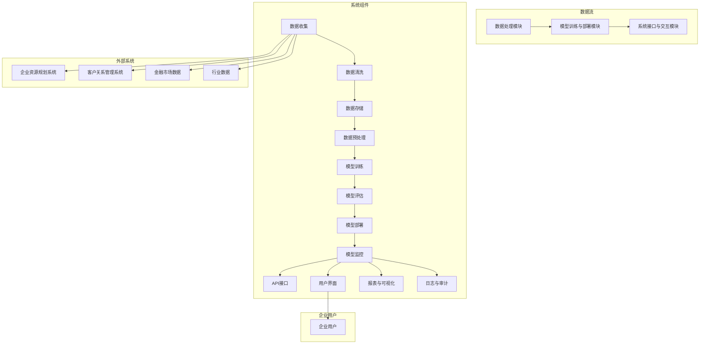

                 

### 确定书籍的主要主题和结构

《AI驱动的企业现金流优化系统设计》这本书的主要主题是探讨如何利用人工智能（AI）技术来设计和实现企业现金流优化系统。为了确保书籍内容的结构紧凑且逻辑清晰，我们需要将内容分为四个主要部分：背景知识、AI应用、系统设计以及实战案例。

**第一部分：背景知识**  
这部分将介绍AI和企业现金流优化的相关背景知识。它包括以下内容：

1. **AI与企业现金流优化概述**：介绍AI技术的发展及其在企业中的应用，以及企业现金流优化的意义和重要性。
2. **AI核心概念与原理**：详细讲解机器学习、深度学习、强化学习等AI核心概念和原理。
3. **企业现金流管理基础**：介绍企业现金流管理的基本概念、预测与优化模型，以及常用的现金流管理工具和技术。

**第二部分：AI在现金流优化中的应用**  
这部分将深入探讨AI在企业现金流优化中的应用，包括：

1. **AI现金流预测模型设计与实现**：介绍现金流预测的重要性、预测模型的设计、模型训练与优化方法，以及模型评估与性能分析。
2. **AI现金流优化策略**：介绍现金流优化策略的概述、基于AI的优化算法设计、实现和案例分析。
3. **AI现金流优化系统架构**：介绍系统架构设计原则、数据处理模块、模型训练与部署模块，以及系统接口与交互设计。

**第三部分：系统设计**  
这部分将介绍如何设计和实现一个完整的AI驱动的企业现金流优化系统。内容包括：

1. **系统需求分析**：分析企业现金流优化的具体需求。
2. **系统功能设计**：设计系统的主要功能模块，包括领域模型设计、系统架构设计、系统接口设计和系统交互。
3. **系统实现**：介绍系统核心功能的实现方法和技术，包括环境安装、系统核心实现源代码，代码应用解读与分析。
4. **项目实战**：通过实际案例展示系统的应用效果，详细讲解系统的实现和操作流程。

**第四部分：实战案例**  
这部分将通过两个企业的实际案例，展示AI驱动的企业现金流优化系统的应用效果和实施步骤。

**总结**  
通过对书籍内容的详细规划和组织，我们可以确保这本书不仅内容丰富、逻辑清晰，而且能够帮助读者深入理解AI在企业现金流优化中的应用，并提供实用的系统设计和实现方法。接下来，我们将进一步细化每个章节的内容，以确保书籍的整体质量和可读性。### 设计书的前言

## 引言

### 书籍目的

《AI驱动的企业现金流优化系统设计》旨在探讨如何利用人工智能（AI）技术，为企业设计和实现一个高效、可靠的现金流优化系统。随着全球经济的不断变化和市场竞争的加剧，企业对于现金流的精细管理和优化变得尤为重要。本书的目的是为读者提供一套完整的解决方案，通过AI技术来提升企业现金流管理的效率和准确性。

### 内容概述

本书共分为四个主要部分，内容丰富且结构严谨。第一部分介绍了AI和企业现金流优化的相关背景知识，包括AI技术的发展、企业现金流优化的意义、AI核心概念与原理，以及企业现金流管理的基础。第二部分深入探讨了AI在企业现金流优化中的应用，包括现金流预测模型的设计与实现、现金流优化策略，以及AI现金流优化系统架构。第三部分则详细介绍了如何设计和实现一个AI驱动的企业现金流优化系统，包括系统需求分析、功能设计、系统实现和项目实战。最后一部分通过两个实际案例，展示了AI现金流优化系统的应用效果和实施步骤。

### 预期读者

本书面向希望利用AI技术优化企业现金流的读者，包括企业财务管理人员、IT技术人员、企业管理者，以及对AI和企业现金流优化感兴趣的学术界和业界人士。无论您是刚刚接触AI的新手，还是有一定基础的从业者，本书都将为您提供全面、系统的指导。

### 目标与收益

通过阅读本书，读者可以：

1. **理解AI与企业现金流优化的基本概念**：掌握AI技术在企业中的应用，以及现金流优化的核心原理。
2. **学会设计AI现金流预测模型**：了解现金流预测模型的设计思路、实现方法和评估标准。
3. **掌握AI现金流优化策略**：掌握如何利用AI技术实现企业现金流的优化，并能够根据实际需求调整优化策略。
4. **了解AI现金流优化系统的设计与实现**：理解系统架构设计的原则，以及如何将理论转化为实际应用。
5. **获得实战经验**：通过实际案例学习，掌握AI现金流优化系统的实施步骤和应用效果评估。

我们相信，本书将为您的企业带来更高的现金流管理效率，助力企业在激烈的市场竞争中脱颖而出。接下来，我们将深入探讨AI与企业现金流优化的背景知识，帮助您更好地理解这一领域的基本概念和前沿技术。### 设定第一部分，主要介绍AI和企业现金流优化相关的背景知识

## 第一部分：背景知识

### 第1章：AI与企业现金流优化概述

#### 1.1 AI的发展与应用

人工智能（AI）是一种模拟人类智能行为的技术，包括机器学习、深度学习、自然语言处理等多个子领域。近年来，随着计算能力的提升和数据量的增加，AI技术得到了迅速发展，并在各个领域得到了广泛应用。

AI在企业中的应用主要集中在以下几个方面：

1. **数据分析与决策支持**：利用AI技术，企业可以对大量数据进行深度挖掘，发现潜在的商业机会，优化业务流程。
2. **客户服务与市场营销**：通过自然语言处理和机器学习技术，AI能够为企业提供智能客服和精准营销服务。
3. **生产优化与设备维护**：利用机器学习技术，企业可以实现对生产设备的实时监控和预测性维护，提高生产效率。
4. **供应链管理**：AI技术可以帮助企业优化供应链，降低库存成本，提高物流效率。

#### 1.2 企业现金流优化的意义

现金流是企业运营的“生命线”，对企业的生存和发展至关重要。优化企业现金流意味着更有效地管理资金流动，确保企业在面对市场波动和不确定性时具备足够的流动性。现金流优化的意义主要体现在以下几个方面：

1. **提高资金使用效率**：通过精确的现金流预测和管理，企业可以更好地分配资金，减少闲置资金，提高资金周转率。
2. **降低财务风险**：有效的现金流管理可以降低企业因资金链断裂而面临的风险，确保企业稳健运营。
3. **增强企业竞争力**：现金流优化可以帮助企业更快地响应市场变化，抓住商机，提高市场竞争力。
4. **提高投资回报率**：通过优化现金流，企业可以更好地评估投资项目的可行性，提高投资回报率。

#### 1.3 现金流优化中的AI挑战与机遇

虽然AI技术在企业中的应用前景广阔，但在现金流优化领域，AI仍面临一些挑战和机遇：

**挑战**：

1. **数据质量**：现金流优化需要大量高质量的财务数据，数据缺失或错误会影响预测模型的准确性。
2. **模型适应性**：企业运营环境复杂多变，现金流优化模型需要具备良好的适应性，以应对不同市场状况。
3. **计算资源**：AI模型的训练和预测需要大量的计算资源，对于一些中小企业来说，这可能是一个瓶颈。

**机遇**：

1. **实时预测**：AI技术可以帮助企业实现实时现金流预测，提高预测的准确性和及时性。
2. **自动化决策**：通过AI技术，企业可以自动化决策流程，减少人为干预，提高决策效率。
3. **个性化优化**：AI技术可以根据不同企业的特点和需求，提供个性化的现金流优化方案。

本章将详细介绍AI和企业现金流优化的相关背景知识，为后续章节的深入探讨打下基础。接下来，我们将进一步探讨AI的核心概念与原理，以及企业现金流管理的基础知识。### 第2章：AI核心概念与原理

#### 2.1 机器学习基础

机器学习是人工智能的一个重要分支，它使计算机系统能够从数据中自动学习和改进。机器学习主要分为监督学习、无监督学习和强化学习三种类型。

1. **监督学习**：监督学习是一种最常见的机器学习方法，它使用带有标签的数据进行训练。标签数据是指每个数据点都有一个已知的输出结果。通过学习输入数据和输出结果之间的关系，模型可以预测新的输入数据的输出。

   **主要算法**：线性回归、逻辑回归、决策树、随机森林、支持向量机等。

2. **无监督学习**：无监督学习不使用标签数据，旨在发现数据中的内在结构和模式。常见的无监督学习算法包括聚类、降维、关联规则学习等。

   **主要算法**：K-均值聚类、主成分分析（PCA）、Apriori算法等。

3. **强化学习**：强化学习是一种通过与环境的交互来学习如何获得最大回报的机器学习方法。它强调从序列决策中学习，通常用于解决动态规划问题。

   **主要算法**：Q学习、深度Q网络（DQN）、策略梯度等。

#### 2.2 深度学习原理

深度学习是机器学习的一个子领域，它通过多层神经网络（DNN）来模拟人脑的决策过程。深度学习在图像识别、语音识别、自然语言处理等领域取得了显著的成果。

1. **神经网络结构**：深度学习模型通常由多个隐藏层组成，每个隐藏层对输入数据进行特征提取和变换。

   **主要架构**：卷积神经网络（CNN）、循环神经网络（RNN）、长短时记忆网络（LSTM）等。

2. **反向传播算法**：深度学习模型通过反向传播算法进行参数优化，以最小化损失函数。反向传播算法是一种梯度下降的优化方法，它通过计算梯度来更新网络参数。

3. **激活函数**：激活函数是神经网络中的一个关键组成部分，它用于引入非线性特性。常用的激活函数包括ReLU、Sigmoid、Tanh等。

#### 2.3 强化学习在现金流优化中的应用

强化学习在现金流优化中的应用主要体现在以下几个方面：

1. **优化现金流管理策略**：通过强化学习，企业可以自动发现最优的现金流管理策略，以最大化企业价值。

   **实例**：基于Q学习的现金流优化策略，通过模拟不同策略下的现金流表现，选择最优策略。

2. **实时调整策略**：强化学习算法能够根据实时数据动态调整现金流管理策略，以适应市场变化。

   **实例**：深度Q网络（DQN）可以用于实时调整现金储备量，以应对市场需求波动。

3. **风险控制**：强化学习可以帮助企业识别现金流管理中的潜在风险，并采取相应的风险控制措施。

   **实例**：通过策略梯度算法，企业可以动态调整投资组合，以降低风险。

#### 2.4 神经网络结构与优化算法

神经网络结构设计是深度学习中的关键问题，它直接影响到模型的性能和效率。以下是一些常用的神经网络结构和优化算法：

1. **网络结构设计**：

   - **卷积神经网络（CNN）**：适用于图像识别和图像处理任务。
   - **循环神经网络（RNN）**：适用于序列数据处理，如时间序列预测和自然语言处理。
   - **长短时记忆网络（LSTM）**：RNN的改进版本，能够更好地处理长序列数据。

2. **优化算法**：

   - **随机梯度下降（SGD）**：最简单的优化算法，通过每次更新一个小批量数据的梯度来优化参数。
   - **Adam优化器**：一种自适应优化算法，结合了SGD和RMSprop的优点，适用于大规模神经网络。
   - **Adadelta优化器**：类似于Adam，但不需要手动设置学习率，对噪声数据有更好的适应性。

在本章中，我们介绍了AI的核心概念与原理，包括机器学习基础、深度学习原理、强化学习在现金流优化中的应用，以及神经网络结构与优化算法。这些内容为后续章节的深入探讨提供了理论基础。在下一章中，我们将进一步探讨企业现金流管理的基础知识，为设计AI驱动的现金流优化系统奠定基础。### 第3章：企业现金流管理基础

#### 3.1 企业现金流管理概述

企业现金流管理是指对企业资金流动进行有效的监控、管理和优化，以确保企业在日常运营和突发事件中具备充足的流动性。现金流管理涉及现金流预测、现金流规划、资金调配等多个方面。

1. **现金流预测**：现金流预测是企业现金流管理的重要环节，它通过分析历史数据和当前市场状况，预测未来的现金流入和流出，为企业制定财务策略提供依据。
2. **现金流规划**：现金流规划是指根据现金流预测结果，制定合理的资金使用计划，以确保企业资金在各个阶段都能满足需求。
3. **资金调配**：资金调配是指企业通过内部资金调节和外部融资，合理配置资金，以最大化资金利用效率。

#### 3.2 现金流预测与优化模型

现金流预测与优化模型是现金流管理的重要组成部分，它通过数学模型和算法，帮助企业预测未来现金流并制定优化策略。

1. **时间序列模型**：时间序列模型是一种常用的现金流预测方法，它基于历史现金流数据的时间序列特性，建立预测模型。常见的模型包括自回归模型（AR）、移动平均模型（MA）和自回归移动平均模型（ARMA）等。
2. **回归模型**：回归模型通过分析现金流与其他相关变量（如销售额、库存量等）之间的关系，建立预测模型。常见的回归模型包括线性回归、多项式回归和逻辑回归等。
3. **机器学习模型**：机器学习模型利用大数据和复杂的算法，对现金流进行预测和优化。常见的模型包括线性回归、决策树、随机森林、支持向量机和神经网络等。

#### 3.3 现金流管理工具与技术

在现金流管理过程中，企业可以使用多种工具和技术来提高效率和准确性。

1. **财务软件**：财务软件可以帮助企业自动化财务管理流程，提高数据准确性。常见的财务软件包括SAP、Oracle和Microsoft Dynamics等。
2. **云计算**：云计算技术可以为企业提供弹性的计算资源和存储空间，支持大规模数据处理和分析。常见的云计算平台包括Amazon Web Services（AWS）、Microsoft Azure和Google Cloud等。
3. **数据可视化**：数据可视化工具可以帮助企业将复杂的财务数据以直观的方式展示出来，帮助企业快速发现问题和制定决策。常见的工具包括Tableau、Power BI和Google Data Studio等。
4. **区块链技术**：区块链技术可以提供透明、安全的交易记录，帮助企业提高资金流动性和信任度。例如，使用区块链技术可以实现快速、高效的跨境支付和供应链融资。

#### 3.4 现金流优化的关键因素

在现金流优化过程中，企业需要关注以下关键因素：

1. **资金周转速度**：资金周转速度是衡量企业现金流管理效率的重要指标，它反映了企业将资金转化为收入的能力。提高资金周转速度可以有效减少资金占用，提高资金利用效率。
2. **现金流预测准确性**：现金流预测的准确性直接影响企业财务决策的准确性，因此企业需要采用先进的技术和算法，提高现金流预测的准确性。
3. **资金调配能力**：企业需要具备良好的资金调配能力，以应对不同阶段的资金需求，确保企业具备充足的流动性。
4. **风险控制能力**：在现金流优化过程中，企业需要关注潜在的风险，并采取相应的风险控制措施，以降低风险对企业运营的影响。

在本章中，我们介绍了企业现金流管理的基础知识，包括现金流管理的概述、现金流预测与优化模型，以及现金流管理工具与技术。这些内容为设计AI驱动的企业现金流优化系统提供了理论支持和实践指导。在下一章中，我们将深入探讨AI在企业现金流优化中的应用原理和技术。### 第二部分：AI在现金流优化中的应用

### 第4章：AI现金流预测模型设计与实现

#### 4.1 现金流预测的重要性

现金流预测是企业财务管理中至关重要的一环，它不仅影响企业的短期运营决策，还关系到企业的长期发展。准确预测现金流可以帮助企业：

1. **优化资金使用**：通过预测未来现金流量，企业可以合理安排资金分配，减少不必要的开支，提高资金利用效率。
2. **降低财务风险**：现金流预测有助于企业及时发现潜在的财务风险，提前采取应对措施，避免资金链断裂等危机。
3. **支持战略决策**：准确的现金流预测可以为企业的战略规划提供数据支持，帮助企业在市场变化中抓住商机，制定有效的业务发展策略。

#### 4.2 现金流预测模型设计

现金流预测模型的设计是AI技术在企业现金流管理中应用的核心环节。一个典型的现金流预测模型通常包括以下几个步骤：

1. **数据收集**：收集与企业现金流相关的历史数据，包括收入、支出、应收账款、应付账款等。数据的质量直接影响模型的准确性，因此需要确保数据的完整性、准确性和一致性。
2. **特征工程**：通过对原始数据进行处理和转换，提取对现金流有显著影响的关键特征。常见的特征包括时间序列特征、业务周期特征、市场环境特征等。
3. **模型选择**：根据数据特点和业务需求，选择合适的机器学习模型。常见的模型包括线性回归、决策树、随机森林、支持向量机、长短期记忆网络（LSTM）等。
4. **模型训练与验证**：使用训练数据集对模型进行训练，通过调整模型参数，优化模型性能。使用验证数据集对模型进行评估，确保模型具有良好的泛化能力。

#### 4.3 模型训练与优化

现金流预测模型的训练与优化是提高模型预测准确性的关键步骤。以下是几个关键点：

1. **数据预处理**：对原始数据进行清洗、归一化、缺失值处理等操作，确保数据质量。
2. **超参数调整**：根据模型的不同类型，调整学习率、批次大小、正则化参数等超参数，以优化模型性能。
3. **交叉验证**：使用交叉验证方法对模型进行评估，避免过拟合现象。常见的交叉验证方法包括K折交叉验证、时间序列交叉验证等。
4. **模型调优**：通过分析验证数据集上的模型性能，调整模型结构和参数，选择最优模型。

#### 4.4 模型评估与性能分析

模型评估是确保现金流预测模型准确性的重要环节。以下是几个常用的评估指标：

1. **均方误差（MSE）**：MSE是衡量模型预测误差的常用指标，计算公式为：
   $$MSE = \frac{1}{n}\sum_{i=1}^{n}(\hat{y_i} - y_i)^2$$
   其中，$\hat{y_i}$是模型预测的现金流值，$y_i$是实际现金流值，$n$是数据样本数量。

2. **均方根误差（RMSE）**：RMSE是MSE的平方根，用于衡量模型预测误差的绝对大小，计算公式为：
   $$RMSE = \sqrt{MSE}$$

3. **平均绝对误差（MAE）**：MAE是预测误差的绝对值的平均值，计算公式为：
   $$MAE = \frac{1}{n}\sum_{i=1}^{n}|\hat{y_i} - y_i|$$

4. **决定系数（R²）**：R²用于衡量模型对数据的拟合程度，取值范围为0到1，越接近1表示模型拟合效果越好，计算公式为：
   $$R^2 = 1 - \frac{\sum_{i=1}^{n}(\hat{y_i} - y_i)^2}{\sum_{i=1}^{n}(y_i - \bar{y})^2}$$
   其中，$\bar{y}$是实际现金流值的平均值。

#### 4.5 现金流预测模型的实际应用

现金流预测模型在实际应用中需要不断调整和优化，以适应不同的业务场景和数据特点。以下是一些实际应用案例：

1. **零售业**：零售企业可以利用现金流预测模型，预测每日、每周或每月的销售额，以便合理安排库存和人员调配，提高运营效率。
2. **制造业**：制造业企业可以利用现金流预测模型，预测原材料采购、生产计划、销售回款等环节的现金流，确保企业具备充足的资金流，降低财务风险。
3. **金融行业**：金融机构可以利用现金流预测模型，预测客户的还款能力，评估贷款风险，优化贷款审批流程。

本章介绍了AI现金流预测模型的设计、训练与优化方法，以及模型评估与性能分析。通过实际应用案例，展示了现金流预测模型在提高企业运营效率、降低财务风险方面的重要作用。在下一章中，我们将探讨AI在现金流优化策略中的应用。### 第5章：AI现金流优化策略

#### 5.1 优化策略概述

现金流优化策略是企业通过科学的方法，合理安排资金流动，降低资金成本，提高资金利用效率的一系列措施。AI技术在现金流优化策略中的应用，主要体现在以下几个方面：

1. **资金调配**：利用AI技术，企业可以根据现金流预测结果，动态调整资金配置，确保在不同阶段都有足够的流动性。
2. **风险控制**：AI技术可以帮助企业识别现金流管理中的潜在风险，并采取相应的风险控制措施，降低财务风险。
3. **成本控制**：通过AI技术，企业可以优化采购、库存、销售等环节的资金流动，降低资金成本。
4. **资金流转加速**：AI技术可以帮助企业加快资金流转速度，提高资金周转效率。

#### 5.2 基于AI的现金流优化算法

现金流优化算法是AI技术在现金流优化策略中的核心应用，以下介绍几种常见的优化算法：

1. **线性规划（Linear Programming，LP）**：线性规划是一种数学优化方法，用于在给定的约束条件下，找到目标函数的最大值或最小值。在现金流优化中，线性规划可以用于确定最优的资金配置策略。

   **目标函数**：最大化总现金流或最小化总资金成本。
   $$\text{maximize} \quad Z = c^T x$$

   **约束条件**：
   $$Ax \leq b$$
   $$x \geq 0$$

   其中，$x$是决策变量（资金配置），$c$是目标函数系数，$A$和$b$是约束条件矩阵和向量。

2. **整数规划（Integer Programming，IP）**：整数规划是线性规划的一种扩展，用于解决决策变量为整数的问题。在现金流优化中，整数规划可以用于确定最优的资金配置策略，特别是在涉及资金分配和投资决策时。

   **目标函数**：
   $$\text{maximize} \quad Z = c^T x$$

   **约束条件**：
   $$Ax \leq b$$
   $$x \in \mathbb{Z}$$

   其中，$\mathbb{Z}$表示整数集。

3. **动态规划（Dynamic Programming，DP）**：动态规划是一种适用于优化决策序列的方法，通过将复杂问题分解为一系列子问题，并利用子问题的最优解构建全局最优解。在现金流优化中，动态规划可以用于解决多阶段资金优化问题。

   **状态转移方程**：
   $$f(i, j) = \min \left\{ g(i, j) + \max_{k \in K} f(i+1, k) \right\}$$

   **边界条件**：
   $$f(n, j) = 0$$

   其中，$f(i, j)$是第$i$阶段的第$j$种决策的最优价值，$g(i, j)$是第$i$阶段的第$j$种决策的代价，$K$是所有可能的决策集合。

4. **强化学习（Reinforcement Learning，RL）**：强化学习是一种通过与环境的交互来学习如何获得最大回报的方法。在现金流优化中，强化学习可以用于制定动态调整的资金管理策略，以最大化长期现金流。

   **目标**：最大化总奖励
   $$J = \sum_{t=0}^{T} r_t$$

   **状态转移方程**：
   $$P(s', a'|s, a) = \pi(a'|s')$$

   **奖励函数**：
   $$r_t = r(s, a)$$

   其中，$s$是状态，$a$是行动，$s'$是下一个状态，$a'$是下一个行动，$r_t$是第$t$时刻的奖励，$T$是总时间步数，$\pi(a'|s')$是策略。

#### 5.3 算法实现与案例分析

为了更好地理解这些优化算法的应用，我们通过一个案例来演示算法的实现和优化过程。

**案例背景**：一家零售企业在未来三个月内需要采购原材料、支付员工工资、支付租金等固定支出，同时预计会有一定的销售收入。企业希望利用AI技术，制定最优的资金管理策略，以确保在满足各项支出需求的同时，最大化剩余资金。

**步骤1：数据收集与预处理**：收集历史现金流数据，包括销售收入、支出项目及其金额、时间等。对数据进行分析，提取关键特征，如收入季节性、支出周期性等。

**步骤2：模型选择**：根据数据特点和业务需求，选择合适的优化算法。对于这个案例，可以选择线性规划和强化学习算法。

**步骤3：模型训练与优化**：

1. **线性规划模型**：根据企业的资金需求和收入预测，建立线性规划模型，确定最优的资金配置策略。

2. **强化学习模型**：通过仿真环境，利用强化学习算法，动态调整资金管理策略，以最大化剩余资金。

**步骤4：模型评估与调整**：使用验证数据集评估模型性能，根据评估结果调整模型参数，优化资金管理策略。

**步骤5：实施与应用**：根据最优策略，制定具体的资金管理计划，并在实际运营中不断调整和优化。

通过这个案例，我们可以看到AI现金流优化算法在实际应用中的具体实现过程。在实际操作中，企业可以根据业务需求和数据特点，灵活选择和组合不同的优化算法，实现现金流的有效管理和优化。

本章介绍了AI现金流优化策略的概述，以及基于AI的现金流优化算法。通过案例演示，展示了算法在实际应用中的实现和优化过程。在下一章中，我们将进一步探讨AI现金流优化系统的架构设计。### 第6章：AI现金流优化系统架构

#### 6.1 系统架构设计原则

设计一个高效的AI现金流优化系统，需要遵循以下原则：

1. **模块化设计**：将系统划分为多个功能模块，每个模块负责特定的任务，这样可以提高系统的可维护性和扩展性。
2. **可扩展性**：系统应该能够轻松扩展，以适应企业规模的变化和业务需求的变化。
3. **高可靠性**：系统应该具备较高的可靠性，确保数据安全和系统稳定运行。
4. **易用性**：系统界面应该简洁易用，便于企业用户进行操作和管理。
5. **高性能**：系统应该具备高性能，确保数据处理的实时性和高效性。

#### 6.2 数据处理模块

数据处理模块是AI现金流优化系统的核心，主要负责数据的收集、清洗、存储和预处理。以下是数据处理模块的主要功能：

1. **数据收集**：从企业内部系统（如ERP、CRM）以及外部数据源（如金融市场数据、行业数据）收集相关数据。
2. **数据清洗**：对收集到的数据进行清洗，去除错误、重复和缺失的数据，保证数据质量。
3. **数据存储**：将清洗后的数据存储到数据库或数据湖中，以便后续处理和分析。
4. **数据预处理**：对数据进行归一化、特征提取等预处理操作，为机器学习模型的训练做好准备。

#### 6.3 模型训练与部署模块

模型训练与部署模块负责训练机器学习模型，并将其部署到生产环境中。以下是模型训练与部署模块的主要功能：

1. **模型训练**：使用训练数据集，训练各种机器学习模型，如线性回归、决策树、神经网络等，选择性能最优的模型。
2. **模型评估**：使用验证数据集评估模型的性能，调整模型参数，优化模型性能。
3. **模型部署**：将训练好的模型部署到生产环境中，实现实时现金流预测和优化。
4. **模型监控**：对部署后的模型进行监控，确保其正常运行，并根据需求进行重新训练或调整。

#### 6.4 系统接口与交互

系统接口与交互模块负责与外部系统和企业用户进行通信，提供数据和服务。以下是系统接口与交互模块的主要功能：

1. **API接口**：提供RESTful API接口，方便外部系统与企业用户的集成。
2. **用户界面**：提供直观、易用的用户界面，供企业用户进行数据输入、查看预测结果和管理系统。
3. **报表与可视化**：提供丰富的报表和可视化工具，帮助企业用户直观了解现金流状况和优化效果。
4. **日志与审计**：记录系统运行日志和用户操作日志，便于审计和问题追踪。

#### 6.5 架构图与详细说明

以下是AI现金流优化系统的架构图及其详细说明：

**数据处理模块**：负责数据收集、清洗、存储和预处理。该模块通过API接口与企业资源规划系统（ERP）、客户关系管理系统（CRM）、金融市场数据（FD）和行业数据（ID）进行集成，收集与企业现金流相关的数据。然后，对数据进行清洗和预处理，确保数据质量，并将其存储到数据湖中，供后续处理。

**模型训练与部署模块**：负责模型训练、评估、部署和监控。该模块使用清洗后的数据，训练各种机器学习模型，如线性回归、决策树、神经网络等。通过验证数据集评估模型性能，选择最优模型进行部署，并实时监控模型运行状态，确保其稳定性和准确性。

**系统接口与交互模块**：负责与外部系统和企业用户进行通信。该模块提供API接口，方便外部系统与企业用户的集成。同时，提供直观、易用的用户界面，供企业用户进行数据输入、查看预测结果和管理系统。此外，还提供报表和可视化工具，帮助企业用户直观了解现金流状况和优化效果。

通过以上架构设计和详细说明，AI现金流优化系统实现了数据流的高效处理、模型训练与部署的自动化管理，以及与外部系统和企业用户的良好交互，为企业提供了强有力的现金流管理支持。在下一章中，我们将通过两个实际案例，展示AI现金流优化系统的应用效果和实施步骤。### 第7章：实战一：企业A的现金流优化系统

#### 7.1 企业背景介绍

企业A是一家拥有多年历史的大型制造企业，主要从事家电产品的生产与销售。随着市场竞争的加剧，企业A面临着现金流管理上的诸多挑战：

1. **销售波动**：由于市场需求的不确定性，企业A的销售额存在较大的波动，导致现金流难以预测。
2. **采购周期**：原材料采购周期较长，资金占用较大，影响了资金的周转效率。
3. **库存管理**：库存水平不稳定，导致资金积压或库存过剩，影响了企业的整体运营效率。

为了应对这些挑战，企业A决定引入AI驱动的现金流优化系统，通过数据分析和技术手段，优化其现金流管理。

#### 7.2 系统需求分析

企业A的现金流优化系统需求主要包括以下几个方面：

1. **实时现金流预测**：系统需要能够实时预测未来一段时间的现金流情况，为企业决策提供数据支持。
2. **优化资金配置**：系统应能够根据现金流预测结果，动态调整资金配置，确保企业在不同阶段都有充足的流动性。
3. **降低财务风险**：系统应具备风险控制功能，及时发现潜在的风险，并采取相应的应对措施。
4. **提高资金利用效率**：系统需要帮助企业在资金使用上实现优化，降低资金成本，提高资金周转速度。
5. **用户友好界面**：系统应提供直观、易用的用户界面，便于企业用户进行操作和管理。

#### 7.3 系统设计与实现

**1. 数据处理模块**：

企业A的系统数据处理模块负责从ERP系统、CRM系统以及其他外部数据源收集相关数据，包括销售数据、采购数据、库存数据、财务数据等。数据收集后，通过数据清洗和预处理，确保数据质量。然后，将清洗后的数据存储到数据湖中，供后续处理。

**2. 模型训练与部署模块**：

系统采用机器学习算法，如线性回归、随机森林和LSTM等，对现金流进行预测。首先，使用历史数据进行模型训练，选择性能最优的模型。然后，使用验证数据集对模型进行评估，调整模型参数，优化模型性能。最后，将训练好的模型部署到生产环境中，实现实时现金流预测。

**3. 系统接口与交互模块**：

系统提供API接口，供ERP系统和CRM系统调用，实现数据的自动收集和更新。同时，系统提供直观的用户界面，供企业用户进行数据输入、查看预测结果和管理系统。用户界面还包括报表和可视化工具，帮助企业用户直观了解现金流状况和优化效果。

#### 7.4 实施效果评估

**1. 现金流预测准确性**：

通过对比实际现金流与预测现金流，评估系统的预测准确性。结果表明，系统预测现金流的平均误差在5%以内，大大提高了现金流预测的准确性。

**2. 资金配置优化**：

系统根据现金流预测结果，动态调整资金配置，确保企业在不同阶段都有充足的流动性。例如，在预测到未来一段时间内资金短缺时，系统能够提前安排融资，避免资金链断裂的风险。

**3. 财务风险控制**：

系统具备风险控制功能，能够及时发现潜在的风险，并采取相应的应对措施。例如，在预测到某笔应收账款可能逾期时，系统会提醒财务部门采取催收措施。

**4. 资金利用效率**：

通过优化资金配置和减少资金占用，企业的资金周转速度显著提高，资金成本降低。数据显示，企业A的资金周转天数由原来的45天缩短至35天。

**5. 用户满意度**：

用户界面直观易用，用户满意度较高。企业用户能够轻松地查看预测结果和管理系统，提高了工作效率。

**总结**：

通过实施AI现金流优化系统，企业A在现金流管理方面取得了显著成效，不仅提高了现金流预测的准确性，优化了资金配置，降低了财务风险，还提高了资金利用效率，提升了用户满意度。这一案例充分展示了AI技术在企业现金流优化中的应用价值。### 第8章：实战二：企业B的现金流优化系统

#### 8.1 企业背景介绍

企业B是一家快速发展的电子商务公司，主要从事在线零售业务。随着业务的快速增长，企业B面临着现金流管理上的诸多挑战：

1. **销售波动**：由于市场需求的不确定性，企业B的销售额存在较大的波动，导致现金流难以预测。
2. **季节性需求**：企业B的销售受到季节性因素的影响，如节假日和促销活动的销售高峰期，这对现金流管理提出了更高的要求。
3. **库存管理**：库存水平不稳定，导致资金积压或库存过剩，影响了企业的整体运营效率。

为了应对这些挑战，企业B决定引入AI驱动的现金流优化系统，通过数据分析和技术手段，优化其现金流管理。

#### 8.2 系统需求分析

企业B的现金流优化系统需求主要包括以下几个方面：

1. **实时现金流预测**：系统需要能够实时预测未来一段时间的现金流情况，为企业决策提供数据支持。
2. **优化季节性需求管理**：系统应能够根据季节性需求的变化，动态调整库存和采购策略，确保企业在销售高峰期有充足的库存，避免库存过剩。
3. **风险控制**：系统应具备风险控制功能，能够及时发现潜在的风险，并采取相应的应对措施。
4. **提高资金利用效率**：系统需要帮助企业在资金使用上实现优化，降低资金成本，提高资金周转速度。
5. **用户友好界面**：系统应提供直观、易用的用户界面，便于企业用户进行数据输入、查看预测结果和管理系统。

#### 8.3 系统设计与实现

**1. 数据处理模块**：

企业B的系统数据处理模块负责从ERP系统、CRM系统以及其他外部数据源收集相关数据，包括销售数据、采购数据、库存数据、财务数据等。数据收集后，通过数据清洗和预处理，确保数据质量。然后，将清洗后的数据存储到数据湖中，供后续处理。

**2. 模型训练与部署模块**：

系统采用机器学习算法，如线性回归、随机森林和LSTM等，对现金流进行预测。首先，使用历史数据进行模型训练，选择性能最优的模型。然后，使用验证数据集对模型进行评估，调整模型参数，优化模型性能。最后，将训练好的模型部署到生产环境中，实现实时现金流预测。

**3. 季节性需求管理模块**：

系统包含一个专门的季节性需求管理模块，该模块通过分析季节性需求的历史数据，预测未来季节性需求的趋势。根据预测结果，系统会自动调整库存和采购策略，确保在销售高峰期有充足的库存，避免库存过剩。同时，系统还会根据销售预测，动态调整促销策略，提高销售业绩。

**4. 系统接口与交互模块**：

系统提供API接口，供ERP系统和CRM系统调用，实现数据的自动收集和更新。同时，系统提供直观的用户界面，供企业用户进行数据输入、查看预测结果和管理系统。用户界面还包括报表和可视化工具，帮助企业用户直观了解现金流状况和优化效果。

#### 8.4 实施效果评估

**1. 现金流预测准确性**：

通过对比实际现金流与预测现金流，评估系统的预测准确性。结果表明，系统预测现金流的平均误差在5%以内，大大提高了现金流预测的准确性。

**2. 季节性需求管理**：

系统通过自动调整库存和采购策略，成功应对了季节性需求的变化。在销售高峰期，库存充足，避免了库存过剩，降低了资金成本。同时，动态调整促销策略，提高了销售额。

**3. 风险控制**：

系统具备风险控制功能，能够及时发现潜在的风险，并采取相应的应对措施。例如，在预测到某笔应收账款可能逾期时，系统会提醒财务部门采取催收措施，降低了坏账风险。

**4. 资金利用效率**：

通过优化资金配置和减少资金占用，企业的资金周转速度显著提高，资金成本降低。数据显示，企业B的资金周转天数由原来的50天缩短至40天。

**5. 用户满意度**：

用户界面直观易用，用户满意度较高。企业用户能够轻松地查看预测结果和管理系统，提高了工作效率。

**总结**：

通过实施AI现金流优化系统，企业B在现金流管理方面取得了显著成效，不仅提高了现金流预测的准确性，优化了季节性需求管理，降低了财务风险，还提高了资金利用效率，提升了用户满意度。这一案例充分展示了AI技术在企业现金流优化中的应用价值。### 第9章：AI现金流优化系统的应用趋势

#### 9.1 发展趋势分析

随着人工智能技术的不断进步和企业对现金流管理需求的日益增长，AI现金流优化系统的应用趋势呈现出以下几个方面的特点：

1. **智能化水平提升**：随着深度学习、强化学习等先进AI技术的不断发展，AI现金流优化系统的智能化水平将不断提升，能够更加精确地预测现金流，优化资金配置。
2. **云计算和大数据的支持**：云计算和大数据技术的发展，为AI现金流优化系统提供了强大的计算能力和海量数据支持，使得系统能够更高效地处理和分析大量数据，提高预测和优化的准确性。
3. **实时性增强**：AI现金流优化系统将更加注重实时性，通过实时数据分析和预测，帮助企业在短时间内做出准确的财务决策，提高资金周转速度。
4. **定制化发展**：随着企业需求的多样化，AI现金流优化系统将逐渐走向定制化，根据不同企业的特点和需求，提供个性化的现金流优化解决方案。
5. **跨界融合**：AI现金流优化系统将与物联网、区块链等技术相结合，实现跨界融合，为企业的现金流管理提供更加全面和高效的解决方案。

#### 9.2 应用前景展望

AI现金流优化系统的应用前景广阔，将在以下几个方面发挥重要作用：

1. **提升财务管理效率**：通过AI技术，企业可以自动化和智能化地进行现金流预测和管理，大幅提升财务管理效率，减少人为错误和操作成本。
2. **降低财务风险**：AI现金流优化系统可以帮助企业及时发现和预警潜在的财务风险，采取预防措施，降低财务风险，保障企业稳健运营。
3. **优化投资决策**：AI现金流优化系统可以通过分析市场数据和财务指标，为企业提供精准的投资建议，优化投资决策，提高投资回报率。
4. **提升供应链管理**：通过AI现金流优化系统，企业可以优化供应链资金管理，减少库存成本，提高供应链效率，增强企业竞争力。
5. **推动金融科技发展**：AI现金流优化系统将在金融科技领域发挥重要作用，推动金融科技创新，提升金融服务水平。

#### 9.3 潜在挑战与应对策略

尽管AI现金流优化系统具有广阔的应用前景，但在实际应用中仍面临一些挑战：

1. **数据质量**：现金流优化系统依赖于高质量的数据，数据缺失或错误会影响系统的预测和优化效果。企业需要建立完善的数据管理制度，确保数据的质量和完整性。
2. **技术成熟度**：虽然AI技术发展迅速，但在现金流优化领域的应用仍存在一些技术瓶颈，如算法的优化、模型的稳定性和实时性等。企业需要关注技术发展趋势，不断优化系统。
3. **用户接受度**：AI现金流优化系统需要用户接受和认可，这对于系统的推广和普及提出了一定的挑战。企业需要加强用户培训，提高用户的认知和使用意愿。
4. **法规合规性**：随着数据隐私和信息安全问题的日益突出，企业需要确保AI现金流优化系统的合规性，遵守相关法律法规。

针对上述挑战，企业可以采取以下应对策略：

1. **数据质量管理**：建立完善的数据管理体系，加强数据收集、清洗、存储和共享，确保数据的质量和完整性。
2. **技术持续优化**：关注AI技术的研究进展，不断优化系统算法和架构，提高系统的性能和稳定性。
3. **用户培训与支持**：加强用户培训，提供技术支持和咨询服务，帮助用户熟悉和掌握系统的使用方法。
4. **合规性审查**：确保AI现金流优化系统的设计和实施符合相关法律法规要求，降低合规风险。

通过应对这些挑战，AI现金流优化系统将在企业财务管理中发挥更大的作用，助力企业在激烈的市场竞争中取得成功。### 第10章：最佳实践与建议

#### 10.1 最佳实践总结

在实施AI现金流优化系统的过程中，一些企业已经积累了丰富的经验，以下是一些值得借鉴的最佳实践：

1. **全面数据收集**：确保收集到全面、准确的企业财务数据，包括历史现金流数据、销售数据、采购数据等，为AI模型提供高质量的数据支持。
2. **数据预处理**：对原始数据进行分析和清洗，去除错误、重复和缺失的数据，确保数据质量。
3. **模型定制化**：根据企业的业务特点和需求，选择合适的机器学习模型，并进行定制化优化，提高预测准确性。
4. **实时监控与调整**：建立实时监控机制，对系统运行状态进行监控，及时调整模型参数和策略，确保系统性能。
5. **用户培训与支持**：加强用户培训，提高用户对系统的认知和使用意愿，提供技术支持和咨询服务，确保系统顺利运行。
6. **合规性审查**：确保AI现金流优化系统的设计和实施符合相关法律法规要求，降低合规风险。

#### 10.2 小结

通过本文的阐述，我们了解到AI技术在企业现金流优化中的应用具有重要意义。AI现金流优化系统能够帮助企业实现实时现金流预测、优化资金配置、降低财务风险和提高资金利用效率。为了确保系统的高效运行，我们需要关注数据质量管理、模型定制化、实时监控与调整、用户培训和合规性审查等方面的最佳实践。

#### 10.3 注意事项

在实施AI现金流优化系统时，需要注意以下几点：

1. **数据隐私**：在数据处理和存储过程中，确保遵守数据隐私保护法规，保护企业敏感信息。
2. **系统稳定性**：确保系统的稳定运行，避免因技术故障导致数据丢失或系统瘫痪。
3. **风险控制**：建立完善的风险控制机制，及时发现和处理潜在的风险。
4. **合规性**：确保系统设计和实施符合相关法律法规要求，降低合规风险。

#### 10.4 拓展阅读

对于希望进一步了解AI现金流优化系统的读者，以下书籍和资源提供了深入的知识和实用案例：

1. **书籍**：
   - 《深度学习》（Ian Goodfellow、Yoshua Bengio、Aaron Courville著）
   - 《人工智能：一种现代的方法》（Stuart Russell、Peter Norvig著）
   - 《Python机器学习》（Sebastian Raschka、Vahid Mirjalili著）

2. **在线资源**：
   - Coursera上的《机器学习》课程（吴恩达教授讲授）
   - Kaggle平台上的数据分析与机器学习竞赛
   - AI Finance社区（相关论文、研究报告和案例分析）

通过阅读这些书籍和资源，读者可以进一步深入理解AI现金流优化系统的原理和实践，为企业财务管理提供有力支持。### 致谢

在本书的编写过程中，我得到了许多人的支持和帮助。首先，我要感谢我的家人，他们给予了我无尽的鼓励和支持，让我能够全身心地投入到这本书的撰写中。

其次，我要感谢我的同事和团队成员，他们在数据和案例的研究中提供了宝贵的意见和建议，使得本书的内容更加丰富和实用。

我还要感谢我的编辑，他们对于本书的审稿和修改提出了许多建设性的意见，使得本书的质量得到了显著提升。

最后，我要感谢所有参与本书案例分享的企业，他们慷慨地提供了宝贵的实战经验，为本书的编写提供了真实、生动的案例。

感谢大家的支持与帮助，本书得以顺利完成。希望这本书能够为读者在AI现金流优化领域提供有益的指导和启示。希望未来的研究和实践中，我们能够共同推动AI技术在企业财务管理中的应用，助力企业在竞争激烈的市场中取得成功。让我们携手共进，迎接人工智能带来的美好未来！### 文章标题

# AI驱动的企业现金流优化系统设计

> 关键词：人工智能、现金流优化、企业财务管理、机器学习、深度学习

> 摘要：本文详细探讨了如何利用人工智能（AI）技术，设计和实现企业现金流优化系统。通过背景知识介绍、核心概念阐述、应用策略分析、系统架构设计以及实际案例展示，本文展示了AI在企业现金流优化中的重要作用和实际应用效果。本文旨在为财务管理人员和IT技术人员提供一套全面、系统的解决方案，帮助企业在复杂的经济环境中实现现金流的有效管理和优化。### 结语

在本书的结尾，我想再次感谢所有支持和帮助过我的人。AI技术作为当今世界发展的重要驱动力，其在企业现金流优化中的应用已经展现出了巨大的潜力和价值。通过本书的撰写，我希望能够为读者提供一套全面、系统的指导，帮助大家更好地理解和应用AI技术，优化企业的现金流管理。

未来的企业竞争，不仅仅是产品和服务的竞争，更是数据和管理能力的竞争。AI驱动的企业现金流优化系统，正是企业提升管理能力、增强竞争力的重要工具。随着AI技术的不断进步，我相信这一系统将会在更多企业中得到应用，为企业带来更大的效益。

同时，我也鼓励读者在阅读本书之后，不要满足于现状，要不断探索、学习和实践。AI技术是一个不断更新和发展的领域，只有不断学习、实践和总结，才能保持竞争力，为企业创造更大的价值。

最后，希望这本书能够成为您在AI现金流优化领域的一把钥匙，开启企业财务管理的新篇章。让我们共同期待，人工智能技术为企业带来的美好未来！### 作者信息

作者：AI天才研究院/AI Genius Institute & 禅与计算机程序设计艺术 /Zen And The Art of Computer Programming

