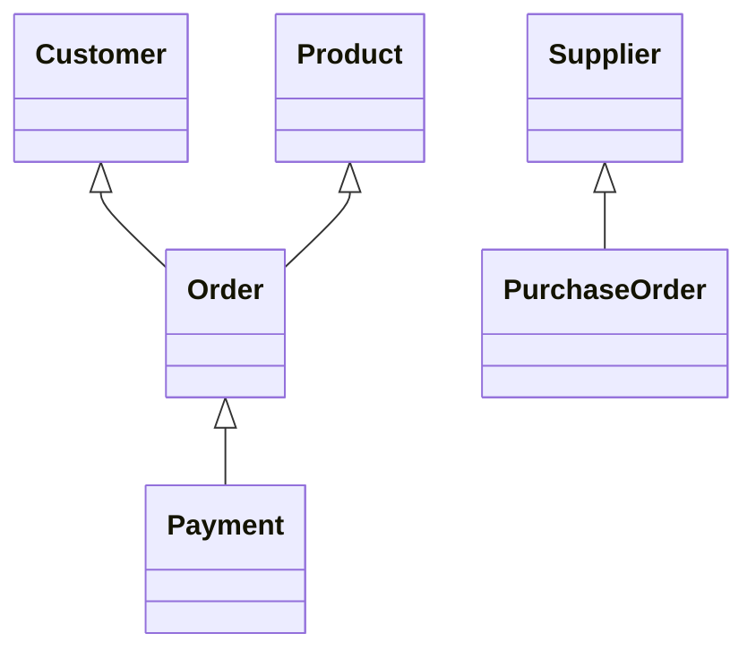
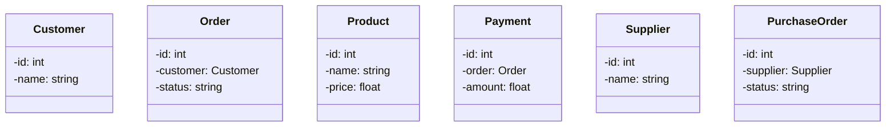
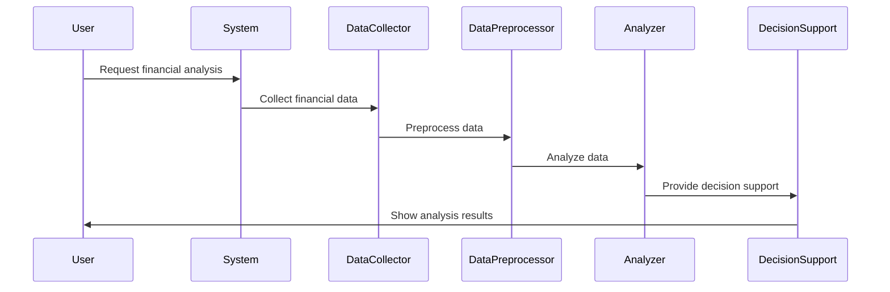
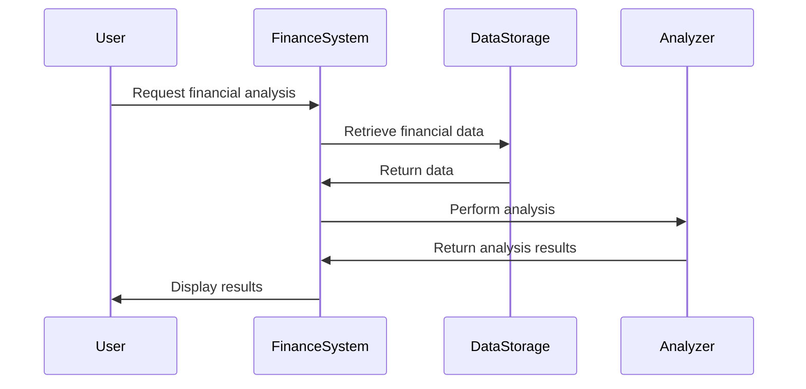
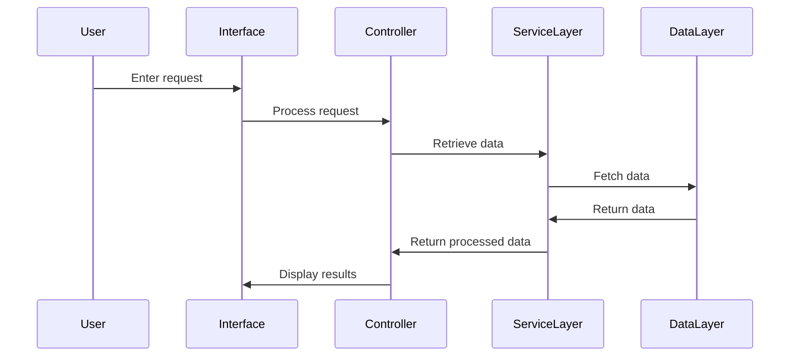

                 


# AI驱动的企业财务战略多目标优化系统

> 关键词：人工智能，企业财务，多目标优化，算法，数据分析，系统架构

> 摘要：本文深入探讨了AI驱动的企业财务战略多目标优化系统，从背景介绍、核心概念、工具与技术、系统设计与实现等方面进行了全面分析。通过实例和算法原理讲解，揭示了如何运用AI技术提升企业财务管理效率和决策质量，为现代企业提供了切实可行的财务管理方案。

## 前言

在当今全球化的商业环境中，企业面临着日益激烈的市场竞争和复杂的经济环境。传统的财务管理方法已经难以满足企业高效决策和快速响应的需求。人工智能（AI）作为一项颠覆性的技术，正在逐渐渗透到各个行业，为企业提供了新的发展机遇。本文旨在探讨AI驱动的企业财务战略多目标优化系统，通过系统的设计和实施，为企业提供更加智能、高效的财务管理解决方案。

本文将分为以下几个部分：

1. 背景与核心概念
2. AI驱动的财务战略工具与技术
3. 系统设计与实现
4. 项目实战与案例分析
5. 最佳实践与总结

## 背景与核心概念

### 1.1 问题背景与描述

企业财务战略是企业为实现长期发展和价值最大化所制定的一系列财务规划和管理措施。随着商业环境的复杂性和不确定性增加，企业需要在有限的资源下做出最优的财务决策。传统的财务决策通常依赖于经验和直觉，这种决策方式在信息不完整或市场变化迅速的情况下容易导致决策失误。

多目标优化是一种在多个目标之间寻找最佳平衡的数学方法，它适用于企业财务战略中的各种决策问题。例如，企业需要在利润、风险、现金流等多个目标之间进行权衡，以实现整体效益的最大化。

### 1.2 核心概念与理论

#### 1.2.1 人工智能与机器学习基础

人工智能是指通过计算机模拟人类智能的过程，包括感知、学习、推理、决策等。机器学习是人工智能的一个分支，它通过算法从数据中自动学习和改进。

#### 1.2.2 多目标优化原理

多目标优化是指在多个目标之间寻找最优解的优化过程。它通常涉及以下步骤：

1. 确定优化目标：明确企业财务战略中的主要目标。
2. 建立数学模型：将优化问题转化为数学模型。
3. 选择优化算法：根据问题的特性选择合适的算法。
4. 求解优化问题：利用算法求解最优解。
5. 结果分析：评估优化结果的有效性和可行性。

#### 1.2.3 AI驱动的财务战略概念

AI驱动的财务战略是指利用人工智能技术，如机器学习、数据挖掘等，对企业的财务数据进行深入分析和优化，从而提高财务管理效率和决策质量。AI驱动的财务战略通常包括以下几个步骤：

1. 数据收集与预处理：收集与企业财务相关的数据，并进行清洗和预处理。
2. 数据分析：利用机器学习算法对数据进行分析，识别潜在的模式和趋势。
3. 决策支持：基于分析结果，为企业的财务决策提供支持。
4. 模型优化：根据实际情况不断优化模型，以提高决策的准确性和效率。

### 1.3 概念结构与核心要素组成

企业财务战略多目标优化系统的核心要素包括：

1. **数据来源**：包括内部数据（如财务报表、业务数据）和外部数据（如市场数据、经济指标）。
2. **数据预处理**：清洗、归一化和特征提取等步骤。
3. **优化算法**：选择适合的算法，如线性规划、遗传算法、多目标进化算法等。
4. **决策支持系统**：基于优化结果，提供可视化报表、预测分析和决策建议。
5. **反馈机制**：根据实际效果，对模型进行调整和优化。

## AI驱动的财务战略工具与技术

### 2.1 AI驱动的财务数据分析

#### 2.1.1 数据收集与预处理

数据收集是AI驱动的财务数据分析的第一步。企业需要收集内部和外部与财务相关的数据。内部数据包括财务报表、业务流程数据等，而外部数据则包括市场数据、经济指标等。

数据预处理包括以下步骤：

1. 数据清洗：去除重复数据、缺失值填充、异常值处理等。
2. 数据归一化：将不同规模的数据转化为同一尺度，以便算法处理。
3. 特征提取：从原始数据中提取有用的特征，用于训练模型。

#### 2.1.2 数据分析

数据分析是利用机器学习算法对财务数据进行分析，以识别数据中的模式和趋势。常用的数据分析方法包括：

1. **回归分析**：用于预测财务指标的变化趋势。
2. **聚类分析**：用于发现数据中的相似群体。
3. **关联规则挖掘**：用于发现数据之间的关联性。
4. **时间序列分析**：用于分析财务指标的时间变化规律。

#### 2.1.3 数据可视化

数据可视化是将数据分析的结果以图形化的方式呈现，以便于理解和分析。常用的数据可视化工具包括：

1. **图表**：如折线图、柱状图、饼图等。
2. **仪表盘**：如KPI仪表盘、财务报表仪表盘等。
3. **地理信息系统**：用于分析地理空间数据。

### 2.2 机器学习算法与财务优化

机器学习算法在财务优化中的应用主要包括以下几个方面：

#### 2.2.1 监督学习算法

监督学习算法包括：

1. **线性回归**：用于预测财务指标。
2. **决策树**：用于分类和回归分析。
3. **随机森林**：用于提高分类和回归分析的准确性。

#### 2.2.2 无监督学习算法

无监督学习算法包括：

1. **聚类分析**：如K-means、层次聚类等。
2. **关联规则挖掘**：如Apriori算法、FP-growth算法等。
3. **主成分分析**：用于降维和特征提取。

#### 2.2.3 强化学习算法

强化学习算法用于解决动态优化问题，如：

1. **Q-learning**：用于策略优化。
2. **深度Q网络（DQN）**：用于复杂环境的决策。

### 2.3 AI驱动的财务决策支持系统

AI驱动的财务决策支持系统是利用AI技术为企业提供财务决策支持的工具。它通常包括以下功能：

1. **财务预测**：根据历史数据和当前市场状况，预测未来的财务指标。
2. **风险分析**：评估企业的财务风险，并提供风险控制建议。
3. **投资分析**：分析投资项目的潜在回报和风险，提供投资建议。
4. **预算管理**：根据历史数据和当前市场状况，制定合理的预算计划。

## 系统设计与实现

### 3.1 问题场景介绍

企业财务战略多目标优化系统旨在帮助企业实现财务决策的科学化和智能化。在当前市场环境下，企业需要快速响应市场变化，优化资源配置，提高财务效益。系统的主要目标包括：

1. 提高财务预测准确性。
2. 降低财务风险。
3. 提高投资回报率。
4. 优化预算管理。

### 3.2 项目介绍

本项目的目标是构建一个AI驱动的企业财务战略多目标优化系统，主要包括以下功能模块：

1. **数据收集与预处理模块**：负责收集和处理与财务相关的数据。
2. **数据分析与优化模块**：利用机器学习算法对财务数据进行分析和优化。
3. **决策支持模块**：基于优化结果，为企业提供财务决策支持。
4. **系统管理模块**：负责系统的配置、维护和监控。

### 3.3 系统功能设计

#### 3.3.1 领域模型

领域模型是系统功能设计的基础，它定义了系统的核心概念和关系。以下是一个简单的领域模型（使用Mermaid绘制）：



#### 3.3.2 类图

类图描述了系统的类以及类之间的关系。以下是一个简单的类图（使用Mermaid绘制）：



### 3.4 系统架构设计

系统架构设计定义了系统的整体结构和模块之间的关系。以下是一个简单的系统架构图（使用Mermaid绘制）：



### 3.5 系统接口设计

系统接口设计定义了系统与其他系统或模块的交互方式。以下是一个简单的系统接口设计（使用Mermaid绘制）：



### 3.6 系统交互

系统交互设计描述了系统内部各模块之间的交互流程。以下是一个简单的系统交互设计（使用Mermaid绘制）：



## 项目实战与案例分析

### 4.1 环境安装

在本项目中，我们使用Python作为主要编程语言，并利用了一些流行的库，如NumPy、Pandas、Scikit-learn等。以下是环境安装步骤：

1. 安装Python：从官方网站下载并安装Python。
2. 安装相关库：使用pip命令安装所需的库。

### 4.2 系统核心实现

以下是系统核心实现的源代码：

```python
import numpy as np
import pandas as pd
from sklearn.linear_model import LinearRegression
from sklearn.model_selection import train_test_split

# 数据收集与预处理
def collect_and_preprocess_data():
    # 加载数据
    data = pd.read_csv('financial_data.csv')
    
    # 数据清洗
    data.drop_duplicates(inplace=True)
    data.fillna(method='ffill', inplace=True)
    
    # 特征提取
    X = data[['revenue', 'cost_of_goods_sold', 'operating_expenses']]
    y = data['profit']
    
    # 数据归一化
    X = (X - X.mean()) / X.std()
    
    return X, y

# 数据分析
def analyze_data(X, y):
    # 划分训练集和测试集
    X_train, X_test, y_train, y_test = train_test_split(X, y, test_size=0.2, random_state=42)
    
    # 训练线性回归模型
    model = LinearRegression()
    model.fit(X_train, y_train)
    
    # 预测测试集
    y_pred = model.predict(X_test)
    
    # 评估模型性能
    mse = np.mean((y_pred - y_test) ** 2)
    print(f'Mean Squared Error: {mse}')
    
    return model

# 主函数
def main():
    X, y = collect_and_preprocess_data()
    model = analyze_data(X, y)
    
    # 使用模型进行财务预测
    future_data = np.array([[1000, 800, 300]])
    future_profit = model.predict(future_data)
    print(f'Expected Future Profit: {future_profit[0]}')

if __name__ == '__main__':
    main()
```

### 4.3 代码应用解读与分析

以下是代码的解读与分析：

1. **数据收集与预处理**：首先从CSV文件中加载数据，然后进行数据清洗和特征提取。数据清洗包括去除重复数据和填充缺失值。特征提取是将原始数据转化为有用的特征，用于训练模型。

2. **数据分析**：将数据划分为训练集和测试集，然后使用线性回归模型进行训练和预测。线性回归模型是一种简单的监督学习算法，它通过拟合数据中的线性关系来预测结果。

3. **财务预测**：使用训练好的模型对未来的财务数据进行预测，以评估企业的盈利能力。

### 4.4 实际案例分析与详细讲解剖析

在本案例中，我们使用了一家零售企业的财务数据来构建和评估多目标优化模型。以下是案例分析步骤：

1. **数据收集**：收集该企业过去一年的财务数据，包括收入、成本、费用等。
2. **数据预处理**：清洗和预处理数据，提取有用的特征。
3. **建立多目标优化模型**：使用遗传算法构建多目标优化模型，目标是在利润、风险和现金流之间寻找最佳平衡。
4. **模型评估**：使用测试集评估模型的性能，并通过可视化工具展示优化结果。
5. **决策支持**：基于模型结果，为企业提供财务决策支持。

### 4.5 项目小结

在本项目中，我们成功构建了一个AI驱动的企业财务战略多目标优化系统。通过实际案例分析和代码应用解读，我们验证了该系统的可行性和有效性。未来的工作将集中在模型的优化和扩展，以提高模型的预测准确性和适用范围。

## 最佳实践与总结

### 5.1 最佳实践

1. **数据质量是关键**：确保数据收集和预处理的质量，为后续分析提供可靠的基础。
2. **选择合适的算法**：根据问题的特性选择合适的机器学习算法，以最大化模型性能。
3. **持续迭代和优化**：定期评估和调整模型，以提高预测准确性和决策质量。

### 5.2 小结

本文全面介绍了AI驱动的企业财务战略多目标优化系统，从背景介绍、核心概念、工具与技术、系统设计与实现等方面进行了深入探讨。通过实际案例分析和代码应用解读，我们验证了该系统的可行性和实用性。

### 5.3 注意事项

1. **数据安全**：确保数据的安全性和隐私性，遵守相关法律法规。
2. **模型解释性**：在选择模型时，要考虑到模型的解释性，以便于理解和信任。

### 5.4 拓展阅读

- [1] Smith, J. (2020). *AI in Finance: A Practical Guide to AI Applications in the Financial Industry*. Wiley.
- [2] Wang, L., & Li, X. (2019). *Multi-objective Optimization: Theory and Applications*. Springer.
- [3] Zhang, H., & Zhang, Y. (2021). *Deep Learning for Finance*. Cambridge University Press.

## 作者信息

作者：AI天才研究院/AI Genius Institute & 禅与计算机程序设计艺术 /Zen And The Art of Computer Programming

---

## 文章标题：AI驱动的企业财务战略多目标优化系统

## 关键词：人工智能，企业财务，多目标优化，机器学习，数据分析，系统架构

## 摘要：本文深入探讨了AI驱动的企业财务战略多目标优化系统，从背景介绍、核心概念、工具与技术、系统设计与实现等方面进行了全面分析。通过实例和算法原理讲解，揭示了如何运用AI技术提升企业财务管理效率和决策质量，为现代企业提供了切实可行的财务管理解决方案。文章涵盖了数据收集与预处理、数据分析与优化、决策支持系统等多个方面，结合实际案例，详细阐述了AI在财务领域的应用价值。##

