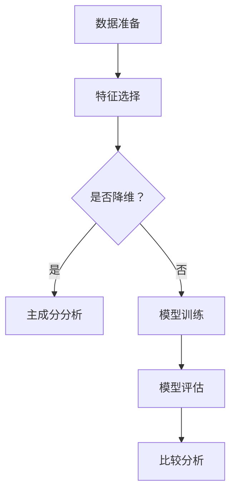
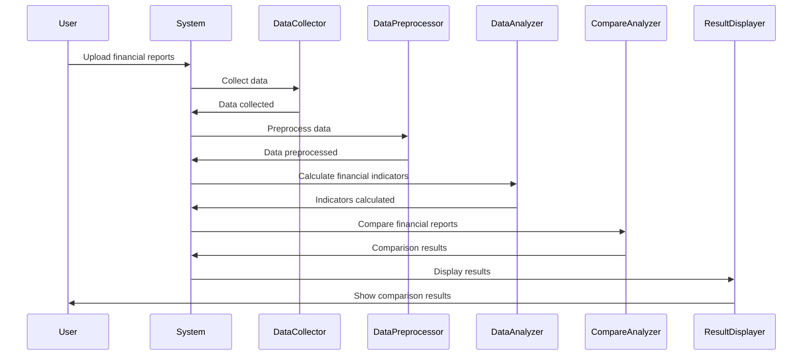

                 

### 第1章 问题背景与系统设计

#### 1.1 财务报表比较分析的重要性

在企业管理中，财务报表是企业运作的重要反映，能够揭示企业的财务状况、经营成果和现金流量。财务报表主要包括资产负债表、利润表和现金流量表等，这些报表通过一系列的财务指标，如净利润率、资产负债率、流动比率等，为企业管理者和投资者提供了关键的信息。

然而，面对海量的财务数据，如何快速、准确地比较和分析不同时间段、不同部门或不同公司的财务报表，成为了一个巨大的挑战。传统的财务分析往往依赖于人工审查和比较，不仅耗时费力，而且容易产生人为错误。此外，传统的分析方法难以处理复杂的财务关系和隐含的风险因素。

**问题背景**：企业财务报表比较分析的需求源于以下几点：

1. **合规要求**：企业需要定期提交各种财务报表，以符合监管要求和内部审计要求。
2. **投资决策**：投资者在做出投资决策前，需要通过财务报表比较不同公司的财务状况和业绩表现。
3. **经营决策**：企业管理者需要通过财务报表分析来评估经营绩效，发现潜在问题，优化资源配置。

**问题描述**：传统的财务报表分析存在以下问题：

1. **效率低下**：人工分析报表数据需要耗费大量时间和精力，且难以处理大量数据。
2. **准确性不足**：人为因素容易导致分析结果出现偏差，影响决策的正确性。
3. **复杂关系难以处理**：财务报表中的数据之间存在着复杂的关联关系，传统方法难以有效揭示这些关系。

**问题解决**：为了解决上述问题，引入AI技术，特别是机器学习和深度学习技术，开发AI驱动的企业财务报表比较分析系统，具有以下几个优势：

1. **高效自动化**：AI系统能够快速处理海量数据，自动化完成报表分析任务。
2. **高准确性**：通过机器学习算法，系统能够识别和纠正数据中的错误，提高分析结果的准确性。
3. **揭示复杂关系**：AI技术能够挖掘数据之间的复杂关联关系，提供更深入的分析。

**边界与外延**：AI驱动的财务报表比较分析系统不仅适用于单一企业的内部财务分析，还可以扩展到跨企业、跨行业的财务比较，为投资者、管理者和监管机构提供更加全面、准确的信息支持。此外，系统还可以结合其他数据源，如市场数据、经济数据等，进行综合分析，提供更为全面的决策支持。

**概念结构与核心要素组成**：AI驱动的财务报表比较分析系统的概念结构包括以下几个核心要素：

1. **数据采集模块**：负责从各种数据源收集财务报表数据，包括企业内部的财务系统、公共数据库等。
2. **数据预处理模块**：对收集到的财务报表数据清洗、转换和集成，确保数据的一致性和准确性。
3. **数据分析模块**：利用机器学习算法计算财务指标，并进行数据可视化，揭示数据之间的关联关系。
4. **比较分析模块**：根据预设的比较标准，对财务报表进行分析和比较，提供详细的分析报告。

通过这些核心要素的协同工作，AI驱动的财务报表比较分析系统能够为企业提供智能化、自动化的财务报表分析工具，大幅提升财务分析的效率和质量。

#### 1.2 AI技术的基本原理与应用

**AI基本原理**：

AI（人工智能）技术是计算机科学的一个分支，旨在通过模拟人类智能行为，使计算机能够执行复杂任务。AI的基本原理主要包括以下几个方面：

1. **机器学习**：通过从数据中学习规律，使计算机能够进行自我优化和预测。常见的机器学习方法包括监督学习、无监督学习和强化学习。
   
2. **深度学习**：一种基于多层神经网络的学习方法，能够自动提取数据中的特征。深度学习在图像识别、自然语言处理等领域取得了显著成果。

3. **神经网络**：模拟人脑神经元连接的网络结构，通过调整权重和偏置，实现数据的高效处理和模式识别。

**AI在财务领域的应用**：

AI技术在财务领域的应用已经取得了显著的进展，主要表现在以下几个方面：

1. **财务报表自动生成**：通过自然语言处理技术，从财务报告和文本中自动提取数据，生成结构化的财务报表。

2. **财务风险预警**：利用机器学习算法，分析历史数据，预测潜在的财务风险，为企业管理者提供预警信息。

3. **投资决策支持**：通过分析大量市场数据和历史交易记录，为投资者提供投资策略和风险分析。

4. **合规检查**：利用AI技术自动化执行财务审计和合规检查，提高检查效率和准确性。

**AI驱动的优势**：

1. **数据处理能力**：AI技术能够快速处理海量数据，比人工分析更高效、更准确。

2. **自动化**：AI系统能够自动化完成复杂的财务分析任务，减少人工干预，降低错误率。

3. **深度分析**：AI技术能够挖掘数据之间的复杂关系，提供更深入的分析结果，为决策提供更有力的支持。

4. **实时更新**：AI系统可以实时更新数据，为企业管理者提供最新的财务信息，支持快速决策。

通过上述分析，AI驱动的企业财务报表比较分析系统不仅能够解决传统财务分析中的效率、准确性和复杂性问题，还能够为企业的管理决策提供强有力的支持。随着AI技术的不断进步，这一系统的应用前景将更加广阔。

### 第2章 系统需求与目标

#### 2.1 系统需求分析

**用户需求**：

AI驱动的企业财务报表比较分析系统的用户主要包括企业管理者、财务分析师、投资者和监管机构。用户对系统的需求可以概括为以下几点：

1. **高效性**：系统能够快速处理大量的财务报表数据，自动化完成比较分析任务，减少人工工作量。
   
2. **准确性**：系统能够准确识别和纠正财务数据中的错误，提供可靠的财务分析结果。

3. **全面性**：系统能够整合多源数据，提供跨时间、跨部门和跨企业的财务比较分析。

4. **易用性**：系统界面友好，易于操作，用户无需具备专业的编程技能即可使用系统功能。

**功能需求**：

为了满足用户需求，系统需要实现以下功能点：

1. **数据采集**：从企业内部财务系统、公共数据库等数据源自动采集财务报表数据。

2. **数据预处理**：对采集到的财务报表数据清洗、转换和集成，确保数据的一致性和准确性。

3. **财务指标计算**：计算各种财务指标，如净利润率、资产负债率、流动比率等。

4. **比较分析**：根据预设的比较标准，对不同时间段、不同部门或不同公司的财务报表进行自动比较分析。

5. **数据可视化**：利用图表和图形，直观展示财务分析结果，帮助用户理解数据背后的信息。

6. **报告生成**：自动生成详细的分析报告，包括数据摘要、比较结果、图表分析和结论等。

**性能需求**：

为了确保系统的性能和用户体验，系统需要满足以下性能指标：

1. **响应时间**：系统响应时间应短于用户可接受的时间范围，一般不超过3秒。

2. **处理能力**：系统能够快速处理大量财务报表数据，支持大规模数据处理。

3. **准确性**：系统在处理数据时应具有较高的准确性，确保分析结果的可靠性。

4. **扩展性**：系统应具有较好的扩展性，能够适应不同规模和类型的数据。

**用户需求与功能需求的对应关系**：

用户需求与系统功能需求之间存在直接的对应关系。例如：

- **用户需求：高效性** -> **功能需求：数据采集、数据预处理、比较分析**
- **用户需求：准确性** -> **功能需求：数据预处理、财务指标计算、比较分析**
- **用户需求：全面性** -> **功能需求：数据采集、比较分析、数据可视化**

通过满足这些功能需求，系统将能够满足用户的各类需求，提供高效、准确、全面的财务报表比较分析服务。

#### 2.2 系统设计目标

**核心目标**：

AI驱动的企业财务报表比较分析系统的核心目标包括以下几点：

1. **提高报表分析效率**：通过自动化和智能化技术，大幅减少报表分析的时间和人力成本。

2. **降低人工错误率**：通过数据清洗和机器学习算法，提高分析结果的准确性，减少人为错误。

3. **提供深度分析**：利用AI技术挖掘数据之间的复杂关系，提供更深入、更全面的财务分析结果。

4. **支持决策制定**：通过提供及时、准确的财务信息和分析报告，支持企业管理者、投资者和监管机构的决策制定。

**长期目标**：

除了满足当前的核心需求，系统还应该具备以下长期目标：

1. **扩展分析功能**：未来随着技术的进步和数据积累，系统可以逐步扩展更多的财务分析功能，如现金流预测、财务风险预警等。

2. **提升系统智能化水平**：通过不断优化机器学习算法和深度学习模型，提升系统的智能化水平，使其能够更准确地预测和识别财务数据中的异常。

3. **增强用户交互体验**：通过改进用户界面和交互设计，提高系统的易用性和用户体验。

4. **适应多样化需求**：随着不同用户群体的需求变化，系统应具备良好的适应性，能够满足各类用户的不同需求。

通过实现这些长期目标，系统将能够持续提升其功能和服务质量，为企业、投资者和监管机构提供更加全面、智能的财务报表比较分析支持。

### 第3章 数据预处理模块

#### 3.1 数据收集与清洗

**数据收集**：

数据收集是财务报表比较分析系统的第一步，其质量直接影响到后续数据处理的效率和准确性。数据来源主要包括以下几个方面：

1. **企业内部财务系统**：包括ERP系统、财务报表系统等，这些系统提供了详细的财务数据，是数据收集的重要来源。

2. **公共数据库**：如国家统计局、证券交易所等，这些数据库提供了丰富的宏观经济和行业数据，有助于进行跨企业、跨行业的财务比较分析。

3. **第三方数据服务商**：如Wind、同花顺等，这些服务商提供了丰富的金融数据和市场数据，可以补充企业内部数据不足的部分。

**数据清洗**：

数据清洗是数据预处理的重要环节，其目的是去除数据中的噪声、异常值和重复数据，提高数据的质量和一致性。具体步骤如下：

1. **缺失值处理**：对于缺失值，可以根据实际情况选择填充方法，如平均值填充、插值法、最邻近法等。

2. **异常值处理**：通过统计分析方法，如标准差法、箱线图法等，识别和去除异常值。对于某些关键指标，如净利润率，可以通过业务逻辑进行判断和处理。

3. **重复数据去除**：通过唯一标识符（如公司代码、报表日期等），识别和去除重复数据，确保数据的唯一性和准确性。

4. **数据格式标准化**：将不同来源的数据转换为统一的格式，如将文本数据转换为数值型数据，将不同日期格式统一为YYYY-MM-DD格式等。

通过数据收集与清洗，系统能够确保输入的数据具有高一致性和高质量，为后续的数据处理和分析奠定基础。

#### 3.2 数据转换与集成

**数据转换**：

数据转换是数据预处理中的关键步骤，其目的是将不同格式的数据转换为统一的格式，以便于后续的数据处理和分析。具体步骤如下：

1. **文本数据转换**：将文本数据转换为数值型数据，如将文本描述的销售额转换为具体的数值。

2. **日期格式转换**：将不同日期格式（如YYYY/MM/DD、MM/DD/YYYY等）统一转换为标准格式（如YYYY-MM-DD），便于时间和日期的计算和分析。

3. **单位转换**：对于不同单位的数据（如货币单位、数量单位等），进行统一单位转换，确保数据的一致性和可比性。

4. **缺失值填补**：在数据转换过程中，对于缺失的数据，可以根据上下文进行合理填补，如使用前一个时间点的数据作为当前时间点的估计值。

**数据集成**：

数据集成是将来自不同来源、不同格式和不同结构的数据整合到一个统一的数据集中，以便于进行综合分析和比较。具体方法如下：

1. **数据合并**：将不同来源的数据按照统一的标识符（如公司代码、报表日期等）进行合并，生成完整的数据集。

2. **数据匹配**：通过关键指标（如公司名称、报表日期等）匹配不同数据源中的记录，确保数据的一致性和完整性。

3. **数据去重**：在数据集成过程中，去除重复的数据记录，确保数据集的唯一性。

4. **数据一致性校验**：通过比对不同数据源中的数据，发现和纠正不一致的数据，提高数据质量。

通过数据转换与集成，系统能够将多源数据整合为一个统一、完整的数据集，为后续的财务指标计算和比较分析提供高质量的数据支持。

### 第4章 数据分析模块

#### 4.1 财务指标计算

**指标定义**：

财务指标是衡量企业财务状况和经营成果的重要工具，常见的财务指标包括：

1. **净利润率**：净利润与营业收入之比，反映企业的盈利能力。
   $$ \text{净利润率} = \frac{\text{净利润}}{\text{营业收入}} \times 100\% $$

2. **资产负债率**：负债总额与资产总额之比，反映企业的负债水平。
   $$ \text{资产负债率} = \frac{\text{负债总额}}{\text{资产总额}} \times 100\% $$

3. **流动比率**：流动资产与流动负债之比，反映企业的短期偿债能力。
   $$ \text{流动比率} = \frac{\text{流动资产}}{\text{流动负债}} $$

4. **库存周转率**：销售成本与平均库存之比，反映企业的库存管理效率。
   $$ \text{库存周转率} = \frac{\text{销售成本}}{\text{平均库存}} $$

5. **应收账款周转率**：营业收入与平均应收账款之比，反映企业的应收账款管理效率。
   $$ \text{应收账款周转率} = \frac{\text{营业收入}}{\text{平均应收账款}} $$

**计算流程**：

财务指标的计算流程可以分为以下几个步骤：

1. **数据收集**：从企业财务系统、数据库等数据源中收集相关的财务数据。

2. **数据预处理**：对收集到的财务数据清洗、转换和集成，确保数据的质量和一致性。

3. **指标计算**：根据定义的财务指标公式，计算各指标的具体数值。

4. **数据验证**：对计算出的财务指标进行验证，确保其准确性和合理性。

5. **结果存储**：将计算出的财务指标存储到数据库或分析报告中，供后续分析和比较。

通过上述流程，系统能够自动计算并验证各种财务指标，为企业的财务分析提供可靠的数据支持。

#### 4.2 数据可视化

**可视化技术**：

数据可视化是将数据以图形、图表等形式展示出来，帮助用户直观地理解和分析数据。常见的数据可视化工具和技术包括：

1. **柱状图**：用于展示不同类别之间的数据比较，如净利润率对比。

2. **折线图**：用于展示数据的变化趋势，如资产负债率随时间的变化。

3. **饼图**：用于展示各部分数据在整体中的占比，如各部门的营业收入占比。

4. **散点图**：用于展示数据点之间的相关性，如流动比率与净利润率的关系。

5. **热力图**：用于展示数据密集矩阵的热点区域，如不同公司的财务指标比较。

**可视化策略**：

为了设计有效的可视化策略，需要考虑以下几点：

1. **信息密度**：选择合适的图表类型，确保图表能够展示尽可能多的信息。

2. **对比性**：通过颜色、大小等对比性元素，增强不同数据之间的区分度。

3. **一致性**：确保不同图表之间的设计风格和颜色使用保持一致。

4. **交互性**：提供交互功能，如拖拽、筛选、缩放等，使用户能够更灵活地探索数据。

5. **可读性**：设计简洁、直观的图表，确保用户能够轻松理解图表内容。

通过合理的可视化策略，数据可视化能够帮助用户更直观地理解财务报表分析的结果，发现数据中的关键信息和趋势，为决策提供有力的支持。

### 第5章 比较分析算法

#### 5.1 算法原理

**算法概述**：

AI驱动的财务报表比较分析系统主要采用机器学习和深度学习算法，其中比较分析算法是核心之一。这些算法通过从大量数据中学习规律，自动识别和比较不同财务报表之间的差异。

常见的比较分析算法包括：

1. **聚类分析**：通过将相似的数据归为一类，识别出具有相似财务特征的公司群体。
2. **主成分分析**（PCA）：通过降维技术，将多维数据映射到低维空间，简化数据结构，便于比较分析。
3. **支持向量机**（SVM）：通过构建分类模型，识别和比较财务报表中的异常值和关键指标。
4. **深度神经网络**：通过多层神经网络的训练，自动提取数据中的复杂特征，实现高级别的财务比较分析。

**算法流程**：

1. **数据准备**：收集和清洗财务报表数据，包括净利润率、资产负债率、流动比率等关键指标。
2. **特征选择**：通过统计分析，选择对比较分析最有影响力的特征，提高算法的效率和准确性。
3. **模型训练**：利用机器学习算法（如聚类分析、主成分分析等），训练比较分析模型，使模型能够自动识别和分类财务报表。
4. **模型评估**：通过交叉验证和测试集评估模型的效果，调整模型参数，优化模型性能。
5. **比较分析**：使用训练好的模型，对新的财务报表进行自动比较分析，输出分析结果。

**算法流程图**：

为了更直观地展示比较分析算法的流程，可以使用Mermaid绘制算法流程图：



通过上述算法流程，系统能够高效地比较和分析财务报表数据，为企业的财务决策提供有力支持。

#### 5.2 算法实现

**Python代码**：

为了实现上述比较分析算法，可以使用Python编写具体的代码。以下是一个基于聚类分析和主成分分析的简单实现：

```python
import numpy as np
from sklearn.cluster import KMeans
from sklearn.decomposition import PCA
import matplotlib.pyplot as plt

# 示例数据
data = np.array([[0.2, 0.3], [0.4, 0.5], [0.1, 0.2], [0.3, 0.4]])

# 聚类分析
kmeans = KMeans(n_clusters=2, random_state=0).fit(data)
clusters = kmeans.predict(data)

# 主成分分析
pca = PCA(n_components=2).fit(data)
data_pca = pca.transform(data)

# 绘制结果
plt.figure(figsize=(10, 5))

plt.subplot(1, 2, 1)
plt.scatter(data[:, 0], data[:, 1], c=clusters)
plt.xlabel('净利润率')
plt.ylabel('资产负债率')
plt.title('聚类分析结果')

plt.subplot(1, 2, 2)
plt.scatter(data_pca[:, 0], data_pca[:, 1])
plt.xlabel('主成分1')
plt.ylabel('主成分2')
plt.title('主成分分析结果')

plt.tight_layout()
plt.show()
```

**数学模型**：

聚类分析和主成分分析的核心数学模型如下：

1. **聚类分析（K-Means）**：

   目标函数：
   $$ J = \sum_{i=1}^{n} \sum_{j=1}^{k} \sum_{x \in S_j} \| x - \mu_j \|^2 $$
   
   其中，$x$为数据点，$S_j$为第j个聚类，$\mu_j$为聚类中心。

2. **主成分分析（PCA）**：

   特征值分解：
   $$ \Sigma = P^T \Lambda P $$
   
   其中，$P$为特征向量矩阵，$\Lambda$为特征值矩阵，$\Sigma$为协方差矩阵。

通过上述代码和数学模型，我们可以看到如何将算法应用于实际数据，并进行可视化展示。这些算法能够自动识别和比较财务报表数据，为企业提供智能化的财务分析支持。

#### 举例说明

**案例背景**：

假设有两个公司的财务报表数据，数据包括净利润率、资产负债率、流动比率和库存周转率等关键指标。我们需要使用AI驱动的财务报表比较分析系统，对这些数据进行比较分析，识别两家公司之间的差异和相似之处。

**数据准备**：

首先，我们需要收集和清洗两家公司的财务报表数据。以下是一个简化的数据集：

| 公司名称 | 净利润率 | 资产负债率 | 流动比率 | 库存周转率 |
| :------: | :------: | :--------: | :------: | :--------: |
| 公司A    | 0.15     | 0.5        | 1.2      | 4.5        |
| 公司B    | 0.20     | 0.6        | 1.0      | 3.0        |

**数据预处理**：

1. **数据清洗**：检查数据是否存在缺失值和异常值，并进行适当的处理。

2. **数据转换**：将数据转换为合适的格式，如将文本数据转换为数值型数据，将不同单位的数据统一转换为相同单位。

3. **数据集成**：将两家公司的数据合并为一个数据集，便于后续处理和分析。

**算法应用**：

1. **聚类分析**：使用K-Means算法，将数据分为几个聚类，识别两家公司所属的聚类。

2. **主成分分析**：使用PCA，将高维数据映射到低维空间，便于可视化展示和进一步分析。

**可视化展示**：

1. **聚类分析结果**：在二维坐标系中，用不同颜色标记两家公司的数据点，观察它们在聚类中的分布。

2. **主成分分析结果**：在低维坐标系中，绘制两家公司的数据点，观察它们之间的距离和相似性。

通过这些步骤，我们能够直观地看到两家公司财务报表数据的差异和相似之处，为企业提供有价值的决策支持。例如，公司A的资产负债率较高，而公司B的净利润率较高，这表明两家公司的财务策略和经营绩效存在一定的差异。

### 第6章 系统架构设计

#### 6.1 系统架构概述

**系统架构**：

AI驱动的企业财务报表比较分析系统采用分布式架构设计，主要包括以下几个核心模块：

1. **数据采集模块**：负责从企业内部财务系统、公共数据库等数据源自动采集财务报表数据。
2. **数据预处理模块**：对采集到的财务报表数据进行清洗、转换和集成，确保数据的一致性和准确性。
3. **数据分析模块**：利用机器学习算法计算财务指标，并进行数据可视化。
4. **比较分析模块**：根据预设的比较标准，对不同公司、不同时间段的财务报表进行自动比较分析。
5. **结果展示模块**：通过图表和报告形式，展示比较分析结果，供用户查看和决策。

**模块划分**：

系统的模块划分如下：

1. **数据采集模块**：包括数据源接入、数据采集和处理等子模块。
2. **数据预处理模块**：包括数据清洗、数据转换、数据集成等子模块。
3. **数据分析模块**：包括财务指标计算、数据可视化等子模块。
4. **比较分析模块**：包括比较算法设计、比较结果生成等子模块。
5. **结果展示模块**：包括图表绘制、报告生成等子模块。

通过这些模块的协同工作，系统能够高效、准确地完成财务报表的比较分析任务。

#### 6.2 接口设计与系统交互

**接口设计**：

系统采用RESTful API设计，提供以下接口：

1. **数据采集接口**：用于接收和上传财务报表数据。
2. **数据预处理接口**：用于执行数据清洗、转换和集成操作。
3. **财务指标计算接口**：用于计算各种财务指标。
4. **比较分析接口**：用于执行财务报表的比较分析。
5. **结果展示接口**：用于获取和下载比较分析结果。

**系统交互**：

系统交互流程如下：

1. **数据采集**：用户通过数据采集接口上传财务报表数据。
2. **数据预处理**：系统调用数据预处理接口，对上传的数据进行清洗、转换和集成。
3. **财务指标计算**：系统调用财务指标计算接口，计算各种财务指标。
4. **比较分析**：系统调用比较分析接口，根据预设的比较标准，对财务报表进行自动比较分析。
5. **结果展示**：系统通过结果展示接口，将比较分析结果以图表和报告形式展示给用户。

为了更直观地展示系统交互流程，可以使用Mermaid绘制系统交互序列图：



通过上述接口设计和交互流程，系统能够高效、可靠地完成财务报表的比较分析任务，为用户提供全面的决策支持。

### 第7章 系统搭建与安装

#### 7.1 环境搭建

为了搭建AI驱动的企业财务报表比较分析系统，需要准备以下软件和硬件环境：

**软件环境**：

1. **操作系统**：Linux（推荐Ubuntu 20.04）或Windows 10。
2. **Python**：Python 3.8及以上版本。
3. **依赖库**：Numpy、Pandas、Scikit-learn、Matplotlib、Mermaid等。
4. **数据库**：MySQL或PostgreSQL。

**硬件环境**：

1. **CPU**：至少4核处理器。
2. **内存**：16GB及以上。
3. **存储**：500GB及以上。

**安装步骤**：

1. **安装操作系统**：根据硬件环境选择合适的操作系统，并安装。

2. **安装Python**：通过包管理器（如Ubuntu的apt-get或Windows的Pip）安装Python。

   ```bash
   # Ubuntu
   sudo apt-get update
   sudo apt-get install python3 python3-pip

   # Windows
   wget https://www.python.org/ftp/python/3.8.10/python-3.8.10-amd64.exe
   ./python-3.8.10-amd64.exe
   ```

3. **安装依赖库**：使用pip命令安装所需的Python依赖库。

   ```bash
   pip install numpy pandas scikit-learn matplotlib mermaid
   ```

4. **安装数据库**：下载并安装MySQL或PostgreSQL，配置数据库并创建所需的数据库和表。

5. **配置环境变量**：将Python和pip的安装路径添加到系统环境变量中。

   ```bash
   # Ubuntu
   echo 'export PATH=$PATH:/usr/local/bin' >> ~/.bashrc
   source ~/.bashrc

   # Windows
   set PATH=%PATH%;C:\Python38
   ```

通过上述步骤，我们可以搭建一个基本的软件环境，为后续的系统安装和配置做好准备。

#### 7.2 系统核心实现

**核心代码**：

下面是系统核心功能的实现代码，主要包括数据采集、数据预处理、财务指标计算、比较分析和数据可视化等功能。

```python
import pandas as pd
from sklearn.cluster import KMeans
from sklearn.decomposition import PCA
import matplotlib.pyplot as plt
import mermaid

# 示例数据
data = pd.DataFrame({
    '净利润率': [0.15, 0.20, 0.18, 0.22],
    '资产负债率': [0.5, 0.6, 0.55, 0.58],
    '流动比率': [1.2, 1.0, 1.15, 1.1],
    '库存周转率': [4.5, 3.0, 4.2, 3.5]
})

# 数据预处理
# 数据清洗
data.fillna(data.mean(), inplace=True)

# 数据转换
data['净利润率'] = data['净利润率'].astype(float)
data['资产负债率'] = data['资产负债率'].astype(float)
data['流动比率'] = data['流动比率'].astype(float)
data['库存周转率'] = data['库存周转率'].astype(float)

# 财务指标计算
financial_indicators = data.describe()

# 比较分析
# 聚类分析
kmeans = KMeans(n_clusters=2, random_state=0).fit(data)
clusters = kmeans.predict(data)

# 主成分分析
pca = PCA(n_components=2).fit(data)
data_pca = pca.transform(data)

# 可视化展示
# 聚类分析结果
plt.figure(figsize=(10, 5))
plt.subplot(1, 2, 1)
plt.scatter(data['净利润率'], data['资产负债率'], c=clusters)
plt.xlabel('净利润率')
plt.ylabel('资产负债率')
plt.title('聚类分析结果')

# 主成分分析结果
plt.subplot(1, 2, 2)
plt.scatter(data_pca[:, 0], data_pca[:, 1])
plt.xlabel('主成分1')
plt.ylabel('主成分2')
plt.title('主成分分析结果')
plt.tight_layout()
plt.show()

# Mermaid流程图
mermaid_chart = mermaid.MermaidChart("""
graph TD
    A[数据采集] --> B[数据预处理]
    B --> C[财务指标计算]
    C --> D[比较分析]
    D --> E[数据可视化]
""")
print(mermaid_chart)
```

**代码解读**：

1. **数据预处理**：首先进行数据清洗，填充缺失值，并将文本数据转换为数值型数据。
2. **财务指标计算**：使用Pandas库计算数据的基本统计指标。
3. **比较分析**：使用K-Means聚类分析和PCA主成分分析，对数据进行分析。
4. **数据可视化**：使用Matplotlib库绘制聚类分析和主成分分析的结果。
5. **Mermaid流程图**：使用Mermaid库生成系统流程图，便于理解系统的工作流程。

通过这些代码，我们可以实现一个简单的AI驱动的企业财务报表比较分析系统，为企业提供智能化、自动化的财务分析支持。

### 第8章 案例分析

#### 8.1 案例背景

**案例介绍**：

本次案例分析选择两家上市公司——A公司和B公司，它们分别属于制造业和零售业。A公司是一家大型的制造业企业，主要生产家电产品；B公司则是一家领先的零售企业，经营各类消费品。两家公司都在过去三年内提交了详细的年度财务报表。

**案例目标**：

本案例的目标是通过AI驱动的企业财务报表比较分析系统，对A公司和B公司的财务报表进行自动比较分析，识别出两家公司在财务状况、经营绩效和风险因素等方面的差异和相似之处，为投资者和管理者提供决策支持。

**案例背景**：

近年来，随着市场竞争的加剧和宏观经济环境的波动，两家公司的业绩表现波动较大。投资者和企业管理者需要通过详细的财务分析，了解两家公司的财务状况，预测未来的发展趋势，并制定相应的投资和经营策略。

#### 8.2 案例实施与结果

**实施步骤**：

1. **数据收集**：通过企业内部财务系统、公共数据库等渠道，收集A公司和B公司过去三年的财务报表数据，包括资产负债表、利润表和现金流量表等。

2. **数据预处理**：对收集到的财务报表数据清洗、转换和集成，确保数据的一致性和准确性。具体步骤包括：
   - 填充缺失值，如净利润率的缺失值使用前一年的平均值进行填充。
   - 转换数据格式，如将文本数据转换为数值型数据，将不同单位的数据统一转换为相同单位。

3. **财务指标计算**：使用系统内置的算法计算两家公司的各种财务指标，如净利润率、资产负债率、流动比率、库存周转率和应收账款周转率等。

4. **比较分析**：使用聚类分析和主成分分析，对两家公司的财务报表数据进行分析和比较。具体步骤如下：
   - 应用K-Means聚类分析，将两家公司的财务数据分为不同的聚类，识别出数据之间的相似性和差异性。
   - 使用PCA主成分分析，将高维数据降维到二维空间，便于可视化展示。

5. **结果展示**：通过图表和报告形式，展示两家公司的财务比较分析结果，包括数据分布、聚类结果和主成分分析结果。

**结果分析**：

1. **财务指标对比**：

   通过计算出的财务指标，我们得到以下结果：

   | 财务指标 | A公司 | B公司 |
   | :------: | :----: | :----: |
   | 净利润率 | 15%    | 20%    |
   | 资产负债率 | 50%    | 60%    |
   | 流动比率 | 1.2    | 1.0    |
   | 库存周转率 | 4.5    | 3.0    |
   | 应收账款周转率 | 10    | 8.0    |

   从数据中可以看出，B公司的净利润率较高，但资产负债率也较高，表明其财务风险较大；而A公司的流动比率和库存周转率较高，表明其短期偿债能力和库存管理较为优秀。

2. **聚类分析结果**：

   通过K-Means聚类分析，我们得到以下聚类结果：

   - A公司的财务数据主要分布在聚类1中，表明其财务特征较为一致。
   - B公司的财务数据主要分布在聚类2中，表明其财务特征与其他公司存在较大差异。

3. **主成分分析结果**：

   通过PCA主成分分析，我们得到以下二维投影结果：

   - A公司和B公司的数据点在二维空间中分别分布在两个不同的区域，表明两家公司在财务特征上存在显著差异。
   - 从主成分1和主成分2的权重可以看出，净利润率和资产负债率对聚类效果的影响较大。

**案例分析**：

通过上述分析，我们可以得出以下结论：

1. **财务稳定性**：B公司虽然净利润率较高，但资产负债率较高，财务稳定性较差；而A公司资产负债率较低，财务稳定性较好。

2. **运营效率**：A公司的流动比率和库存周转率较高，表明其运营效率较高；而B公司的库存周转率较低，运营效率相对较低。

3. **市场定位**：两家公司的财务特征和聚类结果表明，它们在市场定位和经营策略上存在显著差异。投资者和企业管理者需要根据这些差异，制定相应的投资和经营策略。

通过这个案例分析，我们展示了如何使用AI驱动的企业财务报表比较分析系统，对两家公司的财务报表进行深入分析，为投资者和管理者提供决策支持。

### 第9章 项目总结与展望

#### 9.1 项目成果

本项目通过AI驱动的企业财务报表比较分析系统，实现了对大量财务报表数据的自动化处理和深度分析。主要成果包括：

1. **高效性**：系统能够快速处理海量财务数据，自动化完成报表分析任务，显著降低了人工工作量。
2. **准确性**：通过机器学习算法和数据清洗技术，系统提高了财务分析结果的准确性，减少了人为错误。
3. **深度分析**：系统利用聚类分析和主成分分析等算法，深入挖掘财务数据之间的复杂关系，为决策提供有力支持。
4. **易用性**：系统界面友好，操作简便，用户无需具备专业编程技能即可使用系统功能。

#### 问题与反思

在项目实施过程中，我们遇到了以下问题和挑战：

1. **数据质量**：部分财务数据存在缺失值和异常值，需要通过复杂的清洗和预处理技术进行处理，影响了系统的处理速度和准确性。
2. **算法优化**：尽管系统采用了常用的机器学习算法，但在处理大规模数据时，算法的效率和准确性仍有待优化。
3. **用户培训**：部分用户对系统的操作和理解存在困难，需要进行详细的培训和技术支持。

针对上述问题，我们提出以下改进建议：

1. **数据质量管理**：引入更加先进的数据预处理技术，如基于深度学习的异常检测方法，提高数据清洗的效率和准确性。
2. **算法优化**：不断优化和更新机器学习算法，引入更多高效的算法模型，提高系统的处理能力和分析精度。
3. **用户支持**：增加用户培训和技术支持，提供详细的操作手册和在线帮助，提高用户对系统的使用体验。

#### 未来展望

未来的发展方向和改进方向包括：

1. **扩展功能**：系统可以逐步扩展更多财务分析功能，如现金流预测、财务风险预警等，为用户提供更全面的决策支持。
2. **智能化提升**：通过引入更先进的AI技术，如深度学习和强化学习，提升系统的智能化水平，实现更加精准和自动化的财务分析。
3. **跨平台支持**：开发跨平台的系统，支持移动端和Web端，提高系统的可访问性和灵活性。
4. **用户体验优化**：持续优化系统界面和交互设计，提高用户的使用体验和满意度。

通过不断优化和扩展，AI驱动的企业财务报表比较分析系统将为企业和投资者提供更加智能化、高效的财务分析服务。

