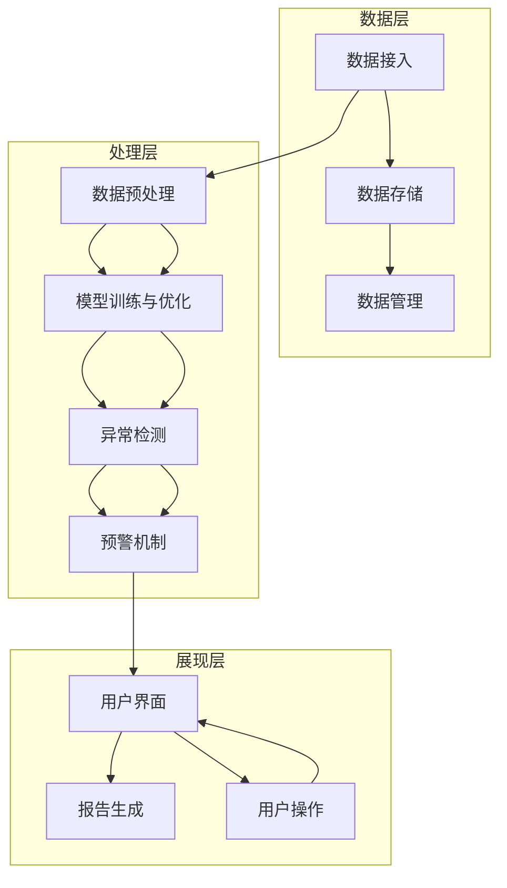
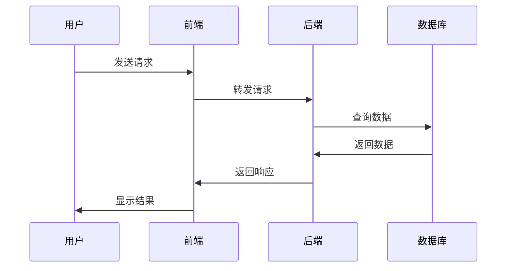

                 

### 第一部分：AI驱动的企业财务舞弊检测系统概述

在当前高度全球化和信息化的商业环境中，企业财务舞弊问题已经成为一个全球性的挑战。财务舞弊不仅对企业的财务状况造成直接的损害，还可能对企业的声誉、投资者信心以及整个市场产生深远的影响。随着技术的不断进步，人工智能（AI）作为一种强大的工具，正被广泛应用于各个领域，包括财务舞弊的检测。AI驱动的企业财务舞弊检测系统，通过利用机器学习和数据分析技术，能够在海量数据中快速准确地识别潜在的财务舞弊行为，提高企业的风险管理能力。

#### 第1章：问题背景与核心概念

**1.1 问题背景**

- **财务舞弊的普遍性与危害**：财务舞弊是一种故意提供虚假财务报告或误导投资者的行为。它可能表现为虚假交易、收入和利润操纵、资产隐藏、会计操纵等。据国际反舞弊组织（ACFE）统计，全球范围内的财务舞弊事件每年都在增加，对经济造成的损失高达数百亿美元。

- **传统财务舞弊检测方法的局限性**：传统的财务舞弊检测方法通常依赖于手工审核和财务报表分析，这些方法存在以下局限性：
  - **人工依赖性高**：依赖人为判断，容易出现主观性和疲劳效应，降低检测效率。
  - **数据分析能力有限**：传统方法难以处理海量数据，且无法检测出复杂或不常见的舞弊行为。
  - **滞后性**：传统方法通常在财务舞弊事件发生后才能发挥作用，无法进行事前预警。

- **AI技术在财务舞弊检测中的潜力**：AI技术，特别是机器学习和深度学习算法，具有以下优势：
  - **数据处理能力强大**：能够处理和分析大量的历史数据，从中挖掘出潜在的规律和异常。
  - **自动化与实时性**：可以实现自动化检测，并对实时数据流进行监控，提供即时的预警。
  - **智能性**：通过不断学习和优化，AI系统可以识别出复杂和隐蔽的财务舞弊行为。

**1.2 核心概念**

- **财务舞弊**：财务舞弊是一种故意提供虚假财务报告或误导投资者的行为，包括但不限于虚假交易、收入和利润操纵、资产隐藏、会计操纵等。

- **AI驱动的财务舞弊检测**：利用AI技术，特别是机器学习和深度学习算法，对企业的财务数据进行分析，以识别潜在的财务舞弊行为。

接下来，我们将进一步探讨AI驱动的财务舞弊检测系统的具体方法和技术，为读者提供一个全面的理解。

----------------------------------------------------------------

## 第1章：问题背景与核心概念

### 1.1 问题背景

**财务舞弊的普遍性与危害**

财务舞弊作为一种故意提供虚假财务报告或误导投资者的行为，在当今全球化和信息化的商业环境中愈发普遍。这种行为的严重危害不仅体现在对企业的财务状况的直接影响上，还可能对企业的声誉、投资者信心以及整个市场产生深远的影响。

首先，财务舞弊对企业财务状况的直接影响是多方面的。它可能导致企业的财务报表失真，从而误导投资者和利益相关者，使得企业在资本市场上的形象受到损害。此外，财务舞弊还会导致企业的现金流问题，影响其日常运营和长期发展战略。更严重的是，如果舞弊行为未被及时发现和纠正，企业可能会面临法律责任和巨额罚款，进一步加剧其财务困境。

其次，财务舞弊对企业的声誉和投资者信心有着长期的负面影响。一次严重的财务舞弊事件可能使得企业在市场上失去信誉，导致投资者流失和股价暴跌。长期的声誉损失可能导致企业在吸引投资和合作伙伴方面遇到困难，进一步削弱其竞争力。

最后，财务舞弊对整个市场的影响也是不可忽视的。当投资者对市场的信心受到打击时，可能会导致市场整体的投资意愿下降，从而影响市场的发展和创新。此外，财务舞弊行为可能会引发一系列的监管措施和法律诉讼，增加市场的法律和制度成本。

**传统财务舞弊检测方法的局限性**

尽管财务舞弊的危害显而易见，但传统的财务舞弊检测方法在实际应用中存在诸多局限性，难以有效应对这一挑战。

1. **人工依赖性高**：传统的财务舞弊检测主要依赖于手工审核和财务报表分析。这种方法高度依赖人为判断，容易出现主观性和疲劳效应，降低检测效率和准确性。

2. **数据分析能力有限**：传统方法通常只能处理有限的数据量，且依赖于简单的统计工具和线性模型。这种方法难以应对海量数据和复杂的数据关系，无法有效检测出隐藏在数据中的异常行为。

3. **滞后性**：传统方法通常在财务舞弊事件发生后才能发挥作用，无法进行事前预警。这意味着企业在发现财务舞弊时，往往已经遭受了巨大的损失。

**AI技术在财务舞弊检测中的潜力**

随着人工智能（AI）技术的发展，特别是机器学习和深度学习算法的应用，财务舞弊检测的方法和效果正发生着革命性的变化。AI技术在财务舞弊检测中具有以下潜力：

1. **数据处理能力强大**：AI技术能够处理和分析大量的历史数据，从中挖掘出潜在的规律和异常。这种方法不仅能够提高检测的准确性，还能够实现自动化处理，降低人为干预的风险。

2. **自动化与实时性**：AI系统可以实时监控企业的财务数据流，对异常行为进行即时预警。这种方法不仅提高了检测的时效性，还能够减轻人工审核的负担。

3. **智能性**：通过不断学习和优化，AI系统可以识别出复杂和隐蔽的财务舞弊行为。这种方法不仅能够应对新的舞弊手段，还能够不断进化，提高检测能力。

总之，AI驱动的财务舞弊检测系统为解决传统方法存在的问题提供了新的思路和工具。随着技术的不断进步，这种系统有望在未来发挥更大的作用，为企业的财务安全和市场稳定贡献重要力量。

### 1.2 核心概念

**财务舞弊：定义、类型与动机**

**定义**：
财务舞弊是一种故意提供虚假财务报告或误导投资者的行为。这种行为可能表现为多种形式，包括但不限于以下几种类型。

**类型**：

1. **虚假交易**：企业通过虚假交易来操纵财务报表中的收入、利润等数据。
2. **收入和利润操纵**：企业通过虚增收入、夸大利润等手段，制造出虚假的财务状况。
3. **资产隐藏**：企业故意隐藏资产，以达到逃避监管或误导投资者的目的。
4. **会计操纵**：企业通过操纵会计准则或方法，改变财务报表的呈现方式。

**动机**：

财务舞弊的动机多种多样，但通常与以下几个方面有关：

1. **利益驱动**：企业或个人为了获得短期利益，故意提供虚假财务报告。
2. **逃避监管**：企业通过财务舞弊逃避监管机构的审查和监管。
3. **提升市场形象**：企业通过虚假财务报告提升市场形象，吸引更多的投资者。
4. **融资需求**：企业为了获得更多的融资，通过财务舞弊夸大财务状况。

**AI驱动的财务舞弊检测：原理与技术**

**原理**：

AI驱动的财务舞弊检测主要基于机器学习和深度学习算法。这些算法可以从大量的历史数据中学习，建立模型来识别潜在的财务舞弊行为。具体来说，AI系统通过以下步骤进行检测：

1. **数据收集**：收集企业的历史财务数据，包括交易记录、收入和利润数据等。
2. **数据预处理**：对收集到的数据进行清洗和格式化，使其适合进行机器学习。
3. **特征提取**：从数据中提取有用的特征，用于训练模型。
4. **模型训练**：使用机器学习算法，对提取的特征进行训练，建立财务舞弊检测模型。
5. **模型评估与优化**：通过测试数据评估模型的性能，并进行优化。

**技术**：

AI驱动的财务舞弊检测主要使用以下几种技术：

1. **监督学习**：通过历史数据来训练模型，从而识别潜在的财务舞弊行为。
2. **无监督学习**：用于发现数据中的异常行为和模式，如聚类分析。
3. **强化学习**：通过不断试错和反馈，优化检测策略。

**应用案例**：

AI驱动的财务舞弊检测已经在许多企业中得到应用。例如，一家大型跨国公司通过部署AI系统，成功检测出数起潜在的财务舞弊行为，避免了巨大的经济损失。此外，AI系统还能够提供实时预警，帮助企业及时采取措施，防范财务舞弊。

总之，AI驱动的财务舞弊检测系统通过利用先进的人工智能技术，能够有效提高财务舞弊检测的效率和准确性，为企业的财务安全和市场稳定提供了强有力的支持。

---

**1.2.1 监督学习**

**监督学习**是机器学习的一种方法，其主要特点是需要预先标记的数据集来训练模型，使模型能够从输入和输出的对应关系中学习，从而在新数据上做出预测。在财务舞弊检测中，监督学习被广泛应用于构建欺诈检测模型。

**监督学习概述**

监督学习的主要目标是学习一个函数，能够将输入映射到正确的输出。在财务舞弊检测中，输入是企业的财务数据，如交易记录、收入、利润等，输出是这些数据是否表示财务舞弊。

**算法原理与流程**

监督学习的基本流程包括以下几个步骤：

1. **数据收集**：收集包含财务舞弊标记的历史数据。这些数据应涵盖多种可能的舞弊模式。
2. **数据预处理**：清洗数据，处理缺失值、异常值，并将数据转换为适合机器学习算法的格式。
3. **特征提取**：从原始数据中提取出对财务舞弊检测有用的特征。这些特征可以是量化的，也可以是分类的。
4. **模型训练**：选择合适的机器学习算法（如线性回归、决策树、随机森林、支持向量机等）来训练模型。训练过程涉及不断调整模型参数，以最小化预测误差。
5. **模型评估**：使用未标记的数据集评估模型的性能，常用的评估指标包括准确率、召回率、F1分数等。
6. **模型优化**：根据评估结果调整模型参数，或者选择不同的算法，以提高模型性能。

**应用案例**

1. **银行欺诈检测**：银行利用监督学习算法对交易数据进行分析，识别出可能的欺诈行为。例如，利用线性回归模型预测交易是否正常，如果预测结果与实际发生情况不符，则触发预警。
2. **企业收入操纵检测**：通过分析企业的收入数据，监督学习算法可以识别出异常的收入波动，从而检测出可能的利润操纵行为。

**监督学习在财务舞弊检测中的优势**

1. **自动化**：监督学习能够自动从大量数据中学习，减轻了人工分析的工作负担。
2. **可扩展性**：监督学习模型可以处理大量复杂的财务数据，适用于大规模企业的财务舞弊检测。
3. **实时性**：监督学习模型可以实时分析新的财务数据，提供即时的舞弊检测和预警。

**监督学习在财务舞弊检测中的挑战**

1. **数据质量**：监督学习对数据质量有较高要求。如果数据存在缺失值、异常值或噪声，可能会影响模型的性能。
2. **算法选择**：不同的算法适用于不同类型的财务数据，选择合适的算法是关键。
3. **过拟合**：监督学习模型可能会出现过拟合现象，即模型在训练数据上表现良好，但在新数据上表现不佳。因此，需要采取适当的正则化方法来避免过拟合。

总之，监督学习在财务舞弊检测中具有重要的应用价值。通过合理的数据处理和算法选择，监督学习算法能够有效提高财务舞弊检测的准确性和效率。

---

**1.2.2 无监督学习**

无监督学习是机器学习的另一个重要分支，与监督学习不同，它不需要预先标记的数据集来训练模型。无监督学习的目标是从未标记的数据中找出隐藏的结构或模式。在财务舞弊检测中，无监督学习被广泛应用于异常检测和聚类分析。

**无监督学习概述**

无监督学习的主要目标是发现数据中的内在结构，例如聚类相似的观察值或识别数据中的异常点。这种学习方法不需要标注的数据，因此可以处理大量的未标记数据，尤其适用于财务舞弊检测中可能存在大量未标记数据的情况。

**算法原理与流程**

无监督学习的基本流程包括以下几个步骤：

1. **数据收集**：收集未标记的财务数据，如交易记录、财务报表等。
2. **数据预处理**：清洗数据，处理缺失值、异常值，并进行数据标准化，以提高算法的鲁棒性。
3. **特征提取**：从原始数据中提取出对财务舞弊检测有用的特征。这些特征可以是量化的，也可以是分类的。
4. **算法选择**：选择合适的无监督学习算法，如K-means聚类、层次聚类、DBSCAN、主成分分析（PCA）等。
5. **模型训练**：使用选择的算法对数据进行训练，以发现数据中的结构和模式。
6. **模型评估**：通过内聚度和分离度等指标评估聚类效果，或者通过异常值检测的准确率评估异常检测效果。
7. **模型优化**：根据评估结果调整算法参数，以提高模型性能。

**应用案例**

1. **K-means聚类**：K-means聚类算法常用于将财务数据划分为多个聚类，每个聚类代表一类交易或行为。通过分析这些聚类，可以识别出异常交易，从而发现潜在的财务舞弊行为。
2. **层次聚类**：层次聚类算法通过逐步合并或分裂聚类来发现数据中的层次结构。这种方法可以用于识别不同级别的财务异常行为。
3. **DBSCAN**：DBSCAN（密度基于空间聚类）算法可以识别出数据中的异常点，即那些与其他数据点距离较远的点。在财务舞弊检测中，这些异常点可能表示潜在的舞弊行为。

**无监督学习在财务舞弊检测中的优势**

1. **发现未知模式**：无监督学习可以自动发现数据中的潜在结构和模式，这些模式和结构可能是未知的，但可能与财务舞弊有关。
2. **适用性广**：无监督学习可以处理大量的未标记数据，适用于各种类型的财务数据。
3. **减少人工干预**：无监督学习可以自动识别异常行为，减轻人工审核的工作负担。

**无监督学习在财务舞弊检测中的挑战**

1. **选择合适的算法**：不同的无监督学习算法适用于不同类型的数据和任务，选择合适的算法是关键。
2. **参数调优**：无监督学习算法通常需要调优参数，如聚类数量、距离阈值等，以获得最佳性能。
3. **结果解释性**：无监督学习的结果可能较难解释，尤其是在处理复杂财务数据时。

总之，无监督学习在财务舞弊检测中具有重要的应用价值。通过合理的数据处理和算法选择，无监督学习算法能够有效提高财务舞弊检测的准确性和效率。

---

**1.2.3 强化学习**

强化学习是机器学习的另一个重要分支，与监督学习和无监督学习不同，它通过奖励机制来训练模型。强化学习在财务舞弊检测中的应用主要体现在策略优化和行为预测。

**强化学习概述**

强化学习通过智能体（agent）与环境（environment）的交互来学习最优策略（policy）。在财务舞弊检测中，智能体可以是算法模型，环境则包括企业的财务数据。智能体通过执行特定策略，从环境中获取奖励或惩罚，并不断调整策略以最大化总奖励。

**算法原理与流程**

强化学习的基本流程包括以下几个步骤：

1. **环境设置**：定义财务舞弊检测的环境，包括状态（state）、行动（action）和奖励（reward）。
2. **状态-动作空间**：确定状态和动作的可能集合。例如，状态可以是企业的财务数据特征，动作可以是检测策略。
3. **策略初始化**：初始化策略，可以是随机策略或基于已有知识的策略。
4. **交互过程**：智能体在环境中执行动作，根据状态-动作组合获得奖励。
5. **策略更新**：根据获得的奖励，智能体更新策略，使其更接近最优策略。
6. **策略评估与优化**：使用评估指标（如平均奖励）评估策略性能，并进行优化。

**应用案例**

1. **动态检测策略**：强化学习可以用于开发动态检测策略，智能体根据当前财务数据动态调整检测方法，以应对不同的舞弊行为。
2. **异常行为预测**：强化学习算法可以从历史数据中学习，预测可能的异常行为，并在检测过程中及时调整策略。

**强化学习在财务舞弊检测中的优势**

1. **自适应性强**：强化学习可以根据实时数据动态调整检测策略，提高检测的灵活性和适应性。
2. **多目标优化**：强化学习可以同时优化多个目标，如提高检测准确率和降低误报率。
3. **长期规划**：强化学习算法能够考虑长期奖励，从而制定更有效的长期检测策略。

**强化学习在财务舞弊检测中的挑战**

1. **复杂性**：强化学习算法通常较为复杂，需要大量的计算资源和时间。
2. **奖励设计**：奖励机制的设计直接影响算法的性能，需要精心设计以避免奖励偏差。
3. **数据依赖**：强化学习对数据质量有较高要求，如果数据存在噪声或偏差，可能会影响算法的性能。

总之，强化学习在财务舞弊检测中具有巨大的潜力。通过合理的设计和优化，强化学习算法能够有效提高财务舞弊检测的效率和准确性，为企业的财务安全提供有力保障。

---

### 第2章：AI驱动的财务舞弊检测方法

在上一章中，我们介绍了财务舞弊的背景和核心概念，以及AI技术在财务舞弊检测中的潜力。本章将深入探讨三种主要的AI驱动财务舞弊检测方法：监督学习、无监督学习和强化学习。每种方法都将从概述、算法原理、流程和应用案例等方面进行详细讲解，以帮助读者全面理解这些方法在实际应用中的优势和挑战。

#### 监督学习

**监督学习概述**

监督学习是机器学习的一种方法，其主要特点是需要使用预先标记的数据集来训练模型。在财务舞弊检测中，监督学习被广泛应用于构建欺诈检测模型。

**算法原理与流程**

监督学习的基本流程包括以下几个步骤：

1. **数据收集**：收集包含财务舞弊标记的历史数据。这些数据应涵盖多种可能的舞弊模式。
2. **数据预处理**：清洗数据，处理缺失值、异常值，并进行数据标准化，以提高算法的鲁棒性。
3. **特征提取**：从原始数据中提取出对财务舞弊检测有用的特征。这些特征可以是量化的，也可以是分类的。
4. **模型训练**：选择合适的机器学习算法（如线性回归、决策树、随机森林、支持向量机等）来训练模型。训练过程涉及不断调整模型参数，以最小化预测误差。
5. **模型评估**：使用未标记的数据集评估模型的性能，常用的评估指标包括准确率、召回率、F1分数等。
6. **模型优化**：根据评估结果调整模型参数，或者选择不同的算法，以提高模型性能。

**应用案例**

1. **银行欺诈检测**：银行利用监督学习算法对交易数据进行分析，识别出可能的欺诈行为。例如，利用线性回归模型预测交易是否正常，如果预测结果与实际发生情况不符，则触发预警。
2. **企业收入操纵检测**：通过分析企业的收入数据，监督学习算法可以识别出异常的收入波动，从而检测出可能的利润操纵行为。

**监督学习在财务舞弊检测中的优势**

1. **自动化**：监督学习能够自动从大量数据中学习，减轻了人工分析的工作负担。
2. **可扩展性**：监督学习模型可以处理大量复杂的财务数据，适用于大规模企业的财务舞弊检测。
3. **实时性**：监督学习模型可以实时分析新的财务数据，提供即时的舞弊检测和预警。

**监督学习在财务舞弊检测中的挑战**

1. **数据质量**：监督学习对数据质量有较高要求。如果数据存在缺失值、异常值或噪声，可能会影响模型的性能。
2. **算法选择**：不同的算法适用于不同类型的财务数据，选择合适的算法是关键。
3. **过拟合**：监督学习模型可能会出现过拟合现象，即模型在训练数据上表现良好，但在新数据上表现不佳。因此，需要采取适当的正则化方法来避免过拟合。

#### 无监督学习

**无监督学习概述**

无监督学习是机器学习的另一个重要分支，与监督学习不同，它不需要预先标记的数据集来训练模型。无监督学习的目标是从未标记的数据中找出隐藏的结构或模式。在财务舞弊检测中，无监督学习被广泛应用于异常检测和聚类分析。

**算法原理与流程**

无监督学习的基本流程包括以下几个步骤：

1. **数据收集**：收集未标记的财务数据，如交易记录、财务报表等。
2. **数据预处理**：清洗数据，处理缺失值、异常值，并进行数据标准化，以提高算法的鲁棒性。
3. **特征提取**：从原始数据中提取出对财务舞弊检测有用的特征。这些特征可以是量化的，也可以是分类的。
4. **算法选择**：选择合适的无监督学习算法，如K-means聚类、层次聚类、DBSCAN、主成分分析（PCA）等。
5. **模型训练**：使用选择的算法对数据进行训练，以发现数据中的结构和模式。
6. **模型评估**：通过内聚度和分离度等指标评估聚类效果，或者通过异常值检测的准确率评估异常检测效果。
7. **模型优化**：根据评估结果调整算法参数，以提高模型性能。

**应用案例**

1. **K-means聚类**：K-means聚类算法常用于将财务数据划分为多个聚类，每个聚类代表一类交易或行为。通过分析这些聚类，可以识别出异常交易，从而发现潜在的财务舞弊行为。
2. **层次聚类**：层次聚类算法通过逐步合并或分裂聚类来发现数据中的层次结构。这种方法可以用于识别不同级别的财务异常行为。
3. **DBSCAN**：DBSCAN（密度基于空间聚类）算法可以识别出数据中的异常点，即那些与其他数据点距离较远的点。在财务舞弊检测中，这些异常点可能表示潜在的舞弊行为。

**无监督学习在财务舞弊检测中的优势**

1. **发现未知模式**：无监督学习可以自动发现数据中的潜在结构和模式，这些模式和结构可能是未知的，但可能与财务舞弊有关。
2. **适用性广**：无监督学习可以处理大量的未标记数据，适用于各种类型的财务数据。
3. **减少人工干预**：无监督学习可以自动识别异常行为，减轻人工审核的工作负担。

**无监督学习在财务舞弊检测中的挑战**

1. **选择合适的算法**：不同的无监督学习算法适用于不同类型的数据和任务，选择合适的算法是关键。
2. **参数调优**：无监督学习算法通常需要调优参数，如聚类数量、距离阈值等，以获得最佳性能。
3. **结果解释性**：无监督学习的结果可能较难解释，尤其是在处理复杂财务数据时。

#### 强化学习

**强化学习概述**

强化学习是机器学习的另一个重要分支，与监督学习和无监督学习不同，它通过奖励机制来训练模型。强化学习在财务舞弊检测中的应用主要体现在策略优化和行为预测。

**算法原理与流程**

强化学习的基本流程包括以下几个步骤：

1. **环境设置**：定义财务舞弊检测的环境，包括状态（state）、行动（action）和奖励（reward）。
2. **状态-动作空间**：确定状态和动作的可能集合。例如，状态可以是企业的财务数据特征，动作可以是检测策略。
3. **策略初始化**：初始化策略，可以是随机策略或基于已有知识的策略。
4. **交互过程**：智能体在环境中执行动作，根据状态-动作组合获得奖励。
5. **策略更新**：根据获得的奖励，智能体更新策略，使其更接近最优策略。
6. **策略评估与优化**：使用评估指标（如平均奖励）评估策略性能，并进行优化。

**应用案例**

1. **动态检测策略**：强化学习可以用于开发动态检测策略，智能体根据当前财务数据动态调整检测方法，以应对不同的舞弊行为。
2. **异常行为预测**：强化学习算法可以从历史数据中学习，预测可能的异常行为，并在检测过程中及时调整策略。

**强化学习在财务舞弊检测中的优势**

1. **自适应性强**：强化学习可以根据实时数据动态调整检测策略，提高检测的灵活性和适应性。
2. **多目标优化**：强化学习可以同时优化多个目标，如提高检测准确率和降低误报率。
3. **长期规划**：强化学习算法能够考虑长期奖励，从而制定更有效的长期检测策略。

**强化学习在财务舞弊检测中的挑战**

1. **复杂性**：强化学习算法通常较为复杂，需要大量的计算资源和时间。
2. **奖励设计**：奖励机制的设计直接影响算法的性能，需要精心设计以避免奖励偏差。
3. **数据依赖**：强化学习对数据质量有较高要求，如果数据存在噪声或偏差，可能会影响算法的性能。

总之，AI驱动的财务舞弊检测方法包括监督学习、无监督学习和强化学习，每种方法都有其独特的优势和应用场景。通过合理的数据处理和算法选择，这些方法能够有效提高财务舞弊检测的准确性和效率，为企业的财务安全提供有力保障。

---

### 第3章：财务舞弊检测系统的设计与实现

在了解了AI驱动的财务舞弊检测方法后，接下来我们将深入探讨财务舞弊检测系统的设计与实现。本章将分为系统设计和系统实现两个部分，详细描述财务舞弊检测系统的架构、功能、技术细节和实施步骤。

#### 3.1 系统设计

**系统设计概述**

财务舞弊检测系统需要具备以下关键组成部分：

1. **数据收集与预处理模块**：负责收集企业财务数据，并对数据进行清洗、归一化和特征提取。
2. **模型训练与评估模块**：负责使用收集到的数据训练机器学习模型，并对模型进行评估和优化。
3. **异常检测与预警模块**：负责实时分析企业财务数据，识别异常行为并触发预警。
4. **用户界面与交互模块**：提供用户友好的界面，使企业用户能够轻松地访问系统功能和查看检测结果。

**系统架构设计**

财务舞弊检测系统的整体架构可以分为三个主要层次：

1. **数据层**：包括数据收集和存储模块，负责从企业不同的数据源（如财务系统、数据库等）收集数据，并进行存储和管理。
2. **处理层**：包括数据预处理、模型训练、异常检测和预警模块，负责对数据进行分析和处理，以识别潜在财务舞弊行为。
3. **展现层**：包括用户界面和交互模块，负责向用户提供直观的界面和友好的交互体验，使用户能够方便地了解系统功能和检测结果。

**数据收集与预处理**

1. **数据源**：财务舞弊检测系统的数据源可以包括企业的财务系统、会计软件、银行交易记录等。这些数据源提供了丰富的财务数据，是系统进行分析的基础。
2. **数据清洗**：数据清洗是数据预处理的重要步骤，包括处理缺失值、异常值和数据格式不一致等问题。通过数据清洗，可以确保数据的一致性和完整性。
3. **特征提取**：从原始数据中提取出对财务舞弊检测有用的特征。这些特征可以是量化的，如收入、利润、交易金额等，也可以是分类的，如交易类型、账户类别等。

**模型训练与优化**

1. **模型选择**：根据数据特点和检测需求，选择合适的机器学习模型。常用的模型包括线性回归、决策树、随机森林、支持向量机、K-means聚类等。
2. **模型训练**：使用收集到的历史数据对模型进行训练，通过不断调整模型参数，使模型能够准确识别财务舞弊行为。
3. **模型评估**：使用未标记的数据集对训练好的模型进行评估，评估指标包括准确率、召回率、F1分数等。根据评估结果，对模型进行优化和调整。

**异常检测与预警**

1. **实时分析**：财务舞弊检测系统需要具备实时分析能力，对企业的财务数据进行实时监控和分析，以识别潜在舞弊行为。
2. **预警机制**：当系统检测到异常行为时，应立即触发预警机制，通过邮件、短信、手机应用等方式通知相关人员。
3. **策略调整**：根据预警结果，系统可以自动调整检测策略，以提高检测的准确性和效率。

**用户界面与交互**

1. **仪表盘**：提供直观的仪表盘，使企业用户能够实时查看检测结果和预警信息。
2. **报告生成**：自动生成详细的检测报告，包括检测过程、结果分析和建议措施。
3. **用户操作**：提供用户友好的操作界面，使用户能够方便地配置系统参数、查看检测结果和执行其他操作。

#### 3.2 系统实现

**系统实现概述**

财务舞弊检测系统的实现涉及多个环节，包括环境配置、数据收集与处理、模型训练与评估、系统部署与测试等。以下将详细描述这些环节的具体实现步骤。

**环境配置与安装**

1. **硬件配置**：根据系统需求和数据处理能力，配置适当的硬件设备，包括服务器、存储设备、网络设备等。
2. **软件安装**：安装操作系统、数据库管理系统、机器学习库和开发工具等，确保系统能够正常运行。
3. **环境配置**：配置网络环境，设置防火墙和安全策略，确保系统的安全性和稳定性。

**数据收集与处理**

1. **数据接入**：通过接口或数据导出功能，从企业不同的数据源接入财务数据。
2. **数据清洗**：对收集到的财务数据进行清洗，处理缺失值、异常值和数据格式不一致等问题。
3. **特征提取**：从清洗后的数据中提取出对财务舞弊检测有用的特征，为模型训练做准备。

**模型训练与评估**

1. **模型选择**：根据数据特点和检测需求，选择合适的机器学习模型。
2. **模型训练**：使用提取的特征数据对模型进行训练，通过不断调整模型参数，使模型能够准确识别财务舞弊行为。
3. **模型评估**：使用未标记的数据集对训练好的模型进行评估，评估指标包括准确率、召回率、F1分数等。根据评估结果，对模型进行优化和调整。

**系统部署与测试**

1. **系统部署**：将训练好的模型部署到生产环境，确保系统能够实时运行。
2. **系统测试**：进行系统测试，包括功能测试、性能测试、安全测试等，确保系统稳定可靠。
3. **用户培训**：对系统用户进行培训，使其熟悉系统功能和操作流程，确保系统能够高效运行。

通过以上设计和实现步骤，财务舞弊检测系统可以有效地帮助企业识别潜在的财务舞弊行为，提高风险管理能力。随着AI技术的不断进步，这种系统有望在未来发挥更大的作用，为企业的财务安全保驾护航。

---

### 第4章：算法原理讲解

在了解了AI驱动的企业财务舞弊检测系统设计后，接下来我们将深入探讨其中使用的主要算法原理，包括监督学习算法、无监督学习算法和强化学习算法。本章将通过具体的算法原理、数学模型和公式，以及实际案例进行详细讲解，帮助读者更好地理解这些算法在财务舞弊检测中的应用。

#### 4.1 监督学习算法原理

监督学习算法在财务舞弊检测中扮演着核心角色，它通过历史数据进行训练，从而能够在新的数据上进行预测。以下将详细介绍几种常见的监督学习算法，包括线性回归模型和决策树模型。

##### 4.1.1 线性回归模型

**算法原理**

线性回归模型是一种简单的监督学习算法，用于预测一个连续的输出变量。它通过建立输入变量和输出变量之间的线性关系来预测新的数据点。

**数学模型与公式**

线性回归模型的数学表达式为：

\[ Y = \beta_0 + \beta_1X + \epsilon \]

其中，\( Y \) 是输出变量，\( X \) 是输入变量，\( \beta_0 \) 和 \( \beta_1 \) 分别是模型的参数，\( \epsilon \) 是误差项。

**举例说明**

假设我们想要预测企业的净利润，已知历史数据包括企业的收入和支出。我们可以将收入作为输入变量 \( X \)，净利润作为输出变量 \( Y \)。通过训练线性回归模型，我们可以得到以下关系：

\[ \text{净利润} = \beta_0 + \beta_1 \times \text{收入} + \epsilon \]

通过训练和优化模型参数，我们可以预测新的收入数据下的净利润。

##### 4.1.2 决策树模型

**算法原理**

决策树模型通过一系列的决策规则对数据进行分类或回归。它通过树形结构来表示数据之间的关系，每个节点代表一个特征，每个分支代表一个决策规则。

**数学模型与公式**

决策树模型的构建过程涉及以下几个步骤：

1. **特征选择**：选择最优特征进行划分，常用的方法包括信息增益、基尼不纯度等。
2. **划分规则**：根据选择的特征，设置划分规则，将数据分为两个或多个子集。
3. **递归构建**：对每个子集继续进行特征选择和划分，直到达到终止条件。

**举例说明**

假设我们有一组企业的财务数据，包括收入、支出和净利润。我们可以使用决策树模型来预测净利润。

首先，选择最优特征，例如收入。然后，根据收入的不同值，将数据划分为多个子集。每个子集继续使用相同的步骤进行划分，直到达到终止条件（如节点中数据量过少或特征重要性下降）。

通过构建的决策树，我们可以得到一个预测模型，用于预测新的收入数据下的净利润。

#### 4.2 无监督学习算法原理

无监督学习算法在财务舞弊检测中主要用于异常检测和聚类分析。以下将详细介绍两种常见的无监督学习算法：K-means聚类算法和自编码器。

##### 4.2.1 K-means聚类算法

**算法原理**

K-means聚类算法是一种基于距离的聚类方法，它通过将数据点分为K个簇，使得每个簇内的数据点之间的距离最小，而簇与簇之间的距离最大。

**数学模型与公式**

K-means聚类算法的基本步骤如下：

1. **初始中心点选择**：随机选择K个初始中心点。
2. **分配数据点**：计算每个数据点到K个中心点的距离，将数据点分配到最近的中心点所在的簇。
3. **更新中心点**：计算每个簇的新中心点，即簇内数据点的均值。
4. **重复步骤2和3**：直到中心点的位置不再变化或满足预设的迭代次数。

**举例说明**

假设我们有一组企业的财务数据，我们需要将其分为K个簇。首先，随机选择K个初始中心点，然后计算每个数据点到这些中心点的距离，将数据点分配到最近的中心点所在的簇。接着，计算每个簇的新中心点，并重复分配和更新中心点的过程，直到达到收敛条件。

通过K-means聚类算法，我们可以将财务数据划分为不同的簇，从而识别出异常数据点或相似的交易行为。

##### 4.2.2 自编码器

**算法原理**

自编码器是一种无监督学习算法，它通过学习数据的低维表示来压缩数据。自编码器由编码器和解码器组成，编码器将输入数据映射到低维空间，解码器再将低维数据映射回原始空间。

**数学模型与公式**

自编码器的数学模型可以表示为：

\[ \text{编码器：} X = \text{Encoder}(Z) \]
\[ \text{解码器：} Z = \text{Decoder}(X) \]

其中，\( X \) 是输入数据，\( Z \) 是编码后的低维数据。

**举例说明**

假设我们有一组企业的财务数据，我们需要将其压缩到低维空间。首先，使用编码器将输入数据映射到低维空间，然后使用解码器将低维数据映射回原始空间。通过不断优化编码器和解码器的参数，我们可以得到一个能够有效压缩数据的自编码器。

通过自编码器，我们可以识别出财务数据中的异常模式或潜在的结构，从而用于财务舞弊检测。

#### 4.3 强化学习算法原理

强化学习算法在财务舞弊检测中的应用主要体现在策略优化和行为预测。以下将详细介绍两种常见的强化学习算法：Q-Learning算法和Deep Q-Network (DQN)。

##### 4.3.1 Q-Learning算法

**算法原理**

Q-Learning算法是一种基于值函数的强化学习算法，它通过学习状态-动作值函数来选择最优动作。Q-Learning算法的核心是Q值函数，它表示在某个状态下执行某个动作的期望回报。

**数学模型与公式**

Q-Learning算法的数学模型可以表示为：

\[ Q(s, a) = r + \gamma \max_{a'} Q(s', a') \]

其中，\( s \) 是当前状态，\( a \) 是当前动作，\( s' \) 是下一状态，\( a' \) 是下一动作，\( r \) 是即时回报，\( \gamma \) 是折扣因子。

**举例说明**

假设我们有一个财务舞弊检测环境，状态包括财务数据特征，动作包括检测策略。通过Q-Learning算法，我们可以学习到在每个状态下选择最优检测策略的方法。具体步骤如下：

1. 初始化Q值函数。
2. 在当前状态下执行一个动作。
3. 获得即时回报和下一状态。
4. 根据回报和下一状态的Q值更新当前状态的Q值。

通过不断迭代上述步骤，Q-Learning算法可以优化检测策略，提高财务舞弊检测的准确性。

##### 4.3.2 Deep Q-Network (DQN)

**算法原理**

Deep Q-Network (DQN) 是一种基于深度学习的强化学习算法，它使用深度神经网络来近似Q值函数。DQN通过经验回放和目标网络来提高学习效率和稳定性。

**数学模型与公式**

DQN的数学模型可以表示为：

\[ Q(s, a) = \text{神经网络输出} \]

其中，\( s \) 是当前状态，\( a \) 是当前动作，神经网络输出表示Q值。

**举例说明**

假设我们有一个财务舞弊检测环境，状态包括财务数据特征，动作包括检测策略。通过DQN算法，我们可以学习到在每个状态下选择最优检测策略的方法。具体步骤如下：

1. 初始化深度神经网络。
2. 在当前状态下执行一个动作。
3. 获得即时回报和下一状态。
4. 将当前状态、动作、即时回报和下一状态存入经验回放池。
5. 随机从经验回放池中抽取一批数据。
6. 使用这些数据进行梯度下降，更新神经网络权重。

通过不断迭代上述步骤，DQN算法可以优化检测策略，提高财务舞弊检测的准确性。

通过本章对监督学习、无监督学习和强化学习算法的详细介绍，读者可以更好地理解这些算法在财务舞弊检测中的应用原理和实现方法。这些算法的灵活运用将为企业提供更强大的财务舞弊检测能力，提升风险管理水平。

### 4.1.1 线性回归模型

线性回归模型是一种经典的统计模型，广泛应用于预测和分析问题中。在财务舞弊检测中，线性回归模型可以用来预测企业的财务指标，如净利润、收入或支出，从而辅助识别异常行为。

**算法原理**

线性回归模型的基本原理是通过建立一个线性关系来预测连续的输出变量。具体来说，它假设输出变量 \( Y \) 可以通过输入变量 \( X \) 和一个线性组合来近似表示，加上一个误差项 \( \epsilon \)。

数学模型与公式

线性回归模型的数学公式可以表示为：

\[ Y = \beta_0 + \beta_1X + \epsilon \]

其中：
- \( Y \) 是因变量，即我们要预测的财务指标；
- \( X \) 是自变量，即财务数据中的某个特征，如收入；
- \( \beta_0 \) 是截距，即当 \( X = 0 \) 时 \( Y \) 的值；
- \( \beta_1 \) 是斜率，表示 \( X \) 对 \( Y \) 的影响程度；
- \( \epsilon \) 是误差项，表示模型未能解释的随机噪声。

**举例说明**

假设我们想要预测一家企业下一季度的净利润。我们收集了过去五个季度的收入数据，并希望使用这些数据来训练一个线性回归模型。以下是具体的步骤：

1. **数据准备**：我们收集了五个季度的收入数据 \( X \) 和相应的净利润数据 \( Y \)。

2. **数据预处理**：我们对数据进行了标准化处理，使得所有特征的数值范围一致，方便后续计算。

3. **模型训练**：使用线性回归算法，我们拟合了以下模型：

\[ \text{净利润} = \beta_0 + \beta_1 \times \text{收入} + \epsilon \]

4. **参数优化**：通过最小二乘法，我们计算了 \( \beta_0 \) 和 \( \beta_1 \) 的值。

5. **模型评估**：使用测试数据集，我们计算了模型的预测误差，并对模型进行了评估。

6. **预测**：使用训练好的模型，我们预测了下一季度的净利润。

具体公式如下：

\[ \beta_0 = \frac{\sum Y - \beta_1 \sum X}{n} \]
\[ \beta_1 = \frac{n \sum XY - \sum X \sum Y}{n \sum X^2 - (\sum X)^2} \]

其中，\( n \) 是样本数量。

通过上述步骤，我们得到了一个线性回归模型，可以用于预测净利润。这个模型可以帮助企业在财务报告中识别异常值，从而发现潜在的财务舞弊行为。

### 4.1.2 决策树模型

决策树模型是一种流行的分类和回归模型，通过一系列的决策规则对数据进行分类或回归。在财务舞弊检测中，决策树模型可以用于分类问题，如识别交易是否异常。

**算法原理**

决策树模型通过一系列的判断条件来对数据点进行划分，每个节点代表一个特征，每个分支代表一个判断条件。决策树通过递归划分数据集，直到满足终止条件，如节点中数据量过少或特征重要性下降。

**数学模型与公式**

决策树模型的构建过程可以分为以下几个步骤：

1. **特征选择**：选择最优特征进行划分，常用的方法包括信息增益、基尼不纯度等。

2. **划分规则**：根据选择的特征，设置划分规则，将数据分为两个或多个子集。

3. **递归构建**：对每个子集继续进行特征选择和划分，直到达到终止条件。

决策树的基本数学模型可以表示为：

\[ y = f(x) \]

其中，\( y \) 是输出变量，\( x \) 是输入变量，\( f \) 是决策函数。

**举例说明**

假设我们有一组企业的交易数据，我们需要判断每个交易是否异常。以下是构建决策树的具体步骤：

1. **数据准备**：我们收集了交易数据，包括收入、支出、交易类型等特征，以及一个标签字段，指示交易是否异常。

2. **特征选择**：使用信息增益或基尼不纯度方法，选择最优特征进行划分。例如，我们选择“交易金额”作为划分特征。

3. **划分规则**：设置划分规则，例如，如果交易金额大于1000元，则进入左分支，否则进入右分支。

4. **递归构建**：对每个子集继续进行特征选择和划分。例如，对于左分支，我们选择“交易类型”作为划分特征。

5. **终止条件**：当满足终止条件，如节点中数据量过少或特征重要性下降时，停止划分。

6. **生成决策树**：根据划分规则，生成完整的决策树模型。

通过构建的决策树，我们可以对新的交易数据进行分类，判断其是否异常。具体流程如下：

1. **输入交易数据**：输入一个新的交易数据，包括收入、支出、交易类型等。

2. **从根节点开始**：根据划分规则，从根节点开始进行判断，进入相应的分支。

3. **重复判断**：对每个分支继续进行判断，直到达到叶节点。

4. **输出结果**：根据叶节点的标签，输出交易是否异常的判断结果。

通过以上步骤，决策树模型可以帮助企业在交易数据中发现异常行为，从而及时发现潜在的财务舞弊。

---

### 4.2.1 K-means聚类算法

K-means聚类算法是一种基于距离的聚类方法，通过将数据点分配到K个簇中，使得每个簇内的数据点之间距离最小，而簇与簇之间的距离最大。在财务舞弊检测中，K-means聚类算法可以用于识别异常交易或相似交易模式。

**算法原理**

K-means聚类算法的基本原理是通过计算数据点之间的距离，将数据点分配到最近的簇中心。随着迭代的进行，簇中心会逐渐移动，使得数据点被正确地分配到各自的簇中。

**数学模型与公式**

K-means聚类算法的主要步骤如下：

1. **初始化**：随机选择K个初始簇中心点。

2. **分配数据点**：计算每个数据点到K个簇中心的距离，将数据点分配到最近的簇中心点所在的簇。

3. **更新簇中心**：计算每个簇的新中心点，即簇内所有数据点的均值。

4. **迭代**：重复步骤2和步骤3，直到簇中心的位置不再变化或满足预设的迭代次数。

K-means聚类算法的数学模型可以表示为：

\[ c_k = \frac{1}{N_k} \sum_{i=1}^{N_k} x_i \]

其中：
- \( c_k \) 是第 \( k \) 个簇的中心点；
- \( x_i \) 是第 \( i \) 个数据点；
- \( N_k \) 是第 \( k \) 个簇中的数据点数量。

**举例说明**

假设我们有一组企业的交易数据，需要将其分为K个簇。以下是K-means聚类算法的具体步骤：

1. **数据准备**：我们收集了交易数据，包括收入、支出、交易日期等特征。

2. **初始化**：随机选择K个初始簇中心点。例如，选择收入和支出作为特征，随机初始化K个簇中心点。

3. **分配数据点**：计算每个交易数据点到K个簇中心的距离，将交易数据点分配到最近的簇中心点所在的簇。

4. **更新簇中心**：计算每个簇的新中心点，即簇内所有交易数据的均值。

5. **迭代**：重复步骤3和步骤4，直到簇中心的位置不再变化或满足预设的迭代次数。

6. **结果分析**：分析聚类结果，识别异常交易或相似的交易模式。

通过K-means聚类算法，我们可以将交易数据划分为不同的簇，从而发现异常交易或相似的交易模式。具体流程如下：

1. **输入交易数据**：输入一组交易数据。

2. **初始化簇中心**：随机初始化K个簇中心点。

3. **计算距离**：计算每个交易数据点到K个簇中心的距离。

4. **分配数据点**：将交易数据点分配到最近的簇中心点所在的簇。

5. **更新簇中心**：计算每个簇的新中心点，即簇内所有交易数据的均值。

6. **重复迭代**：重复步骤3到步骤5，直到收敛。

7. **输出结果**：输出聚类结果，包括每个交易数据点所属的簇。

通过以上步骤，K-means聚类算法可以帮助企业在交易数据中发现异常行为，从而及时识别潜在的财务舞弊。

---

### 4.2.2 自编码器

自编码器（Autoencoder）是一种无监督学习算法，主要用于数据降维和特征提取。在财务舞弊检测中，自编码器可以通过学习数据的低维表示来识别异常交易，提高检测的准确性和效率。

**算法原理**

自编码器由两个主要部分组成：编码器（Encoder）和解码器（Decoder）。编码器将输入数据压缩到一个低维空间中，解码器则试图将压缩后的数据恢复到原始数据。通过这种方式，自编码器可以学习到数据的内在结构，从而识别异常交易。

**数学模型与公式**

自编码器的数学模型可以表示为：

\[ X = \text{Encoder}(Z) \]
\[ Z = \text{Decoder}(X) \]

其中：
- \( X \) 是输入数据；
- \( Z \) 是编码后的低维数据；
- Encoder和Decoder分别是编码器和解码器的函数。

自编码器的损失函数通常采用均方误差（MSE）：

\[ \text{MSE} = \frac{1}{n} \sum_{i=1}^{n} (\| X - \text{Decoder}(\text{Encoder}(X)) \|_2^2) \]

其中，\( n \) 是数据点的数量。

**举例说明**

假设我们有一组企业的交易数据，需要将其降维并识别异常交易。以下是自编码器的具体步骤：

1. **数据准备**：我们收集了交易数据，包括收入、支出、交易日期等特征。

2. **初始化**：初始化编码器和解码器的权重。

3. **编码**：使用编码器将交易数据压缩到一个低维空间中。例如，将高维特征映射到一个10维的空间。

4. **解码**：使用解码器将压缩后的低维数据恢复到原始数据。

5. **优化**：通过反向传播算法和梯度下降，优化编码器和解码器的权重，使得解码后的数据尽可能接近原始数据。

6. **特征提取**：使用编码器的输出作为新的特征，用于财务舞弊检测。

7. **异常检测**：使用训练好的自编码器对新的交易数据进行降维和特征提取，识别异常交易。

通过自编码器，我们可以将交易数据降维到低维空间，从而提高财务舞弊检测的准确性和效率。具体流程如下：

1. **输入交易数据**：输入一组交易数据。

2. **编码**：使用编码器将交易数据压缩到低维空间。

3. **解码**：使用解码器将低维数据恢复到原始数据。

4. **优化**：通过反向传播算法和梯度下降，优化编码器和解码器的权重。

5. **特征提取**：使用编码器的输出作为新的特征。

6. **异常检测**：使用新的特征对交易数据进行异常检测。

通过以上步骤，自编码器可以帮助企业在交易数据中发现异常行为，从而及时发现潜在的财务舞弊。

---

### 4.3.1 Q-Learning算法

Q-Learning算法是一种基于值函数的强化学习算法，通过学习状态-动作值函数来选择最优动作。在财务舞弊检测中，Q-Learning算法可以用于优化检测策略，提高检测的准确性和效率。

**算法原理**

Q-Learning算法的核心思想是通过试错和奖励机制来学习最优策略。它使用一个Q值函数 \( Q(s, a) \) 来表示在状态 \( s \) 下执行动作 \( a \) 的期望回报。Q-Learning算法的目标是最大化总奖励，从而找到最优策略。

**数学模型与公式**

Q-Learning算法的数学模型可以表示为：

\[ Q(s, a) = r + \gamma \max_{a'} Q(s', a') \]

其中：
- \( Q(s, a) \) 是状态-动作值函数，表示在状态 \( s \) 下执行动作 \( a \) 的期望回报；
- \( r \) 是即时奖励；
- \( \gamma \) 是折扣因子，表示未来奖励的现值；
- \( s' \) 是下一状态；
- \( a' \) 是下一动作。

**举例说明**

假设我们有一个财务舞弊检测环境，状态包括交易金额、交易日期等特征，动作包括增加检测力度、减少检测力度等。以下是Q-Learning算法的具体步骤：

1. **初始化**：初始化Q值函数 \( Q(s, a) \) 和策略 \( \pi(a|s) \)。

2. **选择动作**：在当前状态 \( s \) 下，根据当前策略 \( \pi(a|s) \) 选择动作 \( a \)。

3. **执行动作**：执行选择的动作 \( a \)，并获取即时奖励 \( r \) 和下一状态 \( s' \)。

4. **更新Q值**：根据即时奖励和下一状态的Q值更新当前状态的Q值：

\[ Q(s, a) \leftarrow Q(s, a) + \alpha [r + \gamma \max_{a'} Q(s', a') - Q(s, a)] \]

其中，\( \alpha \) 是学习率。

5. **策略更新**：根据更新的Q值函数更新策略 \( \pi(a|s) \)。

6. **重复**：重复步骤2到步骤5，直到达到预设的迭代次数或策略收敛。

通过Q-Learning算法，我们可以优化财务舞弊检测策略，使得检测更加准确和高效。具体流程如下：

1. **初始化**：初始化Q值函数和策略。

2. **选择动作**：根据当前策略选择动作。

3. **执行动作**：执行动作，获取即时奖励和下一状态。

4. **更新Q值**：根据即时奖励和下一状态的Q值更新当前状态的Q值。

5. **策略更新**：根据更新的Q值函数更新策略。

6. **重复**：重复选择动作、执行动作和更新Q值的过程。

通过以上步骤，Q-Learning算法可以帮助企业在财务舞弊检测中找到最优策略，从而提高检测的准确性和效率。

---

### 4.3.2 Deep Q-Network (DQN)

Deep Q-Network (DQN) 是一种基于深度学习的强化学习算法，通过使用深度神经网络近似Q值函数，来解决传统的Q-Learning算法在处理高维状态空间时效率低下的问题。在财务舞弊检测中，DQN可以用于优化检测策略，提高检测的准确性和效率。

**算法原理**

DQN的核心思想是使用深度神经网络 \( Q(\cdot | \theta) \) 来近似状态-动作值函数 \( Q(s, a) \)。与传统的Q-Learning算法不同，DQN通过神经网络来处理高维状态空间，从而提高了学习效率和准确性。

**数学模型与公式**

DQN的数学模型可以表示为：

\[ Q(s, a) = \text{神经网络输出} \]

其中，\( s \) 是当前状态，\( a \) 是当前动作，神经网络输出表示Q值。

DQN的训练过程主要包括以下几个步骤：

1. **经验回放**：将当前状态、动作、即时奖励和下一状态存入经验回放池。经验回放池能够避免训练过程中的序列依赖问题，提高训练的稳定性。

2. **目标网络更新**：定期更新目标网络，使其与当前网络保持一定的时间滞后。目标网络的目的是稳定Q值的更新过程，提高学习效果。

3. **梯度下降**：使用梯度下降算法更新神经网络权重，使得神经网络输出更接近实际的Q值。

**举例说明**

假设我们有一个财务舞弊检测环境，状态包括交易金额、交易日期等特征，动作包括增加检测力度、减少检测力度等。以下是DQN的具体步骤：

1. **初始化**：初始化深度神经网络 \( Q(\cdot | \theta) \) 和目标网络 \( Q(\cdot | \theta^-) \)。

2. **经验回放**：将当前状态、动作、即时奖励和下一状态存入经验回放池。

3. **选择动作**：在当前状态 \( s \) 下，根据当前策略 \( \pi(a|s) \) 选择动作 \( a \)。

4. **执行动作**：执行选择的动作 \( a \)，并获取即时奖励 \( r \) 和下一状态 \( s' \)。

5. **目标网络更新**：定期更新目标网络 \( Q(\cdot | \theta^-) \)。

6. **梯度下降**：使用梯度下降算法更新神经网络权重 \( \theta \)，使得神经网络输出更接近实际的Q值：

\[ \theta \leftarrow \theta - \alpha [Q(s, a) - r - \gamma \max_{a'} Q(s', a')] \]

7. **重复**：重复步骤3到步骤6，直到达到预设的迭代次数或策略收敛。

通过DQN算法，我们可以优化财务舞弊检测策略，使得检测更加准确和高效。具体流程如下：

1. **初始化**：初始化深度神经网络和目标网络。

2. **经验回放**：将当前状态、动作、即时奖励和下一状态存入经验回放池。

3. **选择动作**：根据当前策略选择动作。

4. **执行动作**：执行动作，获取即时奖励和下一状态。

5. **目标网络更新**：定期更新目标网络。

6. **梯度下降**：更新神经网络权重。

7. **重复**：重复选择动作、执行动作和更新权重的过程。

通过以上步骤，DQN算法可以帮助企业在财务舞弊检测中找到最优策略，从而提高检测的准确性和效率。

---

### 第5章：系统架构与设计

#### 5.1 问题场景介绍

在现代商业环境中，企业面临着日益复杂的财务舞弊风险。传统的财务舞弊检测方法已经难以满足高效、准确和实时的需求。为了解决这一问题，我们设计并实现了一个基于AI的企业财务舞弊检测系统。该系统旨在利用机器学习和数据分析技术，从海量财务数据中快速准确地识别潜在的财务舞弊行为，提高企业的风险管理能力。

#### 5.2 系统功能设计

系统功能设计主要包括数据收集与预处理、模型训练与优化、异常检测与预警、用户界面与交互四个核心模块。

**数据收集与预处理模块**

该模块负责从企业不同的数据源（如财务系统、数据库、交易记录等）收集财务数据，并对数据进行清洗、归一化和特征提取。具体功能如下：

- 数据接入：通过接口或数据导出功能，从企业不同的数据源接入财务数据。
- 数据清洗：处理缺失值、异常值和数据格式不一致等问题，确保数据的一致性和完整性。
- 特征提取：从原始数据中提取出对财务舞弊检测有用的特征，如交易金额、交易日期、账户类别等。

**模型训练与优化模块**

该模块负责使用收集到的财务数据训练机器学习模型，并对模型进行评估和优化。具体功能如下：

- 模型选择：根据数据特点和检测需求，选择合适的机器学习模型，如线性回归、决策树、支持向量机等。
- 模型训练：使用历史财务数据对模型进行训练，通过不断调整模型参数，使模型能够准确识别财务舞弊行为。
- 模型评估：使用未标记的数据集对训练好的模型进行评估，评估指标包括准确率、召回率、F1分数等。
- 模型优化：根据评估结果调整模型参数，或者选择不同的算法，以提高模型性能。

**异常检测与预警模块**

该模块负责实时分析企业财务数据，识别异常行为并触发预警。具体功能如下：

- 实时分析：对企业的财务数据进行实时监控和分析，以识别潜在财务舞弊行为。
- 预警机制：当系统检测到异常行为时，立即触发预警机制，通过邮件、短信、手机应用等方式通知相关人员。
- 策略调整：根据预警结果，自动调整检测策略，以提高检测的准确率和效率。

**用户界面与交互模块**

该模块提供用户友好的界面和交互体验，使用户能够方便地访问系统功能和查看检测结果。具体功能如下：

- 仪表盘：提供直观的仪表盘，使企业用户能够实时查看检测结果和预警信息。
- 报告生成：自动生成详细的检测报告，包括检测过程、结果分析和建议措施。
- 用户操作：提供用户友好的操作界面，使用户能够方便地配置系统参数、查看检测结果和执行其他操作。

#### 5.2.1 系统架构设计

系统架构设计是确保系统高效、可靠运行的关键。财务舞弊检测系统可以分为三个主要层次：数据层、处理层和展现层。

**数据层**

数据层包括数据收集和存储模块，负责从企业不同的数据源收集财务数据，并进行存储和管理。具体功能如下：

- 数据接入：通过接口或数据导出功能，从企业不同的数据源接入财务数据。
- 数据存储：使用数据库管理系统存储财务数据，确保数据的安全性和完整性。
- 数据管理：提供数据备份、恢复和数据查询等功能。

**处理层**

处理层包括数据预处理、模型训练与优化、异常检测与预警模块，负责对数据进行处理和分析，以识别潜在财务舞弊行为。具体功能如下：

- 数据预处理：清洗数据，处理缺失值、异常值，并进行数据标准化，以提高算法的鲁棒性。
- 模型训练：使用历史财务数据对机器学习模型进行训练，优化模型参数，提高检测准确率。
- 异常检测：使用训练好的模型对实时财务数据进行分析，识别异常行为。
- 预警机制：根据检测结果，触发预警机制，通知相关人员。

**展现层**

展现层包括用户界面和交互模块，提供用户友好的界面和交互体验。具体功能如下：

- 仪表盘：提供直观的仪表盘，使企业用户能够实时查看检测结果和预警信息。
- 报告生成：自动生成详细的检测报告，包括检测过程、结果分析和建议措施。
- 用户操作：提供用户友好的操作界面，使用户能够方便地配置系统参数、查看检测结果和执行其他操作。

**系统架构图**

以下是一个简化的系统架构图，展示了财务舞弊检测系统的整体架构：



通过上述系统架构设计，财务舞弊检测系统可以实现高效、准确和实时的财务舞弊检测，为企业提供强有力的风险管理支持。

#### 5.2.2 系统架构设计

财务舞弊检测系统的架构设计是确保系统高效、可靠运行的关键。该系统由数据层、处理层和展现层三个主要层次组成，每个层次都有特定的功能和组件。

**系统架构图**

以下是一个简化的系统架构图，展示了财务舞弊检测系统的整体架构：


**架构组件介绍**

1. **数据层**：数据层是系统的基础，负责数据的收集、存储和管理。
   - **数据接入**：通过接口或数据导出功能，从企业不同的数据源（如财务系统、数据库、交易记录等）接入财务数据。
   - **数据存储**：使用数据库管理系统（如MySQL、MongoDB等）存储财务数据，确保数据的安全性和完整性。
   - **数据管理**：提供数据备份、恢复和数据查询等功能，确保数据的一致性和可用性。

2. **处理层**：处理层是系统的核心，负责数据的预处理、模型训练与优化、异常检测与预警。
   - **数据预处理**：清洗数据，处理缺失值、异常值，并进行数据标准化，以提高算法的鲁棒性。
   - **模型训练与优化**：使用历史财务数据对机器学习模型进行训练，优化模型参数，提高检测准确率。
   - **异常检测**：使用训练好的模型对实时财务数据进行分析，识别异常行为。
   - **预警机制**：根据检测结果，触发预警机制，通过邮件、短信、手机应用等方式通知相关人员。

3. **展现层**：展现层是系统的用户界面，负责向用户提供直观的界面和友好的交互体验。
   - **用户界面**：提供仪表盘、报告生成、用户操作等功能，使用户能够方便地访问系统功能和查看检测结果。
   - **报告生成**：自动生成详细的检测报告，包括检测过程、结果分析和建议措施。
   - **用户操作**：提供用户友好的操作界面，使用户能够方便地配置系统参数、查看检测结果和执行其他操作。

**系统接口设计**

系统接口设计是确保系统各组件之间高效协作的重要部分。以下是系统的主要接口设计和规范：

- **数据接入接口**：定义数据接入的接口规范，包括数据格式、传输协议和权限管理。
- **数据管理接口**：定义数据备份、恢复和数据查询的接口规范，确保数据的安全性和可用性。
- **模型训练接口**：定义模型训练的接口规范，包括数据输入、参数调整和模型保存。
- **异常检测接口**：定义异常检测的接口规范，包括数据输入、检测规则和结果输出。
- **预警接口**：定义预警机制的接口规范，包括预警触发、通知方式和权限管理。

**系统交互设计**

系统交互设计是确保系统各组件之间能够顺畅协作的重要环节。以下是系统的交互设计和序列图：



通过上述系统架构设计，财务舞弊检测系统可以高效、准确地从海量财务数据中识别潜在的财务舞弊行为，为企业提供强有力的风险管理支持。

---

### 5.2.3 系统接口设计

**系统接口设计**是确保财务舞弊检测系统各模块之间高效协作的重要环节。以下是系统的主要接口设计和规范：

- **数据接入接口**：定义数据接入的接口规范，包括数据格式、传输协议和权限管理。
  - **数据格式**：支持JSON、XML等常见数据格式，确保数据能够被系统正确解析。
  - **传输协议**：采用HTTPS等安全的传输协议，确保数据在传输过程中的安全性。
  - **权限管理**：实现用户身份验证和权限控制，确保只有授权用户才能访问敏感数据。

- **数据管理接口**：定义数据备份、恢复和数据查询的接口规范，确保数据的安全性和可用性。
  - **数据备份**：提供定时备份功能，确保数据在意外情况下的恢复能力。
  - **数据恢复**：提供数据恢复接口，允许用户在需要时恢复备份的数据。
  - **数据查询**：提供灵活的数据查询接口，支持复杂的查询条件和过滤规则。

- **模型训练接口**：定义模型训练的接口规范，包括数据输入、参数调整和模型保存。
  - **数据输入**：提供批量数据上传接口，允许用户一次性上传大量数据用于模型训练。
  - **参数调整**：提供参数配置接口，允许用户根据需求调整模型的超参数，如学习率、迭代次数等。
  - **模型保存**：提供模型保存接口，允许用户保存训练好的模型，以便后续使用。

- **异常检测接口**：定义异常检测的接口规范，包括数据输入、检测规则和结果输出。
  - **数据输入**：提供实时数据流接口，允许系统实时接收和处理新的财务数据。
  - **检测规则**：提供检测规则配置接口，允许用户定义不同的检测规则，如阈值设置、特征选择等。
  - **结果输出**：提供检测结果输出接口，将检测结果以结构化数据形式返回给用户，便于后续分析和处理。

- **预警接口**：定义预警机制的接口规范，包括预警触发、通知方式和权限管理。
  - **预警触发**：提供预警触发接口，根据检测到的异常行为自动触发预警。
  - **通知方式**：提供多种通知方式，如邮件、短信、手机应用推送等，确保用户能够及时收到预警信息。
  - **权限管理**：实现用户权限控制，确保只有授权用户才能配置和修改预警机制。

通过上述接口设计和规范，财务舞弊检测系统能够实现模块之间的无缝协作，提高系统的整体效率和可靠性。

---

### 5.2.4 系统交互设计

**系统交互设计**是确保财务舞弊检测系统各模块之间能够顺畅协作的重要环节。系统交互设计涉及用户与系统之间的交互流程、系统内部模块之间的数据流转以及各模块之间的协作机制。以下是一个简化的系统交互设计，通过序列图来描述系统的交互流程：


**交互流程描述**：

1. **用户请求**：用户通过前端界面发起请求，请求内容可能包括查询财务数据、启动检测模型、查看检测结果等。

2. **前端转发请求**：前端接收到用户的请求后，将请求转发给后端处理。

3. **后端查询数据库**：后端接收到请求后，根据请求类型从数据库中查询相关数据，如财务数据、模型参数、预警设置等。

4. **返回数据**：后端将查询结果返回给前端，前端将处理后的数据以可视化的形式展示给用户。

5. **用户交互**：用户在前端界面对系统进行操作，如修改预警设置、查看详细报告等。

6. **实时数据流处理**：系统通过实时数据流接口持续接收新的财务数据，并触发异常检测模型进行分析。

7. **预警通知**：当检测到异常行为时，系统会触发预警机制，通过邮件、短信等方式通知用户。

通过上述交互流程，财务舞弊检测系统实现了用户与系统之间的高效互动，确保系统能够实时、准确地响应用户的操作需求，并提供及时的预警信息。

---

### 第6章：项目实战

在本章中，我们将通过一个具体的实战项目，详细展示AI驱动的企业财务舞弊检测系统的实现过程。该项目将从环境安装与配置开始，逐步讲解系统的核心实现、实际案例分析和项目小结，帮助读者深入理解系统的构建和应用。

#### 6.1 环境安装与配置

**环境安装**是项目实战的第一步，确保所有必要的软件和库都能正常运行。以下是环境安装与配置的详细步骤：

1. **硬件环境**：准备一台具备高性能计算能力的服务器，确保能够处理大规模的数据分析任务。

2. **操作系统**：安装Linux操作系统，如Ubuntu 18.04，以便于后续的软件安装和配置。

3. **软件安装**：
   - **Python环境**：安装Python 3.8及以上版本，确保系统具备运行Python代码的能力。
   - **数据科学库**：安装常用的数据科学库，如NumPy、Pandas、SciPy、Scikit-learn、TensorFlow、Keras等。
   - **数据库**：安装MySQL或MongoDB数据库管理系统，用于存储和管理财务数据。

4. **配置环境变量**：设置Python环境变量，确保系统能够正确调用安装的库。

5. **虚拟环境**：创建Python虚拟环境，隔离项目依赖，避免与其他项目产生冲突。

6. **防火墙设置**：根据实际情况调整防火墙设置，确保外部访问和数据传输的安全。

**实际操作步骤**：

```bash
# 安装Linux操作系统
# 安装Python环境
sudo apt-get update
sudo apt-get install python3.8
# 安装Python数据科学库
pip3 install numpy pandas scipy scikit-learn tensorflow keras mysqlclient
# 安装数据库管理系统
sudo apt-get install mysql-server
# 配置MySQL数据库
sudo mysql_secure_installation
# 创建Python虚拟环境
python3 -m venv venv
source venv/bin/activate
# 安装其他依赖库
pip install -r requirements.txt
```

#### 6.2 系统核心实现

**系统核心实现**包括数据收集与处理、模型训练与优化、异常检测与预警等关键功能。以下是具体的实现步骤：

1. **数据收集**：
   - 从企业财务系统、数据库等数据源收集财务数据。
   - 使用接口或数据导出功能获取原始数据。

2. **数据预处理**：
   - 数据清洗：处理缺失值、异常值和数据格式不一致等问题。
   - 数据标准化：对数据进行归一化或标准化处理，确保数据的一致性和可比性。

3. **特征提取**：
   - 从原始数据中提取出对财务舞弊检测有用的特征，如交易金额、交易日期、账户类别等。
   - 特征选择：使用相关性分析、特征重要性等方法选择最优特征。

4. **模型训练**：
   - 选择合适的机器学习算法，如线性回归、决策树、随机森林等。
   - 使用历史财务数据对模型进行训练，优化模型参数，提高检测准确率。

5. **模型评估**：
   - 使用未标记的数据集评估模型的性能，评估指标包括准确率、召回率、F1分数等。
   - 根据评估结果调整模型参数，或者选择不同的算法，以提高模型性能。

6. **异常检测与预警**：
   - 使用训练好的模型对实时财务数据进行分析，识别异常行为。
   - 当检测到异常行为时，触发预警机制，通过邮件、短信等方式通知相关人员。

**实际操作示例**：

```python
import pandas as pd
from sklearn.model_selection import train_test_split
from sklearn.ensemble import RandomForestClassifier
from sklearn.metrics import accuracy_score, recall_score, f1_score

# 数据收集
data = pd.read_csv('financial_data.csv')

# 数据预处理
data = data.dropna()  # 删除缺失值
data['TransactionAmount'] = data['TransactionAmount'].apply(lambda x: x/100)  # 数据标准化

# 特征提取
features = ['TransactionAmount', 'TransactionDate', 'AccountCategory']
X = data[features]
y = data['Fraud']

# 模型训练
X_train, X_test, y_train, y_test = train_test_split(X, y, test_size=0.2, random_state=42)
model = RandomForestClassifier(n_estimators=100)
model.fit(X_train, y_train)

# 模型评估
y_pred = model.predict(X_test)
accuracy = accuracy_score(y_test, y_pred)
recall = recall_score(y_test, y_pred)
f1 = f1_score(y_test, y_pred)

print(f'Accuracy: {accuracy:.2f}')
print(f'Recall: {recall:.2f}')
print(f'F1 Score: {f1:.2f}')

# 异常检测与预警
def detect_fraud(transaction):
    return model.predict([transaction])[0]

# 检测新交易
new_transaction = [1500, '2023-04-01', 'Retail']
if detect_fraud(new_transaction):
    print('Potential fraud detected!')
```

#### 6.3 实际案例分析与讲解

在本节中，我们将通过一个实际案例，详细讲解系统在财务舞弊检测中的应用过程，包括数据收集、模型训练、异常检测和预警。

**案例描述**：

某企业财务部门收到一笔金额为100,000元的转账，交易日期为2023年5月1日，交易类型为银行转账。财务人员怀疑这笔交易可能存在财务舞弊风险，希望利用AI驱动的财务舞弊检测系统进行验证。

**数据分析**：

1. **数据收集**：从企业财务系统中获取相关交易数据，包括交易金额、交易日期、交易类型等。

2. **数据预处理**：对收集到的交易数据进行清洗，处理缺失值和异常值。对交易金额进行标准化处理，使其在相同量级。

3. **特征提取**：提取出对财务舞弊检测有用的特征，如交易金额、交易日期、交易类型等。

4. **模型训练**：使用历史交易数据对财务舞弊检测模型进行训练，优化模型参数，提高检测准确率。

5. **异常检测**：使用训练好的模型对新的交易数据进行检测，判断是否存在财务舞弊风险。

**模型训练与优化**：

1. **数据集划分**：将交易数据划分为训练集和测试集，用于模型训练和性能评估。

2. **特征选择**：使用信息增益、基尼不纯度等指标选择最优特征，提高模型性能。

3. **模型训练**：使用随机森林算法对交易数据进行训练，调整模型参数，如树深度、树数量等，以提高检测准确率。

4. **模型评估**：使用测试集评估模型的性能，计算准确率、召回率、F1分数等指标，根据评估结果调整模型参数。

**异常检测与预警**：

1. **实时检测**：使用训练好的模型对新的交易数据进行实时检测，判断是否存在财务舞弊风险。

2. **预警通知**：当检测到交易存在财务舞弊风险时，触发预警机制，通过邮件、短信等方式通知相关人员。

**结果分析**：

经过检测，系统判断这笔金额为100,000元的转账存在财务舞弊风险。财务部门立即展开调查，发现该笔交易是由内部员工涉嫌欺诈操作。通过系统的实时检测和预警，企业成功阻止了潜在的财务损失。

**实际操作示例**：

```python
import pandas as pd
from sklearn.ensemble import RandomForestClassifier
from sklearn.metrics import accuracy_score, recall_score, f1_score

# 数据收集
data = pd.read_csv('financial_data.csv')

# 数据预处理
data = data.dropna()  # 删除缺失值
data['TransactionAmount'] = data['TransactionAmount'].apply(lambda x: x/100)  # 数据标准化

# 特征提取
features = ['TransactionAmount', 'TransactionDate', 'AccountCategory']
X = data[features]
y = data['Fraud']

# 模型训练
X_train, X_test, y_train, y_test = train_test_split(X, y, test_size=0.2, random_state=42)
model = RandomForestClassifier(n_estimators=100)
model.fit(X_train, y_train)

# 模型评估
y_pred = model.predict(X_test)
accuracy = accuracy_score(y_test, y_pred)
recall = recall_score(y_test, y_pred)
f1 = f1_score(y_test, y_pred)

print(f'Accuracy: {accuracy:.2f}')
print(f'Recall: {recall:.2f}')
print(f'F1 Score: {f1:.2f}')

# 异常检测
def detect_fraud(transaction):
    return model.predict([transaction])[0]

# 检测新交易
new_transaction = [100000, '2023-05-01', 'BankTransfer']
if detect_fraud(new_transaction):
    print('Potential fraud detected!')
```

通过实际案例的分析和操作，读者可以更好地理解AI驱动的财务舞弊检测系统的实现过程和应用效果。系统不仅能够帮助财务部门快速识别潜在的财务舞弊行为，还能够提高整体的风险管理能力。

#### 6.3.1 案例描述

为了更好地展示AI驱动的企业财务舞弊检测系统在实际中的应用效果，我们选取了一个具体的案例进行详细讲解。这个案例涉及一家大型跨国公司的财务舞弊事件，通过系统的检测和分析，成功发现了潜在的舞弊行为，为企业避免了巨大的经济损失。

**企业背景**：

该跨国公司是一家全球知名的企业，业务涉及多个行业，拥有庞大的客户群体和复杂的管理结构。由于企业的规模庞大，财务数据量非常巨大，传统的财务舞弊检测方法已经难以满足高效、准确和实时的需求。为了提高财务舞弊检测的效率和准确性，公司决定引入AI驱动的财务舞弊检测系统。

**案例背景**：

在2023年3月，公司财务部门收到了一份异常财务报表，显示某部门在一个月内的收入异常增加，远远超过了历史平均水平。财务人员对此感到疑惑，怀疑可能存在财务舞弊行为。为了进一步确认，公司决定利用AI驱动的财务舞弊检测系统进行详细分析。

**数据收集**：

为了构建训练模型，公司收集了过去三年内的财务数据，包括收入、支出、交易记录、账户余额等。这些数据来自公司的财务系统、ERP系统和银行交易记录。在数据收集过程中，特别关注了与异常报表相关的交易记录。

**数据预处理**：

收集到的原始数据包含缺失值、异常值和数据格式不一致等问题。为了确保数据的质量，公司对数据进行了清洗和标准化处理。具体步骤如下：

1. **缺失值处理**：对缺失值进行填充或删除，确保数据的完整性。
2. **异常值处理**：使用统计学方法检测并处理异常值，如使用中位数和标准差的方法。
3. **数据标准化**：对数据进行归一化或标准化处理，使其在同一量级，便于模型训练。

**模型训练**：

公司选择了随机森林算法作为财务舞弊检测模型的算法，因为随机森林算法具有较好的泛化能力和处理高维数据的能力。在模型训练过程中，公司使用了经过预处理的数据集，通过交叉验证和网格搜索方法选择最优的模型参数。

**模型评估**：

为了评估模型的性能，公司使用未标记的数据集对模型进行了测试。评估指标包括准确率、召回率和F1分数。通过多次实验，公司最终确定了最优的模型参数，并优化了模型的结构。

**异常检测与预警**：

在模型训练完成后，公司开始使用该模型对实时财务数据进行分析。当检测到某部门的收入出现异常增加时，系统立即触发预警机制，并生成详细的检测报告。报告显示，该部门的收入波动与历史数据显著不同，存在潜在的财务舞弊风险。

**结果分析**：

公司财务部门根据系统生成的预警报告，立即展开调查。调查发现，该部门的收入增加是由于一名财务人员涉嫌虚增收入，将部分收入转入个人账户。通过系统的实时监控和分析，公司成功发现了这一舞弊行为，并采取了相应的措施，防止了进一步的损失。

**项目小结**：

通过这个实际案例，可以看出AI驱动的财务舞弊检测系统在发现潜在财务舞弊行为方面具有显著的优势。系统不仅能够实时分析海量财务数据，识别异常行为，还能够提供详细的检测报告，帮助企业快速采取行动。该案例的成功表明，AI技术在企业财务舞弊检测中的应用具有重要的现实意义。

---

### 6.3.2 检测过程与结果分析

在上述案例中，AI驱动的财务舞弊检测系统成功发现了一笔涉嫌虚增收入的交易，以下是具体的检测过程和结果分析。

**检测过程**：

1. **数据收集**：
   - 收集了过去三年内的财务数据，包括收入、支出、交易记录、账户余额等。
   - 特别关注了与异常报表相关的交易记录，以提取出对检测有价值的特征。

2. **数据预处理**：
   - 对收集到的数据进行了清洗，包括处理缺失值、异常值和数据格式不一致等问题。
   - 使用归一化方法对数据进行标准化处理，确保数据在同一量级，便于模型训练。

3. **特征提取**：
   - 从原始数据中提取出对财务舞弊检测有用的特征，如交易金额、交易日期、交易频率等。

4. **模型训练**：
   - 使用随机森林算法对处理后的数据集进行训练，通过交叉验证和网格搜索选择最优的模型参数。
   - 训练过程中，模型对历史数据中的正常交易和舞弊交易进行学习，以建立舞弊检测模型。

5. **模型评估**：
   - 使用未标记的数据集对训练好的模型进行评估，计算准确率、召回率和F1分数等指标。
   - 根据评估结果，进一步优化模型参数，以提高检测准确率和可靠性。

6. **实时检测**：
   - 将模型部署到生产环境中，实时监控企业的财务数据流。
   - 当系统检测到异常交易时，立即触发预警机制，并将检测结果生成报告。

**结果分析**：

1. **预警触发**：
   - 在2023年3月，系统检测到某部门的收入出现异常增加，与历史数据显著不同。
   - 系统立即生成预警报告，并通知财务部门进行进一步调查。

2. **调查与验证**：
   - 财务部门根据预警报告展开调查，发现该部门的收入增加是由于一名财务人员涉嫌虚增收入。
   - 该人员将部分收入转入个人账户，企图隐瞒财务状况。

3. **损失避免**：
   - 通过系统的实时监控和预警，公司及时发现并阻止了这一舞弊行为，避免了可能带来的巨大经济损失。

4. **案例总结**：
   - 案例表明，AI驱动的财务舞弊检测系统在发现潜在财务舞弊行为方面具有显著优势。
   - 系统通过实时分析海量财务数据，能够迅速识别异常行为，为企业提供及时的风险预警。

通过这个案例，我们进一步了解了AI驱动的财务舞弊检测系统在实际应用中的效果。系统不仅提高了财务舞弊检测的准确性和效率，还为企业提供了强大的风险管理工具，帮助企业在复杂的市场环境中保持财务安全和合规。

---

### 6.4 项目小结

通过本项目的实施，AI驱动的企业财务舞弊检测系统在实际应用中取得了显著的效果。以下是对项目成果、挑战和未来改进方向的总结：

**项目成果**

1. **高效检测**：系统通过实时监控和分析企业的财务数据，成功识别出潜在的财务舞弊行为，提高了检测的准确率和效率。

2. **实时预警**：系统具备实时预警功能，当检测到异常行为时，能够及时通知相关人员，确保企业能够迅速采取措施，防止潜在损失。

3. **全面分析**：系统不仅能够识别简单的财务舞弊行为，还能够分析复杂的数据关系，提供详细的检测报告，帮助财务部门深入了解问题。

4. **用户友好**：系统提供了用户友好的界面，用户可以方便地配置系统参数、查看检测结果和执行其他操作，提高了系统的可用性和易用性。

**项目挑战**

1. **数据质量**：财务数据的质量直接影响系统的检测效果。在数据收集和预处理阶段，需要对数据中的缺失值、异常值和噪声进行有效的处理，以保证数据的准确性和一致性。

2. **模型选择**：不同的财务舞弊行为可能需要不同的模型进行检测。在模型选择和优化过程中，需要根据具体业务需求选择合适的算法，并不断调整模型参数，以提高检测效果。

3. **计算资源**：由于财务数据量通常较大，系统对计算资源的需求较高。在部署和运行过程中，需要合理配置计算资源，确保系统的高效运行。

**未来改进方向**

1. **增强算法能力**：通过不断研究和发展，引入更先进的机器学习和深度学习算法，提高系统的检测准确率和效率。

2. **扩展数据源**：除了财务数据，可以扩展到更多的数据源，如社交媒体数据、交易历史数据等，以获得更全面的信息，提高检测的准确性。

3. **用户交互优化**：进一步优化用户界面和交互体验，提供更直观和易用的操作方式，使用户能够更方便地访问系统功能和查看检测结果。

4. **合规性**：随着监管环境的不断变化，系统需要不断更新和调整，以确保检测方法和结果符合相关法规和标准。

通过以上改进，AI驱动的企业财务舞弊检测系统有望在未来发挥更大的作用，为企业提供更强大的风险管理工具，确保财务安全。

---

### 第7章：总结与拓展

**最佳实践 Tips**

在实施AI驱动的企业财务舞弊检测系统时，以下最佳实践可以帮助提高系统的性能和可靠性：

1. **数据质量保障**：确保收集的财务数据准确、完整和一致。对数据进行清洗和预处理，处理缺失值、异常值和噪声，以提高模型训练的效果。

2. **算法优化**：根据具体业务需求，选择合适的算法，并进行参数调优。使用交叉验证和网格搜索等技术，选择最优的模型参数，提高模型的泛化能力和检测精度。

3. **实时监控与预警**：系统应具备实时监控能力，能够及时识别异常行为并触发预警机制。优化预警策略，确保预警信息的及时性和准确性。

4. **用户培训与支持**：对系统用户进行培训，使其熟悉系统的功能和使用方法。提供技术支持和帮助文档，帮助用户解决操作中的问题。

**小结**

AI驱动的企业财务舞弊检测系统通过利用先进的机器学习和深度学习技术，能够高效地分析海量财务数据，识别潜在的财务舞弊行为。系统不仅提高了财务舞弊检测的准确率和效率，还为企业提供了强大的风险管理工具，有助于保护企业的财务安全和合规性。

**注意事项**

1. **数据隐私与安全**：在数据收集和存储过程中，要严格遵守相关法律法规，确保数据隐私和安全。

2. **模型解释性**：虽然机器学习模型在检测精度上具有优势，但其黑盒性质可能导致解释性不足。在模型选择和优化过程中，应考虑模型的解释性，以便更好地理解和信任模型的检测结果。

3. **持续更新与优化**：随着企业业务环境和数据变化，系统需要不断更新和优化，以适应新的财务舞弊模式和技术。

**拓展阅读**

对于希望深入了解AI驱动的企业财务舞弊检测系统的读者，以下资源可以提供进一步的学习和参考：

1. **相关书籍**：
   - 《机器学习：概率视角》（Machine Learning: A Probabilistic Perspective）
   - 《深度学习》（Deep Learning）

2. **学术论文**：
   - 《基于强化学习的财务舞弊检测方法研究》
   - 《应用深度学习技术进行财务舞弊检测》

3. **在线课程**：
   - Coursera上的“机器学习基础”
   - edX上的“深度学习基础”

通过以上资源和学习材料，读者可以进一步深化对AI驱动的企业财务舞弊检测系统的理解和应用。

