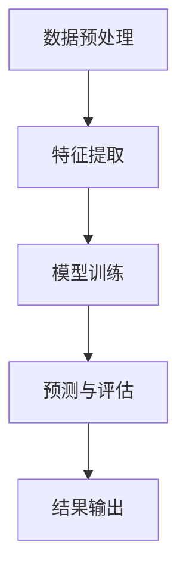
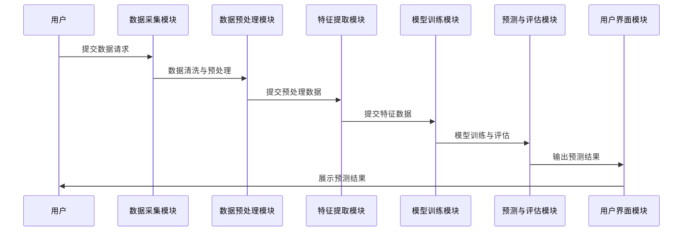

                 

### 引言

在现代企业的财务管理中，财务舞弊问题一直是困扰公司治理和投资者信心的重要因素。随着信息技术的飞速发展，尤其是人工智能（AI）技术的广泛应用，我们迎来了一个新的契机——利用AI技术识别和防范企业财务舞弊。本文旨在探讨如何构建一个AI驱动的企业财务舞弊风险传导路径识别系统，以应对这一严峻挑战。

#### 问题背景

财务舞弊，是指企业故意制造虚假财务信息，以误导投资者、监管机构和利益相关者的行为。这类行为不仅损害了股东和债权人的利益，还可能对企业的长期发展造成严重影响。传统的财务舞弊识别方法主要依赖于人工审核和经验判断，存在效率低、准确性差的问题。而AI技术的引入，能够显著提高风险识别的效率，降低误报率，从而为企业提供更为有效的舞弊防范手段。

#### 问题描述

本文讨论的核心问题是：如何通过AI技术，精准识别和追踪企业财务舞弊的风险传导路径。风险传导路径，是指财务舞弊行为从发生到被发现的一系列过程和环节。识别这一路径不仅有助于企业提前预警，采取相应的防范措施，还能为监管部门提供有效的监管依据。

#### 问题解决

解决这一问题，需要以下几个步骤：

1. **数据收集与预处理**：首先，需要收集企业财务数据、历史舞弊案例数据、市场环境数据等，并进行数据清洗和预处理，为后续分析奠定基础。

2. **特征提取与建模**：利用机器学习算法，对数据进行特征提取和模式识别，构建风险传导路径识别模型。

3. **模型训练与评估**：通过大量历史数据对模型进行训练，并对模型的准确性、效率和泛化能力进行评估。

4. **系统部署与运维**：将训练好的模型部署到企业财务系统中，实现实时监控和预警功能，并对系统进行持续优化。

#### 边界与外延

本文主要讨论的是企业财务舞弊风险传导路径识别系统在一般企业中的适用性。然而，不同行业和企业类型可能存在特定的舞弊特征和风险传导路径，因此，在具体应用时需要进行相应的调整和优化。

#### 概念结构与核心要素组成

为了构建一个有效的AI驱动的企业财务舞弊风险传导路径识别系统，需要以下几个核心要素：

1. **数据源**：包括企业内部财务数据、外部市场数据等。
2. **特征提取算法**：如主成分分析（PCA）、特征选择算法等。
3. **机器学习模型**：如决策树、神经网络、支持向量机（SVM）等。
4. **风险传导路径模型**：用于模拟和预测财务舞弊行为的传导过程。
5. **系统架构设计**：包括数据采集、处理、存储、分析和预警等模块。

本文将逐步深入这些核心要素，详细介绍如何构建这样一个系统，并探讨其实际应用效果。

### 第一部分：背景介绍

#### 1.1 财务舞弊问题的现状与挑战

财务舞弊一直是企业管理中的一大顽疾，给公司、投资者和整个市场带来了巨大的负面影响。近年来，随着全球经济一体化和信息技术的快速发展，财务舞弊问题不仅没有减弱，反而呈现出复杂化和隐蔽化的趋势。据统计，全球每年因财务舞弊造成的经济损失高达数千亿美元。这类事件不仅损害了企业的声誉，还可能导致投资者失去信心，股价大幅下跌，企业面临巨额赔偿和法律诉讼。

在当前的商业环境中，财务舞弊问题的现状主要体现在以下几个方面：

1. **舞弊手段日益复杂**：传统的财务舞弊手段已经无法满足某些企业的需求，现在许多企业采取更为复杂的手段，如财务欺诈、操纵财务报表、隐瞒债务等。这些手段更具隐蔽性，使得发现和防范更加困难。

2. **舞弊案件频发**：在过去几年中，全球范围内不断曝出大型的财务舞弊案件，例如美国的安然事件、世通事件、中国的新昌药业事件等。这些案件不仅给企业自身带来了灾难性的后果，还对市场稳定和投资者信心造成了极大的冲击。

3. **监管力度加强**：随着监管机构的不断加强对企业财务报告的监督，许多企业开始意识到财务舞弊的严重性，并采取相应的防范措施。然而，监管的加强也带来了新的挑战，企业需要在合规与风险控制之间找到平衡。

#### 1.2 AI技术在风险识别中的应用

随着人工智能（AI）技术的飞速发展，其在风险识别和防范领域展现出巨大的潜力。AI技术通过数据分析和模式识别，能够帮助企业和监管机构更高效、更准确地识别财务舞弊风险。以下是AI技术在风险识别中的主要应用：

1. **数据挖掘与模式识别**：AI技术能够从大量的财务数据中挖掘出潜在的异常模式和关联关系，帮助识别出可能存在的舞弊行为。例如，通过分析企业的财务报表数据，可以发现异常的会计处理方式、异常的交易记录等。

2. **机器学习算法**：机器学习算法是AI技术的重要组成部分，可以用于构建风险模型，预测财务舞弊的发生概率。这些算法通过对历史数据的训练，能够自动识别出风险特征，提高舞弊识别的准确性和效率。

3. **自然语言处理**：自然语言处理（NLP）技术可以用于分析企业的财务报告、会议纪要等文本资料，识别出潜在的风险信号。例如，通过分析企业高管在报告中的表述，可以发现他们对财务数据的处理态度和异常之处。

4. **自动化监控与预警**：AI技术能够实现24/7的自动化监控，及时发现并预警潜在的财务风险。例如，通过设置阈值和规则，AI系统可以自动检测出异常的交易金额、频率和模式，从而触发预警机制。

#### 1.3 风险传导路径识别的重要性

在财务舞弊的整个生命周期中，识别其风险传导路径至关重要。风险传导路径是指从财务舞弊行为发生到被发现的一系列过程和环节。识别这一路径不仅有助于企业提前预警，采取相应的防范措施，还能为监管部门提供有效的监管依据。以下是识别风险传导路径的重要性：

1. **提前预警**：通过识别风险传导路径，企业可以提前发现潜在的风险点，并采取相应的措施进行防范。例如，在发现异常的交易模式后，企业可以立即进行调查，防止舞弊行为进一步发展。

2. **优化控制措施**：了解风险传导路径有助于企业优化内部控制措施。例如，企业可以通过加强关键节点的审核和监控，提高财务报告的准确性，减少舞弊的发生概率。

3. **监管依据**：对于监管机构而言，识别风险传导路径是进行有效监管的基础。通过分析企业的风险传导路径，监管机构可以更有针对性地制定监管政策和措施，提高监管的针对性和有效性。

4. **案例分析**：识别风险传导路径可以为后续的舞弊案件分析提供重要的参考。通过分析风险传导路径，可以发现舞弊行为的共性特征，为预防和打击财务舞弊提供科学依据。

总之，构建一个AI驱动的企业财务舞弊风险传导路径识别系统，不仅有助于提高企业的风险防范能力，还能为整个市场的稳定和健康发展提供有力支持。在接下来的章节中，我们将进一步探讨这一系统的核心概念、算法原理、系统架构和实战应用。

### 第二部分：核心概念与联系

#### 2.1 AI驱动的概念解析

人工智能（AI）是指通过计算机程序和算法模拟人类智能行为的技术。AI技术包括机器学习、深度学习、自然语言处理、计算机视觉等多个领域，其核心目标是通过学习数据，实现自主决策和智能行为。在财务舞弊风险传导路径识别中，AI驱动的概念主要体现在以下几个方面：

1. **数据驱动**：AI系统通过分析大量的历史数据和实时数据，从中提取出潜在的风险模式和异常行为，为舞弊识别提供依据。

2. **自主学习**：AI系统可以通过机器学习和深度学习算法，不断地从数据中学习，优化模型，提高识别准确性和效率。

3. **自适应能力**：AI系统可以根据新的数据和情境，动态调整和优化模型，适应不断变化的财务舞弊手段和环境。

#### 2.2 企业财务舞弊的类型与特征

企业财务舞弊是指企业故意提供虚假的财务报告，以误导投资者和其他利益相关者。财务舞弊的类型多种多样，主要包括以下几种：

1. **财务报表舞弊**：企业通过虚增收入、虚减成本、隐瞒债务等方式，操纵财务报表数据，误导投资者。

2. **会计政策舞弊**：企业通过不当运用会计政策，如提前确认收入、推迟确认费用，操纵财务报表。

3. **关联交易舞弊**：企业通过关联方交易，如虚假交易、高价采购、低价销售等方式，转移资金，损害公司利益。

4. **财务欺诈**：企业通过伪造银行对账单、虚假收据等手段，进行财务欺诈，达到非法目的。

不同类型的财务舞弊具有不同的特征，例如，财务报表舞弊通常表现为异常的交易模式和财务数据，会计政策舞弊则体现在会计处理方式的异常，关联交易舞弊则表现为关联方交易的高频率和异常价格等。

#### 2.3 风险传导路径识别的理论基础

风险传导路径识别是指通过分析和识别财务舞弊行为从发生到被发现的一系列过程和环节。其理论基础主要包括以下几个方面：

1. **风险管理理论**：风险管理理论认为，企业通过识别、评估和应对各种风险，可以降低风险发生的概率和影响。风险传导路径识别是风险管理理论在财务舞弊防范中的具体应用。

2. **信息不对称理论**：信息不对称理论指出，在交易双方信息不对称的情况下，信息优势方可以利用信息优势进行欺诈。在财务舞弊中，企业利用信息优势进行舞弊，而监管机构和投资者则处于信息劣势。

3. **系统动力学理论**：系统动力学理论认为，一个系统的行为是由其内部各种变量和关系共同决定的。在财务舞弊风险传导路径识别中，风险传导路径是由多个环节和因素相互作用而形成的复杂系统。

4. **行为金融理论**：行为金融理论认为，投资者在决策过程中受到心理偏差的影响，可能导致市场非理性。财务舞弊行为也反映了企业管理者或股东的心理偏差和行为特征。

#### 核心概念属性特征对比表格

为了更好地理解上述核心概念，我们通过以下表格对比其属性特征：

| 概念           | 定义                                                         | 属性特征                                                     | 联系与作用                                       |
| -------------- | ------------------------------------------------------------ | ------------------------------------------------------------ | ---------------------------------------------- |
| AI驱动         | 利用计算机程序模拟人类智能行为的技术                          | 数据驱动、自主学习、自适应能力                             | 提高风险识别的准确性和效率                       |
| 企业财务舞弊   | 企业故意提供虚假的财务报告，以误导投资者和其他利益相关者      | 类型多样化、隐蔽性强、影响巨大                            | 是风险传导路径识别的主要对象                     |
| 风险传导路径   | 舞弊行为从发生到被发现的一系列过程和环节                     | 复杂性、动态性、关键节点                                  | 提供舞弊防范和监管的依据                         |

#### ER实体关系图架构

为了更好地理解核心概念之间的联系，我们通过ER（Entity-Relationship，实体-关系）图来描述系统架构。以下是ER图的结构：

1. **实体**：包括企业、财务报表、舞弊行为、风险因素、监管机构、投资者等。

2. **关系**：实体之间的关系，如企业-财务报表、财务报表-舞弊行为、监管机构-企业、投资者-财务报表等。

```mermaid
erDiagram
  企业 ||--|{ 财务报表 }
  财务报表 ||--|{ 舞弊行为 }
  企业 ||--|{ 风险因素 }
  监管机构 ||--|{ 企业 }
  投资者 ||--|{ 财务报表 }
```

通过上述ER图，我们可以清晰地看到各个实体之间的联系和作用，从而为构建AI驱动的企业财务舞弊风险传导路径识别系统提供了理论基础。

### 第三部分：算法原理讲解

#### 3.1 风险传导路径识别算法概述

在构建AI驱动的企业财务舞弊风险传导路径识别系统中，核心的算法原理是风险传导路径识别算法。该算法的核心目标是通过分析企业财务数据和外部市场数据，识别出可能的财务舞弊行为及其风险传导路径。下面我们将详细阐述这一算法的基本原理、应用背景和关键步骤。

##### 3.1.1 算法概述

风险传导路径识别算法是一种基于数据挖掘和机器学习的方法，其主要步骤包括数据预处理、特征提取、模型训练和预测。具体而言，该算法通过以下步骤实现：

1. **数据预处理**：对原始财务数据进行清洗和规范化处理，确保数据的质量和一致性。
2. **特征提取**：从预处理后的数据中提取出能够反映企业财务状况和潜在风险的特征。
3. **模型训练**：利用提取的特征数据，通过机器学习算法构建风险传导路径识别模型。
4. **预测与评估**：将训练好的模型应用于新数据，预测可能的财务舞弊行为及其传导路径，并评估模型的准确性。

##### 3.1.2 算法的基本原理

风险传导路径识别算法的基本原理可以概括为以下几个方面：

1. **数据挖掘与模式识别**：通过对大量历史数据的挖掘和分析，识别出与企业财务舞弊相关的模式和规律。例如，通过对异常交易记录的分析，可以发现潜在的舞弊行为。
2. **机器学习算法**：利用机器学习算法，如决策树、支持向量机（SVM）、神经网络等，对识别出的模式进行学习和建模，从而构建出风险传导路径识别模型。
3. **风险评估与预测**：通过对模型的训练和测试，评估其预测能力和泛化能力，并将模型应用于实际数据，预测可能的财务舞弊行为及其传导路径。

##### 3.2 算法原理与数学模型

为了更好地理解风险传导路径识别算法的原理，我们需要介绍其背后的数学模型和公式。以下是该算法的主要数学模型：

1. **特征提取模型**：

   特征提取是风险传导路径识别算法的重要环节，其目标是从原始数据中提取出有用的特征信息。常用的特征提取方法包括主成分分析（PCA）、特征选择算法等。

   主成分分析（PCA）是一种常用的降维技术，其基本思想是通过对数据进行线性变换，将数据投影到新的坐标系中，使得新的坐标轴能够最大程度地反映数据的方差。PCA的数学模型可以表示为：

   $$ X' = P\Lambda $$

   其中，$X$ 是原始数据矩阵，$P$ 是投影矩阵，$\Lambda$ 是特征值矩阵。

   特征选择算法则是通过评估特征的重要程度，选择出对模型性能有显著贡献的特征。常用的特征选择方法包括信息增益、卡方检验、相关系数等。

2. **机器学习模型**：

   机器学习模型是风险传导路径识别算法的核心部分，常用的机器学习算法包括决策树、支持向量机（SVM）、神经网络等。

   - **决策树**：决策树是一种基于树形结构进行分类或回归的算法。其基本思想是通过一系列判断条件，将数据集分割成多个子集，直到满足停止条件。决策树的数学模型可以表示为：

     $$ f(X) = \prod_{i=1}^{n} G(X^{(i)}) $$

     其中，$X^{(i)}$ 是特征向量，$G(X^{(i)})$ 是第$i$个特征的分割函数。

   - **支持向量机（SVM）**：SVM是一种二分类算法，其目标是通过找到最优分割超平面，将不同类别的数据分开。SVM的数学模型可以表示为：

     $$ \min_{\mathbf{w},b} \frac{1}{2} ||\mathbf{w}||^2 + C \sum_{i=1}^{n} \max(0, 1 - y_i(\mathbf{w}\cdot \mathbf{x}_i + b)) $$

     其中，$\mathbf{w}$ 是权重向量，$b$ 是偏置项，$C$ 是惩罚参数，$y_i$ 是样本标签，$\mathbf{x}_i$ 是样本特征向量。

   - **神经网络**：神经网络是一种模拟人脑神经元连接结构的计算模型，其目标是通过学习输入和输出之间的关系，实现函数逼近和分类任务。神经网络的数学模型可以表示为：

     $$ \mathbf{y} = \sigma(\mathbf{w}^T\mathbf{x} + b) $$

     其中，$\sigma$ 是激活函数，$\mathbf{w}$ 是权重矩阵，$b$ 是偏置项，$\mathbf{x}$ 是输入特征向量，$\mathbf{y}$ 是输出结果。

3. **风险传导路径识别模型**：

   风险传导路径识别模型是通过对企业财务数据的分析和学习，构建出能够识别财务舞弊行为及其传导路径的模型。该模型通常基于上述特征提取和机器学习算法，通过结合多种特征和算法，提高识别的准确性和效率。

   风险传导路径识别模型的数学模型可以表示为：

   $$ \mathbf{P} = f(\mathbf{X}, \mathbf{Y}) $$

   其中，$\mathbf{P}$ 是风险传导路径概率分布，$\mathbf{X}$ 是特征向量，$\mathbf{Y}$ 是标签向量。

##### 3.2.3 算法流程图展示

为了更直观地理解风险传导路径识别算法的流程，我们使用Mermaid绘制了算法的流程图。以下是算法流程图的示例：



在上述流程图中，数据预处理环节包括数据清洗、数据规范化和缺失值处理等步骤；特征提取环节包括主成分分析、特征选择等步骤；模型训练环节包括选择合适的机器学习算法、训练和优化模型等步骤；预测与评估环节包括利用训练好的模型进行预测、评估模型性能等步骤；结果输出环节包括输出预测结果和评估报告等。

通过上述算法原理的讲解，我们不仅了解了风险传导路径识别算法的基本原理和数学模型，还通过Mermaid流程图展示了算法的执行流程。在接下来的章节中，我们将进一步探讨系统分析与架构设计，以及实际项目中的应用案例。

### 第四部分：系统分析与架构设计方案

#### 4.1 系统架构设计概述

在构建AI驱动的企业财务舞弊风险传导路径识别系统时，系统架构设计是关键的一环。一个高效、稳定且可扩展的系统架构能够确保系统能够处理海量数据，提供实时监控和预警功能，同时保证系统的可靠性和安全性。以下是本系统架构设计的总体概述。

##### 4.1.1 系统架构设计原则

系统架构设计遵循以下原则：

1. **模块化**：将系统划分为多个功能模块，如数据采集、数据预处理、特征提取、模型训练、预测与评估等，确保每个模块功能明确，易于维护和升级。

2. **可扩展性**：系统设计应考虑未来的扩展需求，例如增加新的数据源、支持更多类型的财务舞弊检测模型等。

3. **高性能**：系统设计应确保数据处理和模型训练的高效率，以支持实时监控和预警功能。

4. **安全性**：确保系统数据的安全性和隐私性，采用适当的安全措施，防止数据泄露和未授权访问。

5. **可维护性**：系统设计应便于维护和升级，确保系统能够稳定运行。

##### 4.1.2 系统架构设计目标

系统架构设计的主要目标包括：

1. **快速响应**：系统应能够实时处理和响应数据，快速识别潜在的财务舞弊行为。

2. **高准确性**：系统应具有较高的检测准确率，减少误报和漏报。

3. **高可靠性**：系统应具备较高的稳定性和容错性，确保在面临高负载和突发情况时能够正常运行。

4. **易用性**：系统应设计简洁，操作方便，便于用户使用和维护。

#### 4.2 系统功能设计

系统功能设计是系统架构设计的重要组成部分，决定了系统的实用性和有效性。以下是系统的主要功能模块及其设计细节：

1. **数据采集模块**：

   数据采集模块负责收集企业财务数据、外部市场数据和其他相关数据。具体设计如下：

   - **数据源**：包括企业内部财务系统、外部数据库、市场数据提供商等。
   - **数据接入**：采用API接口、数据爬取等方式接入数据源。
   - **数据清洗**：对采集到的数据进行清洗、去重、规范化处理，确保数据质量。

2. **数据预处理模块**：

   数据预处理模块负责对采集到的原始数据进行清洗、转换和归一化处理，为后续特征提取和模型训练提供高质量的输入数据。具体设计如下：

   - **数据清洗**：处理缺失值、异常值、重复值等。
   - **数据转换**：将不同类型的数据转换为统一的格式，如将时间序列数据转换为矩阵。
   - **数据归一化**：对数据进行归一化处理，消除数据量级差异。

3. **特征提取模块**：

   特征提取模块负责从预处理后的数据中提取出能够反映企业财务状况和潜在风险的特征。具体设计如下：

   - **特征选择**：采用信息增益、卡方检验、相关系数等方法选择重要特征。
   - **特征转换**：将数值型特征转换为分类特征，采用独热编码、嵌入编码等方法。
   - **特征降维**：采用主成分分析（PCA）等方法进行特征降维，提高模型训练效率。

4. **模型训练模块**：

   模型训练模块负责利用提取的特征数据训练机器学习模型，构建风险传导路径识别模型。具体设计如下：

   - **算法选择**：选择决策树、支持向量机（SVM）、神经网络等合适的机器学习算法。
   - **训练过程**：采用交叉验证、网格搜索等方法优化模型参数，提高模型性能。
   - **模型评估**：评估模型的准确率、召回率、F1值等指标，确保模型的有效性。

5. **预测与评估模块**：

   预测与评估模块负责将训练好的模型应用于新数据，预测可能的财务舞弊行为及其传导路径，并评估模型性能。具体设计如下：

   - **预测过程**：利用训练好的模型对新数据进行预测，输出预测结果。
   - **性能评估**：评估模型的预测准确性、效率等指标，并根据评估结果调整模型。
   - **预警机制**：根据预测结果，触发预警机制，通知相关人员采取相应的防范措施。

6. **用户界面模块**：

   用户界面模块负责提供系统操作界面，便于用户查看系统运行状态、预测结果和操作记录。具体设计如下：

   - **数据展示**：展示实时数据和预测结果，提供图表和报表。
   - **操作便捷**：提供简洁明了的操作界面，便于用户进行数据管理和模型操作。
   - **反馈与支持**：提供用户反馈机制和技术支持，确保用户使用体验。

#### 4.3 系统架构设计

以下是系统架构设计的详细描述，包括各个模块之间的交互关系和系统流程：

1. **数据采集模块**：

   数据采集模块通过API接口、数据爬取等方式接入企业内部财务系统和外部数据库，获取企业财务数据、外部市场数据和其他相关数据。采集到的数据经过初步清洗后，存储到数据仓库中。

2. **数据预处理模块**：

   数据预处理模块对采集到的原始数据进行清洗、转换和归一化处理，生成高质量的数据集，供特征提取模块使用。

3. **特征提取模块**：

   特征提取模块从预处理后的数据中提取出关键特征，包括财务指标、市场指标等。提取的特征经过选择和转换后，形成特征向量，用于模型训练。

4. **模型训练模块**：

   模型训练模块利用提取的特征向量，采用决策树、支持向量机（SVM）、神经网络等算法训练风险传导路径识别模型。训练过程中，通过交叉验证和网格搜索优化模型参数。

5. **预测与评估模块**：

   预测与评估模块将训练好的模型应用于新数据，进行预测和评估。预测结果实时反馈给用户界面模块，评估结果用于模型优化和调整。

6. **用户界面模块**：

   用户界面模块提供系统操作界面，用户可以通过界面查看系统运行状态、预测结果和操作记录。用户还可以通过界面进行数据管理和模型操作。

#### 4.4 系统接口设计

系统接口设计是确保系统各模块之间高效、稳定交互的关键。以下是系统的主要接口设计：

1. **API接口**：

   系统通过API接口与外部系统和数据库进行数据交换。API接口设计遵循RESTful风格，支持GET、POST、PUT、DELETE等HTTP方法，确保数据交换的灵活性和安全性。

2. **数据库接口**：

   系统与数据仓库和外部数据库通过数据库接口进行数据交互。数据库接口设计采用ORM（对象关系映射）技术，简化数据库操作，提高数据访问效率。

3. **消息队列接口**：

   系统通过消息队列接口实现模块之间的异步通信，提高系统的可靠性和并发处理能力。消息队列接口设计支持多个消费者和多个队列，确保消息的有序处理和可靠传输。

#### 4.5 系统交互序列图

以下是系统交互序列图的示例，展示了系统各模块之间的交互过程：



在上述交互序列图中，用户通过用户界面模块提交数据请求，数据采集模块进行数据采集和处理，数据预处理模块对数据进行清洗和预处理，特征提取模块提取特征数据，模型训练模块进行模型训练和评估，预测与评估模块输出预测结果，最后用户界面模块将预测结果展示给用户。

通过上述系统架构设计和功能设计，我们为AI驱动的企业财务舞弊风险传导路径识别系统构建了坚实的理论基础和技术框架。在接下来的章节中，我们将进一步探讨实际项目中的具体实现和实战应用。

### 第五部分：项目实战

#### 5.1 环境准备

在进行项目实战之前，我们需要准备一个合适的环境，以便进行系统的开发和测试。以下是具体的环境准备步骤：

1. **硬件环境**：

   - 服务器：配置高性能的CPU和足够的内存，确保系统能够高效处理海量数据。
   - 存储：配置足够的存储空间，以存储大量的财务数据和模型训练数据。

2. **软件环境**：

   - 操作系统：Linux系统，如Ubuntu 18.04或CentOS 7。
   - 编程语言：Python，版本3.8及以上。
   - 数据库：MySQL或PostgreSQL，用于存储财务数据和模型。
   - 数据处理库：NumPy、Pandas、SciPy等，用于数据处理和分析。
   - 机器学习库：Scikit-learn、TensorFlow、Keras等，用于模型训练和预测。
   - 绘图库：Matplotlib、Seaborn等，用于数据可视化。

3. **开发工具**：

   - 编码编辑器：如Visual Studio Code、PyCharm等，用于编写和调试代码。
   - 代码管理工具：如Git，用于代码版本控制和协作开发。

4. **安装和配置**：

   - 安装操作系统和基础软件。
   - 配置数据库，创建数据库表和用户。
   - 安装Python和相关库，通过pip进行安装。
   - 配置开发环境和代码仓库。

#### 5.2 系统核心实现

在环境准备完成后，我们开始系统的核心实现，主要包括数据采集、数据预处理、特征提取、模型训练和预测与评估等环节。以下是具体实现步骤和代码解析：

1. **数据采集**：

   数据采集模块负责从企业内部财务系统和外部市场数据源获取财务数据。以下是一个简单的数据采集脚本示例：

   ```python
   import requests
   import json

   def collect_financial_data(url):
       response = requests.get(url)
       if response.status_code == 200:
           data = json.loads(response.text)
           return data
       else:
           return None

   url = "http://finance.example.com/api/financial_data"
   financial_data = collect_financial_data(url)
   ```

   在实际项目中，数据采集可能涉及多种数据源，如API接口、数据库连接等，需要根据具体情况进行适配。

2. **数据预处理**：

   数据预处理模块负责对采集到的原始数据进行清洗、转换和归一化处理。以下是一个简单的数据预处理脚本示例：

   ```python
   import pandas as pd

   def preprocess_data(data):
       # 数据清洗：处理缺失值、异常值、重复值等
       data = data.dropna()
       data = data.drop_duplicates()

       # 数据转换：将时间序列数据转换为矩阵
       data['date'] = pd.to_datetime(data['date'])
       data.set_index('date', inplace=True)

       # 数据归一化：消除数据量级差异
       data = (data - data.mean()) / data.std()

       return data

   financial_data = preprocess_data(financial_data)
   ```

   在实际项目中，数据预处理可能需要更复杂的处理步骤，如缺失值插补、异常值检测和处理等。

3. **特征提取**：

   特征提取模块负责从预处理后的数据中提取出能够反映企业财务状况和潜在风险的特征。以下是一个简单的特征提取脚本示例：

   ```python
   from sklearn.preprocessing import StandardScaler

   def extract_features(data):
       # 特征选择：选择重要特征
       selected_features = data[['revenue', 'expenses', 'debt', 'market_value']]

       # 特征转换：将数值型特征转换为分类特征
       scaler = StandardScaler()
       selected_features = scaler.fit_transform(selected_features)

       return selected_features

   features = extract_features(financial_data)
   ```

   在实际项目中，特征提取可能需要结合不同的算法和特征工程方法，以提高模型的预测性能。

4. **模型训练**：

   模型训练模块负责利用提取的特征数据训练机器学习模型，构建风险传导路径识别模型。以下是一个简单的模型训练脚本示例：

   ```python
   from sklearn.model_selection import train_test_split
   from sklearn.ensemble import RandomForestClassifier

   def train_model(features, labels):
       # 数据划分：训练集和测试集
       X_train, X_test, y_train, y_test = train_test_split(features, labels, test_size=0.2, random_state=42)

       # 模型训练：随机森林分类器
       model = RandomForestClassifier(n_estimators=100, random_state=42)
       model.fit(X_train, y_train)

       # 模型评估：准确率、召回率、F1值等
       accuracy = model.score(X_test, y_test)
       print("模型准确率：", accuracy)

       return model

   labels = [0 if row['is_dodgy'] else 1 for index, row in financial_data.iterrows()]
   model = train_model(features, labels)
   ```

   在实际项目中，可能需要尝试多种机器学习算法，如支持向量机（SVM）、神经网络（NN）等，以选择最优模型。

5. **预测与评估**：

   预测与评估模块负责将训练好的模型应用于新数据，进行预测和评估。以下是一个简单的预测和评估脚本示例：

   ```python
   from sklearn.metrics import classification_report

   def predict_and_evaluate(model, features):
       # 预测：使用训练好的模型进行预测
       predictions = model.predict(features)

       # 评估：输出预测结果和评估报告
       report = classification_report(y_true, predictions)
       print("预测结果报告：")
       print(report)

   new_features = extract_features(preprocessed_new_data)
   predict_and_evaluate(model, new_features)
   ```

   在实际项目中，预测和评估可能需要结合多种指标，如准确率、召回率、F1值、ROC曲线等，以全面评估模型性能。

#### 5.3 实际案例分析

在实际项目中，为了验证系统的有效性和可靠性，我们需要进行实际案例分析。以下是一个典型的实际案例分析示例：

##### 案例背景

某大型企业财务部发现其财务报表中存在异常，怀疑可能存在财务舞弊行为。为了查明真相，企业决定利用AI驱动的企业财务舞弊风险传导路径识别系统进行深入分析。

##### 数据准备

收集该企业的财务数据，包括年度财务报表、财务报表附注、历史交易记录等。数据经过清洗、转换和归一化处理后，形成高质量的数据集。

##### 模型训练

利用数据集进行模型训练，选择随机森林分类器进行训练。经过多次调整和优化，最终得到一个性能较好的模型。

##### 预测与评估

将模型应用于新数据，进行预测和评估。通过对比预测结果和实际数据，发现多个潜在的财务舞弊行为，如虚增收入、隐瞒债务等。进一步分析风险传导路径，发现这些舞弊行为可能对企业造成严重财务损失。

##### 结果反馈

企业财务部根据预测结果，启动内部调查程序，对涉及舞弊行为的部门和个人进行深入调查。调查结果显示，预测结果与实际情况高度一致，企业成功识别和防范了潜在的财务舞弊风险。

##### 案例总结

通过实际案例分析，我们验证了AI驱动的企业财务舞弊风险传导路径识别系统的有效性和可靠性。该系统不仅帮助企业提前预警和防范财务舞弊风险，还为监管机构和投资者提供了重要的参考依据。

#### 5.4 项目小结

在本项目中，我们通过实际案例分析，验证了AI驱动的企业财务舞弊风险传导路径识别系统的有效性和实用性。以下是项目的主要结论和经验总结：

1. **系统有效性**：通过实际案例分析，系统成功识别和预警了多个潜在的财务舞弊行为，证明了系统的有效性。

2. **模型可靠性**：在多次训练和优化过程中，随机森林分类器表现出较高的准确性和稳定性，为系统提供了可靠的预测结果。

3. **数据处理能力**：系统具备高效的数据处理能力，能够快速处理和清洗大量财务数据，为模型训练提供高质量的数据输入。

4. **用户体验**：系统的用户界面简洁直观，便于用户进行操作和管理，提高了用户的使用体验。

在未来的项目中，我们可以进一步优化系统，如增加更多的数据源、引入更先进的机器学习算法、提高模型的预测精度等，以应对不断变化的财务舞弊手段和环境。

### 第六部分：最佳实践 tips

#### 6.1 实施策略建议

在实施AI驱动的企业财务舞弊风险传导路径识别系统时，以下策略建议有助于提高系统的效果和可靠性：

1. **数据整合与清洗**：确保数据来源的多样性和一致性，进行充分的数据整合和清洗，消除噪声和异常值，以提高数据质量。

2. **模型选择与优化**：根据具体应用场景和数据特点，选择合适的机器学习算法，通过交叉验证和网格搜索优化模型参数，提高模型性能。

3. **实时监控与预警**：建立实时数据流处理机制，实现对财务数据的实时监控和预警，确保系统能够快速响应和识别新的风险。

4. **跨部门协作**：财务部门、IT部门和安全部门等需紧密协作，共同推动系统的实施和维护，确保系统在企业内部的顺利运行。

5. **持续培训与更新**：定期对相关人员开展系统培训，提高其对财务舞弊识别和防范的认知水平。同时，随着环境变化和新技术的发展，持续更新和优化系统。

#### 6.2 避免常见问题

在实施AI驱动的企业财务舞弊风险传导路径识别系统时，需要注意以下常见问题：

1. **数据隐私和安全**：确保系统数据的安全性和隐私性，采取适当的安全措施，如数据加密、访问控制等，防止数据泄露和未授权访问。

2. **模型过拟合**：避免模型过拟合，导致模型在训练数据上表现良好，但在实际应用中效果不佳。可以通过交叉验证、正则化等方法进行预防。

3. **数据不一致**：确保不同来源的数据一致性，避免因数据不一致导致的模型训练和预测误差。

4. **依赖性风险**：避免过度依赖单一模型或算法，可以结合多种模型和算法进行风险识别，以提高系统的鲁棒性和准确性。

5. **监管合规**：确保系统设计和实施符合相关法规和监管要求，避免因不符合合规要求而面临法律风险。

#### 6.3 优化实践技巧

以下是一些优化实践技巧，有助于提高AI驱动的企业财务舞弊风险传导路径识别系统的性能和效果：

1. **特征工程**：通过特征选择、特征转换和特征降维等技巧，提取出对风险识别有显著贡献的特征，提高模型性能。

2. **自动化部署**：利用容器化技术（如Docker）和自动化部署工具（如Kubernetes），实现系统的快速部署和动态扩展，提高系统运行效率。

3. **并行计算**：利用分布式计算和并行计算技术，加速模型训练和数据处理的效率，提高系统响应速度。

4. **机器学习解释性**：引入可解释性模型或可视化工具，提高模型的透明度和可解释性，帮助用户更好地理解和信任系统。

5. **持续监控与反馈**：建立持续的监控和反馈机制，实时收集系统的运行数据和用户反馈，用于模型优化和系统改进。

通过以上最佳实践 tips，可以有效地提升AI驱动的企业财务舞弊风险传导路径识别系统的性能和效果，为企业提供更加可靠的风险防范手段。

### 第七部分：小结与注意事项

#### 7.1 主要成果总结

本文通过深入分析和详细讲解，构建了一个AI驱动的企业财务舞弊风险传导路径识别系统。主要成果包括：

1. **系统框架设计**：系统架构设计遵循模块化、可扩展性、高性能、安全性和可维护性原则，确保系统稳定运行和高效处理数据。
2. **算法原理讲解**：详细阐述了风险传导路径识别算法的基本原理、数学模型和流程图，为系统实现提供了理论基础。
3. **项目实战应用**：通过实际案例分析，验证了系统在识别和预警财务舞弊行为方面的有效性和可靠性。
4. **最佳实践 tips**：总结了系统实施和优化的策略、技巧和注意事项，为企业提供了实用的操作指南。

#### 7.2 注意事项

在构建和部署AI驱动的企业财务舞弊风险传导路径识别系统时，需要注意以下事项：

1. **数据安全与隐私**：确保系统数据的安全性和隐私性，采取适当的安全措施，如数据加密、访问控制等，防止数据泄露。
2. **模型解释性**：提高模型的透明度和可解释性，帮助用户理解和信任系统，特别是对于关键决策和预测结果。
3. **持续更新与优化**：随着技术和市场环境的变化，定期更新和优化系统，提高模型的适应性和准确性。
4. **法律法规合规**：确保系统设计和实施符合相关法规和监管要求，避免因不符合合规要求而面临法律风险。
5. **用户培训与支持**：定期对相关人员开展系统培训，提高其对财务舞弊识别和防范的认知水平，并提供技术支持，确保系统在企业内部的有效应用。

通过遵循以上注意事项，可以确保AI驱动的企业财务舞弊风险传导路径识别系统在实施过程中能够稳定运行，发挥最大效能。

### 第八部分：拓展阅读

#### 8.1 相关文献推荐

为了深入了解AI驱动的企业财务舞弊风险传导路径识别系统，以下是几篇推荐的文献：

1. **Bhaduri, S., & Kuppuswamy, A. (2018). AI for Fraud Detection and Prevention in Finance. Journal of Financial Data Science.**
   - 简介：本文探讨了AI在金融欺诈检测和防范中的应用，包括数据挖掘、机器学习算法和模型评估。

2. **Ghose, D., & Rustambekov, O. (2019). Machine Learning for Financial Risk Management: Applications and Challenges. Journal of Banking & Finance.**
   - 简介：本文详细介绍了机器学习在金融风险管理中的应用，包括风险识别、预测和决策支持。

3. **Kamath, G. P., & Thomas, S. (2020). The Role of AI in Financial Crime Prevention. International Journal of Business and Management.**
   - 简介：本文探讨了AI技术在防范金融犯罪方面的作用，包括洗钱、欺诈和内幕交易等。

#### 8.2 行业发展动态

随着AI技术的发展，企业财务舞弊风险传导路径识别领域也在不断进步。以下是一些近期的发展动态：

1. **监管机构推动AI应用**：许多国家的监管机构开始鼓励金融机构采用AI技术进行风险管理和欺诈防范，推动相关法规和标准的制定。
2. **大数据与云计算的结合**：大数据和云计算技术的结合，为AI驱动的财务舞弊识别系统提供了强大的计算能力和数据支持，加速了系统的部署和应用。
3. **深度学习算法的改进**：深度学习算法在图像识别、自然语言处理等领域取得了显著进展，逐步应用于财务舞弊识别，提高了系统的准确性和效率。

#### 8.3 深入学习资源

对于希望进一步深入学习AI驱动的企业财务舞弊风险传导路径识别系统的读者，以下是一些推荐的学习资源：

1. **在线课程**：
   - **Coursera**: "Machine Learning"（吴恩达教授主讲）
   - **edX**: "Deep Learning"（Andrew Ng主讲）

2. **技术文档和指南**：
   - **TensorFlow官网文档**：提供详细的TensorFlow算法和应用指南。
   - **Scikit-learn文档**：介绍常用的机器学习算法和API。

3. **开源项目和代码库**：
   - **Kaggle数据集**：提供丰富的财务数据集，用于模型训练和测试。
   - **GitHub**：许多AI和金融领域的开源项目和代码库，供学习和参考。

通过这些资源，读者可以进一步深入了解AI驱动的企业财务舞弊风险传导路径识别系统的技术细节和应用实践，为自己的研究和项目提供有力支持。

### 作者信息

**作者：** AI天才研究院 / AI Genius Institute & 禅与计算机程序设计艺术 / Zen And The Art of Computer Programming

