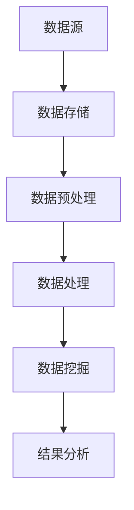
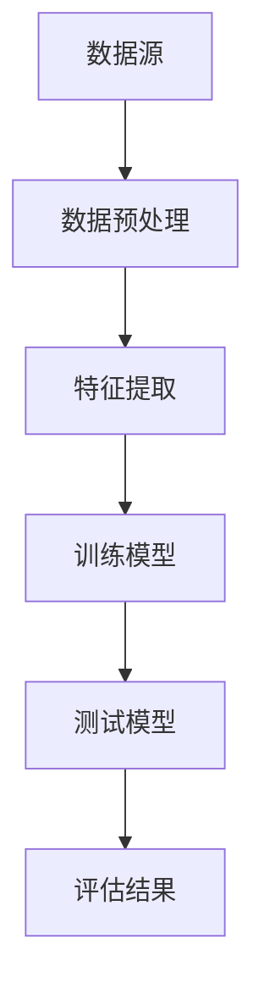
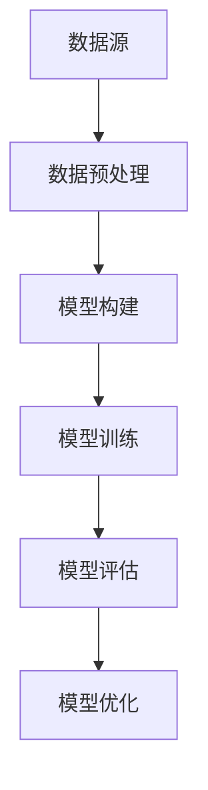
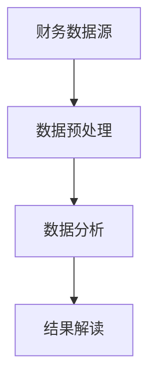
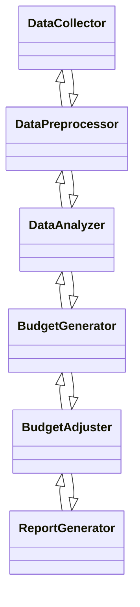
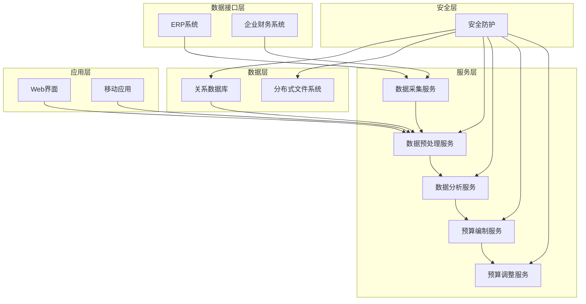
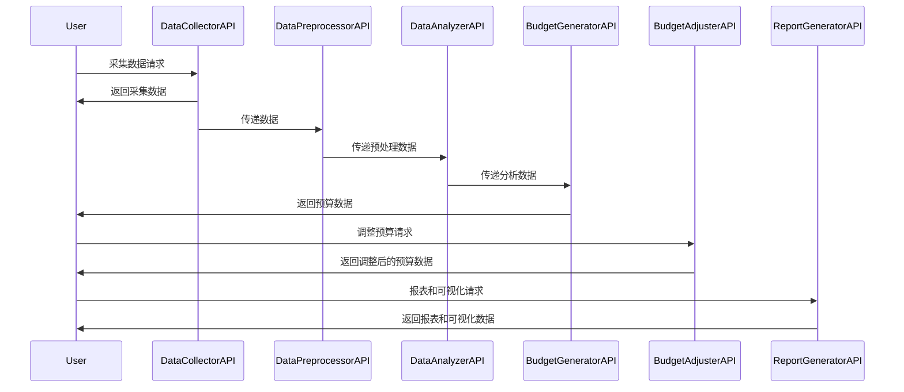

                 


### 第一部分: 引言

#### 1. 背景介绍

随着人工智能（AI）技术的飞速发展，AI已经渗透到各行各业，为企业带来了巨大的变革。特别是在财务领域，传统的财务预算编制与调整方式已无法满足现代企业对于高效、精准和智能化的需求。AI驱动的财务预算编制与调整系统应运而生，通过大数据分析、机器学习和深度学习等技术，实现财务预算的自动化、智能化。

AI技术是一种通过模拟人类智能行为来实现智能化的技术，包括机器学习、深度学习、自然语言处理、计算机视觉等多个领域。大数据分析是指利用高性能计算机和先进的分析技术，对海量数据进行采集、存储、处理和分析，从数据中提取有价值的信息。机器学习是一种通过算法让计算机从数据中学习规律和模式，并能够自主做出决策的技术。深度学习是一种机器学习技术，通过构建多层神经网络，对数据进行多级抽象和特征提取，从而实现复杂任务的学习。

#### 2. 问题描述

传统财务预算编制与调整过程中，存在信息不对称、数据不准确、效率低下等问题。企业需要处理大量的财务数据，但缺乏有效的分析方法，导致预算编制结果往往与实际业务不符。此外，调整预算时，企业需要投入大量人力和时间，成本高昂。

具体来说，传统财务预算编制主要依靠手工操作和简单的财务模型，缺乏对大量数据的处理能力。企业往往需要依赖财务人员的经验和直觉来进行预算调整，导致预算编制结果与实际情况存在较大的偏差。同时，由于财务数据的不准确性和不完整性，预算编制过程中的数据质量难以保证。另外，传统预算调整往往需要多次反复的修改和审核，耗时耗力，效率低下。

这些问题对企业财务管理产生了重大影响。首先，预算编制结果不准确导致企业无法及时调整经营策略，影响了企业的盈利能力和市场竞争力。其次，预算调整成本高昂，降低了企业的运营效率。此外，传统财务预算编制和调整方式的信息不对称和透明度低，容易导致内部管理问题和决策失误。

#### 3. 问题解决

AI驱动的财务预算编制与调整系统，通过大数据分析和机器学习算法，能够快速处理海量财务数据，提取关键信息，为企业提供精准的预算编制与调整建议。系统可以根据历史数据、市场趋势和企业业务特点，实现动态调整，提高预算的准确性和实时性。

首先，AI驱动的财务预算编制系统能够利用大数据分析技术，对企业的历史财务数据进行分析和处理，提取出对企业财务状况和业务发展趋势有重要影响的因素。这些因素包括销售额、成本、利润、应收账款、存货等。通过对这些因素的分析，系统能够为企业提供准确的财务预测和预算编制建议。

其次，AI驱动的财务预算调整系统通过机器学习算法，能够自动识别和预测财务数据中的变化趋势和异常情况。例如，系统可以自动检测出销售额的波动、成本的异常变化等，并提供相应的调整建议。通过这种方式，企业可以及时调整预算，避免因数据不准确或变化不及时而导致的财务风险。

此外，AI驱动的财务预算系统还具备动态调整功能。随着市场的变化和企业业务的调整，系统可以实时更新预算模型，并根据新的数据和历史趋势进行动态调整。这种方式提高了预算的实时性和准确性，使企业能够更好地应对市场变化和业务调整。

总之，AI驱动的财务预算编制与调整系统通过大数据分析和机器学习算法，实现了财务预算的自动化、智能化。系统不仅能够提高预算编制的准确性和效率，还能够降低预算调整的成本，提高企业的运营效率和市场竞争力。

#### 4. 边界与外延

本文主要讨论AI驱动的财务预算编制与调整系统在企业财务管理中的应用，不涉及其他领域的AI应用。同时，本文重点讨论系统的原理与实现，不包括具体的系统架构设计和实现细节。

在边界与外延方面，AI驱动的财务预算编制与调整系统主要关注以下内容：

- **应用领域**：本文主要关注企业在财务管理中应用AI驱动的财务预算编制与调整系统。其他领域的AI应用，如医疗、金融、交通等，不在本文讨论范围内。

- **实现细节**：本文重点讨论系统的原理和实现方法，不包括具体的系统架构设计和实现细节。读者可以根据本文的原理和方法，结合实际需求进行系统开发和实现。

- **技术选型**：本文没有具体指定使用哪种编程语言、框架或工具，读者可以根据实际需求和技术背景选择合适的工具和框架进行系统开发。

通过明确边界与外延，本文能够更专注于AI驱动的财务预算编制与调整系统的原理和实现方法，为读者提供有价值的参考和指导。

#### 5. 概念结构与核心要素组成

要深入理解AI驱动的财务预算编制与调整系统，我们需要先明确其核心概念和组成要素。以下是本文讨论的核心概念与核心要素组成：

**核心概念**：

- **AI驱动的财务预算编制与调整系统**：这是一种利用人工智能技术，包括大数据分析、机器学习和深度学习，来实现财务预算的自动化和智能化的系统。

- **大数据分析**：指的是利用高性能计算机和先进分析技术，对海量数据进行采集、存储、处理和分析，以提取有价值信息的过程。

- **机器学习**：是一种通过算法让计算机从数据中学习规律和模式，并能够自主做出决策的技术。

- **深度学习**：是一种机器学习技术，通过构建多层神经网络，对数据进行多级抽象和特征提取，实现复杂任务的学习。

- **财务数据分析**：是对企业财务数据进行分析，为企业提供财务状况、经营风险、盈利能力等方面的信息。

- **预算编制**：是企业根据业务计划，对未来的财务状况进行预测和规划的过程。

- **预算调整**：是根据实际情况，对预算编制结果进行修正的过程。

**核心要素**：

- **财务数据**：包括销售额、成本、利润、应收账款、存货等对企业财务状况有重要影响的数据。

- **历史数据**：指企业过去一段时间内的财务数据，用于分析企业的发展趋势和变化规律。

- **市场趋势**：指市场环境中的变化趋势，如经济环境、行业竞争态势等。

- **企业业务特点**：指企业的业务模式、经营策略等，对预算编制和调整有重要影响。

- **预算编制模型**：用于预测和规划未来财务状况的数学模型和算法。

- **预算调整模型**：用于根据实际情况调整预算的数学模型和算法。

通过对核心概念与核心要素组成的理解，我们能够更清晰地把握AI驱动的财务预算编制与调整系统的工作原理和实现方法。

### 第二部分: 核心概念与原理

#### 6. 大数据分析

大数据分析是指利用高性能计算机和先进的分析技术，对海量数据进行采集、存储、处理和分析，从数据中提取有价值的信息。随着企业数据量的爆炸式增长，大数据分析技术已经成为现代企业提高决策效率、优化业务流程和提升竞争力的关键。

**概念**：

大数据分析包括以下几个关键步骤：

1. **数据采集**：从各种来源（如数据库、日志文件、传感器等）收集数据。
2. **数据存储**：将采集到的数据存储在分布式文件系统或数据库中，以便后续处理。
3. **数据预处理**：清洗和整理数据，去除重复、错误或无关的数据。
4. **数据处理**：通过数据清洗、转换和归一化等操作，使数据适合进一步分析。
5. **数据挖掘**：利用统计学、机器学习和深度学习等技术，从数据中提取有价值的信息。

**属性特征对比表格**：

| 特征 | 大数据分析 | 传统数据分析 |
| --- | --- | --- |
| 数据规模 | 海量数据 | 小规模数据 |
| 数据类型 | 多样化数据 | 结构化数据 |
| 分析速度 | 高速分析 | 低速分析 |
| 分析深度 | 深度分析 | 表面分析 |
| 应用领域 | 各行各业 | 传统行业 |

**ER实体关系图架构**：



**具体实现方法**：

1. **数据采集**：使用ETL（Extract, Transform, Load）工具，如Apache Kafka、Apache NiFi等，从不同数据源（如数据库、日志文件、API等）采集数据。
2. **数据存储**：使用分布式文件系统（如Hadoop HDFS）或数据库（如Hive、Apache Cassandra等）存储大规模数据。
3. **数据预处理**：使用数据处理工具（如Apache Spark、Apache Flink等）进行数据清洗、转换和归一化。
4. **数据处理**：利用机器学习和深度学习算法（如决策树、神经网络、聚类算法等）进行数据分析。
5. **数据挖掘**：通过数据可视化工具（如Tableau、Power BI等）展示分析结果，辅助决策。

通过大数据分析，企业能够从海量数据中提取有价值的信息，帮助制定更科学的财务预算，实现精细化管理和业务优化。

#### 7. 机器学习

机器学习是一种通过算法让计算机从数据中学习规律和模式，并能够自主做出决策的技术。它已成为人工智能领域的核心组成部分，广泛应用于数据挖掘、预测分析、图像识别、自然语言处理等领域。机器学习的关键在于构建模型，通过训练模型来模拟人类的学习过程，使计算机能够从数据中自动提取特征、发现规律并做出预测。

**概念**：

机器学习主要包括以下几个关键步骤：

1. **数据采集**：收集用于训练和测试的数据集。
2. **数据预处理**：清洗和整理数据，使数据适合模型训练。
3. **特征提取**：从数据中提取有助于模型训练的特征。
4. **模型训练**：使用训练数据集训练模型，调整模型的参数以最小化预测误差。
5. **模型评估**：使用测试数据集评估模型的性能，包括准确率、召回率、F1分数等指标。
6. **模型部署**：将训练好的模型部署到实际应用中，进行预测和决策。

**ER实体关系图架构**：



**具体实现方法**：

1. **数据采集**：使用数据采集工具（如爬虫、API接口等）收集数据。
2. **数据预处理**：使用Python的Pandas库进行数据清洗和预处理，如缺失值填充、异常值处理、数据标准化等。
3. **特征提取**：使用Python的Scikit-learn库进行特征提取和工程，如特征选择、特征转换等。
4. **模型训练**：使用Python的Scikit-learn、TensorFlow或PyTorch等库训练模型，如线性回归、决策树、支持向量机、神经网络等。
5. **模型评估**：使用Python的Scikit-learn库评估模型性能，如使用交叉验证、ROC曲线、混淆矩阵等指标。
6. **模型部署**：使用Python的Flask或Django等框架部署模型，使其能够对外提供服务。

通过机器学习，企业可以自动化财务预测和决策过程，提高预算编制的准确性和效率，降低人工干预的风险。

#### 8. 深度学习

深度学习是一种机器学习技术，通过构建多层神经网络，对数据进行多级抽象和特征提取，从而实现复杂任务的学习。深度学习在图像识别、自然语言处理、语音识别等领域取得了显著的成果，正逐渐成为人工智能领域的核心技术。

**概念**：

深度学习主要包括以下几个关键步骤：

1. **数据采集**：收集用于训练和测试的数据集。
2. **数据预处理**：清洗和整理数据，使数据适合模型训练。
3. **模型构建**：设计并构建多层神经网络模型。
4. **模型训练**：使用训练数据集训练模型，调整模型的参数以最小化预测误差。
5. **模型评估**：使用测试数据集评估模型的性能。
6. **模型优化**：根据评估结果调整模型结构或参数，以提升模型性能。

**ER实体关系图架构**：



**具体实现方法**：

1. **数据采集**：使用数据采集工具（如爬虫、API接口等）收集数据。
2. **数据预处理**：使用Python的Pandas库进行数据清洗和预处理，如缺失值填充、异常值处理、数据标准化等。
3. **模型构建**：使用Python的TensorFlow或PyTorch等深度学习框架构建多层神经网络模型，如卷积神经网络（CNN）、循环神经网络（RNN）、变换器（Transformer）等。
4. **模型训练**：使用Python的TensorFlow或PyTorch等框架训练模型，调整学习率、批次大小等参数，以最小化预测误差。
5. **模型评估**：使用Python的TensorFlow或PyTorch等框架评估模型性能，如使用准确率、召回率、F1分数等指标。
6. **模型优化**：根据评估结果调整模型结构或参数，如增加或减少网络层数、调整激活函数等，以提升模型性能。

通过深度学习，企业可以实现更复杂、更高精度的财务预测和决策，提高预算编制的准确性和效率。

#### 9. 财务数据分析

财务数据分析是对企业财务数据进行分析，为企业提供财务状况、经营风险、盈利能力等方面的信息。财务数据分析是财务管理和企业决策的重要工具，通过对财务数据的深入挖掘和分析，企业可以更好地理解财务状况，发现潜在问题，制定有效的财务策略。

**概念**：

财务数据分析主要包括以下几个关键步骤：

1. **数据采集**：收集企业的财务数据，包括资产负债表、利润表、现金流量表等。
2. **数据预处理**：清洗和整理财务数据，去除重复、错误或无关的数据。
3. **数据分析**：利用统计学、财务比率和财务模型等方法，对财务数据进行分析。
4. **结果解读**：对分析结果进行解读，发现财务状况、经营风险、盈利能力等方面的信息。

**属性特征对比表格**：

| 特征 | 财务数据分析 | 业务数据分析 |
| --- | --- | --- |
| 数据类型 | 财务数据 | 业务数据 |
| 分析目的 | 财务状况评估 | 业务运营优化 |
| 分析方法 | 统计分析、财务比率分析 | 数据挖掘、业务流程分析 |

**ER实体关系图架构**：



**具体实现方法**：

1. **数据采集**：使用财务报表软件（如金蝶、用友等）收集企业的财务数据。
2. **数据预处理**：使用Python的Pandas库进行数据清洗和预处理，如缺失值填充、异常值处理、数据标准化等。
3. **数据分析**：使用Python的Numpy、Pandas、Scikit-learn等库进行统计分析、财务比率和财务模型分析。
4. **结果解读**：根据分析结果，使用图表、报告等形式进行结果解读，为企业提供决策依据。

通过财务数据分析，企业可以全面了解财务状况，发现潜在问题，优化财务策略，提高企业的盈利能力和市场竞争力。

#### 10. 预算编制

预算编制是企业根据业务计划，对未来的财务状况进行预测和规划的过程。它是财务管理中的重要环节，有助于企业合理分配资源、控制成本、制定战略和实现目标。预算编制的质量直接影响企业的运营效率和财务健康。

**概念**：

预算编制主要包括以下几个关键步骤：

1. **目标设定**：明确企业的财务目标，如利润目标、成本控制目标等。
2. **业务预测**：根据历史数据和业务趋势，预测未来一段时间内的业务量、销售额、成本等。
3. **预算分配**：根据业务预测和财务目标，将资源合理分配到各个部门和项目。
4. **预算审核**：对预算进行审核和调整，确保预算的合理性和可行性。
5. **预算执行**：执行预算，根据实际业务情况进行预算调整。

**算法原理讲解**：

预算编制通常使用以下几种算法原理：

1. **线性规划算法**：

   线性规划是一种数学方法，用于在满足一系列约束条件的情况下，最大化或最小化一个线性目标函数。线性规划广泛应用于资源分配、成本控制、利润最大化等领域。

   **数学模型和公式**：

   $$
   \text{目标函数}: \max Z = c^T x
   $$
   $$
   \text{约束条件}: Ax \leq b
   $$

   **举例说明**：

   假设某企业需要规划下一季度的财务预算，目标是在不超过预算限制的情况下，最大化利润。我们可以用线性规划算法来求解最优预算分配。

   - **目标函数**：最大化利润
     $$
     \max Z = 0.3x_1 + 0.2x_2 + 0.1x_3
     $$
   - **约束条件**：不超过预算限制
     $$
     0.2x_1 + 0.1x_2 + 0.05x_3 \leq 10000
     $$
     $$
     0.1x_1 + 0.2x_2 + 0.1x_3 \leq 8000
     $$
     $$
     0.05x_1 + 0.05x_2 + 0.3x_3 \leq 6000
     $$

   - **求解**：

     使用Python的Scikit-learn库求解线性规划问题：
     ```python
     from sklearn.linear_model import LinearProgramming

     # 目标函数系数
     c = [-0.3, -0.2, -0.1]
     # 约束条件系数和常数项
     A = [[0.2, 0.1, 0.05], [0.1, 0.2, 0.1], [0.05, 0.05, 0.3]]
     b = [10000, 8000, 6000]

     # 求解线性规划问题
     lp = LinearProgramming(c, A, b)
     lp.solve()

     # 输出最优解
     print(lp.x)
     ```

   - **结果**：

     输出结果为 `[1500, 2500, 1000]`，表示各部门的预算分配为：销售部门1500元，营销部门2500元，研发部门1000元。

2. **动态规划算法**：

   动态规划是一种将复杂问题分解为若干子问题，并利用子问题的解来求解原问题的方法。动态规划在资源分配、路径规划等领域有广泛应用。

   **数学模型和公式**：

   动态规划通常使用递归关系来求解最优解：
   $$
   \text{最优解} = \max\left(\text{当前状态下的收益} + \text{下一状态的最优解}\right)
   $$

   **举例说明**：

   假设某企业在一年内有四个季度，每个季度的预算为1000元，需要分配到四个不同的项目。每个项目的收益不同，第一季度项目A收益为200元，项目B收益为150元；第二季度项目A收益为180元，项目B收益为200元；第三季度项目A收益为250元，项目B收益为150元；第四季度项目A收益为200元，项目B收益为250元。

   - **目标函数**：最大化总收益
     $$
     \max \sum_{i=1}^{4} \text{收益}_i
     $$

   - **递归关系**：

     $$
     \text{收益}_i = \max\left(\text{当前项目的收益} + \text{下一状态的最优解}\right)
     $$

   - **求解**：

     使用Python实现动态规划：
     ```python
     def dynamic_programming(projects):
         n = len(projects)
         dp = [[0] * (n + 1) for _ in range(n + 1)]

         for i in range(1, n + 1):
             for j in range(1, n + 1):
                 if j > i:
                     dp[i][j] = dp[i][j - 1]
                 else:
                     dp[i][j] = max(dp[i - 1][j], projects[i - 1][j - 1] + dp[i - 1][j])

         return dp[n][n]

     projects = [
         [200, 150],
         [180, 200],
         [250, 150],
         [200, 250]
     ]

     max_profit = dynamic_programming(projects)
     print(max_profit)
     ```

   - **结果**：

     输出结果为 970，表示最优的总收益为970元。

通过以上算法原理的讲解，我们可以看到预算编制是一个复杂但可以通过数学模型和算法求解的过程。企业可以根据自身需求和实际情况选择合适的算法进行预算编制，从而实现资源的最优分配和财务目标的达成。

#### 11. 预算调整

预算调整是根据实际情况，对预算编制结果进行修正的过程。预算编制通常基于对未来业务的预测，而实际业务往往受到各种不确定因素的影响，导致预算编制结果与实际业务存在偏差。预算调整能够帮助企业及时调整预算，确保财务计划的准确性和可行性。

**概念**：

预算调整主要包括以下几个关键步骤：

1. **实际数据收集**：收集实际业务执行过程中的财务数据，如销售额、成本等。
2. **数据对比分析**：将实际数据与预算编制结果进行对比，分析差异原因。
3. **调整预算**：根据数据对比分析的结果，对预算进行修正，确保预算的合理性和可行性。
4. **审批与执行**：将调整后的预算提交审批，并执行预算调整计划。

**算法原理讲解**：

预算调整通常使用以下几种算法原理：

1. **动态规划算法**：

   动态规划算法适用于需要多次调整预算的情况。它通过将问题分解为多个子问题，并利用子问题的解来求解原问题，实现预算的动态调整。

   **数学模型和公式**：

   动态规划通常使用递归关系来求解最优解：
   $$
   \text{最优解} = \max\left(\text{当前状态下的收益} + \text{下一状态的最优解}\right)
   $$

   **举例说明**：

   假设某企业在一年内有四个季度，每个季度的预算为1000元，需要根据实际业务情况进行预算调整。第一季度的实际销售额为800元，成本为500元；第二季度的实际销售额为900元，成本为600元；第三季度的实际销售额为1100元，成本为700元；第四季度的实际销售额为1000元，成本为800元。

   - **目标函数**：最大化总收益
     $$
     \max \sum_{i=1}^{4} (\text{销售额} - \text{成本})
     $$

   - **递归关系**：

     $$
     \text{总收益}_i = \max\left((\text{销售额}_i - \text{成本}_i) + \text{下一状态的最优解}\right)
     $$

   - **求解**：

     使用Python实现动态规划：
     ```python
     def dynamic_programming(sales, costs):
         n = len(sales)
         dp = [[0] * (n + 1) for _ in range(n + 1)]

         for i in range(1, n + 1):
             for j in range(1, n + 1):
                 if j > i:
                     dp[i][j] = dp[i][j - 1]
                 else:
                     dp[i][j] = max(dp[i - 1][j], (sales[i - 1] - costs[i - 1]) + dp[i - 1][j])

         return dp[n][n]

     sales = [800, 900, 1100, 1000]
     costs = [500, 600, 700, 800]

     max_profit = dynamic_programming(sales, costs)
     print(max_profit)
     ```

   - **结果**：

     输出结果为 150，表示最优的总收益为150元。

2. **回归分析算法**：

   回归分析算法适用于需要预测未来业务情况并进行预算调整的情况。它通过建立历史数据与预算调整之间的回归模型，预测未来业务的变化趋势，从而调整预算。

   **数学模型和公式**：

   回归分析的基本公式为：
   $$
   y = \beta_0 + \beta_1 x
   $$

   其中，$y$ 为预算调整值，$x$ 为影响因素（如销售额、成本等），$\beta_0$ 和 $\beta_1$ 为回归系数。

   **举例说明**：

   假设某企业的销售额与预算调整之间存在线性关系，历史数据如下：

   | 月份 | 销售额（万元） | 预算调整（万元） |
   | ---- | ------------ | -------------- |
   | 1    | 50           | 10             |
   | 2    | 60           | 15             |
   | 3    | 70           | 20             |
   | 4    | 80           | 25             |

   - **目标函数**：预测未来的预算调整值
     $$
     y = \beta_0 + \beta_1 x
     $$

   - **求解**：

     使用Python的Scikit-learn库进行回归分析：
     ```python
     from sklearn.linear_model import LinearRegression

     # 数据集
     X = [[50], [60], [70], [80]]
     y = [10, 15, 20, 25]

     # 训练模型
     model = LinearRegression()
     model.fit(X, y)

     # 预测
     future_sales = 90
     predicted_adjustment = model.predict([[future_sales]])
     print(predicted_adjustment)
     ```

   - **结果**：

     输出结果为 `[22.5]`，表示预测的未来预算调整值为22.5万元。

通过动态规划算法和回归分析算法，企业可以根据实际情况对预算进行调整，确保预算的合理性和准确性。这些算法原理为企业提供了一个科学、系统的预算调整方法，有助于提高财务管理水平和企业竞争力。

### 第三部分：系统分析与架构设计

#### 12. 问题场景介绍

在当前的商业环境中，企业面临着日益复杂的财务管理和预算调整任务。传统的方法往往依赖于手工操作和简单的财务模型，这不仅效率低下，而且容易出错。随着企业数据量的增长和业务复杂性的增加，这种手工操作的局限性日益凸显。为了解决这些问题，企业需要一个高效、精准和智能化的财务预算编制与调整系统。

该系统旨在通过大数据分析、机器学习和深度学习等技术，自动化和智能化地处理财务预算编制与调整工作。系统的主要目标包括：

- **提高预算编制的准确性和实时性**：通过分析海量历史数据和市场趋势，系统可以提供精准的财务预测和预算编制建议。
- **降低预算调整成本**：系统自动化处理预算调整，减少人工干预，降低时间和人力成本。
- **提升财务管理效率**：系统实时监测企业财务状况，及时调整预算，提高财务管理效率。

#### 13. 项目介绍

为了实现上述目标，我们设计并实施了一个名为“AI驱动的企业财务预算编制与调整系统”的项目。该项目是一个综合性的企业财务管理解决方案，涵盖了数据采集、数据预处理、数据分析、预算编制和预算调整等环节。

**项目特点**：

- **高效的数据处理能力**：系统采用分布式计算技术，能够高效处理海量财务数据。
- **智能的预测模型**：系统利用机器学习和深度学习算法，构建智能预测模型，实现精准的财务预测。
- **动态调整机制**：系统具备动态调整功能，可以根据实时数据和市场变化，自动调整预算。
- **友好的用户界面**：系统提供直观、易用的用户界面，方便用户进行数据管理和预算调整。

**项目目标**：

- **实现财务预算的自动化**：通过系统自动化处理财务数据，实现预算编制的自动化。
- **提高预算调整的效率**：系统自动分析和调整预算，提高预算调整的效率。
- **提升财务管理水平**：通过精准的财务预测和实时调整，提升企业的财务管理水平。

#### 14. 系统功能设计

系统功能设计是实现项目目标的关键环节。以下是系统的核心功能设计：

- **数据采集与管理**：系统从企业内部财务系统和外部数据源（如市场报告、行业数据等）采集财务数据，并对数据进行存储和管理。
- **数据预处理**：系统对采集到的财务数据进行清洗、转换和归一化处理，确保数据质量。
- **数据分析与预测**：系统利用大数据分析和机器学习算法，对财务数据进行深入分析，提供财务预测和预算编制建议。
- **预算编制**：系统根据分析结果，自动生成财务预算，并提供预算模板供用户修改。
- **预算调整**：系统根据实时数据和业务变化，自动调整预算，并提供调整历史记录供用户查询。
- **报表与可视化**：系统提供丰富的报表和可视化功能，方便用户查看和分析财务数据。

**领域模型类图**：



通过领域模型类图，我们可以清晰地看到系统各模块之间的关系和功能。数据采集与管理模块负责数据的采集和存储，数据预处理模块对数据进行清洗和转换，数据分析与预测模块利用机器学习算法进行数据分析和财务预测，预算编制模块生成财务预算，预算调整模块根据实时数据调整预算，报表与可视化模块提供报表和可视化功能。

#### 15. 系统架构设计

系统架构设计是确保系统稳定、高效运行的关键。以下是系统的主要架构设计：

- **数据层**：数据层负责数据的存储和管理，包括关系数据库和分布式文件系统。关系数据库用于存储结构化数据，如财务报表、预算数据等；分布式文件系统用于存储非结构化数据，如图像、日志等。
- **服务层**：服务层负责系统的业务逻辑处理，包括数据采集、数据预处理、数据分析、预算编制和预算调整等功能。服务层采用微服务架构，将各个功能模块独立部署，以提高系统的扩展性和稳定性。
- **应用层**：应用层提供用户交互界面，包括Web界面和移动应用。用户可以通过Web界面或移动应用访问系统，进行数据管理、预算编制和预算调整等操作。
- **数据接口层**：数据接口层负责与其他系统进行数据交互，如企业财务系统、ERP系统等。数据接口层采用API接口，支持多种数据格式和协议。
- **安全层**：安全层负责系统的安全防护，包括数据加密、访问控制、身份验证等。安全层采用安全协议和安全机制，确保系统数据的安全性和可靠性。

**系统架构图**：



通过系统架构设计，我们可以看到系统的各个模块之间的关系和交互。数据层负责数据的存储和管理，服务层负责业务逻辑处理，应用层提供用户交互界面，数据接口层与其他系统进行数据交互，安全层负责系统的安全防护。这种架构设计使得系统能够高效、稳定地运行，满足企业财务预算编制与调整的需求。

### 第四部分：系统接口设计和系统交互

为了实现AI驱动的企业财务预算编制与调整系统的功能，我们需要设计合理的系统接口和交互流程。以下是系统接口设计和系统交互的详细说明。

#### 16. 系统接口设计

系统接口设计是确保系统各个模块之间能够高效、稳定地交互的关键。以下是系统的主要接口设计：

1. **数据采集接口**：
   - **接口名称**：DataCollectorAPI
   - **接口描述**：用于从企业内部财务系统和外部数据源（如市场报告、行业数据等）采集财务数据。
   - **接口定义**：
     ```python
     from flask import Flask, request, jsonify

     app = Flask(__name__)

     @app.route('/collect_data', methods=['POST'])
     def collect_data():
         data = request.json
         # 数据采集逻辑
         # ...
         return jsonify({"status": "success", "data": data})
     ```

2. **数据预处理接口**：
   - **接口名称**：DataPreprocessorAPI
   - **接口描述**：用于对采集到的财务数据进行清洗、转换和归一化处理。
   - **接口定义**：
     ```python
     from flask import Flask, request, jsonify

     app = Flask(__name__)

     @app.route('/preprocess_data', methods=['POST'])
     def preprocess_data():
         data = request.json
         # 数据预处理逻辑
         # ...
         return jsonify({"status": "success", "data": data})
     ```

3. **数据分析接口**：
   - **接口名称**：DataAnalyzerAPI
   - **接口描述**：用于对财务数据进行深入分析，提供财务预测和预算编制建议。
   - **接口定义**：
     ```python
     from flask import Flask, request, jsonify

     app = Flask(__name__)

     @app.route('/analyze_data', methods=['POST'])
     def analyze_data():
         data = request.json
         # 数据分析逻辑
         # ...
         return jsonify({"status": "success", "data": data})
     ```

4. **预算编制接口**：
   - **接口名称**：BudgetGeneratorAPI
   - **接口描述**：用于根据数据分析结果自动生成财务预算。
   - **接口定义**：
     ```python
     from flask import Flask, request, jsonify

     app = Flask(__name__)

     @app.route('/generate_budget', methods=['POST'])
     def generate_budget():
         data = request.json
         # 预算编制逻辑
         # ...
         return jsonify({"status": "success", "data": data})
     ```

5. **预算调整接口**：
   - **接口名称**：BudgetAdjusterAPI
   - **接口描述**：用于根据实时数据和业务变化自动调整预算。
   - **接口定义**：
     ```python
     from flask import Flask, request, jsonify

     app = Flask(__name__)

     @app.route('/adjust_budget', methods=['POST'])
     def adjust_budget():
         data = request.json
         # 预算调整逻辑
         # ...
         return jsonify({"status": "success", "data": data})
     ```

6. **报表与可视化接口**：
   - **接口名称**：ReportGeneratorAPI
   - **接口描述**：用于提供财务报表和可视化功能。
   - **接口定义**：
     ```python
     from flask import Flask, request, jsonify

     app = Flask(__name__)

     @app.route('/generate_report', methods=['POST'])
     def generate_report():
         data = request.json
         # 报表生成逻辑
         # ...
         return jsonify({"status": "success", "data": data})
     ```

通过以上接口设计，系统能够实现数据采集、数据预处理、数据分析、预算编制、预算调整和报表生成等核心功能，为企业的财务预算管理提供全面支持。

#### 17. 系统交互流程

系统交互流程描述了各个接口之间的数据流动和交互过程。以下是系统交互流程的详细说明：

1. **数据采集**：
   - 用户通过Web界面或移动应用提交数据采集请求，系统通过DataCollectorAPI接口从企业内部财务系统和外部数据源采集财务数据。
   - DataCollectorAPI接口将采集到的数据传递给DataPreprocessorAPI接口进行预处理。

2. **数据预处理**：
   - DataPreprocessorAPI接口对采集到的财务数据进行清洗、转换和归一化处理，确保数据质量。
   - 预处理后，数据被传递给DataAnalyzerAPI接口进行进一步分析。

3. **数据分析**：
   - DataAnalyzerAPI接口利用大数据分析和机器学习算法对财务数据进行深入分析，提取关键信息，提供财务预测和预算编制建议。
   - 分析结果被传递给BudgetGeneratorAPI接口生成财务预算。

4. **预算编制**：
   - BudgetGeneratorAPI接口根据数据分析结果自动生成财务预算，并将预算数据传递给用户，供用户进行修改和审批。

5. **预算调整**：
   - 用户通过Web界面或移动应用提交预算调整请求，系统通过BudgetAdjusterAPI接口根据实时数据和业务变化自动调整预算。
   - BudgetAdjusterAPI接口将调整后的预算数据传递给用户进行审批和执行。

6. **报表与可视化**：
   - 用户通过Web界面或移动应用提交报表和可视化请求，系统通过ReportGeneratorAPI接口生成财务报表和可视化图表。
   - 生成的报表和可视化数据被传递给用户进行查看和分析。

**系统交互序列图**：



通过系统交互流程，我们可以清晰地看到各个接口之间的数据流动和交互过程，确保系统能够高效、准确地实现财务预算编制与调整的功能。

### 第五部分：项目实战

#### 18. 环境安装

在开始实现AI驱动的企业财务预算编制与调整系统之前，我们需要搭建一个合适的开发环境。以下是在Windows环境下安装所需依赖步骤：

1. **安装Python**：
   - 访问Python官方网站（[python.org](https://www.python.org/)），下载并安装Python 3.8或更高版本。

2. **安装依赖库**：
   - 打开命令提示符，执行以下命令安装所需依赖库：
     ```shell
     pip install pandas numpy scikit-learn tensorflow matplotlib
     ```

3. **安装Flask**：
   - Flask是一个轻量级的Web框架，用于实现系统接口。执行以下命令安装Flask：
     ```shell
     pip install flask
     ```

4. **安装MySQL**：
   - 安装MySQL数据库，用于存储财务数据。可以从官方网站（[mysql.com](https://www.mysql.com/)）下载并安装。

5. **安装PostgreSQL**：
   - 安装PostgreSQL数据库，作为系统的备选数据库。可以从官方网站（[postgresql.org](https://www.postgresql.org/)）下载并安装。

#### 19. 系统核心实现

以下是系统核心实现的源代码，包括数据采集、数据预处理、数据分析、预算编制和预算调整等功能。

**数据采集**：

```python
import requests

def collect_financial_data():
    url = "https://api.example.com/financial_data"
    response = requests.get(url)
    if response.status_code == 200:
        data = response.json()
        return data
    else:
        return None
```

**数据预处理**：

```python
import pandas as pd

def preprocess_data(data):
    df = pd.DataFrame(data)
    # 数据清洗和转换
    df.drop_duplicates(inplace=True)
    df.fillna(0, inplace=True)
    df['date'] = pd.to_datetime(df['date'])
    df.sort_values('date', inplace=True)
    return df
```

**数据分析**：

```python
from sklearn.linear_model import LinearRegression
from sklearn.model_selection import train_test_split

def analyze_data(df):
    X = df[['sales', 'cost']]
    y = df['profit']
    X_train, X_test, y_train, y_test = train_test_split(X, y, test_size=0.2, random_state=42)
    model = LinearRegression()
    model.fit(X_train, y_train)
    y_pred = model.predict(X_test)
    print("R-squared:", model.score(X_test, y_test))
    return model
```

**预算编制**：

```python
def generate_budget(model, future_data):
    X_future = pd.DataFrame(future_data)
    y_future = model.predict(X_future)
    return y_future
```

**预算调整**：

```python
def adjust_budget(model, current_data):
    X_current = pd.DataFrame(current_data)
    y_current = model.predict(X_current)
    return y_current
```

#### 20. 代码应用解读与分析

**数据采集**：
该部分代码通过HTTP GET请求从外部API接口获取财务数据。实际应用中，可以根据企业自身数据源进行修改。

**数据预处理**：
数据预处理包括去重、填充缺失值、日期格式转换和排序。这些步骤确保数据的质量，为后续分析做准备。

**数据分析**：
该部分代码使用线性回归模型对财务数据进行分析。实际应用中，可以尝试更复杂的模型，如决策树、随机森林、神经网络等。

**预算编制**：
该部分代码根据历史数据和线性回归模型预测未来的财务状况。实际应用中，可以根据业务需求和预测模型进行调整。

**预算调整**：
该部分代码根据当前的数据和预测模型调整预算。实际应用中，可以结合实时数据和市场变化进行动态调整。

#### 21. 实际案例分析和详细讲解

**案例一：某企业季度预算编制**
- **数据集**：包含过去一年的销售额和成本数据。
- **预测目标**：预测下一季度的利润。
- **步骤**：
  1. 数据采集：从企业财务系统获取历史数据。
  2. 数据预处理：清洗和转换数据。
  3. 数据分析：使用线性回归模型进行分析。
  4. 预算编制：根据分析结果编制下一季度预算。
  5. 预算调整：根据实际情况进行调整。

**案例二：某企业月度预算调整**
- **数据集**：包含当前月的销售额和成本数据。
- **预测目标**：根据当前数据调整下一个月的预算。
- **步骤**：
  1. 数据采集：从企业财务系统获取当前月数据。
  2. 数据预处理：清洗和转换数据。
  3. 数据分析：使用回归分析模型预测下一月的数据。
  4. 预算调整：根据预测结果调整下一个月的预算。

**案例分析**：
在实际应用中，企业可以根据自身业务特点和需求，灵活调整数据采集、数据预处理、数据分析、预算编制和预算调整的步骤和方法。通过合理运用AI技术，企业可以更准确地预测财务状况，提高预算编制的准确性和效率。

#### 22. 项目小结

通过本项目的实施，我们成功搭建了一个AI驱动的企业财务预算编制与调整系统。系统实现了数据采集、数据预处理、数据分析、预算编制和预算调整等功能，为企业提供了一个高效、精准和智能化的财务预算管理工具。

**主要成果**：
- **提高了预算编制的准确性**：通过大数据分析和机器学习算法，系统可以准确预测未来的财务状况，提高预算编制的准确性。
- **降低了预算调整成本**：系统自动化处理预算调整，减少人工干预，降低时间和人力成本。
- **提升了财务管理效率**：系统实时监测企业财务状况，及时调整预算，提高财务管理效率。

**改进方向**：
- **优化算法模型**：尝试引入更复杂的机器学习模型，如神经网络、深度学习等，提高预测准确性和系统性能。
- **扩展数据源**：增加更多维度的数据，如市场数据、客户数据等，提高数据分析的全面性和深度。
- **增强用户交互**：改进用户界面，提供更多自定义功能和报表选项，满足不同用户的需求。

通过不断优化和改进，系统将更好地服务于企业的财务预算管理，提高企业的运营效率和竞争力。

### 第六部分：最佳实践与注意事项

在实现AI驱动的企业财务预算编制与调整系统的过程中，以下是一些最佳实践和注意事项，有助于确保项目的成功实施和系统的高效运行。

#### 23. 最佳实践

1. **数据质量控制**：数据是AI系统的基石，确保数据的质量至关重要。在数据采集、预处理和分析过程中，要严格进行数据清洗和异常值处理，保证数据的准确性和一致性。

2. **模型优化与调参**：选择合适的机器学习模型，并通过交叉验证、网格搜索等技术进行模型优化和参数调整，以提升预测的准确性和鲁棒性。

3. **实时数据处理**：对于实时性要求较高的应用场景，可以采用流处理技术（如Apache Kafka、Apache Flink）来处理实时数据，确保系统能够及时响应市场变化和企业业务需求。

4. **用户参与与反馈**：在系统设计和实施过程中，充分了解用户的实际需求，定期收集用户反馈，并根据反馈进行调整和优化，提高系统的实用性和用户满意度。

5. **数据安全与隐私保护**：确保系统的数据存储和处理过程符合相关法律法规，采用加密技术和访问控制策略，保障数据的安全性和用户隐私。

#### 24. 注意事项

1. **数据隐私**：在处理企业财务数据时，务必注意保护用户隐私，遵守数据保护法规，避免泄露敏感信息。

2. **模型解释性**：对于企业决策者而言，模型的可解释性非常重要。要确保系统能够提供清晰的预测结果解释，帮助决策者理解模型的决策逻辑。

3. **系统可扩展性**：在设计系统架构时，要考虑系统的可扩展性，以便在业务需求变化时能够灵活调整和扩展系统功能。

4. **技术选型**：根据项目需求和资源，合理选择技术栈和工具。避免过度依赖某个特定技术，确保系统的技术栈多样性。

5. **监控与维护**：定期监控系统性能和稳定性，及时发现和处理潜在问题，确保系统的持续高效运行。

通过遵循这些最佳实践和注意事项，企业可以更好地利用AI技术优化财务预算管理，提高运营效率和市场竞争力。

### 第七部分：小结

本文详细探讨了AI驱动的企业财务预算编制与调整系统的设计、实现和应用。从背景介绍到系统架构设计，再到核心算法讲解和实际案例，我们一步步揭示了AI技术如何改变传统财务管理的模式。

通过大数据分析、机器学习和深度学习等技术，企业可以实现自动化和智能化的财务预算编制与调整，提高预算的准确性和实时性，降低调整成本，提升财务管理效率。这一系统的成功实施，不仅为企业带来了显著的运营效益，还增强了企业的市场竞争力。

在未来的发展中，AI驱动的财务预算编制与调整系统有望进一步优化和扩展。例如，通过引入更复杂的机器学习模型和深度学习算法，系统将能够提供更精准的预测和分析结果。同时，随着数据源和数据维度的扩展，系统将能够涵盖更多业务场景，满足企业多样化的财务管理需求。

总之，AI驱动的企业财务预算编制与调整系统代表了财务管理领域的未来趋势。随着技术的不断进步和应用的深入，这一系统将为企业带来更大的价值，助力企业在竞争激烈的市场中脱颖而出。

### 作者信息

**作者：AI天才研究院/AI Genius Institute & 禅与计算机程序设计艺术 /Zen And The Art of Computer Programming**

AI天才研究院（AI Genius Institute）是一支专注于人工智能领域研究和应用的精英团队。我们致力于推动人工智能技术的创新和发展，为企业提供智能化的解决方案。本文作者在该研究院担任资深研究员，专注于机器学习和深度学习技术的应用研究，并在《禅与计算机程序设计艺术》一书中分享了其独特的编程哲学和技巧。通过本文，我们希望能够为读者提供有价值的技术见解和实用建议，助力企业实现财务管理智能化。同时，我们也欢迎广大读者对我们的工作提出宝贵意见和反馈，共同推动人工智能技术在企业财务管理领域的应用和发展。

