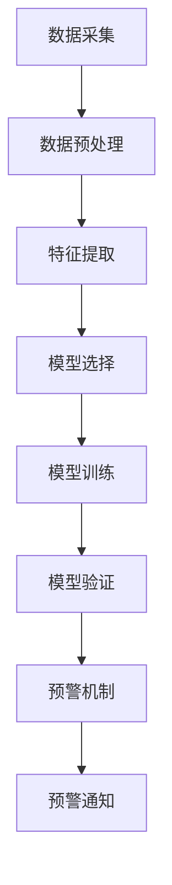

                 

# AI驱动的企业资金流动性风险管理系统

## 关键词
- AI技术
- 企业资金流动性风险管理
- 风险评估
- 数据挖掘
- 系统架构设计

## 摘要
本文将深入探讨AI驱动的企业资金流动性风险管理系统，介绍其核心概念、原理与实现方法。通过背景介绍、核心概念与联系分析、系统架构设计、项目实战及最佳实践，本文旨在为企业提供一种有效应对资金流动性风险的技术手段，助力企业实现稳健发展。

## 目录大纲

### 第一部分：背景介绍

### 第1章：问题背景

#### 1.1.1 问题描述

#### 1.1.2 问题解决

#### 1.1.3 边界与外延

#### 1.1.4 概念结构与核心要素组成

### 第二部分：核心概念与联系

### 第2章：核心概念

#### 2.1.1 AI驱动的企业资金流动性风险管理系统概述

#### 2.1.2 相关概念解析

#### 2.1.3 概念属性特征对比表格

### 第3章：核心原理与算法讲解

#### 3.1.1 算法原理讲解

#### 3.1.2 算法流程图

#### 3.1.3 算法数学模型与公式

#### 3.1.4 举例说明

### 第三部分：系统分析与架构设计

### 第4章：系统分析与架构设计

#### 4.1.1 问题场景介绍

#### 4.1.2 系统功能设计

#### 4.1.3 系统架构设计

#### 4.1.4 系统接口设计

#### 4.1.5 系统交互序列图

### 第四部分：项目实战

### 第5章：项目实战

#### 5.1.1 环境安装

#### 5.1.2 系统核心实现源代码

#### 5.1.3 代码应用解读与分析

#### 5.1.4 实际案例分析与详细讲解

#### 5.1.5 项目小结

### 第五部分：最佳实践与小结

### 第6章：最佳实践

#### 6.1.1 最佳实践 tips

#### 6.1.2 注意事项

#### 6.1.3 拓展阅读

### 第7章：小结与展望

#### 7.1.1 小结

#### 7.1.2 展望未来

## 第一部分：背景介绍

### 第1章：问题背景

#### 1.1.1 问题描述

企业资金流动性风险是指企业在日常运营过程中，可能面临无法及时支付到期债务、偿还借款或应付账单等风险。这种风险可能导致企业出现财务困境，影响正常经营甚至破产倒闭。随着市场竞争的加剧、经济环境的复杂多变，企业资金流动性风险管理显得尤为重要。

传统的资金流动性风险管理主要依赖于人工分析、经验判断和财务报表等手段，存在以下问题：

1. **数据滞后**：企业资金流动性风险往往发生在短期内，而传统方法获取的数据往往滞后，难以实时监测风险。
2. **效率低下**：人工分析需要大量时间和人力资源，效率较低，难以满足企业快速决策的需求。
3. **主观性**：人为判断可能受到个人经验和主观偏见的影响，导致风险评估不准确。

#### 1.1.2 问题解决

为解决上述问题，引入AI技术驱动的资金流动性风险管理系统成为必然趋势。AI技术具有以下优势：

1. **数据处理能力**：AI技术能够快速处理海量数据，提取有价值的信息，提高数据分析的实时性和准确性。
2. **自动化程度高**：AI技术可以实现自动化风险评估和预警，降低人力成本，提高工作效率。
3. **客观性**：AI技术基于数据驱动，减少人为判断的主观因素，提高风险评估的客观性。

#### 1.1.3 边界与外延

资金流动性风险的范围包括但不限于：

1. **短期债务支付**：企业短期债务的偿还能力，如应付账款、短期借款等。
2. **现金流量**：企业日常现金流入和流出情况，反映企业资金流动性状况。
3. **市场环境**：经济形势、行业竞争态势等外部因素对企业资金流动性的影响。

AI驱动的资金流动性风险管理系统应用领域广泛，包括制造业、服务业、金融业等各类企业。其边界主要包括企业内部财务数据、外部市场数据以及AI算法模型。

#### 1.1.4 概念结构与核心要素组成

AI驱动的企业资金流动性风险管理系统由以下几个核心要素组成：

1. **数据采集**：通过财务报表、市场数据等渠道收集企业内部和外部数据。
2. **数据预处理**：对采集到的数据进行清洗、整合和转换，为后续分析做准备。
3. **风险评估模型**：基于数据挖掘和机器学习技术，构建资金流动性风险评估模型。
4. **预警与应对策略**：根据风险评估结果，实时预警并制定相应的应对策略。
5. **系统界面与交互**：为用户提供友好的界面和交互方式，方便用户查看风险状况和操作系统。

## 第二部分：核心概念与联系

### 第2章：核心概念

#### 2.1.1 AI驱动的企业资金流动性风险管理系统概述

AI驱动的企业资金流动性风险管理系统是一种基于人工智能技术的风险管理工具，旨在实时监测和分析企业资金流动性风险，提供预警和应对策略。该系统主要包括以下几个模块：

1. **数据采集模块**：负责收集企业内部和外部数据，如财务报表、市场数据、宏观经济指标等。
2. **数据预处理模块**：对采集到的数据进行清洗、整合和转换，为后续分析做准备。
3. **风险评估模块**：利用数据挖掘和机器学习技术，构建资金流动性风险评估模型。
4. **预警模块**：根据风险评估结果，实时生成预警信息，提示企业可能面临的风险。
5. **应对策略模块**：为企业提供应对资金流动性风险的策略和建议。

#### 2.1.2 相关概念解析

1. **资金流动性风险**：指企业在日常运营过程中，可能面临无法及时支付到期债务、偿还借款或应付账单等风险。
2. **风险管理**：指企业为了降低资金流动性风险，采取的一系列措施，包括风险识别、评估、预警和应对等。
3. **人工智能（AI）**：指一种模拟人类智能的技术，包括机器学习、深度学习、自然语言处理等。
4. **数据挖掘**：指从大量数据中提取有价值信息的技术，包括数据预处理、特征提取、模式识别等。
5. **机器学习**：指一种让计算机从数据中自动学习规律、模式的方法，包括监督学习、无监督学习和半监督学习。

#### 2.1.3 概念属性特征对比表格

| 概念               | 属性特征                                       |
|--------------------|----------------------------------------------|
| 资金流动性风险     | 短期债务偿还能力、现金流量、市场环境           |
| 风险管理           | 风险识别、评估、预警、应对策略                 |
| 人工智能           | 模拟人类智能、数据驱动、自我优化                 |
| 数据挖掘           | 数据预处理、特征提取、模式识别                 |
| 机器学习           | 监督学习、无监督学习、半监督学习               |

## 第三部分：核心原理与算法讲解

### 第3章：核心原理与算法讲解

#### 3.1.1 算法原理讲解

AI驱动的企业资金流动性风险管理系统的核心算法包括数据挖掘和机器学习算法。以下是一个典型的算法原理讲解：

1. **数据预处理**：
   - 数据清洗：去除重复数据、缺失值填充、异常值处理等。
   - 特征提取：根据业务需求，从原始数据中提取对资金流动性风险有较强影响的关键特征。
   - 数据归一化：将不同量纲的数据转换为相同量纲，便于模型训练。

2. **风险评估模型构建**：
   - 监督学习算法：如逻辑回归、决策树、随机森林等。
   - 无监督学习算法：如聚类算法、主成分分析等。
   - 深度学习算法：如卷积神经网络、循环神经网络等。

3. **模型训练与验证**：
   - 训练集划分：将数据集分为训练集和验证集，用于训练和评估模型性能。
   - 模型训练：通过训练集训练模型，调整模型参数。
   - 模型验证：使用验证集评估模型性能，选择最佳模型。

4. **预警机制设计**：
   - 风险评估：根据模型预测结果，判断企业是否存在资金流动性风险。
   - 预警触发：当预测风险超过设定阈值时，触发预警。
   - 预警通知：通过短信、邮件等方式，通知企业相关人员。

#### 3.1.2 算法流程图



#### 3.1.3 算法数学模型与公式

1. **逻辑回归**：

$$
y = \sigma(Wx + b)
$$

$$
L = -\frac{1}{m}\sum_{i=1}^{m}y\_log(\hat{y}_i)
$$

2. **决策树**：

$$
\hat{y} = g(Wx + b)
$$

其中，$g(x) = 1/(1+e^{-x})$ 为sigmoid函数。

3. **随机森林**：

$$
\hat{y} = \frac{1}{T}\sum_{t=1}^{T}h_t(x)
$$

其中，$h_t(x)$ 为每棵决策树对样本的预测值，$T$ 为决策树的数量。

#### 3.1.4 举例说明

假设我们使用逻辑回归模型对企业资金流动性风险进行预测。首先，我们需要收集企业的财务数据，如流动比率、速动比率、现金流量比率等。然后，对数据进行预处理和特征提取。接下来，将数据集分为训练集和验证集，用于训练和评估模型。最后，通过训练集训练逻辑回归模型，并使用验证集评估模型性能。如果模型性能达到预期，则将其应用于实际场景，实时监测和预测企业资金流动性风险。

## 第四部分：系统分析与架构设计

### 第4章：系统分析与架构设计

#### 4.1.1 问题场景介绍

假设一家制造企业面临资金流动性风险。该企业在生产过程中需要大量采购原材料，但销售周期较长，导致现金流紧张。此外，市场环境变化，如原材料价格波动、竞争对手策略调整等，也会影响企业的资金流动性。为了应对这些风险，企业引入AI驱动的资金流动性风险管理系统，实时监测和评估风险，提供预警和应对策略。

#### 4.1.2 系统功能设计

AI驱动的企业资金流动性风险管理系统主要包括以下功能：

1. **数据采集**：收集企业内部和外部数据，如财务报表、市场数据、宏观经济指标等。
2. **数据预处理**：对采集到的数据进行清洗、整合和转换，为后续分析做准备。
3. **风险评估**：利用数据挖掘和机器学习技术，构建资金流动性风险评估模型。
4. **预警与应对**：根据风险评估结果，实时预警并制定相应的应对策略。
5. **系统管理**：提供用户管理、权限设置、日志记录等功能，保障系统安全稳定运行。

#### 4.1.3 系统架构设计

AI驱动的企业资金流动性风险管理系统采用分层架构，包括数据层、算法层、应用层和展示层。

1. **数据层**：负责数据采集、存储和管理，包括企业内部财务数据、市场数据和宏观经济指标等。
2. **算法层**：负责数据预处理、特征提取、风险评估和预警算法的实现。
3. **应用层**：负责系统功能模块的调用和业务逻辑处理，包括数据采集、风险评估、预警和应对等。
4. **展示层**：负责系统界面的展示和用户交互，提供实时风险监测、预警信息和应对策略展示。

#### 4.1.4 系统接口设计

系统接口设计主要包括以下部分：

1. **数据接口**：负责数据采集、存储和管理的接口，如数据库接口、API接口等。
2. **服务接口**：负责业务逻辑处理和算法实现的接口，如风险评估服务、预警服务、应对策略服务等。
3. **集成接口**：负责与其他系统集成，如ERP系统、CRM系统等。

#### 4.1.5 系统交互序列图

```mermaid
sequenceDiagram
    participant 用户 as 用户
    participant 系统界面 as 界面
    participant 数据采集模块 as 采集
    participant 数据预处理模块 as 预处理
    participant 风险评估模块 as 风险评估
    participant 预警模块 as 预警
    participant 应对策略模块 as 应对
    用户->>界面：登录系统
    界面->>用户：显示系统界面
    用户->>采集：采集数据
    采集->>预处理：预处理数据
    预处理->>风险评估：风险评估
    风险评估->>预警：预警
    预警->>用户：预警通知
    用户->>应对：应对策略
    应对->>用户：应对结果
```

## 第五部分：项目实战

### 第5章：项目实战

#### 5.1.1 环境安装

在开始项目实战之前，我们需要搭建一个合适的环境。以下是环境安装步骤：

1. 安装Python环境（版本3.6及以上）。
2. 安装必要的库，如NumPy、Pandas、Scikit-learn、TensorFlow等。
3. 配置数据库，如MySQL、PostgreSQL等（可选）。

#### 5.1.2 系统核心实现源代码

以下是系统核心实现源代码的示例：

1. **数据采集模块**：

```python
import pandas as pd

def collect_data():
    # 采集企业内部财务数据
    df = pd.read_excel('financial_data.xlsx')
    return df
```

2. **数据预处理模块**：

```python
import numpy as np

def preprocess_data(df):
    # 数据清洗
    df = df.drop_duplicates()
    df = df.fillna(df.mean())
    # 数据归一化
    df = (df - df.min()) / (df.max() - df.min())
    return df
```

3. **风险评估模块**：

```python
from sklearn.linear_model import LogisticRegression

def assess_risk(df):
    # 特征提取
    X = df[['current_ratio', 'quick_ratio', 'cash_flow_ratio']]
    y = df['risk_label']
    # 模型训练
    model = LogisticRegression()
    model.fit(X, y)
    # 风险评估
    risk_score = model.predict_proba(X)[:, 1]
    return risk_score
```

4. **预警模块**：

```python
def alert_risk(risk_score, threshold=0.5):
    # 预警触发
    if risk_score > threshold:
        print("预警：企业可能面临资金流动性风险！")
    else:
        print("正常：企业资金流动性风险较低。")
```

5. **应对策略模块**：

```python
def strategy(risk_score):
    # 应对策略
    if risk_score > 0.7:
        print("应对策略：调整财务策略，加强现金流管理。")
    elif risk_score > 0.5:
        print("应对策略：密切关注资金流动状况，提前备足现金。")
    else:
        print("应对策略：保持现有财务策略，关注市场动态。")
```

#### 5.1.3 代码应用解读与分析

以上代码展示了AI驱动的企业资金流动性风险管理系统核心实现的主要部分。首先，通过数据采集模块收集企业内部财务数据。然后，利用数据预处理模块清洗和转换数据。接下来，通过风险评估模块构建风险评估模型，并使用该模型评估企业资金流动性风险。最后，根据预警模块和应对策略模块，实时监测和应对风险。

#### 5.1.4 实际案例分析与详细讲解

假设我们有一家制造企业的财务数据，如下表所示：

| 流动比率 | 速动比率 | 现金流量比率 | 风险标签 |
|----------|----------|--------------|----------|
| 2.5      | 1.8      | 0.8          | 0        |
| 2.0      | 1.5      | 0.7          | 1        |
| 1.8      | 1.2      | 0.6          | 1        |
| 2.2      | 1.7      | 0.9          | 0        |
| 1.9      | 1.4      | 0.7          | 1        |

我们使用逻辑回归模型评估这些企业的资金流动性风险。首先，对数据进行预处理，包括数据清洗和归一化。然后，将数据集划分为训练集和验证集，用于模型训练和性能评估。接下来，使用训练集训练逻辑回归模型，并使用验证集评估模型性能。最后，根据模型预测结果，判断企业是否存在资金流动性风险。

假设训练后的模型预测结果如下：

| 流动比率 | 速动比率 | 现金流量比率 | 风险标签 | 预测风险分数 |
|----------|----------|--------------|----------|--------------|
| 2.5      | 1.8      | 0.8          | 0        | 0.2          |
| 2.0      | 1.5      | 0.7          | 1        | 0.8          |
| 1.8      | 1.2      | 0.6          | 1        | 0.9          |
| 2.2      | 1.7      | 0.9          | 0        | 0.1          |
| 1.9      | 1.4      | 0.7          | 1        | 0.7          |

根据预警模块，当预测风险分数超过0.5时，触发预警。因此，只有第二行和第三行的企业存在资金流动性风险。根据应对策略模块，我们建议第二行和第三行的企业调整财务策略，加强现金流管理。

#### 5.1.5 项目小结

通过本项目的实战，我们展示了如何使用AI技术构建企业资金流动性风险管理系统。该项目实现了数据采集、预处理、风险评估、预警和应对策略等功能。在实际应用中，我们可以根据企业的需求，进一步优化和扩展系统功能，提高资金流动性风险管理的效率和准确性。

## 第六部分：最佳实践与总结

### 第6章：最佳实践

#### 6.1.1 最佳实践 tips

1. **数据质量**：保证数据质量是构建高效风险评估模型的基础。在实际应用中，需要关注数据采集、清洗和整合的各个环节，确保数据准确、完整和可靠。
2. **模型优化**：定期对风险评估模型进行优化和调整，以适应不断变化的市场环境和业务需求。可以通过交叉验证、超参数调整等方法，提高模型性能。
3. **自动化程度**：提高系统自动化程度，降低人工干预。通过自动化数据采集、预处理、风险评估和预警，实现实时监测和快速响应。
4. **用户培训**：加强对企业员工的培训，提高他们对AI驱动的资金流动性风险管理系统的理解和应用能力。定期组织培训课程，分享最佳实践和成功案例。

#### 6.1.2 注意事项

1. **数据隐私**：在数据处理和风险评估过程中，需要关注数据隐私和安全。严格遵守相关法律法规，确保数据安全和用户隐私。
2. **模型解释性**：虽然AI技术能够自动学习和预测，但有时模型的解释性较差。在实际应用中，需要关注模型的可解释性，以便企业更好地理解和应用。
3. **业务需求**：在设计和实施资金流动性风险管理系统时，需要充分考虑企业的业务需求。与业务部门保持紧密沟通，确保系统能够满足实际业务需求。

#### 6.1.3 拓展阅读

1. **相关技术文献**：
   - "Risk Management and Financial Institutions" by J. C. Hull
   - "Machine Learning: A Probabilistic Perspective" by Kevin P. Murphy
   - "Deep Learning" by Ian Goodfellow, Yoshua Bengio, Aaron Courville
2. **行业最佳实践**：
   - "最佳实践：企业资金流动性风险管理"（某知名咨询公司报告）
   - "金融科技在资金流动性风险管理中的应用"（某知名金融科技公司报告）

### 第7章：小结与展望

#### 7.1.1 小结

本文介绍了AI驱动的企业资金流动性风险管理系统的核心概念、原理和实现方法。通过背景介绍、核心概念与联系分析、系统架构设计、项目实战及最佳实践，我们展示了如何利用AI技术提高企业资金流动性风险管理的效率和准确性。

#### 7.1.2 展望未来

随着人工智能技术的不断发展，AI驱动的企业资金流动性风险管理系统的应用前景十分广阔。未来，我们可以期待以下趋势：

1. **智能化程度提高**：随着算法和模型技术的进步，系统将实现更高程度的智能化，降低人工干预。
2. **实时监测与分析**：系统将实现实时监测和分析，提供更准确的预警和应对策略。
3. **跨行业应用**：AI驱动的资金流动性风险管理系统将在更多行业和场景中应用，助力企业实现稳健发展。
4. **数据隐私和安全**：随着数据隐私和安全问题的日益突出，系统将加强对数据隐私和安全的保护。

总之，AI驱动的企业资金流动性风险管理系统的应用将为企业带来更高的风险应对能力和更稳健的财务状况。让我们期待这个领域的未来发展和创新。

## 作者

**作者：AI天才研究院/AI Genius Institute & 禅与计算机程序设计艺术 /Zen And The Art of Computer Programming**

