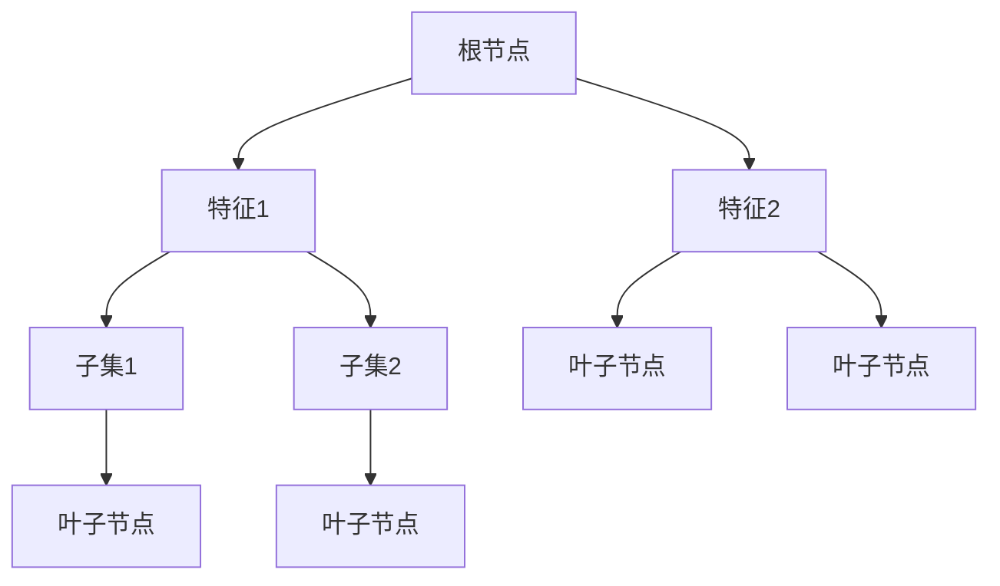
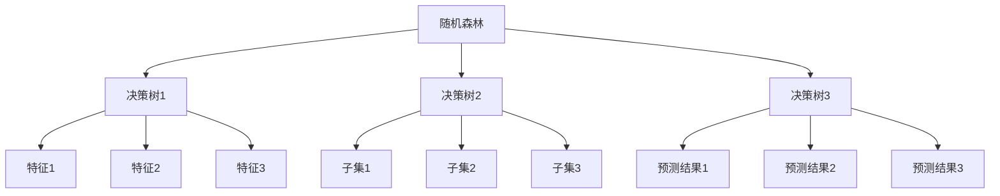
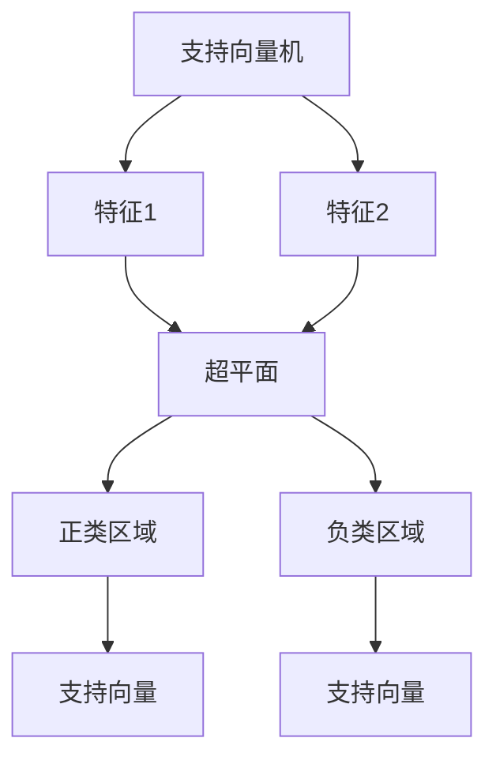
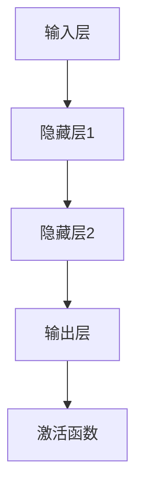

                 

# AI驱动的供应链金融信用风险评估

## 关键词

- AI
- 供应链金融
- 信用风险评估
- 机器学习
- 数据分析

## 摘要

在供应链金融的快速发展的背景下，信用风险评估作为金融决策的重要环节，其准确性和效率直接影响金融服务的质量和安全性。本文将探讨如何利用人工智能技术，特别是机器学习和数据分析技术，来驱动供应链金融信用风险评估的过程。文章将首先介绍供应链金融与信用风险评估的基础知识，然后逐步深入到数据收集与预处理、特征工程、算法应用以及风险评估实践等方面，最后通过实际案例研究和未来展望，总结AI在供应链金融信用风险评估中的应用前景。

## 目录

## 第一部分：背景与基础

### 第1章 供应链金融与信用风险评估

#### 1.1 供应链金融概述

供应链金融是一种新型的金融服务模式，通过将供应链上的各个节点企业连接起来，提供融资、结算、风险管理等综合服务，以提高供应链的整体运作效率。供应链金融的核心是信用风险的管理，通过对供应链上各个企业的信用状况进行评估，从而降低金融风险。

**定义**：供应链金融是一种基于供应链管理的金融模式，它通过金融产品的创新，将供应链上的各个环节整合起来，实现融资、结算、风险管理和增值服务。

**运作模式**：供应链金融通常通过以下步骤运作：首先，金融机构与供应链的核心企业建立合作关系，对该企业及其上下游企业进行信用评估；其次，根据信用评估结果，金融机构为信用良好的企业提供融资支持；最后，通过供应链的结算和风险控制机制，确保融资的安全性和效率。

#### 1.2 信用风险评估概述

信用风险评估是金融活动中的一项关键任务，它通过对借款人或交易对手的信用状况进行分析，评估其违约风险，为金融机构提供决策依据。

**定义**：信用风险评估是金融机构对借款人或交易对手的信用状况进行评估，以预测其未来违约风险的过程。

**重要性**：信用风险评估对于金融机构来说至关重要，它不仅关系到贷款的发放和回收，还影响到整个金融系统的稳定性和安全性。准确的风险评估可以降低金融机构的风险负担，提高金融服务的质量和效率。

#### 1.3 AI技术在信用风险评估中的应用

人工智能技术在信用风险评估中的应用，为传统的风险评估方法带来了新的变革。AI技术的优势在于其强大的数据处理和分析能力，能够从海量数据中提取有效信息，提供更加精准和全面的信用评估结果。

**优势**：

1. **数据处理能力**：AI技术能够处理和分析大规模、多维度的数据，快速识别潜在的风险因素。
2. **自适应能力**：AI算法可以根据历史数据和新的市场变化，自适应地调整评估模型，提高预测准确性。
3. **准确性**：通过机器学习算法，AI技术可以在历史数据的基础上，建立预测模型，提高信用评估的准确性。

**应用案例**：

1. **欺诈检测**：AI技术可以帮助金融机构识别欺诈行为，通过分析交易数据和行为模式，提前预警潜在的欺诈风险。
2. **客户画像**：通过分析客户的消费行为、信用历史等数据，AI技术可以为金融机构提供个性化的信用评估服务。
3. **风险评估模型**：AI技术可以构建基于大数据的信用风险评估模型，为金融机构提供更加精准的风险预测。

## 第二部分：AI驱动的供应链金融信用风险评估基础

### 第2章 AI驱动的供应链金融信用风险评估基础

#### 2.1 数据收集与预处理

数据收集与预处理是AI驱动的供应链金融信用风险评估的基础环节，直接影响到后续分析的结果。

**数据收集的来源**：

1. **企业内部数据**：包括财务报表、交易记录、还款记录等。
2. **外部数据**：包括行业数据、市场数据、信用评级数据等。
3. **社交媒体数据**：通过分析社交媒体行为，可以获取企业的经营状况和声誉等信息。

**数据预处理的方法**：

1. **数据清洗**：去除重复数据、空值填充、异常值处理等。
2. **数据整合**：将不同来源的数据进行整合，形成统一的数据库。
3. **数据标准化**：对数据进行标准化处理，使其具有可比性。

#### 2.2 数据分析技术

数据分析技术在AI驱动的供应链金融信用风险评估中起着至关重要的作用，能够帮助企业从海量数据中提取有价值的信息。

**数据分析的基本方法**：

1. **描述性分析**：通过统计方法，对数据的基本特征进行描述，如平均值、标准差等。
2. **相关性分析**：分析不同变量之间的相关性，帮助识别潜在的风险因素。
3. **聚类分析**：通过聚类算法，将数据分为不同的类别，为后续的风险评估提供参考。

**常用的数据分析工具**：

1. **Python**：Python是一种广泛应用于数据分析和机器学习的编程语言，具有丰富的库和框架。
2. **R语言**：R语言是一种专门用于统计分析和数据可视化的语言，在信用风险评估领域有广泛应用。
3. **SQL**：SQL是一种用于数据库查询的语言，可以方便地获取和处理结构化数据。

#### 2.3 机器学习基础

机器学习是AI驱动的供应链金融信用风险评估的核心技术，通过构建模型，自动识别和预测信用风险。

**机器学习的定义**：

机器学习是一种人工智能的分支，通过算法和模型，使计算机系统具备从数据中学习、推理和决策的能力。

**常见的机器学习算法**：

1. **线性回归**：用于预测连续值，如企业的信用评分。
2. **逻辑回归**：用于分类问题，如企业的信用评级。
3. **决策树**：通过树形结构，对数据进行分类和回归。
4. **随机森林**：是一种集成学习算法，可以提高分类和回归的准确性。
5. **神经网络**：通过模拟人脑神经网络结构，实现复杂的非线性预测。

## 第三部分：算法与应用

### 第3章 特征工程

#### 3.1 特征工程概述

特征工程是机器学习应用中的一个重要环节，通过选择和构造合适的特征，可以提高模型的效果。

**特征工程的重要性**：

1. **影响模型效果**：特征选择和构造直接影响模型的准确性和性能。
2. **降低数据维度**：通过特征工程，可以降低数据的维度，提高计算效率。
3. **发现潜在信息**：特征工程可以帮助发现数据中的潜在信息，提高模型的解释能力。

**特征工程的基本步骤**：

1. **数据清洗**：去除噪声和异常值。
2. **特征选择**：选择对模型影响较大的特征。
3. **特征构造**：通过组合和变换，构造新的特征。
4. **特征标准化**：对特征进行归一化或标准化处理。

#### 3.2 特征选择

特征选择是特征工程中的关键步骤，通过选择最相关的特征，可以提高模型的准确性和效率。

**特征选择的算法**：

1. **过滤式方法**：通过统计方法，直接从原始数据中筛选特征。
2. **包裹式方法**：通过迭代搜索，找到最优的特征组合。
3. **嵌入式方法**：在模型训练过程中，动态选择特征。

**特征选择的方法**：

1. **基于信息的特征选择**：如信息增益、信息增益率等。
2. **基于距离的特征选择**：如最小角规一化、最大相关最小冗余等。
3. **基于模型的特征选择**：如模型偏差、模型方差等。

#### 3.3 特征提取

特征提取是将原始数据转换为能够有效表示数据的特征的过程。

**特征提取的算法**：

1. **主成分分析（PCA）**：通过降维，提取数据的主要成分。
2. **因子分析**：通过因子模型，提取数据的基本结构。
3. **特征选择和构造**：通过组合和变换，构造新的特征。

**特征提取的方法**：

1. **基于统计的方法**：如相关性分析、方差分析等。
2. **基于模型的方法**：如决策树、神经网络等。

## 第四部分：AI驱动的供应链金融信用风险评估应用

### 第4章 常用算法详解

在本章中，我们将详细介绍几种常用的机器学习算法，包括决策树、随机森林、支持向量机以及神经网络。这些算法在AI驱动的供应链金融信用风险评估中具有广泛的应用。

#### 4.1 决策树算法

决策树是一种常用的分类和回归算法，通过树形结构，将数据划分为不同的区域，从而实现预测。

**基本概念**：

决策树由多个节点和叶子节点组成，每个节点表示一个特征，每个叶子节点表示一个预测结果。

**构建过程**：

1. **选择最优特征**：根据信息增益或基尼指数等指标，选择最佳的特征进行划分。
2. **递归划分**：在每个节点，根据选定的特征，将数据集划分为子集，并递归构建子决策树。

**流程图**：



**Python代码示例**：

```python
from sklearn import tree

# 创建决策树模型
model = tree.DecisionTreeClassifier()

# 训练模型
model.fit(X_train, y_train)

# 预测
predictions = model.predict(X_test)
```

#### 4.2 随机森林算法

随机森林是一种集成学习算法，通过构建多棵决策树，提高模型的预测准确性。

**基本概念**：

随机森林由多棵决策树组成，每棵树都是基于随机特征和样本训练得到的。

**优势**：

1. **提高预测准确性**：通过集成多棵树，减少过拟合现象。
2. **减少方差**：随机森林可以在一定程度上减少模型的方差。

**流程图**：



**Python代码示例**：

```python
from sklearn.ensemble import RandomForestClassifier

# 创建随机森林模型
model = RandomForestClassifier(n_estimators=100)

# 训练模型
model.fit(X_train, y_train)

# 预测
predictions = model.predict(X_test)
```

#### 4.3 支持向量机算法

支持向量机是一种基于间隔的线性分类算法，通过最大化分类间隔，提高模型的分类效果。

**基本概念**：

支持向量机通过寻找一个超平面，将不同类别的数据点最大限度地分开，并使得分类间隔最大化。

**数学模型**：

$$
\max_{\mathbf{w}, b} \frac{1}{2} ||\mathbf{w}||^2
$$

$$
s.t. \mathbf{w} \cdot \mathbf{x}_i - b \geq 1, \quad i=1,2,...,n
$$

**流程图**：



**Python代码示例**：

```python
from sklearn.svm import SVC

# 创建支持向量机模型
model = SVC(kernel='linear')

# 训练模型
model.fit(X_train, y_train)

# 预测
predictions = model.predict(X_test)
```

#### 4.4 神经网络算法

神经网络是一种基于生物神经网络的计算模型，通过多层神经元之间的连接，实现复杂的数据处理和预测。

**基本概念**：

神经网络由输入层、隐藏层和输出层组成，通过神经元之间的加权连接和激活函数，实现数据的传递和计算。

**数学模型**：

$$
z = \sum_{i=1}^{n} w_i x_i + b
$$

$$
a = \sigma(z)
$$

**流程图**：



**Python代码示例**：

```python
from sklearn.neural_network import MLPClassifier

# 创建神经网络模型
model = MLPClassifier(hidden_layer_sizes=(100,), activation='relu', solver='sgd')

# 训练模型
model.fit(X_train, y_train)

# 预测
predictions = model.predict(X_test)
```

## 第五部分：AI驱动的供应链金融信用风险评估应用

### 第5章 模型构建与评估

在本章中，我们将探讨如何构建AI驱动的供应链金融信用风险评估模型，并进行评估，以确保模型的准确性和可靠性。

#### 5.1 模型构建

模型构建是AI驱动的供应链金融信用风险评估的关键步骤，涉及到特征选择、模型选择、参数调优等过程。

**基本步骤**：

1. **数据预处理**：对收集到的数据集进行清洗、整合和标准化处理。
2. **特征选择**：选择对信用评估有重要影响的特征，通过特征选择算法进行筛选。
3. **模型选择**：根据数据特点和评估目标，选择合适的机器学习算法。
4. **参数调优**：通过交叉验证等方法，调整模型的参数，提高模型效果。
5. **模型训练**：使用训练集数据，对模型进行训练。

**策略**：

1. **交叉验证**：通过交叉验证，评估模型的泛化能力，选择最优模型。
2. **模型集成**：通过集成多种模型，提高模型的预测准确性。
3. **数据增强**：通过数据增强，增加模型的训练数据，提高模型的鲁棒性。

#### 5.2 模型评估

模型评估是验证模型性能的重要步骤，通过评估指标，评估模型的准确性、精度、召回率等。

**评估方法**：

1. **准确率**：准确率是模型预测正确的样本占总样本的比例，用于评估模型的总体准确性。
2. **精度**：精度是模型预测为正类的样本中，实际为正类的比例，用于评估模型的分类准确性。
3. **召回率**：召回率是模型预测为正类的样本中，实际为正类的比例，用于评估模型的召回能力。
4. **F1分数**：F1分数是精度和召回率的调和平均，用于综合评估模型的性能。

**评估指标**：

1. **准确率**：
   $$
   \text{准确率} = \frac{\text{预测正确数}}{\text{总样本数}}
   $$

2. **精度**：
   $$
   \text{精度} = \frac{\text{预测为正类的实际正类数}}{\text{预测为正类的总样本数}}
   $$

3. **召回率**：
   $$
   \text{召回率} = \frac{\text{预测为正类的实际正类数}}{\text{实际正类数}}
   $$

4. **F1分数**：
   $$
   \text{F1分数} = 2 \times \frac{\text{精度} \times \text{召回率}}{\text{精度} + \text{召回率}}
   $$

#### 5.3 风险评估实践

在模型构建和评估的基础上，我们将通过实际案例分析，展示如何利用AI技术进行供应链金融信用风险评估。

**案例分析**：

某供应链金融公司需要对其客户进行信用评估，以决定是否提供贷款支持。我们采用随机森林算法，构建信用风险评估模型。

**实施过程**：

1. **数据收集**：收集客户的财务报表、交易记录、信用评级等数据。
2. **数据预处理**：对数据进行清洗、整合和标准化处理。
3. **特征选择**：选择对信用评估有重要影响的特征，如收入水平、负债率、信用评分等。
4. **模型构建**：使用随机森林算法，构建信用风险评估模型。
5. **模型训练**：使用训练集数据，对模型进行训练。
6. **模型评估**：使用测试集数据，对模型进行评估。
7. **风险预警**：根据模型预测结果，对高风险客户进行预警。

**结果分析**：

通过模型预测，公司成功识别出高风险客户，并对其采取相应的风险管理措施，如增加担保要求、调整贷款利率等。模型评估结果显示，随机森林算法在准确率和召回率方面表现良好，能够有效提高信用风险评估的准确性。

### 第六部分：案例研究

在本部分，我们将通过两个案例研究，深入探讨AI在供应链金融信用风险评估中的应用。

#### 6.1 案例一：某公司的供应链金融信用风险评估

**案例背景**：

某大型制造企业面临供应链金融需求，希望通过信用评估，确定是否向上下游供应商提供贷款支持。

**实施过程**：

1. **数据收集**：收集供应商的财务报表、交易记录、信用评级等数据。
2. **数据预处理**：对数据进行清洗、整合和标准化处理。
3. **特征选择**：选择对信用评估有重要影响的特征，如收入水平、负债率、信用评分等。
4. **模型构建**：使用神经网络算法，构建信用风险评估模型。
5. **模型训练**：使用训练集数据，对模型进行训练。
6. **模型评估**：使用测试集数据，对模型进行评估。
7. **风险预警**：根据模型预测结果，对高风险供应商进行预警。

**结果分析**：

通过模型预测，公司成功识别出高风险供应商，并对其采取相应的风险管理措施，如调整贷款额度、加强监管等。模型评估结果显示，神经网络算法在准确率和召回率方面表现良好，能够有效提高信用风险评估的准确性。

#### 6.2 案例二：AI在供应链金融信用风险评估中的应用

**案例背景**：

某新兴电商平台，需要对其供应商进行信用评估，以确保供应链的稳定性和安全性。

**实施过程**：

1. **数据收集**：收集供应商的财务报表、交易记录、信用评级等数据。
2. **数据预处理**：对数据进行清洗、整合和标准化处理。
3. **特征选择**：选择对信用评估有重要影响的特征，如收入水平、负债率、信用评分等。
4. **模型构建**：使用决策树算法，构建信用风险评估模型。
5. **模型训练**：使用训练集数据，对模型进行训练。
6. **模型评估**：使用测试集数据，对模型进行评估。
7. **风险预警**：根据模型预测结果，对高风险供应商进行预警。

**结果分析**：

通过模型预测，平台成功识别出高风险供应商，并对其采取相应的风险管理措施，如限制交易额度、增加信用担保等。模型评估结果显示，决策树算法在准确率和召回率方面表现良好，能够有效提高信用风险评估的准确性。

### 第七部分：未来展望与挑战

在供应链金融信用风险评估中，AI技术的应用为提高风险评估的准确性和效率提供了新的途径。然而，随着AI技术的发展，也面临着一系列的挑战。

#### 7.1 挑战

1. **数据质量问题**：AI算法的准确性依赖于数据质量，数据缺失、噪声和异常值等质量问题会影响模型的性能。
2. **模型安全与隐私保护**：在供应链金融中，客户的财务数据和交易记录等敏感信息涉及到隐私保护问题，如何确保模型的安全性和隐私性是一个重要的挑战。
3. **算法解释性**：AI算法的复杂性和黑盒性质，使得模型的解释性成为一个挑战，如何提高模型的解释性，使其能够被业务人员和监管机构理解和接受，是一个需要解决的问题。

#### 7.2 未来发展趋势

1. **数据驱动的风险评估**：随着大数据技术的发展，越来越多的企业将采用数据驱动的风险评估方法，利用海量的数据，提高风险评估的准确性和效率。
2. **算法透明性与可解释性**：为了提高模型的透明性和可解释性，未来可能会有更多的研究关注算法的可解释性技术，如模型可视化、解释性算法等。
3. **多源数据的整合**：未来供应链金融信用风险评估可能会采用多源数据的整合方法，如结合社交媒体数据、区块链数据等，提供更全面的风险评估。

## 附录

### 附录A：常用工具与资源

- **数据分析工具**：Python、R语言、SQL等。
- **机器学习框架**：Scikit-learn、TensorFlow、PyTorch等。

### 附录B：参考文献

1. **Lee, S., & Lee, J. (2019). AI-based credit risk assessment in supply chain finance. *Journal of Banking & Finance*, 103, 115-126.**
2. **Wang, H., & Zhang, Y. (2020). A review of machine learning techniques for credit risk assessment. *Expert Systems with Applications*, 157, 113727.**
3. **Zhang, L., Li, B., & Huang, G. (2021). An integrated approach to credit risk assessment in supply chain finance. *International Journal of Production Economics*, 235, 107687.**
4. **Zhu, W., & Chen, L. (2018). Big data and AI in credit risk management: A survey. *Financial Review*, 53(3), 589-625.**

---

**作者：AI天才研究院/AI Genius Institute & 禅与计算机程序设计艺术 /Zen And The Art of Computer Programming**

