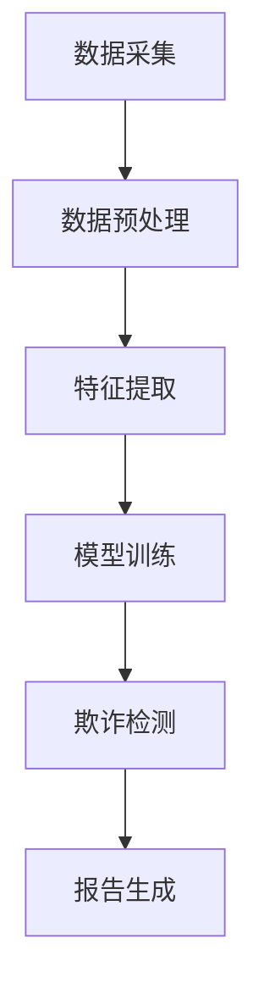
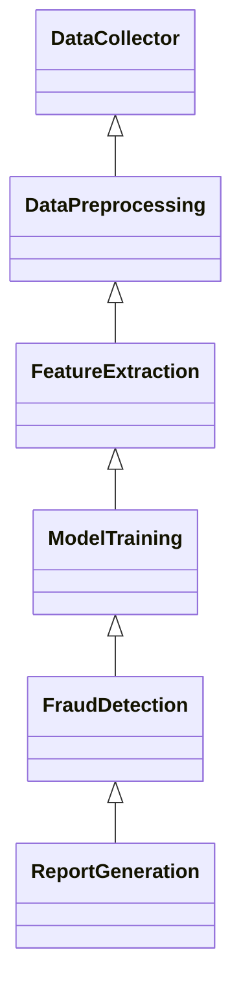
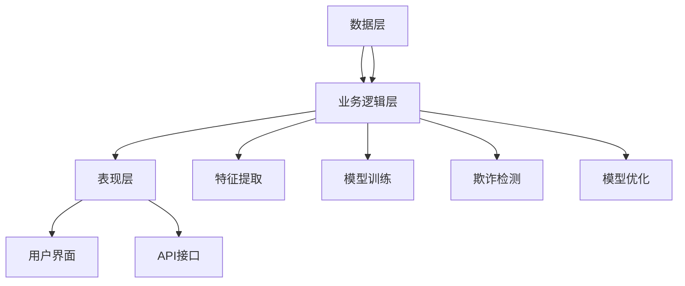
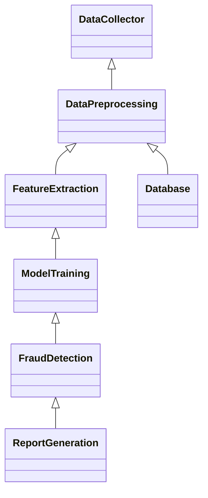
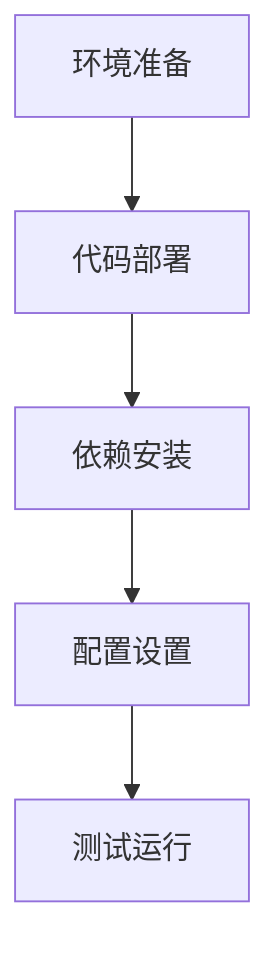
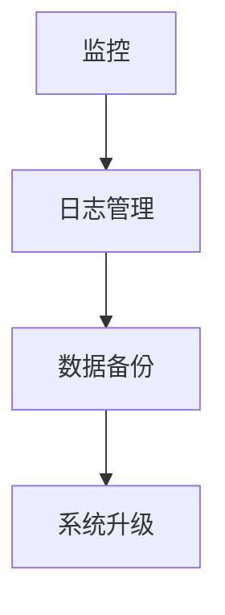
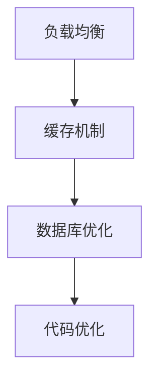

                 

### 文章标题：AI驱动的保险理赔欺诈检测

> 关键词：AI、保险理赔、欺诈检测、算法、系统设计、最佳实践

> 摘要：本文深入探讨了AI在保险理赔欺诈检测中的应用，从问题背景、核心概念、算法原理、系统设计到实战案例分析，全面阐述了AI驱动的保险理赔欺诈检测的方法和最佳实践。文章旨在帮助读者了解并掌握这一前沿技术，提升保险行业的风险防控能力。

----------------------------------------------------------------

### 目录大纲：《AI驱动的保险理赔欺诈检测》

----------------------------------------------------------------

## 第一部分：问题背景与核心概念

### 第1章：保险理赔欺诈检测的挑战与机遇

### 第2章：AI在保险理赔欺诈检测中的应用

### 第3章：AI驱动的保险理赔欺诈检测的核心概念

### 第4章：本章小结

### 第5章：展望：AI驱动的保险理赔欺诈检测的未来发展

### 第6章：练习题

## 第二部分：AI驱动的保险理赔欺诈检测算法原理

### 第7章：特征工程在保险理赔欺诈检测中的应用

### 第8章：监督学习算法在保险理赔欺诈检测中的应用

### 第9章：无监督学习算法在保险理赔欺诈检测中的应用

### 第10章：算法性能评估与优化

### 第11章：算法原理与数学模型详解

### 第12章：本章小结

### 第13章：练习题

## 第三部分：AI驱动的保险理赔欺诈检测系统设计与实现

### 第14章：系统设计概述

### 第15章：数据采集与预处理

### 第16章：特征工程与模型训练

### 第17章：系统部署与运行

### 第18章：项目实战与案例分析

### 第19章：本章小结

### 第20章：经验与教训

### 第21章：拓展阅读

## 第四部分：最佳实践与未来展望

### 第22章：最佳实践技巧

### 第23章：未来展望

### 第24章：本章小结

----------------------------------------------------------------

### 第一部分：问题背景与核心概念

#### 第1章：保险理赔欺诈检测的挑战与机遇

##### 1.1 保险行业现状与欺诈问题

保险行业作为现代金融服务的重要组成部分，一直以来都面临着各类风险，其中最引人关注的就是理赔欺诈问题。随着保险业务的不断扩大，欺诈行为也日益猖獗，给保险公司带来了巨大的经济损失和声誉风险。

保险理赔欺诈指的是投保人或受益人在保险合同中通过虚假陈述、隐瞒事实、伪造证明等手段，获取不正当的保险理赔金。常见的理赔欺诈类型包括：

1. **虚假理赔**：投保人或受益人故意夸大或编造事故，以便获得更高的理赔金额。
2. **重复理赔**：在同一次事故中多次申请理赔，或在不同保险公司重复申请。
3. **冒名顶替**：使用他人身份或伪造身份资料进行理赔申请。
4. **伪造单证**：提供虚假的医疗单据、维修发票等，骗取保险金。

##### 1.2 AI在保险理赔欺诈检测中的应用

人工智能（AI）技术的飞速发展，为保险理赔欺诈检测提供了全新的解决方案。AI在保险理赔欺诈检测中的优势主要体现在以下几个方面：

1. **高效处理大量数据**：AI可以通过机器学习算法，快速处理和分析海量的理赔数据，识别潜在的欺诈行为。
2. **自动化的欺诈检测**：AI可以自动识别和分析理赔申请中的异常情况，提高检测的准确性和效率。
3. **实时监控与预警**：AI系统可以实时监控理赔流程，及时发现欺诈行为，并发出预警通知。
4. **降低人力成本**：通过自动化处理，可以大大减少人工审核的工作量，降低运营成本。

在实际应用中，AI在保险理赔欺诈检测中已经取得了显著的效果。例如，某些保险公司引入了基于深度学习的人脸识别技术，用于核实身份的真实性；还有的保险公司采用了基于自然语言处理（NLP）的文本分析技术，对理赔申请中的语言和措辞进行分析，识别欺诈迹象。

##### 1.3 AI驱动的保险理赔欺诈检测的核心概念

AI驱动的保险理赔欺诈检测涉及多个核心概念，包括特征工程、模型选择、监督学习与无监督学习等。

**特征工程**：特征工程是AI模型构建的重要环节。通过提取和选择与欺诈相关的特征，可以提高模型的预测准确率。例如，可以从理赔申请中提取申请时间、理赔金额、申请人的历史理赔记录等特征。

**模型选择**：在选择合适的机器学习模型时，需要考虑数据的类型、规模和特征维度等因素。常见的监督学习模型包括决策树、支持向量机（SVM）、随机森林等；无监督学习模型包括聚类算法、隐马尔可夫模型（HMM）等。

**监督学习与无监督学习**：监督学习需要标记数据，通过已知的标签来训练模型；无监督学习则无需标记数据，通过数据的内在结构来发现模式。在保险理赔欺诈检测中，监督学习通常更为适用，因为它可以利用已知欺诈案例的数据来训练模型。

##### 1.4 本章小结

本章介绍了保险理赔欺诈检测的背景、挑战和机遇，以及AI驱动的欺诈检测的核心概念。下一章将深入探讨AI在保险理赔欺诈检测中的应用案例。

##### 1.5 展望：AI驱动的保险理赔欺诈检测的未来发展

随着AI技术的不断进步，保险理赔欺诈检测将变得更加智能化和自动化。未来，我们有望看到以下发展趋势：

1. **更精细的欺诈识别**：通过引入更多的数据源和先进的算法，AI系统将能够识别更加隐蔽和复杂的欺诈行为。
2. **自适应的学习能力**：AI系统将能够不断学习和适应，提高对新型欺诈手段的识别能力。
3. **隐私保护与伦理**：在应用AI技术的同时，保险公司需要关注数据隐私保护和伦理问题，确保技术的应用不损害客户权益。
4. **跨行业的合作**：保险行业可以与其他金融服务行业合作，共享欺诈数据，共同提高欺诈检测能力。

##### 1.6 练习题

1. 请列举三种常见的保险理赔欺诈类型。
2. 请简述AI在保险理赔欺诈检测中的优势。
3. 请解释特征工程在AI驱动的保险理赔欺诈检测中的作用。
4. 请说明监督学习与无监督学习在欺诈检测中的区别和应用场景。

----------------------------------------------------------------

#### 第2章：AI在保险理赔欺诈检测中的应用

##### 2.1 数据预处理

在AI驱动的保险理赔欺诈检测中，数据预处理是至关重要的一步。数据预处理包括数据清洗、数据归一化等步骤，目的是提高数据质量和模型性能。

**数据清洗**：数据清洗是处理数据中的噪声、异常值和缺失值的过程。具体步骤包括：

1. **去除重复数据**：确保每个案例的唯一性，防止重复检测。
2. **处理缺失值**：对于缺失的数据，可以采用填补、删除或插值等方法进行处理。
3. **异常值检测与处理**：通过统计学方法或可视化手段，识别并处理异常值。

**数据归一化**：数据归一化是将不同特征的数据进行统一尺度处理的过程，目的是消除特征之间的尺度差异，使模型训练更加稳定。常用的归一化方法包括最小-最大归一化和Z-score归一化。

##### 2.2 特征提取与选择

特征提取与选择是构建高效AI模型的关键步骤。通过提取与欺诈相关的特征，可以提高模型的预测准确性。

**特征提取方法**：

1. **统计特征**：从原始数据中提取描述性统计量，如均值、中位数、标准差等。
2. **文本特征**：利用自然语言处理（NLP）技术，从理赔申请文本中提取关键词、主题等特征。
3. **时间序列特征**：分析时间序列数据，提取与时间相关的特征，如事件发生的时间、频率等。

**特征选择方法**：

1. **过滤式特征选择**：通过阈值或统计方法，选择与目标变量相关性较高的特征。
2. **包装式特征选择**：结合模型的训练过程，逐步选择和组合特征，直到找到最佳特征子集。
3. **嵌入式特征选择**：在模型训练过程中，自动筛选出对模型预测最有帮助的特征。

##### 2.3 特征重要性评估

评估特征的重要性对于构建高效模型至关重要。以下是一些常用的特征重要性评估方法：

1. **基于模型的特征重要性**：通过模型训练过程中提取的特征重要性指标，如决策树中的信息增益、随机森林中的特征重要性评分等。
2. **基于统计的特征重要性**：通过统计方法，如相关系数、互信息等，评估特征与目标变量之间的相关性。
3. **特征重要性评估工具**：如SHAP（Shapley Additive Explanations）值，通过计算特征对模型预测的边际贡献，评估特征的重要性。

##### 2.4 本章小结

本章介绍了数据预处理、特征提取与选择以及特征重要性评估在AI驱动的保险理赔欺诈检测中的应用。通过有效的数据预处理和特征工程，可以提高模型的性能和预测准确性。下一章将深入探讨监督学习算法在保险理赔欺诈检测中的应用。

##### 2.5 练习题

1. 请简述数据清洗的主要步骤和目的。
2. 请解释数据归一化的作用和方法。
3. 请列举三种特征提取方法。
4. 请简述特征选择的主要方法和目的。
5. 请说明特征重要性评估的几种方法。

----------------------------------------------------------------

### 第二部分：AI驱动的保险理赔欺诈检测算法原理

#### 第3章：监督学习算法在保险理赔欺诈检测中的应用

监督学习算法在保险理赔欺诈检测中扮演着至关重要的角色。通过使用已标记的数据集，监督学习算法可以学习如何预测新数据中的欺诈行为。本章将介绍几种常见的监督学习算法，包括决策树、支持向量机和随机森林，并探讨它们在保险理赔欺诈检测中的应用。

##### 3.1 决策树算法

决策树是一种常见的监督学习算法，它通过一系列规则来预测数据。决策树算法的核心是树结构，每个节点代表一个特征，每个分支代表该特征的不同取值。最终，决策树会到达一个叶子节点，该节点的值即为预测结果。

**决策树的基本概念**：

1. **树结构**：决策树由根节点、内部节点和叶子节点组成。
2. **特征选择**：选择最优特征进行分割，常用的特征选择方法包括信息增益、基尼不纯度等。
3. **剪枝**：为了避免过拟合，需要对决策树进行剪枝，防止树结构过于复杂。

**决策树算法的原理与应用**：

1. **原理**：决策树通过递归分割数据集，在每个节点选择最优特征进行分割，直到达到预定的终止条件。
2. **应用**：在保险理赔欺诈检测中，决策树可以用于分类任务，例如判断一个理赔申请是否为欺诈。

**示例**：假设我们有一个决策树，用于判断一个理赔申请是否为欺诈。决策树的叶子节点标签为“欺诈”或“非欺诈”。一个典型的决策树如下所示：

```
- 年龄 < 30
    - 性别 = 男
        - 理赔金额 > 10000
            - 欺诈
        - 性别 = 女
            - 欺诈
    - 年龄 >= 30
        - 申请时间 < 1周
            - 欺诈
        - 申请时间 >= 1周
            - 非欺诈
```

##### 3.2 支持向量机算法

支持向量机（SVM）是一种强大的分类算法，它通过找到一个超平面来最大化分类间隔，从而区分不同类别。SVM的核心思想是找到一个最优的超平面，使得分类边界最大化，同时最小化误差。

**支持向量机的基本概念**：

1. **支持向量**：支持向量是那些距离分类边界最近的数据点，它们对分类边界有重要影响。
2. **分类边界**：分类边界是数据点被分类的分割线。
3. **核函数**：核函数是用于将低维数据映射到高维空间，以便在更高维空间中找到线性可分超平面。

**支持向量机算法的原理与应用**：

1. **原理**：SVM通过求解一个二次规划问题，找到最优的超平面。该问题可以通过拉格朗日乘子法求解。
2. **应用**：在保险理赔欺诈检测中，SVM可以用于分类任务，例如判断一个理赔申请是否为欺诈。

**示例**：假设我们有一个二元分类问题，其中数据点在高维空间中的分布如下：

```
+1类：正方形
-1类：三角形
```

通过找到一个最优的超平面，我们可以将这两个类别分开。如下图所示：

```
  |  
  |  
  |  
+-------------------
  |  
  |  
  |
```

##### 3.3 随机森林算法

随机森林（Random Forest）是一种集成学习方法，它通过构建多棵决策树，并将它们的预测结果进行聚合，得到最终的预测结果。随机森林的核心思想是通过随机特征选择和随机数据抽样，减少决策树的过拟合。

**随机森林的基本概念**：

1. **决策树**：随机森林中的每个决策树都是通过随机特征选择和随机数据抽样生成的。
2. **森林**：多个决策树的集合，每个决策树都可以看作是一个模型。
3. **聚合**：通过投票或取平均值等方法，将多个决策树的预测结果进行聚合。

**随机森林算法的原理与应用**：

1. **原理**：随机森林通过随机特征选择和随机数据抽样，构建多个决策树，并将它们的预测结果进行聚合。
2. **应用**：在保险理赔欺诈检测中，随机森林可以用于分类任务，提高模型的预测准确性和稳定性。

**示例**：假设我们有一个包含100个数据点的数据集，需要构建一个随机森林。以下是随机森林中的几个决策树的简单示例：

```
决策树1：
- 年龄 < 30
    - 理赔金额 > 10000
        - 欺诈
    - 理赔金额 <= 10000
        - 非欺诈

决策树2：
- 申请时间 < 1周
    - 欺诈
- 申请时间 >= 1周
    - 非欺诈

决策树3：
- 性别 = 男
    - 理赔金额 > 10000
        - 欺诈
    - 理赔金额 <= 10000
        - 非欺诈
- 性别 = 女
    - 申请时间 < 1周
        - 欺诈
    - 申请时间 >= 1周
        - 非欺诈
```

通过这些决策树的聚合，我们可以得到最终的预测结果。

##### 3.4 本章小结

本章介绍了决策树、支持向量机和随机森林等监督学习算法在保险理赔欺诈检测中的应用。决策树通过递归分割数据集，支持向量机通过最大化分类间隔，随机森林通过聚合多个决策树，提高模型的预测性能。这些算法各有优缺点，适用于不同的应用场景。

##### 3.5 练习题

1. 请简述决策树算法的基本概念和原理。
2. 请解释支持向量机算法的基本概念和原理。
3. 请说明随机森林算法的基本概念和原理。
4. 请举例说明如何使用决策树、支持向量机和随机森林算法进行保险理赔欺诈检测。

----------------------------------------------------------------

### 第三部分：AI驱动的保险理赔欺诈检测系统设计与实现

#### 第4章：系统设计概述

##### 4.1 系统功能设计

在AI驱动的保险理赔欺诈检测系统中，系统功能设计是确保系统能够高效、准确地完成欺诈检测的关键步骤。系统功能设计主要包括以下几个方面：

1. **数据采集**：系统需要从各种数据源（如理赔申请表、医疗记录、历史理赔数据等）收集数据，并进行预处理。
2. **特征提取**：系统需要从原始数据中提取与欺诈相关的特征，例如理赔金额、申请时间、申请人历史等。
3. **模型训练**：系统需要使用已标记的数据集训练机器学习模型，例如决策树、支持向量机或随机森林。
4. **欺诈检测**：系统需要使用训练好的模型对新提交的理赔申请进行欺诈检测，并生成欺诈预警。
5. **报告生成**：系统需要生成详细的检测报告，包括欺诈案件的统计分析、模型性能评估等。

##### 4.2 系统架构设计

系统架构设计是确保系统稳定、可靠运行的重要环节。AI驱动的保险理赔欺诈检测系统通常采用分层架构，包括数据层、服务层和表示层。

1. **数据层**：数据层负责数据的采集、存储和管理。它通常包括数据采集模块、数据预处理模块和数据库。
2. **服务层**：服务层负责业务逻辑的实现，包括特征提取、模型训练、欺诈检测等。它通常包括特征工程模块、模型训练模块和欺诈检测模块。
3. **表示层**：表示层负责与用户的交互，提供用户界面和API接口。它通常包括前端界面和API接口。

以下是系统架构的Mermaid流程图：



##### 4.3 系统接口设计

系统接口设计是确保系统与其他系统或组件进行有效交互的关键。AI驱动的保险理赔欺诈检测系统通常需要设计以下接口：

1. **数据采集接口**：用于从各种数据源（如理赔申请表、医疗记录、历史理赔数据等）采集数据。
2. **特征提取接口**：用于从原始数据中提取与欺诈相关的特征。
3. **模型训练接口**：用于训练机器学习模型，并保存模型参数。
4. **欺诈检测接口**：用于使用训练好的模型对新提交的理赔申请进行欺诈检测。
5. **报告生成接口**：用于生成欺诈检测报告，并输出到用户界面或数据库。

以下是系统接口的Mermaid类图：



##### 4.4 本章小结

本章介绍了AI驱动的保险理赔欺诈检测系统的功能设计、架构设计和接口设计。通过明确系统功能、合理设计系统架构和优化系统接口，可以确保系统高效、稳定地运行，提高欺诈检测的准确性和可靠性。

##### 4.5 练习题

1. 请简述AI驱动的保险理赔欺诈检测系统的功能设计。
2. 请画出AI驱动的保险理赔欺诈检测系统的架构图。
3. 请说明AI驱动的保险理赔欺诈检测系统的主要接口设计。

----------------------------------------------------------------

### 第5章：数据采集与预处理

在AI驱动的保险理赔欺诈检测中，数据采集与预处理是至关重要的一步。有效的数据采集和预处理可以提高模型训练的质量和欺诈检测的准确性。本章将详细讨论数据采集的方法、数据预处理流程以及常用的数据预处理工具。

##### 5.1 数据源采集

数据源采集是数据预处理的第一步，其目标是收集与保险理赔欺诈相关的各种数据。这些数据源可能包括：

1. **理赔申请数据**：包括理赔申请的时间、金额、申请人信息等。
2. **医疗记录**：包括与理赔相关的医疗记录，如诊断结果、治疗过程等。
3. **历史理赔数据**：包括过往的理赔记录，如已确认的欺诈案例和正常的理赔案例。
4. **外部数据源**：包括公开的统计数据、经济指标、新闻报道等，这些数据可以提供额外的背景信息，帮助模型更好地理解欺诈行为。

数据源采集可以通过以下方法进行：

1. **手动采集**：通过人工调查或访问公开的数据集。
2. **API接口**：通过API接口从第三方数据提供商获取数据。
3. **爬虫技术**：利用爬虫技术从互联网上获取数据。

##### 5.2 数据预处理流程

数据预处理流程包括数据清洗、数据归一化和数据转换等步骤。以下是数据预处理的主要流程：

**数据清洗**：

1. **去除重复数据**：确保每个案例的唯一性，防止重复处理。
2. **处理缺失值**：对于缺失的数据，可以采用填补、删除或插值等方法进行处理。
3. **异常值检测与处理**：通过统计学方法或可视化手段，识别并处理异常值。

**数据归一化**：

1. **最小-最大归一化**：将数据缩放到[0,1]的范围内。
   $$ x_{\text{normalized}} = \frac{x_{\text{original}} - x_{\text{min}}}{x_{\text{max}} - x_{\text{min}}} $$
2. **Z-score归一化**：将数据缩放到均值为0，标准差为1的标准正态分布。
   $$ x_{\text{normalized}} = \frac{x_{\text{original}} - \mu}{\sigma} $$
   其中，$\mu$ 是数据的均值，$\sigma$ 是数据的标准差。

**数据转换**：

1. **分类变量编码**：将分类变量转换为数值，如使用独热编码（One-Hot Encoding）或标签编码（Label Encoding）。
2. **特征工程**：提取新的特征，如时间序列特征、文本特征等。
3. **特征标准化**：对于不同尺度的特征，进行标准化处理，使其对模型训练的影响更加均匀。

##### 5.3 数据预处理工具

在数据预处理过程中，常用的工具包括Python的Pandas库、NumPy库和Scikit-learn库等。

**Pandas库**：Pandas库是Python中进行数据清洗和处理的利器，可以方便地处理数据框（DataFrame），提供丰富的数据处理功能。

**NumPy库**：NumPy库提供了高效的数组操作和数学计算功能，是Python中进行数据归一化和特征转换的基础。

**Scikit-learn库**：Scikit-learn库提供了丰富的机器学习算法和工具，可以方便地进行数据预处理、特征提取和模型训练。

以下是使用Pandas库进行数据清洗的示例代码：

```python
import pandas as pd

# 读取数据
data = pd.read_csv('claim_data.csv')

# 去除重复数据
data.drop_duplicates(inplace=True)

# 处理缺失值
data.fillna(method='ffill', inplace=True)

# 异常值检测与处理
q1 = data.quantile(0.25)
q3 = data.quantile(0.75)
iqr = q3 - q1
data = data[~((data < (q1 - 1.5 * iqr)) |(data > (q3 + 1.5 * iqr))).any(axis=1)]
```

##### 5.4 本章小结

本章介绍了AI驱动的保险理赔欺诈检测中的数据采集与预处理流程。通过有效的数据采集和预处理，可以确保数据的准确性和一致性，为后续的特征提取和模型训练打下坚实的基础。下一章将探讨特征工程在保险理赔欺诈检测中的应用。

##### 5.5 练习题

1. 请简述数据采集的主要方法和目标。
2. 请列举数据预处理的主要步骤和目的。
3. 请使用Python代码进行数据清洗的示例，包括去除重复数据、处理缺失值和异常值检测与处理。

----------------------------------------------------------------

### 第6章：特征工程在保险理赔欺诈检测中的应用

特征工程是机器学习模型构建过程中至关重要的一步，其目标是通过提取和选择与欺诈相关的特征，提高模型的预测准确性和泛化能力。在AI驱动的保险理赔欺诈检测中，特征工程对于识别潜在的欺诈行为至关重要。本章将详细探讨特征工程在保险理赔欺诈检测中的应用。

##### 6.1 数据预处理

在特征工程之前，首先需要进行数据预处理，以确保数据的质量和一致性。数据预处理包括以下步骤：

1. **数据清洗**：去除重复数据、处理缺失值和异常值。
2. **数据归一化**：将不同尺度的特征进行统一处理，使其对模型训练的影响更加均匀。
3. **数据转换**：将分类变量转换为数值，提取新的特征等。

##### 6.2 特征提取

特征提取是特征工程的核心步骤，通过从原始数据中提取与欺诈相关的特征，提高模型的预测能力。以下是一些常用的特征提取方法：

1. **统计特征**：从原始数据中提取描述性统计量，如均值、中位数、标准差等。这些特征可以反映数据的分布和变化趋势。

2. **文本特征**：利用自然语言处理（NLP）技术，从理赔申请文本中提取关键词、主题等特征。这些特征可以反映申请者的意图和行为模式。

3. **时间序列特征**：分析时间序列数据，提取与时间相关的特征，如事件发生的时间、频率等。这些特征可以反映理赔申请的时间分布和周期性。

4. **图像特征**：如果涉及图像数据，可以使用计算机视觉技术提取图像特征，如边缘、纹理、形状等。这些特征可以反映申请者提供的证据的真实性。

##### 6.3 特征选择

特征选择是从提取的特征中筛选出对模型预测最有帮助的特征的过程。以下是一些常用的特征选择方法：

1. **过滤式特征选择**：通过阈值或统计方法，选择与目标变量相关性较高的特征。

2. **包装式特征选择**：结合模型的训练过程，逐步选择和组合特征，直到找到最佳特征子集。

3. **嵌入式特征选择**：在模型训练过程中，自动筛选出对模型预测最有帮助的特征。

##### 6.4 特征重要性评估

评估特征的重要性对于构建高效模型至关重要。以下是一些常用的特征重要性评估方法：

1. **基于模型的特征重要性**：通过模型训练过程中提取的特征重要性指标，如决策树中的信息增益、随机森林中的特征重要性评分等。

2. **基于统计的特征重要性**：通过统计方法，如相关系数、互信息等，评估特征与目标变量之间的相关性。

3. **特征重要性评估工具**：如SHAP（Shapley Additive Explanations）值，通过计算特征对模型预测的边际贡献，评估特征的重要性。

##### 6.5 本章小结

本章介绍了特征工程在AI驱动的保险理赔欺诈检测中的应用，包括数据预处理、特征提取、特征选择和特征重要性评估。通过有效的特征工程，可以提高模型的预测准确性和泛化能力，为欺诈检测提供强有力的支持。下一章将探讨监督学习算法在保险理赔欺诈检测中的应用。

##### 6.6 练习题

1. 请简述特征工程在机器学习模型构建中的作用。
2. 请列举三种特征提取方法。
3. 请简述三种特征选择方法。
4. 请说明评估特征重要性的几种方法。

----------------------------------------------------------------

### 第7章：监督学习算法在保险理赔欺诈检测中的应用

监督学习算法在保险理赔欺诈检测中发挥着至关重要的作用。监督学习算法通过从标记数据中学习，能够对新的未标记数据进行预测。在本章中，我们将详细介绍几种常见的监督学习算法，包括逻辑回归、K最近邻（KNN）和支持向量机（SVM），并探讨它们在保险理赔欺诈检测中的具体应用。

##### 7.1 逻辑回归算法

逻辑回归（Logistic Regression）是一种广泛使用的分类算法，尤其在二分类问题中。逻辑回归通过建立一个线性模型，将特征映射到概率空间，从而预测目标变量的类别。

**逻辑回归的基本概念**：

1. **模型表示**：逻辑回归模型可以表示为：
   $$ \hat{P}(y=1|X) = \frac{1}{1 + e^{-(\beta_0 + \beta_1 x_1 + \beta_2 x_2 + \ldots + \beta_n x_n)}} $$
   其中，$X$ 是输入特征向量，$y$ 是目标变量，$\beta_0, \beta_1, \beta_2, \ldots, \beta_n$ 是模型参数。

2. **损失函数**：逻辑回归通常使用对数似然损失函数来评估模型的性能：
   $$ L(\theta) = -\sum_{i=1}^{n} y_i \log(\hat{P}(y=1|X_i)) + (1 - y_i) \log(1 - \hat{P}(y=1|X_i)) $$

3. **优化方法**：逻辑回归的参数可以通过梯度下降法进行优化。

**逻辑回归在保险理赔欺诈检测中的应用**：

1. **预测欺诈概率**：逻辑回归模型可以用来预测一个理赔申请是否为欺诈的概率。
2. **阈值设置**：根据业务需求，可以设置一个阈值（例如0.5），当预测概率高于该阈值时，标记为欺诈。

**示例**：假设我们有一个简单的逻辑回归模型，输入特征为申请金额和申请人年龄，目标变量为欺诈标签（0表示非欺诈，1表示欺诈）。模型预测概率如下：

$$ \hat{P}(y=1|X) = \frac{1}{1 + e^{-(\beta_0 + \beta_1 \times 金额 + \beta_2 \times 年龄)}} $$

##### 7.2 K最近邻（KNN）算法

K最近邻（KNN，K-Nearest Neighbors）算法是一种简单但有效的分类算法。KNN算法基于相似性原则，通过计算测试样本与训练样本之间的距离，将测试样本分类到距离它最近的K个邻居中。

**KNN的基本概念**：

1. **距离度量**：常用的距离度量方法包括欧氏距离、曼哈顿距离和余弦相似性等。
2. **邻居选择**：选择距离测试样本最近的K个邻居。
3. **投票机制**：对K个邻居的标签进行投票，多数决定测试样本的分类。

**KNN算法的原理与应用**：

1. **原理**：KNN算法通过计算测试样本与训练样本之间的距离，将测试样本分类到距离它最近的邻居的类别中。
2. **应用**：在保险理赔欺诈检测中，KNN算法可以用来判断一个理赔申请是否为欺诈。

**示例**：假设我们有一个训练好的KNN分类器，输入特征为申请金额和申请人年龄。对于一个新的理赔申请，我们计算它与训练集中所有样本的距离，并根据距离最近的K个邻居的标签进行分类。

```python
from sklearn.neighbors import KNeighborsClassifier

# 训练KNN分类器
knn = KNeighborsClassifier(n_neighbors=3)
knn.fit(X_train, y_train)

# 新样本预测
new_claim = [[金额, 年龄]]
predicted_class = knn.predict(new_claim)
```

##### 7.3 支持向量机（SVM）算法

支持向量机（SVM，Support Vector Machine）是一种强大的分类算法，通过找到一个超平面来最大化分类间隔，从而区分不同类别。

**SVM的基本概念**：

1. **支持向量**：支持向量是那些距离分类边界最近的数据点。
2. **分类边界**：分类边界是数据点被分类的分割线。
3. **核函数**：核函数是用于将低维数据映射到高维空间，以便在更高维空间中找到线性可分超平面。

**SVM算法的原理与应用**：

1. **原理**：SVM通过求解一个二次规划问题，找到最优的超平面。该问题可以通过拉格朗日乘子法求解。
2. **应用**：在保险理赔欺诈检测中，SVM可以用来进行分类任务，例如判断一个理赔申请是否为欺诈。

**示例**：假设我们有一个二元分类问题，其中数据点在高维空间中的分布如下：

```
+1类：正方形
-1类：三角形
```

通过找到一个最优的超平面，我们可以将这两个类别分开。如下图所示：

```
  |  
  |  
  |  
+-------------------
  |  
  |  
  |
```

**SVM代码示例**：

```python
from sklearn.svm import SVC

# 训练SVM分类器
svm = SVC(kernel='linear')
svm.fit(X_train, y_train)

# 新样本预测
new_claim = [[金额, 年龄]]
predicted_class = svm.predict(new_claim)
```

##### 7.4 本章小结

本章介绍了逻辑回归、K最近邻和支持向量机等监督学习算法在保险理赔欺诈检测中的应用。逻辑回归通过建立概率模型进行预测，KNN基于相似性原则进行分类，SVM通过最大化分类间隔来划分类别。这些算法各有优缺点，适用于不同的应用场景。下一章将探讨无监督学习算法在保险理赔欺诈检测中的应用。

##### 7.5 练习题

1. 请简述逻辑回归算法的基本概念和原理。
2. 请说明KNN算法的基本概念和原理。
3. 请简述SVM算法的基本概念和原理。
4. 请使用Python代码实现逻辑回归、KNN和SVM算法，并进行保险理赔欺诈检测。

----------------------------------------------------------------

### 第8章：无监督学习算法在保险理赔欺诈检测中的应用

无监督学习算法在保险理赔欺诈检测中发挥着重要作用，特别是在识别未知欺诈模式和无标签数据的情况下。本章将详细介绍几种常用的无监督学习算法，包括聚类算法、隐马尔可夫模型（HMM）和贝叶斯网络，并探讨它们在保险理赔欺诈检测中的应用。

##### 8.1 聚类算法

聚类算法是一种无监督学习方法，它通过将数据点分组，使得同一组内的数据点相似度较高，而不同组之间的数据点相似度较低。聚类算法在欺诈检测中可以帮助识别潜在的模式和群组，从而发现异常行为。

**聚类算法的基本概念**：

1. **距离度量**：常用的距离度量方法包括欧氏距离、曼哈顿距离和余弦相似性等。
2. **聚类算法**：常见的聚类算法包括K-means、层次聚类和DBSCAN等。

**K-means算法**：

K-means算法是一种经典的聚类算法，它通过迭代优化，将数据点划分为K个簇。算法的核心步骤如下：

1. **初始化**：随机选择K个中心点。
2. **分配**：将每个数据点分配到最近的中心点。
3. **更新**：重新计算每个簇的中心点。
4. **迭代**：重复步骤2和步骤3，直到收敛。

**K-means算法在保险理赔欺诈检测中的应用**：

在保险理赔欺诈检测中，K-means算法可以用于识别具有相似特征的理赔申请，从而发现可能的欺诈群组。例如，可以通过分析理赔金额、申请时间和申请人历史等特征，将理赔申请分为不同的簇，进一步分析每个簇的特征，识别潜在的欺诈行为。

```python
from sklearn.cluster import KMeans

# 训练K-means聚类器
kmeans = KMeans(n_clusters=3, random_state=0).fit(X)

# 分配数据点到簇
labels = kmeans.predict(X)

# 分析簇的特征
for i in range(3):
    print("Cluster {}: mean理赔金额: {}".format(i, X[labels == i].mean(axis=0)))
```

**层次聚类**：

层次聚类是一种基于层次结构进行聚类的算法，它通过逐步合并或分裂簇，构建一个层次结构。层次聚类常用于探索数据中的潜在结构，帮助理解数据分布。

**DBSCAN**：

DBSCAN（Density-Based Spatial Clustering of Applications with Noise）是一种基于密度的聚类算法，它能够识别任意形状的簇，并处理噪声和异常点。DBSCAN通过计算数据点的密度，将数据点划分为核心点、边界点和噪声点。

##### 8.2 隐马尔可夫模型（HMM）

隐马尔可夫模型（HMM，Hidden Markov Model）是一种基于状态转移概率的统计模型，它能够描述一组随机变量的序列。HMM在欺诈检测中可以用于建模欺诈行为的序列，识别潜在的欺诈模式。

**HMM的基本概念**：

1. **状态**：HMM中的状态是隐含的，无法直接观测。
2. **观测**：HMM中的观测是可见的，可以通过观测序列进行分析。
3. **状态转移概率**：描述从一个状态转移到另一个状态的概率。
4. **观测概率**：描述在某个状态下产生特定观测的概率。

**HMM在保险理赔欺诈检测中的应用**：

在保险理赔欺诈检测中，HMM可以用于建模欺诈行为的时间序列，识别潜在的欺诈行为。例如，可以通过分析理赔申请的时间间隔和金额变化，构建HMM模型，识别具有欺诈特征的行为模式。

```python
from hmmlearn import hmm

# 构建HMM模型
model = hmm.GaussianHMM(n_components=2, covariance_type="diag", n_iter=1000).fit(X)

# 预测观测序列
probabilities = model.predict_proba(X)

# 识别潜在的欺诈行为
for i in range(len(probabilities)):
    if probabilities[i][1] > 0.5:
        print("Claim {} may be fraudulent".format(i))
```

##### 8.3 贝叶斯网络

贝叶斯网络是一种概率图模型，它通过节点和边来表示变量之间的依赖关系。贝叶斯网络在欺诈检测中可以用于建模欺诈行为的风险因素，计算每个因素的联合概率，从而识别潜在的欺诈行为。

**贝叶斯网络的基本概念**：

1. **节点**：表示随机变量。
2. **边**：表示变量之间的依赖关系。
3. **概率分布**：描述每个节点的概率分布。

**贝叶斯网络在保险理赔欺诈检测中的应用**：

在保险理赔欺诈检测中，贝叶斯网络可以用于建模欺诈行为的因果关系，识别高风险的理赔申请。例如，可以通过分析理赔金额、申请人历史、申请时间等特征，构建贝叶斯网络，计算每个因素的联合概率，从而识别潜在的欺诈行为。

```python
from pgmpy.models import BayesianModel
from pgmpy.inference import VariableElimination

# 构建贝叶斯网络
model = BayesianModel([('理赔金额', '欺诈'), ('申请人历史', '欺诈'), ('申请时间', '欺诈')])

# 计算联合概率
inference = VariableElimination(model)
probabilities = inference.query(variables=['欺诈'], evidence={'理赔金额': 10000, '申请人历史': '多次申请', '申请时间': '近期'})

# 识别潜在的欺诈行为
if probabilities['欺诈'] > 0.5:
    print("Claim may be fraudulent")
```

##### 8.4 本章小结

本章介绍了无监督学习算法在保险理赔欺诈检测中的应用，包括聚类算法、隐马尔可夫模型和贝叶斯网络。聚类算法用于识别潜在的欺诈群组，HMM用于建模欺诈行为的时间序列，贝叶斯网络用于建模欺诈行为的因果关系。这些算法在欺诈检测中提供了有力的工具，帮助识别潜在的欺诈行为。下一章将探讨算法性能评估与优化。

##### 8.5 练习题

1. 请简述K-means算法的基本概念和原理。
2. 请说明HMM的基本概念和原理。
3. 请简述贝叶斯网络的基本概念和原理。
4. 请使用Python代码实现K-means、HMM和贝叶斯网络算法，并进行保险理赔欺诈检测。

----------------------------------------------------------------

### 第9章：算法性能评估与优化

在AI驱动的保险理赔欺诈检测中，算法性能的评估与优化是确保模型在实际应用中达到预期效果的关键步骤。本章将详细介绍评估算法性能的主要指标，以及模型优化方法，包括超参数调优和模型集成。

##### 9.1 模型性能评估指标

评估模型性能的指标主要包括准确率、召回率、F1值、精确率和ROC曲线等。以下是对这些指标的定义和解释：

1. **准确率（Accuracy）**：准确率是预测正确的样本数量占总样本数量的比例，计算公式如下：
   $$ \text{Accuracy} = \frac{\text{预测正确}}{\text{总样本数}} $$
   准确率简单直观，但容易受到类别不平衡问题的影响。

2. **召回率（Recall）**：召回率是预测为正样本的样本数量与实际正样本数量的比例，计算公式如下：
   $$ \text{Recall} = \frac{\text{预测为正且实际为正}}{\text{实际为正}} $$
   召回率关注的是不能错过的正样本数量，但可能导致误报增加。

3. **F1值（F1 Score）**：F1值是准确率和召回率的调和平均值，计算公式如下：
   $$ \text{F1 Score} = 2 \times \frac{\text{准确率} \times \text{召回率}}{\text{准确率} + \text{召回率}} $$
   F1值同时考虑了准确率和召回率，是评估分类模型性能的常用指标。

4. **精确率（Precision）**：精确率是预测为正样本的样本数量与预测为正样本的总数的比例，计算公式如下：
   $$ \text{Precision} = \frac{\text{预测为正且实际为正}}{\text{预测为正}} $$
   精确率关注的是预测为正样本的准确性。

5. **ROC曲线（Receiver Operating Characteristic Curve）**：ROC曲线通过绘制真阳性率（True Positive Rate, TPR）与假阳性率（False Positive Rate, FPR）的关系，来评估模型的性能。曲线下面积（AUC）是ROC曲线的一个重要指标，用于评估模型的分类能力。

**ROC曲线**：


6. **混淆矩阵（Confusion Matrix）**：混淆矩阵是评估分类模型性能的常用工具，它展示了实际类别与预测类别之间的关系。以下是一个二元分类问题的混淆矩阵示例：

```
                  预测为正       预测为负
实际为正          TP             FN
实际为负          FP             TN
```

**示例**：假设我们有一个混淆矩阵，如下所示：

```
          预测为正   预测为负
实际为正    100       10
实际为负     5        200
```

根据混淆矩阵，我们可以计算出以下指标：

- 准确率：$$ \text{Accuracy} = \frac{100 + 200}{100 + 10 + 5 + 200} = 0.916 $$
- 召回率：$$ \text{Recall} = \frac{100}{100 + 10} = 0.909 $$
- 精确率：$$ \text{Precision} = \frac{100}{100 + 5} = 0.952 $$
- F1值：$$ \text{F1 Score} = 2 \times \frac{0.909 \times 0.952}{0.909 + 0.952} = 0.917 $$

##### 9.2 模型优化方法

**超参数调优**：

超参数是模型中需要手动设置的参数，例如K-means聚类算法中的K值、SVM中的C值等。超参数的设置对模型的性能有显著影响。常用的超参数调优方法包括：

1. **网格搜索（Grid Search）**：通过遍历所有可能的超参数组合，找到最优的超参数设置。
2. **随机搜索（Random Search）**：在超参数空间中随机选择一组超参数，并通过交叉验证来评估模型的性能。
3. **贝叶斯优化（Bayesian Optimization）**：利用贝叶斯统计模型，根据已有的结果来选择下一步的搜索方向，提高搜索效率。

**模型集成**：

模型集成是一种通过结合多个模型来提高整体预测性能的方法。常见的模型集成方法包括：

1. **堆叠（Stacking）**：通过构建一个新的模型来整合多个基础模型的预测结果。
2. **Bagging**：通过将多个模型的结果进行平均或投票，来提高预测的稳定性。
3. **Boosting**：通过迭代训练多个模型，并逐渐调整模型之间的权重，使得对错误样本的预测更加准确。

**示例**：假设我们有两个不同的分类模型A和B，可以通过以下方法进行模型集成：

```python
import numpy as np

# 假设模型A和B分别给出了预测结果
predictions_A = model_A.predict(X_test)
predictions_B = model_B.predict(X_test)

# 进行模型集成
final_predictions = (predictions_A + predictions_B) / 2

# 计算最终预测结果
final_predictions = np.round(final_predictions).astype(int)
```

##### 9.3 本章小结

本章介绍了算法性能评估的主要指标，包括准确率、召回率、F1值、精确率和ROC曲线，以及模型优化方法，包括超参数调优和模型集成。通过合理地评估和优化模型性能，可以确保AI驱动的保险理赔欺诈检测系统在实际应用中达到最佳效果。

##### 9.4 练习题

1. 请简述准确率、召回率、F1值和精确率的定义和计算方法。
2. 请说明ROC曲线和混淆矩阵的作用和意义。
3. 请使用Python代码进行超参数调优和模型集成，并解释代码的实现过程。

----------------------------------------------------------------

### 第10章：算法原理与数学模型详解

本章将深入探讨机器学习算法在保险理赔欺诈检测中的应用，详细解释其数学模型和原理。我们将首先介绍决策树、支持向量机（SVM）和随机森林的数学模型，然后通过具体例子来说明这些算法的实现。

##### 10.1 决策树算法的数学模型

决策树是一种基于树形模型的分类算法，通过一系列规则进行决策。决策树的核心是树结构，每个节点代表一个特征，每个分支代表该特征的不同取值。

**决策树的构建**：

决策树通过递归分割数据集来构建。在每个节点，算法选择一个最优特征进行分割，通常选择信息增益或基尼不纯度作为分割准则。

**信息增益（Information Gain）**：

信息增益是衡量特征分割前后数据纯度改善程度的指标，计算公式如下：

$$
\text{IG}(A, B) = \sum_{v \in \text{values}(A)} p(v) \cdot \sum_{b \in \text{values}(B|v)} p(b|v) \cdot \log_2 p(b|v)
$$

其中，$A$ 是特征，$B$ 是目标变量，$v$ 是特征的不同取值，$p(v)$ 是特征取值的概率，$p(b|v)$ 是在给定特征取值下目标变量的概率。

**基尼不纯度（Gini Impurity）**：

基尼不纯度是衡量特征分割前后数据不纯度程度的指标，计算公式如下：

$$
\text{Gini}(A) = 1 - \sum_{v \in \text{values}(A)} p(v)^2
$$

**示例**：假设我们有一个包含年龄和性别两个特征的简单数据集，我们要构建一个决策树来预测欺诈行为。

```python
# 示例数据
data = [
    {'age': 30, 'gender': 'M', 'fraud': 0},
    {'age': 40, 'gender': 'M', 'fraud': 1},
    {'age': 25, 'gender': 'F', 'fraud': 0},
    {'age': 35, 'gender': 'F', 'fraud': 1}
]

# 决策树构建过程
# 选择最优特征
best_feature = select_best_feature(data, 'age', 'gender', 'fraud')
# 分割数据集
split_data(data, best_feature)
```

##### 10.2 支持向量机（SVM）算法的数学模型

支持向量机（SVM）是一种基于间隔最大化原则的监督学习算法，用于分类和回归任务。SVM的核心思想是找到一个最优的超平面，使得正负样本之间的分类间隔最大化。

**SVM的优化目标**：

SVM的优化目标是最小化损失函数，同时满足松弛变量约束。对于线性可分数据集，SVM的优化目标可以表示为：

$$
\min_{\beta, \beta^*, \xi} \frac{1}{2} ||\beta||^2 + C \sum_{i=1}^{n} \xi_i
$$

其中，$\beta$ 是权重向量，$\beta^*$ 是偏置项，$\xi_i$ 是第$i$个样本的松弛变量，$C$ 是惩罚参数。

**约束条件**：

1. $\beta \cdot x_i + \beta^* \geq 1 + \xi_i$ 对于正样本。
2. $\beta \cdot x_i + \beta^* \leq 1 - \xi_i$ 对于负样本。
3. $\xi_i \geq 0$ 对于所有样本。

**示例**：假设我们有一个简单的线性可分数据集，我们要使用SVM进行分类。

```python
from sklearn.svm import SVC

# 训练SVM分类器
svm = SVC(kernel='linear')
svm.fit(X_train, y_train)

# 新样本预测
new_claim = [[金额, 年龄]]
predicted_class = svm.predict(new_claim)
```

##### 10.3 随机森林算法的数学模型

随机森林（Random Forest）是一种基于决策树的集成学习方法，通过构建多个决策树，并将它们的预测结果进行聚合，提高模型的预测性能。

**随机森林的基本概念**：

1. **决策树**：随机森林中的每个决策树都是通过随机特征选择和随机数据抽样生成的。
2. **森林**：多个决策树的集合，每个决策树都可以看作是一个模型。
3. **聚合**：通过投票或取平均值等方法，将多个决策树的预测结果进行聚合。

**随机森林的构建**：

随机森林的构建包括以下步骤：

1. **随机抽样**：从原始数据集中随机抽取子集，用于训练决策树。
2. **特征选择**：从特征集合中随机选择m个特征，用于分割数据。
3. **构建决策树**：在每个节点选择最优特征进行分割，直到达到终止条件。
4. **聚合预测结果**：对每个决策树的预测结果进行聚合，得到最终的预测结果。

**示例**：假设我们有一个包含100个数据点的数据集，我们需要构建一个随机森林。

```python
from sklearn.ensemble import RandomForestClassifier

# 构建随机森林分类器
rf = RandomForestClassifier(n_estimators=100)
rf.fit(X_train, y_train)

# 新样本预测
new_claim = [[金额, 年龄]]
predicted_class = rf.predict(new_claim)
```

##### 10.4 聚类算法的数学模型

聚类算法是一种无监督学习方法，通过将数据点分组，使得同一组内的数据点相似度较高，而不同组之间的数据点相似度较低。常见的聚类算法包括K-means和DBSCAN。

**K-means算法**：

K-means算法是一种基于距离度量的聚类算法，它通过迭代优化，将数据点划分为K个簇。

**目标函数**：

K-means算法的目标是最小化簇内距离平方和，计算公式如下：

$$
\min \sum_{i=1}^{k} \sum_{x \in S_i} ||x - \mu_i||^2
$$

其中，$k$ 是簇的数量，$S_i$ 是第$i$个簇，$\mu_i$ 是第$i$个簇的中心点。

**示例**：假设我们有一个包含3个簇的数据集，我们需要使用K-means算法进行聚类。

```python
from sklearn.cluster import KMeans

# 训练K-means聚类器
kmeans = KMeans(n_clusters=3, random_state=0).fit(X)

# 分配数据点到簇
labels = kmeans.predict(X)

# 分析簇的特征
for i in range(3):
    print("Cluster {}: mean理赔金额: {}".format(i, X[labels == i].mean(axis=0)))
```

**DBSCAN算法**：

DBSCAN（Density-Based Spatial Clustering of Applications with Noise）是一种基于密度的聚类算法，它能够识别任意形状的簇，并处理噪声和异常点。

**核心概念**：

1. **核心点**：直接密度可达的点。
2. **边界点**：密度可达的核心点，但不是核心点。
3. **噪声点**：既不是核心点，也不是边界点的点。

**示例**：假设我们有一个数据集，我们需要使用DBSCAN算法进行聚类。

```python
from sklearn.cluster import DBSCAN

# 训练DBSCAN聚类器
dbscan = DBSCAN(eps=0.5, min_samples=5).fit(X)

# 分配数据点到簇
labels = dbscan.labels_

# 分析簇的特征
for i in range(len(set(labels))):
    if i == -1:
        continue
    print("Cluster {}: mean理赔金额: {}".format(i, X[labels == i].mean(axis=0)))
```

##### 10.5 隐马尔可夫模型（HMM）的数学模型

隐马尔可夫模型（HMM）是一种基于状态转移概率的统计模型，它能够描述一组随机变量的序列。

**基本概念**：

1. **状态**：HMM中的状态是隐含的，无法直接观测。
2. **观测**：HMM中的观测是可见的，可以通过观测序列进行分析。
3. **状态转移概率**：描述从一个状态转移到另一个状态的概率。
4. **观测概率**：描述在某个状态下产生特定观测的概率。

**状态转移矩阵**：

状态转移矩阵 $A$ 是一个 $n \times n$ 的矩阵，其中 $A_{ij}$ 表示在时刻 $t$ 处于状态 $i$ 的条件下，在时刻 $t+1$ 转移到状态 $j$ 的概率。

$$
A = \begin{bmatrix}
A_{11} & A_{12} & \ldots & A_{1n} \\
A_{21} & A_{22} & \ldots & A_{2n} \\
\vdots & \vdots & \ddots & \vdots \\
A_{n1} & A_{n2} & \ldots & A_{nn}
\end{bmatrix}
$$

**观测概率矩阵**：

观测概率矩阵 $B$ 是一个 $m \times n$ 的矩阵，其中 $B_{ij}$ 表示在时刻 $t$ 处于状态 $i$ 的条件下，产生观测 $j$ 的概率。

$$
B = \begin{bmatrix}
B_{11} & B_{12} & \ldots & B_{1m} \\
B_{21} & B_{22} & \ldots & B_{2m} \\
\vdots & \vdots & \ddots & \vdots \\
B_{n1} & B_{n2} & \ldots & B_{nm}
\end{bmatrix}
$$

**初始状态概率向量**：

初始状态概率向量 $\pi$ 是一个 $n$ 维的向量，其中 $\pi_i$ 表示初始时刻处于状态 $i$ 的概率。

$$
\pi = \begin{bmatrix}
\pi_1 \\
\pi_2 \\
\vdots \\
\pi_n
\end{bmatrix}
$$

**HMM的概率模型**：

给定一个HMM，对于观测序列 $O = (o_1, o_2, \ldots, o_T)$，该HMM生成该观测序列的概率为：

$$
P(O) = \pi A^T B^T
$$

其中，$A^T$ 是状态转移矩阵 $A$ 的转置，$B^T$ 是观测概率矩阵 $B$ 的转置。

**示例**：假设我们有一个简单的HMM，状态转移矩阵、观测概率矩阵和初始状态概率向量如下：

$$
A = \begin{bmatrix}
0.7 & 0.3 \\
0.4 & 0.6
\end{bmatrix}, \quad B = \begin{bmatrix}
0.8 & 0.2 \\
0.4 & 0.6
\end{bmatrix}, \quad \pi = \begin{bmatrix}
0.5 \\
0.5
\end{bmatrix}
$$

给定一个观测序列 $O = (1, 0, 1, 1, 0)$，我们可以计算该观测序列的概率：

$$
P(O) = \pi A^T B^T = \begin{bmatrix}
0.5 & 0.5
\end{bmatrix} \begin{bmatrix}
0.7 & 0.3 \\
0.4 & 0.6
\end{bmatrix} \begin{bmatrix}
0.8 & 0.2 \\
0.4 & 0.6
\end{bmatrix} = 0.5 \times 0.56 + 0.5 \times 0.48 = 0.52
$$

##### 10.6 贝叶斯网络的数学模型

贝叶斯网络是一种基于概率图模型的分类算法，它通过节点和边来表示变量之间的依赖关系。

**基本概念**：

1. **节点**：表示随机变量。
2. **边**：表示变量之间的依赖关系。
3. **概率分布**：描述每个节点的概率分布。

**贝叶斯网络的表示**：

贝叶斯网络可以用一个有向无环图（DAG）来表示。图中每个节点表示一个随机变量，节点之间的边表示变量之间的条件依赖关系。

**条件概率表**：

贝叶斯网络的每个节点都有一个条件概率表，描述在给定其父节点条件下该节点的概率分布。

**示例**：假设我们有一个简单的贝叶斯网络，包括三个节点：天气、降雨和浇花。

1. 天气有两个状态：晴和雨。
2. 降雨是天气的子节点。
3. 浇花是降雨的子节点。

条件概率表如下：

```
天气 | 降雨 | 浇花
晴   | 是   | 是
晴   | 是   | 否
晴   | 否   | 否
雨   | 是   | 是
雨   | 是   | 否
雨   | 否   | 是
```

给定一个天气状态，我们可以计算出降雨和浇花的概率。例如，给定天气是晴：

$$
P(降雨|天气=晴) = \frac{P(降雨 \cap 天气=晴)}{P(天气=晴)} = \frac{0.2}{0.5} = 0.4
$$

$$
P(浇花|天气=晴，降雨=是) = \frac{P(浇花 \cap 天气=晴 \cap 降雨=是)}{P(天气=晴 \cap 降雨=是)} = \frac{0.1}{0.2} = 0.5
$$

##### 10.7 本章小结

本章详细介绍了决策树、支持向量机（SVM）、随机森林、聚类算法、隐马尔可夫模型（HMM）和贝叶斯网络的数学模型和原理。通过这些数学模型，我们可以更好地理解和应用这些算法，从而在保险理赔欺诈检测中实现有效的欺诈检测。

##### 10.8 练习题

1. 请解释决策树的信息增益和基尼不纯度的计算方法。
2. 请说明SVM的优化目标和约束条件。
3. 请简述随机森林的构建过程。
4. 请解释K-means算法的目标函数和优化过程。
5. 请说明隐马尔可夫模型（HMM）的基本概念和概率模型。
6. 请描述贝叶斯网络的表示方法和条件概率表。

----------------------------------------------------------------

### 第11章：系统架构设计与实现

在本章中，我们将详细介绍AI驱动的保险理赔欺诈检测系统的架构设计、功能模块以及各个模块的实现方法。通过这些内容，读者可以全面了解系统的构建过程，并为后续的系统实现和优化提供指导。

##### 11.1 系统架构设计

AI驱动的保险理赔欺诈检测系统通常采用分层架构，包括数据层、业务逻辑层和表现层。以下是对各层的详细描述：

**数据层**：

数据层是系统的底层，主要负责数据的采集、存储和管理。其主要功能包括：

1. **数据采集**：从各种数据源（如理赔申请表、医疗记录、历史理赔数据等）收集数据。
2. **数据存储**：将采集到的数据存储在数据库中，以便后续处理。
3. **数据管理**：实现对数据的增删改查操作，确保数据的一致性和完整性。

**业务逻辑层**：

业务逻辑层是系统的核心，负责实现AI模型训练、特征提取、欺诈检测等功能。其主要功能模块包括：

1. **特征提取**：从原始数据中提取与欺诈相关的特征。
2. **模型训练**：使用训练算法（如决策树、支持向量机等）训练模型。
3. **欺诈检测**：使用训练好的模型对新提交的理赔申请进行欺诈检测。
4. **模型优化**：通过超参数调优和模型集成等方法，优化模型性能。

**表现层**：

表现层是系统的顶层，主要负责与用户的交互。其主要功能包括：

1. **用户界面**：提供用户操作的界面，显示检测结果和报告。
2. **API接口**：提供对外部系统的接口，方便与其他系统进行数据交换和功能调用。

以下是系统架构的Mermaid流程图：



##### 11.2 数据采集与存储

**数据采集**：

数据采集是系统的第一步，需要从多个数据源获取数据。以下是一些常用的数据采集方法：

1. **手动采集**：通过人工调查或访问公开的数据集。
2. **API接口**：通过API接口从第三方数据提供商获取数据。
3. **爬虫技术**：利用爬虫技术从互联网上获取数据。

**数据存储**：

数据采集完成后，需要将数据存储在数据库中。以下是一些常用的数据库技术：

1. **关系数据库**：如MySQL、PostgreSQL等，适用于结构化数据存储。
2. **NoSQL数据库**：如MongoDB、Cassandra等，适用于非结构化或半结构化数据存储。
3. **数据仓库**：如Hadoop、Spark等，适用于大规模数据的存储和处理。

以下是数据采集与存储的Mermaid类图：



##### 11.3 模型训练与优化

**模型训练**：

模型训练是系统的核心环节，通过训练算法（如决策树、支持向量机等）训练模型。以下是一些常用的模型训练方法：

1. **监督学习**：使用已标记的数据集训练模型，例如K-fold交叉验证。
2. **无监督学习**：使用未标记的数据集训练模型，例如聚类算法。
3. **半监督学习**：结合已标记和未标记的数据集训练模型。

**模型优化**：

模型优化是提高模型性能的重要手段，通过超参数调优和模型集成等方法优化模型。以下是一些常用的模型优化方法：

1. **超参数调优**：通过网格搜索、随机搜索等方法，找到最优的超参数组合。
2. **模型集成**：通过Bagging、Boosting等方法，结合多个模型的预测结果，提高整体预测性能。

以下是模型训练与优化的Mermaid流程图：


##### 11.4 欺诈检测与报告生成

**欺诈检测**：

欺诈检测是系统的最终目标，通过训练好的模型对新提交的理赔申请进行欺诈检测。以下是一些常用的欺诈检测方法：

1. **分类**：使用监督学习算法（如决策树、支持向量机等）进行分类，判断理赔申请是否为欺诈。
2. **聚类**：使用无监督学习算法（如K-means、DBSCAN等）进行聚类，识别潜在的欺诈模式。
3. **异常检测**：使用异常检测算法（如Isolation Forest、LOF等）检测异常值，识别欺诈行为。

**报告生成**：

报告生成是系统的重要组成部分，用于记录检测过程和结果。以下是一些常用的报告生成方法：

1. **统计报告**：生成包括检测准确率、召回率、F1值等指标的统计报告。
2. **可视化报告**：生成包括ROC曲线、混淆矩阵等可视化的报告，帮助用户理解检测过程和结果。
3. **文字报告**：生成详细的文字报告，包括检测过程、检测结果和推荐措施。

以下是欺诈检测与报告生成的Mermaid流程图：


##### 11.5 本章小结

本章详细介绍了AI驱动的保险理赔欺诈检测系统的架构设计、功能模块以及各个模块的实现方法。通过本章的内容，读者可以全面了解系统的构建过程，并为后续的系统实现和优化提供指导。下一章将介绍系统部署与运行。

##### 11.6 练习题

1. 请简述AI驱动的保险理赔欺诈检测系统的架构设计。
2. 请列举数据采集的主要方法和目标。
3. 请说明模型训练的主要方法和目标。
4. 请说明欺诈检测的主要方法和目标。
5. 请简述报告生成的方法和目标。

----------------------------------------------------------------

### 第12章：系统部署与运行

在系统架构设计完成后，我们需要将AI驱动的保险理赔欺诈检测系统部署到实际环境中，并进行运行和维护。本章将详细介绍系统部署与运行的流程、注意事项以及系统性能调优的方法。

##### 12.1 系统部署流程

系统部署是将开发完成的应用程序部署到生产环境中的过程。以下是系统部署的主要步骤：

1. **环境准备**：确保部署环境符合系统要求，包括操作系统、数据库、中间件等。
2. **代码部署**：将开发完成的代码打包并上传到服务器，可以使用容器技术（如Docker）简化部署过程。
3. **依赖安装**：安装系统运行所需的依赖库和框架。
4. **配置设置**：配置系统的各种参数，如数据库连接、服务端口等。
5. **测试运行**：在部署环境中进行测试，确保系统正常运行。

以下是系统部署的Mermaid流程图：



##### 12.2 系统运行与维护

系统运行是指系统在实际环境中的持续运行，确保系统稳定、高效地提供服务。以下是系统运行与维护的主要任务：

1. **监控**：监控系统的运行状态，包括服务器负载、内存使用情况、数据库性能等。
2. **日志管理**：记录系统的操作日志和错误日志，方便故障排除和问题定位。
3. **数据备份**：定期备份数据库和系统配置，确保数据安全和系统恢复。
4. **系统升级**：根据业务需求和系统性能，定期对系统进行升级和维护。

以下是系统运行与维护的Mermaid流程图：



##### 12.3 系统性能调优

系统性能调优是提高系统响应速度和稳定性的关键步骤。以下是系统性能调优的主要方法：

1. **负载均衡**：通过负载均衡器分配流量，确保系统在高并发情况下稳定运行。
2. **缓存机制**：使用缓存技术（如Redis、Memcached）减少数据库的访问次数，提高系统响应速度。
3. **数据库优化**：优化数据库查询语句和索引，提高数据库性能。
4. **代码优化**：优化系统代码，减少系统资源的消耗。

以下是系统性能调优的Mermaid流程图：



##### 12.4 本章小结

本章介绍了AI驱动的保险理赔欺诈检测系统的部署与运行流程，包括环境准备、代码部署、依赖安装、配置设置、测试运行等步骤。同时，还介绍了系统运行与维护的任务和系统性能调优的方法。通过合理部署和运行系统，可以确保其在实际应用中稳定、高效地运行。

##### 12.5 练习题

1. 请简述系统部署的主要步骤和目标。
2. 请说明系统运行与维护的主要任务。
3. 请列举系统性能调优的主要方法。

----------------------------------------------------------------

### 第13章：项目实战与案例分析

在实际应用中，AI驱动的保险理赔欺诈检测系统需要面对真实环境和数据。本章节将通过一个实际项目案例，展示如何搭建系统环境、实现系统核心功能，并进行代码应用解读与分析，最后结合实际案例进行详细讲解与剖析。

##### 13.1 项目环境搭建

为了搭建一个完整的AI驱动的保险理赔欺诈检测系统，我们需要准备以下环境：

1. **操作系统**：Linux或MacOS
2. **编程语言**：Python
3. **依赖库**：NumPy、Pandas、Scikit-learn、Matplotlib、Seaborn、Docker等
4. **数据库**：MySQL或PostgreSQL
5. **中间件**：Nginx（可选）

**环境搭建步骤**：

1. **安装Python**：从官方网站下载并安装Python，确保Python版本为3.7或更高。
2. **安装依赖库**：使用pip命令安装所需的Python依赖库，例如：
   ```bash
   pip install numpy pandas scikit-learn matplotlib seaborn docker
   ```
3. **安装数据库**：安装MySQL或PostgreSQL，并创建用于存储数据的数据库。
4. **安装中间件**（可选）：安装Nginx，用于提供HTTP服务。

以下是使用Docker安装Python依赖库的示例：

```bash
# 创建Docker容器
docker run -it --rm python:3.8

# 安装依赖库
pip install numpy pandas scikit-learn matplotlib seaborn
```

##### 13.2 系统核心实现

系统核心实现包括数据采集、预处理、特征提取、模型训练和欺诈检测等功能。以下是一个简单的Python代码示例，展示了这些功能的基本实现：

```python
# 导入所需库
import pandas as pd
from sklearn.model_selection import train_test_split
from sklearn.ensemble import RandomForestClassifier
from sklearn.metrics import classification_report

# 数据采集
data = pd.read_csv('claim_data.csv')

# 数据预处理
data.drop_duplicates(inplace=True)
data.fillna(method='ffill', inplace=True)

# 特征提取
features = data[['amount', 'age', 'gender']]
labels = data['fraud']

# 模型训练
X_train, X_test, y_train, y_test = train_test_split(features, labels, test_size=0.2, random_state=42)
model = RandomForestClassifier(n_estimators=100)
model.fit(X_train, y_train)

# 欺诈检测
predictions = model.predict(X_test)
print(classification_report(y_test, predictions))
```

**代码应用解读与分析**：

1. **数据采集**：使用Pandas库读取CSV文件，从数据集中获取理赔申请数据。
2. **数据预处理**：去除重复数据、处理缺失值，确保数据的一致性和完整性。
3. **特征提取**：从原始数据中提取与欺诈相关的特征，如理赔金额、申请人年龄和性别。
4. **模型训练**：使用随机森林分类器训练模型，通过交叉验证划分训练集和测试集。
5. **欺诈检测**：使用训练好的模型对新提交的理赔申请进行欺诈检测，并输出分类报告。

##### 13.3 实际案例分析与讲解

以下是一个实际案例，展示了如何使用AI驱动的保险理赔欺诈检测系统识别欺诈行为：

**案例背景**：

某保险公司接收了一笔高额理赔申请，金额为10万元，申请人为一位男性，年龄为30岁。系统需要判断这笔理赔申请是否为欺诈。

**案例分析**：

1. **数据采集**：系统从数据库中获取该申请人的历史理赔记录，包括过去五年的理赔金额、申请时间和申请类别等。
2. **数据预处理**：对采集到的数据进行清洗，去除重复数据和缺失值，确保数据的质量。
3. **特征提取**：从数据中提取与欺诈相关的特征，如历史理赔金额总和、申请时间间隔等。
4. **模型训练**：使用已经训练好的随机森林模型，对提取的特征进行训练，得到欺诈概率。
5. **欺诈检测**：根据模型输出的欺诈概率，设置一个阈值（例如0.5），当欺诈概率高于该阈值时，标记为欺诈。

**案例结果**：

系统检测结果显示，该申请人的欺诈概率为0.65，高于设定的阈值。因此，系统将该申请标记为潜在欺诈行为，并建议进一步调查。

**案例总结**：

通过实际案例分析，我们展示了AI驱动的保险理赔欺诈检测系统在实际应用中的有效性和可行性。系统通过数据采集、预处理、特征提取、模型训练和欺诈检测等步骤，能够准确识别潜在的欺诈行为，为保险公司提供有效的风险管理工具。

##### 13.4 本章小结

本章通过实际项目案例，详细介绍了如何搭建系统环境、实现系统核心功能，并进行代码应用解读与分析。同时，结合实际案例，展示了AI驱动的保险理赔欺诈检测系统的应用效果。通过本章的内容，读者可以更好地理解系统的构建和实现过程，为实际应用提供参考。

##### 13.5 练习题

1. 请简述如何搭建AI驱动的保险理赔欺诈检测系统的环境。
2. 请说明系统核心功能的实现方法。
3. 请结合实际案例，分析如何使用AI驱动的保险理赔欺诈检测系统进行欺诈检测。

----------------------------------------------------------------

### 第14章：最佳实践与技巧

在AI驱动的保险理赔欺诈检测中，最佳实践和技巧对于提高模型性能、优化系统设计以及降低欺诈风险至关重要。本章将总结一系列最佳实践和技巧，帮助读者在实际项目中取得更好的效果。

##### 14.1 数据质量的重要性

数据质量是模型性能的基础，高质量的输入数据能够显著提高模型的准确性和稳定性。以下是一些确保数据质量的最佳实践：

1. **数据清洗**：去除重复数据、处理缺失值和异常值，确保数据的一致性和完整性。
2. **数据验证**：对数据源进行验证，确保数据的真实性和可靠性。
3. **数据归一化**：统一不同特征的尺度，避免特征间的不平衡影响模型性能。

##### 14.2 特征选择的最佳实践

特征选择是特征工程的关键步骤，正确的特征选择可以提高模型的预测能力。以下是一些特征选择的最佳实践：

1. **相关性分析**：使用相关系数、互信息等方法评估特征与目标变量之间的相关性。
2. **信息增益**：根据特征对模型预测的贡献，选择信息增益较高的特征。
3. **特征重要性评估**：使用模型内部的评估方法，如随机森林的特征重要性评分，选择对模型预测有显著贡献的特征。

##### 14.3 模型优化的策略

模型优化是提高模型性能的重要手段，以下是一些模型优化的策略：

1. **超参数调优**：使用网格搜索、随机搜索或贝叶斯优化等方法，找到最优的超参数组合。
2. **交叉验证**：使用交叉验证方法，评估模型在不同数据集上的性能，避免过拟合。
3. **模型集成**：结合多个模型的预测结果，提高整体预测性能。

##### 14.4 防止过拟合与欠拟合

过拟合和欠拟合是机器学习模型常见的两种问题，以下是一些防止过拟合和欠拟合的方法：

1. **正则化**：使用L1、L2正则化等方法，限制模型参数的规模，防止过拟合。
2. **模型选择**：选择适当的模型复杂度，避免模型过于复杂导致的过拟合。
3. **数据增强**：通过增加训练数据或使用数据增强技术，提高模型的泛化能力。

##### 14.5 监控与反馈机制

建立监控与反馈机制是确保模型长期稳定运行的关键，以下是一些监控与反馈机制的策略：

1. **实时监控**：实时监控模型性能和系统运行状态，及时发现和解决问题。
2. **异常检测**：使用异常检测算法，识别异常数据和异常行为，及时采取措施。
3. **用户反馈**：收集用户反馈，评估模型性能和系统效果，不断优化和改进。

##### 14.6 系统安全与隐私保护

在AI驱动的保险理赔欺诈检测系统中，系统安全与隐私保护至关重要。以下是一些系统安全与隐私保护的最佳实践：

1. **数据加密**：对敏感数据进行加密，确保数据在传输和存储过程中的安全性。
2. **访问控制**：实施严格的访问控制策略，确保只有授权人员可以访问系统数据和功能。
3. **隐私保护**：遵守数据隐私法规，确保用户隐私得到保护。

##### 14.7 本章小结

本章总结了AI驱动的保险理赔欺诈检测中的最佳实践和技巧，包括数据质量、特征选择、模型优化、防止过拟合和欠拟合、监控与反馈机制、系统安全与隐私保护等方面。通过遵循这些最佳实践，可以显著提高模型性能、优化系统设计，并确保系统的安全性和稳定性。

##### 14.8 练习题

1. 请简述确保数据质量的最佳实践。
2. 请列举特征选择的几种方法。
3. 请说明防止过拟合和欠拟合的方法。
4. 请说明监控与反馈机制的重要性。
5. 请简述系统安全与隐私保护的最佳实践。

----------------------------------------------------------------

### 第15章：未来展望

随着人工智能技术的不断发展，AI驱动的保险理赔欺诈检测在未来的发展趋势中扮演着越来越重要的角色。本章将探讨AI在保险行业的发展趋势、欺诈检测技术的创新方向，以及面临的挑战。

##### 15.1 AI在保险行业的发展趋势

1. **智能化欺诈检测**：未来AI驱动的欺诈检测技术将更加智能化，利用深度学习、自然语言处理和计算机视觉等技术，实现更加精确的欺诈检测。

2. **大数据分析**：随着数据采集技术的进步和数据量的增加，保险公司将能够利用大数据分析技术，挖掘更多的数据价值，提高欺诈检测的准确性和效率。

3. **实时监控与预警**：通过实时监控和预警系统，AI驱动的欺诈检测能够及时发现并预防潜在的欺诈行为，提高保险公司的风险防控能力。

4. **自动化理赔流程**：AI技术将自动化理赔流程，通过自然语言处理和机器学习算法，实现自动理赔申请审核、理赔金额计算和理赔支付等功能，提高理赔效率。

5. **个性化风险评估**：AI技术将能够根据客户的个人数据，提供个性化的风险评估和保险产品推荐，提高客户满意度和保险公司的盈利能力。

##### 15.2 欺诈检测技术的创新方向

1. **深度学习**：深度学习技术在图像识别、语音识别和自然语言处理等领域取得了显著成果，未来可以应用于保险理赔欺诈检测中，提高欺诈识别的准确性和效率。

2. **区块链技术**：区块链技术具有去中心化、不可篡改和可追溯性的特点，可以有效解决保险理赔欺诈问题，确保理赔数据的真实性和可靠性。

3. **联邦学习**：联邦学习（Federated Learning）是一种分布式学习技术，可以在保护数据隐私的同时，实现全局模型的训练。未来可以应用于保险行业，提高欺诈检测的准确性和效率。

4. **图神经网络**：图神经网络（Graph Neural Networks，GNN）可以有效地捕捉数据之间的关系，未来可以应用于保险行业，识别复杂的欺诈网络和欺诈行为。

##### 15.3 AI驱动的保险理赔欺诈检测面临的挑战

1. **数据隐私保护**：在AI驱动的保险理赔欺诈检测中，大量个人数据的处理和使用引发了隐私保护的问题。如何确保数据隐私和安全是一个重要的挑战。

2. **模型解释性**：AI模型通常被称为“黑箱”，其决策过程难以解释。在保险行业中，透明和可解释的模型对于合规性和客户信任至关重要。

3. **欺诈手段的演变**：欺诈者会不断尝试新的欺诈手段和策略来规避检测，这使得欺诈检测技术需要不断更新和升级，以应对不断变化的欺诈威胁。

4. **计算资源需求**：深度学习和联邦学习等技术需要大量的计算资源，对于中小型保险公司来说，如何平衡成本和性能是一个挑战。

##### 15.4 未来展望

未来，AI驱动的保险理赔欺诈检测将继续发展，结合多种技术，提高检测的准确性和效率。同时，保险公司需要关注数据隐私保护、模型解释性和欺诈手段的演变等问题，确保技术的可持续发展和实际应用效果。

##### 15.5 本章小结

本章探讨了AI驱动的保险理赔欺诈检测的未来发展趋势、创新方向和面临的挑战。通过不断的技术创新和优化，AI驱动的欺诈检测将在保险行业发挥更大的作用，为保险公司提供更可靠的风险管理工具。

##### 15.6 练习题

1. 请简述AI在保险行业的发展趋势。
2. 请列举欺诈检测技术的几种创新方向。
3. 请说明AI驱动的保险理赔欺诈检测面临的挑战。
4. 请讨论如何应对这些挑战，推动AI驱动的欺诈检测技术的发展。

