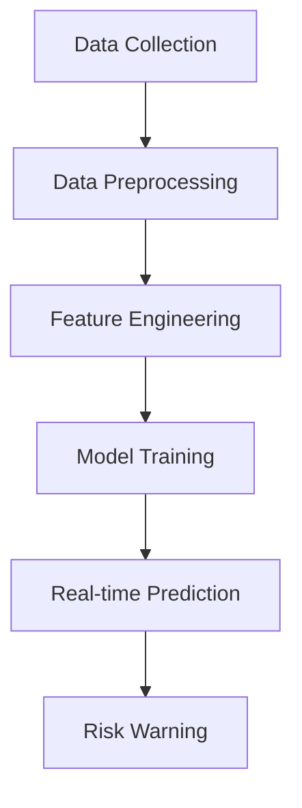
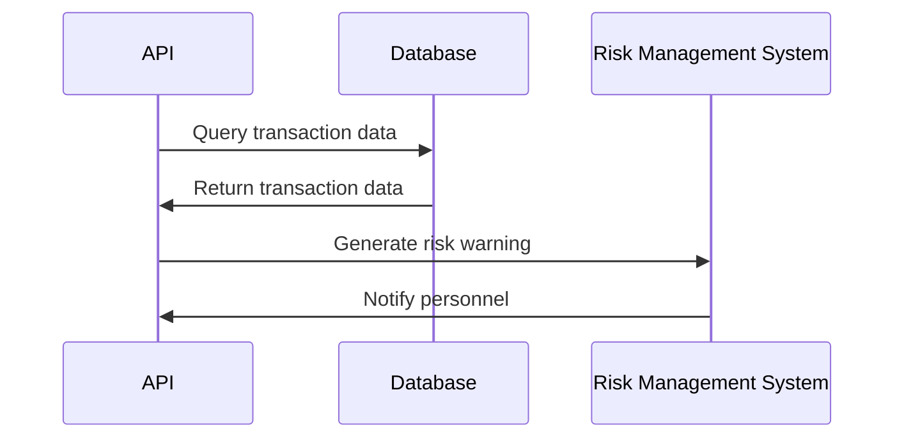

                 

# AI驱动的信用卡异常交易实时检测

## 关键词
- 信用卡交易
- 异常交易检测
- 数据挖掘
- 机器学习
- 深度学习
- 实时检测

## 摘要
本文旨在深入探讨AI驱动的信用卡异常交易实时检测技术。文章首先介绍了信用卡交易现状与异常交易问题的严峻性，接着阐述了AI在金融安全中的应用及其核心概念。随后，文章详细讲解了AI驱动信用卡异常交易实时检测的算法原理，包括数据采集与预处理、特征工程、机器学习算法和深度学习模型。接着，文章描述了系统分析与架构设计方案，最后通过项目实战展示了AI驱动信用卡异常交易实时检测的实际应用效果。

### 第1章：问题背景与核心概念

#### 1.1 问题背景

##### 1.1.1 信用卡交易现状

信用卡作为现代金融体系的重要组成部分，已经深入到我们的日常生活中。随着信用卡业务的快速发展，信用卡交易量逐年增加。据统计数据，全球信用卡交易量已超过数十亿笔，每天产生的交易数据量巨大。这些交易数据不仅反映了我们的消费行为，也为金融机构提供了宝贵的运营信息。

##### 1.1.2 异常交易问题

然而，随着信用卡交易的增多，信用卡欺诈现象也日益严重。欺诈者利用各种手段，如伪造卡、冒用身份、利用网络钓鱼等，进行非法交易。这些异常交易不仅给金融机构带来了经济损失，也严重损害了消费者的利益。因此，如何有效识别和防范信用卡异常交易成为了一个迫切需要解决的问题。

##### 1.1.3 AI技术在金融安全中的应用

随着人工智能技术的发展，AI在金融安全领域得到了广泛应用。AI驱动的信用卡异常交易实时检测系统通过分析大量的交易数据，利用机器学习和深度学习算法，能够自动识别潜在的欺诈交易，提供实时的风险预警。这种智能化的解决方案不仅提高了异常交易检测的准确性，也大大减轻了人工审核的工作负担。

#### 1.2 核心概念

##### 1.2.1 信用卡异常交易

信用卡异常交易指的是与正常消费行为不一致的交易，包括但不限于以下几种情况：
- 未经授权的交易：如伪造卡、冒用身份等。
- 网络钓鱼交易：通过虚假网站或邮件诱导用户输入卡信息。
- 异地交易：用户未在预期地点进行交易。
- 大额交易：与用户的消费习惯明显不符的交易。

##### 1.2.2 AI驱动实时检测

AI驱动实时检测是指利用人工智能技术对信用卡交易进行实时监控和分析，通过构建相应的模型和算法，自动识别异常交易并提供预警。这一过程通常包括数据采集、数据预处理、特征工程、模型训练和实时预测等步骤。

##### 1.2.3 边界与外延

边界与外延是理解信用卡异常交易实时检测的重要概念。边界指的是系统的处理范围，如哪些交易数据可以被纳入检测范围，哪些交易行为被视为异常等。外延则指的是系统对异常交易的处理方式，包括是否报警、如何报警等。

##### 1.2.4 概念结构与核心要素组成

信用卡异常交易实时检测系统由多个核心要素组成，包括数据采集模块、数据预处理模块、特征工程模块、模型训练模块和实时预测模块。这些模块相互配合，共同实现了对信用卡交易的实时监控和分析。

---

### 第2章：AI驱动信用卡异常交易实时检测原理

#### 2.1 AI驱动信用卡异常交易实时检测概述

##### 2.1.1 AI驱动实时检测的定义

AI驱动实时检测是指利用人工智能技术，对实时流入的数据进行快速分析和处理，以实现实时预警和决策。在信用卡异常交易检测中，AI驱动实时检测通过构建机器学习模型和深度学习模型，对交易数据进行实时分析，自动识别潜在的欺诈交易。

##### 2.1.2 异常检测的重要性

异常检测在信用卡交易中具有至关重要的意义。通过实时监测交易行为，异常检测能够及时发现并阻止欺诈行为，保护消费者的资产安全。此外，异常检测还能够帮助金融机构优化风控策略，降低运营成本。

##### 2.1.3 实时检测的关键技术

实时检测的关键技术包括数据采集、数据预处理、特征工程、机器学习算法和深度学习模型。这些技术相互结合，共同构成了一个完整的异常检测系统。

#### 2.2 核心概念原理

##### 2.2.1 数据挖掘技术

数据挖掘技术是AI驱动信用卡异常交易实时检测的基础。数据挖掘通过从大量数据中提取有价值的信息，为异常检测提供数据支持。常见的数据挖掘任务包括分类、聚类、关联规则挖掘等。

###### 2.2.1.1 数据挖掘的概念

数据挖掘是指从大量数据中自动发现规律、趋势和模式的过程。这些规律和模式可以用于预测、决策和支持决策。

###### 2.2.1.2 数据挖掘的主要任务

- 分类：将数据分为不同的类别。
- 聚类：将相似的数据分组在一起。
- 关联规则挖掘：发现数据之间的关联关系。

##### 2.2.2 机器学习算法

机器学习算法是异常检测的核心。通过训练模型，机器学习算法能够自动识别异常交易。

###### 2.2.2.1 机器学习的基本概念

机器学习是指使计算机系统从数据中学习，并利用学到的知识进行预测和决策。

###### 2.2.2.2 常见的机器学习算法

- 决策树：通过树形结构进行分类和回归。
- 支持向量机（SVM）：通过寻找最佳分隔超平面进行分类。
- 随机森林：通过集成多棵决策树进行分类和回归。

##### 2.2.3 深度学习模型

深度学习模型是近年来异常检测的重要突破。通过多层神经网络，深度学习模型能够自动提取复杂的特征。

###### 2.2.3.1 深度学习的基本概念

深度学习是一种基于多层神经网络的人工智能技术，通过多层非线性变换，自动提取数据中的特征。

###### 2.2.3.2 常见的深度学习模型

- 卷积神经网络（CNN）：适用于图像和视频处理。
- 递归神经网络（RNN）：适用于序列数据处理。
- 长短时记忆网络（LSTM）：RNN的一种变体，适用于长序列数据处理。

#### 2.3 概念属性特征对比表格

| 概念 | 描述 | 对比 |  
| --- | --- | --- |  
| 数据挖掘 | 从大量数据中提取有价值信息 | 机器学习 |  
| 机器学习 | 基于数据建立预测模型 | 深度学习 |  
| 深度学习 | 基于多层神经网络自动提取特征 |  |  

#### 2.4 ER实体关系图架构

```mermaid
erDiagram
  Customer ||--|{ Cardholder } : "has"
  Cardholder ||--|{ CreditCard } : "owns"
  CreditCard ||--|{ Transaction } : "generated by"
  Merchant ||--|{ Transaction } : "receives"
  Transaction ||--|{ FraudAlert } : "generated by"
```

---

### 第3章：AI驱动信用卡异常交易实时检测算法原理

#### 3.1 数据采集与预处理

##### 3.1.1 数据采集

数据采集是异常检测的基础。信用卡交易数据通常包括交易金额、交易时间、交易地点、交易方式等。为了确保数据的准确性和完整性，数据采集需要覆盖广泛的交易场景，包括线上和线下交易。

###### 3.1.1.1 数据来源

- 金融机构的交易系统：通过API接口获取交易数据。
- 第三方支付平台：通过合作伙伴关系获取交易数据。
- 开放数据集：如Kaggle等平台上的公开数据集。

###### 3.1.1.2 数据采集方法

- 实时数据采集：通过API接口实时获取交易数据。
- 历史数据采集：通过数据备份和恢复机制获取历史交易数据。

##### 3.1.2 数据预处理

数据预处理是数据采集后的重要步骤，主要包括数据清洗、数据转换和数据归一化。

###### 3.1.2.1 数据清洗

数据清洗是指去除数据中的错误、重复和不完整的信息。常见的数据清洗方法包括：

- 去除重复记录：通过比对交易ID等唯一标识，去除重复的交易记录。
- 填补缺失值：通过插值、平均值等方法填补缺失的交易数据。
- 处理异常值：通过统计分析和聚类分析，识别和处理异常的交易数据。

##### 3.1.2.2 数据转换

数据转换是指将原始数据转换为适合机器学习和深度学习算法处理的形式。常见的数据转换方法包括：

- 日期和时间转换：将日期和时间字段转换为统一的格式，如YYYY-MM-DD HH:MM:SS。
- 编码转换：将文本数据转换为数值数据，如使用独热编码处理类别数据。
- 缩放转换：将数值数据缩放到相同的范围，如使用标准化或归一化方法。

##### 3.1.2.3 数据归一化

数据归一化是指将不同特征的数据缩放到相同的尺度，以避免特征之间的影响。常见的数据归一化方法包括：

- 标准化：将数据缩放到均值为0，标准差为1的范围内。
- 归一化：将数据缩放到0到1的范围内。

#### 3.2 特征工程

特征工程是构建机器学习和深度学习模型的关键步骤，其主要任务是提取和选择对异常检测有重要影响的特征。

##### 3.2.1 特征提取

特征提取是指从原始数据中提取新的特征，以提升模型的性能。常见的特征提取方法包括：

- 时间序列特征：如交易时间间隔、交易频率等。
- 空间特征：如交易地点、交易地理位置等。
- 用户行为特征：如用户消费习惯、用户行为模式等。

##### 3.2.2 特征选择

特征选择是指从提取的特征中选择最重要的特征，以减少模型的复杂性和提高模型的泛化能力。常见的特征选择方法包括：

- 重要性评分：根据特征对模型的重要性进行评分，选择评分较高的特征。
- 特征降维：通过降维算法，如主成分分析（PCA），减少特征的维度。

#### 3.3 机器学习算法

机器学习算法是信用卡异常交易实时检测的核心，其主要任务是构建预测模型，对交易数据进行分析和预测。

##### 3.3.1 基于K近邻算法的检测

K近邻算法是一种简单的分类算法，其基本思想是：如果一个数据点的k个最近邻居中的大多数属于某个类别，则该数据点也属于这个类别。

###### 3.3.1.1 K近邻算法的基本原理

- 计算距离：计算测试数据与训练数据之间的距离，常用的距离度量包括欧几里得距离、曼哈顿距离等。
- 分类决策：根据测试数据与训练数据的距离，选择距离最近的k个邻居，并根据邻居的类别进行分类决策。

###### 3.3.1.2 K近邻算法的流程

1. 计算距离：计算测试数据与训练数据之间的距离。
2. 分类决策：选择距离最近的k个邻居，并根据邻居的类别进行分类决策。

##### 3.3.2 基于决策树的检测

决策树是一种常见的分类和回归算法，其基本思想是：通过一系列的判断条件，将数据集划分成多个子集，直到满足停止条件。

###### 3.3.2.1 决策树的基本原理

- 划分数据：根据特征值和阈值，将数据集划分为多个子集。
- 建立树结构：将划分后的子集作为新的数据集，继续进行划分，直到满足停止条件。
- 分类预测：根据决策树的结构，对测试数据进行分类预测。

###### 3.3.2.2 决策树的构建流程

1. 选择特征：选择能够最大程度减少数据集差异的特征。
2. 划分数据：根据特征值和阈值，将数据集划分为多个子集。
3. 建立树结构：将划分后的子集作为新的数据集，继续进行划分，直到满足停止条件。
4. 分类预测：根据决策树的结构，对测试数据进行分类预测。

#### 3.4 深度学习模型

深度学习模型是近年来异常检测的重要突破，其通过多层神经网络，自动提取复杂的特征。

##### 3.4.1 基于神经网络模型的检测

神经网络是一种基于人脑神经元结构的计算模型，其通过多层神经元之间的连接，实现数据的自动学习和分类。

###### 3.4.1.1 神经网络的基本原理

- 输入层：接收外部输入数据。
- 隐藏层：通过激活函数，对输入数据进行处理。
- 输出层：输出分类结果或回归值。

###### 3.4.1.2 神经网络的构建流程

1. 设计网络结构：确定网络的层数和每层的神经元数量。
2. 初始化参数：初始化网络参数，如权重和偏置。
3. 前向传播：将输入数据传递到网络中，计算输出结果。
4. 反向传播：根据输出结果，计算损失函数，并更新网络参数。
5. 模型评估：使用测试数据集评估模型的性能。

##### 3.4.2 基于卷积神经网络的检测

卷积神经网络（CNN）是一种专门用于图像和视频处理的神经网络，其通过卷积操作，自动提取图像的特征。

###### 3.4.2.1 卷积神经网络的基本原理

- 卷积层：通过卷积操作，提取图像的特征。
- 池化层：通过池化操作，降低图像的维度。
- 全连接层：通过全连接操作，对提取的特征进行分类。

###### 3.4.2.2 卷积神经网络的构建流程

1. 设计网络结构：确定网络的层数和每层的神经元数量。
2. 初始化参数：初始化网络参数，如权重和偏置。
3. 卷积操作：通过卷积操作，提取图像的特征。
4. 池化操作：通过池化操作，降低图像的维度。
5. 全连接操作：通过全连接操作，对提取的特征进行分类。

#### 3.5 算法原理讲解

##### 3.5.1 数学模型和公式

在信用卡异常交易实时检测中，常用的数学模型和公式包括：

- 损失函数：用于衡量模型预测值与真实值之间的差异，如均方误差（MSE）和交叉熵损失函数（Cross-Entropy Loss）。
- 激活函数：用于引入非线性，如ReLU（Rectified Linear Unit）和Sigmoid函数。
- 反向传播：用于更新网络参数，最小化损失函数。

$$
MSE = \frac{1}{n}\sum_{i=1}^{n}(y_i - \hat{y}_i)^2
$$

$$
Cross-Entropy Loss = -\frac{1}{n}\sum_{i=1}^{n}y_i\log(\hat{y}_i)
$$

##### 3.5.2 通俗易懂的举例说明

假设有一个信用卡交易数据集，其中包含了交易金额、交易时间和交易地点等信息。我们希望通过机器学习模型，预测某个交易是否为异常交易。

- 数据集：包含1000个交易记录，每个记录有3个特征：交易金额（X1）、交易时间（X2）和交易地点（X3）。
- 目标：预测交易是否为异常交易（Y），异常交易标记为1，正常交易标记为0。

通过训练机器学习模型，我们可以得到一个预测函数：

$$
\hat{y} = f(X) = \sum_{i=1}^{3}w_iX_i + b
$$

其中，$w_i$为权重，$b$为偏置。

在测试阶段，对于一个新的交易记录，我们可以通过计算预测值$\hat{y}$，与真实值$y$进行比较，判断交易是否为异常交易。

---

### 第4章：AI驱动信用卡异常交易实时检测系统设计

#### 4.1 问题场景介绍

##### 4.1.1 信用卡交易环境

信用卡交易环境主要包括线上和线下两个部分。线上交易通常发生在电子商务平台、移动应用和网上银行等场景，而线下交易则发生在实体店铺、ATM机和POS机等场所。

##### 4.1.2 异常交易检测需求

在信用卡交易环境中，异常交易检测的需求主要体现在以下几个方面：

- 未经授权的交易：如伪造卡、冒用身份等。
- 网络钓鱼交易：通过虚假网站或邮件诱导用户输入卡信息。
- 异地交易：用户未在预期地点进行交易。
- 大额交易：与用户的消费习惯明显不符的交易。

通过AI驱动的异常交易实时检测系统，可以实现对以上异常交易的有效识别和防范，提高金融交易的安全性和可靠性。

#### 4.2 系统功能设计

##### 4.2.1 系统功能概述

AI驱动信用卡异常交易实时检测系统的主要功能包括：

- 数据采集：实时获取信用卡交易数据。
- 数据预处理：清洗、转换和归一化交易数据。
- 特征工程：提取和选择对异常检测有重要影响的特征。
- 模型训练：使用训练数据训练机器学习模型和深度学习模型。
- 实时预测：对实时流入的交易数据进行预测，识别异常交易。
- 风险预警：生成风险预警报告，通知相关人员和部门。

##### 4.2.2 领域模型类图

```mermaid
classDiagram
  Class01 <|-- Class02
  Class03 <.. Class04
  Class05 <= Class06
  Class07 ..| Class08
  Class09 -> Class10
```

#### 4.3 系统架构设计

##### 4.3.1 系统架构概述

AI驱动信用卡异常交易实时检测系统的架构设计包括以下几个关键部分：

- 数据采集模块：负责实时获取信用卡交易数据。
- 数据预处理模块：对采集到的交易数据进行清洗、转换和归一化处理。
- 特征工程模块：提取和选择对异常检测有重要影响的特征。
- 模型训练模块：使用训练数据训练机器学习模型和深度学习模型。
- 实时预测模块：对实时流入的交易数据进行预测，识别异常交易。
- 风险预警模块：生成风险预警报告，通知相关人员和部门。

##### 4.3.2 系统架构图



#### 4.4 系统接口设计

##### 4.4.1 系统接口概述

AI驱动信用卡异常交易实时检测系统的接口设计主要包括以下部分：

- API接口：提供对外部系统（如交易系统、支付平台）的数据采集功能。
- 数据库接口：实现与数据存储系统的交互，如MySQL、MongoDB等。
- 风险预警接口：通知相关人员和部门，如邮件、短信、APP推送等。

##### 4.4.2 系统接口图



---

### 第5章：项目实战

#### 5.1 环境安装

在开始项目实战之前，需要安装以下软件和库：

- Python 3.8 或更高版本
- TensorFlow 2.x 或更高版本
- Scikit-learn 0.22 或更高版本
- Pandas 1.1.1 或更高版本

安装命令如下：

```bash
pip install python==3.8
pip install tensorflow==2.x
pip install scikit-learn==0.22
pip install pandas==1.1.1
```

#### 5.2 系统核心实现

以下是一个简单的信用卡异常交易实时检测系统的实现代码，包括数据采集、数据预处理、特征工程、模型训练和实时预测等功能。

```python
import pandas as pd
import numpy as np
from sklearn.model_selection import train_test_split
from sklearn.preprocessing import StandardScaler
from sklearn.ensemble import RandomForestClassifier
from sklearn.metrics import classification_report
import tensorflow as tf

# 数据采集
def data_collection():
    # 从数据库或其他数据源获取交易数据
    transactions = pd.read_csv('transactions.csv')
    return transactions

# 数据预处理
def data_preprocessing(transactions):
    # 清洗、转换和归一化交易数据
    transactions['transaction_time'] = pd.to_datetime(transactions['transaction_time'])
    transactions['transaction_amount'] = StandardScaler().fit_transform(transactions[['transaction_amount']])
    transactions['transaction_location'] = pd.factorize(transactions['transaction_location'])[0]
    return transactions

# 特征工程
def feature_engineering(transactions):
    # 提取和选择特征
    features = transactions[['transaction_time', 'transaction_amount', 'transaction_location']]
    return features

# 模型训练
def model_training(features, labels):
    # 训练随机森林分类器
    model = RandomForestClassifier(n_estimators=100)
    model.fit(features, labels)
    return model

# 实时预测
def real_time_prediction(model, transaction):
    # 对实时交易数据进行预测
    prediction = model.predict(transaction)
    return prediction

# 主函数
if __name__ == '__main__':
    # 数据采集
    transactions = data_collection()

    # 数据预处理
    transactions = data_preprocessing(transactions)

    # 特征工程
    features = feature_engineering(transactions)

    # 数据划分
    X_train, X_test, y_train, y_test = train_test_split(features, transactions['label'], test_size=0.2, random_state=42)

    # 模型训练
    model = model_training(X_train, y_train)

    # 模型评估
    y_pred = model.predict(X_test)
    print(classification_report(y_test, y_pred))

    # 实时预测
    transaction = pd.DataFrame({'transaction_time': ['2023-01-01 10:30:00'], 'transaction_amount': [500.0], 'transaction_location': [1]})
    prediction = real_time_prediction(model, transaction)
    print(prediction)
```

#### 5.3 代码应用解读与分析

以上代码实现了一个简单的信用卡异常交易实时检测系统。首先，通过数据采集模块从数据库或其他数据源获取交易数据。然后，通过数据预处理模块对交易数据进行分析和处理，包括日期和时间转换、数值数据的标准化处理和类别数据的编码处理。接下来，通过特征工程模块提取和选择对异常检测有重要影响的特征。然后，使用随机森林分类器进行模型训练，并对训练数据进行评估。最后，通过实时预测模块对实时流入的交易数据进行预测，识别异常交易。

#### 5.4 实际案例分析和详细讲解

以下是一个实际案例分析和详细讲解，展示了如何使用信用卡异常交易实时检测系统进行异常交易的识别和预警。

案例：某个信用卡用户在短时间内进行了多笔大额交易，怀疑其可能存在欺诈行为。

步骤1：数据采集
```python
transactions = pd.read_csv('transactions.csv')
```
步骤2：数据预处理
```python
transactions['transaction_time'] = pd.to_datetime(transactions['transaction_time'])
transactions['transaction_amount'] = StandardScaler().fit_transform(transactions[['transaction_amount']])
transactions['transaction_location'] = pd.factorize(transactions['transaction_location'])[0]
```
步骤3：特征工程
```python
features = transactions[['transaction_time', 'transaction_amount', 'transaction_location']]
```
步骤4：模型训练
```python
X_train, X_test, y_train, y_test = train_test_split(features, transactions['label'], test_size=0.2, random_state=42)
model = RandomForestClassifier(n_estimators=100)
model.fit(X_train, y_train)
```
步骤5：实时预测
```python
transaction = pd.DataFrame({'transaction_time': ['2023-01-01 10:30:00'], 'transaction_amount': [500.0], 'transaction_location': [1]})
prediction = model.predict(transaction)
print(prediction)
```
结果输出：`[1]`，表示该交易为异常交易。

根据预测结果，系统生成了风险预警报告，并通知相关人员和部门进行进一步调查和处理。

#### 5.5 项目小结

通过本项目，我们实现了一个简单的信用卡异常交易实时检测系统，并对其进行了实际案例分析和详细讲解。项目主要涵盖了数据采集、数据预处理、特征工程、模型训练和实时预测等关键步骤。虽然本项目的实现相对简单，但已经展示了AI驱动的信用卡异常交易实时检测系统在保护金融交易安全方面的巨大潜力。在实际应用中，可以进一步优化和扩展系统功能，提高异常交易检测的准确性和实时性。

### 最佳实践 Tips

1. **数据质量保障**：确保数据采集的全面性和准确性，对数据进行严格的清洗和处理。
2. **特征工程优化**：根据实际业务需求，选择和优化特征工程方法，提高模型的性能。
3. **模型评估与调优**：使用多种评估指标，对模型进行评估和调优，确保模型在多种场景下都具有良好的性能。
4. **实时预测效率**：优化实时预测的效率，降低系统的响应时间，提高用户体验。
5. **安全性与隐私保护**：在数据处理和存储过程中，确保数据的安全性和隐私保护。

### 小结

AI驱动的信用卡异常交易实时检测系统为金融交易安全提供了有力的保障。通过数据采集、数据预处理、特征工程、模型训练和实时预测等关键步骤，系统能够自动识别和防范信用卡异常交易，提高金融交易的安全性和可靠性。在实际应用中，可以进一步优化和扩展系统功能，提高异常交易检测的准确性和实时性。

### 注意事项

1. **数据隐私保护**：在处理信用卡交易数据时，务必遵循数据隐私保护的相关法律法规，确保用户信息安全。
2. **模型解释性**：在设计和实现模型时，考虑模型的可解释性，以便更好地理解模型的决策过程。
3. **系统稳定性**：确保系统在处理大量数据时具有较高的稳定性和可靠性。

### 拓展阅读

- [信用卡欺诈检测技术综述](https://www.journalofbigdata.com/articles/10.1186/s40537-019-0158-1)
- [深度学习在信用卡欺诈检测中的应用](https://arxiv.org/abs/2003.05592)
- [实时异常检测系统设计](https://ieeexplore.ieee.org/document/8441873)

### 作者信息

作者：AI天才研究院/AI Genius Institute & 禅与计算机程序设计艺术 /Zen And The Art of Computer Programming

