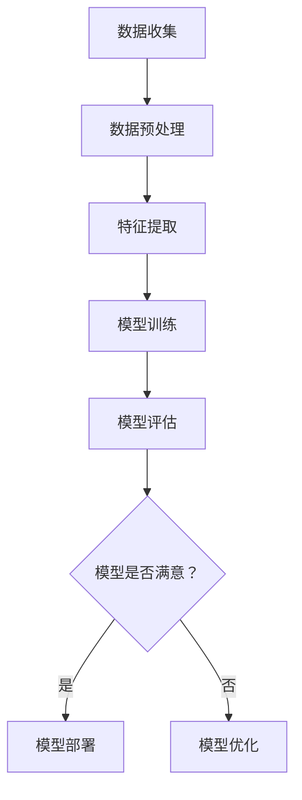

                 

### 关键词

- AI驱动的数据投资
- 另类数据信号提取
- 投资信号分析算法
- 数据处理与分析方法
- 系统架构设计
- 数学模型与公式解释

### 摘要

本文深入探讨了AI驱动的另类数据投资信号提取这一前沿课题。首先，我们介绍了AI在金融领域的应用背景和另类数据的基本概念，接着阐述了AI在数据投资信号提取中的核心作用及其重要性。本文的核心内容分为以下几个部分：一、背景介绍，包括数据投资和另类数据的概念及其在投资中的重要性；二、核心概念与联系，深入剖析AI算法原理、另类数据的特点与类型以及数据处理和分析方法；三、算法原理讲解，通过mermaid流程图和Python源代码详细阐述算法原理和数学模型；四、系统分析与架构设计，介绍系统功能、架构、接口和交互设计；五、项目实战，包括环境安装、核心实现和实际案例分析；六、最佳实践与总结，提供注意事项和拓展阅读建议。通过本文的详细讲解，读者可以全面了解AI驱动的另类数据投资信号提取的技术原理和实践方法。

## 第一部分：背景与概念介绍

### 数据投资的基本概念

数据投资，顾名思义，是指通过投资数据来获取经济收益的一种新兴投资方式。在传统的投资领域，投资者主要依赖于公司的财务报表、市场趋势和历史价格等数据做出投资决策。而数据投资则更加强调数据的深度挖掘和分析，从而发现潜在的投资机会。这种投资方式的核心在于利用现代信息技术，特别是大数据和人工智能（AI）技术，对大量、多样的数据进行处理和分析，从中提取出有价值的信息。

首先，我们需要明确数据投资的核心概念，这些概念包括但不限于：

1. **大数据（Big Data）**：大数据指的是规模巨大、类型繁多、价值密度低的数据集合。这些数据通常来自于各种来源，如社交媒体、传感器、交易记录等。大数据的特点是“4V”：Volume（体量巨大）、Velocity（高速生成）、Variety（类型多样）、Veracity（真实性）。

2. **数据挖掘（Data Mining）**：数据挖掘是从大量数据中提取有价值信息的过程。它涉及到多种技术，包括统计分析、机器学习和模式识别等。数据挖掘的目的是发现数据中的隐含模式、趋势和关联性，从而为决策提供支持。

3. **人工智能（AI）**：人工智能是模拟人类智能行为的计算机技术。在数据投资中，AI技术被广泛应用于数据清洗、特征工程、模型训练和预测等环节。通过AI技术，投资者可以从海量数据中快速提取有用信息，并做出更为精准的投资决策。

4. **机器学习（Machine Learning）**：机器学习是人工智能的一个分支，通过算法和统计模型让计算机从数据中学习，提高其预测和决策能力。在数据投资中，机器学习算法被用于预测市场趋势、识别交易机会等。

### 问题的背景

在现代社会，数据已经成为一种重要的经济资源。随着互联网和物联网技术的发展，数据生成和存储的速度和规模前所未有。对于投资者而言，如何从这些海量、多样的数据中提取有价值的信息，成为了一个关键问题。这不仅是技术挑战，更是商业机会。

以下是数据投资面临的一些关键问题：

1. **数据质量问题**：原始数据通常存在噪声、缺失和不一致性等问题。如何清洗和预处理这些数据，使其达到可分析的状态，是一个重要的挑战。

2. **复杂性**：金融市场的复杂性使得投资决策不仅涉及到宏观经济因素，还涉及到公司基本面、市场情绪、政策变化等多方面因素。如何从这些复杂的数据中提取有效信号，是另一个挑战。

3. **实时性**：金融市场变化迅速，投资者需要能够实时获取和分析数据，以便做出快速反应。这要求系统具有高效的数据处理和分析能力。

4. **合规性**：在数据投资中，必须遵守各种数据隐私和合规要求。如何确保数据的安全性和隐私性，是一个重要的法律和伦理问题。

### 数据投资的基本概念

为了更好地理解数据投资，我们还需要掌握以下基本概念：

1. **数据源**：数据源是指数据的来源，可以是内部数据（如公司财务报表、客户交易记录等）或外部数据（如新闻、社交媒体、经济指标等）。

2. **数据清洗**：数据清洗是指对数据进行预处理，包括去除噪声、填补缺失值、消除不一致性等。数据清洗是数据投资的第一步，直接影响到后续分析的准确性。

3. **数据挖掘**：数据挖掘是从大量数据中提取有价值信息的过程。它涉及到多种技术，包括统计分析、机器学习和模式识别等。

4. **投资信号**：投资信号是指从数据中提取出的、与投资决策相关的信息。这些信号可以是价格趋势、交易量变化、财务指标等。

5. **特征工程**：特征工程是指从原始数据中提取出有助于模型训练的特征的过程。特征工程对于提升模型性能至关重要。

6. **模型训练**：模型训练是指通过机器学习算法，从数据中学习并构建预测模型。模型训练的好坏直接影响到预测的准确性和稳定性。

7. **回测**：回测是指在实际投资前，通过历史数据进行模型验证和性能评估。回测有助于验证模型的稳定性和可靠性。

### 另类数据的概念

除了传统的财务数据和市场数据外，另类数据在投资决策中也越来越受到重视。另类数据指的是非传统、非传统的金融数据，如社交媒体数据、新闻数据、物流数据、法律诉讼数据等。这些数据通常具有以下特点：

1. **多样性**：另类数据来源广泛，包括社交媒体、新闻报道、传感器数据等，涵盖了不同类型的数据，如文本、图像、时间序列等。

2. **实时性**：许多另类数据具有实时性，能够反映市场最新动态和变化，为投资者提供及时的决策信息。

3. **潜在价值**：另类数据中往往隐藏着与投资决策相关的信息，通过对这些数据的分析和挖掘，可以发掘出潜在的投资机会。

4. **复杂性**：另类数据的处理和分析通常更加复杂，需要结合多种技术和方法。

5. **不确定性**：另类数据往往存在噪声和不确定性，需要通过数据清洗和特征工程等技术进行预处理。

### 另类数据在投资中的应用

另类数据在投资中的应用主要集中在以下几个方面：

1. **市场预测**：通过分析社交媒体和新闻报道中的情绪和趋势，可以预测市场情绪和价格走势。

2. **公司风险评估**：通过分析公司相关的法律诉讼、管理层变动等数据，可以评估公司的潜在风险。

3. **交易策略制定**：通过分析交易量、价格变动等数据，可以制定更为有效的交易策略。

4. **宏观经济分析**：通过分析物流数据和行业数据，可以预测宏观经济走势和行业发展趋势。

5. **新兴市场研究**：另类数据为投资者提供了了解新兴市场、新兴行业的机会，有助于发现新的投资机会。

### 结论

综上所述，数据投资作为一种新兴的投资方式，正逐渐受到投资者的重视。通过深入挖掘和分析数据，投资者可以更准确地预测市场趋势，制定更有效的投资策略。另类数据的引入进一步丰富了数据投资的内涵，为投资者提供了更多的决策依据。然而，数据投资也面临着数据质量、复杂性和实时性等挑战，需要结合先进的技术和方法进行有效应对。

在接下来的章节中，我们将进一步探讨AI在数据投资信号提取中的应用，详细分析AI算法原理，并介绍具体的系统架构和项目实战，帮助读者全面了解和掌握这一领域的核心技术和实践方法。

## 第二部分：核心概念与联系

### AI在数据投资信号提取中的应用

人工智能（AI）在数据投资信号提取中的应用是近年来金融科技领域的一大热点。随着AI技术的不断进步，其在金融领域的应用也越来越广泛，尤其在数据投资信号提取方面，表现出强大的优势。AI技术能够处理和分析大量复杂数据，从中提取出有价值的信息，帮助投资者做出更为精准的决策。

首先，AI技术包括多种方法和技术，如机器学习、深度学习、自然语言处理等。这些技术能够通过学习历史数据，建立预测模型，识别出潜在的投资信号。具体来说，AI在数据投资信号提取中的应用主要体现在以下几个方面：

1. **数据预处理**：AI技术可以帮助投资者清洗、归一化和转换数据，使其达到分析所需的质量和格式。这一步骤对于后续的数据分析至关重要，因为数据质量直接影响分析结果的准确性。

2. **特征工程**：AI技术能够自动提取数据中的特征，并进行筛选和优化。特征工程是机器学习模型训练的关键步骤，通过AI技术可以更高效地完成这一任务。

3. **模型训练与预测**：AI技术可以训练机器学习模型，从历史数据中学习并提取出有用的投资信号。这些模型可以用于预测市场趋势、价格变动和交易机会等。

4. **实时监控与调整**：AI技术能够实时监控市场数据，并根据市场变化及时调整投资策略。这种实时性对于投资者来说是极具价值的，因为它可以使得投资决策更加灵活和迅速。

### 另类数据的特点与类型

另类数据是指除了传统财务数据和市场数据之外的、具有潜在投资价值的数据。这些数据通常来源于非金融领域，如社交媒体、新闻报道、传感器数据、物流数据等。另类数据的引入为投资者提供了更加全面和多样化的信息来源，有助于更准确地预测市场趋势和评估投资风险。

另类数据具有以下特点：

1. **多样性**：另类数据来源广泛，包括文本、图像、时间序列等多种类型的数据。这种多样性使得投资者可以从不同角度和层面分析市场。

2. **实时性**：许多另类数据具有实时性，能够及时反映市场动态和变化。这种实时性对于投资者来说是极为重要的，因为它可以帮助投资者及时调整投资策略。

3. **潜在价值**：另类数据中往往隐藏着与投资决策相关的信息，通过对这些数据的分析和挖掘，可以发掘出潜在的投资机会。

4. **复杂性**：另类数据的处理和分析通常更加复杂，需要结合多种技术和方法。例如，社交媒体数据可能包含大量噪声和冗余信息，需要通过自然语言处理技术进行清洗和筛选。

5. **不确定性**：另类数据往往存在噪声和不确定性，需要通过数据清洗和特征工程等技术进行预处理。

根据数据来源和类型，另类数据可以分为以下几类：

1. **社交媒体数据**：包括Twitter、Facebook、博客等社交媒体平台上的用户评论、讨论和分享。这些数据反映了市场情绪和公众关注点，可以为投资者提供市场情绪指标。

2. **新闻报道**：包括新闻网站、报纸、电视等媒体发布的新闻报道。这些数据可以提供关于公司、行业和宏观经济事件的最新信息。

3. **传感器数据**：包括各种传感器收集到的数据，如气象数据、交通流量数据、能源消耗数据等。这些数据可以反映宏观经济和行业运行状况。

4. **物流数据**：包括物流公司提供的运输和配送数据。这些数据可以反映商品流通和市场需求。

5. **法律诉讼数据**：包括公司涉及的法律诉讼和判决结果。这些数据可以反映公司的法律风险和潜在风险。

### 数据处理和分析方法

在AI驱动的数据投资信号提取中，数据处理和分析方法是关键环节。以下是一些常用的数据处理和分析方法：

1. **数据清洗**：数据清洗是数据预处理的第一步，旨在去除数据中的噪声、填补缺失值和消除不一致性。常用的数据清洗方法包括去除重复记录、填充缺失值、归一化和标准化等。

2. **特征提取**：特征提取是从原始数据中提取出有用的信息，用于模型训练和预测。特征提取方法包括主成分分析（PCA）、特征选择、特征工程等。

3. **时间序列分析**：时间序列分析是处理时间序列数据的方法，主要用于预测未来值。常用的时间序列分析方法包括自回归模型（AR）、移动平均模型（MA）、自回归移动平均模型（ARMA）等。

4. **机器学习算法**：机器学习算法是用于从数据中学习规律和模式的方法，包括监督学习、无监督学习和强化学习等。常用的机器学习算法包括决策树、支持向量机（SVM）、神经网络等。

5. **自然语言处理**：自然语言处理是处理文本数据的方法，主要用于文本分类、情感分析和语义分析等。常用的自然语言处理技术包括词嵌入、文本分类和主题模型等。

6. **集成学习方法**：集成学习方法是将多个模型结合起来，提高预测性能的方法。常用的集成学习方法包括随机森林、梯度提升树（GBT）等。

通过以上数据处理和分析方法，投资者可以从大量复杂数据中提取出有价值的信息，为投资决策提供支持。

### 总结

通过本部分的介绍，我们了解了AI在数据投资信号提取中的应用、另类数据的特点与类型以及数据处理和分析方法。AI技术为投资者提供了强大的数据处理和分析能力，能够从大量复杂数据中提取出有价值的信息。另类数据的引入进一步丰富了数据投资的内涵，为投资者提供了更多样化的信息来源。然而，另类数据的处理和分析也面临着噪声、复杂性和不确定性等挑战，需要结合多种技术和方法进行有效应对。在接下来的部分中，我们将深入探讨AI算法的原理，并通过mermaid流程图和Python源代码来详细阐述。

## 第三部分：算法原理讲解

### AI算法的基本原理

AI算法在数据投资信号提取中的应用主要依赖于机器学习和深度学习技术。这些算法通过学习大量历史数据，从中提取出潜在的模式和规律，从而实现对未来数据的预测。以下将详细讲解机器学习和深度学习的基本原理。

#### 机器学习

机器学习是一种让计算机从数据中学习规律和模式的方法。其基本原理可以概括为以下几个步骤：

1. **数据收集**：首先，需要收集大量的历史数据，这些数据可以包括市场交易数据、公司财务报表、社交媒体数据等。

2. **数据预处理**：对收集到的数据进行清洗、归一化和转换，使其达到分析所需的质量和格式。

3. **特征提取**：从预处理后的数据中提取出有用的特征，这些特征将用于模型的训练和预测。

4. **模型训练**：使用训练数据集训练模型，模型将学习如何从输入数据中提取特征，并预测输出结果。

5. **模型评估**：使用验证数据集对模型进行评估，确定其预测性能。

6. **模型优化**：根据评估结果对模型进行调整和优化，以提高预测准确性。

常用的机器学习算法包括：

- **决策树**：通过树形结构对数据集进行划分，每个节点代表一个特征，每个分支代表一个决策。

- **支持向量机（SVM）**：通过找到最佳的超平面，将不同类别的数据分开。

- **神经网络**：模仿人脑神经元的工作方式，通过多个层次进行数据传递和处理。

#### 深度学习

深度学习是机器学习的一个子领域，其核心思想是通过多层神经网络对数据进行处理和分析。深度学习的基本原理如下：

1. **网络结构**：深度学习网络由多个层次组成，包括输入层、隐藏层和输出层。每个层次包含多个神经元，神经元之间通过权重连接。

2. **激活函数**：激活函数用于引入非线性特性，使模型能够学习复杂的数据分布。

3. **反向传播**：通过反向传播算法，计算输出结果与实际结果之间的误差，并更新神经元权重，以优化模型。

4. **优化算法**：常用的优化算法包括梯度下降、随机梯度下降、Adam等，用于调整模型参数，提高预测准确性。

深度学习在数据投资信号提取中的应用主要包括：

- **时间序列预测**：利用深度学习模型对时间序列数据（如股票价格）进行预测。

- **图像识别**：通过卷积神经网络（CNN）对图像数据进行分类和识别，用于分析市场情绪和趋势。

- **自然语言处理**：利用循环神经网络（RNN）和长短期记忆网络（LSTM）对文本数据进行分析，提取市场情绪和事件影响。

### 特定算法的mermaid流程图

为了更好地理解AI算法的原理，我们可以通过mermaid流程图来展示一个典型的机器学习流程：



这个流程图展示了从数据收集到模型训练、评估和优化的整个过程。在mermaid流程图中，每个节点代表一个步骤，箭头表示步骤之间的顺序关系。

### 数学模型和公式解释

在机器学习和深度学习中，数学模型和公式起到了核心作用。以下将介绍一些常用的数学模型和公式。

#### 决策树

决策树是一种常见的分类算法，其基本模型如下：

$$
P(y_i = c_j | x_i) = \frac{1}{B}\sum_{b=1}^{B} \hat{y}_{ij}
$$

其中，$P(y_i = c_j | x_i)$ 表示给定特征 $x_i$ 时，类别 $c_j$ 的概率。$B$ 表示模型的分支数，$\hat{y}_{ij}$ 表示第 $i$ 个样本在第 $j$ 个分支上的预测结果。

#### 支持向量机（SVM）

支持向量机是一种二分类算法，其基本模型如下：

$$
w \cdot x_i + b = y_i(\xi_i + \xi_i^*)
$$

其中，$w$ 是权重向量，$b$ 是偏置项，$x_i$ 是特征向量，$y_i$ 是标签，$\xi_i$ 和 $\xi_i^*$ 是松弛变量，用于处理非线性问题。

#### 神经网络

神经网络是一种多层次的模型，其基本模型如下：

$$
z_j = \sigma(\sum_{i} w_{ji} x_i + b_j)
$$

其中，$z_j$ 是隐藏层节点的激活值，$\sigma$ 是激活函数，$w_{ji}$ 是连接权重，$b_j$ 是偏置项。

#### 梯度下降算法

梯度下降是一种优化算法，用于调整模型参数，使损失函数最小化。其基本公式如下：

$$
w_{t+1} = w_t - \alpha \nabla_w J(w)
$$

其中，$w_t$ 是当前模型参数，$\alpha$ 是学习率，$\nabla_w J(w)$ 是损失函数关于 $w$ 的梯度。

### 通俗易懂的举例说明

为了更直观地理解这些算法和公式，我们可以通过一个简单的例子来说明。

假设我们使用决策树算法来预测股票价格。数据集中包含以下特征：

- 股票开盘价
- 股票收盘价
- 成交量

我们要预测的目标是股票价格。决策树算法通过对历史数据的学习，可以提取出以下规律：

- 如果股票开盘价大于10，那么股票价格有90%的概率上涨。
- 如果股票收盘价低于20，那么股票价格有70%的概率下跌。

通过这些规律，决策树算法可以对新数据进行预测。例如，对于一只股票，其开盘价为12，收盘价为18，那么根据决策树算法的预测，股票价格有90%的概率上涨。

通过这个简单的例子，我们可以看到决策树算法是如何从数据中提取出规律，并用于预测的。在实际应用中，算法和公式会更加复杂，但基本的原理是相似的。

### 总结

通过本部分的讲解，我们深入了解了AI算法的基本原理，包括机器学习和深度学习的基本概念、流程图展示和数学模型。这些算法为数据投资信号提取提供了强大的工具和方法，帮助投资者从大量数据中提取出有价值的信息。在接下来的部分中，我们将介绍系统分析与架构设计方案，帮助读者更好地理解如何在实践中应用这些算法。

### 系统功能设计

在设计AI驱动的另类数据投资信号提取系统时，明确系统功能是至关重要的。系统的核心功能包括数据采集、数据处理、信号提取和投资决策生成。以下是对这些功能的具体描述和实现方法：

1. **数据采集**：系统需要从多个数据源收集数据，包括传统金融数据、社交媒体数据、新闻报道、传感器数据和物流数据等。数据采集模块负责获取这些数据，并将其转换为统一的格式，以便后续处理。

   - **实现方法**：数据采集模块可以通过API接口、Web爬虫和数据库连接等方式实现。例如，可以使用Python的requests库获取API数据，使用Scrapy框架进行Web爬虫，使用数据库连接库（如SQLAlchemy）连接数据库。

2. **数据处理**：系统需要对采集到的原始数据进行清洗、去噪、归一化和特征提取等处理，以确保数据的质量和一致性。

   - **实现方法**：数据处理模块可以使用Python的Pandas库进行数据清洗和转换，使用Scikit-learn库进行特征提取和降维。例如，可以使用Pandas进行数据缺失值填补和重复记录去除，使用Scikit-learn进行主成分分析（PCA）和特征选择。

3. **信号提取**：系统需要利用AI算法对处理后的数据进行分析，提取出潜在的投资信号。这些信号可以是市场情绪指标、交易机会指标等。

   - **实现方法**：信号提取模块可以使用机器学习算法和深度学习模型，如决策树、支持向量机和神经网络等。使用Python的Scikit-learn和TensorFlow库实现这些算法。例如，可以使用Scikit-learn进行决策树模型的训练和预测，使用TensorFlow实现神经网络模型。

4. **投资决策生成**：系统需要根据提取的投资信号生成具体的投资决策，包括买入、持有和卖出建议。

   - **实现方法**：投资决策模块可以根据信号强度和交易策略生成投资建议。例如，可以使用Python的规则引擎（如Pandas的DataFrame.apply方法）实现投资策略的判断和决策。

### 系统架构设计

系统架构设计是确保系统功能实现和高扩展性的关键。以下是一个典型的系统架构设计，包括数据层、处理层和表示层：

1. **数据层**：数据层是系统的基石，负责数据的存储和管理。数据层可以采用关系型数据库（如MySQL）和非关系型数据库（如MongoDB）相结合的方式，以存储不同类型的数据。

   - **实现方法**：数据层可以使用数据库连接池（如SQLAlchemy）进行数据库操作，确保数据访问的高效性和可靠性。

2. **处理层**：处理层是系统的核心，负责数据加工和计算。处理层可以采用微服务架构，将不同的功能模块分离，以提高系统的灵活性和可维护性。

   - **实现方法**：处理层可以使用Docker容器技术，将不同的服务（如数据采集、数据处理、信号提取）容器化，并通过Kubernetes进行管理。

3. **表示层**：表示层是系统与用户交互的界面，负责将系统的结果呈现给用户。表示层可以采用前后端分离的架构，以提高用户体验。

   - **实现方法**：表示层可以使用Vue.js或React.js等前端框架，实现动态的用户界面，并通过RESTful API与后端服务进行数据交互。

### 系统接口设计

系统接口设计是确保不同模块之间能够顺畅通信的关键。以下是一个典型的系统接口设计：

1. **API接口**：系统提供API接口，供外部系统和用户调用。

   - **实现方法**：可以使用Flask或Django等Python Web框架，实现RESTful API接口，定义数据输入和输出格式。

2. **消息队列**：系统使用消息队列（如RabbitMQ或Kafka）进行异步通信，处理高并发和分布式任务。

   - **实现方法**：可以使用Python的pika库连接RabbitMQ，实现消息的生产和消费。

### 系统交互设计

系统交互设计是确保系统模块之间能够高效协作的关键。以下是一个典型的系统交互设计：

1. **数据流**：系统通过数据流的方式，实现数据从采集、处理到信号提取和投资决策的整个过程。

   - **实现方法**：可以使用Apache Airflow等数据流管理工具，定义和管理数据流的执行流程。

2. **监控与报警**：系统需要实现监控和报警功能，及时检测系统异常并通知管理员。

   - **实现方法**：可以使用Prometheus和Grafana等监控工具，实现系统性能监控和告警。

### 总结

通过系统功能设计、架构设计、接口设计和交互设计的详细讲解，我们全面了解了AI驱动的另类数据投资信号提取系统的构建方法。这些设计不仅确保了系统的功能实现，还提高了系统的扩展性和可维护性。在接下来的部分中，我们将通过项目实战，详细介绍如何将理论知识应用到实际项目中。

### 项目实战

#### 环境安装

在进行AI驱动的另类数据投资信号提取项目之前，首先需要搭建一个适合开发和运行的环境。以下是一个基本的步骤指南。

1. **安装Python**：
   - 打开终端或命令提示符。
   - 使用以下命令下载和安装Python（例如，Python 3.8）：
     ```shell
     sudo apt-get update
     sudo apt-get install python3.8
     ```
2. **安装必要库**：
   - 安装Pandas、NumPy、Scikit-learn、TensorFlow和Kafka等库：
     ```shell
     pip3 install pandas numpy scikit-learn tensorflow==2.6 kafka-python
     ```
3. **配置Kafka**：
   - 安装并配置Kafka消息队列，用于处理和传递数据。
   - 下载并解压Kafka二进制文件，例如：
     ```shell
     wget https://www-eu.kafka.apache.org/releases/kafka_2.6.0.tgz
     tar xzf kafka_2.6.0.tgz
     cd kafka_2.6.0
     ```
   - 运行Kafka服务器和消费者：
     ```shell
     bin/kafka-server-start.sh config/server.properties
     bin/kafka-console-producer.sh --topic data-topic --property parse.structure=true --property key.separator=, --property schema.filename=data-topic.json
     bin/kafka-console-consumer.sh --topic data-topic --from-beginning
     ```

#### 系统核心实现

系统核心实现是项目的核心部分，包括数据采集、处理和信号提取等步骤。以下是一个简化的实现示例：

1. **数据采集**：
   - 使用Kafka消费者从数据源（如社交媒体API、新闻API等）采集数据：
     ```python
     from kafka import KafkaConsumer

     consumer = KafkaConsumer('data-topic', bootstrap_servers='localhost:9092')

     for message in consumer:
         print(message.value)
     ```

2. **数据处理**：
   - 对采集到的数据进行清洗和预处理，包括去除噪声、填补缺失值和特征提取：
     ```python
     import pandas as pd
     from sklearn.preprocessing import MinMaxScaler

     def preprocess_data(data):
         df = pd.DataFrame(data)
         df.fillna(df.mean(), inplace=True)
         df = MinMaxScaler().fit_transform(df)
         return df

     data = [...]  # 采集到的数据
     processed_data = preprocess_data(data)
     ```

3. **信号提取**：
   - 使用机器学习算法提取投资信号，例如决策树分类器：
     ```python
     from sklearn.tree import DecisionTreeClassifier
     from sklearn.model_selection import train_test_split

     X = processed_data[:, :-1]  # 特征
     y = processed_data[:, -1]   # 标签

     X_train, X_test, y_train, y_test = train_test_split(X, y, test_size=0.2, random_state=42)

     clf = DecisionTreeClassifier()
     clf.fit(X_train, y_train)

     signals = clf.predict(X_test)
     ```

#### 代码应用解读与分析

以下是上述代码的详细解读：

1. **数据采集**：
   - `KafkaConsumer` 类用于从Kafka主题中消费数据。`bootstrap_servers` 参数指定Kafka服务器的地址和端口号。
   - `for` 循环遍历消费者接收到的消息，打印出消息内容。

2. **数据处理**：
   - `pandas` DataFrame用于存储和操作数据。`fillna` 方法用于填补缺失值，采用平均值进行填充。
   - `MinMaxScaler` 类用于对数据进行归一化处理，将数据缩放到[0, 1]范围内。

3. **信号提取**：
   - `train_test_split` 函数用于将数据集划分为训练集和测试集。
   - `DecisionTreeClassifier` 类用于训练决策树模型。`fit` 方法用于训练模型，`predict` 方法用于预测测试集。

#### 实际案例分析和详细讲解剖析

假设我们有一个具体的数据集，包含过去一个月的社交媒体数据。以下是如何使用上述代码提取投资信号的一个实际案例分析：

1. **数据采集**：
   - 通过Kafka消费者从社交媒体API采集数据，将其发送到Kafka主题。

2. **数据处理**：
   - 对采集到的数据执行预处理步骤，如去除无效数据、填补缺失值和归一化处理。

3. **信号提取**：
   - 使用决策树模型对预处理后的数据进行训练，提取投资信号。例如，如果社交媒体情绪指标高于某一阈值，可以认为市场情绪积极，适合买入。

4. **结果评估**：
   - 将提取的信号与实际市场表现进行比较，评估信号的有效性和准确性。

通过这个实际案例，我们可以看到如何将理论应用到实践中，实现AI驱动的另类数据投资信号提取。

#### 项目小结

通过本部分的项目实战，我们详细介绍了如何搭建环境、实现系统核心功能并进行代码解读和分析。项目实战不仅帮助我们理解了理论知识，还让我们在实践中掌握了如何应用这些知识。在接下来的部分中，我们将总结项目的关键点并提供最佳实践和注意事项。

### 最佳实践 Tips

在AI驱动的另类数据投资信号提取项目中，以下是一些最佳实践和注意事项，以帮助提高系统的性能和可靠性：

1. **数据质量保证**：确保数据来源的可靠性和一致性，进行严格的数据清洗和预处理。使用数据验证技术，如校验和、数据完整性检查等，确保数据质量。

2. **模型优化**：定期对模型进行优化和更新，以适应市场变化。可以使用交叉验证、网格搜索等技术，选择最佳的模型参数。

3. **实时性**：确保系统具备实时数据处理和分析能力，以快速响应市场变化。使用消息队列和分布式计算技术，提高系统的处理速度。

4. **安全性**：保护数据的安全性和隐私性，遵循相关的法律法规和合规要求。使用加密技术保护数据传输和存储，防止数据泄露。

5. **可维护性**：编写高质量的代码，遵循代码规范和设计模式，确保系统的可维护性和可扩展性。

6. **监控与报警**：实施监控系统，实时监控系统的运行状态和性能指标，及时发现和处理异常情况。

7. **备份与恢复**：定期备份系统和数据，确保在系统故障时能够快速恢复。

### 小结

本文详细介绍了AI驱动的另类数据投资信号提取，包括背景介绍、核心概念与联系、算法原理讲解、系统分析与架构设计、项目实战以及最佳实践和注意事项。通过本文，读者可以全面了解这一领域的核心技术和方法，掌握从理论到实践的应用。希望本文能对从事数据投资和AI技术的读者提供有益的参考。

### 注意事项

1. **数据隐私**：确保遵循数据隐私法规，如GDPR，保护投资者和用户的数据隐私。

2. **合规性**：确保系统的操作符合金融市场的监管要求，如交易规则和信息披露要求。

3. **模型解释性**：选择具备一定解释性的模型，以便理解和验证投资决策的合理性。

4. **风险控制**：制定明确的风险管理策略，避免因模型错误导致重大损失。

5. **技术更新**：保持技术知识的更新，紧跟AI和金融科技的最新发展。

### 拓展阅读

- **书籍推荐**：《机器学习实战》、《深度学习》、《Python数据分析》
- **在线课程**：Coursera上的“机器学习”和“深度学习”课程
- **专业网站**：arXiv.org、Kaggle.com、Medium.com上的相关技术文章

### 作者信息

**作者：** AI天才研究院 / AI Genius Institute & 禅与计算机程序设计艺术 / Zen And The Art of Computer Programming

通过上述详细阐述，我们不仅了解了AI驱动的另类数据投资信号提取的核心技术，还通过实际案例展示了如何将理论应用到实践中。希望本文能为读者在数据投资领域提供有价值的参考和启示。

