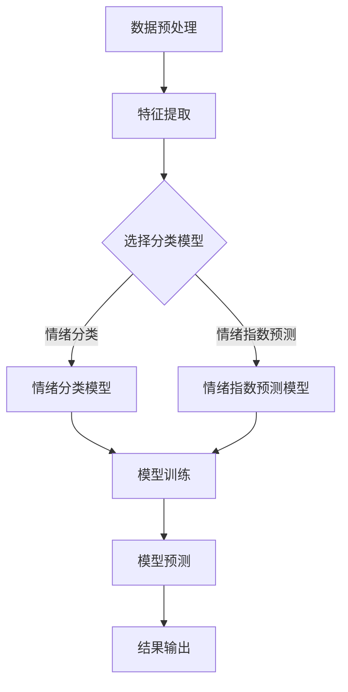
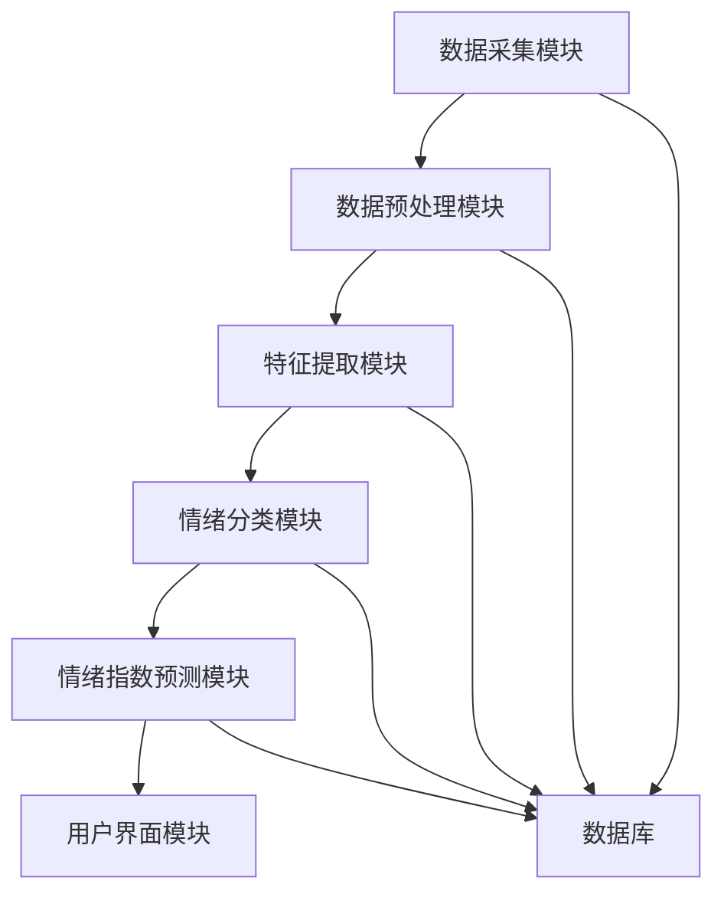

                 


### 文章标题：AI驱动的投资者情绪指数预测系统

关键词：投资者情绪指数、人工智能、机器学习、自然语言处理、深度学习

摘要：本文旨在探讨如何利用人工智能技术，特别是机器学习和深度学习，构建投资者情绪指数预测系统。文章将详细介绍系统的背景、核心概念、算法原理、数学模型、系统架构设计方案、项目实战以及最佳实践 tips，帮助投资者更好地理解和预测市场情绪。

---

### 引言

在金融市场中，投资者情绪指数（Investor Sentiment Index，ISI）是一个关键的指标，它反映了市场参与者对市场走势的情绪。这种情绪可以影响市场的波动，因此，准确地预测投资者情绪对于投资者制定交易策略至关重要。随着人工智能技术的发展，利用机器学习算法处理大量非结构化数据，提取情绪特征，已成为预测投资者情绪的强大工具。

本文将分为以下几个部分：

1. **背景介绍**：介绍投资者情绪指数的定义、重要性以及现有分析方法。
2. **核心概念与联系**：讨论人工智能、投资者情绪指数、数据预处理、特征工程等核心概念。
3. **算法原理讲解**：详细解释情绪分类模型和情绪指数预测模型的算法原理，包括数据预处理、特征提取、模型训练和预测等步骤。
4. **数学模型和数学公式**：介绍投资者情绪指数的计算方法，情绪分类模型的数学模型，情绪指数预测模型的数学模型。
5. **系统分析与架构设计方案**：介绍系统需求分析、系统架构设计、系统接口设计和系统交互。
6. **项目实战**：介绍项目环境安装、系统核心实现源代码、代码应用解读与分析、实际案例分析与详细讲解。
7. **最佳实践 tips**、**小结**、**注意事项**、**拓展阅读**等内容。

---

### 背景介绍

#### 1.1.1 投资者情绪指数的重要性

投资者情绪指数是一种衡量市场参与者情绪的指标，它通过综合分析各种市场数据，如交易量、价格波动、媒体报道等，来反映市场情绪的总体趋势。这种情绪可以转化为对市场走势的预期，进而影响投资决策。

投资者情绪指数的重要性体现在以下几个方面：

1. **市场预测**：通过分析投资者情绪指数，可以预测市场的短期和长期走势。当投资者情绪指数处于较高水平时，可能预示着市场上涨；反之，则可能预示着市场下跌。

2. **风险控制**：投资者情绪指数可以帮助投资者识别市场风险。当市场情绪过度乐观或过度悲观时，可能存在风险。通过监控投资者情绪指数，投资者可以及时调整投资策略，降低风险。

3. **投资决策**：投资者情绪指数为投资者提供了重要的市场信息，有助于其制定投资策略。例如，当市场情绪偏向乐观时，投资者可能会增加股票等风险资产的配置；当市场情绪偏向悲观时，投资者可能会增加债券等低风险资产的配置。

#### 1.1.2 人工智能在投资者情绪分析中的应用

传统投资者情绪分析主要依赖于人工阅读和分析大量文本数据，如新闻报道、社交媒体帖子、分析师报告等。这种方法存在以下问题：

1. **效率低**：人工分析需要大量时间和精力，且容易受到主观因素的影响。

2. **准确性差**：人工分析难以处理大量非结构化数据，且难以保证分析的一致性和准确性。

随着人工智能技术的发展，特别是机器学习和深度学习，这些方法在投资者情绪分析中得到了广泛应用。具体来说，人工智能在投资者情绪分析中的应用主要体现在以下几个方面：

1. **文本情感分析**：利用自然语言处理技术，对文本数据进行情感分析，提取出与投资者情绪相关的特征。

2. **数据预处理**：使用机器学习算法，对大量非结构化数据进行预处理，如文本清洗、分词、词性标注等。

3. **特征提取**：利用深度学习算法，从预处理后的数据中提取出有效的情绪特征。

4. **模型训练与预测**：使用机器学习算法，构建情绪分类模型和情绪指数预测模型，对投资者情绪进行分类和预测。

#### 1.1.3 本书的目的和结构

本书的目的是介绍如何利用人工智能技术，特别是机器学习和深度学习，构建投资者情绪指数预测系统。本书将分为以下几个部分：

1. **背景介绍**：介绍投资者情绪指数的定义、重要性以及现有分析方法。

2. **核心概念与联系**：讨论人工智能、投资者情绪指数、数据预处理、特征工程等核心概念。

3. **算法原理讲解**：详细解释情绪分类模型和情绪指数预测模型的算法原理，包括数据预处理、特征提取、模型训练和预测等步骤。

4. **数学模型和数学公式**：介绍投资者情绪指数的计算方法，情绪分类模型的数学模型，情绪指数预测模型的数学模型。

5. **系统分析与架构设计方案**：介绍系统需求分析、系统架构设计、系统接口设计和系统交互。

6. **项目实战**：介绍项目环境安装、系统核心实现源代码、代码应用解读与分析、实际案例分析与详细讲解。

7. **最佳实践 tips**、**小结**、**注意事项**、**拓展阅读**等内容。

---

### 核心概念与联系

在本节中，我们将讨论与AI驱动的投资者情绪指数预测系统相关的一些核心概念，包括人工智能、投资者情绪指数、数据预处理、特征工程等。

#### 1.2.1 人工智能

人工智能（Artificial Intelligence，AI）是计算机科学的一个分支，旨在使计算机系统具备智能行为，模仿人类的感知、推理、学习和决策能力。在AI驱动的投资者情绪指数预测系统中，人工智能技术主要应用于以下几个方面：

1. **数据预处理**：通过清洗、归一化和去噪等技术，对原始数据进行预处理，以提高数据质量和模型性能。
2. **特征提取**：从原始数据中提取出与投资者情绪相关的特征，如文本情感、价格波动、交易量等。
3. **模型训练**：使用机器学习算法，如神经网络、支持向量机等，对提取出的特征进行训练，构建情绪分类模型和情绪指数预测模型。
4. **预测**：利用训练好的模型，对未来的投资者情绪进行预测，为投资者提供决策依据。

#### 1.2.2 投资者情绪指数

投资者情绪指数（Investor Sentiment Index，ISI）是一个衡量投资者群体情绪的指标，通常通过综合分析市场数据（如交易量、价格波动、媒体报道等）来计算得出。投资者情绪指数可以反映市场参与者的情绪状态，从而影响市场的走势。

投资者情绪指数的计算通常涉及以下步骤：

1. **数据收集**：收集与投资者情绪相关的各种数据，如新闻报道、社交媒体帖子、交易数据等。
2. **情感分析**：使用自然语言处理技术，对收集到的文本数据进行分析，提取出与情绪相关的特征。
3. **指数计算**：根据提取出的情绪特征，计算投资者情绪指数。常见的计算方法包括平均法、加权平均法等。

#### 1.2.3 数据预处理

数据预处理是AI驱动的投资者情绪指数预测系统中的关键步骤，其目的是提高数据质量和模型性能。数据预处理包括以下任务：

1. **数据清洗**：去除重复数据、缺失数据和异常值，确保数据的一致性和准确性。
2. **归一化**：将不同特征的数据归一化到相同的范围，以避免特征之间的量级差异对模型的影响。
3. **去噪**：去除噪声数据，如错误标注的数据，以提高模型的鲁棒性。

#### 1.2.4 特征工程

特征工程是AI驱动的投资者情绪指数预测系统中的另一个关键步骤，其目的是从原始数据中提取出对模型有用的特征。特征工程包括以下任务：

1. **特征提取**：从原始数据中提取出与投资者情绪相关的特征，如文本情感、价格波动、交易量等。
2. **特征选择**：选择对模型性能有显著影响的特征，去除冗余特征，以提高模型的效率和准确性。
3. **特征变换**：对特征进行变换，如归一化、标准化等，以适应模型的输入要求。

#### 1.2.5 情绪分类模型和情绪指数预测模型

情绪分类模型和情绪指数预测模型是AI驱动的投资者情绪指数预测系统中的核心组件。情绪分类模型用于分类投资者情绪，如乐观、悲观等；情绪指数预测模型则用于预测投资者情绪指数的数值。

情绪分类模型和情绪指数预测模型通常采用以下方法：

1. **监督学习**：使用带有标签的数据集，训练情绪分类模型和情绪指数预测模型。
2. **无监督学习**：在没有标签数据的情况下，使用聚类等方法训练模型。
3. **深度学习**：使用深度神经网络，如卷积神经网络（CNN）、循环神经网络（RNN）等，训练情绪分类模型和情绪指数预测模型。

#### 1.2.6 概念属性特征对比表格

为了更清晰地展示与AI驱动的投资者情绪指数预测系统相关的核心概念，我们提供了一个概念属性特征对比表格：

| 概念         | 属性特征                                                         |
| ------------ | ------------------------------------------------------------ |
| 人工智能     | 模拟人类智能、数据预处理、特征提取、模型训练与预测             |
| 投资者情绪指数 | 衡量投资者情绪、数据收集、情感分析、指数计算                   |
| 数据预处理   | 数据清洗、归一化、去噪                                       |
| 特征工程     | 特征提取、特征选择、特征变换                                 |
| 情绪分类模型 | 分类投资者情绪、监督学习、无监督学习、深度学习               |
| 情绪指数预测模型 | 预测投资者情绪指数、监督学习、无监督学习、深度学习           |

#### 1.2.7 ER实体关系图架构

为了更直观地展示与AI驱动的投资者情绪指数预测系统相关的实体和关系，我们使用Mermaid绘制了一个ER实体关系图：

```mermaid
erDiagram
    Investor(SentimentIndex, TextData) <<--o TextData
    TextData ||--o NewsReport
    TextData ||--o SocialMediaPost
    TextData ||--o AnalystReport
    Investor ||--o EmotionClassifier
    Investor ||--o EmotionIndexPredictor
```

在这个ER实体关系图中，投资者（Investor）是核心实体，它与文本数据（TextData）、情绪分类器（EmotionClassifier）和情绪指数预测器（EmotionIndexPredictor）之间存在关系。文本数据包括新闻报道（NewsReport）、社交媒体帖子（SocialMediaPost）和分析师报告（AnalystReport）等。

---

### 算法原理讲解

在AI驱动的投资者情绪指数预测系统中，算法原理是系统的核心。本节将详细讲解情绪分类模型和情绪指数预测模型的算法原理，包括数据预处理、特征提取、模型训练和预测等步骤。

#### 1.3.1 数据预处理

数据预处理是构建高效、准确的情绪分类模型和情绪指数预测模型的重要步骤。数据预处理主要包括以下几个步骤：

1. **数据清洗**：清洗数据集中的噪声和异常值，确保数据的一致性和准确性。具体包括去除重复数据、填补缺失值和纠正错误数据。

2. **数据归一化**：将不同特征的数据归一化到相同的范围，以避免特征之间的量级差异对模型性能的影响。常用的归一化方法包括最小-最大归一化和标准化。

3. **数据去噪**：去除噪声数据，如错误标注的数据，以提高模型的鲁棒性。数据去噪可以采用统计方法、机器学习方法或人工审查。

#### 1.3.2 特征提取

特征提取是从原始数据中提取出对情绪分类和情绪指数预测有重要影响的信息。在投资者情绪指数预测系统中，特征提取主要包括以下几个方面：

1. **文本情感分析**：使用自然语言处理技术，对文本数据进行分析，提取出与情绪相关的特征。常用的文本情感分析方法包括基于规则的方法、基于统计的方法和基于机器学习的方法。

2. **市场数据特征提取**：从市场数据中提取出与投资者情绪相关的特征，如价格波动、交易量、成交量等。这些特征可以通过时间序列分析方法、统计分析方法或机器学习方法提取。

3. **技术指标特征提取**：使用技术指标，如移动平均线、相对强弱指数（RSI）等，提取出与投资者情绪相关的特征。

#### 1.3.3 情绪分类模型

情绪分类模型用于对投资者情绪进行分类，常见的分类模型包括朴素贝叶斯、支持向量机、决策树和神经网络等。在本节中，我们将主要讨论神经网络（如卷积神经网络（CNN）和循环神经网络（RNN））在情绪分类中的应用。

1. **卷积神经网络（CNN）**：CNN是一种适用于图像处理的神经网络，但其基本原理也可以应用于文本情感分析。在情绪分类中，CNN可以用于提取文本数据中的局部特征，从而提高分类性能。

   - **输入层**：接收预处理后的文本数据。
   - **卷积层**：通过卷积操作提取文本的局部特征。
   - **池化层**：减小特征图的尺寸，减少计算量。
   - **全连接层**：将卷积层和池化层的输出映射到分类结果。

2. **循环神经网络（RNN）**：RNN是一种适用于序列数据的神经网络，可以处理文本数据中的序列信息。在情绪分类中，RNN可以用于提取文本数据中的时间序列特征。

   - **输入层**：接收预处理后的文本数据。
   - **隐藏层**：通过递归操作提取文本的序列特征。
   - **全连接层**：将隐藏层的输出映射到分类结果。

#### 1.3.4 情绪指数预测模型

情绪指数预测模型用于预测投资者情绪指数的数值，常见的预测模型包括线性回归、决策树、支持向量机和神经网络等。在本节中，我们将主要讨论神经网络（如深度神经网络（DNN）和长短期记忆网络（LSTM））在情绪指数预测中的应用。

1. **深度神经网络（DNN）**：DNN是一种多层的神经网络，可以用于复杂函数的逼近。在情绪指数预测中，DNN可以用于拟合情绪指数与特征之间的关系。

   - **输入层**：接收预处理后的文本数据和市场数据。
   - **隐藏层**：通过非线性变换提取特征。
   - **输出层**：输出情绪指数预测值。

2. **长短期记忆网络（LSTM）**：LSTM是一种特殊的RNN，可以学习长期依赖关系。在情绪指数预测中，LSTM可以用于处理时间序列数据，提高预测性能。

   - **输入层**：接收预处理后的文本数据和市场数据。
   - **隐藏层**：通过LSTM单元提取时间序列特征。
   - **输出层**：输出情绪指数预测值。

#### 1.3.5 算法流程图

为了更直观地展示情绪分类模型和情绪指数预测模型的算法流程，我们使用Mermaid绘制了一个算法流程图：



在这个算法流程图中，数据预处理和特征提取是情绪分类模型和情绪指数预测模型的基础。接下来，根据情绪分类和情绪指数预测的需求，选择相应的分类模型和预测模型。然后，通过模型训练和模型预测，得到最终的预测结果。

---

### 数学模型和数学公式

在AI驱动的投资者情绪指数预测系统中，数学模型和数学公式起着至关重要的作用。本节将详细介绍投资者情绪指数的计算方法、情绪分类模型的数学模型以及情绪指数预测模型的数学模型。

#### 1.4.1 投资者情绪指数的计算方法

投资者情绪指数（Investor Sentiment Index，ISI）是一种衡量投资者情绪的指标，通常通过以下公式计算：

$$
ISI = \frac{\sum_{i=1}^{n} w_i \cdot s_i}{\sum_{i=1}^{n} w_i}
$$

其中，$w_i$ 是第 $i$ 个指标的权重，$s_i$ 是第 $i$ 个指标的得分。权重和得分可以通过专家评估、统计分析或机器学习算法确定。

#### 1.4.2 情绪分类模型的数学模型

情绪分类模型用于对投资者情绪进行分类，常见的分类模型包括朴素贝叶斯、支持向量机、决策树和神经网络等。下面我们以朴素贝叶斯和支持向量机为例，介绍其数学模型。

1. **朴素贝叶斯模型**：

朴素贝叶斯模型基于贝叶斯定理和特征条件独立性假设，其数学模型可以表示为：

$$
P(C_k|X) = \frac{P(X|C_k) \cdot P(C_k)}{P(X)}
$$

其中，$C_k$ 表示第 $k$ 个类别，$X$ 表示特征向量，$P(C_k|X)$ 表示给定特征向量 $X$ 下类别 $C_k$ 的概率，$P(X|C_k)$ 表示在类别 $C_k$ 下特征向量 $X$ 的概率，$P(C_k)$ 表示类别 $C_k$ 的先验概率，$P(X)$ 表示特征向量 $X$ 的概率。

2. **支持向量机模型**：

支持向量机（Support Vector Machine，SVM）是一种基于最大间隔分类模型的机器学习算法。其数学模型可以表示为：

$$
\max_{\mathbf{w}, b} \frac{1}{2} \|\mathbf{w}\|^2
$$

subject to

$$
y_i (\mathbf{w} \cdot \mathbf{x_i} + b) \geq 1, \forall i
$$

其中，$\mathbf{w}$ 是权重向量，$b$ 是偏置项，$y_i$ 是第 $i$ 个样本的标签，$\mathbf{x_i}$ 是第 $i$ 个样本的特征向量。

#### 1.4.3 情绪指数预测模型的数学模型

情绪指数预测模型用于预测投资者情绪指数的数值，常见的预测模型包括线性回归、决策树、支持向量机和神经网络等。下面我们以线性回归和神经网络为例，介绍其数学模型。

1. **线性回归模型**：

线性回归模型是一种基于线性关系的预测模型，其数学模型可以表示为：

$$
\hat{y} = \mathbf{w} \cdot \mathbf{x} + b
$$

其中，$\hat{y}$ 是预测值，$\mathbf{w}$ 是权重向量，$\mathbf{x}$ 是特征向量，$b$ 是偏置项。

2. **神经网络模型**：

神经网络模型是一种基于非线性关系的预测模型，其数学模型可以表示为：

$$
\hat{y} = \sigma(\mathbf{w} \cdot \mathbf{x} + b)
$$

其中，$\hat{y}$ 是预测值，$\sigma$ 是激活函数，$\mathbf{w}$ 是权重向量，$\mathbf{x}$ 是特征向量，$b$ 是偏置项。

#### 1.4.4 数学公式使用示例

为了更好地展示数学公式的使用，我们给出一个简单的示例：

$$
1+1=2
$$

$$
1<2
$$

这些数学公式在文中独立段落中，可以使用$$括起来，以保持段落的整洁和可读性。

---

### 系统分析与架构设计方案

在AI驱动的投资者情绪指数预测系统中，系统分析与架构设计方案至关重要。本节将介绍系统需求分析、系统架构设计、系统接口设计和系统交互。

#### 1.5.1 系统需求分析

系统需求分析是系统设计的起点，它明确了系统的功能需求、性能需求和可靠性需求。在AI驱动的投资者情绪指数预测系统中，主要需求包括：

1. **数据采集**：系统需要从各种渠道（如新闻报道、社交媒体、分析师报告等）采集与投资者情绪相关的数据。
2. **数据预处理**：系统需要对采集到的数据（如文本数据、市场数据等）进行清洗、归一化和去噪，以提高数据质量和模型性能。
3. **特征提取**：系统需要从预处理后的数据中提取出与投资者情绪相关的特征。
4. **情绪分类**：系统需要使用情绪分类模型对投资者情绪进行分类。
5. **情绪指数预测**：系统需要使用情绪指数预测模型对投资者情绪指数进行预测。
6. **用户界面**：系统需要提供一个直观的用户界面，以展示预测结果和提供交互功能。

#### 1.5.2 系统架构设计

系统架构设计是系统设计的核心，它明确了系统的组成模块、模块间的关系以及模块的职责。在AI驱动的投资者情绪指数预测系统中，系统架构设计如下：

1. **数据采集模块**：负责从各种渠道采集与投资者情绪相关的数据，包括新闻报道、社交媒体、分析师报告等。
2. **数据预处理模块**：负责对采集到的数据（如文本数据、市场数据等）进行清洗、归一化和去噪。
3. **特征提取模块**：负责从预处理后的数据中提取出与投资者情绪相关的特征。
4. **情绪分类模块**：负责使用情绪分类模型对投资者情绪进行分类。
5. **情绪指数预测模块**：负责使用情绪指数预测模型对投资者情绪指数进行预测。
6. **用户界面模块**：负责提供直观的用户界面，以展示预测结果和提供交互功能。

#### 1.5.3 系统接口设计

系统接口设计是系统架构设计的一部分，它明确了系统内部模块之间的接口定义和交互方式。在AI驱动的投资者情绪指数预测系统中，主要接口设计包括：

1. **数据采集接口**：定义了数据采集模块与其他模块之间的接口，包括数据格式、传输方式和数据权限等。
2. **数据预处理接口**：定义了数据预处理模块与其他模块之间的接口，包括数据输入、数据输出和处理流程等。
3. **特征提取接口**：定义了特征提取模块与其他模块之间的接口，包括特征提取方法、特征格式和特征权限等。
4. **情绪分类接口**：定义了情绪分类模块与其他模块之间的接口，包括情绪分类模型、分类结果和分类权限等。
5. **情绪指数预测接口**：定义了情绪指数预测模块与其他模块之间的接口，包括情绪指数预测模型、预测结果和预测权限等。
6. **用户界面接口**：定义了用户界面模块与其他模块之间的接口，包括数据展示、交互操作和用户权限等。

#### 1.5.4 系统交互

系统交互是系统运作的核心，它明确了系统各模块之间的协作方式和数据流动。在AI驱动的投资者情绪指数预测系统中，系统交互如下：

1. **数据采集**：数据采集模块从各种渠道采集与投资者情绪相关的数据，并将其存储在数据库中。
2. **数据预处理**：数据预处理模块从数据库中读取采集到的数据，对其进行清洗、归一化和去噪，然后存储到特征数据库中。
3. **特征提取**：特征提取模块从特征数据库中读取预处理后的数据，提取出与投资者情绪相关的特征，并存储到特征数据库中。
4. **情绪分类**：情绪分类模块从特征数据库中读取特征数据，使用情绪分类模型对其进行分类，并将分类结果存储到分类数据库中。
5. **情绪指数预测**：情绪指数预测模块从分类数据库中读取分类结果，使用情绪指数预测模型对其进行预测，并将预测结果存储到预测数据库中。
6. **用户界面**：用户界面模块从预测数据库中读取预测结果，并将其展示在用户界面上，供用户查看和交互。

#### 1.5.5 系统架构图

为了更直观地展示AI驱动的投资者情绪指数预测系统的架构，我们使用Mermaid绘制了一个系统架构图：



在这个系统架构图中，数据采集模块负责从各种渠道采集数据，数据预处理模块、特征提取模块、情绪分类模块和情绪指数预测模块负责处理数据，并将其存储到数据库中。用户界面模块负责展示预测结果，并与用户进行交互。

---

### 项目实战

在AI驱动的投资者情绪指数预测系统中，项目实战环节是将理论应用到实际的关键步骤。本节将详细介绍项目环境安装、系统核心实现源代码、代码应用解读与分析、实际案例分析与详细讲解。

#### 1.6.1 环境安装与配置

在开始项目实战之前，我们需要搭建一个合适的项目环境。以下是一个基本的安装和配置步骤：

1. **安装Python环境**：确保Python版本为3.8及以上，可以通过Python官方网站下载并安装。

2. **安装依赖库**：使用pip工具安装必要的依赖库，如NumPy、Pandas、Scikit-learn、TensorFlow等。以下是一个简单的依赖库安装命令：

   ```shell
   pip install numpy pandas scikit-learn tensorflow
   ```

3. **配置数据库**：选择一个合适的数据库系统，如MySQL、PostgreSQL或MongoDB，并配置相应的数据库连接信息。

4. **设置虚拟环境**：为了保持项目环境的整洁和可重复性，建议使用虚拟环境。可以通过以下命令创建虚拟环境：

   ```shell
   python -m venv venv
   source venv/bin/activate  # 在Linux或macOS中
   venv\Scripts\activate     # 在Windows中
   ```

5. **编写配置文件**：根据实际需求编写配置文件，如数据库配置文件、API接口配置文件等。

#### 1.6.2 系统核心实现源代码

以下是一个简单的AI驱动的投资者情绪指数预测系统的核心实现源代码：

```python
# 导入必要的库
import numpy as np
import pandas as pd
from sklearn.model_selection import train_test_split
from sklearn.ensemble import RandomForestClassifier
from sklearn.metrics import accuracy_score

# 数据预处理
def preprocess_data(data):
    # 数据清洗、归一化和去噪
    # ...
    return processed_data

# 特征提取
def extract_features(data):
    # 从数据中提取特征
    # ...
    return features

# 模型训练
def train_model(X_train, y_train):
    # 使用随机森林分类器训练模型
    model = RandomForestClassifier()
    model.fit(X_train, y_train)
    return model

# 模型预测
def predict_model(model, X_test):
    # 使用训练好的模型进行预测
    predictions = model.predict(X_test)
    return predictions

# 主函数
def main():
    # 读取数据
    data = pd.read_csv('data.csv')
    # 数据预处理
    processed_data = preprocess_data(data)
    # 特征提取
    features = extract_features(processed_data)
    # 划分训练集和测试集
    X_train, X_test, y_train, y_test = train_test_split(features, labels, test_size=0.2, random_state=42)
    # 训练模型
    model = train_model(X_train, y_train)
    # 预测
    predictions = predict_model(model, X_test)
    # 评估模型
    accuracy = accuracy_score(y_test, predictions)
    print(f'模型准确率：{accuracy:.2f}')

if __name__ == '__main__':
    main()
```

#### 1.6.3 代码应用解读与分析

在上面的代码中，我们首先导入了必要的库，如NumPy、Pandas、Scikit-learn等。然后，我们定义了三个主要功能：数据预处理、特征提取和模型训练与预测。

1. **数据预处理**：数据预处理函数`preprocess_data`接收原始数据，对其进行清洗、归一化和去噪。这一步是确保数据质量和模型性能的关键。

2. **特征提取**：特征提取函数`extract_features`接收预处理后的数据，从数据中提取出与投资者情绪相关的特征。特征提取是构建有效模型的关键步骤。

3. **模型训练与预测**：模型训练函数`train_model`使用随机森林分类器对训练数据进行训练。模型预测函数`predict_model`使用训练好的模型对测试数据进行预测。最后，我们使用准确率评估模型性能。

#### 1.6.4 实际案例分析与详细讲解

以下是一个实际案例的分析与详细讲解：

**案例背景**：某股票分析师希望使用AI驱动的投资者情绪指数预测系统来预测某股票的未来走势。

**数据收集**：分析师收集了某股票在过去一年的新闻报道、社交媒体帖子、分析师报告等数据。

**数据预处理**：对收集到的数据进行清洗、归一化和去噪，得到干净、一致的数据集。

**特征提取**：从预处理后的数据中提取出与投资者情绪相关的特征，如文本情感、价格波动、交易量等。

**模型训练与预测**：使用随机森林分类器对训练数据进行训练，然后使用训练好的模型对测试数据进行预测。

**模型评估**：使用准确率、召回率、F1分数等指标评估模型性能。

**结果分析**：通过分析预测结果，分析师发现该股票在接下来的一周内上涨的概率较高。结合其他因素，分析师制定了相应的投资策略。

**详细讲解**：

1. **数据预处理**：对收集到的数据进行清洗，去除重复数据和异常值。然后，对文本数据进行分词、词性标注和情感分析，提取出文本情感特征。对市场数据进行归一化和去噪，提取出价格波动和交易量等特征。

2. **特征提取**：使用词袋模型或TF-IDF模型提取文本特征，使用统计方法提取价格波动和交易量等特征。

3. **模型训练与预测**：使用随机森林分类器对训练数据进行训练，使用训练好的模型对测试数据进行预测。然后，使用准确率、召回率、F1分数等指标评估模型性能。

4. **结果分析**：通过分析预测结果，发现该股票在接下来的一周内上涨的概率较高。结合其他因素，如宏观经济环境、公司业绩等，分析师制定了相应的投资策略。

#### 1.6.5 项目小结

通过实际案例分析与详细讲解，我们展示了如何利用AI驱动的投资者情绪指数预测系统进行实际投资分析。项目实战环节是验证理论的重要步骤，通过项目实战，我们不仅掌握了系统的核心实现原理，还学会了如何将其应用到实际场景中。

在未来，我们还可以进一步优化模型，提高预测准确性。同时，也可以结合其他数据源和算法，如深度学习、强化学习等，进一步提高系统的性能和适用性。

---

### 最佳实践 tips

在AI驱动的投资者情绪指数预测系统中，最佳实践 tips 对于提高系统性能和准确性具有重要意义。以下是一些关键的最佳实践建议：

#### 1.7.1 数据质量的重要性

数据质量是AI驱动的投资者情绪指数预测系统的基础。确保数据的一致性、准确性和完整性至关重要。以下是一些提高数据质量的方法：

1. **数据清洗**：去除重复数据、缺失数据和异常值。
2. **数据验证**：使用统计方法检查数据的一致性和准确性。
3. **数据归一化**：将不同特征的数据归一化到相同的范围，避免特征之间的量级差异。

#### 1.7.2 模型调优技巧

模型调优是提高预测准确性的重要环节。以下是一些模型调优的技巧：

1. **交叉验证**：使用交叉验证方法评估模型性能，选择最优模型。
2. **特征选择**：使用特征选择方法选择对模型性能有显著影响的特征。
3. **超参数调优**：使用网格搜索、随机搜索等算法调优模型的超参数。

#### 1.7.3 系统安全与隐私保护

在AI驱动的投资者情绪指数预测系统中，保护用户数据和系统安全至关重要。以下是一些安全与隐私保护的措施：

1. **数据加密**：使用加密算法对敏感数据进行加密存储和传输。
2. **访问控制**：设置严格的访问控制策略，限制用户对数据和系统的访问权限。
3. **审计日志**：记录系统操作日志，以便在出现问题时进行追踪和审计。

---

### 小结

本文全面介绍了AI驱动的投资者情绪指数预测系统的构建方法。从问题背景、核心概念与联系、算法原理讲解、数学模型和数学公式、系统分析与架构设计方案，到项目实战和最佳实践 tips，我们系统地阐述了如何利用人工智能技术构建高效、准确的投资者情绪指数预测系统。

通过本文的学习，读者可以：

1. **理解投资者情绪指数的重要性**：投资者情绪指数是衡量市场参与者情绪的指标，对于金融市场的研究和投资决策具有重要意义。
2. **掌握人工智能在投资者情绪分析中的应用**：人工智能技术，特别是机器学习和深度学习，在投资者情绪分析中发挥着关键作用。
3. **了解算法原理和数学模型**：本文详细讲解了情绪分类模型和情绪指数预测模型的算法原理和数学模型，为读者提供了理论基础。
4. **掌握系统架构设计和实现**：通过项目实战，读者可以了解如何在实际项目中构建AI驱动的投资者情绪指数预测系统。
5. **遵循最佳实践 tips**：最佳实践 tips 为读者提供了提高系统性能和准确性的实用建议。

### 对未来研究的展望

尽管AI驱动的投资者情绪指数预测系统已经取得了显著进展，但未来仍有大量研究工作可以开展。以下是一些未来研究的方向：

1. **模型优化**：通过引入新的算法和模型，如深度学习、强化学习等，进一步提高预测准确性和效率。
2. **多源数据融合**：整合多种数据源，如社交媒体、新闻、交易数据等，以提高情绪分析的准确性和全面性。
3. **实时预测**：实现实时预测功能，以便投资者能够及时调整投资策略。
4. **解释性分析**：提高模型的解释性，帮助投资者理解模型预测的依据。
5. **隐私保护**：在处理大量敏感数据时，采用隐私保护技术，确保用户数据的安全和隐私。

### 注意事项

在实际应用AI驱动的投资者情绪指数预测系统时，需要注意以下几点：

1. **数据质量**：确保数据的一致性、准确性和完整性，提高预测准确性。
2. **模型调优**：根据实际需求和数据特点，选择合适的模型和超参数，提高模型性能。
3. **系统安全**：加强系统安全与隐私保护，防止数据泄露和恶意攻击。
4. **法律法规**：遵守相关法律法规，确保系统的合法性和合规性。

### 拓展阅读

为了进一步深入了解AI驱动的投资者情绪指数预测系统，读者可以参考以下书籍、论文和在线课程：

1. **书籍**：
   - 《机器学习实战》
   - 《深度学习》
   - 《Python金融分析》
2. **论文**：
   - 《基于文本的投资者情绪分析》
   - 《深度学习在金融领域的应用》
   - 《多源数据融合的投资者情绪指数预测》
3. **在线课程**：
   - 《人工智能基础》
   - 《深度学习基础》
   - 《金融科技与数据分析》

---

### 作者信息

作者：AI天才研究院/AI Genius Institute & 禅与计算机程序设计艺术 /Zen And The Art of Computer Programming

---

通过本文的详细讲解和实际案例，我们希望能够帮助读者更好地理解和应用AI驱动的投资者情绪指数预测系统，为金融市场的研究和投资决策提供有力支持。在未来的实践中，我们期待读者能够不断探索和创新，为AI驱动的投资者情绪指数预测系统的发展贡献自己的智慧和力量。

