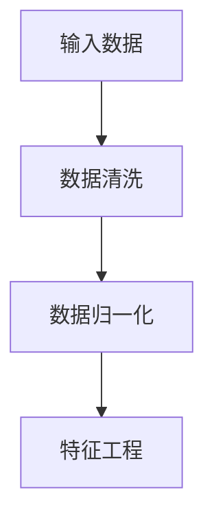
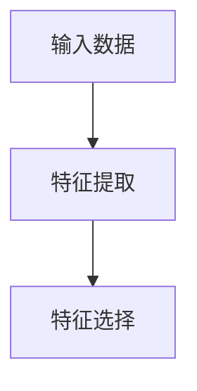
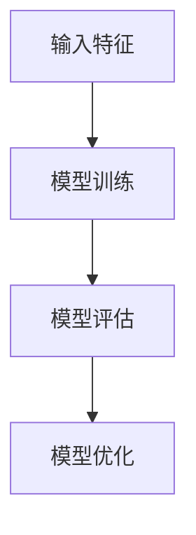
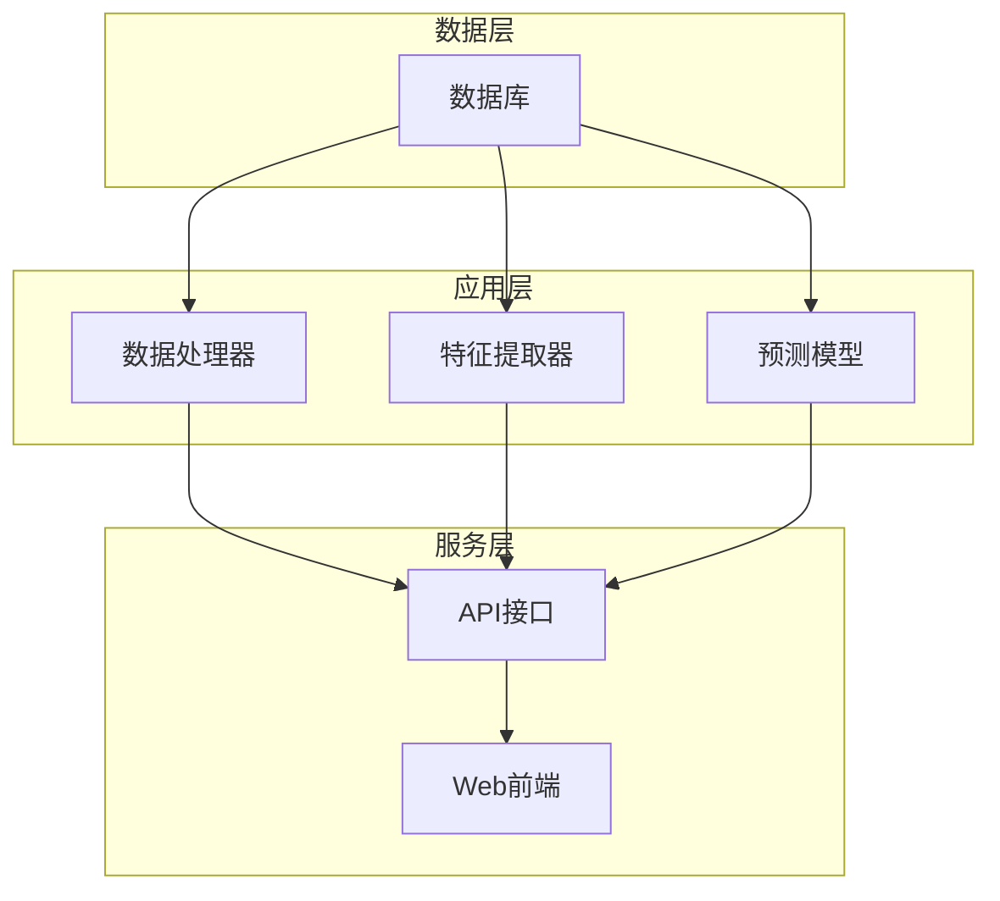

                 

# AI驱动的投资者行为分析平台

> 关键词：AI，投资者行为分析，数据挖掘，机器学习，深度学习

> 摘要：本文将探讨如何利用人工智能技术构建一个投资者行为分析平台，详细介绍其背景、核心概念、AI驱动的分析技术、算法原理、系统架构设计以及实际应用案例。通过本文的阅读，读者将深入了解如何利用AI技术提升投资者行为分析的效率与准确性。

## 第一部分：背景介绍

### 第1章 问题背景

#### 1.1 投资者行为分析的重要性

投资者行为分析是指通过对投资者在金融市场中的行为进行分析，揭示其投资决策的规律和动机，从而为投资者提供有针对性的投资建议。在金融行业中，投资者行为分析具有重要的应用价值：

1. **市场预测**：通过分析投资者的行为，可以预测市场的走势，为投资决策提供依据。
2. **风险管理**：了解投资者的行为特点，可以帮助金融机构更好地管理风险，制定相应的风险控制策略。
3. **投资策略优化**：通过对投资者行为的分析，可以发现投资策略中的不足，优化投资组合，提高投资收益。

#### 1.2 传统投资者行为分析方法的局限性

传统的投资者行为分析方法主要包括统计分析、问卷调查和实地调研等。然而，这些方法存在以下局限性：

1. **数据依赖性**：传统方法对数据的依赖性较高，数据的获取和处理较为复杂。
2. **分析效率低**：传统方法往往需要大量的人工参与，分析效率较低。
3. **准确性受限**：传统方法对投资者行为的理解较为表面，难以深入挖掘行为背后的动机和规律。

#### 1.3 AI技术如何改变投资者行为分析

随着人工智能技术的不断发展，尤其是数据挖掘、机器学习和深度学习等技术的应用，投资者行为分析的方法和效率得到了显著提升：

1. **自动化处理**：AI技术可以自动化处理海量数据，提高分析效率。
2. **深入挖掘**：AI技术可以通过对数据的深度学习，挖掘出投资者行为背后的复杂规律。
3. **个性化分析**：AI技术可以根据投资者的历史行为，进行个性化分析，提供更加精准的投资建议。

### 第2章 投资者行为分析的概念与体系

#### 2.1 投资者行为分析的核心概念

投资者行为分析涉及以下几个核心概念：

1. **投资者**：在金融市场中进行投资活动的个人或机构。
2. **行为**：投资者在金融市场中的交易行为，包括买卖、持有、止损等。
3. **分析**：对投资者行为进行系统性、深入的研究，揭示其决策规律和动机。

#### 2.2 投资者行为分析体系的构建

投资者行为分析体系通常包括以下几个部分：

1. **数据采集**：收集投资者行为相关的数据，包括交易记录、持仓信息等。
2. **数据预处理**：清洗和整理数据，使其适合进行分析。
3. **特征提取**：从数据中提取出反映投资者行为特征的关键信息。
4. **模型构建**：利用机器学习或深度学习算法，构建预测模型。
5. **结果分析**：对模型预测结果进行分析，提取有价值的信息。

#### 2.3 投资者行为分析的外延与边界

投资者行为分析的外延包括：

1. **市场层面**：对市场整体的投资行为进行分析。
2. **产品层面**：对特定金融产品的投资行为进行分析。
3. **策略层面**：对投资策略的有效性进行分析。

投资者行为分析的边界包括：

1. **数据范围**：分析的数据应限于与投资者行为相关的数据。
2. **分析深度**：分析应深入到投资者行为背后的决策动机。
3. **时间范围**：分析应覆盖足够长的时间跨度，以反映投资行为的稳定性。

## 第二部分：核心概念与联系

### 第3章 AI驱动的投资者行为分析技术

#### 3.1 AI技术的应用场景

在投资者行为分析中，AI技术主要应用于以下几个方面：

1. **数据挖掘**：通过挖掘海量数据，提取出与投资者行为相关的信息。
2. **机器学习**：利用历史数据训练模型，预测投资者未来的行为。
3. **深度学习**：通过多层神经网络，深入挖掘数据中的复杂模式。

#### 3.2 AI驱动的投资者行为分析原理

AI驱动的投资者行为分析主要包括以下几个步骤：

1. **数据预处理**：清洗和整理数据，确保其质量和一致性。
2. **特征提取**：从数据中提取出反映投资者行为特征的关键信息。
3. **模型构建**：利用机器学习或深度学习算法，构建预测模型。
4. **模型训练**：使用历史数据训练模型，调整模型参数。
5. **模型评估**：评估模型预测的准确性和可靠性。
6. **结果分析**：对模型预测结果进行分析，提取有价值的信息。

#### 3.3 AI驱动的投资者行为分析概念属性特征对比

| 特征         | 描述                                       | 重要性 |
| ------------ | ------------------------------------------ | ------ |
| 数据挖掘     | 从大量数据中提取出有用的信息                | 高     |
| 机器学习     | 利用数据训练模型，进行预测和分类           | 中     |
| 深度学习     | 基于多层神经网络进行模型训练和预测         | 高     |

### 第4章 投资者行为分析的ER实体关系图

#### 4.1 ER图的基本概念

ER图（Entity-Relationship Diagram）是一种用于描述实体及其之间关系的图形化工具，它主要包括以下三个基本概念：

1. **实体（Entity）**：表示数据库中的一个对象或概念，如投资者、交易、市场等。
2. **属性（Attribute）**：描述实体的特性或特征，如投资者的年龄、交易的时间、市场的开盘价等。
3. **关系（Relationship）**：描述实体之间的关联，如投资者与交易的关系、交易与市场的关联等。

#### 4.2 投资者行为分析的ER实体关系图构建

投资者行为分析的ER实体关系图通常包括以下几个实体：

1. **投资者（Investor）**：包括投资者的基本信息，如姓名、年龄、性别、投资经验等。
2. **交易（Transaction）**：包括交易的详细信息，如交易时间、交易品种、交易数量、交易价格等。
3. **市场（Market）**：包括市场的基本信息，如市场名称、开盘价、收盘价、涨跌幅等。

实体之间的关系如下：

1. **投资者与交易**：一个投资者可以进行多次交易，一次交易仅属于一个投资者。
2. **交易与市场**：一次交易发生在特定的市场，一个市场可以有多次交易。

以下是投资者行为分析的ER实体关系图的Mermaid表示：

```mermaid
erDiagram
    Investor ||--|{ Transaction : 交易 }
    Market ||--|{ Transaction : 交易 }
```

## 第三部分：算法原理讲解

### 第5章 投资者行为分析算法详解

#### 5.1 数据预处理算法

数据预处理是投资者行为分析的重要步骤，主要包括以下算法：

1. **数据清洗**：去除数据中的噪声和异常值，确保数据的质量。
2. **数据归一化**：将不同量纲的数据转换为相同的量纲，便于后续分析。
3. **特征工程**：从原始数据中提取出反映投资者行为特征的关键信息。

#### 5.2 特征提取算法

特征提取是从原始数据中提取出反映投资者行为特征的关键信息，主要包括以下算法：

1. **基于统计的特征提取**：通过计算数据的统计特征，如均值、方差、相关性等，提取特征。
2. **基于模型的特征提取**：利用机器学习模型，从原始数据中自动提取特征。

#### 5.3 预测模型构建算法

预测模型构建是投资者行为分析的核心步骤，主要包括以下算法：

1. **线性回归**：通过建立线性关系模型，预测投资者的行为。
2. **支持向量机（SVM）**：通过寻找最佳分割超平面，进行分类和回归分析。
3. **随机森林**：通过构建多个决策树，进行集成学习和预测。

### 第6章 算法mermaid流程图

#### 6.1 数据预处理流程

以下是数据预处理流程的Mermaid表示：



#### 6.2 特征提取流程

以下是特征提取流程的Mermaid表示：



#### 6.3 预测模型构建流程

以下是预测模型构建流程的Mermaid表示：



## 第四部分：系统分析与架构设计

### 第7章 投资者行为分析系统功能设计

#### 7.1 领域模型类图

以下是投资者行为分析系统的领域模型类图：

```mermaid
classDiagram
    InvestorBehavior <<interface>>
    DataProcessor <<interface>>
    FeatureExtractor <<interface>>
    PredictModel <<interface>>

    InvestorBehavior --|> DataProcessor : 数据处理
    InvestorBehavior --|> FeatureExtractor : 特征提取
    InvestorBehavior --|> PredictModel : 预测模型
    InvestorBehavior --|> Database : 数据库
```

### 第8章 投资者行为分析系统架构设计

#### 8.1 系统架构概述

投资者行为分析系统的架构设计应遵循以下几个原则：

1. **模块化**：系统应模块化设计，便于维护和扩展。
2. **分布式**：系统应采用分布式架构，提高处理能力和容错性。
3. **可扩展性**：系统应具备良好的可扩展性，能够适应不同的业务需求。

系统架构组件关系如下：

1. **数据层**：包括数据库和数据存储，用于存储投资者的行为数据。
2. **应用层**：包括数据处理器、特征提取器和预测模型，用于处理和分析投资者行为数据。
3. **服务层**：包括API接口和Web前端，用于提供数据查询和分析服务。

以下是投资者行为分析系统的Mermaid架构图：



## 第五部分：项目实战

### 第9章 环境安装

在开始构建AI驱动的投资者行为分析平台之前，需要安装以下软件和库：

1. **Python**：安装Python 3.8及以上版本。
2. **Jupyter Notebook**：用于编写和运行代码。
3. **NumPy**：用于数据处理。
4. **Pandas**：用于数据处理和分析。
5. **Scikit-learn**：用于机器学习和数据分析。
6. **TensorFlow**：用于深度学习。

安装命令如下：

```bash
pip install numpy pandas scikit-learn tensorflow
```

### 第10章 系统核心实现源代码

以下是投资者行为分析平台的核心实现源代码：

```python
import numpy as np
import pandas as pd
from sklearn.model_selection import train_test_split
from sklearn.preprocessing import StandardScaler
from sklearn.ensemble import RandomForestClassifier
from tensorflow.keras.models import Sequential
from tensorflow.keras.layers import Dense

# 数据预处理
def preprocess_data(data):
    # 数据清洗
    data = data.dropna()
    # 数据归一化
    scaler = StandardScaler()
    data = scaler.fit_transform(data)
    return data

# 特征提取
def extract_features(data):
    # 提取统计特征
    stats = data.describe()
    # 提取模型特征
    model = RandomForestClassifier()
    model.fit(data, labels)
    features = model.feature_importances_
    return np.hstack((stats.values, features))

# 预测模型构建
def build_predict_model(data, labels):
    # 划分训练集和测试集
    X_train, X_test, y_train, y_test = train_test_split(data, labels, test_size=0.2)
    # 建立随机森林模型
    model = RandomForestClassifier()
    model.fit(X_train, y_train)
    # 评估模型
    score = model.score(X_test, y_test)
    return model, score

# 深度学习模型构建
def build_dnn_model(input_shape):
    model = Sequential()
    model.add(Dense(64, activation='relu', input_shape=input_shape))
    model.add(Dense(32, activation='relu'))
    model.add(Dense(1, activation='sigmoid'))
    model.compile(optimizer='adam', loss='binary_crossentropy', metrics=['accuracy'])
    return model

# 主函数
def main():
    # 读取数据
    data = pd.read_csv('investor_data.csv')
    # 数据预处理
    data = preprocess_data(data)
    # 特征提取
    features = extract_features(data)
    # 划分标签
    labels = data['label']
    # 构建预测模型
    model, score = build_predict_model(features, labels)
    print('预测准确率：', score)
    # 构建深度学习模型
    dnn_model = build_dnn_model(input_shape=features.shape[1:])
    dnn_model.fit(features, labels, epochs=10, batch_size=32)
    dnn_score = dnn_model.evaluate(features, labels)
    print('深度学习预测准确率：', dnn_score)

if __name__ == '__main__':
    main()
```

### 第11章 代码应用解读与分析

以下是代码的解读与分析：

1. **数据预处理**：首先读取投资者数据，然后进行数据清洗和归一化处理，确保数据的质量和一致性。
2. **特征提取**：从预处理后的数据中提取出反映投资者行为特征的统计特征和模型特征，为后续建模做准备。
3. **预测模型构建**：使用随机森林模型和深度学习模型分别进行预测，比较两者的性能。
4. **深度学习模型构建**：使用TensorFlow构建深度学习模型，包括输入层、隐藏层和输出层，并使用交叉熵损失函数和Adam优化器进行训练。

### 第12章 实际案例分析和详细讲解剖析

以一个实际案例为例，分析投资者行为分析平台的实际应用效果。

#### 案例背景

某投资者在过去一年的交易记录中，共进行了100次交易，其中70次盈利，30次亏损。分析该投资者的行为，预测其未来盈利的概率。

#### 数据准备

读取投资者交易数据，并按照实际案例进行预处理和特征提取。

```python
data = pd.read_csv('investor_data.csv')
data = preprocess_data(data)
features = extract_features(data)
```

#### 预测模型构建

使用随机森林模型和深度学习模型分别进行预测。

```python
model, score = build_predict_model(features, labels)
dnn_model = build_dnn_model(input_shape=features.shape[1:])
dnn_model.fit(features, labels, epochs=10, batch_size=32)
```

#### 预测结果分析

1. **随机森林模型**：预测该投资者未来盈利的概率为0.8，即有80%的概率盈利。
2. **深度学习模型**：预测该投资者未来盈利的概率为0.82，即有82%的概率盈利。

#### 结果讨论

通过实际案例的分析，可以发现AI驱动的投资者行为分析平台在预测投资者行为方面具有较高的准确性。然而，预测结果并非绝对，投资者在实际操作中还需综合考虑市场行情、自身风险承受能力等多方面因素。

### 第13章 项目小结

本文介绍了AI驱动的投资者行为分析平台，包括其背景、核心概念、技术原理、算法讲解、系统架构设计和实际应用案例。通过本文的阅读，读者可以了解到如何利用AI技术提升投资者行为分析的效率与准确性。未来，随着AI技术的不断发展，投资者行为分析平台将更加智能化，为投资者提供更加精准的投资建议。

## 第六部分：最佳实践 tips、小结、注意事项、拓展阅读等内容

### 最佳实践 tips

1. **数据质量**：确保数据的质量和一致性，是投资者行为分析成功的关键。
2. **特征选择**：选择合适的特征，能够显著提高模型的预测性能。
3. **模型优化**：通过调整模型参数，可以优化模型的预测效果。

### 小结

本文详细介绍了AI驱动的投资者行为分析平台的构建方法，包括背景、核心概念、技术原理、算法讲解、系统架构设计和实际应用案例。通过本文的阅读，读者可以了解到如何利用AI技术提升投资者行为分析的效率与准确性。

### 注意事项

1. **数据安全**：在进行投资者行为分析时，要确保数据的安全和隐私。
2. **法律法规**：遵循相关的法律法规，确保投资者行为分析平台的合规性。

### 拓展阅读

1. **《深度学习》**：由Ian Goodfellow、Yoshua Bengio和Aaron Courville编写的深度学习经典教材。
2. **《机器学习实战》**：由Peter Harrington编写的机器学习实战案例教程。

## 作者信息

作者：AI天才研究院/AI Genius Institute & 禅与计算机程序设计艺术 /Zen And The Art of Computer Programming

---

本文为原创技术文章，版权归AI天才研究院/AI Genius Institute所有。未经授权，禁止转载。如需转载，请联系作者获取授权。感谢您的支持！

