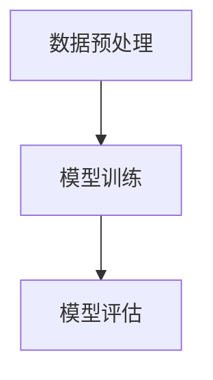
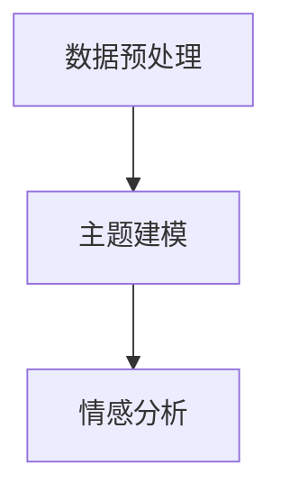
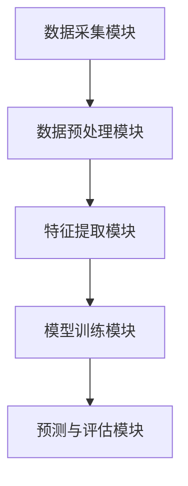
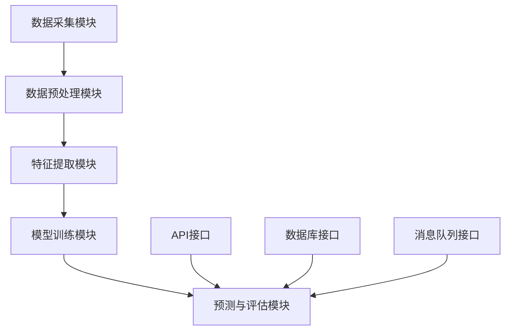
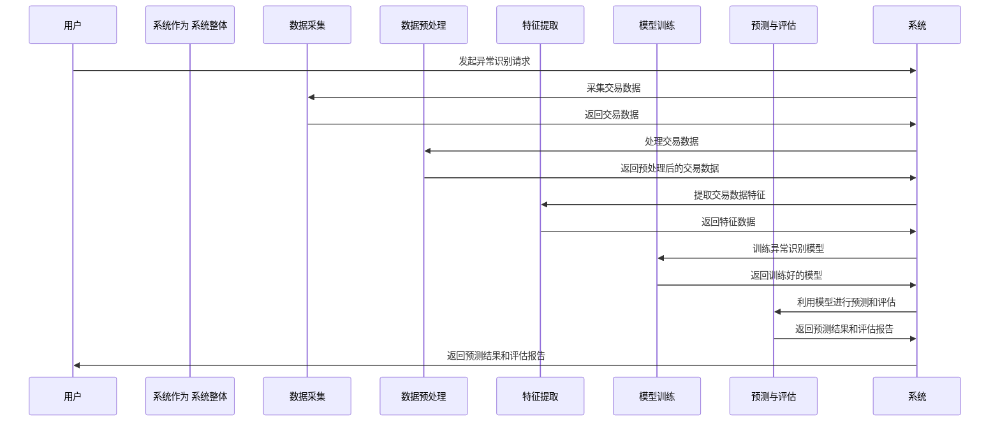

                 

# AI驱动的投资者行为异常识别

> 关键词：人工智能，投资者行为，异常识别，深度学习，数据挖掘，金融监管

> 摘要：
随着金融市场的发展，投资者行为的异常识别成为监管机构和投资者自身关注的重要课题。本文以AI驱动的投资者行为异常识别为主题，探讨了人工智能在金融领域的应用，详细分析了AI驱动的投资者行为异常识别的核心概念、原理和方法。通过深入剖析，旨在为金融科技的发展提供技术参考，为投资者提供风险预警。

## 目录大纲

----------------------------------------------------------------

# AI驱动的投资者行为异常识别

> 关键词：人工智能，投资者行为，异常识别，深度学习，数据挖掘，金融监管

> 摘要：
随着金融市场的发展，投资者行为的异常识别成为监管机构和投资者自身关注的重要课题。本文以AI驱动的投资者行为异常识别为主题，探讨了人工智能在金融领域的应用，详细分析了AI驱动的投资者行为异常识别的核心概念、原理和方法。通过深入剖析，旨在为金融科技的发展提供技术参考，为投资者提供风险预警。

## 第一部分：问题背景与核心概念

----------------------------------------------------------------

## 第1章：投资者行为异常识别的必要性

### 1.1.1 问题背景

投资者行为异常识别的重要性  
市场风险和监管压力  
人工智能在金融领域的应用

### 1.1.2 投资者行为异常识别的定义

投资者行为异常的定义  
投资者行为异常的类型

### 1.1.3 AI在投资者行为异常识别中的应用

传统方法与AI的对比  
AI驱动的优势

## 第2章：核心概念与联系

### 2.1.1 投资者行为理论

行为金融学概述  
投资者心理偏差

### 2.1.2 数据挖掘与机器学习

数据挖掘技术概述  
机器学习基本概念

### 2.1.3 AI核心概念

深度学习  
神经网络  
自然语言处理

### 2.1.4 AI驱动的投资者行为异常识别原理

数据预处理  
特征提取  
模型训练与评估

## 第3章：AI驱动的投资者行为异常识别方法

### 3.1.1 传统方法回顾

监控分析法  
情感分析法  
风险指标法

### 3.1.2 AI驱动的最新进展

深度学习在投资者行为识别中的应用  
图神经网络在社交网络分析中的应用  
强化学习在交易策略中的应用

### 3.1.3 混合方法探讨

传统方法与AI的融合  
多模型融合

----------------------------------------------------------------

## 第二部分：算法原理讲解

----------------------------------------------------------------

## 第4章：深度学习与神经网络原理

### 4.1.1 深度学习基础

深度学习概述  
神经网络结构

### 4.1.2 深度学习算法

卷积神经网络（CNN）  
循环神经网络（RNN）  
生成对抗网络（GAN）

### 4.1.3 Python代码实现

算法流程图  
Python代码示例

## 第5章：自然语言处理与文本分析

### 5.1.1 自然语言处理基础

语言模型  
词向量

### 5.1.2 文本分析算法

主题建模  
情感分析

### 5.1.3 Python代码实现

算法流程图  
Python代码示例

## 第6章：数学模型与公式讲解

### 6.1.1 深度学习数学模型

神经网络激活函数  
前向传播与反向传播

### 6.1.2 自然语言处理数学模型

语言模型  
情感分析模型

### 6.1.3 数学公式详细讲解

激活函数公式  
反向传播公式

----------------------------------------------------------------

## 第三部分：系统架构设计

----------------------------------------------------------------

## 第7章：系统功能设计

### 7.1.1 问题场景介绍

投资者行为异常识别系统需求分析

### 7.1.2 系统功能设计

数据采集模块  
数据预处理模块  
特征提取模块  
模型训练模块  
预测与评估模块

## 第8章：系统架构设计

### 8.1.1 系统架构设计

架构概述  
系统模块划分  
系统接口设计

### 8.1.2 系统架构图

Mermaid架构图

### 8.1.3 系统交互序列图

Mermaid序列图

----------------------------------------------------------------

## 第四部分：项目实战

----------------------------------------------------------------

## 第9章：环境安装与准备

### 9.1.1 环境安装

Python环境安装  
库依赖安装

### 9.1.2 数据准备

数据来源  
数据预处理

## 第10章：系统核心实现

### 10.1.1 数据采集

采集方法  
数据存储

### 10.1.2 数据预处理

数据清洗  
数据归一化

### 10.1.3 特征提取

特征选择  
特征提取算法

### 10.1.4 模型训练

模型选择  
模型训练与优化

### 10.1.5 预测与评估

预测流程  
评估指标

## 第11章：实际案例分析

### 11.1.1 案例背景

某投资公司的实践案例

### 11.1.2 案例分析

数据采集与预处理  
特征提取与模型训练  
模型评估与优化  
应用效果分析

## 第12章：项目小结

----------------------------------------------------------------

## 第1章：投资者行为异常识别的必要性

### 1.1.1 问题背景

随着金融市场的发展和金融工具的多样化，投资者在市场中扮演着越来越重要的角色。然而，投资者行为中存在许多异常现象，如操纵市场、内幕交易、过度交易等，这些行为不仅对市场秩序造成破坏，也使得投资者面临巨大的风险。因此，投资者行为异常识别的重要性日益凸显。

首先，市场风险和监管压力是推动投资者行为异常识别需求的重要因素。金融市场的不稳定性和风险性使得投资者行为更加复杂，而监管机构则需要及时识别并干预这些异常行为，以维护市场秩序和投资者利益。例如，美国证券交易委员会（SEC）一直在加强对市场操纵和内幕交易的监管，通过技术手段监测和识别异常交易行为。

其次，人工智能在金融领域的应用为投资者行为异常识别提供了新的技术手段。传统的方法如监控分析法、情感分析法和风险指标法等，在处理大规模数据和实时监测方面存在一定的局限性。而人工智能，特别是深度学习和机器学习技术，可以高效地处理复杂数据，提取有用特征，并构建准确的预测模型。例如，通过分析投资者的交易行为和情绪变化，AI模型可以识别出潜在的异常行为。

### 1.1.2 投资者行为异常识别的定义

投资者行为异常识别是指通过技术手段对投资者的交易行为、情绪变化和市场操作进行监测和分析，以发现其中可能存在的异常现象。具体来说，投资者行为异常识别包括以下几个方面：

1. **交易行为异常**：指投资者在交易过程中出现的异常交易行为，如异常价格波动、大量撤单、异常交易量等。
2. **情绪变化异常**：指投资者在交易过程中的情绪异常变化，如过度乐观、过度悲观、情绪极端化等。
3. **市场操纵异常**：指投资者通过不正当手段操纵市场，如内幕交易、市场操纵等。

### 1.1.3 AI在投资者行为异常识别中的应用

传统方法与AI的对比

在传统方法中，投资者行为异常识别主要依赖于监控分析、情感分析和风险指标法等。这些方法虽然在一定程度上能够识别出异常行为，但在处理大规模数据和实时监测方面存在以下局限性：

1. **处理能力有限**：传统方法主要依赖于人工分析和统计方法，处理能力和速度有限，难以应对海量数据。
2. **实时性较差**：传统方法通常需要较长时间进行分析和验证，难以实现实时监测。
3. **准确性不足**：传统方法的准确性受限于数据质量和分析模型的复杂度。

相比之下，人工智能技术，尤其是深度学习和机器学习，为投资者行为异常识别提供了新的解决方案。深度学习具有以下优势：

1. **高效处理能力**：深度学习可以通过训练大量数据，提取出隐藏的特征，从而提高处理能力和准确性。
2. **实时性**：深度学习模型可以实现实时训练和预测，从而实现实时监测和预警。
3. **高准确性**：深度学习模型在处理复杂数据和模式识别方面具有很高的准确性。

## 第2章：核心概念与联系

### 2.1.1 投资者行为理论

行为金融学概述

行为金融学是研究投资者心理行为与市场表现的交叉学科，主要关注投资者在市场交易中的非理性行为和市场反应。行为金融学认为，投资者在决策过程中会受到多种心理因素的影响，如过度自信、损失厌恶、从众心理等，这些心理因素会导致投资者出现非理性行为，从而影响市场波动。

投资者心理偏差

投资者心理偏差是指投资者在市场交易中表现出的系统性偏差，主要包括以下几种：

1. **过度自信**：投资者往往高估自己的能力和市场洞察力，导致过度交易和风险承担。
2. **损失厌恶**：投资者倾向于避免损失，导致在市场下跌时过度保守，错失反弹机会。
3. **从众心理**：投资者在市场压力下容易从众，导致市场情绪极端化和波动放大。

### 2.1.2 数据挖掘与机器学习

数据挖掘技术概述

数据挖掘是一种通过算法和统计方法从大量数据中提取有用信息的过程。在投资者行为异常识别中，数据挖掘技术主要用于以下方面：

1. **特征提取**：从交易数据、情绪数据和市场数据中提取出有用的特征，用于构建异常识别模型。
2. **模式识别**：通过分析历史数据，识别出可能存在的异常交易模式和情绪变化。

机器学习基本概念

机器学习是一种通过训练模型，使其能够从数据中学习并做出预测的技术。在投资者行为异常识别中，机器学习技术主要用于以下方面：

1. **模型训练**：通过历史数据训练模型，使其能够识别出异常交易行为和情绪变化。
2. **模型评估**：通过验证集和测试集评估模型的准确性和泛化能力。

### 2.1.3 AI核心概念

深度学习

深度学习是一种基于人工神经网络的学习方法，通过多层神经网络对数据进行建模和分析。深度学习在投资者行为异常识别中具有以下应用：

1. **特征提取**：通过多层神经网络提取出复杂数据中的有用特征。
2. **模式识别**：通过深度学习模型识别出历史数据中的异常交易行为和情绪变化。

神经网络

神经网络是一种模拟人脑神经元连接和功能的人工智能模型。神经网络在投资者行为异常识别中具有以下作用：

1. **数据建模**：通过神经网络模型对投资者交易行为和情绪变化进行建模。
2. **预测**：通过训练好的神经网络模型预测未来可能出现的异常行为。

自然语言处理

自然语言处理是一种使计算机能够理解、生成和处理人类语言的技术。在投资者行为异常识别中，自然语言处理技术主要用于以下方面：

1. **文本分析**：通过自然语言处理技术分析投资者在社交媒体、新闻评论等平台上的文本信息，提取情绪特征。
2. **情感分析**：通过自然语言处理技术识别出投资者在文本中的情绪变化，为异常识别提供辅助信息。

### 2.1.4 AI驱动的投资者行为异常识别原理

数据预处理

数据预处理是投资者行为异常识别的重要步骤，主要包括以下方面：

1. **数据清洗**：去除数据中的噪声和异常值，保证数据质量。
2. **数据归一化**：将不同特征的数据统一到相同的尺度，便于模型训练。

特征提取

特征提取是投资者行为异常识别的核心步骤，主要包括以下方面：

1. **特征选择**：从原始数据中选择对异常识别有重要影响的特征。
2. **特征提取算法**：通过算法提取出数据的特征表示，为模型训练提供输入。

模型训练与评估

模型训练与评估是投资者行为异常识别的关键步骤，主要包括以下方面：

1. **模型训练**：通过历史数据训练模型，使其能够识别出异常交易行为和情绪变化。
2. **模型评估**：通过验证集和测试集评估模型的准确性和泛化能力。

## 第3章：AI驱动的投资者行为异常识别方法

### 3.1.1 传统方法回顾

传统方法主要包括监控分析法、情感分析法和风险指标法等，这些方法在一定程度上能够识别出投资者行为异常，但在处理大规模数据和实时监测方面存在一定的局限性。

监控分析法

监控分析法主要通过实时监测投资者的交易行为，识别出异常交易行为。具体方法包括：

1. **异常交易监测**：通过监测交易量、交易价格等指标，识别出异常交易行为。
2. **趋势分析**：通过分析交易趋势，识别出异常交易模式。

情感分析法

情感分析法主要通过分析投资者在社交媒体、新闻评论等平台上的文本信息，识别出投资者的情绪变化。具体方法包括：

1. **文本挖掘**：通过文本挖掘技术提取出文本中的情感特征。
2. **情感分类**：通过情感分类模型识别出文本中的情感倾向。

风险指标法

风险指标法主要通过计算投资者的风险指标，识别出异常风险水平。具体方法包括：

1. **风险指标计算**：通过计算风险指标（如VaR、CVaR等）评估投资者的风险水平。
2. **风险预警**：通过设定风险阈值，识别出异常风险水平。

### 3.1.2 AI驱动的最新进展

随着深度学习和机器学习技术的不断发展，AI驱动的投资者行为异常识别方法取得了一系列重要进展。

深度学习在投资者行为识别中的应用

深度学习技术通过多层神经网络对大量数据进行分析和建模，能够提取出隐藏的特征，从而提高异常识别的准确性。具体应用包括：

1. **卷积神经网络（CNN）**：通过卷积层提取图像和交易数据中的特征。
2. **循环神经网络（RNN）**：通过循环层处理时间序列数据，提取出时间依赖特征。
3. **生成对抗网络（GAN）**：通过生成器和判别器的对抗训练，提高异常识别模型的泛化能力。

图神经网络在社交网络分析中的应用

社交网络分析是投资者行为异常识别的重要方向之一。图神经网络通过图结构表示社交网络，能够提取出节点和边的特征，从而提高异常识别的准确性。具体应用包括：

1. **节点分类**：通过图神经网络对社交网络中的节点进行分类，识别出潜在的交易对手。
2. **关系分析**：通过图神经网络分析社交网络中的关系，识别出潜在的异常关系。

强化学习在交易策略中的应用

强化学习通过模拟投资者的交易策略，优化交易决策，从而提高收益。具体应用包括：

1. **交易策略优化**：通过强化学习优化交易策略，提高交易收益。
2. **风险控制**：通过强化学习控制交易风险，降低损失。

### 3.1.3 混合方法探讨

传统方法与AI的融合

将传统方法和AI技术相结合，能够提高投资者行为异常识别的准确性和实时性。具体方法包括：

1. **多源数据融合**：将监控分析、情感分析和风险指标法等传统方法与AI技术相结合，提高异常识别的准确性。
2. **实时监测**：通过实时监测和预警系统，提高异常识别的实时性。

多模型融合

通过融合多种AI模型，能够进一步提高异常识别的准确性和鲁棒性。具体方法包括：

1. **模型组合**：将深度学习、图神经网络和强化学习等模型进行组合，提高异常识别的准确性。
2. **模型优化**：通过模型优化和参数调整，提高异常识别的鲁棒性。

## 第4章：深度学习与神经网络原理

### 4.1.1 深度学习基础

深度学习概述

深度学习是一种基于多层神经网络的学习方法，通过多层神经网络对数据进行建模和分析。深度学习具有以下特点：

1. **多层网络**：通过多层神经网络，能够提取出复杂数据中的高层次特征。
2. **非线性变换**：通过非线性变换，能够提高模型的拟合能力和表达能力。
3. **大规模训练**：通过大规模训练数据，提高模型的准确性和泛化能力。

神经网络结构

神经网络是一种模拟人脑神经元连接和功能的人工智能模型，由输入层、隐藏层和输出层组成。神经网络的基本结构包括：

1. **神经元**：神经网络的每个节点表示一个神经元，负责接收输入、计算输出。
2. **连接权重**：神经元之间的连接权重表示神经元之间的连接强度，通过训练进行调整。
3. **激活函数**：激活函数用于对神经元输出进行非线性变换，常用的激活函数包括Sigmoid、ReLU和Tanh等。

### 4.1.2 深度学习算法

卷积神经网络（CNN）

卷积神经网络（CNN）是一种用于处理图像数据的多层神经网络，通过卷积层和池化层提取图像特征。CNN的基本结构包括：

1. **卷积层**：通过卷积操作提取图像特征，卷积核用于提取局部特征。
2. **池化层**：通过池化操作降低数据维度，常用的池化方式包括最大池化和平均池化。
3. **全连接层**：通过全连接层将卷积层和池化层提取的特征映射到分类结果。

循环神经网络（RNN）

循环神经网络（RNN）是一种用于处理序列数据的多层神经网络，通过循环层处理时间序列数据。RNN的基本结构包括：

1. **循环层**：通过循环层处理时间序列数据，每个时间步的输出依赖于前一个时间步的输出。
2. **门控机制**：通过门控机制（如门控循环单元GRU和长短期记忆LSTM）解决RNN中的梯度消失和梯度爆炸问题。
3. **全连接层**：通过全连接层将循环层提取的特征映射到分类结果。

生成对抗网络（GAN）

生成对抗网络（GAN）是一种由生成器和判别器组成的对抗性神经网络，通过对抗训练生成逼真的数据。GAN的基本结构包括：

1. **生成器**：通过生成器生成逼真的数据，生成器试图欺骗判别器。
2. **判别器**：通过判别器判断生成数据的真实性，判别器试图区分生成数据和真实数据。
3. **损失函数**：通过损失函数衡量生成器和判别器的性能，生成器和判别器在对抗训练中不断优化。

### 4.1.3 Python代码实现

算法流程图



Python代码示例

```python
import tensorflow as tf
from tensorflow.keras.models import Sequential
from tensorflow.keras.layers import Dense, Conv2D, MaxPooling2D, Flatten, LSTM

# 数据预处理
# ...

# 模型训练
model = Sequential([
    Conv2D(filters=32, kernel_size=(3, 3), activation='relu', input_shape=(28, 28, 1)),
    MaxPooling2D(pool_size=(2, 2)),
    Flatten(),
    Dense(units=128, activation='relu'),
    LSTM(units=128, activation='relu'),
    Dense(units=10, activation='softmax')
])

model.compile(optimizer='adam', loss='categorical_crossentropy', metrics=['accuracy'])
model.fit(x_train, y_train, epochs=10, batch_size=32)

# 模型评估
# ...
```

## 第5章：自然语言处理与文本分析

### 5.1.1 自然语言处理基础

语言模型

语言模型是一种用于预测下一个单词或字符的统计模型，常用的语言模型包括N元语言模型和神经网络语言模型。语言模型的基本结构包括：

1. **N元模型**：通过统计前N个单词的联合概率预测下一个单词。
2. **神经网络模型**：通过多层神经网络对语言数据进行建模，提取出高层次特征。

词向量

词向量是一种将单词映射到高维向量空间的方法，常用的词向量模型包括Word2Vec和GloVe。词向量模型的基本结构包括：

1. **Word2Vec**：通过训练大规模语料库，将单词映射到低维向量空间。
2. **GloVe**：通过共现关系训练词向量，将单词映射到高维向量空间。

### 5.1.2 文本分析算法

主题建模

主题建模是一种无监督学习方法，用于发现文本数据中的主题。常用的主题建模方法包括LDA（Latent Dirichlet Allocation）和LSTM（Long Short-Term Memory）。主题建模的基本结构包括：

1. **LDA**：通过概率模型对文本进行主题分配，识别出文本中的潜在主题。
2. **LSTM**：通过循环神经网络对文本进行建模，提取出文本中的主题特征。

情感分析

情感分析是一种有监督学习方法，用于判断文本数据中的情感倾向。常用的情感分析方法包括基于规则的方法和基于机器学习的方法。情感分析的基本结构包括：

1. **基于规则的方法**：通过预设的规则和特征提取方法，判断文本中的情感倾向。
2. **基于机器学习的方法**：通过训练分类模型，对文本中的情感倾向进行分类。

### 5.1.3 Python代码实现

算法流程图



Python代码示例

```python
import gensim
from gensim.models import LdaMulticore
from sklearn.feature_extraction.text import TfidfVectorizer
from sklearn.model_selection import train_test_split
from sklearn.metrics import accuracy_score

# 数据预处理
# ...

# 主题建模
corpus = [[word for word in document] for document in documents]
lda_model = LdaMulticore(corpus, num_topics=10, id2word=id2word, passes=10, workers=2)
topics = lda_model.show_topics()

# 情感分析
vectorizer = TfidfVectorizer()
X = vectorizer.fit_transform(corpus)
X_train, X_test, y_train, y_test = train_test_split(X, labels, test_size=0.2, random_state=42)
clf = LogisticRegression()
clf.fit(X_train, y_train)
y_pred = clf.predict(X_test)
accuracy = accuracy_score(y_test, y_pred)
print("Accuracy:", accuracy)
```

## 第6章：数学模型与公式讲解

### 6.1.1 深度学习数学模型

神经网络激活函数

神经网络激活函数用于对神经元输出进行非线性变换，常用的激活函数包括Sigmoid、ReLU和Tanh。激活函数的公式如下：

$$
f(x) = \frac{1}{1 + e^{-x}} \quad (Sigmoid)
$$

$$
f(x) = max(0, x) \quad (ReLU)
$$

$$
f(x) = \frac{e^x - e^{-x}}{e^x + e^{-x}} \quad (Tanh)
$$

前向传播与反向传播

前向传播和反向传播是深度学习训练过程中的两个关键步骤。前向传播用于计算神经网络的输出，反向传播用于更新网络权重。前向传播的公式如下：

$$
\hat{y} = \sigma(\boldsymbol{W} \cdot \boldsymbol{a}^{[L-1]} + \boldsymbol{b}^{[L]})
$$

反向传播的公式如下：

$$
\Delta \boldsymbol{W}^{[L]} = \boldsymbol{a}^{[L-1]T} \cdot \Delta \boldsymbol{z}^{[L]}
$$

$$
\Delta \boldsymbol{b}^{[L]} = \Delta \boldsymbol{z}^{[L]}
$$

### 6.1.2 自然语言处理数学模型

语言模型

语言模型用于预测下一个单词或字符的概率，常用的语言模型包括N元语言模型和神经网络语言模型。N元语言模型的公式如下：

$$
P(w_t | w_{t-1}, ..., w_{t-n}) = \frac{C(w_{t-1}, ..., w_{t-n}, w_t)}{\sum_{w_{t-n+1}} C(w_{t-1}, ..., w_{t-n}, w_{t-n+1})}
$$

神经网络语言模型的公式如下：

$$
P(w_t | w_{t-1}, ..., w_{t-n}) = \sigma(\boldsymbol{W} \cdot \boldsymbol{h}^{[L-1]})
$$

情感分析模型

情感分析模型用于判断文本数据中的情感倾向，常用的模型包括基于规则的方法和基于机器学习的方法。基于规则的方法的公式如下：

$$
\text{Sentiment}(x) = \begin{cases}
\text{Positive} & \text{if } \text{Score}(x) > \text{Threshold} \\
\text{Negative} & \text{if } \text{Score}(x) < \text{Threshold} \\
\text{Neutral} & \text{otherwise}
\end{cases}
$$

基于机器学习的方法的公式如下：

$$
\text{Sentiment}(x) = \text{argmax}_{i} \left( \boldsymbol{w}^T_i \cdot \text{Features}(x) \right)
$$

### 6.1.3 数学公式详细讲解

激活函数公式

Sigmoid函数的公式为：

$$
f(x) = \frac{1}{1 + e^{-x}}
$$

ReLU函数的公式为：

$$
f(x) = \max(0, x)
$$

Tanh函数的公式为：

$$
f(x) = \frac{e^x - e^{-x}}{e^x + e^{-x}}
$$

反向传播公式

反向传播过程中，权重和偏置的更新公式为：

$$
\Delta \boldsymbol{W}^{[L]} = \boldsymbol{a}^{[L-1]T} \cdot \Delta \boldsymbol{z}^{[L]}
$$

$$
\Delta \boldsymbol{b}^{[L]} = \Delta \boldsymbol{z}^{[L]}
$$

其中，$\Delta \boldsymbol{z}^{[L]}$ 是当前层的误差，$\boldsymbol{a}^{[L-1]T}$ 是前一层的输出。

## 第7章：系统功能设计

### 7.1.1 问题场景介绍

投资者行为异常识别系统需求分析

投资者行为异常识别系统主要用于监测和识别投资者在交易过程中的异常行为。系统需求分析主要包括以下几个方面：

1. **数据采集**：系统需要从多个数据源采集投资者的交易数据、情绪数据和市场数据。
2. **数据预处理**：系统需要对采集到的数据进行清洗、归一化和特征提取，为模型训练提供高质量的输入数据。
3. **模型训练**：系统需要利用训练数据对异常识别模型进行训练，并不断优化模型性能。
4. **预测与评估**：系统需要利用训练好的模型对新的交易数据进行预测，并评估模型的准确性和泛化能力。

### 7.1.2 系统功能设计

数据采集模块

数据采集模块的主要功能是从多个数据源采集投资者的交易数据、情绪数据和市场数据。具体功能包括：

1. **交易数据采集**：通过接口或数据抓取工具，从交易所或交易系统中获取投资者的交易数据。
2. **情绪数据采集**：通过爬虫或API接口，从社交媒体、新闻评论等平台获取投资者的情绪数据。
3. **市场数据采集**：通过接口或数据抓取工具，从金融数据服务商获取市场数据，如股票价格、指数等。

数据预处理模块

数据预处理模块的主要功能是对采集到的数据进行清洗、归一化和特征提取。具体功能包括：

1. **数据清洗**：去除数据中的噪声和异常值，保证数据质量。
2. **数据归一化**：将不同特征的数据统一到相同的尺度，便于模型训练。
3. **特征提取**：从原始数据中提取出对异常识别有重要影响的特征，为模型训练提供输入。

特征提取模块

特征提取模块的主要功能是从原始数据中提取出有用的特征，用于构建异常识别模型。具体功能包括：

1. **特征选择**：从原始数据中选择对异常识别有重要影响的特征。
2. **特征提取算法**：通过算法提取出数据的特征表示，为模型训练提供输入。

模型训练模块

模型训练模块的主要功能是利用训练数据对异常识别模型进行训练，并不断优化模型性能。具体功能包括：

1. **模型选择**：选择适合的模型结构，如卷积神经网络、循环神经网络等。
2. **模型训练**：通过训练数据对模型进行训练，并调整模型参数。
3. **模型优化**：通过交叉验证和网格搜索等方法，优化模型性能。

预测与评估模块

预测与评估模块的主要功能是利用训练好的模型对新的交易数据进行预测，并评估模型的准确性和泛化能力。具体功能包括：

1. **预测**：利用训练好的模型对新的交易数据进行预测，识别出潜在的异常行为。
2. **评估**：通过验证集和测试集评估模型的准确性和泛化能力，为模型优化提供参考。

## 第8章：系统架构设计

### 8.1.1 系统架构设计

架构概述

投资者行为异常识别系统采用分布式架构，主要包括数据采集、数据预处理、特征提取、模型训练、预测与评估等模块。系统架构图如下：



系统模块划分

系统模块划分如下：

1. **数据采集模块**：负责从多个数据源采集投资者的交易数据、情绪数据和市场数据。
2. **数据预处理模块**：负责对采集到的数据进行清洗、归一化和特征提取。
3. **特征提取模块**：负责从原始数据中提取出对异常识别有重要影响的特征。
4. **模型训练模块**：负责利用训练数据对异常识别模型进行训练，并不断优化模型性能。
5. **预测与评估模块**：负责利用训练好的模型对新的交易数据进行预测，并评估模型的准确性和泛化能力。

系统接口设计

系统接口设计如下：

1. **API接口**：提供对外服务接口，供前端应用调用。
2. **数据库接口**：提供数据存储和查询接口，支持数据的持久化存储。
3. **消息队列接口**：提供消息传递接口，支持系统模块间的异步通信。

### 8.1.2 系统架构图



### 8.1.3 系统交互序列图



## 第9章：环境安装与准备

### 9.1.1 环境安装

Python环境安装

1. 访问Python官方网站（[python.org](https://www.python.org/)），下载Python安装包。
2. 双击安装包，按照默认选项进行安装。
3. 安装完成后，在命令行中输入`python --version`，确认安装成功。

库依赖安装

1. 打开命令行，切换到工作目录。
2. 输入以下命令安装所需库：

```bash
pip install numpy pandas scikit-learn tensorflow gensim matplotlib
```

### 9.1.2 数据准备

数据来源

1. 交易数据：可以从交易所或金融数据服务商获取，如新浪财经、腾讯财经等。
2. 情绪数据：可以从社交媒体、新闻评论等平台获取，如微博、知乎等。
3. 市场数据：可以从金融数据服务商获取，如Wind、同花顺等。

数据预处理

1. 数据清洗：去除数据中的噪声和异常值，如缺失值、重复值等。
2. 数据归一化：将不同特征的数据统一到相同的尺度，如标准化、归一化等。
3. 数据分割：将数据分为训练集、验证集和测试集，用于模型训练和评估。

## 第10章：系统核心实现

### 10.1.1 数据采集

采集方法

1. 交易数据采集：通过API接口或数据抓取工具获取交易数据，如使用Python的`tushare`库。
2. 情绪数据采集：通过爬虫或API接口获取情绪数据，如使用Python的`requests`库和`BeautifulSoup`库。
3. 市场数据采集：通过API接口或数据抓取工具获取市场数据，如使用Python的`tushare`库。

数据存储

1. 交易数据存储：将交易数据存储到本地文件或数据库中，如使用Python的`pandas`库。
2. 情绪数据存储：将情绪数据存储到本地文件或数据库中，如使用Python的`pandas`库。
3. 市场数据存储：将市场数据存储到本地文件或数据库中，如使用Python的`pandas`库。

### 10.1.2 数据预处理

数据清洗

1. 去除缺失值：使用`dropna()`方法去除含有缺失值的行。
2. 去除重复值：使用`drop_duplicates()`方法去除重复的行。
3. 数据转换：将数据类型转换为合适的类型，如使用`astype()`方法。

数据归一化

1. 标准化：使用`StandardScaler`将特征数据标准化到均值为0，标准差为1的范围内。
2. 归一化：使用`MinMaxScaler`将特征数据归一化到[0, 1]的范围内。

数据分割

1. 使用`train_test_split()`方法将数据分为训练集、验证集和测试集。
2. 设置随机种子，保证数据分割的可重复性。

### 10.1.3 特征提取

特征选择

1. 使用相关性分析选择特征，如使用`correlation()`方法计算特征之间的相关性。
2. 使用信息增益选择特征，如使用`SelectKBest`和`chi2`方法。

特征提取算法

1. 使用TF-IDF算法提取文本特征，如使用`TfidfVectorizer`。
2. 使用词嵌入算法提取文本特征，如使用`Word2Vec`。

### 10.1.4 模型训练

模型选择

1. 选择合适的模型，如卷积神经网络（CNN）、循环神经网络（RNN）等。
2. 调整模型参数，如学习率、批次大小等。

模型训练与优化

1. 使用`fit()`方法训练模型。
2. 使用交叉验证和网格搜索优化模型参数。
3. 使用`evaluate()`方法评估模型性能。

### 10.1.5 预测与评估

预测流程

1. 使用训练好的模型对测试集进行预测。
2. 将预测结果存储到文件或数据库中。

评估指标

1. 准确率（Accuracy）：预测正确的样本数与总样本数的比例。
2. 精确率（Precision）：预测正确的样本数与预测为异常的样本数的比例。
3. 召回率（Recall）：预测正确的样本数与实际为异常的样本数的比例。
4. F1分数（F1 Score）：精确率和召回率的加权平均值。

## 第11章：实际案例分析

### 11.1.1 案例背景

某投资公司希望通过AI技术对投资者行为进行异常识别，以降低投资风险，提高投资收益。公司收集了大量的投资者交易数据、情绪数据和市场数据，并计划利用AI技术对数据进行处理和分析。

### 11.1.2 案例分析

数据采集与预处理

1. 交易数据采集：公司使用`tushare`库从交易所获取投资者交易数据，包括交易价格、交易量等。
2. 情绪数据采集：公司使用`requests`库和`BeautifulSoup`库从社交媒体和新闻评论平台获取投资者情绪数据。
3. 市场数据采集：公司使用`tushare`库从金融数据服务商获取市场数据，包括股票价格、指数等。

数据预处理：

1. 数据清洗：去除交易数据中的缺失值和异常值，去除情绪数据中的重复值和噪声。
2. 数据归一化：将交易数据和市场数据归一化到[0, 1]的范围内，保持情绪数据的原始尺度。

特征提取

1. 特征选择：使用相关性分析和信息增益方法选择对异常识别有重要影响的特征。
2. 特征提取：使用TF-IDF算法提取文本特征，使用`Word2Vec`算法提取词嵌入特征。

模型训练与优化

1. 模型选择：选择卷积神经网络（CNN）作为异常识别模型。
2. 模型训练：使用训练数据对CNN模型进行训练，并调整模型参数。
3. 模型优化：使用交叉验证和网格搜索方法优化模型参数。

模型评估与优化

1. 使用验证集评估模型性能，包括准确率、精确率、召回率和F1分数。
2. 根据评估结果调整模型参数，优化模型性能。

应用效果分析

1. 在测试集上评估模型性能，计算准确率、精确率、召回率和F1分数。
2. 对模型进行解释和可视化，分析模型的预测结果。
3. 分析模型在实际应用中的效果，如降低投资风险、提高投资收益等。

## 第12章：项目小结

通过本文的探讨，我们了解到AI驱动的投资者行为异常识别在金融市场中的重要性和必要性。我们详细分析了AI驱动的投资者行为异常识别的核心概念、原理和方法，包括深度学习、数据挖掘和自然语言处理等技术的应用。

在系统架构设计方面，我们提出了一个分布式架构，包括数据采集、数据预处理、特征提取、模型训练和预测与评估等模块。我们通过实际案例展示了如何利用AI技术对投资者行为进行异常识别，并分析了应用效果。

项目的成功实施为投资公司提供了有效的风险预警工具，有助于降低投资风险，提高投资收益。未来，我们可以进一步优化模型和算法，提高异常识别的准确性和实时性，为金融科技的发展提供更多技术支持。同时，我们也可以探索其他应用场景，如金融欺诈检测、信用评分等，为金融行业的创新发展贡献力量。## 最佳实践 tips

1. **数据质量的重要性**：确保数据质量是异常识别系统的关键。在数据采集和预处理阶段，要特别注意数据的完整性、准确性和一致性。缺失值和异常值的处理是数据清洗过程中的重要步骤。

2. **模型调优**：在模型训练过程中，要充分利用交叉验证和网格搜索等方法进行模型调优。选择合适的损失函数、优化器和激活函数，可以有效提高模型的性能。

3. **实时性**：为了确保系统能够及时发现和响应异常行为，需要考虑系统的实时性。可以利用分布式计算和并行处理技术，提高系统的处理速度。

4. **异常行为的多维度分析**：投资者行为异常可能涉及多个维度，包括交易行为、情绪变化和市场因素。应结合多种数据源和多维度分析，提高异常识别的准确性和全面性。

5. **用户隐私保护**：在数据采集和使用过程中，要注意保护用户的隐私。确保数据匿名化和加密处理，遵守相关法律法规和隐私保护政策。

6. **持续学习和更新**：金融市场不断变化，异常行为的模式也可能随之变化。系统需要具备持续学习和自我优化的能力，以适应不断变化的市场环境。

## 注意事项

1. **数据隐私和安全**：在处理投资者数据时，务必确保遵守数据隐私和安全相关法律法规，采取必要的安全措施，防止数据泄露和滥用。

2. **模型解释性**：对于复杂模型，如深度学习模型，其解释性往往较弱。在实际应用中，需要结合业务逻辑和专业知识，对模型的预测结果进行合理解读。

3. **算法透明度**：为了增强系统的透明度和可信度，建议记录和公开算法的选择和调优过程，以及系统的运行日志和性能指标。

4. **法律合规性**：在实施投资者行为异常识别系统时，需要确保系统的设计和操作符合相关金融监管法规，避免违反法律规定。

## 拓展阅读

1. **《深度学习》（Goodfellow, I., & Bengio, Y.）**：这本书详细介绍了深度学习的基本概念和技术，适合深度学习初学者和专业人士。

2. **《机器学习实战》（周志华等）**：本书通过实际案例介绍了机器学习的基本算法和应用，适合对机器学习有一定了解的读者。

3. **《自然语言处理综论》（Daniel Jurafsky & James H. Martin）**：这本书系统地介绍了自然语言处理的基本概念和算法，是自然语言处理领域的经典教材。

4. **《行为金融学导论》（John C. Graham & Donald March & Paul A. Siegel）**：本书介绍了行为金融学的基本理论和应用，有助于理解投资者行为异常的根源。

5. **《金融科技：理论与实践》（杨继瑞）**：这本书探讨了金融科技的发展和应用，包括人工智能在金融领域的应用，适合金融科技领域的研究者和从业者。

