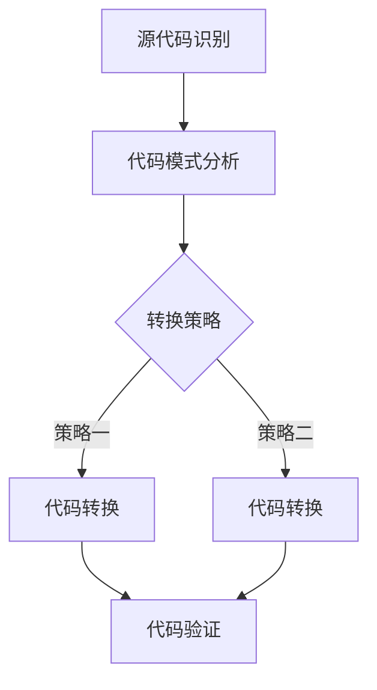
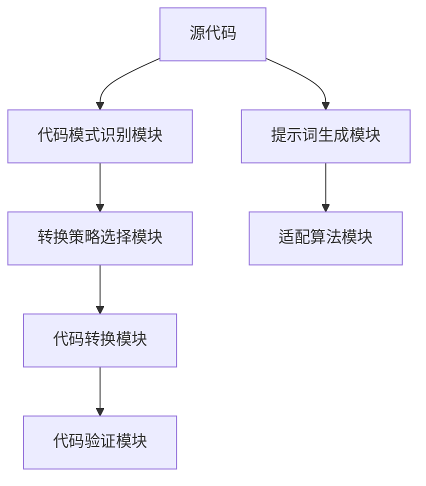
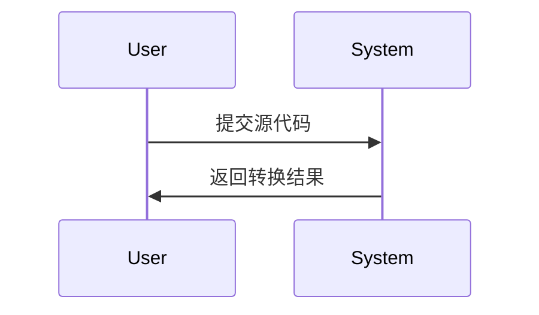
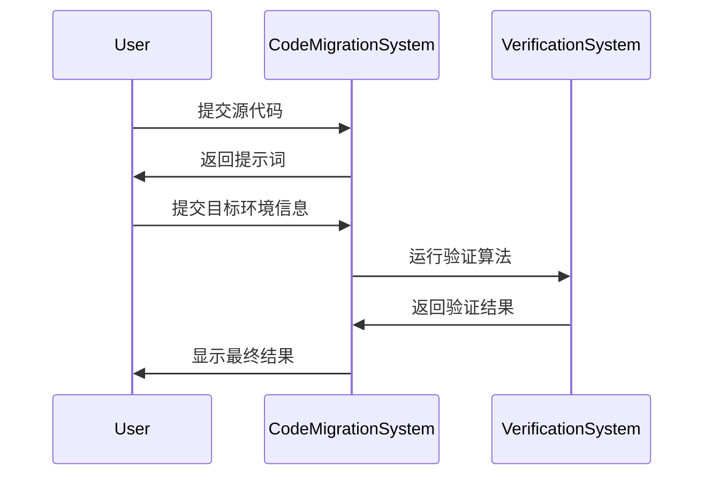

                 

# AI驱动的提示词代码迁移与适配

> 关键词：AI驱动，代码迁移，提示词，适配，编程环境

> 摘要：本文将探讨AI驱动的提示词代码迁移与适配技术，通过详细分析其背景、核心概念、原理和实现方法，展示如何利用人工智能技术解决编程环境多样化带来的兼容性问题。

### 目录大纲：AI驱动的提示词代码迁移与适配

#### 第一部分：背景介绍

##### 第1章：问题背景与核心概念

1.1 问题背景

- **AI驱动的提示词代码迁移与适配的定义**：AI驱动的提示词代码迁移与适配是一种利用人工智能技术，将一种编程环境下的代码自动转换并适配到另一种编程环境或平台上的方法。

- **为何需要AI驱动的提示词代码迁移与适配**：随着人工智能技术的快速发展，编程环境越来越多样化，但不同环境之间的兼容性较差，因此需要一种高效、智能的解决方案来应对这种挑战。

1.2 核心概念

- **AI驱动的代码迁移**：利用人工智能技术，如机器学习和自然语言处理，自动识别代码模式，实现代码的转换。

- **提示词**：在代码迁移过程中，用于指导代码转换的提示性信息。

- **适配**：将迁移后的代码在目标环境中进行验证和调试，确保其正常运行。

1.3 边界与外延

- **边界**：AI驱动的提示词代码迁移与适配主要关注编程环境的兼容性和代码的可移植性。

- **外延**：该技术还可应用于其他领域的代码迁移，如数据库迁移、Web应用迁移等。

1.4 概念结构与核心要素组成

- **概念结构**：代码迁移系统、提示词生成与优化、代码适配与验证。

- **核心要素组成**：源代码、目标环境、AI模型、提示词库、适配算法。

#### 第二部分：核心概念与联系

##### 第2章：AI驱动的代码迁移原理与实现

2.1 AI驱动的代码迁移原理

- **代码模式识别**：通过机器学习算法，如深度神经网络，识别代码中的模式和结构。

- **转换策略**：根据代码模式和目标环境的特性，设计合适的转换策略。

2.2 提示词生成与优化

- **提示词的作用**：提示词用于指导代码迁移过程，提高迁移的准确性和效率。

- **提示词生成方法**：基于规则、基于语义分析和基于深度学习等方法。

2.3 代码适配与验证

- **适配算法**：使用自动化工具或人工干预，对迁移后的代码进行适配和验证。

- **验证方法**：单元测试、集成测试和性能测试等。

2.4 核心概念属性特征对比表格

| 概念       | 描述                                                   | 属性特征对比                         |
|------------|----------------------------------------------------------|-------------------------------------|
| 代码模式识别 | 识别代码中的模式和结构                               | 精度、效率、可扩展性                |
| 提示词生成  | 生成用于指导代码迁移的提示性信息                     | 准确性、可解释性、适应性            |
| 适配算法    | 对迁移后的代码进行适配和验证                         | 精度、效率、可维护性                |

#### 第三部分：算法原理讲解

##### 第3章：AI驱动的代码迁移算法详解

3.1 算法mermaid流程图



3.2 Python源代码实现

```python
# 代码模式识别
def recognize_patterns(source_code):
    # 代码实现
    pass

# 转换策略
def choose_strategy(patterns, target_environment):
    # 代码实现
    pass

# 代码转换
def convert_code(strategy, source_code):
    # 代码实现
    pass

# 代码验证
def verify_code(target_code):
    # 代码实现
    pass
```

3.3 算法原理讲解

- **源代码识别**：通过解析源代码，提取出关键的模式和信息。

- **代码模式分析**：使用机器学习算法，如循环神经网络（RNN）或变换器（Transformer），对提取的代码模式进行分析。

- **转换策略**：根据分析结果，选择合适的转换策略。

- **代码转换**：执行转换策略，将源代码转换为适应目标环境的代码。

- **代码验证**：对转换后的代码进行验证，确保其功能正确性。

#### 第四部分：系统分析与架构设计方案

##### 第4章：问题场景介绍

- **场景描述**：随着企业业务的不断发展，需要将现有系统迁移到新的平台，以满足更高的性能和可扩展性需求。

##### 第5章：项目介绍

- **项目目标**：实现一个AI驱动的提示词代码迁移与适配系统，支持多种编程环境之间的代码迁移。

##### 第6章：系统功能设计

6.1 领域模型

```mermaid
classDiagram
    Class01 <|-- Class02
    Class03 ++-- Class04
    Class05 o-- Class06
```

##### 第7章：系统架构设计

7.1 系统架构



##### 第8章：系统接口设计和系统交互

8.1 系统接口设计



8.2 系统交互



#### 第五部分：项目实战

##### 第9章：环境安装

- **安装说明**：介绍如何搭建AI驱动的提示词代码迁移与适配系统的开发环境，包括所需的软件和硬件配置。

##### 第10章：系统核心实现

10.1 源代码实现

```python
# 代码模式识别
def recognize_patterns(source_code):
    # 代码实现
    pass

# 转换策略
def choose_strategy(patterns, target_environment):
    # 代码实现
    pass

# 代码转换
def convert_code(strategy, source_code):
    # 代码实现
    pass

# 代码验证
def verify_code(target_code):
    # 代码实现
    pass
```

10.2 代码应用解读与分析

- **应用场景**：介绍如何将AI驱动的提示词代码迁移与适配系统应用于实际项目中。

- **案例分析**：通过具体案例，展示系统的应用效果和优势。

##### 第11章：实际案例分析和详细讲解剖析

- **案例描述**：选择一个实际项目，分析其代码迁移和适配过程中遇到的问题和解决方案。

- **详细讲解**：对案例中的关键技术点和实现方法进行深入讲解。

##### 第12章：项目小结

- **总结**：回顾项目的主要成果和收获，讨论未来可能的研究方向和改进措施。

#### 第六部分：最佳实践 tips、小结、注意事项、拓展阅读

##### 第13章：最佳实践 tips

- **实战经验**：分享项目实施过程中积累的最佳实践和技巧。

##### 第14章：小结

- **核心要点**：回顾文章的主要内容，总结核心观点和结论。

##### 第15章：注意事项

- **问题排查**：介绍在代码迁移与适配过程中可能遇到的问题及其解决方法。

##### 第16章：拓展阅读

- **参考资料**：提供相关领域的研究论文、书籍和在线资源，供读者进一步学习和探索。

### 结尾

作者：AI天才研究院/AI Genius Institute & 禅与计算机程序设计艺术 /Zen And The Art of Computer Programming

本文通过详细分析AI驱动的提示词代码迁移与适配技术，展示了如何利用人工智能技术解决编程环境多样化带来的兼容性问题。通过对核心概念、算法原理、系统架构和项目实战的深入探讨，读者可以更好地理解并应用这项技术，提升代码迁移和适配的效率和质量。希望本文能为从事相关领域的技术人员提供有价值的参考和启发。

