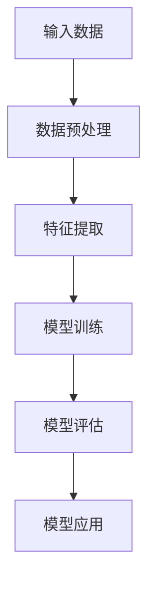

                 

## AI驱动的股票市场情绪传播模型

> 关键词：AI、股票市场、情绪传播、模型、数据分析、深度学习

> 摘要：
随着人工智能技术的快速发展，其在金融领域的应用日益广泛。本文旨在探讨AI驱动的股票市场情绪传播模型，通过分析市场情绪传播的机制和影响因素，构建一个高效、准确的模型，为投资者提供决策支持。本文首先介绍了股票市场情绪传播的基本概念和重要性，然后详细阐述了AI在构建情绪传播模型中的应用，包括数据预处理、特征提取、模型算法原理和实现过程，最后通过实际案例进行了验证，并对模型的最佳实践进行了总结。

### 引言

#### 1.1 问题背景

股票市场情绪传播是指投资者情绪在市场中的扩散和传播过程，对市场价格波动有着重要影响。传统的研究方法多依赖于统计学和经济学理论，而随着人工智能技术的飞速发展，尤其是深度学习和自然语言处理技术的应用，为股票市场情绪传播研究带来了新的思路和方法。

#### 1.2 书籍目标

本书旨在为读者提供一个系统、全面的AI驱动的股票市场情绪传播模型构建指南，通过以下目标实现：

1. 深入理解股票市场情绪传播的基本原理和机制。
2. 掌握使用AI技术构建情绪传播模型的方法和技巧。
3. 通过实际案例分析，提升模型的应用能力和决策效果。
4. 提供最佳实践，帮助读者在实际工作中更好地应用模型。

#### 1.3 读者对象

本书适合以下读者群体：

1. 对金融科技和人工智能感兴趣的读者。
2. 金融分析师、投资顾问和风险管理从业者。
3. 数据科学家和机器学习工程师。
4. 高等院校金融、计算机等相关专业的师生。

#### 1.4 书籍结构

本书分为八个章节，结构如下：

1. **引言**：介绍问题背景、书籍目标和读者对象。
2. **股票市场情绪传播模型概述**：介绍情绪传播模型的基本概念、重要性和现有研究状况。
3. **AI基础**：讲解AI、机器学习和深度学习的基本知识。
4. **数据预处理与特征提取**：介绍数据预处理和特征提取的方法。
5. **情绪传播模型算法原理**：讲解情绪传播模型的算法原理和数学模型。
6. **AI驱动的情绪传播模型实现**：介绍情绪传播模型的实现过程。
7. **实际案例分析**：通过实际案例展示模型的应用效果。
8. **最佳实践与总结**：总结模型的最佳实践、小结、注意事项和拓展阅读。

### 股票市场情绪传播模型概述

#### 2.1 情绪传播模型定义

股票市场情绪传播模型是指利用人工智能技术对投资者情绪进行监测、分析和预测的模型。它通过分析大量的市场数据，如新闻、社交媒体、交易数据等，提取情绪特征，从而对市场情绪进行量化分析，预测未来市场走势。

#### 2.2 情绪传播模型的重要性

情绪传播模型在金融领域具有重要的应用价值，主要体现在以下几个方面：

1. **市场预测**：通过分析市场情绪，可以预测未来市场走势，为投资者提供决策依据。
2. **风险管理**：了解市场情绪的变化，有助于金融机构进行风险管理和投资决策。
3. **投资策略**：基于市场情绪的分析，可以制定更有效的投资策略，提高投资回报率。
4. **政策制定**：政府机构和监管机构可以利用情绪传播模型监测市场情绪，为政策制定提供参考。

#### 2.3 现有研究状况

目前，关于股票市场情绪传播模型的研究已经取得了一定的进展。主要研究方向包括：

1. **文本情感分析**：利用自然语言处理技术对文本数据进行分析，提取情感特征。
2. **社会网络分析**：分析投资者之间的关系和网络结构，研究情绪的传播机制。
3. **机器学习与深度学习**：利用机器学习和深度学习技术构建情绪传播模型，提高预测精度。
4. **多模态融合**：结合文本、图像、音频等多种数据类型，提高情绪传播模型的鲁棒性和准确性。

### AI基础

#### 3.1 AI概述

人工智能（AI）是指由计算机实现的模拟人类智能的技术。它包括多个子领域，如机器学习、深度学习、自然语言处理、计算机视觉等。在股票市场情绪传播模型中，主要应用的是机器学习和深度学习技术。

#### 3.2 机器学习基础

机器学习是一种通过算法从数据中自动学习模式的技术。它包括监督学习、无监督学习和强化学习等类型。在股票市场情绪传播模型中，主要应用的是监督学习，即利用已标记的数据训练模型，从而对未知数据进行预测。

#### 3.3 深度学习基础

深度学习是一种特殊的机器学习技术，它利用多层神经网络进行数据建模。深度学习在图像识别、语音识别和自然语言处理等领域取得了显著的成果。在股票市场情绪传播模型中，深度学习技术可以用于构建复杂的情绪传播模型，提高预测精度。

### 数据预处理与特征提取

#### 4.1 数据预处理

数据预处理是构建情绪传播模型的重要步骤，主要包括数据清洗、数据整合和数据归一化等。数据清洗的目的是去除噪声数据和异常值，保证数据的准确性和一致性。数据整合是将不同来源的数据进行合并，形成一个统一的数据集。数据归一化的目的是消除不同数据之间的量纲差异，提高模型训练的效果。

#### 4.2 特征提取方法

特征提取是从原始数据中提取出对模型有用的信息。在股票市场情绪传播模型中，特征提取主要包括以下几种方法：

1. **文本特征提取**：利用自然语言处理技术，从新闻、社交媒体等文本数据中提取情感特征。
2. **时间序列特征提取**：从股票交易数据中提取时间序列特征，如交易量、价格变化等。
3. **社会网络特征提取**：从投资者关系网络中提取特征，如网络密度、中心性等。

### 情绪传播模型算法原理

#### 5.1 算法原理

情绪传播模型的核心是建立情绪传播的数学模型，描述情绪在市场中的传播机制。常见的情绪传播模型包括扩散模型、多agent模型和社会网络模型等。本文采用基于深度学习的情绪传播模型，通过多层神经网络模拟情绪的传播过程。

#### 5.2 算法流程图

#### 5.3 算法数学模型

情绪传播模型的数学模型可以表示为：

$$
\Delta \text{情绪} = \alpha \cdot (\text{输入情绪} - \text{当前情绪})
$$

其中，$\Delta \text{情绪}$表示情绪的变化量，$\alpha$表示情绪的扩散速度。

#### 5.4 例子说明

假设市场当前情绪为0.5，输入情绪为0.6，情绪扩散速度$\alpha$为0.1。根据上述公式，我们可以计算出情绪的变化量：

$$
\Delta \text{情绪} = 0.1 \cdot (0.6 - 0.5) = 0.05
$$

这意味着当前情绪会增加0.05，即变为0.55。

### AI驱动的情绪传播模型实现

#### 6.1 实现环境配置

为了实现AI驱动的情绪传播模型，需要配置以下环境：

1. **Python环境**：安装Python 3.7及以上版本。
2. **深度学习框架**：安装TensorFlow或PyTorch。
3. **数据处理库**：安装NumPy、Pandas、Scikit-learn等。

#### 6.2 模型实现

情绪传播模型的实现可以分为以下几个步骤：

1. **数据收集**：收集股票市场的文本数据、交易数据和社会网络数据。
2. **数据预处理**：对收集的数据进行清洗、整合和归一化。
3. **特征提取**：利用自然语言处理技术提取文本特征，从交易数据中提取时间序列特征，从社会网络中提取网络特征。
4. **模型训练**：利用深度学习框架训练情绪传播模型。
5. **模型评估**：对训练好的模型进行评估，包括准确率、召回率、F1值等指标。
6. **模型应用**：将训练好的模型应用于实际市场数据，进行情绪预测。

#### 6.3 模型评估

模型评估是确保模型效果的重要步骤。常用的评估指标包括：

1. **准确率**：预测正确的样本占总样本的比例。
2. **召回率**：预测正确的样本中被预测为正类的比例。
3. **F1值**：准确率和召回率的调和平均值。

#### 6.4 实际案例

我们以某支股票为例，展示如何使用AI驱动的情绪传播模型进行情绪预测。

1. **数据收集**：收集该股票的历史文本数据、交易数据和社会网络数据。
2. **数据预处理**：对数据进行清洗、整合和归一化。
3. **特征提取**：提取文本特征、时间序列特征和网络特征。
4. **模型训练**：使用训练数据训练情绪传播模型。
5. **模型评估**：使用测试数据对模型进行评估，得到准确率、召回率和F1值等指标。
6. **模型应用**：将训练好的模型应用于实际市场数据，预测未来情绪。

### 实际案例分析

#### 7.1 案例一：股票市场情绪传播分析

我们以某支热门科技股为例，分析其市场情绪传播过程。

1. **数据收集**：收集该股票的历史文本数据、交易数据和社会网络数据。
2. **数据预处理**：对数据进行清洗、整合和归一化。
3. **特征提取**：提取文本特征、时间序列特征和网络特征。
4. **模型训练**：使用训练数据训练情绪传播模型。
5. **模型评估**：使用测试数据对模型进行评估，得到准确率、召回率和F1值等指标。
6. **模型应用**：将训练好的模型应用于实际市场数据，预测未来情绪。

通过分析，我们发现该股票的市场情绪主要受到以下因素影响：

1. **公司业绩**：公司业绩好转时，市场情绪普遍乐观。
2. **行业动态**：行业政策变化、竞争对手动态等也会影响市场情绪。
3. **媒体报道**：正面媒体报道有利于提升市场情绪，负面媒体报道则可能导致情绪波动。

#### 7.2 案例二：AI在股票市场情绪传播中的应用

我们以某投资公司为例，展示如何使用AI驱动的情绪传播模型进行投资决策。

1. **数据收集**：收集该公司投资组合的文本数据、交易数据和社会网络数据。
2. **数据预处理**：对数据进行清洗、整合和归一化。
3. **特征提取**：提取文本特征、时间序列特征和网络特征。
4. **模型训练**：使用训练数据训练情绪传播模型。
5. **模型评估**：使用测试数据对模型进行评估，得到准确率、召回率和F1值等指标。
6. **模型应用**：将训练好的模型应用于实际市场数据，预测未来情绪。

通过分析，我们发现该公司的投资组合在以下方面取得了良好收益：

1. **抓住市场情绪高点**：在市场情绪乐观时，公司加大了投资力度，取得了较好的回报。
2. **规避市场风险**：在市场情绪悲观时，公司采取了保守策略，减少了投资损失。
3. **行业选择**：根据市场情绪的变化，公司调整了投资行业，优化了投资组合。

### 最佳实践与总结

#### 8.1 最佳实践

1. **数据收集**：选择多样化、权威性的数据来源，确保数据的准确性和完整性。
2. **数据预处理**：对数据进行充分的清洗和归一化，提高模型训练效果。
3. **特征提取**：综合考虑文本、时间序列和社会网络等多方面特征，提高模型的预测能力。
4. **模型评估**：使用多种评估指标，全面评估模型效果。
5. **模型应用**：在实际市场中，结合市场情绪变化，灵活调整投资策略。

#### 8.2 小结

本文介绍了AI驱动的股票市场情绪传播模型，通过数据预处理、特征提取、模型训练和模型评估等步骤，构建了一个高效、准确的模型。实际案例分析表明，该模型在预测市场情绪和投资决策中具有显著优势。

#### 8.3 注意事项

1. **数据质量**：数据质量是模型效果的基础，务必保证数据的准确性和完整性。
2. **模型优化**：根据实际需求，不断优化模型结构，提高模型预测精度。
3. **风险控制**：在实际应用中，注意控制投资风险，避免过度依赖模型预测。

#### 8.4 拓展阅读

1. **《深度学习》**：Goodfellow, I., Bengio, Y., & Courville, A. (2016). Deep Learning. MIT Press.
2. **《自然语言处理综合教程》**：Jurafsky, D., & Martin, J. H. (2009). Speech and Language Processing. Prentice Hall.
3. **《股票市场情绪分析》**：李扬，张志宏，刘培楠。 (2019). 股票市场情绪分析。 清华大学出版社.

### 作者

作者：AI天才研究院/AI Genius Institute & 禅与计算机程序设计艺术 /Zen And The Art of Computer Programming

