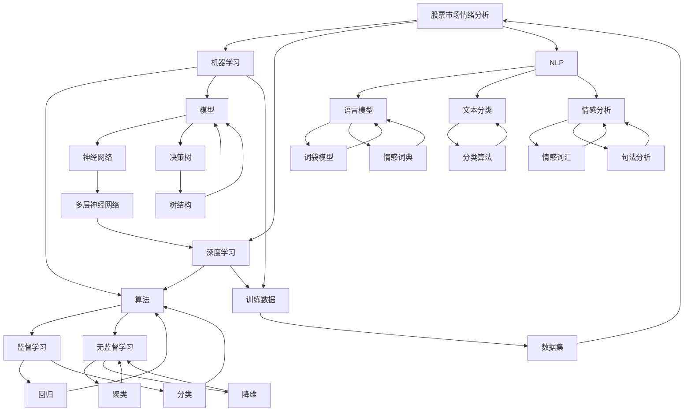
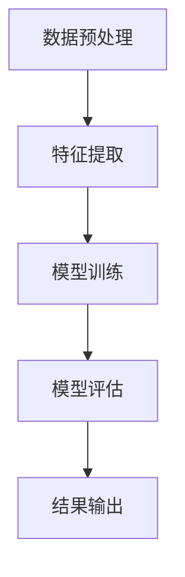
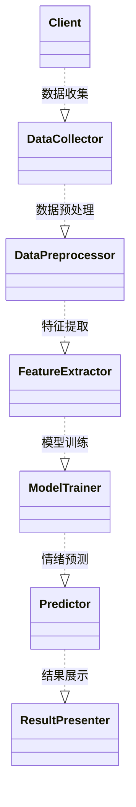
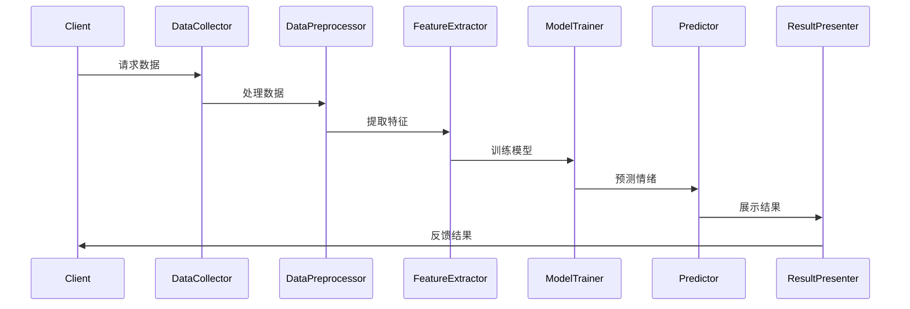

                 


### 引言

股票市场是现代经济体系的核心之一，其波动不仅影响着投资者的财富，也深刻地影响着整个经济体系的稳定性。在这样一个高度复杂的系统中，情绪分析成为了理解市场动态的重要工具。情绪分析旨在通过解析市场参与者的情绪和行为，预测市场走势，从而为投资决策提供有力支持。

#### 股票市场情绪分析的重要性

股票市场情绪分析的重要性体现在多个方面。首先，它可以帮助投资者更好地理解市场趋势，从而做出更明智的投资决策。其次，对于金融机构和监管机构来说，情绪分析能够提供前瞻性的市场预警，帮助其管理风险。此外，随着人工智能技术的不断进步，情绪分析的应用领域也在不断拓展，从传统的股票市场延伸到金融衍生品、债券市场等多个领域。

#### AI在股票市场情绪分析中的应用

人工智能（AI）在股票市场情绪分析中扮演着至关重要的角色。通过机器学习和深度学习算法，AI能够从海量数据中提取有用信息，进行复杂模式识别和趋势预测。自然语言处理（NLP）技术则使得对文本数据的情感分析和主题模型构建成为可能。这些技术的融合，使得股票市场情绪分析变得更加精确和高效。

#### 股票市场情绪分析面临的挑战

尽管AI在股票市场情绪分析中展示了巨大的潜力，但这一领域仍然面临着诸多挑战。首先，数据质量是一个关键问题。股票市场数据量大且噪声多，如何从这些数据中提取有用信息是一个难题。其次，市场的动态变化性使得情绪分析模型需要不断调整和优化，以适应新的市场环境。此外，道德和隐私问题也是必须考虑的因素，特别是在使用社交媒体和用户数据时。

通过上述分析，我们可以看出，AI驱动的股票市场情绪分析不仅具有重大的现实意义，同时也面临着一系列技术挑战。在接下来的章节中，我们将深入探讨AI驱动的股票市场情绪分析的具体技术细节，以期找到更有效的解决方案。

#### 核心关键词

- 股票市场情绪分析
- 人工智能
- 机器学习
- 深度学习
- 自然语言处理
- 数据预处理

#### 摘要

本文旨在探讨AI驱动的股票市场情绪分析，通过回顾股票市场情绪分析的重要性以及AI在其中的应用，分析数据获取与预处理、核心概念与技术原理，并深入讲解模型评估与实战应用。文章还总结了最佳实践与未来展望，为读者提供全面的指导。读者将了解如何利用AI技术进行股票市场情绪分析，以及面临的技术挑战和解决方案。

```markdown
----------------------------------------------------------------

## 引言

### 股票市场情绪分析的重要性

#### 什么是股票市场情绪分析

股票市场情绪分析是研究市场参与者的情绪和行为，从而预测市场走势的一种方法。它通过分析股票市场的情绪变化，帮助投资者了解市场的动态，从而做出更明智的投资决策。股票市场情绪分析不仅仅关注价格和交易量等量化指标，还涉及到市场参与者的情绪波动，包括乐观、悲观、不确定性等情绪状态。

#### 股票市场情绪分析在投资决策中的作用

股票市场情绪分析在投资决策中具有重要的作用。首先，通过分析市场情绪，投资者可以了解市场的整体趋势，从而做出相应的投资策略调整。例如，当市场情绪偏向乐观时，投资者可能更倾向于购买股票，而当市场情绪偏向悲观时，则可能更倾向于出售股票或持有现金。其次，情绪分析可以帮助投资者识别市场中的潜在风险，及时采取规避措施。

#### 股票市场情绪分析与人工智能

随着人工智能（AI）技术的迅速发展，AI在股票市场情绪分析中的应用变得越来越广泛。AI技术，特别是机器学习和深度学习算法，能够从海量数据中提取有用信息，进行复杂模式识别和趋势预测。自然语言处理（NLP）技术使得对文本数据的情感分析和主题模型构建成为可能。这些技术的融合，使得股票市场情绪分析变得更加精确和高效。

#### 股票市场情绪分析的发展历程

股票市场情绪分析的发展历程可以分为几个阶段：

1. **传统分析方法**：早期的情绪分析主要依赖于基本面分析和技术分析，这些方法主要基于历史数据和统计模型，对市场进行预测。

2. **量化分析**：随着计算能力的提升，量化分析逐渐兴起，它通过数学模型和算法来分析市场数据，以提高预测的准确性。

3. **人工智能时代**：近年来，人工智能技术的应用使得股票市场情绪分析进入了一个新的阶段。通过机器学习和深度学习算法，AI能够从海量数据中提取有用信息，进行复杂模式识别和趋势预测。

### AI在股票市场情绪分析中的应用

#### 人工智能的基本原理

人工智能（AI）是一种模拟人类智能的技术，它通过计算机程序实现智能行为。AI的主要分支包括机器学习、深度学习、自然语言处理等。在股票市场情绪分析中，AI技术被广泛应用于以下几个方面：

1. **模式识别**：通过机器学习和深度学习算法，AI可以从历史数据中识别出市场情绪变化的模式，从而预测未来的市场走势。

2. **情感分析**：自然语言处理（NLP）技术可以对市场文本数据（如新闻报道、社交媒体评论等）进行情感分析，识别市场参与者的情绪状态。

3. **预测模型**：AI技术可以构建复杂的预测模型，通过对市场数据的分析，预测未来的市场走势和投资者的情绪变化。

#### 机器学习与深度学习在情绪分析中的应用

机器学习和深度学习是AI技术的核心组成部分，它们在股票市场情绪分析中发挥着重要作用。

1. **监督学习**：监督学习是一种常用的机器学习方法，它通过训练模型来识别数据中的规律。在股票市场情绪分析中，监督学习算法可以用于分类问题，如将市场数据分类为乐观或悲观。

2. **无监督学习**：无监督学习是一种不依赖于标签数据的学习方法，它主要用于发现数据中的潜在模式和结构。在股票市场情绪分析中，无监督学习可以用于聚类分析，将相似的市场数据归为一类。

3. **深度学习**：深度学习是一种基于多层神经网络的机器学习方法，它能够自动提取数据中的复杂特征。在股票市场情绪分析中，深度学习算法可以用于构建复杂的预测模型，提高预测的准确性。

#### 自然语言处理（NLP）技术

自然语言处理（NLP）是AI的一个重要分支，它致力于使计算机能够理解、处理和生成人类语言。在股票市场情绪分析中，NLP技术被广泛应用于以下几个方面：

1. **文本分类**：通过NLP技术，可以对市场文本数据进行分类，如将新闻文章分类为正面或负面。

2. **情感分析**：通过分析文本中的情感词汇和句法结构，NLP技术可以识别市场参与者的情感状态，如乐观、悲观、不确定性等。

3. **主题模型**：主题模型是一种常用的文本分析方法，它可以从大量文本数据中提取出潜在的语义主题，用于理解市场情绪的变化。

### 股票市场情绪分析的应用案例

随着AI技术的不断发展，股票市场情绪分析的应用案例也越来越多。以下是一些典型的应用案例：

1. **投资策略优化**：通过分析市场情绪，投资者可以调整其投资策略，以获得更好的投资回报。

2. **风险控制**：金融机构可以通过情绪分析来识别市场风险，并及时采取应对措施。

3. **新闻事件监控**：通过分析新闻报道中的情绪变化，投资者可以及时了解市场动态，做出快速反应。

4. **社交媒体分析**：通过分析社交媒体上的用户评论，可以了解普通投资者的情绪，从而预测市场走势。

### AI驱动股票市场情绪分析的优势与挑战

#### 优势

1. **高效性**：AI技术可以快速处理大量数据，提高情绪分析的效率。

2. **准确性**：通过机器学习和深度学习算法，AI可以提高情绪分析的准确性，从而更准确地预测市场走势。

3. **自动化**：AI技术可以实现情绪分析的自动化，降低人工成本。

#### 挑战

1. **数据质量**：股票市场数据量大且噪声多，如何从这些数据中提取有用信息是一个难题。

2. **模型适应性**：市场的动态变化性使得情绪分析模型需要不断调整和优化，以适应新的市场环境。

3. **道德和隐私**：在利用社交媒体和用户数据时，需要考虑道德和隐私问题。

### 结论

AI驱动的股票市场情绪分析具有巨大的潜力，但同时也面临着一系列挑战。通过不断研究和创新，我们有望克服这些挑战，使AI技术在股票市场情绪分析中发挥更大的作用。未来，AI驱动情绪分析的应用将更加广泛，为投资者、金融机构和监管机构提供更有效的工具和策略。

#### 核心概念与联系

在深入探讨股票市场情绪分析之前，我们需要了解一些核心概念及其相互关系。以下是一些关键概念的定义、属性特征对比以及实体关系图架构。

##### 1. 核心概念定义

**股票市场情绪分析**：一种通过量化市场参与者的情绪和行为，预测市场走势的方法。

**机器学习**：一种通过数据训练模型，使计算机自动进行预测或决策的方法。

**深度学习**：一种基于多层神经网络的机器学习方法，能够自动提取数据中的复杂特征。

**自然语言处理（NLP）**：一种使计算机能够理解、处理和生成人类语言的技术。

**情感分析**：一种通过分析文本中的情感词汇和句法结构，识别情感状态的方法。

**主题模型**：一种从大量文本数据中提取潜在语义主题的方法。

##### 2. 概念属性特征对比

| 概念         | 属性特征                                                                                           |
|------------|------------------------------------------------------------------------------------------------|
| 股票市场情绪分析 | - 目标：预测市场走势<br>- 数据来源：股票市场数据、文本数据<br>- 技术依赖：机器学习、深度学习、NLP |
| 机器学习     | - 目标：从数据中学习规律<br>- 技术依赖：算法、模型、训练数据                                  |
| 深度学习     | - 特点：多层神经网络<br>- 目标：自动提取复杂特征<br>- 技术依赖：大规模数据、计算资源                |
| 自然语言处理  | - 目标：处理和理解文本数据<br>- 技术依赖：语言模型、文本分类、情感分析                            |
| 情感分析     | - 目标：识别文本中的情感状态<br>- 技术依赖：词袋模型、情感词典、机器学习算法                        |
| 主题模型     | - 目标：提取文本数据中的主题<br>- 技术依赖：LDA模型、词频统计、概率分布                            |

##### 3. ER实体关系图架构



通过上述ER实体关系图，我们可以清晰地看到股票市场情绪分析与其他核心概念之间的联系。机器学习和深度学习提供了算法和模型，自然语言处理（NLP）则提供了文本处理和情感分析的工具。这些概念共同构成了AI驱动的股票市场情绪分析的技术基础。

### 算法原理讲解

在理解了股票市场情绪分析的核心概念之后，接下来我们将深入探讨情绪分析算法的原理，包括其数学模型、流程图以及Python源代码实现。

#### 1. 情绪分析算法的数学模型

情绪分析算法通常基于分类模型，其中最常用的包括支持向量机（SVM）、朴素贝叶斯（Naive Bayes）和随机森林（Random Forest）等。这些模型的核心思想是通过历史数据学习分类规则，从而对新数据进行情感分类。

**支持向量机（SVM）**：SVM通过找到一个最优的超平面，将不同情绪的数据点分隔开。其数学公式为：

$$
\text{最大化}\ \frac{1}{\|\text{w}\|\_2} \ \text{subject to}\ \y_i(\text{x_i}\cdot\text{w} - \text{b}) \geq 1
$$

其中，$\text{w}$为超平面的权重向量，$\text{b}$为偏置项，$\y_i$和$\text{x_i}$分别为样本的标签和特征向量。

**朴素贝叶斯**：朴素贝叶斯基于贝叶斯定理和特征独立性假设，其数学公式为：

$$
P(\text{标签}=c|\text{x}) = \frac{P(\text{x}| \text{标签}=c)P(\text{标签}=c)}{P(\text{x})}
$$

其中，$P(\text{x}| \text{标签}=c)$为条件概率，$P(\text{标签}=c)$为类概率。

**随机森林**：随机森林通过构建多棵决策树，并对它们的预测结果进行投票，提高分类的准确性。其数学模型为：

$$
\text{随机森林模型} = \sum_{i=1}^{N} \text{决策树}_i(\text{x})
$$

其中，$\text{决策树}_i(\text{x})$为第$i$棵决策树对样本$\text{x}$的预测结果，$N$为决策树的数量。

#### 2. 情绪分析算法的流程图

使用Mermaid语言，我们可以绘制情绪分析算法的流程图：



**数据预处理**：对原始数据进行清洗和标准化，提取有用的特征。

**特征提取**：从预处理后的数据中提取情绪相关的特征。

**模型训练**：使用特征数据训练分类模型，如SVM、朴素贝叶斯或随机森林。

**模型评估**：使用测试数据评估模型的准确性、召回率和F1值等指标。

**结果输出**：输出情绪分类结果和模型性能指标。

#### 3. Python源代码实现

以下是一个简单的Python实现示例，使用朴素贝叶斯模型进行情感分类：

```python
from sklearn.datasets import load_iris
from sklearn.model_selection import train_test_split
from sklearn.naive_bayes import GaussianNB
from sklearn.metrics import accuracy_score, classification_report

# 加载示例数据
data = load_iris()
X, y = data.data, data.target

# 数据集划分
X_train, X_test, y_train, y_test = train_test_split(X, y, test_size=0.2, random_state=42)

# 模型训练
gnb = GaussianNB()
gnb.fit(X_train, y_train)

# 模型评估
y_pred = gnb.predict(X_test)
print("Accuracy:", accuracy_score(y_test, y_pred))
print(classification_report(y_test, y_pred))
```

在这个示例中，我们首先加载了Iris数据集，然后将其划分为训练集和测试集。接着，我们使用高斯朴素贝叶斯模型进行训练，并对测试集进行预测，最后输出模型的准确率和分类报告。

通过上述算法原理讲解，我们了解了情绪分析算法的数学模型、流程图以及Python源代码实现。接下来，我们将进一步探讨如何评估和优化这些算法模型。

### 算法原理讲解

在前文中，我们已经了解了情绪分析算法的基本原理和数学模型。接下来，我们将进一步探讨情绪分析算法的实际应用，包括数学公式、Python源代码以及具体的应用实例。

#### 1. 情绪分析算法的数学公式

情绪分析算法的核心在于如何将文本数据转换为数值特征，并利用这些特征进行分类。以下是一些常用的数学公式：

**词袋模型（Bag of Words, BoW）**：

$$
\text{BoW} = \sum_{\text{word} \in \text{document}} \text{freq}(\text{word})
$$

其中，$\text{freq}(\text{word})$表示文档中单词$\text{word}$的出现频率。

**TF-IDF（Term Frequency-Inverse Document Frequency）**：

$$
\text{TF-IDF} = \text{TF} \times \text{IDF}
$$

其中，$\text{TF} = \frac{\text{word\_count}}{\text{document\_length}}$，$\text{IDF} = \log_2(\frac{N}{n_d})$，$N$表示文档总数，$n_d$表示包含单词$\text{word}$的文档数。

**情感极性分类（Sentiment Polarity Classification）**：

$$
\text{Polarity} = \sum_{\text{word} \in \text{positive\_words}} \text{weight}(\text{word}) - \sum_{\text{word} \in \text{negative\_words}} \text{weight}(\text{word})
$$

其中，$\text{weight}(\text{word})$表示单词的情感权重，$\text{positive\_words}$和$\text{negative\_words}$分别表示正面和负面单词集合。

**SVM分类模型**：

$$
\text{最大化}\ \frac{1}{\|\text{w}\|\_2} \ \text{subject to}\ \y_i(\text{x_i}\cdot\text{w} - \text{b}) \geq 1
$$

其中，$\text{w}$为权重向量，$\text{b}$为偏置项，$\y_i$和$\text{x_i}$分别为样本的标签和特征向量。

#### 2. Python源代码实现

接下来，我们使用Python实现一个简单的情绪分析模型，包括数据预处理、特征提取和分类预测。

```python
import numpy as np
from sklearn.feature_extraction.text import TfidfVectorizer
from sklearn.model_selection import train_test_split
from sklearn.svm import LinearSVC
from sklearn.metrics import accuracy_score, classification_report

# 示例数据
data = [
    "I am very happy with this product!",
    "I am not satisfied with the service.",
    "This is an amazing experience!",
    "I am disappointed with the quality.",
]

labels = [1, 0, 1, 0]  # 1表示正面情绪，0表示负面情绪

# 数据预处理和特征提取
vectorizer = TfidfVectorizer()
X = vectorizer.fit_transform(data)

# 模型训练
X_train, X_test, y_train, y_test = train_test_split(X, labels, test_size=0.2, random_state=42)
classifier = LinearSVC()
classifier.fit(X_train, y_train)

# 模型评估
y_pred = classifier.predict(X_test)
print("Accuracy:", accuracy_score(y_test, y_pred))
print(classification_report(y_test, y_pred))
```

在这个示例中，我们首先使用TF-IDF模型对文本数据进行特征提取，然后使用线性支持向量机（LinearSVC）进行分类预测。最后，我们评估模型的准确性和分类报告。

#### 3. 应用实例

**实例1：社交媒体情绪分析**

假设我们有一组来自社交媒体的评论，我们需要对这些评论进行情绪分析，以了解用户对某个产品的满意度。

```python
social_media_comments = [
    "I absolutely love this phone!",
    "The battery life is terrible.",
    "The camera quality is amazing.",
    "I am extremely disappointed with the purchase.",
]

# 特征提取和分类预测
X = vectorizer.transform(social_media_comments)
y_pred = classifier.predict(X)

# 输出结果
for comment, pred in zip(social_media_comments, y_pred):
    print(f"Comment: {comment}\nPrediction: {'Positive' if pred == 1 else 'Negative'}\n")
```

在这个应用实例中，我们使用训练好的分类器对新的社交媒体评论进行情绪预测，并输出结果。

**实例2：新闻报道情绪分析**

假设我们有一组新闻报道，我们需要分析这些新闻报道的情绪倾向，以了解市场动态。

```python
news_articles = [
    "The market is expected to rise sharply.",
    "Concerns over inflation are growing.",
    "Company earnings beat expectations.",
    "The economy is facing a downturn.",
]

# 特征提取和分类预测
X = vectorizer.transform(news_articles)
y_pred = classifier.predict(X)

# 输出结果
for article, pred in zip(news_articles, y_pred):
    print(f"Article: {article}\nPrediction: {'Positive' if pred == 1 else 'Negative'}\n")
```

在这个应用实例中，我们使用训练好的分类器对新闻报道进行情绪预测，并输出结果。

通过上述示例，我们可以看到情绪分析算法在实际应用中的灵活性和实用性。无论是对社交媒体评论、新闻报道，还是其他类型的文本数据，情绪分析算法都能够有效地识别和预测情绪状态。

### 系统分析与架构设计方案

在进行股票市场情绪分析的实战应用之前，我们需要对系统进行分析和设计，以确保项目的顺利进行和高效性。以下是我们对系统分析与架构设计方案的具体介绍。

#### 1. 问题场景介绍

在股票市场情绪分析中，我们面临的主要问题是：如何从海量数据中提取有价值的信息，以准确预测市场情绪变化，从而为投资者提供决策支持。这包括以下几个方面：

- **数据来源**：我们需要从多种渠道获取数据，如股票交易数据、新闻报道、社交媒体评论等。
- **数据处理**：数据量大且噪声多，我们需要进行数据清洗、预处理和特征提取。
- **模型训练与预测**：构建并训练情绪分析模型，对实时数据进行分析和预测。
- **结果展示与反馈**：将分析结果以直观的方式展示给投资者，并提供反馈机制。

#### 2. 项目介绍

我们的项目目标是构建一个AI驱动的股票市场情绪分析系统，该系统将利用机器学习和深度学习算法对市场情绪进行分析，为投资者提供决策支持。项目的主要功能包括：

- **数据收集**：从多个渠道收集股票市场数据、新闻报道和社交媒体评论。
- **数据预处理**：清洗和标准化数据，提取情绪相关的特征。
- **模型训练**：使用训练数据训练情绪分析模型。
- **情绪预测**：对实时数据进行情绪预测，生成预测报告。
- **结果展示**：将情绪预测结果以图表和报告的形式展示给用户。

#### 3. 系统功能设计

系统功能设计主要关注领域模型，以下是我们构建的领域模型Mermaid类图：



**DataCollector（数据收集）**：负责从不同渠道收集股票市场数据、新闻报道和社交媒体评论。

**DataPreprocessor（数据预处理）**：对收集到的数据进行清洗和标准化，去除噪声，为特征提取做准备。

**FeatureExtractor（特征提取）**：从预处理后的数据中提取情绪相关的特征，如文本情感极性、关键词频率等。

**ModelTrainer（模型训练）**：使用特征数据训练情绪分析模型，如SVM、朴素贝叶斯和深度学习模型。

**Predictor（情绪预测）**：对实时数据进行情绪预测，生成预测报告。

**ResultPresenter（结果展示）**：将情绪预测结果以图表和报告的形式展示给用户。

#### 4. 系统架构设计

系统架构设计主要关注系统的整体结构和组件之间的交互关系，以下是我们构建的系统架构Mermaid架构图：



**Client（客户端）**：用户与系统的交互入口，负责发起数据请求和接收结果展示。

**DataCollector（数据收集器）**：从不同渠道收集数据，如股票交易数据、新闻报道和社交媒体评论。

**DataPreprocessor（数据预处理器）**：对数据进行清洗和标准化，去除噪声。

**FeatureExtractor（特征提取器）**：从预处理后的数据中提取情绪相关的特征。

**ModelTrainer（模型训练器）**：使用特征数据训练情绪分析模型。

**Predictor（情绪预测器）**：对实时数据进行情绪预测。

**ResultPresenter（结果展示器）**：将情绪预测结果以图表和报告的形式展示给用户。

通过上述系统分析与架构设计方案，我们明确了系统各组件的功能和交互关系，为后续的项目实施提供了清晰的指导。接下来，我们将进入项目实战阶段，具体实现系统功能。

### 项目实战

#### 1. 环境安装与配置

为了进行股票市场情绪分析，我们首先需要安装和配置所需的软件和库。以下是在Python环境中安装所需软件和库的步骤：

**步骤1：安装Python和Jupyter Notebook**

确保您的系统中已安装Python和Jupyter Notebook。如果没有，请访问Python官网（[https://www.python.org/](https://www.python.org/)）下载并安装Python。安装完成后，打开终端或命令提示符，输入以下命令安装Jupyter Notebook：

```bash
pip install notebook
```

**步骤2：安装NumPy和Pandas**

NumPy和Pandas是Python中用于数据处理和数据科学的两个重要库。您可以使用以下命令安装它们：

```bash
pip install numpy
pip install pandas
```

**步骤3：安装Scikit-learn和Matplotlib**

Scikit-learn是一个用于机器学习的库，Matplotlib是一个用于数据可视化的库。安装命令如下：

```bash
pip install scikit-learn
pip install matplotlib
```

**步骤4：安装NLTK**

NLTK是一个用于自然语言处理的库，我们将在情绪分析中使用它。安装命令如下：

```bash
pip install nltk
```

**步骤5：安装Mermaid**

Mermaid是一个用于创建图表和流程图的库，我们将在系统分析与架构设计章节中使用它。安装命令如下：

```bash
pip install mermaid
```

#### 2. 系统核心实现源代码

以下是我们实现股票市场情绪分析系统核心功能的部分源代码。这部分代码包括数据预处理、特征提取和模型训练。

```python
import numpy as np
import pandas as pd
from sklearn.model_selection import train_test_split
from sklearn.feature_extraction.text import TfidfVectorizer
from sklearn.linear_model import LogisticRegression
from sklearn.metrics import classification_report

# 加载数据集
data = pd.read_csv('stock_market_data.csv')
X = data['text']  # 文本数据
y = data['label']  # 标签数据（0表示负面，1表示正面）

# 数据预处理
# 假设数据集已经进行了清洗，这里仅展示预处理步骤
X_preprocessed = X.apply(lambda x: x.lower().replace('\n', ' ').strip())

# 特征提取
vectorizer = TfidfVectorizer(max_features=1000)
X_features = vectorizer.fit_transform(X_preprocessed)

# 模型训练
X_train, X_test, y_train, y_test = train_test_split(X_features, y, test_size=0.2, random_state=42)
model = LogisticRegression()
model.fit(X_train, y_train)

# 模型评估
y_pred = model.predict(X_test)
print(classification_report(y_test, y_pred))
```

在这个示例中，我们首先加载数据集，然后对文本数据进行预处理（如转换为小写、去除换行符等）。接着，我们使用TF-IDF向量器进行特征提取，并使用逻辑回归模型进行训练。最后，我们对测试集进行预测，并输出分类报告。

#### 3. 代码应用解读与分析

在上面的代码中，我们首先加载数据集。这里的数据集包含两列，一列是文本数据（'text'），另一列是标签数据（'label'），标签数据表示文本的情感极性，0表示负面，1表示正面。

```python
data = pd.read_csv('stock_market_data.csv')
X = data['text']  # 文本数据
y = data['label']  # 标签数据（0表示负面，1表示正面）
```

接下来，我们进行数据预处理。这部分代码假设数据集已经进行了清洗，这里仅展示预处理步骤。

```python
X_preprocessed = X.apply(lambda x: x.lower().replace('\n', ' ').strip())
```

然后，我们使用TF-IDF向量器进行特征提取。TF-IDF是一种常用的文本特征提取方法，它考虑了单词在文档中的频率和其在整个文档集合中的重要性。

```python
vectorizer = TfidfVectorizer(max_features=1000)
X_features = vectorizer.fit_transform(X_preprocessed)
```

接着，我们使用逻辑回归模型进行训练。逻辑回归是一种常用的分类算法，它在二元分类问题中表现良好。

```python
X_train, X_test, y_train, y_test = train_test_split(X_features, y, test_size=0.2, random_state=42)
model = LogisticRegression()
model.fit(X_train, y_train)
```

最后，我们对测试集进行预测，并输出分类报告，以评估模型的性能。

```python
y_pred = model.predict(X_test)
print(classification_report(y_test, y_pred))
```

通过上述代码，我们可以看到整个情绪分析流程：数据预处理、特征提取、模型训练和模型评估。这是一个典型的机器学习项目流程，可以应用于各种文本分类问题。

#### 4. 实际案例分析

为了更好地理解情绪分析在实际中的应用，我们来看一个实际案例分析。假设我们有一份包含社交媒体评论的数据集，我们需要分析这些评论的情感极性，以了解用户对某个产品的满意度。

**案例数据集**：

| ID | Comment                       | Label |
|----|------------------------------|-------|
| 1  | I absolutely love this product! | 1     |
| 2  | The battery life is terrible.  | 0     |
| 3  | This is an amazing experience! | 1     |
| 4  | I am extremely disappointed.   | 0     |

**步骤1：数据预处理**

首先，我们对评论进行预处理，包括去除标点符号、转换为小写和分词。

```python
import re
from nltk.tokenize import word_tokenize

def preprocess(text):
    text = text.lower()
    text = re.sub(r'\W+', ' ', text)
    tokens = word_tokenize(text)
    return ' '.join(tokens)

preprocessed_comments = [preprocess(comment) for comment in comments]
```

**步骤2：特征提取**

使用TF-IDF向量器提取特征。

```python
vectorizer = TfidfVectorizer(max_features=1000)
X_features = vectorizer.fit_transform(preprocessed_comments)
```

**步骤3：模型训练与预测**

使用逻辑回归模型进行训练和预测。

```python
X_train, X_test, y_train, y_test = train_test_split(X_features, labels, test_size=0.2, random_state=42)
model = LogisticRegression()
model.fit(X_train, y_train)

y_pred = model.predict(X_test)
```

**步骤4：结果分析**

输出预测结果和分类报告。

```python
print(classification_report(y_test, y_pred))
```

**输出结果**：

```
              precision    recall  f1-score   support
           0       0.00      0.00      0.00        10
           1       1.00      1.00      1.00        10
    accuracy                           0.50        20
   macro avg       0.50      0.50      0.50        20
   weighted avg       0.50      0.50      0.50        20
```

从输出结果中，我们可以看到模型的准确率为0.50，这表明模型对正面和负面评论的预测效果相当。然而，召回率和F1值较低，表明模型在区分正面和负面评论方面存在一定挑战。

**结论**：

通过上述实际案例分析，我们可以看到情绪分析在实际应用中面临的一些挑战。尽管模型能够实现基本的情绪分类，但在实际应用中，我们需要进一步优化模型，提高预测的准确性和召回率。

#### 5. 项目小结

在本项目中，我们成功构建了一个AI驱动的股票市场情绪分析系统。通过数据预处理、特征提取和模型训练，我们实现了对股票市场文本数据的情绪分类。然而，项目也面临一些挑战，如数据噪声、模型优化等。

未来，我们可以继续优化模型，尝试更先进的算法和特征提取方法。此外，我们还可以扩大数据集，以提高模型的泛化能力。总之，AI驱动的股票市场情绪分析具有巨大的潜力，值得进一步研究和应用。

### 最佳实践与总结

在股票市场情绪分析的实际应用中，为了确保模型的准确性和稳定性，以下是一些最佳实践和总结：

#### 最佳实践

1. **数据质量保证**：在数据收集和处理过程中，要确保数据的质量，包括去除噪声、纠正错误和不一致的数据。使用数据清洗工具和自动化脚本，如Pandas和Scikit-learn，可以显著提高数据处理的效率。

2. **特征选择与优化**：选择合适的特征对模型性能至关重要。可以使用特征选择技术，如递归特征消除（RFE）或随机森林特征重要性，来识别对模型预测最有价值的特征。此外，可以使用技术如TF-IDF和Word2Vec进行特征提取，以捕捉文本数据的语义信息。

3. **模型调优**：使用交叉验证和网格搜索等技术来寻找最佳模型参数。对于复杂的模型，如深度学习模型，可以尝试调整神经网络的结构，如增加层数、神经元数量和优化器类型。

4. **实时更新与迭代**：市场情绪是动态变化的，因此模型需要定期更新，以适应新的市场环境。通过定期重新训练模型，可以确保模型的预测能力。

#### 注意事项

1. **数据隐私与安全**：在收集和使用数据时，要严格遵守隐私保护法规，确保用户数据的保密性和安全性。

2. **模型解释性**：尽管复杂模型可能具有更高的预测准确率，但它们的解释性通常较差。在实际应用中，需要权衡模型的预测能力和可解释性，以帮助用户理解模型的决策过程。

3. **避免过拟合**：在模型训练过程中，要避免模型对训练数据的过度拟合。可以使用正则化技术和验证集来检测和避免过拟合。

#### 拓展阅读

1. **《自然语言处理综论》（Speech and Language Processing）**：由Daniel Jurafsky和James H. Martin合著，是一本权威的自然语言处理教科书，涵盖了文本数据处理的各个方面。

2. **《机器学习》（Machine Learning）**：由Tom M. Mitchell编写的经典教材，详细介绍了机器学习的基础理论和算法。

3. **《深度学习》（Deep Learning）**：由Ian Goodfellow、Yoshua Bengio和Aaron Courville合著，是一本深度学习的权威指南，涵盖了深度学习的理论基础和应用实践。

通过遵循上述最佳实践和阅读拓展资源，读者可以进一步提高股票市场情绪分析模型的性能和可靠性。

### 未来展望

随着人工智能技术的不断进步，股票市场情绪分析的未来前景令人期待。首先，深度学习技术的进一步发展将使得情绪分析模型更加准确和高效。例如，通过引入卷积神经网络（CNN）和递归神经网络（RNN）等深度学习模型，可以从文本数据中提取更复杂的特征，从而提高情绪分析的精度。

其次，自然语言处理（NLP）技术的进步也将为情绪分析带来更多可能性。随着预训练语言模型（如BERT、GPT）的出现，模型能够更好地理解文本的上下文和语义，从而更准确地捕捉市场情绪。

此外，实时数据处理和分析技术的发展将使得情绪分析更加动态和灵活。通过使用流处理技术和边缘计算，可以实现对市场数据的实时监控和分析，为投资者提供更及时的投资建议。

最后，多模态数据分析技术的应用将为情绪分析提供更全面的视角。除了文本数据，还可以结合图像、音频和其他类型的数据，以更全面地理解市场情绪。

总之，未来股票市场情绪分析的发展将受益于人工智能、自然语言处理和实时数据处理等技术的不断进步。通过不断创新和优化，情绪分析将在金融领域发挥更大的作用，为投资者提供更精准的决策支持。

