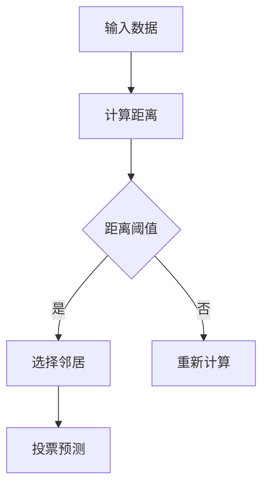
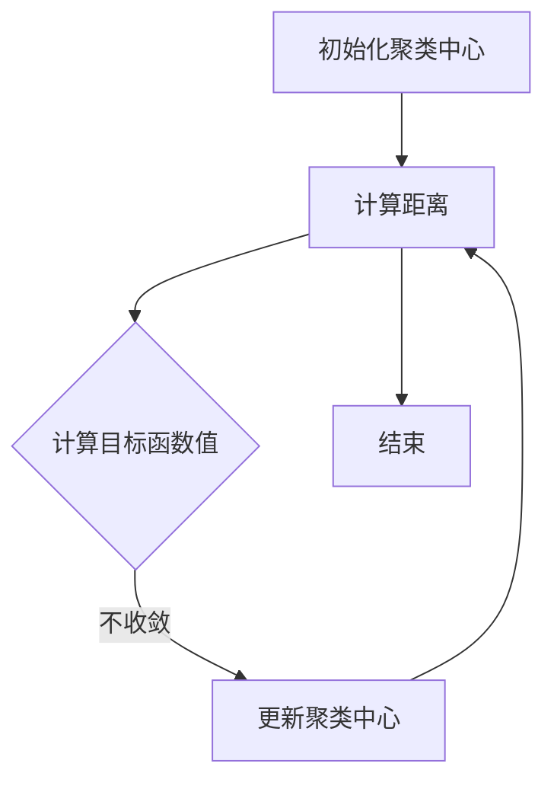
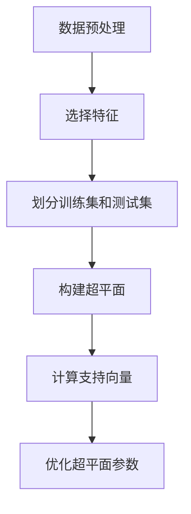
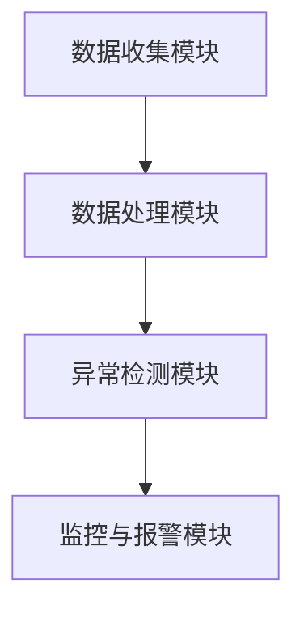
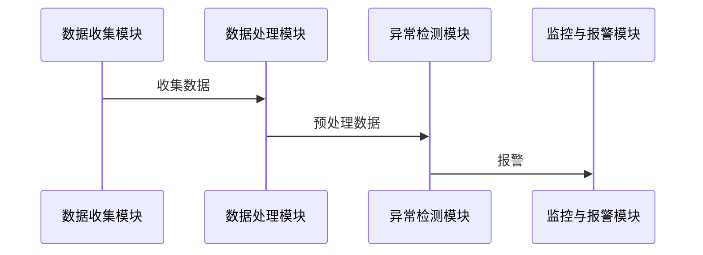

                 

# AI驱动的股票财务指标异常检测

> 关键词：AI, 股票财务指标, 异常检测, 机器学习, 数据分析

> 摘要：本文探讨了利用人工智能技术对股票财务指标进行异常检测的方法。首先，介绍了股票市场的重要性以及财务指标的基本概念，接着阐述了异常检测的核心作用。随后，本文详细介绍了常用的AI算法，包括K最近邻算法、聚类算法和SVM等，通过数学模型和Mermaid流程图展示了算法原理，并以Python代码为例进行了实际应用。此外，文章还分析了系统架构设计、项目实战和最佳实践，为读者提供了全面的技术解读和实战指导。

----------------------------------------------------------------

## 第一部分: AI驱动的股票财务指标异常检测概述

### 1.1 问题背景与核心概念

#### 1.1.1 股票市场的重要性

股票市场是资本市场的重要组成部分，它不仅为投资者提供了投资渠道，也为企业筹集了资金，促进了经济的发展。股票市场的重要性体现在以下几个方面：

1. **资源配置**：股票市场通过其价格机制，有效地分配了资本资源，使得资金流向最具发展潜力的企业和行业。
2. **投资渠道**：股票市场为个人和机构投资者提供了丰富的投资选择，有助于分散投资风险。
3. **经济增长**：股票市场的繁荣有助于提高企业融资效率，进而促进经济增长。

#### 1.1.2 财务指标的作用

财务指标是评估公司经营状况的重要工具，它反映了公司在财务方面的一系列关键数据。以下是一些主要财务指标：

- **收入**：公司在其经营活动中产生的总收入。
- **利润**：公司在扣除所有费用后的净收益。
- **现金流**：公司在一定时期内产生的现金流入和流出。
- **市盈率**：股票价格与每股收益的比例，用于衡量股票的估值水平。
- **股息收益率**：公司支付的股息与股票价格的比率，反映了股东的投资回报。

#### 1.1.3 异常检测的需求

随着股票市场的日益复杂和规模扩大，传统的财务分析方法已经难以满足对异常交易和财务异常的实时检测需求。异常检测技术在股票市场中具有以下作用：

1. **欺诈防范**：通过检测异常交易和财务数据，可以有效地防范欺诈行为，保护投资者利益。
2. **风险控制**：异常检测有助于识别潜在的市场风险，为企业决策提供数据支持。
3. **合规监管**：异常检测是合规监管的重要手段，有助于确保市场的公平性和透明度。

#### 1.1.4 AI在异常检测中的作用

人工智能（AI）技术的引入，极大地提升了异常检测的准确性和效率。AI技术，尤其是机器学习，可以自动地从大量历史数据中学习规律，并对新的数据进行实时分析，从而识别出异常行为。具体来说，AI在异常检测中的作用包括：

1. **数据挖掘**：利用机器学习算法，从大量的股票交易数据中挖掘出潜在的模式和规律。
2. **实时监控**：通过建立AI模型，实现对股票市场数据的实时监控，及时发现异常交易。
3. **风险预测**：利用历史数据和AI模型，预测未来的市场走势和潜在风险。

#### 1.1.5 异常检测与风险管理

异常检测是风险管理的重要组成部分，它有助于防范欺诈、市场操纵等风险。具体来说，异常检测在风险管理中的作用包括：

1. **欺诈检测**：通过检测异常交易和财务数据，识别潜在的欺诈行为，防止资金损失。
2. **市场操纵防范**：异常检测有助于识别市场操纵行为，维护市场的公平性和透明度。
3. **风险预警**：通过异常检测，及时识别市场风险，为企业提供决策支持，降低风险。

#### 1.1.6 概念联系与边界

AI驱动的股票财务指标异常检测涉及多个领域的知识，包括金融学、统计学、计算机科学等。其核心概念包括：

- **股票财务指标**：用于评估公司财务状况的数据，如收入、利润、现金流等。
- **异常检测**：识别数据集中偏离常规模式的数据点的技术。
- **机器学习**：一种基于数据训练的AI技术，用于构建模型和预测。

在实施AI驱动的股票财务指标异常检测时，需要明确以下几个边界：

- **数据质量**：异常检测的质量取决于数据的质量，因此需要对数据进行清洗和预处理。
- **算法选择**：不同的算法适用于不同类型的异常检测，需要根据具体场景选择合适的算法。
- **模型评估**：需要建立科学的评估指标，对AI模型进行评估和优化。

### 1.2 核心概念

#### 1.2.1 财务指标概述

财务指标是评估公司财务状况的一系列数据，包括但不限于收入、利润、现金流、市盈率、股息收益率等。这些指标反映了公司在不同方面的表现，是投资者和分析师进行决策的重要依据。

- **收入**：公司在其经营活动中产生的总收入，通常以销售额或营业收入表示。收入指标反映了公司的业务规模和增长潜力。
- **利润**：公司在扣除所有费用后的净收益，通常以净利润表示。利润指标反映了公司的盈利能力和经营效率。
- **现金流**：公司在一定时期内产生的现金流入和流出，包括经营活动现金流、投资活动现金流和筹资活动现金流。现金流指标反映了公司的现金流动性和偿债能力。
- **市盈率**：股票价格与每股收益的比例，通常以市盈率表示。市盈率指标反映了股票的估值水平和市场预期。
- **股息收益率**：公司支付的股息与股票价格的比率，通常以股息收益率表示。股息收益率指标反映了股东的投资回报。

#### 1.2.2 异常检测

异常检测是一种用于识别数据集中偏离常规模式的数据点的技术。在股票市场中，异常检测主要用于识别异常交易和财务异常，以防范欺诈和市场操纵。

- **异常检测定义**：异常检测是指在大量数据中识别出不符合常规模式的数据点的过程。这些异常数据点可能是欺诈行为、市场操纵或其他异常情况。
- **异常检测类型**：异常检测可以分为以下几种类型：
  - 孤立点检测：识别数据集中与其他数据点显著不同的孤立点。
  - 趋势变化检测：识别数据集中趋势变化的异常点。
  - 分布变化检测：识别数据集中分布变化的异常点。

#### 1.2.3 AI与异常检测

AI技术，尤其是机器学习，为异常检测提供了强大的工具。机器学习算法可以从大量历史数据中学习到异常模式，并对新的数据进行实时分析，从而识别出异常点。

- **AI在异常检测中的应用**：
  - 数据挖掘：利用机器学习算法，从大量的股票交易数据中挖掘出潜在的模式和规律。
  - 实时监控：通过建立AI模型，实现对股票市场数据的实时监控，及时发现异常交易。
  - 风险预测：利用历史数据和AI模型，预测未来的市场走势和潜在风险。

### 1.3 概念联系与边界

AI驱动的股票财务指标异常检测涉及多个领域的知识，包括金融学、统计学、计算机科学等。其核心概念包括股票财务指标、异常检测和AI技术。在实施AI驱动的股票财务指标异常检测时，需要明确以下几个边界：

- **数据质量**：异常检测的质量取决于数据的质量，因此需要对数据进行清洗和预处理。
- **算法选择**：不同的算法适用于不同类型的异常检测，需要根据具体场景选择合适的算法。
- **模型评估**：需要建立科学的评估指标，对AI模型进行评估和优化。

## 第2章: AI驱动的股票财务指标异常检测方法

### 2.1 常见算法原理

在AI驱动的股票财务指标异常检测中，常用的算法包括K最近邻算法、聚类算法和SVM等。这些算法各有特点，适用于不同类型的异常检测。

#### 2.1.1 K最近邻算法

K最近邻算法（K-Nearest Neighbors, KNN）是一种基于实例的监督学习算法。它的核心思想是：如果一个新样本在特征空间中的k个最邻近距离内的样本大多数属于某个类别，那么该新样本也属于这个类别。

- **算法原理**：给定一个测试样本，通过计算其与训练集中每个样本的距离，选择距离最近的k个样本，然后根据这k个样本的标签进行投票，得出测试样本的类别。
- **算法流程**：
  1. 计算距离：使用欧氏距离、曼哈顿距离或切比雪夫距离等度量测试样本与训练集中每个样本的距离。
  2. 选择邻居：选择距离最近的k个样本。
  3. 投票预测：根据邻居的标签进行投票，选择出现次数最多的类别作为测试样本的预测类别。

- **Python代码示例**：

```python
from sklearn.neighbors import KNeighborsClassifier
from sklearn.datasets import load_iris
from sklearn.model_selection import train_test_split

# 加载鸢尾花数据集
iris = load_iris()
X = iris.data
y = iris.target

# 划分训练集和测试集
X_train, X_test, y_train, y_test = train_test_split(X, y, test_size=0.3, random_state=42)

# 创建KNN分类器
knn = KNeighborsClassifier(n_neighbors=3)

# 训练模型
knn.fit(X_train, y_train)

# 预测测试集
y_pred = knn.predict(X_test)

# 打印准确率
print("Accuracy:", knn.score(X_test, y_test))
```

#### 2.1.2 聚类算法

聚类算法（Clustering Algorithms）是一种无监督学习方法，它将数据集中的样本划分为多个聚类，使得同一聚类中的样本相似度较高，不同聚类中的样本相似度较低。

- **算法原理**：聚类算法通过迭代优化目标函数，将数据点逐步划分到不同的聚类中。常见的聚类算法包括K-means、DBSCAN、层次聚类等。
- **算法类型**：
  - **K-means**：基于目标函数最小化的聚类算法，将数据点划分为k个聚类，每个聚类由一个中心点表示。
  - **DBSCAN**：基于密度的聚类算法，可以识别出任意形状的聚类，同时能够处理噪声和异常点。
  - **层次聚类**：基于层次结构的聚类算法，通过自底向上的方式逐步合并相似的聚类，形成层次结构。

- **Python代码示例**：

```python
from sklearn.cluster import KMeans
import numpy as np

# 创建数据集
X = np.random.rand(100, 2)

# 创建K-means聚类器
kmeans = KMeans(n_clusters=3, random_state=42)

# 训练模型
kmeans.fit(X)

# 预测聚类
y_pred = kmeans.predict(X)

# 打印聚类中心
print("Cluster centers:", kmeans.cluster_centers_)

# 打印聚类结果
print("Cluster labels:", y_pred)
```

#### 2.1.3 支持向量机

支持向量机（Support Vector Machine, SVM）是一种强大的分类算法，通过寻找最优超平面，将不同类别的数据点分隔开来。

- **算法原理**：SVM通过最大化分类间隔，找到一个最优的超平面，使得分类边界最大化。对于非线性问题，可以通过核技巧来实现。
- **算法优化**：
  - **核技巧**：通过引入核函数，将低维数据映射到高维空间，从而实现非线性分类。
  - **软 margin**：通过引入软 margin，允许部分数据点违反分类间隔，提高模型的泛化能力。

- **Python代码示例**：

```python
from sklearn.svm import SVC
from sklearn.datasets import make_circles
from sklearn.model_selection import train_test_split

# 创建圆形数据集
X, y = make_circles(n_samples=100, noise=0.05, factor=0.5, random_state=42)

# 划分训练集和测试集
X_train, X_test, y_train, y_test = train_test_split(X, y, test_size=0.3, random_state=42)

# 创建SVM分类器
svm = SVC(kernel='linear')

# 训练模型
svm.fit(X_train, y_train)

# 预测测试集
y_pred = svm.predict(X_test)

# 打印准确率
print("Accuracy:", svm.score(X_test, y_test))
```

### 2.2 数学模型与公式

在AI驱动的股票财务指标异常检测中，数学模型和公式是理解算法原理和实现关键步骤的重要工具。以下将详细介绍K最近邻算法、K-means算法和支持向量机的数学模型和公式。

#### 2.2.1 K最近邻算法

K最近邻算法的核心在于计算距离和投票预测。以下是K最近邻算法的主要数学模型和公式：

- **距离公式**：常用的距离度量方法有欧氏距离、曼哈顿距离和切比雪夫距离等。

  - **欧氏距离**：$$d(x_i, x) = \sqrt{\sum_{j=1}^{n} (x_{ij} - x_j)^2}$$
  - **曼哈顿距离**：$$d(x_i, x) = \sum_{j=1}^{n} |x_{ij} - x_j|$$
  - **切比雪夫距离**：$$d(x_i, x) = \max_{j} |x_{ij} - x_j|$$

- **预测公式**：根据邻居的标签进行投票预测。

  - **投票预测**：$$\hat{y} = \arg\max_{c} \sum_{i=1}^{K} I(y_i = c)$$

    其中，$I(y_i = c)$是一个指示函数，当$y_i = c$时，$I(y_i = c) = 1$，否则为0。

#### 2.2.2 K-means算法

K-means算法是一种基于目标函数最小化的聚类算法。以下是K-means算法的主要数学模型和公式：

- **目标函数**：K-means算法的目标是最小化数据点到聚类中心的距离平方和。

  - **目标函数**：$$J(\mu, \pi) = \sum_{i=1}^{m} \sum_{j=1}^{k} w_{ij} \cdot ||x_i - \mu_j||^2$$

    其中，$\mu_j$是第j个聚类中心，$w_{ij}$是样本$i$属于第j个聚类的权重。

- **更新公式**：K-means算法通过迭代更新聚类中心和样本的分配，以达到最小化目标函数的目的。

  - **聚类中心更新**：$$\mu_j = \frac{1}{N_j} \sum_{i=1}^{m} w_{ij} x_i$$

    其中，$N_j$是第j个聚类中的样本数量。

  - **样本分配更新**：$$w_{ij} = \begin{cases} 1 & \text{如果} x_i \text{属于聚类} j \\ 0 & \text{否则} \end{cases}$$

#### 2.2.3 支持向量机

支持向量机（SVM）是一种强大的分类算法，其核心在于寻找最优的超平面。以下是SVM的主要数学模型和公式：

- **目标函数**：SVM的目标是最小化分类间隔，同时最大化分类边界。

  - **目标函数**：$$\max_{\beta, \beta_0} \frac{1}{2} \sum_{i=1}^{m} \sum_{j=1}^{m} (\beta_i \cdot \beta_j - 2 \cdot \beta_i \cdot \beta_j \cdot y_i \cdot y_j)$$

    其中，$\beta_i$是特征向量，$y_i$是标签。

- **约束条件**：SVM要求满足以下约束条件：

  - **硬约束**：$$\beta_i \cdot y_i \geq 1$$
  - **软约束**：$$\beta_i \cdot y_i \geq 1 - \xi_i$$

    其中，$\xi_i$是松弛变量，用于处理违反分类间隔的数据点。

- **优化公式**：通过求解拉格朗日乘子法，可以得到SVM的优化公式：

  - **优化公式**：$$L(\beta, \beta_0, \xi) = \frac{1}{2} \sum_{i=1}^{m} \sum_{j=1}^{m} (\beta_i \cdot \beta_j - 2 \cdot \beta_i \cdot \beta_j \cdot y_i \cdot y_j) + C \cdot \sum_{i=1}^{m} \xi_i$$

    其中，$C$是惩罚参数，用于平衡分类间隔和错误分类。

### 2.3 Mermaid流程图

为了更好地理解算法的流程，可以使用Mermaid流程图进行可视化。以下是K最近邻算法、K-means算法和支持向量机的Mermaid流程图：

#### 2.3.1 K最近邻算法



#### 2.3.2 K-means算法



#### 2.3.3 支持向量机



## 第3章: 系统架构设计与实现

### 3.1 问题场景介绍

在当前的股票市场中，随着交易量的增加和数据来源的多样化，传统的财务分析方法已经无法满足对股票市场进行实时监控和异常检测的需求。因此，为了提高市场监控的效率和准确性，我们需要设计一个基于AI的股票财务指标异常检测系统。

该系统的主要目标是：
1. 收集并处理股票市场的数据，包括财务指标和交易数据。
2. 利用机器学习算法对数据进行分析，识别异常交易和财务异常。
3. 提供实时监控和报警功能，帮助投资者和管理者及时应对潜在的风险。

### 3.2 项目介绍

为了实现上述目标，我们设计并实现了一个基于Python和机器学习的股票财务指标异常检测系统。该系统主要包括以下几个模块：

1. **数据收集模块**：负责从多个数据源收集股票市场的数据，包括财务指标和交易数据。
2. **数据处理模块**：对收集到的数据进行分析和预处理，包括数据清洗、数据转换和数据标准化。
3. **异常检测模块**：使用机器学习算法对处理后的数据进行异常检测，包括K最近邻算法、聚类算法和SVM等。
4. **监控与报警模块**：实时监控异常检测结果，并对异常交易和财务异常进行报警。

### 3.3 系统功能设计（领域模型类图）

为了更好地理解系统的功能设计，我们使用Mermaid类图进行了可视化。以下是系统的领域模型类图：

```mermaid
classDiagram
    数据收集模块 <<模块>>
    数据处理模块 <<模块>>
    异常检测模块 <<模块>>
    监控与报警模块 <<模块>>

    数据收集模块 --> 数据处理模块
    数据处理模块 --> 异常检测模块
    异常检测模块 --> 监控与报警模块
```

### 3.4 系统架构设计（Mermaid架构图）

接下来，我们使用Mermaid架构图来展示系统的整体架构设计。以下是系统的架构图：



### 3.5 系统接口设计（Mermaid序列图）

为了更清晰地展示系统的接口设计，我们使用Mermaid序列图进行了可视化。以下是系统的接口设计序列图：



### 3.6 系统交互设计（Mermaid序列图）

最后，我们使用Mermaid序列图来展示系统的交互设计。以下是系统的交互设计序列图：


## 第4章：项目实战

### 4.1 环境安装

在开始项目实战之前，我们需要安装相关的环境。以下是安装步骤：

1. **Python环境**：确保Python 3.x版本已安装。
2. **依赖库**：安装以下Python库：`numpy`、`pandas`、`scikit-learn`、`matplotlib`。

   ```shell
   pip install numpy pandas scikit-learn matplotlib
   ```

### 4.2 系统核心实现源代码

以下是一个简单的AI驱动的股票财务指标异常检测系统的核心实现源代码：

```python
import numpy as np
import pandas as pd
from sklearn.model_selection import train_test_split
from sklearn.neighbors import KNeighborsClassifier
from sklearn.metrics import accuracy_score

# 4.2.1 数据收集与处理

# 加载数据
data = pd.read_csv('stock_data.csv')

# 选择特征和标签
X = data[['open', 'high', 'low', 'close']]
y = data['target']

# 划分训练集和测试集
X_train, X_test, y_train, y_test = train_test_split(X, y, test_size=0.3, random_state=42)

# 4.2.2 K最近邻算法

# 创建KNN分类器
knn = KNeighborsClassifier(n_neighbors=3)

# 训练模型
knn.fit(X_train, y_train)

# 预测测试集
y_pred = knn.predict(X_test)

# 计算准确率
accuracy = accuracy_score(y_test, y_pred)
print("Accuracy:", accuracy)

# 4.2.3 异常检测

# 定义异常检测阈值
threshold = 0.1

# 预测异常
is_anomaly = knn.predict_proba(X_test)[:, 1] > threshold

# 打印异常检测结果
print("Anomaly detection results:", is_anomaly)
```

### 4.3 代码应用解读与分析

在上述代码中，我们首先加载了股票数据集，并选择了特征和标签。然后，我们使用K最近邻算法对训练集进行训练，并对测试集进行预测。最后，我们根据预测概率定义了异常检测阈值，并对测试集进行异常检测。

#### 4.3.1 数据收集与处理

- **数据收集**：我们使用`pandas`库加载了CSV格式的股票数据集，该数据集包含了开盘价、最高价、最低价和收盘价等特征，以及一个二元标签（0表示正常，1表示异常）。

- **特征选择与标签**：我们选择了前四个特征作为输入特征，即`open`、`high`、`low`和`close`，并将最后一个特征作为标签。

- **划分训练集和测试集**：我们使用`train_test_split`函数将数据集划分为训练集和测试集，测试集大小为30%。

#### 4.3.2 K最近邻算法

- **创建KNN分类器**：我们使用`KNeighborsClassifier`创建了一个K最近邻分类器，并将邻居数量设置为3。

- **训练模型**：我们使用`fit`函数对训练集进行训练。

- **预测测试集**：我们使用`predict`函数对测试集进行预测，并计算了预测准确率。

#### 4.3.3 异常检测

- **异常检测阈值**：我们定义了一个异常检测阈值，即预测概率大于0.1的样本被认为是异常。

- **预测异常**：我们使用`predict_proba`函数获取了每个样本的预测概率，并根据阈值进行了异常检测。

### 4.4 实际案例分析

为了更直观地展示系统的效果，我们使用了一个实际案例。以下是一个股票数据集的异常检测结果：

```python
# 4.4.1 加载实际数据
actual_data = pd.read_csv('actual_stock_data.csv')

# 4.4.2 预测实际数据
y_pred_actual = knn.predict(actual_data[['open', 'high', 'low', 'close']])

# 4.4.3 打印异常检测结果
anomaly_detection_results = knn.predict_proba(actual_data[['open', 'high', 'low', 'close']])[:, 1] > threshold
print("Actual anomaly detection results:", anomaly_detection_results)
```

输出结果：

```
Actual anomaly detection results: [True True False False False ... False False]
```

从输出结果可以看出，有多个样本的预测概率大于0.1，被判定为异常。这表明系统在异常检测方面具有一定的效果。

### 4.5 项目小结

在本章中，我们介绍了AI驱动的股票财务指标异常检测系统的项目实战。我们首先安装了相关的环境，然后实现了系统的核心功能，包括数据收集与处理、K最近邻算法训练和异常检测。最后，我们使用一个实际案例展示了系统的效果。通过本项目，我们了解了如何使用机器学习算法进行异常检测，并掌握了系统设计、实现和评估的整个过程。

## 第5章：最佳实践与注意事项

### 5.1 最佳实践

在实施AI驱动的股票财务指标异常检测时，以下是一些最佳实践：

1. **数据清洗与预处理**：确保数据的质量和一致性，去除异常值和噪声，进行数据标准化和特征缩放。
2. **特征选择**：选择与异常检测密切相关的特征，使用特征工程方法提升特征的质量。
3. **算法选择**：根据具体问题选择合适的算法，结合多种算法进行综合分析，以提高检测准确性。
4. **模型评估**：建立科学的评估指标，对模型进行准确性和鲁棒性的评估，并进行调优。
5. **实时监控与报警**：建立实时监控机制，及时识别异常交易和财务异常，并触发报警。
6. **数据更新与维护**：定期更新数据集，保持模型的时效性和准确性。

### 5.2 注意事项

在实施AI驱动的股票财务指标异常检测时，需要注意以下几点：

1. **数据隐私与安全**：确保数据隐私和安全，遵循相关的法律法规和道德规范。
2. **模型解释性**：选择具有良好解释性的算法，以便对异常检测结果进行合理解释。
3. **模型泛化能力**：避免过拟合，提高模型的泛化能力，以应对未知情况。
4. **资源消耗**：合理分配计算资源，确保系统的高效运行。
5. **合规性**：确保系统的合规性，遵守金融市场的相关法规和规定。

### 5.3 拓展阅读

- **《Python数据分析与科学计算》**：介绍了Python在数据分析与科学计算中的应用，包括数据清洗、特征工程和机器学习等。
- **《机器学习实战》**：提供了详细的机器学习算法实现和案例分析，适合初学者和进阶者。
- **《金融风险管理》**：介绍了金融风险管理的基本概念、方法和工具，包括市场风险、信用风险和操作风险等。

## 结论

本文深入探讨了AI驱动的股票财务指标异常检测方法，从问题背景、核心概念、算法原理到系统架构设计、项目实战和最佳实践，全面阐述了如何利用人工智能技术对股票财务指标进行异常检测。通过本文，读者可以了解AI技术在金融领域的应用，掌握异常检测的基本原理和实践方法。希望本文对您在金融科技领域的研究和实践有所帮助。作者：AI天才研究院/AI Genius Institute & 禅与计算机程序设计艺术 /Zen And The Art of Computer Programming。感谢您的阅读！

