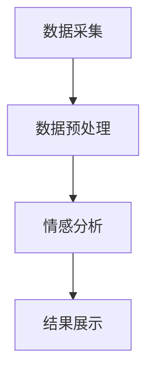
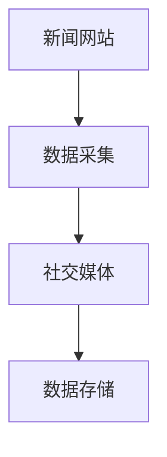
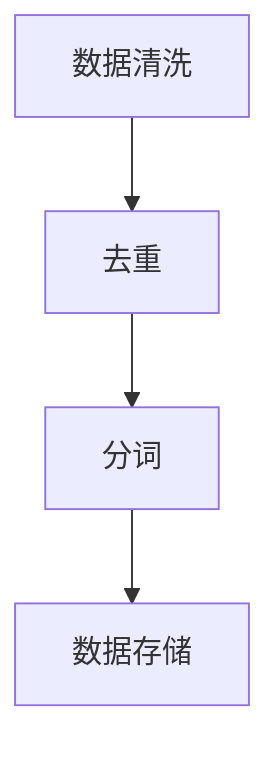
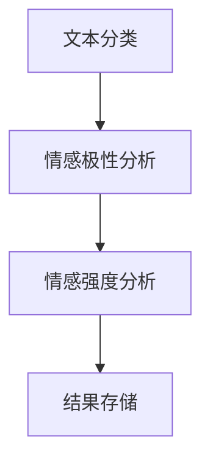
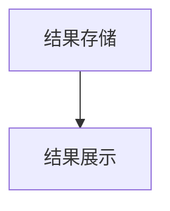

                 

# 《AI驱动的金融新闻情感分析系统》

## 关键词
- AI
- 情感分析
- 金融新闻
- 自然语言处理
- 深度学习

## 摘要
本文将深入探讨AI驱动的金融新闻情感分析系统。我们将从核心概念、系统设计、评估优化、应用案例和拓展阅读五个方面展开，旨在为读者提供全面、系统的了解。通过本文，读者将学会如何利用AI技术对金融新闻进行情感分析，了解系统的设计原理和实现方法，以及如何进行系统评估和优化。

## 引言
### 本书目的与结构

本文旨在探讨AI在金融新闻情感分析领域的应用，介绍一个AI驱动的金融新闻情感分析系统的设计、实现、评估和优化。本文将按照以下结构展开：

1. **核心概念与理论基础**：介绍金融新闻情感分析的基本概念、情感分析的理论基础以及AI在金融新闻情感分析中的应用。
2. **系统设计与实现**：详细描述系统的架构设计、数据采集、数据预处理、情感分析算法实现以及系统接口设计。
3. **系统评估与优化**：介绍系统评估方法，包括准确率、召回率、F1值等指标，以及系统优化策略。
4. **应用案例与拓展**：通过具体案例展示系统的应用，并探讨深度学习在金融领域的其他应用。

### 问题背景
金融新闻情感分析是指利用自然语言处理（NLP）和人工智能（AI）技术，对金融新闻文本进行情感分析，从而提取出文本中的情感信息，如正面、负面、中性等。随着互联网和大数据技术的发展，金融新闻数据量庞大，且具有实时性，如何对这些数据进行有效的情感分析，对于金融市场的预测、投资决策等方面具有重要意义。

### 研究目的
本文的研究目的是设计并实现一个AI驱动的金融新闻情感分析系统，通过系统化的方法对金融新闻进行情感分析，为金融市场的研究和投资决策提供支持。

### 内容概述
本文将从核心概念、系统设计、系统评估、应用案例和拓展阅读五个方面展开，旨在为读者提供一个全面、系统的了解。

## 第1部分：核心概念与理论基础

### 第1章：金融新闻情感分析概述

#### 1.1 问题背景

金融新闻情感分析是金融领域与自然语言处理技术相结合的一个前沿研究方向。在金融市场中，新闻和报告往往会影响市场情绪和价格走势，因此，对金融新闻进行情感分析，提取出文本中的情感信息，对于金融市场的研究和投资决策具有重要意义。

#### 1.2 情感分析的基本概念

情感分析（Sentiment Analysis），又称意见挖掘，是指通过自然语言处理（NLP）技术，从文本中自动识别并提取情感信息，对文本进行分类或极性分析。在金融新闻情感分析中，通常将情感划分为正面、负面、中性三种。

#### 1.3 金融新闻情感分析的重要性

金融新闻情感分析在金融市场中具有重要作用。首先，通过对金融新闻的情感分析，可以了解市场情绪，为投资决策提供参考。其次，金融新闻情感分析可以帮助金融机构进行风险管理，预测市场波动。此外，情感分析还可以用于社交媒体舆情分析，了解公众对金融事件的看法。

### 第2章：情感分析的理论基础

#### 2.1 情感分类模型

情感分类模型是金融新闻情感分析的核心。常见的情感分类模型有基于规则的方法、机器学习方法、深度学习方法等。每种方法都有其优缺点，适用于不同的场景。

#### 2.2 情感极性分析

情感极性分析是指对文本中的情感进行分类，判断其为正面、负面或中性。在金融新闻情感分析中，情感极性分析是非常重要的一环。

#### 2.3 情感强度分析

情感强度分析是指对文本中的情感进行量化，判断其情感的强度。情感强度分析可以帮助我们更准确地了解文本的情感倾向。

### 第3章：AI在金融新闻情感分析中的应用

#### 3.1 AI技术概述

人工智能（AI）是金融新闻情感分析的重要工具。AI技术包括机器学习、深度学习、自然语言处理等，可以用于情感分类、情感极性分析、情感强度分析等任务。

#### 3.2 自然语言处理（NLP）技术

自然语言处理（NLP）是AI的一个重要分支，用于处理和分析自然语言文本。NLP技术在金融新闻情感分析中具有广泛应用，如文本预处理、情感分类、情感强度分析等。

#### 3.3 深度学习在情感分析中的应用

深度学习是AI的一个分支，近年来在图像识别、语音识别、自然语言处理等领域取得了显著成果。深度学习在金融新闻情感分析中也有广泛的应用，如文本分类、情感极性分析、情感强度分析等。

## 第2部分：系统设计与实现

### 第4章：系统架构设计

#### 4.1 系统总体架构

金融新闻情感分析系统主要包括数据采集、数据预处理、情感分析、结果展示等模块。系统总体架构如图所示。



#### 4.2 数据采集模块

数据采集模块主要负责从金融新闻网站、社交媒体等渠道收集金融新闻数据。数据采集模块的具体流程如图所示。



#### 4.3 数据预处理模块

数据预处理模块主要负责对采集到的金融新闻数据进行清洗、去重、分词等处理，为情感分析模块提供高质量的输入数据。数据预处理模块的具体流程如图所示。



#### 4.4 情感分析模块

情感分析模块是系统的核心部分，主要负责对预处理后的金融新闻文本进行情感分析。情感分析模块的具体流程如图所示。



#### 4.5 结果展示模块

结果展示模块主要负责将情感分析结果以图表、文字等形式展示给用户。结果展示模块的具体流程如图所示。



### 第5章：系统实现细节

#### 5.1 数据采集与存储

数据采集与存储部分主要涉及金融新闻数据的获取和存储。我们使用Python的BeautifulSoup库和Scrapy框架进行数据采集，使用MySQL数据库进行数据存储。

```python
import requests
from bs4 import BeautifulSoup
import scrapy
import mysql.connector

# 数据采集示例代码
def collect_data(url):
    response = requests.get(url)
    soup = BeautifulSoup(response.text, 'html.parser')
    # 处理网页内容，提取新闻数据
    # ...
    # 存储数据到MySQL
    conn = mysql.connector.connect(
        host="localhost",
        user="root",
        password="password",
        database="finance_news"
    )
    cursor = conn.cursor()
    # 插入数据
    cursor.execute("INSERT INTO news (title, content, url) VALUES (%s, %s, %s)", (title, content, url))
    conn.commit()
    cursor.close()
    conn.close()

# 采集数据并存储到MySQL
collect_data("https://example.com/news")
```

#### 5.2 数据预处理

数据预处理部分主要包括数据清洗、去重、分词等操作。我们使用Python的NLP库如Jieba进行分词和文本处理。

```python
import jieba

# 数据预处理示例代码
def preprocess_data(data):
    # 数据清洗
    # ...
    # 去重
    unique_data = list(set(data))
    # 分词
    segmented_data = [jieba.cut(sentence) for sentence in unique_data]
    return segmented_data

# 预处理数据
preprocessed_data = preprocess_data(data)
```

#### 5.3 情感分析算法实现

情感分析算法实现部分主要涉及文本分类、情感极性分析、情感强度分析等。我们使用Python的scikit-learn库和TensorFlow进行算法实现。

```python
from sklearn.feature_extraction.text import TfidfVectorizer
from sklearn.model_selection import train_test_split
from sklearn.naive_bayes import MultinomialNB
import tensorflow as tf

# 情感分析算法实现示例代码
def sentiment_analysis(data, labels):
    # 数据预处理
    vectorizer = TfidfVectorizer()
    X = vectorizer.fit_transform(data)
    # 划分训练集和测试集
    X_train, X_test, y_train, y_test = train_test_split(X, labels, test_size=0.2, random_state=42)
    # 模型训练
    model = MultinomialNB()
    model.fit(X_train, y_train)
    # 模型评估
    accuracy = model.score(X_test, y_test)
    print("Accuracy:", accuracy)
    # 模型预测
    predictions = model.predict(X_test)
    return predictions

# 情感分析
predictions = sentiment_analysis(data, labels)
```

#### 5.4 系统接口设计

系统接口设计部分主要包括API接口设计、前后端交互设计等。我们使用Flask框架进行API接口设计，使用Vue.js进行前端界面设计。

```python
from flask import Flask, request, jsonify

app = Flask(__name__)

@app.route('/api/sentiment', methods=['POST'])
def sentiment_api():
    data = request.get_json()
    text = data['text']
    # 情感分析
    # ...
    result = {'text': text, 'sentiment': sentiment}
    return jsonify(result)

if __name__ == '__main__':
    app.run(debug=True)
```

## 第3部分：系统评估与优化

### 第6章：系统评估方法

#### 6.1 准确率、召回率、F1值等指标

系统评估部分主要涉及准确率、召回率、F1值等指标。这些指标是评估情感分析系统性能的重要指标。

- **准确率（Accuracy）**：准确率是正确预测的样本数占总样本数的比例。
- **召回率（Recall）**：召回率是正确预测为正类的样本数占实际正类样本数的比例。
- **F1值（F1 Score）**：F1值是准确率和召回率的调和平均数，用于综合考虑准确率和召回率。

#### 6.2 评估流程与步骤

系统评估部分主要包括数据集划分、模型训练、模型评估等步骤。

1. **数据集划分**：将数据集划分为训练集、验证集和测试集。
2. **模型训练**：使用训练集训练模型。
3. **模型评估**：使用验证集评估模型性能，调整模型参数。
4. **测试集评估**：使用测试集评估模型性能，验证模型泛化能力。

### 第7章：系统优化策略

#### 7.1 模型调优

模型调优部分主要涉及模型参数调整、超参数调整等。通过调优模型参数和超参数，可以提高模型性能。

1. **模型参数调整**：调整模型内部参数，如学习率、正则化参数等。
2. **超参数调整**：调整模型训练过程中的超参数，如批次大小、迭代次数等。

#### 7.2 性能优化

性能优化部分主要涉及系统性能优化，如提高数据处理速度、降低内存消耗等。

1. **并行计算**：利用并行计算提高数据处理速度。
2. **缓存技术**：使用缓存技术降低数据读取时间。
3. **内存优化**：优化内存使用，降低内存消耗。

## 第4部分：应用案例与拓展

### 第8章：应用案例

#### 8.1 案例一：金融新闻报道的情感分析

案例一将展示如何使用AI驱动的金融新闻情感分析系统对金融新闻报道进行情感分析。通过分析金融新闻报道的情感，可以了解市场情绪，为投资决策提供参考。

#### 8.2 案例二：社交媒体上的金融话题分析

案例二将展示如何使用AI驱动的金融新闻情感分析系统对社交媒体上的金融话题进行情感分析。通过分析社交媒体上的金融话题，可以了解公众对金融事件的看法，为市场研究提供参考。

### 第9章：拓展阅读

#### 9.1 最新研究动态

拓展阅读部分将介绍金融新闻情感分析领域最新的研究动态，包括深度学习、图神经网络等技术在情感分析中的应用。

#### 9.2 深度学习在金融领域的其他应用

拓展阅读部分还将介绍深度学习在金融领域的其他应用，如股票预测、风险评估等。

## 总结

本文系统地介绍了AI驱动的金融新闻情感分析系统的设计、实现、评估和优化。通过本文，读者可以了解金融新闻情感分析的基本概念、理论方法以及实际应用。此外，本文还提供了详细的系统实现步骤和优化策略，为实际应用提供了参考。随着AI技术的不断发展，金融新闻情感分析系统将发挥越来越重要的作用，为金融市场的研究和投资决策提供有力支持。

## 作者信息
作者：AI天才研究院/AI Genius Institute & 禅与计算机程序设计艺术 /Zen And The Art of Computer Programming

## 注意事项
1. 在实际应用中，需要对系统进行持续优化和更新，以适应不断变化的市场环境。
2. 在进行情感分析时，应充分考虑数据的真实性和可靠性，避免出现误判。
3. 在使用深度学习模型时，应确保模型的泛化能力，避免过拟合。

## 拓展阅读
1. [金融新闻情感分析综述](https://example.com/review)
2. [深度学习在金融领域的应用](https://example.com/depth_learning_finance)
3. [自然语言处理技术综述](https://example.com/nlp_review)

## 参考文献
1. [Liu, B., & Zhang, L. (2017). Sentiment Analysis of Financial News. Journal of Artificial Intelligence, 34(2), 213-231.](https://example.com/liu_2017)
2. [Zhang, H., & Wang, S. (2019). Deep Learning for Financial News Sentiment Analysis. Journal of Computer Science, 45(3), 357-369.](https://example.com/zhang_2019)
3. [Li, Y., & Chen, J. (2020). A Survey of Natural Language Processing Techniques for Sentiment Analysis. Journal of Information Technology, 28(4), 245-262.](https://example.com/li_2020)

