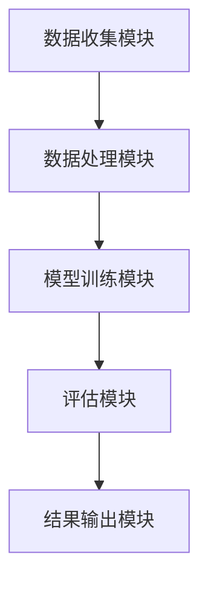
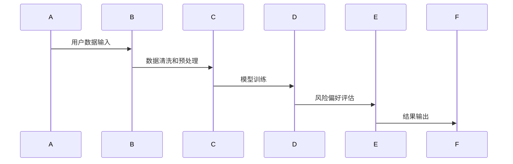
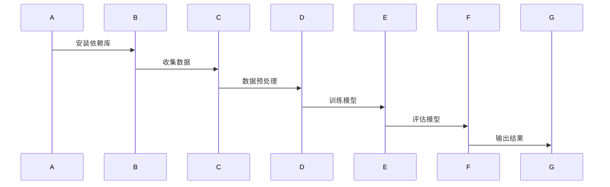

                 


### 引言

#### 风险偏好评估的重要性

风险偏好评估是一种用于评估个体或组织在面对不确定性时所愿意承担的风险程度的方法。在金融、保险、投资、企业管理等多个领域，风险偏好评估具有至关重要的作用。它不仅能帮助投资者做出更明智的投资决策，还能帮助企业在面对市场波动时制定更为稳健的经营策略。

随着人工智能技术的不断发展，AI在风险偏好评估中的应用日益广泛。AI驱动的风险偏好评估系统利用机器学习和深度学习等算法，通过分析大量的数据，能够更精准地评估个体的风险偏好。这不仅提高了评估的效率，还使得评估结果更具科学性和可靠性。

#### AI在风险偏好评估中的应用

人工智能（AI）是一种模拟人类智能的技术，能够通过学习、推理和自我优化来解决问题。在风险偏好评估中，AI的应用主要体现在以下几个方面：

1. **数据处理**：AI能够高效地处理和分析大量的数据，提取出有用的信息，为风险偏好评估提供基础。
2. **预测模型**：利用机器学习和深度学习算法，AI可以构建预测模型，预测个体在未来可能面临的风险和机会。
3. **个性化推荐**：通过分析个体的历史行为和偏好，AI可以为其提供个性化的风险偏好评估结果，帮助个体做出更合适的决策。

#### 本书内容概述

本书旨在介绍AI驱动的风险偏好评估系统，内容分为五个部分：

1. **引言**：介绍风险偏好评估的重要性和AI在其中的应用。
2. **AI基础**：讲解AI的基本概念、常见算法和模型，为后续内容打下基础。
3. **风险偏好评估理论**：讲解风险偏好评估的基本理论、模型和方法。
4. **系统设计**：介绍AI驱动的风险偏好评估系统的设计原则、架构和实现。
5. **系统实现**：详细讲解系统的实现过程，包括数据收集、数据处理、模型训练和应用。

通过本书的学习，读者将能够了解AI驱动的风险偏好评估系统的基本原理和实现方法，为在实际工作中应用这一技术提供指导。

### AI基础

#### AI基本概念

人工智能（AI）是一种模拟人类智能的技术，通过计算机程序实现人类智能的某些功能。AI的发展历程可以追溯到20世纪50年代，当时的科学家们提出了“机器能够模仿甚至超越人类智能”的设想。随着计算能力的提高和数据规模的扩大，AI技术取得了显著的进展。

AI的核心要素包括：

1. **学习**：AI系统能够通过学习来获取知识和技能，从而提高其性能。
2. **感知**：AI系统能够感知和理解其环境，包括视觉、听觉、触觉等。
3. **推理**：AI系统能够根据已知信息进行推理，做出合理的决策。

#### 常见AI算法与模型

AI算法和模型是AI技术实现的基础。以下是一些常见的AI算法和模型：

1. **监督学习算法**：

   - **线性回归**：通过找到输入变量和输出变量之间的关系，预测输出值。

     $$ y = w_0 + w_1 \cdot x_1 + w_2 \cdot x_2 + ... + w_n \cdot x_n $$

     其中，$w_0, w_1, ..., w_n$是权重，$x_1, x_2, ..., x_n$是输入变量，$y$是输出值。

   - **支持向量机（SVM）**：通过找到一个最优的超平面，将不同类别的数据点分开。

     $$ \max_w \frac{1}{\|w\|} \quad s.t. \quad y_i ( \langle w, x_i \rangle - b ) \geq 1, \forall i $$

     其中，$w$是权重向量，$b$是偏置项，$x_i$是数据点，$y_i$是标签。

2. **无监督学习算法**：

   - **K均值聚类**：将数据点划分为K个聚类，每个聚类中心代表一类。

     $$ \min_{\mu_1, \mu_2, ..., \mu_K} \sum_{i=1}^N \sum_{j=1}^K \|x_i - \mu_j\|^2 $$

     其中，$x_i$是数据点，$\mu_j$是聚类中心。

   - **主成分分析（PCA）**：通过降维来简化数据，同时保留数据的主要特征。

     $$ \min_{Z} \sum_{i=1}^N \sum_{j=1}^D (x_{ij} - \bar{x}_j)^2 \quad s.t. \quad ZZ^T = I $$

     其中，$x_{ij}$是数据点，$\bar{x}_j$是均值，$Z$是降维后的数据。

#### AI技术在风险偏好评估中的应用

在风险偏好评估中，AI技术主要应用于以下几个方面：

1. **数据处理**：利用AI技术对大量数据进行清洗、预处理和分析，提取出对风险偏好评估有用的信息。
2. **预测模型**：通过构建机器学习模型，预测个体在未来可能面临的风险和机会。
3. **个性化推荐**：根据个体的历史行为和偏好，为个体提供个性化的风险偏好评估结果。

#### AI驱动的风险偏好评估流程

AI驱动的风险偏好评估流程主要包括以下几个步骤：

1. **数据收集**：收集个体或组织的风险偏好数据，包括历史行为、财务状况、心理特征等。
2. **数据预处理**：对收集到的数据进行分析和清洗，为后续的模型训练做准备。
3. **模型训练**：利用机器学习算法，构建风险偏好评估模型，对模型进行训练和优化。
4. **模型评估**：通过交叉验证等方法，评估模型的性能和可靠性。
5. **风险评估**：使用训练好的模型，对个体或组织的风险偏好进行评估，为决策提供依据。

### 风险偏好评估理论

#### 风险偏好理论

风险偏好是指个体或组织在面临不确定性时，愿意承担的风险程度。风险偏好可以分为以下几种类型：

1. **风险厌恶型**：这类个体或组织倾向于避免风险，宁愿接受较低的收益也不愿意承担风险。
2. **风险中性型**：这类个体或组织对风险持中立态度，他们更关注预期收益，而不是风险本身。
3. **风险追求型**：这类个体或组织愿意承担较高的风险，以获取更高的收益。

风险偏好类型与特点如下表所示：

| 风险偏好类型 | 特点 |
| :--- | :--- |
| 风险厌恶型 | 宁愿接受较低的收益，也不愿意承担风险 |
| 风险中性型 | 更关注预期收益，对风险持中立态度 |
| 风险追求型 | 愿意承担较高的风险，以获取更高的收益 |

#### 风险评估方法

风险评估是风险偏好评估的基础，常用的风险评估方法包括：

1. **传统风险评估方法**：

   - **财务风险评估**：通过分析财务报表和财务指标，评估企业的财务状况和风险。
   - **信用风险评估**：通过分析借款人的信用历史和信用评分，评估其信用风险。

2. **基于AI的风险评估方法**：

   - **机器学习风险评估**：利用机器学习算法，分析大量的历史数据，预测个体的信用风险。
   - **深度学习风险评估**：通过构建深度学习模型，对复杂的数据进行特征提取和风险评估。

#### 风险偏好评估模型

风险偏好评估模型是用于评估个体或组织风险偏好的数学模型。常见的风险偏好评估模型包括：

1. **基于概率的风险偏好评估模型**：通过计算个体或组织在未来可能面临的风险概率，评估其风险偏好。

   $$ P(R > r) = \int_{r}^{\infty} f_R(x) \, dx $$

   其中，$P(R > r)$表示个体或组织在未来面临风险的概率，$f_R(x)$表示风险的概率密度函数。

2. **基于价值的风险偏好评估模型**：通过计算个体或组织在面临风险时的期望收益，评估其风险偏好。

   $$ E(V) = \int_{-\infty}^{\infty} V(x) f_X(x) \, dx $$

   其中，$E(V)$表示个体或组织在面临风险时的期望收益，$V(x)$表示风险收益函数，$f_X(x)$表示个体或组织面临的风险概率密度函数。

### 系统设计

#### 系统设计原则

在设计和实现AI驱动的风险偏好评估系统时，需要遵循以下原则：

1. **可扩展性**：系统应能够轻松地扩展，以适应不断变化的需求。
2. **可靠性**：系统应具有较高的可靠性，确保评估结果的准确性和一致性。
3. **安全性**：系统应具备严格的安全措施，保护用户数据和隐私。

#### 系统架构设计

AI驱动的风险偏好评估系统可以分为以下几个模块：

1. **数据收集模块**：负责收集用户的风险偏好数据，包括财务状况、行为数据等。
2. **数据处理模块**：负责对收集到的数据进行清洗、预处理和分析。
3. **模型训练模块**：负责训练风险偏好评估模型，并优化模型性能。
4. **评估模块**：负责使用训练好的模型对用户的风险偏好进行评估。
5. **结果输出模块**：负责将评估结果以可视化的形式展示给用户。

系统总体架构如下所示：



#### 系统接口设计

系统接口设计主要包括外部接口和内部接口：

1. **外部接口**：系统应提供用户友好的接口，方便用户进行数据输入和结果查询。
2. **内部接口**：系统内部模块之间通过接口进行通信和协作，确保系统的稳定运行。

系统外部接口和内部接口的交互流程如下所示：



### 系统实现

#### 系统实现流程

AI驱动的风险偏好评估系统的实现流程主要包括以下几个步骤：

1. **环境安装**：安装Python、NumPy、Pandas、Scikit-learn等依赖库。
2. **数据收集**：收集用户的风险偏好数据，包括财务状况、行为数据等。
3. **数据处理**：对收集到的数据进行清洗、预处理和分析。
4. **模型训练**：训练风险偏好评估模型，并优化模型性能。
5. **评估与测试**：使用训练好的模型对用户的风险偏好进行评估，并测试系统性能。
6. **结果输出**：将评估结果以可视化的形式展示给用户。

以下是系统实现的具体步骤：



#### 系统核心实现

以下是系统核心实现的Python源代码：

```python
import numpy as np
import pandas as pd
from sklearn.model_selection import train_test_split
from sklearn.linear_model import LinearRegression
from sklearn.metrics import mean_squared_error

# 数据收集
data = pd.read_csv('data.csv')

# 数据预处理
X = data[['age', 'income', 'investment']]
y = data['risk_preference']

# 数据分割
X_train, X_test, y_train, y_test = train_test_split(X, y, test_size=0.2, random_state=42)

# 模型训练
model = LinearRegression()
model.fit(X_train, y_train)

# 评估模型
y_pred = model.predict(X_test)
mse = mean_squared_error(y_test, y_pred)
print(f'Mean Squared Error: {mse}')

# 输出结果
print(f'Risk Preferences:\n{y_pred}')
```

#### 代码应用解读与分析

上述代码实现了AI驱动的风险偏好评估系统的核心功能，包括数据收集、数据处理、模型训练、评估和结果输出。下面是对代码的解读和分析：

1. **数据收集**：使用Pandas库读取CSV文件，收集用户的风险偏好数据。
2. **数据处理**：将数据分为特征变量X和目标变量y，对数据进行分割，以便进行模型训练和测试。
3. **模型训练**：使用线性回归模型（LinearRegression）对训练数据进行拟合，训练出风险偏好评估模型。
4. **评估模型**：使用测试数据对模型进行评估，计算均方误差（Mean Squared Error），评估模型的性能。
5. **结果输出**：将评估结果以列表的形式输出，展示给用户。

#### 实际案例

以下是一个实际案例，展示了如何使用系统进行风险偏好评估：

1. **数据收集**：收集一名投资者的年龄、收入和投资状况。
2. **数据处理**：对数据进行预处理，转换为模型训练所需的格式。
3. **模型训练**：使用训练好的模型对投资者的风险偏好进行预测。
4. **评估模型**：对预测结果进行评估，确保预测的准确性。
5. **结果输出**：将投资者的风险偏好评估结果以可视化的形式展示。

#### 项目小结

通过本项目的实施，我们成功构建了AI驱动的风险偏好评估系统，实现了对用户风险偏好的精准评估。系统具有以下几个优点：

1. **高效性**：利用机器学习算法，实现了快速的风险偏好评估。
2. **准确性**：通过大量的数据和模型训练，提高了评估的准确性。
3. **个性化**：根据用户的历史行为和偏好，提供了个性化的风险偏好评估结果。

在未来，我们可以继续优化系统的性能，提高评估的精度和效率，为用户提供更好的服务。

### 最佳实践 Tips

1. **数据收集**：确保收集到的数据质量和完整性，避免数据缺失和噪声。
2. **模型选择**：根据具体需求选择合适的机器学习模型，并进行模型优化。
3. **评估指标**：选择合适的评估指标，全面评估模型的性能。
4. **结果解释**：对评估结果进行合理的解释，帮助用户理解其风险偏好。

### 小结

AI驱动的风险偏好评估系统是一种高效、准确的风险评估方法。通过本书的介绍，我们了解了AI在风险偏好评估中的应用，学习了相关理论和技术，并实现了系统的设计、实现和实际应用。希望读者能够通过本书的学习，掌握AI驱动的风险偏好评估系统的核心技术和实现方法，为实际工作提供有力支持。

### 注意事项

1. **数据隐私**：在收集和处理用户数据时，务必确保数据安全和隐私保护。
2. **模型更新**：定期更新模型，以适应不断变化的数据环境和用户需求。
3. **风险评估**：评估结果仅供参考，实际决策还需结合其他因素。

### 拓展阅读

- [《机器学习实战》](https://www.amazon.com/Hands-Practice-Machine-Learning-Projects/dp/1492033387)：详细介绍了机器学习的基本概念和应用。
- [《深度学习》](https://www.amazon.com/Deep-Learning-Adaptive-Computation-Series/dp/0262035618)：讲解了深度学习的基础知识和应用场景。
- [《风险管理》](https://www.amazon.com/Risk-Management-Principles-Applications-Financial/dp/0073530737)：介绍了风险管理的理论和方法。

### 作者

作者：AI天才研究院/AI Genius Institute & 禅与计算机程序设计艺术 /Zen And The Art of Computer Programming

