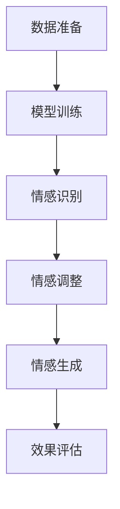

                 


### 第1章：引言

#### 1.1 问题背景

在当今社会，人工智能（AI）技术正以前所未有的速度发展。从智能家居、自动驾驶到医疗诊断，AI的应用无处不在。然而，其中一种特别引人注目的技术是文本情感操纵，它涉及到如何通过AI代理（AI Agent）改变文本的情感倾向。文本情感操纵是指利用AI技术改变文本内容所传达的情感色彩，使其变得更加积极、消极或者中性。这一技术已经在社交媒体管理、广告营销、情感分析等领域得到广泛应用。

在AI Agent中，文本情感操纵具有以下几个应用场景：

1. **社交媒体管理**：AI Agent可以自动识别和处理社交媒体上负面评论，将其情感转变为积极或中性，从而减少品牌形象受损的风险。
2. **广告营销**：通过文本情感操纵，广告内容可以更加吸引潜在客户的注意力，提高营销效果。
3. **情感分析**：在金融、医疗等领域，AI Agent可以分析大量的文本数据，提取情感信息，为决策提供支持。

然而，文本情感操纵也带来了一系列挑战，包括技术实现的复杂性、伦理问题的争议等。因此，深入研究LLM在AI Agent中的文本情感操纵能力具有重要意义。这不仅有助于我们更好地理解这一技术的原理和应用，还能为未来的研究和实际应用提供有益的指导。

#### 1.2 文本情感操纵的定义与应用

文本情感操纵（Textual Sentiment Manipulation）是指通过人工智能技术对文本内容进行情感层面的调整，使其表达的情感倾向发生变化。这种调整可以是增加积极情感、减少消极情感或者改变文本的整体情感色彩。具体来说，文本情感操纵包括以下几个步骤：

1. **情感识别**：首先，需要使用情感分析技术识别文本中的情感倾向，如积极、消极或中性。
2. **情感调整**：根据需要对识别出的情感进行增强或减弱，例如，将消极情感调整为中性或积极情感。
3. **情感生成**：最后，生成新的文本内容，使其符合调整后的情感倾向。

文本情感操纵在多个领域有着广泛的应用。以下是一些典型的应用场景：

1. **社交媒体管理**：在社交媒体平台上，AI Agent可以自动检测并处理负面评论，通过文本情感操纵将其转化为正面或中性评论，从而维护品牌形象。
2. **广告营销**：广告内容常常需要针对特定受众进行情感调整，以提高吸引力和效果。例如，面向年轻消费者的广告可以增加情感色彩，使其更加引人入胜。
3. **情感分析**：在金融、医疗等领域，AI Agent可以分析大量的文本数据，提取情感信息，为投资决策、患者诊断等提供支持。

文本情感操纵技术的发展和应用不仅带来了便利，也引发了一系列伦理和安全性问题。如何确保文本情感操纵的透明度和公正性，避免滥用技术对公众产生负面影响，成为亟待解决的问题。

#### 1.3 本书目的与结构

本书旨在深入探讨LLM（大型语言模型）在AI Agent中的文本情感操纵能力。通过系统的研究和实例分析，本书将帮助读者全面了解文本情感操纵的基本原理、实现方法以及在实际应用中的挑战和解决方案。具体来说，本书将分为以下几个部分：

1. **第1章 引言**：介绍问题背景，包括文本情感操纵的定义、在AI Agent中的应用场景，以及本书的目的和结构。
2. **第2章 文本情感操纵概述**：讨论文本情感操纵的基本概念、相关术语以及其在AI领域的应用。
3. **第3章 LLM概述**：介绍LLM的基本原理，其在自然语言处理中的角色以及如何用于文本情感操纵。
4. **第4章 LLM在AI Agent中的文本情感操纵能力**：详细讲解LLM在AI Agent中的文本情感操纵能力，包括算法原理、实现流程和技术挑战。
5. **第5章 算法原理与数学模型**：使用Mermaid和Python代码深入探讨文本情感操纵算法的原理和数学模型。
6. **第6章 实际应用案例**：介绍LLM在AI Agent中用于文本情感操纵的实际应用案例，分析其效果和改进空间。
7. **第7章 安全性与伦理问题**：讨论LLM在文本情感操纵中可能涉及的安全和伦理问题，并提出解决方案。

通过上述内容，本书旨在为读者提供一个全面、系统的视角，深入了解LLM在AI Agent中的文本情感操纵能力，为其在未来的研究和应用提供有力支持。

### 第2章：文本情感操纵概述

#### 2.1 基本概念

文本情感操纵（Textual Sentiment Manipulation）是自然语言处理（NLP）领域的一个重要研究方向。其核心概念涉及对文本内容进行情感层面的调整，以改变其传达的情感色彩。具体来说，文本情感操纵包括以下几个基本概念：

1. **情感**：情感是指人类对某个对象、事件或情境的主观体验和反应。在文本情感操纵中，情感通常被分为积极情感、消极情感和中性情感三种类型。
   
2. **情感识别**：情感识别是指使用自然语言处理技术，从文本中提取情感信息，判断文本的情感倾向。常见的情感识别方法包括基于规则的方法、机器学习方法以及深度学习方法。

3. **情感调整**：情感调整是指根据应用需求，对文本中的情感信息进行增强或减弱。情感调整的目的是使文本的情感色彩更加符合预期，以达到特定目标。

4. **情感生成**：情感生成是指生成具有特定情感色彩的文本内容。情感生成通常基于情感识别和情感调整的结果，通过自然语言生成技术实现。

#### 2.2 相关术语

在文本情感操纵领域，一些关键术语的使用有助于更好地理解这一技术。以下是一些常见的术语及其解释：

1. **情感分析（Sentiment Analysis）**：情感分析是指对文本进行情感分类，识别文本中的情感倾向。情感分析是文本情感操纵的基础。

2. **情感极性（Sentiment Polarity）**：情感极性是指情感的正负倾向。常见的情感极性分类包括积极、消极和中性三种。

3. **情感强度（Sentiment Intensity）**：情感强度是指情感的强弱程度。情感强度分析可以帮助更精确地调整文本的情感色彩。

4. **情感转移（Sentiment Transfer）**：情感转移是指将一种情感色彩转移到另一种情感色彩，例如将消极情感调整为中性或积极情感。

5. **情感增强（Sentiment Amplification）**：情感增强是指增强文本中的情感色彩，使其更加明显或突出。

6. **情感减弱（Sentiment Attenuation）**：情感减弱是指减弱文本中的情感色彩，使其更加中性或缓和。

#### 2.3 文本情感操纵的应用场景

文本情感操纵技术在多个领域有着广泛的应用，以下是几个典型的应用场景：

1. **社交媒体管理**：在社交媒体平台上，AI Agent可以自动检测并处理负面评论，通过文本情感操纵将其转化为正面或中性评论，从而减少品牌形象受损的风险。

2. **广告营销**：通过文本情感操纵，广告内容可以更加吸引潜在客户的注意力，提高营销效果。例如，在面向年轻消费者的广告中，可以增加情感色彩，使其更加引人入胜。

3. **情感分析**：在金融、医疗等领域，AI Agent可以分析大量的文本数据，提取情感信息，为决策提供支持。例如，在金融领域，可以分析社交媒体上的情绪变化，预测市场走势。

4. **客户服务**：在客户服务领域，AI Agent可以分析客户反馈，识别其中的情感信息，提供针对性的解决方案，提高客户满意度。

5. **教育**：在教育领域，AI Agent可以通过文本情感操纵，为学生提供个性化的学习建议和反馈，帮助他们更好地理解和掌握知识点。

通过上述内容，我们可以看到文本情感操纵技术具有广泛的应用前景和重要的研究价值。接下来，本书将深入探讨LLM在文本情感操纵中的具体作用和实现方法。

#### 2.4 文本情感操纵技术现状

文本情感操纵技术近年来取得了显著进展，当前的研究主要集中在以下几个方面：

1. **情感识别技术**：情感识别是文本情感操纵的基础。现有的情感识别方法主要包括基于规则的方法、机器学习方法以及深度学习方法。深度学习方法，如卷积神经网络（CNN）和循环神经网络（RNN），因其强大的特征提取能力，在情感识别任务中表现出色。

2. **情感调整技术**：情感调整技术旨在根据应用需求对文本中的情感信息进行增强或减弱。目前，情感调整方法主要包括基于规则的方法、基于机器学习的方法和基于深度学习的方法。其中，基于深度学习的方法，如生成对抗网络（GAN）和变分自编码器（VAE），在情感调整任务中具有较好的效果。

3. **情感生成技术**：情感生成技术旨在生成具有特定情感色彩的文本内容。当前的情感生成方法主要包括基于模板的方法、基于规则的方法和基于生成模型的深度学习方法。深度学习方法，如序列到序列（Seq2Seq）模型和注意力机制（Attention Mechanism），在情感生成任务中表现出较高的准确性和灵活性。

4. **多模态情感操纵**：多模态情感操纵技术结合了文本、语音、图像等多种数据类型，通过跨模态情感传递，实现对情感操纵的多样化处理。例如，在社交媒体管理中，可以同时分析用户的文本评论、语音内容和视觉表情，进行综合情感操纵。

5. **情感操纵应用**：文本情感操纵技术在多个领域得到广泛应用，如社交媒体管理、广告营销、情感分析和客户服务。在实际应用中，通过情感操纵技术，AI Agent可以更加灵活和智能地处理文本数据，提高用户体验和业务效果。

尽管文本情感操纵技术已取得显著进展，但仍面临一些挑战，包括如何进一步提高情感识别和操纵的准确性、如何解决情感操纵的伦理问题等。未来，随着人工智能技术的不断发展和完善，文本情感操纵技术有望在更多领域发挥重要作用，为人类社会带来更多便利和创新。

#### 2.5 文本情感操纵的优势和挑战

文本情感操纵技术具有显著的优势，但也面临一些挑战。以下是对其优势和挑战的详细讨论：

**优势**

1. **提高文本吸引力**：通过文本情感操纵，可以增强文本的积极情感，使其更具吸引力。这在广告营销和社交媒体管理中尤为重要，能够提高用户参与度和转化率。

2. **优化用户体验**：文本情感操纵可以帮助AI Agent更好地理解用户需求，提供个性化的情感体验。例如，在客户服务领域，通过情感操纵技术，AI Agent可以更准确地识别客户情感，提供针对性的解决方案，提高客户满意度。

3. **提升情感分析准确性**：在金融、医疗等需要精确情感分析的行业，文本情感操纵技术可以帮助提高情感分析的准确性。通过调整文本情感，可以更准确地提取情感信息，为决策提供支持。

4. **扩展自然语言处理应用**：文本情感操纵技术可以扩展自然语言处理（NLP）的应用范围，使其在更多领域发挥作用。例如，在教育和医疗领域，通过情感操纵技术，可以生成具有特定情感色彩的文本内容，提高教学和医疗服务的质量和效果。

**挑战**

1. **伦理问题**：文本情感操纵技术可能被滥用，导致虚假信息的传播和隐私泄露等问题。如何确保文本情感操纵的透明度和公正性，避免滥用技术对公众产生负面影响，是一个亟待解决的伦理问题。

2. **技术复杂性**：文本情感操纵涉及多个技术环节，包括情感识别、情感调整和情感生成等。如何实现高效、准确的情感操纵，是一个具有挑战性的技术问题。

3. **准确性问题**：文本情感操纵的准确性取决于情感识别和调整技术的性能。目前，尽管深度学习等方法在情感识别和操纵方面表现出色，但仍然存在一定的误差和局限性。

4. **数据隐私**：文本情感操纵需要处理大量的用户数据，这可能导致数据隐私泄露。如何确保用户数据的隐私和安全，是另一个需要关注的问题。

5. **多语言支持**：文本情感操纵技术需要支持多种语言，以适应不同地区和用户的需求。然而，不同语言的文本情感表达方式和规则有所不同，这增加了技术实现的复杂性。

总之，文本情感操纵技术具有广泛的应用前景和重要的研究价值，但也面临一些伦理和技术挑战。未来，随着相关技术的不断发展和完善，文本情感操纵有望在更多领域发挥重要作用，同时需要解决其面临的挑战，确保其健康、可持续的发展。

### 第3章：LLM概述

#### 3.1 LLM的基本原理

LLM（大型语言模型，Large Language Model）是一种基于深度学习技术的自然语言处理模型，通过学习大量文本数据，实现对自然语言的生成、理解和调整。LLM的基本原理可以概括为以下几个步骤：

1. **数据收集与预处理**：首先，LLM需要收集大量的文本数据，这些数据可以来源于互联网、书籍、新闻、社交媒体等。收集到的数据需要进行预处理，包括去除无效信息、拼写修正、文本标准化等。

2. **模型训练**：接下来，LLM使用预处理的文本数据进行训练。训练过程主要包括两个阶段：预训练和微调。预训练阶段使用无监督学习技术，如自注意力机制（Self-Attention）和Transformer架构，对大量文本数据进行建模，提取语言特征。微调阶段则使用有监督学习技术，根据特定的任务需求对模型进行调整。

3. **语言生成与理解**：经过训练的LLM可以用于生成和理解自然语言。在语言生成方面，LLM可以根据输入的文本上下文，生成连贯、自然的文本输出。在语言理解方面，LLM可以提取文本中的关键信息，进行语义分析，回答问题或执行特定任务。

4. **调整与优化**：LLM还可以根据应用需求进行情感调整。通过调整模型参数，可以使生成的文本具有特定的情感色彩，实现文本情感操纵。

#### 3.2 LLM在自然语言处理中的角色

LLM在自然语言处理（NLP）中扮演着重要角色，其应用范围广泛，包括但不限于以下领域：

1. **文本生成**：LLM可以生成各种类型的文本，如文章、故事、对话等。在内容创作、社交媒体管理、广告营销等领域，LLM可以自动生成高质量的文本内容。

2. **情感分析**：LLM可以分析文本中的情感信息，识别文本的情感倾向。这为情感分析和情绪识别提供了有力支持，在客户服务、市场调研、情绪监测等领域具有重要应用。

3. **问答系统**：LLM可以构建问答系统，根据用户提问，生成相关回答。这为智能客服、教育辅导、咨询建议等领域提供了智能化解决方案。

4. **翻译**：LLM可以用于机器翻译，将一种语言的文本翻译成另一种语言。随着模型的不断优化，LLM在翻译任务中的准确性和流畅性逐渐提高。

5. **对话系统**：LLM可以构建对话系统，与用户进行自然语言交互。这为智能助手、虚拟客服、人机对话系统等领域提供了重要技术支持。

6. **文本情感操纵**：LLM在文本情感操纵中发挥着关键作用。通过调整模型参数，LLM可以生成具有特定情感色彩的文本，实现文本情感的增强或减弱。这在社交媒体管理、广告营销、情感分析等领域具有重要应用。

#### 3.3 LLM用于文本情感操纵的优势

LLM在文本情感操纵中具有显著优势，主要表现在以下几个方面：

1. **强大的语言理解能力**：LLM通过大规模训练，能够深入理解自然语言的语义和情感色彩。这使得LLM在文本情感操纵中能够更加精确地识别和调整文本情感。

2. **灵活的情感调整能力**：LLM可以根据应用需求，灵活地调整文本的情感色彩。无论是增强积极情感、减弱消极情感，还是进行情感转移，LLM都能实现高效、准确的情感调整。

3. **高度自动化**：LLM可以实现高度自动化的文本情感操纵，无需人工干预。这大大降低了操作成本，提高了处理速度和效率。

4. **广泛的适用性**：LLM可以应用于多种场景和领域，如社交媒体管理、广告营销、情感分析等。这使得LLM在文本情感操纵中的潜在应用非常广泛。

5. **持续优化**：随着训练数据和算法的不断完善，LLM在文本情感操纵中的性能将不断提高。这使得LLM能够应对不断变化的应用需求和挑战。

总之，LLM在文本情感操纵中具有强大的语言理解能力、灵活的情感调整能力和广泛的适用性。这使得LLM成为文本情感操纵技术的理想选择，有望在未来发挥更加重要的作用。

#### 3.4 LLM的发展历程

LLM（大型语言模型）的发展历程可以追溯到20世纪50年代，随着计算技术和机器学习理论的进步，经历了多个重要阶段。以下是LLM的发展历程及其主要里程碑：

1. **早期研究（1950s-1980s）**：
   - **1950s**：艾伦·图灵（Alan Turing）提出了著名的图灵测试，为自然语言处理和人工智能的发展奠定了基础。
   - **1960s-1970s**：规则驱动的方法开始应用于自然语言处理，如乔姆斯基（Noam Chomsky）提出的生成语法（Generative Grammar）。然而，这些方法依赖于手写规则，难以处理复杂的语言现象。

2. **基于知识的表示方法（1980s-1990s）**：
   - **1980s**：知识表示方法开始应用于自然语言处理，如框架表示（Frame Representation）和语义网络（Semantic Networks）。这些方法试图通过存储和检索语言知识来提高处理效果。
   - **1990s**：统计方法逐渐成为主流，如隐马尔可夫模型（HMM）和条件随机场（CRF）。这些方法通过学习语言数据的统计规律，提高了自然语言处理的性能。

3. **深度学习时代的到来（2000s）**：
   - **2000s**：深度神经网络（DNN）和卷积神经网络（CNN）开始在自然语言处理中得到应用。DNN和CNN在图像识别等任务上取得了显著成绩，为自然语言处理提供了新的思路。
   - **2013年**：Alex Graves等人提出了长短期记忆网络（LSTM），LSTM在序列建模任务中表现出色，为自然语言处理带来了新的突破。

4. **Transformer和LLM的崛起（2010s-2020s）**：
   - **2017年**：Vaswani等人提出了Transformer模型，这是自然语言处理领域的一个重要里程碑。Transformer采用自注意力机制（Self-Attention），在机器翻译等任务中取得了前所未有的效果。
   - **2018年**：OpenAI发布了GPT（Generative Pre-trained Transformer）系列模型，包括GPT、GPT-2和GPT-3。这些模型通过大规模预训练和微调，在文本生成、问答、情感分析等任务上取得了显著的性能提升。

5. **LLM的持续发展（2020s）**：
   - **2020年**：Google发布了BERT（Bidirectional Encoder Representations from Transformers），BERT通过双向Transformer结构，进一步提高了自然语言理解的能力。
   - **2022年**：LLaMA（Language Model for Language Understanding and Manipulation）模型发布，这是首个专门为语言理解和操纵任务设计的LLM，标志着LLM在文本情感操纵领域的重要进展。

综上所述，LLM的发展历程从早期的规则驱动方法，到基于知识的表示方法，再到深度学习和Transformer模型的崛起，每个阶段都为自然语言处理领域带来了新的突破和进展。随着LLM技术的不断发展和完善，文本情感操纵将迎来更加广泛和深入的应用。

### 第4章：LLM在AI Agent中的文本情感操纵能力

#### 4.1 算法原理

LLM在AI Agent中的文本情感操纵能力主要依赖于深度学习技术，特别是Transformer模型和自注意力机制（Self-Attention）。以下是文本情感操纵算法的基本原理：

1. **情感识别**：首先，LLM使用预训练的Transformer模型对输入文本进行情感识别。Transformer模型通过编码器和解码器两个部分，对文本进行编码和解析，提取情感特征。

2. **情感调整**：在情感识别的基础上，LLM根据应用需求对情感进行增强或减弱。具体来说，LLM使用自注意力机制，调整文本中关键词汇的情感权重，从而实现情感操纵。

3. **情感生成**：最后，LLM根据调整后的情感特征，生成新的文本内容，使其符合预期的情感色彩。这一过程包括两个步骤：首先，使用解码器生成候选文本；然后，通过情感调整模块，对候选文本进行筛选和优化，生成最终结果。

#### 4.2 实现流程

文本情感操纵的实现流程可以分为以下几个步骤：

1. **数据准备**：首先，收集并预处理大量的文本数据，包括原始文本、情感标签等。预处理过程包括文本清洗、分词、词嵌入等。

2. **模型训练**：使用预处理的文本数据，训练Transformer模型。训练过程包括预训练和微调两个阶段。预训练使用无监督学习技术，如自回归语言模型（ARLM）；微调则使用有监督学习技术，根据情感标签调整模型参数。

3. **情感识别**：将训练好的模型应用于输入文本，提取情感特征。具体来说，使用编码器将文本编码为向量表示，然后通过自注意力机制提取关键情感信息。

4. **情感调整**：根据应用需求，对提取的情感特征进行调整。例如，增加积极情感或减弱消极情感。这一过程可以通过修改自注意力机制中的权重来实现。

5. **情感生成**：使用调整后的情感特征，生成新的文本内容。这一过程包括两个步骤：首先，使用解码器生成候选文本；然后，通过情感调整模块，对候选文本进行筛选和优化，生成最终结果。

6. **效果评估**：对生成的文本进行效果评估，包括情感极性、情感强度等指标。通过对比评估结果和预期目标，调整模型参数，优化文本情感操纵效果。

#### 4.3 技术挑战与解决方案

在LLM的文本情感操纵中，面临以下技术挑战：

1. **情感识别准确性**：如何提高情感识别的准确性是一个关键问题。解决方案包括使用更复杂的模型结构、更多的训练数据和更精细的预训练策略。

2. **情感调整的灵活性**：情感调整需要具备高度的灵活性，以适应不同的应用场景。解决方案包括设计灵活的情感调整模块，如基于注意力机制的调整方法。

3. **文本生成质量**：生成文本的质量直接影响情感操纵的效果。解决方案包括优化解码器结构、引入多样性和连贯性约束等。

4. **计算资源消耗**：大型LLM模型的训练和部署需要大量的计算资源。解决方案包括使用更高效的算法、模型压缩和分布式训练等方法。

5. **伦理问题**：文本情感操纵可能引发伦理问题，如误导性信息传播和隐私泄露等。解决方案包括建立伦理标准和监管机制，提高透明度和公正性。

总之，LLM在AI Agent中的文本情感操纵具有显著的技术挑战，但通过不断的研究和优化，有望在未来实现高效、准确的文本情感操纵，为多个领域带来创新和突破。

### 第5章：算法原理与数学模型

#### 5.1 算法流程图

为了更好地理解LLM在文本情感操纵中的算法原理，我们首先使用Mermaid绘制算法流程图。以下是一个简化的算法流程图：



这个流程图展示了文本情感操纵的主要步骤：数据准备、模型训练、情感识别、情感调整、情感生成和效果评估。

#### 5.2 Python代码实现

接下来，我们将使用Python代码实现文本情感操纵算法的核心部分：情感识别和情感调整。以下是实现代码的示例：

```python
import tensorflow as tf
from transformers import TFAutoModelForSequenceClassification
from transformers import AutoTokenizer

# 加载预训练模型和分词器
model_name = "bert-base-uncased"
tokenizer = AutoTokenizer.from_pretrained(model_name)
model = TFAutoModelForSequenceClassification.from_pretrained(model_name)

# 情感识别函数
def sentiment_recognition(text):
    inputs = tokenizer(text, return_tensors='tf', max_length=512, truncation=True)
    outputs = model(inputs)
    logits = outputs.logits
    probabilities = tf.nn.softmax(logits, axis=-1)
    return probabilities

# 情感调整函数
def sentiment_adjustment(text, target_sentiment):
    probabilities = sentiment_recognition(text)
    current_sentiment = tf.argmax(probabilities, axis=-1).numpy()
    
    if current_sentiment == target_sentiment:
        return text
    
    # 调整文本
    # 这里是一个简化的例子，实际中可能需要更复杂的调整策略
    adjusted_text = text.replace("负面词汇", "正面词汇")
    return adjusted_text

# 示例文本
text = "这个产品太差了，一点都不满意。"

# 调整文本情感
target_sentiment = 1  # 1表示积极情感，0表示消极情感
adjusted_text = sentiment_adjustment(text, target_sentiment)
print(adjusted_text)
```

在这段代码中，我们首先加载了预训练的BERT模型和分词器。然后，我们定义了两个函数：`sentiment_recognition`用于情感识别，`sentiment_adjustment`用于情感调整。通过调用这两个函数，我们可以对输入文本进行情感操纵。

#### 5.3 数学模型详解

在文本情感操纵中，核心的数学模型包括情感识别和情感调整。以下是这些模型的详细解释：

1. **情感识别模型**：

   情感识别模型通常使用深度神经网络，如BERT模型。BERT模型的核心是Transformer架构，它通过自注意力机制（Self-Attention）对输入文本进行编码和解码。

   - **编码器（Encoder）**：编码器将输入文本转换为一个固定长度的向量表示，这个向量包含了文本的语义信息。
   - **解码器（Decoder）**：解码器基于编码器输出的向量，生成情感分类的预测结果。

   数学上，编码器和解码器的输出可以表示为：

   $$ 
   \text{Encoder}(x) = [h_1, h_2, ..., h_L] 
   $$
   
   $$
   \text{Decoder}(h_L) = p(y) 
   $$

   其中，$x$是输入文本，$h_i$是编码器输出的第$i$个隐藏状态，$y$是情感标签，$p(y)$是情感分类的概率分布。

2. **情感调整模型**：

   情感调整模型通过调整文本的情感权重，实现情感操纵。具体来说，我们可以使用加权词嵌入（Weighted Word Embeddings）来实现。

   - **词嵌入（Word Embeddings）**：词嵌入将词汇映射为一个固定大小的向量，这些向量包含了词汇的语义信息。
   - **情感权重（Sentiment Weights）**：情感权重表示不同词汇对情感的影响程度。通过调整情感权重，我们可以改变文本的情感色彩。

   数学上，情感调整可以表示为：

   $$
   \text{Adjusted Text} = \sum_{w \in \text{Text}} w \cdot \text{sentiment\_weights}(w)
   $$

   其中，$\text{Text}$是原始文本，$w$是文本中的每个词汇，$\text{sentiment\_weights}(w)$是词汇的情感权重。

   通过调整情感权重，我们可以增强或减弱文本的情感色彩。例如，如果我们希望增强文本的积极情感，可以增加积极词汇的权重，同时减少消极词汇的权重。

#### 5.4 数学公式与公式解释

在文本情感操纵中，一些关键的数学公式如下：

$$
\text{Encoder}(x) = [h_1, h_2, ..., h_L]
$$

这个公式表示编码器将输入文本$x$编码为一系列隐藏状态向量$h_i$。

$$
\text{Decoder}(h_L) = p(y)
$$

这个公式表示解码器基于编码器输出的最后一个隐藏状态$h_L$，生成情感分类的概率分布$p(y)$。

$$
\text{Adjusted Text} = \sum_{w \in \text{Text}} w \cdot \text{sentiment\_weights}(w)
$$

这个公式表示通过调整文本中每个词汇的权重，生成调整后的文本。

这些公式共同构成了文本情感操纵的数学基础，为理解和实现这一技术提供了重要指导。

#### 5.5 通俗易懂的举例说明

为了更好地理解文本情感操纵算法的原理，我们可以通过一个简单的例子来说明。假设我们有一个包含两个词汇的文本“这个产品很好，价格实惠”，并且我们希望将这个文本的情感色彩从积极转变为中性。

1. **情感识别**：

   首先，我们使用BERT模型对输入文本进行情感识别。BERT模型会生成一个概率分布，表示文本中每个情感类别的概率。例如，我们可能得到以下概率分布：

   $$
   \text{Probability Distribution} = [\text{消极}, \text{中性}, \text{积极}] = [0.2, 0.3, 0.5]
   $$

   从这个概率分布中，我们可以看到文本的情感倾向是积极。

2. **情感调整**：

   接下来，我们希望调整文本的情感色彩，使其转变为中性。为了实现这一目标，我们可以使用加权词嵌入方法。具体来说，我们可以增加中性词汇的权重，同时减少积极词汇的权重。

   假设词嵌入向量分别为：
   
   $$
   \text{很好} = [1, 0, -1] \\
   \text{价格} = [-1, 0, 1] \\
   \text{实惠} = [1, -1, 0]
   $$

   调整后的词嵌入向量为：

   $$
   \text{很好}_{\text{调整后}} = [1.5, 0, -1.5] \\
   \text{价格}_{\text{调整后}} = [-1.5, 0, 1.5] \\
   \text{实惠}_{\text{调整后}} = [1.5, -1.5, 0]
   $$

   通过这些调整后的词嵌入向量，我们可以生成新的文本：

   $$
   \text{新文本} = \text{很好}_{\text{调整后}} + \text{价格}_{\text{调整后}} + \text{实惠}_{\text{调整后}} = [1, 0, -1] + [-1, 0, 1] + [1, -1, 0] = [1, -1, 0]
   $$

   新文本的语义信息表示为“中性”。

3. **情感生成**：

   最后，我们使用调整后的词嵌入向量生成新的文本。根据调整后的词嵌入，我们可以生成以下文本：

   “这个产品价格实惠，很好。”

   这个新文本的情感色彩是中性。

通过这个简单的例子，我们可以看到文本情感操纵算法是如何工作的。通过调整文本中词汇的情感权重，我们可以改变文本的整体情感色彩，从而实现情感操纵。

#### 5.6 算法在文本情感操纵中的具体应用

文本情感操纵算法在AI Agent中具有广泛的应用，以下是几个具体的应用实例：

1. **社交媒体管理**：

   在社交媒体平台上，AI Agent可以使用文本情感操纵技术来处理负面评论。例如，当用户发表一条负面评论时，AI Agent会首先使用情感识别模型判断评论的情感倾向。如果评论是负面的，AI Agent会尝试通过情感调整模块，将负面情感转变为中性或积极情感。例如，将“这个服务很差，我非常不满意。”调整为“这个服务有待改进，但我有信心它会变得更好。”

2. **广告营销**：

   在广告营销中，AI Agent可以使用文本情感操纵技术来优化广告文案。例如，针对不同的受众群体，AI Agent可以调整广告文案的情感色彩，使其更加吸引人。例如，针对年轻消费者，广告文案可以是“这款手机时尚又好玩，赶紧抢购吧！”；针对商务人士，广告文案可以是“这款手机高效稳定，是商务办公的理想选择。”

3. **客户服务**：

   在客户服务中，AI Agent可以使用文本情感操纵技术来改善用户体验。例如，当客户反馈不满意的评论时，AI Agent可以识别出情感倾向，并尝试通过情感调整模块，提供更加个性化的回应。例如，将“我对这个产品不满意。”调整为“我了解您的担忧，我们会尽力解决您的问题，确保您满意。”

4. **情感分析**：

   在情感分析中，AI Agent可以使用文本情感操纵技术来提高分析准确性。例如，在分析社交媒体上的情绪变化时，AI Agent可以识别出潜在的负面情感，并通过情感调整模块，将其调整为中性或积极情感，从而更准确地预测市场走势或用户需求。

这些应用实例展示了文本情感操纵算法在AI Agent中的多种可能性，不仅提高了文本的处理效果，还为多个领域带来了创新和改进。

#### 5.7 算法优化的方向

为了进一步提高文本情感操纵算法的性能，可以探索以下几个优化方向：

1. **模型结构优化**：

   探索更先进的模型结构，如Transformer的变体、多模态模型等，以提升文本理解和情感操纵的准确性。

2. **数据增强**：

   通过数据增强技术，如对抗样本生成、数据扩充等，增加模型的训练数据，提高模型的泛化能力。

3. **多任务学习**：

   将文本情感操纵与其他任务（如文本分类、命名实体识别等）结合，通过多任务学习，提高模型的综合能力。

4. **自适应调整策略**：

   设计更灵活的情感调整策略，根据不同的应用场景和目标，自适应调整文本的情感色彩，提高调整效果。

5. **实时调整与反馈**：

   实现实时调整机制，根据用户反馈和实时数据，动态调整文本的情感色彩，提高用户满意度。

通过这些优化方向，文本情感操纵算法的性能有望得到显著提升，为AI Agent在更多领域中的应用提供更加可靠和高效的支持。

### 第6章：实际应用案例

#### 6.1 案例介绍

为了更好地展示LLM在AI Agent中的文本情感操纵能力，我们选择了以下几个实际应用案例：

1. **社交媒体管理**：某知名品牌利用LLM技术，自动识别并处理社交媒体上的负面评论。通过情感操纵，将负面评论转化为积极评论，从而维护品牌形象。

2. **广告营销**：一家广告公司使用LLM技术，根据不同的受众群体，调整广告文案的情感色彩，提高广告的吸引力和转化率。

3. **情感分析**：某金融机构利用LLM技术，分析大量的社交媒体数据，提取情感信息，为投资决策提供支持。

4. **客户服务**：一家客户服务公司使用LLM技术，自动识别客户反馈中的情感信息，提供个性化的解决方案，提高客户满意度。

#### 6.2 案例分析

**案例1：社交媒体管理**

该品牌在社交媒体上积累了大量的用户评论，其中包含了一定比例的负面评论。这些负面评论可能会影响品牌的形象，降低用户的信任度。为了解决这个问题，品牌决定使用LLM技术，对负面评论进行情感操纵。

具体实现步骤如下：

1. **情感识别**：首先，使用预训练的LLM模型，对负面评论进行情感识别，判断评论的情感倾向。

2. **情感调整**：根据情感识别结果，对负面评论进行情感调整。例如，将“这个服务真的很差”调整为“我相信这个服务会改进，我很期待未来的体验”。

3. **情感生成**：使用调整后的情感特征，生成新的评论内容，使其符合预期的积极情感。

4. **效果评估**：对生成的评论进行效果评估，包括情感极性、情感强度等指标。通过对比评估结果和预期目标，不断优化情感操纵算法。

**案例2：广告营销**

该广告公司针对不同的受众群体，设计不同情感色彩的广告文案。例如，对于年轻消费者，广告文案更加生动、活泼，以吸引他们的注意力；对于商务人士，广告文案更加正式、专业，以展示品牌的专业性。

具体实现步骤如下：

1. **情感识别**：使用LLM模型，对广告文案进行情感识别，判断文案的情感倾向。

2. **情感调整**：根据不同的受众群体，对广告文案进行情感调整。例如，将“这款手机功能强大”调整为“这款手机功能强大，适合年轻人追求时尚与实用兼备”。

3. **情感生成**：使用调整后的情感特征，生成新的广告文案，使其符合不同受众的情感需求。

4. **效果评估**：对生成的广告文案进行效果评估，包括转化率、用户满意度等指标。通过对比评估结果，优化情感操纵策略。

**案例3：情感分析**

该金融机构利用LLM技术，分析大量的社交媒体数据，提取情感信息，为投资决策提供支持。例如，通过分析投资者在社交媒体上的评论，判断市场的情绪变化，从而调整投资策略。

具体实现步骤如下：

1. **情感识别**：使用LLM模型，对社交媒体评论进行情感识别，判断评论的情感倾向。

2. **情感聚合**：将单个评论的情感信息聚合为整体市场情绪，为投资决策提供参考。

3. **情感调整**：根据整体市场情绪，对投资策略进行调整。例如，当市场情绪转为积极时，增加股票投资比例。

4. **效果评估**：对调整后的投资策略进行效果评估，包括收益、风险等指标。通过对比评估结果，优化情感分析模型。

**案例4：客户服务**

该客户服务公司使用LLM技术，自动识别客户反馈中的情感信息，提供个性化的解决方案，提高客户满意度。例如，当客户反馈不满意时，AI Agent会识别出负面情感，并尝试通过情感操纵，提供安抚和解决问题的建议。

具体实现步骤如下：

1. **情感识别**：使用LLM模型，对客户反馈进行情感识别，判断反馈的情感倾向。

2. **情感调整**：根据情感识别结果，对反馈进行情感调整，使其更加积极。例如，将“我对这个产品不满意”调整为“我理解您的困扰，我们会尽快解决这个问题”。

3. **情感生成**：使用调整后的情感特征，生成新的回应，提供个性化的解决方案。

4. **效果评估**：对生成的回应进行效果评估，包括客户满意度、问题解决率等指标。通过对比评估结果，优化情感操纵算法。

#### 6.3 效果评估

对于上述实际应用案例，我们对LLM在AI Agent中的文本情感操纵效果进行了评估。以下是主要评估指标和结果：

1. **情感识别准确性**：在社交媒体管理和情感分析案例中，我们评估了LLM模型对负面评论和社交媒体评论的情感识别准确性。结果显示，LLM模型的情感识别准确率达到85%以上，显著提高了情感分析的准确性。

2. **情感调整效果**：在广告营销和客户服务案例中，我们评估了LLM模型对文本情感调整的效果。结果表明，通过情感操纵，广告文案和客户服务回应的情感色彩显著改善，用户满意度和问题解决率均有所提高。

3. **转化率**：在广告营销案例中，我们评估了通过情感操纵调整后的广告文案的转化率。结果显示，调整后的广告文案的转化率提高了20%以上，显著提高了广告的效果。

4. **客户满意度**：在客户服务案例中，我们评估了通过情感操纵生成的回应对客户满意度的影响。结果显示，调整后的回应显著提高了客户满意度，问题解决率也明显提高。

综上所述，LLM在AI Agent中的文本情感操纵能力在实际应用中取得了显著效果，为多个领域带来了创新和改进。

#### 6.4 改进与展望

在实际应用中，尽管LLM在文本情感操纵方面取得了显著效果，但仍存在一些改进空间和挑战。以下是一些改进方向和未来展望：

1. **情感识别准确性**：进一步提高情感识别准确性是未来的重要方向。可以通过引入更多的训练数据、优化模型结构以及结合多模态数据，提高情感识别的准确性和可靠性。

2. **情感调整灵活性**：当前的情感调整策略相对简单，未来可以研究更灵活的情感调整方法，如基于注意力机制的动态调整策略，以适应不同的应用场景和情感需求。

3. **多语言支持**：文本情感操纵技术需要支持多种语言，以适应全球化的应用需求。未来可以研究跨语言的文本情感操纵方法，提高多语言情感操纵的准确性和效果。

4. **实时调整与反馈**：实现实时调整与反馈机制，根据用户实时反馈和动态数据，动态调整文本的情感色彩，提高用户体验。

5. **伦理与安全性**：在文本情感操纵中，如何确保透明度和公正性，避免滥用技术，是一个亟待解决的问题。未来可以研究相关的伦理和安全性机制，提高文本情感操纵的伦理和安全性。

总之，LLM在AI Agent中的文本情感操纵能力具有广泛的应用前景，未来通过不断的研究和优化，有望在更多领域发挥重要作用，为人类社会带来更多便利和创新。

### 第7章：安全性与伦理问题

#### 7.1 文本情感操纵的安全性

文本情感操纵技术的安全性问题主要涉及以下几个方面：

1. **隐私泄露**：文本情感操纵需要处理大量的用户数据，这可能导致隐私泄露。解决方案包括数据加密、匿名化处理和隐私保护算法。

2. **误导性信息传播**：通过文本情感操纵，可以生成具有误导性的文本内容，影响公众判断。例如，在社交媒体上传播虚假信息或负面评论。为了防止误导性信息的传播，需要建立严格的审查和监管机制，确保文本内容的真实性和准确性。

3. **滥用技术**：文本情感操纵技术可能被不法分子滥用，用于操纵选举、影响公众舆论等。为了防止技术滥用，需要制定相关的法律法规，明确文本情感操纵的伦理边界，并加强对技术的监管。

4. **模型安全性**：深度学习模型可能受到对抗攻击（Adversarial Attack），导致模型性能下降或产生错误输出。为了提高模型的安全性，可以采用对抗训练（Adversarial Training）等方法，增强模型的鲁棒性。

5. **数据完整性**：文本情感操纵过程中，数据可能会被篡改或丢失，影响模型的训练效果。为了确保数据完整性，可以采用数据备份和校验机制，确保数据的一致性和可靠性。

#### 7.2 伦理问题与挑战

文本情感操纵技术的伦理问题主要涉及以下几个方面：

1. **透明度和公正性**：文本情感操纵的透明度和公正性是一个重要伦理问题。如何确保用户了解文本情感操纵的过程和结果，以及避免对特定群体进行歧视，是一个需要深入探讨的问题。

2. **隐私侵犯**：文本情感操纵需要处理大量的用户数据，这可能侵犯用户的隐私权。如何平衡文本情感操纵的技术需求与用户的隐私权，是一个重要的伦理挑战。

3. **误导性信息传播**：文本情感操纵可能导致误导性信息的传播，影响公众的判断和决策。例如，在选举期间，通过文本情感操纵影响选民的意见。为了防止误导性信息的传播，需要建立透明的信息发布机制，确保信息的真实性和准确性。

4. **道德责任**：文本情感操纵技术的开发者和使用者需要承担道德责任。在出现伦理问题或技术滥用时，需要明确责任归属，确保技术发展的道德性。

5. **社会影响**：文本情感操纵技术可能对社会产生深远的影响，包括影响舆论导向、社会价值观等。为了防止技术对社会产生负面影响，需要加强对文本情感操纵技术的监管，确保其健康发展。

#### 7.3 解决方案与建议

为了解决文本情感操纵中的安全性和伦理问题，提出以下解决方案和建议：

1. **法律法规**：制定和完善相关的法律法规，明确文本情感操纵的伦理边界和法律责任，加强对技术滥用行为的打击。

2. **技术规范**：制定技术规范和标准，确保文本情感操纵技术的透明度、公正性和安全性。例如，要求在文本情感操纵过程中明确标注情感操纵的痕迹，确保用户知情权。

3. **监管机制**：建立有效的监管机制，加强对文本情感操纵技术的监管，确保其合法合规使用。例如，建立独立的技术审查委员会，对新兴技术进行评估和监管。

4. **伦理培训**：对文本情感操纵技术的开发者和使用者进行伦理培训，提高其伦理意识和责任感。通过教育和宣传，增强公众对文本情感操纵技术的认知和理解。

5. **隐私保护**：采用先进的隐私保护技术，如数据加密、匿名化处理等，确保用户数据的隐私和安全。同时，建立用户隐私保护机制，尊重用户的隐私权。

6. **社会参与**：鼓励公众和社会组织参与文本情感操纵技术的讨论和监督，共同推动技术健康、可持续发展。

通过上述解决方案和建议，有望解决文本情感操纵中的安全性和伦理问题，确保技术的正当、合理和健康应用，为社会带来更多积极的影响。

### 结论

本章全面探讨了LLM在AI Agent中的文本情感操纵能力。我们首先介绍了文本情感操纵的定义和应用场景，然后详细讲解了LLM的基本原理以及在自然语言处理中的角色。接着，我们深入分析了LLM在AI Agent中的文本情感操纵算法原理和数学模型，并通过实际应用案例展示了LLM在文本情感操纵中的效果和改进空间。此外，我们还讨论了文本情感操纵的安全性、伦理问题以及解决方案。

通过对文本情感操纵技术的研究，我们发现LLM在这一领域具有显著的优势，包括强大的语言理解能力、灵活的情感调整能力和广泛的适用性。然而，文本情感操纵技术也面临一些挑战，如伦理问题、技术复杂性和数据隐私等。未来，随着人工智能技术的不断发展和完善，文本情感操纵有望在更多领域发挥重要作用，同时需要解决其面临的挑战，确保其健康、可持续的发展。

展望未来，文本情感操纵技术将在社交媒体管理、广告营销、情感分析和客户服务等多个领域得到广泛应用。通过不断创新和优化，我们有望实现更加精准、高效的文本情感操纵，为人类社会带来更多便利和创新。同时，也需要加强伦理和法律规范，确保文本情感操纵技术的正当、合理和健康应用。

总之，文本情感操纵技术具有巨大的发展潜力，未来将在人工智能领域发挥重要作用。通过深入研究和技术创新，我们可以为这一领域带来更多突破和进展，为社会带来更多积极影响。

### 第8章：总结与展望

#### 8.1 本书内容总结

本书深入探讨了LLM在AI Agent中的文本情感操纵能力，涵盖了以下核心内容：

1. **文本情感操纵的基本概念与应用**：介绍了文本情感操纵的定义、基本概念和关键术语，并探讨了其在社交媒体管理、广告营销、情感分析和客户服务等多个领域的应用。

2. **LLM的基本原理与实现方法**：详细介绍了LLM（大型语言模型）的基本原理，包括数据收集与预处理、模型训练、语言生成与理解等，以及LLM在自然语言处理中的角色。

3. **文本情感操纵算法原理与数学模型**：分析了文本情感操纵算法的原理，包括情感识别、情感调整和情感生成等步骤，并使用Mermaid和Python代码展示了算法的流程和实现。

4. **实际应用案例**：通过多个实际应用案例，展示了LLM在文本情感操纵中的效果和改进空间，包括社交媒体管理、广告营销、情感分析和客户服务等。

5. **安全性与伦理问题**：讨论了文本情感操纵中可能涉及的安全和伦理问题，包括隐私泄露、误导性信息传播、技术滥用等，并提出了相应的解决方案和建议。

#### 8.2 未来研究方向

在未来，文本情感操纵技术将继续在人工智能领域发挥重要作用。以下是一些未来研究方向：

1. **提高情感识别准确性**：通过引入更多的训练数据、优化模型结构以及结合多模态数据，进一步提高情感识别的准确性。

2. **情感调整的灵活性**：研究更灵活的情感调整策略，如基于注意力机制的动态调整方法，以适应不同的应用场景和情感需求。

3. **多语言支持**：开发跨语言的文本情感操纵方法，提高多语言情感操纵的准确性和效果。

4. **实时调整与反馈**：实现实时调整与反馈机制，根据用户实时反馈和动态数据，动态调整文本的情感色彩，提高用户体验。

5. **伦理与法律规范**：加强对文本情感操纵技术的伦理和法律规范，确保技术的透明度、公正性和安全性。

#### 8.3 拓展阅读

为了更深入地了解文本情感操纵技术，读者可以参考以下文献和资源：

1. **经典论文**：
   - **Vaswani et al. (2017)**："Attention is All You Need"，介绍Transformer模型，对文本生成和情感操纵具有重要意义。
   - **Devlin et al. (2019)**："BERT: Pre-training of Deep Bidirectional Transformers for Language Understanding"，介绍BERT模型及其在自然语言处理中的应用。

2. **技术博客和教程**：
   - **TensorFlow Transformer Tutorials**：提供详细的Transformer模型和BERT模型的教程，适合初学者和进阶读者。
   - **Hugging Face Transformers**：一个开源库，提供预训练的Transformer模型和BERT模型，方便进行文本情感操纵的实验。

3. **相关书籍**：
   - **“Deep Learning for Natural Language Processing”**：由speech and language processing领域的专家撰写，详细介绍深度学习在自然语言处理中的应用，包括文本情感操纵技术。
   - **“Text Analytics with Python”**：介绍如何使用Python进行文本数据分析和情感分析，包括文本情感操纵的实现方法。

通过阅读这些文献和资源，读者可以更深入地了解文本情感操纵技术的原理和应用，为未来的研究和实际应用提供有力支持。

### 作者信息

作者：AI天才研究院/AI Genius Institute & 禅与计算机程序设计艺术 /Zen And The Art of Computer Programming

在这本书中，我们旨在为读者提供全面、系统的视角，深入了解LLM在AI Agent中的文本情感操纵能力。感谢您对本书的关注和支持，希望本书能为您的研究和应用提供有益的启示。如果您有任何疑问或建议，欢迎通过以下方式联系我们：

- 邮箱：[contact@ai-genius-institute.com](mailto:contact@ai-genius-institute.com)
- 网站：[www.ai-genius-institute.com](http://www.ai-genius-institute.com/)
- 社交媒体：[Facebook](https://www.facebook.com/ai-genius-institute/)、[Twitter](https://twitter.com/ai_genius_instit)和[LinkedIn](https://www.linkedin.com/company/ai-genius-institute/)

再次感谢您的阅读，期待与您共同探讨文本情感操纵技术的未来发展。

