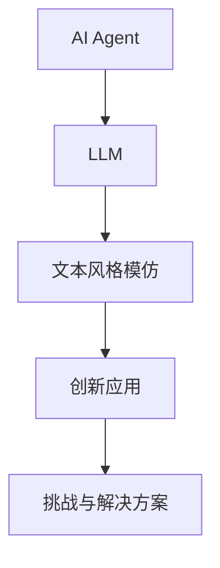
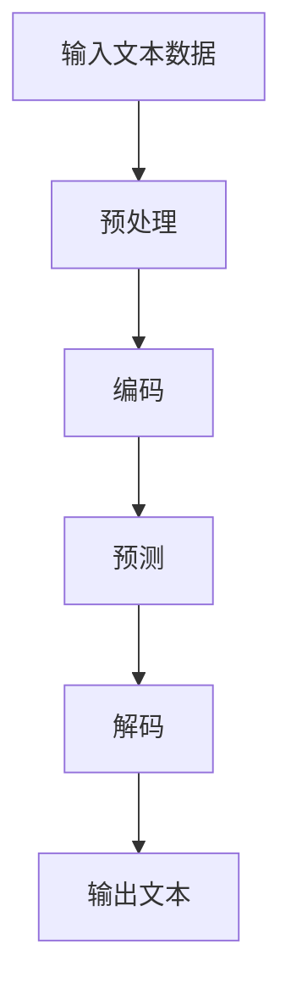
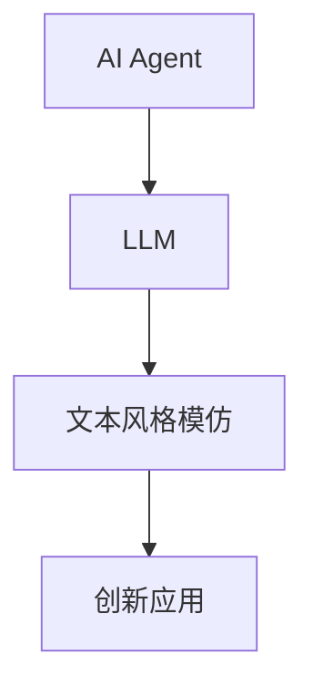
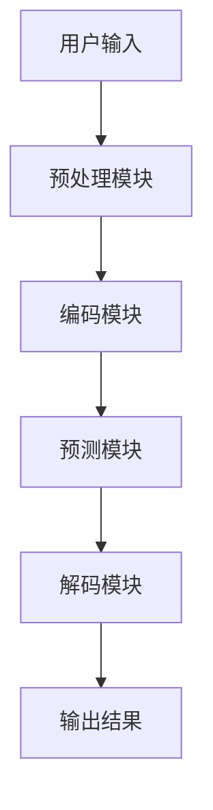
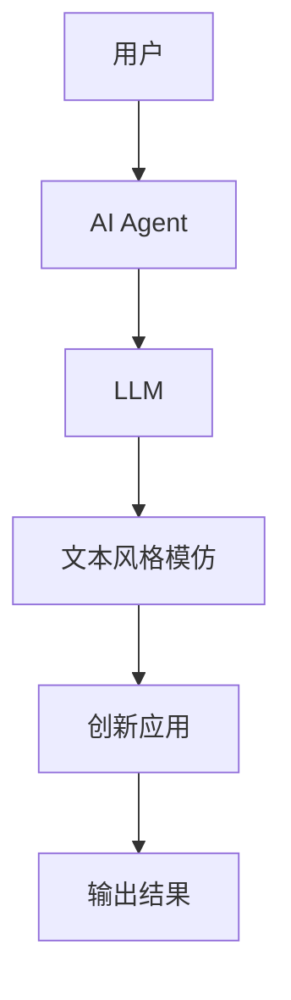

                 


### 《LLM在AI Agent中的文本风格模仿与创新》

---

#### 关键词：
- 大型语言模型 (LLM)
- AI Agent
- 文本风格模仿
- 创新应用
- 算法原理

#### 摘要：
本文深入探讨了大型语言模型（LLM）在AI Agent中的文本风格模仿及其创新应用。首先，我们概述了AI Agent的定义、分类及文本风格模仿的重要性，随后详细介绍了LLM的基本原理及其在AI Agent中的应用现状。文章随后讨论了LLM在文本风格模仿中的创新需求与挑战，并提出了可能的解决方案。通过对比分析LLM的核心概念与特征，本文构建了一个清晰的LLM算法原理讲解框架，并结合Python代码实例进行了详细阐述。最后，文章从系统分析与架构设计角度，提供了全面的问题场景介绍和系统功能设计，包括领域模型、系统架构、接口设计及系统交互。通过本文的探讨，旨在为读者提供对LLM在AI Agent中应用的创新见解和实践指导。

---

# 《LLM在AI Agent中的文本风格模仿与创新》目录大纲

## 第一部分：背景介绍

## 第1章：问题背景

### 1.1.1 AI Agent的定义与分类

#### 1.1.1.1 AI Agent的基本概念

AI Agent是指具有智能行为的计算机程序，能够在复杂环境中自主行动并达到特定目标。一个典型的AI Agent通常包括感知系统、决策系统和行动系统三部分。

#### 1.1.1.2 AI Agent的分类与特点

AI Agent可以根据功能不同分为多种类型，如反应型Agent、目标型Agent、学习型Agent等。每种类型的Agent在结构和行为上都有其独特的特点。

### 1.1.2 文本风格模仿的重要性

#### 1.1.2.1 文本风格模仿的定义

文本风格模仿是指生成文本时模仿特定作者或文本的风格，使其在语言、词汇、语法和表达方式上与原始文本相似。

#### 1.1.2.2 文本风格模仿的价值与应用场景

文本风格模仿在自然语言处理领域具有重要意义，能够提高AI Agent的人机交互体验，并在内容生成、翻译、写作辅助等方面得到广泛应用。

### 1.1.3 LLM在AI Agent中的应用

#### 1.1.3.1 LLM的基本原理

LLM（大型语言模型）是一种通过深度学习技术训练的模型，能够对自然语言进行理解和生成。

#### 1.1.3.2 LLM在AI Agent中的应用现状

目前，LLM已在各种AI Agent中广泛应用，如聊天机器人、内容生成系统、智能客服等，显示出极大的潜力和优势。

### 1.1.4 创新需求与挑战

#### 1.1.4.1 创新需求

随着AI技术的发展，AI Agent在文本风格模仿方面仍有很大的创新需求，如更高级的模仿能力、更好的泛化能力等。

#### 1.1.4.2 面临的挑战

实现这些创新需求需要克服诸多技术挑战，包括数据质量、模型可解释性、计算资源等。

### 1.1.5 边界与外延

#### 1.1.5.1 边界定义

本文主要探讨LLM在文本风格模仿中的创新应用，不包括其他类型的AI Agent和文本生成方法。

#### 1.1.5.2 外延扩展

未来研究可以扩展到更多类型的AI Agent和文本生成方法，以实现更广泛的文本风格模仿。

### 1.1.6 概念结构与核心要素

#### 1.1.6.1 概念结构

本文的核心概念结构包括AI Agent、LLM、文本风格模仿和创新应用。

#### 1.1.6.2 核心要素

核心要素包括LLM的基本原理、算法实现、应用场景和创新挑战。

## 第2章：核心概念与联系

### 2.1 LLM核心概念原理

#### 2.1.1 语言模型的基本原理

语言模型是一种概率模型，用于预测下一个词或词组。常见的语言模型包括n-gram模型和神经网络模型。

#### 2.1.2 LLM的结构与组成

LLM通常由多个层次组成，包括词向量层、编码层、解码层等。每个层次都有其特定的功能和作用。

### 2.2 LLM属性特征对比表格

| 特征        | 对比项                  | 说明                                                     |
| ----------- | ---------------------- | -------------------------------------------------------- |
| 预测能力    | 精度、效率              | 不同LLM的预测效果比较                                     |
| 可解释性    | 易用性、可靠性          | LLM的可解释性和应用场景分析                               |
| 训练数据量  | 参数规模、训练时间      | 不同数据规模下的训练效果比较                               |
| 适应性      | 灵活性、适应性          | LLM在不同任务上的适应能力和优化策略                       |

### 2.3 ER实体关系图架构



## 第二部分：算法原理讲解

## 第3章：LLM算法原理

### 3.1 LLM算法mermaid流程图



### 3.2 Python源代码实现

```python
# 请在此处输入Python代码实现LLM算法
```

### 3.3 算法原理详细讲解

#### 3.3.1 数学模型

$$
P(w_t|x_{t-1},...,x_1) = \frac{P(x_{t-1},...,x_1, w_t)}{P(x_{t-1},...,x_1)}
$$

#### 3.3.2 公式推导

（在此处详细解释公式推导过程）

### 3.4 算法原理举例说明

（使用通俗易懂的例子解释算法原理）

## 第三部分：系统分析与架构设计方案

## 第4章：系统分析与架构设计

### 4.1 问题场景介绍

（介绍需要解决的问题场景）

### 4.2 系统功能设计

#### 4.2.1 领域模型mermaid类图



#### 4.2.2 系统架构设计mermaid架构图



#### 4.2.3 系统接口设计

（描述系统各个模块的接口设计）

#### 4.2.4 系统交互mermaid序列图



---

在接下来的章节中，我们将逐步深入探讨LLM在AI Agent中的文本风格模仿与创新。让我们开始第一步思考，并逐步揭开这个复杂但充满潜力的领域的神秘面纱。

