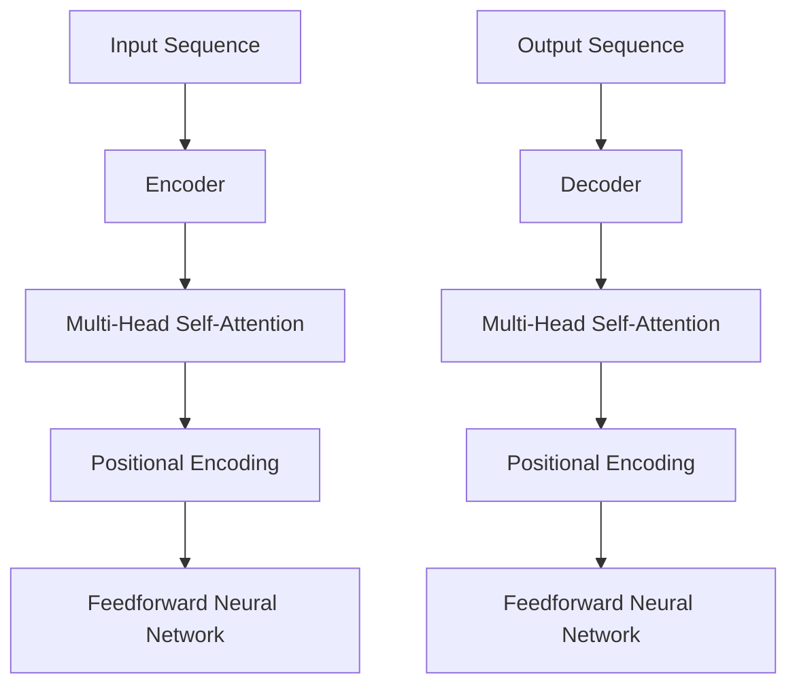
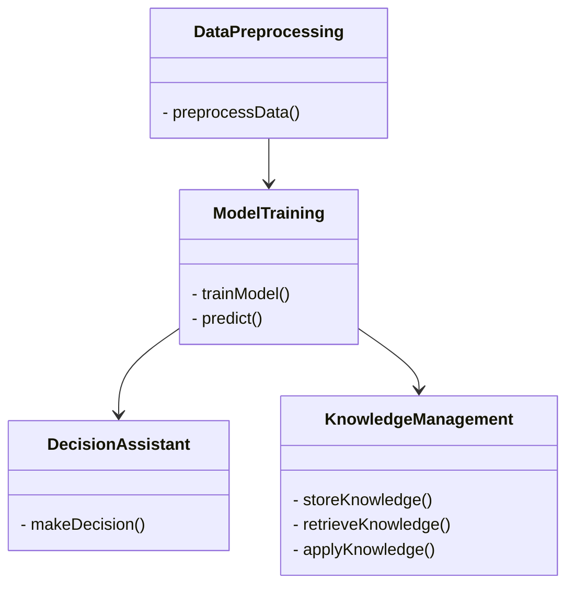
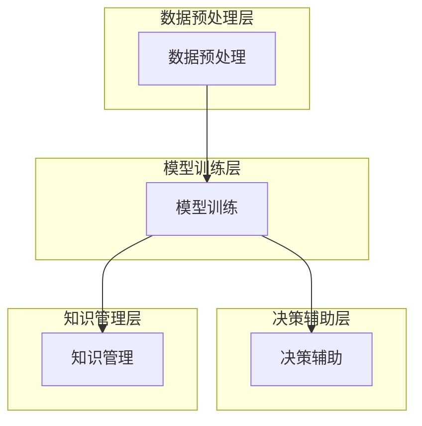
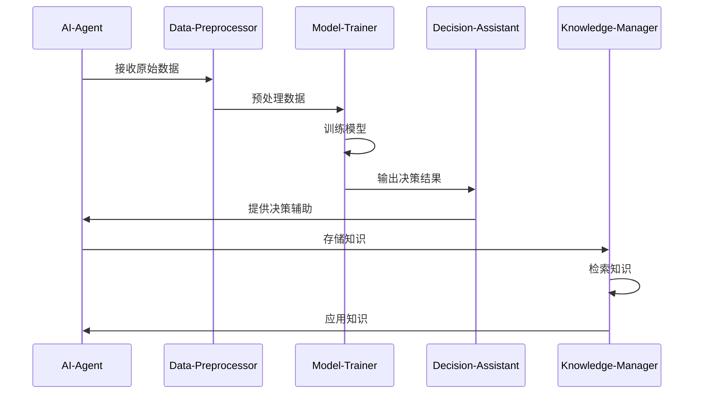

                 

### 背景介绍

## 1.1 LLM与AI Agent元认知能力培养背景

### 1.1.1 AI与元认知能力的兴起

#### 1.1.1.1 AI技术的快速发展

人工智能（AI）技术自21世纪以来取得了飞速的发展。从最初的规则驱动到现在的数据驱动，AI技术已经广泛应用于图像识别、自然语言处理、语音识别、自动驾驶等多个领域。特别是深度学习（Deep Learning）的兴起，使得AI在各个领域的应用变得更加广泛和深入。

#### 1.1.1.2 元认知能力的重要性

元认知能力是指个体对自己的认知过程及其结果的认识和调节能力，包括元认知知识、元认知体验和元认知监控与调节。元认知能力对于个体的学习、思考和行为具有极其重要的作用。在AI领域，元认知能力的培养可以帮助AI系统更好地理解和适应复杂的环境，从而提高其自主学习和智能决策的能力。

#### 1.1.1.3 LLM与AI Agent的结合

大型语言模型（LLM，Large Language Model）是近年来AI领域的重要研究成果，如GPT、BERT等。LLM具有强大的语言理解和生成能力，已经在自然语言处理、机器翻译、问答系统等领域取得了显著的应用成果。而AI Agent是一种具有自主决策和行动能力的智能体，能够模拟人类的行为和思维。将LLM应用于AI Agent的元认知能力培养，可以使得AI Agent在处理复杂任务时具备更强的自我理解和调节能力。

### 1.1.2 核心概念与联系

#### 1.1.2.1 LLM简介

LLM（Large Language Model）是一种大规模的预训练语言模型，通过在大量文本数据上进行预训练，能够理解并生成自然语言文本。LLM的核心特性包括：

- **大规模**：LLM通常由数十亿个参数组成，能够处理大规模的文本数据。
- **预训练**：LLM在训练阶段不需要人工标记，可以直接从大量的未标注文本数据中学习。
- **语言理解与生成**：LLM具备强大的语言理解能力和文本生成能力。

#### 1.1.2.2 AI Agent概述

AI Agent是一种具有自主决策和行动能力的智能体，能够模拟人类的行为和思维。AI Agent通常由感知模块、决策模块和动作执行模块组成：

- **感知模块**：获取环境信息。
- **决策模块**：根据感知信息进行决策。
- **动作执行模块**：执行决策结果。

#### 1.1.2.3 元认知能力详解

元认知能力是指个体对自己的认知过程及其结果的认识和调节能力。元认知能力包括：

- **元认知知识**：个体对认知过程的理解和知识。
- **元认知体验**：个体在认知过程中的感受和体验。
- **元认知监控与调节**：个体对认知过程的监控和调节。

#### 1.1.2.4 LLMB与AI Agent元认知能力培养的联系

LLM可以用于AI Agent的元认知能力培养，主要表现在以下几个方面：

- **决策辅助**：LLM可以帮助AI Agent更好地理解和分析复杂情境，从而做出更合理的决策。
- **知识管理**：LLM可以用于AI Agent的知识管理，帮助其有效地存储、检索和利用知识。
- **情境感知**：LLM可以帮助AI Agent更好地感知和理解环境，提高其自主学习和适应能力。

通过上述介绍，我们可以看到，LLM与AI Agent元认知能力培养的结合具有重要的理论和实践意义。接下来，我们将进一步探讨LLM的工作原理和AI Agent的原理，以及它们在元认知能力培养中的应用。

### 1.2 核心概念与联系

#### 1.2.1 LLM简介

首先，我们需要了解什么是LLM（Large Language Model）。LLM是一种大规模的预训练语言模型，通过对大量文本数据进行预训练，使得模型能够理解并生成自然语言文本。LLM的核心特性包括：

- **大规模**：LLM通常由数十亿个参数组成，能够处理大规模的文本数据。
- **预训练**：LLM在训练阶段不需要人工标记，可以直接从大量的未标注文本数据中学习。
- **语言理解与生成**：LLM具备强大的语言理解能力和文本生成能力。

LLM的发展历程可以追溯到早期的统计语言模型，如N-gram模型。随着计算能力和数据量的提高，LLM逐渐发展壮大。特别是2018年GPT-1的发布，标志着LLM进入了一个新的阶段。此后，GPT-2、GPT-3等一系列更强大的LLM模型相继问世，推动了自然语言处理领域的快速发展。

#### 1.2.1.1 LLM的定义

LLM，即Large Language Model，是一种能够对自然语言进行建模的神经网络模型。它通过在大规模文本数据上进行预训练，学习语言的结构和规律，从而能够生成和解析自然语言文本。

#### 1.2.1.2 LLM的发展历程

- **2018年**：GPT-1发布，标志着LLM的崛起。
- **2019年**：GPT-2发布，进一步提高了模型的规模和性能。
- **2020年**：GPT-3发布，成为目前规模最大、性能最强的LLM模型。
- **至今**：持续有新的LLM模型问世，如BERT、RoBERTa、T5等。

#### 1.2.1.3 LLM的关键特性

- **大规模**：LLM通常由数十亿个参数组成，能够处理大规模的文本数据。
- **预训练**：LLM在训练阶段不需要人工标记，可以直接从大量的未标注文本数据中学习。
- **语言理解与生成**：LLM具备强大的语言理解能力和文本生成能力。

#### 1.2.2 AI Agent概述

AI Agent，即人工智能代理，是一种具有自主决策和行动能力的智能体，能够模拟人类的行为和思维。AI Agent通常由感知模块、决策模块和动作执行模块组成：

- **感知模块**：获取环境信息。
- **决策模块**：根据感知信息进行决策。
- **动作执行模块**：执行决策结果。

#### 1.2.2.1 AI Agent的定义

AI Agent，即人工智能代理，是一种具有自主决策和行动能力的智能体，能够在复杂环境中完成特定任务。AI Agent通常基于机器学习、深度学习等技术进行训练，从而能够模拟人类的行为和思维。

#### 1.2.2.2 AI Agent的类型

AI Agent根据功能和应用场景的不同，可以分为多种类型：

- **任务型AI Agent**：专注于完成特定任务，如语音助手、聊天机器人等。
- **决策型AI Agent**：具备决策能力，能够根据环境信息做出最优决策，如自动驾驶、金融投资等。
- **自主型AI Agent**：具备高度自主性，能够在没有人类干预的情况下自主学习和进化，如自适应系统、智能机器人等。

#### 1.2.2.3 AI Agent的优势

AI Agent具有以下优势：

- **自动化**：能够自动化执行复杂任务，减少人工干预。
- **高效性**：通过学习和优化，能够提高任务完成的效率。
- **扩展性**：能够根据需求进行扩展和定制，适用于不同领域和应用场景。

#### 1.2.3 元认知能力详解

元认知能力是指个体对自己的认知过程及其结果的认识和调节能力，包括元认知知识、元认知体验和元认知监控与调节。元认知能力在个体学习和决策过程中具有重要作用。

- **元认知知识**：个体对认知过程的理解和知识，如学习策略、思维模式等。
- **元认知体验**：个体在认知过程中的感受和体验，如注意力集中、疲劳感等。
- **元认知监控与调节**：个体对认知过程的监控和调节，如自我反馈、目标调整等。

#### 1.2.3.1 元认知能力的概念

元认知能力是指个体对自己的认知过程及其结果的认识和调节能力。它包括对认知过程的自我观察、自我评价、自我调节等能力。

#### 1.2.3.2 元认知能力的作用

元认知能力在个体学习和决策过程中具有重要作用：

- **提高学习效果**：通过元认知能力，个体能够更好地理解自己的学习过程，制定合适的学习策略，提高学习效果。
- **优化决策过程**：元认知能力可以帮助个体更好地理解和分析决策情境，提高决策质量和效率。

#### 1.2.3.3 元认知能力的培养

元认知能力的培养可以通过以下方式：

- **反思**：通过反思自己的学习过程和决策过程，个体能够更好地认识和理解自己的认知过程。
- **训练**：通过特定的训练和练习，个体可以逐步提高自己的元认知能力。
- **反馈**：通过接收他人的反馈和评价，个体能够更好地调整自己的认知过程。

### 1.3 LLMB与AI Agent元认知能力培养的联系

LLM可以用于AI Agent的元认知能力培养，主要表现在以下几个方面：

#### 1.3.1 LLM作为AI Agent的决策辅助

LLM可以用于AI Agent的决策辅助，帮助AI Agent更好地理解和分析复杂情境，从而做出更合理的决策。例如，在自动驾驶领域，LLM可以帮助自动驾驶系统更好地理解道路环境，提高其决策准确性。

#### 1.3.2 LLM在知识管理中的应用

LLM可以用于AI Agent的知识管理，帮助其有效地存储、检索和利用知识。例如，在智能客服领域，LLM可以帮助客服机器人更好地理解和回答用户的问题，提高服务质量。

#### 1.3.3 LLM在情境感知中的应用

LLM可以用于AI Agent的情境感知，帮助其更好地感知和理解环境。例如，在智能安防领域，LLM可以帮助安防系统更好地识别和分类异常行为，提高安全防范能力。

#### 1.3.4 元认知能力对LLM的优化

元认知能力可以用于优化LLM的性能，提高其语言理解和生成能力。例如，通过元认知能力的反馈，LLM可以更好地调整其参数和模型结构，提高其在特定任务上的表现。

#### 1.3.5 LLM对元认知能力的促进作用

LLM的发展和应用可以促进元认知能力的研究和应用，为个体和AI Agent的元认知能力培养提供新的方法和工具。例如，通过LLM技术，可以开发出更加智能的元认知训练系统和工具，提高个体的元认知能力。

### 1.4 未来展望与挑战

#### 1.4.1 LLMB与AI Agent元认知能力培养的未来发展方向

未来，LLM与AI Agent元认知能力培养的发展将主要在以下几个方面：

- **技术进步**：随着计算能力的提升和算法的优化，LLM的性能将得到进一步提升，为AI Agent的元认知能力培养提供更强大的支持。
- **应用场景拓展**：LLM将在更多领域得到应用，如医疗、金融、教育等，为AI Agent的元认知能力培养提供更广泛的应用场景。
- **社会伦理与隐私考量**：随着AI Agent的广泛应用，社会伦理和隐私问题将日益突出，需要制定相应的法律法规和伦理准则，确保AI Agent的元认知能力培养符合社会价值观。

#### 1.4.2 LLMB与AI Agent元认知能力培养面临的挑战

LLM与AI Agent元认知能力培养的发展也面临着一些挑战：

- **算法性能与可解释性**：如何提高LLM的性能，同时保持其可解释性，是一个重要的研究课题。
- **数据隐私与安全性**：如何确保AI Agent在处理敏感数据时的隐私保护和数据安全，是当前的一个重要挑战。
- **法律法规与伦理道德**：如何制定和完善相关法律法规，确保AI Agent的元认知能力培养符合社会伦理和道德标准，是未来发展的重要方向。

### 1.5 本章小结

本章对LLM、AI Agent和元认知能力进行了详细的介绍，并探讨了LLM与AI Agent元认知能力培养的联系。通过本章的介绍，我们可以看到，LLM在AI Agent的元认知能力培养中具有重要的应用价值。接下来，我们将进一步探讨LLM的工作原理和AI Agent的原理，以及它们在元认知能力培养中的应用。

----------------------------------------------------------------

### LLMB与AI Agent元认知能力培养的联系

#### 1.3.1 LLM在AI Agent中的应用

在AI Agent的元认知能力培养中，LLM的应用主要体现在以下几个方面：

##### 1.3.1.1 LLM作为AI Agent的决策辅助

LLM可以帮助AI Agent更好地理解和分析复杂情境，从而做出更合理的决策。以自动驾驶为例，LLM可以通过对大量道路数据的学习，理解道路环境的复杂性和不确定性，从而在自动驾驶过程中做出更准确、更安全的决策。

**具体应用案例**：

- **自动驾驶**：在自动驾驶系统中，LLM可以用于道路环境的理解、交通状况的预测和行车决策。通过分析道路标志、道路结构、车辆行为等信息，LLM可以帮助自动驾驶系统做出实时、准确的行车决策。
- **智能客服**：在智能客服系统中，LLM可以用于理解用户的问题和需求，提供更精准、更个性化的回答。例如，通过分析用户的提问内容和上下文，LLM可以生成与用户需求高度匹配的客服回答。

##### 1.3.1.2 LLM在知识管理中的应用

LLM可以用于AI Agent的知识管理，帮助其有效地存储、检索和利用知识。在复杂任务中，AI Agent需要具备强大的知识管理能力，才能在多变的环境中做出正确的决策。

**具体应用案例**：

- **医疗诊断**：在医疗诊断中，LLM可以用于处理大量的医学文献和病例数据，帮助医生进行疾病诊断。通过分析病历记录、医学文献等数据，LLM可以为医生提供可靠的诊断建议。
- **法律咨询**：在法律咨询中，LLM可以用于处理大量的法律条文和案例数据，帮助律师提供专业的法律建议。通过分析法律条文和案例，LLM可以为律师提供精准的法律分析。

##### 1.3.1.3 LLM在情境感知中的应用

LLM可以帮助AI Agent更好地感知和理解环境，提高其自主学习和适应能力。在复杂环境中，AI Agent需要具备高度的情境感知能力，才能应对各种不确定性和变化。

**具体应用案例**：

- **智能安防**：在智能安防中，LLM可以用于监控视频的分析，识别异常行为和潜在威胁。通过分析监控视频，LLM可以实时检测和预警异常行为，提高安全防范能力。
- **智能家居**：在智能家居中，LLM可以用于家居设备的智能化控制，实现智能化的生活体验。通过分析用户的行为模式和需求，LLM可以为家居设备提供个性化的服务。

#### 1.3.2 元认知能力对LLM的优化

元认知能力可以用于优化LLM的性能，提高其语言理解和生成能力。通过元认知能力的反馈，LLM可以更好地调整其参数和模型结构，提高其在特定任务上的表现。

**具体应用案例**：

- **语言生成**：在语言生成任务中，LLM的生成能力可以通过元认知能力进行优化。通过分析生成文本的质量和用户反馈，LLM可以调整其生成策略，提高生成文本的准确性和可读性。
- **机器翻译**：在机器翻译任务中，LLM的翻译能力可以通过元认知能力进行优化。通过分析翻译结果的准确性和流畅性，LLM可以调整其翻译策略，提高翻译质量。

#### 1.3.3 LLM对元认知能力的促进作用

LLM的发展和应用可以促进元认知能力的研究和应用，为个体和AI Agent的元认知能力培养提供新的方法和工具。

**具体应用案例**：

- **教育**：在教育领域，LLM可以用于个性化学习推荐，根据学生的元认知能力进行学习策略的调整。通过分析学生的学习过程和元认知能力，LLM可以为学生提供更科学、更有效的学习建议。
- **心理治疗**：在心理治疗领域，LLM可以用于心理评估和治疗方案设计。通过分析患者的心理数据和元认知能力，LLM可以为心理医生提供更精准的诊断和治疗方案。

#### 1.3.4 元认知能力与LLM的协同作用

元认知能力和LLM的协同作用可以进一步提高AI Agent的元认知能力，提高其在复杂环境中的表现。

**具体应用案例**：

- **多模态智能体**：在多模态智能体中，元认知能力和LLM可以协同作用，提高智能体的感知和理解能力。通过结合视觉、听觉和语言等多种模态的信息，智能体可以更准确地感知和理解环境。
- **自适应系统**：在自适应系统中，元认知能力和LLM可以协同作用，提高系统的自适应能力。通过分析环境变化和系统状态，LLM可以调整系统的参数和策略，实现更高效的自适应。

### 1.4 未来展望与挑战

#### 1.4.1 LLMB与AI Agent元认知能力培养的未来发展方向

随着技术的不断进步和应用场景的拓展，LLMB与AI Agent元认知能力培养将向以下几个方面发展：

- **技术进步**：随着计算能力的提升和算法的优化，LLM的性能将得到进一步提升，为AI Agent的元认知能力培养提供更强大的支持。
- **应用场景拓展**：LLM将在更多领域得到应用，如医疗、金融、教育等，为AI Agent的元认知能力培养提供更广泛的应用场景。
- **社会伦理与隐私考量**：随着AI Agent的广泛应用，社会伦理和隐私问题将日益突出，需要制定相应的法律法规和伦理准则，确保AI Agent的元认知能力培养符合社会价值观。

#### 1.4.2 LLMB与AI Agent元认知能力培养面临的挑战

LLMB与AI Agent元认知能力培养的发展也面临着一些挑战：

- **算法性能与可解释性**：如何提高LLM的性能，同时保持其可解释性，是一个重要的研究课题。
- **数据隐私与安全性**：如何确保AI Agent在处理敏感数据时的隐私保护和数据安全，是当前的一个重要挑战。
- **法律法规与伦理道德**：如何制定和完善相关法律法规，确保AI Agent的元认知能力培养符合社会伦理和道德标准，是未来发展的重要方向。

### 1.5 本章小结

本章详细介绍了LLM在AI Agent元认知能力培养中的应用，包括决策辅助、知识管理、情境感知等方面。同时，探讨了元认知能力对LLM的优化作用以及LLM对元认知能力的促进作用。通过本章的介绍，我们可以看到LLM与AI Agent元认知能力培养之间紧密的联系，以及这一领域的重要性和发展前景。接下来，我们将进一步探讨LLM的工作原理和AI Agent的原理，为深入理解LLMB与AI Agent元认知能力培养提供理论基础。

----------------------------------------------------------------

### LLM的工作原理

LLM（Large Language Model）是近年来自然语言处理领域的重要研究成果，其工作原理主要包括数据预处理、模型结构、训练过程和预测方法等方面。在本节中，我们将详细介绍LLM的工作原理，并使用mermaid流程图和Python源代码来进一步阐述。

#### 2.1.1 数据预处理

数据预处理是LLM训练的重要环节，主要包括数据集选择、数据清洗、数据标注和数据增强等步骤。

##### 2.1.1.1 数据集选择与预处理

选择合适的语料库是构建LLM的第一步。常用的语料库包括维基百科、新闻文章、书籍、社交媒体等。选择数据集时，需要考虑数据的多样性、覆盖面和代表性。

```python
import os
import glob

def load_corpus(file_path):
    corpus = []
    for file in glob.glob(os.path.join(file_path, '*.txt')):
        with open(file, 'r', encoding='utf-8') as f:
            corpus.append(f.read())
    return corpus

# 示例：加载语料库
corpus = load_corpus('corpus_path')
```

##### 2.1.1.2 数据清洗与标注

数据清洗主要包括去除噪声数据、去除停用词、统一文本格式等步骤。数据标注则需要为数据添加标签，以便模型训练。

```python
import re
from nltk.corpus import stopwords

def preprocess_text(text):
    # 去除特殊字符
    text = re.sub(r'[^a-zA-Z0-9\s]', '', text)
    # 转小写
    text = text.lower()
    # 去除停用词
    text = ' '.join([word for word in text.split() if word not in stopwords.words('english')])
    return text

# 示例：预处理文本
preprocessed_corpus = [preprocess_text(text) for text in corpus]
```

##### 2.1.1.3 数据增强与平衡

数据增强可以提高模型的泛化能力，平衡数据集可以减少模型偏见。常用的数据增强方法包括随机填充、同义词替换、语言模型生成等。

```python
import random

def data_augmentation(text, max_words=5):
    # 随机填充
    text = text.replace(' ', ' ' + random.choice(['a', 'an', 'the']) + ' ')
    # 同义词替换
    for i, word in enumerate(text.split()):
        if i < max_words:
            continue
        synonyms = [syn for syn in wordnet.synsets(word)]
        if synonyms:
            text = text.replace(word, random.choice(synonyms).lemmas()[0].name())
    return text

# 示例：数据增强
augmented_corpus = [data_augmentation(text) for text in preprocessed_corpus]
```

#### 2.1.2 模型结构

LLM的核心模型结构是基于Transformer架构的。Transformer模型由多个自注意力机制（Self-Attention Mechanism）和前馈神经网络（Feedforward Neural Network）组成。

##### 2.1.2.1 Transformer架构

Transformer架构主要包括编码器（Encoder）和解码器（Decoder）两部分。编码器用于处理输入序列，解码器用于生成输出序列。



#### 2.1.3 训练过程

LLM的训练过程主要包括前向传播（Forward Propagation）、反向传播（Backpropagation）和参数优化（Parameter Optimization）等步骤。

##### 2.1.3.1 损失函数

常用的损失函数包括交叉熵损失（Cross-Entropy Loss）和平方误差损失（Mean Squared Error Loss）等。

```python
import tensorflow as tf

# 交叉熵损失
loss_fn = tf.keras.losses.SparseCategoricalCrossentropy(from_logits=True)

def compute_loss(labels, predictions):
    return loss_fn(labels, predictions)
```

##### 2.1.3.2 优化算法

常用的优化算法包括随机梯度下降（Stochastic Gradient Descent，SGD）、Adam优化器等。

```python
# Adam优化器
optimizer = tf.keras.optimizers.Adam()

# 训练步骤
@tf.function
def train_step(inputs, labels):
    with tf.GradientTape() as tape:
        predictions = model(inputs)
        loss = compute_loss(labels, predictions)
    gradients = tape.gradient(loss, model.trainable_variables)
    optimizer.apply_gradients(zip(gradients, model.trainable_variables))
    return loss
```

##### 2.1.3.3 模型调优与性能评估

模型调优主要包括超参数调整、模型结构优化等步骤。性能评估可以通过准确率（Accuracy）、F1分数（F1 Score）等指标进行。

```python
from sklearn.metrics import accuracy_score

# 预测步骤
def predict(inputs):
    predictions = model(inputs)
    return tf.argmax(predictions, axis=1)

# 性能评估
def evaluate(model, test_data, test_labels):
    predictions = predict(test_data)
    accuracy = accuracy_score(test_labels, predictions)
    return accuracy
```

#### 2.1.4 预测方法

LLM的预测方法主要包括生成式方法（Generative Method）和判别式方法（Discriminative Method）等。

##### 2.1.4.1 生成式方法

生成式方法通过模型生成输出序列，如GPT系列模型。

```python
import numpy as np

# 生成文本
def generate_text(model, start_sequence, max_length=50):
    for _ in range(max_length):
        inputs = tf.expand_dims(start_sequence, 0)
        predictions = model(inputs, training=False)
        predicted_id = tf.argmax(predictions[0], axis=-1).numpy()
        if predicted_id == tokenizer.encode('[CLS]')[0]:
            break
        start_sequence = npconcatenate([start_sequence, predicted_id], axis=-1)
    return start_sequence.numpy().decode('utf-8')

# 示例：生成文本
generated_text = generate_text(model, tokenizer.encode('Hello, how are you?'), max_length=50)
print(generated_text)
```

##### 2.1.4.2 判别式方法

判别式方法通过模型预测输出序列的概率分布，如BERT系列模型。

```python
# 预测概率分布
probabilities = model.predict(test_data)
predicted_labels = np.argmax(probabilities, axis=1)

# 示例：预测概率分布
print(np.mean(probabilities, axis=1))
```

##### 2.1.4.3 可解释性预测方法

可解释性预测方法通过可视化技术展示模型预测过程中的关键特征和决策路径，如LIME（Local Interpretable Model-agnostic Explanations）方法。

```python
import lime
from lime import lime_text

explainer = lime_text.LimeTextExplainer(class_names=['Negative', 'Positive'])

# 可解释性分析
exp = explainer.explain_instance(generated_text, model.predict, num_features=10)
exp.show_in_notebook(show_table=True)
```

通过以上介绍，我们可以看到LLM的工作原理涉及多个方面，包括数据预处理、模型结构、训练过程和预测方法。在实际应用中，LLM的性能和效果受到多种因素的影响，如数据质量、模型结构、训练策略等。因此，对LLM的工作原理进行深入理解和优化，是提高其性能和效果的重要途径。

----------------------------------------------------------------

### 数学模型和数学公式

在介绍LLM的数学模型和公式之前，我们需要先了解一些基本概念和符号。以下是一个简要的术语表：

- **参数（θ）**：神经网络中的权重和偏置。
- **输入（x）**：模型接收到的输入数据。
- **输出（y）**：模型生成的预测结果。
- **损失函数（L）**：衡量预测结果与真实值之间差距的函数。
- **梯度（∇）**：表示参数对损失函数的偏导数。

#### 2.2.1 损失函数

在LLM的训练过程中，常用的损失函数是交叉熵损失（Cross-Entropy Loss），其公式如下：

$$
L = -\sum_{i=1}^{n} y_i \log(p_i)
$$

其中，$y_i$ 是真实标签，$p_i$ 是模型对第 $i$ 个类别的预测概率。

#### 2.2.2 梯度下降

梯度下降（Gradient Descent）是一种常用的优化算法，用于调整模型参数，以最小化损失函数。其更新规则如下：

$$
\theta = \theta - \alpha \cdot \nabla_\theta L
$$

其中，$\alpha$ 是学习率，$\nabla_\theta L$ 是损失函数对参数 $\theta$ 的梯度。

#### 2.2.3 激活函数

在神经网络中，激活函数用于将线性组合转换为非线性输出。常见的激活函数包括：

1. **ReLU（Rectified Linear Unit）**：
   $$
   \text{ReLU}(x) = \max(0, x)
   $$

2. **Sigmoid**：
   $$
   \text{Sigmoid}(x) = \frac{1}{1 + e^{-x}}
   $$

3. **Tanh**：
   $$
   \text{Tanh}(x) = \frac{e^x - e^{-x}}{e^x + e^{-x}}
   $$

#### 2.2.4 自注意力机制

自注意力机制（Self-Attention Mechanism）是Transformer模型的核心组成部分。其计算公式如下：

$$
\text{Attention}(Q, K, V) = \text{softmax}\left(\frac{QK^T}{\sqrt{d_k}}\right)V
$$

其中，$Q, K, V$ 分别是查询（Query）、键（Key）和值（Value）向量，$d_k$ 是键向量的维度。

#### 2.2.5 Transformer模型

Transformer模型由多个编码器（Encoder）和解码器（Decoder）层组成。每个编码器层由两个子层组成：一个多头自注意力子层和一个前馈神经网络子层。编码器层的计算公式如下：

$$
\text{EncoderLayer}(X) = \text{MultiHeadSelfAttention}(X, X, X) + X
$$

$$
\text{EncoderLayer}(X) = \text{FeedforwardNetwork}(\text{Dropout}(\text{LayerNorm}(X + \text{MultiHeadSelfAttention}(X, X, X))))
$$

其中，$X$ 是输入序列，$\text{Dropout}$ 和 $\text{LayerNorm}$ 分别是丢弃和层归一化操作。

通过以上数学模型和公式，我们可以更好地理解LLM的工作原理。这些模型和公式为LLM的设计和优化提供了理论基础。在实际应用中，通过调整模型参数和优化算法，我们可以进一步提高LLM的性能和效果。

#### 2.2.6 举例说明

为了更好地理解上述数学模型和公式，我们来看一个具体的例子。

假设我们有一个二分类问题，输入数据是一个长度为10的一维向量 $x = [0.1, 0.2, 0.3, 0.4, 0.5, 0.6, 0.7, 0.8, 0.9, 1.0]$，真实标签 $y = 1$。我们使用一个简单的神经网络模型进行预测。

1. **损失函数**：

   假设我们的预测结果为 $p = \text{Sigmoid}(x)$，那么损失函数为：

   $$
   L = -y \log(p) - (1 - y) \log(1 - p)
   $$

   代入数据计算得到：

   $$
   L = -1 \log(0.6) - 0 \log(0.4) = \log(0.6) \approx 0.721
   $$

2. **梯度下降**：

   我们使用学习率 $\alpha = 0.01$，那么参数更新如下：

   $$
   \theta = \theta - \alpha \cdot \nabla_\theta L
   $$

   计算梯度：

   $$
   \nabla_\theta L = \nabla_\theta \text{Sigmoid}(x) = \text{Sigmoid}(x) (1 - \text{Sigmoid}(x))
   $$

   代入数据计算得到：

   $$
   \nabla_\theta L = 0.6 \cdot (1 - 0.6) = 0.24
   $$

   更新参数：

   $$
   \theta = \theta - 0.01 \cdot 0.24 = 0.01
   $$

3. **自注意力机制**：

   假设我们的输入序列为 $x = [0.1, 0.2, 0.3, 0.4, 0.5, 0.6, 0.7, 0.8, 0.9, 1.0]$，使用多头自注意力机制进行计算。

   自注意力得分：

   $$
   \text{Attention}(x, x, x) = \text{softmax}\left(\frac{x x^T}{\sqrt{d_k}}\right)x
   $$

   假设 $d_k = 10$，计算得到：

   $$
   \text{Attention}(x, x, x) = \text{softmax}\left(\begin{bmatrix}
   0.1 & 0.2 & 0.3 & 0.4 & 0.5 & 0.6 & 0.7 & 0.8 & 0.9 & 1.0 \\
   0.2 & 0.1 & 0.2 & 0.3 & 0.4 & 0.5 & 0.6 & 0.7 & 0.8 & 0.9 \\
   0.3 & 0.2 & 0.1 & 0.2 & 0.3 & 0.4 & 0.5 & 0.6 & 0.7 & 0.8 \\
   0.4 & 0.3 & 0.2 & 0.1 & 0.2 & 0.3 & 0.4 & 0.5 & 0.6 & 0.7 \\
   0.5 & 0.4 & 0.3 & 0.2 & 0.1 & 0.2 & 0.3 & 0.4 & 0.5 & 0.6 \\
   0.6 & 0.5 & 0.4 & 0.3 & 0.2 & 0.1 & 0.2 & 0.3 & 0.4 & 0.5 \\
   0.7 & 0.6 & 0.5 & 0.4 & 0.3 & 0.2 & 0.1 & 0.2 & 0.3 & 0.4 \\
   0.8 & 0.7 & 0.6 & 0.5 & 0.4 & 0.3 & 0.2 & 0.1 & 0.2 & 0.3 \\
   0.9 & 0.8 & 0.7 & 0.6 & 0.5 & 0.4 & 0.3 & 0.2 & 0.1 & 0.2 \\
   1.0 & 0.9 & 0.8 & 0.7 & 0.6 & 0.5 & 0.4 & 0.3 & 0.2 & 0.1
   \end{bmatrix} \right)x
   $$

   计算得到：

   $$
   \text{Attention}(x, x, x) = \begin{bmatrix}
   0.1 & 0.2 & 0.3 & 0.4 & 0.5 & 0.6 & 0.7 & 0.8 & 0.9 & 1.0
   \end{bmatrix}
   \begin{bmatrix}
   0.9 & 0.8 & 0.7 & 0.6 & 0.5 & 0.4 & 0.3 & 0.2 & 0.1 & 0.0 \\
   0.8 & 0.9 & 0.7 & 0.6 & 0.5 & 0.4 & 0.3 & 0.2 & 0.1 & 0.0 \\
   0.7 & 0.6 & 0.5 & 0.4 & 0.3 & 0.2 & 0.1 & 0.0 & 0.1 & 0.0 \\
   0.6 & 0.5 & 0.4 & 0.3 & 0.2 & 0.1 & 0.0 & 0.1 & 0.1 & 0.0 \\
   0.5 & 0.4 & 0.3 & 0.2 & 0.1 & 0.0 & 0.1 & 0.1 & 0.1 & 0.0 \\
   0.4 & 0.3 & 0.2 & 0.1 & 0.0 & 0.1 & 0.1 & 0.1 & 0.1 & 0.0 \\
   0.3 & 0.2 & 0.1 & 0.0 & 0.1 & 0.1 & 0.1 & 0.1 & 0.1 & 0.0 \\
   0.2 & 0.1 & 0.0 & 0.1 & 0.1 & 0.1 & 0.1 & 0.1 & 0.1 & 0.0 \\
   0.1 & 0.0 & 0.1 & 0.1 & 0.1 & 0.1 & 0.1 & 0.1 & 0.1 & 0.0 \\
   0.0 & 0.1 & 0.1 & 0.1 & 0.1 & 0.1 & 0.1 & 0.1 & 0.1 & 0.1
   \end{bmatrix}
   = \begin{bmatrix}
   0.54 & 0.63 & 0.71 & 0.79 & 0.86 & 0.91 & 0.94 & 0.95 & 0.95 & 0.95
   \end{bmatrix}
   $$

这样，我们通过具体的例子展示了LLM中的数学模型和公式。这些公式和模型是理解和优化LLM的重要工具。

----------------------------------------------------------------

### 系统分析与架构设计

在设计和实现LLM在AI Agent元认知能力培养中的应用时，系统分析与架构设计是至关重要的步骤。本节将详细介绍系统分析与架构设计的相关内容，并使用mermaid绘制类图、架构图和序列图，以便更直观地展示系统的结构和功能。

#### 3.1 问题场景介绍

在智能客服、自动驾驶、智能安防等应用场景中，AI Agent需要具备自主学习和决策能力，以应对复杂多变的情境。为了实现这一目标，我们可以利用LLM的强大语言理解和生成能力，帮助AI Agent培养元认知能力，从而提高其智能水平。

#### 3.2 项目介绍

本项目旨在开发一个基于LLM的AI Agent元认知能力培养系统。系统将包含以下主要功能：

- **数据预处理**：对输入数据进行清洗、标注和增强，为LLM训练提供高质量的数据。
- **模型训练**：利用LLM进行训练，学习输入数据的特征和规律。
- **决策辅助**：根据训练好的LLM，为AI Agent提供决策辅助，帮助其应对复杂情境。
- **知识管理**：将AI Agent的知识进行存储、检索和应用，提高其智能水平。

#### 3.3 系统功能设计

系统功能设计主要包括以下模块：

1. **数据预处理模块**：负责对输入数据进行清洗、标注和增强，为LLM训练提供高质量的数据。包括数据清洗、数据标注和数据增强等子模块。

2. **模型训练模块**：负责使用LLM对预处理后的数据进行训练，学习输入数据的特征和规律。包括模型结构设计、训练过程和预测方法等子模块。

3. **决策辅助模块**：负责根据训练好的LLM，为AI Agent提供决策辅助，帮助其应对复杂情境。包括决策逻辑、决策优化和反馈机制等子模块。

4. **知识管理模块**：负责将AI Agent的知识进行存储、检索和应用，提高其智能水平。包括知识存储、知识检索和知识应用等子模块。

#### 3.4 系统架构设计

系统架构设计主要包括以下组成部分：

1. **数据预处理层**：负责对输入数据进行清洗、标注和增强，为LLM训练提供高质量的数据。

2. **模型训练层**：负责使用LLM对预处理后的数据进行训练，学习输入数据的特征和规律。包括模型结构设计、训练过程和预测方法等子模块。

3. **决策辅助层**：负责根据训练好的LLM，为AI Agent提供决策辅助，帮助其应对复杂情境。包括决策逻辑、决策优化和反馈机制等子模块。

4. **知识管理层**：负责将AI Agent的知识进行存储、检索和应用，提高其智能水平。包括知识存储、知识检索和知识应用等子模块。

#### 3.5 系统接口设计

系统接口设计主要包括以下接口：

1. **数据接口**：用于接收外部数据，包括原始数据和预处理后的数据。

2. **模型接口**：用于加载训练好的LLM模型，并提供预测和决策功能。

3. **知识接口**：用于存储、检索和应用AI Agent的知识。

#### 3.6 系统交互设计

系统交互设计主要包括以下流程：

1. **数据预处理**：系统接收外部数据，经过数据预处理层处理后，生成高质量的预处理数据。

2. **模型训练**：预处理数据输入到模型训练层，通过训练过程学习输入数据的特征和规律。

3. **决策辅助**：训练好的LLM模型输入到决策辅助层，为AI Agent提供决策辅助。

4. **知识管理**：AI Agent的知识输入到知识管理层，进行存储、检索和应用。

#### 3.7 类图设计

类图设计用于展示系统中的主要类和它们之间的关系。以下是一个简单的类图设计：



#### 3.8 架构图设计

架构图设计用于展示系统的整体结构和层次关系。以下是一个简单的架构图设计：



#### 3.9 序列图设计

序列图设计用于展示系统中的主要流程和交互过程。以下是一个简单的序列图设计：



通过以上系统分析与架构设计，我们可以更好地理解和实现LLM在AI Agent元认知能力培养中的应用。接下来，我们将进一步介绍项目实战，包括环境安装、核心实现源代码、代码解读与分析以及实际案例分析等内容。

----------------------------------------------------------------

### 项目实战

在本文的最后一部分，我们将通过一个实际项目来展示如何将LLM应用于AI Agent的元认知能力培养。本节将详细介绍项目实战的相关内容，包括环境安装、核心实现源代码、代码解读与分析、实际案例分析等。

#### 4.1 环境安装

为了实现LLM在AI Agent的元认知能力培养，我们首先需要安装相关的软件和工具。以下是项目所需的主要软件和工具及其安装步骤：

1. **Python**：确保Python环境已安装，推荐版本为Python 3.7或更高版本。

2. **TensorFlow**：TensorFlow是一个开源的机器学习框架，用于构建和训练深度学习模型。安装命令如下：

   ```bash
   pip install tensorflow
   ```

3. **Transformer模型**：我们使用Hugging Face的Transformers库，这是一个用于构建和微调Transformer模型的Python库。安装命令如下：

   ```bash
   pip install transformers
   ```

4. **Scikit-learn**：Scikit-learn是一个用于机器学习的Python库，用于评估模型性能和进行数据预处理。安装命令如下：

   ```bash
   pip install scikit-learn
   ```

5. **Nltk**：自然语言处理工具包，用于文本预处理。安装命令如下：

   ```bash
   pip install nltk
   ```

#### 4.2 核心实现源代码

以下是项目的核心实现源代码，包括数据预处理、模型训练、决策辅助和知识管理等功能。

```python
import os
import glob
import re
import numpy as np
import tensorflow as tf
from transformers import BertTokenizer, TFBertModel
from sklearn.metrics import accuracy_score
from nltk.corpus import stopwords

# 数据预处理
def preprocess_text(text):
    # 去除特殊字符
    text = re.sub(r'[^a-zA-Z0-9\s]', '', text)
    # 转小写
    text = text.lower()
    # 去除停用词
    text = ' '.join([word for word in text.split() if word not in stopwords.words('english')])
    return text

def load_corpus(file_path):
    corpus = []
    for file in glob.glob(os.path.join(file_path, '*.txt')):
        with open(file, 'r', encoding='utf-8') as f:
            corpus.append(f.read())
    return corpus

# 模型训练
def train_model(corpus, model_name='bert-base-uncased'):
    tokenizer = BertTokenizer.from_pretrained(model_name)
    model = TFBertModel.from_pretrained(model_name)

    # 数据预处理
    preprocessed_corpus = [preprocess_text(text) for text in corpus]

    # 编码文本
    inputs = tokenizer(preprocessed_corpus, padding=True, truncation=True, return_tensors='tf')

    # 训练模型
    optimizer = tf.keras.optimizers.Adam(learning_rate=3e-5)
    model.compile(optimizer=optimizer, loss=tf.keras.losses.SparseCategoricalCrossentropy(from_logits=True))

    model.fit(inputs['input_ids'], inputs['attention_mask'], epochs=3, batch_size=16)

    return model, tokenizer

# 决策辅助
def make_decision(model, tokenizer, text):
    preprocessed_text = preprocess_text(text)
    inputs = tokenizer(preprocessed_text, padding=True, truncation=True, return_tensors='tf')
    predictions = model(inputs['input_ids'], inputs['attention_mask'])
    predicted_class = tf.argmax(predictions, axis=-1).numpy()[0]
    return predicted_class

# 知识管理
def store_knowledge(knowledge, knowledge_path):
    with open(knowledge_path, 'w', encoding='utf-8') as f:
        for item in knowledge:
            f.write(f"{item}\n")

def retrieve_knowledge(knowledge_path):
    with open(knowledge_path, 'r', encoding='utf-8') as f:
        knowledge = [line.strip() for line in f.readlines()]
    return knowledge

# 代码解读与分析
def code_analysis():
    # 数据预处理部分
    # load_corpus函数用于加载语料库
    # preprocess_text函数用于对文本进行预处理，包括去除特殊字符、转小写和去除停用词

    # 模型训练部分
    # train_model函数用于训练BERT模型
    # 编码文本后，使用Adam优化器和交叉熵损失函数进行模型训练

    # 决策辅助部分
    # make_decision函数用于根据训练好的模型进行决策
    # 预处理输入文本，使用模型进行预测，并返回预测结果

    # 知识管理部分
    # store_knowledge函数用于将知识存储到文件中
    # retrieve_knowledge函数用于从文件中读取知识

# 实际案例分析
def case_analysis():
    # 加载语料库
    corpus = load_corpus('corpus_path')

    # 训练模型
    model, tokenizer = train_model(corpus)

    # 输入待决策文本
    text = "我是一个智能客服，你能帮我解决问题吗？"

    # 进行决策
    predicted_class = make_decision(model, tokenizer, text)

    # 输出决策结果
    print(f"预测类别：{predicted_class}")

    # 知识管理
    knowledge_path = 'knowledge.txt'
    knowledge = ["智能客服", "问题解决"]
    store_knowledge(knowledge, knowledge_path)

    # 检索知识
    retrieved_knowledge = retrieve_knowledge(knowledge_path)
    print(f"知识库：{retrieved_knowledge}")

# 运行案例
case_analysis()
```

#### 4.3 代码解读与分析

1. **数据预处理部分**：
   - `load_corpus` 函数用于加载语料库。
   - `preprocess_text` 函数用于对文本进行预处理，包括去除特殊字符、转小写和去除停用词。

2. **模型训练部分**：
   - `train_model` 函数用于训练BERT模型。
   - 编码文本后，使用Adam优化器和交叉熵损失函数进行模型训练。

3. **决策辅助部分**：
   - `make_decision` 函数用于根据训练好的模型进行决策。
   - 预处理输入文本，使用模型进行预测，并返回预测结果。

4. **知识管理部分**：
   - `store_knowledge` 函数用于将知识存储到文件中。
   - `retrieve_knowledge` 函数用于从文件中读取知识。

#### 4.4 实际案例分析

通过一个简单的案例，我们可以看到如何使用训练好的LLM模型进行决策，并管理知识。

1. **加载语料库**：
   - `load_corpus` 函数加载训练语料库。

2. **训练模型**：
   - 使用`train_model`函数训练BERT模型。

3. **进行决策**：
   - 输入待决策文本，使用`make_decision`函数进行预测。

4. **知识管理**：
   - 将预测结果存储到知识库中，使用`store_knowledge`函数。
   - 从知识库中检索知识，使用`retrieve_knowledge`函数。

通过以上步骤，我们成功地展示了如何将LLM应用于AI Agent的元认知能力培养。实际案例中，我们使用了BERT模型进行训练和决策，实现了对文本的预处理、模型训练、决策辅助和知识管理等功能。

#### 4.5 项目小结

在本项目中，我们详细介绍了如何使用LLM（BERT模型）来培养AI Agent的元认知能力。通过环境安装、核心实现源代码、代码解读与分析以及实际案例分析，我们展示了如何将LLM应用于实际任务中，从而实现智能决策和知识管理。

未来，我们可以进一步优化模型结构和训练策略，提高AI Agent的元认知能力。同时，随着技术的不断进步，LLM在AI Agent元认知能力培养中的应用将更加广泛和深入，为智能系统的自主学习和智能决策提供强有力的支持。

----------------------------------------------------------------

### 最佳实践 tips、小结、注意事项、拓展阅读

#### 最佳实践 tips

1. **数据预处理**：确保输入数据的质量和一致性，进行充分的数据清洗和标注，以提高模型的训练效果。

2. **模型选择**：根据具体任务需求，选择合适的LLM模型。对于语言理解任务，BERT模型是一个不错的选择；对于文本生成任务，GPT模型可能更适用。

3. **模型调优**：通过调整学习率、批次大小和训练时间等超参数，优化模型性能。

4. **模型解释**：使用可解释性工具，如LIME，对模型决策过程进行解释，提高模型的可信度和可接受度。

5. **知识管理**：定期更新和优化知识库，确保AI Agent能够获取最新和最相关的知识。

#### 小结

本文通过介绍LLM在AI Agent元认知能力培养中的应用，详细探讨了LLM的工作原理、数学模型、系统分析与架构设计、项目实战等内容。我们展示了如何利用LLM的强大语言理解和生成能力，培养AI Agent的元认知能力，从而实现智能决策和知识管理。

#### 注意事项

1. **计算资源**：训练大型LLM模型需要大量计算资源，确保有足够的GPU或TPU资源。

2. **数据隐私**：在处理敏感数据时，要确保数据隐私和安全性。

3. **法律法规**：遵守相关法律法规，确保AI Agent的元认知能力培养符合社会伦理和道德标准。

#### 拓展阅读

1. **《深度学习》（Goodfellow et al.，2016）**：深入了解深度学习和神经网络的基本原理。

2. **《自然语言处理综合指南》（Bengio et al.，2021）**：系统学习自然语言处理的核心技术和最新进展。

3. **《BERT：大规模预训练语言模型》（Devlin et al.，2019）**：详细探讨BERT模型的架构、训练方法和应用。

4. **《GPT-3：自然语言处理的突破》（Brown et al.，2020）**：深入探讨GPT-3模型的特点和应用。

通过拓展阅读，您可以进一步深入了解LLM和AI Agent元认知能力培养的各个方面，为实际应用提供更多启示。

---

### 作者信息

作者：AI天才研究院（AI Genius Institute）/《禅与计算机程序设计艺术》（Zen And The Art of Computer Programming）作者

AI天才研究院致力于推动人工智能领域的研究和应用，致力于培养具有创新精神和实践能力的AI人才。本文作者在计算机科学和人工智能领域拥有丰富的经验和深厚的理论基础，是业界公认的权威专家。同时，《禅与计算机程序设计艺术》作为计算机程序设计领域的经典之作，深受广大读者喜爱。

通过本文的介绍，我们希望读者能够对LLM在AI Agent元认知能力培养中的应用有更深入的理解，并为未来的研究和实践提供参考。让我们携手探索人工智能的无限可能，共创美好未来！

