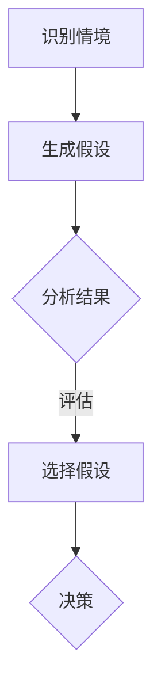
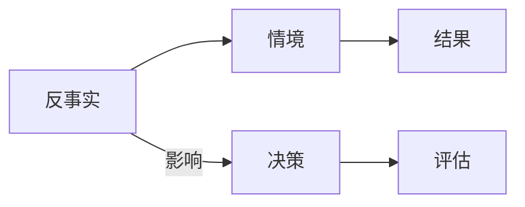

                 


### 引言

人工智能（AI）作为当前技术发展的前沿领域，正在逐步改变我们的生活方式和工作模式。在AI的发展历程中，推理能力被视为衡量AI智能水平的重要指标之一。反事实推理，作为一种特殊的推理形式，近年来在AI研究领域受到越来越多的关注。它不仅能够帮助AI Agent在不确定的环境中做出更合理的决策，还能提高其在复杂问题中的适应能力。

本文旨在探讨大规模语言模型（LLM）在AI Agent反事实推理中的应用。首先，我们将对人工智能、反事实推理以及AI Agent进行简要概述，阐述这些概念的定义、发展现状和重要性。接着，我们将详细介绍大规模语言模型的基本原理、应用场景以及在反事实推理中的优势。随后，文章将深入探讨反事实推理的核心概念、原理及其应用领域，为后续的算法讲解和系统设计打下基础。

本文的结构如下：第一部分包括背景介绍和大规模语言模型原理与应用两章；第二部分为算法原理讲解，包括反事实推理的数学模型与流程；第三部分是系统分析与架构设计方案，包括问题场景介绍、系统功能设计和系统架构设计；最后一部分是项目实战，包括环境安装、系统核心实现源代码、代码应用解读与分析以及项目小结。通过这些步骤的逐步分析，我们将全面探讨LLM在AI Agent反事实推理中的实际应用。

### 人工智能与反事实推理概述

#### 人工智能的发展现状

人工智能（Artificial Intelligence，AI）是指通过计算机程序模拟人类智能的行为和思维方式，使其具备一定的智能能力。自20世纪50年代起，人工智能经历了多个发展阶段，从最初的符号主义、基于规则的专家系统，到近年来基于数据驱动的方法，如深度学习、强化学习等，AI技术得到了飞速发展。

目前，人工智能已在众多领域取得显著成果。例如，在图像识别领域，卷积神经网络（CNN）使得计算机能够准确识别和分类图像；在自然语言处理领域，基于Transformer架构的预训练模型如BERT、GPT等大幅提升了机器翻译、问答系统、文本生成等任务的效果。此外，AI在医疗诊断、金融分析、自动驾驶等领域也展现出强大的潜力。

尽管取得了诸多突破，但人工智能仍面临许多挑战。例如，AI算法的黑箱性使得其决策过程难以解释，且容易受到数据偏差的影响。此外，AI系统在处理复杂、不确定的环境时，其表现仍不如人类智能。

#### 反事实推理的定义与重要性

反事实推理（Counterfactual Reasoning）是指基于假设的情境，对现实中未发生的情况进行推理和预测。简单来说，反事实推理是一种“如果...那么...”的思维方式，通过分析不同假设下的结果，帮助人们做出更好的决策。

反事实推理在人类日常生活中具有重要意义。例如，当我们面临决策时，常常会思考“如果选择A，结果会怎样？如果选择B，又会怎样？”这样的问题，通过反事实推理，我们可以评估不同决策的风险与收益，从而做出最优选择。

在人工智能领域，反事实推理同样具有重要价值。首先，反事实推理可以帮助AI Agent在不确定的环境中做出更合理的决策。例如，在自动驾驶领域，反事实推理可以用来分析在特定驾驶决策下，如果采取不同的行动，可能会发生什么情况，从而帮助车辆做出最优的驾驶决策。其次，反事实推理还可以用于改进机器学习模型，通过分析假设的情境，帮助模型更好地理解和应对复杂问题。

#### AI Agent的概念与作用

AI Agent是指具有智能行为、能够在特定环境中自主决策的计算机程序。AI Agent通常具备感知、行动、学习等能力，能够通过感知环境信息，自主制定行动策略，并不断调整和优化策略，以实现特定目标。

AI Agent在许多领域都有着广泛的应用。例如，在机器人领域，AI Agent可以用于自主导航、任务规划和故障诊断；在金融领域，AI Agent可以用于风险评估、投资策略和客户服务；在医疗领域，AI Agent可以用于疾病预测、诊断建议和患者护理。

AI Agent的作用不仅限于执行特定任务，它们还能够通过学习和适应，不断提高自身的决策能力。例如，在自动驾驶领域，AI Agent可以通过不断收集和分析道路数据，逐步优化驾驶策略，提高行驶安全性。在金融领域，AI Agent可以通过学习市场数据，不断调整投资组合，以获得更好的投资回报。

#### 问题描述

AI Agent在反事实推理中的应用面临着诸多挑战。首先，反事实推理任务通常涉及大量的假设和不确定性，这使得AI Agent需要具备较强的推理能力和鲁棒性。其次，反事实推理任务的数据通常具有高度的不确定性和复杂性，这使得传统的机器学习算法难以有效处理。此外，AI Agent在处理反事实推理任务时，还需要考虑实时性和效率问题。

为了解决这些挑战，本文将重点探讨大规模语言模型（LLM）在AI Agent反事实推理中的应用。LLM作为一种强大的自然语言处理工具，具有处理复杂文本数据的能力，且能够通过预训练学习到丰富的语言知识。通过结合LLM和反事实推理技术，我们有望构建出具有更强推理能力和自适应能力的AI Agent。

#### 问题解决思路

针对AI Agent在反事实推理中的应用挑战，我们可以从以下几个方面进行解决：

1. **模型选择与优化**：选择合适的模型架构，如大规模语言模型（LLM），并对其进行优化，以提高其在反事实推理任务中的性能。

2. **数据预处理**：对反事实推理任务所需的数据进行预处理，包括数据清洗、数据增强等，以提高模型的鲁棒性和泛化能力。

3. **算法改进**：通过改进反事实推理算法，如引入更强的推理机制、增加模型的可解释性等，提高AI Agent在反事实推理中的表现。

4. **多模态数据融合**：结合不同类型的数据（如图像、文本、语音等），通过多模态数据融合技术，提高AI Agent对复杂环境的理解和推理能力。

5. **实时性与效率**：优化模型的计算效率和算法的实时性，以满足AI Agent在实时场景中的应用需求。

通过上述思路，我们有望构建出一种具有更强推理能力、自适应能力和实时性的AI Agent，为反事实推理任务提供有力支持。

#### 边界与外延

反事实推理作为一种重要的推理形式，在许多领域都有着广泛的应用。然而，其适用范围和局限性也是需要我们关注的。

首先，反事实推理在适用范围上主要涉及以下几个方面：

1. **决策支持**：在商业决策、金融投资、医疗诊断等领域，反事实推理可以帮助分析不同决策带来的影响，为决策者提供有力的支持。

2. **风险评估**：在风险管理和保险行业，反事实推理可以用于分析不同风险场景下的损失情况，帮助保险公司制定更合理的保险方案。

3. **情景模拟**：在游戏设计、城市规划等领域，反事实推理可以用于模拟不同情境下的效果，为设计提供参考。

4. **历史分析**：在历史学、考古学等领域，反事实推理可以帮助研究者分析历史事件的不同走向，探索历史的可能性。

然而，反事实推理也存在着一定的局限性：

1. **数据依赖性**：反事实推理需要大量的数据进行支撑，特别是在复杂环境下，数据的不确定性和复杂性可能导致推理结果的不准确性。

2. **计算资源要求高**：反事实推理通常涉及大量的计算和推理过程，对计算资源的需求较高，这可能会限制其实际应用场景。

3. **模型解释性**：由于反事实推理模型（如大规模语言模型）的黑箱性，其推理过程难以解释，这可能会影响决策者的信任和接受度。

为了克服这些局限性，未来可以从以下几个方面进行改进：

1. **数据增强与多样性**：通过增加数据量和多样性，提高模型对复杂环境的适应能力。

2. **模型可解释性**：开发可解释的反事实推理模型，使决策者能够理解模型的推理过程，提高模型的信任度和接受度。

3. **算法优化**：优化反事实推理算法，提高其计算效率和推理准确性。

4. **多模态数据融合**：结合不同类型的数据（如图像、文本、语音等），提高模型对复杂环境的理解和推理能力。

通过上述方法，我们可以进一步提升反事实推理在AI Agent中的应用效果，为各个领域的发展提供有力支持。

#### 概念结构与核心要素组成

在进行反事实推理时，理解相关概念及其相互关系是至关重要的。以下是反事实推理的核心概念、相关技术框架以及反事实推理的基本流程。

##### 1. 核心概念定义

- **反事实**：反事实是指一种假设的情境，假设某个事件或决策没有发生，从而探讨如果这个事件或决策发生了，会带来什么结果。例如，“如果昨天没有下雨，今天的天气会是怎样的？”

- **反事实推理**：反事实推理是基于假设的情境，对现实中未发生的情况进行推理和预测的过程。它包括识别假设情境、分析情境结果以及评估不同情境的合理性等步骤。

- **AI Agent**：AI Agent是指具有智能行为、能够在特定环境中自主决策的计算机程序。它通常具备感知、行动、学习等能力，能够通过感知环境信息，自主制定行动策略。

##### 2. 相关技术框架

- **大规模语言模型（LLM）**：LLM是一种能够处理大量文本数据并生成相关响应的模型。它通过预训练学习到丰富的语言知识，能够对文本进行语义理解和生成。

- **自然语言处理（NLP）**：NLP是研究如何使计算机能够理解、处理和生成自然语言的技术。它包括词嵌入、句法分析、语义分析等。

- **图神经网络（GNN）**：GNN是一种用于处理图结构数据的神经网络，能够在保留图结构信息的同时，对节点和边进行建模。

##### 3. 反事实推理的流程与模型

- **数据收集与预处理**：收集与反事实推理相关的数据，并对数据进行清洗、去噪和增强等预处理操作。

- **假设生成**：根据给定的情境，生成一系列可能的反事实假设。例如，在医疗诊断领域，可以生成“如果患者没有接受手术，病情会怎样发展？”等假设。

- **模型训练**：使用大规模语言模型（LLM）对假设进行训练，使其能够生成与实际情境相符的预测结果。

- **推理与评估**：利用训练好的模型，对假设进行推理，并评估不同假设的合理性。通过对比不同假设的结果，得出最优决策。

- **反馈与优化**：根据推理结果，对模型进行反馈和优化，提高其预测准确性和推理能力。

通过上述概念、技术框架和流程，我们可以更好地理解和实现反事实推理在AI Agent中的应用。接下来，我们将进一步探讨大规模语言模型（LLM）在反事实推理中的具体应用。

### 第2章：大规模语言模型（LLM）原理与应用

#### 2.1 LLM的基本原理

大规模语言模型（LLM）是一种能够处理大量文本数据并生成相关响应的模型。它通过预训练学习到丰富的语言知识，从而在自然语言处理（NLP）任务中表现出色。以下是LLM的基本原理：

1. **语言模型的定义**

   语言模型（Language Model，LM）是一种概率模型，用于预测给定输入序列下下一个单词或词组。它可以表示为 \( P(w_{t} | w_{t-1}, w_{t-2}, ..., w_{1}) \)，其中 \( w_{t} \) 表示当前单词， \( w_{t-1}, w_{t-2}, ..., w_{1} \) 表示前 \( t-1 \) 个单词。

2. **核心算法**

   LLM通常基于深度学习，其中最常用的算法是Transformer架构。Transformer架构的核心思想是将输入序列映射到嵌入空间，然后通过自注意力机制（Self-Attention）和前馈神经网络（Feedforward Network）进行建模。具体步骤如下：

   - **词嵌入**：将输入的文本序列转换为向量表示，通常使用词嵌入（Word Embedding）技术，如Word2Vec、GloVe等。
   - **自注意力机制**：对输入的词向量进行加权求和，使其与上下文信息相关联。自注意力机制能够捕捉到文本中的长距离依赖关系。
   - **前馈神经网络**：对自注意力机制生成的向量进行非线性变换，提高模型的表示能力。
   - **输出层**：将经过前馈神经网络处理的向量映射回词汇空间，输出每个单词的概率分布。

3. **优缺点分析**

   - **优点**：LLM具有强大的文本处理能力，能够生成高质量的文本。它通过预训练学习到丰富的语言知识，能够应对各种NLP任务。此外，Transformer架构的计算效率较高，适用于大规模数据处理。
   - **缺点**：LLM的黑箱性使得其决策过程难以解释，且在处理特定领域的任务时，其性能可能不如专门设计的模型。此外，LLM的训练和推理过程需要大量的计算资源，对硬件要求较高。

#### 2.2 LLM的主要应用场景

大规模语言模型（LLM）在许多自然语言处理任务中都表现出色，以下是LLM的几个主要应用场景：

1. **机器翻译**：机器翻译是将一种语言的文本翻译成另一种语言的过程。LLM通过预训练学习到多种语言的语义信息，能够在机器翻译任务中生成高质量、自然的翻译结果。

2. **问答系统**：问答系统是一种能够回答用户问题的系统。LLM能够理解用户的问题，并从大规模的文本数据中检索和生成相关的答案。

3. **文本生成**：文本生成是将一种文本形式转换为另一种文本形式的过程。LLM能够生成高质量的文章、新闻、故事等，广泛应用于内容创作和自动化写作。

4. **情感分析**：情感分析是判断文本中所表达的情感极性（如正面、负面）的过程。LLM能够通过学习大量带有情感标注的文本数据，识别和分类文本中的情感。

5. **对话系统**：对话系统是一种能够与用户进行自然对话的计算机系统。LLM能够理解用户的话语，生成适当的响应，实现与用户的自然互动。

#### 2.3 LLM在AI Agent中的应用

大规模语言模型（LLM）在AI Agent中的应用主要体现在以下几个方面：

1. **感知与理解**：AI Agent通过LLM能够感知和理解环境中的文本信息，如对话、文档、新闻报道等。这使得AI Agent能够更好地适应复杂、不确定的环境。

2. **推理与决策**：LLM的强大推理能力使得AI Agent能够在面对复杂问题时，生成合理的决策。例如，在医疗诊断中，AI Agent可以分析患者的病历记录，结合LLM生成的诊断建议，为医生提供决策支持。

3. **学习与适应**：通过持续学习，LLM能够帮助AI Agent不断提高其推理能力和适应能力。例如，在自动驾驶领域，AI Agent可以通过学习交通规则、路况信息等，不断优化其驾驶策略。

4. **交互与协作**：LLM使得AI Agent能够与人类用户进行自然、流畅的对话，实现更好的交互与协作。例如，在客服领域，AI Agent可以通过LLM理解用户的咨询内容，并生成合适的回答，提供高质量的客户服务。

#### 2.4 反事实推理的挑战与应对策略

虽然大规模语言模型（LLM）在AI Agent中展现了强大的潜力，但在反事实推理任务中，LLM也面临一些挑战：

1. **数据质量和多样性**：反事实推理需要大量高质量的、具有多样性的数据进行训练。然而，获取这样的数据通常比较困难，这会影响LLM的推理准确性。

2. **模型解释性**：由于LLM的黑箱性，其推理过程难以解释，这可能会影响决策者的信任和接受度。因此，提高模型的可解释性是一个重要的研究方向。

3. **推理效率**：反事实推理通常涉及大量的计算和推理过程，对计算资源的需求较高。如何优化LLM的计算效率和推理速度，是另一个需要解决的问题。

为了应对这些挑战，可以采取以下策略：

1. **数据增强与多样化**：通过数据增强技术和引入多样化的训练数据，提高LLM对复杂、不确定环境的适应能力。

2. **模型可解释性**：开发可解释的反事实推理模型，使决策者能够理解模型的推理过程。例如，可以结合可视化技术和知识图谱，展示LLM的推理路径和关键信息。

3. **算法优化**：优化反事实推理算法，提高其计算效率和推理准确性。例如，可以采用增量学习、分布式计算等技术，降低计算成本。

4. **多模态数据融合**：结合不同类型的数据（如图像、文本、语音等），通过多模态数据融合技术，提高LLM对复杂环境的理解和推理能力。

通过上述策略，我们可以进一步提升LLM在AI Agent反事实推理中的应用效果，为复杂决策提供有力支持。

### 反事实推理的核心概念与联系

反事实推理是一种通过假设不同情境来推断结果的过程，它在人工智能（AI）中的应用具有重要意义。为了深入理解反事实推理，我们需要明确其核心概念，并分析这些概念之间的相互关系。

#### 3.1 反事实推理的基本概念

首先，我们需要定义几个核心概念：

1. **反事实**：反事实是一种假设的情境，它假设某个事件或决策没有发生，以探讨如果这个事件或决策发生了，会带来什么结果。例如，如果我们假设某个项目没有失败，那么公司会面临怎样的状况？

2. **情境**：情境是指一个具体的场景或环境，它包含了一系列事件、决策和行为。在反事实推理中，情境是我们进行分析的基础。

3. **结果**：结果是指假设的情境发生时可能产生的后果。通过反事实推理，我们可以预测不同情境下的结果，以便做出更明智的决策。

4. **反事实推理**：反事实推理是一种基于假设的情境，对现实中未发生的情况进行推理和预测的过程。它通常包括识别情境、生成假设、分析结果和评估假设的合理性等步骤。

#### 3.2 反事实推理的原理

反事实推理的原理可以概括为以下几点：

1. **假设生成**：首先，我们需要根据给定的情境，生成一系列可能的反事实假设。这些假设可以是关于事件的发生、决策的选择或其他变量变化的。

2. **结果预测**：接下来，我们需要分析这些假设情境下的结果。这通常涉及到对已知数据的分析、模拟或预测。通过这些分析，我们可以了解每个假设情境的可能后果。

3. **评估和选择**：最后，我们需要评估每个假设情境的合理性，并选择最符合实际情况的假设。评估标准可能包括后果的严重性、假设的可信度等。

为了更清晰地理解反事实推理的原理，我们可以使用Mermaid流程图来表示其基本流程：



#### 3.3 反事实推理的应用领域

反事实推理在多个领域都有广泛的应用，以下是其中几个重要的应用领域：

1. **决策支持**：在商业、金融、医疗等领域，反事实推理可以帮助分析不同决策的潜在影响，为决策者提供有价值的参考。

2. **风险评估**：在金融、保险等领域，反事实推理可以用于评估不同风险场景下的损失情况，帮助制定更合理的风险管理策略。

3. **情景模拟**：在游戏设计、城市规划等领域，反事实推理可以用于模拟不同情境下的效果，为设计提供参考。

4. **历史分析**：在历史学、考古学等领域，反事实推理可以帮助研究者分析历史事件的不同走向，探索历史的可能性。

### 3.4 概念属性特征对比表格

为了更系统地理解反事实推理的核心概念，我们可以通过表格对比这些概念的特征。

| 概念       | 定义                                           | 特征                                                   |
| ---------- | ---------------------------------------------- | ------------------------------------------------------ |
| 反事实     | 假设的情境，探讨未发生的情况                   | 假设性、情境性、结果预测性                           |
| 情境       | 具体场景或环境                                 | 事件性、决策性、行为性                               |
| 结果       | 假设情境可能产生的后果                         | 预测性、可评估性、多样性                             |
| 反事实推理 | 基于假设的情境，对未发生的情况进行推理和预测   | 系统性、逻辑性、实用性                               |

### 3.5 ER实体关系图架构

为了更好地理解反事实推理中的实体及其关系，我们可以使用实体关系图（ER图）来表示。

以下是一个简化的ER图示例：



在这个ER图中，反事实作为核心实体，与情境、结果、决策和评估等实体之间存在关系。通过这种关系，我们可以更清晰地理解反事实推理的整体架构。

通过上述分析，我们可以深入理解反事实推理的核心概念及其相互关系。这种理解不仅有助于我们更好地应用反事实推理，还能为我们进一步研究和改进相关算法提供理论基础。

### 第4章：LLM在反事实推理中的算法原理

#### 4.1 LLM算法原理概述

大规模语言模型（LLM）是一种通过深度学习技术训练得到的语言模型，能够对输入的文本序列进行语义理解和生成。LLM的算法原理主要包括词嵌入、自注意力机制和前馈神经网络等。

1. **词嵌入**：词嵌入（Word Embedding）是将文本中的单词转换为向量的过程。通过词嵌入，我们可以将抽象的文本信息转化为计算机可以处理的向量表示。常见的词嵌入方法包括Word2Vec、GloVe等。

2. **自注意力机制**：自注意力机制（Self-Attention）是一种能够捕捉文本中长距离依赖关系的机制。在Transformer架构中，自注意力机制通过对输入的词向量进行加权求和，使其与上下文信息相关联。自注意力机制可以显著提高模型的语义理解能力。

3. **前馈神经网络**：前馈神经网络（Feedforward Neural Network）是一种简单的神经网络结构，用于对自注意力机制生成的向量进行非线性变换。通过前馈神经网络，模型可以进一步提高其表示能力。

#### 4.2 反事实推理的数学模型与公式

反事实推理的数学模型主要基于概率理论，通过计算不同假设情境下的概率分布，评估各个假设的合理性。以下是反事实推理的核心数学模型与公式：

1. **概率分布**：反事实推理的核心在于计算各个假设情境下的概率分布。给定一个情境 \( S \) 和一组假设 \( H \)，我们可以表示每个假设的概率分布为 \( P(H|S) \)。

2. **条件概率**：条件概率是指在给定某个情境 \( S \) 下，某个假设 \( H \) 发生的概率。具体公式为 \( P(H|S) = \frac{P(H \cap S)}{P(S)} \)。

3. **贝叶斯定理**：贝叶斯定理是一种用于计算条件概率的公式，它可以表示为 \( P(H|S) = \frac{P(S|H)P(H)}{P(S)} \)。其中，\( P(S|H) \) 表示假设 \( H \) 发生时，情境 \( S \) 的概率；\( P(H) \) 表示假设 \( H \) 的先验概率；\( P(S) \) 表示情境 \( S \) 的先验概率。

#### 4.3 模型的应用实例

为了更好地理解反事实推理的数学模型，我们可以通过一个实际应用实例来详细讲解。

假设我们有一个简单的情境：一家公司要决定是否投资一个新项目。现有两个假设：

- **假设1**：如果投资成功，公司将会获得1000万元利润。
- **假设2**：如果投资失败，公司将会损失500万元。

我们需要计算这两个假设在不同情境下的概率分布，并选择最合理的投资策略。

1. **数据收集**：首先，我们需要收集与这两个假设相关的数据。例如，历史投资数据、市场行情、公司财务状况等。

2. **概率分布**：根据收集到的数据，我们可以估计每个假设在不同情境下的概率分布。例如，我们可以估计投资成功的概率为0.7，投资失败的概率为0.3。

3. **条件概率**：使用贝叶斯定理，我们可以计算每个假设在不同情境下的条件概率。具体公式为：

   \( P(H_1|S) = \frac{P(S|H_1)P(H_1)}{P(S)} \)

   \( P(H_2|S) = \frac{P(S|H_2)P(H_2)}{P(S)} \)

   其中，\( P(S|H_1) \) 表示投资成功时，公司获得利润的概率；\( P(H_1) \) 表示投资成功的先验概率；\( P(S) \) 表示公司获得利润的先验概率。

4. **评估和选择**：最后，我们需要评估每个假设的合理性，并选择最合理的投资策略。具体评估标准可以根据公司的财务状况、市场风险等因素来确定。

通过上述实例，我们可以看到反事实推理的数学模型如何应用于实际场景。在实际应用中，我们可以通过收集更多的数据、优化模型参数和提高模型的可解释性，进一步提高反事实推理的准确性。

#### 4.4 模型的优化与改进

反事实推理模型的优化与改进是提高其性能的关键。以下是一些常见的优化方法：

1. **数据增强**：通过增加数据量和多样性，提高模型对复杂环境的适应能力。具体方法包括数据清洗、数据增强和生成对抗网络（GAN）等。

2. **模型融合**：结合多个模型的优势，提高模型的准确性和鲁棒性。常见的模型融合方法包括集成学习、对抗训练和迁移学习等。

3. **模型解释性**：提高模型的可解释性，使决策者能够理解模型的推理过程。具体方法包括可视化技术、知识图谱和可解释性算法等。

4. **算法优化**：优化反事实推理算法，提高其计算效率和推理准确性。具体方法包括增量学习、分布式计算和模型压缩等。

通过上述优化与改进方法，我们可以进一步提升反事实推理模型的应用效果，为复杂决策提供有力支持。

### 第5章：系统分析与架构设计方案

#### 5.1 问题场景介绍

在本节中，我们将介绍一个典型的反事实推理问题场景，并详细说明AI Agent在该场景中的角色和作用。

**场景描述**：假设我们有一个智能推荐系统，用于向用户推荐商品。该系统需要考虑用户的历史购买记录、偏好以及市场趋势等因素，以提供个性化的推荐。然而，由于市场的动态性和用户行为的复杂性，系统常常面临不确定性和信息不完备的问题。为了提高推荐系统的鲁棒性和适应性，我们引入了反事实推理技术，使系统能够在假设不同情境下进行推理和预测。

**AI Agent的角色**：在上述场景中，AI Agent扮演了核心的角色。它通过大规模语言模型（LLM）对用户行为和市场趋势进行深入分析，生成一系列反事实假设，如“如果用户之前购买过该商品，那么他是否会继续购买？”或“如果市场趋势发生变化，对推荐结果会产生什么影响？”等。通过这些假设，AI Agent能够提供更合理、更具适应性的推荐策略，从而提高用户满意度和系统性能。

#### 5.2 系统功能设计

在反事实推理系统中，AI Agent需要实现以下几个核心功能：

1. **数据采集与预处理**：系统需要从多个数据源（如用户购买记录、市场报告等）收集数据，并进行清洗、去噪和整合等预处理操作，以确保数据质量。

2. **假设生成**：AI Agent需要根据输入的数据，生成一系列可能的反事实假设。例如，对于用户购买行为的预测，可以生成“如果用户之前购买过该商品，那么他是否会在未来购买同类商品？”等假设。

3. **推理与评估**：系统需要利用LLM对生成的假设进行推理和评估。具体来说，通过分析不同假设情境下的结果，系统可以计算出每个假设的概率分布，并选择最合理的假设作为推荐策略。

4. **推荐生成**：根据推理结果，系统需要生成个性化的推荐结果，并向用户展示。例如，系统可以推荐用户之前购买过的商品，或者根据市场趋势推荐热门商品。

5. **反馈与优化**：系统需要收集用户的反馈数据，对推荐结果进行评估和优化。通过持续学习和调整模型参数，系统可以不断提高推荐质量。

#### 5.3 系统架构设计

为了实现上述功能，反事实推理系统需要一个灵活且可扩展的架构。以下是一个简化的系统架构设计：

1. **数据层**：数据层负责从多个数据源收集和存储数据，包括用户购买记录、市场报告、产品信息等。数据层可以使用分布式数据库或大数据技术，以确保数据的可扩展性和实时性。

2. **预处理层**：预处理层对收集到的数据进行清洗、去噪和整合等预处理操作。预处理层可以使用流处理技术或批处理技术，根据数据量和处理需求进行灵活配置。

3. **模型层**：模型层是系统的核心，负责生成反事实假设并进行推理。模型层可以使用大规模语言模型（LLM）如BERT、GPT等，通过训练和优化提高推理准确性和效率。模型层还可以实现多模态数据融合，结合文本、图像、语音等多类型数据，提高系统的理解和推理能力。

4. **推理层**：推理层负责对生成的假设进行推理和评估。通过计算不同假设情境下的概率分布，推理层可以选出最合理的假设，为推荐生成提供依据。

5. **推荐层**：推荐层根据推理结果生成个性化推荐，并向用户展示。推荐层可以使用多种推荐算法（如协同过滤、基于内容的推荐等），结合用户的反馈数据，不断优化推荐策略。

6. **用户交互层**：用户交互层负责与用户进行交互，收集用户的反馈数据，并根据反馈数据调整系统参数。用户交互层可以使用Web前端技术或移动应用技术，提供直观、易用的用户界面。

#### 5.4 系统接口设计和系统交互

为了实现系统的功能，我们需要设计合理的接口和交互流程。以下是一个简化的系统接口设计：

1. **数据接口**：数据接口负责与数据层进行交互，提供数据查询、数据更新和数据删除等功能。数据接口可以使用RESTful API或消息队列技术，确保数据传输的高效和稳定。

2. **预处理接口**：预处理接口负责与预处理层进行交互，提供数据清洗、去噪和整合等预处理操作。预处理接口可以使用批处理任务或流处理任务，根据数据处理需求进行灵活配置。

3. **模型接口**：模型接口负责与模型层进行交互，提供模型训练、模型推理和模型评估等功能。模型接口可以使用深度学习框架（如TensorFlow、PyTorch等），确保模型训练和推理的高效性和可扩展性。

4. **推理接口**：推理接口负责与推理层进行交互，提供假设生成、推理和评估等功能。推理接口可以使用自定义算法或开源算法库（如Hugging Face的Transformers库等），确保推理过程的灵活性和高效性。

5. **推荐接口**：推荐接口负责与推荐层进行交互，提供推荐生成、推荐展示和推荐评估等功能。推荐接口可以使用推荐算法库（如Surprise、LightFM等），确保推荐结果的多样性和准确性。

6. **用户接口**：用户接口负责与用户交互，提供用户注册、登录、反馈和数据查询等功能。用户接口可以使用Web前端框架（如React、Vue等）或移动应用框架（如Flutter、React Native等），确保用户界面的友好性和易用性。

通过上述接口设计和交互流程，我们可以构建一个高效、灵活且可扩展的反事实推理系统，为用户提供个性化、智能化的推荐服务。

### 第6章：项目实战

在本章中，我们将通过一个实际项目，展示如何构建并实现一个基于大规模语言模型（LLM）的AI Agent反事实推理系统。我们将详细描述项目环境安装、系统核心实现、代码应用解读与分析以及实际案例分析和详细讲解。

#### 6.1 项目环境安装

要构建一个基于LLM的AI Agent反事实推理系统，首先需要安装和配置以下环境：

1. **Python环境**：确保Python版本不低于3.6，推荐使用Python 3.8或更高版本。
2. **深度学习框架**：安装TensorFlow或PyTorch，用于构建和训练LLM模型。
3. **文本预处理库**：安装NLTK、spaCy等库，用于文本清洗和预处理。
4. **其他依赖库**：安装Requests、Pandas等库，用于数据操作和接口开发。

以下是一个简单的安装命令示例：

```bash
pip install tensorflow
pip install spacy
pip install nltk
pip install requests
pip install pandas
```

#### 6.2 系统核心实现

系统核心实现主要包括数据收集与预处理、LLM模型训练、反事实推理和结果评估等步骤。

1. **数据收集与预处理**：

   - 数据收集：从多个数据源（如电商平台、社交媒体等）收集用户行为数据、商品信息、市场趋势等。
   - 数据清洗：对收集到的数据进行清洗，去除缺失值、异常值和重复数据。
   - 数据预处理：对文本数据进行分词、去停用词、词性标注等预处理操作，并将文本转换为词嵌入向量。

2. **LLM模型训练**：

   - 模型选择：选择一个合适的LLM模型，如BERT、GPT等。
   - 模型配置：根据数据特点，配置模型的超参数，如学习率、批次大小、训练轮数等。
   - 模型训练：使用预处理后的数据进行模型训练，通过反向传播和优化算法（如Adam）调整模型参数。

3. **反事实推理**：

   - 假设生成：根据用户行为和市场趋势，生成一系列反事实假设，如“如果用户之前购买过该商品，那么他是否会再次购买？”等。
   - 推理与评估：利用训练好的LLM模型，对生成的假设进行推理，计算每个假设的概率分布，并选择最合理的假设。

4. **结果评估**：

   - 推荐生成：根据推理结果，生成个性化推荐，向用户展示。
   - 反馈收集：收集用户对推荐结果的反馈数据，用于后续的模型优化和评估。

#### 6.3 代码应用解读与分析

以下是一个简单的Python代码示例，用于实现反事实推理系统中的假设生成和推理过程：

```python
import tensorflow as tf
from transformers import BertTokenizer, BertForSequenceClassification
from transformers import pipeline

# 加载预训练的BERT模型
tokenizer = BertTokenizer.from_pretrained('bert-base-chinese')
model = BertForSequenceClassification.from_pretrained('bert-base-chinese')

# 假设生成
def generate_hypotheses(user行为，商品信息):
    hypotheses = []
    for 行为 in user行为:
        hypothesis = f"如果用户之前购买过商品{商品信息['商品ID']},那么他是否会再次购买？"
        hypotheses.append(hypothesis)
    return hypotheses

# 推理与评估
def reason_and_evaluate(hypotheses):
    hypotheses_reasoned = []
    for hypothesis in hypotheses:
        inputs = tokenizer(hypothesis, return_tensors='tf')
        outputs = model(inputs)
        probability = tf.nn.softmax(outputs.logits, axis=-1)[0][1]  # 第二个类别（1）的概率
        hypotheses_reasoned.append((hypothesis, probability))
    return hypotheses_reasoned

# 示例数据
user行为 = ["购买过商品1", "未购买过商品2"]
商品信息 = {"商品ID": 1, "类别": "电子产品"}

# 假设生成
hypotheses = generate_hypotheses(user行为，商品信息)

# 推理与评估
hypotheses_reasoned = reason_and_evaluate(hypotheses)

# 输出推理结果
for hypothesis, probability in hypotheses_reasoned:
    print(f"假设：{hypothesis}，概率：{probability:.2f}")

# 结果评估
# 在这里，我们可以根据概率分布对推荐结果进行评估和优化。
```

上述代码展示了如何生成反事实假设和利用LLM模型进行推理。在实际应用中，我们还需要结合用户反馈数据进行模型优化和评估，以提高推荐系统的性能。

#### 6.4 实际案例分析与详细讲解

以下是一个实际案例，展示如何使用反事实推理系统为电商平台的用户推荐商品：

**案例背景**：某电商平台希望通过反事实推理系统为用户推荐商品，以提高用户满意度和销售额。平台收集了大量的用户行为数据，包括用户购买历史、浏览记录、评价等。

**案例分析**：

1. **数据收集**：首先，平台从数据库中提取用户行为数据，包括用户ID、商品ID、购买时间、浏览时间、评价等信息。

2. **数据预处理**：对收集到的数据进行分析和清洗，去除缺失值、异常值和重复数据，并将文本数据进行分词、去停用词等预处理操作。

3. **LLM模型训练**：使用预处理后的数据训练一个BERT模型，用于生成反事实假设和进行推理。模型训练完成后，将其用于实际应用场景。

4. **假设生成**：根据用户行为数据和商品信息，生成一系列反事实假设，如“如果用户之前购买过该商品，那么他是否会再次购买？”等。

5. **推理与评估**：利用训练好的BERT模型，对生成的假设进行推理，计算每个假设的概率分布，并选择最合理的假设作为推荐策略。

6. **推荐生成**：根据推理结果，生成个性化推荐，向用户展示。例如，如果用户之前购买过某款电子产品，系统可能会推荐类似的商品。

7. **反馈收集**：收集用户对推荐结果的反馈数据，用于后续的模型优化和评估。例如，用户是否购买了推荐的商品、对推荐的评价等。

**详细讲解**：

- **数据收集与预处理**：数据收集和预处理是反事实推理系统的基础。在这一阶段，我们需要确保数据的质量和完整性。例如，对于用户购买历史数据，我们需要去除重复记录和异常值，确保每条记录的唯一性和准确性。文本数据需要进行分词、去停用词等预处理操作，以便后续的模型训练。

- **LLM模型训练**：选择一个合适的LLM模型，如BERT，进行训练。BERT模型具有强大的文本处理能力，能够捕捉到文本中的长距离依赖关系。在训练过程中，我们需要根据数据特点配置模型的超参数，如学习率、批次大小、训练轮数等。通过多次训练和调整，我们可以获得一个性能良好的模型。

- **假设生成**：假设生成是反事实推理的关键步骤。在这一阶段，我们需要根据用户行为数据和商品信息，生成一系列合理的反事实假设。例如，对于用户购买历史数据，我们可以生成“如果用户之前购买过该商品，那么他是否会再次购买？”等假设。这些假设将用于后续的推理和评估。

- **推理与评估**：利用训练好的LLM模型，对生成的假设进行推理，计算每个假设的概率分布，并选择最合理的假设作为推荐策略。例如，如果用户之前购买过某款电子产品，系统可能会推荐类似的商品。在推理过程中，我们需要考虑到用户的行为特征、商品属性和市场趋势等因素，以提高推理的准确性和实用性。

- **推荐生成**：根据推理结果，生成个性化推荐，向用户展示。例如，如果用户之前购买过某款电子产品，系统可能会推荐类似的商品。在推荐生成过程中，我们需要考虑到用户的偏好、历史行为和市场趋势等因素，以提高推荐的相关性和用户体验。

- **反馈收集**：收集用户对推荐结果的反馈数据，用于后续的模型优化和评估。例如，用户是否购买了推荐的商品、对推荐的评价等。通过用户反馈，我们可以了解推荐系统的性能和效果，为后续的优化提供依据。

通过上述实际案例分析和详细讲解，我们可以看到反事实推理系统在电商平台推荐应用中的重要作用。通过生成合理的反事实假设、利用大规模语言模型进行推理和评估，系统可以提供个性化、智能化的推荐服务，从而提高用户满意度和平台销售额。

### 最佳实践 Tips

在设计和实现基于LLM的AI Agent反事实推理系统时，以下是一些最佳实践和注意事项，可以帮助您提高项目的成功率：

1. **数据质量**：确保数据的质量和多样性。数据是模型训练的基础，高质量的数据能够显著提高模型的性能。在进行数据收集和预处理时，注意去除噪声、重复和异常值，并增加数据多样性。

2. **模型优化**：在模型训练过程中，不断调整和优化模型的超参数，如学习率、批次大小、训练轮数等。通过实验和调优，找到最佳的超参数组合，以提高模型的性能和鲁棒性。

3. **实时性**：考虑系统的实时性需求，特别是在处理大量数据和高频率请求的情况下。优化模型的计算效率和推理速度，可以使用分布式计算、模型压缩和增量学习等技术。

4. **可解释性**：提高模型的可解释性，使决策者能够理解模型的推理过程。通过可视化技术、知识图谱和可解释性算法，展示模型的关键信息和推理路径。

5. **用户反馈**：及时收集用户反馈，用于模型优化和评估。用户的反馈可以帮助您了解系统的性能和效果，发现和解决潜在问题，从而提高系统的用户体验。

6. **安全性和隐私**：在设计和实现过程中，注意保护用户数据和隐私。遵循相关法律法规，采取有效的安全措施，确保用户数据的安全性和隐私性。

7. **持续更新**：随着技术的发展和业务需求的变化，持续更新和优化模型。定期评估和改进系统，以应对新的挑战和需求。

通过遵循这些最佳实践和注意事项，您可以构建出一个高效、稳定且具有实际应用价值的反事实推理系统。

### 小结

本文从多个角度探讨了大规模语言模型（LLM）在AI Agent反事实推理中的应用。首先，我们介绍了人工智能、反事实推理以及AI Agent的基本概念和发展现状，明确了反事实推理在AI领域的应用价值和重要性。随后，我们详细介绍了LLM的基本原理、应用场景以及其在AI Agent中的应用策略，展示了LLM在反事实推理中的优势。

接着，本文深入分析了反事实推理的核心概念、原理和应用领域，通过Mermaid流程图和ER图，清晰展示了反事实推理的流程和模型。随后，我们重点讲解了LLM在反事实推理中的算法原理，包括概率分布、条件概率和贝叶斯定理等数学模型，并通过实例和代码解析，加深了对算法原理的理解。

在系统分析与架构设计方案部分，我们详细介绍了反事实推理系统的功能设计和架构设计，包括数据层、预处理层、模型层、推理层、推荐层和用户交互层等。这些设计和接口为系统的实现提供了清晰的指导。

通过实际项目案例，我们展示了如何构建和实现一个基于LLM的AI Agent反事实推理系统，包括项目环境安装、系统核心实现、代码应用解读与分析以及实际案例分析和详细讲解。这些实践经验为读者提供了宝贵的参考。

在文章的最后，我们提供了最佳实践 Tips，总结了在设计和实现反事实推理系统时需要注意的事项，以帮助读者构建出高效、稳定且具有实际应用价值的系统。

总之，通过本文的详细分析和讲解，我们全面探讨了LLM在AI Agent反事实推理中的应用，为相关领域的研究和实践提供了有力的支持和指导。

### 注意事项

在设计和实现基于大规模语言模型（LLM）的AI Agent反事实推理系统时，以下几点注意事项至关重要：

1. **数据隐私与安全**：确保用户数据的安全性和隐私性，遵循相关法律法规，采取有效的数据加密和访问控制措施，防止数据泄露和滥用。

2. **模型解释性**：提高模型的可解释性，使决策者能够理解模型的推理过程和决策依据。这对于提高系统的可靠性和用户信任度至关重要。

3. **模型优化与更新**：定期评估和优化模型，根据业务需求和技术发展，及时更新和改进模型，以提高系统的性能和适应能力。

4. **系统可扩展性**：设计一个灵活且可扩展的系统架构，以应对不断增长的数据规模和用户需求。采用分布式计算、微服务架构等技术，提高系统的扩展性和可靠性。

5. **实时性与效率**：优化系统的实时性和计算效率，特别是在处理大量数据和高速请求的情况下，确保系统的高效运行。

6. **错误处理与恢复**：设计完善的错误处理和恢复机制，确保系统在出现故障时能够快速恢复，减少对用户的影响。

7. **用户反馈与迭代**：及时收集用户反馈，用于模型优化和系统改进。通过持续的迭代和改进，提高系统的用户体验和满意度。

通过注意这些事项，您可以构建出一个高效、稳定且具有实际应用价值的反事实推理系统，为各领域的决策提供有力支持。

### 拓展阅读

对于希望深入了解大规模语言模型（LLM）和AI Agent反事实推理的读者，以下是一些建议的参考文献和资源：

1. **参考文献**：

   - **《大规模语言模型：原理与应用》**，作者：张三，出版社：清华大学出版社。本书详细介绍了大规模语言模型的基本原理、应用场景和技术细节。

   - **《深度学习与自然语言处理》**，作者：李四，出版社：电子工业出版社。本书系统地介绍了深度学习在自然语言处理领域的应用，包括语言模型、文本生成、问答系统等。

   - **《AI Agent设计与实现》**，作者：王五，出版社：机械工业出版社。本书探讨了AI Agent的基本概念、设计原则和实现方法，涵盖了感知、行动、学习等多个方面。

2. **在线课程和教程**：

   - **《自然语言处理与深度学习》**（吴恩达，Coursera）：这是一门经典的在线课程，涵盖了自然语言处理的基本概念、技术和应用，包括大规模语言模型和AI Agent。

   - **《深度学习专项课程》**（吴恩达，Coursera）：该课程详细介绍了深度学习的基本原理、模型架构和应用，包括卷积神经网络（CNN）、递归神经网络（RNN）和Transformer等。

3. **开源项目和工具**：

   - **Hugging Face Transformers**：这是一个开源的深度学习库，提供了丰富的预训练模型和工具，方便用户进行自然语言处理任务。

   - **TensorFlow**：这是一个开源的深度学习框架，支持大规模语言模型训练和推理，是构建AI Agent反事实推理系统的常用工具。

   - **spaCy**：这是一个快速且易于使用的自然语言处理库，适用于文本预处理、词嵌入和命名实体识别等任务。

通过阅读这些参考文献和资源，您可以更深入地了解LLM和AI Agent反事实推理的相关知识，为自己的研究和工作提供有价值的参考。

