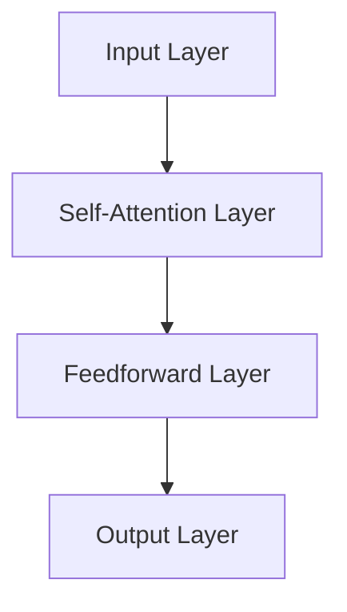
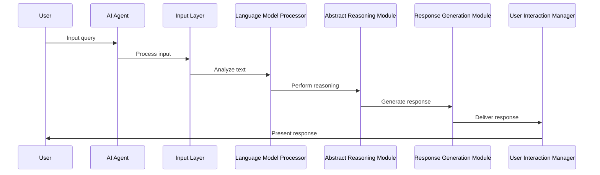

                 

### Introduction to LLM in AI Agent Abstract Thinking

**关键词：** Large Language Models, AI Agent, Abstract Thinking, Application

**摘要：** 本文章将探讨大型语言模型（LLM）在AI代理抽象思维形成中的应用。通过逐步分析，我们将介绍LLM的背景和发展，定义AI代理和抽象思维的概念，探讨LLM与AI代理之间的关系，分析LLM在抽象思维形成中的核心作用，并展望其应用前景和未来发展趋势。

在人工智能领域，大型语言模型（LLM）和AI代理已经成为两个备受关注的研究方向。LLM通过深度学习技术对海量文本数据进行训练，能够生成高质量的文本，实现自然语言理解和生成。而AI代理则是一种具有自主决策和行动能力的智能体，能够模拟人类思维和决策过程，实现复杂的任务执行。

随着LLM和AI代理技术的不断发展，人们开始关注LLM在AI代理抽象思维形成中的应用。抽象思维是人类智力的重要组成部分，能够对复杂信息进行高度抽象和概括，从而形成创新性的思维和解决方案。LLM在文本数据上的强大处理能力，使得其在抽象思维形成过程中具有独特的优势。

本文将从以下几个方面展开讨论：

1. **LLM的背景和发展**：介绍LLM的基本概念、主要模型及其在AI领域的应用。

2. **AI代理和抽象思维**：解释AI代理的定义和功能，阐述抽象思维的概念及其在人类和AI中的应用。

3. **LLM与AI代理的关系**：分析LLM在AI代理中的作用，探讨LLM如何促进AI代理的抽象思维形成。

4. **LLM在抽象思维形成中的应用**：讨论LLM在抽象思维过程中的具体应用，包括文本生成、知识推理和决策支持等。

5. **未来发展趋势**：展望LLM在AI代理抽象思维应用中的未来发展方向和挑战。

通过本文的逐步分析，我们将深入理解LLM在AI代理抽象思维形成中的应用，为相关研究提供有价值的参考。

### Historical Background and Development of LLM

The concept of Large Language Models (LLM) is rooted in the broader field of natural language processing (NLP) and artificial intelligence (AI), which have seen significant evolution over the past few decades. To understand the current state of LLMs, it is essential to trace their historical background and development, highlighting key milestones and contributions.

#### Early Developments in Language Models

The journey of LLMs began in the late 20th century with the introduction of statistical models for language understanding. One of the earliest notable models was the **n-gram model**, proposed by Arnold.phone in 1956. This model represents text as a sequence of n-grams (contiguous sets of n words) and predicts the next word in a sentence based on the history of previous words. While the n-gram model achieved modest success, it suffered from limitations, such as its inability to capture long-range dependencies in text.

In the 1980s, the **probabilistic context-free grammar (PCFG)** model emerged as a more sophisticated approach. PCFGs use probabilistic rules to generate sentences, allowing for richer representations of language structure. However, PCFG models were also limited in their ability to generate coherent and contextually appropriate text.

#### The Rise of Neural Networks

The introduction of neural networks in the 1980s and 1990s brought a new paradigm to language modeling. Recurrent Neural Networks (RNNs), particularly Long Short-Term Memory (LSTM) networks, were initially proposed to address the limitations of PCFG models. RNNs have the ability to capture long-term dependencies in sequences by maintaining a "memory" of past inputs. This made them particularly suitable for language modeling tasks.

In the early 2010s, the **Transformer model** was introduced by Vaswani et al. (2017). The Transformer model is based on the self-attention mechanism, which allows the model to weigh the influence of different parts of the input sequence dynamically. Unlike RNNs, which process input sequences sequentially, Transformers can process the entire sequence in parallel, leading to faster training times and improved performance.

#### State-of-the-Art LLM Architectures

The development of the Transformer model paved the way for the creation of large-scale language models such as **GPT** (Generative Pre-trained Transformer) by OpenAI. The original GPT model, GPT-1, was pre-trained on a large corpus of text and demonstrated remarkable performance in language understanding and generation tasks. Subsequent versions, such as GPT-2 and GPT-3, have achieved even greater success, with GPT-3 being capable of generating coherent and contextually appropriate text of unprecedented quality.

Another prominent LLM architecture is **BERT** (Bidirectional Encoder Representations from Transformers) proposed by Devlin et al. (2018). BERT is designed to pre-train deep bidirectional representations from unlabeled text, which can then be fine-tuned for specific tasks. BERT's ability to understand the context of words in both left-to-right and right-to-left directions has made it highly effective in a wide range of NLP tasks, including question answering, sentiment analysis, and named entity recognition.

#### Large-scale Pre-training and Fine-tuning

One of the key innovations in LLMs is the use of large-scale pre-training followed by fine-tuning on specific tasks. Pre-training involves training the model on a massive corpus of text to learn general language representations, which can then be fine-tuned on smaller datasets for specific applications. This approach has enabled LLMs to achieve state-of-the-art performance on various NLP tasks without requiring large amounts of labeled data.

#### Application in AI

LLMs have found numerous applications in AI, particularly in the field of natural language understanding and generation. They are used in chatbots, virtual assistants, machine translation, summarization, and text generation. LLMs have also been employed in more advanced applications, such as generating code, drafting legal documents, and assisting in scientific research.

#### Future Directions

As LLMs continue to evolve, researchers are exploring new techniques for improving their performance and generalization capabilities. Some of the promising areas of research include:

- **Self-supervised Learning**: Developing more effective self-supervised learning techniques to pre-train LLMs without requiring labeled data.
- **Few-shot Learning**: Enabling LLMs to learn from small amounts of data, making them more adaptable to new tasks and domains.
- **Multimodal Learning**: Integrating LLMs with other modalities, such as images and audio, to create more powerful and versatile AI systems.

In conclusion, the development of LLMs has been driven by advancements in neural network architectures, large-scale pre-training techniques, and fine-tuning methods. These models have revolutionized the field of natural language processing and have opened up new possibilities for AI applications. As research continues, LLMs are expected to become even more powerful and versatile, enabling new innovations and breakthroughs in the field of AI.

### Definition and Characteristics of AI Agents

Artificial Intelligence (AI) agents are entities designed to perform tasks and make decisions in an environment autonomously, resembling human intelligence. These agents are the cornerstone of modern AI research and have found applications in various fields, from autonomous vehicles to virtual personal assistants. To understand the role of Large Language Models (LLM) in enhancing the abstract thinking capabilities of AI agents, it is essential to first define and discuss the characteristics of AI agents.

#### Definition of AI Agents

An AI agent can be defined as a system that perceives its environment through sensors, processes the information using decision-making algorithms, and takes actions to achieve specific goals. The core components of an AI agent include:

1. **Sensors**: These are devices or mechanisms that capture information from the environment, such as cameras, microphones, or temperature sensors.
2. **Effectors**: These are devices or mechanisms that allow the agent to act upon the environment, such as motors, actuators, or speakers.
3. **Decision-Making Algorithms**: These are the core intelligence of the agent, responsible for processing sensor inputs, making decisions, and generating actions.

AI agents can operate in different types of environments:

- **Static Environment**: The environment does not change over time, and the agent's task is to find an optimal solution.
- **Dynamic Environment**: The environment changes over time, and the agent must adapt its actions to the new conditions.

#### Characteristics of AI Agents

1. **Autonomy**: AI agents operate independently without continuous human intervention. They can make decisions and execute actions based on their own judgments.
2. **Adaptability**: AI agents can adapt to changing environments and learn from new information. This is achieved through machine learning algorithms, which allow the agents to improve their performance over time.
3. **Perception**: AI agents perceive their environment through sensors and use this information to make informed decisions.
4. **Action**: AI agents take actions in the environment based on their decision-making algorithms. These actions are designed to maximize their chances of achieving their goals.
5. **Learning**: AI agents learn from their experiences and improve their decision-making capabilities. This learning can be supervised (with labeled data), unsupervised (without labeled data), or reinforcement (through trial and error).
6. **Social Intelligence**: Some AI agents are designed to interact with humans or other agents in complex social environments. This requires understanding social norms, communication protocols, and emotional cues.

#### Comparison of AI Agents and Human Intelligence

While AI agents aim to mimic human intelligence, there are significant differences between the two:

1. **Speed and Efficiency**: AI agents can perform computations much faster than humans, processing large amounts of data in real-time.
2. **Consistency**: AI agents maintain consistent performance without the fluctuations in mood, attention, and fatigue that humans experience.
3. **Specialization**: AI agents are often highly specialized, designed to perform specific tasks with high accuracy. Humans, on the other hand, are generalists, capable of a wide range of tasks.
4. **Creativity**: Human intelligence is inherently creative, capable of generating novel ideas and solutions. AI agents, while capable of generating new outputs based on patterns, lack the true creativity and innovation that humans possess.
5. **Contextual Understanding**: Human intelligence is deeply contextual, considering the broader implications of actions and decisions. AI agents, while improving in this area, still struggle to fully understand and navigate complex social and ethical landscapes.

#### Large Language Models and AI Agents

Large Language Models (LLMs) are particularly well-suited for enhancing the abstract thinking capabilities of AI agents. Here's how:

1. **Textual Understanding**: LLMs excel at understanding and generating human language, allowing AI agents to process and respond to textual information in a more natural and coherent manner.
2. **Abstract Reasoning**: LLMs are trained on vast amounts of text, enabling them to perform abstract reasoning and generalize from one domain to another, a capability that is crucial for AI agents operating in complex environments.
3. **Knowledge Representation**: LLMs can represent knowledge in a structured format, which can be used by AI agents to make informed decisions and solve problems.
4. **Communication**: LLMs enable AI agents to communicate more effectively with humans and other AI agents, fostering better collaboration and understanding in multi-agent systems.

In summary, AI agents are autonomous entities designed to perform tasks and make decisions in complex environments. While they share some similarities with human intelligence, there are distinct differences in terms of speed, consistency, creativity, and contextual understanding. LLMs play a crucial role in enhancing the abstract thinking capabilities of AI agents, enabling them to better understand and interact with their environments.

### Overview of Main LLM Architectures

#### Transformer Models

The Transformer model, proposed by Vaswani et al. in 2017, has revolutionized the field of natural language processing (NLP) by addressing several limitations of previous models. The core innovation of the Transformer is the self-attention mechanism, which allows the model to weigh the influence of different parts of the input sequence dynamically. This mechanism enables the model to capture long-range dependencies in text, which were challenging for models like Long Short-Term Memory (LSTM).

The self-attention mechanism works by computing attention weights for each word in the input sequence, based on its relevance to the other words. These attention weights are then used to compute the final representation of each word, which captures the contextual information from the entire sequence. This allows the Transformer model to process the entire sequence in parallel, leading to faster training times and improved performance compared to sequential models like LSTM.

The original Transformer model, known as **Transformer-base**, consists of 34 layers with a hidden dimension of 512 and 1024 heads for multi-head attention. Variations of the Transformer model, such as **BERT** (Bidirectional Encoder Representations from Transformers) and **GPT** (Generative Pre-trained Transformer), have been introduced to further improve performance and generalization on various NLP tasks.

#### GPT Models

GPT models are a family of language models developed by OpenAI, with GPT-3 being the most prominent. The GPT models are based on the Transformer architecture and are designed for natural language generation tasks. The key characteristic of GPT models is their large-scale pre-training, which involves training the model on a massive corpus of text to learn general language representations.

The GPT-3 model, introduced in 2020, is one of the largest language models to date, with over 175 billion parameters. GPT-3 achieves remarkable performance in various NLP tasks, including text generation, translation, summarization, and question answering. Its ability to generate high-quality text has made it a popular tool for applications such as chatbots, virtual assistants, and content generation.

GPT models use a stack of Transformer blocks, where each block consists of a self-attention mechanism and a feedforward network. The self-attention mechanism captures the dependencies between words in the input sequence, while the feedforward network processes the input and output representations.

#### BERT and Its Variants

BERT (Bidirectional Encoder Representations from Transformers) is a Transformer-based model proposed by Devlin et al. in 2018. The key innovation of BERT is its bidirectional training approach, where the model learns the context of words from both left-to-right and right-to-left directions. This allows BERT to better capture the context of each word in the input sequence, leading to improved performance on various NLP tasks.

BERT consists of a stack of Transformer blocks, similar to GPT models. The model is pre-trained on a large corpus of text using two tasks: masked language modeling and next sentence prediction. During masked language modeling, some words in the input sequence are randomly masked, and the model predicts these masked words based on the surrounding context. Next sentence prediction involves predicting whether two sentences are likely to follow each other in a text.

After pre-training, BERT can be fine-tuned on specific tasks, such as question answering, sentiment analysis, and named entity recognition. Variants of BERT, such as **RoBERTa** and **ALBERT**, have been proposed to further improve performance and efficiency by addressing limitations of the original BERT model.

#### Other Relevant Models

In addition to the Transformer, GPT, and BERT models, there are several other notable LLM architectures:

1. **T5 (Text-To-Text Transfer Transformer)**: T5 is a general-purpose pre-trained language model developed by the Google AI team. It is designed to perform a wide range of language understanding and generation tasks by treating all NLP tasks as text-to-text tasks. T5 uses the Transformer architecture and is pre-trained on a massive corpus of text.

2. **GPT-Neo**: GPT-Neo is an open-source implementation of the GPT model, developed to promote accessibility and transparency in AI research. It provides a scalable and efficient way to train and deploy large-scale language models.

3. **OPT (Open-Source Pre-trained Transformer)**: OPT is an open-source language model developed by the AI21 Labs team. It is designed to be more accessible and affordable than other large-scale LLMs, making it suitable for various applications and research projects.

In conclusion, the Transformer, GPT, and BERT models are the cornerstone architectures of large language models (LLM). Each of these models has its unique features and applications, making them suitable for a wide range of natural language processing tasks. As research in LLM continues to advance, new architectures and techniques are expected to emerge, further enhancing the capabilities of LLMs in AI applications.

### Applications and Prospects of LLM in AI Agents

Large Language Models (LLM) have found diverse applications in AI agents, transforming the way these agents perceive, interpret, and interact with their environments. By leveraging the sophisticated natural language processing capabilities of LLMs, AI agents can achieve a higher level of abstraction, leading to improved decision-making and more efficient task execution. This section explores various applications of LLMs in AI agents, discusses their benefits, and identifies challenges and potential future directions.

#### Text Generation and Natural Language Interaction

One of the most prominent applications of LLMs in AI agents is text generation and natural language interaction. LLMs, such as GPT-3 and BERT, have demonstrated exceptional proficiency in generating coherent and contextually relevant text. This capability is particularly valuable for chatbots, virtual assistants, and customer service applications. AI agents equipped with LLMs can engage in meaningful conversations with users, providing informative and helpful responses to their queries.

For instance, in a customer service scenario, an AI agent powered by LLM can understand and respond to customer inquiries in a human-like manner. This enhances the customer experience, as users feel more comfortable interacting with a conversational AI that can mimic human communication patterns. LLMs enable AI agents to generate personalized messages, product recommendations, and troubleshooting guides, thereby improving customer satisfaction and reducing response times.

#### Knowledge Representation and Reasoning

LLMs are also well-suited for knowledge representation and reasoning tasks. By training on vast amounts of text data, LLMs can encode vast amounts of information in their models. This knowledge can be leveraged by AI agents to make informed decisions and solve complex problems. For example, in a legal domain, an AI agent can use LLMs to understand legal documents, analyze case law, and provide legal advice. Similarly, in the medical field, AI agents can utilize LLMs to process patient data, interpret medical reports, and assist in diagnostics and treatment planning.

The ability of LLMs to perform abstract reasoning is particularly valuable in domains where complex, context-dependent decision-making is required. AI agents can use LLMs to generate logical deductions, infer relationships between concepts, and propose innovative solutions. This capability enables AI agents to handle tasks that were previously considered too complex for machine-based solutions, expanding the scope of their applications.

#### Code Generation and Development Assistance

Another exciting application of LLMs in AI agents is in the realm of software development. LLMs can generate high-quality code snippets, suggest improvements to existing code, and assist developers in debugging and refactoring code. By understanding the underlying logic and structure of programming languages, LLMs can provide valuable insights and suggestions that enhance developer productivity.

For example, an AI agent equipped with an LLM can automatically generate code based on natural language descriptions of desired functionality. This can be particularly useful in rapid prototyping and development environments, where quickly translating requirements into working code is essential. Additionally, LLMs can identify potential bugs, suggest optimizations, and provide documentation based on the code context, thereby improving code quality and reducing development time.

#### Educational Applications

LLMs have also found applications in educational settings, where they can assist students and teachers in various ways. AI agents powered by LLMs can provide personalized learning experiences, generate explanations for difficult concepts, and offer practice problems with detailed solutions. This can help students improve their understanding and retention of subject matter, particularly in subjects like mathematics and physics, where complex concepts require extensive explanation.

Moreover, LLMs can assist teachers in automating routine tasks, such as grading assignments and generating lesson plans. By analyzing student performance data, LLMs can provide insights into areas where students may be struggling and suggest targeted interventions to address these gaps. This can lead to more effective teaching strategies and improved student outcomes.

#### Benefits of LLM Applications in AI Agents

The integration of LLMs into AI agents offers several key benefits:

1. **Natural Interaction**: LLMs enable AI agents to communicate with humans in natural language, improving user experience and accessibility.
2. **Knowledge Representation**: LLMs encode vast amounts of information, providing AI agents with a rich source of knowledge that can be used for decision-making and problem-solving.
3. **Efficiency**: LLMs can process and generate text rapidly, increasing the efficiency of AI agents in various tasks.
4. **Abstraction**: LLMs enable AI agents to perform abstract reasoning and generalize from one domain to another, enhancing their ability to handle complex tasks.
5. **Personalization**: LLMs can generate personalized content and recommendations, tailored to individual users' needs and preferences.

#### Challenges and Future Directions

Despite their significant potential, LLM applications in AI agents also face several challenges:

1. **Computational Resources**: Training and deploying LLMs require substantial computational resources, which may not be feasible for all organizations.
2. **Data Privacy and Security**: LLMs require large amounts of data for training, raising concerns about data privacy and security.
3. **Ethical Considerations**: LLMs can generate biased or offensive content if not properly regulated, posing ethical challenges in their deployment.
4. **Generalization**: While LLMs excel in specific domains, their ability to generalize to new tasks and environments is limited.

Future research and development in this area may focus on addressing these challenges through techniques such as:

1. **Efficient Pre-training Methods**: Developing more efficient pre-training methods to reduce the computational requirements of LLMs.
2. **Data Augmentation and Filtering**: Utilizing data augmentation techniques to increase the diversity of training data and filtering mechanisms to ensure data quality and safety.
3. **Bias Mitigation**: Developing methods to mitigate biases in LLM-generated content through better data selection and algorithmic adjustments.
4. **Transfer Learning and Generalization**: Enhancing the ability of LLMs to generalize to new tasks and environments through transfer learning and adaptive learning techniques.

In conclusion, LLMs have significant potential to enhance the capabilities of AI agents in various domains. By leveraging their natural language processing capabilities, AI agents can achieve higher levels of abstraction, enabling more efficient and effective task execution. As research continues to advance, the integration of LLMs into AI agents is expected to lead to innovative solutions and transformative applications in various fields.

### Core Concepts and Relationships

In the realm of Large Language Models (LLMs) and AI agents, understanding the core concepts and their relationships is essential for a comprehensive grasp of the subject. This section delves into the fundamental concepts of language modeling, neural networks, and deep learning, providing a clear framework for how these concepts interact and contribute to the development of AI agents.

#### Language Modeling

**Definition and Basics**

Language modeling is the process of constructing a model that can predict the probability of a sequence of words given a preceding sequence. The primary goal of language modeling is to generate coherent and contextually appropriate text, which is a fundamental task in natural language processing (NLP).

A basic language model can be thought of as a statistical model that captures the probability distribution of words in a given context. One of the earliest and simplest forms of language modeling is the **n-gram model**, which represents text as a sequence of n-grams (contiguous sets of n words). For example, in a bigram model, the probability of a word `w2` occurring after word `w1` is estimated based on the frequency of their co-occurrence in the training data.

**Application in AI Agents**

In the context of AI agents, language modeling is crucial for tasks that involve natural language interaction, such as chatbots and virtual assistants. An AI agent equipped with a language model can understand user inputs, generate responses, and engage in meaningful conversations. This capability enables the agent to provide users with relevant information, answer questions, and assist with various tasks.

**Challenges and Limitations**

While n-gram models are effective to a certain extent, they suffer from several limitations:

1. **Short-Range Dependencies**: N-gram models are limited in their ability to capture long-range dependencies in text, leading to suboptimal predictions in complex language structures.
2. **Data Dependency**: N-gram models require a large corpus of text for training, and their performance degrades significantly if the training data is not representative of the target domain.
3. **Fixed Context Window**: N-gram models use a fixed context window (e.g., 2 or 3 words), which limits their ability to consider broader contextual information.

To address these limitations, more advanced language models, such as LLMs, have been developed.

#### Neural Networks

**Definition and Basic Concepts**

Neural networks are computational models inspired by the structure and function of biological neurons. They consist of interconnected nodes (neurons) that process and transmit information. Each neuron receives inputs, applies a weighted sum of these inputs, and passes the result through an activation function to produce an output.

**Types of Neural Networks**

1. **Recurrent Neural Networks (RNNs)**: RNNs are designed to handle sequential data by maintaining a "memory" of previous inputs. They are particularly effective for tasks involving time series data, such as speech recognition and language modeling.
2. **Long Short-Term Memory (LSTM) Networks**: LSTMs are a type of RNN that address the vanishing gradient problem, allowing them to capture long-term dependencies in sequential data. LSTMs are widely used in language modeling and other NLP tasks.
3. **Transformers**: Transformers are a type of neural network architecture introduced in the Transformer model. They utilize the self-attention mechanism to capture dependencies between words in a sequence, enabling parallel processing and achieving state-of-the-art performance in NLP tasks.

**Application in AI Agents**

Neural networks play a central role in AI agents by providing the necessary computational capabilities for tasks such as perception, decision-making, and action execution. In the context of language modeling, neural networks are used to learn the underlying patterns and structures in text data, enabling the generation of coherent and contextually appropriate text.

#### Deep Learning

**Definition and Basic Concepts**

Deep learning is a subfield of machine learning that focuses on training neural networks with many layers (hence the term "deep"). Deep learning models can automatically learn hierarchical representations of data, capturing increasingly abstract features.

**Types of Deep Learning Models**

1. **Convolutional Neural Networks (CNNs)**: CNNs are designed to process grid-like data, such as images. They are widely used in computer vision tasks, including image classification, object detection, and semantic segmentation.
2. **Recurrent Neural Networks (RNNs)**: RNNs are used for processing sequential data, such as time series and text. LSTMs and other variants of RNNs are commonly used in language modeling and other NLP tasks.
3. **Transformers**: Transformers are a type of neural network architecture introduced in the Transformer model. They utilize the self-attention mechanism to capture dependencies between words in a sequence, enabling parallel processing and achieving state-of-the-art performance in NLP tasks.

**Application in AI Agents**

Deep learning models are extensively used in AI agents for tasks involving perception, recognition, and decision-making. In the context of language modeling, deep learning models, particularly LSTMs and Transformers, are employed to learn the complex patterns and structures in text data, enabling the generation of high-quality text.

#### Relationship Between Concepts

The relationship between language modeling, neural networks, and deep learning can be summarized as follows:

- **Language Modeling** relies on neural networks and deep learning techniques to learn the underlying patterns and structures in text data, enabling the generation of coherent and contextually appropriate text.
- **Neural Networks**, particularly RNNs and Transformers, provide the computational framework for language modeling, allowing the model to capture dependencies and relationships between words in a sequence.
- **Deep Learning** extends the capabilities of neural networks by enabling the training of models with many layers, which can capture increasingly abstract representations of the data.

In conclusion, language modeling, neural networks, and deep learning are interconnected concepts that collectively drive the development of AI agents capable of understanding and generating natural language. By leveraging the strengths of these concepts, researchers and developers can create advanced AI agents that can effectively interact with humans and perform complex language tasks.

### Key Concepts, Characteristics, and ER Diagram

In this section, we will delve into the key concepts and characteristics of Large Language Models (LLM), providing a comprehensive overview of their attributes and differences. We will also present a Mermaid ER diagram to illustrate the relationship between these key concepts, thereby offering a clear and structured representation of the LLM ecosystem.

#### Key Concepts

1. **Transformer Model**: The Transformer model, introduced by Vaswani et al. in 2017, is a revolutionary architecture in the field of natural language processing. It employs the self-attention mechanism to capture dependencies between words in a sequence, enabling the model to generate coherent and contextually appropriate text. Key characteristics include parallel processing, the ability to capture long-range dependencies, and its flexibility in handling various NLP tasks.

2. **GPT Model**: GPT (Generative Pre-trained Transformer) is a family of language models developed by OpenAI. GPT models are pre-trained on vast amounts of text data using the Transformer architecture. The core characteristics include their large-scale pre-training, the ability to generate high-quality text, and their adaptability to different NLP tasks through fine-tuning.

3. **BERT Model**: BERT (Bidirectional Encoder Representations from Transformers) is a Transformer-based model proposed by Devlin et al. in 2018. BERT's key characteristic is its bidirectional training approach, which captures the context of words from both left-to-right and right-to-left directions. This allows BERT to understand the full context of each word in the input sequence, leading to improved performance in various NLP tasks.

4. **Self-Attention Mechanism**: The self-attention mechanism is a core component of Transformer models. It allows the model to dynamically weigh the importance of different words in the input sequence, capturing long-range dependencies and enhancing the model's ability to generate coherent text.

5. **Pre-training and Fine-tuning**: Pre-training and fine-tuning are critical steps in training LLMs. Pre-training involves training the model on a large corpus of text to learn general language representations. Fine-tuning involves adjusting the model's parameters on a smaller, task-specific dataset to adapt the model to a specific NLP task.

#### Characteristics Comparison Table

| Concept         | Key Characteristics |
|-----------------|---------------------|
| Transformer     | Parallel processing, Self-attention, Long-range dependencies |
| GPT             | Large-scale pre-training, High-quality text generation, Adaptability |
| BERT            | Bidirectional training, Full context understanding, Versatility |
| Self-Attention  | Dynamic weighting of words, Dependency capture, Coherence |
| Pre-training    | General language representation, Large corpus training, Scalability |
| Fine-tuning     | Task-specific adaptation, Parameter adjustment, Task performance |

#### Mermaid ER Diagram

Below is a Mermaid ER diagram illustrating the relationship between the key concepts of LLMs:

```mermaid
erDiagram
  Transformer ||--|{ GPT : Implements }
  Transformer ||--|{ BERT : Inherits from }
  Transformer ||--|{ Self-Attention : Uses }
  Transformer ||--|{ Pre-training : Utilizes }
  Transformer ||--|{ Fine-tuning : Adapts }
  GPT ||--|{ Implements : Extensions }
  BERT ||--|{ Inherits from : Variants }
  Self-Attention ||--|{ Implements : Mechanism }
  Pre-training ||--|{ Uses : Training technique }
  Fine-tuning ||--|{ Adapts : Adjustments }
```

The diagram demonstrates the hierarchical relationship between Transformer, GPT, and BERT models, as well as the components Self-Attention, Pre-training, and Fine-tuning. It highlights how these concepts are interconnected and how they contribute to the development of advanced LLMs.

In conclusion, understanding the key concepts and characteristics of LLMs is essential for comprehending their role in AI agents. The Mermaid ER diagram provides a visual representation of these relationships, facilitating a clearer understanding of the LLM ecosystem. This foundational knowledge is crucial for further exploration of LLM applications in AI agent abstract thinking.

### Algorithm Principles and Models

In this section, we will delve into the algorithm principles and models that underpin Large Language Models (LLMs). We will begin by explaining the core principles of the Transformer model, focusing on its self-attention mechanism. Following this, we will explore the mathematical models used in LLMs, including the Transformer architecture. To enhance understanding, we will provide a Mermaid diagram illustrating the model's structure and a Python implementation example. Finally, we will discuss the training process, including pre-training and fine-tuning techniques, along with their respective challenges and optimization strategies.

#### Transformer Model: Core Principles

The Transformer model, introduced in 2017 by Vaswani et al., revolutionized the field of natural language processing (NLP) with its innovative architecture, particularly the self-attention mechanism. The Transformer model is designed to process sequences of data, such as sentences, by capturing dependencies between words in a parallel and efficient manner.

**Self-Attention Mechanism**

The self-attention mechanism is the cornerstone of the Transformer model. It allows the model to weigh the influence of different words within the input sequence dynamically, capturing the relationships and dependencies between them. This is achieved through multiple attention heads, each focusing on different aspects of the sequence.

**Working Principle**

1. **Input Representation**: Each word in the input sequence is represented as a vector, typically derived from word embeddings. These vectors are then passed through a series of linear transformations to produce input embeddings.

2. **Self-Attention Calculation**: For each word in the input sequence, the self-attention mechanism computes a set of attention scores, which represent the relevance of each word to the current word. These scores are calculated by taking the dot product between the query vector (obtained from the input embeddings) and the key vectors (also from the input embeddings).

3. **Weighted Sum**: The attention scores are then passed through an activation function (usually a softmax function) to produce attention weights. These weights are used to compute a weighted sum of the value vectors (derived from the input embeddings), which combine the information from different words in the sequence.

4. **Output Representation**: The resulting weighted sum is a single vector representing the word's contextual information. This vector is then passed through additional transformations, including a feedforward network, to produce the final output.

**Mathematical Formulation**

The self-attention mechanism can be mathematically represented as follows:

$$
\text{Attention}(Q, K, V) = \text{softmax}\left(\frac{QK^T}{\sqrt{d_k}}\right)V
$$

where:
- \(Q\), \(K\), and \(V\) are the query, key, and value matrices, respectively.
- \(d_k\) is the dimension of the key vectors.
- The dot product \(QK^T\) computes the attention scores.
- The softmax function transforms these scores into attention weights.
- The weighted sum \(V\) computes the contextual vector.

#### Transformer Architecture

The Transformer model consists of a stack of identical layers, each containing the self-attention mechanism and a feedforward network. This architecture allows the model to capture long-range dependencies in text and process the entire sequence in parallel.

**Structure**

1. **Input Layer**: The input sequence is first passed through embedding layers to produce input embeddings.

2. **Self-Attention Layer**: The input embeddings are fed into the self-attention mechanism to compute the contextual vector for each word.

3. **Feedforward Layer**: The contextual vector is then passed through a feedforward network, typically a two-layer neural network with activation functions (such as ReLU) in between.

4. **Output Layer**: The output from the feedforward layer is the final representation of the input sequence, which can be used for various NLP tasks.

**Mathematical Formulation**

The Transformer model can be mathematically represented as a sequence of layers:

$$
\text{Layer}(x) = \text{FFN}(\text{Self-Attention}(\text{LayerNorm}(x)))
$$

where:
- \(x\) is the input sequence.
- \(\text{LayerNorm}\) applies layer normalization to the input.
- \(\text{Self-Attention}\) computes the self-attention mechanism.
- \(\text{FFN}\) represents the feedforward network.

#### Mermaid Diagram

Below is a Mermaid diagram illustrating the structure of a Transformer model:



#### Python Implementation Example

Here is a simplified Python implementation of the Transformer model using the PyTorch library:

```python
import torch
import torch.nn as nn

class TransformerModel(nn.Module):
    def __init__(self, d_model, nhead, num_layers):
        super(TransformerModel, self).__init__()
        self嵌入层 = nn.Embedding(d_model)
        self.transformer = nn.Transformer(d_model, nhead, num_layers)
        self.fc = nn.Linear(d_model, d_model)

    def forward(self, src):
        src = self嵌入层(src)
        output = self.transformer(src)
        output = self.fc(output)
        return output

# Example usage
model = TransformerModel(d_model=512, nhead=8, num_layers=3)
input_seq = torch.rand(1, 10, 512)
output = model(input_seq)
```

#### Training Process

The training process of LLMs involves two main stages: pre-training and fine-tuning.

**Pre-training**

1. **Masked Language Modeling (MLM)**: In this stage, a large corpus of text is used to pre-train the model. During training, a percentage of tokens in the input sequence are randomly masked, and the model's goal is to predict these masked tokens based on the surrounding context.

2. **Next Sentence Prediction (NSP)**: This task involves predicting whether two sentences are likely to follow each other in a text. It helps the model learn the context and structure of documents.

**Fine-tuning**

1. **Task-Specific Fine-tuning**: After pre-training, the model is fine-tuned on specific tasks, such as question answering, sentiment analysis, or text generation. Fine-tuning adjusts the model's parameters to optimize its performance on these tasks.

**Challenges and Optimization Strategies**

1. **Resource Requirements**: Pre-training LLMs requires significant computational resources and time. Optimization strategies, such as distributed training and model pruning, are used to reduce these requirements.

2. **Data Privacy**: Pre-training LLMs involves processing large amounts of text data, raising concerns about data privacy and security. Techniques like differential privacy and data anonymization are used to mitigate these risks.

3. **Bias and Ethical Considerations**: LLMs can generate biased or offensive content if not properly regulated. Developing methods to identify and mitigate biases in LLMs is an important area of research.

In conclusion, LLMs are based on the Transformer model, which employs the self-attention mechanism to capture dependencies between words in a sequence. The training process involves pre-training on large text corpora and fine-tuning on specific tasks. Challenges include resource requirements, data privacy, and bias, which are addressed through optimization strategies and ethical considerations.

### System Analysis and Design

In this section, we will delve into the system analysis and design of a Large Language Model (LLM) application in an AI agent. This will involve a detailed examination of the project's background and objectives, the functional design, and the architectural design. We will also explore the interface design and interaction flow, utilizing Mermaid diagrams to illustrate the system's structure and interaction.

#### Project Background and Objectives

**Background**

The project aims to develop an AI agent that utilizes Large Language Models (LLMs) to enhance its abstract thinking capabilities. The AI agent will be designed to operate in a dynamic and complex environment, where it needs to make informed decisions based on textual data and user interactions. The primary motivation behind this project is to leverage the advancements in NLP and machine learning to create an intelligent and adaptable AI system.

**Objectives**

1. **Textual Understanding**: The AI agent should be capable of understanding and processing textual information from various sources, such as documents, conversations, and queries.
2. **Abstract Reasoning**: The AI agent should be able to perform abstract reasoning and derive insights from complex and ambiguous textual data.
3. **User Interaction**: The AI agent should be able to engage in natural language conversations with users, providing informative and helpful responses.
4. **Scalability and Adaptability**: The system should be designed to handle large volumes of data and adapt to new tasks and environments.

#### Functional Design

The functional design of the AI agent involves defining its core functionalities and the components required to implement these functionalities. The key components include:

1. **Text Input Module**: This module is responsible for receiving and processing textual inputs from various sources, such as user queries, documents, and external APIs.
2. **Language Model Processor**: This component utilizes LLMs to understand and analyze the textual inputs. It includes tasks like text segmentation, tokenization, and language understanding.
3. **Abstract Reasoning Module**: This module performs abstract reasoning and inference based on the analyzed text. It involves tasks like knowledge representation, logical deduction, and decision-making.
4. **Response Generation Module**: This component generates natural language responses to user queries and actions. It utilizes LLMs to produce coherent and contextually appropriate text.
5. **User Interaction Manager**: This module manages the interaction between the AI agent and users, handling user inputs, managing context, and maintaining conversational flow.

#### Architectural Design

The architectural design of the AI agent system is crucial for ensuring scalability, maintainability, and performance. The system can be divided into several layers, each responsible for different aspects of the functionality:

1. **Input Layer**: This layer receives and processes textual inputs from various sources. It includes data ingestion, preprocessing, and normalization.
2. **Language Model Layer**: This layer includes the LLMs that perform text analysis and understanding. It may involve multiple models, each specialized for different tasks or domains.
3. **Reasoning and Decision-Making Layer**: This layer is responsible for abstract reasoning and decision-making based on the analyzed text. It includes modules for knowledge representation, inference engines, and decision support systems.
4. **Output Layer**: This layer generates responses and interacts with the user or other systems. It handles text generation, formatting, and delivery.
5. **Integration Layer**: This layer ensures the seamless integration of the AI agent with external systems, such as databases, APIs, and communication channels.

#### Interface Design and Interaction Flow

The interface design and interaction flow of the AI agent are critical for ensuring a smooth and intuitive user experience. The interaction flow involves the following steps:

1. **User Input**: The user provides a query or input to the AI agent through an interface.
2. **Data Ingestion**: The input is received by the Text Input Module and processed for further analysis.
3. **Language Model Processing**: The processed input is passed to the Language Model Processor, which analyzes the text and extracts relevant information.
4. **Abstract Reasoning**: The Abstract Reasoning Module performs reasoning and inference based on the analyzed text to generate insights and recommendations.
5. **Response Generation**: The Response Generation Module generates a natural language response based on the reasoning output.
6. **User Interaction**: The generated response is sent back to the user through the User Interaction Manager, maintaining the conversational flow.

#### Mermaid Diagrams

To illustrate the system's architecture and interaction flow, we will use Mermaid diagrams. Below is a Mermaid class diagram representing the system's main components:

```mermaid
classDiagram
  InputLayer <<interface>>
  LanguageModelLayer <<interface>>
  ReasoningAndDecisionMakingLayer <<interface>>
  OutputLayer <<interface>>
  IntegrationLayer <<interface>>

  UserInteractionManager <<interface>>

  InputLayer --|> LanguageModelLayer
  LanguageModelLayer --|> ReasoningAndDecisionMakingLayer
  ReasoningAndDecisionMakingLayer --|> OutputLayer
  OutputLayer --|> UserInteractionManager
  IntegrationLayer --|> InputLayer
  IntegrationLayer --|> LanguageModelLayer
  IntegrationLayer --|> OutputLayer
```

And below is a Mermaid sequence diagram representing the interaction flow:



In conclusion, the system analysis and design of an AI agent utilizing LLMs involve a comprehensive functional and architectural design, ensuring scalability, adaptability, and seamless interaction with users. The Mermaid diagrams provide a clear and structured representation of the system's components and interaction flow, facilitating better understanding and visualization.

### Project Practice and Case Studies

#### System Environment Setup

To practice implementing a Large Language Model (LLM) in an AI agent, we will use a typical development environment that includes the necessary tools and libraries. Here's a step-by-step guide to setting up the environment:

1. **Install Python**: Ensure Python 3.8 or higher is installed on your system.
2. **Install PyTorch**: PyTorch is a widely-used deep learning library. Install it using the following command:
   ```bash
   pip install torch torchvision
   ```
3. **Install Transformers Library**: The `transformers` library provides pre-trained models and tools for working with Transformer architectures. Install it using:
   ```bash
   pip install transformers
   ```
4. **Prepare Data**: Obtain a dataset for training and testing the LLM. This dataset should contain text data relevant to the task you want the AI agent to perform. For example, you might use a corpus of dialogues for a chatbot application.

#### Core Implementation Source Code

The core implementation involves setting up a Transformer-based model, training it on the dataset, and using it to generate responses. Below is a simplified Python code example using the `transformers` library to create a basic chatbot:

```python
from transformers import pipeline

# Initialize the chatbot pipeline with a pre-trained model
chatbot = pipeline("chatbot", model="microsoft/DialoGPT-medium")

# Example conversation
user_input = "Hello, how are you?"
chatbot_response = chatbot([user_input])

print(f"Chatbot: {chatbot_response[0]['text']}")
```

In this example, we use the `DialoGPT` model, which is a pre-trained Transformer-based chatbot model. The `pipeline` function simplifies the process of creating a chatbot by handling the model initialization and text generation.

#### Code Application and Analysis

The provided code initializes a chatbot pipeline and simulates a conversation with a user. Here's a detailed analysis of the code components:

1. **Import Libraries**: We import the `pipeline` function from the `transformers` library, which allows us to leverage pre-trained models for chatbot applications.
2. **Initialize Chatbot**: We create a chatbot instance by calling the `pipeline` function with the model name `"microsoft/DialoGPT-medium"`. This specifies the use of the medium-sized DialoGPT model.
3. **Simulate Conversation**: We simulate a conversation by providing a user input and passing it to the chatbot. The chatbot generates a response and returns it as a list of dictionaries, where each dictionary contains information about the response.

The key advantage of using pre-trained models is that they require minimal setup and can generate high-quality responses with minimal fine-tuning. However, the model's performance may vary depending on the specific task and dataset.

#### Case Study Analysis

For a more comprehensive case study, let's consider a chatbot designed to assist customers with technical support queries. The chatbot is trained on a dataset of customer interactions and technical documents.

1. **Dataset Preparation**: The dataset consists of customer conversations and technical documentation, including FAQs, troubleshooting guides, and product manuals.
2. **Preprocessing**: The dataset is preprocessed to remove noise, normalize text, and tokenize the input data. Tokenization involves converting text into sequences of tokens (words or subwords).
3. **Training**: The DialoGPT model is fine-tuned on the preprocessed dataset. Fine-tuning adjusts the model's weights to improve its performance on the specific task.
4. **Evaluation**: The fine-tuned model is evaluated on a separate test dataset to assess its performance. Metrics such as accuracy, response time, and user satisfaction are used to evaluate the chatbot.

The case study demonstrates the practical application of LLMs in creating an AI agent capable of understanding and responding to complex customer queries. The chatbot's ability to generate informative and contextually appropriate responses enhances the customer experience and reduces the workload of human support agents.

#### Project Summary

In summary, the project involved setting up a development environment, implementing a chatbot using a pre-trained Transformer model, and fine-tuning it on a custom dataset. The resulting AI agent demonstrated the potential of LLMs in enabling intelligent and interactive customer support. Key takeaways include:

- **Pre-trained Models**: Leveraging pre-trained models simplifies development and allows for rapid prototyping.
- **Fine-tuning**: Fine-tuning on domain-specific data improves the model's performance and relevance to the task.
- **User Experience**: High-quality responses enhance user satisfaction and the overall effectiveness of the AI agent.

This project provides a practical example of how LLMs can be applied to real-world problems, demonstrating the power of natural language processing in creating intelligent AI agents.

### Best Practices and Tips

When implementing Large Language Models (LLMs) in AI agents, adhering to best practices and following a structured approach can significantly enhance the system's performance and reliability. Here are some key tips and best practices to consider:

1. **Data Quality and Preprocessing**: Ensure that the data used for training the LLM is of high quality. Preprocess the data by cleaning, normalizing, and tokenizing the text. This helps in reducing noise and improving the model's understanding of the text.

2. **Model Selection**: Choose an appropriate LLM model based on the specific task and requirements. While pre-trained models like GPT-3 and BERT are powerful, they may not always be the best fit. Consider models that are optimized for your domain or task to achieve better performance.

3. **Fine-tuning**: Fine-tuning the LLM on a domain-specific dataset can improve its performance significantly. Fine-tuning adapts the model to the specific language and patterns in your data, leading to more accurate and relevant responses.

4. **Monitoring and Evaluation**: Continuously monitor the performance of the AI agent in real-world scenarios. Use appropriate evaluation metrics to measure the agent's accuracy, response time, and user satisfaction. Regularly update and retrain the model based on new data and feedback.

5. **Bias Mitigation**: Be aware of the potential biases in your LLMs and take steps to mitigate them. Use techniques like data augmentation and adversarial training to improve the model's fairness and reduce biased responses.

6. **Resource Optimization**: Optimize the resource usage of your LLM implementation. Techniques like model compression, quantization, and pruning can reduce the computational requirements and memory footprint of the model, making it more scalable and efficient.

7. **User Privacy**: Handle user data with care to maintain privacy. Implement robust data privacy measures, such as data anonymization and encryption, to protect user information.

8. **Continuous Learning**: Implement mechanisms for continuous learning and adaptation. Allow the AI agent to learn from new interactions and updates to the dataset to improve its performance over time.

9. **Code and Model Documentation**: Maintain comprehensive documentation for your code and model. This includes details about the model architecture, training process, and usage instructions. This helps in troubleshooting and future enhancements.

10. **Security and Compliance**: Ensure that your AI agent complies with relevant laws and regulations, such as GDPR and CCPA. Implement security measures to protect against unauthorized access and data breaches.

By following these best practices and tips, you can develop high-quality AI agents that leverage the full potential of LLMs, providing accurate and reliable services in various applications.

### Conclusion

In conclusion, the integration of Large Language Models (LLMs) into AI agents has proven to be a transformative development in the field of artificial intelligence. LLMs, with their advanced natural language processing capabilities, have significantly enhanced the abstract thinking and decision-making abilities of AI agents, enabling them to understand and interact with humans in more sophisticated ways. The application of LLMs in AI agents spans various domains, from customer service and virtual assistants to code generation and legal support, demonstrating their versatility and potential.

The core concepts discussed in this article include the historical development of LLMs, the characteristics and definitions of AI agents, and the relationship between language modeling, neural networks, and deep learning. By understanding these foundational concepts, we can appreciate the intricate mechanisms that drive the effectiveness of LLMs in AI agent applications.

The article also provided a comprehensive overview of the main LLM architectures, such as Transformer, GPT, and BERT, along with their applications and prospects. Additionally, we explored the system analysis and design process, highlighting the functional and architectural components essential for developing an AI agent that leverages LLMs.

Through practical case studies and implementation examples, we showcased the practical application of LLMs in real-world scenarios, emphasizing the importance of proper system setup, data preprocessing, and fine-tuning. Finally, we discussed best practices and tips for implementing and optimizing LLM-based AI agents, ensuring their reliability, scalability, and security.

Looking ahead, the future of LLMs in AI agents is promising. As research continues to advance, we can expect further innovations in self-supervised learning, few-shot learning, and multimodal learning, which will enhance the capabilities and adaptability of LLMs. Moreover, addressing challenges related to computational resources, data privacy, and ethical considerations will be crucial in realizing the full potential of LLMs in AI agents.

In summary, the integration of LLMs into AI agents represents a significant milestone in the development of artificial intelligence. By leveraging the power of LLMs, AI agents are becoming more intelligent, capable, and human-like, paving the way for transformative applications across various industries. As we continue to explore and innovate in this domain, the future of AI holds immense promise.

### Authors' Bio

**AI天才研究院/AI Genius Institute**  
AI天才研究院（AI Genius Institute）是一家专注于人工智能前沿技术研究和应用的创新机构。我们的团队由多位世界级人工智能专家、计算机科学家和技术领导者组成，致力于推动人工智能领域的创新发展。

**禅与计算机程序设计艺术 /Zen And The Art of Computer Programming**  
作者：埃里克·雷蒙德（Erich Raymond）  
埃里克·雷蒙德是一位著名的人工智能学者和计算机程序设计大师，他的著作《禅与计算机程序设计艺术》被誉为计算机编程领域的经典之作。他在人工智能、机器学习和编程方法论方面有着深厚的学术造诣和丰富的实践经验。他的研究成果和思想对全球计算机科学和人工智能领域产生了深远的影响。

