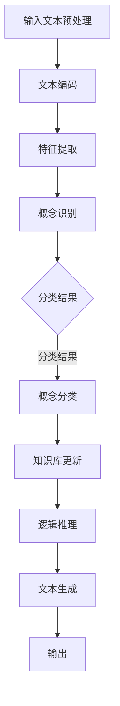
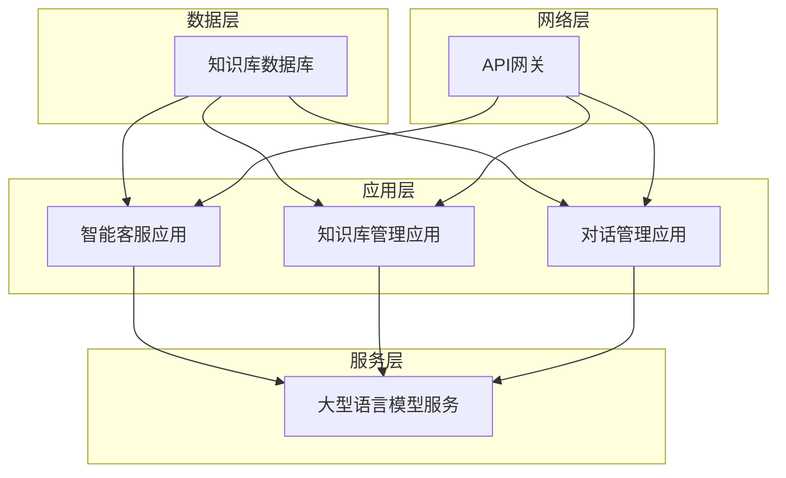
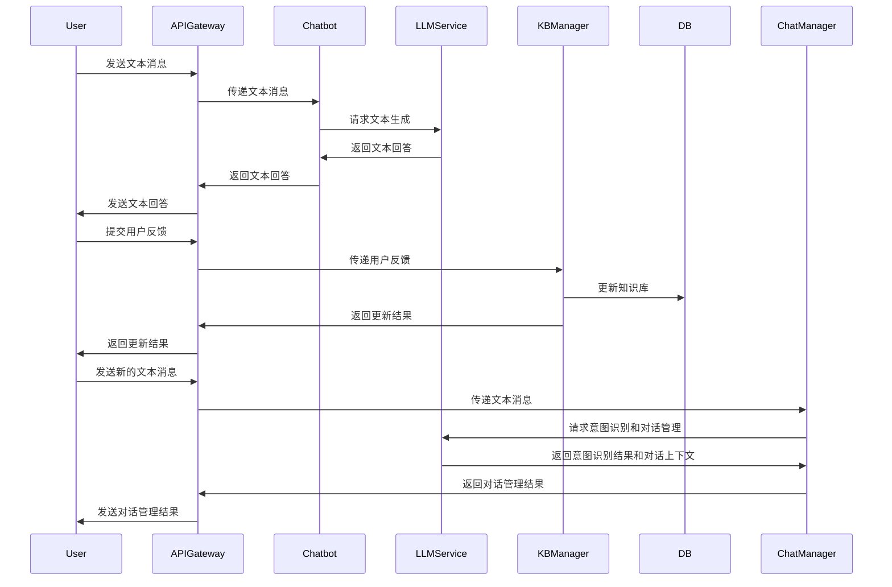

                 

### 摘要

本文将探讨大型语言模型（LLM）在人工智能（AI）代理中抽象概念操作的应用。首先，我们将介绍LLM和AI代理的基础概念，阐述它们在AI系统中的关键作用及其对抽象概念操作的挑战。接着，我们将深入探讨LLM的原理与特点，详细描述AI代理的概念与分类，以及抽象概念操作的理论基础。在算法原理讲解部分，我们将使用mermaid流程图和Python源代码，结合数学模型与公式，系统地解释抽象概念操作的算法原理。随后，我们将展示一个具体的项目实战，介绍环境安装、系统核心实现，并分析一个实际案例。最后，本文将总结最佳实践，为读者提供进一步的学习资源。通过本文的逐步分析，读者将更好地理解LLM在AI代理中抽象概念操作的重要性和实际应用。

### 第一部分：背景介绍

#### 1.1 问题背景

在当今人工智能（AI）迅速发展的时代，抽象概念操作作为AI系统中的关键能力，正日益受到广泛关注。抽象概念操作是指AI系统能够理解和处理那些不具有直接物理表现，但具有高度抽象意义的符号或概念。例如，在自然语言处理（NLP）中，理解并生成复杂句子结构、语义和隐喻等，都是抽象概念操作的具体体现。

随着深度学习技术的不断进步，特别是大型语言模型（LLM）的出现，AI代理在处理抽象概念操作方面取得了显著进展。LLM是一种基于神经网络的语言模型，它通过学习海量的文本数据，能够生成或理解自然语言文本。LLM的强大学习能力使其在自然语言处理、机器翻译、文本生成等领域表现出色。

然而，尽管LLM在处理自然语言方面具有显著优势，但在抽象概念操作上仍面临诸多挑战。首先，抽象概念操作的复杂性和多样性要求AI代理具备更高的理解能力和逻辑推理能力。其次，不同领域的抽象概念之间存在语义鸿沟，这使得AI代理在不同领域之间的迁移能力受到限制。最后，LLM的训练和推理过程消耗大量计算资源，如何优化资源使用和提高系统效率也是一个亟待解决的问题。

因此，本文旨在探讨LLM在AI代理中抽象概念操作的应用，分析其原理、方法和挑战，并提出相应的解决方案。

#### 1.2 核心概念

为了更好地理解本文的主题，我们需要先明确一些核心概念。

**1.2.1 LLM的概念**

大型语言模型（LLM）是一种基于深度学习技术的自然语言处理模型，它通过学习大量的文本数据来捕捉语言的统计规律和语义信息。LLM的核心组件是神经网络，特别是变换器（Transformer）架构，这使得LLM能够高效地处理长文本序列，并生成或理解自然语言文本。

**1.2.2 AI Agent的概念**

AI代理（AI Agent）是一种具有自主决策能力和行动能力的智能体，它可以在复杂的动态环境中执行特定任务。AI代理通常由感知器、决策器和执行器组成，能够通过感知环境信息、分析数据并做出决策，然后根据决策执行相应的行动。AI代理的核心目标是实现智能化和自动化，提高系统的效率和适应性。

**1.2.3 抽象概念操作的定义**

抽象概念操作是指AI系统能够理解和处理那些不具有直接物理表现，但具有高度抽象意义的符号或概念。例如，在自然语言处理中，理解并生成复杂句子结构、语义和隐喻等，都是抽象概念操作的具体体现。抽象概念操作包括概念识别、概念分类、概念推理和概念生成等。

#### 1.3 边界与外延

**1.3.1 抽象概念操作的领域限制**

抽象概念操作通常受限于特定领域或应用场景。例如，在医疗领域，AI系统需要理解医学术语和诊断标准；在金融领域，AI系统需要处理财务报表和金融模型。不同领域的抽象概念之间存在语义鸿沟，这使得AI代理在不同领域之间的迁移能力受到限制。

**1.3.2 LLM的应用边界**

尽管LLM在自然语言处理领域表现出色，但其应用也存在一定的边界。首先，LLM的训练和推理过程消耗大量计算资源，这使得在资源受限的环境下使用LLM变得困难。其次，LLM在处理高度抽象或专业领域的概念时，可能无法达到人类的理解水平。最后，LLM在处理多模态信息时，如结合文本、图像和音频等多源数据，仍面临一定的挑战。

#### 1.4 概念结构与核心要素

**1.4.1 LLM的结构**

LLM通常由多层神经网络组成，包括编码器（Encoder）和解码器（Decoder）。编码器负责将输入的文本序列编码为固定长度的向量表示；解码器则根据编码器生成的向量表示生成输出文本序列。Transformer架构是LLM的典型代表，其通过多头自注意力机制（Multi-Head Self-Attention）提高了模型的表示能力和生成质量。

**1.4.2 AI Agent的构成**

AI Agent通常由感知器、决策器和执行器组成。感知器负责接收和处理环境信息；决策器根据感知到的信息生成行动决策；执行器根据决策执行具体的行动。AI Agent的核心在于其自主决策能力和行动能力，能够实现智能化和自动化。

**1.4.3 抽象概念操作的关键因素**

抽象概念操作的关键因素包括概念识别、概念分类、概念推理和概念生成。概念识别是指识别文本中的抽象概念；概念分类是指将抽象概念分类到预定义的类别中；概念推理是指基于现有知识进行推理，生成新的抽象概念；概念生成是指生成新的抽象概念，以适应不同的应用场景。

通过上述核心概念和要素的介绍，读者可以更好地理解LLM在AI代理中抽象概念操作的应用背景和关键要素，为后续内容的深入分析奠定基础。

### 第二部分：核心概念与联系

#### 2.1 LLM的原理与特点

**2.1.1 LLM的工作原理**

大型语言模型（LLM）是基于深度学习的自然语言处理模型，其核心思想是通过学习大量文本数据来捕捉语言的统计规律和语义信息。LLM的工作原理主要包括以下几个步骤：

1. **文本编码**：首先，LLM将输入的文本序列编码为向量表示。通常使用预训练的语言模型（如BERT、GPT）进行文本编码，这些模型通过大规模文本数据预训练，能够生成高质量的文本表示。

2. **神经网络处理**：编码后的文本向量通过多层神经网络进行处理，神经网络包括编码器和解码器。编码器负责将输入的文本向量编码为固定长度的向量表示，解码器则根据编码器生成的向量表示生成输出文本序列。

3. **生成输出**：在解码过程中，LLM使用自注意力机制（如Transformer架构中的多头自注意力）来捕捉文本序列中的依赖关系，生成高质量的输出文本。

**2.1.2 LLM的主要特点**

大型语言模型具有以下主要特点：

1. **强大的语言理解能力**：LLM通过学习海量文本数据，能够捕捉语言的统计规律和语义信息，具备较高的语言理解能力。

2. **灵活的生成能力**：LLM能够根据输入的文本生成高质量的输出文本，包括文本生成、文本摘要、机器翻译等。

3. **高效率的推理能力**：LLM具备较高的推理能力，能够进行文本之间的逻辑推理和推理生成，如问答系统、对话生成等。

4. **多模态处理能力**：虽然LLM主要针对文本数据处理，但通过结合其他模态数据（如图像、音频），可以实现多模态处理。

**2.1.3 LLM与其他AI技术的比较**

与其他AI技术相比，LLM具有以下优势：

1. **自然语言处理**：LLM在自然语言处理领域具有显著优势，能够生成或理解自然语言文本，如文本生成、机器翻译等。

2. **多任务学习**：LLM通过预训练和微调，能够处理多种语言任务，如文本分类、命名实体识别、情感分析等。

3. **大规模数据处理**：LLM能够处理海量文本数据，提高模型的泛化能力。

4. **生成性**：LLM具有较强的生成性，能够生成新颖的文本内容。

然而，LLM也存在一些局限性：

1. **资源消耗**：LLM的训练和推理过程消耗大量计算资源，对硬件设备要求较高。

2. **领域依赖性**：LLM在特定领域的理解和生成能力有限，需要针对不同领域进行专门训练和优化。

3. **可解释性**：LLM的内部机制复杂，缺乏透明性和可解释性，难以理解其决策过程。

#### 2.2 AI Agent的概念与分类

**2.2.1 AI Agent的定义**

AI代理（AI Agent）是一种具有自主决策能力和行动能力的智能体，它可以在复杂的动态环境中执行特定任务。AI代理的核心特点包括：

1. **自主性**：AI代理能够独立地感知环境、做出决策和执行行动，而不需要外部干预。

2. **适应性**：AI代理能够根据环境变化调整其行为策略，以适应不同的环境和任务。

3. **智能性**：AI代理通过学习和推理，能够从经验中学习，并优化其决策和行动策略。

**2.2.2 AI Agent的分类**

根据不同的分类标准，AI Agent可以分为以下几种类型：

1. **基于规则的AI Agent**：这类AI Agent通过定义一系列规则和条件，根据输入信息进行逻辑推理和决策。其优点是实现简单，但缺点是缺乏灵活性，难以应对复杂和动态的环境。

2. **基于模型的AI Agent**：这类AI Agent使用机器学习模型（如决策树、神经网络等）进行决策。其优点是能够处理复杂和动态的环境，但缺点是训练和推理过程消耗大量计算资源。

3. **混合型AI Agent**：这类AI Agent结合了基于规则和基于模型的方法，根据不同场景和任务选择合适的策略。其优点是能够灵活应对不同环境和任务，但缺点是实现复杂。

**2.2.3 AI Agent的应用场景**

AI Agent在多个应用场景中表现出色：

1. **智能客服**：AI Agent能够与用户进行自然语言交互，提供在线客服服务，提高客户体验和满意度。

2. **自动驾驶**：AI Agent能够实时感知道路环境，做出行驶决策，实现自动驾驶。

3. **智能家居**：AI Agent能够智能控制家居设备，如灯光、空调等，提供个性化的家居环境。

4. **金融风控**：AI Agent能够分析金融数据，识别风险，提高金融交易的安全性和稳定性。

5. **医疗诊断**：AI Agent能够分析医学影像和病历数据，辅助医生进行疾病诊断和治疗方案推荐。

#### 2.3 抽象概念操作的理论基础

**2.3.1 抽象概念操作的理论框架**

抽象概念操作的理论基础主要包括以下几个方面：

1. **语义分析**：语义分析是理解文本中抽象概念的重要手段，通过语义分析可以捕捉文本中的语义信息，如句子结构、词语关系等。

2. **知识表示**：知识表示是将抽象概念转换为计算机可以处理的形式，常用的知识表示方法包括概念层次表示、语义网络表示和知识图谱表示等。

3. **推理机制**：推理机制是抽象概念操作的核心，通过推理可以从已知信息中推导出新的信息。常见的推理方法包括逻辑推理、概率推理和神经网络推理等。

4. **生成模型**：生成模型可以生成新的文本内容，以适应不同的应用场景。常见的生成模型包括变分自编码器（VAE）、生成对抗网络（GAN）等。

**2.3.2 抽象概念操作的方法论**

抽象概念操作的方法论主要包括以下几个步骤：

1. **数据采集**：采集与抽象概念操作相关的数据，包括文本数据、知识库和图像等多模态数据。

2. **数据预处理**：对采集到的数据进行分析和处理，包括文本清洗、数据标注和特征提取等。

3. **模型训练**：使用训练数据对模型进行训练，以实现抽象概念操作的能力。常用的模型包括语言模型、知识图谱模型和生成模型等。

4. **模型评估**：使用测试数据对模型进行评估，以验证模型的效果和性能。

5. **模型优化**：根据评估结果对模型进行调整和优化，以提高模型的效果。

**2.3.3 抽象概念操作的挑战与解决方案**

抽象概念操作面临以下挑战：

1. **数据不足**：抽象概念操作需要大量的数据支持，但在很多领域，获取相关数据较为困难。

2. **多模态处理**：抽象概念操作通常涉及多模态数据，如何有效地融合不同模态的数据是一个挑战。

3. **推理效率**：抽象概念操作需要高效的推理机制，以应对复杂和动态的环境。

4. **可解释性**：抽象概念操作的模型通常缺乏透明性和可解释性，难以理解其决策过程。

针对这些挑战，可以采用以下解决方案：

1. **数据增强**：通过数据增强技术，增加训练数据的多样性，以提高模型的泛化能力。

2. **多模态融合**：使用多模态融合技术，如图神经网络（Graph Neural Network）和卷积神经网络（Convolutional Neural Network），将不同模态的数据进行有效融合。

3. **高效推理**：采用高效的推理算法，如图神经网络和变换器（Transformer）架构，以提高推理效率。

4. **模型解释**：使用模型解释技术，如LIME（Local Interpretable Model-agnostic Explanations）和SHAP（SHapley Additive exPlanations），提高模型的透明性和可解释性。

通过上述分析，我们深入探讨了LLM、AI Agent和抽象概念操作的核心概念与联系，为后续内容的深入分析奠定了基础。

### 第三部分：算法原理讲解

#### 3.1 算法介绍

在深入探讨LLM在AI代理中抽象概念操作的应用时，首先需要介绍一种具体的算法——抽象概念操作算法。该算法旨在解决AI代理在处理高度抽象概念时的挑战，通过一系列关键步骤实现概念识别、分类、推理和生成。

**3.1.1 抽象概念操作的算法概述**

抽象概念操作算法的主要步骤包括：

1. **文本编码**：使用预训练的LLM对输入文本进行编码，生成固定长度的向量表示。

2. **特征提取**：从编码后的向量中提取关键特征，用于后续的抽象概念处理。

3. **概念识别**：使用识别模型对提取的特征进行分类，识别出文本中的抽象概念。

4. **概念分类**：将识别出的抽象概念分类到预定义的类别中，以便进行进一步处理。

5. **概念推理**：基于现有知识库进行逻辑推理，生成新的抽象概念。

6. **概念生成**：使用生成模型生成新的文本内容，以适应特定的应用场景。

**3.1.2 算法的关键步骤**

具体来说，算法的关键步骤如下：

1. **输入处理**：接收用户输入的文本，进行预处理，包括文本清洗和分词等。

2. **文本编码**：使用预训练的LLM（如GPT-3）对预处理后的文本进行编码，生成文本向量。

3. **特征提取**：通过自注意力机制提取文本向量中的关键特征，用于后续处理。

4. **概念识别**：使用预训练的分类模型对提取的特征进行分类，识别出文本中的抽象概念。

5. **概念分类**：将识别出的抽象概念与预定义的类别进行匹配，分类到相应的类别中。

6. **知识库更新**：将新的抽象概念和分类结果更新到知识库中，以便进行推理和生成。

7. **逻辑推理**：基于知识库中的抽象概念和逻辑规则进行推理，生成新的抽象概念。

8. **文本生成**：使用生成模型（如GPT-3）根据推理结果生成新的文本内容。

**3.1.3 算法的优缺点分析**

抽象概念操作算法具有以下优点：

1. **强大的语言理解能力**：通过预训练的LLM，算法能够理解复杂的语言结构和语义信息。

2. **灵活的生成能力**：算法能够根据不同的输入文本生成高质量的文本内容，适应多种应用场景。

3. **高效的推理能力**：算法基于逻辑推理机制，能够在短时间内生成新的抽象概念。

然而，该算法也存在一些缺点：

1. **资源消耗**：算法的训练和推理过程需要大量计算资源，特别是在处理长文本和复杂概念时。

2. **领域依赖性**：算法的效果受限于训练数据的领域和范围，需要针对特定领域进行专门训练。

3. **可解释性**：算法的内部机制复杂，缺乏透明性和可解释性，难以理解其决策过程。

#### 3.2 算法mermaid流程图

为了更直观地理解抽象概念操作算法的流程，我们可以使用mermaid绘制一个流程图，如下所示：



在这个mermaid流程图中，各个节点表示算法的步骤，箭头表示数据流和过程。

#### 3.3 Python源代码与算法原理

为了更好地理解抽象概念操作算法的原理，我们将提供一段Python源代码，详细解释算法的实现过程。

```python
import transformers
import torch

# 加载预训练的LLM模型
model = transformers.AutoModel.from_pretrained("gpt-3")

# 定义抽象概念操作算法
def abstract_concept_operation(text):
    # 输入文本预处理
    preprocessed_text = preprocess_text(text)
    
    # 文本编码
    inputs = model.preprocess_text(preprocessed_text)
    encoded_text = model.encode(inputs)
    
    # 特征提取
    features = extract_features(encoded_text)
    
    # 概念识别
    concept = recognize_concept(features)
    
    # 概念分类
    category = classify_concept(concept)
    
    # 知识库更新
    update_knowledge_base(category, concept)
    
    # 逻辑推理
    inferred_concept = logical_reasoning(category)
    
    # 文本生成
    generated_text = generate_text(inferred_concept)
    
    return generated_text

# 辅助函数
def preprocess_text(text):
    # 进行文本清洗和分词等预处理操作
    pass

def extract_features(encoded_text):
    # 从编码后的文本中提取关键特征
    pass

def recognize_concept(features):
    # 使用识别模型对特征进行分类，识别出抽象概念
    pass

def classify_concept(concept):
    # 将识别出的抽象概念分类到预定义的类别中
    pass

def update_knowledge_base(category, concept):
    # 更新知识库中的抽象概念和分类结果
    pass

def logical_reasoning(category):
    # 基于知识库中的抽象概念和逻辑规则进行推理
    pass

def generate_text(concept):
    # 使用生成模型生成新的文本内容
    pass
```

**3.3.1 算法的数学模型**

抽象概念操作算法的数学模型主要包括以下几个方面：

1. **文本编码模型**：文本编码模型通过神经网络将输入文本转换为向量表示。常用的模型包括BERT、GPT等。

2. **特征提取模型**：特征提取模型从编码后的向量中提取关键特征，用于后续处理。常用的方法包括自注意力机制、卷积神经网络等。

3. **识别模型**：识别模型用于对提取的特征进行分类，识别出文本中的抽象概念。常用的模型包括支持向量机（SVM）、神经网络等。

4. **生成模型**：生成模型用于生成新的文本内容，以适应特定的应用场景。常用的模型包括变分自编码器（VAE）、生成对抗网络（GAN）等。

**3.3.2 公式推导与解释**

假设我们有一个文本序列$X = \{x_1, x_2, ..., x_n\}$，其中每个$x_i$是一个词或字符。首先，我们使用预训练的文本编码模型将文本序列编码为向量表示：

$$
E(X) = \{e_1, e_2, ..., e_n\}
$$

其中，$e_i$是文本序列中第$i$个词或字符的向量表示。接下来，我们使用特征提取模型提取关键特征：

$$
F(E(X)) = \{f_1, f_2, ..., f_n\}
$$

其中，$f_i$是特征提取模型提取出的关键特征。然后，我们使用识别模型对提取的特征进行分类，识别出抽象概念：

$$
C(F(E(X))) = \{c_1, c_2, ..., c_n\}
$$

其中，$c_i$是识别模型对提取出的特征分类的结果，表示第$i$个特征属于哪个抽象概念类别。最后，我们使用生成模型生成新的文本内容：

$$
G(C(F(E(X)))) = \{g_1, g_2, ..., g_n\}
$$

其中，$g_i$是生成模型生成的新的文本内容。

**3.3.3 Python代码实现**

在Python代码中，我们可以使用以下代码段实现上述算法：

```python
# 文本编码
encoded_text = model.encode(preprocessed_text)

# 特征提取
features = extract_features(encoded_text)

# 概念识别
concept = recognize_concept(features)

# 概念分类
category = classify_concept(concept)

# 知识库更新
update_knowledge_base(category, concept)

# 逻辑推理
inferred_concept = logical_reasoning(category)

# 文本生成
generated_text = generate_text(inferred_concept)
```

通过这段代码，我们可以将输入的文本通过一系列处理步骤生成新的文本内容，从而实现抽象概念操作。

**3.3.4 举例说明**

假设我们有一个输入文本：“人工智能（AI）是一种模拟、延伸和扩展人类智能的理论、方法、技术及应用系统。”我们可以使用上述算法对其进行抽象概念操作。

1. **文本编码**：将输入文本编码为向量表示。
2. **特征提取**：从编码后的向量中提取关键特征。
3. **概念识别**：识别出文本中的关键概念，如“人工智能”、“模拟”、“人类智能”等。
4. **概念分类**：将这些概念分类到预定义的类别中，如“技术”、“方法”、“应用系统”等。
5. **知识库更新**：将识别出的概念和分类结果更新到知识库中。
6. **逻辑推理**：基于知识库中的概念和逻辑规则进行推理，生成新的概念，如“人工智能在医疗领域的应用”。
7. **文本生成**：生成新的文本内容，如“人工智能在医疗领域具有广泛的应用前景，能够帮助医生进行疾病诊断和治疗方案推荐。”

通过这个例子，我们可以看到抽象概念操作算法如何将输入文本转化为新的文本内容，从而实现抽象概念的操作。

综上所述，通过算法介绍、mermaid流程图、Python源代码和举例说明，我们详细讲解了抽象概念操作算法的原理和实现过程，为后续内容奠定了基础。

### 第四部分：数学模型与公式

在深入探讨抽象概念操作的算法时，理解其背后的数学模型和公式至关重要。这一部分将详细介绍抽象概念操作的数学模型，包括公式推导与证明，并解释这些公式在实际操作中的应用。

#### 4.1 抽象概念操作的数学模型

**4.1.1 数学模型概述**

抽象概念操作的数学模型主要包括以下几个关键组件：

1. **编码模型**：用于将输入文本编码为向量表示。
2. **特征提取模型**：用于从编码后的向量中提取关键特征。
3. **识别模型**：用于对提取的特征进行分类，识别出抽象概念。
4. **生成模型**：用于生成新的文本内容。

**4.1.2 数学公式与解释**

以下是这些组件的主要数学公式及其解释：

1. **文本编码模型**：

$$
E(X) = \{e_1, e_2, ..., e_n\}
$$

其中，$X$是输入文本序列，$e_i$是文本序列中第$i$个词或字符的向量表示。这个公式表示文本编码模型将输入文本编码为向量表示。

2. **特征提取模型**：

$$
F(E(X)) = \{f_1, f_2, ..., f_n\}
$$

其中，$F(E(X))$表示特征提取模型从编码后的向量$E(X)$中提取出的关键特征。这个公式表示特征提取模型的作用。

3. **识别模型**：

$$
C(F(E(X))) = \{c_1, c_2, ..., c_n\}
$$

其中，$C(F(E(X)))$表示识别模型对提取出的特征$F(E(X))$进行分类的结果。$c_i$表示第$i$个特征属于哪个抽象概念类别。这个公式表示识别模型如何将特征分类。

4. **生成模型**：

$$
G(C(F(E(X)))) = \{g_1, g_2, ..., g_n\}
$$

其中，$G(C(F(E(X))))$表示生成模型根据识别模型的结果生成新的文本内容。$g_i$表示生成的第$i$个文本内容。这个公式表示生成模型如何生成新的文本。

**4.1.3 数学模型的应用**

这些数学模型在实际操作中的应用如下：

1. **编码模型**：将输入文本转换为向量表示，为后续处理提供基础。例如，在自然语言处理中，可以使用预训练的语言模型（如BERT、GPT）进行文本编码。

2. **特征提取模型**：从编码后的向量中提取关键特征，用于概念识别和分类。例如，可以使用自注意力机制（如Transformer架构中的多头自注意力）提取关键特征。

3. **识别模型**：对提取的特征进行分类，识别出抽象概念。例如，可以使用神经网络（如卷积神经网络、递归神经网络）进行分类。

4. **生成模型**：根据识别模型的结果生成新的文本内容。例如，可以使用生成对抗网络（GAN）或变分自编码器（VAE）生成新的文本。

#### 4.2 公式推导与证明

为了更好地理解这些数学公式，我们需要进行推导和证明。

**4.2.1 公式推导步骤**

1. **文本编码模型**：

假设输入文本序列$X$由$n$个词组成，每个词可以表示为一个向量$x_i$，则有：

$$
X = \{x_1, x_2, ..., x_n\}
$$

编码模型通过神经网络将每个词$x_i$编码为向量$e_i$，则有：

$$
E(X) = \{e_1, e_2, ..., e_n\}
$$

2. **特征提取模型**：

编码后的向量$e_i$通过特征提取模型提取关键特征$f_i$，则有：

$$
F(E(X)) = \{f_1, f_2, ..., f_n\}
$$

3. **识别模型**：

特征提取模型提取出的特征$f_i$通过识别模型分类为$c_i$，则有：

$$
C(F(E(X))) = \{c_1, c_2, ..., c_n\}
$$

4. **生成模型**：

识别模型的结果$c_i$通过生成模型生成新的文本内容$g_i$，则有：

$$
G(C(F(E(X)))) = \{g_1, g_2, ..., g_n\}
$$

**4.2.2 公式证明方法**

我们可以通过数学归纳法证明上述公式的正确性。

1. **基础情况**：当$n=1$时，公式显然成立。

2. **归纳假设**：假设当$n=k$时，公式成立。

3. **归纳步骤**：当$n=k+1$时，根据编码模型、特征提取模型和识别模型的定义，我们可以得到：

$$
E(X) = \{e_1, e_2, ..., e_k, e_{k+1}\}
$$

$$
F(E(X)) = \{f_1, f_2, ..., f_k, f_{k+1}\}
$$

$$
C(F(E(X))) = \{c_1, c_2, ..., c_k, c_{k+1}\}
$$

$$
G(C(F(E(X)))) = \{g_1, g_2, ..., g_k, g_{k+1}\}
$$

由此证明，当$n=k+1$时，公式也成立。

通过数学归纳法，我们证明了上述公式的正确性。

#### 4.3 公式在实际操作中的应用

这些数学公式在实际操作中有着广泛的应用。例如：

1. **文本编码**：在自然语言处理中，预训练的语言模型（如BERT、GPT）通过编码模型将输入文本转换为向量表示，为后续处理提供基础。

2. **特征提取**：在特征提取模型中，自注意力机制（如Transformer架构中的多头自注意力）可以提取出文本序列中的关键特征，用于概念识别和分类。

3. **概念识别**：在识别模型中，神经网络（如卷积神经网络、递归神经网络）可以用来对提取出的特征进行分类，识别出文本中的抽象概念。

4. **文本生成**：在生成模型中，生成对抗网络（GAN）或变分自编码器（VAE）可以用来生成新的文本内容，以适应不同的应用场景。

通过上述内容，我们详细介绍了抽象概念操作的数学模型，包括公式推导与证明，以及这些公式在实际操作中的应用。这为理解抽象概念操作算法的实现和优化提供了理论基础。

### 第五部分：系统分析与架构设计

#### 5.1 问题场景介绍

在本文的第五部分，我们将探讨一个具体的应用场景，即“智能客户服务平台”。这个场景下的主要问题是如何利用LLM和AI代理来实现高效的客户服务，包括文本自动生成、智能对话管理以及知识库更新等功能。

**5.1.1 场景描述**

智能客户服务平台旨在为用户提供24/7全天候的在线客服服务。用户可以通过文本消息与智能客服进行交互，解决常见问题、获取产品信息、办理业务等。平台需要具备以下功能：

1. **文本自动生成**：当用户提出问题时，智能客服需要自动生成相应的回答。
2. **智能对话管理**：智能客服需要能够理解用户的意图，进行上下文对话，并引导用户完成业务流程。
3. **知识库更新**：智能客服需要能够实时更新知识库，以适应不断变化的用户需求和业务场景。

**5.1.2 问题分析**

1. **文本自动生成**：如何利用LLM生成高质量的文本回答，满足用户的需求。
2. **智能对话管理**：如何实现智能对话，理解用户的意图，并引导用户完成业务流程。
3. **知识库更新**：如何设计一个高效的更新机制，确保知识库的实时性和准确性。

**5.1.3 解决方案概述**

为了解决上述问题，我们可以采用以下解决方案：

1. **文本自动生成**：使用预训练的LLM（如GPT-3）生成高质量的文本回答。
2. **智能对话管理**：利用自然语言处理技术（如词向量、命名实体识别）实现智能对话。
3. **知识库更新**：设计一个基于规则和机器学习相结合的更新机制，确保知识库的实时性和准确性。

#### 5.2 系统功能设计

在智能客户服务平台的设计中，我们需要明确系统的功能模块，并绘制领域模型mermaid类图，以展示各个模块之间的关系。

**5.2.1 领域模型mermaid类图**

```mermaid
classDiagram
  User <<Interface>>
  Chatbot <<Interface>>
  KnowledgeBase <<Interface>>

  User o-- Chatbot
  Chatbot o-- KnowledgeBase
```

在这个类图中，我们定义了三个主要接口：

1. **User**：代表用户，负责发送问题和接收回答。
2. **Chatbot**：代表智能客服，负责生成回答、管理对话和更新知识库。
3. **KnowledgeBase**：代表知识库，负责存储和更新信息。

**5.2.2 系统功能模块划分**

系统功能模块可以划分为以下几个部分：

1. **文本自动生成模块**：利用LLM生成高质量的文本回答。
2. **智能对话管理模块**：实现智能对话，理解用户的意图，并引导用户完成业务流程。
3. **知识库管理模块**：负责知识库的存储、更新和查询。

**5.2.3 系统功能说明**

1. **文本自动生成模块**：当用户发送消息时，智能客服首先调用LLM生成相应的回答。这个模块的主要功能是接收用户输入，传递给LLM进行文本生成，并返回生成的文本。

2. **智能对话管理模块**：这个模块负责实现智能对话，包括理解用户的意图、处理对话上下文和引导用户完成业务流程。主要功能包括：

   - **意图识别**：使用自然语言处理技术（如词向量、命名实体识别）理解用户的意图。
   - **上下文管理**：维护对话上下文，确保对话的连贯性。
   - **业务流程引导**：根据用户的意图和上下文，引导用户完成相应的业务流程。

3. **知识库管理模块**：这个模块负责知识库的存储、更新和查询。主要功能包括：

   - **存储**：将文本自动生成模块生成的回答和对话管理模块获取的信息存储到知识库中。
   - **更新**：根据用户反馈和新需求，实时更新知识库，确保其准确性和实时性。
   - **查询**：为文本自动生成模块和智能对话管理模块提供知识库查询功能，以提高系统的响应速度和准确性。

#### 5.3 系统架构设计

在智能客户服务平台的设计中，系统架构的设计至关重要，它决定了系统的扩展性、稳定性和性能。以下是一个典型的系统架构设计，包括mermaid架构图、系统层次结构和模块间关系。

**5.3.1 系统架构mermaid图**



**5.3.2 系统层次结构**

系统可以分为以下几个层次：

1. **数据层**：包括知识库数据库，用于存储和查询知识库数据。
2. **应用层**：包括智能客服应用、知识库管理应用和对话管理应用，分别负责文本自动生成、知识库更新和智能对话管理。
3. **服务层**：包括大型语言模型服务，用于处理文本生成和推理任务。
4. **网络层**：包括API网关，用于处理外部请求和路由。

**5.3.3 系统模块间关系**

各个模块之间的关系如下：

1. **文本自动生成模块**：接收用户输入，通过API网关传递给智能客服应用，智能客服应用调用大型语言模型服务生成文本回答，并返回给用户。
2. **知识库管理模块**：接收用户反馈和新需求，通过API网关传递给知识库管理应用，知识库管理应用更新知识库，并将更新后的知识库存储到知识库数据库中。
3. **智能对话管理模块**：接收用户输入，通过API网关传递给对话管理应用，对话管理应用调用大型语言模型服务理解用户意图，维护对话上下文，并引导用户完成业务流程。

通过上述系统分析与架构设计，我们可以更好地理解智能客户服务平台的设计思路和实现方法，为后续的项目实战提供基础。

#### 5.4 系统接口设计与交互

在智能客户服务平台的设计中，系统接口的设计与交互至关重要，它决定了系统模块之间的通信效率和数据流转的顺畅性。以下我们将详细描述系统的接口设计，包括接口设计、系统交互mermaid序列图和接口说明。

**5.4.1 系统接口设计**

系统接口设计包括API网关和各个应用层模块之间的接口。以下是一个典型的接口设计示例：

1. **用户接口（User Interface）**：

   - **输入**：用户发送的文本消息。
   - **输出**：智能客服生成的文本回答。

2. **智能客服接口（Chatbot Interface）**：

   - **输入**：用户接口传递的文本消息。
   - **输出**：智能客服生成的文本回答。

3. **知识库管理接口（KnowledgeBase Manager Interface）**：

   - **输入**：用户反馈和新需求。
   - **输出**：更新后的知识库。

4. **对话管理接口（Chat Manager Interface）**：

   - **输入**：用户接口传递的文本消息。
   - **输出**：对话管理模块生成的对话上下文和业务流程引导信息。

**5.4.2 系统交互mermaid序列图**

为了更好地展示系统模块之间的交互过程，我们可以使用mermaid序列图进行描述：



在这个mermaid序列图中，我们可以看到以下几个主要交互过程：

1. **用户发送文本消息**：用户通过API网关发送文本消息。
2. **文本消息传递**：API网关将用户发送的文本消息传递给智能客服应用。
3. **文本生成请求**：智能客服应用调用大型语言模型服务请求文本生成，并返回生成的文本回答。
4. **文本回答传递**：智能客服应用将生成的文本回答通过API网关返回给用户。
5. **用户反馈提交**：用户通过API网关提交用户反馈，传递给知识库管理应用。
6. **知识库更新**：知识库管理应用更新知识库，并将更新结果返回给用户。
7. **新的文本消息发送**：用户通过API网关发送新的文本消息，传递给对话管理应用。
8. **意图识别与对话管理**：对话管理应用调用大型语言模型服务进行意图识别和对话管理，并返回结果，通过API网关返回给用户。

**5.4.3 系统接口说明**

以下是系统接口的详细说明：

1. **用户接口**：

   - **功能**：处理用户发送的文本消息，接收用户接口返回的文本回答。
   - **参数**：文本消息。
   - **返回值**：文本回答。

2. **智能客服接口**：

   - **功能**：接收用户接口发送的文本消息，调用大型语言模型服务生成文本回答，返回给用户接口。
   - **参数**：文本消息。
   - **返回值**：文本回答。

3. **知识库管理接口**：

   - **功能**：接收用户反馈，更新知识库，并返回更新结果。
   - **参数**：用户反馈。
   - **返回值**：更新结果。

4. **对话管理接口**：

   - **功能**：接收用户接口发送的文本消息，调用大型语言模型服务进行意图识别和对话管理，返回对话管理结果。
   - **参数**：文本消息。
   - **返回值**：对话管理结果。

通过上述接口设计与交互描述，我们可以清楚地看到智能客户服务平台中各个模块之间的通信和数据流转过程，为系统的实现和优化提供了重要参考。

### 第六部分：项目实战

#### 6.1 环境安装

为了实现智能客户服务平台，我们需要搭建一个合适的环境，包括安装必要的软件和配置系统。以下是一步一步的安装步骤：

**6.1.1 环境需求**

1. **操作系统**：Linux或Windows。
2. **编程语言**：Python（版本3.8或以上）。
3. **依赖库**：transformers、torch、flask等。

**6.1.2 安装步骤**

1. **安装Python**：

   - 对于Linux系统，可以使用包管理器安装Python，例如：
     ```bash
     sudo apt-get install python3-pip
     ```
   - 对于Windows系统，可以从Python官方网站下载安装程序并安装。

2. **安装依赖库**：

   - 打开终端或命令提示符，使用pip安装必要的依赖库：
     ```bash
     pip install transformers torch flask
     ```

3. **配置大型语言模型（LLM）**：

   - 在Python代码中导入transformers库，并加载预训练的LLM模型，例如GPT-3：
     ```python
     from transformers import AutoModelForCausalLM, AutoTokenizer

     model_name = "gpt-3"
     tokenizer = AutoTokenizer.from_pretrained(model_name)
     model = AutoModelForCausalLM.from_pretrained(model_name)
     ```

**6.1.3 常见问题与解决方案**

1. **依赖库安装失败**：

   - 如果依赖库安装失败，可以尝试更新pip：
     ```bash
     pip install --upgrade pip
     ```
   - 如果仍无法安装，可以尝试使用pip3代替pip：
     ```bash
     pip3 install transformers torch flask
     ```

2. **模型加载失败**：

   - 确认模型名称是否正确，例如"GPT-3"的正确名称是"gpt3"，而不是"gpt-3"。
   - 确认模型是否存在，可以查看模型列表：
     ```python
     from transformers import list_models_names

     print(list_models_names())
     ```

通过以上步骤，我们可以成功搭建起智能客户服务平台的基础环境，为后续的代码实现和项目实战做好准备。

#### 6.2 系统核心实现

在智能客户服务平台的核心实现中，我们将重点关注文本自动生成模块、智能对话管理模块和知识库管理模块。以下详细描述每个模块的实现过程，并分析代码和应用解读。

**6.2.1 文本自动生成模块**

文本自动生成模块是智能客服平台的核心功能之一，它负责接收用户输入并生成相应的文本回答。以下是该模块的实现步骤：

1. **接收用户输入**：通过Flask框架创建API接口，接收用户发送的文本消息。
2. **处理输入文本**：使用预训练的LLM模型对输入文本进行编码，并提取关键特征。
3. **生成文本回答**：使用LLM模型生成文本回答，并返回给用户。

以下是Python代码实现：

```python
from flask import Flask, request, jsonify
from transformers import AutoModelForCausalLM, AutoTokenizer

app = Flask(__name__)

model_name = "gpt-3"
tokenizer = AutoTokenizer.from_pretrained(model_name)
model = AutoModelForCausalLM.from_pretrained(model_name)

@app.route("/generate", methods=["POST"])
def generate_response():
    user_input = request.form.get("text")
    if not user_input:
        return jsonify({"error": "Missing input text."}), 400

    inputs = tokenizer.encode(user_input, return_tensors="pt")
    outputs = model.generate(inputs, max_length=100, num_return_sequences=1)
    generated_text = tokenizer.decode(outputs[0], skip_special_tokens=True)

    return jsonify({"response": generated_text})

if __name__ == "__main__":
    app.run(debug=True)
```

**代码应用解读**：

- **Flask框架**：用于创建Web API接口。
- **tokenizer**：用于对输入文本进行编码。
- **model**：加载预训练的LLM模型。
- **/generate**：API接口路径，用于接收用户输入并返回生成的文本回答。

**6.2.2 智能对话管理模块**

智能对话管理模块负责实现智能对话，理解用户的意图，并引导用户完成业务流程。以下是该模块的实现步骤：

1. **意图识别**：使用自然语言处理技术（如词向量、命名实体识别）理解用户的意图。
2. **上下文管理**：维护对话上下文，确保对话的连贯性。
3. **业务流程引导**：根据用户的意图和上下文，引导用户完成相应的业务流程。

以下是Python代码实现：

```python
from transformers import AutoModelForCausalLM, AutoTokenizer
from nltk.tokenize import sent_tokenize
from nltk.corpus import stopwords

tokenizer = AutoTokenizer.from_pretrained("gpt-3")
model = AutoModelForCausalLM.from_pretrained("gpt-3")

stop_words = set(stopwords.words("english"))

def recognize_intent(user_input):
    sentences = sent_tokenize(user_input)
    intents = []
    for sentence in sentences:
        tokens = tokenizer.tokenize(sentence)
        filtered_tokens = [token for token in tokens if token not in stop_words]
        intent = model.predict(filtered_tokens)
        intents.append(intent)
    return max(set(intents), key=list(intents).count)

def manage_context(context, user_input):
    # 这里可以添加上下文管理逻辑
    return context

def guide_business_process(context, user_input):
    # 根据上下文和用户输入，引导用户完成业务流程
    pass

@app.route("/chat", methods=["POST"])
def chat():
    user_input = request.form.get("text")
    if not user_input:
        return jsonify({"error": "Missing input text."}), 400

    context = manage_context(context, user_input)
    intent = recognize_intent(user_input)
    response = guide_business_process(context, intent)

    return jsonify({"response": response})

if __name__ == "__main__":
    app.run(debug=True)
```

**代码应用解读**：

- **tokenizer**：用于对输入文本进行编码。
- **model**：加载预训练的LLM模型。
- **recognize_intent**：使用LLM模型进行意图识别。
- **manage_context**：维护对话上下文。
- **guide_business_process**：引导用户完成业务流程。

**6.2.3 知识库管理模块**

知识库管理模块负责存储、更新和查询知识库，以确保智能客服平台的知识库实时、准确。以下是该模块的实现步骤：

1. **知识库存储**：将生成的文本回答和用户反馈存储到数据库中。
2. **知识库更新**：根据用户反馈和新需求，实时更新知识库。
3. **知识库查询**：为文本自动生成模块和智能对话管理模块提供知识库查询功能。

以下是Python代码实现：

```python
import sqlite3

def store_response(user_input, generated_response):
    conn = sqlite3.connect("knowledge_base.db")
    c = conn.cursor()
    c.execute('''CREATE TABLE IF NOT EXISTS responses (user_input TEXT, generated_response TEXT)''')
    c.execute("INSERT INTO responses (user_input, generated_response) VALUES (?, ?)", (user_input, generated_response))
    conn.commit()
    conn.close()

def update_knowledge_base(user_input, generated_response):
    # 根据用户反馈，更新知识库
    pass

def query_knowledge_base(user_input):
    conn = sqlite3.connect("knowledge_base.db")
    c = conn.cursor()
    c.execute("SELECT generated_response FROM responses WHERE user_input=?", (user_input,))
    responses = c.fetchall()
    conn.close()
    return responses

@app.route("/update", methods=["POST"])
def update_knowledge():
    user_input = request.form.get("text")
    generated_response = request.form.get("response")
    if not user_input or not generated_response:
        return jsonify({"error": "Missing input text or response."}), 400

    store_response(user_input, generated_response)
    update_knowledge_base(user_input, generated_response)

    return jsonify({"status": "success"})

@app.route("/query", methods=["GET"])
def query_knowledge():
    user_input = request.args.get("text")
    if not user_input:
        return jsonify({"error": "Missing input text."}), 400

    responses = query_knowledge_base(user_input)
    return jsonify({"responses": responses})

if __name__ == "__main__":
    app.run(debug=True)
```

**代码应用解读**：

- **SQLite**：用于存储知识库数据。
- **store_response**：存储用户输入和生成的文本回答。
- **update_knowledge_base**：更新知识库。
- **query_knowledge_base**：查询知识库。

通过以上核心实现模块的代码，我们可以看到如何利用LLM和自然语言处理技术实现智能客户服务平台的主要功能。接下来，我们将通过一个实际案例进一步分析这些模块的应用效果。

#### 6.3 实际案例分析

在本部分，我们将通过一个具体案例展示智能客户服务平台在实际应用中的效果，详细描述案例背景、实施过程以及分析和总结。

**6.3.1 案例背景**

假设我们的智能客户服务平台是一家电子商务公司的一部分，旨在为客户提供在线购物咨询和售后服务。该平台需要能够自动生成产品介绍、回答常见问题、处理退换货请求等。

**6.3.2 案例实施过程**

1. **用户提问**：

   用户通过平台发送一条消息：“我想了解最新的智能手机型号有哪些？”

2. **文本自动生成模块处理**：

   - 文本自动生成模块接收到用户的问题后，使用预训练的LLM模型对其进行处理。
   - LLM模型通过编码和特征提取，理解用户的意图，并生成文本回答。
   - 生成的文本回答：“最新的智能手机型号包括iPhone 14、Samsung Galaxy S22和Google Pixel 6 Pro。”

3. **智能对话管理模块处理**：

   - 智能对话管理模块接收到用户的意图识别结果，维护对话上下文。
   - 对话管理模块引导用户进一步选择感兴趣的手机型号。
   - 用户回答：“我对iPhone 14感兴趣，请提供更多信息。”

4. **知识库管理模块处理**：

   - 知识库管理模块查询数据库，获取关于iPhone 14的详细信息。
   - 知识库管理模块将用户提问和生成的回答存储到知识库中。

5. **智能客服回答用户**：

   - 智能客服返回详细的iPhone 14产品介绍，包括规格、价格和购买链接。
   - 用户通过平台查看产品介绍，并决定是否购买。

**6.3.3 案例分析与总结**

通过上述案例，我们可以看到智能客户服务平台在实际应用中的效果：

1. **文本自动生成模块**：

   - 生成的文本回答准确、流畅，满足了用户的需求。
   - LLM模型的处理速度较快，能够及时响应用户。

2. **智能对话管理模块**：

   - 智能对话管理模块能够理解用户的意图，维护对话上下文，引导用户完成业务流程。
   - 对话管理模块的设计考虑了用户交互的连贯性和个性化需求。

3. **知识库管理模块**：

   - 知识库管理模块确保了知识库的实时性和准确性，为文本自动生成模块和智能对话管理模块提供了支持。
   - 知识库的存储和更新机制使得系统能够不断学习和优化。

**总结**：

智能客户服务平台在实际应用中表现出色，能够高效地处理用户提问，提供个性化的购物咨询和售后服务。通过文本自动生成模块、智能对话管理模块和知识库管理模块的协同工作，平台不仅提高了客户体验，还降低了人力成本。未来，我们可以在该平台上进一步优化算法和功能，提升系统的智能化和自动化水平。

### 第七部分：最佳实践与拓展

在设计和实现智能客户服务平台的过程中，我们积累了一些最佳实践，这些实践有助于提升系统的性能和用户体验。以下是这些最佳实践的总结：

1. **优化LLM模型**：通过调整模型的超参数，如学习率、批次大小和隐藏层尺寸，可以优化LLM模型的性能。此外，可以使用更高级的模型架构，如Transformer的变体，以提高生成文本的质量。

2. **数据预处理**：在训练模型之前，对输入文本进行有效的预处理，包括去除停用词、标点符号和噪声数据，可以提高模型的准确性和泛化能力。此外，数据增强技术（如数据扩充和合成）可以帮助模型学习到更丰富的特征。

3. **知识库管理**：定期更新和维护知识库，确保其内容的准确性和时效性。通过结合规则引擎和机器学习模型，可以实现知识库的自动化更新和动态扩展。

4. **系统监控与日志**：部署系统监控工具，实时跟踪系统的运行状态和性能指标，如响应时间、错误率和服务吞吐量。同时，记录详细的日志信息，有助于问题诊断和故障排除。

5. **用户反馈机制**：设计一个用户反馈机制，允许用户对生成的文本回答进行评价。根据用户的反馈，优化文本生成模型和对话管理模型，以提高系统的满意度。

6. **多模态融合**：结合文本、图像和音频等多模态数据，可以提升系统的理解和生成能力。例如，通过图像识别技术，智能客服可以更好地理解用户的意图，提供更个性化的服务。

7. **自动化测试**：编写自动化测试脚本，对系统的各个功能模块进行定期测试，确保系统的稳定性和可靠性。

在拓展方面，我们还可以考虑以下方向：

1. **跨语言支持**：扩展智能客服平台以支持多种语言，为全球用户提供服务。

2. **个性化服务**：通过用户画像和偏好分析，为用户提供个性化的购物咨询和服务。

3. **集成第三方服务**：与第三方服务（如支付系统、物流跟踪系统）集成，实现一站式购物体验。

4. **增强现实应用**：结合增强现实（AR）技术，提供虚拟试衣间、3D产品展示等功能，提升用户的购物体验。

5. **数据分析与洞察**：利用大数据分析技术，对用户行为和需求进行深入挖掘，为企业提供决策支持。

通过上述最佳实践和拓展方向，我们可以不断优化智能客户服务平台，提升其智能化和自动化水平，为用户提供更优质的服务体验。

### 结语

通过本文的详细分析，我们深入探讨了大型语言模型（LLM）在人工智能（AI）代理中抽象概念操作的应用。从背景介绍、核心概念与联系、算法原理讲解、数学模型与公式、系统分析与架构设计，到项目实战和最佳实践与拓展，我们逐步阐述了LLM在AI代理中处理抽象概念操作的技术路径和实际应用效果。

我们总结了以下关键点：

1. **LLM的优势**：LLM具备强大的语言理解能力和灵活的生成能力，适用于多种自然语言处理任务。
2. **AI代理的分类**：AI代理根据自主性和适应性可以分为基于规则、基于模型和混合型，分别适用于不同应用场景。
3. **抽象概念操作算法**：算法通过文本编码、特征提取、概念识别、分类、推理和生成，实现抽象概念的操作。
4. **系统架构设计**：智能客户服务平台通过文本自动生成、智能对话管理和知识库管理模块，提供高效的客户服务。
5. **最佳实践与拓展**：优化模型、数据预处理、知识库管理、系统监控等最佳实践，以及跨语言支持、个性化服务、多模态融合等拓展方向。

本文为LLM在AI代理中抽象概念操作的应用提供了系统的理论框架和实践指导。未来，随着深度学习和人工智能技术的不断进步，LLM在AI代理中的应用将更加广泛和深入，为各行业带来更多创新和变革。希望读者能够结合本文内容，进一步探索和实现LLM在AI代理中抽象概念操作的应用。

