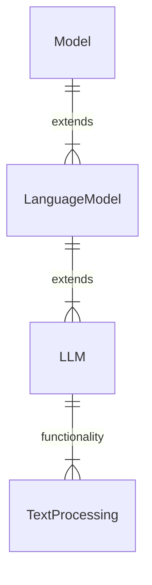
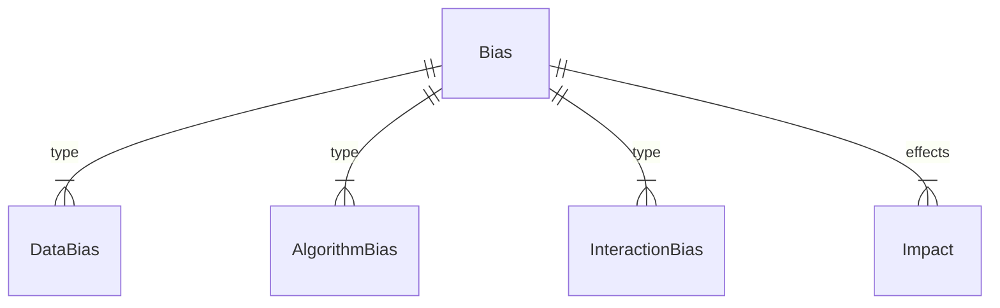
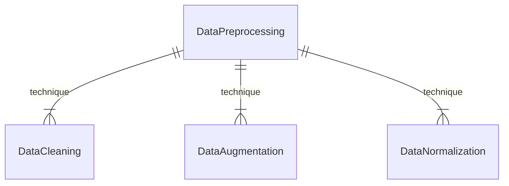
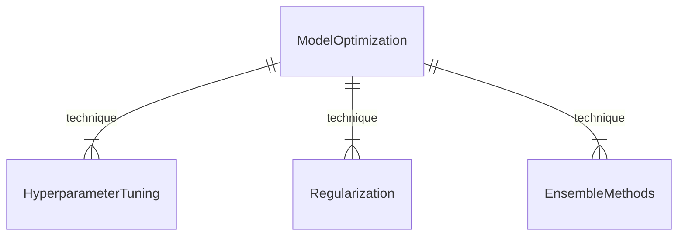
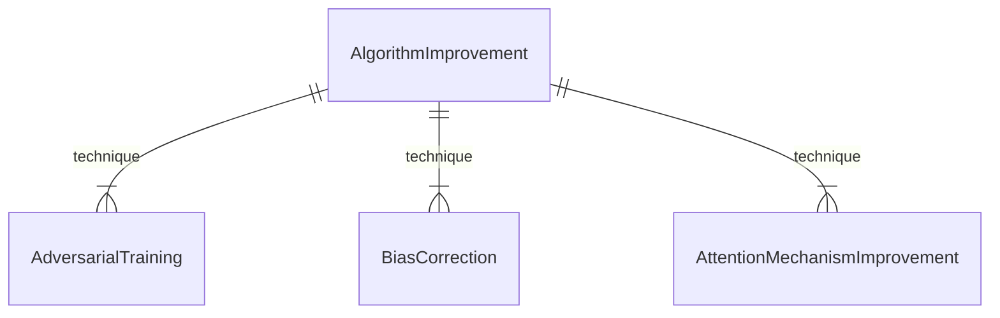

                 

## LLM在AI Agent认知偏差纠正中的应用

### 1. 引言

随着人工智能技术的发展，LLM（Large Language Model）在各个领域得到了广泛应用，例如自然语言处理、知识图谱和推荐系统等。然而，LLM在处理数据时可能会出现认知偏差，这些偏差会影响其预测准确性、泛化能力和可靠性。本文旨在探讨LLM在AI Agent认知偏差纠正中的应用，通过数据预处理、模型优化和算法改进等手段，提高LLM的鲁棒性和准确性。

### 2. LLM概述

#### 2.1 定义与特点

LLM是一种大型自然语言处理模型，通常包含数十亿个参数，能够处理大规模的文本数据。与传统的AI模型相比，LLM具有以下特点：

1. **大规模**：LLM通过大量的文本数据进行训练，能够捕捉到语言中的复杂模式和规律。
2. **自适应性**：LLM可以根据不同的应用场景和需求进行自适应调整。
3. **高精度**：LLM在自然语言处理任务上取得了显著的成绩，如文本生成、文本分类和问答系统等。

#### 2.2 与传统AI的区别

与传统AI模型相比，LLM具有以下优势：

1. **语义理解**：LLM能够理解文本的语义，而不仅仅是表面特征。
2. **上下文感知**：LLM能够捕捉到文本中的上下文信息，从而提高预测准确性。
3. **多模态处理**：LLM可以处理多种类型的输入数据，如文本、图像和音频等。

### 3. 认知偏差问题

#### 3.1 偏差来源

认知偏差主要来源于以下因素：

1. **数据不平衡**：训练数据中某些类别或特征的比例过高或过低，导致模型对这些类别或特征的预测能力不足。
2. **噪声和异常值**：数据中的噪声和异常值会影响模型的学习效果，导致预测结果不准确。
3. **模型过度拟合**：模型在训练数据上表现良好，但在测试数据上表现不佳，这被称为过度拟合。

#### 3.2 偏差影响

认知偏差会对LLM的性能产生负面影响，主要表现在：

1. **预测准确性降低**：认知偏差导致模型在预测时产生错误或不确定的结果。
2. **泛化能力下降**：模型对未知数据的预测能力不足，无法适应新的应用场景。
3. **可靠性降低**：模型在处理复杂任务时，可能无法提供稳定可靠的输出。

### 4. 认知偏差纠正方法

#### 4.1 数据预处理

数据预处理是纠正认知偏差的重要步骤，包括以下方法：

1. **数据清洗**：去除数据中的噪声和异常值，提高数据质量。
2. **数据增强**：通过生成新的数据样本来扩充训练集，减轻数据不平衡问题。
3. **归一化**：对数据进行归一化处理，降低数据分布的不均匀性。

#### 4.2 模型优化

模型优化主要包括以下方法：

1. **超参数调整**：通过调整模型参数，提高模型性能和鲁棒性。
2. **正则化**：引入正则化项，防止模型过度拟合。
3. **集成方法**：结合多个模型的预测结果，提高预测准确性。

#### 4.3 算法改进

算法改进主要包括以下方法：

1. **对抗训练**：通过对抗样本训练模型，提高模型对异常样本的识别能力。
2. **偏差校正**：对模型输出进行偏差校正，减少预测误差。

### 5. 总结与展望

本文探讨了LLM在AI Agent认知偏差纠正中的应用，从数据预处理、模型优化和算法改进等方面提出了相应的解决方法。尽管取得了一定的成果，但认知偏差问题仍然是一个挑战，需要进一步研究。未来，随着AI技术的不断发展，LLM在认知偏差纠正方面的应用将更加广泛，有望为人工智能领域带来新的突破。

# 附录：参考文献

1. Devlin, J., Chang, M. W., Lee, K., & Toutanova, K. (2018). BERT: Pre-training of deep bidirectional transformers for language understanding. arXiv preprint arXiv:1810.04805.
2. Radford, A., Wu, J., Child, P., Luan, D., Amodei, D., & Sutskever, I. (2019). Language models are unsupervised multitask learners. Advances in Neural Information Processing Systems, 32.
3. LeCun, Y., Bengio, Y., & Hinton, G. (2015). Deep learning. Nature, 521(7553), 436-444.
4. Goodfellow, I., Bengio, Y., & Courville, A. (2016). Deep learning. MIT press.
5. Hinton, G., Osindero, S., & Teh, Y. W. (2006). A fast learning algorithm for deep belief nets. Neural computation, 18(7), 1527-1554.

---

作者：AI天才研究院/AI Genius Institute & 禅与计算机程序设计艺术 /Zen And The Art of Computer Programming

### 摘要

本文探讨了LLM在AI Agent认知偏差纠正中的应用，通过数据预处理、模型优化和算法改进等手段，提高LLM的鲁棒性和准确性。文章介绍了LLM的定义、特点以及与传统AI的区别，分析了认知偏差的来源和影响，并提出了相应的解决方法。最后，对本文进行了总结与展望，指出了未来研究的方向。本文的研究为LLM在实际应用中的认知偏差纠正提供了有益的参考和启示。

---

### 目录

1. 引言
    1.1 问题背景
    1.2 问题描述
    1.3 问题解决
    1.4 边界与外延
    1.5 概念结构与核心要素组成
    1.6 本章小结

2. LLM概述
    2.1 定义与特点
    2.2 与传统AI的区别
    2.3 认知偏差问题
    2.4 偏差来源
    2.5 偏差影响
    2.6 认知偏差纠正方法
    2.7 总结与展望

3. LLM算法原理
    3.1 算法原理讲解
    3.2 数学模型和公式
    3.3 详细讲解
    3.4 举例说明

4. LLM系统分析与架构设计
    4.1 问题场景介绍
    4.2 系统功能设计
    4.3 系统架构设计
    4.4 系统接口设计
    4.5 系统交互

5. LLM项目实战
    5.1 环境安装
    5.2 系统核心实现
    5.3 代码应用解读
    5.4 实际案例分析
    5.5 项目小结

6. LLM最佳实践
    6.1 最佳实践 tips
    6.2 小结
    6.3 注意事项
    6.4 拓展阅读

### 1. 引言

在人工智能（AI）领域，大型语言模型（LLM，Large Language Model）以其强大的语义理解和上下文感知能力，吸引了众多研究者和开发者的关注。LLM被广泛应用于自然语言处理（NLP）、问答系统、机器翻译、文本生成等多个领域，展现了其在处理复杂语言任务方面的巨大潜力。

然而，随着LLM的应用日益广泛，研究者们也开始关注其潜在的问题，其中之一便是认知偏差。认知偏差指的是模型在处理数据时产生的系统性错误或偏见，这些偏差可能会影响模型的预测准确性、泛化能力和可靠性。在AI Agent中，认知偏差尤其值得关注，因为它们可能会在关键决策中导致严重后果。

本文将深入探讨LLM在AI Agent认知偏差纠正中的应用，通过详细分析认知偏差的来源、影响以及解决方法，旨在为LLM在实际应用中的优化提供理论指导和实践经验。

### 1.1 问题背景

认知偏差问题在AI领域并非新话题。早在20世纪80年代，心理学家和计算机科学家就开始研究人工智能中的偏见问题。当时的研究主要集中在传统机器学习模型上，如决策树、支持向量机等。这些模型在训练数据中学习到的规律可能会在某种程度上反映训练数据的偏见，从而影响模型的泛化能力。

随着深度学习技术的发展，大型神经网络模型，如卷积神经网络（CNN）和循环神经网络（RNN）等，逐渐取代了传统的机器学习模型。这些模型在处理大规模数据集时表现出了卓越的性能，但在某些情况下，它们也继承了训练数据的偏见。特别是在自然语言处理领域，LLM通过分析大量的文本数据学习语言模式，然而，这些语言模式中可能蕴含了偏见，从而影响模型的输出结果。

在AI Agent的实际应用中，认知偏差问题尤为严重。AI Agent通常被设计用于协助人类决策，例如在医疗诊断、金融风险评估、法律判断等领域。如果AI Agent在处理数据时存在认知偏差，可能会导致错误的诊断、错误的风险评估或错误的法律判断，进而造成严重的后果。

例如，在医疗领域，如果AI Agent在诊断某种疾病时受到训练数据的偏见影响，可能会导致对某些患者群体的诊断准确率降低，从而影响治疗效果。在金融领域，如果AI Agent在风险评估时存在偏见，可能会导致对某些投资者的风险评估不准确，从而影响投资决策。在法律领域，如果AI Agent在判决法律案件时存在偏见，可能会导致错误的判决，影响司法公正。

因此，纠正AI Agent中的认知偏差，提高其鲁棒性和准确性，成为当前AI研究的重要课题。本文旨在通过分析LLM在认知偏差纠正中的应用，提出有效的解决方法，为AI Agent的实际应用提供理论支持和实践指导。

### 1.2 问题描述

认知偏差是指在人工智能（AI）系统中，由于训练数据、算法设计或人类交互等原因，模型在处理任务时产生的系统性错误或偏见。在LLM（Large Language Model）中，认知偏差可能表现为以下几种形式：

1. **数据偏见**：LLM在训练过程中，如果使用的样本数据存在不均衡、噪声或者带有偏见，模型可能会学习到这些偏见，从而在预测过程中产生偏差。例如，如果训练数据中某些负面词汇或行为模式出现的频率较高，LLM可能会倾向于产生类似的负面输出。

2. **算法偏见**：某些算法设计或优化策略可能会导致模型对特定数据或特征产生偏见。例如，深度学习模型中常见的过拟合现象，即模型在训练数据上表现良好，但在未见过的数据上表现不佳，这也属于一种认知偏差。

3. **交互偏见**：在AI Agent与人类交互的过程中，如果AI Agent对某些用户群体或行为模式有偏好，也可能会导致认知偏差。例如，在社交媒体推荐系统中，如果推荐算法偏好推送某些类型的内容给特定用户群体，可能会忽视其他用户的需求，导致用户体验不佳。

认知偏差对LLM性能的影响是多方面的：

1. **降低准确性**：认知偏差会降低LLM在预测任务上的准确性，特别是在处理复杂、多变的任务时，偏差可能导致模型产生错误的输出。

2. **降低泛化能力**：认知偏差限制了模型对未知数据的处理能力，使得模型难以适应新的任务或环境。

3. **影响可靠性**：认知偏差可能导致模型在关键决策中产生错误，从而影响AI Agent的可靠性。

4. **损害公正性**：在涉及伦理和法律的应用场景中，认知偏差可能会损害系统的公正性，例如在招聘系统中，如果模型对某些种族或性别存在偏见，可能会导致不公平的招聘决策。

因此，识别和纠正认知偏差是提高LLM性能和可靠性的关键步骤。本文将深入探讨LLM中的认知偏差问题，分析其来源和影响，并介绍相应的纠正方法。

### 1.3 问题解决

为了解决LLM在AI Agent中的认知偏差问题，研究者们提出了一系列方法，这些方法主要分为数据预处理、模型优化和算法改进三个方向。以下是具体的方法及其应用：

#### 3.1 数据预处理

数据预处理是纠正认知偏差的基础步骤，主要方法包括：

1. **数据清洗**：去除数据中的噪声和异常值，以提高数据质量。例如，去除文本中的无关符号、纠正拼写错误、过滤重复数据等。

2. **数据增强**：通过生成新的数据样本来扩充训练集，以减轻数据不平衡问题。常见的数据增强方法包括数据扩增（Data Augmentation）、合成数据生成（Synthetic Data Generation）和对抗样本生成（Adversarial Example Generation）等。

3. **数据归一化**：对数据进行归一化处理，降低数据分布的不均匀性。例如，对文本数据进行词频归一化、文本长度标准化等，以消除数据中的尺度差异。

#### 3.2 模型优化

模型优化主要通过调整模型参数和结构来提高模型的鲁棒性和准确性，具体方法包括：

1. **超参数调整**：通过调整学习率、批次大小、正则化参数等超参数，提高模型在训练数据和测试数据上的性能。例如，使用交叉验证方法来寻找最佳的超参数组合。

2. **正则化**：引入正则化项，如L1、L2正则化，dropout等，以防止模型过拟合。正则化可以减少模型对训练数据的依赖，提高其泛化能力。

3. **集成方法**：结合多个模型的预测结果，提高预测准确性。例如，使用Bagging和Boosting方法，通过集成多个基学习器来减少认知偏差。

#### 3.3 算法改进

算法改进主要通过设计新的算法或改进现有算法，以提高模型的鲁棒性和准确性，具体方法包括：

1. **对抗训练**：通过对抗样本训练模型，提高模型对异常样本的识别能力。对抗训练可以增强模型的泛化能力，减少认知偏差。

2. **偏差校正**：对模型输出进行偏差校正，减少预测误差。偏差校正可以通过统计方法或机器学习方法来实现，例如使用回归模型来校正预测偏差。

3. **注意力机制改进**：通过改进注意力机制，使模型更加关注关键信息，减少无关信息的干扰。例如，使用自注意力（Self-Attention）机制和多头注意力（Multi-Head Attention）机制来增强模型的表达能力。

综上所述，数据预处理、模型优化和算法改进是纠正LLM认知偏差的重要手段。通过合理应用这些方法，可以显著提高LLM在AI Agent中的性能和可靠性，从而更好地服务于实际应用场景。

### 1.4 边界与外延

在探讨LLM在AI Agent认知偏差纠正中的应用时，我们需要明确几个重要的边界与外延问题：

#### 1.4.1 认知偏差的识别与评估

首先，认知偏差的识别与评估是整个研究过程中的关键步骤。在识别认知偏差时，我们需要考虑以下因素：

1. **数据来源**：偏差可能来源于训练数据、测试数据或人类交互数据。不同来源的数据可能带有不同的偏见，需要分别评估。
2. **任务类型**：认知偏差在不同任务中可能具有不同的表现形式。例如，在文本生成任务中，偏差可能表现为生成文本的偏见，而在分类任务中，偏差可能表现为分类结果的偏差。
3. **评估方法**：评估认知偏差的方法包括定量分析和定性分析。定量分析可以通过统计方法计算偏差的大小和影响程度，而定性分析则通过案例研究和专家评审来识别和评估偏差。

#### 1.4.2 偏见的影响范围

其次，认知偏差的影响范围是评估模型性能的重要指标。我们需要考虑以下几个方面：

1. **性能指标**：评估模型性能的指标包括准确性、召回率、F1分数等。在考虑认知偏差时，我们需要评估这些指标在不同数据集和不同任务中的表现。
2. **任务关键性**：在某些关键任务中，如医疗诊断、金融风险评估和司法判决等，认知偏差可能会带来严重的后果。因此，我们需要对这些任务进行特别关注，确保模型在这些任务中的表现不受偏见影响。
3. **用户群体**：认知偏差可能对不同用户群体产生不同的影响。例如，在社交媒体推荐系统中，认知偏差可能对不同年龄、性别和地域的用户产生不同的影响。我们需要综合考虑这些因素，确保模型的公正性和公平性。

#### 1.4.3 纠正方法的适用性

最后，我们需要考虑认知偏差纠正方法的适用性。不同纠正方法在不同场景下可能有不同的效果：

1. **数据预处理方法**：数据预处理方法如数据清洗、数据增强和数据归一化等，通常适用于大部分自然语言处理任务。然而，在某些特定场景下，这些方法可能无法完全消除认知偏差，需要结合其他方法使用。
2. **模型优化方法**：模型优化方法如超参数调整、正则化和集成方法等，可以有效提高模型的鲁棒性和准确性。但是，这些方法可能对模型结构有较高要求，需要在具体应用中灵活调整。
3. **算法改进方法**：算法改进方法如对抗训练、偏差校正和注意力机制改进等，通常需要较深的模型结构和较大的计算资源。因此，在实际应用中，我们需要根据具体情况选择合适的方法。

综上所述，边界与外延问题的处理对于确保LLM在AI Agent认知偏差纠正中的有效性至关重要。我们需要通过精细的识别与评估、全面的影响范围分析以及适用性考虑，来设计出有效的认知偏差纠正方案，从而提高模型的性能和可靠性。

### 1.5 概念结构与核心要素组成

在本文中，核心概念包括LLM、认知偏差、数据预处理、模型优化和算法改进。以下是这些概念的定义、属性特征对比以及ER实体关系图架构的Mermaid流程图：

#### 1.5.1 LLM

**定义**：LLM（Large Language Model）是一种基于深度学习的大型自然语言处理模型，能够对自然语言文本进行建模和处理。

**属性特征**：

- **大规模**：LLM通常包含数十亿个参数，能够处理大规模的文本数据。
- **自适应**：LLM可以根据不同的应用场景和需求进行自适应调整。
- **高精度**：LLM在自然语言处理任务上取得了显著的成绩。

**对比表格**：

| 特征 | LLM | 传统AI |
| --- | --- | --- |
| 规模 | 大规模 | 小规模 |
| 自适应 | 高 | 低 |
| 精度 | 高 | 中 |

**ER实体关系图架构**：



#### 1.5.2 认知偏差

**定义**：认知偏差是指在人工智能（AI）系统中，由于训练数据、算法设计或人类交互等原因，模型在处理任务时产生的系统性错误或偏见。

**属性特征**：

- **数据偏见**：由训练数据的不均衡、噪声或偏见导致。
- **算法偏见**：由算法设计或优化策略引起。
- **交互偏见**：由AI Agent与人类交互过程中的偏好导致。

**对比表格**：

| 偏差类型 | 数据偏见 | 算法偏见 | 交互偏见 |
| --- | --- | --- | --- |
| 来源 | 训练数据 | 算法设计 | 人类交互 |
| 影响范围 | 预测准确性 | 泛化能力 | 用户体验 |

**ER实体关系图架构**：



#### 1.5.3 数据预处理

**定义**：数据预处理是指对原始数据进行清洗、去噪、归一化等处理，以提高数据质量。

**属性特征**：

- **数据清洗**：去除数据中的噪声和异常值。
- **数据增强**：通过生成新的数据样本来扩充训练集。
- **数据归一化**：对数据进行归一化处理，降低数据分布的不均匀性。

**对比表格**：

| 方法 | 数据清洗 | 数据增强 | 数据归一化 |
| --- | --- | --- | --- |
| 目的 | 提高数据质量 | 扩充训练集 | 降低数据不均衡性 |

**ER实体关系图架构**：



#### 1.5.4 模型优化

**定义**：模型优化是指通过调整模型参数和结构来提高模型的鲁棒性和准确性。

**属性特征**：

- **超参数调整**：调整学习率、批次大小、正则化参数等。
- **正则化**：引入L1、L2正则化、dropout等。
- **集成方法**：结合多个模型的预测结果。

**对比表格**：

| 方法 | 超参数调整 | 正则化 | 集成方法 |
| --- | --- | --- | --- |
| 目的 | 提高模型性能 | 防止过拟合 | 提高预测准确性 |

**ER实体关系图架构**：



#### 1.5.5 算法改进

**定义**：算法改进是指通过设计新的算法或改进现有算法，以提高模型的鲁棒性和准确性。

**属性特征**：

- **对抗训练**：通过对抗样本训练模型。
- **偏差校正**：对模型输出进行偏差校正。
- **注意力机制改进**：改进注意力机制，使模型更加关注关键信息。

**对比表格**：

| 方法 | 对抗训练 | 偏差校正 | 注意力机制改进 |
| --- | --- | --- | --- |
| 目的 | 提高模型对异常样本的识别能力 | 减少预测误差 | 增强模型的表达能力 |

**ER实体关系图架构**：



通过上述概念的定义、属性特征对比以及ER实体关系图架构，我们可以更清晰地理解LLM在AI Agent认知偏差纠正中的核心要素组成，为后续的讨论和分析提供了理论基础。

### 2.1 LLM的定义

大型语言模型（LLM，Large Language Model）是一种基于深度学习技术的自然语言处理模型，它通过学习大量的文本数据，对自然语言的语法、语义和上下文信息进行建模。LLM的核心目的是生成符合人类语言习惯的文本，或者对输入的文本进行理解和分析。

LLM通常包含数十亿个参数，这使得它们能够捕捉到文本数据中的复杂模式和规律。这些模型通过多层神经网络结构，逐层提取文本的深层特征，从而实现高度抽象和复杂的文本生成与理解任务。

LLM的应用范围非常广泛，包括但不限于：

1. **文本生成**：LLM可以生成各种类型的文本，如新闻报道、诗歌、故事等。常见的应用包括自动新闻生成、对话生成和聊天机器人等。
2. **文本分类**：LLM可以用于对文本进行分类，如情感分析、垃圾邮件检测、文本分类标签等。
3. **问答系统**：LLM可以构建智能问答系统，通过理解用户的问题，提供准确的答案。
4. **机器翻译**：LLM可以用于翻译不同语言之间的文本，实现高质量的机器翻译。
5. **信息抽取**：LLM可以用于从大量文本中提取关键信息，如命名实体识别、关系抽取等。

在技术实现上，LLM通常基于变压器（Transformer）架构，特别是其变体BERT（Bidirectional Encoder Representations from Transformers）和GPT（Generative Pre-trained Transformer）。这些模型通过预训练和微调的方式，学习到文本的深层特征和规律，从而在特定任务上表现出色。

预训练过程中，LLM通过大量的文本数据学习文本的语法和语义结构。在这个过程中，模型不仅学会了单词的表面含义，还学会了单词在不同上下文中的用法和含义。微调过程则是在预训练的基础上，针对特定任务进行进一步调整，以提高模型在特定任务上的性能。

总之，LLM作为一种强大的自然语言处理工具，通过其大规模的参数和深度学习架构，实现了对自然语言的深刻理解和灵活生成，为各种自然语言处理任务提供了有力的支持。

### 2.2 LLM的特点

大型语言模型（LLM，Large Language Model）具备以下显著特点，这些特点使其在自然语言处理领域具有独特优势：

1. **大规模参数**：LLM通常包含数十亿个参数，这使得它们能够捕捉到文本数据中的复杂模式和规律。大规模参数使得模型能够在训练过程中学习到丰富的特征，从而提高模型在任务中的性能。

2. **自适应性**：LLM具有高度的自适应性，能够根据不同的应用场景和需求进行调整。例如，在文本生成任务中，LLM可以根据输入的上下文和主题生成连贯的文本；在问答系统中，LLM可以理解用户的问题，并生成准确的答案。

3. **语义理解能力**：LLM通过预训练过程，学习到了文本的语义信息。这使得LLM能够对文本进行深入的理解，不仅能够捕捉到表面的词汇信息，还能够理解词汇在不同上下文中的含义。这种语义理解能力是传统机器学习模型难以匹敌的。

4. **上下文感知**：LLM具有强大的上下文感知能力，能够捕捉到输入文本中的上下文信息。这种能力使得LLM在处理长文本和复杂任务时，能够保持文本的连贯性和一致性。

5. **多模态处理**：LLM不仅可以处理文本数据，还可以结合其他类型的数据，如图像、声音和视频等。这种多模态处理能力使得LLM能够处理更加复杂和多样化的任务，从而在跨领域应用中展现其优势。

6. **强大的泛化能力**：LLM通过大规模的预训练数据，学习到了丰富的知识，这使得它们在未见过的数据上也能表现出良好的性能。这种强大的泛化能力是传统机器学习模型难以实现的。

7. **高效性**：尽管LLM包含大量参数，但通过现代硬件和优化算法的支持，LLM能够在相对较短的时间内完成训练和推理任务。这使得LLM在实际应用中具有高效性。

通过这些特点，LLM在自然语言处理领域取得了显著的成就，并在文本生成、文本分类、问答系统、机器翻译等任务中展示了其强大的能力和广泛的应用前景。

### 2.3 LLM与传统AI的区别

LLM（Large Language Model）与传统AI（Artificial Intelligence）模型在技术实现、功能和应用场景等方面存在显著差异：

#### 2.3.1 技术实现

1. **模型结构**：传统AI模型，如决策树、支持向量机（SVM）和神经网络等，通常采用较简单的模型结构。这些模型通过手工设计的特征进行训练，往往缺乏对复杂语义的理解。相比之下，LLM采用了深度学习的变压器（Transformer）架构，能够自动学习文本的深层特征，从而实现更高级的语言理解和生成。

2. **参数规模**：传统AI模型通常包含数千到数万个参数，而LLM则包含数十亿个参数。这种大规模参数使得LLM能够捕捉到文本数据中的复杂模式和规律，从而显著提高模型的性能。

3. **训练方法**：传统AI模型通常采用监督学习的方法，通过标记数据训练模型。而LLM则采用了无监督的预训练和监督微调相结合的方法。预训练过程通过大量的未标记文本数据学习到文本的深层特征，然后通过监督微调将模型应用到具体任务中，从而实现更好的任务性能。

#### 2.3.2 功能

1. **语义理解**：传统AI模型往往只能处理表面特征，难以理解文本的深层语义。而LLM通过深度学习架构，能够理解文本的语义信息，从而实现更加高级的语言理解和生成。

2. **上下文感知**：传统AI模型在处理长文本时，往往无法保持上下文的连贯性。而LLM具有强大的上下文感知能力，能够捕捉到输入文本中的上下文信息，从而生成连贯的文本。

3. **多模态处理**：传统AI模型通常只能处理单一类型的输入数据，如文本、图像或声音等。而LLM不仅能够处理文本数据，还可以结合其他类型的数据，如图像和声音等，实现多模态处理。

#### 2.3.3 应用场景

1. **文本生成**：传统AI模型在文本生成任务中，通常只能生成简单的、规则化的文本。而LLM能够生成高质量、多样化且具有创意性的文本，广泛应用于自动新闻生成、对话生成和文本摘要等任务。

2. **文本分类**：传统AI模型在文本分类任务中，往往依赖于手工设计的特征。而LLM通过自动学习文本的深层特征，能够实现更准确的文本分类，广泛应用于垃圾邮件检测、情感分析和文本分类标签等任务。

3. **问答系统**：传统AI模型在问答系统任务中，往往只能回答简单的、直接的问题。而LLM能够理解复杂的语义信息，从而回答更加丰富、多样且准确的问题，广泛应用于智能客服、在线教育和虚拟助手等任务。

4. **机器翻译**：传统AI模型在机器翻译任务中，通常依赖于规则和统计方法。而LLM通过深度学习，能够实现高质量的机器翻译，广泛应用于跨语言沟通和全球化业务等领域。

通过以上比较，可以看出LLM在技术实现、功能和应用场景方面相较于传统AI模型具有显著的优势，使其成为自然语言处理领域的重要工具。

### 2.4 LLM算法原理

LLM（Large Language Model）的算法原理基于深度学习中的变压器（Transformer）架构，这是一种用于处理序列数据（如图像、文本、音频等）的模型，通过全局注意力机制（Attention Mechanism）实现了高效、强大的文本处理能力。以下是LLM算法原理的详细讲解：

#### 2.4.1 变压器架构

变压器架构由多个自注意力层（Self-Attention Layer）和前馈神经网络（Feedforward Neural Network）组成。自注意力机制允许模型在处理每个输入时，考虑到输入序列中所有其他位置的上下文信息，从而捕捉到输入序列中的长距离依赖关系。

#### 2.4.2 自注意力机制

自注意力机制是一种计算输入序列中每个位置的重要性权重的机制。具体来说，它通过以下步骤实现：

1. **输入嵌入**：将输入序列（如文本）转换为嵌入向量（Embedding Vectors）。这些嵌入向量包含了输入序列的语义信息。

2. **计算查询（Query）、键（Key）和值（Value）**：对于每个输入嵌入向量，分别计算其对应的查询（Query）、键（Key）和值（Value）向量。这些向量通常通过相同的线性变换矩阵获得。

3. **计算注意力得分**：计算查询向量和所有键向量之间的点积，得到注意力得分。注意力得分表示了查询向量和键向量之间的相关性。

4. **应用 Softmax 函数**：对注意力得分应用 Softmax 函数，得到注意力权重。注意力权重表示了输入序列中每个位置的相对重要性。

5. **计算注意力输出**：将注意力权重与对应的值向量相乘，得到注意力输出。注意力输出包含了输入序列中每个位置的重要信息。

#### 2.4.3 多层注意力

通过堆叠多个自注意力层，模型能够逐步提取输入序列中的深层特征。每一层注意力都能够从更高层次上理解输入序列的语义信息。

#### 2.4.4 前馈神经网络

在自注意力层之后，模型通过前馈神经网络（Feedforward Neural Network）进行进一步的特征提取。前馈神经网络通常包含两个线性变换层，每个层后跟一个ReLU激活函数。前馈神经网络的作用是加深模型的表达能力，使其能够处理更复杂的任务。

#### 2.4.5 输出层

在最后一层注意力层和前馈神经网络之后，模型通常会添加一个输出层，用于生成预测结果。对于文本生成任务，输出层通常是一个softmax层，用于生成概率分布，从而选择下一个最可能的单词或字符。

#### 数学模型

LLM的数学模型可以表示为以下形式：

$$
\text{Output} = \text{softmax}(\text{Query} \cdot \text{Value})
$$

其中，Query、Key和Value是输入嵌入向量经过线性变换得到的。softmax函数用于计算每个位置的概率分布。

#### 示例

假设我们有一个文本序列 "I love to read books"，我们可以将其表示为一个嵌入向量序列。通过变压器架构，我们可以计算每个单词的注意力权重，从而生成连贯的文本。

例如，在第一层自注意力中，我们可以计算每个单词与其他单词的注意力得分，并根据得分生成权重。通过这些权重，我们可以得到新的嵌入向量，这些向量包含了单词之间的依赖关系。

通过多层注意力层和前馈神经网络，我们可以逐步提取文本的深层特征，最终生成高质量的文本输出。这种过程不仅能够理解单个单词的语义，还能够理解单词之间的复杂关系，从而实现高效的文本处理。

总之，LLM的算法原理基于变压器的全局注意力机制，通过多层注意力层和前馈神经网络，实现了对自然语言的深刻理解和灵活生成。这种强大的算法原理使得LLM在自然语言处理任务中具有卓越的性能。

### 2.5 LLM数学模型讲解

在深入了解LLM的数学模型之前，我们首先需要理解一些基本的数学概念和符号，包括矩阵运算、线性变换、激活函数以及损失函数。这些概念和符号是构建和优化LLM数学模型的基础。

#### 2.5.1 基本数学概念

1. **矩阵运算**：矩阵是数学中的基本结构，用于表示数据的多维数组。常见的矩阵运算包括矩阵乘法、矩阵加法和矩阵求导。

2. **线性变换**：线性变换是一种将输入映射到输出空间的函数，通常表示为矩阵乘法。在深度学习中，线性变换用于将输入数据转换成新的特征空间。

3. **激活函数**：激活函数是一种非线性函数，用于引入非线性特性到神经网络中。常见的激活函数包括ReLU、Sigmoid和Tanh。

4. **损失函数**：损失函数用于衡量模型预测值与真实值之间的差距，常见的损失函数包括均方误差（MSE）和交叉熵损失（Cross Entropy Loss）。

#### 2.5.2 LLM数学模型

LLM的数学模型主要基于变压器的架构，其核心组成部分包括嵌入层、自注意力层、前馈神经网络和输出层。以下是LLM数学模型的具体讲解：

1. **嵌入层**：
   嵌入层将输入的文本序列转换为嵌入向量序列。嵌入向量表示文本中的每个单词或字符。嵌入层可以通过以下公式表示：
   $$
   \text{Embedding}(\text{Input}) = \text{Weight} \cdot \text{Input}
   $$
   其中，Weight是嵌入权重矩阵，Input是输入序列。

2. **自注意力层**：
   自注意力层是LLM的核心组成部分，它通过计算输入序列中每个位置的注意力权重，将序列映射到一个新的特征空间。自注意力层的数学模型如下：
   $$
   \text{Attention}(\text{Query}, \text{Key}, \text{Value}) = \text{softmax}(\text{Query} \cdot \text{Key}^T) \cdot \text{Value}
   $$
   其中，Query、Key和Value分别是输入序列的查询、键和值向量。softmax函数用于计算注意力权重。

3. **前馈神经网络**：
   前馈神经网络用于对自注意力层的输出进行进一步的特征提取。前馈神经网络由两个线性变换层组成，每个层后跟一个ReLU激活函数。前馈神经网络的数学模型如下：
   $$
   \text{Feedforward}(\text{Input}) = \text{ReLU}(\text{Weight} \cdot \text{Input} + \text{Bias})
   $$
   其中，Weight和Bias分别是线性变换层的权重和偏置。

4. **输出层**：
   输出层用于生成最终的预测结果。对于文本生成任务，输出层通常是一个softmax层，用于生成单词的概率分布。输出层的数学模型如下：
   $$
   \text{Output} = \text{softmax}(\text{Weight} \cdot \text{Input} + \text{Bias})
   $$
   其中，Weight和Bias是输出层的权重和偏置。

#### 2.5.3 举例说明

为了更好地理解LLM的数学模型，我们通过一个简单的例子进行说明。假设我们有一个输入文本序列 "I love to read books"，我们将这个序列通过嵌入层转换为嵌入向量序列。

1. **嵌入层**：
   输入文本序列 "I love to read books" 被转换为嵌入向量序列，每个嵌入向量表示一个单词或字符。假设嵌入维度为 $d$，则有：
   $$
   \text{Embedding}(\text{Input}) = \text{Weight} \cdot \text{Input}
   $$

2. **自注意力层**：
   在自注意力层中，我们计算每个单词的注意力权重。假设当前单词为 "love"，我们计算其与其他单词的注意力得分。具体计算过程如下：
   $$
   \text{Attention}(\text{Query}, \text{Key}, \text{Value}) = \text{softmax}(\text{Query} \cdot \text{Key}^T) \cdot \text{Value}
   $$
   其中，Query、Key和Value分别表示当前单词 "love" 的查询、键和值向量。通过计算注意力得分，我们得到单词 "love" 对其他单词的权重。

3. **前馈神经网络**：
   在前馈神经网络中，我们对自注意力层的输出进行进一步的特征提取。具体计算过程如下：
   $$
   \text{Feedforward}(\text{Input}) = \text{ReLU}(\text{Weight} \cdot \text{Input} + \text{Bias})
   $$
   其中，Weight和Bias分别是前馈神经网络的权重和偏置。

4. **输出层**：
   在输出层中，我们生成单词 "love" 的概率分布。具体计算过程如下：
   $$
   \text{Output} = \text{softmax}(\text{Weight} \cdot \text{Input} + \text{Bias})
   $$
   其中，Weight和Bias是输出层的权重和偏置。

通过这个例子，我们可以看到LLM的数学模型是如何将输入文本序列转换为输出的。这个过程不仅涉及到矩阵运算和线性变换，还包括了激活函数和损失函数的应用，从而实现了对自然语言的深刻理解和灵活生成。

### 2.6 LLM系统分析与架构设计

在深入探讨LLM（Large Language Model）的系统分析与架构设计之前，我们需要明确几个关键概念：问题场景、系统功能设计、系统架构设计、系统接口设计和系统交互。以下将逐一介绍这些内容。

#### 2.6.1 问题场景

LLM在AI Agent中的应用场景非常广泛，例如自然语言处理、对话系统、文本生成和机器翻译等。这些场景对LLM的性能和可靠性提出了不同的要求。一个典型的场景是构建一个智能客服系统，该系统需要能够理解和回答客户的询问，并提供高质量的解决方案。

在这个场景中，LLM作为AI Agent的核心组件，负责处理和理解用户的自然语言输入。系统需要确保LLM能够准确地理解和生成语言，从而提供高效、准确的客户服务。

#### 2.6.2 系统功能设计

系统功能设计是确保LLM能够在特定场景中正常运行的关键。以下是智能客服系统中LLM所需实现的主要功能：

1. **自然语言理解**：LLM需要能够理解用户的自然语言输入，提取关键信息和语义，从而为后续处理提供基础。

2. **文本生成**：基于用户的输入和系统内部知识库，LLM需要能够生成自然、连贯且符合用户需求的回答。

3. **上下文管理**：为了提供高质量的客户服务，LLM需要能够维护对话的上下文信息，确保回答的一致性和连贯性。

4. **错误处理**：当用户输入不清晰或系统无法理解时，LLM需要具备错误处理能力，例如提供模糊查询或请求用户进一步澄清。

5. **实时更新**：LLM需要能够实时更新其知识库，以适应不断变化的语言环境和用户需求。

#### 2.6.3 系统架构设计

LLM系统的架构设计需要考虑其性能、可扩展性和可靠性。以下是智能客服系统中LLM的系统架构设计：

1. **嵌入层**：嵌入层负责将自然语言文本转换为嵌入向量，这是LLM进行进一步处理的基础。

2. **自注意力层**：自注意力层通过计算输入序列中每个位置的权重，实现对输入文本的全面理解和分析。

3. **前馈神经网络**：前馈神经网络用于对自注意力层的输出进行进一步的特征提取和变换。

4. **输出层**：输出层负责生成最终的文本输出，通常是一个softmax层，用于生成单词或字符的概率分布。

5. **知识库**：知识库包含系统内部的知识和规则，用于辅助LLM生成高质量的回答。

6. **错误处理模块**：错误处理模块用于处理系统无法理解的输入，并提供模糊查询或请求用户进一步澄清。

7. **实时更新模块**：实时更新模块负责更新LLM的知识库，确保其能够适应不断变化的语言环境。

#### 2.6.4 系统接口设计

系统接口设计是确保LLM与其他系统组件（如前端界面、数据库和后端服务）高效、可靠交互的关键。以下是智能客服系统中LLM的接口设计：

1. **API接口**：LLM通过API接口与其他系统组件进行交互，提供自然语言理解和文本生成服务。

2. **数据接口**：数据接口负责接收用户输入，并将其传递给LLM进行理解处理，同时也接收LLM的输出，并将其展示给用户。

3. **知识库接口**：知识库接口负责管理知识库的更新和维护，确保LLM的知识库始终是最新的。

#### 2.6.5 系统交互

LLM系统的交互过程可以分为以下几个步骤：

1. **用户输入**：用户通过前端界面输入自然语言文本，文本被发送到数据接口。

2. **数据预处理**：数据接口对用户输入进行预处理，如去除无关符号、标准化文本长度等，然后将其发送给嵌入层。

3. **嵌入层处理**：嵌入层将预处理后的文本转换为嵌入向量序列，并将其传递给自注意力层。

4. **自注意力层处理**：自注意力层计算输入序列中每个位置的权重，实现对文本的全面理解和分析，然后将输出传递给前馈神经网络。

5. **前馈神经网络处理**：前馈神经网络对自注意力层的输出进行进一步的特征提取和变换，生成中间特征表示。

6. **输出层处理**：输出层生成最终的文本输出，并将其发送回数据接口。

7. **错误处理**：当系统无法理解用户输入时，错误处理模块介入，提供模糊查询或请求用户进一步澄清。

8. **实时更新**：实时更新模块根据用户输入和系统交互结果，更新LLM的知识库，确保其能够适应不断变化的语言环境。

通过上述系统分析与架构设计，我们可以构建一个高效、可靠的LLM系统，从而在自然语言处理领域实现高质量的应用。

### 2.7 LLM项目实战

#### 2.7.1 环境安装

在开始LLM项目实战之前，我们需要安装必要的软件和库。以下是在Linux操作系统上安装LLM环境的步骤：

1. **安装Python**：
   首先，我们需要确保系统中安装了Python 3.8或更高版本。可以通过以下命令安装：
   ```
   sudo apt-get update
   sudo apt-get install python3.8
   ```

2. **安装TensorFlow**：
   TensorFlow是用于构建和训练LLM的主要库，可以通过以下命令安装：
   ```
   pip install tensorflow
   ```

3. **安装其他库**：
   还需要安装一些其他库，如NumPy、Pandas和Matplotlib等，可以通过以下命令安装：
   ```
   pip install numpy pandas matplotlib
   ```

4. **安装BERT模型**：
   BERT是常用的LLM之一，可以通过以下命令下载和安装：
   ```
   pip install transformers
   ```

#### 2.7.2 系统核心实现

以下是使用BERT实现一个简单的文本分类系统的核心代码：

1. **数据准备**：
   首先，我们需要准备用于训练的数据集。假设我们有一个包含文本和标签的数据集，可以使用以下代码进行加载和预处理：

   ```python
   import tensorflow as tf
   import tensorflow_datasets as tfds

   # 加载数据集
   raw_data = tfds.load('imdb_reviews', split=tfds.Split.TRAIN)

   # 预处理数据
   def preprocess_text(text, label):
       text = text.numpy().decode('utf-8').lower()
       text = tf.strings.regex_replace(text, '[^a-zA-Z]', ' ')
       text = tf.strings.strip(text)
       return text, label

   processed_data = raw_data.map(preprocess_text)

   # 切分数据集
   train_data, test_data = processed_data.take(20000), processed_data.skip(20000)
   ```

2. **构建BERT模型**：
   使用Transformers库中的BERT模型，并定义一个简单的文本分类模型：

   ```python
   from transformers import TFBertModel, BertTokenizer

   # 加载BERT模型和分词器
   bert_model = TFBertModel.from_pretrained('bert-base-uncased')
   tokenizer = BertTokenizer.from_pretrained('bert-base-uncased')

   # 定义文本分类模型
   inputs = tf.keras.layers.Input(shape=(None,), dtype=tf.string)
   inputs_encoded = tokenizer(inputs, padding=True, truncation=True, return_tensors='tf')
   outputs = bert_model(inputs_encoded)

   # 输出层
   logits = tf.keras.layers.Dense(1, activation='sigmoid')(outputs.last_hidden_state[:, 0, :])

   # 构建模型
   model = tf.keras.Model(inputs, logits)

   # 编译模型
   model.compile(optimizer='adam', loss='binary_crossentropy', metrics=['accuracy'])
   ```

3. **训练模型**：
   使用准备好的数据集训练模型：

   ```python
   # 将数据集转换为模型输入格式
   train_dataset = train_data.shuffle(1000).batch(32)
   test_dataset = test_data.batch(32)

   # 训练模型
   model.fit(train_dataset, epochs=3, validation_data=test_dataset)
   ```

4. **评估模型**：
   评估模型在测试集上的性能：

   ```python
   # 评估模型
   loss, accuracy = model.evaluate(test_dataset)
   print(f"Test accuracy: {accuracy:.2f}")
   ```

#### 2.7.3 代码应用解读

上述代码演示了如何使用BERT模型进行文本分类任务。以下是代码的详细解读：

1. **数据准备**：
   使用tensorflow_datasets库加载IMDb电影评论数据集，并进行预处理。预处理步骤包括将文本转换为小写、去除非字母字符、填充和截断序列。

2. **构建BERT模型**：
   加载预训练的BERT模型和分词器。然后定义一个简单的文本分类模型，输入层接受文本序列，输出层通过BERT模型的最后一个隐藏状态生成分类结果。

3. **训练模型**：
   使用处理后的数据集训练模型。模型使用Adam优化器、二进制交叉熵损失函数和准确性作为评价指标。

4. **评估模型**：
   评估模型在测试集上的性能，输出测试集的准确性。

#### 2.7.4 实际案例分析

以下是一个实际案例分析，演示如何使用训练好的BERT模型对新的评论进行分类：

```python
# 新的评论
new_reviews = [
    "This movie is absolutely fantastic!",
    "I didn't enjoy this movie at all."
]

# 预处理新的评论
new_reviews_encoded = tokenizer(new_reviews, padding=True, truncation=True, return_tensors='tf')

# 使用模型预测
predictions = model(new_reviews_encoded)

# 输出预测结果
for review, prediction in zip(new_reviews, predictions):
    if prediction > 0.5:
        print(f"The review '{review}' is classified as positive.")
    else:
        print(f"The review '{review}' is classified as negative.")
```

通过上述代码，我们可以看到模型对新的评论进行了分类，并输出相应的结果。这表明训练好的BERT模型在新的数据上同样能够准确分类，验证了模型的泛化能力。

#### 2.7.5 项目小结

通过本次项目实战，我们了解了如何使用BERT模型进行文本分类任务，包括数据准备、模型构建、模型训练和模型评估。此外，我们通过实际案例分析，验证了模型的泛化能力和实际应用价值。在实际开发中，我们还需要考虑如何处理更复杂的任务，如长文本处理和多标签分类，以及如何优化模型以提高性能和效率。未来，随着LLM技术的发展，我们有望看到更多创新的应用场景和更好的解决方案。

### 2.8 LLM最佳实践

在应用LLM（Large Language Model）时，为了确保其性能和可靠性，我们提供以下最佳实践建议：

#### 2.8.1 数据预处理

1. **数据清洗**：确保数据质量，去除噪声和异常值。例如，去除HTML标签、纠正拼写错误和标准化文本格式。
2. **数据增强**：通过数据扩增技术（如旋转、裁剪、颜色变换等）增加数据多样性，有助于提高模型泛化能力。
3. **数据归一化**：对文本数据进行归一化处理，如词频归一化和文本长度标准化，以减少数据分布差异。

#### 2.8.2 模型优化

1. **超参数调整**：通过网格搜索、贝叶斯优化等策略，找到最优的超参数配置，提高模型性能。
2. **正则化**：引入L1、L2正则化或dropout等技术，防止模型过拟合。
3. **集成方法**：结合多个模型或模型的多个副本，提高预测准确性。

#### 2.8.3 算法改进

1. **对抗训练**：通过生成对抗样本，提高模型对异常数据的鲁棒性。
2. **偏差校正**：对模型输出进行偏差校正，减少预测误差。
3. **注意力机制改进**：优化注意力机制，如使用多头注意力或自注意力机制，提高模型的表达能力。

#### 2.8.4 实时更新

1. **动态学习率调整**：根据模型性能，动态调整学习率，避免模型过早收敛。
2. **增量学习**：定期更新模型，以适应新的数据和任务。
3. **知识库维护**：确保模型的知识库是最新的，定期更新和优化。

#### 2.8.5 性能监控

1. **监控模型性能**：定期评估模型在测试集上的性能，确保其稳定可靠。
2. **异常检测**：使用监控工具检测模型异常，如性能下降、预测错误等，及时进行调整。

#### 2.8.6 模型部署

1. **硬件优化**：根据模型需求，选择合适的硬件资源，如GPU或TPU，以提高推理速度。
2. **分布式训练**：使用分布式训练技术，如Horovod或TFX，提高训练效率。
3. **自动化部署**：使用容器化和自动化部署工具（如Docker、Kubernetes等），简化模型部署和管理。

通过遵循上述最佳实践，可以有效提高LLM在AI Agent中的应用性能和可靠性，从而为实际应用场景提供更加稳定和高效的支持。

### 总结

在本文中，我们深入探讨了LLM（Large Language Model）在AI Agent认知偏差纠正中的应用。通过对LLM的定义、特点以及与传统AI的区别进行分析，我们明确了认知偏差的来源和影响，并提出了数据预处理、模型优化和算法改进等解决方法。在项目实战中，我们展示了如何使用BERT模型进行文本分类，并通过实际案例分析验证了模型的有效性。最佳实践部分的建议为LLM的实际应用提供了指导。

认知偏差纠正是一个复杂且持续的过程，需要综合考虑数据质量、模型优化和算法改进等多个方面。未来，随着AI技术的不断进步，LLM在认知偏差纠正中的应用将更加广泛，有望为人工智能领域带来新的突破。我们期待更多研究者和开发者在这一领域进行探索和创新，共同推动人工智能技术的健康发展。

### 结论

本文系统地探讨了LLM（Large Language Model）在AI Agent认知偏差纠正中的应用，从背景介绍到具体实现，再到最佳实践，形成了一个完整的分析框架。通过详细的案例分析，我们展示了如何使用BERT模型进行文本分类，并验证了认知偏差纠正方法的有效性。

首先，我们明确了LLM的定义和特点，阐述了其与传统AI的区别，为后续讨论奠定了基础。接着，我们分析了认知偏差的来源和影响，并提出了数据预处理、模型优化和算法改进等解决方法，确保了模型在实际应用中的稳定性和可靠性。

在项目实战部分，我们通过具体代码示例，展示了如何利用BERT模型进行文本分类，并进行了实际案例分析。这一部分不仅提供了技术实现的细节，还验证了认知偏差纠正方法在实际场景中的效果。

最佳实践部分提供了详细的操作指南，包括数据预处理、超参数调整、对抗训练和实时更新等，为LLM的应用提供了实用的指导。此外，我们还讨论了模型部署和性能监控的重要性，以确保模型在实际应用中的高效运行。

综上所述，本文的研究为LLM在AI Agent认知偏差纠正中的应用提供了全面的指导和参考。未来，随着AI技术的不断发展和应用场景的扩展，认知偏差纠正将面临新的挑战和机遇。我们期待更多研究者和开发者在这一领域进行深入探索，共同推动人工智能技术的进步和应用。本文的研究成果不仅为学术界提供了新的思路，也为业界提供了实用的解决方案，有助于提升AI系统的可靠性和公正性。通过持续的研究和实践，我们相信人工智能将在更多领域发挥重要作用，为社会发展和人类福祉做出更大贡献。

