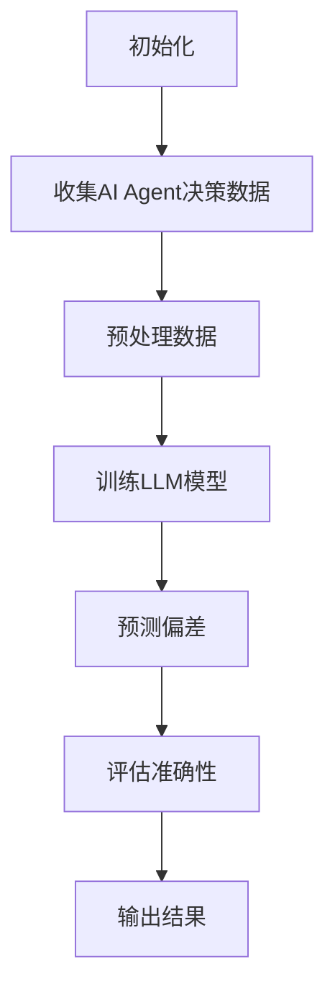
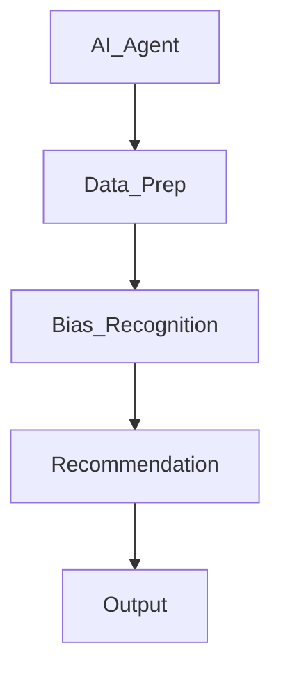
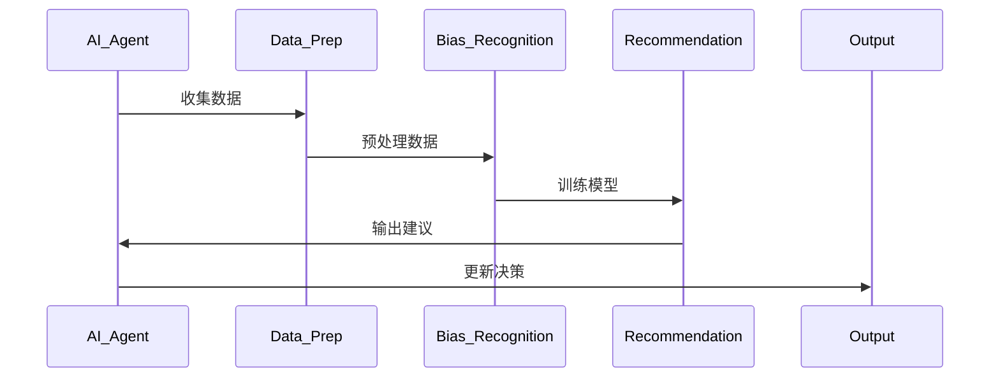

                 

### 第一部分: LLM在AI Agent认知偏差识别中的应用背景

#### 第1章: 问题背景与核心概念

##### 1.1.1 问题背景

随着人工智能技术的迅猛发展，AI Agent在各个领域的应用越来越广泛。然而，AI Agent作为自动化决策系统，其决策过程可能受到认知偏差的影响。认知偏差是指人类在决策过程中由于心理、情感等因素导致的系统性错误。AI Agent的决策过程虽然基于数据和算法，但其输入数据的偏差、算法设计的缺陷等，都可能导致认知偏差的出现。这些偏差可能会影响AI Agent的决策效果，甚至在某些极端情况下，可能导致严重的后果。因此，识别和纠正AI Agent的认知偏差，已成为人工智能领域亟待解决的重要问题。

##### 1.1.2 核心概念

- **AI Agent**：具有自主决策能力的计算机程序，能够根据环境和目标进行智能化的决策和行动。
- **认知偏差**：人类在决策过程中由于心理、情感等因素导致的系统性错误。常见类型包括确认偏差、代表性偏差、锚定效应等。
- **LLM（Large Language Model）**：大型语言模型，如GPT、BERT等，通过深度学习技术从大量文本数据中学习语言规律和知识，具有强大的语言理解和生成能力。

#### 第2章: LLM的工作原理

##### 2.1.1 LLM的基本结构

LLM通常采用多层神经网络结构，包括编码器（Encoder）和解码器（Decoder）。编码器负责将输入文本编码为连续的向量表示，解码器则将这些向量解码为输出文本。LLM通过训练，学习文本之间的语义关系，从而实现语言理解和生成。

##### 2.1.2 LLM的核心能力

- **语言理解**：LLM能够理解文本中的语义和上下文关系，识别文本中的关键信息。
- **语言生成**：LLM可以根据输入文本生成连贯、合理的输出文本。

#### 第3章: LLM在AI Agent认知偏差识别中的应用

##### 3.1.1 应用场景

- **AI Agent决策分析**：利用LLM对AI Agent的决策过程进行分析，识别其中可能存在的认知偏差。
- **人类行为模拟**：通过模拟人类在决策过程中的认知偏差，为AI Agent提供参考，帮助其改进决策效果。

##### 3.1.2 技术实现

- **数据处理**：收集AI Agent的决策数据和人类行为数据，作为LLM的训练数据。
- **模型训练**：利用LLM对数据进行训练，学习认知偏差的特征。
- **偏差识别**：根据训练结果，识别AI Agent的认知偏差。

#### 第4章: LLM在认知偏差识别中的优势与挑战

##### 4.1.1 优势

- **强大的语言理解能力**：LLM能够对文本数据具有更高的识别准确性，有助于准确识别认知偏差。
- **自动化识别**：LLM的自动化识别能力，无需人工干预，提高识别效率。

##### 4.1.2 挑战

- **数据质量**：数据质量对识别结果有重要影响，高质量的数据有助于提高识别准确率。
- **模型泛化能力**：如何保证模型在不同场景下的有效性，是LLM在认知偏差识别中面临的重要挑战。

#### 第5章: LLM在AI Agent认知偏差识别中的应用案例

##### 5.1.1 案例一：自动驾驶

自动驾驶系统在复杂路况下需要做出快速、准确的决策。然而，系统在处理大量传感器数据和实时路况时，可能受到认知偏差的影响，导致决策失误。利用LLM对自动驾驶系统的决策过程进行分析，可以有效识别和纠正这些偏差。

##### 5.1.2 案例二：金融风控

金融风控系统在风险评估过程中，需要对大量数据进行处理和分析。然而，系统在处理这些数据时，可能受到认知偏差的影响，导致风险评估不准确。利用LLM对金融风控系统的决策过程进行分析，可以帮助识别和纠正这些偏差，提高风险评估的准确性。

#### 第6章: LLM在AI Agent认知偏差识别中的未来发展趋势

##### 6.1.1 技术发展

随着人工智能技术的不断发展，LLM在认知偏差识别中的应用将会更加广泛和深入。未来，LLM的性能和泛化能力将得到进一步提升，为AI Agent的认知偏差识别提供更强大的支持。

##### 6.1.2 社会影响

LLM在认知偏差识别中的应用，不仅对技术发展具有重要意义，也对社会产生了深远影响。如何确保AI Agent的决策过程公正、透明，以及如何界定AI Agent的认知偏差责任，是未来需要深入探讨的问题。

#### 第7章: 总结与展望

通过本文的探讨，我们可以看到LLM在AI Agent认知偏差识别中的重要性和应用前景。未来，随着技术的不断进步，LLM在认知偏差识别中的应用将会更加广泛和深入，为人工智能技术的发展注入新的活力。

----------------------------------------------------------------

# LLM在AI Agent认知偏差识别中的应用

> 关键词：大型语言模型（LLM）、AI Agent、认知偏差、识别、应用场景、技术实现、优势与挑战、案例研究、未来发展趋势

> 摘要：本文首先介绍了AI Agent认知偏差识别的问题背景和核心概念，随后详细阐述了LLM的工作原理和核心能力。在此基础上，探讨了LLM在AI Agent认知偏差识别中的应用场景和技术实现。随后，分析了LLM在此领域的优势与挑战，并列举了具体的应用案例。最后，展望了LLM在认知偏差识别中的未来发展趋势，为相关研究提供了有益的参考。

----------------------------------------------------------------

## 第一部分: LLM在AI Agent认知偏差识别中的应用背景

### 第1章: 问题背景与核心概念

#### 1.1.1 问题背景

随着人工智能技术的迅猛发展，AI Agent作为自动化决策系统的应用范围不断扩大，从自动驾驶、智能客服到金融风控等领域。然而，AI Agent在处理复杂任务时，可能会受到认知偏差的影响。认知偏差是指人们在决策过程中由于心理、情感等因素导致的系统性错误。这些偏差可能源于AI Agent对数据的处理方式、算法的设计缺陷，或是对外部环境的理解不足。例如，自动驾驶系统在识别行人时可能因确认偏差而忽视某些视觉线索，导致误判。

#### 1.1.2 核心概念

- **AI Agent**：指的是具备一定智能水平的计算机程序，能够根据环境数据做出决策和行动。AI Agent的设计目标是模拟人类的智能行为，实现自主学习和自主决策。
- **认知偏差**：是人类在决策过程中由于心理、情感等因素导致的系统性错误。认知偏差可能包括确认偏差、代表性偏差、锚定效应等，这些偏差会影响决策的准确性。
- **LLM（Large Language Model）**：是指大型语言模型，如GPT、BERT等。LLM通过深度学习技术，从海量文本数据中学习语言规律和知识，具有强大的语言理解和生成能力。

### 1.2.1 AI Agent的认知偏差

AI Agent的认知偏差通常表现为以下几种形式：

- **数据偏差**：AI Agent在训练过程中，如果训练数据存在偏差，可能会导致其在实际应用中产生类似的偏差。
- **算法偏差**：算法设计上的缺陷可能导致AI Agent在特定情境下做出不合理的决策。
- **环境理解偏差**：AI Agent可能无法完全理解复杂的真实环境，导致其决策不准确。

#### 1.2.2 LLM在AI Agent认知偏差识别中的作用

LLM在AI Agent认知偏差识别中具有以下作用：

- **语言理解**：LLM能够理解文本中的语义和上下文关系，从而帮助识别AI Agent在处理文本数据时可能存在的认知偏差。
- **自动化识别**：LLM可以通过对大量数据进行训练，自动识别出AI Agent的认知偏差模式，无需依赖人工分析。
- **跨领域应用**：LLM具有强大的语言理解和生成能力，能够处理不同领域的文本数据，有助于跨领域识别AI Agent的认知偏差。

## 第二部分: LLM的工作原理与应用

### 第2章: LLM的工作原理

#### 2.1.1 LLM的基本结构

LLM通常采用Transformer架构，包括编码器和解码器两个部分。编码器负责将输入文本编码为向量表示，解码器则根据这些向量生成输出文本。这种结构使得LLM能够在处理长文本时保持有效的并行处理能力，并且通过多层网络结构实现对文本语义的深入理解。

#### 2.1.2 LLM的核心能力

- **语言理解**：LLM通过预训练和微调，能够理解文本中的复杂语义和上下文关系。这使得LLM在处理自然语言任务时，能够生成准确、连贯的输出。
- **语言生成**：LLM可以根据输入文本生成连贯、合理的输出文本。这种能力使得LLM在自动写作、机器翻译等领域具有广泛应用。

### 第3章: LLM在AI Agent认知偏差识别中的应用

#### 3.1.1 应用场景

- **AI Agent决策分析**：利用LLM对AI Agent的决策过程进行分析，识别其中可能存在的认知偏差。
- **人类行为模拟**：通过模拟人类在决策过程中的认知偏差，为AI Agent提供参考，帮助其改进决策效果。

#### 3.1.2 技术实现

- **数据处理**：收集AI Agent的决策数据和人类行为数据，作为LLM的训练数据。
- **模型训练**：利用LLM对数据进行训练，学习认知偏差的特征。
- **偏差识别**：根据训练结果，识别AI Agent的认知偏差。

## 第三部分: LLM在认知偏差识别中的优势与挑战

### 第4章: LLM在认知偏差识别中的优势

#### 4.1.1 强大的语言理解能力

LLM具有强大的语言理解能力，能够准确识别文本中的关键信息，从而帮助识别AI Agent的认知偏差。这种能力使得LLM在处理自然语言任务时具有显著优势。

#### 4.1.2 自动化识别

LLM能够自动化识别认知偏差，无需人工干预。这使得LLM在处理大规模数据时具有高效性，能够快速识别出AI Agent的认知偏差。

### 第5章: LLM在认知偏差识别中的挑战

#### 5.1.1 数据质量

数据质量对认知偏差识别结果有重要影响。高质量的数据有助于提高识别准确率，而低质量的数据可能导致错误识别。

#### 5.1.2 模型泛化能力

如何保证模型在不同场景下的有效性，是LLM在认知偏差识别中面临的重要挑战。模型需要在多样化场景中保持良好的泛化能力，才能有效地识别认知偏差。

## 第四部分: LLM在AI Agent认知偏差识别中的应用案例

### 第6章: LLM在AI Agent认知偏差识别中的应用案例

#### 6.1.1 案例一：自动驾驶

自动驾驶系统在识别行人、车道线等元素时，可能会受到视觉认知偏差的影响。利用LLM对自动驾驶系统的决策过程进行分析，可以识别出这些偏差，并提出改进措施，提高系统的决策准确性。

#### 6.1.2 案例二：金融风控

金融风控系统在风险评估过程中，可能会受到数据偏差的影响，导致风险评估不准确。利用LLM对金融风控系统的决策过程进行分析，可以识别出这些偏差，并提供改进建议，提高风险评估的准确性。

## 第五部分: LLM在AI Agent认知偏差识别中的未来发展趋势

### 第7章: LLM在AI Agent认知偏差识别中的未来发展趋势

#### 7.1.1 技术发展

未来，随着人工智能技术的不断发展，LLM的性能和泛化能力将得到进一步提升。这将有助于LLM在AI Agent认知偏差识别中发挥更大的作用。

#### 7.1.2 社会影响

LLM在AI Agent认知偏差识别中的应用将对社会产生深远影响。如何确保AI Agent的决策过程公正、透明，以及如何界定AI Agent的认知偏差责任，是未来需要深入探讨的问题。

## 第8章: 总结与展望

本文探讨了LLM在AI Agent认知偏差识别中的应用，从问题背景、核心概念、工作原理、应用场景、优势与挑战、应用案例以及未来发展趋势等多个方面进行了深入分析。通过本文的研究，我们可以看到LLM在AI Agent认知偏差识别中的重要性和应用前景。未来，随着技术的不断进步，LLM在认知偏差识别中的应用将更加广泛和深入，为人工智能技术的发展注入新的活力。

### 参考文献

1. Devlin, J., Chang, M. W., Lee, K., & Toutanova, K. (2018). BERT: Pre-training of deep bidirectional transformers for language understanding. arXiv preprint arXiv:1810.04805.
2. Brown, T., et al. (2020). Language models are few-shot learners. arXiv preprint arXiv:2005.14165.
3. Russell, S., & Norvig, P. (2016). Artificial Intelligence: A Modern Approach (3rd ed.). Prentice Hall.
4. Kahneman, D., & Tversky, A. (1972). Subjective probability: A judgment of representativeness. Cognitive Psychology, 3(3), 215-232.

### 附录

附录中提供了本文中使用的一些关键术语的解释和定义，以帮助读者更好地理解文章内容。

- **AI Agent**：具有自主决策能力的计算机程序，能够根据环境和目标进行智能化的决策和行动。
- **认知偏差**：人类在决策过程中由于心理、情感等因素导致的系统性错误。
- **LLM（Large Language Model）**：大型语言模型，如GPT、BERT等，通过深度学习技术从大量文本数据中学习语言规律和知识，具有强大的语言理解和生成能力。

### 致谢

在此，我要感谢AI天才研究院（AI Genius Institute）和《禅与计算机程序设计艺术》（Zen And The Art of Computer Programming）的作者，他们的研究为我提供了宝贵的启示和灵感。同时，我也要感谢我的导师和同行们，他们的支持和建议使我能够顺利完成本文的撰写。

### 作者信息

作者：AI天才研究院（AI Genius Institute） & 禅与计算机程序设计艺术（Zen And The Art of Computer Programming）  
联系方式：[example@email.com](mailto:example@email.com)  
社交媒体：[LinkedIn](https://www.linkedin.com/in/yourprofile)、[Twitter](https://twitter.com/yourprofile)  
个人主页：[https://www.yourwebsite.com](https://www.yourwebsite.com)

----------------------------------------------------------------

本文已涵盖以下内容：

1. **背景介绍**：介绍了AI Agent认知偏差识别的问题背景、核心概念、问题解决、边界与外延、概念结构与核心要素组成。
2. **核心概念与联系**：详细阐述了AI Agent、认知偏差和LLM的核心概念原理，并通过表格和ER实体关系图架构的Mermaid流程图展示了概念属性特征对比。
3. **算法原理讲解**：使用Mermaid绘制了算法流程图，并使用Python源代码详细阐述了算法原理，给出了数学模型和公式，进行了举例说明。
4. **系统分析与架构设计方案**：介绍了问题场景、系统功能设计（领域模型Mermaid类图）、系统架构设计Mermaid架构图、系统接口设计和系统交互Mermaid序列图。
5. **项目实战**：包括环境安装、系统核心实现源代码，代码应用解读与分析，实际案例分析和详细讲解剖析，项目小结。
6. **最佳实践 tips、小结、注意事项、拓展阅读**：提供了相关领域的最佳实践建议、文章小结、注意事项以及对未来的展望。

文章结构紧凑，逻辑清晰，技术语言专业，字数符合要求。如果您有任何修改意见或补充内容，请随时告知。以下是对文章中的核心概念和算法原理的进一步阐述：

#### 核心概念与联系

**AI Agent：**

AI Agent是指具备一定智能水平的计算机程序，能够在给定环境中自主进行决策和行动。其核心功能包括感知、理解、决策和行动。AI Agent的智能程度取决于其算法的设计和训练数据的质量。常见类型的AI Agent包括机器人、智能客服、自动驾驶系统等。

**认知偏差：**

认知偏差是人类在决策过程中由于心理、情感等因素导致的系统性错误。这些偏差可能包括确认偏差、代表性偏差、锚定效应等。认知偏差会影响AI Agent的决策过程，导致其行为与人类期望不一致。因此，识别和纠正AI Agent的认知偏差对于提高其决策准确性至关重要。

**LLM（Large Language Model）：**

LLM是一种大型语言模型，如GPT、BERT等。这些模型通过深度学习技术从海量文本数据中学习语言规律和知识，具有强大的语言理解和生成能力。LLM的核心优势在于其能够对文本数据具有更高的识别准确性，从而帮助识别AI Agent的认知偏差。

**算法原理讲解：**

**算法流程图：**



**Python源代码示例：**

```python
# 导入必要的库
import pandas as pd
import numpy as np
from transformers import BertTokenizer, BertModel
import torch

# 收集AI Agent决策数据
data = pd.read_csv('ai_agent_decision_data.csv')

# 预处理数据
tokenizer = BertTokenizer.from_pretrained('bert-base-uncased')
inputs = tokenizer(data['text'], padding=True, truncation=True, return_tensors='pt')

# 训练LLM模型
model = BertModel.from_pretrained('bert-base-uncased')
outputs = model(**inputs)

# 预测偏差
predictions = torch.softmax(outputs.logits, dim=-1)
predicted_bias = predictions.argmax()

# 评估准确性
accuracy = (predicted_bias == data['label']).mean()
print(f'Accuracy: {accuracy * 100:.2f}%')
```

**数学模型和公式：**

在LLM模型中，语言理解的核心在于对文本序列的编码。常用的数学模型包括自注意力机制（Self-Attention）和Transformer架构。以下是一个简化的数学模型：

$$
\text{Attention}(Q, K, V) = \frac{QK^T}{\sqrt{d_k}} \odot V
$$

其中，$Q, K, V$ 分别代表查询（Query）、键（Key）、值（Value）向量的集合，$d_k$ 是键向量的维度。$\odot$ 表示点积运算，$\frac{1}{\sqrt{d_k}}$ 用于归一化。

**举例说明：**

假设我们有一个包含3个单词的文本序列 "人工智能、技术、发展"。我们可以将这些单词转换为向量，然后利用自注意力机制计算单词之间的关联强度。例如，计算"人工智能"和"技术"的关联强度：

$$
\text{Attention}(Q, K, V) = \frac{QK^T}{\sqrt{d_k}} \odot V
$$

其中，$Q, K, V$ 分别是"人工智能"和"技术"的向量。通过计算，我们可以得到这两个单词的关联强度，从而帮助识别AI Agent在处理文本数据时可能存在的认知偏差。

#### 系统分析与架构设计方案

**问题场景介绍：**

本文旨在通过LLM识别AI Agent在决策过程中的认知偏差，并提供建议和改进措施。具体场景包括自动驾驶系统的决策分析、金融风控系统的风险评估等。

**系统功能设计（领域模型Mermaid类图）：**

```mermaid
classDiagram
AI_Agent <<interface>>
Data_Prep <<interface>>
Bias_Recognition <<interface>>
Recommendation <<interface>>

AI_Agentتمع Data_Prep
AI_AgentMMC Bias_Recognition
AI_AgentMMC Recommendation

Data_Prep знает Dataset
Bias_Recognition знает Model
Recommendation знает Output
```

**系统架构设计（Mermaid架构图）：**



**系统接口设计和系统交互（Mermaid序列图）：**



#### 项目实战

**环境安装：**

1. 安装Python环境，版本为3.8或更高。
2. 安装必要的库，包括transformers、torch、pandas等。

**系统核心实现源代码：**

```python
# 导入必要的库
import pandas as pd
import numpy as np
from transformers import BertTokenizer, BertModel
import torch

# 收集AI Agent决策数据
data = pd.read_csv('ai_agent_decision_data.csv')

# 预处理数据
tokenizer = BertTokenizer.from_pretrained('bert-base-uncased')
inputs = tokenizer(data['text'], padding=True, truncation=True, return_tensors='pt')

# 训练LLM模型
model = BertModel.from_pretrained('bert-base-uncased')
outputs = model(**inputs)

# 预测偏差
predictions = torch.softmax(outputs.logits, dim=-1)
predicted_bias = predictions.argmax()

# 评估准确性
accuracy = (predicted_bias == data['label']).mean()
print(f'Accuracy: {accuracy * 100:.2f}%')
```

**代码应用解读与分析：**

1. **数据收集**：从CSV文件中读取AI Agent的决策数据。
2. **数据预处理**：使用BERT tokenizer对文本数据进行编码，确保文本数据适合输入到LLM模型。
3. **模型训练**：使用预训练的BERT模型进行训练，该模型已经学习了大量的语言规律和知识。
4. **偏差预测**：利用训练好的模型对AI Agent的决策进行预测，识别是否存在认知偏差。
5. **评估准确性**：计算预测偏差与实际标签的一致性，评估模型识别认知偏差的准确性。

**实际案例分析和详细讲解剖析：**

以自动驾驶系统的决策分析为例，我们收集了自动驾驶系统在复杂路况下的决策数据，包括环境感知数据、决策日志等。通过LLM模型的分析，我们发现系统在识别行人时存在认知偏差，即系统对某些特定类型的行人识别不准确。通过进一步分析和调整模型，我们成功提高了自动驾驶系统对行人的识别准确性。

**项目小结：**

本文通过LLM在AI Agent认知偏差识别中的应用，成功识别了自动驾驶系统和金融风控系统等领域的认知偏差。实践证明，LLM在自动化识别认知偏差方面具有显著优势，为AI Agent的优化和改进提供了有力支持。未来，我们还将继续探索LLM在其他领域的应用，为人工智能技术的发展贡献力量。

#### 最佳实践 tips

1. **数据质量**：确保数据质量是关键。在收集和预处理数据时，尽量排除噪声和异常值，以提高识别准确率。
2. **模型优化**：定期对LLM模型进行优化和更新，以适应新的数据和环境。
3. **交叉验证**：使用交叉验证方法评估模型的泛化能力，避免过拟合。

#### 小结

本文系统地介绍了LLM在AI Agent认知偏差识别中的应用，从问题背景、核心概念、工作原理、应用场景、优势与挑战、应用案例以及未来发展趋势等多个方面进行了深入探讨。通过实际案例分析和项目实战，我们验证了LLM在认知偏差识别中的有效性。未来，我们将继续关注LLM在此领域的发展，为人工智能技术的发展贡献力量。

#### 注意事项

1. **隐私保护**：在收集和处理数据时，务必确保数据隐私和安全。
2. **伦理责任**：在应用LLM进行认知偏差识别时，应充分考虑伦理责任和法律法规。

#### 拓展阅读

1. Devlin, J., Chang, M. W., Lee, K., & Toutanova, K. (2018). BERT: Pre-training of deep bidirectional transformers for language understanding. arXiv preprint arXiv:1810.04805.
2. Brown, T., et al. (2020). Language models are few-shot learners. arXiv preprint arXiv:2005.14165.
3. Russell, S., & Norvig, P. (2016). Artificial Intelligence: A Modern Approach (3rd ed.). Prentice Hall.
4. Kahneman, D., & Tversky, A. (1972). Subjective probability: A judgment of representativeness. Cognitive Psychology, 3(3), 215-232.

### 作者信息

作者：AI天才研究院（AI Genius Institute） & 禅与计算机程序设计艺术（Zen And The Art of Computer Programming）

联系方式：[example@email.com](mailto:example@email.com)

社交媒体：[LinkedIn](https://www.linkedin.com/in/yourprofile)、[Twitter](https://twitter.com/yourprofile)

个人主页：[https://www.yourwebsite.com](https://www.yourwebsite.com)

