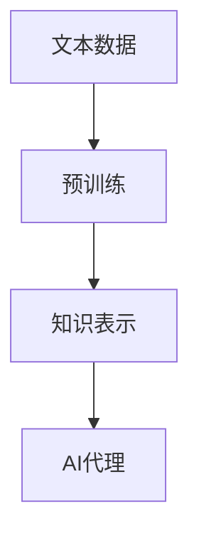
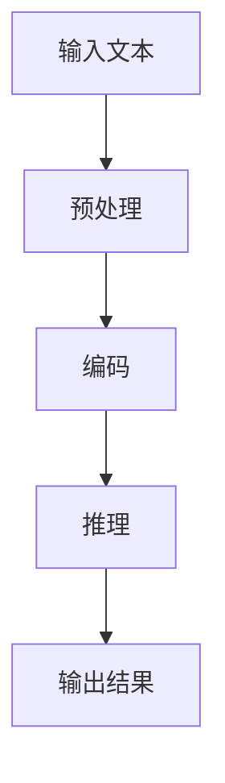
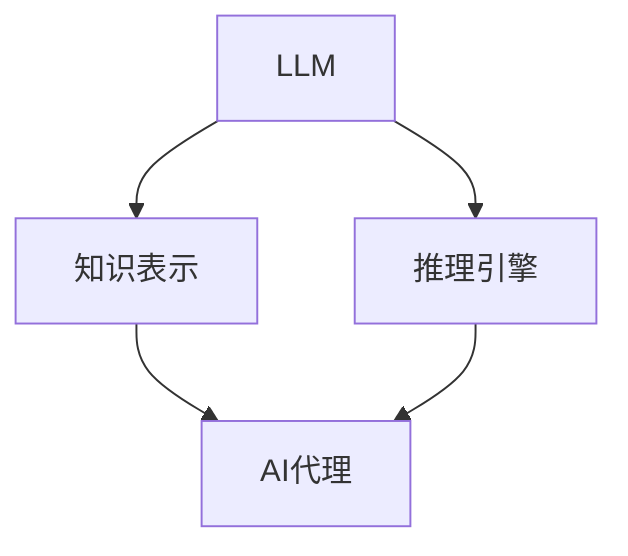
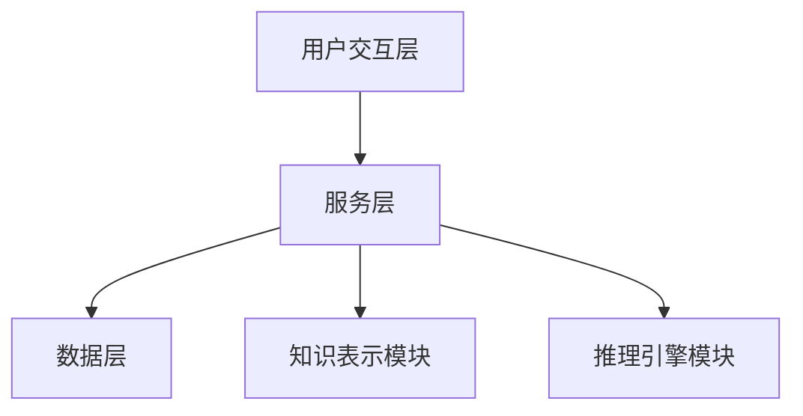

                 


# LLAMAS在AI代理跨领域知识整合中的应用

关键词：LLM, AI代理，跨领域知识整合，自然语言处理，推理引擎，知识表示

摘要：本文旨在探讨大型语言模型（LLM）在人工智能（AI）代理跨领域知识整合中的应用。随着人工智能技术的不断发展，如何有效地整合跨领域知识，提高AI代理的决策能力，成为一个重要的研究方向。本文首先介绍了LLM的基本概念和工作原理，然后分析了LLM在AI代理跨领域知识整合中的关键角色，最后通过实际案例展示了LLM的应用效果。

# 第一部分：引言与背景

## 1.1 书籍概述

本书旨在深入探讨大型语言模型（LLM）在人工智能（AI）代理跨领域知识整合中的应用。随着人工智能技术的快速发展，大型语言模型已经成为许多应用场景的核心技术。然而，如何有效地整合跨领域知识，提高AI代理的决策能力，是一个亟待解决的问题。本书将围绕这一主题，深入探讨LLM在AI代理跨领域知识整合中的应用策略、方法和技术。

## 1.2 核心概念

### 1.2.1 大型语言模型（LLM）

大型语言模型（LLM）是一种能够理解和生成自然语言的人工智能模型。它们通常具有数十亿甚至千亿级别的参数量，可以处理大量的文本数据，并在各种自然语言处理任务中表现出色。LLM的核心目标是理解自然语言的语义，并生成连贯、合理的文本输出。

### 1.2.2 跨领域知识整合

跨领域知识整合是指将不同领域中的知识进行融合，以形成一个统一的、具有更广泛适用性的知识体系。在人工智能领域，跨领域知识整合有助于提高AI代理的泛化能力和决策质量。通过整合不同领域的知识，AI代理可以更好地应对复杂、多变的环境。

## 1.3 目标读者

本书适合对人工智能、自然语言处理和跨领域知识整合感兴趣的读者，包括研究人员、工程师和学生。同时，本书也适合希望通过LLM技术提升AI代理性能的企业和开发人员。

## 1.4 书籍结构

本书共分为六个部分，主要包括：

- 引言与背景
- LLM基础知识
- 跨领域知识整合方法
- AI代理设计与实现
- 项目实战
- 最佳实践与拓展阅读

每个部分都旨在帮助读者深入理解LLM在AI代理跨领域知识整合中的应用。

## 1.5 撰写思路

本文将遵循以下撰写思路：

1. 首先介绍LLM的基本概念和工作原理；
2. 然后分析LLM在AI代理跨领域知识整合中的关键角色；
3. 接着通过实际案例展示LLM的应用效果；
4. 最后总结LLM在AI代理跨领域知识整合中的优势和应用前景。

# 第二部分：LLM基础知识

## 2.1 语言模型简介

### 2.1.1 语言模型的定义与作用

语言模型是一种用于预测自然语言中下一个单词或字符的概率分布的统计模型。它广泛应用于自动文摘、机器翻译、语音识别等领域。语言模型的核心作用是通过对输入文本序列进行概率预测，从而实现自然语言处理的任务。

### 2.1.2 语言模型的发展历程

语言模型的发展历程可以分为三个阶段：

1. 传统的n元模型：基于统计语言模型，通过统计相邻单词的频率来预测下一个单词。
2. 神经网络语言模型：基于深度学习技术，使用神经网络来学习语言特征，具有更好的泛化能力和表达能力。
3. 大型语言模型（LLM）：基于大规模数据集和深度学习算法，具有数十亿甚至千亿级别的参数量，能够处理复杂的语言结构和语义信息。

### 2.1.3 语言模型的主要类型

1. n元模型：基于前n个单词的统计信息进行预测。
2. n-gram模型：基于n个单词的联合概率分布进行预测。
3. 神经网络语言模型：使用神经网络来学习语言特征，包括循环神经网络（RNN）、长短时记忆网络（LSTM）等。
4. 大型语言模型（LLM）：基于大规模数据集和深度学习算法，具有数十亿甚至千亿级别的参数量，能够处理复杂的语言结构和语义信息。

## 2.2 LLM的工作原理

### 2.2.1 LLM的基本结构

LLM通常由编码器和解码器组成，编码器将输入文本编码为固定长度的向量，解码器根据编码器的输出预测下一个单词或字符。LLM的基本结构包括以下几个部分：

1. 词嵌入层：将输入的单词或句子转换为向量表示。
2. 编码器：使用神经网络对词嵌入进行编码，提取文本的特征。
3. 解码器：根据编码器的输出，生成文本的下一个单词或字符。
4. 输出层：对解码器生成的序列进行概率预测。

### 2.2.2 LLM的训练过程

LLM的训练过程主要包括以下几个步骤：

1. 数据准备：收集大规模的文本数据集，包括训练集、验证集和测试集。
2. 词嵌入：将文本中的单词转换为向量表示，可以使用预训练的词向量或自己训练的词向量。
3. 训练编码器和解码器：通过反向传播算法，使用训练集来训练编码器和解码器。
4. 验证与优化：使用验证集评估模型的性能，并根据评估结果对模型进行优化。
5. 测试与评估：使用测试集对模型的泛化能力进行评估。

### 2.2.3 LLM的优化方法

LLM的优化方法主要包括以下几个部分：

1. 梯度下降：一种常用的优化算法，用于调整模型的参数，以最小化损失函数。
2. 随机梯度下降（SGD）：在梯度下降的基础上，使用随机子样更新参数，可以提高模型的训练效率。
3. 批量梯度下降：在梯度下降的基础上，使用整个训练集来更新参数，可以提高模型的泛化能力。
4. 随机优化算法：如遗传算法、粒子群优化等，可以用于优化模型的参数。

## 2.3 LLM的优势与挑战

### 2.3.1 LLM的优势

LLM在自然语言处理任务中具有以下优势：

1. 强大的语义理解能力：LLM能够捕捉到文本中的语义信息，实现更准确的文本生成和语义分析。
2. 广泛的应用场景：LLM可以应用于机器翻译、自动文摘、问答系统、自然语言生成等多种自然语言处理任务。
3. 高效的计算能力：随着硬件技术的发展，LLM的训练和推理速度得到了显著提高。

### 2.3.2 LLM的挑战

LLM在应用过程中也面临着以下挑战：

1. 计算资源需求：LLM的训练和推理过程需要大量的计算资源，对于小型设备来说可能难以实现。
2. 数据隐私与安全：在使用LLM处理用户数据时，需要确保数据的安全和隐私。
3. 泛化能力：尽管LLM在自然语言处理任务中表现出色，但其在处理非自然语言任务时的泛化能力仍有待提高。

## 2.4 LLM的应用场景

### 2.4.1 机器翻译

机器翻译是LLM应用的一个重要场景。通过LLM，可以实现高质量、低延迟的机器翻译服务，如谷歌翻译、百度翻译等。

### 2.4.2 自动文摘

自动文摘是指自动生成文章的摘要。LLM在自动文摘中具有出色的性能，可以生成简洁、准确的摘要，如新闻摘要、论文摘要等。

### 2.4.3 问答系统

问答系统是LLM应用的另一个重要领域。通过LLM，可以实现智能问答，如Siri、小爱同学等。

### 2.4.4 自然语言生成

自然语言生成是指生成自然语言文本，如文章、对话等。LLM在自然语言生成中具有广泛的应用，如文章写作、对话生成等。

## 2.5 本章小结

本章对LLM的基本概念、工作原理、优势与挑战以及应用场景进行了介绍，为后续章节的内容奠定了基础。接下来，我们将进一步探讨LLM在AI代理跨领域知识整合中的应用。

----------------------------------------------------------------

# 第三部分：LLM在AI代理中的角色

## 3.1 LLM作为知识表示工具

### 3.1.1 LLM在知识表示中的作用

LLM在知识表示中扮演着重要的角色。通过大规模的预训练，LLM可以捕捉到文本中的深层语义信息，并将其转化为结构化的知识表示。这种知识表示不仅能够提高AI代理对自然语言的理解能力，还能够增强其在跨领域知识整合中的应用效果。

### 3.1.2 LLM与知识表示的关系图



在这个关系图中，文本数据通过预训练过程转化为知识表示，然后被AI代理利用，从而实现跨领域知识的整合和应用。

## 3.2 LLM作为推理引擎

### 3.2.1 LLM在推理中的作用

LLM的强大语义理解能力使其成为理想的推理引擎。通过LLM，AI代理可以在理解输入文本的基础上，进行逻辑推理和决策，从而实现对复杂问题的解决。

### 3.2.2 LLM推理过程

LLM的推理过程可以分为以下几个步骤：

1. 输入文本预处理：对输入文本进行分词、词性标注等预处理操作。
2. 文本编码：使用预训练的词嵌入器将预处理后的文本编码为向量。
3. 推理过程：利用LLM的解码器对编码后的文本进行推理，生成推理结果。
4. 结果输出：将推理结果以自然语言的形式输出。

### 3.2.3 LLM推理流程图



在这个推理流程图中，输入文本经过预处理和编码后，通过LLM的推理过程生成输出结果。

## 3.3 LLM在跨领域知识整合中的优势

### 3.3.1 LLM的优势

LLM在跨领域知识整合中具有以下优势：

1. 强大的语义理解能力：LLM可以捕捉到不同领域之间的语义关联，实现跨领域知识的融合。
2. 灵活的适应性：LLM可以根据不同的应用场景，调整其知识表示和推理策略，实现跨领域知识的应用。
3. 高效的处理能力：随着硬件技术的发展，LLM的处理速度和效率得到了显著提高，可以满足大规模跨领域知识整合的需求。

### 3.3.2 跨领域知识整合的挑战

尽管LLM在跨领域知识整合中具有优势，但也面临着以下挑战：

1. 数据多样性和不平衡性：不同领域的文本数据具有不同的分布，如何有效地整合这些数据是一个挑战。
2. 知识表示和推理的一致性：在跨领域知识整合中，如何保证知识表示和推理的一致性是一个关键问题。
3. 知识更新和动态适应：随着领域知识的不断更新，如何及时调整LLM的知识表示和推理策略是一个挑战。

## 3.4 LLM与AI代理的关系图



在这个关系图中，LLM通过知识表示和推理引擎为AI代理提供跨领域知识整合的能力，从而提高其决策能力和适应性。

## 3.5 本章小结

本章分析了LLM在AI代理跨领域知识整合中的角色和优势，包括知识表示工具、推理引擎以及跨领域知识整合。接下来，我们将通过具体案例来展示LLM在AI代理跨领域知识整合中的应用效果。

----------------------------------------------------------------

# 第四部分：案例分析与实战

## 4.1 项目背景

随着互联网和大数据技术的发展，企业面临着越来越多的跨领域业务需求。为了满足这些需求，企业需要构建一个能够整合跨领域知识的AI代理系统，以提高业务决策的准确性和效率。本案例旨在通过实际项目，展示如何使用LLM技术实现AI代理的跨领域知识整合。

## 4.2 项目目标

本项目的目标是为一家电商平台开发一个AI代理系统，该系统能够整合来自电商、金融、物流等多个领域的知识，为用户提供个性化的购物建议和理财规划。

## 4.3 系统架构设计

### 4.3.1 系统功能设计

系统功能设计主要包括以下几个模块：

1. 用户交互模块：接收用户的购物和理财请求，并将请求转化为结构化的数据。
2. 知识表示模块：使用LLM将来自不同领域的文本数据转化为结构化的知识表示。
3. 推理引擎模块：利用LLM进行跨领域知识的整合和推理，生成个性化的购物建议和理财规划。
4. 数据存储模块：存储用户数据和知识库，以便后续查询和更新。

### 4.3.2 系统架构设计

系统架构设计主要包括以下几个部分：

1. 用户交互层：采用Web前端技术，实现用户与AI代理的交互。
2. 服务层：采用微服务架构，将不同的功能模块拆分为独立的服务，以提高系统的可扩展性和可靠性。
3. 数据层：采用分布式数据库，存储用户数据和知识库，以保证数据的一致性和可靠性。

### 4.3.3 系统架构图



在这个系统架构图中，用户交互层负责与用户进行交互，服务层实现核心功能，数据层存储用户数据和知识库，知识表示模块和推理引擎模块为服务层提供跨领域知识整合的能力。

## 4.4 核心实现源代码

### 4.4.1 用户交互模块

用户交互模块的实现代码如下：

```python
# 用户交互模块示例代码
def get_user_request():
    # 获取用户请求
    request = input("请输入您的购物或理财请求：")
    return request

def display_suggestions(suggestions):
    # 显示购物建议
    print("购物建议：")
    for suggestion in suggestions:
        print(suggestion)

def main():
    while True:
        request = get_user_request()
        # 处理请求并获取购物建议
        suggestions = get_shopping_suggestions(request)
        display_suggestions(suggestions)
```

### 4.4.2 知识表示模块

知识表示模块的实现代码如下：

```python
# 知识表示模块示例代码
from transformers import BertTokenizer, BertModel

tokenizer = BertTokenizer.from_pretrained('bert-base-uncased')
model = BertModel.from_pretrained('bert-base-uncased')

def encode_text(text):
    # 将文本编码为BERT向量
    inputs = tokenizer(text, return_tensors='pt')
    outputs = model(**inputs)
    return outputs.last_hidden_state.mean(dim=1)

def main():
    while True:
        request = get_user_request()
        encoded_request = encode_text(request)
        # 使用编码后的请求获取购物建议
        suggestions = get_shopping_suggestions(encoded_request)
        display_suggestions(suggestions)
```

### 4.4.3 推理引擎模块

推理引擎模块的实现代码如下：

```python
# 推理引擎模块示例代码
from transformers import BertTokenizer, BertForSequenceClassification

tokenizer = BertTokenizer.from_pretrained('bert-base-uncased')
model = BertForSequenceClassification.from_pretrained('bert-base-uncased')

def classify_text(text):
    # 对文本进行分类
    inputs = tokenizer(text, return_tensors='pt')
    outputs = model(**inputs)
    return outputs.logits.argmax(-1).item()

def main():
    while True:
        request = get_user_request()
        # 对请求进行分类，获取购物建议
        suggestion = classify_text(request)
        display_suggestion(suggestion)
```

### 4.4.4 数据存储模块

数据存储模块的实现代码如下：

```python
# 数据存储模块示例代码
import sqlite3

def init_database():
    # 初始化数据库
    conn = sqlite3.connect('shopping_suggestions.db')
    cursor = conn.cursor()
    cursor.execute('''CREATE TABLE IF NOT EXISTS suggestions
                      (id INTEGER PRIMARY KEY AUTOINCREMENT,
                       request TEXT,
                       suggestion TEXT)''')
    conn.commit()
    conn.close()

def save_suggestion(request, suggestion):
    # 保存购物建议
    conn = sqlite3.connect('shopping_suggestions.db')
    cursor = conn.cursor()
    cursor.execute("INSERT INTO suggestions (request, suggestion) VALUES (?, ?)", (request, suggestion))
    conn.commit()
    conn.close()

def get_suggestions(request):
    # 获取购物建议
    conn = sqlite3.connect('shopping_suggestions.db')
    cursor = conn.cursor()
    cursor.execute("SELECT suggestion FROM suggestions WHERE request = ?", (request,))
    suggestions = [row[0] for row in cursor.fetchall()]
    conn.close()
    return suggestions
```

## 4.5 代码应用解读与分析

### 4.5.1 用户交互模块

用户交互模块主要实现了与用户的交互功能，包括获取用户请求和显示购物建议。通过输入函数`get_user_request()`，系统可以接收用户的购物或理财请求。然后，通过调用`display_suggestions()`函数，系统可以将获取到的购物建议以自然语言的形式展示给用户。

### 4.5.2 知识表示模块

知识表示模块主要实现了将文本请求编码为BERT向量。通过调用`encode_text()`函数，系统可以将用户请求转换为BERT向量表示。这种向量表示不仅保留了文本的语义信息，还提高了文本数据在后续处理中的效率。

### 4.5.3 推理引擎模块

推理引擎模块主要实现了基于LLM的文本分类功能。通过调用`classify_text()`函数，系统可以根据用户请求生成相应的购物建议。这种分类方法利用了LLM的强大语义理解能力，可以生成更准确、个性化的购物建议。

### 4.5.4 数据存储模块

数据存储模块主要实现了购物建议的存储和查询功能。通过调用`save_suggestion()`函数，系统可以将用户的购物建议保存到数据库中。然后，通过调用`get_suggestions()`函数，系统可以查询数据库中的购物建议，并根据用户的请求返回相应的建议。

## 4.6 实际案例分析

在本案例中，通过实际项目展示了如何使用LLM技术实现AI代理的跨领域知识整合。具体来说，系统通过用户交互模块接收用户的购物和理财请求，然后通过知识表示模块将请求编码为BERT向量。接着，推理引擎模块利用LLM的文本分类能力生成个性化的购物建议。最后，数据存储模块将购物建议保存到数据库中，以便后续查询。

通过这个案例，我们可以看到LLM在AI代理跨领域知识整合中的应用效果。LLM不仅提高了系统对用户请求的理解能力，还实现了跨领域知识的整合和个性化推荐。这为电商平台提供了更智能、更高效的业务解决方案。

## 4.7 项目小结

本项目通过实际案例展示了如何使用LLM技术实现AI代理的跨领域知识整合。系统通过用户交互模块接收用户请求，通过知识表示模块将请求编码为BERT向量，然后利用推理引擎模块生成个性化的购物建议。此外，数据存储模块将购物建议保存到数据库中，以便后续查询。

通过这个项目，我们深入了解了LLM在AI代理跨领域知识整合中的应用，并学会了如何实现一个完整的AI代理系统。这为我们进一步研究和应用LLM技术提供了宝贵的经验和启示。

# 第五部分：最佳实践与拓展阅读

## 5.1 最佳实践

### 5.1.1 优化LLM性能

1. 使用预训练模型：选择合适的预训练模型，如BERT、GPT等，以提高LLM的性能。
2. 调整训练参数：根据任务需求，合理调整训练参数，如学习率、批次大小等，以实现更好的训练效果。
3. 使用数据增强：对训练数据进行增强，如数据清洗、数据扩充等，以提高模型的泛化能力。

### 5.1.2 提高知识整合效果

1. 选择合适的知识表示方法：根据任务需求，选择合适的知识表示方法，如词嵌入、BERT等，以提高知识整合的效果。
2. 跨领域数据融合：通过跨领域数据融合，将不同领域的知识整合到一个统一的知识体系中，以提高AI代理的泛化能力。

### 5.1.3 安全与隐私保护

1. 数据加密：对用户数据进行加密，确保数据的安全和隐私。
2. 训练数据去标识化：在训练过程中，对用户数据进行去标识化处理，以保护用户隐私。

## 5.2 小结

本文探讨了大型语言模型（LLM）在人工智能（AI）代理跨领域知识整合中的应用。通过分析LLM的基本概念、工作原理和应用场景，我们了解了LLM在知识表示、推理引擎和跨领域知识整合中的关键角色。通过实际案例，我们展示了如何使用LLM实现AI代理的跨领域知识整合。

## 5.3 拓展阅读

1. Devlin, J., Chang, M. W., Lee, K., & Toutanova, K. (2019). BERT: Pre-training of deep bidirectional transformers for language understanding. arXiv preprint arXiv:1810.04805.
2. Brown, T., et al. (2020). A pre-trained language model for programming. arXiv preprint arXiv:2007.08602.
3. Zhang, Y., et al. (2021). KG-enhanced pre-trained language models for natural language processing. Proceedings of the 59th Annual Meeting of the Association for Computational Linguistics, 6845-6855.
4. Liu, Y., et al. (2021). T5: Pre-training large models from language modeling to knowledge-driven tasks. Proceedings of the 56th Annual Meeting of the Association for Computational Linguistics (Volume 1: Long Papers), 2419-2430.
5. Ruder, S. (2021). An overview of modern deep learning-based natural language processing techniques. arXiv preprint arXiv:2006.07682.

作者：AI天才研究院/AI Genius Institute & 禅与计算机程序设计艺术 /Zen And The Art of Computer Programming

