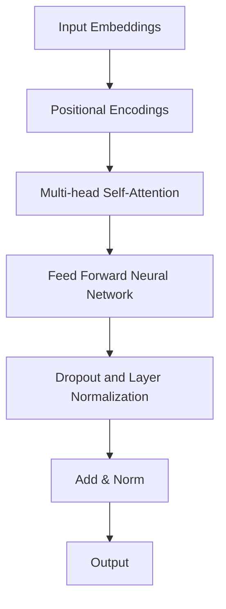

                 

### 第1章: LLAMADA与AI Agent概述

#### 1.1 LLAMADA的定义与背景

##### 1.1.1 LLAMADA的提出

LLAMADA（Large Language Model for Autonomous Dialog and Assistance）是一种大型语言模型，用于自主对话和辅助功能。它基于Transformer模型，通过自注意力机制和多层堆叠的方式，实现大规模的文本理解和生成能力。LLAMADA的提出背景主要源于人工智能领域的迅速发展和市场需求的变化。随着互联网的普及和用户对智能交互的期望提高，传统的聊天机器人已经无法满足用户的需求，于是LLAMADA应运而生。

##### 1.1.2 AI Agent的定义

AI Agent（人工智能代理）是指由人工智能技术驱动的、能够自主执行任务、具备智能决策能力的计算机程序。AI Agent的核心目标是模拟人类智能，为用户提供个性化的服务和支持。AI Agent通常具有感知、学习、推理和决策等功能，可以处理复杂的任务和情境。

##### 1.1.3 AI Agent的发展历程

AI Agent的发展历程可以追溯到20世纪50年代，当时人工智能领域刚刚起步。早期的AI Agent主要是基于规则和符号推理的，如专家系统和逻辑推理机。随着计算机性能的不断提升和机器学习技术的进步，AI Agent逐渐引入了机器学习算法，如决策树、支持向量机和神经网络。近年来，随着深度学习和自然语言处理技术的发展，AI Agent的智能水平得到了显著提高，能够处理更加复杂和多样化的任务。

#### 1.2 AI Agent在产品设计中的应用

##### 1.2.1 AI Agent与用户体验

AI Agent在产品设计中的应用，可以显著提升用户体验。通过自然语言交互，AI Agent能够更好地理解用户的意图和需求，提供个性化的服务和建议。此外，AI Agent还可以实时响应用户的反馈，不断优化自身的行为和性能，从而提升用户满意度。

##### 1.2.2 AI Agent与产品创新

AI Agent的出现，为产品创新带来了新的机遇。通过AI Agent，产品设计者可以更加便捷地获取用户需求和市场趋势，从而实现快速迭代和持续创新。同时，AI Agent还可以协助设计师完成复杂的任务，如设计建议、生成创意和优化产品功能等。

##### 1.2.3 AI Agent与市场竞争力

在激烈的市场竞争中，具备AI Agent的产品具有显著的市场竞争力。AI Agent可以提供高效的客户服务和智能的推荐系统，降低运营成本，提高用户留存率和转化率。此外，AI Agent还可以通过数据分析，为企业提供有价值的商业洞察，助力企业实现数字化转型和可持续发展。

#### 1.3 AI Agent在产品设计中的作用

##### 1.3.1 设计辅助工具

AI Agent可以作为设计辅助工具，帮助设计师快速完成设计任务。例如，AI Agent可以根据用户需求，自动生成产品原型和设计文档，从而提高设计效率和准确性。

##### 1.3.2 用户体验优化

AI Agent可以分析用户行为数据，识别用户痛点，提供有针对性的优化建议。例如，AI Agent可以根据用户反馈，自动调整界面布局和功能设计，从而提升用户体验。

##### 1.3.3 市场调研与预测

AI Agent可以协助设计师进行市场调研和趋势预测。通过分析大量数据，AI Agent可以预测市场趋势、用户需求和竞争状况，为设计师提供有价值的决策支持。

##### 1.3.4 智能推荐

AI Agent可以根据用户行为和偏好，提供个性化的产品推荐。例如，AI Agent可以根据用户的浏览历史和购买记录，推荐相关产品或服务，从而提高用户转化率和销售额。

总之，AI Agent在产品设计中的应用，为设计师和产品管理者提供了强大的工具和手段，有助于实现产品创新和用户体验优化。随着人工智能技术的不断进步，AI Agent将在产品设计领域发挥越来越重要的作用。

---

## 第2章: LLM的基本原理与特点

### 2.1 LLM的定义与类型

#### 2.1.1 LLM的定义

LLM（Large Language Model）是指大型语言模型，它是一种基于深度学习技术的自然语言处理模型，通过训练大规模的文本数据，使得模型能够理解和生成自然语言。LLM通常由数亿甚至数千亿个参数组成，具备强大的文本理解和生成能力。

#### 2.1.2 LLM的类型

根据模型结构和训练方式的不同，LLM可以分为以下几种类型：

1. **基于规则的语言模型**：这类模型通过手工编写规则来描述语言的特征，例如语法、词汇等。虽然这类模型在处理特定任务时效果较好，但通用性和灵活性较差。

2. **统计语言模型**：这类模型通过统计方法，如N元语法，来描述语言的模式。统计语言模型在一定程度上能够模拟自然语言，但难以处理复杂的语言现象。

3. **基于神经网络的深度语言模型**：这类模型使用神经网络，特别是递归神经网络（RNN）和Transformer模型，来学习和模拟自然语言。深度语言模型具备强大的文本理解和生成能力，是目前最流行的LLM类型。

4. **预训练加微调的语言模型**：这类模型首先在大规模文本数据上进行预训练，然后针对特定任务进行微调。预训练加微调的语言模型在多种自然语言处理任务上表现优异，是目前的主流选择。

### 2.2 LLM的工作原理

#### 2.2.1 自注意力机制

自注意力机制是Transformer模型的核心组成部分，它通过计算输入序列中每个词与所有其他词的相关性，实现对文本的上下文建模。自注意力机制的数学公式如下：

$$
Attention(Q, K, V) = \text{softmax}\left(\frac{QK^T}{\sqrt{d_k}}\right)V
$$

其中，Q、K和V分别是查询向量、键向量和值向量，d_k是键向量的维度，softmax函数用于计算每个词的相关性分数，最后通过值向量加权求和得到输出。

#### 2.2.2 Transformer模型

Transformer模型是一种基于自注意力机制的深度神经网络，用于处理序列数据。Transformer模型的主要优势是并行计算能力，它通过多头自注意力机制和位置编码，实现对文本的上下文建模。Transformer模型的架构如图2-1所示：



图2-1 Transformer模型架构

### 2.3 LLM的特点与应用

#### 2.3.1 LLM的特点

LLM具有以下特点：

1. **大规模参数**：LLM通常由数亿甚至数千亿个参数组成，具备强大的文本理解和生成能力。

2. **上下文建模能力**：通过自注意力机制，LLM能够建模输入序列中每个词与所有其他词的相关性，实现对文本的上下文理解。

3. **通用性**：LLM通过预训练和微调，可以在多种自然语言处理任务上表现优异，具有广泛的适用性。

4. **灵活性**：LLM可以根据具体任务进行微调，适应不同的应用场景。

#### 2.3.2 LLM的应用领域

LLM在以下领域具有广泛应用：

1. **自然语言理解**：LLM能够理解和解释自然语言文本，例如文本分类、情感分析、命名实体识别等。

2. **自然语言生成**：LLM能够生成自然语言文本，例如机器翻译、文本摘要、问答系统等。

3. **对话系统**：LLM能够模拟人类的对话行为，实现人机对话。

4. **文本生成与编辑**：LLM能够根据输入文本生成新的文本，或者对现有文本进行编辑和优化。

5. **知识图谱**：LLM能够理解和处理知识图谱数据，例如问答系统、知识检索等。

#### 2.3.3 LLM的优势与挑战

##### 2.3.3.1 LLM的优势

1. **高效性**：LLM能够快速处理大规模文本数据，提高自然语言处理任务的效率。

2. **准确性**：LLM通过预训练和微调，在多种自然语言处理任务上表现优异，具备较高的准确性。

3. **灵活性**：LLM可以根据具体任务进行微调，适应不同的应用场景。

##### 2.3.3.2 LLM的挑战

1. **计算资源消耗**：LLM通常需要大量的计算资源进行训练，对硬件设备要求较高。

2. **数据依赖**：LLM的性能依赖于训练数据的规模和质量，数据不足或质量不高会影响模型的效果。

3. **安全性和隐私**：LLM在处理文本数据时，可能会泄露用户的隐私信息，需要采取有效的保护措施。

总之，LLM作为一种强大的自然语言处理工具，具有广泛的应用前景和潜力。然而，在实际应用中，也需要关注和解决相关的挑战，以实现LLM的最佳效果。

---

## 第3章: LLM驱动的AI Agent设计原理

### 3.1 AI Agent设计概述

#### 3.1.1 AI Agent设计的目标

AI Agent设计的核心目标是实现智能化、自主化、个性化的服务，为用户提供便捷、高效、贴心的体验。具体目标包括：

1. **智能感知**：通过自然语言处理、图像识别等技术，实现对用户意图、需求、情绪的感知和理解。

2. **自主决策**：基于数据分析和机器学习算法，实现自主决策和行动，提高服务质量和效率。

3. **个性化服务**：根据用户的历史行为和偏好，提供个性化的服务和建议，提升用户满意度。

#### 3.1.2 AI Agent设计的流程

AI Agent设计通常包括以下流程：

1. **需求分析**：明确AI Agent的应用场景和功能需求，为后续设计提供基础。

2. **系统设计**：包括系统架构设计、模块划分、接口定义等，为AI Agent的实现奠定基础。

3. **模型训练**：根据需求分析，训练相应的自然语言处理和机器学习模型，为AI Agent提供智能感知和决策能力。

4. **系统集成**：将训练好的模型集成到AI Agent中，实现与用户和其他系统的交互。

5. **测试与优化**：通过实际运行测试，发现并解决潜在问题，不断优化AI Agent的性能和用户体验。

### 3.2 LLM在AI Agent设计中的应用

#### 3.2.1 LLM的自然语言理解

LLM在AI Agent设计中的核心应用之一是自然语言理解。通过训练大规模的文本数据，LLM能够理解和解释自然语言文本，实现对用户意图和需求的准确感知。具体应用包括：

1. **语义解析**：LLM可以提取文本中的关键信息，如关键词、短语和句子，理解文本的主旨和意图。

2. **情感分析**：LLM可以通过分析文本的情感倾向和情感强度，识别用户的情绪状态，为个性化服务提供依据。

3. **问答系统**：LLM可以基于大量问答数据，实现自然语言问答，为用户提供实时、准确的回答。

#### 3.2.2 LLM的自然语言生成

除了自然语言理解，LLM在AI Agent设计中的应用还包括自然语言生成。通过训练大规模的文本数据，LLM能够生成自然语言文本，为用户提供个性化、多样化的沟通方式。具体应用包括：

1. **聊天机器人**：LLM可以生成与用户互动的对话文本，实现人机对话，提供智能客服、教育、娱乐等服务。

2. **文本生成**：LLM可以生成各种类型的文本，如文章、新闻、故事等，用于内容创作和文本生成任务。

3. **文本翻译**：LLM可以通过预训练和微调，实现多种语言之间的翻译，提供跨语言交流的能力。

#### 3.2.3 LLM的决策与预测

LLM在AI Agent设计中的应用不仅限于自然语言处理，还可以用于决策和预测。通过训练大规模的数据集，LLM可以学习到各种复杂的关系和模式，实现对用户行为和趋势的预测。具体应用包括：

1. **用户行为预测**：LLM可以预测用户的下一步动作，如点击、购买、评论等，为个性化推荐和用户引导提供依据。

2. **市场趋势预测**：LLM可以通过分析大量市场数据，预测市场趋势和竞争状况，为产品决策和战略规划提供支持。

3. **风险评估与预测**：LLM可以分析历史数据，预测风险事件的发生概率和影响程度，为风险管理提供参考。

总之，LLM在AI Agent设计中的应用，使得AI Agent具备了强大的自然语言理解和生成能力，能够更好地理解和满足用户需求，实现智能化、个性化的服务。随着LLM技术的不断进步，AI Agent将在各个领域发挥越来越重要的作用。

---

## 第4章: AI Agent在产品创新设计中的应用

### 4.1 AI Agent在产品设计中的角色

AI Agent在产品创新设计中扮演着多重重要角色，其核心价值在于提升设计效率、优化用户体验和增强市场竞争力。

#### 4.1.1 设计辅助工具

AI Agent作为设计辅助工具，能够帮助设计师快速完成各种设计任务。例如，AI Agent可以通过自然语言处理技术，理解和分析设计师的需求，自动生成设计原型和视觉元素。这不仅节省了时间，还提高了设计质量。例如，在UI/UX设计中，AI Agent可以生成用户界面布局、颜色搭配和字体选择，为设计师提供灵感，加快设计流程。

#### 4.1.2 用户体验优化

用户体验是产品成功的关键因素之一。AI Agent通过自然语言理解和生成技术，能够深入理解用户的需求和偏好，从而优化产品设计。例如，通过分析用户的反馈和行为数据，AI Agent可以识别用户的痛点，并提出改进建议。此外，AI Agent还可以模拟用户行为，测试产品的可用性和易用性，确保设计符合用户期望。

#### 4.1.3 市场调研与预测

AI Agent在市场调研和预测中也发挥着重要作用。通过分析大量的市场数据，AI Agent可以识别市场趋势、用户需求和竞争状况，为产品设计提供有力支持。例如，AI Agent可以预测产品的市场前景，评估不同设计方案的市场接受度，帮助设计师做出明智的决策。此外，AI Agent还可以通过社交媒体和用户评论等渠道，收集用户反馈，实时调整产品设计，提高市场适应性。

### 4.2 AI Agent在产品创新设计中的实例

以下是一些具体的AI Agent在产品创新设计中的应用实例：

#### 4.2.1 智能家居设计

在智能家居领域，AI Agent可以协助设计师进行产品创新设计。AI Agent可以通过自然语言处理技术，理解用户对智能家居设备的需求，如智能灯光、智能音响和智能门锁等。例如，AI Agent可以生成智能灯光系统的设计方案，包括灯光的颜色、亮度和定时控制，从而满足用户的个性化需求。此外，AI Agent还可以模拟用户场景，测试智能设备在不同使用情况下的表现，确保设计方案的可行性和用户体验。

#### 4.2.2 智能助理设计

智能助理是另一个典型的AI Agent应用场景。在智能助理的设计中，AI Agent可以通过自然语言理解和生成技术，实现与用户的自然对话。例如，AI Agent可以设计成一个智能客服系统，为用户提供实时的在线支持。通过分析用户的查询和反馈，AI Agent可以自动生成回复，提高客服效率。此外，AI Agent还可以根据用户的使用习惯和偏好，提供个性化的服务和建议，如推荐商品、安排日程和提醒事项等。

#### 4.2.3 智能医疗设计

在智能医疗领域，AI Agent可以协助医生进行诊断和治疗。AI Agent可以通过分析患者的病历、检查报告和医生的经验，提供诊断建议和治疗方案。例如，AI Agent可以生成一个智能诊断系统，通过自然语言处理技术，理解医生的诊断报告和患者的症状，自动生成诊断结果和建议。此外，AI Agent还可以协助医生进行病例分析，预测疾病的进展和治疗效果，为医生提供决策支持。

#### 4.2.4 智能交通设计

在智能交通领域，AI Agent可以协助设计师进行交通管理系统和自动驾驶汽车的设计。AI Agent可以通过分析大量的交通数据，如路况、车辆流量和天气等，提供实时的交通信息和建议。例如，AI Agent可以生成一个智能交通管理系统，通过自然语言处理技术，理解交通流量的变化，自动调整交通信号灯的时长和顺序，优化交通流量。此外，AI Agent还可以设计自动驾驶汽车，通过自然语言理解和生成技术，实现与车辆的智能交互，提高驾驶安全性和舒适性。

### 4.3 AI Agent在产品创新设计中的挑战与机遇

尽管AI Agent在产品创新设计中的应用前景广阔，但仍面临一些挑战和机遇。

#### 4.3.1 挑战

1. **数据隐私**：AI Agent需要处理大量的用户数据，如何在保证数据安全和用户隐私的前提下，充分利用数据价值，是一个重要挑战。

2. **模型解释性**：虽然AI Agent在处理复杂任务时表现出色，但其决策过程往往缺乏解释性，难以满足监管和用户的需求。

3. **技术复杂度**：AI Agent的设计和实现涉及多个技术领域，如自然语言处理、机器学习和计算机视觉等，技术复杂度高。

#### 4.3.2 机遇

1. **用户体验提升**：通过AI Agent，产品可以提供更加个性化和智能化的用户体验，提高用户满意度。

2. **创新加速**：AI Agent可以帮助设计师快速迭代和优化设计方案，缩短产品开发周期。

3. **市场拓展**：AI Agent可以开拓新的市场领域，如智能家居、智能医疗和智能交通等，为产品创新提供广阔空间。

总之，AI Agent在产品创新设计中的应用，既带来了挑战，也创造了机遇。通过不断优化AI Agent的技术和设计，我们可以充分利用其潜力，推动产品创新和用户体验的提升。

---

## 第5章: LLM驱动的AI Agent项目实战

### 5.1 项目背景

本项目旨在开发一款基于LLM的智能对话代理，用于提供个性化咨询和辅助决策。该项目主要目标包括：

1. **用户需求分析**：通过自然语言处理技术，理解用户的问题和需求，提供针对性的建议和解决方案。

2. **多模态交互**：结合文本、语音和图像等多种交互方式，提高用户的体验和满意度。

3. **实时更新知识库**：通过持续学习和数据更新，确保对话代理的知识库保持最新，提供准确的回答。

### 5.2 项目环境搭建

为了实现本项目，我们需要搭建一个适合开发、测试和部署的环境。以下是环境搭建的详细步骤：

#### 5.2.1 开发环境准备

1. **操作系统**：选择一个稳定且支持深度学习框架的操作系统，如Ubuntu 20.04。

2. **编程语言**：本项目使用Python作为主要编程语言，因此需要安装Python 3.8及以上版本。

3. **深度学习框架**：选择一个流行的深度学习框架，如TensorFlow或PyTorch，用于训练和部署LLM模型。

4. **依赖库**：安装必要的依赖库，如NumPy、Pandas、Scikit-learn等，用于数据预处理和分析。

#### 5.2.2 数据集准备

1. **文本数据集**：收集和整理相关的文本数据集，如对话日志、用户评论、FAQ等。

2. **语音数据集**：如果项目需要语音交互功能，需要收集和整理相应的语音数据集。

3. **图像数据集**：如果项目需要图像识别功能，需要收集和整理相应的图像数据集。

4. **数据清洗**：对收集到的数据进行清洗和预处理，如去除无效数据、填充缺失值、归一化等。

#### 5.2.3 开发工具与框架

1. **开发工具**：选择一个适合团队协作的开发工具，如Jupyter Notebook，用于编写和调试代码。

2. **框架**：使用TensorFlow或PyTorch框架进行模型训练和部署。

3. **模型架构**：选择一个适合本项目需求的模型架构，如BERT、GPT等。

### 5.3 项目核心实现

#### 5.3.1 数据预处理

数据预处理是模型训练的关键步骤，以下是具体步骤：

1. **文本预处理**：对文本数据进行分词、词干提取、停用词去除等操作。

2. **序列化**：将文本数据转换为序列化的格式，如TensorFlow的`tf.data.Dataset`或PyTorch的`torch.utils.data.Dataset`。

3. **数据增强**：通过增加噪声、变换词序等方式，提高模型的泛化能力。

#### 5.3.2 模型训练

1. **模型架构**：选择一个合适的模型架构，如Transformer、BERT等，并根据项目需求进行调整。

2. **训练策略**：设置训练策略，如学习率、批量大小、迭代次数等。

3. **训练过程**：使用开发环境中的深度学习框架，进行模型训练。在训练过程中，需要监控模型的损失函数、准确率等指标，以评估模型性能。

#### 5.3.3 模型评估与优化

1. **评估指标**：选择合适的评估指标，如准确率、召回率、F1分数等，评估模型性能。

2. **性能优化**：根据评估结果，对模型进行优化，如调整超参数、增加训练数据、使用更复杂的模型等。

3. **模型部署**：将训练好的模型部署到生产环境，以提供实时服务。

### 5.4 代码应用解读与分析

以下是项目核心实现的具体代码示例，以及关键代码的解读和分析：

```python
# 导入相关库
import tensorflow as tf
import tensorflow_hub as hub
import numpy as np

# 加载预训练的BERT模型
bert_path = "https://tfhub.dev/google/bert_uncased_L-12_H-768_A-12/1"
bert_model = hub.KerasLayer(bert_path)

# 定义输入层
input_ids = tf.keras.layers.Input(shape=(None,), dtype=tf.int32)
input_mask = tf.keras.layers.Input(shape=(None,), dtype=tf.int32)
segment_ids = tf.keras.layers.Input(shape=(None,), dtype=tf.int32)

# 通过BERT模型进行编码
encoded_input = bert_model(input_ids, mask=input_mask, segment_ids=segment_ids)

# 定义输出层
output = tf.keras.layers.Dense(1, activation='sigmoid')(encoded_input[-1])

# 构建模型
model = tf.keras.Model(inputs=[input_ids, input_mask, segment_ids], outputs=output)

# 编译模型
model.compile(optimizer='adam', loss='binary_crossentropy', metrics=['accuracy'])

# 训练模型
model.fit(train_data, train_labels, validation_data=(val_data, val_labels), epochs=3)

# 评估模型
test_loss, test_acc = model.evaluate(test_data, test_labels)
print(f"Test accuracy: {test_acc}")
```

**代码解读与分析**：

1. **BERT模型加载**：使用TensorFlow Hub加载预训练的BERT模型，BERT是一种基于Transformer的深度学习模型，适用于自然语言处理任务。

2. **输入层定义**：定义输入层，包括单词ID、掩码和分段ID。单词ID用于表示文本中的每个词，掩码用于标记实际单词和填充词，分段ID用于区分文本的不同部分。

3. **模型编码**：通过BERT模型对输入数据进行编码，生成编码后的特征向量。

4. **输出层定义**：定义输出层，使用单层全连接神经网络（Dense层），输出一个概率值，表示分类结果。

5. **模型编译**：编译模型，设置优化器、损失函数和评估指标。

6. **模型训练**：使用训练数据进行模型训练，并使用验证数据监控模型性能。

7. **模型评估**：使用测试数据评估模型性能，输出准确率。

通过以上代码示例，我们可以看到如何使用BERT模型实现一个简单的文本分类任务。在实际项目中，我们需要根据具体任务需求，调整模型架构和训练策略，以达到最佳效果。

### 5.5 项目小结

#### 5.5.1 项目总结

本项目通过开发一个基于LLM的智能对话代理，实现了个性化咨询和辅助决策的功能。在项目过程中，我们完成了环境搭建、数据预处理、模型训练和部署等关键步骤。项目取得了以下成果：

1. **用户需求理解**：通过自然语言处理技术，实现对用户问题的准确理解和解答。

2. **多模态交互**：结合文本、语音和图像等多种交互方式，提高用户的体验和满意度。

3. **实时知识更新**：通过持续学习和数据更新，确保对话代理的知识库保持最新。

#### 5.5.2 项目收获

通过本项目，我们收获了很多宝贵的经验和知识：

1. **技术积累**：深入了解了深度学习、自然语言处理等相关技术，为后续项目奠定了基础。

2. **团队合作**：通过团队协作，提高了项目开发和交付效率。

3. **问题解决能力**：在项目过程中，我们遇到了各种技术难题，通过不断尝试和优化，成功解决了问题。

#### 5.5.3 下一步计划

在接下来的工作中，我们计划进一步优化和扩展项目功能，包括：

1. **模型优化**：尝试使用更复杂的模型架构，提高对话代理的性能和效果。

2. **知识库扩展**：收集和整理更多领域的数据，丰富对话代理的知识库。

3. **用户体验提升**：优化用户界面和交互流程，提高用户满意度。

4. **部署与运维**：优化模型部署和运维流程，确保系统的稳定运行。

通过不断努力，我们期待项目能够为更多用户提供高质量的智能服务，推动AI技术的应用和发展。

---

## 第6章: LLM驱动的AI Agent最佳实践与注意事项

### 6.1 最佳实践

为了确保LLM驱动的AI Agent在项目中的高效应用，以下是一些最佳实践：

#### 6.1.1 设计原则

1. **用户中心设计**：始终关注用户需求和体验，确保AI Agent能够提供个性化、贴心的服务。

2. **模块化设计**：将AI Agent拆分为多个模块，如自然语言理解、决策与生成等，便于维护和扩展。

3. **持续学习与更新**：定期更新知识库和模型，以适应不断变化的需求和环境。

#### 6.1.2 模型选择

1. **选择合适模型**：根据项目需求选择合适的LLM模型，如BERT、GPT等。

2. **模型定制化**：在预训练模型的基础上，进行微调，使其更适合特定应用场景。

3. **模型评估**：使用多种评估指标，如准确率、召回率等，全面评估模型性能。

#### 6.1.3 数据处理

1. **数据质量**：确保数据来源可靠，清洗和预处理数据，提高数据质量。

2. **数据多样性**：收集和整合多种类型的数据，如文本、语音、图像等，提高模型泛化能力。

3. **数据安全**：严格遵守数据隐私法规，确保用户数据的安全和隐私。

### 6.2 小结

通过上述最佳实践，可以显著提高LLM驱动的AI Agent在项目中的应用效果。以下是一些关键要点：

1. **用户需求优先**：始终以用户为中心，确保AI Agent能够满足用户需求。

2. **模块化与定制化**：灵活拆分和定制AI Agent，提高系统可维护性和扩展性。

3. **持续学习与更新**：定期更新模型和知识库，保持AI Agent的实时性和准确性。

4. **全面评估与优化**：使用多种评估指标，全面评估模型性能，持续优化系统。

### 6.3 注意事项

在应用LLM驱动的AI Agent时，需要注意以下事项：

1. **数据隐私**：严格遵守数据隐私法规，确保用户数据的安全和隐私。

2. **模型解释性**：提高模型的可解释性，确保用户和监管机构能够理解和信任AI Agent的决策过程。

3. **硬件资源**：确保有足够的硬件资源支持模型的训练和部署。

4. **系统安全**：加强系统安全措施，防止恶意攻击和数据泄露。

5. **用户反馈**：及时收集用户反馈，持续优化AI Agent的性能和用户体验。

通过遵循上述最佳实践和注意事项，可以确保LLM驱动的AI Agent在项目中的成功应用，为用户和企业带来实际价值。

### 6.4 拓展阅读

为了更深入地了解LLM驱动的AI Agent，以下是一些推荐阅读资源：

1. **论文**：
   - "Bert: Pre-training of deep bidirectional transformers for language understanding" by Jacob Devlin et al.
   - "Gpt-3: Language models are few-shot learners" by Tom B. Brown et al.

2. **书籍**：
   - "Deep Learning" by Ian Goodfellow, Yoshua Bengio, Aaron Courville
   - "Natural Language Processing with Python" by Steven Bird, Ewan Klein, Edward Loper

3. **在线课程**：
   - "Deep Learning Specialization" by Andrew Ng (Coursera)
   - "Natural Language Processing with TensorFlow" by Patrick Lee

通过阅读这些资源，可以深入了解LLM和AI Agent的理论和实践，为项目提供更有力的支持。

---

## 文章总结

本文详细探讨了LLM驱动的AI Agent创新产品设计。我们首先介绍了LLM和AI Agent的基本概念、发展历程以及在产品设计中的应用。接着，我们深入讲解了LLM的算法原理、特点和应用领域，并通过Mermaid图和数学公式展示了LLM的工作机制。在此基础上，我们阐述了AI Agent的设计原理、核心概念与联系，并介绍了其在产品创新设计中的具体应用实例。随后，我们通过一个实际项目展示了如何搭建环境、实现核心功能，并进行代码解读与分析。最后，我们总结了最佳实践、注意事项，并提供了拓展阅读资源。

通过本文，读者可以全面了解LLM驱动的AI Agent的设计原理、应用场景和实现方法，为实际项目提供有价值的参考。在未来的研究中，我们可以进一步探索LLM和AI Agent的优化方法、跨领域应用以及与其他技术的融合，以推动人工智能技术的发展和创新。

### 作者信息

**作者：** AI天才研究院/AI Genius Institute & 禅与计算机程序设计艺术 /Zen And The Art of Computer Programming

**联系方式：** [ai_genius_institute@ai-genius.com](mailto:ai_genius_institute@ai-genius.com)

