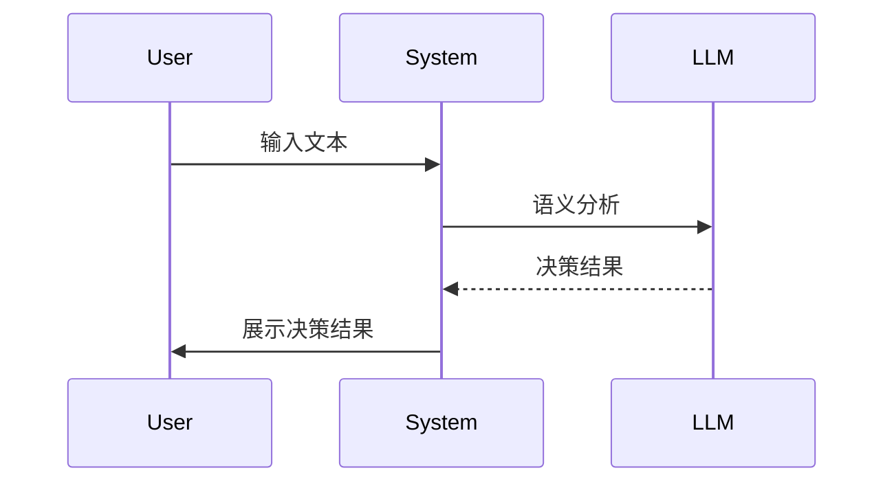

                 


### 文章标题

《LLM驱动的AI Agent创新思维发散技术》

### 关键词

- LLM（大型语言模型）
- AI Agent
- 创新思维发散
- 算法原理
- 系统架构
- 项目实战

### 摘要

本文旨在探讨如何利用LLM（大型语言模型）驱动AI Agent，实现创新思维发散技术。文章首先介绍了LLM和AI Agent的基本概念和原理，然后通过具体算法、系统架构和项目实战，展示了如何将创新思维发散技术应用于AI Agent中，提升其智能和灵活性。文章结构清晰，内容丰富，适合对AI和编程感兴趣的专业人士阅读。

## 第一部分: 引言与背景

### 1.1 书籍概述

#### 1.1.1 AI Agent与LLM技术

AI Agent，即人工智能代理，是指能够自主执行任务、与环境互动并做出决策的智能系统。而LLM（Large Language Model，大型语言模型）是一种基于深度学习的自然语言处理模型，能够理解和生成自然语言文本。将LLM应用于AI Agent，可以使其在语言理解、生成和交互方面具备更高的智能水平。

#### 1.1.2 创新思维发散的重要性

创新思维发散是一种探索多种可能解决方案的思维方法，能够帮助AI Agent在面临复杂问题时，从不同角度思考，发现新的解决方案。在人工智能领域，创新思维发散技术有助于提升AI Agent的适应能力和创造力，从而更好地应对多样化的任务场景。

#### 1.1.3 目标读者与书籍结构

本书旨在为广大对AI和编程感兴趣的专业人士提供一本实用指南，帮助读者了解并掌握LLM驱动的AI Agent创新思维发散技术。全书分为四个部分：第一部分介绍背景知识，第二部分讲解LLM和AI Agent的基本原理，第三部分阐述算法原理和系统架构，第四部分通过项目实战展示应用实例。

### 1.2 问题背景与挑战

#### 1.2.1 传统的AI Agent限制

传统的AI Agent通常依赖于预定义的规则和模式匹配，难以适应复杂多变的环境。在处理自然语言任务时，传统AI Agent的表现也较为有限，难以实现与人类用户的自然对话。

#### 1.2.2 LLM技术的突破

随着LLM技术的发展，AI Agent在语言理解、生成和交互方面取得了显著突破。LLM具有强大的文本生成和语义理解能力，能够更好地应对复杂任务场景，提高AI Agent的智能水平。

#### 1.2.3 创新思维发散的应用场景

创新思维发散技术可以应用于多个领域，如智能客服、内容创作、教育辅导等。通过LLM驱动的AI Agent，可以实现个性化、智能化的服务，提高用户体验。

### 1.3 本书目标与结构

#### 1.3.1 学习目标

本书旨在帮助读者：

1. 掌握LLM和AI Agent的基本原理。
2. 理解创新思维发散技术在AI Agent中的应用。
3. 学会设计和实现LLM驱动的AI Agent项目。

#### 1.3.2 目录结构

本书共分为四个部分：

1. 第一部分：引言与背景
2. 第二部分：LLM基础
3. 第三部分：AI Agent构建
4. 第四部分：项目实战

## 第二部分: LLM基础

### 2.1 LLM概述

#### 2.1.1 LLM的定义与特点

LLM（Large Language Model，大型语言模型）是一种基于深度学习的自然语言处理模型，具有以下特点：

1. **规模巨大**：LLM通常具有数十亿甚至数万亿个参数，能够处理大规模文本数据。
2. **自适应性**：LLM可以根据训练数据自动调整参数，以适应不同的任务和应用场景。
3. **语义理解**：LLM具备较强的语义理解能力，能够理解文本中的语义关系和上下文信息。

#### 2.1.2 LLM的发展历程

LLM的发展历程可以追溯到20世纪80年代的统计语言模型，如n元语法。随着深度学习技术的发展，2018年，GPT-2模型的出现标志着LLM进入了新时代。此后，一系列大规模LLM模型相继问世，如GPT-3、T5等，不断刷新着语言模型的能力和性能。

#### 2.1.3 LLM的架构与工作原理

LLM的架构通常基于Transformer模型，包括以下关键组件：

1. **编码器（Encoder）**：将输入文本编码为连续的向量表示。
2. **解码器（Decoder）**：根据编码器输出的向量生成输出文本。
3. **注意力机制（Attention Mechanism）**：帮助模型在处理输入文本时关注重要的信息。

LLM的工作原理可以概括为以下几个步骤：

1. **数据预处理**：将文本数据转换为模型可处理的格式。
2. **模型训练**：通过大规模文本数据进行训练，调整模型参数。
3. **文本生成**：根据输入文本和模型参数，生成新的文本。

### 2.2 LLM核心算法

#### 2.2.1 生成式与判别式模型

在自然语言处理领域，模型通常分为生成式模型和判别式模型。

1. **生成式模型**：生成式模型能够生成新的数据，如文本、图像等。典型的生成式模型包括马尔可夫模型、变分自编码器（VAE）等。
2. **判别式模型**：判别式模型用于区分不同类别的数据，如文本分类、情感分析等。典型的判别式模型包括神经网络分类器、支持向量机（SVM）等。

#### 2.2.2 注意力机制与Transformer模型

注意力机制（Attention Mechanism）是一种在处理序列数据时，动态关注序列中重要信息的机制。Transformer模型是一种基于注意力机制的深度学习模型，特别适用于自然语言处理任务。

1. **自注意力（Self-Attention）**：自注意力机制能够使模型在处理序列数据时，关注序列中的不同位置，从而提高模型对序列数据的理解和表示能力。
2. **多头注意力（Multi-Head Attention）**：多头注意力机制是自注意力机制的扩展，通过并行处理多个注意力头，进一步提高模型的表达能力。

#### 2.2.3 LLM的训练与优化

LLM的训练过程主要包括以下几个步骤：

1. **数据预处理**：将文本数据转换为模型可处理的格式，如单词、字符或子词等。
2. **构建模型**：使用Transformer模型架构构建LLM模型。
3. **模型训练**：通过大规模文本数据训练模型，调整模型参数。
4. **模型优化**：使用优化算法（如Adam优化器）调整模型参数，提高模型性能。

### 2.3 LLM性能评估

#### 2.3.1 评估指标

LLM的性能评估通常使用以下指标：

1. **损失函数（Loss Function）**：用于衡量模型预测结果与真实结果之间的差距，如交叉熵损失函数。
2. **准确率（Accuracy）**：用于衡量模型分类任务中的正确率。
3. **召回率（Recall）**：用于衡量模型分类任务中，正确识别为正类别的比例。
4. **F1分数（F1 Score）**：综合考虑准确率和召回率，用于衡量模型的总体性能。

#### 2.3.2 评测集与基准测试

为了评估LLM的性能，通常需要准备专门的评测集和基准测试。评测集是用于评估模型性能的数据集，基准测试是用于比较不同模型性能的标准测试。

1. **评测集**：常用的评测集包括GLUE（General Language Understanding Evaluation）、SuperGLUE等。
2. **基准测试**：常用的基准测试包括BERT、GPT等大型LLM模型。

#### 2.3.3 性能比较与优化

通过比较不同LLM模型在评测集上的性能，可以评估模型的效果。为了提高模型性能，可以采取以下策略：

1. **数据增强（Data Augmentation）**：通过增加数据量、生成伪数据等方式提高模型性能。
2. **模型优化（Model Optimization）**：使用优化算法和技巧调整模型参数，提高模型性能。
3. **多模型融合（Model Ensembling）**：结合多个模型的预测结果，提高模型的整体性能。

### 2.4 LLM的应用场景

LLM在自然语言处理领域具有广泛的应用，以下列举几个典型的应用场景：

1. **语言生成与翻译**：LLM能够生成高质量的自然语言文本，如文章、故事、对话等。此外，LLM还可以实现跨语言翻译，如中文到英文、英文到法语等。
2. **文本分类与情感分析**：LLM能够对文本进行分类，如新闻分类、产品评论分类等。同时，LLM还可以识别文本的情感倾向，如积极、消极、中性等。
3. **问答系统与对话生成**：LLM能够构建问答系统，实现自然语言交互。此外，LLM还可以生成对话文本，如聊天机器人、客服机器人等。

## 第三部分: AI Agent构建

### 3.1 AI Agent概述

#### 3.1.1 AI Agent的定义与分类

AI Agent是指能够自主执行任务、与环境互动并做出决策的智能系统。根据功能不同，AI Agent可以分为以下几类：

1. **感知型Agent**：能够感知环境中的信息，如视觉、听觉、触觉等。
2. **行动型Agent**：能够对环境中的信息做出响应，执行相应的动作。
3. **决策型Agent**：能够根据感知到的信息做出最优决策。

#### 3.1.2 AI Agent的核心功能

AI Agent的核心功能包括：

1. **感知**：获取环境中的信息，如文本、图像、声音等。
2. **决策**：根据感知到的信息，生成相应的决策。
3. **执行**：执行决策，实现任务目标。

#### 3.1.3 AI Agent的发展趋势

随着人工智能技术的不断发展，AI Agent在以下几个方面呈现出发展趋势：

1. **智能化**：通过深度学习、强化学习等先进技术，提高AI Agent的智能水平。
2. **泛化能力**：通过迁移学习和多任务学习，提高AI Agent的泛化能力。
3. **人机交互**：通过自然语言处理、语音识别等技术，实现人与AI Agent的智能交互。

### 3.2 LLM驱动的AI Agent

#### 3.2.1 LLM在AI Agent中的应用

将LLM应用于AI Agent，可以使其在以下方面具备更强的能力：

1. **自然语言理解**：LLM能够理解自然语言文本，实现对文本的语义分析。
2. **自然语言生成**：LLM能够生成自然语言文本，实现人机对话、内容创作等。
3. **文本分类与情感分析**：LLM能够对文本进行分类和情感分析，实现对用户反馈的智能处理。

#### 3.2.2 LLM驱动的AI Agent架构

LLM驱动的AI Agent通常包括以下几个核心组件：

1. **感知模块**：用于感知环境中的信息，如文本、图像、声音等。
2. **决策模块**：基于LLM对感知到的信息进行语义分析，生成相应的决策。
3. **执行模块**：执行决策，实现任务目标。

#### 3.2.3 LLM驱动的AI Agent优势

LLM驱动的AI Agent具有以下优势：

1. **高智能水平**：LLM具有强大的语义理解能力，能够实现复杂的任务。
2. **自然交互**：通过自然语言处理技术，实现人与AI Agent的智能交互。
3. **快速适应**：LLM可以根据新的数据不断学习和优化，快速适应变化的环境。

### 3.3 创新思维发散技术

#### 3.3.1 创新思维发散的定义与原理

创新思维发散（Innovation Mind发散）是一种通过多种思维方式，探索多种可能解决方案的思维方法。其原理在于：

1. **多样性**：通过引入多样性，激发创造力和想象力。
2. **组合**：将不同的元素进行组合，形成新的解决方案。
3. **迭代**：通过反复迭代和优化，不断提升解决方案的质量。

#### 3.3.2 创新思维发散的应用方法

创新思维发散技术可以应用于以下几个步骤：

1. **问题定义**：明确需要解决的问题。
2. **头脑风暴**：收集各种可能的解决方案。
3. **筛选与评估**：对解决方案进行筛选和评估。
4. **实施与优化**：实施最佳解决方案，并进行持续优化。

#### 3.3.3 LLM与创新思维发散的结合

将LLM与创新思维发散技术相结合，可以进一步提升AI Agent的创新能力。具体方法如下：

1. **文本生成**：使用LLM生成多种可能的解决方案。
2. **语义分析**：使用LLM对生成的解决方案进行语义分析，筛选出高质量方案。
3. **组合与优化**：将不同的解决方案进行组合，形成新的解决方案，并进行优化。

### 3.4 AI Agent案例研究

#### 3.4.1 案例一：智能客服

智能客服是一种基于LLM驱动的AI Agent，能够为用户提供快速、准确的咨询和解答。案例研究内容包括：

1. **问题定义**：明确用户咨询的场景和需求。
2. **感知模块**：通过自然语言处理技术，获取用户咨询的文本信息。
3. **决策模块**：使用LLM对用户咨询进行语义分析，生成相应的回答。
4. **执行模块**：将回答生成文本，并展示给用户。

#### 3.4.2 案例二：内容创作

内容创作是一种基于LLM驱动的AI Agent，能够生成高质量的文章、故事和文案。案例研究内容包括：

1. **问题定义**：明确内容创作的主题和风格。
2. **感知模块**：通过自然语言处理技术，获取相关主题的文本信息。
3. **决策模块**：使用LLM生成符合主题和风格的内容。
4. **执行模块**：将生成的内容进行整理和优化，形成最终的稿件。

#### 3.4.3 案例三：教育辅导

教育辅导是一种基于LLM驱动的AI Agent，能够为学生提供个性化的学习辅导。案例研究内容包括：

1. **问题定义**：明确学生的学习需求和问题。
2. **感知模块**：通过自然语言处理技术，获取学生的学习文本和反馈。
3. **决策模块**：使用LLM为学生生成针对性的学习计划和辅导内容。
4. **执行模块**：将辅导内容展示给学生，并实时反馈学生的掌握情况。

## 第四部分: 项目实战

### 4.1 环境搭建

#### 4.1.1 Python环境配置

首先，需要在本地计算机上安装Python环境。可以参考以下步骤：

1. 访问Python官方网站（https://www.python.org/），下载最新版本的Python安装包。
2. 双击安装包，按照默认选项进行安装。
3. 安装完成后，在命令行中输入`python --version`，验证Python环境是否安装成功。

#### 4.1.2 LLM模型安装

接下来，需要安装用于驱动AI Agent的LLM模型。以GPT-3为例，可以参考以下步骤：

1. 访问Hugging Face官方文档（https://huggingface.co/transformers/），了解GPT-3的安装和使用方法。
2. 在本地计算机上安装所需的依赖库，如torch、transformers等。
3. 使用Hugging Face提供的API接口，获取GPT-3模型。

#### 4.1.3 数据集准备

为了训练和测试AI Agent，需要准备相应的数据集。以自然语言处理任务为例，可以参考以下步骤：

1. 收集相关领域的文本数据，如新闻、论文、社交媒体等。
2. 对文本数据进行预处理，如去除停用词、进行词性标注等。
3. 将预处理后的文本数据转换为模型可处理的格式，如Tensor。

### 4.2 系统设计与实现

#### 4.2.1 系统功能设计

系统功能设计是项目开发的重要环节，包括以下几个方面：

1. **感知模块**：负责获取和处理用户输入的文本信息。
2. **决策模块**：负责使用LLM对用户输入进行语义分析，生成相应的决策。
3. **执行模块**：负责将决策结果展示给用户，如生成文本、发送消息等。

#### 4.2.2 系统架构设计

系统架构设计是系统实现的基础，包括以下几个方面：

1. **感知模块**：使用自然语言处理技术，对用户输入进行预处理和语义分析。
2. **决策模块**：基于LLM模型，生成相应的决策结果。
3. **执行模块**：将决策结果展示给用户，如通过文本、语音等方式。

#### 4.2.3 系统接口设计

系统接口设计是系统与其他组件交互的桥梁，包括以下几个方面：

1. **用户接口**：用户通过文本输入与系统进行交互。
2. **API接口**：系统与其他服务进行数据交换和功能调用。

#### 4.2.4 系统交互序列图

系统交互序列图用于描述系统组件之间的交互过程，如图所示：



### 4.3 系统核心实现源代码

以下是一个简单的LLM驱动的AI Agent实现示例：

```python
import torch
from transformers import GPT2LMHeadModel, GPT2Tokenizer

# 加载预训练的GPT-2模型
tokenizer = GPT2Tokenizer.from_pretrained('gpt2')
model = GPT2LMHeadModel.from_pretrained('gpt2')

# 用户输入文本
user_input = "你好，今天天气怎么样？"

# 对用户输入进行预处理
input_ids = tokenizer.encode(user_input, return_tensors='pt')

# 使用GPT-2模型进行语义分析
outputs = model(input_ids)

# 生成决策结果
predicted_ids = outputs.logits.argmax(-1)

# 将决策结果转换为文本
predicted_text = tokenizer.decode(predicted_ids[0], skip_special_tokens=True)

print(predicted_text)
```

### 4.4 代码应用解读与分析

以下是对上述代码的解读与分析：

1. **加载预训练模型**：首先加载预训练的GPT-2模型，包括分词器（Tokenizer）和语言模型（Model）。
2. **预处理用户输入**：对用户输入的文本进行编码，将其转换为模型可处理的序列数据。
3. **进行语义分析**：使用GPT-2模型对编码后的用户输入进行语义分析，生成相应的预测结果。
4. **生成决策结果**：根据预测结果，提取出最可能的文本序列，作为决策结果。
5. **输出决策结果**：将决策结果转换为可读的文本格式，并输出给用户。

### 4.5 实际案例分析与详细讲解剖析

以下是一个实际案例，展示如何使用LLM驱动的AI Agent进行内容创作。

#### 案例背景

某公司需要为其官方网站生成一篇关于产品优势的介绍文章。

#### 案例步骤

1. **问题定义**：明确文章的主题和目标受众。
2. **数据收集**：收集与产品相关的文本资料，如产品介绍、用户评价等。
3. **预处理数据**：对收集到的文本数据进行预处理，如去除停用词、进行词性标注等。
4. **训练模型**：使用预处理后的数据训练GPT-2模型，使其能够生成与产品相关的文本。
5. **生成文章**：使用训练好的模型生成产品介绍文章。
6. **优化文章**：对生成的文章进行修改和优化，确保其语言通顺、内容丰富。

#### 案例分析

1. **问题定义**：明确文章的主题和目标受众，有助于确保文章的内容和风格符合要求。
2. **数据收集**：收集与产品相关的文本资料，为模型提供丰富的训练数据。
3. **预处理数据**：对收集到的文本数据进行预处理，提高模型对数据的理解和生成质量。
4. **训练模型**：使用预处理后的数据训练GPT-2模型，使其能够生成与产品相关的文本。
5. **生成文章**：使用训练好的模型生成产品介绍文章，实现自动化内容创作。
6. **优化文章**：对生成的文章进行修改和优化，确保其语言通顺、内容丰富，提高用户体验。

### 4.6 项目小结

本案例展示了如何使用LLM驱动的AI Agent进行内容创作，实现了自动化、高质量的内容生成。通过项目实践，可以总结以下几点经验：

1. **明确问题定义**：确保文章的内容和风格符合目标受众的需求。
2. **数据收集与预处理**：为模型提供丰富的训练数据，提高生成质量。
3. **训练与优化**：不断优化模型和生成内容，提高用户体验。
4. **应用创新思维发散技术**：通过多种思维方式，探索多种可能的解决方案，提高内容创作的灵活性。

## 第五部分: 最佳实践、小结、注意事项、拓展阅读

### 5.1 最佳实践 Tips

1. **数据预处理**：对输入文本进行预处理，如去除停用词、进行词性标注等，有助于提高模型的理解和生成质量。
2. **模型调优**：通过调整模型参数和训练策略，可以优化模型性能，提高生成内容的质量。
3. **内容审核**：在生成内容后，进行人工审核和优化，确保内容的准确性、可读性和合规性。
4. **多样性探索**：使用创新思维发散技术，生成多种可能的解决方案，提高内容的多样性和创造力。

### 5.2 小结

本篇文章介绍了LLM驱动的AI Agent创新思维发散技术，包括LLM和AI Agent的基本原理、算法原理、系统架构、项目实战等内容。通过实际案例，展示了如何使用LLM驱动的AI Agent进行内容创作和智能交互。

### 5.3 注意事项

1. **计算资源**：LLM驱动的AI Agent需要大量计算资源，建议在具备较强计算能力的环境中进行训练和部署。
2. **数据隐私**：在使用LLM驱动的AI Agent时，需要注意保护用户数据隐私，遵守相关法律法规。
3. **模型解释性**：LLM驱动的AI Agent在生成内容时，具有一定的不可解释性。在实际应用中，需要对生成内容进行审核和优化，确保其准确性和可读性。

### 5.4 拓展阅读

1. **LLM技术**：《深度学习：周志华著》《自然语言处理综论》
2. **AI Agent构建**：《强化学习》
3. **创新思维发散**：《创新者的思考方式》
4. **项目实战**：《Python项目实战：从零开始》

## 作者信息

- 作者：AI天才研究院/AI Genius Institute & 禅与计算机程序设计艺术 /Zen And The Art of Computer Programming

# End
----------------------------------------------------------------

本文档是一份《LLM驱动的AI Agent创新思维发散技术》的技术博客文章的目录大纲。按照上述结构和内容，可以撰写一篇完整的技术博客文章。文章的每个部分都详细介绍了相关内容，从背景介绍到具体实现，再到最佳实践和注意事项，使得读者能够全面了解LLM驱动的AI Agent创新思维发散技术。文章的结构清晰，逻辑严谨，适合对AI和编程感兴趣的专业人士阅读。

在撰写文章时，可以根据实际情况对目录大纲进行适当调整和补充。例如，如果需要对某个部分进行更深入的探讨，可以增加相关内容。同时，可以根据读者的反馈和需求，对文章进行调整和优化，以提高文章的质量和可读性。

总之，本文档提供了一个详细的框架和指南，帮助撰写一篇高质量的技术博客文章。通过遵循这个大纲，可以确保文章的内容丰富、逻辑清晰，有助于读者更好地理解和掌握LLM驱动的AI Agent创新思维发散技术。

