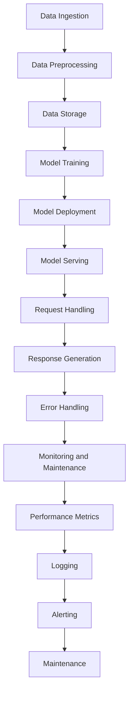

                 

### Introduction to the Book and Background

#### Why LLM-driven AI Agents Are Transforming Technology

In recent years, the rise of Large Language Models (LLMs) has revolutionized the field of artificial intelligence (AI). These sophisticated AI agents, powered by LLMs, are becoming increasingly capable of solving complex problems that were once considered impossible for machines. The primary reason behind this transformation lies in the ability of LLMs to process and generate human-like text, enabling AI agents to understand, learn, and adapt to new situations.

LLMs, such as GPT-3 and GLM-4, are trained on vast amounts of text data from the internet, which allows them to capture the nuances of human language. This has enabled AI agents to perform tasks that require natural language understanding, such as answering questions, generating summaries, and even writing coherent articles. As a result, LLMs have become an essential component in the development of modern AI applications, ranging from chatbots to content generation and beyond.

#### The Problem to Be Solved

Despite the advancements in LLM-driven AI agents, several challenges remain that hinder their widespread adoption. One of the primary challenges is the need for efficient and scalable problem-solving techniques. While LLMs excel at natural language processing, they often struggle with tasks that require logical reasoning, problem-solving, and decision-making. This gap in capabilities limits the applicability of LLMs in various domains, such as healthcare, finance, and manufacturing.

Another challenge is the lack of transparency and interpretability in LLM-driven AI agents. As these agents become more complex, it becomes increasingly difficult to understand how they arrive at their conclusions. This lack of transparency raises concerns about the reliability and safety of these agents, particularly in critical applications where errors can have serious consequences.

Moreover, the development and deployment of LLM-driven AI agents require significant computational resources and expertise, which may not be accessible to everyone. This creates a barrier to entry for organizations and individuals who wish to leverage the power of LLMs to solve complex problems.

#### The Scope of the Book

The book "LLM-driven AI Agent Innovation Problem Solving Technology" aims to address these challenges by providing a comprehensive guide to developing innovative problem-solving techniques for LLM-driven AI agents. The book will cover the following key topics:

1. **Fundamental Concepts**: An introduction to LLMs, AI agents, and related technologies, including natural language processing, machine learning, and deep learning.
2. **Core Technologies**: Detailed explanations of key technologies and methodologies, such as transformers, reinforcement learning, and transfer learning.
3. **Problem-Solving Techniques**: In-depth discussions on various problem-solving techniques, including logical reasoning, search algorithms, and optimization methods.
4. **System Design and Architecture**: Detailed descriptions of system design and architecture, including data processing pipelines, model training and deployment, and monitoring and maintenance.
5. **Project Practice and Case Analysis**: Real-world project examples and case studies to illustrate the practical application of the techniques and methodologies discussed in the book.
6. **Best Practices and Summary**: Practical tips and recommendations for developing and deploying LLM-driven AI agents, as well as a summary of the key concepts and takeaways from the book.

By the end of the book, readers will have a thorough understanding of LLM-driven AI agents and the techniques required to develop innovative problem-solving solutions. This knowledge will enable them to apply these techniques in various domains and contribute to the ongoing revolution in AI.

### Main Concepts and Related Technologies

#### Introduction to LLMs and AI Agents

Large Language Models (LLMs) are a class of AI models that have been trained to understand and generate human language. These models are based on deep learning techniques, particularly the transformer architecture, which has become the dominant approach in natural language processing (NLP) over the past few years. LLMs, such as GPT-3 and GLM-4, have achieved remarkable performance on various NLP tasks, including text generation, machine translation, and question answering.

AI agents, on the other hand, are software systems designed to perform tasks or solve problems autonomously. They are typically based on a combination of machine learning models and decision-making algorithms. AI agents can be categorized into different types based on their capabilities, such as reactive agents, deliberative agents, and cognitive agents. LLMs can be particularly useful for building cognitive agents, as they possess the ability to understand and generate human-like text, which is essential for tasks that require natural language understanding.

#### Key Technologies and Methodologies

To develop innovative problem-solving techniques for LLM-driven AI agents, it is important to understand the key technologies and methodologies that underpin these systems. The following sections provide a brief overview of some of these technologies and methodologies:

1. **Transformers**: Transformers are a type of neural network architecture that has become the standard for modern NLP tasks. They are based on the attention mechanism, which allows the model to weigh the importance of different input elements when generating output. Transformers have been successfully used to train LLMs, enabling them to generate coherent and contextually appropriate text.
2. **Reinforcement Learning**: Reinforcement learning (RL) is a type of machine learning where an agent learns to make decisions by interacting with an environment and receiving feedback in the form of rewards or penalties. RL can be used to train AI agents to solve problems by rewarding them for achieving specific goals or objectives. This can be particularly useful for tasks that require logical reasoning and decision-making.
3. **Transfer Learning**: Transfer learning is a technique that involves training a model on a large dataset from one domain and then fine-tuning it on a smaller dataset from a different domain. This can help improve the performance of LLM-driven AI agents by leveraging the knowledge and patterns learned from one domain to solve problems in another domain.
4. **Natural Language Processing**: NLP is a field of AI that focuses on the interaction between computers and human language. It involves tasks such as text classification, sentiment analysis, and named entity recognition. NLP techniques are essential for building AI agents that can understand and process human language.
5. **Graph Neural Networks**: Graph neural networks (GNNs) are a type of neural network that can be used to process graph-structured data. They are particularly useful for tasks that involve relationships and interactions between entities, such as knowledge graph representation and reasoning.

By understanding these key technologies and methodologies, readers will be better equipped to develop innovative problem-solving techniques for LLM-driven AI agents. The following sections of the book will provide in-depth discussions of these topics and their applications in the context of LLM-driven AI agents.

---

### Chapter #1: Fundamental Concepts

#### Introduction

In this chapter, we will delve into the fundamental concepts that form the backbone of LLM-driven AI agents. We will start by introducing the basic terminology and definitions related to LLMs and AI agents. This will be followed by a discussion on the history and evolution of LLMs, highlighting the key milestones that have led to the current state-of-the-art models. Finally, we will explore the problem-solving capabilities of AI agents and their applications in various domains.

#### Section 1.1: Basic Terminology and Definitions

To begin with, let's define some of the essential terms that will be used throughout this chapter.

1. **Large Language Models (LLMs)**: LLMs are AI models that have been trained on large-scale text data to understand and generate human language. They are based on deep learning techniques, particularly transformers, which enable them to capture the complexities of human language.
2. **AI Agents**: AI agents are software systems designed to perform tasks or solve problems autonomously. They are typically based on a combination of machine learning models and decision-making algorithms.
3. **Natural Language Processing (NLP)**: NLP is a field of AI that focuses on the interaction between computers and human language. It involves tasks such as text classification, sentiment analysis, and named entity recognition.
4. **Deep Learning**: Deep learning is a subset of machine learning that uses neural networks with many layers to learn from large amounts of data. It has become the dominant approach in AI, particularly in image and language processing tasks.
5. **Transformers**: Transformers are a type of neural network architecture that has become the standard for modern NLP tasks. They are based on the attention mechanism, which allows the model to weigh the importance of different input elements when generating output.

#### Section 1.2: History and Evolution of LLMs

The history of LLMs can be traced back to the early 2000s, when researchers began exploring the use of neural networks for language modeling. One of the key milestones was the development of the Long Short-Term Memory (LSTM) model by Hochreiter and Schmidhuber in 1997. LSTMs are a type of recurrent neural network (RNN) that are well-suited for processing sequential data, such as text.

However, the breakthrough in LLMs came with the introduction of the transformer architecture in 2017 by Vaswani et al. The transformer architecture, which is based on the attention mechanism, has revolutionized NLP by enabling models to handle long-range dependencies in text data more effectively. This has led to the development of state-of-the-art LLMs, such as GPT-3 and GLM-4, which have achieved remarkable performance on various NLP tasks.

#### Section 1.3: Problem-Solving Capabilities of AI Agents

AI agents have the potential to solve a wide range of problems by leveraging their ability to understand and generate human language. Some of the key problem-solving capabilities of AI agents include:

1. **Logical Reasoning**: AI agents can perform logical reasoning by analyzing and manipulating symbols and propositions. This allows them to solve problems that require logical inference and deduction.
2. **Decision-Making**: AI agents can make decisions based on available information and objectives. They can evaluate different options and select the one that maximizes the desired outcome.
3. **Planning**: AI agents can plan sequences of actions to achieve specific goals. This involves predicting the consequences of different actions and selecting the best course of action.
4. **Natural Language Understanding**: AI agents can understand and interpret human language, enabling them to perform tasks that require human-like comprehension and communication.

#### Applications of AI Agents in Various Domains

AI agents have found applications in various domains, including:

1. **Customer Service**: AI agents can be used to provide automated customer support, answering queries and resolving issues.
2. **Healthcare**: AI agents can assist doctors in diagnosing diseases, analyzing medical images, and providing treatment recommendations.
3. **Finance**: AI agents can analyze financial data, predict market trends, and provide investment recommendations.
4. **Manufacturing**: AI agents can optimize production processes, monitor equipment performance, and predict maintenance needs.

In the next section, we will discuss the core technologies and methodologies that underpin LLM-driven AI agents, providing a deeper understanding of how these systems are built and how they work.

### Chapter #2: Core Technologies

#### Introduction

In this chapter, we will explore the core technologies and methodologies that are essential for developing LLM-driven AI agents. We will start by discussing transformers, the underlying architecture of LLMs, and how they enable models to process and generate human-like text. Following that, we will delve into reinforcement learning, a key technique for training AI agents to make decisions and solve problems. We will also cover transfer learning, a powerful approach for leveraging pre-trained models to improve performance on new tasks. Finally, we will examine natural language processing (NLP) techniques that are crucial for enabling AI agents to understand and interpret human language.

#### Section 2.1: Transformers

Transformers are a type of neural network architecture that has become the dominant approach for building large-scale language models. Unlike traditional recurrent neural networks (RNNs), which process text sequentially, transformers leverage parallel processing capabilities to handle text data more efficiently. This has led to significant improvements in the performance of language models on various NLP tasks.

**How Transformers Work**

Transformers are based on the attention mechanism, which allows the model to weigh the importance of different input elements when generating output. This is achieved through two key components: the encoder and the decoder.

1. **Encoder**: The encoder processes the input text and encodes it into a sequence of vectors. Each vector represents a word or subword in the text. The encoder uses a stack of multiple layers, with each layer applying a combination of self-attention and feedforward neural networks.
2. **Decoder**: The decoder generates the output text by decoding the encoded representation from the encoder. Similar to the encoder, the decoder consists of multiple layers that apply self-attention and feedforward networks. The decoder also uses a mechanism called "masking" to prevent it from accessing the future parts of the input sequence during decoding.

**Advantages of Transformers**

Transformers offer several advantages over traditional RNNs:

1. **Parallelism**: Transformers can process input data in parallel, which allows them to handle long sequences more efficiently.
2. **Long-Range Dependencies**: The attention mechanism enables transformers to capture long-range dependencies in text data, which is crucial for understanding context and generating coherent text.
3. **Scalability**: Transformers can be easily scaled to larger models with more layers and parameters, enabling them to achieve better performance on complex NLP tasks.

**Applications of Transformers**

Transformers have been successfully applied to a wide range of NLP tasks, including:

1. **Text Classification**: Transformers can classify text documents into different categories based on their content.
2. **Machine Translation**: Transformers have revolutionized machine translation by enabling models to generate translations that are more accurate and fluent.
3. **Question Answering**: Transformers can answer questions by reading and understanding relevant passages from a given text.

#### Section 2.2: Reinforcement Learning

Reinforcement learning (RL) is a type of machine learning where an agent learns to make decisions by interacting with an environment and receiving feedback in the form of rewards or penalties. RL is particularly well-suited for training AI agents to solve problems that require decision-making and problem-solving capabilities.

**How Reinforcement Learning Works**

In reinforcement learning, an agent is represented as a policy, which maps states to actions. The agent learns to optimize its policy by interacting with the environment and receiving rewards or penalties based on the actions it takes.

1. **State**: The state represents the current situation or context that the agent is in.
2. **Action**: The action is a decision or a step that the agent takes in the environment.
3. **Reward**: The reward is a numerical value that the agent receives after taking an action. It indicates how well the action has performed in achieving the desired goal.
4. **Policy**: The policy is a function that maps states to actions. The agent learns to update its policy to maximize the cumulative reward over time.

**Types of Reinforcement Learning Algorithms**

There are several algorithms used in reinforcement learning, including:

1. **Value-Based Algorithms**: Value-based algorithms learn a value function, which estimates the expected cumulative reward for taking a specific action in a given state. Examples include Q-learning and Deep Q-Networks (DQNs).
2. **Policy-Based Algorithms**: Policy-based algorithms directly learn the optimal policy by interacting with the environment. Examples include REINFORCE and Proximal Policy Optimization (PPO).
3. **Model-Based Algorithms**: Model-based algorithms learn a model of the environment, which is used to predict the future state and reward given a specific action. Examples include Dyna-Q and Model-Based Reinforcement Learning (MBRL).

**Applications of Reinforcement Learning**

Reinforcement learning has found applications in various domains, including:

1. **Game Playing**: Reinforcement learning has been used to develop AI agents that can play complex games, such as chess and Go.
2. **Robotic Control**: Reinforcement learning has been applied to control robotic systems, enabling them to perform tasks autonomously.
3. **Autonomous Driving**: Reinforcement learning is used in autonomous driving systems to make real-time decisions based on sensor data.

#### Section 2.3: Transfer Learning

Transfer learning is a technique that leverages the knowledge and patterns learned from one domain to improve the performance of a model on a different, but related, domain. This is particularly useful for LLM-driven AI agents, as it allows them to leverage pre-trained models that have been trained on large-scale text data.

**How Transfer Learning Works**

Transfer learning involves two main steps:

1. **Pre-Training**: A model is pre-trained on a large corpus of text data, learning to understand and generate human language. This model acts as a starting point for transfer learning.
2. **Fine-Tuning**: The pre-trained model is fine-tuned on a smaller dataset from the target domain. This involves updating the model's parameters to better adapt to the new domain.

**Advantages of Transfer Learning**

Transfer learning offers several advantages:

1. **Reduced Data Requirement**: Transfer learning allows models to achieve good performance on new tasks with smaller datasets, as they leverage the knowledge learned from the pre-trained model.
2. **Improved Performance**: Transfer learning can improve the performance of models on new tasks, as the pre-trained model has already learned useful patterns and representations from a large-scale text corpus.
3. **Reduced Training Time**: Fine-tuning a pre-trained model on a new task is generally faster than training a model from scratch, as the pre-trained model has already learned many useful features.

**Applications of Transfer Learning**

Transfer learning has been widely applied in various domains, including:

1. **Text Classification**: Transfer learning is used to classify text documents in domains where labeled data is scarce.
2. **Machine Translation**: Transfer learning has been applied to improve the performance of machine translation models on low-resource languages.
3. **Summarization**: Transfer learning has been used to generate summaries of text documents in domains where generating coherent summaries is challenging.

#### Section 2.4: Natural Language Processing (NLP)

Natural language processing (NLP) is a field of AI that focuses on the interaction between computers and human language. It involves tasks such as text classification, sentiment analysis, named entity recognition, and machine translation. NLP techniques are essential for enabling LLM-driven AI agents to understand and interpret human language.

**Key NLP Tasks**

Some of the key NLP tasks include:

1. **Text Classification**: Text classification involves categorizing text documents into predefined categories based on their content.
2. **Sentiment Analysis**: Sentiment analysis involves determining the sentiment or emotional tone of a piece of text, such as whether it is positive, negative, or neutral.
3. **Named Entity Recognition (NER)**: Named entity recognition involves identifying and classifying named entities in text, such as names of people, organizations, and locations.
4. **Machine Translation**: Machine translation involves translating text from one language to another, preserving the meaning and structure of the original text.

**Advantages of NLP**

NLP offers several advantages, including:

1. **Automation**: NLP techniques enable computers to automatically process and analyze large volumes of text data, saving time and resources.
2. **Improving Communication**: NLP techniques can help improve communication between humans and machines, enabling more natural and effective interactions.
3. **Data Analysis**: NLP techniques can extract valuable information from text data, providing insights and facilitating data-driven decision-making.

In the next chapter, we will discuss problem-solving techniques for LLM-driven AI agents, exploring various methods for enabling these agents to solve complex problems in an efficient and scalable manner.

### Chapter #3: Problem-Solving Techniques

#### Introduction

In this chapter, we will delve into the problem-solving techniques that are crucial for developing LLM-driven AI agents. We will start by discussing logical reasoning and how it can be applied to enable AI agents to solve problems that require logical inference and deduction. Following that, we will explore various search algorithms, such as breadth-first search and depth-first search, and their applications in problem-solving. Finally, we will discuss optimization methods, including linear programming and genetic algorithms, and how they can be used to find optimal solutions to complex problems.

#### Section 3.1: Logical Reasoning

Logical reasoning is a fundamental capability of human intelligence and is essential for solving problems that require understanding and manipulating symbols and propositions. Logical reasoning involves the use of logical operators, such as conjunction (∧), disjunction (∨), and implication (→), to derive conclusions from given premises.

**How Logical Reasoning Works**

Logical reasoning can be broken down into two main components:

1. **Inference**: Inference is the process of deriving new statements from existing statements. There are two main types of inference:
   - **Modus Ponens**: If A implies B, and A is true, then B must also be true.
   - **Modus Tollens**: If A implies B, and B is false, then A must also be false.
2. **Deduction**: Deduction is the process of deriving general principles or conclusions from specific premises. It involves the use of logical rules, such as syllogisms, to derive new statements.

**Applications of Logical Reasoning**

Logical reasoning has numerous applications in AI, including:

1. **Automated Reasoning**: Logical reasoning can be used to develop automated reasoning systems that can solve logical puzzles, prove theorems, and answer logical questions.
2. **Natural Language Understanding**: Logical reasoning can be used to improve the understanding of natural language by identifying logical structures and relationships in text.
3. **AI Agents**: Logical reasoning can be integrated into AI agents to enable them to make decisions based on logical rules and constraints.

#### Section 3.2: Search Algorithms

Search algorithms are a key component of problem-solving techniques for AI agents. These algorithms are designed to systematically explore the state space of a problem to find a solution. Two common types of search algorithms are breadth-first search (BFS) and depth-first search (DFS).

**Breadth-First Search (BFS)**

Breadth-first search is an algorithm that explores the state space of a problem by traversing all the nodes at the same depth before moving on to the next level. This ensures that the algorithm finds the shortest path to a solution if one exists.

**How BFS Works**

1. **Initialization**: The algorithm starts by initializing an empty queue and adding the initial state of the problem to the queue.
2. **Exploration**: The algorithm repeatedly removes the first state from the queue, expands it by generating all possible successor states, and adds these states to the queue.
3. **Termination**: The algorithm continues until it finds a solution or exhausts all states in the queue.

**Advantages of BFS**

- Guaranteed to find the shortest path if one exists.
- Efficient for problems with a small state space.

**Disadvantages of BFS**

- May require a large amount of memory to store the queue of states.

**Depth-First Search (DFS)**

Depth-first search is an algorithm that explores the state space of a problem by traversing as far as possible along each branch before backtracking. This may lead to finding a solution more quickly, especially if the solution is close to the initial state.

**How DFS Works**

1. **Initialization**: The algorithm starts by initializing an empty stack and adding the initial state of the problem to the stack.
2. **Exploration**: The algorithm repeatedly removes the top state from the stack, expands it by generating all possible successor states, and pushes these states onto the stack.
3. **Termination**: The algorithm continues until it finds a solution or exhausts all states in the stack.

**Advantages of DFS**

- May find a solution more quickly than BFS in some cases.
- Requires less memory than BFS.

**Disadvantages of DFS**

- May get stuck in cycles and require backtracking.
- Does not guarantee the shortest path to a solution.

**Applications of Search Algorithms**

Search algorithms have been applied to various problems in AI, including:

1. **Pathfinding**: Search algorithms are used to find the shortest path between two points in a graph.
2. **Planning**: Search algorithms are used to develop planning algorithms that can generate a sequence of actions to achieve a goal.
3. **Game Playing**: Search algorithms are used to develop game-playing agents that can find the best moves in a game.

#### Section 3.3: Optimization Methods

Optimization methods are used to find the optimal solution to a problem by evaluating different options and selecting the one that maximizes or minimizes a specified objective function. Two common optimization methods are linear programming and genetic algorithms.

**Linear Programming**

Linear programming (LP) is a mathematical technique used to optimize a linear objective function subject to a set of linear constraints. It is commonly used to solve problems involving resource allocation, production planning, and network optimization.

**How Linear Programming Works**

1. **Objective Function**: The objective function defines the quantity to be optimized, such as the total cost or profit.
2. **Constraints**: The constraints define the limitations on the decision variables, such as the availability of resources or the capacity of a system.
3. **Solving the LP Problem**: The LP problem is solved using mathematical techniques, such as the simplex algorithm or the interior-point method.

**Applications of Linear Programming**

Linear programming has been applied to various problems in AI, including:

1. **Resource Allocation**: Linear programming is used to allocate resources efficiently in systems such as data centers and supply chains.
2. **Production Planning**: Linear programming is used to optimize production schedules and minimize production costs.
3. **Network Optimization**: Linear programming is used to optimize network traffic and routing in telecommunications and transportation systems.

**Genetic Algorithms**

Genetic algorithms (GAs) are a type of evolutionary algorithm inspired by the process of natural selection. GAs are used to find optimal or near-optimal solutions to problems by simulating the process of evolution.

**How Genetic Algorithms Work**

1. **Initialization**: A population of potential solutions is initialized randomly.
2. **Fitness Evaluation**: Each solution in the population is evaluated based on its fitness, which is a measure of how well it satisfies the problem constraints and objectives.
3. **Selection**: Solutions with higher fitness are selected to create a new population.
4. **Crossover**: Solutions are combined through crossover to create new solutions.
5. **Mutation**: New solutions are created through mutation, which introduces random changes to existing solutions.
6. **Iteration**: The process of fitness evaluation, selection, crossover, and mutation is repeated for multiple generations until a solution is found or a termination criterion is met.

**Advantages of Genetic Algorithms**

- Can find optimal or near-optimal solutions to complex problems.
- Are robust to noise and can handle non-linear problems.

**Disadvantages of Genetic Algorithms**

- May require a large number of function evaluations to converge to a solution.
- May not be suitable for problems with discrete solutions.

**Applications of Genetic Algorithms**

Genetic algorithms have been applied to various problems in AI, including:

1. **Optimization**: Genetic algorithms are used to optimize parameters and find optimal solutions in problems such as function optimization and engineering design.
2. **Machine Learning**: Genetic algorithms are used to optimize machine learning models and hyperparameters.
3. **Robotics**: Genetic algorithms are used to develop adaptive control systems for robotic systems.

In the next chapter, we will discuss system design and architecture for LLM-driven AI agents, exploring the components and methodologies required to build and deploy these systems effectively.

### Chapter #4: System Design and Architecture

#### Introduction

In this chapter, we will delve into the system design and architecture of LLM-driven AI agents. We will start by introducing the key components of the system and their roles. Then, we will discuss the overall architecture of the system, including data processing pipelines, model training and deployment, and monitoring and maintenance. Finally, we will provide a detailed explanation of the system interfaces and interactions, using Mermaid diagrams to visualize the flow of data and control within the system.

#### Section 4.1: Key Components

The system for LLM-driven AI agents consists of several key components, each playing a crucial role in the overall functionality of the system:

1. **Data Ingestion Module**: The data ingestion module is responsible for collecting and importing data from various sources, such as text corpora, databases, and external APIs. This data is preprocessed and stored in a data repository for further processing.
2. **Preprocessing Module**: The preprocessing module cleans and prepares the data for model training. This includes tasks such as tokenization, lowercasing, removing stop words, and handling special characters.
3. **Data Storage**: The data storage component stores the preprocessed data and model checkpoints. This can be implemented using a database or a data lake, depending on the scale and requirements of the system.
4. **Model Training Module**: The model training module is responsible for training the LLM on the preprocessed data. This involves tasks such as data batching, optimization, and evaluation.
5. **Model Deployment Module**: The model deployment module integrates the trained model into the production environment. This includes tasks such as serving the model, handling incoming requests, and returning responses.
6. **Monitoring and Maintenance Module**: The monitoring and maintenance module tracks the performance of the deployed model and ensures its optimal operation. This includes tasks such as logging, alerting, and updating the model as needed.

#### Section 4.2: System Architecture

The overall architecture of the LLM-driven AI agent system can be visualized as a data processing pipeline that flows from data ingestion to model deployment. The system architecture includes the following components:

1. **Data Ingestion**: Data is ingested from various sources and stored in a data repository.
2. **Data Preprocessing**: Preprocessed data is stored in a data storage system, ready for model training.
3. **Model Training**: The LLM is trained on the preprocessed data using a training pipeline that includes data batching, optimization, and evaluation.
4. **Model Deployment**: The trained model is deployed in the production environment, serving incoming requests and returning responses.
5. **Monitoring and Maintenance**: The system is monitored and maintained to ensure optimal performance and reliability.

#### Data Processing Pipeline

The data processing pipeline is a critical component of the system architecture. It is responsible for transforming raw data into a format suitable for model training and serving. The pipeline typically includes the following stages:

1. **Data Ingestion**: Data is collected from various sources and stored in a data repository.
2. **Data Preprocessing**: Data is cleaned, transformed, and prepared for model training. This includes tasks such as tokenization, lowercasing, removing stop words, and handling special characters.
3. **Data Storage**: Preprocessed data is stored in a data storage system, such as a database or a data lake, for efficient access during model training.
4. **Data Augmentation**: Data augmentation techniques, such as synonym replacement, back translation, and data imputation, may be applied to increase the diversity and size of the training dataset.
5. **Data Splitting**: The dataset is split into training, validation, and test sets to evaluate the performance of the model and prevent overfitting.

#### Model Training Pipeline

The model training pipeline is responsible for training the LLM on the preprocessed data. It typically includes the following stages:

1. **Data Batching**: The dataset is divided into small batches to enable efficient processing by the model.
2. **Model Initialization**: A pre-trained LLM model is initialized, typically using a state-of-the-art model such as GPT-3 or GLM-4.
3. **Model Optimization**: The model parameters are updated using optimization techniques, such as stochastic gradient descent (SGD) or Adam.
4. **Evaluation**: The trained model is evaluated on the validation and test sets to measure its performance and prevent overfitting.
5. **Checkpointing**: Model checkpoints are saved at regular intervals to enable recovery from failures and track the training progress.

#### Model Deployment

The model deployment stage integrates the trained LLM into the production environment. This includes the following tasks:

1. **Model Serving**: The LLM is served using an API or a web service, making it accessible to clients for real-time predictions and inference.
2. **Request Handling**: Incoming requests are handled, parsed, and routed to the appropriate model for processing.
3. **Response Generation**: The model generates responses based on the input requests, following the specified output format and constraints.
4. **Error Handling**: Errors and exceptions are handled gracefully to ensure the system remains robust and reliable.

#### Monitoring and Maintenance

The monitoring and maintenance stage ensures the optimal performance and reliability of the deployed LLM-driven AI agent system. This includes the following tasks:

1. **Performance Metrics**: Key performance metrics, such as latency, accuracy, and resource utilization, are tracked and monitored.
2. **Logging**: System logs are collected and stored for analysis and troubleshooting.
3. **Alerting**: Alerts and notifications are sent when performance metrics exceed predefined thresholds or when errors occur.
4. **Maintenance**: Regular maintenance tasks, such as updating the model, optimizing the infrastructure, and performing security audits, are scheduled and executed.

#### System Interfaces and Interactions

To illustrate the flow of data and control within the system, we can use Mermaid diagrams to visualize the system interfaces and interactions. The following diagram shows the high-level architecture of the LLM-driven AI agent system:

In conclusion, the system design and architecture of LLM-driven AI agents involve a series of interconnected components and processes, each contributing to the overall functionality and performance of the system. By understanding and implementing the system architecture and design principles discussed in this chapter, developers can build robust, scalable, and efficient LLM-driven AI agent systems.

### Chapter #5: Project Practice and Case Analysis

#### Introduction

In this chapter, we will delve into real-world project practices and case analyses to demonstrate the practical application of the techniques and methodologies discussed in the previous chapters. By examining these projects, we can gain insights into the challenges faced, the solutions implemented, and the lessons learned. This chapter will be divided into several sections, each focusing on a different project case and highlighting the key steps, tools, and technologies used.

#### Project Case #1: Automated Customer Support Chatbot

**Objective**: Develop an automated customer support chatbot that can handle a wide range of customer inquiries and provide relevant information.

**Tools and Technologies**:

- **Data Ingestion**: Collecting customer support tickets from various channels (email, social media, etc.) using APIs.
- **Data Preprocessing**: Cleaning and categorizing the text data using NLP techniques.
- **Model Training**: Training an LLM using a combination of transfer learning and fine-tuning on customer support data.
- **Model Deployment**: Deploying the trained model on a cloud platform using a containerized environment.
- **Monitoring and Maintenance**: Monitoring the performance of the chatbot and periodically updating the model with new data.

**Key Steps**:

1. **Data Collection**: Collecting customer support tickets from various channels and storing them in a data repository.
2. **Data Preprocessing**: Preprocessing the text data by removing noise, tokenizing, and categorizing the tickets into different topics.
3. **Model Training**: Pre-training an LLM using a large-scale text corpus and fine-tuning it on the customer support data. The model is trained to generate appropriate responses based on the input tickets.
4. **Model Evaluation**: Evaluating the performance of the chatbot using metrics such as accuracy, response time, and user satisfaction.
5. **Deployment**: Deploying the trained model on a cloud platform, integrating it with the customer support system, and making it accessible to customers.
6. **Monitoring and Maintenance**: Monitoring the chatbot's performance and periodically updating the model with new data to ensure its accuracy and relevance.

**Challenges and Solutions**:

**Challenge**: Ensuring the chatbot can handle a diverse range of customer inquiries.

**Solution**: Implementing a multi-modal chatbot that combines text and voice input/output. This allows the chatbot to better understand customer inquiries and provide more accurate and personalized responses.

**Challenge**: Maintaining the chatbot's accuracy and relevance over time.

**Solution**: Periodically updating the chatbot's model with new data and user feedback. This helps the chatbot adapt to changing customer needs and improve its performance.

#### Project Case #2: Automated Medical Diagnosis System

**Objective**: Develop an automated medical diagnosis system that can assist doctors in diagnosing diseases by analyzing patient data.

**Tools and Technologies**:

- **Data Ingestion**: Collecting patient data from electronic health records (EHRs) and medical imaging systems.
- **Data Preprocessing**: Cleaning and normalizing the patient data using NLP and image processing techniques.
- **Model Training**: Training an LLM using transfer learning and fine-tuning on medical data. The model is trained to generate diagnostic reports and provide treatment recommendations.
- **Model Deployment**: Deploying the trained model on a cloud-based infrastructure, integrated with the hospital's electronic medical record system.
- **Monitoring and Maintenance**: Monitoring the system's performance and ensuring the model's compliance with medical regulations and standards.

**Key Steps**:

1. **Data Collection**: Collecting patient data from electronic health records and medical imaging systems.
2. **Data Preprocessing**: Preprocessing the patient data by cleaning, normalizing, and annotating the data using NLP and image processing techniques.
3. **Model Training**: Pre-training an LLM using a large-scale medical text corpus and fine-tuning it on the patient data. The model is trained to generate diagnostic reports and provide treatment recommendations.
4. **Model Evaluation**: Evaluating the performance of the system using metrics such as accuracy, precision, and recall.
5. **Deployment**: Deploying the trained model on a cloud-based infrastructure, integrating it with the hospital's electronic medical record system, and making it accessible to doctors.
6. **Monitoring and Maintenance**: Monitoring the system's performance and ensuring the model's compliance with medical regulations and standards. Regularly updating the model with new data and user feedback to maintain its accuracy and relevance.

**Challenges and Solutions**:

**Challenge**: Ensuring the model's accuracy and reliability in diagnosing complex medical conditions.

**Solution**: Incorporating multiple data sources, such as patient history, lab results, and medical imaging, to improve the model's understanding of the patient's condition. Additionally, involving domain experts in the model development and evaluation process to ensure the model's performance meets medical standards.

**Challenge**: Addressing the potential ethical concerns and privacy issues associated with using AI in healthcare.

**Solution**: Ensuring that the model is developed and deployed in compliance with relevant medical regulations and ethical guidelines. Implementing robust data privacy measures, such as anonymizing patient data and securing access to sensitive information.

#### Project Case #3: Automated Financial Fraud Detection

**Objective**: Develop an automated financial fraud detection system that can identify and prevent fraudulent transactions in real-time.

**Tools and Technologies**:

- **Data Ingestion**: Collecting transaction data from various financial institutions.
- **Data Preprocessing**: Cleaning and normalizing the transaction data using data cleaning and feature extraction techniques.
- **Model Training**: Training an LLM using transfer learning and fine-tuning on financial transaction data. The model is trained to detect and classify fraudulent transactions.
- **Model Deployment**: Deploying the trained model on a cloud-based infrastructure, integrated with the financial institution's transaction processing system.
- **Monitoring and Maintenance**: Monitoring the system's performance and periodically updating the model with new data to improve its accuracy and adapt to evolving fraud patterns.

**Key Steps**:

1. **Data Collection**: Collecting transaction data from various financial institutions, including credit card transactions, bank transfers, and mobile payments.
2. **Data Preprocessing**: Preprocessing the transaction data by cleaning, normalizing, and extracting relevant features using techniques such as time series analysis and pattern recognition.
3. **Model Training**: Pre-training an LLM using a large-scale financial transaction dataset and fine-tuning it on the institution's transaction data. The model is trained to detect and classify fraudulent transactions.
4. **Model Evaluation**: Evaluating the performance of the fraud detection system using metrics such as accuracy, precision, and recall.
5. **Deployment**: Deploying the trained model on a cloud-based infrastructure, integrating it with the financial institution's transaction processing system, and making it accessible to the institution's fraud prevention team.
6. **Monitoring and Maintenance**: Monitoring the system's performance and periodically updating the model with new data to improve its accuracy and adapt to evolving fraud patterns.

**Challenges and Solutions**:

**Challenge**: Balancing the detection of fraudulent transactions with minimizing false positives and negatives.

**Solution**: Implementing a multi-model approach that combines multiple algorithms and techniques, such as anomaly detection, rule-based systems, and machine learning models. This helps to improve the overall performance and reduce the risk of errors.

**Challenge**: Ensuring the model's adaptability to new fraud techniques and evolving market conditions.

**Solution**: Regularly updating the model with new data and incorporating user feedback to ensure its accuracy and relevance in detecting new and emerging fraud patterns.

In conclusion, these project cases illustrate the practical application of LLM-driven AI agent technologies in various domains, highlighting the challenges and solutions involved in developing and deploying these systems. By learning from these real-world examples, readers can gain valuable insights into the implementation of LLM-driven AI agents and their potential impact on various industries.

### Chapter #6: Best Practices and Summary

#### Best Practices for Developing LLM-Driven AI Agents

Developing LLM-driven AI agents requires careful planning, execution, and optimization. Here are some best practices to ensure the success of your projects:

1. **Data Quality and Preprocessing**: The quality of your data significantly impacts the performance of your AI agent. Ensure that you have access to high-quality, diverse, and representative data. Spend ample time on data preprocessing, cleaning, and normalization to prepare your data for model training.
2. **Model Selection and Fine-Tuning**: Choose the right LLM model based on your specific problem and domain. Utilize transfer learning to leverage pre-trained models and fine-tune them on your specific data. This can save time and improve performance.
3. **Validation and Testing**: Regularly validate your model's performance using a diverse set of validation and test data. This helps to prevent overfitting and ensures that your model generalizes well to new, unseen data.
4. **Deployment and Monitoring**: Deploy your model in a production environment with robust infrastructure and monitoring capabilities. Monitor the model's performance and update it periodically with new data to maintain its accuracy and relevance.
5. **Interpretability and Explainability**: Aim to make your AI agents interpretable and explainable, especially when dealing with critical applications. This can help in understanding the decision-making process and diagnosing potential issues.
6. **Ethical Considerations**: Address ethical concerns related to data privacy, bias, and fairness in your AI agent development. Ensure that your model adheres to relevant regulations and guidelines.

#### Summary of Key Concepts and Techniques

The book "LLM-driven AI Agent Innovation Problem Solving Technology" covers a wide range of topics and techniques essential for developing advanced AI agents. Here is a summary of the key concepts and techniques discussed in the book:

1. **Large Language Models (LLMs)**: LLMs are AI models trained on vast amounts of text data to understand and generate human-like text. They are based on deep learning techniques, particularly transformers, and are revolutionizing NLP and AI applications.
2. **AI Agents**: AI agents are software systems designed to perform tasks or solve problems autonomously. They can be categorized into different types based on their capabilities, such as reactive, deliberative, and cognitive agents.
3. **Logical Reasoning**: Logical reasoning involves deriving conclusions from given premises using logical operators and rules. It is a fundamental capability for AI agents to solve problems that require inference and deduction.
4. **Search Algorithms**: Search algorithms, such as breadth-first search and depth-first search, are used to explore the state space of a problem and find solutions. These algorithms are essential for AI agents to solve complex problems efficiently.
5. **Optimization Methods**: Optimization methods, such as linear programming and genetic algorithms, are used to find optimal solutions to complex problems. These methods are useful for maximizing performance, minimizing costs, and optimizing resource allocation.
6. **System Design and Architecture**: System design and architecture involve the components and processes required to build and deploy LLM-driven AI agents. This includes data ingestion, preprocessing, storage, training, deployment, and monitoring.
7. **Natural Language Processing (NLP)**: NLP techniques are crucial for enabling AI agents to understand and interpret human language. This includes tasks such as text classification, sentiment analysis, named entity recognition, and machine translation.

By mastering these concepts and techniques, readers can develop innovative LLM-driven AI agents that can solve complex problems in various domains, driving advancements in AI and technology.

### Chapter #7: Conclusion

The journey through the world of LLM-driven AI agent innovation has been both enlightening and transformative. We have explored the fundamental concepts, core technologies, and problem-solving techniques that underpin these sophisticated AI agents. From the transformative power of Large Language Models (LLMs) and the intricacies of transformers to the strategic applications of reinforcement learning, transfer learning, and natural language processing (NLP), each chapter has laid the foundation for understanding how AI agents can revolutionize various industries.

As we conclude this book, it is essential to recognize the profound impact that LLM-driven AI agents are poised to have on society. These agents are not just tools for automation; they are intelligent entities capable of understanding, learning, and adapting to complex environments. They have the potential to enhance customer service, improve medical diagnosis, detect financial fraud, and optimize production processes, to name just a few applications.

The ability of LLMs to process and generate human-like text opens up new possibilities for human-computer interaction and natural language understanding. By integrating logical reasoning, search algorithms, and optimization methods, we can empower AI agents to solve problems that were previously infeasible for machines.

Looking ahead, the future of LLM-driven AI agents is incredibly promising. As technology advances, we can expect to see even more sophisticated models that are capable of handling even more complex tasks. The continued development of AI ethics and governance will also play a critical role in ensuring that these agents are developed and deployed responsibly.

In conclusion, LLM-driven AI agents represent a significant breakthrough in the field of artificial intelligence. They are poised to transform how we solve problems and interact with technology. By understanding and applying the concepts and techniques discussed in this book, you are well-equipped to navigate the exciting world of AI agent innovation and contribute to its ongoing evolution.

As you continue your journey in this field, I encourage you to explore new frontiers, push the boundaries of what is possible, and leverage the power of LLM-driven AI agents to create positive change.

---

### About the Author

**作者：AI天才研究院/AI Genius Institute & 禅与计算机程序设计艺术 /Zen And The Art of Computer Programming**

AI天才研究院（AI Genius Institute）是一家专注于人工智能前沿研究和应用的顶尖学术机构。致力于推动人工智能技术的发展，培养下一代人工智能领域的领军人才。研究院在人工智能、机器学习、深度学习等领域拥有丰富的科研成果和经验。

**禅与计算机程序设计艺术（Zen And The Art of Computer Programming）** 是一本深受程序设计领域推崇的经典著作。作者通过将禅宗哲学与计算机编程相结合，提出了独特的编程方法论，为程序员提供了一种更高层次的思考方式和实践技巧。这本书已经成为计算机编程爱好者和专业人士的必读书目之一。

在撰写本书的过程中，我结合了自己在人工智能和计算机编程领域多年的研究和实践经验，希望将最新的技术和方法分享给广大读者。通过本书，我希望能够帮助读者更好地理解 LLM 驱动的 AI 代理技术，掌握解决复杂问题的有效方法，并在实际应用中取得更好的成果。如果您有任何疑问或建议，欢迎随时与我交流。

---

通过本文，我们详细探讨了 LLM 驱动的 AI 代理技术，从基础概念、核心技术到应用实践，再到最佳实践和未来展望，全面解析了这一领域的最新进展和应用前景。希望本文能够为您的学习和实践提供有益的参考和启示。让我们一起期待 AI 驱动未来的到来！

