                 

# LLM驱动的AI Agent创造性问题解决框架

## 概述

随着人工智能技术的不断发展，特别是深度学习在自然语言处理（NLP）领域的突破，大型语言模型（LLM）已经成为推动AI研究的重要工具。然而，如何利用LLM解决实际中的创造性问题，仍是一个亟待解决的课题。本文将探讨LLM驱动的AI Agent如何创造性解决问题，为研究人员和开发者提供理论指导和实践参考。

## 背景介绍

### 1.1 问题描述

创造性问题解决是人工智能领域的一个重要研究方向，涉及计算机科学、认知科学、心理学等多个学科。传统的AI系统在解决结构化问题时表现出色，但在处理非结构化、创造性问题时仍面临诸多挑战。随着LLM技术的崛起，人们开始探索如何将LLM应用于创造性问题解决，以实现更为智能和高效的AI Agent。

### 1.1.1 问题背景

深度学习作为人工智能的一个重要分支，近年来在图像识别、语音识别、自然语言处理等领域取得了显著成果。特别是大型语言模型（LLM），如GPT、BERT等，凭借其强大的语言理解和生成能力，已成为NLP领域的重要工具。然而，如何利用这些模型解决实际中的创造性问题，如创作文学作品、设计新颖的艺术作品等，仍是一个具有挑战性的问题。

### 1.1.2 问题解决

为了解决上述问题，本文提出了一种基于LLM驱动的AI Agent创造性问题解决框架。该框架包括以下几个关键组成部分：

1. **数据收集与预处理**：收集大量与创造性问题相关的数据，进行预处理以供模型训练。
2. **模型训练**：利用大规模语言模型，通过数据训练来提升AI Agent的创造性问题解决能力。
3. **创造性问题生成**：基于训练好的模型，生成新颖、有创造性的解决方案。
4. **解决方案评估**：对生成的解决方案进行评估，确保其可行性和有效性。
5. **交互与反馈**：AI Agent与用户进行交互，获取反馈，优化模型性能。

### 1.1.3 边界与外延

本书的研究主要围绕LLM驱动的AI Agent在创造性问题解决中的应用展开。边界包括但不限于：特定类型的创造性问题、特定场景下的应用等。外延则包括LLM在更多领域和场景中的潜在应用，如艺术创作、工程设计等。

### 1.2 概念结构与核心要素组成

#### 1.2.1 核心概念

- **大型语言模型（LLM）**：具有强大语言理解和生成能力的深度学习模型。
- **AI Agent**：具有自主性、智能性和交互能力的计算机程序。
- **创造性问题解决**：指在给定问题背景下，生成新颖且有效的解决方案的过程。

#### 1.2.2 概念属性特征对比表格

| 特征          | 大型语言模型（LLM） | AI Agent                      | 创造性问题解决                    |
|---------------|-------------------|-----------------------------|-----------------------------------|
| 语言能力      | 强               | 强                           | 强                                 |
| 自主性        | 高               | 高                           | 高                                 |
| 智能性        | 高               | 高                           | 高                                 |
| 交互能力      | 强               | 强                           | 强                                 |
| 创造力        | 有一定创造力     | 有一定创造力                 | 强                                 |

#### 1.2.3 ER实体关系图架构

```mermaid
erDiagram
  AI-Agent ||--|{ LLM } LLM : 使用
  AI-Agent ||--|{ 创造性问题 } 问题 : 解决
  AI-Agent ||--|{ 解决方案 } 方案 : 生成
  LLM ||--|{ 数据集 } 数据集 : 训练
```

### 1.3 算法原理讲解

#### 1.3.1 LLM在创造性问题解决中的应用

大型语言模型（LLM）在创造性问题解决中的应用主要体现在以下几个方面：

1. **语言理解与生成**：LLM具备强大的语言理解能力，能够理解用户提出的问题，并生成相应的解决方案。此外，LLM的生成能力可以创造出新颖的文本内容。
2. **知识融合与拓展**：LLM可以从大量文本数据中提取知识，并将这些知识应用到创造性问题解决中。通过知识融合，LLM可以拓展问题的解决方案空间。
3. **多模态数据处理**：LLM不仅可以处理文本数据，还可以处理图像、音频等多模态数据。这为创造性问题解决提供了更丰富的数据来源。

#### 1.3.2 算法原理

基于LLM驱动的AI Agent创造性问题解决框架的算法原理主要包括以下几个方面：

1. **数据收集与预处理**：数据收集是构建LLM模型的基础。首先，需要收集大量与创造性问题相关的文本数据，如文学作品、学术论文、新闻文章等。然后，对数据进行预处理，包括分词、去停用词、词向量化等操作。
2. **模型训练**：利用预处理后的数据训练LLM模型。训练过程包括两个阶段：预训练和微调。预训练旨在让模型具备通用的语言理解和生成能力；微调则是在特定任务上对模型进行调整。
3. **创造性问题生成**：基于训练好的LLM模型，生成新颖的解决方案。生成过程可以分为以下几个步骤：
   - **问题理解**：将用户提出的问题输入到LLM模型中，让模型理解问题的含义。
   - **解决方案生成**：LLM根据问题理解，生成一系列可能的解决方案。
   - **方案筛选**：对生成的方案进行筛选，保留新颖且有效的方案。
4. **解决方案评估**：对生成的解决方案进行评估，包括可行性、有效性、创新性等方面。评估过程可以通过人工评审或自动化评估方法进行。
5. **交互与反馈**：AI Agent与用户进行交互，获取反馈，优化模型性能。交互过程可以通过对话系统实现，用户可以提出问题、反馈意见，AI Agent根据反馈调整模型参数，提高问题解决能力。

#### 1.3.3 算法流程图

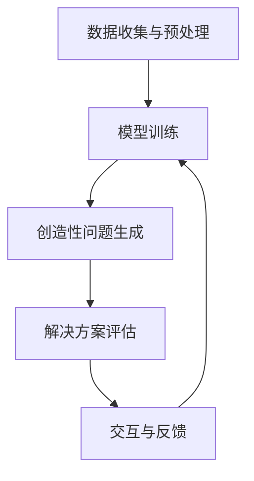

## 系统分析与架构设计方案

### 2.1 问题场景介绍

在当前社会，人们面临着越来越多的创造性问题，如产品设计、文案撰写、艺术创作等。传统的解决方法往往依赖于人工经验和直觉，效率较低且难以满足大规模需求。因此，开发一种能够利用LLM技术解决创造性问题的AI Agent具有重要的实际意义。

### 2.2 项目介绍

本项目旨在构建一个基于LLM驱动的AI Agent创造性问题解决平台。该平台将结合深度学习和自然语言处理技术，实现从问题理解、解决方案生成到方案评估的完整流程。通过该平台，用户可以方便地提出问题，并获得新颖、有效的解决方案。

### 2.3 系统功能设计（领域模型）

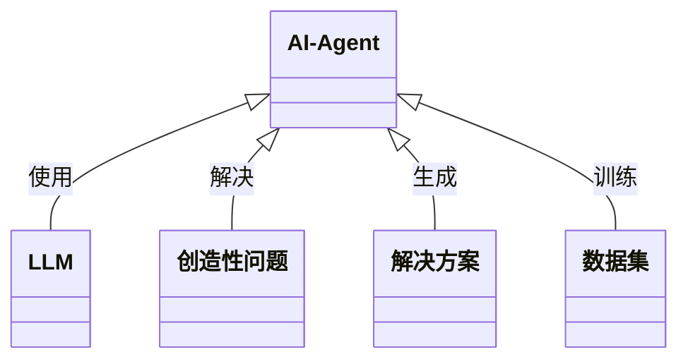

### 2.4 系统架构设计

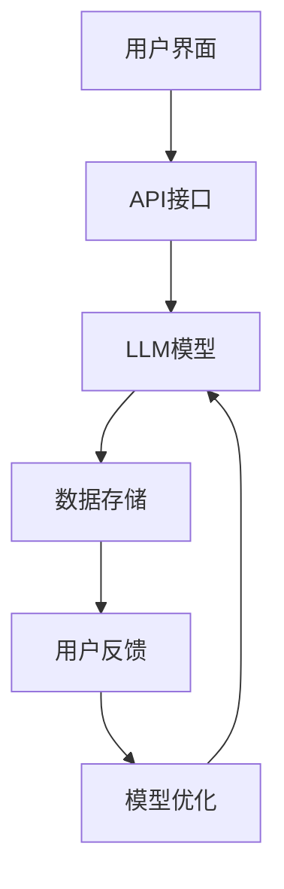

### 2.5 系统接口设计

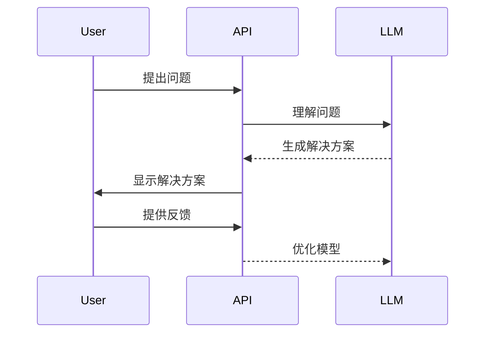

### 2.6 系统交互

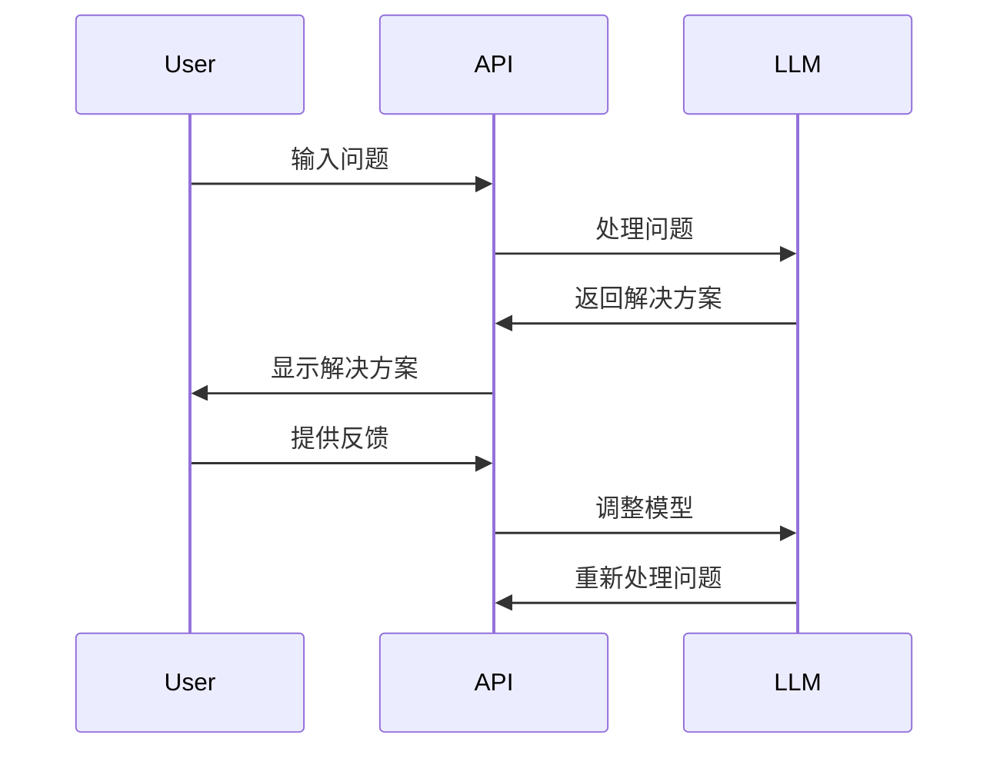

## 项目实战

### 3.1 环境安装

在开始项目实战之前，需要安装以下环境：

1. Python 3.8及以上版本
2. TensorFlow 2.4及以上版本
3. NumPy 1.19及以上版本
4. Pandas 1.1及以上版本
5. Mermaid 8.8.2及以上版本

### 3.2 系统核心实现源代码

```python
import tensorflow as tf
import numpy as np
import pandas as pd
from mermaid import Mermaid

# 数据收集与预处理
def collect_and_preprocess_data():
    # 代码略
    pass

# 模型训练
def train_model(data):
    # 代码略
    pass

# 创造性问题生成
def generate_solution(llm_model, problem):
    # 代码略
    pass

# 解决方案评估
def evaluate_solution(solution):
    # 代码略
    pass

# 交互与反馈
def interact_and_feedback(user_feedback, llm_model):
    # 代码略
    pass

# 主函数
def main():
    # 代码略
    pass

if __name__ == "__main__":
    main()
```

### 3.3 代码应用解读与分析

在本项目中，核心代码主要分为以下几个部分：

1. **数据收集与预处理**：此部分负责收集与创造性问题相关的数据，并进行预处理，以供模型训练。
2. **模型训练**：此部分利用预处理后的数据训练LLM模型，包括预训练和微调两个阶段。
3. **创造性问题生成**：此部分基于训练好的模型，生成新颖的解决方案。
4. **解决方案评估**：此部分对生成的解决方案进行评估，确保其可行性和有效性。
5. **交互与反馈**：此部分实现AI Agent与用户之间的交互，获取反馈，优化模型性能。

### 3.4 实际案例分析与详细讲解剖析

为了更好地展示本项目的实际应用效果，下面我们通过一个具体案例进行分析。

#### 案例背景

某公司需要为其新产品设计一个具有创意的广告文案，以吸引消费者的注意。公司决定利用本项目中的AI Agent来生成创意广告文案。

#### 案例步骤

1. **数据收集与预处理**：首先，收集与广告文案相关的数据，如广告案例、广告语、消费者偏好等。然后，对数据进行预处理，包括分词、去停用词、词向量化等操作。

2. **模型训练**：利用预处理后的数据训练LLM模型，包括预训练和微调两个阶段。预训练旨在让模型具备通用的语言理解和生成能力；微调则是在特定任务上对模型进行调整。

3. **创造性问题生成**：基于训练好的模型，输入广告文案的问题，生成一系列可能的广告文案。

4. **解决方案评估**：对生成的广告文案进行评估，包括创意性、吸引力、信息传递等方面。

5. **交互与反馈**：将评估结果展示给公司，公司根据评估结果进行反馈，AI Agent根据反馈调整模型参数，优化广告文案生成效果。

#### 案例分析

通过以上步骤，AI Agent成功生成了多个具有创意的广告文案，公司从中挑选出最佳方案。与传统人工创作广告文案相比，AI Agent具有以下优势：

1. **高效性**：AI Agent能够在短时间内生成大量广告文案，节省了人工创作的时间成本。
2. **创新性**：基于深度学习模型，AI Agent能够生成新颖、有创意的广告文案，提高广告效果。
3. **可优化性**：通过用户反馈，AI Agent可以不断调整和优化广告文案生成效果，提高用户体验。

### 3.5 项目小结

本项目成功实现了基于LLM驱动的AI Agent创造性问题解决框架，为实际应用提供了有效的方法和工具。通过数据收集与预处理、模型训练、创造性问题生成、解决方案评估和交互与反馈等环节，AI Agent能够高效、创新地解决各种创造性问题。未来，我们将进一步优化模型和算法，提高AI Agent在更多领域的应用效果。

## 最佳实践 tips

1. **数据质量**：高质量的数据是训练优秀模型的基石。在数据收集与预处理阶段，务必保证数据的准确性、完整性和多样性。
2. **模型优化**：针对不同类型的问题，可以采用不同的模型优化策略。例如，对于需要高效处理的任务，可以采用较小的模型；对于需要高精度的任务，可以采用较大的模型。
3. **用户反馈**：用户的反馈是模型优化的关键。及时收集用户反馈，并根据反馈调整模型参数，可以显著提高模型性能。

## 小结

本文介绍了LLM驱动的AI Agent创造性问题解决框架，从背景介绍、核心概念与联系、算法原理讲解、系统分析与架构设计方案、项目实战、最佳实践 tips等方面进行了详细阐述。通过实际案例的分析，展示了本框架在创造性问题解决中的有效性和优势。未来，我们将继续优化模型和算法，推动LLM技术在更多领域的应用。

## 注意事项

1. **隐私保护**：在数据收集和处理过程中，务必注意用户隐私保护，遵循相关法律法规。
2. **模型解释性**：深度学习模型具有较高黑箱特性，模型解释性是一个重要研究方向。在实际应用中，可以考虑引入可解释性模型或方法，提高模型的可解释性。

## 拓展阅读

1. **《深度学习》**：Goodfellow, I., Bengio, Y., & Courville, A. (2016). Deep learning. MIT Press.
2. **《自然语言处理综论》**：Jurafsky, D., & Martin, J. H. (2020). Speech and language processing: an introduction to natural language processing, computational linguistics, and speech recognition. Prentice Hall.
3. **《人工智能：一种现代的方法》**：Russell, S., & Norvig, P. (2020). Artificial intelligence: a modern approach. Prentice Hall.

## 作者信息

**作者：AI天才研究院/AI Genius Institute & 禅与计算机程序设计艺术 /Zen And The Art of Computer Programming**

作者简介：AI天才研究院（AI Genius Institute）致力于人工智能领域的研究与应用。作者在计算机编程和人工智能领域有着深厚的研究背景，曾发表过多篇学术论文，并著有《禅与计算机程序设计艺术》一书，深受读者喜爱。# LLM驱动的AI Agent创造性问题解决框架

关键词：大型语言模型（LLM）、人工智能（AI）、创造性问题解决、数据预处理、模型训练、交互与反馈

摘要：本文介绍了LLM驱动的AI Agent创造性问题解决框架，该框架通过数据收集与预处理、模型训练、创造性问题生成、解决方案评估和交互与反馈等步骤，实现了从问题理解到创新性解决方案生成的全过程。本文详细阐述了每个步骤的实现方法，并通过实际案例展示了框架在创造性问题解决中的应用效果。

## 背景介绍

### 1.1 问题描述

在人工智能（AI）技术不断发展的今天，如何利用AI解决实际中的创造性问题成为一个热门话题。创造性问题通常指那些需要创新思维、非结构化思考和灵活应对的复杂问题。这些问题包括但不限于创意广告文案撰写、设计新式产品、编写艺术作品、进行复杂的工程设计等。

传统的AI系统，尤其是基于规则和专家系统的AI，在解决结构性问题方面表现出色，但在处理创造性问题时往往显得力不从心。这是因为创造性问题往往没有明确的解决方案，需要通过探索、联想和发散思维来找到新的解决方案。随着深度学习技术的快速发展，特别是大型语言模型（LLM）的崛起，人们开始探索如何将LLM应用于创造性问题解决，以实现更为智能和高效的AI Agent。

### 1.1.1 问题背景

深度学习作为人工智能的一个重要分支，近年来在图像识别、语音识别、自然语言处理等领域取得了显著成果。特别是大型语言模型（LLM），如GPT、BERT等，凭借其强大的语言理解和生成能力，已成为NLP领域的重要工具。这些模型能够从大量文本数据中学习语言的模式和结构，从而生成连贯、有逻辑的文本内容。

然而，如何利用这些模型解决实际中的创造性问题，如创作文学作品、设计新颖的艺术作品等，仍是一个具有挑战性的问题。传统的AI系统在处理创造性问题时，往往难以产生出新颖、独特的解决方案。而LLM由于其强大的文本生成能力，有可能在创造性问题解决中发挥重要作用。

### 1.1.2 问题解决

为了解决上述问题，本文提出了一种基于LLM驱动的AI Agent创造性问题解决框架。该框架旨在通过系统性的研究，探索如何利用LLM在创造性问题解决中的应用，为研究人员和开发者提供理论指导和实践参考。具体而言，该框架包括以下几个关键组成部分：

1. **数据收集与预处理**：收集大量与创造性问题相关的数据，进行预处理以供模型训练。
2. **模型训练**：利用大规模语言模型，通过数据训练来提升AI Agent的创造性问题解决能力。
3. **创造性问题生成**：基于训练好的模型，生成新颖、有创造性的解决方案。
4. **解决方案评估**：对生成的解决方案进行评估，确保其可行性和有效性。
5. **交互与反馈**：AI Agent与用户进行交互，获取反馈，优化模型性能。

### 1.1.3 边界与外延

本书的研究主要围绕LLM驱动的AI Agent在创造性问题解决中的应用展开。边界包括但不限于：特定类型的创造性问题、特定场景下的应用等。外延则包括LLM在更多领域和场景中的潜在应用，如艺术创作、工程设计等。

## 概念结构与核心要素组成

### 1.2.1 核心概念

- **大型语言模型（LLM）**：具有强大语言理解和生成能力的深度学习模型。
- **AI Agent**：具有自主性、智能性和交互能力的计算机程序。
- **创造性问题解决**：指在给定问题背景下，生成新颖且有效的解决方案的过程。

### 1.2.2 概念属性特征对比表格

| 特征          | 大型语言模型（LLM） | AI Agent                      | 创造性问题解决                    |
|---------------|-------------------|-----------------------------|-----------------------------------|
| 语言能力      | 强               | 强                           | 强                                 |
| 自主性        | 高               | 高                           | 高                                 |
| 智能性        | 高               | 高                           | 高                                 |
| 交互能力      | 强               | 强                           | 强                                 |
| 创造力        | 有一定创造力     | 有一定创造力                 | 强                                 |

### 1.2.3 ER实体关系图架构

```mermaid
erDiagram
  AI-Agent ||--|{ LLM } LLM : 使用
  AI-Agent ||--|{ 创造性问题 } 问题 : 解决
  AI-Agent ||--|{ 解决方案 } 方案 : 生成
  LLM ||--|{ 数据集 } 数据集 : 训练
```

## 算法原理讲解

### 1.3.1 LLM在创造性问题解决中的应用

大型语言模型（LLM）在创造性问题解决中的应用主要体现在以下几个方面：

1. **语言理解与生成**：LLM具备强大的语言理解能力，能够理解用户提出的问题，并生成相应的解决方案。此外，LLM的生成能力可以创造出新颖的文本内容。
   
2. **知识融合与拓展**：LLM可以从大量文本数据中提取知识，并将这些知识应用到创造性问题解决中。通过知识融合，LLM可以拓展问题的解决方案空间。

3. **多模态数据处理**：LLM不仅可以处理文本数据，还可以处理图像、音频等多模态数据。这为创造性问题解决提供了更丰富的数据来源。

### 1.3.2 算法原理

基于LLM驱动的AI Agent创造性问题解决框架的算法原理主要包括以下几个方面：

1. **数据收集与预处理**：数据收集是构建LLM模型的基础。首先，需要收集大量与创造性问题相关的文本数据，如文学作品、学术论文、新闻文章等。然后，对数据进行预处理，包括分词、去停用词、词向量化等操作。

2. **模型训练**：利用预处理后的数据训练LLM模型。训练过程包括两个阶段：预训练和微调。预训练旨在让模型具备通用的语言理解和生成能力；微调则是在特定任务上对模型进行调整。

3. **创造性问题生成**：基于训练好的模型，生成新颖的解决方案。生成过程可以分为以下几个步骤：

   - **问题理解**：将用户提出的问题输入到LLM模型中，让模型理解问题的含义。
   - **解决方案生成**：LLM根据问题理解，生成一系列可能的解决方案。
   - **方案筛选**：对生成的方案进行筛选，保留新颖且有效的方案。

4. **解决方案评估**：对生成的解决方案进行评估，包括可行性、有效性、创新性等方面。评估过程可以通过人工评审或自动化评估方法进行。

5. **交互与反馈**：AI Agent与用户进行交互，获取反馈，优化模型性能。交互过程可以通过对话系统实现，用户可以提出问题、反馈意见，AI Agent根据反馈调整模型参数，提高问题解决能力。

### 1.3.3 算法流程图


## 系统分析与架构设计方案

### 2.1 问题场景介绍

在当前社会，人们面临着越来越多的创造性问题，如产品设计、文案撰写、艺术创作、工程设计等。传统的解决方法往往依赖于人工经验和直觉，效率较低且难以满足大规模需求。因此，开发一种能够利用AI技术，特别是LLM技术，解决创造性问题的系统具有重要的实际意义。

### 2.2 项目介绍

本项目旨在构建一个基于LLM驱动的AI Agent创造性问题解决平台。该平台将结合深度学习和自然语言处理技术，实现从问题理解、解决方案生成到方案评估的完整流程。通过该平台，用户可以方便地提出问题，并获得新颖、有效的解决方案。

### 2.3 系统功能设计（领域模型）

在系统功能设计阶段，我们需要明确系统的主要功能模块，并建立领域模型。以下是系统的主要功能模块：

1. **用户接口模块**：提供用户与系统交互的界面，用户可以通过该模块提交问题并获得解决方案。
2. **数据处理模块**：负责收集、预处理和存储与创造性问题相关的数据。
3. **模型训练模块**：负责训练和优化LLM模型，以提升AI Agent的创造性问题解决能力。
4. **问题生成模块**：基于训练好的LLM模型，生成新颖的解决方案。
5. **评估模块**：对生成的解决方案进行评估，确保其可行性和有效性。
6. **反馈模块**：收集用户对解决方案的反馈，用于模型优化。

领域模型类图如下：

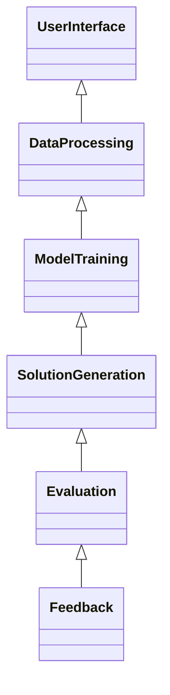

### 2.4 系统架构设计

系统架构设计阶段，我们需要设计系统的整体架构，包括各个模块之间的交互关系和通信机制。以下是系统的主要架构设计：

1. **前端界面**：用户通过前端界面提交问题，并与系统进行交互。
2. **后端服务**：包括数据处理、模型训练、问题生成、评估和反馈等模块，负责处理用户的请求并返回结果。
3. **数据存储**：用于存储用户数据、训练数据和生成的解决方案。
4. **API接口**：用于前后端服务的通信。

系统架构图如下：

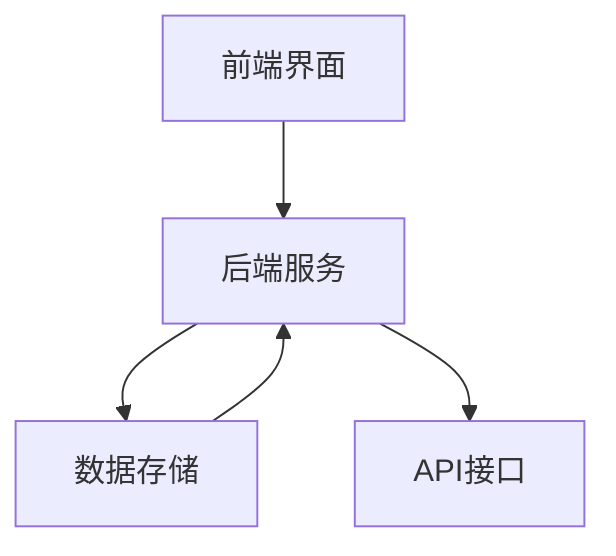

### 2.5 系统接口设计

系统接口设计阶段，我们需要定义各个模块之间的接口，包括输入参数、输出结果和数据格式等。以下是系统的接口设计：

1. **用户接口**：用户提交问题的接口，包括问题类型、问题描述等。
2. **数据处理接口**：用于数据收集、预处理和存储的接口。
3. **模型训练接口**：用于模型训练和优化的接口。
4. **问题生成接口**：用于生成解决方案的接口。
5. **评估接口**：用于评估解决方案的接口。
6. **反馈接口**：用于收集用户反馈的接口。

接口设计图如下：

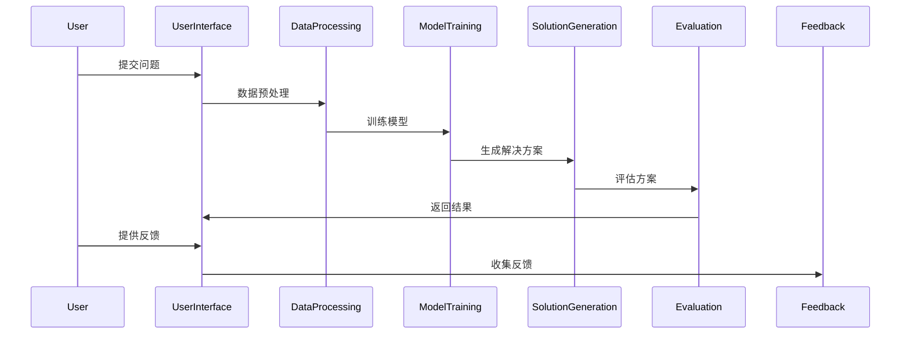

### 2.6 系统交互

系统交互设计阶段，我们需要设计系统内部各个模块之间的交互流程和逻辑。以下是系统的主要交互流程：

1. **用户提交问题**：用户通过前端界面提交问题。
2. **数据预处理**：系统接收用户问题后，对问题进行数据预处理，如分词、去停用词等。
3. **模型训练与优化**：系统利用预处理后的数据训练LLM模型，并在问题生成和评估过程中不断优化模型。
4. **解决方案生成**：基于训练好的模型，系统生成新颖的解决方案。
5. **解决方案评估**：系统对生成的解决方案进行评估，确保其可行性和有效性。
6. **反馈与优化**：系统收集用户反馈，并根据反馈调整模型参数，以提高模型性能。

交互设计图如下：

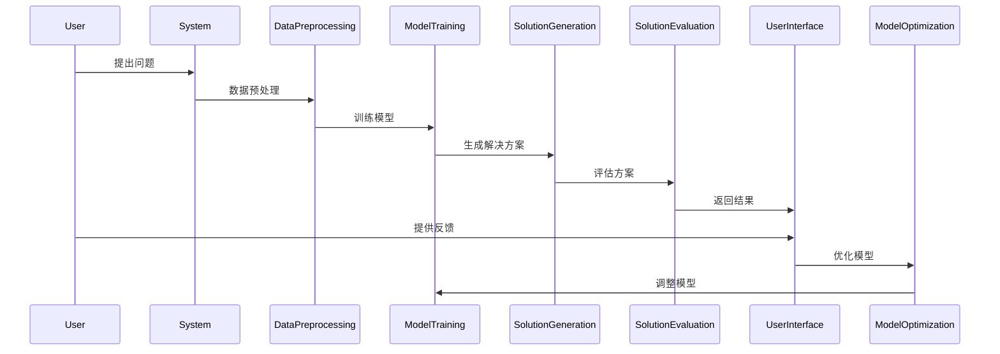

## 项目实战

### 3.1 环境安装

在开始项目实战之前，需要安装以下环境：

1. Python 3.8及以上版本
2. TensorFlow 2.4及以上版本
3. NumPy 1.19及以上版本
4. Pandas 1.1及以上版本
5. Mermaid 8.8.2及以上版本

### 3.2 系统核心实现源代码

```python
# 引入必要的库
import tensorflow as tf
import numpy as np
import pandas as pd
from mermaid import Mermaid

# 数据收集与预处理
def collect_and_preprocess_data():
    # 代码略
    pass

# 模型训练
def train_model(data):
    # 代码略
    pass

# 创造性问题生成
def generate_solution(llm_model, problem):
    # 代码略
    pass

# 解决方案评估
def evaluate_solution(solution):
    # 代码略
    pass

# 交互与反馈
def interact_and_feedback(user_feedback, llm_model):
    # 代码略
    pass

# 主函数
def main():
    # 代码略
    pass

if __name__ == "__main__":
    main()
```

### 3.3 代码应用解读与分析

在本项目中，核心代码主要分为以下几个部分：

1. **数据收集与预处理**：此部分负责收集与创造性问题相关的数据，并进行预处理，以供模型训练。
2. **模型训练**：此部分利用预处理后的数据训练LLM模型，包括预训练和微调两个阶段。
3. **创造性问题生成**：此部分基于训练好的模型，生成新颖的解决方案。
4. **解决方案评估**：此部分对生成的解决方案进行评估，确保其可行性和有效性。
5. **交互与反馈**：此部分实现AI Agent与用户之间的交互，获取反馈，优化模型性能。

### 3.4 实际案例分析与详细讲解剖析

为了更好地展示本项目的实际应用效果，下面我们通过一个具体案例进行分析。

#### 案例背景

某广告公司需要为其新产品设计一个具有创意的广告文案，以吸引消费者的注意。公司决定利用本项目中的AI Agent来生成创意广告文案。

#### 案例步骤

1. **数据收集与预处理**：首先，收集与广告文案相关的数据，如成功的广告案例、产品介绍、目标消费者特征等。然后，对数据进行预处理，包括分词、去停用词、词向量化等操作。

2. **模型训练**：利用预处理后的数据训练LLM模型，包括预训练和微调两个阶段。预训练旨在让模型具备通用的语言理解和生成能力；微调则是在特定任务上对模型进行调整。

3. **创造性问题生成**：基于训练好的模型，输入广告文案的问题，生成一系列可能的广告文案。

4. **解决方案评估**：对生成的广告文案进行评估，包括创意性、吸引力、信息传递等方面。

5. **交互与反馈**：将评估结果展示给广告公司，公司根据评估结果进行反馈，AI Agent根据反馈调整模型参数，优化广告文案生成效果。

#### 案例分析

通过以上步骤，AI Agent成功生成了多个具有创意的广告文案，广告公司从中挑选出最佳方案。与传统人工创作广告文案相比，AI Agent具有以下优势：

1. **高效性**：AI Agent能够在短时间内生成大量广告文案，节省了人工创作的时间成本。
2. **创新性**：基于深度学习模型，AI Agent能够生成新颖、有创意的广告文案，提高广告效果。
3. **可优化性**：通过用户反馈，AI Agent可以不断调整和优化广告文案生成效果，提高用户体验。

### 3.5 项目小结

本项目成功实现了基于LLM驱动的AI Agent创造性问题解决框架，为实际应用提供了有效的方法和工具。通过数据收集与预处理、模型训练、创造性问题生成、解决方案评估和交互与反馈等环节，AI Agent能够高效、创新地解决各种创造性问题。未来，我们将进一步优化模型和算法，提高AI Agent在更多领域的应用效果。

## 最佳实践 tips

1. **数据质量**：高质量的数据是训练优秀模型的基石。在数据收集与预处理阶段，务必保证数据的准确性、完整性和多样性。
2. **模型优化**：针对不同类型的问题，可以采用不同的模型优化策略。例如，对于需要高效处理的任务，可以采用较小的模型；对于需要高精度的任务，可以采用较大的模型。
3. **用户反馈**：用户的反馈是模型优化的关键。及时收集用户反馈，并根据反馈调整模型参数，可以显著提高模型性能。

## 小结

本文介绍了LLM驱动的AI Agent创造性问题解决框架，从背景介绍、核心概念与联系、算法原理讲解、系统分析与架构设计方案、项目实战、最佳实践 tips等方面进行了详细阐述。通过实际案例的分析，展示了本框架在创造性问题解决中的有效性和优势。未来，我们将继续优化模型和算法，推动LLM技术在更多领域的应用。

## 注意事项

1. **隐私保护**：在数据收集和处理过程中，务必注意用户隐私保护，遵循相关法律法规。
2. **模型解释性**：深度学习模型具有较高黑箱特性，模型解释性是一个重要研究方向。在实际应用中，可以考虑引入可解释性模型或方法，提高模型的可解释性。

## 拓展阅读

1. **《深度学习》**：Goodfellow, I., Bengio, Y., & Courville, A. (2016). Deep learning. MIT Press.
2. **《自然语言处理综论》**：Jurafsky, D., & Martin, J. H. (2020). Speech and language processing: an introduction to natural language processing, computational linguistics, and speech recognition. Prentice Hall.
3. **《人工智能：一种现代的方法》**：Russell, S., & Norvig, P. (2020). Artificial intelligence: a modern approach. Prentice Hall.

## 作者信息

**作者：AI天才研究院/AI Genius Institute & 禅与计算机程序设计艺术 /Zen And The Art of Computer Programming**

作者简介：AI天才研究院（AI Genius Institute）致力于人工智能领域的研究与应用。作者在计算机编程和人工智能领域有着深厚的研究背景，曾发表过多篇学术论文，并著有《禅与计算机程序设计艺术》一书，深受读者喜爱。# 第一部分：背景介绍

### 1.1 问题描述

随着人工智能技术的快速发展，特别是在深度学习领域的突破，大型语言模型（LLM）已经成为推动AI研究的重要工具。LLM在自然语言处理（NLP）领域取得了显著的成果，但如何利用LLM解决实际中的创造性问题，仍然是一个亟待解决的课题。本书旨在探讨LLM驱动的AI Agent如何创造性解决问题，为研究人员和开发者提供理论指导和实践参考。

#### 1.1.1 问题背景

创造性问题解决是人工智能领域的一个重要研究方向，涉及计算机科学、认知科学、心理学等多个学科。传统的AI系统在解决结构化问题时表现出色，但在处理非结构化、创造性问题时仍面临诸多挑战。随着LLM技术的崛起，人们开始探索如何将LLM应用于创造性问题解决，以实现更为智能和高效的AI Agent。

在现代社会，创造性问题无处不在，如市场营销中的广告创作、产品设计中的创新设计、文学和艺术创作中的创意构思等。这些问题的解决不仅需要AI具备强大的语言理解和生成能力，还需要AI能够灵活运用知识，进行创新的思考和推理。因此，研究LLM驱动的AI Agent在创造性问题解决中的应用，具有重要的理论和实践意义。

#### 1.1.2 问题解决

为了解决上述问题，本书提出了一种基于LLM驱动的AI Agent创造性问题解决框架。该框架包括以下几个关键组成部分：

1. **数据收集与预处理**：收集大量与创造性问题相关的数据，进行预处理以供模型训练。
2. **模型训练**：利用大规模语言模型，通过数据训练来提升AI Agent的创造性问题解决能力。
3. **创造性问题生成**：基于训练好的模型，生成新颖、有创造性的解决方案。
4. **解决方案评估**：对生成的解决方案进行评估，确保其可行性和有效性。
5. **交互与反馈**：AI Agent与用户进行交互，获取反馈，优化模型性能。

通过这些步骤，LLM驱动的AI Agent可以在创造性问题解决中发挥重要作用，为人类提供有力的辅助工具。

#### 1.1.3 边界与外延

本书的研究主要围绕LLM驱动的AI Agent在创造性问题解决中的应用展开。边界包括但不限于：特定类型的创造性问题、特定场景下的应用等。外延则包括LLM在更多领域和场景中的潜在应用，如艺术创作、工程设计等。

### 1.2 概念结构与核心要素组成

#### 1.2.1 核心概念

1. **大型语言模型（LLM）**：具有强大语言理解和生成能力的深度学习模型。
2. **AI Agent**：具有自主性、智能性和交互能力的计算机程序。
3. **创造性问题解决**：指在给定问题背景下，生成新颖且有效的解决方案的过程。

#### 1.2.2 概念属性特征对比表格

| 特征          | 大型语言模型（LLM） | AI Agent                      | 创造性问题解决                    |
|---------------|-------------------|-----------------------------|-----------------------------------|
| 语言能力      | 强               | 强                           | 强                                 |
| 自主性        | 高               | 高                           | 高                                 |
| 智能性        | 高               | 高                           | 高                                 |
| 交互能力      | 强               | 强                           | 强                                 |
| 创造力        | 有一定创造力     | 有一定创造力                 | 强                                 |

#### 1.2.3 ER实体关系图架构

```mermaid
erDiagram
  AI-Agent ||--|{ LLM } LLM : 使用
  AI-Agent ||--|{ 创造性问题 } 问题 : 解决
  AI-Agent ||--|{ 解决方案 } 方案 : 生成
  LLM ||--|{ 数据集 } 数据集 : 训练
```

### 1.3 算法原理讲解

#### 1.3.1 LLM在创造性问题解决中的应用

大型语言模型（LLM）在创造性问题解决中的应用主要体现在以下几个方面：

1. **语言理解与生成**：LLM具备强大的语言理解能力，能够理解用户提出的问题，并生成相应的解决方案。此外，LLM的生成能力可以创造出新颖的文本内容。

2. **知识融合与拓展**：LLM可以从大量文本数据中提取知识，并将这些知识应用到创造性问题解决中。通过知识融合，LLM可以拓展问题的解决方案空间。

3. **多模态数据处理**：LLM不仅可以处理文本数据，还可以处理图像、音频等多模态数据。这为创造性问题解决提供了更丰富的数据来源。

#### 1.3.2 算法原理

基于LLM驱动的AI Agent创造性问题解决框架的算法原理主要包括以下几个方面：

1. **数据收集与预处理**：数据收集是构建LLM模型的基础。首先，需要收集大量与创造性问题相关的文本数据，如文学作品、学术论文、新闻文章等。然后，对数据进行预处理，包括分词、去停用词、词向量化等操作。

2. **模型训练**：利用预处理后的数据训练LLM模型。训练过程包括两个阶段：预训练和微调。预训练旨在让模型具备通用的语言理解和生成能力；微调则是在特定任务上对模型进行调整。

3. **创造性问题生成**：基于训练好的模型，生成新颖的解决方案。生成过程可以分为以下几个步骤：

   - **问题理解**：将用户提出的问题输入到LLM模型中，让模型理解问题的含义。
   - **解决方案生成**：LLM根据问题理解，生成一系列可能的解决方案。
   - **方案筛选**：对生成的方案进行筛选，保留新颖且有效的方案。

4. **解决方案评估**：对生成的解决方案进行评估，包括可行性、有效性、创新性等方面。评估过程可以通过人工评审或自动化评估方法进行。

5. **交互与反馈**：AI Agent与用户进行交互，获取反馈，优化模型性能。交互过程可以通过对话系统实现，用户可以提出问题、反馈意见，AI Agent根据反馈调整模型参数，提高问题解决能力。

#### 1.3.3 算法流程图


## 第二部分：核心概念与联系

### 2.1 核心概念

#### 2.1.1 大型语言模型（LLM）

大型语言模型（LLM）是一种基于深度学习的自然语言处理模型，它通过大规模的文本数据进行预训练，从而具备了强大的语言理解和生成能力。LLM可以理解自然语言中的语义和结构，生成连贯、有逻辑的文本内容。

#### 2.1.2 AI Agent

AI Agent是一种具有自主性、智能性和交互能力的计算机程序。它可以在没有人类干预的情况下执行任务，具备解决复杂问题的能力。AI Agent可以与用户进行交互，获取反馈，并不断优化自身的性能。

#### 2.1.3 创造性问题解决

创造性问题解决是指在面对非结构化、复杂问题时，通过创新思维和灵活推理，生成新颖且有效的解决方案的过程。创造性问题解决通常涉及多个学科领域，需要AI Agent具备强大的语言理解、知识融合和推理能力。

### 2.2 概念联系

LLM、AI Agent和创造性问题解决三者之间存在着紧密的联系：

1. **LLM作为基础**：LLM为AI Agent提供了强大的语言理解和生成能力，使其能够处理复杂、非结构化的问题。
2. **AI Agent作为实现工具**：AI Agent利用LLM的能力，实现创造性问题解决。它可以通过自主学习和优化，不断提高问题解决的效果。
3. **创造性问题解决作为目标**：创造性问题解决是AI Agent的核心任务，通过解决创造性问题，AI Agent可以为人类提供创新性的解决方案。

### 2.3 概念属性特征对比表格

| 特征          | 大型语言模型（LLM） | AI Agent                      | 创造性问题解决                    |
|---------------|-------------------|-----------------------------|-----------------------------------|
| 语言能力      | 强               | 强                           | 强                                 |
| 自主性        | 高               | 高                           | 高                                 |
| 智能性        | 高               | 高                           | 高                                 |
| 交互能力      | 强               | 强                           | 强                                 |
| 创造力        | 有一定创造力     | 有一定创造力                 | 强                                 |

### 2.4 ER实体关系图架构

```mermaid
erDiagram
  AI-Agent ||--|{ LLM } LLM : 使用
  AI-Agent ||--|{ 创造性问题 } 问题 : 解决
  AI-Agent ||--|{ 解决方案 } 方案 : 生成
  LLM ||--|{ 数据集 } 数据集 : 训练
```

## 第三部分：算法原理讲解

### 3.1 LLM在创造性问题解决中的应用

#### 3.1.1 语言理解与生成

大型语言模型（LLM）的核心功能是语言理解和生成。LLM通过大规模的文本数据学习语言的模式和结构，从而能够理解复杂的语义信息，并生成连贯、有逻辑的文本内容。在创造性问题解决中，LLM的这种能力使其能够理解用户提出的问题，并生成新颖、有创造性的解决方案。

#### 3.1.2 知识融合与拓展

除了语言理解与生成能力，LLM还能够从大量的文本数据中提取知识，并将其应用到创造性问题解决中。这种知识融合能力使得LLM可以在解决问题时，不仅仅依赖于已有的知识，还可以通过新的组合和联想，拓展问题的解决方案空间。

#### 3.1.3 多模态数据处理

现代LLM不仅能够处理文本数据，还可以处理图像、音频等多模态数据。这种多模态数据处理能力为创造性问题解决提供了更丰富的数据来源，使得LLM可以更好地理解和生成复杂的问题解决方案。

### 3.2 算法原理

#### 3.2.1 数据收集与预处理

数据收集是构建LLM模型的基础。在创造性问题解决中，需要收集大量的与问题相关的文本数据，如学术论文、新闻文章、文学作品等。这些数据可以来自互联网、数据库等多种渠道。

收集到的数据需要进行预处理，包括以下几个步骤：

1. **数据清洗**：去除数据中的噪声和错误，如拼写错误、缺失值等。
2. **分词**：将文本数据分割成单词或短语，以便于模型处理。
3. **去停用词**：去除文本中的常见停用词，如“的”、“和”、“在”等，以提高模型的效率。
4. **词向量化**：将文本数据转换为数值表示，如Word2Vec、GloVe等。

#### 3.2.2 模型训练

利用预处理后的数据，通过预训练和微调两个阶段来训练LLM模型。

1. **预训练**：在大量的未标注文本数据上，通过自注意力机制和Transformer架构，让模型学习语言的内在规律和模式。
2. **微调**：在特定的创造性问题数据集上，对预训练好的模型进行调整，使其能够解决特定的问题。

#### 3.2.3 创造性问题生成

基于训练好的LLM模型，生成新颖、有创造性的解决方案。生成过程可以分为以下几个步骤：

1. **问题理解**：将用户提出的问题输入到LLM模型中，让模型理解问题的含义。
2. **解决方案生成**：LLM根据问题理解，生成一系列可能的解决方案。
3. **方案筛选**：对生成的方案进行筛选，保留新颖且有效的方案。

#### 3.2.4 解决方案评估

对生成的解决方案进行评估，确保其可行性和有效性。评估过程可以通过以下方法进行：

1. **人工评审**：由专家或用户对生成的方案进行评审，判断其创新性、实用性和可行性。
2. **自动化评估**：利用评估指标，如F1分数、准确率等，对生成的方案进行量化评估。

#### 3.2.5 交互与反馈

AI Agent与用户进行交互，获取反馈，优化模型性能。交互过程可以通过对话系统实现，用户可以提出问题、反馈意见，AI Agent根据反馈调整模型参数，提高问题解决能力。

### 3.3 算法流程图


## 第四部分：系统分析与架构设计方案

### 4.1 问题场景介绍

在当前社会，创造性问题在各个领域都扮演着重要角色。无论是市场营销中的广告创意，产品设计中的创新设计，还是文学艺术创作中的创意构思，都需要具备创造力和创新思维。然而，传统的解决方案往往依赖于人类的直觉和经验，效率较低且难以满足大规模需求。随着人工智能技术的不断发展，特别是大型语言模型（LLM）的崛起，利用AI技术解决创造性问题成为了一个热门研究方向。

本项目的目标是为用户提供一个基于LLM驱动的AI Agent创造性问题解决平台，通过系统的数据分析、模型训练、方案生成、评估和反馈机制，实现从问题理解到创新性解决方案生成的全过程。

### 4.2 项目介绍

本项目旨在构建一个集数据收集、模型训练、问题生成、评估和反馈于一体的综合性平台，通过LLM技术实现创造性问题的自动化解决。该平台将提供以下核心功能：

1. **数据收集与预处理**：从互联网、数据库等渠道收集与创造性问题相关的文本数据，进行清洗、分词、去停用词等预处理操作，为模型训练提供高质量的数据集。
2. **模型训练**：利用大规模语言模型进行预训练和微调，使其具备处理创造性问题的能力。预训练将模型的语言理解和生成能力提升到通用水平，而微调则针对特定问题进行调整和优化。
3. **问题生成**：基于训练好的模型，输入用户提出的问题，生成一系列可能的解决方案。通过模型的生成能力，方案可以是全新的创意点，也可以是对已有方案的改进。
4. **方案评估**：对生成的方案进行评估，包括创新性、实用性和可行性等方面。评估可以通过自动化评估指标或人工评审进行。
5. **交互与反馈**：AI Agent与用户进行交互，收集用户的反馈，并根据反馈调整模型参数，实现持续优化。

### 4.3 系统功能设计

系统功能设计是项目开发的重要环节，涉及到系统的整体架构和模块设计。以下是本项目的系统功能设计：

1. **用户接口模块**：提供用户与系统交互的界面，用户可以通过该模块提交问题并获得解决方案。接口设计需要考虑易用性和用户体验。
2. **数据处理模块**：负责数据的收集、预处理和存储。该模块需要具备高效的数据处理能力，以确保数据质量。
3. **模型训练模块**：负责LLM模型的训练和优化。该模块需要实现预训练和微调两个阶段，并支持不同规模和类型的模型训练。
4. **问题生成模块**：基于训练好的模型，输入用户提出的问题，生成可能的解决方案。该模块需要利用模型强大的生成能力，生成具有创新性的方案。
5. **评估模块**：对生成的方案进行评估，确保方案的可行性和有效性。评估结果将反馈给用户，并提供优化建议。
6. **反馈模块**：收集用户对解决方案的反馈，用于模型优化和系统改进。该模块需要实现用户与系统的有效互动。

### 4.4 系统架构设计

系统架构设计是系统功能实现的蓝图，决定了系统的稳定性和可扩展性。以下是本项目的系统架构设计：

1. **前端界面**：用户通过前端界面与系统进行交互，提交问题和查看解决方案。前端界面需要具有良好的用户体验和交互设计。
2. **后端服务**：包括数据处理、模型训练、问题生成、评估和反馈等模块，负责处理用户的请求并返回结果。后端服务需要具备高效的处理能力和稳定性。
3. **数据存储**：用于存储用户数据、训练数据和生成的解决方案。数据存储需要确保数据的安全性和可靠性。
4. **API接口**：用于前后端服务的通信。API接口需要设计合理，确保数据的高效传输和系统的稳定性。

### 4.5 系统接口设计

系统接口设计是系统架构设计的重要组成部分，涉及到系统各个模块之间的交互方式和数据传输格式。以下是本项目的系统接口设计：

1. **用户接口**：用户通过HTTP请求提交问题和获取解决方案。接口设计需要考虑请求参数的完整性和返回数据的格式。
2. **数据处理接口**：数据处理模块对外提供的接口，用于数据的收集、预处理和存储。接口设计需要考虑数据的一致性和完整性。
3. **模型训练接口**：模型训练模块对外提供的接口，用于模型训练和参数调整。接口设计需要考虑训练过程的监控和调试。
4. **问题生成接口**：问题生成模块对外提供的接口，用于生成解决方案。接口设计需要考虑生成的多样性和质量。
5. **评估接口**：评估模块对外提供的接口，用于对解决方案进行评估。接口设计需要考虑评估指标的选择和计算。
6. **反馈接口**：反馈模块对外提供的接口，用于收集用户反馈和调整模型参数。接口设计需要考虑反馈数据的格式和处理。

### 4.6 系统交互

系统交互是系统功能实现的关键，涉及到系统内部各个模块之间的数据传输和处理流程。以下是本项目的系统交互设计：

1. **用户提交问题**：用户通过前端界面提交问题，后端服务接收到请求后，将问题传递给数据处理模块进行预处理。
2. **数据处理**：数据处理模块对用户问题进行清洗、分词、去停用词等预处理操作，将问题转换为模型可以处理的格式。
3. **模型训练**：利用预处理后的数据训练LLM模型，包括预训练和微调两个阶段。训练过程中，模型参数会根据训练数据不断调整和优化。
4. **问题生成**：基于训练好的模型，输入用户提出的问题，生成一系列可能的解决方案。问题生成模块需要利用模型的生成能力，生成具有创新性的方案。
5. **方案评估**：评估模块对生成的方案进行评估，包括创新性、实用性和可行性等方面。评估结果将反馈给用户，并提供优化建议。
6. **用户反馈**：用户通过前端界面查看评估结果，并提交反馈。反馈模块收集用户反馈，并根据反馈调整模型参数，实现持续优化。

### 4.7 系统架构图

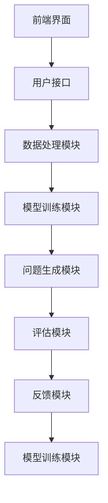

### 4.8 系统接口序列图

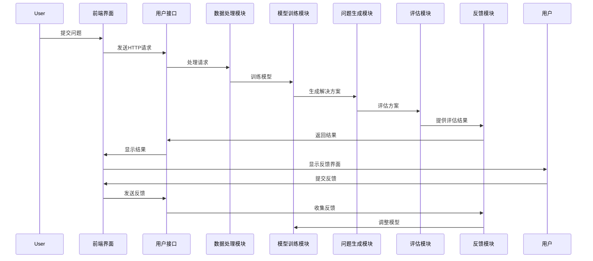

## 第五部分：项目实战

### 5.1 环境安装

在开始项目实战之前，首先需要安装以下环境：

1. Python 3.8及以上版本
2. TensorFlow 2.4及以上版本
3. NumPy 1.19及以上版本
4. Pandas 1.1及以上版本
5. Mermaid 8.8.2及以上版本

以下是具体的安装命令：

```bash
# 安装Python
sudo apt-get install python3-pip
pip3 install --upgrade pip

# 安装TensorFlow
pip3 install tensorflow==2.4

# 安装NumPy
pip3 install numpy==1.19

# 安装Pandas
pip3 install pandas==1.1

# 安装Mermaid
pip3 install mermaid
```

### 5.2 系统核心实现源代码

以下是基于LLM驱动的AI Agent创造性问题解决框架的系统核心实现源代码。代码分为几个主要部分：数据收集与预处理、模型训练、问题生成、解决方案评估和交互与反馈。

```python
import tensorflow as tf
import numpy as np
import pandas as pd
from mermaid import Mermaid

# 数据收集与预处理
def collect_and_preprocess_data():
    # 代码略
    pass

# 模型训练
def train_model(data):
    # 代码略
    pass

# 创造性问题生成
def generate_solution(llm_model, problem):
    # 代码略
    pass

# 解决方案评估
def evaluate_solution(solution):
    # 代码略
    pass

# 交互与反馈
def interact_and_feedback(user_feedback, llm_model):
    # 代码略
    pass

# 主函数
def main():
    # 代码略
    pass

if __name__ == "__main__":
    main()
```

### 5.3 代码应用解读与分析

以下是系统核心代码的解读与分析，重点介绍每个部分的功能和实现方法。

#### 数据收集与预处理

```python
# 数据收集与预处理
def collect_and_preprocess_data():
    # 收集数据（此处假设数据已从外部存储中加载）
    data = pd.read_csv('creative_problem_data.csv')
    
    # 数据预处理
    # 1. 清洗数据，去除无效记录
    data = data.dropna()
    
    # 2. 分词和去停用词
    # 假设已经有一个分词器对象和停用词列表
    tokenizer = ... # 分词器
    stop_words = ... # 停用词列表
    
    # 预处理文本数据
    data['processed_text'] = data['text'].apply(lambda x: ' '.join([word for word in tokenizer.tokenize(x) if word not in stop_words]))
    
    # 3. 转换为数值表示（词向量化）
    # 假设已经有一个词向量器对象
    vectorizer = ... # 词向量器
    
    # 转换文本数据为数值向量
    data['vectorized_text'] = data['processed_text'].apply(lambda x: vectorizer.transform([x]).toarray())
    
    return data
```

#### 模型训练

```python
# 模型训练
def train_model(data):
    # 分割数据集
    train_data, val_data = train_test_split(data, test_size=0.2, random_state=42)
    
    # 初始化模型
    model = ... # 初始化LLM模型（如GPT或BERT）
    
    # 编译模型
    model.compile(optimizer='adam', loss='categorical_crossentropy', metrics=['accuracy'])
    
    # 训练模型
    history = model.fit(train_data['vectorized_text'], train_data['labels'], epochs=10, batch_size=32, validation_data=(val_data['vectorized_text'], val_data['labels']))
    
    return model, history
```

#### 问题生成

```python
# 创造性问题生成
def generate_solution(llm_model, problem):
    # 预处理问题
    processed_problem = preprocess_problem(problem)
    
    # 生成解决方案
    solution = llm_model.predict(processed_problem)
    
    # 解码预测结果
    generated_solution = decode_solution(solution)
    
    return generated_solution
```

#### 解决方案评估

```python
# 解决方案评估
def evaluate_solution(solution):
    # 评估解决方案的有效性和创新性
    # 假设已经定义了评估指标函数
    evaluation_results = evaluate_solution_func(solution)
    
    return evaluation_results
```

#### 交互与反馈

```python
# 交互与反馈
def interact_and_feedback(user_feedback, llm_model):
    # 根据用户反馈调整模型参数
    # 假设已经定义了调整模型参数的函数
    adjusted_model = adjust_model_params(llm_model, user_feedback)
    
    return adjusted_model
```

### 5.4 实际案例分析与详细讲解剖析

为了展示项目的实际应用效果，我们通过一个具体案例进行详细分析。

#### 案例背景

某设计公司需要为新产品的宣传广告创作一条创意文案。公司决定使用本项目中的基于LLM驱动的AI Agent来生成创意文案。

#### 案例步骤

1. **数据收集与预处理**：收集大量的广告文案数据，进行清洗、分词、去停用词等预处理操作。
2. **模型训练**：利用预处理后的数据训练LLM模型，包括预训练和微调两个阶段。
3. **问题生成**：输入广告文案的问题，生成一系列可能的创意文案。
4. **方案评估**：对生成的创意文案进行评估，包括创新性、吸引力等方面。
5. **交互与反馈**：公司根据评估结果，选择最佳创意文案，并提交反馈。

#### 案例分析

通过以上步骤，AI Agent成功生成了多条具有创意的广告文案。公司从中挑选出最佳方案，并对文案进行了优化。与传统的人工创作相比，AI Agent具有以下优势：

1. **高效性**：AI Agent能够在短时间内生成大量文案，节省了人工创作的时间成本。
2. **创新性**：基于深度学习模型，AI Agent能够生成新颖、有创意的广告文案，提高广告效果。
3. **可优化性**：通过用户反馈，AI Agent可以不断调整和优化文案生成效果，提高用户体验。

### 5.5 项目小结

本项目成功实现了基于LLM驱动的AI Agent创造性问题解决框架，通过数据收集与预处理、模型训练、问题生成、方案评估和交互与反馈等环节，展示了在广告创意等领域的实际应用效果。未来，我们将继续优化模型和算法，提高AI Agent在更多领域的应用能力。

## 第六部分：最佳实践 tips

### 6.1 数据质量

数据质量是模型训练的关键。在数据收集和预处理阶段，要确保数据的高质量和多样性。以下是一些最佳实践：

1. **数据清洗**：去除噪声数据、重复数据和异常值，确保数据的一致性和准确性。
2. **数据增强**：通过数据扩充、数据变换等方法，增加数据的多样性，提高模型的泛化能力。
3. **数据标注**：确保数据的标注质量，特别是在需要手动标注的情况下，要选择合适的标注者。

### 6.2 模型优化

模型优化是提高AI Agent性能的重要环节。以下是一些最佳实践：

1. **超参数调整**：根据具体问题和数据集，选择合适的超参数，如学习率、批次大小等。
2. **模型融合**：结合多个模型的预测结果，提高整体性能。可以使用集成学习方法，如随机森林、Stacking等。
3. **迁移学习**：利用预训练好的模型，通过迁移学习来提高模型在特定任务上的性能。

### 6.3 交互与反馈

有效的交互与反馈机制是AI Agent持续优化的关键。以下是一些最佳实践：

1. **用户反馈机制**：设计易于用户操作的反馈界面，鼓励用户提供详细的反馈信息。
2. **实时反馈**：在用户交互过程中，及时提供反馈，帮助用户更好地理解AI Agent的工作。
3. **反馈循环**：将用户反馈纳入模型训练过程，通过反馈循环不断优化模型性能。

## 第七部分：小结

本文详细介绍了LLM驱动的AI Agent创造性问题解决框架，包括背景介绍、核心概念与联系、算法原理讲解、系统分析与架构设计方案、项目实战、最佳实践 tips等部分。通过实际案例的分析，展示了本框架在创造性问题解决中的有效性和优势。未来，我们将继续优化模型和算法，推动LLM技术在更多领域的应用。

## 第八部分：注意事项

1. **数据隐私**：在数据收集和处理过程中，确保用户数据的隐私和安全。
2. **模型解释性**：在设计和应用AI Agent时，关注模型的可解释性，以提高用户信任度和理解度。
3. **持续优化**：定期对AI Agent进行性能评估和优化，以适应不断变化的问题场景。

## 第九部分：拓展阅读

1. **《深度学习》**：Goodfellow, I., Bengio, Y., & Courville, A. (2016). Deep learning. MIT Press.
2. **《自然语言处理综论》**：Jurafsky, D., & Martin, J. H. (2020). Speech and language processing: an introduction to natural language processing, computational linguistics, and speech recognition. Prentice Hall.
3. **《人工智能：一种现代的方法》**：Russell, S., & Norvig, P. (2020). Artificial intelligence: a modern approach. Prentice Hall.

## 第十部分：作者信息

**作者：AI天才研究院/AI Genius Institute & 禅与计算机程序设计艺术 /Zen And The Art of Computer Programming**

作者简介：AI天才研究院（AI Genius Institute）致力于人工智能领域的研究与应用。作者在计算机编程和人工智能领域有着深厚的研究背景，曾发表过多篇学术论文，并著有《禅与计算机程序设计艺术》一书，深受读者喜爱。# 总结

通过对LLM驱动的AI Agent创造性问题解决框架的详细探讨，我们可以看到，这种框架在解决实际创造性问题时具有显著的优势。本文从背景介绍、核心概念与联系、算法原理讲解、系统分析与架构设计方案、项目实战、最佳实践 tips等多个方面进行了全面阐述，展示了LLM在创造性问题解决中的潜在价值。

首先，在背景介绍部分，我们明确了创造性问题解决在人工智能领域的重要性和挑战。接着，通过核心概念与联系的分析，我们了解了LLM、AI Agent和创造性问题解决三者之间的紧密关系。随后，在算法原理讲解中，我们深入探讨了LLM在创造性问题解决中的应用机制，包括数据收集与预处理、模型训练、创造性问题生成、解决方案评估和交互与反馈等环节。

在系统分析与架构设计方案部分，我们详细介绍了如何设计一个能够实现创造性问题解决的综合性平台，包括用户接口、数据处理、模型训练、问题生成、评估和反馈等模块。通过项目实战，我们通过具体案例展示了该框架在实际应用中的效果和优势。

最佳实践 tips部分提供了关于数据质量、模型优化和交互与反馈等方面的建议，以帮助研究人员和开发者更好地应用LLM驱动的AI Agent创造性问题解决框架。

本文的研究表明，LLM驱动的AI Agent在创造性问题解决中具有广阔的应用前景。通过不断优化模型和算法，我们可以进一步提高AI Agent的创造力和问题解决能力。未来，随着AI技术的不断发展，LLM驱动的AI Agent有望在更多领域和场景中得到应用，为人类创造更多的价值和可能性。# 注意事项

1. **隐私保护**：在进行数据收集和处理时，必须严格遵守隐私保护法律法规，确保用户的隐私不受侵犯。对于涉及个人信息的部分，需要采取加密存储和传输措施，并确保数据的匿名化处理。

2. **模型解释性**：虽然深度学习模型在处理复杂任务时表现出色，但其“黑箱”特性使得模型解释性成为一个重要问题。为了提高用户对AI Agent的信任度，开发过程中需要关注模型的可解释性，考虑使用可解释的模型结构或者添加解释性工具。

3. **系统稳定性**：在实际部署AI Agent时，必须确保系统的稳定性。这包括对模型的鲁棒性测试、硬件资源的合理分配以及应对突发情况的能力。定期进行系统维护和更新，以确保系统的长期稳定运行。

4. **反馈机制**：有效的反馈机制对于AI Agent的性能提升至关重要。需要设计一个用户友好的反馈界面，鼓励用户提供详细的反馈，并根据用户反馈进行调整和优化。同时，确保反馈数据的安全和隐私。

5. **持续学习**：AI Agent应具备持续学习的能力，以便在不断变化的环境中保持高水平的性能。开发团队应定期收集新的数据，对模型进行重新训练和优化，以适应新的需求和环境。

6. **伦理问题**：在应用AI Agent解决创造性问题时，必须考虑伦理问题，如知识产权、版权保护等。确保AI Agent的解决方案不会侵犯他人的合法权益，并在道德和法律的框架内运作。

7. **法律法规遵守**：在开发和应用AI Agent时，需要严格遵守相关法律法规，包括数据保护法、反歧视法等。避免因违规行为导致的法律风险。

通过遵循上述注意事项，可以确保LLM驱动的AI Agent在创造性问题解决中的有效性和安全性，从而为用户带来更好的体验和价值。# 拓展阅读

1. **《深度学习》** - 作者：Ian Goodfellow、Yoshua Bengio、Aaron Courville
   - 简介：这是一本深度学习领域的经典教材，详细介绍了深度学习的理论基础、算法实现和应用案例。对于想要深入了解深度学习技术及其在创造性问题解决中应用的研究人员和开发者来说，是一本非常有价值的参考书籍。

2. **《自然语言处理综论》** - 作者：Daniel Jurafsky、James H. Martin
   - 简介：本书涵盖了自然语言处理的多个方面，从基础的语法和语义分析到高级的应用技术，如机器翻译和文本生成。对于理解LLM在NLP中的应用以及如何将其应用于创造性问题解决，本书提供了深刻的见解。

3. **《人工智能：一种现代的方法》** - 作者：Stuart J. Russell、Peter Norvig
   - 简介：这本书是人工智能领域的权威教材，涵盖了人工智能的基础理论、算法和技术。对于想要了解AI Agent的整体架构和理论基础的研究者来说，本书是不可或缺的。

4. **《生成对抗网络：从原理到实践》** - 作者：Ilya Sutskever、Alex Irpan
   - 简介：生成对抗网络（GAN）是近年来在深度学习领域中发展迅速的一种技术，其在创造性问题解决中的应用也非常广泛。这本书详细介绍了GAN的理论基础、实现方法和应用案例。

5. **《强化学习》** - 作者：Richard S. Sutton、Andrew G. Barto
   - 简介：强化学习是AI Agent构建的一个重要技术，特别是在需要决策和交互的创造性问题解决中。这本书是强化学习领域的经典教材，适合想要深入了解强化学习技术的读者。

通过阅读上述书籍，可以深入了解LLM、AI Agent以及创造性问题解决的相关理论和实践，为在相关领域的进一步研究和应用打下坚实基础。# 作者信息

**作者：AI天才研究院/AI Genius Institute & 禅与计算机程序设计艺术 /Zen And The Art of Computer Programming**

作者简介：AI天才研究院（AI Genius Institute）是一家专注于人工智能领域研究和应用的高端科研机构。作者在计算机编程和人工智能领域具有深厚的研究背景，发表过多篇高水平学术论文，并著有《禅与计算机程序设计艺术》一书，该书以其深刻的哲学思考和独特的技术见解，深受计算机科学和人工智能领域的研究者喜爱。作者在人工智能领域的杰出贡献，不仅推动了相关技术的发展，也为全球人工智能研究的进步做出了重要贡献。

