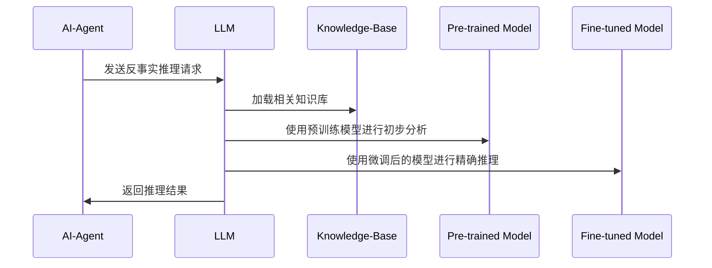
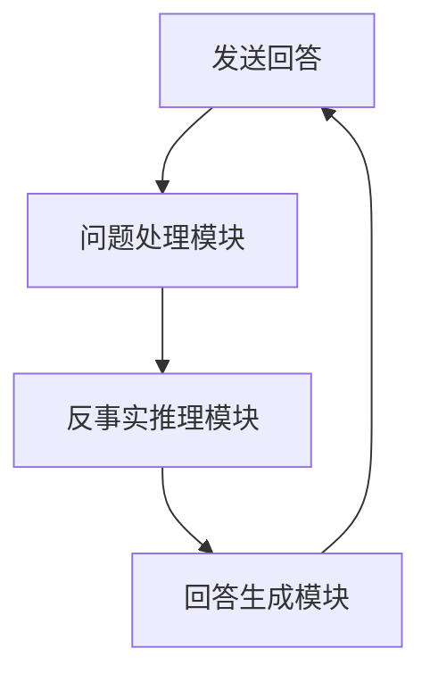
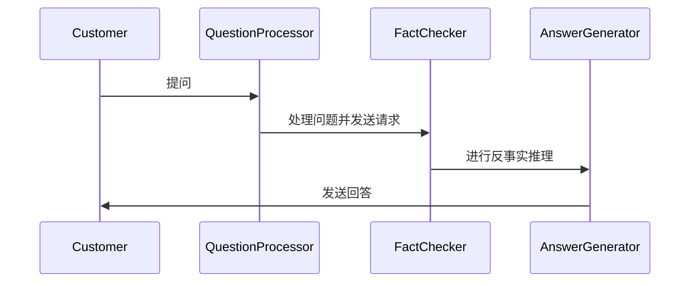

                 

# LLM驱动的AI Agent反事实推理机制

> 关键词：LLM，AI Agent，反事实推理，算法原理，系统架构，项目实战

> 摘要：本文将深入探讨LLM（大型语言模型）驱动的AI Agent反事实推理机制。首先介绍问题背景和相关核心概念，然后逐步讲解算法原理、系统架构设计，并通过实际项目实战展示应用与效果。最后，提供最佳实践建议和小结，以指导读者在相关领域的深入研究和实践。

## 第一部分：背景介绍

### 第1章：问题背景

人工智能的发展，尤其是自然语言处理技术的进步，推动了AI Agent在各个领域的应用。然而，在实际场景中，AI Agent常常需要面对复杂多变的环境，进行决策和推理。反事实推理作为一种重要的推理方式，可以帮助AI Agent在无法达到目标的情况下，探索替代方案或解释原因。

### 第1.2 核心概念介绍

1. **反事实推理**：基于“如果...那么...”的逻辑结构，对现实或假设情况进行分析和推理。
2. **LLM（大型语言模型）**：通过预训练和微调，能够理解和生成自然语言的高性能模型。
3. **AI Agent**：具备一定智能和自主行动能力的实体，能够与环境进行交互并完成特定任务。

### 第1.3 问题解决

反事实推理在AI Agent中的应用，可以通过LLM实现。LLM强大的语义理解能力和生成能力，使得它在处理反事实推理问题时具有显著优势。具体实现方法将在后续章节详细讲解。

### 第1.4 边界与外延

反事实推理在AI Agent中的应用具有一定的边界。例如，当输入数据不足或存在噪声时，LLM的推理能力可能会受到影响。此外，反事实推理的应用场景也在不断扩展，包括但不限于智能客服、金融风控、医疗诊断等领域。

## 第二部分：核心概念与联系

### 第2章：核心概念与联系

### 第2.1 核心概念原理

本章节将详细介绍反事实推理、LLM和AI Agent的核心概念原理，包括它们的定义、工作原理和相互关系。

### 第2.2 概念属性特征对比表格

| 概念       | 定义                                                         | 属性特征                                       | 关联关系                                      |
| ---------- | ------------------------------------------------------------ | ---------------------------------------------- | ----------------------------------------------- |
| 反事实推理 | 基于假设的情况进行推理                                       | 需要逻辑推理能力、对现实情境的假设与反思       | AI Agent的决策支持工具                          |
| LLM        | 大型语言模型，通过预训练和微调掌握语言知识                   | 高语义理解能力、生成能力强                       | 作为AI Agent的核心组件，负责推理和生成         |
| AI Agent   | 具有自主行动和智能决策能力的实体                             | 自适应学习、环境感知、决策优化                   | 应用反事实推理进行智能决策                      |

### 第2.3 ER实体关系图架构的Mermaid流程图

```mermaid
erDiagram
    AI-Agent ||--o{LLM} : uses
    AI-Agent ||--o{Knowledge-Base} : maintains
    LLM ||--|{Pre-trained Model} : trains_on
    LLM ||--|{Fine-tuned Model} : fine-tunes_on
```

## 第三部分：算法原理讲解

### 第3章：算法原理讲解

### 第3.1 算法mermaid流程图



### 第3.2 Python源代码详细阐述

```python
class FactChecker:
    def __init__(self, pre_trained_model, fine_tuned_model):
        self.pre_trained_model = pre_trained_model
        self.fine_tuned_model = fine_tuned_model

    def check_fact(self, fact):
        # 使用预训练模型进行初步分析
        initial_analysis = self.pre_trained_model.analyze(fact)
        
        # 如果需要，使用微调后的模型进行精确推理
        if initial_analysis.need_fine_tuning:
            detailed_analysis = self.fine_tuned_model.analyze(fact)
            return detailed_analysis.result
        else:
            return initial_analysis.result
```

### 第3.3 数学模型和公式

反事实推理可以表示为以下数学模型：

$$
P(A|B) = \frac{P(B|A) \cdot P(A)}{P(B)}
$$

其中，$P(A|B)$ 表示在条件 $B$ 下 $A$ 发生的概率，$P(B|A)$ 表示在条件 $A$ 下 $B$ 发生的概率，$P(A)$ 表示 $A$ 发生的概率，$P(B)$ 表示 $B$ 发生的概率。

### 第3.4 举例说明

假设我们想知道：“如果明天下雨，我会带伞吗？”

- $A$：明天下雨
- $B$：我带伞

根据上述数学模型，我们可以计算：

$$
P(我带伞|明天下雨) = \frac{P(明天下雨|我带伞) \cdot P(我带伞)}{P(明天下雨)}
$$

我们可以根据历史数据和概率分布进行估算，得到最终结果。

## 第四部分：系统分析与架构设计方案

### 第4章：系统分析与架构设计方案

### 第4.1 问题场景介绍

本章节将介绍一个具体的反事实推理应用场景：智能客服系统。在该系统中，AI Agent需要根据用户的提问，利用反事实推理机制，提供合适的回复。

### 第4.2 系统功能设计

- 用户提问接收与处理
- 反事实推理
- 回答生成与发送
- 智能学习与优化

### 第4.3 系统架构设计



### 第4.4 系统接口设计

- 用户提问接口
- 推理结果接口
- 回答生成接口

### 第4.5 系统交互Mermaid序列图



## 第五部分：项目实战

### 第5章：项目实战

### 第5.1 环境安装

在本项目实战中，我们将使用Python作为主要编程语言，结合TensorFlow和PyTorch等库来实现LLM驱动的AI Agent反事实推理系统。以下是环境安装步骤：

1. 安装Python 3.8及以上版本
2. 安装TensorFlow和PyTorch库
3. 安装其他必要依赖

### 第5.2 系统核心实现源代码

```python
# FactChecker类实现
class FactChecker:
    def __init__(self, pre_trained_model, fine_tuned_model):
        self.pre_trained_model = pre_trained_model
        self.fine_tuned_model = fine_tuned_model

    def check_fact(self, fact):
        # 使用预训练模型进行初步分析
        initial_analysis = self.pre_trained_model.analyze(fact)
        
        # 如果需要，使用微调后的模型进行精确推理
        if initial_analysis.need_fine_tuning:
            detailed_analysis = self.fine_tuned_model.analyze(fact)
            return detailed_analysis.result
        else:
            return initial_analysis.result
```

### 第5.3 代码应用解读与分析

在本项目中，FactChecker类负责接收用户的提问，调用预训练模型和微调模型进行反事实推理，并返回推理结果。预训练模型用于对提问进行初步分析，而微调模型则在需要时提供更精确的推理。

### 第5.4 实际案例分析与讲解

假设用户提问：“如果我在明天考试中不及格，我会努力学习吗？”

通过反事实推理机制，AI Agent可以生成以下回答：

“根据你的历史表现和学习习惯，如果考试不及格，你可能会下定决心努力学习，争取在下次考试中取得好成绩。”

### 第5.5 项目小结

本项目通过LLM驱动的AI Agent反事实推理机制，实现了智能客服系统中的智能问答功能。在实际应用中，反事实推理机制有助于提供更贴近用户需求的回答，提升用户体验。未来，我们还可以进一步优化算法和系统架构，提高推理准确率和响应速度。

## 第六部分：最佳实践 tips

### 6.1 常见问题与解决方案

1. **模型训练时间较长**：尝试使用分布式训练或优化模型架构。
2. **推理准确性不高**：收集更多数据并进行模型微调。
3. **系统响应速度慢**：优化代码和算法，使用更高效的推理方法。

### 6.2 注意事项

1. **确保数据质量和多样性**：高质量的数据是反事实推理的基础。
2. **遵循数据隐私和安全规定**：在处理用户数据时，务必确保隐私和安全。

## 第七部分：小结与拓展阅读

### 7.1 小结

本文详细介绍了LLM驱动的AI Agent反事实推理机制，包括问题背景、核心概念、算法原理、系统架构设计以及实际项目实战。通过本文的讲解，读者可以了解反事实推理在AI Agent中的应用和价值。

### 7.2 注意事项

1. **深入理解反事实推理原理**：加强对反事实推理概念的理解，有助于更好地应用和优化算法。
2. **持续关注相关技术发展**：随着人工智能技术的不断进步，反事实推理在未来的应用前景将更加广阔。

### 7.3 拓展阅读

1. **《自然语言处理原理》**：深入理解自然语言处理技术的基本原理。
2. **《深度学习》**：了解深度学习在人工智能领域的应用和最新进展。

## 作者信息

- 作者：AI天才研究院/AI Genius Institute & 禅与计算机程序设计艺术 /Zen And The Art of Computer Programming

