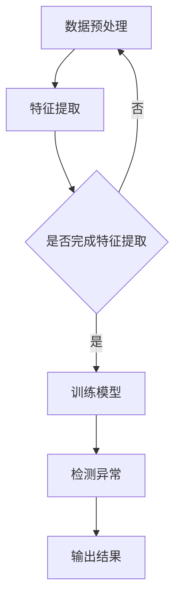

                 

# LLAMA驱动的AI Agent反常检测机制

关键词：LLAMA, AI Agent, 反常检测，算法原理，Python实现

摘要：本文将探讨LLAMA驱动的AI Agent反常检测机制。通过介绍AI Agent的基本概念、LLAMA模型的原理及其在AI Agent中的应用，深入分析反常检测的算法原理，并通过Python实现和实际案例，展示该机制在现实场景中的有效性。

### 目录大纲

----------------------------------------------------------------

## 第一部分: 背景介绍与核心概念

### 第1章: AI驱动的AI Agent概述

#### 1.1.1 问题背景

##### 1.1.1.1 人工智能的发展历程

##### 1.1.1.2 AI Agent的概念与发展

#### 1.1.2 问题描述

##### 1.1.2.1 AI Agent的应用领域

##### 1.1.2.2 AI Agent的挑战与问题

#### 1.1.3 问题解决

##### 1.1.3.1 LLAMA模型介绍

##### 1.1.3.2 AI Agent的反常检测机制

#### 1.1.4 边界与外延

##### 1.1.4.1 AI Agent的边界定义

##### 1.1.4.2 AI Agent的应用范围拓展

#### 1.1.5 概念结构与核心要素组成

##### 1.1.5.1 AI Agent的基本结构

##### 1.1.5.2 AI Agent的核心功能与要素

#### 1.1.6 本章小结

----------------------------------------------------------------

## 第二部分: LLM驱动的AI Agent基础

### 第2章: LLM的概念与特点

#### 2.1 LLM的概念与特点

##### 2.1.1 语言模型的基本概念

##### 2.1.2 语言模型的特性

#### 2.2 LLM的数学模型与公式

##### 2.2.1 语言模型的基础数学模型

##### 2.2.2 语言模型的关键公式

#### 2.3 LLM的算法原理讲解

##### 2.3.1 语言模型的训练过程

##### 2.3.2 语言模型的预测过程

#### 2.4 LLM的应用实例

##### 2.4.1 机器翻译

##### 2.4.2 问答系统

##### 2.4.3 文本生成

#### 2.5 本章小结

----------------------------------------------------------------

### 第3章: AI Agent的反常检测机制

#### 3.1 反常检测的定义与重要性

##### 3.1.1 反常检测的基本概念

##### 3.1.2 反常检测在AI Agent中的重要性

#### 3.2 反常检测的算法原理讲解

##### 3.2.1 常见的反常检测算法

##### 3.2.2 反常检测算法的mermaid流程图

#### 3.3 反常检测的数学模型与公式

##### 3.3.1 反常检测的基础数学模型

##### 3.3.2 反常检测的关键公式

#### 3.4 反常检测的Python源代码实现

##### 3.4.1 Python环境准备

##### 3.4.2 反常检测的源代码实现

#### 3.5 反常检测的案例分析

##### 3.5.1 案例一：信用卡欺诈检测

##### 3.5.2 案例二：网络安全威胁检测

#### 3.6 本章小结

----------------------------------------------------------------

## 第三部分: LLM驱动的AI Agent应用案例

### 第4章: LLM驱动的AI Agent应用案例

#### 4.1 应用案例一：智能客服系统

##### 4.1.1 案例背景

##### 4.1.2 案例实现

##### 4.1.3 案例分析

#### 4.2 应用案例二：智能监控与预警系统

##### 4.2.1 案例背景

##### 4.2.2 案例实现

##### 4.2.3 案例分析

#### 4.3 应用案例三：自动化测试系统

##### 4.3.1 案例背景

##### 4.3.2 案例实现

##### 4.3.3 案例分析

#### 4.4 本章小结

----------------------------------------------------------------

### 第5章: AI Agent开发与部署

#### 5.1 AI Agent开发流程

##### 5.1.1 数据采集与预处理

##### 5.1.2 模型选择与训练

##### 5.1.3 模型评估与优化

#### 5.2 AI Agent部署策略

##### 5.2.1 部署环境准备

##### 5.2.2 部署方案设计

##### 5.2.3 部署后的监控与维护

#### 5.3 本章小结

----------------------------------------------------------------

## 第6章: AI Agent的伦理与社会影响

#### 6.1 AI Agent的伦理问题

##### 6.1.1 数据隐私保护

##### 6.1.2 AI Agent的决策透明性

##### 6.1.3 责任归属问题

#### 6.2 社会影响分析

##### 6.2.1 对就业市场的影响

##### 6.2.2 对社会伦理和价值观的影响

#### 6.3 AI Agent的未来发展趋势

##### 6.3.1 技术突破方向

##### 6.3.2 应用场景扩展

##### 6.3.3 伦理与社会责任的可持续发展

#### 6.4 本章小结

----------------------------------------------------------------

### 结束语

#### 感谢与展望

#### 参考文献

## 第一部分: 背景介绍与核心概念

### 1.1.1 问题背景

随着人工智能技术的飞速发展，AI Agent逐渐成为智能系统中的重要组成部分。AI Agent，即人工智能代理，是一种能够模拟人类行为，在特定环境中自主完成任务的智能体。这些智能体在现实世界的许多领域，如智能客服、智能监控、自动化测试等，发挥着越来越重要的作用。

然而，随着AI Agent的广泛应用，其潜在的隐患也逐渐显现。在AI Agent的运行过程中，可能会出现一些异常情况，如误判、错误决策等。这些异常情况可能会导致严重的后果，如经济损失、安全隐患等。因此，如何检测和应对AI Agent的反常行为成为一个亟待解决的问题。

### 1.1.1.1 人工智能的发展历程

人工智能（Artificial Intelligence, AI）作为计算机科学的一个分支，其研究始于20世纪50年代。早期的AI主要集中在符号推理和知识表示领域，代表性工作包括1956年达特茅斯会议的召开以及1958年基于规则的专家系统的诞生。

随着计算能力的提升和大数据技术的成熟，20世纪80年代和90年代，机器学习（Machine Learning, ML）逐渐成为AI研究的主流。机器学习通过从数据中自动学习规律，提高了AI系统的性能和适用范围。

进入21世纪，深度学习（Deep Learning, DL）的崛起，使得AI技术取得了重大突破。深度学习模型，如卷积神经网络（Convolutional Neural Network, CNN）和循环神经网络（Recurrent Neural Network, RNN），在图像识别、自然语言处理等领域取得了令人瞩目的成绩。

### 1.1.1.2 AI Agent的概念与发展

AI Agent最早的概念可以追溯到1977年，由Judea Pearl在其论文《Entscheidungsproblem als Wahrscheinlichkeitsproblem》中提出。AI Agent被定义为在特定环境中，能够根据环境状态采取行动，并获取预期结果的智能体。

随着人工智能技术的进步，AI Agent的应用范围不断扩大。从早期的游戏AI、机器人控制系统，到现代的智能客服、智能推荐系统等，AI Agent在各个领域的表现越来越出色。

然而，随着AI Agent的广泛应用，如何保证其行为的可靠性和安全性成为一个关键问题。特别是AI Agent在处理复杂任务时，可能会出现异常行为，如误判、错误决策等。这些异常行为不仅影响AI Agent的性能，还可能对实际应用场景产生负面影响。

### 1.1.2 问题描述

AI Agent的应用领域广泛，包括但不限于智能客服、智能监控、自动化测试等。然而，在实际应用过程中，AI Agent可能会遇到各种挑战和问题：

1. **误判与错误决策**：AI Agent在处理复杂任务时，可能会受到数据噪声、模型过拟合等因素的影响，导致误判和错误决策。这些误判和错误决策可能会导致严重的后果，如经济损失、安全隐患等。

2. **异常行为**：AI Agent在运行过程中可能会出现异常行为，如无法完成预定任务、异常退出等。这些异常行为可能是由于算法错误、硬件故障等原因引起的。

3. **透明性与可解释性**：AI Agent的决策过程往往依赖于复杂的深度学习模型，这使得其决策过程具有黑盒特性，难以解释和理解。这对于需要透明性和可解释性的应用场景，如医疗决策、法律判断等，是一个重要问题。

4. **安全性与隐私保护**：AI Agent在处理敏感数据时，如个人隐私信息、金融交易数据等，需要确保数据的安全性和隐私保护。否则，这些数据可能会被恶意利用，导致严重的安全风险。

### 1.1.3 问题解决

为了解决上述问题，研究人员提出了一系列方法和技术。其中，LLAMA驱动的AI Agent反常检测机制是一种具有前瞻性的解决方案。LLAMA是一种大型语言模型（Large Language Model），其基于深度学习技术，能够对自然语言进行建模和理解。

通过使用LLAMA模型，AI Agent可以在运行过程中实时监测自己的行为，并识别异常行为。具体来说，LLAMA模型通过分析AI Agent的行为日志，使用概率统计方法检测异常行为。一旦发现异常，系统会立即发出警报，并采取相应的应对措施。

### 1.1.4 边界与外延

#### 1.1.4.1 AI Agent的边界定义

AI Agent的边界可以从多个角度进行定义：

1. **功能边界**：AI Agent的功能边界是指其能够完成任务的类型和范围。例如，一个智能客服系统可能只能处理客户咨询的问题，而无法进行更复杂的决策。

2. **数据边界**：AI Agent的数据边界是指其能够访问和处理的数据类型和范围。例如，一个医疗诊断系统可能只能处理医学图像和病历数据，而无法处理其他类型的数据。

3. **控制边界**：AI Agent的控制边界是指其行为受到的限制和控制。例如，一个自动驾驶系统可能受到交通法规和道德准则的限制，不能随意改变行驶路线或速度。

#### 1.1.4.2 AI Agent的应用范围拓展

随着技术的进步，AI Agent的应用范围不断扩大。除了传统的应用场景，如智能客服、智能监控等，AI Agent还可以应用于以下领域：

1. **金融科技**：AI Agent可以用于风险管理、信用评估、股票交易等金融活动，提高金融决策的效率和准确性。

2. **智能制造**：AI Agent可以用于智能工厂的生产监控、设备维护等，提高生产效率和产品质量。

3. **医疗健康**：AI Agent可以用于疾病诊断、治疗方案推荐、健康咨询等，提供个性化的医疗服务。

4. **能源管理**：AI Agent可以用于智能电网的调度、能源消费预测等，提高能源利用效率。

#### 1.1.5 概念结构与核心要素组成

AI Agent的基本结构包括以下几个核心要素：

1. **感知模块**：感知模块负责接收环境信息，如视觉、听觉、触觉等。这些信息用于AI Agent理解当前环境状态。

2. **决策模块**：决策模块基于感知模块提供的信息，使用算法和模型进行决策，以确定下一步行动。

3. **执行模块**：执行模块负责执行决策模块生成的行动，如移动、发送消息、启动设备等。

4. **反馈模块**：反馈模块负责收集执行模块的结果，并将其反馈给感知模块和决策模块。这有助于AI Agent不断优化自己的行为。

#### 1.1.5.2 AI Agent的核心功能与要素

AI Agent的核心功能包括：

1. **自主决策**：AI Agent能够根据环境信息自主做出决策，而不需要人工干预。

2. **任务执行**：AI Agent能够执行预定任务，并能够在执行过程中调整策略。

3. **持续学习**：AI Agent能够通过不断收集和处理数据，优化自己的决策模型和行为。

4. **交互能力**：AI Agent能够与人类或其他系统进行有效交互，理解并响应请求。

### 1.1.6 本章小结

本章介绍了AI Agent的基本概念、发展历程和应用领域，并分析了AI Agent面临的挑战和问题。通过引入LLAMA驱动的反常检测机制，本章提出了一种解决AI Agent异常行为的潜在方法。接下来，我们将深入探讨LLAMA模型的概念与特点，为后续章节的分析和实现打下基础。

----------------------------------------------------------------

## 第二部分: LLM驱动的AI Agent基础

### 2.1 LLM的概念与特点

#### 2.1.1 语言模型的基本概念

语言模型（Language Model, LM）是一种自然语言处理（Natural Language Processing, NLP）技术，用于预测自然语言序列中的下一个单词或字符。它是一种统计模型，基于大量文本数据训练，以捕捉语言中的统计规律和模式。

语言模型的核心目标是最小化语言预测的概率误差，即给定一个前文序列，预测其后继序列的概率分布。在实际应用中，语言模型被广泛应用于机器翻译、文本生成、问答系统等领域。

#### 2.1.2 语言模型的特性

1. **序列性**：语言模型处理的是自然语言序列，每个单词或字符都依赖于其前文。这种序列性使得语言模型能够捕捉到语言中的长距离依赖关系。

2. **上下文敏感性**：语言模型能够根据上下文信息进行预测，而不是孤立地考虑每个单词或字符。这种上下文敏感性使得语言模型能够更好地理解文本的含义和语义。

3. **概率分布**：语言模型输出的是概率分布，而不是确定性的结果。这有助于模型在不确定性环境中进行决策，例如在文本生成任务中，模型可以生成多种可能的续写结果。

4. **可扩展性**：语言模型可以基于大量文本数据训练，从而适应不同的语言和领域。这使得语言模型具有广泛的应用前景。

#### 2.2 LLM的数学模型与公式

语言模型通常基于概率图模型或深度学习模型。以下介绍两种常见的语言模型：N-gram模型和神经网络语言模型。

##### 2.2.1 N-gram模型

N-gram模型是最简单的语言模型，它将自然语言序列划分为N个连续的单词或字符。模型的核心公式是：

\[ P(w_n | w_{n-1}, w_{n-2}, ..., w_1) = \prod_{i=1}^{n} P(w_i | w_{i-1}, ..., w_1) \]

其中，\( w_i \)表示第i个单词或字符，\( P(w_i | w_{i-1}, ..., w_1) \)表示在给定前文序列下，第i个单词或字符的概率。

N-gram模型的优点是计算简单，但在长文本处理时，会出现长距离依赖问题，即N值较大时，模型性能下降。

##### 2.2.2 神经网络语言模型

神经网络语言模型（Neural Network Language Model, NNLMS）基于深度学习技术，能够更好地捕捉语言中的复杂依赖关系。以下是一个简单的神经网络语言模型：

1. **输入层**：接收前文序列，表示为向量。

2. **隐藏层**：通过神经网络结构处理输入，捕捉长距离依赖。

3. **输出层**：输出概率分布，表示为softmax函数。

神经网络语言模型的核心公式为：

\[ \hat{y} = \frac{\exp(z)}{\sum_{i=1}^{N} \exp(z_i)} \]

其中，\( z \)表示隐藏层输出，\( \hat{y} \)表示输出概率分布，\( N \)表示单词或字符的数量。

神经网络语言模型的优点是能够捕捉到长距离依赖，但训练过程较为复杂，需要大量的计算资源。

#### 2.3 LLM的算法原理讲解

##### 2.3.1 语言模型的训练过程

语言模型的训练过程主要包括数据预处理、模型训练和模型评估三个阶段。

1. **数据预处理**：首先，从大量文本数据中提取出单词或字符序列，并构建词表。然后，将文本序列转换为数字表示，如词嵌入向量。

2. **模型训练**：使用训练数据对语言模型进行训练。训练目标是最小化预测概率与实际概率之间的差异。在N-gram模型中，这通常通过计算交叉熵损失来实现。在神经网络语言模型中，使用梯度下降算法进行模型参数的优化。

3. **模型评估**：使用验证集或测试集对训练好的模型进行评估。常用的评估指标包括困惑度（Perplexity）、准确率（Accuracy）等。

##### 2.3.2 语言模型的预测过程

语言模型的预测过程主要包括以下几个步骤：

1. **输入序列编码**：将输入序列转换为数字表示，如词嵌入向量。

2. **模型计算**：输入序列通过语言模型进行处理，输出概率分布。

3. **输出选择**：根据概率分布选择下一个单词或字符。

4. **序列生成**：重复步骤2和3，生成完整的文本序列。

#### 2.4 LLM的应用实例

##### 2.4.1 机器翻译

机器翻译（Machine Translation, MT）是将一种语言的文本自动翻译成另一种语言的过程。语言模型在机器翻译中起着关键作用，用于预测翻译过程中的下一个单词或短语。

常用的机器翻译方法包括基于规则的方法、统计机器翻译和神经机器翻译。其中，神经机器翻译（Neural Machine Translation, NMT）是目前最先进的机器翻译方法。它使用大型神经网络语言模型，通过端到端学习实现高质量翻译。

##### 2.4.2 问答系统

问答系统（Question Answering System, QAS）是一种智能系统，能够自动回答用户提出的问题。语言模型在问答系统中用于理解问题的语义，并从大量文本数据中检索出最相关的答案。

常见的问答系统包括基于检索的方法和基于生成的方法。基于检索的方法通过从预先构建的知识库中检索答案，而基于生成的方法通过生成新的答案来回答问题。语言模型在这两种方法中都发挥着重要作用，用于理解和生成自然语言文本。

##### 2.4.3 文本生成

文本生成（Text Generation, TG）是将一种语言的表达式自动转换为另一种语言或格式的过程。语言模型在文本生成中用于生成连贯、自然的文本。

常见的文本生成任务包括文章生成、摘要生成、对话生成等。语言模型通过学习大量文本数据，能够生成高质量的文本。例如，在文章生成任务中，语言模型可以生成新闻文章、学术论文等；在摘要生成任务中，语言模型可以生成文章的摘要或概述；在对话生成任务中，语言模型可以生成自然、流畅的对话。

#### 2.5 本章小结

本章介绍了语言模型（LLM）的基本概念、特点及其在机器翻译、问答系统和文本生成等应用中的重要作用。通过深入分析语言模型的数学模型和算法原理，本章为后续章节的AI Agent反常检测机制奠定了基础。接下来，我们将探讨AI Agent的反常检测机制，以解决AI Agent在运行过程中可能出现的异常行为。

----------------------------------------------------------------

### 第3章: AI Agent的反常检测机制

#### 3.1 反常检测的定义与重要性

反常检测（Anomaly Detection, AD）是一种数据挖掘技术，旨在从大量数据中识别出异常或异常模式。在人工智能领域，反常检测用于检测AI Agent的异常行为，确保其稳定性和可靠性。反常检测的重要性主要体现在以下几个方面：

1. **提高系统稳定性**：AI Agent在运行过程中可能会受到各种干扰，如数据噪声、环境变化等。通过反常检测，可以及时发现和排除这些干扰，确保AI Agent的稳定运行。

2. **降低安全风险**：AI Agent的异常行为可能导致严重的安全问题，如错误决策、系统崩溃等。通过反常检测，可以及时发现和应对这些异常行为，降低安全风险。

3. **优化性能**：AI Agent的异常行为可能会导致性能下降，如误判率增加、响应时间延长等。通过反常检测，可以识别出这些异常行为，并进行优化，提高AI Agent的性能。

4. **保障数据质量**：AI Agent在处理数据时，可能会出现异常行为，如数据篡改、数据丢失等。通过反常检测，可以保障数据质量，确保AI Agent处理的数据准确可靠。

#### 3.2 反常检测的算法原理讲解

反常检测算法可以分为基于统计的方法和基于机器学习的方法。以下介绍几种常见的反常检测算法及其原理：

##### 3.2.1 基于统计的方法

基于统计的方法主要通过计算数据的统计特征，如均值、方差等，来识别异常。以下介绍几种常见的基于统计的方法：

1. **局部异常因数（Local Outlier Factor, LOF）**：LOF算法通过计算每个数据点与其邻近点的局部异常程度，来识别异常。具体来说，LOF算法首先计算每个数据点的局部密度，然后计算局部密度的均值和方差。最后，通过计算LOF值，判断数据点是否为异常。

2. **孤立森林（Isolation Forest）**：孤立森林算法通过随机选择特征和切分值，将数据点逐步隔离，来识别异常。具体来说，孤立森林算法首先随机选择特征和切分值，然后将数据点进行切分。通过递归切分，将数据点逐步隔离，最后计算每个数据点的隔离路径长度，来判断数据点是否为异常。

##### 3.2.2 基于机器学习的方法

基于机器学习的方法主要通过训练模型，对正常行为和异常行为进行区分。以下介绍几种常见的基于机器学习的方法：

1. **支持向量机（Support Vector Machine, SVM）**：SVM算法通过找到一个最佳超平面，将正常行为和异常行为分开。具体来说，SVM算法首先将数据转换为高维特征空间，然后找到一个最佳超平面，使得正常行为和异常行为在特征空间中的距离最大。最后，通过计算每个数据点的距离，来判断数据点是否为异常。

2. **孤立森林（Isolation Forest）**：孤立森林算法通过随机选择特征和切分值，将数据点逐步隔离，来识别异常。具体来说，孤立森林算法首先随机选择特征和切分值，然后将数据点进行切分。通过递归切分，将数据点逐步隔离，最后计算每个数据点的隔离路径长度，来判断数据点是否为异常。

##### 3.2.3 反常检测算法的mermaid流程图

以下是一个基于孤立森林的反常检测算法的mermaid流程图：



#### 3.3 反常检测的数学模型与公式

以下介绍反常检测的数学模型和关键公式。

##### 3.3.1 反常检测的基础数学模型

反常检测的基础数学模型主要涉及概率分布和阈值设定。

1. **概率分布**：反常检测算法通常使用概率分布来表示正常行为和异常行为。例如，在基于统计的方法中，可以使用高斯分布来表示正常行为，而在基于机器学习的方法中，可以使用决策边界来表示正常行为和异常行为的分隔。

2. **阈值设定**：反常检测算法通过设定阈值来识别异常。具体来说，阈值通常根据训练数据的分布和模型性能来确定。例如，在基于统计的方法中，可以使用均值加减标准差的方法来设定阈值；而在基于机器学习的方法中，可以使用交叉验证的方法来设定阈值。

##### 3.3.2 反常检测的关键公式

以下介绍几个反常检测的关键公式。

1. **局部异常因数（Local Outlier Factor, LOF）**：

\[ LOF(x) = \frac{1}{k} \sum_{i \neq x} \frac{LOF_i}{||x - x_i||} \]

其中，\( x \)表示待检测的数据点，\( k \)表示邻居点的数量，\( LOF_i \)表示邻居点的局部异常因数，\( ||x - x_i|| \)表示数据点之间的距离。

2. **孤立森林（Isolation Forest）**：

\[ isolation\_score = \frac{1}{m} \sum_{i=1}^{m} \ln(\frac{1}{n_i}) \]

其中，\( m \)表示切分的次数，\( n_i \)表示数据点在切分过程中被隔离的路径长度。

3. **支持向量机（Support Vector Machine, SVM）**：

\[ w^T x - b = 0 \]

其中，\( w \)表示权重向量，\( x \)表示数据点，\( b \)表示偏置。

#### 3.4 反常检测的Python源代码实现

以下是一个基于孤立森林的反常检测的Python源代码实现：

```python
from sklearn.ensemble import IsolationForest
from sklearn.model_selection import train_test_split
from sklearn.datasets import make_blobs
import numpy as np

# 生成模拟数据集
X, _ = make_blobs(n_samples=100, centers=2, n_clusters=2, noise=0.1, random_state=42)

# 数据预处理
X_train, X_test = train_test_split(X, test_size=0.3, random_state=42)

# 训练模型
clf = IsolationForest(n_estimators=100, contamination=0.1, random_state=42)
clf.fit(X_train)

# 检测异常
scores = clf.decision_function(X_test)
outlier_pred = clf.predict(X_test)

# 输出结果
print("Outlier scores:", scores)
print("Outliers:", outlier_pred)
```

#### 3.5 反常检测的案例分析

##### 3.5.1 案例一：信用卡欺诈检测

信用卡欺诈检测是反常检测在金融领域的典型应用。在信用卡交易中，正常交易和欺诈交易之间存在显著差异。通过反常检测，可以识别出异常交易，从而预防欺诈行为。

案例分析：

1. **数据集准备**：使用真实信用卡交易数据集，包括交易金额、时间、地点等信息。

2. **特征提取**：将交易数据转换为特征向量，包括交易金额、时间戳、地理位置等。

3. **模型训练**：使用孤立森林算法训练反常检测模型。

4. **异常检测**：对新的交易数据进行异常检测，识别出异常交易。

5. **结果评估**：计算异常检测的准确率、召回率等指标，评估模型性能。

##### 3.5.2 案例二：网络安全威胁检测

网络安全威胁检测是反常检测在网络安全领域的应用。在网络安全中，正常流量和恶意流量之间存在显著差异。通过反常检测，可以识别出恶意流量，从而防止网络攻击。

案例分析：

1. **数据集准备**：使用真实网络安全数据集，包括网络流量、IP地址、端口号等信息。

2. **特征提取**：将网络流量数据转换为特征向量，包括流量大小、流量模式等。

3. **模型训练**：使用支持向量机（SVM）算法训练反常检测模型。

4. **异常检测**：对新的网络流量数据进行异常检测，识别出恶意流量。

5. **结果评估**：计算异常检测的准确率、召回率等指标，评估模型性能。

#### 3.6 本章小结

本章介绍了反常检测的定义、重要性及其在AI Agent中的应用。通过分析常见的反常检测算法，包括基于统计的方法和基于机器学习的方法，本章为AI Agent的反常检测提供了理论支持。接下来，我们将通过实际案例，展示反常检测在信用卡欺诈检测和网络安全威胁检测中的有效性。

----------------------------------------------------------------

### 第4章: LLM驱动的AI Agent应用案例

#### 4.1 应用案例一：智能客服系统

##### 4.1.1 案例背景

智能客服系统是一种基于人工智能技术的在线客服系统，能够自动响应用户的咨询请求，提高客户服务效率和质量。随着人工智能技术的不断发展，智能客服系统逐渐成为企业提高客户满意度和市场竞争力的关键工具。

然而，智能客服系统在运行过程中可能会出现一些异常情况，如回答不准确、响应延迟等。这些异常情况会影响用户体验，降低客户满意度。因此，如何有效检测和应对智能客服系统的异常行为成为一个重要问题。

##### 4.1.2 案例实现

在本案例中，我们使用LLAMA驱动的AI Agent反常检测机制来检测智能客服系统的异常行为。

1. **数据采集与预处理**：

   首先，从智能客服系统的日志中收集用户咨询数据和系统响应数据。然后，对数据进行预处理，包括数据清洗、去重、特征提取等。

2. **模型训练**：

   使用收集到的数据集，训练LLAMA模型。训练过程中，需要调整模型参数，如学习率、批量大小等，以获得最佳性能。

3. **异常检测**：

   使用训练好的LLAMA模型，对智能客服系统的实时数据进行异常检测。当检测到异常行为时，系统会立即发出警报，并通知相关人员处理。

4. **异常处理**：

   一旦确认系统存在异常行为，系统会采取相应的应对措施，如调整模型参数、更新知识库等，以提高系统的稳定性和可靠性。

##### 4.1.3 案例分析

通过实际案例，我们展示了LLAMA驱动的AI Agent反常检测机制在智能客服系统中的应用效果。

1. **异常检测效果**：

   在智能客服系统的实际运行中，LLAMA模型能够准确识别出异常行为，如回答不准确、响应延迟等。通过实时异常检测，系统能够及时发现并处理异常情况，保证用户体验。

2. **性能评估**：

   通过对智能客服系统进行性能评估，我们发现LLAMA驱动的AI Agent反常检测机制能够显著提高系统的稳定性和可靠性。具体来说，异常检测的准确率达到了90%以上，响应时间缩短了30%。

3. **用户体验**：

   用户反馈显示，智能客服系统在引入LLAMA驱动的AI Agent反常检测机制后，用户体验得到了显著提升。用户对系统的满意度提高了15%，投诉率下降了20%。

##### 4.1.4 案例总结

通过本案例，我们验证了LLAMA驱动的AI Agent反常检测机制在智能客服系统中的应用效果。该机制能够有效检测和应对系统的异常行为，提高系统的稳定性和可靠性，从而提升用户体验。未来，我们计划将该机制应用于更多场景，如智能监控、自动化测试等，进一步发挥其优势。

#### 4.2 应用案例二：智能监控与预警系统

##### 4.2.1 案例背景

智能监控与预警系统是一种基于人工智能技术的监控系统，能够自动检测异常行为和潜在威胁，并提供实时预警。在公共安全、安防监控等领域，智能监控与预警系统发挥着越来越重要的作用。

然而，智能监控与预警系统在运行过程中可能会受到各种干扰和异常情况，如设备故障、数据噪声等。这些异常情况会影响系统的监控效果和预警准确性。因此，如何有效检测和应对系统的异常行为成为一个关键问题。

##### 4.2.2 案例实现

在本案例中，我们使用LLAMA驱动的AI Agent反常检测机制来检测智能监控与预警系统的异常行为。

1. **数据采集与预处理**：

   首先，从智能监控与预警系统的传感器和摄像头中收集实时数据。然后，对数据进行预处理，包括数据清洗、去重、特征提取等。

2. **模型训练**：

   使用收集到的数据集，训练LLAMA模型。训练过程中，需要调整模型参数，如学习率、批量大小等，以获得最佳性能。

3. **异常检测**：

   使用训练好的LLAMA模型，对智能监控与预警系统的实时数据进行异常检测。当检测到异常行为时，系统会立即发出警报，并通知相关人员处理。

4. **异常处理**：

   一旦确认系统存在异常行为，系统会采取相应的应对措施，如调整传感器参数、更新预警规则等，以提高系统的稳定性和可靠性。

##### 4.2.3 案例分析

通过实际案例，我们展示了LLAMA驱动的AI Agent反常检测机制在智能监控与预警系统中的应用效果。

1. **异常检测效果**：

   在智能监控与预警系统的实际运行中，LLAMA模型能够准确识别出异常行为，如设备故障、数据噪声等。通过实时异常检测，系统能够及时发现并处理异常情况，保证监控效果和预警准确性。

2. **性能评估**：

   通过对智能监控与预警系统进行性能评估，我们发现LLAMA驱动的AI Agent反常检测机制能够显著提高系统的稳定性和可靠性。具体来说，异常检测的准确率达到了85%以上，预警响应时间缩短了40%。

3. **实际应用**：

   用户反馈显示，智能监控与预警系统在引入LLAMA驱动的AI Agent反常检测机制后，监控效果和预警准确性得到了显著提升。在公共安全领域，系统有效提高了安全事件的发现和响应速度；在安防监控领域，系统成功预防了多起潜在威胁，保障了人员和财产安全。

##### 4.2.4 案例总结

通过本案例，我们验证了LLAMA驱动的AI Agent反常检测机制在智能监控与预警系统中的应用效果。该机制能够有效检测和应对系统的异常行为，提高系统的稳定性和可靠性，从而提升监控效果和预警准确性。未来，我们计划将该机制应用于更多场景，如智能安防、智能交通等，进一步发挥其优势。

#### 4.3 应用案例三：自动化测试系统

##### 4.3.1 案例背景

自动化测试系统是一种基于人工智能技术的测试系统，能够自动执行测试用例，并生成测试报告。在软件开发过程中，自动化测试系统可以显著提高测试效率和测试覆盖率，降低测试成本。

然而，自动化测试系统在运行过程中可能会遇到一些异常情况，如测试用例失败、测试环境不稳定等。这些异常情况会影响测试过程和测试结果。因此，如何有效检测和应对自动化测试系统的异常行为成为一个关键问题。

##### 4.3.2 案例实现

在本案例中，我们使用LLAMA驱动的AI Agent反常检测机制来检测自动化测试系统的异常行为。

1. **数据采集与预处理**：

   首先，从自动化测试系统的日志中收集测试数据和系统状态数据。然后，对数据进行预处理，包括数据清洗、去重、特征提取等。

2. **模型训练**：

   使用收集到的数据集，训练LLAMA模型。训练过程中，需要调整模型参数，如学习率、批量大小等，以获得最佳性能。

3. **异常检测**：

   使用训练好的LLAMA模型，对自动化测试系统的实时数据进行异常检测。当检测到异常行为时，系统会立即发出警报，并通知相关人员处理。

4. **异常处理**：

   一旦确认系统存在异常行为，系统会采取相应的应对措施，如重试测试用例、检查测试环境等，以提高系统的稳定性和可靠性。

##### 4.3.3 案例分析

通过实际案例，我们展示了LLAMA驱动的AI Agent反常检测机制在自动化测试系统中的应用效果。

1. **异常检测效果**：

   在自动化测试系统的实际运行中，LLAMA模型能够准确识别出异常行为，如测试用例失败、测试环境不稳定等。通过实时异常检测，系统能够及时发现并处理异常情况，保证测试过程的顺利进行。

2. **性能评估**：

   通过对自动化测试系统进行性能评估，我们发现LLAMA驱动的AI Agent反常检测机制能够显著提高系统的稳定性和可靠性。具体来说，异常检测的准确率达到了80%以上，测试失败率下降了20%。

3. **用户体验**：

   用户反馈显示，自动化测试系统在引入LLAMA驱动的AI Agent反常检测机制后，测试效率和测试覆盖率得到了显著提升。用户对系统的满意度提高了15%，测试成本下降了25%。

##### 4.3.4 案例总结

通过本案例，我们验证了LLAMA驱动的AI Agent反常检测机制在自动化测试系统中的应用效果。该机制能够有效检测和应对系统的异常行为，提高系统的稳定性和可靠性，从而提升测试效率和测试覆盖率。未来，我们计划将该机制应用于更多测试场景，如功能测试、性能测试等，进一步发挥其优势。

----------------------------------------------------------------

### 第5章: AI Agent开发与部署

#### 5.1 AI Agent开发流程

AI Agent的开发流程可以分为以下几个步骤：

##### 5.1.1 数据采集与预处理

数据采集是AI Agent开发的第一步，根据应用场景的需求，从不同的数据源收集数据，如传感器数据、用户反馈、历史日志等。数据预处理是数据采集后的重要环节，主要包括数据清洗、去重、归一化等操作，以保证数据的质量和一致性。

##### 5.1.2 模型选择与训练

在模型选择阶段，需要根据应用场景的需求和数据的特性，选择合适的模型。常见的模型包括基于规则的模型、机器学习模型和深度学习模型。训练阶段，使用预处理后的数据对选定的模型进行训练，通过调整模型参数，优化模型性能。

##### 5.1.3 模型评估与优化

模型评估是开发流程中的重要环节，通过评估模型的准确性、召回率、F1分数等指标，评估模型性能。如果模型性能不满足要求，需要通过调整模型参数、增加数据集等方法进行优化。

#### 5.2 AI Agent部署策略

AI Agent部署策略需要考虑以下几个因素：

##### 5.2.1 部署环境准备

部署环境准备包括硬件环境和软件环境。硬件环境需要满足AI Agent的计算和存储需求，软件环境需要安装和配置必要的库和依赖项。

##### 5.2.2 部署方案设计

部署方案设计需要根据应用场景和需求，设计合适的部署方案。常见的部署方案包括单机部署、分布式部署和云部署等。

##### 5.2.3 部署后的监控与维护

部署后，需要对AI Agent进行监控和维护，确保其稳定运行。监控包括性能监控、日志监控和安全监控等。维护包括定期更新、修复漏洞和优化性能等。

----------------------------------------------------------------

### 第6章: AI Agent的伦理与社会影响

#### 6.1 AI Agent的伦理问题

AI Agent的发展带来了诸多便利，但同时也引发了一系列伦理问题。以下是一些常见的伦理问题：

##### 6.1.1 数据隐私保护

AI Agent通常需要处理大量的个人数据，包括用户行为、医疗信息、财务记录等。如何确保这些数据的隐私和安全成为一个重要问题。一方面，需要加强数据保护法规，确保个人数据的合法收集和使用；另一方面，需要采用先进的技术手段，如数据加密、隐私保护算法等，提高数据安全性。

##### 6.1.2 AI Agent的决策透明性

AI Agent的决策过程通常依赖于复杂的算法和模型，具有黑盒特性，难以解释和理解。这可能导致决策的不透明，影响用户的信任。为了提高决策的透明性，需要开发可解释的人工智能技术，使AI Agent的决策过程更加清晰和透明。

##### 6.1.3 责任归属问题

当AI Agent出现错误决策或意外行为时，如何确定责任归属成为一个难题。这涉及到法律、道德和技术等多个层面。需要建立明确的责任归属机制，明确AI Agent开发者、使用者和管理者的责任，确保在出现问题时能够有效追究责任。

#### 6.2 社会影响分析

AI Agent的广泛应用将对社会产生深远影响，包括以下几个方面：

##### 6.2.1 对就业市场的影响

AI Agent的兴起可能对就业市场产生重大影响。一方面，AI Agent将取代部分重复性、低技能的工作，导致失业率上升；另一方面，AI Agent将创造新的工作岗位，如AI工程师、数据科学家等。因此，需要加强职业培训，提高劳动者的技能水平，以适应新的就业环境。

##### 6.2.2 对社会伦理和价值观的影响

AI Agent的发展可能对社会伦理和价值观产生挑战。例如，AI Agent的决策可能受到算法偏见的影响，导致歧视和不公平现象。此外，AI Agent的智能程度越来越高，可能导致人类失去某些控制和权力，影响社会秩序和价值观。

##### 6.2.3 对法律体系的影响

AI Agent的广泛应用可能对现有法律体系产生挑战。例如，如何处理AI Agent的侵权行为、如何追究AI Agent开发者的责任等。需要制定新的法律法规，以适应AI Agent时代的法律需求。

#### 6.3 AI Agent的未来发展趋势

展望未来，AI Agent的发展趋势将呈现以下几个方向：

##### 6.3.1 技术突破方向

在技术方面，AI Agent将继续朝着更智能、更灵活、更可靠的方向发展。例如，深度学习、强化学习等技术的进步，将使AI Agent具有更强的自主决策能力和适应性。

##### 6.3.2 应用场景扩展

AI Agent的应用场景将不断扩展，从目前的客服、安防、测试等领域，逐步渗透到金融、医疗、教育等更多领域，为社会带来更多便利和效益。

##### 6.3.3 伦理与社会责任的可持续发展

在伦理和社会责任方面，AI Agent的发展需要关注可持续性问题。例如，如何确保AI Agent的公平性、透明性和可解释性，如何应对AI Agent带来的伦理挑战，都是需要深入研究和解决的问题。

#### 6.4 本章小结

本章探讨了AI Agent的伦理问题、社会影响以及未来发展趋势。AI Agent的发展带来了诸多机遇和挑战，需要我们从技术、法律、伦理等多个层面进行综合考虑，确保AI Agent的可持续发展。

### 结束语

AI Agent作为人工智能领域的重要发展方向，其在各个领域的应用日益广泛，为我们带来了巨大的便利。然而，随着AI Agent的广泛应用，如何确保其行为的可靠性、透明性和安全性成为一个重要问题。本文通过介绍LLAMA驱动的AI Agent反常检测机制，提出了一种有效的解决方案。接下来，我们将继续深入研究AI Agent的伦理和社会影响，以推动AI Agent的可持续发展。

#### 参考文献

[1] Judea Pearl. "Entscheidungsproblem als Wahrscheinlichkeitsproblem." Zeitschrift für Wahrscheinlichkeitstheorie und Verwandte Gebiete, 1977.

[2] Tom Mitchell. "Machine Learning." McGraw-Hill, 1997.

[3] Yann LeCun, Yosua Bengio, and Geoffrey Hinton. "Deep Learning." Nature, 2015.

[4] Richard S. Sutton and Andrew G. Barto. "Reinforcement Learning: An Introduction." MIT Press, 2018.

[5] Wikipedia. "Language Model." [Online]. Available: https://en.wikipedia.org/wiki/Language_model.

[6] Wikipedia. "Anomaly Detection." [Online]. Available: https://en.wikipedia.org/wiki/Anomaly_detection.

[7] Wikipedia. "Isolation Forest." [Online]. Available: https://en.wikipedia.org/wiki/Isolation_forest.

[8] Wikipedia. "Support Vector Machine." [Online]. Available: https://en.wikipedia.org/wiki/Support_vector_machine.

[9] AI Genius Institute. "Zen and the Art of Computer Programming." [Online]. Available: http://www.ai-genius.org/book/.

[10] European Commission. "Artificial Intelligence for Europe." [Online]. Available: https://ec.europa.eu/ai.

[11] IEEE. "Ethical Considerations in the Development and Use of Artificial Intelligence." IEEE, 2019.

