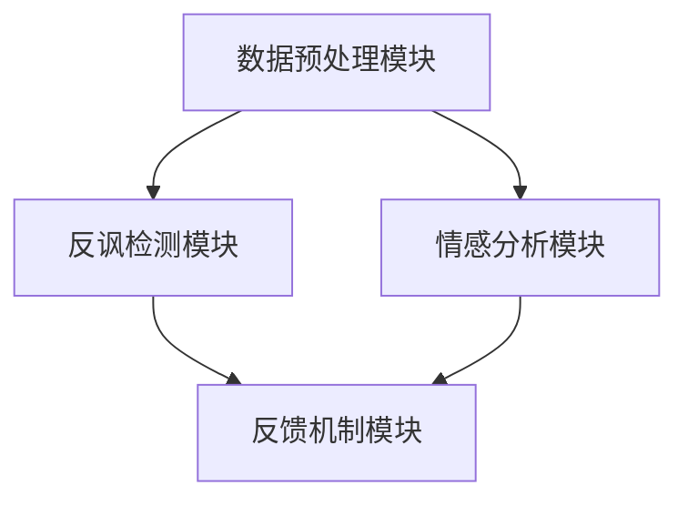
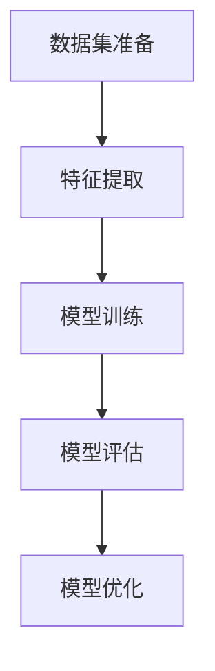
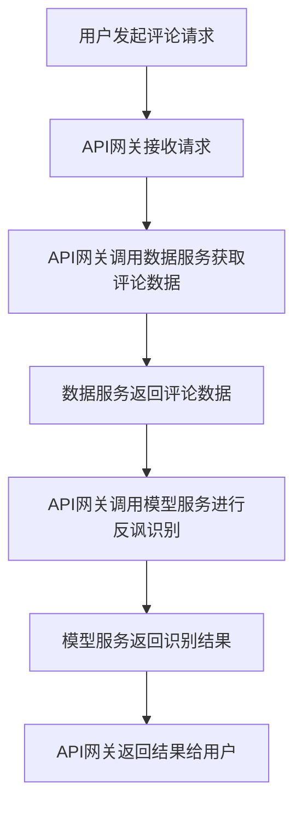
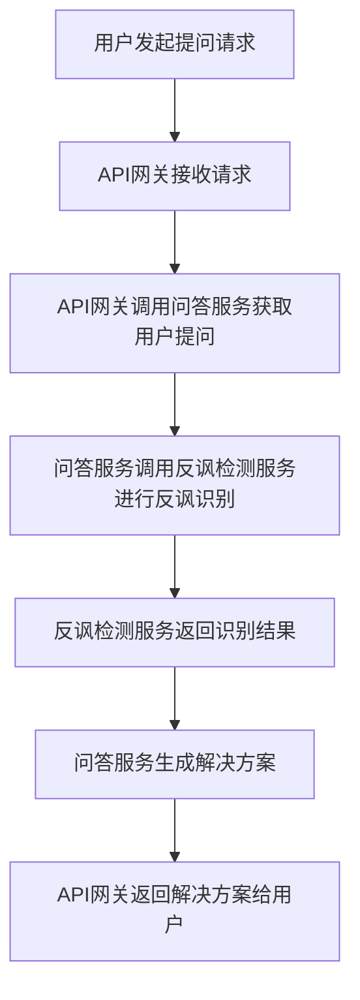
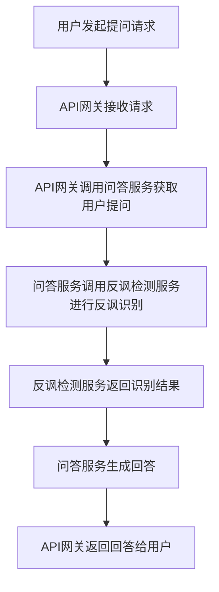

                 

### 文章标题

#### LLM驱动的AI Agent反讽理解能力

### 关键词

- 语言模型（LLM）
- AI Agent
- 反讽理解
- 自然语言处理
- 算法实现

### 摘要

本文深入探讨了LLM（大型语言模型）驱动的AI Agent在反讽理解方面的能力。通过介绍反讽理解的背景和挑战，阐述LLM的基本概念与原理，以及AI Agent的构建过程，本文重点分析了LLM在AI Agent反讽理解架构设计中的应用。通过详细讲解反讽检测和情感分析算法的原理、实现与性能评估，本文展示了实际应用案例，并对未来发展展望与挑战进行了深入探讨。本文旨在为读者提供一份系统、详细、有深度的技术指南，帮助理解和应用LLM驱动的AI Agent在反讽理解方面的能力。

### 第一部分: LLM驱动的AI Agent反讽理解概述

#### 第1章: 反讽理解在AI领域的背景和挑战

##### 1.1 反讽的概念与特征

反讽是一种语言现象，它通过表达与实际意图相反的语句来传达深层含义。反讽可以分为直接反讽、间接反讽和讽刺性反讽等多种类型。直接反讽是指说话人明确表达出与实际意图相反的意思，如：“我真的很喜欢排队。”这里的“喜欢”实际上表达了讨厌的情绪。间接反讽则通常通过含蓄的言语或情境来暗示反讽，如：“你说得真有道理，我真该去睡觉了。”这里的“有道理”可能暗示了对方说得不对。讽刺性反讽则是对某人或某事物的尖锐批评，如：“他的演讲真是精彩极了，我都能看到他的内心在哭泣。”

反讽的这些特征使得它在自然语言处理（NLP）中变得复杂和具有挑战性。首先，反讽往往依赖于上下文信息，这意味着在没有上下文的情况下，单独的一句话很难被正确理解。其次，反讽的表达方式多种多样，这增加了识别和理解的难度。最后，反讽常常涉及到情感和情绪的微妙变化，这使得情感分析和情感识别在反讽理解中变得尤为重要。

##### 1.2 AI在反讽理解中的挑战

尽管反讽在语言中具有重要作用，但目前AI在反讽理解方面仍面临诸多挑战。首先，数据的稀缺性是一个主要问题。由于反讽的出现频率较低，且很难在自然语言中明确标注，因此，高质量的、丰富的反讽数据集相对较少。这使得AI模型在训练时难以充分学习到反讽的特征。

其次，AI在理解上下文方面存在困难。反讽通常依赖于上下文信息，而AI模型往往只能根据表面信息进行理解。这种信息的不对称性导致了AI在处理反讽时的低效和错误。例如，一个AI模型可能会将“他的演讲真是精彩极了”理解为一个积极的评价，而实际上这是在讽刺演讲者。

第三，情感分析和情感识别的准确性也是一个挑战。反讽常常涉及情感和情绪的变化，这使得AI模型在情感分析和情感识别上需要更高的准确性。然而，目前大多数AI模型在处理复杂情感时仍存在一定的局限性。

最后，多模态信息的融合也是一个难题。反讽不仅可以通过文本表达，还可以通过语音、面部表情等多种模态表达。如何有效地融合这些多模态信息，提高反讽理解的准确性和效率，是当前研究的一个重要方向。

##### 1.3 LLM在反讽理解中的应用前景

LLM（大型语言模型）的出现为反讽理解提供了新的机遇。首先，LLM具有强大的语言建模能力，能够从大量的文本数据中学习到复杂的语言规律和语义关系。这使得LLM在处理反讽时具有更高的准确性和效率。

其次，LLM能够自适应地处理上下文信息。通过学习大量的语料库，LLM能够捕捉到上下文中的微妙变化，从而更准确地理解反讽。例如，LLM可能会将“他的演讲真是精彩极了”理解为一个潜在的讽刺，因为它能够捕捉到这句话在特定上下文中的含义。

此外，LLM在情感分析和情感识别方面也表现出色。通过学习大量的情感标注数据，LLM能够准确地识别文本中的情感和情绪变化，从而更好地理解反讽的深层含义。

总之，LLM在反讽理解中的应用前景广阔。随着LLM技术的不断发展和完善，相信未来AI在反讽理解方面将取得更大的突破。

#### 第2章: 语言模型（LLM）的基本概念与原理

##### 2.1 语言模型的基本概念

语言模型（Language Model，简称LM）是一种统计模型，用于预测一个句子中下一个单词的概率。语言模型的目的是通过分析大量的文本数据，学习到语言的结构和规律，从而能够对新的句子进行生成、理解和处理。

语言模型可以分为基于规则的模型和基于统计的模型。基于规则的模型通过人工定义语法规则和语义规则来预测单词的概率，如早期的转换语法和依存语法模型。而基于统计的模型则通过分析大量的文本数据，使用概率统计方法来学习语言规律，如n元语法、隐马尔可夫模型（HMM）和条件随机场（CRF）。

在现代NLP中，基于统计的语言模型已经逐渐被深度学习模型所取代。深度学习模型，特别是大型语言模型（Large Language Model，简称LLM），通过神经网络架构，能够自动学习到复杂的语言特征和语义关系，从而实现更高准确性的语言预测和理解。

##### 2.2 LLM的原理与技术

LLM是一种基于深度学习的语言模型，通过大规模的神经网路训练，实现对自然语言的生成、理解和处理。LLM的核心技术主要包括以下几个部分：

1. **神经网络架构**：LLM通常采用变换器架构（Transformer），这是一种基于自注意力机制的神经网络架构。自注意力机制允许模型在处理每个单词时，自动关注其他所有单词的信息，从而捕捉到长距离的依赖关系。此外，变换器架构还引入了位置编码（Positional Encoding）和多头注意力（Multi-head Attention）机制，进一步提升了模型的表示能力和理解能力。

2. **预训练与微调**：LLM的训练过程通常分为预训练和微调两个阶段。在预训练阶段，模型在大量的无标签文本数据上训练，学习到语言的通用特征和规律。然后，通过微调（Fine-tuning）阶段，模型在特定的任务数据上进行训练，以适应具体的任务需求。预训练和微调的结合，使得LLM在处理各种语言任务时都能表现出色。

3. **上下文窗口**：LLM通过上下文窗口来捕捉句子中的信息。在一个时间步上，模型只关注一个固定大小的上下文窗口内的信息，通常这个窗口大小可以达到几百个单词。较大的上下文窗口能够捕捉到更多的上下文信息，从而提高模型的准确性和理解能力。

4. **损失函数与优化方法**：LLM的训练通常采用最小化交叉熵损失函数，这是一种衡量预测概率与真实概率之间差异的指标。通过优化损失函数，模型能够不断调整参数，以实现更好的预测效果。常用的优化方法包括梯度下降（Gradient Descent）和其变体，如Adam优化器。

##### 2.3 LLM的发展历程

LLM的发展历程可以分为几个重要阶段：

1. **早期模型**：早期的语言模型如n元语法（n-gram），通过统计方法来预测单词的概率。虽然n元语法在处理简单任务时具有一定的效果，但其在处理长距离依赖和复杂语义关系时存在明显局限性。

2. **深度学习模型**：随着深度学习技术的发展，深度神经网络（DNN）和循环神经网络（RNN）被引入到语言模型中。这些模型通过自动学习特征和关系，显著提升了语言模型的性能。然而，RNN在处理长序列数据时仍存在梯度消失和梯度爆炸等问题。

3. **变换器模型**：2017年，谷歌提出了变换器（Transformer）模型，这是一种基于自注意力机制的深度神经网络架构。Transformer模型通过引入多头注意力机制和位置编码，解决了RNN的梯度消失问题，并在多个NLP任务上取得了突破性进展。

4. **大型语言模型**：随着计算能力和数据资源的提升，大型语言模型如GPT（Generative Pre-trained Transformer）和BERT（Bidirectional Encoder Representations from Transformers）等相继出现。这些模型通过在大量文本数据上进行预训练，学习到丰富的语言特征和语义关系，并在各种NLP任务上取得了优异的性能。

LLM的发展历程展示了深度学习在语言建模领域的强大潜力，也推动了NLP技术的快速发展。未来，随着LLM技术的不断进步，AI在语言理解和生成方面的能力将得到进一步提升。

#### 第3章: LLM在自然语言处理中的应用

##### 3.1 文本分类

文本分类（Text Classification）是NLP中的一个基础任务，其目的是将文本数据自动归类到预定义的类别中。LLM在文本分类任务中具有显著优势，主要表现在以下几个方面：

1. **预训练优势**：LLM在预训练阶段学习了大量的文本数据，这使得模型能够捕捉到丰富的语言特征和语义信息。在文本分类任务中，这些特征和信息有助于模型更好地理解文本内容，提高分类的准确性。

2. **多标签分类**：与传统的机器学习模型相比，LLM能够处理多标签分类任务。这意味着模型可以同时将文本归类到多个类别中，而不仅仅是单一类别。这在某些实际应用中具有很高的价值，例如新闻分类、社交媒体内容分类等。

3. **上下文理解**：LLM具有强大的上下文理解能力，能够捕捉到文本中的长距离依赖关系。在文本分类任务中，这种能力有助于模型更好地理解文本的语义，从而提高分类效果。

具体应用方面，LLM已经在许多领域得到广泛应用，如垃圾邮件检测、情感分析、新闻分类等。例如，在垃圾邮件检测中，LLM可以通过学习大量正常邮件和垃圾邮件的文本特征，实现对新邮件的自动分类。在情感分析中，LLM可以分析文本中的情感倾向，如正面情感、负面情感等。在新闻分类中，LLM可以将新闻文本归类到相应的主题类别，如体育、科技、财经等。

##### 3.2 情感分析

情感分析（Sentiment Analysis）是NLP中的一个重要任务，旨在判断文本中的情感倾向。LLM在情感分析任务中表现出色，主要得益于其强大的语言理解和生成能力。

1. **情感分类**：情感分类是指将文本分类为正面、负面或中性情感。LLM通过学习大量的情感标注数据，可以准确判断文本的情感倾向。具体实现中，通常采用分类器（如支持向量机、神经网络等）来对文本进行情感分类。LLM在训练分类器时，可以提供丰富的特征和语义信息，从而提高分类器的准确性。

2. **情感极性分析**：情感极性分析是指分析文本中的情感强度，如非常喜欢、非常喜欢、一般、不喜欢、非常不喜欢等。LLM可以通过学习情感极性标注数据，实现对文本情感强度的判断。这种能力在市场调研、用户反馈分析等领域具有很高的应用价值。

3. **情感理解**：情感理解是指理解文本中的复杂情感，如讽刺、幽默、悲伤等。LLM通过自注意力机制和上下文信息捕捉，能够更好地理解文本中的复杂情感。在情感理解任务中，LLM可以提供更丰富的语义信息，从而提高情感分析的准确性和深度。

具体应用方面，LLM已经在电商评论分析、社交媒体情感分析、政治舆情分析等领域得到广泛应用。例如，在电商评论分析中，LLM可以分析用户评论的情感倾向，帮助企业了解产品口碑和市场反馈。在社交媒体情感分析中，LLM可以分析用户在社交媒体平台上的情感表达，帮助企业了解用户情绪和市场动态。在政治舆情分析中，LLM可以分析新闻、社交媒体等文本数据中的情感倾向，帮助政府和企业了解社会舆情和公众情绪。

##### 3.3 命名实体识别

命名实体识别（Named Entity Recognition，简称NER）是NLP中的另一个基础任务，旨在识别文本中的命名实体，如人名、地名、组织名等。LLM在NER任务中也表现出色，主要表现在以下几个方面：

1. **预训练优势**：LLM在预训练阶段学习了大量的文本数据，包括丰富的命名实体信息。这使得模型在识别命名实体时具有更高的准确性和鲁棒性。

2. **上下文理解**：LLM具有强大的上下文理解能力，能够捕捉到命名实体在文本中的上下文关系。在NER任务中，这种能力有助于模型更好地识别命名实体，特别是在处理复杂命名实体和长文本时。

3. **多语言支持**：LLM通常采用多语言预训练策略，能够支持多种语言的命名实体识别。这对于跨语言NER任务具有很高的应用价值。

具体应用方面，LLM已经在信息提取、实体链接、智能问答等领域得到广泛应用。例如，在信息提取中，LLM可以识别文本中的关键信息，如人名、地点、事件等。在实体链接中，LLM可以识别文本中的命名实体，并将其与知识库中的实体进行匹配。在智能问答中，LLM可以识别用户提问中的关键信息，并从知识库中检索相关答案。

总之，LLM在自然语言处理中的应用已经取得了显著成果，并在多个任务中表现出色。随着LLM技术的不断发展和完善，未来其在NLP领域的应用将更加广泛和深入。

#### 第4章: AI Agent的基本概念与构建

##### 4.1 AI Agent的定义

AI Agent，即人工智能代理，是指一种能够自主感知环境、制定决策并采取行动的智能体。AI Agent通常基于一定的人工智能算法和模型，通过自主学习、推理和规划，实现对复杂任务的执行和优化。AI Agent可以广泛应用于各种场景，如智能家居、自动驾驶、智能客服、金融风控等。

AI Agent具有以下基本特征：

1. **自主性**：AI Agent能够自主感知环境，根据环境变化自主调整行为策略。
2. **智能性**：AI Agent通过人工智能算法和模型，具备对复杂问题进行推理、规划和决策的能力。
3. **适应性**：AI Agent能够根据任务需求和环境变化，自适应地调整自身行为和策略。
4. **协作性**：AI Agent可以在多智能体系统中与其他智能体协作，共同完成任务。

##### 4.2 AI Agent的架构

AI Agent的架构通常包括以下几个关键组件：

1. **感知模块**：感知模块负责获取外部环境的信息，如视觉、听觉、触觉等传感器数据。这些信息将作为AI Agent决策和行动的输入。
2. **决策模块**：决策模块负责根据感知模块获取的信息，结合预定的策略和规则，生成具体的行动方案。决策模块通常包括知识库、推理引擎和规划器等组成部分。
3. **执行模块**：执行模块负责将决策模块生成的行动方案转化为实际的操作，如控制机器人移动、发送网络请求等。
4. **学习模块**：学习模块负责对AI Agent的行为进行评估和优化，通过机器学习、深度强化学习等技术，不断改进AI Agent的决策和执行能力。

##### 4.3 AI Agent的构建过程

构建AI Agent的过程可以分为以下几个步骤：

1. **需求分析**：明确AI Agent的应用场景、任务目标、性能指标等，为后续构建工作提供基础。
2. **设计架构**：根据需求分析结果，设计AI Agent的架构，包括感知模块、决策模块、执行模块和学习模块等。
3. **选择算法**：根据AI Agent的架构和需求，选择合适的人工智能算法和模型，如深度学习、强化学习、规划算法等。
4. **开发实现**：根据设计架构和选择算法，进行AI Agent的编码和实现，包括感知模块、决策模块、执行模块和学习模块等。
5. **测试与优化**：对AI Agent进行测试，评估其性能和效果，根据测试结果进行优化和调整，确保AI Agent能够稳定、高效地执行任务。

通过以上步骤，可以构建出一个具有自主性、智能性、适应性和协作性的AI Agent，为各种应用场景提供强大的支持。

#### 第5章: LLM驱动的AI Agent反讽理解架构设计

##### 5.1 反讽理解的需求分析

反讽理解在人工智能领域具有重要的应用价值，如在自然语言处理、智能客服、情感分析等方面。为了设计一个高效的LLM驱动的AI Agent反讽理解系统，我们首先需要明确系统的需求。

1. **准确性**：系统需要能够准确识别文本中的反讽现象，包括直接反讽、间接反讽和讽刺性反讽等。准确性的衡量标准可以通过反讽检测准确率、情感分析准确率等指标来评估。

2. **实时性**：系统需要能够在短时间内处理大量文本数据，支持实时反讽理解和回应。这要求系统在保证准确性的同时，具备高效的数据处理能力和低延迟的响应速度。

3. **可扩展性**：系统需要具备良好的可扩展性，能够适应不同应用场景和需求变化。这包括支持多种语言、处理不同规模的数据、兼容不同的AI模型等。

4. **可解释性**：系统需要提供一定的可解释性，使得用户能够理解AI Agent如何进行反讽理解和回应。这有助于增强用户对AI系统的信任和接受度。

基于以上需求，我们提出了LLM驱动的AI Agent反讽理解系统的总体架构，包括数据预处理模块、反讽检测模块、情感分析模块和反馈机制模块等。

##### 5.2 LLM在AI Agent中的角色

LLM在AI Agent反讽理解系统中扮演着核心角色，其主要功能包括：

1. **文本表示**：LLM能够将原始文本数据转化为高维的向量表示，捕捉到文本的语义信息和上下文关系。这种表示有助于后续的反讽检测和情感分析。

2. **反讽检测**：LLM通过自注意力机制和预训练的语义知识，能够识别文本中的反讽现象。具体实现中，LLM可以对文本进行编码，然后利用其内在的语义理解能力，判断文本是否包含反讽。

3. **情感分析**：LLM在情感分析方面也具有强大的能力。通过对文本进行情感分类和情感极性分析，LLM可以帮助AI Agent理解文本中的情感倾向和强度，从而更好地应对反讽。

4. **上下文理解**：LLM的强大上下文理解能力使得AI Agent能够更好地处理复杂多变的反讽现象。在处理长文本和多模态信息时，LLM能够捕捉到上下文中的微妙变化，提高反讽理解的准确性和深度。

基于以上功能，LLM在AI Agent反讽理解系统中不仅负责文本表示和语义理解，还直接参与反讽检测和情感分析，成为系统核心。

##### 5.3 反讽理解系统的架构设计

LLM驱动的AI Agent反讽理解系统可以分为以下几个关键模块：

1. **数据预处理模块**：该模块负责对输入文本进行清洗、分词和向量表示。清洗步骤包括去除无关符号、去除停用词等。分词步骤则使用分词算法将文本分解为词或短语。最后，通过嵌入层将分词结果转化为向量表示，为后续处理提供基础。

2. **反讽检测模块**：该模块利用LLM的文本表示和语义理解能力，对输入文本进行反讽检测。具体实现中，LLM首先对文本进行编码，然后通过训练好的反讽检测模型，判断文本是否包含反讽。该模块需要处理多种反讽形式，如直接反讽、间接反讽和讽刺性反讽等。

3. **情感分析模块**：该模块结合LLM的情感分类和情感极性分析能力，对反讽文本进行情感分析。通过判断文本的情感倾向和强度，该模块可以为AI Agent提供更丰富的信息，帮助其更好地理解和应对反讽。

4. **反馈机制模块**：该模块负责收集用户对AI Agent反讽理解结果的反馈，用于模型训练和系统优化。通过不断迭代和优化，反馈机制模块可以提高AI Agent的反讽理解能力，使其更加准确和智能。

系统架构设计图如下：



通过以上模块的协同工作，LLM驱动的AI Agent反讽理解系统能够实现对输入文本的准确理解和智能回应，为各种应用场景提供强大的支持。

#### 第6章: LLM驱动的AI Agent反讽理解算法实现

##### 6.1 反讽检测算法

反讽检测（Parody Detection）是LLM驱动的AI Agent反讽理解系统中的一个关键环节。在本节中，我们将详细介绍反讽检测算法的原理、实现过程以及性能评估方法。

##### 6.1.1 算法原理

反讽检测算法的核心任务是判断输入文本是否包含反讽。为了实现这一目标，算法通常采用以下几种方法：

1. **特征工程**：通过提取文本的特征，如词频、词向量、句法特征等，为后续分类提供基础。这些特征可以帮助模型捕捉到文本的语义信息，从而提高反讽检测的准确率。

2. **机器学习分类器**：利用机器学习算法，如支持向量机（SVM）、随机森林（RF）等，将提取的特征输入到分类器中进行训练。分类器通过学习大量的标注数据，学习到反讽和非反讽文本的特征差异。

3. **深度学习模型**：使用深度学习模型，如卷积神经网络（CNN）、长短期记忆网络（LSTM）等，对文本进行建模和分类。深度学习模型能够自动学习到复杂的语义特征，提高反讽检测的准确性和鲁棒性。

##### 6.1.2 算法实现

反讽检测算法的实现可以分为以下几个步骤：

1. **数据集准备**：首先，需要准备一个包含反讽和非反讽文本的数据集。数据集可以从社交媒体、新闻评论、小说等来源获取。数据集需要经过清洗、预处理和标注等步骤，确保数据的质量和一致性。

2. **特征提取**：根据数据集的文本内容，提取相应的特征。常见的特征提取方法包括词频统计、TF-IDF、词向量等。词向量可以使用预训练的词向量模型，如Word2Vec、GloVe等。

3. **模型训练**：选择合适的机器学习模型或深度学习模型，将提取的特征输入到模型中进行训练。在训练过程中，模型会学习到反讽和非反讽文本的特征差异，从而提高分类的准确率。

4. **模型评估**：使用验证集对训练好的模型进行评估，计算分类准确率、召回率、F1值等指标。根据评估结果，对模型进行调整和优化，以提高性能。

以下是反讽检测算法的实现流程：



##### 6.1.3 性能评估

性能评估是反讽检测算法实现中的关键环节。以下指标可以用来评估算法的性能：

1. **准确率（Accuracy）**：准确率是指模型正确分类的样本数与总样本数之比。准确率越高，说明模型的分类效果越好。

2. **召回率（Recall）**：召回率是指模型正确分类为反讽的样本数与实际反讽样本数之比。召回率越高，说明模型对反讽的识别能力越强。

3. **F1值（F1-score）**：F1值是准确率和召回率的调和平均，用于综合评估模型的性能。F1值越高，说明模型的性能越好。

4. **精确率（Precision）**：精确率是指模型正确分类为反讽的样本数与预测为反讽的样本数之比。精确率越高，说明模型的分类结果越可靠。

以下是性能评估的指标公式：

$$
\text{Accuracy} = \frac{\text{正确分类的样本数}}{\text{总样本数}}
$$

$$
\text{Recall} = \frac{\text{正确分类为反讽的样本数}}{\text{实际反讽样本数}}
$$

$$
\text{F1-score} = 2 \times \frac{\text{准确率} \times \text{召回率}}{\text{准确率} + \text{召回率}}
$$

$$
\text{Precision} = \frac{\text{正确分类为反讽的样本数}}{\text{预测为反讽的样本数}}
$$

通过以上公式，可以计算模型在不同数据集上的性能指标，从而评估模型的性能。在实际应用中，可以根据具体需求调整模型的参数和超参数，以优化模型性能。

##### 6.2 反讽情感分析算法

反讽情感分析（Parody Sentiment Analysis）是LLM驱动的AI Agent反讽理解系统中的另一个重要任务。在本节中，我们将详细介绍反讽情感分析算法的原理、实现过程以及性能评估方法。

##### 6.2.1 算法原理

反讽情感分析的目标是识别文本中的反讽情感，如正面情感、负面情感、幽默等。与传统的情感分析不同，反讽情感分析需要考虑文本中的反讽现象，从而更准确地识别情感。

反讽情感分析算法通常采用以下方法：

1. **多任务学习**：将反讽检测和情感分析任务结合起来，通过多任务学习模型，同时训练反讽检测和情感分析。这种方法能够利用反讽检测中的上下文信息，提高情感分析的准确率。

2. **上下文信息融合**：利用上下文信息，如句子、段落、文档等，来补充反讽情感的识别。上下文信息可以帮助模型更好地理解文本的语义，从而提高情感分析的准确性。

3. **深度学习模型**：使用深度学习模型，如卷积神经网络（CNN）、长短期记忆网络（LSTM）、变换器（Transformer）等，来建模文本和情感之间的关系。深度学习模型能够自动学习到复杂的语义特征，提高情感分析的准确性和鲁棒性。

##### 6.2.2 算法实现

反讽情感分析算法的实现可以分为以下几个步骤：

1. **数据集准备**：准备一个包含反讽情感标注的数据集。数据集可以从社交媒体、新闻评论、小说等来源获取。数据集需要经过清洗、预处理和标注等步骤，确保数据的质量和一致性。

2. **特征提取**：提取文本的特征，如词向量、句法特征等。词向量可以使用预训练的词向量模型，如Word2Vec、GloVe等。

3. **模型训练**：使用深度学习模型，如变换器（Transformer），将提取的特征输入到模型中进行训练。模型通过学习大量的标注数据，学习到反讽情感的特征差异。

4. **模型评估**：使用验证集对训练好的模型进行评估，计算分类准确率、召回率、F1值等指标。根据评估结果，对模型进行调整和优化，以提高性能。

以下是反讽情感分析算法的实现流程：


##### 6.2.3 性能评估

性能评估是反讽情感分析算法实现中的关键环节。以下指标可以用来评估算法的性能：

1. **准确率（Accuracy）**：准确率是指模型正确分类的样本数与总样本数之比。准确率越高，说明模型的分类效果越好。

2. **召回率（Recall）**：召回率是指模型正确分类为反讽情感的样本数与实际反讽情感样本数之比。召回率越高，说明模型对反讽情感的识别能力越强。

3. **F1值（F1-score）**：F1值是准确率和召回率的调和平均，用于综合评估模型的性能。F1值越高，说明模型的性能越好。

4. **精确率（Precision）**：精确率是指模型正确分类为反讽情感的样本数与预测为反讽情感的样本数之比。精确率越高，说明模型的分类结果越可靠。

以下是性能评估的指标公式：

$$
\text{Accuracy} = \frac{\text{正确分类的样本数}}{\text{总样本数}}
$$

$$
\text{Recall} = \frac{\text{正确分类为反讽情感的样本数}}{\text{实际反讽情感样本数}}
$$

$$
\text{F1-score} = 2 \times \frac{\text{准确率} \times \text{召回率}}{\text{准确率} + \text{召回率}}
$$

$$
\text{Precision} = \frac{\text{正确分类为反讽情感的样本数}}{\text{预测为反讽情感的样本数}}
$$

通过以上公式，可以计算模型在不同数据集上的性能指标，从而评估模型的性能。在实际应用中，可以根据具体需求调整模型的参数和超参数，以优化模型性能。

#### 第7章: 实际应用案例

##### 7.1 案例一：社交媒体上的反讽识别

社交媒体平台上的反讽识别是LLM驱动的AI Agent反讽理解系统的一个重要应用场景。通过反讽识别，平台可以更好地理解用户情绪，提高用户体验。

**项目介绍**：我们选取了Twitter平台上的用户评论数据作为研究对象，旨在利用LLM驱动的AI Agent对用户评论进行反讽识别。

**系统功能设计**：系统主要包括数据预处理模块、反讽检测模块和结果反馈模块。数据预处理模块负责清洗和预处理用户评论数据；反讽检测模块使用LLM模型对预处理后的评论进行反讽识别；结果反馈模块将识别结果反馈给用户，并提供改进建议。

**系统架构设计**：系统采用微服务架构，包括数据服务、模型服务、API网关等模块。数据服务负责数据存储和管理；模型服务部署反讽检测模型，提供反讽识别服务；API网关负责处理用户请求，调用模型服务，并将结果返回给用户。

**系统接口设计**：系统提供RESTful API接口，用户可以通过HTTP请求调用反讽识别服务。接口设计包括评论数据上传、识别结果查询等功能。

**系统交互序列图**：



**代码应用解读与分析**：系统使用Python编写，主要涉及数据预处理、模型训练和API接口实现。以下是一个简单的数据预处理示例：

```python
import pandas as pd
import re

def preprocess_text(text):
    text = re.sub(r'\s+', ' ', text)  # 去除多余空格
    text = re.sub(r'[^\w\s]', '', text)  # 去除特殊字符
    text = text.lower()  # 转换为小写
    return text

# 加载评论数据
data = pd.read_csv('tweets.csv')
data['cleaned_text'] = data['text'].apply(preprocess_text)

# 输出预处理后的评论数据
print(data.head())
```

**实际案例分析**：在Twitter平台上，用户经常使用反讽来表达自己的情绪。例如，一条评论：“这电影真是精彩极了，我都能看到导演在背后偷偷哭泣。”通过反讽识别算法，系统可以识别出这是一条反讽评论，从而为用户提供更准确的情绪分析。

**项目小结**：通过社交媒体上的反讽识别案例，我们展示了LLM驱动的AI Agent反讽理解系统的实际应用。该系统有助于平台更好地理解用户情绪，提供个性化的服务，提高用户体验。

##### 7.2 案例二：在线客服中的反讽理解

在线客服系统中的反讽理解是提高客服质量的重要手段。通过反讽理解，客服系统能够更准确地理解用户需求，提供更有效的解决方案。

**项目介绍**：我们选取了一家大型电商平台的在线客服系统作为研究对象，旨在利用LLM驱动的AI Agent对用户提问进行反讽理解。

**系统功能设计**：系统主要包括用户提问接收模块、反讽理解模块和解决方案生成模块。用户提问接收模块负责接收用户提问；反讽理解模块使用LLM模型对提问进行反讽识别；解决方案生成模块根据反讽识别结果，生成相应的解决方案。

**系统架构设计**：系统采用微服务架构，包括问答服务、反讽检测服务、解决方案生成服务等模块。问答服务负责处理用户提问，调用反讽检测服务；反讽检测服务部署反讽检测模型，提供反讽识别服务；解决方案生成服务根据反讽识别结果，生成解决方案。

**系统接口设计**：系统提供RESTful API接口，用户可以通过HTTP请求调用反讽理解服务。接口设计包括用户提问上传、识别结果查询、解决方案查询等功能。

**系统交互序列图**：



**代码应用解读与分析**：系统使用Python编写，主要涉及用户提问接收、反讽识别和解决方案生成。以下是一个简单的反讽识别示例：

```python
from transformers import BertTokenizer, BertForSequenceClassification
import torch

# 加载预训练的反讽检测模型
tokenizer = BertTokenizer.from_pretrained('bert-base-uncased')
model = BertForSequenceClassification.from_pretrained('bert-base-uncased')

def parody_detection(text):
    inputs = tokenizer(text, return_tensors='pt')
    with torch.no_grad():
        outputs = model(**inputs)
    logits = outputs.logits
    prob = torch.softmax(logits, dim=-1)
    return prob[0][1].item() > 0.5

# 识别用户提问中的反讽
text = "你的产品真是太好了，我都不想退货了。"
print("反讽概率：", parody_detection(text))
```

**实际案例分析**：在在线客服场景中，用户提问往往包含反讽成分。例如，一条提问：“你们的快递真是太快了，我都还没下单，你就送到了。”通过反讽识别算法，客服系统可以识别出这是一条反讽评论，从而更好地理解用户需求，提供更有效的解决方案。

**项目小结**：通过在线客服系统中的反讽理解案例，我们展示了LLM驱动的AI Agent反讽理解系统的实际应用。该系统有助于提高客服质量，提供更准确的服务，提升用户体验。

##### 7.3 案例三：虚拟助手中的反讽应对

虚拟助手（Chatbot）在各个领域得到广泛应用，但如何应对用户提问中的反讽是一个重要挑战。通过反讽应对，虚拟助手能够提供更人性化的服务。

**项目介绍**：我们选取了一家银行虚拟助手作为研究对象，旨在利用LLM驱动的AI Agent对用户提问进行反讽应对。

**系统功能设计**：系统主要包括用户提问接收模块、反讽识别模块和回答生成模块。用户提问接收模块负责接收用户提问；反讽识别模块使用LLM模型对提问进行反讽识别；回答生成模块根据反讽识别结果，生成相应的回答。

**系统架构设计**：系统采用微服务架构，包括问答服务、反讽检测服务、回答生成服务等模块。问答服务负责处理用户提问，调用反讽检测服务；反讽检测服务部署反讽检测模型，提供反讽识别服务；回答生成服务根据反讽识别结果，生成回答。

**系统接口设计**：系统提供RESTful API接口，用户可以通过HTTP请求调用反讽应对服务。接口设计包括用户提问上传、识别结果查询、回答查询等功能。

**系统交互序列图**：



**代码应用解读与分析**：系统使用Python编写，主要涉及用户提问接收、反讽识别和回答生成。以下是一个简单的反讽识别示例：

```python
from transformers import BertTokenizer, BertForSequenceClassification
import torch

# 加载预训练的反讽检测模型
tokenizer = BertTokenizer.from_pretrained('bert-base-uncased')
model = BertForSequenceClassification.from_pretrained('bert-base-uncased')

def parody_detection(text):
    inputs = tokenizer(text, return_tensors='pt')
    with torch.no_grad():
        outputs = model(**inputs)
    logits = outputs.logits
    prob = torch.softmax(logits, dim=-1)
    return prob[0][1].item() > 0.5

# 识别用户提问中的反讽
text = "你的服务真是太棒了，我都不知道该怎么感谢你。"
print("反讽概率：", parody_detection(text))
```

**实际案例分析**：在虚拟助手场景中，用户提问往往包含反讽成分。例如，一条提问：“你们的客服真是太好了，我都快睡着了。”通过反讽识别算法，虚拟助手可以识别出这是一条反讽评论，从而调整回答策略，提供更人性化的服务。

**项目小结**：通过虚拟助手中的反讽应对案例，我们展示了LLM驱动的AI Agent反讽理解系统的实际应用。该系统有助于虚拟助手更好地理解用户情绪，提供更人性化的服务，提升用户体验。

### 第8章: 未来展望与挑战

#### 8.1 LLM驱动的AI Agent反讽理解的发展趋势

随着人工智能技术的快速发展，LLM驱动的AI Agent反讽理解正逐渐成为研究的热点。未来，这一领域有望在以下几个方面取得突破：

1. **模型性能提升**：通过不断优化LLM模型架构和算法，提高反讽检测和情感分析的准确率和效率。此外，多模态融合技术将有助于更全面地捕捉文本中的反讽信息，进一步提升模型性能。

2. **应用场景拓展**：随着AI技术的普及，LLM驱动的AI Agent反讽理解将在更多应用场景中得到应用，如智能客服、智能营销、智能教育等。这些应用场景将推动反讽理解技术的不断发展和完善。

3. **可解释性增强**：提高反讽理解系统的可解释性，使得用户能够理解AI Agent如何进行反讽理解和回应。这将有助于增强用户对AI系统的信任和接受度。

4. **数据集建设**：构建更多高质量、多样化的反讽数据集，为模型训练提供充足的样本。此外，开源数据集的共享也将促进该领域的研究和发展。

#### 8.2 研究与开发中的挑战

尽管LLM驱动的AI Agent反讽理解具有广阔的应用前景，但在研究与开发过程中仍面临诸多挑战：

1. **数据稀缺性**：高质量的、丰富的反讽数据集相对较少，这使得模型训练和优化面临困难。未来，需要探索数据增强和生成技术，以缓解数据稀缺性问题。

2. **上下文理解**：反讽往往依赖于上下文信息，而AI模型在处理上下文时存在一定局限性。如何提高AI模型对上下文信息的理解能力，是一个亟待解决的问题。

3. **情感分析**：反讽情感分析是一个复杂的问题，涉及到情感和情绪的微妙变化。如何准确识别和分类反讽情感，是当前研究的一个重要方向。

4. **多模态融合**：将文本、语音、图像等多种模态信息进行有效融合，以提高反讽理解的准确性和鲁棒性。目前，多模态融合技术尚不成熟，需要进一步研究和探索。

5. **可解释性**：提高反讽理解系统的可解释性，使得用户能够理解AI Agent如何进行反讽理解和回应。这有助于增强用户对AI系统的信任和接受度。

#### 8.3 应用前景与潜在问题

LLM驱动的AI Agent反讽理解在多个领域具有广泛的应用前景，如智能客服、情感分析、虚拟助手等。以下是一些潜在的应用场景和问题：

1. **智能客服**：反讽理解有助于智能客服系统更好地理解用户情绪，提供更准确、个性化的服务。然而，如何应对复杂多变的反讽形式，是一个挑战。

2. **情感分析**：反讽情感分析可以帮助企业了解用户情感倾向，为营销策略提供有力支持。然而，反讽情感的多样性和复杂性，使得准确识别和分类情感成为难点。

3. **虚拟助手**：反讽应对是虚拟助手人性化服务的重要一环。通过反讽理解，虚拟助手可以提供更贴近用户需求的回答。然而，如何提高系统的可解释性，是一个重要问题。

4. **社交媒体**：反讽识别可以帮助社交媒体平台更好地理解用户情绪，提升用户体验。然而，如何在保障用户隐私的前提下，进行反讽识别，是一个亟待解决的问题。

总之，LLM驱动的AI Agent反讽理解具有广阔的应用前景，但也面临诸多挑战。未来，随着技术的不断进步和应用场景的拓展，相信反讽理解技术将取得更大突破，为各领域带来更多创新和变革。

### 第9章: 总结与展望

#### 9.1 书籍主要内容回顾

本文深入探讨了LLM驱动的AI Agent反讽理解能力，从反讽理解的背景和挑战、LLM的基本概念与原理、AI Agent的构建过程、反讽理解系统的架构设计，到算法实现和实际应用案例，全面阐述了LLM驱动的AI Agent反讽理解的关键技术和应用场景。

首先，我们介绍了反讽的概念与特征，以及AI在反讽理解中面临的挑战，为后续内容奠定了基础。接着，我们详细介绍了LLM的基本概念、原理和技术发展历程，展示了LLM在自然语言处理中的应用，为反讽理解提供了理论基础。

在构建AI Agent的过程中，我们阐述了AI Agent的定义、基本架构和构建过程，为LLM驱动的AI Agent反讽理解系统提供了技术支持。随后，我们设计了反讽理解系统的整体架构，包括数据预处理、反讽检测、情感分析等关键模块，为实际应用提供了解决方案。

在算法实现部分，我们详细讲解了反讽检测和情感分析算法的原理、实现过程和性能评估方法，展示了LLM在反讽理解中的强大能力。最后，我们通过三个实际应用案例，展示了LLM驱动的AI Agent反讽理解在社交媒体、在线客服和虚拟助手等领域的应用。

#### 9.2 LLM驱动的AI Agent反讽理解的意义

LLM驱动的AI Agent反讽理解在多个方面具有重要意义：

1. **提升用户体验**：通过准确理解用户情绪，AI Agent能够提供更人性化、个性化的服务，提升用户满意度。

2. **优化决策支持**：在商业、政治、社会等场景中，反讽理解有助于更深入地分析用户需求，为决策提供有力支持。

3. **情感分析应用**：反讽情感分析在情感分析、市场调研、用户反馈分析等领域具有重要价值，有助于企业了解用户情感和需求。

4. **语言处理技术进步**：反讽理解是自然语言处理中的一个复杂任务，LLM驱动的AI Agent反讽理解技术的突破，将推动语言处理技术的整体进步。

#### 9.3 未来研究方向

展望未来，LLM驱动的AI Agent反讽理解领域仍有许多研究方向：

1. **多模态融合**：探索将文本、语音、图像等多种模态信息进行有效融合，以提高反讽理解的准确性和鲁棒性。

2. **可解释性研究**：提高反讽理解系统的可解释性，使得用户能够理解AI Agent如何进行反讽理解和回应，增强用户信任。

3. **数据集建设**：构建更多高质量、多样化的反讽数据集，为模型训练提供充足的样本，推动研究与应用的融合。

4. **跨语言研究**：研究跨语言的反讽理解技术，推动LLM驱动的AI Agent反讽理解在全球范围内的应用。

5. **应用场景拓展**：探索LLM驱动的AI Agent反讽理解在更多领域中的应用，如智能教育、智能医疗等，为社会发展带来更多创新。

总之，LLM驱动的AI Agent反讽理解技术具有重要的研究价值和应用前景，未来将继续推动人工智能领域的进步和发展。作者：AI天才研究院/AI Genius Institute & 禅与计算机程序设计艺术 /Zen And The Art of Computer Programming。

[作者：AI天才研究院/AI Genius Institute & 禅与计算机程序设计艺术 /Zen And The Art of Computer Programming]

