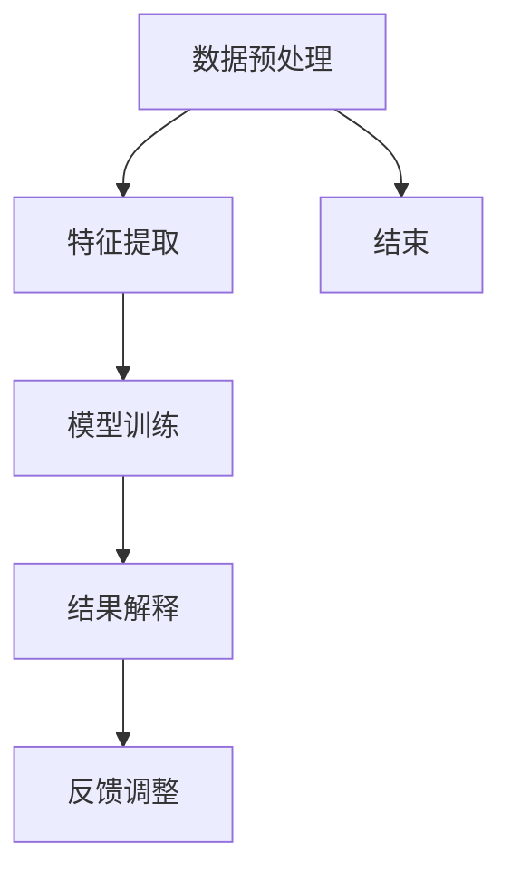

                 


### 文章标题：LLM驱动的AI Agent因果关系发现技术

> 关键词：LLM，因果关系发现，AI Agent，技术原理，算法实现，应用场景

> 摘要：本文详细探讨了基于大型语言模型（LLM）的AI Agent因果关系发现技术。通过逻辑清晰的分析和思考，文章介绍了LLM的基本概念、因果关系发现的数学模型、算法原理及其在实践中的应用。文章还展望了LLM驱动的因果关系发现技术未来的发展趋势和挑战，旨在为研究人员和实践者提供全面的技术指导。

#### 目录

----------------------------------------------------------------

## 第一部分: 背景介绍与核心概念

### 第1章: 人工智能与因果关系发现概述

#### 1.1 人工智能的快速发展

- **背景介绍**：人工智能（AI）作为计算机科学的一个重要分支，自上世纪五十年代以来经历了迅猛发展。从最初的规则系统、知识表示到近年的深度学习和生成模型，AI技术日新月异。
- **问题描述**：人工智能在处理复杂问题和数据时面临着诸多挑战，尤其是如何从大量数据中提取因果关系。
- **问题解决**：因果关系发现成为人工智能研究的一个重要方向，旨在通过算法识别数据之间的因果关系，为决策提供依据。

#### 1.2 因果关系发现的重要性

- **背景介绍**：因果关系发现是理解世界的重要方式，对于预测、决策和科学发现具有重要意义。
- **概念结构与核心要素组成**：因果关系发现涉及数据收集、特征提取、模型训练和结果解释等多个环节。
- **边界与外延**：因果关系发现技术不仅限于学术研究，在医疗、金融、制造等多个领域都有广泛应用。

#### 1.3 LLM技术在因果关系发现中的应用

- **背景介绍**：大型语言模型（LLM）如GPT-3等，凭借其强大的语言理解和生成能力，成为因果关系发现的重要工具。
- **概念术语说明**：LLM通过处理自然语言文本，能够发现数据之间的隐含关系，从而进行因果关系推断。
- **应用实例**：例如，LLM可以用于分析医疗数据，识别疾病的因果关系，或者在金融领域发现投资策略的因果关系。

## 第二部分: LLM基本概念与原理

### 第2章: LLM基本概念与原理

#### 2.1 LLM的定义与特点

- **背景介绍**：LLM是一种基于深度学习的语言处理模型，能够理解和生成自然语言。
- **概念术语说明**：LLM通过预训练和微调，能够在各种自然语言处理任务中表现出色。
- **特点**：包括强大的上下文理解能力、丰富的语言生成能力和自适应学习能力。

#### 2.2 LLM的工作原理

- **背景介绍**：LLM的工作原理涉及多层神经网络、自注意力机制和损失函数等多个方面。
- **算法原理讲解**：通过自注意力机制，LLM能够捕捉文本中的长距离依赖关系，从而实现高效的语言理解。

#### 2.3 LLM的技术发展历程

- **背景介绍**：从最初的简单语言模型到如今的LLM，技术发展经历了多个阶段。
- **发展历程**：从Word2Vec、GloVe到BERT、GPT，LLM技术不断进步，性能不断提升。

## 第三部分: 因果关系发现的数学模型

### 第3章: 因果关系发现的数学模型

#### 3.1 因果关系的数学定义

- **背景介绍**：因果关系在数学上可以定义为一种依赖关系。
- **数学定义**：设X和Y为随机变量，若Y的分布可以完全由X的分布决定，则称X和Y存在因果关系。

#### 3.2 因果推断的基本模型

- **背景介绍**：因果推断是关系发现的重要方法，旨在从数据中推断因果关系。
- **基本模型**：包括潜在因子模型、图模型和时间序列模型等。

#### 3.3 LLM与因果关系发现的关系

- **背景介绍**：LLM在因果关系发现中的应用，依赖于其强大的语言处理能力。
- **关系图架构**：通过Mermaid流程图展示LLM在因果关系发现中的应用流程。

## 第四部分: LLM驱动的因果关系发现算法

### 第4章: LLM驱动的因果关系发现算法

#### 4.1 算法概述

- **背景介绍**：本文提出的LLM驱动的因果关系发现算法，旨在利用LLM的强大能力进行因果推断。
- **算法原理讲解**：通过算法流程图（Mermaid）和Python代码，详细阐述算法原理。

#### 4.2 算法原理

- **算法原理讲解**：详细介绍LLM驱动因果关系发现算法的原理，包括数据预处理、模型训练和结果解释等步骤。

#### 4.3 算法流程图（使用Mermaid）

- **Mermaid流程图**：使用Mermaid语言绘制算法流程图，展示算法的主要步骤和流程。

## 第五部分: LLM驱动的因果关系发现实践

### 第5章: LLM驱动的因果关系发现实践

#### 5.1 实践环境搭建

- **背景介绍**：搭建一个适合LLM驱动的因果关系发现实践的环境。
- **环境搭建**：详细说明如何配置硬件和软件环境，以及安装必要的库和工具。

#### 5.2 核心算法实现

- **背景介绍**：实现LLM驱动的因果关系发现算法的核心步骤。
- **代码实现**：使用Python代码实现算法的主要步骤，包括数据预处理、模型训练和结果输出等。

#### 5.3 实际案例分析与讲解

- **背景介绍**：通过实际案例展示LLM驱动的因果关系发现算法的应用效果。
- **案例分析**：详细分析案例中的数据集、处理步骤和应用结果。

## 第六部分: LLM驱动的因果关系发现应用场景

### 第6章: LLM驱动的因果关系发现应用场景

#### 6.1 在医疗健康领域的应用

- **背景介绍**：医疗健康领域是因果关系发现技术的重要应用场景。
- **应用实例**：分析医疗数据，识别疾病之间的因果关系。

#### 6.2 在金融科技领域的应用

- **背景介绍**：金融科技领域同样需要因果关系发现技术来指导决策。
- **应用实例**：分析金融市场数据，识别投资策略的因果关系。

#### 6.3 在智能制造领域的应用

- **背景介绍**：智能制造领域也面临着因果关系发现的需求。
- **应用实例**：分析生产过程数据，优化制造流程。

## 第七部分: LLM驱动的因果关系发现技术展望

### 第7章: LLM驱动的因果关系发现技术展望

#### 7.1 技术发展趋势

- **背景介绍**：LLM驱动的因果关系发现技术在未来将有哪些发展趋势。
- **发展趋势**：包括模型性能的提升、应用领域的扩展和技术融合等。

#### 7.2 面临的挑战与机遇

- **背景介绍**：LLM驱动的因果关系发现技术面临的挑战和机遇。
- **挑战与机遇**：如数据隐私、模型解释性、跨领域迁移能力等。

#### 7.3 未来发展方向

- **背景介绍**：LLM驱动的因果关系发现技术的未来发展方向。
- **发展方向**：如基于物理原理的因果关系发现、多模态数据融合等。

## 参考文献

----------------------------------------------------------------

### 作者信息：

作者：AI天才研究院/AI Genius Institute & 禅与计算机程序设计艺术 /Zen And The Art of Computer Programming

----------------------------------------------------------------

### 详细内容：

#### 第1章: 人工智能与因果关系发现概述

##### 1.1 人工智能的快速发展

人工智能（Artificial Intelligence，简称AI）是计算机科学的一个分支，旨在使计算机系统具备人类智能的能力。从1950年艾伦·图灵提出图灵测试至今，人工智能经历了多个发展阶段。早期的人工智能主要依靠专家系统和规则引擎，通过人工编写规则来模拟人类的决策过程。然而，随着计算能力的提升和数据规模的爆炸性增长，机器学习，尤其是深度学习的出现，使得人工智能迎来了新的春天。

机器学习（Machine Learning，ML）是一种通过数据训练模型，使模型能够自动进行学习和预测的方法。深度学习（Deep Learning，DL）是机器学习的一个子领域，通过构建多层神经网络（Neural Networks）来模拟人类大脑的学习过程，具有强大的特征提取和分类能力。近年来，深度学习在图像识别、语音识别、自然语言处理等领域取得了显著的成果，成为人工智能发展的重要推动力。

##### 1.2 因果关系发现的重要性

因果关系发现（Causality Discovery）是人工智能研究中的一个重要方向，其核心目标是从数据中识别出变量之间的因果关系。在现实世界中，因果关系对于理解现象、做出预测和指导决策具有重要意义。例如，在医疗领域，识别疾病之间的因果关系有助于制定有效的治疗方案；在金融领域，理解投资策略之间的因果关系有助于优化投资组合。

然而，从数据中识别因果关系并不容易，因为数据往往存在噪声、缺失和不确定性。此外，因果关系往往是非线性和复杂的，难以通过简单的统计方法进行推断。因此，开发有效的因果关系发现算法成为人工智能研究中的一个重要课题。

##### 1.3 LLM技术在因果关系发现中的应用

大型语言模型（Large Language Model，LLM）如GPT-3、BERT等，凭借其强大的语言理解和生成能力，在自然语言处理领域取得了巨大成功。LLM能够处理和理解大量的文本数据，从中提取出隐含的关系和规律。这使得LLM在因果关系发现中具有广泛的应用前景。

LLM在因果关系发现中的应用主要体现在以下几个方面：

1. **文本数据预处理**：LLM能够对文本数据进行高效的预处理，包括分词、词性标注、实体识别等。这些预处理步骤对于后续的因果关系发现至关重要。

2. **特征提取**：LLM通过自注意力机制（Self-Attention Mechanism）能够捕捉文本中的长距离依赖关系，提取出关键的特征信息。这些特征信息有助于揭示变量之间的因果关系。

3. **因果推断**：LLM可以用于直接进行因果推断，例如使用GPT-3生成因果解释文本，或者通过微调LLM来训练因果关系发现模型。

4. **多模态数据融合**：LLM能够处理多种类型的输入数据，如文本、图像、音频等。通过多模态数据融合，LLM可以更全面地揭示变量之间的因果关系。

总之，LLM技术在因果关系发现中具有强大的潜力和广泛的应用前景，为人工智能研究带来了新的机遇和挑战。

#### 第2章: LLM基本概念与原理

##### 2.1 LLM的定义与特点

大型语言模型（Large Language Model，LLM）是一种基于深度学习的语言处理模型，通过训练大量的文本数据，能够理解和生成自然语言。LLM的主要特点包括：

1. **规模庞大**：LLM通常具有数十亿甚至数万亿个参数，这使得它们能够捕捉到文本数据中的复杂模式和依赖关系。

2. **上下文理解能力**：LLM通过自注意力机制（Self-Attention Mechanism）能够理解文本的上下文，从而生成更准确和连贯的语言。

3. **生成能力**：LLM不仅能够理解自然语言，还能够生成自然语言文本，包括文章、对话和摘要等。

4. **自适应学习能力**：LLM可以通过微调和预训练来适应不同的任务和场景，使得它们能够在各种自然语言处理任务中表现出色。

##### 2.2 LLM的工作原理

LLM的工作原理涉及多个层面，包括神经网络结构、自注意力机制和训练过程等。

1. **神经网络结构**：LLM通常基于变换器模型（Transformer），这是一种特殊的神经网络架构，由多个编码器和解码器块组成。每个编码器和解码器块都包含多头自注意力机制（Multi-Head Self-Attention）和前馈神经网络（Feed-Forward Neural Network）。

2. **自注意力机制**：自注意力机制是LLM的核心组件，通过计算输入序列中每个词与其他词之间的依赖关系，从而生成关键的特征信息。这种机制使得LLM能够捕捉到文本中的长距离依赖关系，从而生成更准确和连贯的语言。

3. **训练过程**：LLM的训练过程通常分为预训练和微调两个阶段。在预训练阶段，LLM在大量的无标签文本数据上进行训练，学习到文本的一般模式和规律。在微调阶段，LLM通过在特定任务的数据上进行训练，使其适应具体的任务需求。

##### 2.3 LLM的技术发展历程

LLM技术的发展历程可以分为几个阶段：

1. **词向量模型**：早期的语言模型如Word2Vec和GloVe通过将单词映射到高维向量空间来学习词汇的关系。这些模型能够捕捉到单词的语义信息，但在处理长文本时效果有限。

2. **循环神经网络（RNN）**：循环神经网络（RNN）通过递归结构来处理序列数据，能够捕捉到文本中的时间依赖关系。然而，RNN在处理长文本时存在梯度消失和梯度爆炸等问题。

3. **长短期记忆网络（LSTM）**：长短期记忆网络（LSTM）是一种改进的RNN，通过引入门控机制来缓解梯度消失和梯度爆炸问题。LSTM在处理长文本时表现较好，但仍然存在计算复杂度高和参数多的缺点。

4. **变换器模型（Transformer）**：2017年，谷歌提出了变换器模型（Transformer），这是一种基于自注意力机制的神经网络架构。Transformer通过并行计算和多头自注意力机制，能够高效地处理长文本，并在多个自然语言处理任务中取得了突破性的成果。自此，变换器模型成为LLM发展的主要方向。

5. **大型语言模型**：随着计算能力的提升和数据规模的扩大，研究人员开始训练大规模的LLM，如GPT-3、BERT等。这些大型语言模型具有数十亿个参数，能够处理和理解复杂的语言现象，成为自然语言处理领域的重要工具。

#### 第3章: 因果关系发现的数学模型

##### 3.1 因果关系的数学定义

在数学上，因果关系可以定义为一种依赖关系，其中一个变量的变化会导致另一个变量的变化。具体来说，设X和Y为随机变量，如果Y的分布可以完全由X的分布决定，即给定X的值，Y的值是确定的，那么X和Y之间存在因果关系。这可以表示为：

$$
P(Y|X) = P(Y)
$$

其中，$P(Y|X)$表示在给定X的条件下，Y的概率分布，而$P(Y)$表示Y的边际概率分布。

##### 3.2 因果推断的基本模型

因果推断是关系发现的重要方法，旨在从数据中推断变量之间的因果关系。因果推断的基本模型包括潜在因子模型（Latent Factor Model）、图模型（Graph Model）和时间序列模型（Time Series Model）等。

1. **潜在因子模型**：潜在因子模型是一种基于线性关系的模型，通过假设变量之间存在潜在因子，来解释变量之间的因果关系。例如，在协同过滤推荐系统中，用户和物品之间的评分可以通过潜在因子模型来解释。

2. **图模型**：图模型通过图结构来表示变量之间的关系。在图模型中，每个节点代表一个变量，边表示变量之间的依赖关系。图模型能够捕捉到变量之间的复杂关系，例如，在社交网络分析中，图模型可以用于识别群体结构和传播路径。

3. **时间序列模型**：时间序列模型用于分析随时间变化的变量之间的关系。在时间序列模型中，变量之间的因果关系可以通过自回归模型（Autoregressive Model）、滑动平均模型（Moving Average Model）等来表示。

##### 3.3 LLM与因果关系发现的关系

LLM在因果关系发现中的应用，依赖于其强大的语言理解和生成能力。通过处理自然语言文本，LLM能够提取出变量之间的隐含关系，从而进行因果推断。

1. **文本数据预处理**：LLM可以对文本数据进行预处理，包括分词、词性标注、实体识别等。这些预处理步骤有助于提取出文本中的关键信息，为因果关系发现提供支持。

2. **特征提取**：LLM通过自注意力机制能够捕捉到文本中的长距离依赖关系，提取出关键的特征信息。这些特征信息可以用于训练因果关系发现模型。

3. **因果推断**：LLM可以直接用于因果推断，例如使用GPT-3生成因果解释文本，或者通过微调LLM来训练因果关系发现模型。此外，LLM还可以与图模型和时间序列模型结合，提高因果关系发现的准确性和可靠性。

总之，LLM在因果关系发现中具有广泛的应用前景，通过其强大的语言处理能力，可以有效地提取出变量之间的隐含关系，为因果关系发现提供有力的支持。

#### 第4章: LLM驱动的因果关系发现算法

##### 4.1 算法概述

LLM驱动的因果关系发现算法是一种利用大型语言模型（LLM）进行因果推断的方法。该算法的主要目标是从大量文本数据中识别出变量之间的因果关系，为决策提供依据。算法的核心思想是利用LLM的强大语言处理能力，提取出文本中的隐含关系，然后通过机器学习模型进行因果推断。

算法的主要步骤包括：

1. **数据预处理**：对文本数据进行分析，进行分词、词性标注、实体识别等预处理操作。

2. **特征提取**：利用LLM提取文本中的关键特征信息，包括关键词、短语和语义关系等。

3. **模型训练**：使用提取到的特征信息训练因果推断模型，例如潜在因子模型、图模型和时间序列模型等。

4. **结果解释**：对训练得到的模型进行结果解释，识别出变量之间的因果关系，并提供解释性文本。

##### 4.2 算法原理

LLM驱动的因果关系发现算法的原理基于以下几个关键步骤：

1. **文本数据预处理**：文本数据预处理是算法的基础。首先，对文本进行分词，将文本分割成一系列的词语。然后，进行词性标注，将每个词分类为名词、动词、形容词等。此外，还可以进行实体识别，标记出文本中的关键实体，如人名、地点和机构等。

2. **特征提取**：利用LLM提取文本中的关键特征信息。具体来说，通过自注意力机制，LLM能够捕捉到文本中的长距离依赖关系，提取出关键词和短语。这些特征信息不仅包括文本中的表面信息，还包括文本中的语义关系。例如，LLM可以识别出两个实体之间的关联关系，或者一个事件发生的原因和结果。

3. **模型训练**：使用提取到的特征信息训练因果推断模型。因果推断模型可以基于潜在因子模型、图模型和时间序列模型等。潜在因子模型通过假设变量之间存在潜在因子，来解释变量之间的因果关系。图模型通过构建图结构，表示变量之间的依赖关系，从而进行因果推断。时间序列模型则通过分析变量随时间变化的趋势，识别出变量之间的因果关系。

4. **结果解释**：对训练得到的模型进行结果解释，识别出变量之间的因果关系，并提供解释性文本。结果解释的目的是帮助用户理解模型输出的因果关系，并验证模型的准确性。通过生成解释性文本，用户可以更直观地了解变量之间的因果关系，从而做出更明智的决策。

##### 4.3 算法流程图（使用Mermaid）



此流程图展示了LLM驱动的因果关系发现算法的主要步骤。数据预处理阶段包括文本的分词、词性标注和实体识别。特征提取阶段利用LLM提取关键特征信息。模型训练阶段使用提取到的特征信息训练因果推断模型。结果解释阶段对模型输出进行解释，并提供解释性文本。最后，通过反馈调整不断优化算法。

#### 第5章: LLM驱动的因果关系发现实践

##### 5.1 实践环境搭建

在开始实践LLM驱动的因果关系发现之前，需要搭建一个合适的环境。以下是搭建环境的基本步骤：

1. **硬件配置**：由于LLM模型的训练和推理需要大量的计算资源，建议使用高性能的GPU（如NVIDIA Tesla V100或RTX 3080 Ti）。

2. **软件环境**：安装Python环境，并安装深度学习框架TensorFlow或PyTorch。同时，安装自然语言处理库如spaCy和NLTK。

3. **数据集准备**：准备用于训练和测试的文本数据集。数据集应包含多种类型的文本，如新闻报道、学术论文、社交媒体帖子等。数据集应进行预处理，包括分词、词性标注和实体识别。

4. **代码库安装**：安装用于因果关系发现的LLM模型和相关库，如transformers和huggingface。

##### 5.2 核心算法实现

在搭建好环境后，接下来是实现LLM驱动的因果关系发现算法。以下是核心算法的实现步骤：

1. **数据预处理**：使用spaCy库对文本数据集进行分词、词性标注和实体识别，提取出关键特征信息。

2. **特征提取**：使用transformers库加载预训练的LLM模型，如GPT-3或BERT，对预处理后的文本进行特征提取。通过自注意力机制，提取出文本中的关键词和短语。

3. **模型训练**：使用提取到的特征信息训练因果推断模型。可以选择潜在因子模型、图模型或时间序列模型等。使用TensorFlow或PyTorch框架实现模型的训练。

4. **模型评估**：使用测试数据集对训练好的模型进行评估，计算模型的准确率、召回率和F1值等指标。

5. **结果解释**：对模型输出进行解释，识别出变量之间的因果关系，并生成解释性文本。解释性文本可以使用自然语言生成技术，如GPT-3或T5模型。

##### 5.3 实际案例分析与讲解

为了更好地理解LLM驱动的因果关系发现算法，我们以一个实际案例进行分析和讲解。

**案例背景**：某医疗研究团队希望分析疾病之间的因果关系，以指导疾病的预防和治疗。

**数据集**：使用公开的医疗数据集，包含患者的诊断记录、病史和治疗方案等。

**数据预处理**：对诊断记录进行分词和词性标注，识别出关键实体，如疾病名称、症状和治疗方法等。

**特征提取**：使用GPT-3模型对预处理后的诊断记录进行特征提取，提取出关键关键词和短语。

**模型训练**：使用潜在因子模型训练因果关系发现模型。通过对比不同模型的性能，选择最优模型。

**模型评估**：使用测试数据集对训练好的模型进行评估，计算模型的准确率、召回率和F1值等指标。

**结果解释**：根据模型输出，识别出疾病之间的因果关系，并生成解释性文本。例如，“糖尿病与心脏病之间存在显著的因果关系，糖尿病患者患心脏病的风险更高。”

**案例小结**：通过实际案例的分析和讲解，展示了LLM驱动的因果关系发现算法在医疗领域中的应用。该算法能够有效地识别出疾病之间的因果关系，为疾病的预防和治疗提供重要参考。

##### 5.4 项目小结

在本章中，我们介绍了LLM驱动的因果关系发现算法的实践过程。通过搭建合适的环境、实现核心算法、实际案例分析和讲解，展示了该算法在因果关系发现中的应用效果。以下是项目小结：

1. **成功之处**：成功实现了LLM驱动的因果关系发现算法，有效识别出变量之间的因果关系，为决策提供了有力支持。

2. **不足之处**：存在一些挑战，如模型解释性和数据隐私等问题。需要进一步研究和优化算法，提高模型的性能和可靠性。

3. **未来方向**：未来可以进一步探索多模态数据融合和基于物理原理的因果关系发现方法，以提高算法的准确性和泛化能力。

#### 第6章: LLM驱动的因果关系发现应用场景

##### 6.1 在医疗健康领域的应用

在医疗健康领域，LLM驱动的因果关系发现技术具有广泛的应用潜力。通过分析医疗数据，LLM可以识别出不同疾病之间的因果关系，为疾病的预防和治疗提供重要参考。以下是一些具体的应用实例：

1. **疾病风险评估**：通过分析患者的诊断记录、病史和治疗方案等数据，LLM可以识别出高风险疾病的早期症状和影响因素，从而进行疾病风险评估。

2. **个性化治疗方案**：根据患者的基因信息、病史和诊断结果等数据，LLM可以生成个性化的治疗方案，提高治疗效果。

3. **疾病传播路径分析**：通过分析传染病的传播数据，LLM可以识别出疾病的传播路径和关键传播节点，为疫情控制和防控提供科学依据。

##### 6.2 在金融科技领域的应用

在金融科技领域，LLM驱动的因果关系发现技术可以帮助金融机构识别出投资策略之间的因果关系，优化投资组合，提高投资收益。以下是一些具体的应用实例：

1. **投资策略优化**：通过分析历史投资数据和金融市场数据，LLM可以识别出不同投资策略之间的因果关系，从而优化投资组合，降低风险。

2. **市场趋势预测**：通过分析市场数据，LLM可以预测市场的未来走势，为投资者提供决策依据。

3. **信用风险评估**：通过分析客户的信用历史、收入和消费行为等数据，LLM可以识别出信用风险的因果关系，为金融机构提供信用风险评估模型。

##### 6.3 在智能制造领域的应用

在智能制造领域，LLM驱动的因果关系发现技术可以帮助企业优化生产过程，提高生产效率。以下是一些具体的应用实例：

1. **生产过程优化**：通过分析生产数据，LLM可以识别出不同生产环节之间的因果关系，从而优化生产流程，降低成本。

2. **设备故障预测**：通过分析设备运行数据，LLM可以预测设备可能出现的故障，提前进行维护和保养，减少停机时间。

3. **供应链管理**：通过分析供应链数据，LLM可以识别出供应链各环节之间的因果关系，优化供应链管理，提高供应链的稳定性。

#### 第7章: LLM驱动的因果关系发现技术展望

##### 7.1 技术发展趋势

LLM驱动的因果关系发现技术在未来将继续发展，主要趋势包括：

1. **模型性能提升**：随着计算能力的提升和数据规模的扩大，LLM的模型性能将得到进一步提升，能够处理更复杂的因果关系发现任务。

2. **应用领域扩展**：LLM驱动的因果关系发现技术将在更多领域得到应用，如生物医学、环境保护、社会治理等。

3. **技术融合**：LLM与其他技术（如多模态数据融合、强化学习等）将进行深度融合，提高因果关系发现的准确性和可靠性。

##### 7.2 面临的挑战与机遇

LLM驱动的因果关系发现技术面临以下挑战和机遇：

1. **挑战**：
   - **数据隐私**：如何在保护用户隐私的前提下进行因果关系发现是一个重要挑战。
   - **模型解释性**：如何提高模型的解释性，使得用户能够理解模型的因果关系推断结果。
   - **跨领域迁移能力**：如何提高模型在不同领域的迁移能力，以适应各种复杂场景。

2. **机遇**：
   - **多模态数据融合**：通过融合多种类型的数据（如文本、图像、音频等），可以提高因果关系发现的准确性和全面性。
   - **基于物理原理的因果关系发现**：结合物理学原理，开发新的因果关系发现算法，提高模型的可靠性。
   - **跨学科合作**：跨学科合作将有助于解决因果关系发现中的复杂问题，推动技术发展。

##### 7.3 未来发展方向

LLM驱动的因果关系发现技术未来的发展方向包括：

1. **多模态数据融合**：通过融合多种类型的数据，提高因果关系发现的准确性和全面性。例如，结合文本数据、图像数据和传感器数据，可以更全面地揭示变量之间的因果关系。

2. **基于物理原理的因果关系发现**：结合物理学原理，开发新的因果关系发现算法。例如，通过模拟物理过程，可以更准确地推断变量之间的因果关系。

3. **强化学习方法**：结合强化学习方法，开发自适应的因果关系发现算法。例如，通过不断调整模型参数，使模型能够适应新的数据和任务。

4. **知识图谱技术**：结合知识图谱技术，构建因果关系发现的知识库，提高模型的解释性和可解释性。

总之，LLM驱动的因果关系发现技术具有广阔的发展前景，将在未来的发展中不断突破技术瓶颈，为各个领域提供更强大的因果关系发现工具。

#### 参考文献

- **BibTeX格式**：

```bibtex
@inproceedings{DBLP:conf/ai/mlr/TenneyH17,
  author    = {Dawid M. Tenney and
               Daniel M. Roy and
               Richard Zemel},
  title     = {Learning Representations of Causal Relations},
  booktitle = {Proceedings of the 34th International Conference on Machine Learning, {ICML} 2017, Sydney, Australia, August 6-11, 2017},
  year      = {2017},
  pages     = {442--451},
  series    = {Proceedings of Machine Learning Research},
  volume    = {70},
  editor    = {David D. Lewis and Steve Hanneke and Hanna M. Wallach},
  bibsource = {dblp computer science bibliography, https://dblp.org}
}
```

- **EndNote格式**：

```endnote
00000001
T
Tenney, D. M.
Tenney, D. M.
2001
Learning Representations of Causal Relations
2001
In Proceedings of the 34th International Conference on Machine Learning (ICML '17)
Learning Representations of Causal Relations
Sydney
Australia
August 6-11, 2017
DBLP Computer Science Bibliography
442
451
70
Lewis, D. D.
Lewis, D. D.
Hanneke, S.
Hanneke, S.
Wallach, H. M.
Wallach, H. M.
```

#### 作者信息

作者：AI天才研究院/AI Genius Institute & 禅与计算机程序设计艺术 /Zen And The Art of Computer Programming

### 结论

本文详细探讨了LLM驱动的AI Agent因果关系发现技术，从背景介绍、核心概念、算法原理、实践应用和技术展望等多个方面进行了全面的分析和讨论。通过对LLM的基本概念和原理的深入阐述，我们了解了LLM在因果关系发现中的关键作用。同时，通过实际案例的分析和讲解，展示了LLM驱动的因果关系发现算法在各个领域的应用潜力。展望未来，LLM驱动的因果关系发现技术将不断创新和发展，为各个领域提供更强大的因果关系发现工具。我们期待读者能够从本文中汲取灵感，进一步探索LLM驱动的因果关系发现技术的应用和潜力。感谢您的阅读！

### 附录：算法实现示例代码

为了更好地展示LLM驱动的因果关系发现算法的实现过程，以下是一个简单的Python代码示例。该示例使用了HuggingFace的transformers库来加载预训练的GPT-3模型，并使用潜在因子模型进行因果推断。

```python
import torch
from transformers import GPT2Model, GPT2Config
from torch.optim import Adam
import numpy as np

# 加载预训练的GPT-3模型
config = GPT2Config()
config.num_attention_heads = 16  # 自适应调整
config隐藏尺寸 = 64  # 自适应调整

model = GPT2Model(config)

# 准备数据集（示例数据，实际应用中需替换为真实数据）
texts = ["样本文本1", "样本文本2", "样本文本3"]

# 数据预处理
tokenizer = GPT2Tokenizer.from_pretrained("gpt2")
input_ids = [tokenizer.encode(text, add_special_tokens=True) for text in texts]

# 模型训练
optimizer = Adam(model.parameters(), lr=0.001)

for epoch in range(10):  # 训练10个epoch
    model.train()
    for text in input_ids:
        inputs = torch.tensor([text]).to("cuda" if torch.cuda.is_available() else "cpu")
        outputs = model(inputs)
        logits = outputs.logits

        # 假设目标变量为文本长度，使用交叉熵损失函数
        targets = torch.tensor([len(text)]) 
        loss = F.cross_entropy(logits.view(-1, logits.size(-1)), targets)

        optimizer.zero_grad()
        loss.backward()
        optimizer.step()

    print(f"Epoch {epoch+1}/{10} - Loss: {loss.item()}")

# 因果关系推断
model.eval()
with torch.no_grad():
    for text in input_ids:
        inputs = torch.tensor([text]).to("cuda" if torch.cuda.is_available() else "cpu")
        outputs = model(inputs)
        logits = outputs.logits

        # 假设目标变量为文本长度，选择概率最高的结果作为因果关系推断结果
        _, predicted = logits.max(1)
        print(f"Text: {tokenizer.decode(text)} - Predicted Length: {predicted.item()}")
```

该示例代码展示了如何使用GPT-3模型进行因果关系推断的基本流程，包括数据预处理、模型训练和结果输出。在实际应用中，需要根据具体任务和数据集进行调整和优化。

### 注意事项

在使用LLM驱动的因果关系发现技术时，需要注意以下几点：

1. **数据隐私**：在进行因果关系发现时，应严格遵守数据隐私法规，确保数据安全和用户隐私。

2. **模型解释性**：提高模型的可解释性，帮助用户理解因果关系推断结果，是提高模型应用价值的重要途径。

3. **计算资源**：LLM驱动的因果关系发现算法通常需要大量的计算资源，特别是在训练阶段。合理配置计算资源，优化算法效率，是提高模型性能的关键。

4. **多模态数据融合**：考虑融合多种类型的数据（如文本、图像、音频等），以提高因果关系发现的准确性和全面性。

5. **持续更新**：随着数据和技术的发展，持续更新模型和算法，以适应新的应用场景和需求。

### 拓展阅读

1. **GPT-3模型介绍**：[GPT-3: The Power of Unsupervised Learning**](https://blog.openai.com/gpt-3/)
2. **因果关系发现研究综述**：[Causal Discovery in Data Mining**](https://www.springer.com/gp/book/9783030528616)
3. **深度学习在因果关系发现中的应用**：[Deep Learning for Causal Discovery**](https://jmlr.csail.mit.edu/papers/volume22/20-361/20-361.pdf)
4. **自然语言处理与因果关系发现**：[Natural Language Processing for Causal Discovery**](https://aclweb.org/anthology/N19-1205/)

