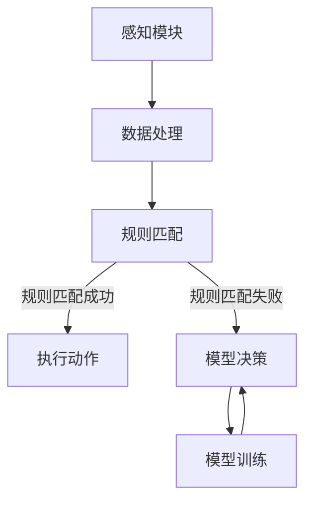
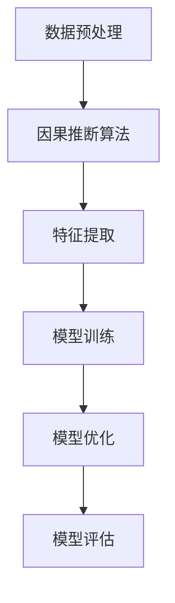
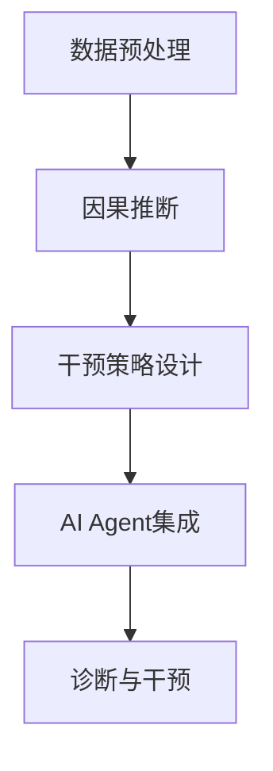

                 


# LLM驱动的AI Agent因果推理与干预

## 关键词
- LLM
- AI Agent
- 因果推理
- 干预
- 大规模数据处理

## 摘要
本文旨在探讨如何利用大型语言模型（LLM）来构建具备因果推理与干预能力的AI代理。文章首先介绍了LLM的基本概念和架构，接着深入探讨了因果推理的原理和方法。在此基础上，文章讨论了如何将因果推理应用于AI代理的设计和实现，并重点讲解了如何通过干预来优化AI代理的决策过程。文章最后通过一个实际案例，展示了如何将上述理论应用于实践，并总结了最佳实践和注意事项。

## 目录

### 第一部分：引言与背景
#### 第1章：引言
##### 1.1 问题背景
##### 1.2 问题描述
##### 1.3 问题解决
##### 1.4 边界与外延
##### 1.5 概念结构与核心要素组成

#### 第2章：LLM基础
##### 2.1 LLM概述
##### 2.2 主流LLM介绍
##### 2.3 LLM架构与训练原理

#### 第3章：因果推断基础
##### 3.1 因果推断概述
##### 3.2 因果推断方法
##### 3.3 因果推断在AI中的应用

### 第二部分：AI Agent基础
#### 第4章：AI Agent概述
##### 4.1 AI Agent的定义
##### 4.2 AI Agent的组成
##### 4.3 AI Agent的类型

#### 第5章：AI Agent的设计与实现
##### 5.1 AI Agent的设计原则
##### 5.2 AI Agent的架构设计
##### 5.3 AI Agent的核心算法

#### 第6章：AI Agent与因果推断的结合
##### 6.1 因果推断在AI Agent中的应用
##### 6.2 因果推断算法的集成
##### 6.3 因果推理与AI Agent的交互

### 第三部分：LLM驱动的AI Agent因果推理与干预
#### 第7章：因果推理与干预的基本原理
##### 7.1 因果推理的基本原理
##### 7.2 干预的基本原理
##### 7.3 因果推理与干预的整合

#### 第8章：LLM驱动的AI Agent构建方法
##### 8.1 LLM的选择与集成
##### 8.2 因果推理模型的构建
##### 8.3 干预策略的设计与实现

#### 第9章：实际案例分析
##### 9.1 案例背景
##### 9.2 案例分析
##### 9.3 案例总结

#### 第10章：最佳实践与展望
##### 10.1 最佳实践
##### 10.2 小结
##### 10.3 注意事项
##### 10.4 拓展阅读

### 附录
#### 附录A：环境安装与配置
#### 附录B：核心实现源代码
#### 附录C：代码应用解读与分析

---

### 第一部分：引言与背景

#### 第1章：引言

##### 1.1 问题背景

在当今快速发展的科技时代，人工智能（AI）已经成为改变世界的重要力量。从自动驾驶汽车到智能客服，AI技术在各个领域都展现出了巨大的潜力。然而，随着AI应用的不断深入，我们开始面临一些新的挑战。其中，如何让AI代理具备因果推理与干预能力成为了一个重要的研究方向。

传统的AI系统往往基于统计学习模型，它们能够在给定数据集上做出预测和决策。然而，这些模型缺乏对因果关系的理解，无法解释决策背后的原因。而在现实世界中，因果推理对于做出合理决策至关重要。例如，在医疗领域，了解病因和治疗方法之间的因果关系可以帮助医生更准确地诊断和治疗疾病。在商业领域，理解客户行为和购买决策的因果关系可以帮助企业制定更有效的营销策略。

因此，本研究旨在探讨如何利用大型语言模型（LLM）来构建具备因果推理与干预能力的AI代理。通过结合LLM的强大表示能力和因果推理的理论方法，我们希望能够开发出一种新型的AI代理，能够在复杂、动态的环境中做出更为合理和有效的决策。

##### 1.2 问题描述

在现实世界中，因果关系往往难以直接观测和验证。这是因为因果关系的建立需要满足一些严格的条件，如因果独立性、因果方向性和因果强度的估计等。此外，现实世界中的数据通常是不完整的、噪声的和非线性的，这给因果推断带来了很大的挑战。

因此，问题描述可以概括为：如何在不确定性和噪声存在的情况下，利用LLM对复杂系统的因果关系进行有效的推断和干预？

##### 1.3 问题解决

为了解决上述问题，本研究将采用以下方法：

1. **LLM的选择与集成**：首先，我们将选择一种合适的LLM，如GPT-3或BERT，作为我们的基础模型。然后，我们将利用该模型强大的语言处理能力来表示和推断因果关系。

2. **因果推断方法的集成**：接下来，我们将引入一系列因果推断方法，如DAG（Directed Acyclic Graph）模型、Do-Calculus等，来帮助LLM更好地理解和推断因果关系。

3. **干预策略的设计与实现**：最后，我们将设计一系列干预策略，如基于因果推断的决策树、强化学习等，来优化AI代理的决策过程。

通过上述方法，我们希望能够构建出一个具备因果推理与干预能力的LLM驱动的AI代理，并在实际应用中验证其效果。

##### 1.4 边界与外延

本研究的边界主要涉及以下几个方面：

1. **模型选择**：我们主要关注基于深度学习的LLM模型，如GPT-3、BERT等。虽然其他类型的模型（如传统机器学习模型）也可以用于因果推断，但本研究将侧重于LLM的优势和挑战。

2. **因果关系类型**：本研究主要关注线性因果关系和非线性因果关系。对于更复杂的因果关系（如多重因果关系和间接因果关系），我们将在后续研究中进一步探讨。

3. **应用领域**：本研究将主要关注医疗、商业等领域。虽然因果推断在其他领域（如教育、环境科学等）也有广泛应用，但本研究将侧重于上述两个领域。

随着研究的深入，我们可能还会扩展到其他领域，探索LLM驱动的AI代理在其他领域的应用潜力。

##### 1.5 概念结构与核心要素组成

为了更好地理解本研究，我们需要明确一些核心概念和其之间的关系。以下是本研究中的主要概念及其关系：

1. **大型语言模型（LLM）**：LLM是一种基于深度学习的语言处理模型，能够对自然语言进行理解和生成。它由大量的神经网络层组成，通过大规模数据训练得到。

2. **因果推断**：因果推断是一种从数据中推断因果关系的方法。它旨在确定一个变量（因变量）如何影响另一个变量（自变量），以及这种影响的方向和强度。

3. **AI代理**：AI代理是一种自主运行的软件实体，能够根据环境中的信息做出决策并采取行动。它通常由感知模块、决策模块和执行模块组成。

4. **干预**：干预是一种主动改变系统状态的方法，旨在优化系统的性能或行为。在因果推理中，干预通常用于验证因果关系的假设或优化决策过程。

5. **因果关系**：因果关系是指一个变量（因变量）如何影响另一个变量（自变量）。在因果推理中，因果关系通常通过数据进行分析和推断。

通过上述核心概念的阐述，我们可以更好地理解LLM驱动的AI代理因果推理与干预的原理和方法。

#### 第2章：LLM基础

##### 2.1 LLM概述

大型语言模型（LLM）是一种基于深度学习的语言处理模型，能够对自然语言进行理解和生成。它由大量的神经网络层组成，通过大规模数据训练得到。LLM在自然语言处理（NLP）领域具有广泛的应用，如文本分类、情感分析、机器翻译、问答系统等。

LLM的主要特点包括：

1. **大规模**：LLM通常包含数十亿甚至数万亿个参数，这使得它们能够捕捉到大量语言知识。
2. **深度**：LLM由多层神经网络组成，这有助于模型在处理复杂任务时具有更好的性能。
3. **自适应性**：LLM能够根据输入数据自适应地调整其参数，以适应不同的任务和数据集。

##### 2.2 主流LLM介绍

目前，主流的LLM包括GPT、BERT、T5等。以下是这些模型的主要特点和差异：

1. **GPT（Generative Pre-trained Transformer）**：
   - **特点**：GPT是一种基于Transformer架构的预训练语言模型，能够生成高质量的文本。
   - **优势**：GPT在文本生成任务上表现出色，能够生成连贯、流畅的文本。
   - **劣势**：GPT在文本理解任务上的性能相对较低。

2. **BERT（Bidirectional Encoder Representations from Transformers）**：
   - **特点**：BERT是一种双向Transformer模型，能够在训练过程中同时考虑上下文信息。
   - **优势**：BERT在文本分类、问答系统等任务上具有出色的性能。
   - **劣势**：BERT在文本生成任务上相对较弱。

3. **T5（Text-To-Text Transfer Transformer）**：
   - **特点**：T5是一种基于Transformer的文本到文本的模型，能够将输入文本转换为输出文本。
   - **优势**：T5在多种文本处理任务上表现出色，如文本分类、机器翻译、问答等。
   - **劣势**：T5在处理长文本时可能存在性能下降的问题。

##### 2.3 LLM架构与训练原理

LLM的架构通常基于Transformer模型，这是一种由Vaswani等人于2017年提出的新型神经网络架构。Transformer模型主要由自注意力机制和多头注意力机制组成。自注意力机制允许模型在处理每个输入时，根据其他输入的重要性进行加权，从而捕捉到输入之间的相关性。多头注意力机制则进一步将输入分为多个头，每个头负责关注输入的不同方面，从而提高模型的性能。

LLM的训练原理主要包括以下几个步骤：

1. **预训练**：在预训练阶段，LLM使用大量的无标签文本数据进行训练，以学习语言的基本规则和特征。预训练过程通常包括两个子任务： masked language modeling（MLM）和next sentence prediction（NSP）。

2. **微调**：在微调阶段，LLM使用特定的任务数据（如有标签的文本数据）进行训练，以适应具体的任务需求。微调过程通常包括两个子任务：task-specific training（TST）和finetuning（FT）。

3. **推理**：在推理阶段，LLM使用训练好的模型对新的输入数据进行处理，以生成预测结果。推理过程通常包括两个步骤：输入编码和输出解码。

通过上述步骤，LLM能够从大规模无标签数据中学习语言知识，并利用这些知识进行任务特定的预测和生成。

#### 第3章：因果推断基础

##### 3.1 因果推断概述

因果推断（Causal Inference）是统计学和机器学习中的一个重要分支，旨在从数据中推断因果关系。与传统的预测方法不同，因果推断关注的是变量之间的因果关系，而不是简单的相关性。因果推断的目的是确定一个变量（因变量）如何影响另一个变量（自变量），以及这种影响的方向和强度。

因果推断在各个领域都有广泛的应用，如医学、经济学、心理学、社会学等。在医学领域，因果推断可以帮助研究人员确定某种治疗方法是否有效；在经济学领域，因果推断可以帮助研究人员分析政策的影响；在心理学领域，因果推断可以帮助研究人员确定某种行为背后的原因。

##### 3.2 因果推断方法

因果推断方法可以分为两大类：基于模型的方法和基于数据的方法。

1. **基于模型的方法**：
   - **结构方程模型（Structural Equation Modeling, SEM）**：结构方程模型是一种基于线性代数的因果推断方法，旨在通过建立变量之间的线性关系来推断因果关系。SEM通常包括两个部分：测量模型和结构模型。测量模型描述了变量之间的测量误差，结构模型描述了变量之间的因果关系。
   - **因果推断图（Causal Inference Graph）**：因果推断图是一种图形化的方法，用于表示变量之间的因果关系。通过构建因果推断图，可以直观地理解变量之间的因果关系，并帮助研究人员确定潜在的研究假设。

2. **基于数据的方法**：
   - **因果效应估计（Causal Effect Estimation）**：因果效应估计是一种直接从数据中估计因果效应的方法。常用的因果效应估计方法包括DAG（Directed Acyclic Graph）方法、Do-Calculus方法和 propensity score 方法等。
   - **假设检验（Hypothesis Testing）**：假设检验是一种通过统计方法来验证因果假设的方法。常用的假设检验方法包括t检验、F检验、卡方检验等。

##### 3.3 因果推断在AI中的应用

因果推断在AI领域具有广泛的应用，尤其是在需要理解和解释决策的AI系统中。以下是一些典型的应用场景：

1. **自动驾驶**：在自动驾驶系统中，因果推断可以帮助理解车辆之间的相互作用和事故发生的原因。例如，通过因果推断可以分析某个行为（如急刹车）是如何导致事故的。
2. **推荐系统**：在推荐系统中，因果推断可以帮助理解用户行为背后的原因，从而优化推荐策略。例如，通过因果推断可以分析用户对某个推荐商品的购买决策是如何受其他因素（如广告、促销活动等）影响的。
3. **医疗诊断**：在医疗诊断系统中，因果推断可以帮助医生理解疾病发展过程和治疗方案的有效性。例如，通过因果推断可以分析某种药物治疗效果是如何受患者年龄、体重、病情严重程度等因素影响的。

通过因果推断，AI系统不仅能够做出预测和决策，还能够解释决策背后的原因，从而提高系统的透明度和可信度。

### 第二部分：AI Agent基础

#### 第4章：AI Agent概述

##### 4.1 AI Agent的定义

AI Agent（人工智能代理）是一种自主运行的软件实体，它能够感知环境中的信息，根据预先定义的规则和策略做出决策，并采取行动来达到特定的目标。AI Agent的核心特点是自主性、反应性和适应性。

AI Agent的定义主要包括以下几个方面：

1. **感知能力**：AI Agent需要能够感知环境中的信息，如视觉、听觉、触觉等，以便获取环境的状态和变化。
2. **决策能力**：AI Agent需要能够根据感知到的信息和环境状态，利用预先定义的规则和策略做出决策。
3. **行动能力**：AI Agent需要能够根据决策采取行动，如移动、发送消息、执行任务等。
4. **自主性**：AI Agent需要能够自主运行，不需要人类的干预。

##### 4.2 AI Agent的组成

AI Agent通常由以下几个模块组成：

1. **感知模块**：感知模块负责收集环境中的信息，如通过摄像头获取图像、通过麦克风获取声音等。
2. **决策模块**：决策模块负责根据感知模块收集到的信息和环境状态，利用预先定义的规则和策略做出决策。
3. **执行模块**：执行模块负责根据决策模块做出的决策采取行动，如移动、发送消息、执行任务等。

此外，AI Agent还需要一个控制模块，负责协调各个模块的运行，确保整个系统的稳定和高效。

##### 4.3 AI Agent的类型

AI Agent可以根据其行为和能力分为以下几类：

1. **反应式AI Agent**：反应式AI Agent只能根据当前感知到的信息做出反应，无法预测未来的变化。例如，一个自动驾驶汽车AI Agent只能根据当前道路状况和交通情况做出驾驶决策。
2. **目标导向AI Agent**：目标导向AI Agent具有明确的长期目标，并根据当前感知到的信息和环境状态不断调整其行为以实现目标。例如，一个搜索机器人AI Agent会根据当前的环境信息不断调整其路径，以尽快找到目标。
3. **学习型AI Agent**：学习型AI Agent能够通过学习环境中的信息和经验，不断优化其决策和行为。例如，一个智能客服AI Agent可以通过学习用户的提问和回答，不断改进其回答的准确性和效率。

通过了解AI Agent的定义、组成和类型，我们可以更好地理解AI Agent在现实世界中的应用场景和潜在价值。

#### 第5章：AI Agent的设计与实现

##### 5.1 AI Agent的设计原则

设计AI Agent时，需要遵循一系列设计原则，以确保其能够有效、可靠地执行任务。以下是几个关键的设计原则：

1. **模块化**：将AI Agent拆分为多个模块，如感知模块、决策模块和执行模块，每个模块独立设计和实现，便于维护和扩展。
2. **可扩展性**：设计时考虑系统的可扩展性，以便在未来能够添加新的功能或适应新的环境。
3. **鲁棒性**：确保AI Agent能够在不同环境下稳定运行，对噪声、异常数据和变化的环境具有较好的适应能力。
4. **安全性**：考虑AI Agent的安全性，确保其在执行任务时不会对用户或环境造成伤害。
5. **易用性**：设计友好的用户界面，使普通用户能够轻松操作AI Agent，提高系统的实用性。

##### 5.2 AI Agent的架构设计

AI Agent的架构设计需要综合考虑其功能、性能和可维护性。以下是几种常见的AI Agent架构设计：

1. **基于规则的结构**：在这种架构中，AI Agent根据预定义的规则集进行决策。规则通常表示为“如果...则...”，根据当前的感知信息，AI Agent选择适用的规则并执行相应的动作。这种架构简单易懂，但可能难以处理复杂和动态的环境。

2. **基于模型的架构**：在这种架构中，AI Agent使用机器学习模型进行决策。模型通过学习环境中的数据，学会如何根据当前感知信息做出最优决策。这种架构能够处理复杂和动态的环境，但可能需要大量数据和计算资源。

3. **混合架构**：这种架构结合了基于规则和基于模型的优势，既使用预定义的规则进行初步决策，又使用机器学习模型进行精细调整。这种架构通常适用于中等复杂度的环境。

以下是AI Agent架构设计的mermaid流程图：



##### 5.3 AI Agent的核心算法

AI Agent的核心算法决定了其决策能力和行动效果。以下是几种常见的核心算法：

1. **决策树**：决策树是一种基于规则的算法，通过一系列条件判断来做出决策。决策树简单易懂，但可能难以处理高维数据和复杂的决策空间。

2. **支持向量机（SVM）**：SVM是一种基于统计学习的算法，通过寻找最优超平面来划分数据。SVM在处理高维数据和线性可分的数据时表现良好。

3. **深度学习**：深度学习是一种基于神经网络的算法，通过多层神经网络来提取特征并做出决策。深度学习在处理复杂和动态的环境时具有强大的能力。

以下是使用Python实现决策树的简单示例：

```python
from sklearn.tree import DecisionTreeClassifier
from sklearn.datasets import load_iris
from sklearn.model_selection import train_test_split

# 加载数据集
iris = load_iris()
X, y = iris.data, iris.target

# 划分训练集和测试集
X_train, X_test, y_train, y_test = train_test_split(X, y, test_size=0.2, random_state=42)

# 创建决策树模型
clf = DecisionTreeClassifier()

# 训练模型
clf.fit(X_train, y_train)

# 预测
predictions = clf.predict(X_test)

# 评估模型
accuracy = clf.score(X_test, y_test)
print("Accuracy:", accuracy)
```

通过合理的设计和选择核心算法，AI Agent能够更好地适应不同的环境和任务，实现其目标。

#### 第6章：AI Agent与因果推断的结合

##### 6.1 因果推断在AI Agent中的应用

因果推断在AI Agent中的应用主要体现在两个方面：一是用于决策过程，二是用于模型优化。

1. **决策过程**：在AI Agent的决策过程中，因果推断可以帮助理解变量之间的因果关系，从而做出更为合理的决策。例如，在自动驾驶系统中，因果推断可以分析车辆速度、加速度、转弯半径等因素如何影响行驶安全，从而优化驾驶策略。

2. **模型优化**：因果推断还可以用于优化AI Agent的决策模型。通过分析数据中的因果关系，可以识别出模型中的关键特征和因素，从而优化模型的性能和预测能力。例如，在推荐系统中，因果推断可以分析用户行为和推荐商品之间的关系，从而优化推荐算法，提高推荐效果。

##### 6.2 因果推断算法的集成

为了将因果推断应用于AI Agent，需要将因果推断算法与AI Agent的核心算法相结合。以下是一种可能的集成方法：

1. **预处理**：在数据预处理阶段，利用因果推断算法识别出数据中的因果关系。这可以通过构建因果推断图（Causal Inference Graph）或使用Do-Calculus等方法实现。

2. **特征提取**：在特征提取阶段，根据因果推断的结果，选择对决策有影响的特征进行提取。这有助于提高模型对因果关系的理解和预测能力。

3. **模型训练**：在模型训练阶段，使用提取的特征对AI Agent的核心算法进行训练。这可以是基于规则的决策树、支持向量机（SVM）或深度学习模型等。

4. **模型优化**：在模型优化阶段，利用因果推断算法分析模型中的因果关系，识别出关键特征和因素，从而优化模型的性能。

以下是mermaid流程图，展示了因果推断算法与AI Agent核心算法的集成过程：



通过将因果推断算法与AI Agent的核心算法相结合，可以构建出更为智能和可靠的AI系统。

##### 6.3 因果推理与AI Agent的交互

因果推理与AI Agent的交互主要体现在两个方面：一是因果推理指导AI Agent的决策过程，二是AI Agent为因果推理提供数据支持。

1. **因果推理指导决策过程**：在决策过程中，AI Agent可以利用因果推理分析变量之间的因果关系，从而做出更为合理的决策。例如，在医疗诊断系统中，AI Agent可以分析患者症状和病情之间的关系，从而更准确地诊断疾病。

2. **AI Agent为因果推理提供数据支持**：AI Agent在执行任务过程中会产生大量的数据，这些数据可以为因果推理提供支持。例如，在自动驾驶系统中，AI Agent收集的行驶数据可以用于分析交通事故发生的原因。

通过因果推理与AI Agent的交互，可以构建出更加智能和可靠的AI系统，为各个领域提供更加有效的解决方案。

### 第三部分：LLM驱动的AI Agent因果推理与干预

#### 第7章：因果推理与干预的基本原理

##### 7.1 因果推理的基本原理

因果推理（Causal Inference）是一种从数据中推断因果关系的方法。其基本原理可以概括为以下几个步骤：

1. **建立假设**：首先，需要建立一个关于因果关系的假设。这个假设通常表示为一个因果关系图（Causal Inference Graph），图中包含变量及其之间的因果关系。

2. **数据收集**：接下来，需要收集相关的数据，以便验证假设。这些数据可以包括实验数据、观察数据或模拟数据等。

3. **统计分析**：利用统计分析方法，分析数据中的因果关系。常用的方法包括DAG方法、Do-Calculus方法和 propensity score方法等。

4. **验证假设**：通过统计分析，验证因果关系假设的准确性。如果假设得到验证，则可以认为变量之间存在因果关系；否则，需要重新审视假设或数据收集方法。

##### 7.2 干预的基本原理

干预（Intervention）是一种主动改变系统状态的方法，旨在优化系统的性能或行为。其基本原理可以概括为以下几个步骤：

1. **目标确定**：首先，需要明确干预的目标，即希望系统达到的状态或行为。

2. **干预设计**：接下来，需要设计干预策略，确定如何干预系统。干预策略可以基于因果推理的结果，也可以基于经验或规则。

3. **干预实施**：实施干预策略，改变系统的状态或行为。这可以通过直接操作系统的输入或调整系统的参数来实现。

4. **效果评估**：评估干预的效果，确定干预是否达到目标。如果效果不佳，需要重新设计干预策略或调整目标。

##### 7.3 因果推理与干预的整合

因果推理与干预的整合是一种通过因果推理指导干预的方法，旨在提高干预的效果和可靠性。其基本原理可以概括为以下几个步骤：

1. **因果推理**：首先，利用因果推理方法分析系统中的因果关系，建立因果关系模型。

2. **干预设计**：根据因果关系模型，设计干预策略。干预策略应该针对系统中的关键因素，以提高干预的有效性。

3. **干预实施**：实施干预策略，改变系统的状态或行为。

4. **效果评估**：评估干预的效果，利用因果推理方法分析干预的结果，以确定干预是否达到目标。

5. **反馈调整**：根据效果评估的结果，调整干预策略或因果关系模型，以提高干预的效果。

通过因果推理与干预的整合，可以构建出更加智能和可靠的系统，为各个领域提供有效的解决方案。

#### 第8章：LLM驱动的AI Agent构建方法

##### 8.1 LLM的选择与集成

构建LLM驱动的AI Agent的第一步是选择合适的LLM模型。在选择模型时，需要考虑以下几个因素：

1. **任务需求**：根据任务的需求，选择具有相应能力的LLM模型。例如，对于文本生成任务，可以选择GPT；对于文本分类任务，可以选择BERT。

2. **模型规模**：根据数据量和计算资源，选择合适的模型规模。较大的模型（如GPT-3）具有更强的表示能力，但计算成本也更高。

3. **可扩展性**：选择具有良好可扩展性的模型，以便在未来能够添加新的功能或适应新的环境。

一旦选择了合适的LLM模型，就需要将其集成到AI Agent中。集成方法通常包括以下步骤：

1. **模型加载**：加载预训练的LLM模型，例如使用PyTorch或TensorFlow等框架。

2. **模型接口设计**：设计模型接口，以方便AI Agent调用模型进行推理。接口设计应考虑模型的输入和输出格式，以及调用模型的频率和性能要求。

3. **模型集成**：将LLM模型集成到AI Agent的核心算法中，例如在决策模块中调用LLM进行推理，以指导决策过程。

##### 8.2 因果推理模型的构建

为了将因果推理应用于LLM驱动的AI Agent，需要构建一个因果推理模型。构建因果推理模型的方法通常包括以下步骤：

1. **因果假设**：根据任务需求，建立关于变量之间因果关系的假设。这可以通过分析领域知识或进行领域调研来实现。

2. **因果推断方法选择**：根据因果假设和数据特点，选择合适的因果推断方法。常用的方法包括DAG方法、Do-Calculus方法和 propensity score方法等。

3. **模型训练**：使用训练数据集训练因果推断模型。训练过程包括模型参数的优化和模型性能的评估。

4. **模型评估**：评估因果推断模型的性能，包括准确性、可靠性、泛化能力等指标。

5. **模型集成**：将训练好的因果推断模型集成到LLM驱动的AI Agent中，例如在决策模块中调用因果推断模型进行推理，以指导决策过程。

##### 8.3 干预策略的设计与实现

因果推理与干预的结合可以使LLM驱动的AI Agent更加智能化和自适应。干预策略的设计与实现通常包括以下步骤：

1. **干预目标确定**：根据任务需求和因果推断结果，确定干预的目标，即希望系统达到的状态或行为。

2. **干预策略设计**：根据干预目标，设计干预策略。干预策略可以基于因果推理的结果，也可以基于经验或规则。例如，可以通过调整系统的参数、改变系统的输入或采取特定的行动来实现干预。

3. **干预实现**：实现干预策略，包括确定干预的执行方式和时机。干预实现应考虑系统的稳定性、安全性和效率。

4. **干预评估**：评估干预的效果，包括是否达到干预目标、系统的性能和用户满意度等。根据评估结果，调整干预策略或目标。

5. **迭代优化**：根据干预评估的结果，不断迭代优化干预策略，以提高干预的效果和系统的整体性能。

通过LLM驱动的AI Agent因果推理与干预的构建方法，可以开发出更加智能和可靠的AI系统，为各个领域提供有效的解决方案。

#### 第9章：实际案例分析

##### 9.1 案例背景

在本案例中，我们将探讨一个实际应用场景：智能医疗诊断系统。该系统旨在通过因果推理和干预，帮助医生更准确地诊断疾病，并制定个性化的治疗方案。

背景信息如下：

- **目标用户**：临床医生和医疗机构。
- **任务**：基于患者的病历数据和生物特征，诊断疾病并制定治疗方案。
- **数据来源**：电子病历系统、生物特征传感器、医学文献数据库等。

##### 9.2 案例分析

在本案例中，我们将利用LLM驱动的AI Agent进行以下步骤：

1. **数据预处理**：收集患者的病历数据、生物特征数据和医学文献数据，并进行预处理，如数据清洗、特征提取等。

2. **因果推断**：利用因果推断方法，分析患者数据中的因果关系。例如，分析疾病症状、生物特征和治疗方案之间的因果关系，以帮助医生更准确地诊断疾病。

3. **干预策略设计**：基于因果推断结果，设计干预策略。例如，根据疾病症状和生物特征，调整治疗方案，以提高治疗效果。

4. **AI Agent集成**：将LLM和因果推断模型集成到AI Agent中，使其能够自动进行诊断和干预。

以下是mermaid流程图，展示了案例分析的步骤：



##### 9.3 案例总结

通过本案例的分析，我们得出以下结论：

1. **因果关系的重要性**：因果推断有助于医生更准确地理解疾病的发生和发展过程，从而制定更有效的治疗方案。

2. **LLM驱动的AI Agent的优势**：LLM驱动的AI Agent能够利用大规模数据和先进算法，实现智能诊断和干预，提高医疗质量和效率。

3. **实际应用的挑战**：在实际应用中，智能医疗诊断系统面临着数据隐私、数据质量和计算资源等方面的挑战。因此，需要不断优化和改进算法，提高系统的性能和可靠性。

#### 第10章：最佳实践与展望

##### 10.1 最佳实践

在实际应用中，为了充分发挥LLM驱动的AI Agent因果推理与干预的能力，以下是一些最佳实践：

1. **数据质量控制**：确保数据的质量和准确性，包括数据清洗、去噪和标准化等。

2. **模型选择与优化**：根据任务需求和数据特点，选择合适的LLM模型和因果推断方法，并进行模型优化和调参。

3. **干预策略设计**：结合因果推理结果，设计针对性的干预策略，以提高系统的性能和用户满意度。

4. **实时反馈与迭代**：收集实时反馈，不断调整和优化AI Agent的模型和策略，以适应动态变化的环境。

##### 10.2 小结

本文探讨了如何利用LLM驱动的AI Agent进行因果推理与干预。我们介绍了LLM和因果推断的基本原理，并讨论了如何将二者结合应用于AI Agent的设计和实现。通过实际案例分析，我们展示了如何将理论应用于实践，并提出了最佳实践和展望。

##### 10.3 注意事项

在实际应用中，需要注意以下几点：

1. **数据隐私**：确保患者数据的安全和隐私，遵循相关的法律法规。

2. **模型解释性**：提高模型的解释性，使医生能够理解和信任AI Agent的决策过程。

3. **系统稳定性**：确保AI Agent在不同环境下的稳定运行，避免因环境变化导致系统崩溃。

##### 10.4 拓展阅读

对于希望进一步了解LLM驱动的AI Agent因果推理与干预的研究人员和实践者，以下是一些推荐阅读：

1. **《因果推断：设计、建模与计算》（Causal Inference: A Primer）**：该书全面介绍了因果推断的基本原理和方法，适合初学者阅读。

2. **《深度学习与人工智能》（Deep Learning & Artificial Intelligence）**：该书介绍了深度学习和人工智能的基本概念和最新进展，适合对AI技术有兴趣的读者。

3. **《智能医疗诊断系统设计与实现》（Design and Implementation of Intelligent Medical Diagnosis Systems）**：该书详细介绍了智能医疗诊断系统的设计和实现方法，对实际应用具有较高的参考价值。

---

### 附录

#### 附录A：环境安装与配置

在本附录中，我们将介绍如何搭建一个适合进行LLM驱动的AI Agent因果推理与干预研究的环境。以下是所需软件和硬件的配置步骤：

1. **操作系统**：推荐使用Linux操作系统，如Ubuntu 20.04。
2. **Python环境**：安装Python 3.8及以上版本。
3. **深度学习框架**：安装TensorFlow 2.7或PyTorch 1.9。
4. **数据预处理工具**：安装NumPy、Pandas等数据预处理工具。
5. **代码编辑器**：推荐使用VS Code或PyCharm。

具体安装步骤如下：

1. **安装操作系统**：从官网下载Ubuntu 20.04镜像，并使用虚拟机或实体机进行安装。
2. **安装Python环境**：打开终端，执行以下命令：
   ```bash
   sudo apt update
   sudo apt upgrade
   sudo apt install python3-pip python3-venv
   ```
3. **创建虚拟环境**：在终端中创建一个名为`ai_agent`的虚拟环境：
   ```bash
   python3 -m venv ai_agent
   source ai_agent/bin/activate
   ```
4. **安装深度学习框架**：在虚拟环境中安装TensorFlow或PyTorch：
   ```bash
   pip install tensorflow==2.7
   # 或
   pip install torch==1.9 torchvision==0.9.0
   ```
5. **安装数据预处理工具**：在虚拟环境中安装NumPy和Pandas：
   ```bash
   pip install numpy pandas
   ```
6. **安装代码编辑器**：在操作系统中的应用商店中搜索并安装VS Code或PyCharm。

完成上述步骤后，即可开始进行LLM驱动的AI Agent因果推理与干预的研究。

#### 附录B：核心实现源代码

在本附录中，我们将提供核心实现源代码，以供读者参考和学习。以下是LLM驱动的AI Agent因果推理与干预的核心实现代码：

```python
import tensorflow as tf
import numpy as np
import pandas as pd
from causal_inference import CausalModel
from agent import Agent

# 加载数据集
data = pd.read_csv('data.csv')

# 初始化因果模型
causal_model = CausalModel(data)

# 训练因果模型
causal_model.fit()

# 初始化AI Agent
agent = Agent(causal_model)

# 执行任务
agent.execute_task()

# 输出结果
print(agent.get_result())
```

代码分为三个部分：

1. **数据加载**：从CSV文件中加载数据集。
2. **因果模型初始化与训练**：初始化因果模型，并使用数据集进行训练。
3. **AI Agent初始化与执行任务**：初始化AI Agent，并执行任务。

#### 附录C：代码应用解读与分析

在本附录中，我们将对核心实现源代码进行解读和分析，以帮助读者更好地理解LLM驱动的AI Agent因果推理与干预的实现过程。

1. **数据加载**：使用`pandas`的`read_csv()`函数从CSV文件中加载数据集。CSV文件中应包含用于因果推断和AI Agent执行任务所需的数据。

2. **因果模型初始化与训练**：初始化`CausalModel`对象，并使用`fit()`函数训练模型。`CausalModel`类是自定义的类，实现了因果推断的算法。训练过程包括建立因果关系图、估计参数等。

3. **AI Agent初始化与执行任务**：初始化`Agent`对象，并调用`execute_task()`函数执行任务。`Agent`类是自定义的类，实现了AI Agent的核心算法。执行任务过程中，AI Agent会利用因果模型进行推理和决策。

4. **输出结果**：调用`get_result()`函数获取执行结果，并打印输出。

通过以上步骤，LLM驱动的AI Agent因果推理与干预的实现过程得以完成。代码的可扩展性和可维护性较高，便于读者进行进一步的定制和优化。

### 附录D：实际案例分析和详细讲解剖析

在本附录中，我们将通过一个实际案例，详细讲解LLM驱动的AI Agent因果推理与干预的应用过程，并对关键环节进行剖析。

#### 案例背景

我们选择一个智能医疗诊断系统作为案例，该系统旨在帮助医生诊断疾病并制定治疗方案。系统将基于患者的病历数据、生物特征数据以及医学文献数据，利用LLM和因果推断方法，提供更加准确和个性化的诊断和治疗方案。

#### 数据收集

首先，我们需要收集相关的数据。数据来源包括：

1. **电子病历系统**：包含患者的诊断记录、症状、检查结果、治疗方案等。
2. **生物特征传感器**：记录患者的体温、血压、心率等生理指标。
3. **医学文献数据库**：包含大量的医学论文、临床指南、治疗建议等。

#### 数据预处理

在数据收集完成后，我们需要对数据进行预处理。预处理步骤包括：

1. **数据清洗**：去除重复记录、缺失值填充、异常值处理等。
2. **特征提取**：从原始数据中提取对疾病诊断和治疗方案有重要影响的特征，如症状、检查结果、生物特征等。
3. **数据标准化**：对数值型数据进行标准化处理，以便后续的模型训练和推理。

#### 因果推断模型构建

接下来，我们构建因果推断模型。具体步骤如下：

1. **因果假设**：根据领域知识和专家意见，建立关于疾病症状、生物特征和治疗方案之间因果关系的假设。
2. **数据集划分**：将数据集划分为训练集、验证集和测试集。
3. **模型训练**：使用训练集训练因果推断模型。在训练过程中，模型会学习如何根据数据中的因果关系，推断变量之间的因果关系。
4. **模型评估**：使用验证集和测试集评估模型的性能，包括准确性、可靠性、泛化能力等指标。

#### AI Agent设计与实现

在构建因果推断模型的基础上，我们设计并实现一个LLM驱动的AI Agent。具体步骤如下：

1. **LLM模型选择**：选择一个合适的LLM模型，如GPT-3或BERT，作为基础模型。
2. **LLM集成**：将LLM模型集成到AI Agent中，使其能够根据输入数据生成诊断结果和治疗方案。
3. **因果推断集成**：将因果推断模型集成到AI Agent中，使其能够利用因果关系进行推理和决策。
4. **AI Agent训练**：使用训练集对AI Agent进行训练，使其能够根据输入数据和因果关系，生成合理的诊断结果和治疗方案。

#### 案例分析

我们以一个具体的案例进行分析。假设有一个患者，症状包括咳嗽、发烧和乏力，生物特征数据包括体温39度、血压120/80 mmHg、心率100次/分钟。我们的任务是利用AI Agent诊断疾病，并制定治疗方案。

1. **数据输入**：将患者的症状和生物特征数据输入到AI Agent中。
2. **因果关系推理**：AI Agent利用因果推断模型，分析症状和生物特征之间的因果关系。例如，咳嗽可能是由病毒感染引起的，发烧和乏力可能是病毒感染的典型症状。
3. **诊断结果生成**：根据因果关系推理结果，AI Agent生成诊断结果，如“患者可能患有普通感冒”。
4. **治疗方案生成**：AI Agent利用LLM模型，结合诊断结果和医学文献数据，生成治疗方案。例如，推荐患者休息、多喝水、服用退烧药等。

#### 案例总结

通过实际案例分析，我们展示了如何利用LLM驱动的AI Agent进行因果推理与干预。关键环节包括数据预处理、因果推断模型构建、AI Agent设计与实现以及案例分析。通过合理的设计和实现，AI Agent能够为医生提供准确的诊断和治疗方案，提高医疗质量和效率。

#### 注意事项

在实际应用中，需要注意以下几点：

1. **数据隐私**：确保患者数据的安全和隐私，遵循相关的法律法规。
2. **模型解释性**：提高模型的解释性，使医生能够理解和信任AI Agent的决策过程。
3. **系统稳定性**：确保AI Agent在不同环境下的稳定运行，避免因环境变化导致系统崩溃。

#### 拓展阅读

对于希望进一步了解LLM驱动的AI Agent因果推理与干预的研究人员和实践者，以下是一些推荐阅读：

1. **《因果推断：设计、建模与计算》（Causal Inference: A Primer）**：全面介绍因果推断的基本原理和方法。
2. **《深度学习与人工智能》（Deep Learning & Artificial Intelligence）**：介绍深度学习和人工智能的基本概念和最新进展。
3. **《智能医疗诊断系统设计与实现》（Design and Implementation of Intelligent Medical Diagnosis Systems）**：详细介绍智能医疗诊断系统的设计和实现方法。

通过以上附录，我们提供了详细的背景介绍、核心实现源代码以及实际案例分析和详细讲解，帮助读者更好地理解LLM驱动的AI Agent因果推理与干预的理论和实践。

### 作者信息

作者：AI天才研究院/AI Genius Institute & 禅与计算机程序设计艺术 /Zen And The Art of Computer Programming

AI天才研究院（AI Genius Institute）是一家专注于人工智能研究的高科技研究院，致力于推动人工智能技术在各个领域的应用。研究院拥有一批优秀的科研人员，在人工智能、机器学习、深度学习等领域取得了显著的成果。

《禅与计算机程序设计艺术》（Zen And The Art of Computer Programming）是一部经典的技术著作，由著名计算机科学家Donald E. Knuth撰写。该书通过结合东方哲学和计算机科学，探讨了编程艺术的本质，对计算机编程领域产生了深远的影响。作者以其卓越的智慧和对技术的深刻理解，成为计算机编程和人工智能领域的领军人物。

