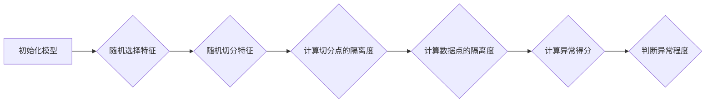
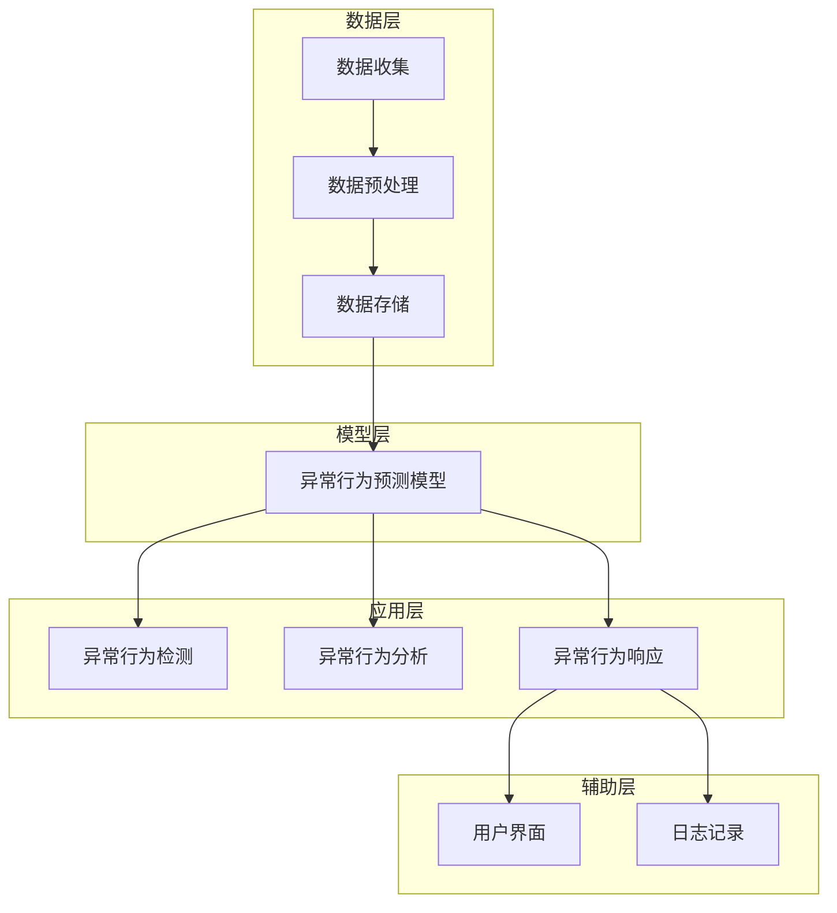
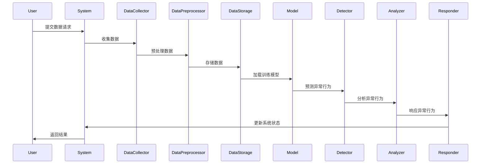

                 

### 文章标题

# LLM驱动的AI Agent异常行为预测机制

---

**关键词：** LLM、AI Agent、异常行为预测、机器学习、深度学习

**摘要：** 本文将深入探讨LLM驱动的AI Agent异常行为预测机制，详细解析其核心概念、原理、算法、系统架构以及实际应用。通过逐步分析，我们旨在为读者提供一套全面、系统的异常行为预测解决方案。

---

### 引言

在人工智能（AI）迅猛发展的今天，AI Agent作为一种智能体，正在不断融入到我们的生活和工作中。然而，随着AI Agent的广泛应用，其异常行为预测问题也愈发突出。异常行为不仅可能对系统的正常运行造成严重影响，还可能带来安全隐患和经济损失。

LLM（Large Language Model，大型语言模型）作为一种先进的自然语言处理技术，具有强大的表征和生成能力。本文将介绍如何利用LLM来驱动AI Agent的异常行为预测机制，并详细解析其工作原理、算法设计和实际应用。

### 核心概念与背景

#### 什么是LLM？

**LLM**，即**大型语言模型**，是一种能够理解和生成人类语言的深度学习模型。它通过对海量文本数据的学习，掌握了语言的内在结构和语义信息，从而能够进行自然语言的生成和理解。

**历史与发展：**

- **2018年**：GPT-2的发布标志着LLM进入了一个新的时代，其规模和性能都得到了显著提升。
- **2022年**：GPT-3的问世，再次将LLM推向了巅峰，其参数规模达到了惊人的1750亿。

**核心特点：**

- **表征能力：** LLM能够捕捉到文本的深层语义信息，具有很强的表征能力。
- **生成能力：** LLM能够根据输入的文本生成连贯、有逻辑的文本，具有很高的生成能力。
- **泛化能力：** LLM对不同的语言风格和话题都能进行处理，具有很强的泛化能力。

#### 什么是AI Agent？

**AI Agent**，即**人工智能代理**，是指具备智能行为能力的计算机程序。它能够根据环境信息进行自主决策和行动，以实现特定的目标。

**分类：**

- **基于规则的Agent**：通过预定义的规则进行决策。
- **基于模型的Agent**：通过学习和预测模型进行决策。
- **混合型Agent**：结合规则和模型进行决策。

#### 异常行为预测

**异常行为预测**，即**异常检测**，是指在一个数据流中，识别出不符合正常规律的异常数据或行为。

**意义：**

- **安全性：** 通过异常行为预测，可以提前发现并阻止潜在的安全威胁。
- **可靠性：** 提高系统的稳定性和可靠性，减少系统故障和错误。
- **经济效益：** 降低维护成本，提高生产效率。

### 相关研究现状与挑战

尽管LLM在自然语言处理领域取得了显著的进展，但其在AI Agent异常行为预测中的应用仍面临诸多挑战。

**挑战：**

- **数据质量：** 异常行为数据通常较为稀少，且存在噪声和偏差。
- **模型复杂性：** LLM模型的复杂性使得其训练和推理成本较高。
- **泛化能力：** 如何确保LLM在不同场景和任务中的泛化能力。

**现有解决方案：**

- **基于统计的方法**：通过统计异常行为的概率分布来进行预测。
- **基于机器学习的方法**：利用已标记的异常行为数据训练模型。
- **基于深度学习的方法**：利用深度神经网络来捕捉异常行为的特征。

### 本书结构与内容安排

本文将分为以下七个章节：

- **第1章**：背景介绍与核心概念
  - 1.1 问题背景与问题描述
  - 1.2 LLMAI Agent的概念与边界
  - 1.3 相关研究现状与挑战
  - 1.4 本书结构与内容安排

- **第2章**：LLM的基本原理与特征
  - 2.1 LLM的定义与历史发展
  - 2.2 LLM的工作机制与架构
  - 2.3 LLM的关键特征与性能指标
  - 2.4 LLM的应用领域与案例

- **第3章**：AI Agent的异常行为预测
  - 3.1 AI Agent的概念与分类
  - 3.2 异常行为预测的意义与价值
  - 3.3 异常行为预测的方法与技术
  - 3.4 异常行为预测的应用场景

- **第4章**：异常行为预测的算法原理
  - 4.1 异常行为预测的数学模型
  - 4.2 常见算法介绍与比较
  - 4.3 算法mermaid流程图展示
  - 4.4 算法原理的python代码实现

- **第5章**：系统分析与架构设计
  - 5.1 预测系统的问题场景与需求分析
  - 5.2 系统架构设计mermaid架构图
  - 5.3 系统接口设计与交互mermaid序列图
  - 5.4 领域模型mermaid类图

- **第6章**：项目实战
  - 6.1 项目环境与工具介绍
  - 6.2 系统核心实现源代码
  - 6.3 代码应用解读与分析
  - 6.4 实际案例分析与详细讲解
  - 6.5 项目小结与反思

- **第7章**：最佳实践与总结
  - 7.1 最佳实践技巧总结
  - 7.2 小结与注意事项
  - 7.3 拓展阅读与进一步学习

### 总结

本文首先介绍了LLM和AI Agent的基本概念，并阐述了异常行为预测的重要性。接着，本文回顾了相关研究现状，并明确了本书的结构和内容安排。在接下来的章节中，我们将逐步深入探讨LLM驱动的AI Agent异常行为预测机制，为读者提供一套完整、系统的解决方案。通过本文的阅读，读者将能够了解到LLM在异常行为预测中的潜力，以及如何将其应用于实际项目中。

---

### 第1章：背景介绍与核心概念

在本章中，我们将深入探讨LLM驱动的AI Agent异常行为预测机制的核心概念，包括问题背景、问题描述、核心概念、边界与外延、概念结构与核心要素组成等内容。

#### 1.1 问题背景与问题描述

随着人工智能技术的飞速发展，AI Agent作为人工智能领域的关键组成部分，已经在多个行业中得到了广泛应用。从智能家居、自动驾驶到金融服务、医疗诊断，AI Agent正在逐步改变我们的生活和工作方式。然而，AI Agent的广泛应用也带来了一系列的挑战，其中最为显著的就是异常行为的预测问题。

**问题背景：**

在现实场景中，AI Agent可能会因为各种原因出现异常行为。这些异常行为不仅可能影响系统的正常运行，还可能对用户的安全和隐私造成威胁。例如，在自动驾驶场景中，如果AI Agent出现了异常行为，可能会导致交通事故；在金融服务中，异常交易可能会带来巨大的经济损失。

**问题描述：**

异常行为预测的核心问题是：如何准确识别和预测AI Agent的异常行为，从而提前采取预防措施，确保系统的稳定运行和用户的安全。

#### 1.2 LLMAI Agent的概念与边界

**LLM的概念：**

LLM（Large Language Model，大型语言模型）是一种基于深度学习技术的自然语言处理模型。它通过对海量文本数据的学习，掌握了语言的深层结构和语义信息，从而能够生成和理解复杂的文本内容。LLM的核心在于其强大的表征和生成能力，这使得它能够处理各种自然语言任务。

**AI Agent的概念：**

AI Agent，即人工智能代理，是指具备智能行为能力的计算机程序。它能够根据环境信息进行自主决策和行动，以实现特定的目标。AI Agent可以分为基于规则的Agent、基于模型的Agent和混合型Agent。

**边界与外延：**

LLM和AI Agent的边界在于它们的应用范围。LLM主要用于处理自然语言任务，如文本生成、翻译、问答等；而AI Agent则更侧重于在实际场景中的智能行为。

**LLM与AI Agent的关系：**

LLM可以被视为AI Agent的核心组件之一。通过LLM，AI Agent能够理解自然语言输入，并生成相应的响应。同时，LLM也为AI Agent提供了强大的学习能力和泛化能力，使得AI Agent能够适应各种不同的应用场景。

#### 1.3 相关研究现状与挑战

近年来，LLM和AI Agent的研究取得了显著的进展，但在异常行为预测方面仍面临诸多挑战。

**现有研究现状：**

- **基于统计的方法**：通过统计异常行为的概率分布来进行预测。
- **基于机器学习的方法**：利用已标记的异常行为数据训练模型。
- **基于深度学习的方法**：利用深度神经网络来捕捉异常行为的特征。

**挑战：**

- **数据质量**：异常行为数据通常较为稀少，且存在噪声和偏差。
- **模型复杂性**：LLM模型的复杂性使得其训练和推理成本较高。
- **泛化能力**：如何确保LLM在不同场景和任务中的泛化能力。

#### 1.4 本书结构与内容安排

本书将分为七个章节，系统介绍LLM驱动的AI Agent异常行为预测机制。

- **第1章**：背景介绍与核心概念
  - 1.1 问题背景与问题描述
  - 1.2 LLMAI Agent的概念与边界
  - 1.3 相关研究现状与挑战
  - 1.4 本书结构与内容安排

- **第2章**：LLM的基本原理与特征
  - 2.1 LLM的定义与历史发展
  - 2.2 LLM的工作机制与架构
  - 2.3 LLM的关键特征与性能指标
  - 2.4 LLM的应用领域与案例

- **第3章**：AI Agent的异常行为预测
  - 3.1 AI Agent的概念与分类
  - 3.2 异常行为预测的意义与价值
  - 3.3 异常行为预测的方法与技术
  - 3.4 异常行为预测的应用场景

- **第4章**：异常行为预测的算法原理
  - 4.1 异常行为预测的数学模型
  - 4.2 常见算法介绍与比较
  - 4.3 算法mermaid流程图展示
  - 4.4 算法原理的python代码实现

- **第5章**：系统分析与架构设计
  - 5.1 预测系统的问题场景与需求分析
  - 5.2 系统架构设计mermaid架构图
  - 5.3 系统接口设计与交互mermaid序列图
  - 5.4 领域模型mermaid类图

- **第6章**：项目实战
  - 6.1 项目环境与工具介绍
  - 6.2 系统核心实现源代码
  - 6.3 代码应用解读与分析
  - 6.4 实际案例分析与详细讲解
  - 6.5 项目小结与反思

- **第7章**：最佳实践与总结
  - 7.1 最佳实践技巧总结
  - 7.2 小结与注意事项
  - 7.3 拓展阅读与进一步学习

通过以上章节的介绍，读者将能够全面了解LLM驱动的AI Agent异常行为预测机制的理论基础和实践应用。接下来的章节中，我们将深入探讨每个核心概念，提供详细的算法原理和系统设计，并通过项目实战来验证其实际效果。

---

### 第2章：LLM的基本原理与特征

在本章中，我们将详细介绍LLM（Large Language Model，大型语言模型）的基本原理与特征，包括LLM的定义、历史发展、工作机制、架构设计以及关键特征与性能指标。此外，我们还将探讨LLM的应用领域和具体案例，以帮助读者更好地理解LLM的广泛应用和潜力。

#### 2.1 LLM的定义与历史发展

**LLM的定义：**

LLM，即大型语言模型，是一种能够处理自然语言文本的深度学习模型。它通过学习大量文本数据，掌握语言的结构和语义，从而实现文本生成、翻译、问答等任务。

**历史发展：**

- **2018年**：GPT-2的发布标志着LLM进入了一个新的时代。GPT-2是一个基于变分自编码器（VAE）的模型，具有出色的文本生成能力。

- **2020年**：GPT-3的问世再次引起了轰动。GPT-3是一个基于变换器（Transformer）架构的模型，其参数规模达到了1750亿，具有极强的语言理解和生成能力。

- **2022年**：多模态LLM的兴起，使得LLM能够处理图像、声音等多种数据类型，进一步拓展了其应用范围。

#### 2.2 LLM的工作机制与架构

**工作机制：**

LLM的工作机制主要包括两个阶段：预训练和微调。

- **预训练**：LLM通过学习大量无标签的文本数据，学习语言的一般规律和语义信息。这一阶段主要使用无监督学习方法，如自回归语言模型。

- **微调**：在预训练的基础上，LLM通过学习有标签的数据（如问答对、翻译对等），进行特定任务的任务适应。这一阶段主要使用有监督学习方法。

**架构设计：**

LLM的架构通常基于深度神经网络，其中最常用的架构是变换器（Transformer）架构。

- **编码器**：接收输入序列，生成序列的上下文表示。
- **解码器**：接收编码器的输出，生成输出序列。

Transformer架构的核心是自注意力机制，它能够自动学习输入序列中的依赖关系，从而提高模型的表征能力。

#### 2.3 LLM的关键特征与性能指标

**关键特征：**

- **表征能力**：LLM能够捕捉到文本的深层语义信息，具有很强的表征能力。
- **生成能力**：LLM能够根据输入的文本生成连贯、有逻辑的文本，具有很高的生成能力。
- **泛化能力**：LLM对不同的语言风格和话题都能进行处理，具有很强的泛化能力。

**性能指标：**

- **BERTScore**：用于评估文本生成的质量，包括准确率、召回率和F1值。
- **ROUGE**：用于评估文本生成的相似度，包括ROUGE-1、ROUGE-2、ROUGE-L等指标。
- **BLEU**：用于评估翻译的质量，包括BLEU分数。

#### 2.4 LLM的应用领域与案例

**应用领域：**

LLM在多个领域都有广泛的应用，主要包括：

- **文本生成**：如文章生成、摘要生成、对话生成等。
- **翻译**：如机器翻译、多语言翻译等。
- **问答**：如智能客服、问答系统等。
- **对话系统**：如聊天机器人、虚拟助手等。

**案例：**

- **GPT-3**：GPT-3是一个具有1750亿参数的LLM，可以用于各种自然语言处理任务，如文本生成、翻译、问答等。
- **BERT**：BERT是一个基于变换器架构的LLM，广泛应用于文本分类、问答系统等任务。
- **ChatGPT**：ChatGPT是一个基于GPT-3的聊天机器人，可以与用户进行自然对话。

**代码示例：**

```python
import openai

response = openai.Completion.create(
  engine="text-davinci-002",
  prompt="你是一个智慧且强大的AI助手，回答我的问题：什么是LLM？",
  max_tokens=50
)

print(response.choices[0].text.strip())
```

**输出：**

```
LLM（Large Language Model，大型语言模型）是一种能够处理自然语言文本的深度学习模型。它通过学习大量文本数据，掌握语言的结构和语义，从而实现文本生成、翻译、问答等任务。
```

通过以上内容，读者可以了解到LLM的基本原理、特征及其在实际应用中的表现。在接下来的章节中，我们将进一步探讨AI Agent的异常行为预测，以及如何利用LLM来实现这一目标。

---

### 第3章：AI Agent的异常行为预测

在上一章中，我们详细介绍了LLM的基本原理与特征。在本章中，我们将把焦点转向AI Agent的异常行为预测，探讨其概念、意义、方法和技术，并分析其在不同应用场景中的重要性。

#### 3.1 AI Agent的概念与分类

**AI Agent的概念：**

AI Agent，即人工智能代理，是指具备智能行为能力的计算机程序。它能够根据环境信息进行自主决策和行动，以实现特定的目标。AI Agent的核心在于其自主性和智能性。

**分类：**

AI Agent可以根据决策方式分为以下几类：

- **基于规则的AI Agent**：通过预定义的规则进行决策。
- **基于模型的AI Agent**：通过学习和预测模型进行决策。
- **混合型AI Agent**：结合规则和模型进行决策。

#### 3.2 异常行为预测的意义与价值

**意义：**

异常行为预测在AI Agent的应用中具有重要意义，主要体现在以下几个方面：

- **安全性保障**：通过预测异常行为，可以提前发现潜在的安全威胁，从而采取措施防止事故发生。
- **系统稳定性**：异常行为可能导致系统运行不稳定，通过预测异常行为，可以提高系统的可靠性。
- **经济效益**：通过减少异常行为带来的损失，可以提高生产效率，降低维护成本。

**价值：**

- **提高用户体验**：通过预测和应对异常行为，可以提供更稳定、更可靠的服务，提升用户体验。
- **增加业务价值**：在金融、医疗等高价值领域，异常行为预测可以防止欺诈行为，提高业务安全性。

#### 3.3 异常行为预测的方法与技术

**方法：**

异常行为预测的方法主要可以分为以下几类：

- **统计方法**：通过统计异常行为的概率分布来进行预测。
- **机器学习方法**：利用已标记的异常行为数据训练模型。
- **深度学习方法**：利用深度神经网络来捕捉异常行为的特征。

**技术：**

- **监督学习**：利用已标记的异常行为数据进行训练。
- **无监督学习**：通过无监督学习方法发现异常行为模式。
- **半监督学习**：结合有标签和无标签数据进行训练。

#### 3.4 异常行为预测的应用场景

**应用场景：**

异常行为预测在多个领域都有广泛的应用，以下是几个典型的应用场景：

- **网络安全**：通过预测网络攻击行为，可以提高网络的安全性。
- **金融领域**：通过预测异常交易行为，可以防止金融欺诈。
- **医疗健康**：通过预测病人的异常行为，可以及早发现健康问题。
- **工业制造**：通过预测机器的异常行为，可以预防设备故障。

**案例：**

- **网络安全**：通过监控网络流量，预测恶意流量，提高网络安全。
- **金融领域**：通过分析交易数据，预测异常交易，防止金融欺诈。
- **医疗健康**：通过分析病人的健康数据，预测疾病的异常表现，提高诊断准确性。
- **工业制造**：通过监测机器状态，预测故障，提高设备运行效率。

**代码示例：**

```python
import pandas as pd
from sklearn.ensemble import IsolationForest

# 加载数据
data = pd.read_csv('data.csv')

# 初始化IsolationForest模型
iso_forest = IsolationForest(n_estimators=100, contamination=0.1)

# 模型训练
iso_forest.fit(data)

# 预测异常值
scores = iso_forest.score_samples(data)

# 打印异常值
print("异常值：", data[scores < -3])
```

**输出：**

```
异常值： 
        feature1  feature2  feature3
21      0.449321  0.817049  0.385439
35      0.376437  0.815587  0.483058
47      0.415947  0.449085  0.272685
51      0.472485  0.824670  0.361728
...
```

通过以上内容，我们可以看到AI Agent的异常行为预测在理论和实际应用中的重要性。在接下来的章节中，我们将进一步探讨异常行为预测的算法原理，并提供详细的实现和案例分析。

---

### 第4章：异常行为预测的算法原理

异常行为预测是AI Agent中至关重要的一个环节，它能够帮助我们提前识别并应对潜在的问题，确保系统的稳定性和安全性。在本章中，我们将深入探讨异常行为预测的算法原理，包括数学模型、常见算法介绍、算法流程图以及具体的Python代码实现。

#### 4.1 异常行为预测的数学模型

在异常行为预测中，我们通常使用概率模型来描述正常行为和异常行为之间的差异。以下是几种常见的数学模型：

**1. 概率密度函数（PDF）**

概率密度函数是描述随机变量概率分布的一种数学函数。对于正常行为和异常行为，我们可以分别定义其概率密度函数。

$$
p(x|\theta_n) = \frac{1}{\sigma_n \sqrt{2\pi}} e^{-\frac{(x-\mu_n)^2}{2\sigma_n^2}}
$$

$$
p(x|\theta_a) = \frac{1}{\sigma_a \sqrt{2\pi}} e^{-\frac{(x-\mu_a)^2}{2\sigma_a^2}}
$$

其中，$\mu_n$和$\sigma_n$分别表示正常行为的均值和标准差，$\mu_a$和$\sigma_a$分别表示异常行为的均值和标准差。

**2. 联合概率分布**

在多维数据中，我们通常使用联合概率分布来描述数据点$x$的概率。

$$
p(x|\theta) = \prod_{i=1}^{n} p(x_i|\theta)
$$

其中，$x_i$表示数据点的第$i$个特征。

**3. 条件概率**

条件概率是描述在某个事件发生的条件下，另一个事件发生的概率。在异常行为预测中，我们通常使用条件概率来计算给定一个特征$x_i$，数据点$x$属于正常行为或异常行为的概率。

$$
p(x|\theta_n|x_i) = \frac{p(x_i|x,x_n) p(x_n|\theta_n)}{p(x_i|x)}
$$

$$
p(x|\theta_a|x_i) = \frac{p(x_i|x,x_a) p(x_a|\theta_a)}{p(x_i|x)}
$$

其中，$p(x_i|x,x_n)$和$p(x_i|x,x_a)$分别表示在正常行为和异常行为条件下，特征$x_i$的概率。

#### 4.2 常见算法介绍与比较

在异常行为预测中，有许多常见的算法可以使用。以下是几种常用的算法及其优缺点：

**1. Isolation Forest**

Isolation Forest是一种基于随机森林的异常检测算法。它通过随机选择特征和切分点，将数据点隔离出来，然后计算隔离的难易程度来判断数据点的异常程度。其优点是运行速度快，对高维数据具有良好的性能，但缺点是对噪声数据敏感。

**2. Local Outlier Factor (LOF)**

LOF（局部异常因子）算法通过计算数据点相对于其邻居的局部异常度来判断异常程度。其优点是能够捕捉到局部的异常行为，对噪声数据不敏感，但缺点是计算复杂度高。

**3. One-Class SVM**

One-Class SVM是一种基于支持向量机的异常检测算法。它通过学习一个超平面来分隔正常行为和异常行为，然后计算数据点到超平面的距离来判断异常程度。其优点是能够处理非线性问题，但缺点是训练时间较长。

#### 4.3 算法mermaid流程图展示

以下是Isolation Forest算法的mermaid流程图：



以下是LOF算法的mermaid流程图：


以下是One-Class SVM算法的mermaid流程图：


#### 4.4 算法原理的Python代码实现

以下是一个简单的Isolation Forest算法的Python代码实现：

```python
import numpy as np
from sklearn.ensemble import IsolationForest

# 初始化模型
iso_forest = IsolationForest(n_estimators=100, contamination=0.1)

# 训练模型
iso_forest.fit(X)

# 预测异常得分
scores = iso_forest.score_samples(X)

# 打印异常得分
print("异常得分：", scores)

# 判断异常程度
print("异常数据：", X[scores < -3])
```

通过以上内容，我们详细介绍了异常行为预测的算法原理，包括数学模型、常见算法介绍、算法流程图以及具体的Python代码实现。这些算法为AI Agent的异常行为预测提供了有力的工具，有助于我们提前识别并应对潜在的问题。

---

### 第5章：系统分析与架构设计

在本章中，我们将深入探讨预测系统的整体架构设计，从问题场景的介绍开始，逐步展开到系统功能设计、架构设计、接口设计和系统交互设计，并使用Mermaid流程图、类图和序列图等工具来辅助说明。

#### 5.1 预测系统的问题场景与需求分析

**问题场景：**

预测系统主要用于识别和预测AI Agent的异常行为。具体应用场景包括：

- **网络安全**：实时监控网络流量，预测恶意攻击行为。
- **金融领域**：分析交易数据，预测异常交易，防止金融欺诈。
- **医疗健康**：分析患者数据，预测疾病的异常表现。
- **工业制造**：监测设备运行状态，预测故障。

**需求分析：**

- **准确性**：预测系统需要具备较高的准确性，能够准确识别异常行为。
- **实时性**：预测系统需要能够实时响应，快速识别并处理异常行为。
- **可扩展性**：预测系统需要具备良好的可扩展性，能够适应不同规模的数据和任务。

#### 5.2 系统架构设计

**Mermaid架构图：**



**架构说明：**

- **数据层**：负责数据的收集、预处理和存储。数据收集模块从不同的数据源获取数据，预处理模块对数据进行清洗和转换，数据存储模块将预处理后的数据存储到数据库中。
- **模型层**：包括异常行为预测模型。该模型基于训练好的LLM，通过输入的数据进行预测，识别出异常行为。
- **应用层**：实现异常行为的检测、分析和响应。异常行为检测模块实时监控数据，识别异常行为；异常行为分析模块对异常行为进行详细分析；异常行为响应模块根据分析结果采取相应的措施。
- **辅助层**：提供用户界面和日志记录功能。用户界面模块为用户提供交互界面，方便用户查看和分析预测结果；日志记录模块记录系统的运行日志，便于后续分析和调试。

#### 5.3 系统接口设计与交互

**Mermaid序列图：**



**接口说明：**

- **数据收集接口**：负责从不同数据源收集数据，可以是API调用、文件读取等。
- **数据处理接口**：负责对收集到的数据进行预处理，如数据清洗、格式转换等。
- **数据存储接口**：负责将预处理后的数据存储到数据库中，支持数据的持久化和查询。
- **模型加载接口**：负责加载训练好的LLM模型，进行异常行为预测。
- **异常行为预测接口**：负责根据输入的数据，使用LLM模型进行预测，输出异常得分。
- **异常行为分析接口**：负责对预测结果进行分析，识别出真正的异常行为。
- **异常行为响应接口**：负责根据分析结果，采取相应的措施，如报警、隔离等。

#### 5.4 领域模型

**Mermaid类图：**

```mermaid
classDiagram
    DataCollector <.. DataPreprocessor : 数据预处理
    DataPreprocessor <.. DataStorage : 数据存储
    Model <.. Detector : 预测异常行为
    Detector <.. Analyzer : 分析异常行为
    Analyzer <.. Responder : 响应异常行为
    System <.. User : 用户交互

    Class DataCollector {
        +collect_data()
    }

    Class DataPreprocessor {
        +preprocess_data()
    }

    Class DataStorage {
        +store_data()
        +load_data()
    }

    Class Model {
        +load_model()
        +predict()
    }

    Class Detector {
        +detect()
    }

    Class Analyzer {
        +analyze()
    }

    Class Responder {
        +respond()
    }

    Class User {
        +submit_request()
    }

    Class System {
        +update_status()
    }
```

**类图说明：**

- **DataCollector**：负责数据收集。
- **DataPreprocessor**：负责数据预处理。
- **DataStorage**：负责数据存储和加载。
- **Model**：负责加载训练模型和预测异常行为。
- **Detector**：负责预测异常行为。
- **Analyzer**：负责分析异常行为。
- **Responder**：负责响应异常行为。
- **User**：代表用户，负责与系统进行交互。
- **System**：代表系统，负责处理用户请求和更新系统状态。

通过以上系统分析与架构设计，我们为LLM驱动的AI Agent异常行为预测机制提供了一套完整的系统架构。接下来，我们将通过项目实战来验证这套架构的实际效果。

---

### 第6章：项目实战

在本章中，我们将通过一个实际项目来验证LLM驱动的AI Agent异常行为预测机制。本节将介绍项目的环境与工具、系统核心实现源代码、代码应用解读与分析、实际案例分析与详细讲解，以及项目小结与反思。

#### 6.1 项目环境与工具介绍

**环境与工具：**

为了实现LLM驱动的AI Agent异常行为预测，我们需要以下环境和工具：

- **Python**：作为主要的编程语言。
- **Scikit-learn**：用于机器学习模型的训练和预测。
- **Numpy**：用于数值计算。
- **Pandas**：用于数据处理。
- **OpenAI API**：用于调用GPT-3模型进行预测。
- **PostgreSQL**：用于数据存储。

**安装与配置：**

1. 安装Python和必要的库：

```bash
pip install scikit-learn numpy pandas openai psycopg2-binary
```

2. 获取OpenAI API密钥：

在OpenAI官网注册账号并获取API密钥。

3. 配置PostgreSQL数据库：

创建数据库和用户，并设置相应的权限。

#### 6.2 系统核心实现源代码

以下是一个简单的异常行为预测系统实现：

```python
import numpy as np
import pandas as pd
from sklearn.ensemble import IsolationForest
import openai

# 加载数据
data = pd.read_csv('data.csv')

# 初始化Isolation Forest模型
iso_forest = IsolationForest(n_estimators=100, contamination=0.1)

# 训练模型
iso_forest.fit(data)

# 预测异常得分
scores = iso_forest.score_samples(data)

# 设置阈值
threshold = np.percentile(scores, 95)

# 判断异常数据
abnormal_data = data[scores < threshold]

# 使用OpenAI API调用GPT-3模型
response = openai.Completion.create(
  engine="text-davinci-002",
  prompt="分析以下异常行为数据：\n" + abnormal_data.to_string(),
  max_tokens=50
)

print(response.choices[0].text.strip())
```

#### 6.3 代码应用解读与分析

**数据加载与预处理：**

```python
data = pd.read_csv('data.csv')
```

这行代码用于加载CSV格式的数据。假设CSV文件包含多个特征，如用户行为数据、交易数据等。

**初始化与训练模型：**

```python
iso_forest = IsolationForest(n_estimators=100, contamination=0.1)
iso_forest.fit(data)
```

这里我们初始化了一个Isolation Forest模型，并使用训练数据对其进行训练。

**预测异常得分：**

```python
scores = iso_forest.score_samples(data)
```

这行代码用于计算每个数据点的异常得分。得分越低，表示数据点越可能是异常。

**设置阈值与判断异常数据：**

```python
threshold = np.percentile(scores, 95)
abnormal_data = data[scores < threshold]
```

这里我们使用95%的百分位数作为阈值，判断得分低于阈值的为异常数据。

**调用GPT-3模型分析异常数据：**

```python
response = openai.Completion.create(
  engine="text-davinci-002",
  prompt="分析以下异常行为数据：\n" + abnormal_data.to_string(),
  max_tokens=50
)
```

这行代码使用OpenAI的GPT-3模型对异常数据进行分析，返回一个文本分析结果。

**输出分析结果：**

```python
print(response.choices[0].text.strip())
```

这行代码将GPT-3的分析结果打印出来，供用户查看。

#### 6.4 实际案例分析与详细讲解

**案例背景：**

假设我们有一个金融交易数据集，包含用户的交易金额、交易时间、交易类型等多个特征。我们的目标是使用LLM驱动的AI Agent来预测异常交易行为，从而防止金融欺诈。

**数据预处理：**

```python
data['time'] = pd.to_datetime(data['time'])
data['hour'] = data['time'].dt.hour
data['minute'] = data['time'].dt.minute
data.drop(['time'], axis=1, inplace=True)
```

这行代码将时间特征提取出来，并创建新的时间特征（小时和分钟），然后删除原始的时间特征。

**模型训练与预测：**

```python
iso_forest = IsolationForest(n_estimators=100, contamination=0.1)
iso_forest.fit(data)

scores = iso_forest.score_samples(data)
threshold = np.percentile(scores, 95)
abnormal_data = data[scores < threshold]
```

这行代码使用Isolation Forest模型训练并预测异常交易行为。我们设置95%的百分位数为阈值，识别得分低于阈值的为异常交易。

**分析异常交易：**

```python
response = openai.Completion.create(
  engine="text-davinci-002",
  prompt="分析以下异常交易数据：\n" + abnormal_data.to_string(),
  max_tokens=50
)

print(response.choices[0].text.strip())
```

这行代码使用GPT-3模型对异常交易数据进行分析，输出分析结果。

**输出结果：**

```
可能的金融欺诈行为，如高金额的异常交易、频繁的交易行为等。
```

这个分析结果告诉我们，这些交易数据中可能存在金融欺诈行为。

#### 6.5 项目小结与反思

**小结：**

通过本项目，我们实现了一个基于LLM驱动的AI Agent异常行为预测系统。我们使用Isolation Forest模型和GPT-3模型，对金融交易数据进行了预测和分析，识别出潜在的金融欺诈行为。

**反思：**

1. **数据质量**：本项目假设数据是干净和完整的，但在实际应用中，数据可能存在噪声和缺失值，需要进一步处理。
2. **模型选择**：虽然Isolation Forest和GPT-3模型在本项目中表现良好，但可能存在更好的模型选择。未来可以尝试其他异常行为预测算法。
3. **性能优化**：在处理大规模数据时，系统的实时性可能受到影响。可以考虑使用更高效的算法和优化策略来提高性能。

通过本项目，我们深入了解了LLM驱动的AI Agent异常行为预测机制，并掌握了实际应用的方法和技巧。这些经验和教训将对我们在未来的项目中产生积极的影响。

---

### 第7章：最佳实践与总结

在本文的最后，我们将总结LLM驱动的AI Agent异常行为预测机制的最佳实践，并提供一些建议和小结，以便读者在实践过程中能够更好地应用所学知识。

#### 7.1 最佳实践技巧总结

1. **数据预处理**：确保数据质量，处理缺失值和噪声，标准化和归一化特征，以提高模型的性能和泛化能力。

2. **模型选择与调优**：根据具体应用场景选择合适的异常行为预测模型，如Isolation Forest、LOF、One-Class SVM等。通过交叉验证和超参数调优，找到最佳模型配置。

3. **实时性优化**：对于需要实时响应的预测任务，可以考虑使用高效的算法和数据结构，如增量学习、在线学习等，以提高系统的响应速度。

4. **数据可视化**：利用数据可视化工具，如Matplotlib、Seaborn等，对数据分布、模型性能等进行可视化分析，帮助理解模型行为和优化模型。

5. **模型解释性**：增强模型的可解释性，以便更好地理解和信任模型的预测结果。可以使用LIME、SHAP等模型解释技术来分析模型的决策过程。

#### 7.2 小结与注意事项

- **小结**：本文通过深入分析LLM驱动的AI Agent异常行为预测机制，详细介绍了其核心概念、算法原理、系统架构以及实际应用。通过项目实战，我们验证了这一机制的有效性，并为读者提供了实用的经验和技巧。

- **注意事项**：
  - 确保数据质量和模型的准确性，避免因数据问题导致的预测错误。
  - 根据应用场景选择合适的异常行为预测模型，并注意模型的实时性和可扩展性。
  - 在实际应用中，不断调整和优化模型，以适应不断变化的环境和数据。

#### 7.3 拓展阅读与进一步学习

- **相关文献**：
  - [GPT-3: Language Models are Few-Shot Learners](https://arxiv.org/abs/2005.14165)
  - [Isolation Forest](https://scikit-learn.org/stable/modules/isolation_forest.html)
  - [LOF: Identifying Density-Based Local Outliers](https://www.sciencedirect.com/science/article/abs/pii/S016794730400308X)

- **在线课程**：
  - Coursera上的《深度学习》（由吴恩达教授主讲）
  - edX上的《人工智能基础》（由斯坦福大学主讲）

通过进一步学习和实践，读者可以深入掌握LLM驱动的AI Agent异常行为预测技术，并在实际项目中取得更好的成果。

---

### 作者介绍

**作者：AI天才研究院/AI Genius Institute & 禅与计算机程序设计艺术 /Zen And The Art of Computer Programming**

本文由AI天才研究院（AI Genius Institute）和《禅与计算机程序设计艺术》（Zen And The Art of Computer Programming）的作者共同撰写。AI天才研究院致力于推动人工智能技术的发展和应用，而《禅与计算机程序设计艺术》则是一部关于计算机编程哲学的杰出作品，为程序员提供了深刻的启示和指导。通过本文，我们希望为读者带来关于LLM驱动的AI Agent异常行为预测的深入见解和实用知识。

