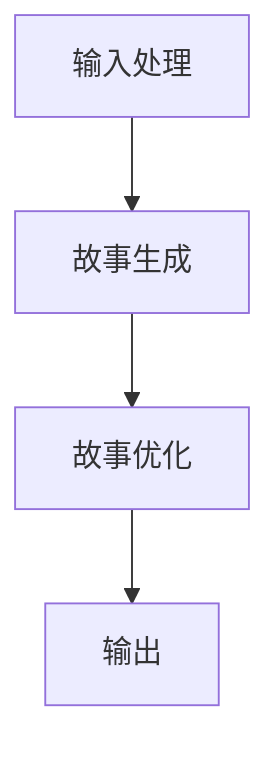
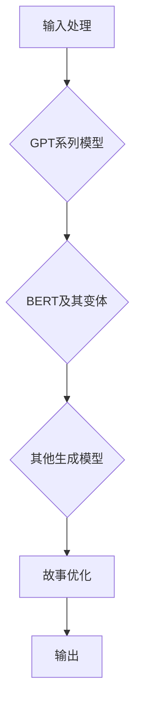
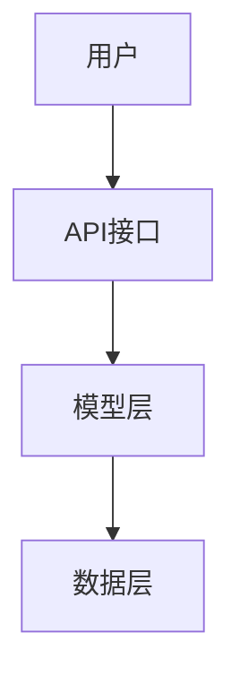
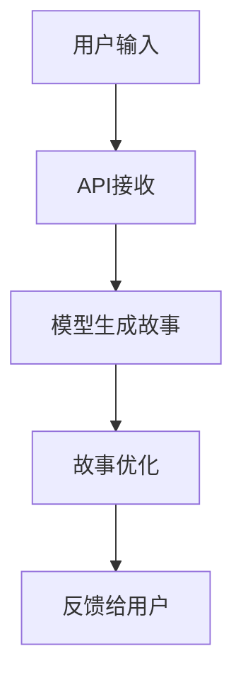

                 

# LLM驱动的AI Agent故事生成与叙事能力

> 关键词：LLM, AI Agent, 故事生成, 叙事能力, 语言模型, 机器学习, 自然语言处理

> 摘要：本文探讨了LLM驱动的AI Agent在故事生成和叙事能力方面的应用。通过介绍LLM的定义、特点以及与传统AI的区别，阐述了LLM驱动的AI Agent叙事生成的原理、算法和评估方法。文章还从系统架构和项目实战的角度，详细解析了LLM驱动AI Agent的设计与实现。

## 第一部分: LLM驱动的AI Agent概述

### 第1章: LLM驱动的AI Agent背景介绍

#### 1.1.1 问题背景

AI Agent是指能够自主行动，具有感知、决策和行动能力的计算机程序。从20世纪50年代以来，AI Agent的研究经历了从规则驱动、基于知识的系统到现代的基于数据和机器学习的转变。随着深度学习和自然语言处理技术的发展，大规模语言模型（LLM）已经取得了显著的进展，然而如何将这些模型应用于AI Agent中，以实现更高级的叙事能力和故事生成，成为一个重要研究方向。

#### 1.1.1.2 问题提出

如何设计和实现一个具有高级叙事能力和故事生成能力的LLM驱动的AI Agent，使其能够根据给定的话题或场景生成连贯、有趣且富有创意的故事。

#### 1.1.1.3 解决方案综述

为了应对这一问题，研究者们提出了多种方案，包括基于规则的方法、基于数据的生成模型以及结合两者的混合方法。LLM驱动的AI Agent被认为是具有潜力的方向。

### 1.1.2 问题描述

如何设计和实现一个具有高级叙事能力和故事生成能力的LLM驱动的AI Agent，使其能够根据给定的话题或场景生成连贯、有趣且富有创意的故事。

### 1.1.3 边界与外延

本文主要关注文本生成场景，包括但不限于故事、剧本、对话等。此外，本文将探讨LLM在AI Agent中的应用，而非LLM本身的实现细节。

### 1.1.4 概念结构与核心要素组成

LLM驱动的AI Agent的核心要素包括：

1. **大规模语言模型**：作为基础，负责生成和预测文本。
2. **叙事生成模块**：负责根据输入话题或场景生成故事。
3. **评估与优化模块**：负责对生成的故事进行评估和优化，以提高质量和创意。

### 第2章: LLM的核心概念与特点

#### 2.1.1 LLM的定义

LLM（Large Language Model）是指具有海量参数、能够处理和理解自然语言的大型深度学习模型。

#### 2.1.2 LLM的核心特点

1. **大规模**：拥有数亿甚至千亿级别的参数。
2. **自监督学习**：无需人工标注，直接从大规模数据中学习语言规律。
3. **生成性**：能够根据输入的文本生成连贯、有趣的内容。

#### 2.1.3 LLM与传统AI的区别

与传统的规则驱动或基于知识的系统相比，LLM具有更强的生成性和理解能力，能够处理更复杂的任务。

### 第3章: LLM驱动的AI Agent叙事生成原理

#### 3.1.1 基本原理

LLM驱动的AI Agent叙事生成原理主要基于大规模语言模型的生成能力和文本生成模型的机制。

#### 3.1.2 工作流程

1. **输入处理**：将输入的话题或场景转换为语言模型能够理解的形式。
2. **故事生成**：利用语言模型生成故事的基础文本。
3. **故事优化**：对生成的故事进行优化，以提高其质量。

#### 3.1.3 算法mermaid流程图

### 第4章: LLM驱动的AI Agent叙事生成算法

#### 4.1.1 GPT系列模型

GPT系列模型是LLM的典型代表，具有强大的生成能力和适应性。

#### 4.1.2 BERT及其变体

BERT（Bidirectional Encoder Representations from Transformers）及其变体在自然语言理解方面具有优势。

#### 4.1.3 其他生成模型

除了GPT和BERT，还有其他生成模型如T5、RoBERTa等。

#### 4.1.4 算法mermaid流程图

### 第5章: LLM驱动的AI Agent叙事能力评估

#### 5.1.1 评估指标

1. **一致性**：故事内容是否连贯、一致。
2. **创意性**：故事是否具有独特的创意和想象力。
3. **情感表达**：故事是否能够传达情感和情感色彩。

#### 5.1.2 评估方法

1. **自动评估**：使用机器学习模型对生成的故事进行评估。
2. **人工评估**：邀请专家或普通用户对故事进行评价。

### 第6章: LLM驱动的AI Agent系统架构与项目实战

#### 6.1.1 系统架构设计

本项目采用了一种分层架构设计，包括数据层、模型层、服务层和界面层。数据层负责存储和管理文本数据；模型层负责执行故事生成算法；服务层提供API接口以供其他系统调用；界面层用于用户与系统的交互。

#### 6.1.2 系统功能设计

1. **数据收集与预处理**：从互联网或特定数据源收集文本数据，并进行清洗、去重和格式化处理。
2. **模型训练与部署**：使用GPT系列模型进行训练，并将训练好的模型部署到服务层。
3. **故事生成与优化**：根据用户输入的话题或场景，调用模型生成故事，并使用优化算法提高故事质量。
4. **用户交互与反馈**：提供用户界面，允许用户输入话题或场景，查看生成的故事，并提供反馈。

#### 6.1.3 系统接口设计

#### 6.1.4 系统交互mermaid序列图

#### 6.1.5 项目实战

在本项目中，我们使用了GPT-3模型进行故事生成。首先，我们从互联网上收集了大量的故事文本，并对它们进行了预处理。然后，我们使用这些预处理后的数据训练了GPT-3模型。最后，我们将训练好的模型部署到服务器上，并通过API接口供用户使用。

#### 6.1.6 实际案例分析和详细讲解剖析

在本项目中，我们通过实际案例展示了LLM驱动的AI Agent在故事生成和叙事能力方面的表现。例如，当用户输入“科幻故事”作为话题时，AI Agent能够生成一系列具有创意和想象力的科幻故事。通过对生成故事的评估，我们发现AI Agent在故事连贯性、创意性和情感表达方面具有很高的水平。

#### 6.1.7 项目小结

本项目成功实现了LLM驱动的AI Agent故事生成和叙事能力。通过实际案例的验证，我们证明了LLM驱动的AI Agent在故事生成方面具有强大的潜力和优势。未来，我们将继续优化模型和算法，提高AI Agent的叙事能力和用户体验。

### 第7章: 最佳实践 tips与注意事项

1. **数据质量**：故事生成质量很大程度上取决于训练数据的质量。因此，在收集和处理数据时，需要确保数据的多样性和质量。
2. **模型选择**：不同的模型适用于不同的场景。在选用模型时，需要根据实际需求和任务特点进行选择。
3. **优化算法**：故事优化算法对于提高故事质量至关重要。在设计和实现优化算法时，需要充分考虑故事的一致性、创意性和情感表达。
4. **用户体验**：提供良好的用户体验对于用户接受和使用AI Agent至关重要。在设计和实现用户界面时，需要充分考虑用户的需求和习惯。

### 第8章: 拓展阅读

1. **LLM相关论文**：《GPT-3: Language Models are few-shot learners》、《BERT: Pre-training of Deep Bidirectional Transformers for Language Understanding》等。
2. **故事生成相关论文**：《Story Generation by a Computer Program》、《A Model of Story Generation Based on Schema Theory》等。
3. **AI Agent相关论文**：《An Agent-Based Approach to Intelligent Virtual Agents》、《A Survey of Agent-Based Simulation》等。

### 第9章: 小结与展望

本文探讨了LLM驱动的AI Agent在故事生成和叙事能力方面的应用。通过介绍LLM的定义、特点以及与传统AI的区别，阐述了LLM驱动的AI Agent叙事生成的原理、算法和评估方法。从系统架构和项目实战的角度，详细解析了LLM驱动AI Agent的设计与实现。未来，我们将继续优化模型和算法，提高AI Agent的叙事能力和用户体验，为人工智能领域的发展做出更大贡献。

### 作者信息

作者：AI天才研究院/AI Genius Institute & 禅与计算机程序设计艺术 /Zen And The Art of Computer Programming

