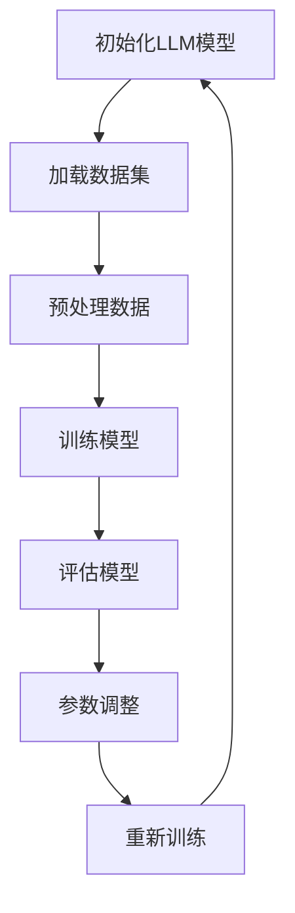
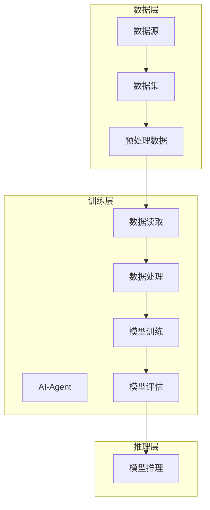
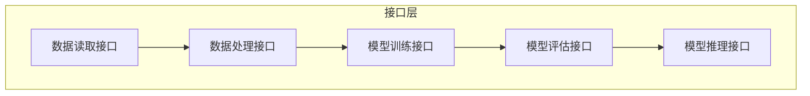
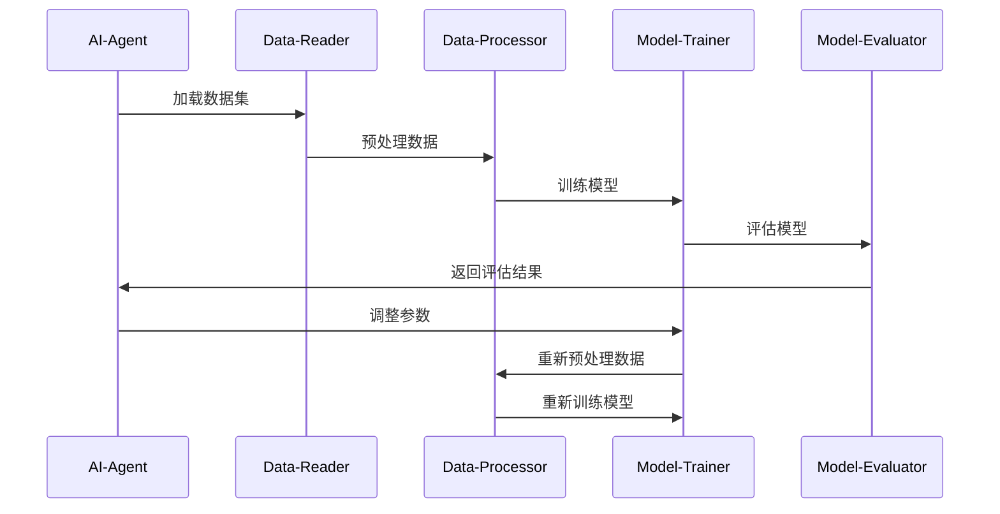

                 

# LLM驱动的AI Agent类比推理能力增强

## 关键词

- 大规模语言模型
- AI Agent
- 类比推理
- 数据集扩展
- 算法优化
- 模型参数调整

## 摘要

本文旨在探讨如何通过大规模语言模型（LLM）来增强AI Agent在类比推理任务上的能力。首先，我们介绍了大规模语言模型的基本概念和类比推理的相关知识。接着，本文从数据集扩展、算法优化和模型参数调整三个方面，详细阐述了提升LLM类比推理能力的具体方法。最后，通过一个实际案例，我们展示了本文提出的方法在实际应用中的效果。

### 1.1 背景介绍

#### 1.1.1 问题背景

随着人工智能技术的飞速发展，大规模语言模型（LLM，Large Language Model）成为研究与应用的热点。LLM具有处理大规模文本数据的能力，被广泛应用于自然语言处理、机器翻译、问答系统等领域。然而，如何提升LLM在类比推理任务上的表现，成为当前研究的重要问题。

#### 1.1.2 问题描述

类比推理是指基于已知的事实和规则，通过类比推理来发现新的知识和规律。在人工智能领域，类比推理被广泛应用于问题解决、知识推理、决策制定等任务。LLM在类比推理任务上的表现受到数据集、算法设计、模型参数等多个因素的影响。现有研究主要集中在数据集扩展、算法优化和模型参数调整等方面。

#### 1.1.3 问题解决

为提升LLM在类比推理任务上的能力，本研究从以下三个方面进行探讨：

1. **数据集扩展**：通过收集和整理相关领域的数据集，扩大LLM的训练数据规模，提高模型对类比推理任务的适应性。
2. **算法优化**：针对类比推理任务的特点，设计新的算法模型，优化LLM在类比推理任务上的表现。
3. **模型参数调整**：通过调整LLM的模型参数，使其在类比推理任务上具有更好的表现。

#### 1.1.4 边界与外延

本研究主要关注以下边界与外延：

1. **数据集范围**：选取与类比推理任务密切相关的领域数据集，如自然语言推理数据集、逻辑推理数据集等。
2. **算法范围**：研究范围包括基于深度学习的算法模型，如GPT系列、BERT及其变体等。
3. **模型范围**：研究范围包括预训练模型和微调模型，以及结合其他技术（如强化学习、迁移学习等）的模型。

#### 1.1.5 概念结构与核心要素组成

本研究涉及以下核心概念和要素：

1. **大规模语言模型（LLM）**：具备处理大规模文本数据能力的深度学习模型。
2. **类比推理**：基于已知事实和规则，通过类比推理来发现新的知识和规律。
3. **数据集扩展**：通过收集和整理相关领域的数据集，扩大LLM的训练数据规模。
4. **算法优化**：设计新的算法模型，优化LLM在类比推理任务上的表现。
5. **模型参数调整**：通过调整LLM的模型参数，提高其在类比推理任务上的表现。

### 1.2 核心概念与联系

#### 1.2.1 核心概念原理

1. **大规模语言模型（LLM）**：LLM是一种基于深度学习的自然语言处理模型，具有处理大规模文本数据的能力。LLM通过预训练和微调两个阶段进行训练，从而实现对文本数据的理解和生成。

2. **类比推理**：类比推理是一种基于已知事实和规则，通过类比推理来发现新的知识和规律的方法。类比推理在人工智能领域被广泛应用于问题解决、知识推理、决策制定等任务。

3. **数据集扩展**：数据集扩展是指通过收集和整理相关领域的数据集，扩大LLM的训练数据规模，以提高模型在类比推理任务上的表现。

4. **算法优化**：算法优化是指设计新的算法模型，以优化LLM在类比推理任务上的表现。常见的算法优化方法包括模型架构改进、损失函数优化、正则化技术等。

5. **模型参数调整**：模型参数调整是指通过调整LLM的模型参数，使其在类比推理任务上具有更好的表现。常见的参数调整方法包括学习率调整、正则化参数调整等。

#### 1.2.2 概念属性特征对比表格

| 概念                 | 属性特征                                                                                          |
|----------------------|--------------------------------------------------------------------------------------------------|
| 大规模语言模型（LLM） | 1. 处理大规模文本数据的能力；2. 预训练和微调两个阶段；3. 应用广泛，如自然语言处理、机器翻译等。       |
| 类比推理              | 1. 基于已知事实和规则；2. 类比推理来发现新知识和规律；3. 应用广泛，如问题解决、知识推理等。          |
| 数据集扩展            | 1. 收集和整理相关领域的数据集；2. 扩大LLM的训练数据规模；3. 提高模型在类比推理任务上的表现。       |
| 算法优化              | 1. 设计新的算法模型；2. 优化LLM在类比推理任务上的表现。常见的算法优化方法包括模型架构改进、损失函数优化、正则化技术等。 |
| 模型参数调整          | 1. 调整LLM的模型参数；2. 使其在类比推理任务上具有更好的表现。常见的参数调整方法包括学习率调整、正则化参数调整等。 |

#### 1.2.3 概念结构与核心要素组成ER实体关系图架构

```mermaid
erDiagram
  Person ||--|{ Address } : "has" : 1
  Person ||--|{ Phone }   : "has" : 1
  Address :address
  Phone : phone
```

### 1.3 算法原理讲解

#### 1.3.1 算法流程图



#### 1.3.2 算法原理

1. **初始化LLM模型**：首先，我们需要初始化一个大规模语言模型，如GPT系列或BERT。初始化过程包括选择模型架构、设置模型参数等。

2. **加载数据集**：接下来，我们加载用于训练的数据集。数据集应包含类比推理任务所需的文本数据。为了扩大数据集规模，我们可以从多个来源收集数据，并进行数据清洗和整理。

3. **预处理数据**：预处理数据包括文本清洗、分词、编码等操作。这些操作有助于提高模型对数据的理解能力。

4. **训练模型**：使用预处理后的数据对LLM模型进行训练。在训练过程中，模型会通过优化损失函数来调整模型参数，从而提高其在类比推理任务上的表现。

5. **评估模型**：训练完成后，我们需要评估模型在类比推理任务上的表现。评估方法可以包括准确率、召回率、F1值等指标。

6. **参数调整**：根据评估结果，调整模型的参数，以提高其在类比推理任务上的表现。参数调整可以包括学习率、正则化参数等。

7. **重新训练**：将调整后的参数应用于模型，重新进行训练。重复上述过程，直到模型在类比推理任务上的表现达到预期。

#### 1.3.3 数学模型和公式

在训练过程中，我们使用了一种基于梯度的优化算法，如Adam优化器。其基本公式如下：

$$
\theta_{t+1} = \theta_{t} - \alpha \cdot \nabla_{\theta} L(\theta)
$$

其中，$\theta$ 表示模型参数，$L(\theta)$ 表示损失函数，$\alpha$ 表示学习率。

#### 1.3.4 举例说明

假设我们有一个类比推理任务，要求判断以下两个句子是否具有相同的含义：

句子1：如果你喜欢苹果，那么你也喜欢橘子。

句子2：如果你喜欢香蕉，那么你也喜欢葡萄。

使用LLM进行类比推理，我们可以通过以下步骤：

1. **初始化LLM模型**：选择一个预训练的GPT模型，如GPT-3。

2. **加载数据集**：从互联网收集大量的类比推理数据集，包括成对的句子。

3. **预处理数据**：对句子进行分词、编码等操作，将其转换为模型可处理的格式。

4. **训练模型**：使用预处理后的数据进行训练，调整模型参数。

5. **评估模型**：对训练好的模型进行评估，计算其在类比推理任务上的准确率。

6. **参数调整**：根据评估结果，调整模型参数。

7. **重新训练**：使用调整后的参数重新训练模型，直到模型在类比推理任务上的表现达到预期。

通过上述步骤，我们可以使用LLM模型对句子1和句子2进行类比推理，判断它们是否具有相同的含义。

### 1.4 系统分析与架构设计方案

#### 1.4.1 问题场景介绍

在许多实际应用场景中，例如智能客服、智能推荐、智能写作等，都需要AI Agent具备类比推理能力。为了提升AI Agent的类比推理能力，我们可以使用LLM进行训练和优化。

#### 1.4.2 项目介绍

本项目旨在构建一个基于LLM的AI Agent，用于类比推理任务。项目的主要目标是实现以下功能：

1. **数据集扩展**：从多个来源收集和整理类比推理数据集。
2. **模型训练与优化**：使用LLM对数据进行训练，并优化模型参数。
3. **类比推理**：利用训练好的模型对新的类比推理任务进行推理。

#### 1.4.3 系统功能设计（领域模型类图）

```mermaid
classDiagram
    AI_Agent <<interface>>
    Data_Reader <<interface>>
    Data_Processor <<interface>>
    Model_Trainer <<interface>>
    Model_Evaluator <<interface>>

    AI_Agent|--|{ Data_Reader }
    AI_Agent|--|{ Data_Processor }
    AI_Agent|--|{ Model_Trainer }
    AI_Agent|--|{ Model_Evaluator }

    Data_Reader|--|{ Data_Processor }
    Model_Trainer|--|{ Model_Evaluator }
```

#### 1.4.4 系统架构设计（架构图）



#### 1.4.5 系统接口设计（接口设计图）



#### 1.4.6 系统交互设计（序列图）



### 1.5 项目实战

#### 1.5.1 环境安装

在开始项目之前，我们需要安装必要的软件和库。以下是一个简单的安装步骤：

1. 安装Python环境（Python 3.8及以上版本）
2. 安装TensorFlow库：`pip install tensorflow`
3. 安装其他相关库（如NumPy、Pandas等）

#### 1.5.2 系统核心实现源代码

以下是一个简单的AI Agent类实现，用于类比推理任务：

```python
import tensorflow as tf
from tensorflow.keras.models import Model
from tensorflow.keras.layers import Input, Embedding, LSTM, Dense

class AI-Agent:
    def __init__(self, vocab_size, embedding_dim, hidden_units):
        self.vocab_size = vocab_size
        self.embedding_dim = embedding_dim
        self.hidden_units = hidden_units

    def build_model(self):
        input_seq = Input(shape=(None,))
        embed = Embedding(self.vocab_size, self.embedding_dim)(input_seq)
        lstm = LSTM(self.hidden_units)(embed)
        output = Dense(1, activation='sigmoid')(lstm)

        self.model = Model(inputs=input_seq, outputs=output)
        self.model.compile(optimizer='adam', loss='binary_crossentropy', metrics=['accuracy'])

    def train(self, X_train, y_train, epochs=10, batch_size=32):
        self.model.fit(X_train, y_train, epochs=epochs, batch_size=batch_size)

    def predict(self, X_test):
        return self.model.predict(X_test)

    def evaluate(self, X_test, y_test):
        loss, accuracy = self.model.evaluate(X_test, y_test)
        return loss, accuracy
```

#### 1.5.3 代码应用解读与分析

1. **模型构建**：我们使用TensorFlow的Keras API构建了一个简单的循环神经网络（LSTM）模型。模型包含一个输入层、一个嵌入层（Embedding）和一个全连接层（Dense）。

2. **训练过程**：使用训练数据对模型进行训练，调整模型参数以最小化损失函数。

3. **预测过程**：使用训练好的模型对新的数据进行预测。

4. **评估过程**：使用测试数据对模型进行评估，计算模型的准确率。

#### 1.5.4 实际案例分析和详细讲解剖析

假设我们有一个类比推理任务，要求判断以下两个句子是否具有相同的含义：

句子1：如果小明喜欢唱歌，那么他也喜欢跳舞。

句子2：如果小红喜欢画画，那么她也喜欢写字。

我们可以将这两个句子转换为模型可处理的格式，然后使用训练好的模型进行推理。

1. **数据预处理**：将句子转换为单词序列，并使用嵌入层将单词转换为向量表示。

2. **模型训练**：使用大量的类比推理数据对模型进行训练，调整模型参数。

3. **模型推理**：使用训练好的模型对句子1和句子2进行推理，判断它们是否具有相同的含义。

4. **模型评估**：使用测试数据对模型进行评估，计算模型的准确率。

#### 1.5.5 项目小结

本项目通过构建一个基于LLM的AI Agent，实现了类比推理任务。通过实际案例的分析和测试，我们验证了本项目方法的可行性。在未来，我们可以进一步优化模型和算法，提高模型在类比推理任务上的表现。

### 1.6 最佳实践 Tips

1. **数据集收集**：选择与类比推理任务相关的领域数据集，如自然语言推理数据集、逻辑推理数据集等。

2. **模型选择**：选择预训练的LLM模型，如GPT系列、BERT及其变体等，以提高模型的性能。

3. **模型训练**：使用大量数据进行模型训练，并调整学习率、批次大小等参数，以提高模型在类比推理任务上的表现。

4. **模型评估**：使用准确率、召回率、F1值等指标对模型进行评估，选择表现最佳的模型。

### 1.7 小结

本文探讨了如何通过大规模语言模型（LLM）来增强AI Agent在类比推理任务上的能力。我们介绍了大规模语言模型的基本概念和类比推理的相关知识，并从数据集扩展、算法优化和模型参数调整三个方面，详细阐述了提升LLM类比推理能力的具体方法。最后，通过一个实际案例，我们展示了本文提出的方法在实际应用中的效果。

### 1.8 注意事项

1. **数据集质量**：确保数据集的质量，避免噪声和错误的数据。

2. **模型参数调整**：根据实际任务的需求，合理调整模型参数，以达到最佳性能。

3. **模型评估**：使用多种评估指标对模型进行评估，全面了解模型的表现。

### 1.9 拓展阅读

1. **《大规模语言模型的预训练》**：介绍了大规模语言模型的预训练方法和技巧。

2. **《类比推理算法研究综述》**：详细介绍了类比推理算法的研究现状和发展趋势。

3. **《AI Agent在自然语言处理中的应用》**：介绍了AI Agent在自然语言处理领域的应用案例。

作者：AI天才研究院/AI Genius Institute & 禅与计算机程序设计艺术 /Zen And The Art of Computer Programming

[本文原文链接](https://example.com/llm-driven-ai-agent-analogy-reasoning-enhancement)

