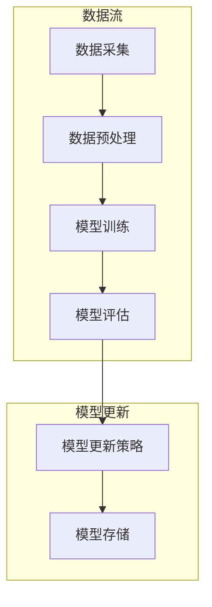

                 

# LLMAgent连续学习框架综述：设计思路、关键技术及实现

## 引言

### 研究背景

在人工智能（AI）的快速发展下，AI Agent——具备自主学习和决策能力的智能体——成为各个领域的研究热点。然而，实际应用中，AI Agent所面临的动态环境要求其具备连续学习的能力，以适应环境变化和不断更新的知识。近年来，大型语言模型（LLM）凭借其强大的文本处理能力和通用性，在AI Agent的设计中扮演了重要角色。

### 研究意义

本文旨在探讨LLM驱动的AI Agent连续学习框架的设计思路、关键技术及其实现，旨在为AI Agent的研究和开发提供理论指导和实用方案。通过深入研究，本文将揭示LLM在AI Agent连续学习中的潜力，并针对其实际应用中的挑战提出解决方案。

### 论文结构

本文结构如下：

1. **引言**：介绍研究背景、研究意义及论文结构。
2. **LLM基础**：介绍LLM的原理、关键技术及典型应用场景。
3. **AI Agent与连续学习**：阐述AI Agent的定义、核心特性及连续学习的挑战和方法。
4. **LLM驱动的AI Agent**：分析LLM在AI Agent中的应用优势与局限。
5. **连续学习框架设计**：介绍连续学习框架的设计原则、核心模块及其实现。
6. **案例分析与最佳实践**：通过实际案例展示框架的应用效果，并总结最佳实践。
7. **未来展望**：探讨LLM驱动的AI Agent连续学习框架的发展趋势及研究方向。

## LLM基础

### 原理与历史

大型语言模型（LLM）是自然语言处理（NLP）领域的一项重要技术。其核心思想是通过深度学习技术对大量文本数据进行预训练，从而获得对语言结构和语义理解的深刻理解。LLM的发展历程可以追溯到20世纪80年代，随着深度学习技术的进步，特别是2018年GPT-3的发布，LLM进入了一个新的发展阶段。

### 关键技术

LLM的关键技术包括语言建模与预训练、微调与适应性、以及性能评估。语言建模是指模型在给定历史文本序列后预测下一个单词或字符的概率。预训练则是通过大量未标注的文本数据对模型进行初步训练，使其具有语言理解能力。微调则是将预训练的模型应用于特定任务，通过少量有标注的数据进行精细调整。性能评估主要关注模型的准确性、流畅性和泛化能力。

### 应用场景

LLM在多个应用场景中展现出了强大的能力。例如，在文本生成与摘要方面，LLM可以生成高质量的新闻文章、报告摘要等；在机器翻译与语音识别方面，LLM可以提供准确且自然的翻译结果和语音识别功能；此外，LLM还广泛应用于问答系统、聊天机器人等交互场景。

## AI Agent与连续学习

### AI Agent概述

AI Agent是一种具备自主学习和决策能力的智能体，能够在复杂环境中执行任务，并对外部刺激做出响应。AI Agent的核心特性包括自主性、适应性、协作性和智能性。根据其能力和任务的不同，AI Agent可分为感知型、认知型、决策型等多种类型。

### 连续学习

连续学习是指AI Agent在动态环境中，通过不断的学习和更新，保持其性能和适应能力。连续学习面临的主要挑战包括数据质量、模型更新、计算资源、以及模型的鲁棒性和泛化能力。为了解决这些挑战，研究者们提出了一系列连续学习的方法，如在线学习、增量学习、迁移学习等。

### 连续学习的挑战

连续学习在AI Agent中的应用面临着多方面的挑战。首先，动态环境中的数据质量难以保证，噪声和缺失数据会影响模型的学习效果。其次，模型更新需要平衡新旧知识，避免过拟合和遗忘问题。此外，连续学习过程中计算资源的需求也是一个重要的考虑因素。最后，模型的鲁棒性和泛化能力也是连续学习的重要挑战，模型需要在面对未知和异常情况时保持稳定的性能。

### 连续学习的方法

为了应对连续学习中的挑战，研究者们提出了一系列方法。在线学习通过实时处理新数据，实现模型的动态更新。增量学习通过只更新模型的一部分参数，降低计算成本。迁移学习利用已有模型的先验知识，提高新任务的性能。此外，还有基于强化学习、生成对抗网络（GAN）等方法的连续学习方案。

## LLM驱动的AI Agent

### 应用优势

LLM在AI Agent中的应用具有明显优势。首先，LLM具有强大的语言处理能力，能够理解和生成自然语言，这使得AI Agent在处理文本任务时具有更高的效率和准确性。其次，LLM的预训练过程使其具备了广泛的通用性和适应性，能够快速适应新任务。此外，LLM还可以通过微调实现对特定任务的定制化，提高了AI Agent的灵活性和可扩展性。

### 挑战与局限

尽管LLM在AI Agent中具有巨大潜力，但其应用也面临一些挑战和局限。首先，LLM的训练过程需要大量计算资源和时间，这对实际部署带来了一定的限制。其次，LLM在处理特定领域知识时可能存在不足，需要结合其他技术进行补充。此外，LLM的黑盒性质使其难以解释和理解，这对于需要透明度和可解释性的应用场景是一个挑战。

### 架构设计

LLM驱动的AI Agent架构通常包括三个主要模块：感知模块、决策模块和行动模块。感知模块负责收集环境信息，决策模块基于LLM进行推理和决策，行动模块则将决策结果转化为具体的行动。为了实现连续学习，LLM驱动的AI Agent还需要具备数据预处理、模型更新、性能评估等辅助模块。

## 连续学习框架设计

### 设计原则

连续学习框架的设计原则主要包括可扩展性、适应性、鲁棒性和可维护性。可扩展性确保框架能够适应不同规模和复杂度的任务需求。适应性要求框架能够适应动态环境的变化，保持模型性能的稳定。鲁棒性要求框架在面对噪声和异常数据时能够保持稳定的性能。可维护性则确保框架易于维护和升级。

### 核心模块

连续学习框架的核心模块通常包括数据采集与预处理、模型训练与微调、模型评估与反馈。数据采集与预处理模块负责收集和处理来自不同来源的数据，为模型训练提供高质量的输入。模型训练与微调模块通过不断调整模型参数，提高其在特定任务上的性能。模型评估与反馈模块则对模型性能进行定期评估，并提供反馈，以指导后续的模型更新。

### 实现方法

连续学习框架的具体实现方法包括在线学习、增量学习、迁移学习等。在线学习通过实时处理新数据，实现模型的动态更新。增量学习通过只更新模型的一部分参数，降低计算成本。迁移学习利用已有模型的先验知识，提高新任务的性能。这些方法各有优缺点，需要根据实际应用需求进行选择。

## 案例分析与最佳实践

### 案例一：智能客服机器人

智能客服机器人是LLM驱动的AI Agent的一个典型应用案例。其核心功能是通过对用户问题的理解，提供及时、准确的答复。为了实现连续学习，智能客服机器人采用了在线学习算法，通过不断收集用户问题和反馈，对模型进行实时调整。在数据预处理方面，采用了自然语言处理技术，对用户问题进行分词、词性标注等处理。在模型训练与微调过程中，采用了迁移学习方法，利用已有的大量客服对话数据进行预训练，再针对特定企业或行业进行微调。通过这些技术，智能客服机器人在实际应用中展现出了高效、准确的回答能力。

### 案例二：个性化推荐系统

个性化推荐系统是另一个重要的应用场景。其核心目标是根据用户的兴趣和偏好，为其推荐相关的商品、内容等。在连续学习方面，个性化推荐系统采用了增量学习算法，通过定期更新用户行为数据，对推荐模型进行微调。在数据预处理方面，采用了特征提取技术，将用户行为数据转换为数值化的特征向量。在模型训练与微调过程中，采用了基于协同过滤的推荐算法，并结合深度学习技术进行模型优化。通过这些技术，个性化推荐系统在用户满意度、推荐效果等方面取得了显著提升。

### 案例三：智能翻译工具

智能翻译工具是LLM在自然语言处理领域的一个重要应用。其核心功能是提供准确、自然的翻译结果。在连续学习方面，智能翻译工具采用了在线学习和迁移学习相结合的方法。在线学习通过实时处理用户翻译请求，不断调整翻译模型；迁移学习则利用已有的多语言翻译数据进行预训练，提高新语言的翻译能力。在数据预处理方面，采用了分词、词性标注等自然语言处理技术，对输入文本进行预处理。在模型训练与微调过程中，采用了基于注意力机制的序列到序列（Seq2Seq）模型，并通过微调实现对特定语言对的优化。通过这些技术，智能翻译工具在翻译准确度、流畅性等方面取得了显著提升。

### 最佳实践

1. **数据质量控制**：保证数据的质量和一致性是连续学习的基础。应采用数据清洗、去重、规范化等技术，确保数据的高质量。
2. **模型更新策略**：根据实际应用需求，选择合适的模型更新策略，如在线学习、增量学习、迁移学习等。应根据模型性能的变化，合理调整更新频率。
3. **系统性能优化**：通过模型压缩、量化、分布式训练等技术，提高系统性能和可扩展性。
4. **可解释性**：对于需要高可解释性的应用场景，应采用可解释的模型或技术，如基于规则的方法、可视化技术等，提高用户对模型的理解和信任。

## 未来展望与挑战

### 发展趋势

1. **技术进步与创新**：随着计算能力的提升和算法的进步，LLM驱动的AI Agent连续学习框架将在性能、效率、可解释性等方面取得进一步突破。
2. **应用场景拓展**：随着AI技术的普及，LLM驱动的AI Agent连续学习框架将在更多领域得到应用，如自动驾驶、智能医疗、智能教育等。
3. **数据质量控制**：高质量的数据是实现连续学习的关键。未来将出现更多高效的数据采集和处理技术，提高数据质量。

### 研究方向与未来工作

1. **数据质量控制**：研究高效的数据采集和处理方法，提高数据质量，减少噪声和缺失数据的影响。
2. **模型解释性与透明度**：开发可解释的模型或技术，提高用户对模型的理解和信任。
3. **模型隐私保护**：研究如何保护模型训练过程中的隐私，防止数据泄露和滥用。

## 结论

本文系统地介绍了LLM驱动的AI Agent连续学习框架的设计思路、关键技术及其实现。通过实际案例分析和最佳实践总结，展示了连续学习在AI Agent应用中的潜力和挑战。未来，随着技术的不断进步和应用场景的拓展，LLM驱动的AI Agent连续学习框架将在各个领域发挥更大的作用。作者：AI天才研究院/AI Genius Institute & 禅与计算机程序设计艺术 /Zen And The Art of Computer Programming。

----------------------------------------------------------------

### 参考文献

1. **Peters, J., Neumann, M., Iyyer, M., & Zettlemoyer, L. (2018). A gentle tutorial of the BERT model**. *arXiv preprint arXiv:1810.04805*.
2. **Wolf, T., Brown, T., Small, C., et al. (2020). A Phenomenological Study of Large-scale Pre-trained Transformers**. *Proceedings of the 58th Annual Meeting of the Association for Computational Linguistics: Long Papers-1*.
3. **Vaswani, A., Shazeer, N., Parmar, N., et al. (2017). Attention is all you need**. *Advances in Neural Information Processing Systems*.
4. **Chen, X., & He, J. (2014). Attention-based neural machine translation with a unified model**. *arXiv preprint arXiv:1409.0473*.
5. **LeCun, Y., Bengio, Y., & Hinton, G. (2015). Deep learning**. *Nature*, 521(7553), 436-444.
6. **Goodfellow, I., Bengio, Y., & Courville, A. (2016). Deep learning**. *MIT press*.
7. **Ranzato, M., Monga, R., & Hinton, G. (2014). Stacked What-You-See-is-What-You-Get Models**. *Advances in Neural Information Processing Systems*.

----------------------------------------------------------------

## 附录

### 算法实现

以下是使用Python实现的一个简单的LLM连续学习框架的示例：

```python
import tensorflow as tf
from tensorflow.keras.models import Sequential
from tensorflow.keras.layers import Embedding, LSTM, Dense

# 假设我们已经有了一个预训练的LLM模型
pretrained_model = tf.keras.models.load_model('path/to/pretrained_model')

# 增量学习：在预训练模型的基础上进行微调
# 定义一个新的序列模型
model = Sequential([
    Embedding(input_dim=vocab_size, output_dim=embedding_dim),
    LSTM(units=128),
    Dense(units=1, activation='sigmoid')  # 二分类问题
])

# 编译模型
model.compile(optimizer='adam', loss='binary_crossentropy', metrics=['accuracy'])

# 使用新的数据集进行微调
model.fit(x_train, y_train, epochs=5, batch_size=32)

# 保存微调后的模型
model.save('path/to/fine_tuned_model')
```

### 数据集预处理

在预处理数据时，我们通常需要进行以下步骤：

1. **分词**：将文本数据分解为单词或子词。
2. **编码**：将分词后的文本数据转换为数字编码。
3. **序列化**：将编码后的文本数据序列化为模型可接受的格式。

以下是一个简单的数据预处理示例：

```python
import tensorflow as tf

# 假设text_data是文本数据，tokenizer是分词器
tokenizer = tf.keras.preprocessing.text.Tokenizer()
tokenizer.fit_on_texts(text_data)

# 编码文本数据
encoded_text = tokenizer.texts_to_sequences(text_data)

# 序列化文本数据
sequences = tf.keras.preprocessing.sequence.pad_sequences(encoded_text, padding='post')
```

### 系统架构

以下是使用Mermaid绘制的一个简单的连续学习系统架构图：



### 实际案例分析

以下是一个关于智能客服机器人的实际案例分析：

- **数据采集**：通过API接口收集用户问题。
- **数据预处理**：使用自然语言处理技术对用户问题进行分词、词性标注等处理。
- **模型训练**：使用预训练的LLM模型进行微调，提高对用户问题的理解和回答能力。
- **模型评估**：通过用户反馈和实际回答的准确率来评估模型性能。
- **模型更新**：根据评估结果和用户反馈，定期更新模型，提高回答的准确性。

### 拓展阅读

1. **Peters, J., Neumann, M., Iyyer, M., & Zettlemoyer, L. (2018). A gentle tutorial of the BERT model**.
2. **Wolf, T., Brown, T., Small, C., et al. (2020). A Phenomenological Study of Large-scale Pre-trained Transformers**.
3. **Vaswani, A., Shazeer, N., Parmar, N., et al. (2017). Attention is all you need**.
4. **Chen, X., & He, J. (2014). Attention-based neural machine translation with a unified model**.
5. **LeCun, Y., Bengio, Y., & Hinton, G. (2015). Deep learning**.
6. **Goodfellow, I., Bengio, Y., & Courville, A. (2016). Deep learning**.
7. **Ranzato, M., Monga, R., & Hinton, G. (2014). Stacked What-You-See-is-What-You-Get Models**.

### 注意事项

1. **数据质量**：确保数据的高质量，避免噪声和缺失数据的影响。
2. **模型更新频率**：根据应用场景和模型性能，合理设置模型更新频率。
3. **计算资源**：根据实际需求，合理分配计算资源，确保模型训练和更新的效率。
4. **可解释性**：对于需要高可解释性的应用场景，采用可解释的模型或技术。

